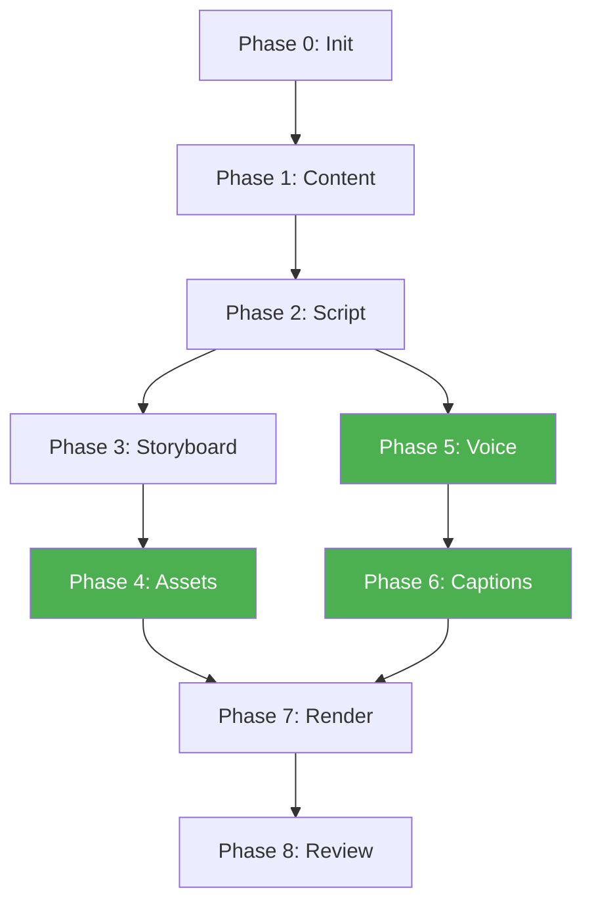

# Video Production Workflow

一个命令，完成从知识地图到教育视频的完整生产流程。自动跳过已完成的阶段。

## 使用方法

```bash
/video-prod                        # 启动/继续完整流程
/video-prod reset                  # 重置状态，从头开始
/video-prod status                 # 查看当前进度
/video-prod skip                   # 跳过当前阶段
/video-prod goto <phase>           # 跳转到指定阶段
/video-prod --topic conv_layer     # 指定主题
/video-prod --course deep-learning # 指定课程
```

## 理论基础

> 本工作流的每个阶段都有教科书来源支撑，不是凭空设计。

| 教科书 | 指导阶段 | 核心理论 |
|--------|---------|---------|
| Mayer《Multimedia Learning》 | Phase 2, 3, 8 | 12条多媒体学习原则 |
| Clark & Mayer《e-Learning》 | Phase 1, 2 | 教学设计流程与分段策略 |
| McKee《Story》 | Phase 2 | 五幕叙事结构 |
| Snyder《Save the Cat》 | Phase 2 | 15拍子表节奏控制 |
| Heath《Made to Stick》 | Phase 2, 8 | SUCCESs 粘性框架 |
| Williams《Animator's Survival Kit》 | Phase 4 | 动画12原则 |
| Williams《Non-Designer's Design Book》 | Phase 3, 4 | CRAP 视觉设计原则 |
| Knaflic《Storytelling with Data》 | Phase 3, 4 | 数据可视化叙事 |

### 教科书 Markdown 路径

> 所有教科书均已通过 MinerU 转换完成，可直接引用验证。

| Key | Markdown 路径 |
|-----|---------------|
| `mayer_multimedia_learning` | `data/mineru_output/mayer_multimedia_learning/mayer_multimedia_learning/hybrid_auto/mayer_multimedia_learning.md` |
| `clark_mayer_elearning` | `data/mineru_output/clark_mayer_elearning/clark_mayer_elearning/hybrid_auto/clark_mayer_elearning.md` |
| `mckee_story` | `data/mineru_output/mckee_story/mckee_story/auto/mckee_story.md` |
| `snyder_save_the_cat` | `data/mineru_output/snyder_save_the_cat/snyder_save_the_cat/auto/snyder_save_the_cat.md` |
| `heath_made_to_stick` | `data/mineru_output/heath_made_to_stick/heath_made_to_stick/hybrid_auto/heath_made_to_stick.md` |
| `williams_animators_survival_kit` | `data/mineru_output/williams_animators_survival_kit/williams_animators_survival_kit/auto/williams_animators_survival_kit.md` |
| `williams_non_designers_design_book` | `data/mineru_output/williams_non_designers_design_book/williams_non_designers_design_book/auto/williams_non_designers_design_book.md` |
| `knaflic_storytelling_with_data` | `data/mineru_output/knaflic_storytelling_with_data/knaflic_storytelling_with_data/auto/knaflic_storytelling_with_data.md` |

## 工作流阶段

| 阶段 | 名称 | 角色 | 产出物 | 检查点 |
|------|------|------|--------|--------|
| 0 | 初始化 (init) | — | `.video-state.yaml` | ✓ 状态文件创建 |
| 1 | 内容提取 (content) | Content Researcher | `content_brief.json` | ✓ 文件存在且含来源 |
| 2 | 脚本写作 (script) | Script Writer | `script.json` | ✓ 铁律检查通过 |
| 3 | 分镜设计 (storyboard) | Visual Designer | `storyboard.json` | ✓ 每段有视觉描述 |
| 4 | 素材制作 (assets) | Animator | `assets/` | ✓ 所有场景组件就绪 |
| 5 | 语音合成 (voice) | Voice Engineer | `narration/` | ✓ 音频文件完整 |
| 6 | 字幕生成 (captions) | (自动) | `captions.json` | ✓ 时间戳对齐 |
| 7 | 组装渲染 (render) | Editor | `final.mp4` | ✓ 视频可播放 |
| 8 | 质量审查 (review) | QA Reviewer | `review_report.md` | ✓ 所有检查通过 |

## 依赖关系



> Phase 4 (素材) 和 Phase 5+6 (语音+字幕) 可以并行

## 铁律（违反任何一条 = 废稿重写）

1. **先定义后使用** — 每个名词必须先白话解释再给专业名称
2. **来源标注** — 每段旁白必须标注引自哪个维度文件的哪个 section
3. **无未定义名词** — 不出现前面没有解释过的专业术语

## 目录结构

```
video-content/{course}/{topic}/
├── .video-state.yaml          # 状态文件
├── content_brief.json         # Phase 1 输出
├── script.json                # Phase 2 输出
├── script_tts.txt             # Phase 2 输出（TTS专用纯文本）
├── storyboard.json            # Phase 3 输出
├── assets/                    # Phase 4 输出
│   ├── scene_01/
│   ├── scene_02/
│   └── ...
├── narration/                 # Phase 5 输出
│   ├── segment_01.wav
│   ├── segment_02.wav
│   ├── full_narration.mp3
│   └── timestamps.json
├── captions.json              # Phase 6 输出
├── final.mp4                  # Phase 7 输出
├── review_report.md           # Phase 8 输出
└── EDITING_GUIDE.md           # 剪辑指南
```

## 参考项目

| 项目 | 来源 | 我们借鉴了什么 |
|------|------|---------------|
| short-video-maker | `.github/short-video-maker/` | Remotion 渲染架构、Scene 模型、Whisper 字幕 |
| ai-video-generation-workflow | `.github/ai-video-generation-workflow/` | 模块化7步流水线、时间轴同步、可单步重跑 |
| video-creator | `.github/video-creator/` | Prefect 编排、manual approval 门控 |

---

## 各阶段设计文档

详见 `steps/` 目录：

| 文件 | 阶段 |
|------|------|
| [step-00-init.md](steps/step-00-init.md) | 初始化 |
| [step-01-content.md](steps/step-01-content.md) | 内容提取 |
| [step-02-script.md](steps/step-02-script.md) | 脚本写作 |
| [step-03-storyboard.md](steps/step-03-storyboard.md) | 分镜设计 |
| [step-04-assets.md](steps/step-04-assets.md) | 素材制作 |
| [step-05-voice.md](steps/step-05-voice.md) | 语音合成 |
| [step-06-captions.md](steps/step-06-captions.md) | 字幕生成 |
| [step-07-render.md](steps/step-07-render.md) | 组装渲染 |
| [step-08-review.md](steps/step-08-review.md) | 质量审查 |
