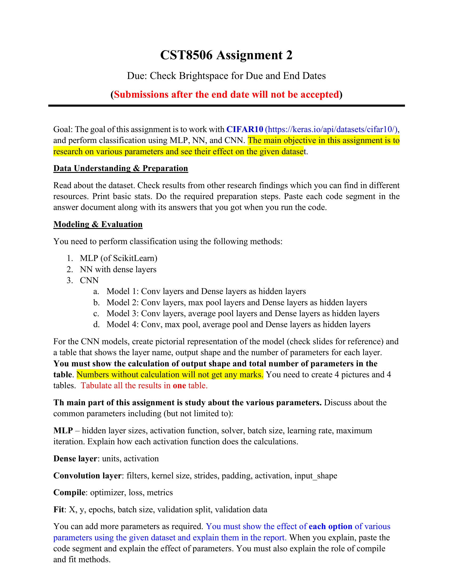

# CST8506 Assignment 2: CIFAR-10 分类 (CIFAR-10 Classification)

> Source: `CST8506_Assignment_2.pdf`
> Total pages: 2
> Course: CST8506 Machine Learning

---

## 1. 作业目标 (Goal)

- The goal of this assignment is to work with CIFAR-10 and perform classification using MLP, NN, and CNN — 本作业目标是使用 CIFAR-10 数据集，分别用 MLP、NN 和 CNN 进行分类
- The main objective is to research on various parameters and see their effect on the given dataset — 核心目标是研究各种参数并观察它们对数据集的影响
- Dataset: <https://keras.io/api/datasets/cifar10/> — 数据集来源：Keras 内置 CIFAR-10

---

## 2. 数据理解与准备 (Data Understanding & Preparation)

- Read about the dataset — 阅读并了解数据集
- Check results from other research findings which you can find in different resources — 查阅其他研究成果作为参考
- Print basic stats — 打印基本统计信息
- Do the required preparation steps — 完成所需的数据准备步骤
- Paste each code segment in the answer document along with its answers that you got when you run the code — 将每段代码和运行结果截图粘贴到答案文档中

---

## 3. 建模与评估 (Modeling & Evaluation)

You need to perform classification using the following methods — 需要使用以下方法进行分类：

1. **MLP** (of ScikitLearn) — MLP（使用 ScikitLearn）
2. **NN** with dense layers — 全连接神经网络（仅 Dense 层）
3. **CNN** — 卷积神经网络
   - a. **Model 1**: Conv layers and Dense layers as hidden layers — 卷积层 + 全连接层
   - b. **Model 2**: Conv layers, max pool layers and Dense layers as hidden layers — 卷积层 + 最大池化层 + 全连接层
   - c. **Model 3**: Conv layers, average pool layers and Dense layers as hidden layers — 卷积层 + 平均池化层 + 全连接层
   - d. **Model 4**: Conv, max pool, average pool and Dense layers as hidden layers — 卷积层 + 最大池化 + 平均池化 + 全连接层

---

## 4. CNN 模型要求 (CNN Model Requirements)

- For the CNN models, create **pictorial representation** of the model (check slides for reference) — 为每个 CNN 模型创建**架构图**（参考课件）
- Create a **table** that shows the layer name, output shape and the number of parameters for each layer — 创建**参数表**，包含每层的层名、输出形状和参数数量
- **⚠️ You must show the calculation of output shape and total number of parameters in the table. Numbers without calculation will not get any marks.** — **⚠️ 必须展示 output shape 和参数数量的计算过程。只写数字不给分。**
- You need to create **4 pictures and 4 tables** — 需要创建 **4 张架构图和 4 个参数表**
- Tabulate all the results in one table — 将所有结果汇总到一张表中

---

## 5. 参数研究 (Parameter Study)

The main part of this assignment is study about the various parameters — 本作业的核心部分是研究各种参数

Discuss about the common parameters including (but not limited to) — 讨论常见参数，包括但不限于：

- **MLP** – hidden layer sizes, activation function, solver, batch size, learning rate, maximum iteration — MLP 参数：隐藏层大小、激活函数、求解器、批大小、学习率、最大迭代次数
- **Explain how each activation function does the calculations** — **解释每种激活函数的计算方式**
- **Dense layer**: units, activation — 全连接层参数：神经元数量、激活函数
- **Convolution layer**: filters, kernel size, strides, padding, activation, input_shape — 卷积层参数：滤波器数量、卷积核大小、步长、填充方式、激活函数、输入形状
- **Compile**: optimizer, loss, metrics — 编译参数：优化器、损失函数、评估指标
- **Fit**: X, y, epochs, batch size, validation split, validation data — 训练参数：数据、迭代次数、批大小、验证集划分

You can add more parameters as required — 可以根据需要添加更多参数

- You must show the effect of each option of various parameters using the given dataset and explain them in the report — 必须用 CIFAR-10 数据集展示每个参数选项的效果，并在报告中解释
- When you explain, paste the code segment and explain the effect of parameters — 解释时粘贴代码段并说明参数的效果
- You must also explain the role of compile and fit methods — 还必须解释 compile 和 fit 方法的作用

---

## 6. 提交要求 (Submission Details)

- This is an **individual** assignment — 这是**个人**作业
- Assignment should have a **cover page** with the name (Last name, first name) and student number — 作业需要**封面页**，包含姓名和学号
- Your answer document should have **screenshots of every code segment** along with their answers and required explanation — 答案文档需要包含**每段代码的截图**及其运行结果和解释
- You must submit your **answer document** AND your **Colab notebook** — 必须提交**答案文档**和 **Colab notebook** 两个文件
- **Missing any of these will result in a grade 0** — **缺少任何一个文件将得 0 分**
- **Don't zip your files. Zipped files will not be graded** — **不要压缩文件，压缩文件不会被评分**
