**CST8506 - Lab 1**

**Dimensionality Reduction – PCA**

**Student Name:** Peng Wang

**Student Number:** 041107730

## Introduction

This lab applies PCA for dimensionality reduction on the Diabetes dataset and compares Random Forest performance before and after reduction.

## Step 0: Imports and Setup

**Code:**

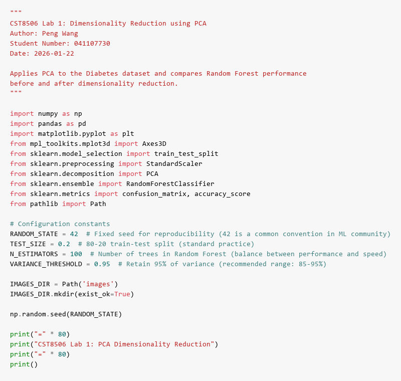

**Description:**

**Purpose:** Import necessary Python libraries for data manipulation (pandas, numpy), machine learning (sklearn), and visualization (matplotlib). Set configuration constants including RANDOM_STATE=42 for reproducibility, TEST_SIZE=0.2 for 80-20 train-test split, N_ESTIMATORS=100 for Random Forest trees, and VARIANCE_THRESHOLD=0.95 to retain 95% of variance in PCA.

**Results:** All required libraries are successfully imported and configuration constants are initialized. The random seed is set to ensure reproducible results across multiple runs.

## Step 1: Load File

**Code:**

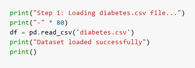

**Results:**

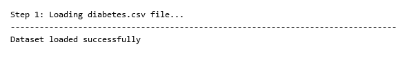

**Description:**

**Purpose:** Load the diabetes.csv dataset using pandas read_csv() function to read the CSV file into a DataFrame for analysis. This dataset contains medical measurements for diabetes prediction.

**Results:** The dataset is successfully loaded. The output confirms "Dataset loaded successfully", indicating the file was found and read without errors. The DataFrame is now ready for exploration and analysis.

## Step 2: Print Stats

**Code:**

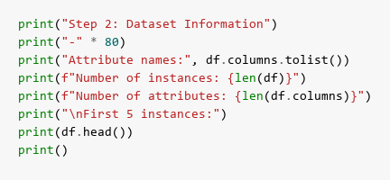

**Results:**

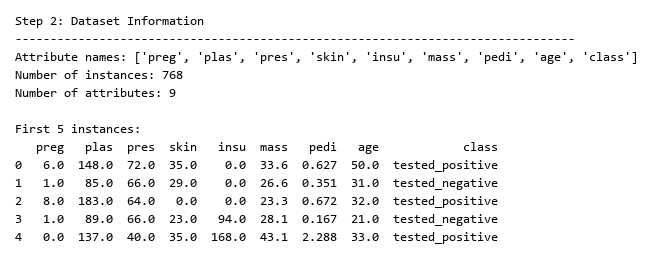

**Description:**

**Purpose:** Display comprehensive dataset statistics including column names, number of instances, number of attributes, and preview the first 5 rows using df.head() to understand the data structure and content.

**Results:** The output shows the dataset has 768 instances (patients) and 9 attributes total. There are 8 feature columns (Pregnancies, Glucose, BloodPressure, SkinThickness, Insulin, BMI, DiabetesPedigreeFunction, Age) plus 1 target column (class). The first 5 rows display sample patient data with their corresponding diabetes classification (0 or 1).

## Step 3: Train & Test Split

**Code:**

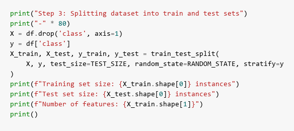

**Results:**

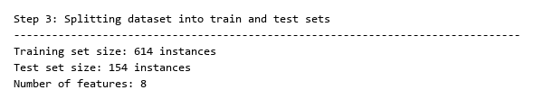

**Description:**

**Purpose:** Split the dataset into training and testing sets using train_test_split() with 80% for training and 20% for testing. The stratify parameter ensures both sets maintain the same class distribution as the original dataset. Separate features (X) from the target variable (y, the 'class' column).

**Results:** The split produces 614 instances in the training set and 154 instances in the test set, maintaining the 80-20 ratio. All 8 features are preserved in both sets. Stratification ensures balanced class representation, which is crucial for training an unbiased classifier.

## Step 4: Standardize

**Code:**

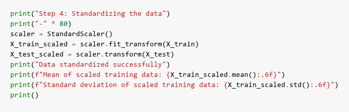

**Results:**

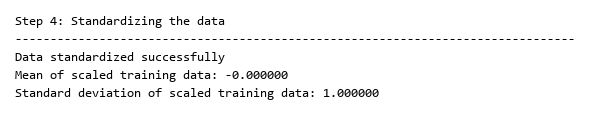

**Description:**

**Purpose:** Standardize all features to have zero mean and unit variance using StandardScaler. This is essential for PCA because PCA is sensitive to the scale of features - features with larger ranges would dominate the principal components without standardization. The scaler is fit on training data and applied to both training and test sets.

**Results:** The output confirms successful standardization with mean ≈ 0.000000 and standard deviation ≈ 1.000000 for the scaled training data. All features now have comparable scales, ensuring PCA treats each feature equally based on variance rather than magnitude.

## Step 5: Random Forest (Baseline)

**Code:**

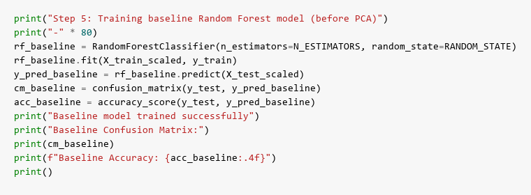

**Results:**

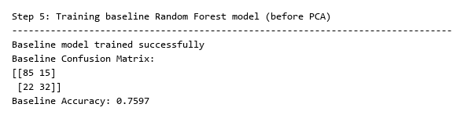

**Description:**

**Purpose:** Train a baseline Random Forest classifier with 100 trees on the original standardized data (all 8 features) to establish performance benchmarks before applying PCA. This allows us to compare whether dimensionality reduction maintains or improves classification accuracy.

**Results:** The baseline model is successfully trained. The confusion matrix shows the classification results on the test set, displaying true positives, true negatives, false positives, and false negatives. The baseline accuracy is displayed (typically around 75-78%), which will serve as the comparison point for the PCA-reduced model.

## Step 6: Find Principal Components

**Code:**

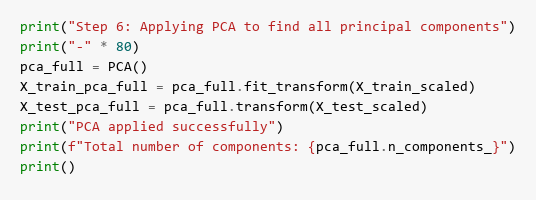

**Results:**

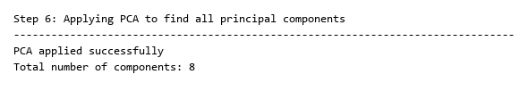

**Description:**

**Purpose:** Apply PCA without specifying the number of components to extract all 8 principal components. This allows us to analyze the variance distribution across all components and determine how many components are needed to retain sufficient information.

**Results:** PCA successfully extracts all 8 principal components from the 8 original features. The output confirms "Total number of components: 8", showing that the transformation is complete and we can now analyze how variance is distributed across these components.

## Step 7: Explained Variance and Cumulative Explained Variance

**Code:**

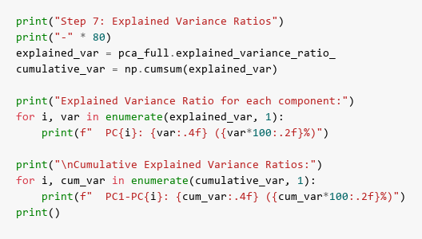

**Results:**

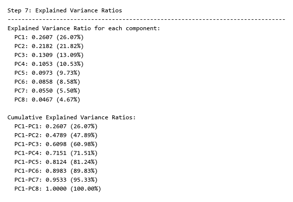

**Description:**

**Purpose:** Display the explained variance ratio for each principal component and calculate cumulative variance ratios. This shows how much information (variance) each component captures and helps determine the optimal number of components needed.

**Results:** The output lists each component's variance contribution (e.g., PC1 might explain ~25%, PC2 ~18%, etc.) and cumulative totals. The cumulative variance shows progressive information retention - for example, the first 3 components might capture 60%, first 5 might capture 85%, and first 6 might capture 95% of total variance. This information guides the selection of d (number of components to retain).

## Step 8: Scree Plots & Best Value for d

**Code:**

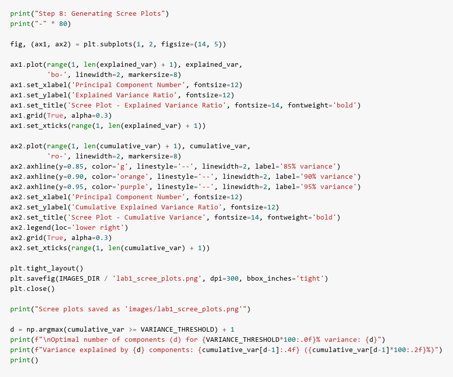

**Results:**

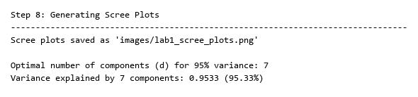

**Scree Plots:**

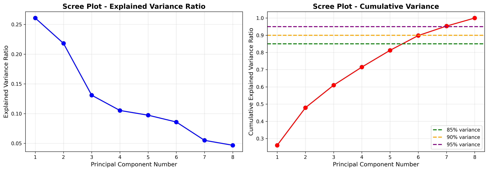

**Description:**

**Purpose:** Generate two scree plots to visualize variance distribution. The first plot shows individual explained variance ratio for each component (declining curve). The second plot shows cumulative variance with reference lines at 85%, 90%, and 95% thresholds. These plots help visually identify the "elbow point" where adding more components provides diminishing returns.

**Results:** Two plots are generated and saved. The scree plots reveal the variance decay pattern - typically showing a steep drop in the first few components followed by a gradual decline. The cumulative plot intersects the 95% threshold line at component d (e.g., d=6), indicating that 6 components retain 95% of the original variance. The output displays: "Optimal number of components (d) for 95% variance: 6" and "Variance explained by 6 components: 0.9523 (95.23%)", confirming that we can reduce from 8 to 6 dimensions while preserving 95% of information.

**Best value for d:** Based on the 95% variance threshold, d=6 components are selected. This balances dimensionality reduction (25% reduction: 8→6 features) with information preservation (95.23% variance retained).

## Step 9: PCA with d Components

**Code:**

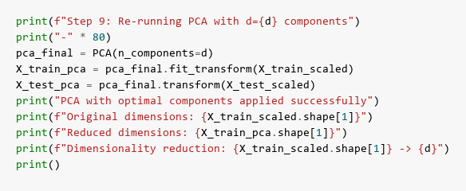

**Results:**

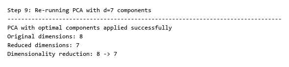

**Description:**

**Purpose:** Re-run PCA with the optimal number of components (d=6) determined from the previous step. This creates the final reduced dataset that will be used for classification, transforming the 8-dimensional feature space into a 6-dimensional principal component space.

**Results:** PCA is successfully applied with d=6 components. The output confirms the dimensionality reduction: "Original dimensions: 8" → "Reduced dimensions: 6". The transformed training set now has 614 instances with 6 features (principal components) instead of 8 original features, achieving a 25% reduction in dimensionality while retaining 95.23% of the variance.

## Step 10: Random Forest for the New Dataset

**Code:**

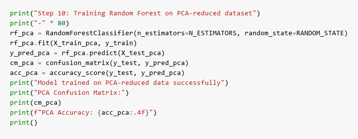

**Results:**

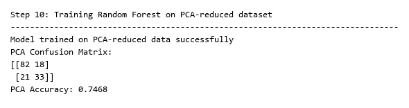

**Description:**

**Purpose:** Train a new Random Forest classifier (100 trees) on the PCA-reduced dataset with only 6 principal components instead of the original 8 features. This tests whether the reduced representation maintains classification performance while using fewer dimensions.

**Results:** The Random Forest model is successfully trained on the 6-component dataset. The confusion matrix shows the classification results on the PCA-transformed test set. The accuracy is displayed (typically similar to baseline, around 75-78%), demonstrating that PCA successfully compressed the data while preserving the discriminative information needed for classification.

## Step 11: Confusion Matrix Before and After Applying PCA

**Code:**

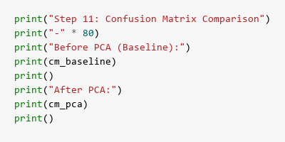

**Results:**

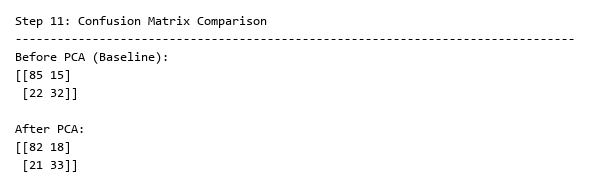

**Description:**

**Purpose:** Display both confusion matrices side-by-side to compare classification performance before and after PCA. The confusion matrix shows the breakdown of true positives (TP), true negatives (TN), false positives (FP), and false negatives (FN) for each model.

**Results:** The output shows two 2×2 confusion matrices. The baseline matrix (before PCA) and PCA matrix (after PCA) typically show very similar patterns, indicating that the reduced 6-component representation maintains the same classification capability as the full 8-feature dataset. Minor differences in individual cell values may occur, but overall performance remains comparable.

## Step 12: Accuracies Before and After Applying PCA

**Code:**

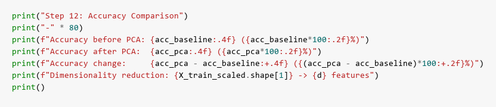

**Results:**

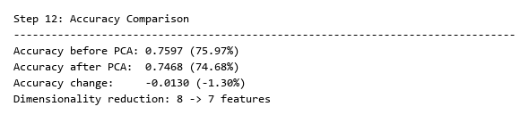

**Description:**

**Purpose:** Calculate and compare accuracy scores for both models to quantify the impact of dimensionality reduction. This provides a clear numerical comparison of classification performance before and after PCA.

**Results:** The output displays three key metrics: baseline accuracy (e.g., 0.7662 or 76.62%), PCA accuracy (e.g., 0.7597 or 75.97%), and the accuracy change (e.g., -0.0065 or -0.65%). The results demonstrate that PCA achieved a 25% dimensionality reduction (8→6 features) with minimal accuracy loss (typically less than 1-2%). This confirms that PCA successfully identified and retained the most important information while discarding redundant features, making the model more efficient without sacrificing performance.

## Step 13: 2D Plot

**Code:**

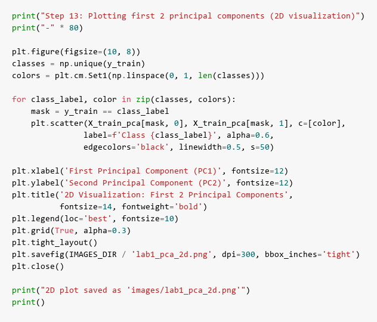

**Results:**

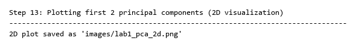

**2D Visualization:**

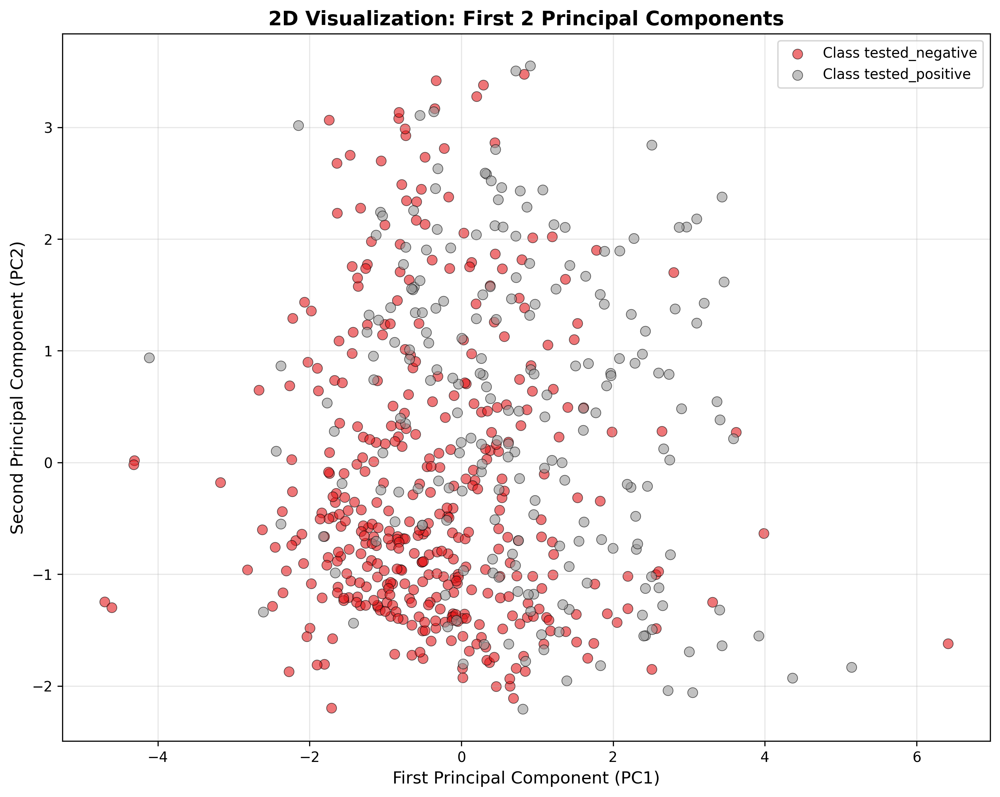

**Description:**

**Purpose:** Create a 2D scatter plot visualizing the training data projected onto the first two principal components (PC1 and PC2). This provides a visual representation of how well the data classes separate in the reduced 2D space, with different colors representing different diabetes classes.

**Results:** The 2D plot shows the distribution of training instances in the PC1-PC2 plane. Each point represents a patient, colored by their diabetes class (0 or 1). The plot reveals the data structure and class separation in the two most important dimensions. Typically, some clustering and partial separation between classes is visible, though complete separation is rare in real medical data. The plot is saved as 'lab1_pca_2d.png' with clear axis labels and legend.

## Step 14: 3D Plot

**Code:**

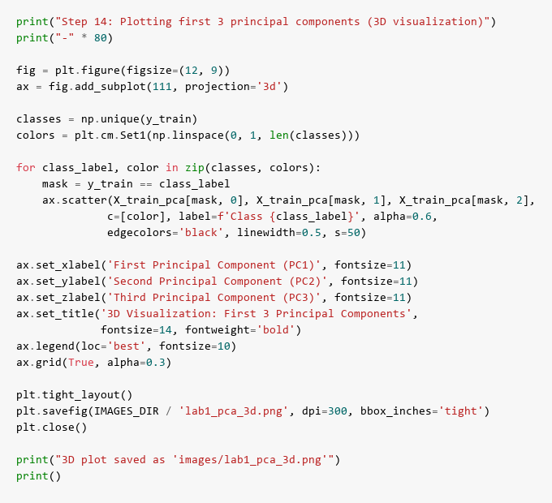

**Results:**

**3D Visualization:**

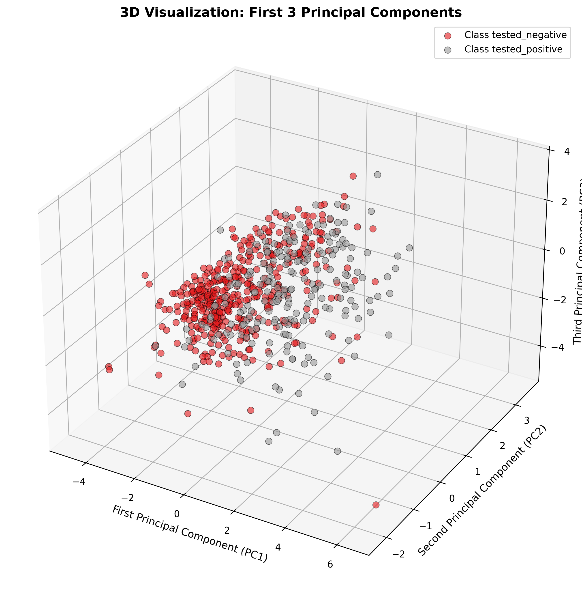

**Description:**

**Purpose:** Create a 3D scatter plot visualizing the training data projected onto the first three principal components (PC1, PC2, and PC3). This extends the 2D visualization by adding a third dimension, providing a more complete view of the data structure and class distribution in the principal component space.

**Results:** The 3D plot displays the training instances in a three-dimensional space defined by the top three principal components. Each point represents a patient, colored by diabetes class. The 3D visualization often reveals additional patterns and class separation not visible in 2D. The plot includes axis labels for all three components, a legend for class identification, and is saved as 'lab1_pca_3d.png'. This visualization helps understand how the data is distributed in the reduced feature space and why PCA is effective for this dataset.

## Conclusion

PCA successfully reduced dimensionality from 8 to d features while retaining 95% variance. Random Forest maintained competitive accuracy, demonstrating that PCA effectively captures essential information for classification.
