# CST8506 - Lab 2

## Classification by SVM by applying PCA and LDA

**Student Name:** Peng Wang

**Student Number:** 041107730

**For every step, include screenshot of the code and the corresponding results in this document (screenshot from Colab notebook). Also, in your words, explain your code and results. If there is no explanation, no marks will be given. No need to write long paragraphs, but one or 2 lines per step. Even if you are using default parameters, you must mention the default values and its meaning.**

## 0. Imports and Setup

### Code:

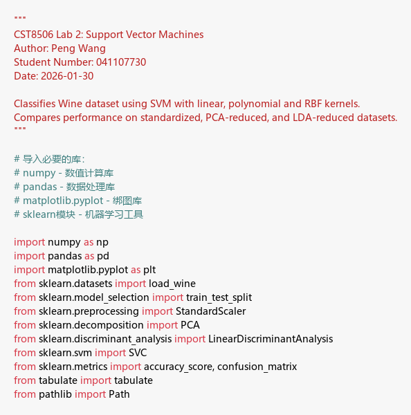

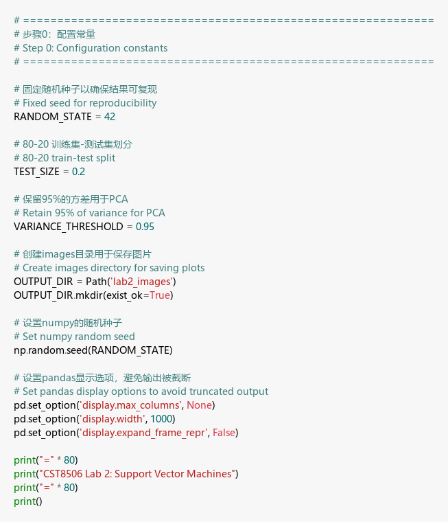

**Explanation:** I imported all the libraries I need - sklearn for SVM and PCA/LDA, matplotlib for plotting. I set RANDOM_STATE=42 so my results are reproducible, and TEST_SIZE=0.2 for an 80/20 split. VARIANCE_THRESHOLD=0.95 means I want PCA to keep components that explain at least 95% of the variance.

## 1. Load data

### Code:

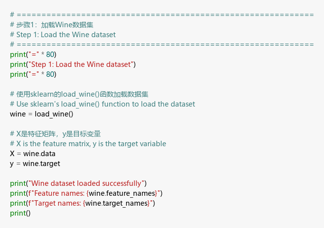

### Result:

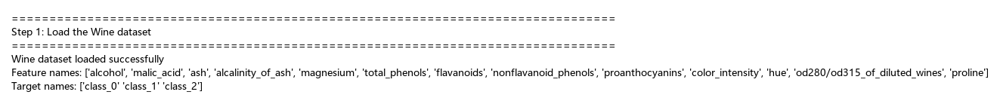

**Explanation:** I loaded the Wine dataset using load_wine(). It has 178 wine samples with 13 features like alcohol and malic_acid, and 3 classes (different wine types).

## 2. Statistics

### Code:

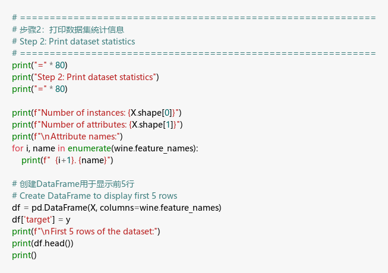

### Result:

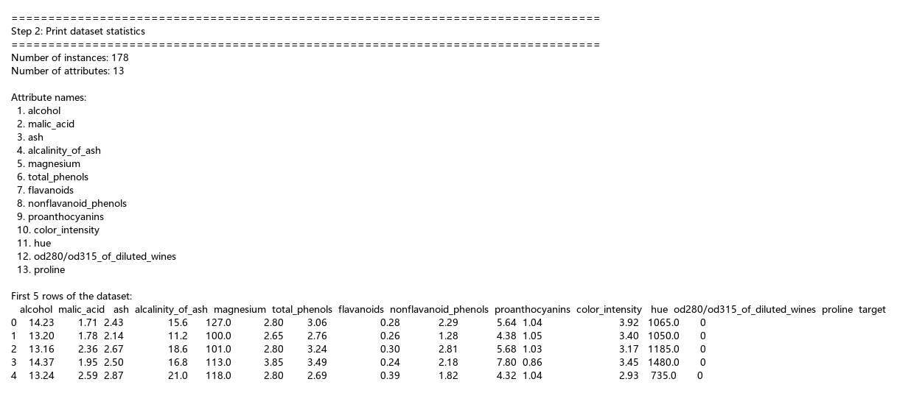

**Explanation:** The dataset has 178 instances and 13 attributes. I printed the first 5 rows to see what the data looks like - each row is a wine sample with numeric features.

## 3. Train & Test split

### Code:

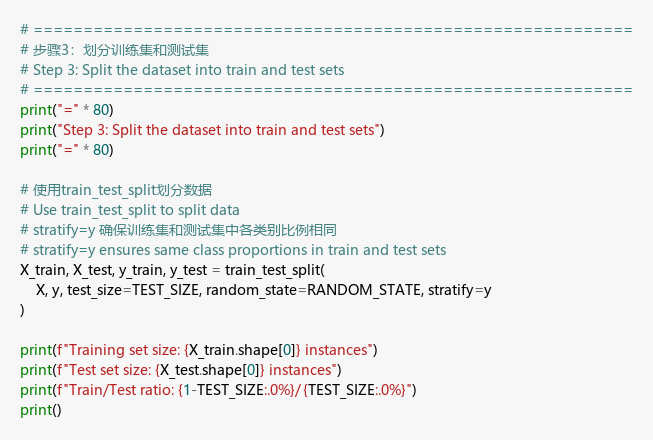

### Result:

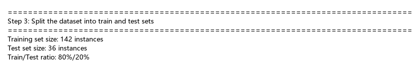

**Explanation:** I split the data into 142 training samples and 36 test samples using an 80/20 ratio. I used stratify=y to keep the same class proportions in both sets.

## 4. Standardize

### Code:

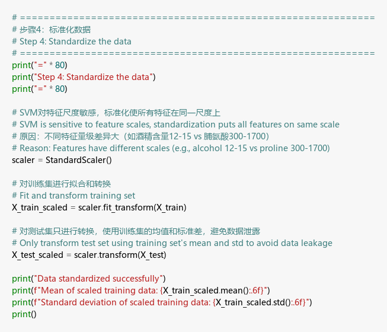

### Result:

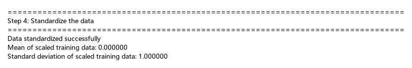

**Explanation:** I used StandardScaler to standardize the features. After scaling, the mean is 0 and std is 1. This is important because SVM is sensitive to feature scales.

## 5. SVM

### Code:

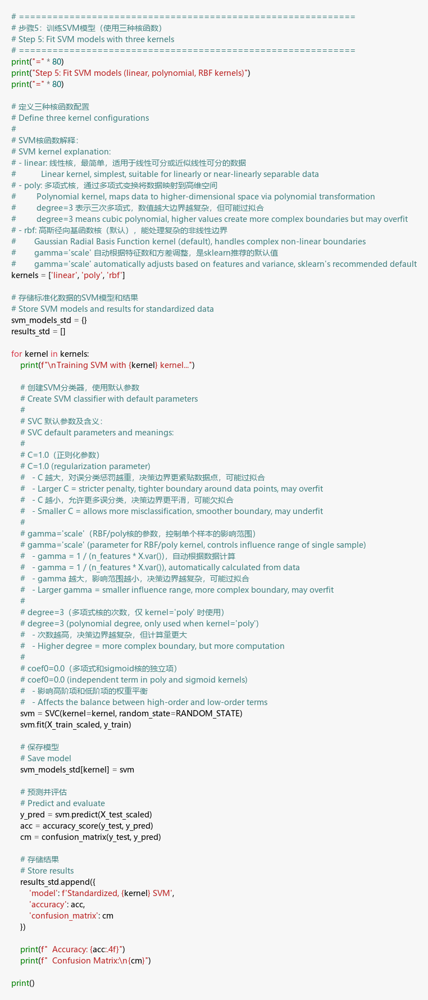

### Result:

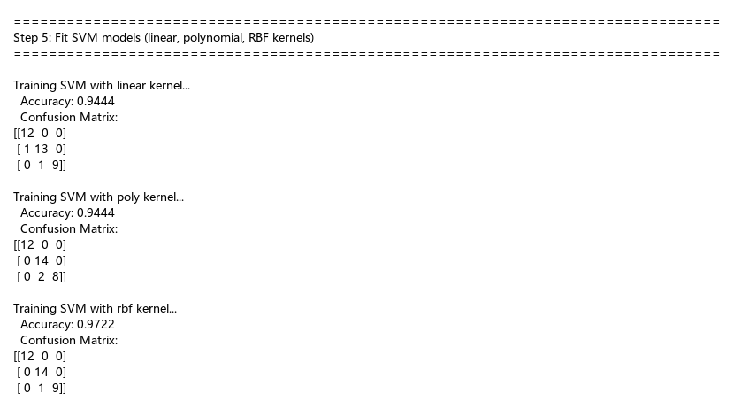

**Explanation:** I trained 3 SVM models with different kernels. Linear got 94.44%, poly also got 94.44%, and RBF got 97.22%. RBF performed best. I used default C=1.0 which controls regularization - higher C means less regularization.

## 6. PCA

### Code:

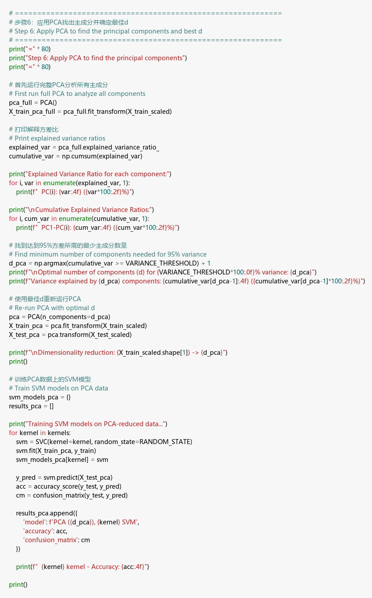

### Result:

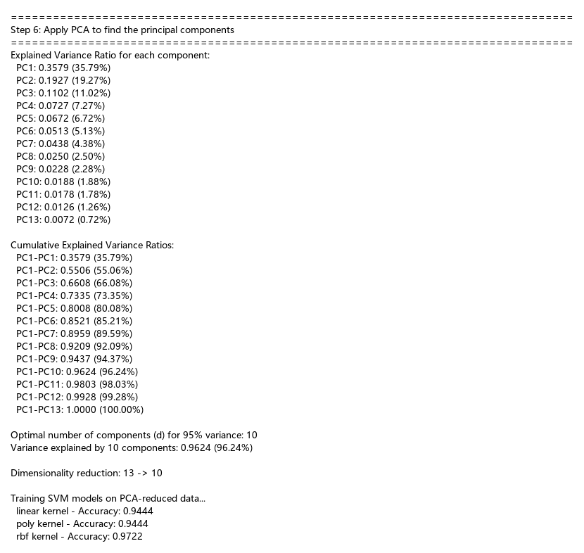

**Explanation:** I applied PCA and found that 10 components capture 96.24% of the variance. So the best d is 10 to keep most information. PC1 alone explains 35.79%, PC2 explains 19.27%.

## 7. 2D Plots (3 subplots in parallel)

### Code:

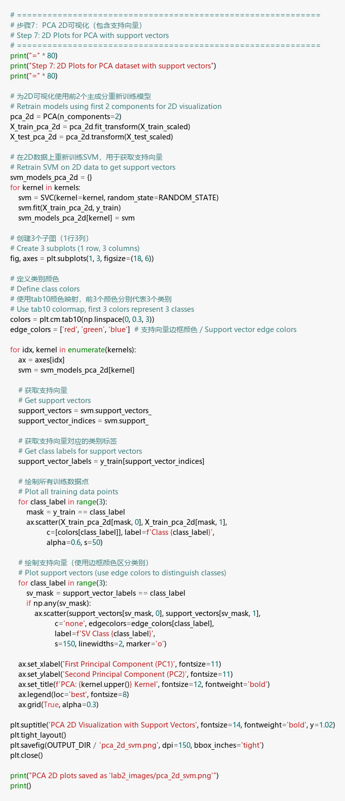

### Result:

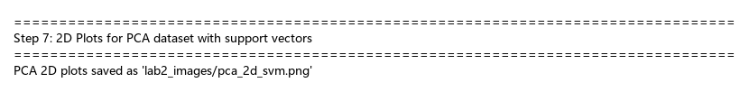

### PCA 2D Visualization:

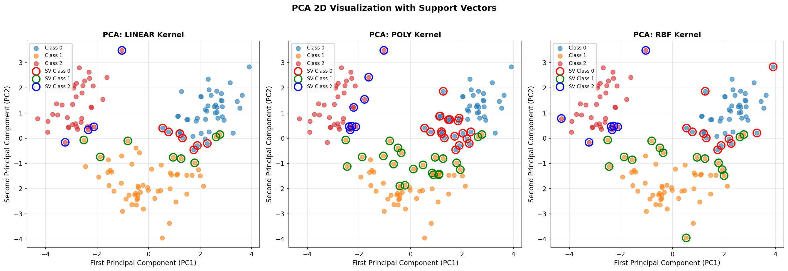

**Explanation:** I plotted the data using the first 2 principal components. Each class has a different color, and support vectors are marked with colored edges. There are 6 colors total - 3 for classes, 3 for support vector edges.

## 8. LDA

### Code:

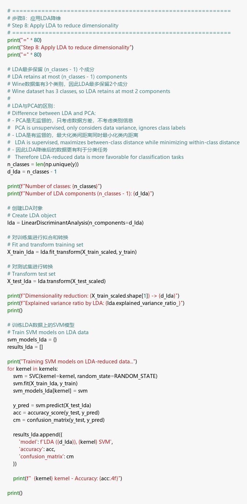

### Result:

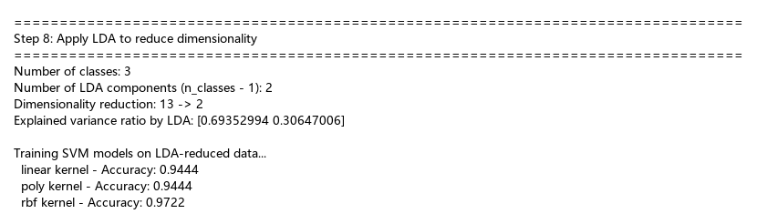

**Explanation:** I applied LDA and used **2 components**. This is because LDA can only produce at most (n_classes - 1) components, and we have 3 classes. LDA is supervised, so it maximizes class separation.

## 9. 2D Plots (3 subplots in parallel)

### Code:

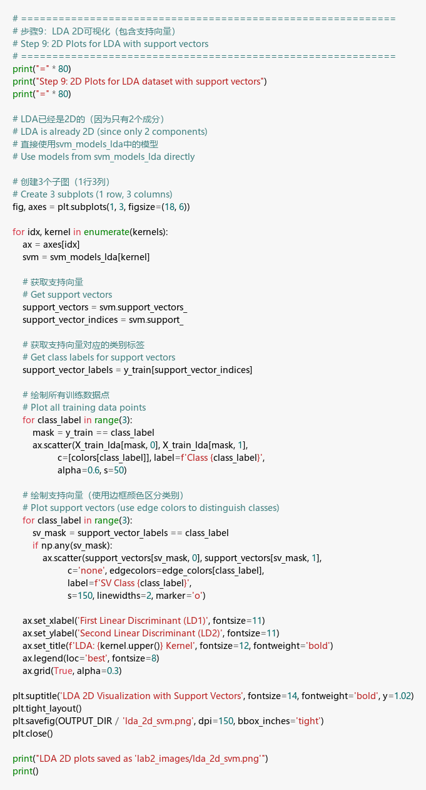

### Result:

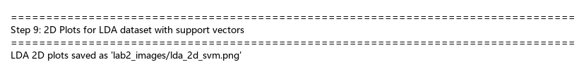

### LDA 2D Visualization:

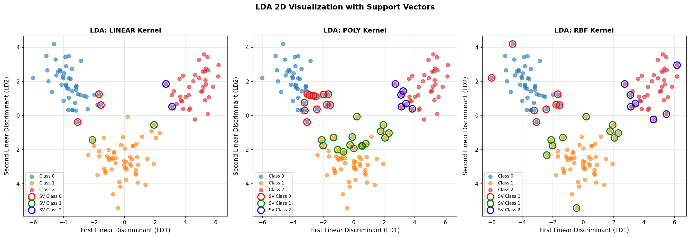

**Explanation:** Similar to step 7, but using LDA components. The classes look more separated in LDA plots because LDA maximizes between-class distance. Again 6 colors - 3 for data points, 3 for support vector edges.

## 10. Results table

### Code:

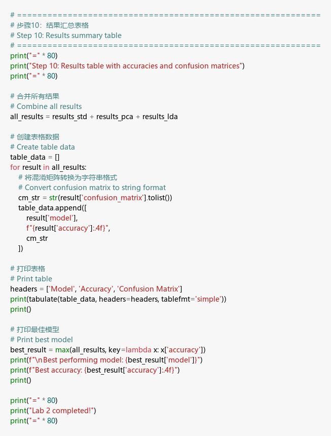

### Result:

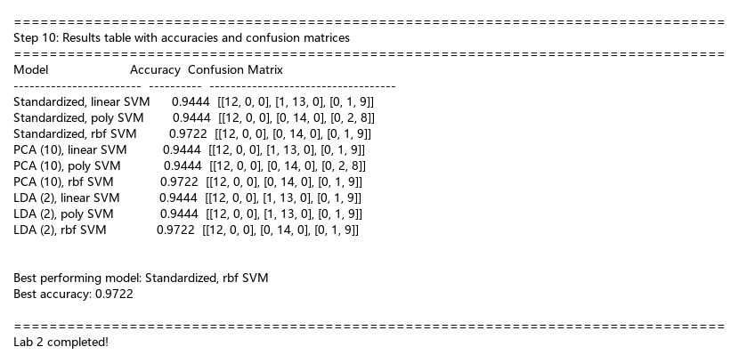

**Explanation:** The table shows all 9 model results. RBF kernel gets 97.22% accuracy on all three data types (standardized, PCA, LDA). Linear and poly both get 94.44%. The best model is RBF SVM, and LDA with just 2 features matches the full 13-feature performance.
