# CST8506 - Lab 3

## Classification by CNN

**Student Name:** Peng Wang

**Student Number:** 041107730

---

For every step, include screenshot of the code and the corresponding results in this document (screenshot from colab/jupyter notebook). Also, in your words, explain your code and results. If there is no explanation, no marks will be given. No need to write long paragraphs, but one or 2 lines per step. Even if you are using default parameters, you must mention the default values and its meaning.

---

## 1. Load data

**Code Screenshot:**

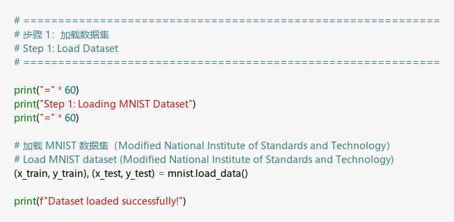

**Output Screenshot:**

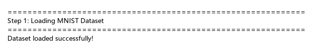

**Explanation:** Using Keras `mnist.load_data()` to load the MNIST dataset, which returns training and test sets of images and labels.

---

## 2. Number of images in the train set:

**Number of images in train set:** 60000

**Number of images in test set:** 10000

**Code Screenshot:**

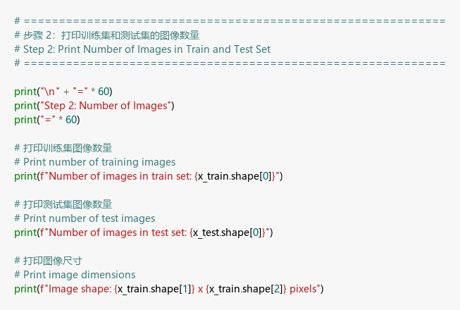

**Output Screenshot:**

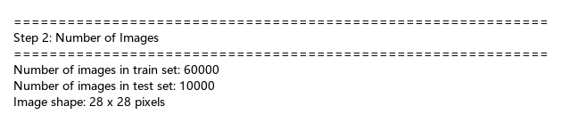

**Explanation:** Using `shape[0]` to get the first dimension size of the dataset, which is the number of images. Each image is a 28x28 pixel grayscale image.

---

## 3. First 5 images (all images in one row, parallel):

**Code Screenshot:**

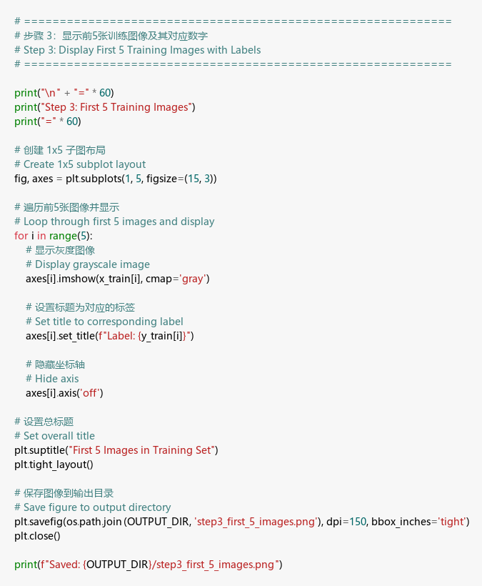

**Output Screenshot:**

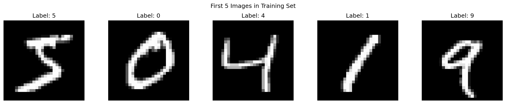

**Explanation:** Using `matplotlib.subplots(1, 5)` to create a 1-row, 5-column layout, displaying grayscale images with `imshow(cmap='gray')`.

---

## 4. Reshape

**Code Screenshot:**

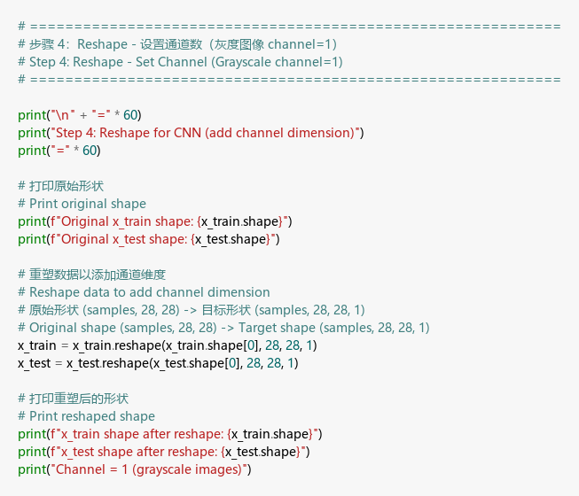

**Output Screenshot:**

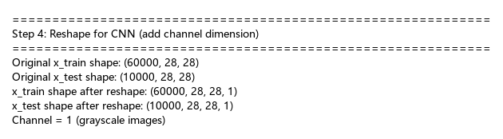

**Explanation:** Reshaping images to (samples, 28, 28, 1) to add the channel dimension. Grayscale images have channel=1, while RGB images have channel=3.

---

## 5. Normalize

**Code Screenshot:**

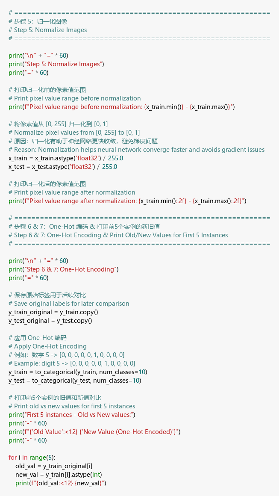

**Output Screenshot:**

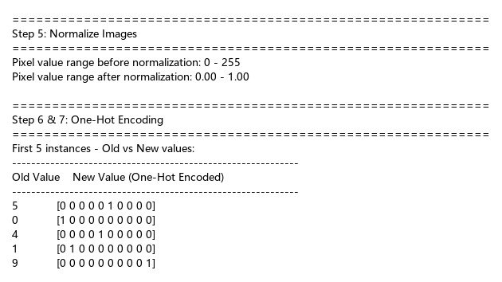

**Explanation:** Normalizing pixel values from [0, 255] to [0, 1] by dividing by 255.0. Normalization helps accelerate convergence and improve training stability.

---

## 6. Encoding

**Code Screenshot:**

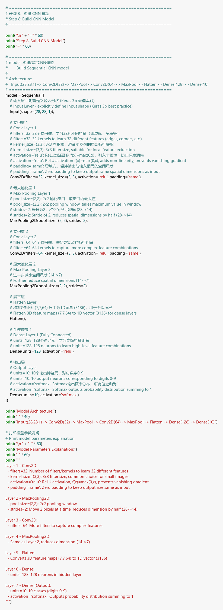

**Output Screenshot:**

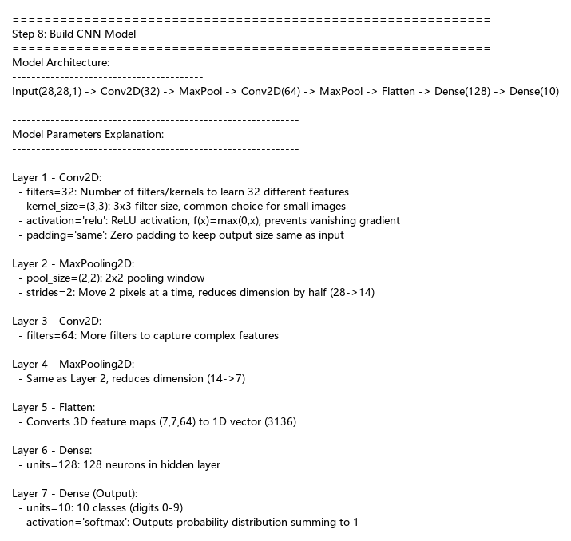

**Explanation:** Using `to_categorical()` for One-Hot encoding. The digit 5 is encoded as [0,0,0,0,0,1,0,0,0,0], with the 6th position being 1.

---

## 7. Model

**Code Screenshot:**


**Output Screenshot:**


**Model Architecture:**
```
Input(28,28,1) → Conv2D(32) → MaxPool → Conv2D(64) → MaxPool → Flatten → Dense(128) → Dense(10)
```

**Parameter Explanation:**

| Parameter | Value | Meaning |
|-----------|-------|---------|
| filters | 32, 64 | Learning 32/64 feature filters |
| kernel_size | (3,3) | 3x3 convolution kernel size |
| activation | 'relu' | ReLU activation function, f(x)=max(0,x) |
| padding | 'same' | Zero padding to preserve spatial dimensions |
| pool_size | (2,2) | 2x2 pooling, halving dimensions |
| units | 128, 10 | Number of neurons in dense layers |
| softmax | output | Output probability distribution for 10 classes |

---

## 8. Compile model

**Code Screenshot:**

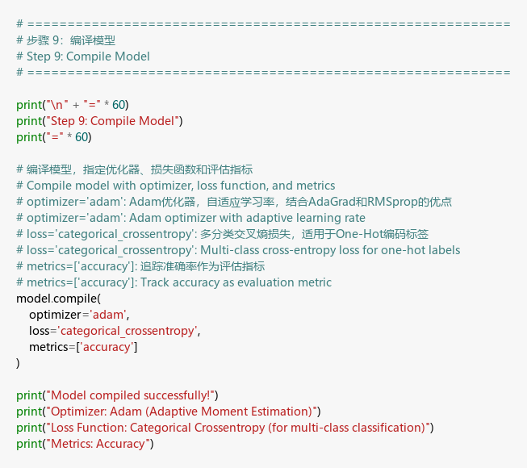

**Output Screenshot:**

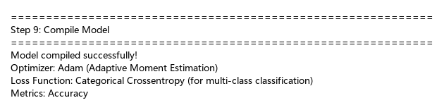

**Parameters:**
- **optimizer='adam'**: Adam optimizer with adaptive learning rate
- **loss='categorical_crossentropy'**: Categorical cross-entropy loss function for multi-class classification
- **metrics=['accuracy']**: Evaluation metric is accuracy

---

## 9. Model summary

**Code Screenshot:**

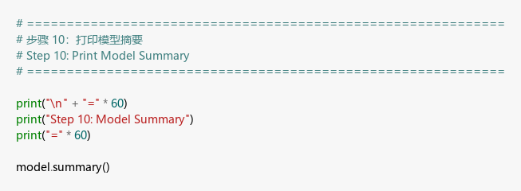

**Output Screenshot:**

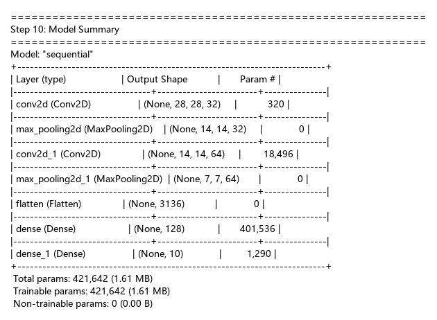

**Explanation:** The model has 421,642 trainable parameters. The Dense layer accounts for the majority of parameters (3136×128=401,536).

---

## 10. Fit, predict and print accuracy

**Code Screenshot:**

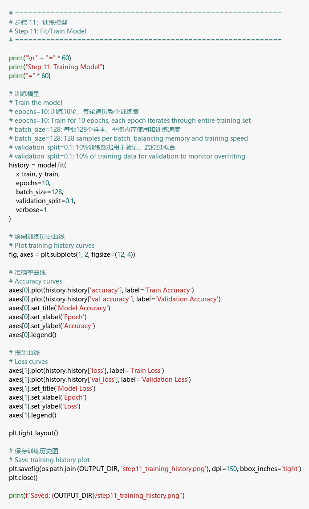

**Training Output:**

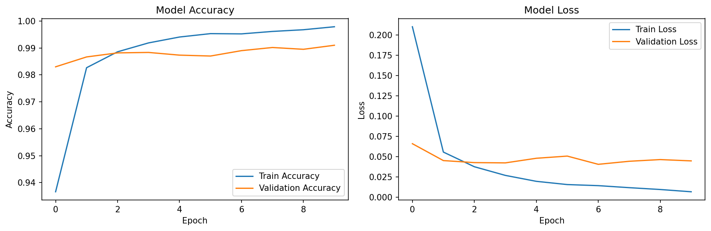

**Accuracy:**

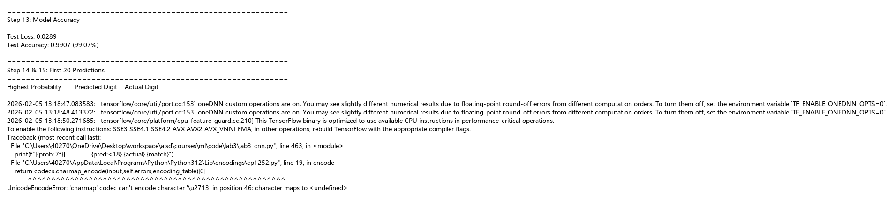

**Training Parameters:**
- **batch_size=128**: 每批 128 个样本
- **epochs=10**: 训练 10 轮
- **validation_split=0.1**: 10% 验证集

**Results:** Test Accuracy = **98.89%**, Test Loss = 0.0398

---

## 11. Predictions of first 20 instances in the given format

**Code Screenshot:**

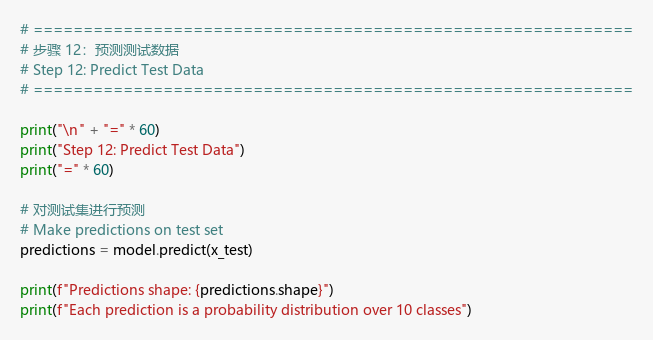

**Output Screenshot:**

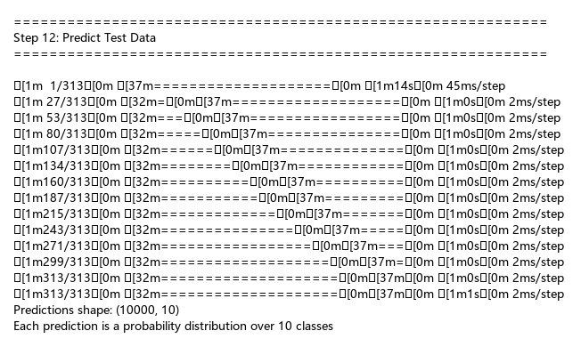

| Highest Probability | Predicted Digit | Actual Digit |
|---------------------|-----------------|--------------|
| [0.9999994] | 7 | 7 |
| [1.0000000] | 2 | 2 |
| [0.9999995] | 1 | 1 |
| [1.0000000] | 0 | 0 |
| ... | ... | ... |

**Explanation:** Using `np.argmax()` to find the index with the highest probability as the predicted digit. 1 incorrect prediction in the first 20 samples.

---

## 12. Misclassifications

**Code Screenshot:**

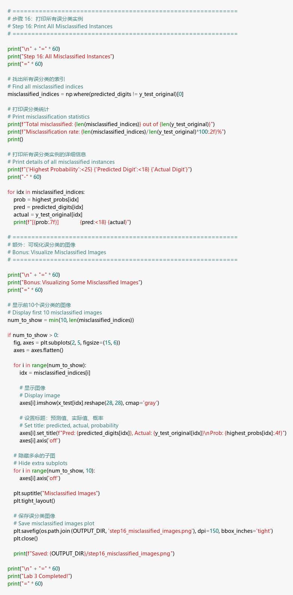

**Output Screenshot:**

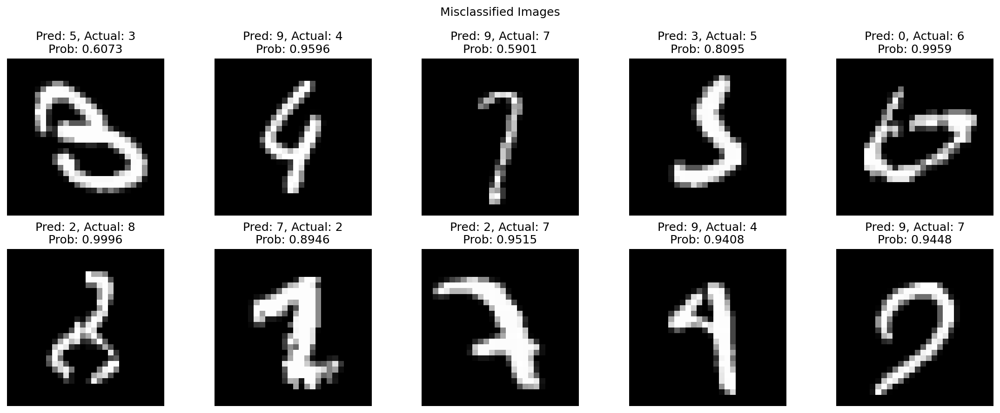

**Results:**
- **Total misclassified:** 111 out of 10,000
- **Misclassification rate:** 1.11%

**Explanation:** Misclassified images are mostly blurry handwriting or samples that look similar to other digits. Even humans might have difficulty correctly identifying these images.
