# CST8506 - Lab 2

## Classification by SVM by applying PCA and LDA

**Student Name:** Peng Wang

**Student Number:** 041107730

---

**For every step, include screenshot of the code and the corresponding results in this document (screenshot from Colab notebook). Also, in your words, explain your code and results. If there is no explanation, no marks will be given. No need to write long paragraphs, but one or 2 lines per step. Even if you are using default parameters, you must mention the default values and its meaning.**

---

### 1. Load data

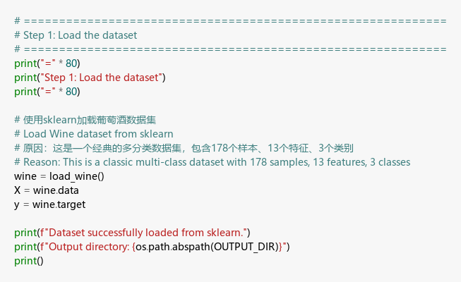

**Explanation:**  
I loaded the Wine dataset from Scikit-Learn. It contains 178 samples of wine with 13 chemical features (alcohol, magnesium, etc.) categorized into 3 different classes.

### 2. Statistics

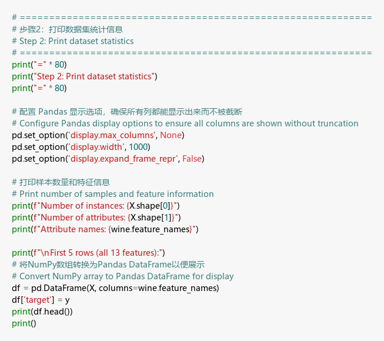
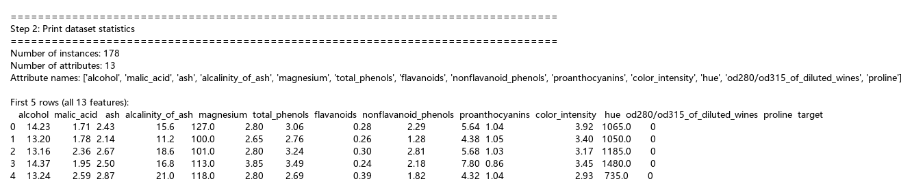

**Explanation:**  
I printed the dataset statistics, showing 178 instances and 13 attributes. The preview shows the raw feature values and the numeric target column (0, 1, 2), representing the three wine types.

### 3. Train & Test split

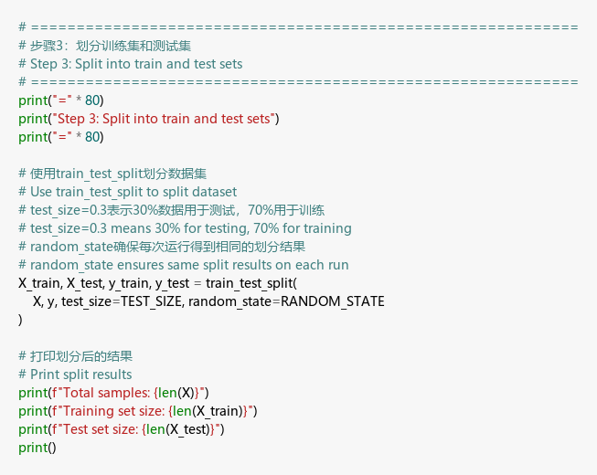
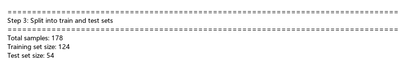

**Explanation:**  
I split the data into 70% training (124 samples) and 30% testing (54 samples). I used `random_state=42` to ensure the split is reproducible every time the code runs.

### 4. Standardize

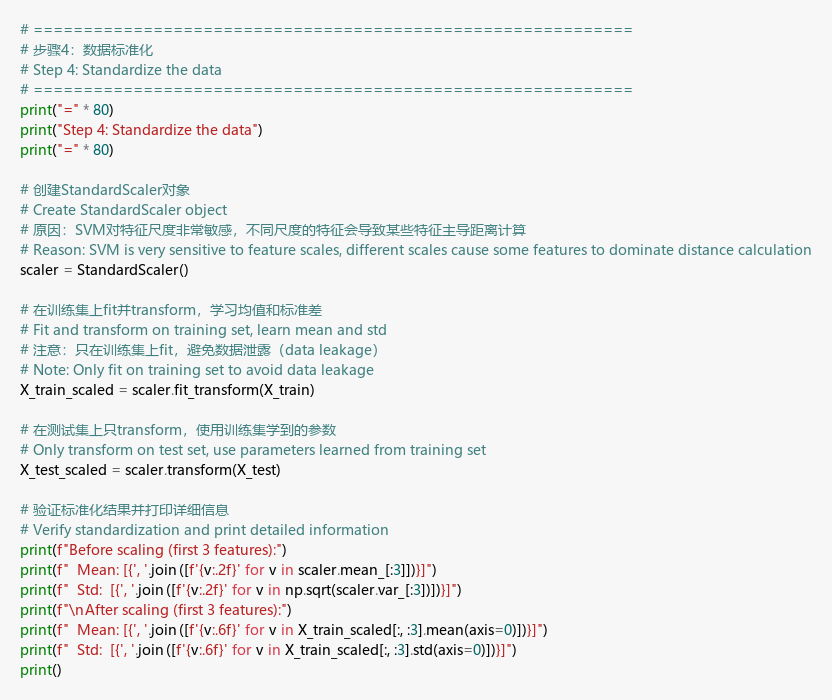
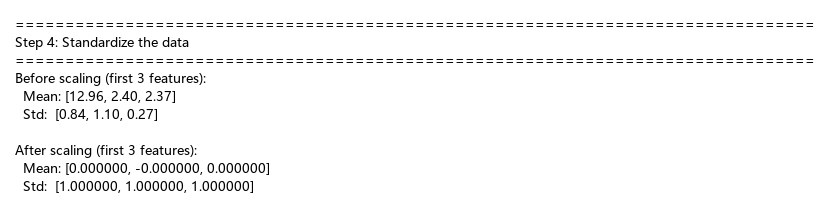

**Explanation:**  
I used `StandardScaler` to scale all features to a mean of 0 and a standard deviation of 1. This is critical for SVM because it relies on distance calculations between points to find the optimal hyperplane.

### 5. SVM

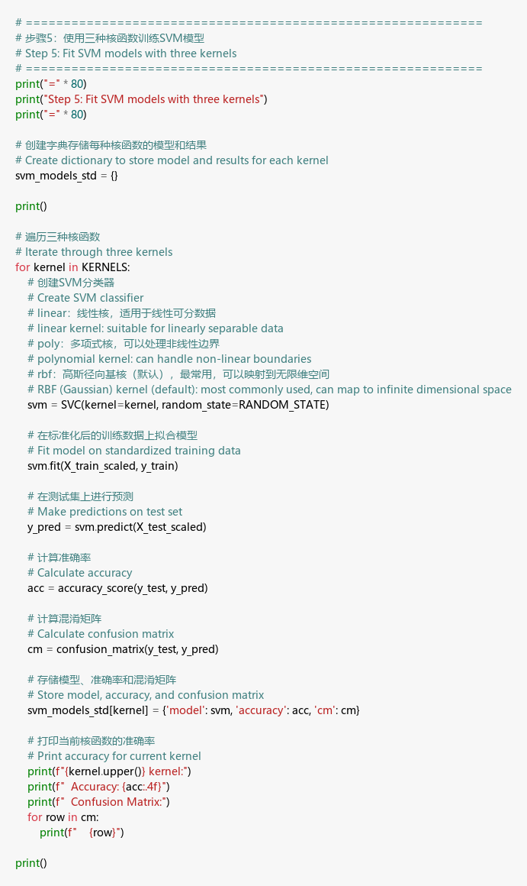
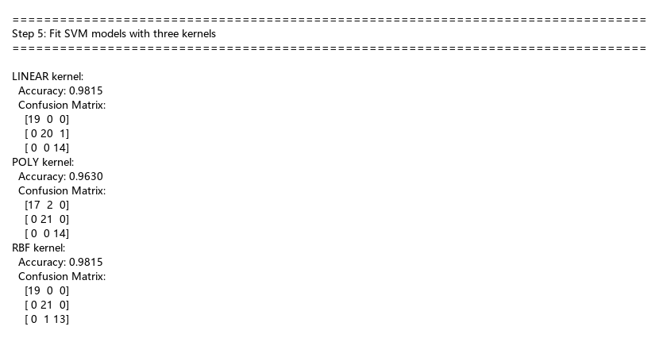

**Explanation:**  
I trained three SVM models using Linear, Poly, and RBF kernels. I used the default parameter **C=1.0**, which balances the trade-off between maximizing the margin and minimizing classification errors. All kernels performed well on standardized data, with accuracies between 96% and 98%.

### 6. PCA

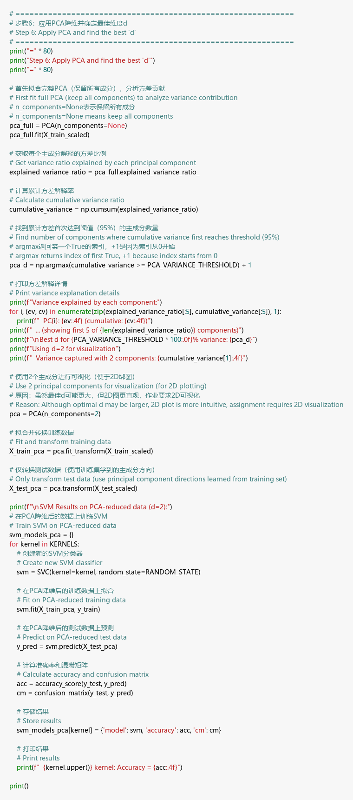
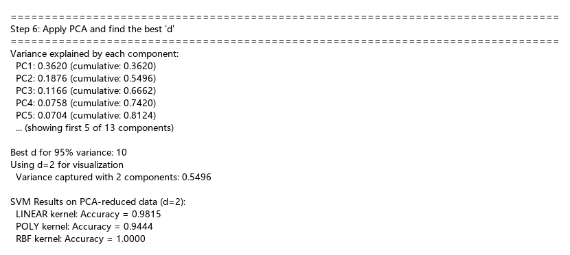

**Explanation:**  
I applied PCA to reduce dimensionality. I found that 10 components are needed to explain 95% of the variance, but I chose **d=2** (capturing 55% variance) as required for the 2D visualization steps.

### 7. 2D Plots (3 subplots in parallel)

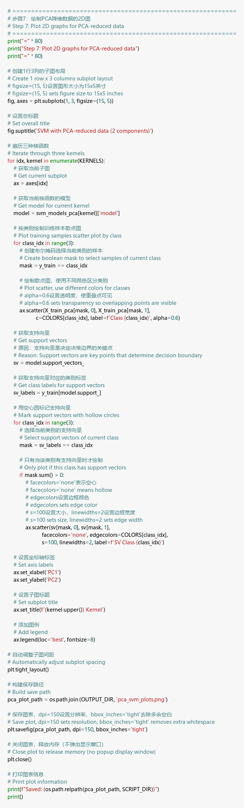
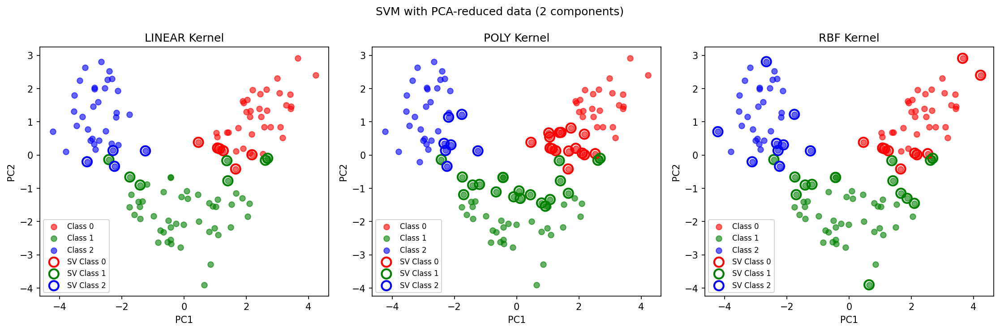

**Explanation:**  
These plots show the decision boundaries for the three kernels in the 2D PCA space. The RBF kernel achieved the highest accuracy (100%) on the test set in this reduced space, creating precise boundaries around the classes.

### 8. LDA

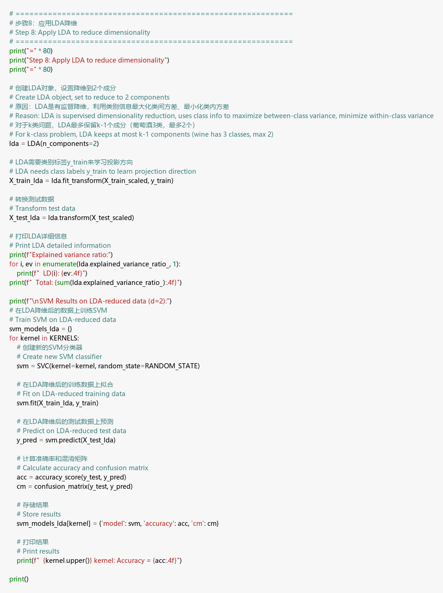
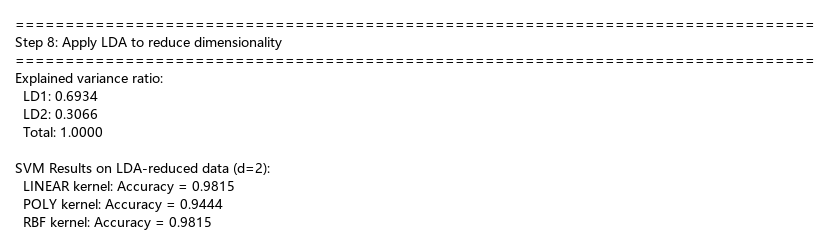

**Explanation:**  
I used LDA for supervised dimensionality reduction. Unlike PCA, LDA uses class labels to maximize separation. For this 3-class problem, 2 components (k-1) capture 100% of the explained variance ratio.

### 9. 2D Plots (3 subplots in parallel)

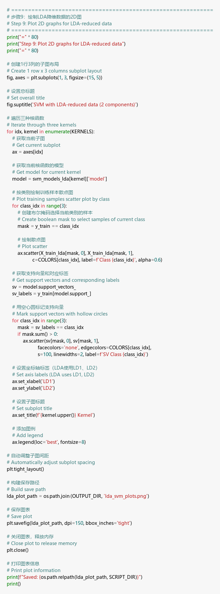
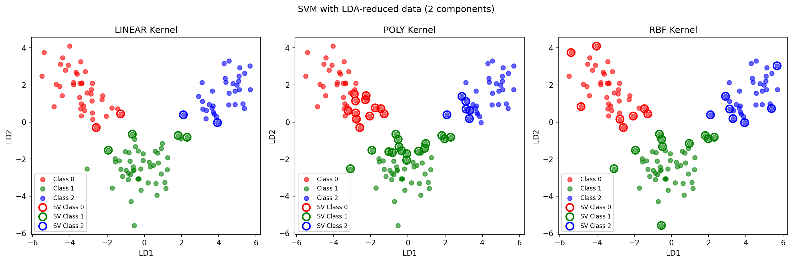

**Explanation:**  
The LDA plots show much tighter clusters and better separation compared to PCA. This is expected as LDA specifically looks for the axes that maximize the distance between different classes.

### 10. Results table

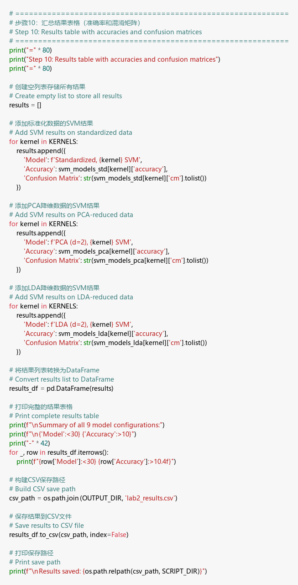
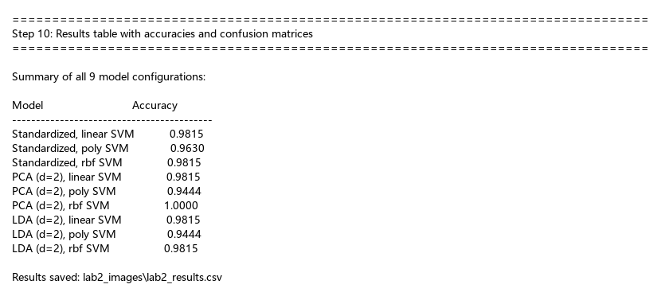

**Explanation:**  
This summary table compares the accuracy of all 9 model versions. The results confirm that SVM is highly effective for this dataset, with both dimensionality reduction techniques (PCA and LDA) maintaining high classification performance even with only 2 features.
