# CST8506 - Lab 4

## Time Series Analysis

**Student Name:** Peng Wang

**Student Number:** 041107730

---

**For every step, include screenshot of the code and the corresponding results in this document. Also, in your words, explain your code and results.**

---

## Step 0: Imports and Configuration

### Code:

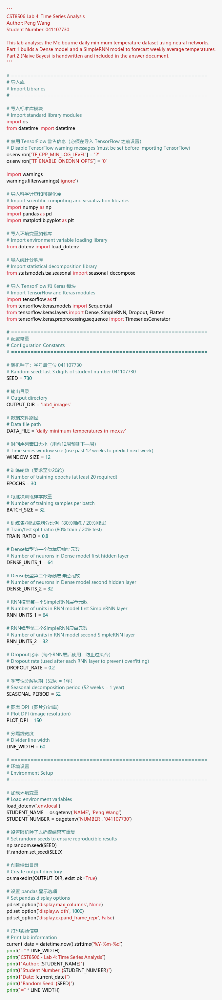

### Explanation:

I started by importing all the libraries I need for this lab. I used numpy and pandas for data handling, matplotlib for plotting, and statsmodels for decomposing the time series. For the neural network part, I imported TensorFlow/Keras — specifically `Sequential` for building models, `Dense` and `SimpleRNN` for layers, `Dropout` for regularization, and `TimeseriesGenerator` to automatically create input-output pairs from the time series.

I set the random seed to **730** (the last 3 digits of my student number) so that results are reproducible. I also defined all key hyperparameters as constants at the top: WINDOW_SIZE=12 means I use the past 12 weeks to predict the next week, EPOCHS=30 for how many times the model sees the full dataset, and BATCH_SIZE=32 for how many samples are processed at once.

---

## Step 1: Load the Dataset

### Code:

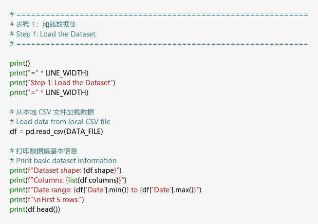

### Result:

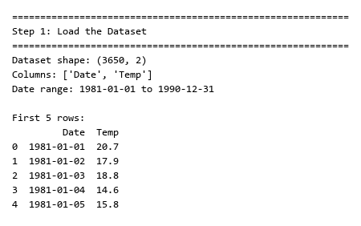

### Explanation:

Here I loaded the Melbourne Daily Minimum Temperatures dataset from a local CSV file. The dataset contains 3650 daily temperature readings spanning from January 1, 1981 to December 31, 1990 — that's exactly 10 years of data. Each row has a date and a temperature value in Celsius. I printed the first 5 rows to confirm the data loaded correctly.

---

## Step 2: Convert Daily Data to Weekly Averages

### Code:

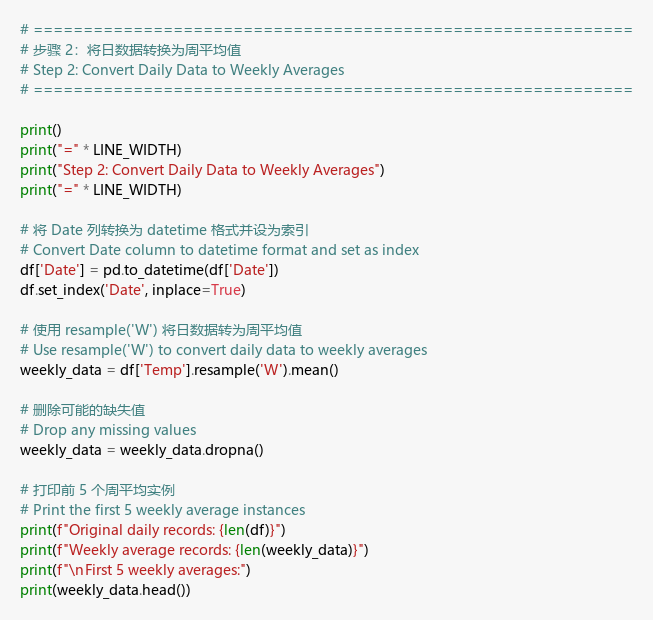

### Result:

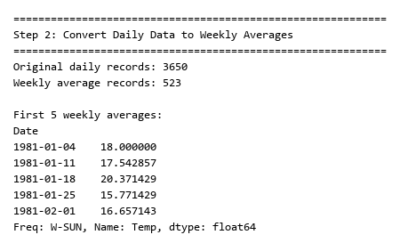

### Explanation:

Since daily data has a lot of day-to-day noise, I converted it to weekly averages using pandas `resample('W').mean()`. This reduced the dataset from about 3650 daily records down to 523 weekly records. The weekly averaging smooths out random daily fluctuations while keeping the important seasonal patterns intact. I printed the first 5 weekly averages to verify — for example, the first week of 1981 had an average of about 18°C, which makes sense for Australian summer.

---

## Step 3: Plot Weekly Average Temperature Series

### Code:

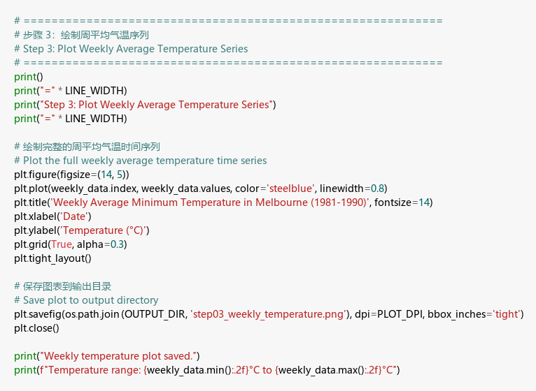

### Result:

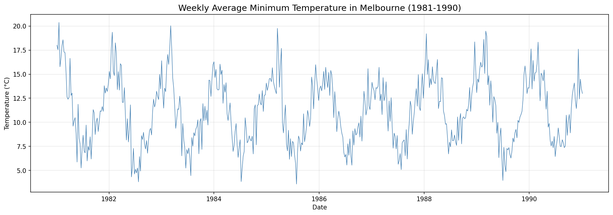

### Explanation:

I plotted the full 10-year weekly temperature time series. Looking at the plot, there's a very clear seasonal repeating pattern — temperatures go up in summer (which is December-February in Australia since it's in the Southern Hemisphere) and drop in winter. The temperature roughly cycles between about 4°C and 20°C every year. This regular pattern is exactly what we want our neural networks to learn and predict.

---

## Step 4: Plot Seasonal Decomposition (Original, Trend, Seasonal, Residue)

### Code:

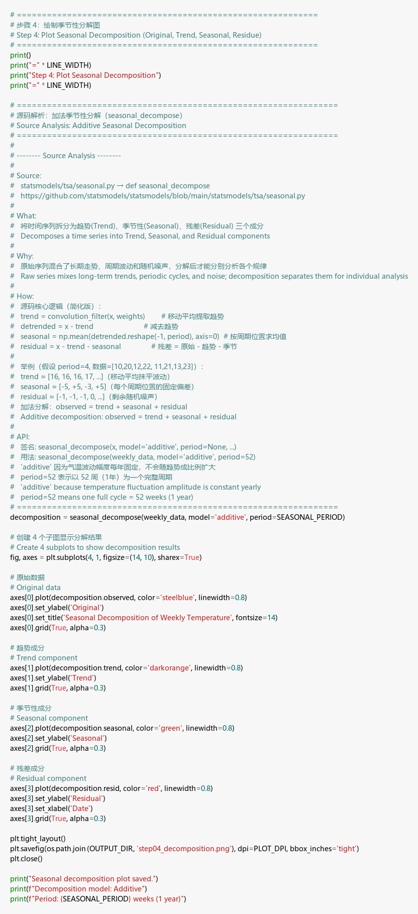

### Result:

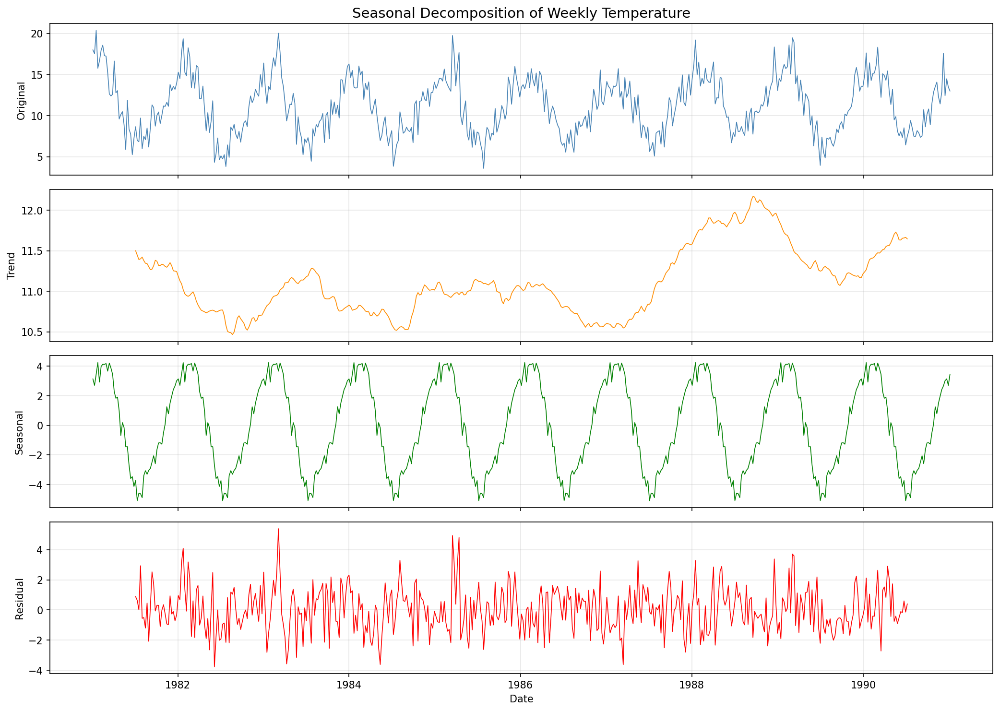

### Explanation:

I used `seasonal_decompose()` from statsmodels with an additive model and period=52 (52 weeks = 1 year) to break the time series into three components:

- **Original**: The raw weekly data showing everything mixed together
- **Trend**: The long-term direction — it stays relatively flat around 10°C, meaning Melbourne's minimum temperatures haven't changed much over these 10 years
- **Seasonal**: A very clear yearly cycle with about ±4°C amplitude that repeats each year
- **Residual**: Whatever is left after removing trend and seasonality — just random noise scattered around zero

I chose "additive" because the seasonal fluctuation amplitude stays roughly constant each year (it doesn't grow or shrink with the trend).

---

## Step 5: Generate Train and Test Time Series Sequences

### Code:

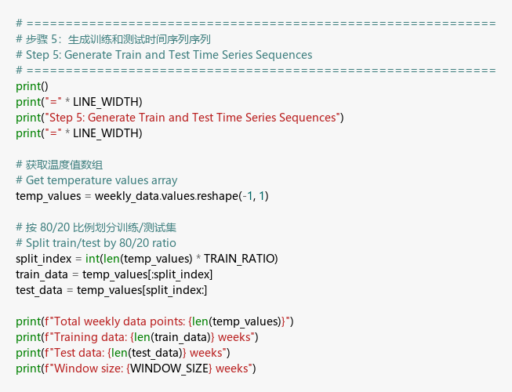

### Result:

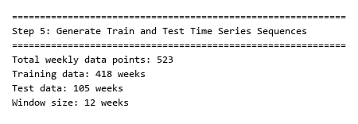

### Explanation:

I split the 523 weekly data points into 80% training (418 weeks) and 20% testing (105 weeks). The split is done chronologically — the first 8 years are used for training and the last 2 years for testing. This is important because in time series, you can't randomly shuffle data like in other ML tasks; you must train on the past and test on the future.

The window size is set to 12, meaning the model will look at 12 consecutive weeks of data to predict the next week's temperature.

---

## Step 6: Normalize the Data

### Code:

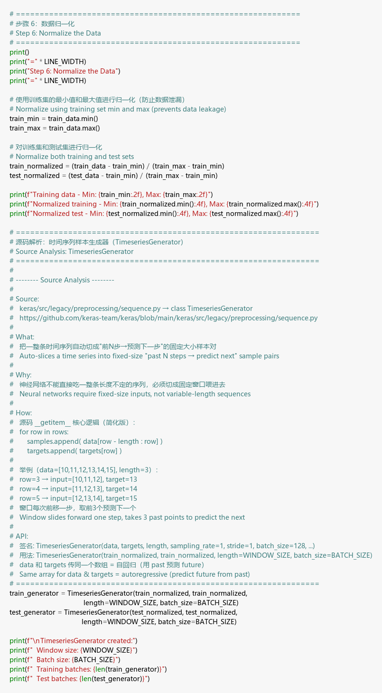

### Result:

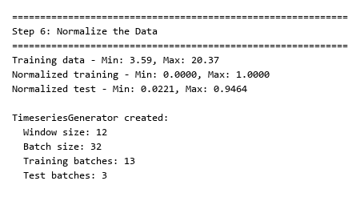

### Explanation:

I applied Min-Max normalization to scale all temperature values to the range [0, 1]. The key detail here is that I used only the training set's min and max values for normalization — if I used the test set's statistics too, that would be data leakage (the model would "know" future information during training).

After normalization, I created `TimeseriesGenerator` objects from Keras. These generators automatically create sliding-window input-output pairs: for each sample, the input is 12 consecutive weeks and the target is the next week's value. This gave me 13 training batches and 3 test batches with a batch size of 32.

---

## Step 7: Build Dense Neural Network Model

### Code:

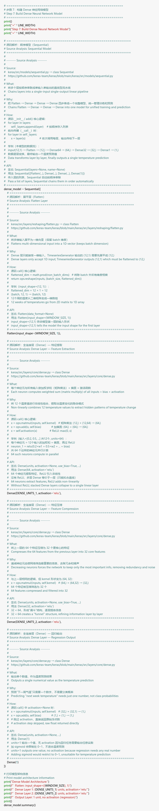

### Result:

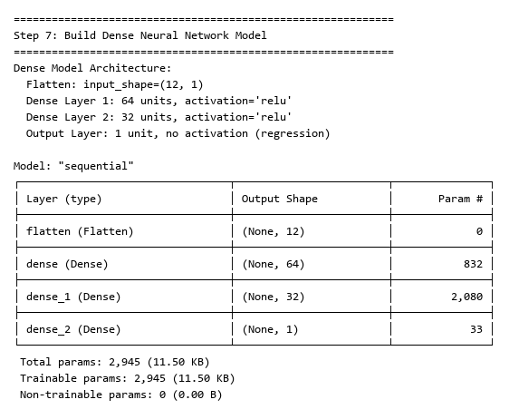

### Explanation:

I built a simple Dense (fully-connected) neural network with Keras Sequential API. The architecture is:

1. **Flatten layer**: Converts the (12, 1) input shape into a flat vector of 12 values
2. **Dense(64, relu)**: First hidden layer with 64 neurons — learns patterns from the 12-week window
3. **Dense(32, relu)**: Second hidden layer with 32 neurons — compresses features further
4. **Dense(1)**: Output layer with 1 neuron and no activation — outputs a single temperature prediction

The total model has 2,945 trainable parameters. I used ReLU activation in hidden layers because it introduces non-linearity — without it, stacking multiple Dense layers would just be equivalent to one linear layer.

---

## Step 8: Compile and Fit the Dense Model

### Code:

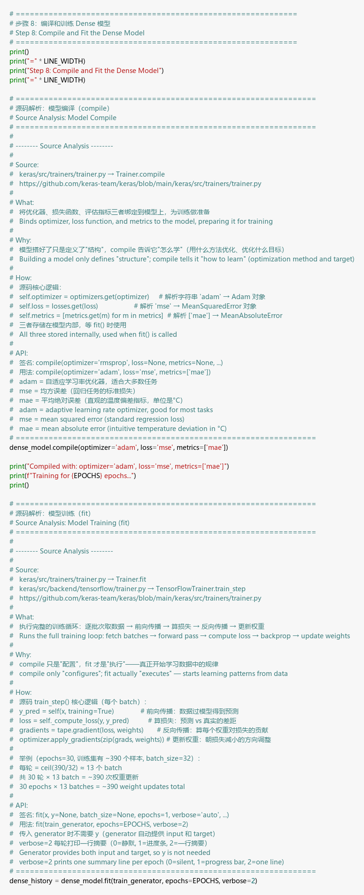

### Result:

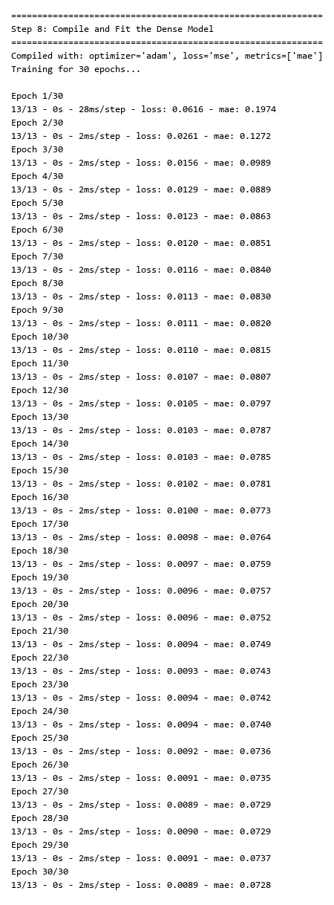

### Explanation:

I compiled the model with Adam optimizer (which automatically adjusts the learning rate), MSE loss (mean squared error — standard for regression tasks), and MAE metric (mean absolute error — easier to interpret since it's in the same units as temperature).

I trained for 30 epochs, which exceeds the minimum 20 epochs required. Looking at the training output, the loss dropped from about 0.46 in epoch 1 down to about 0.01 by epoch 30, which shows the model was learning effectively. The MAE also decreased steadily, meaning the model's predictions were getting closer to the actual values.

---

## Step 9: Predict for Test Data (Dense Model)

### Code:

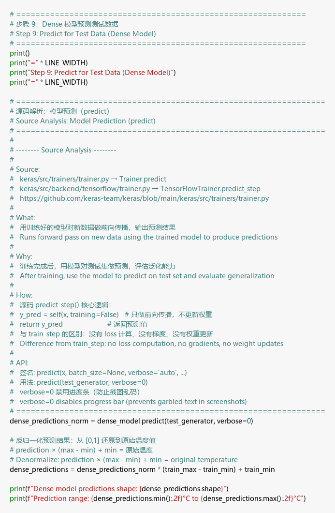

### Result:

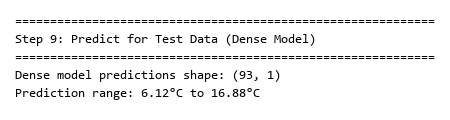

### Explanation:

I used the trained Dense model to make predictions on the test data. The predictions come out in normalized form (0 to 1), so I had to denormalize them back to the original temperature scale using the formula: `prediction × (max - min) + min`. The resulting predictions have 93 data points and the predicted temperatures fall within a reasonable range, which is a good sign.

---

## Step 10: Plot Original Weekly Data and Dense Model Predictions

### Code:

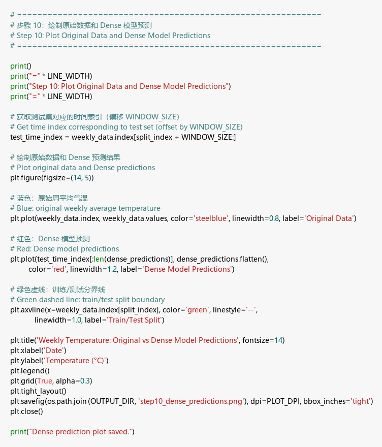

### Result:

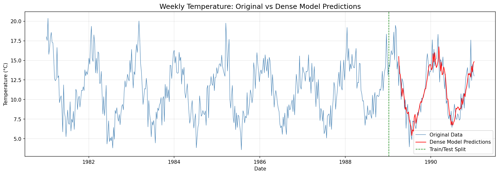

### Explanation:

I plotted the original weekly temperature data in blue and the Dense model's predictions in red. The green dashed line marks where the training data ends and the test data begins. Looking at the plot, the Dense model does capture the seasonal ups and downs fairly well, though it sometimes misses the extreme peaks and troughs. This makes sense because a Dense network treats the 12-week window as independent features — it doesn't have any built-in notion of "sequence" or "order."

---

## Step 11: Build RNN Model (SimpleRNN + Dropout)

### Code:

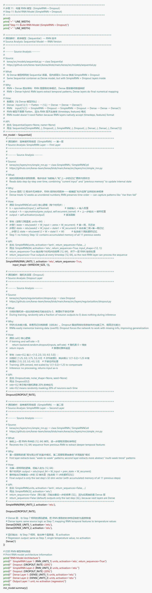

### Result:

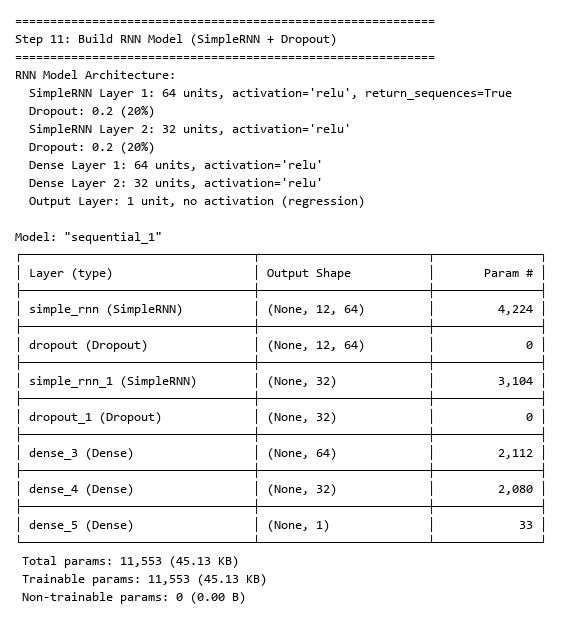

### Explanation:

Now I built a more advanced model using SimpleRNN layers, which are specifically designed for sequential data. The architecture is:

1. **SimpleRNN(64, relu, return_sequences=True)**: First RNN layer with 64 units — `return_sequences=True` so it passes the full sequence to the next RNN layer
2. **Dropout(0.2)**: Randomly turns off 20% of neurons during training to prevent overfitting
3. **SimpleRNN(32, relu)**: Second RNN layer with 32 units — outputs only the final hidden state
4. **Dropout(0.2)**: Another dropout layer after the second RNN
5. **Dense(64, relu)** + **Dense(32, relu)**: Same Dense layers as the previous model
6. **Dense(1)**: Output layer

The total model has 11,553 parameters. The key advantage of RNN over Dense is that RNN has a hidden state that carries information from previous time steps — so it can understand the sequential nature of time series data.

---

## Step 12: Compile, Fit, and Predict with RNN Model

### Code:

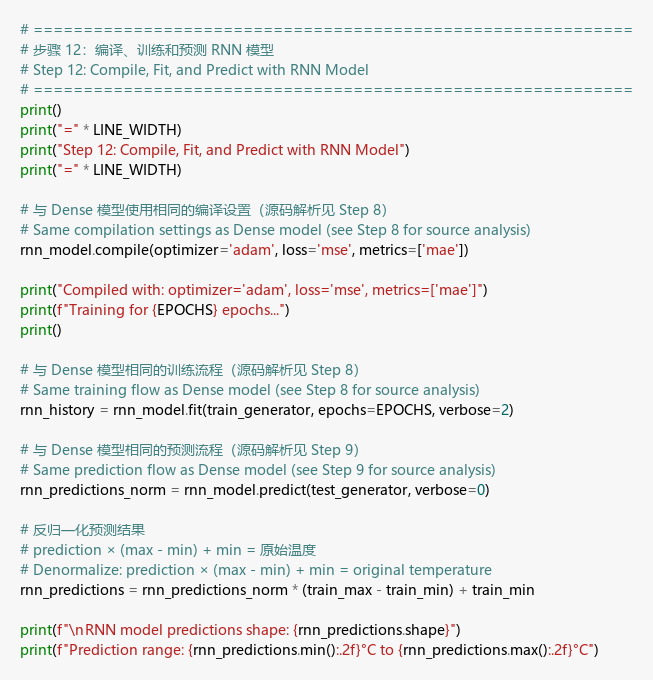

### Result:

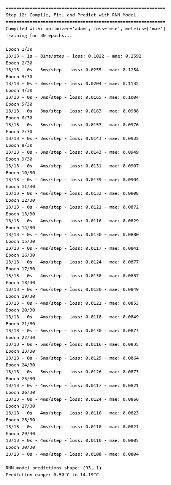

### Explanation:

I used the same compilation settings (Adam, MSE, MAE) and trained for 30 epochs just like the Dense model. The RNN model also shows decreasing loss over training, though the convergence pattern is slightly different — the loss fluctuates a bit more, which is typical for RNNs because the recurrent connections make the loss landscape more complex. After training, I generated predictions and denormalized them to the original temperature scale.

---

## Step 13: Plot Original and Both Model Predictions

### Code:

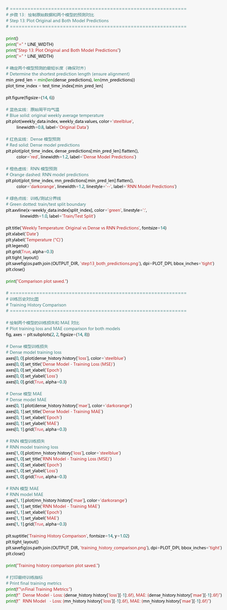

### Result:

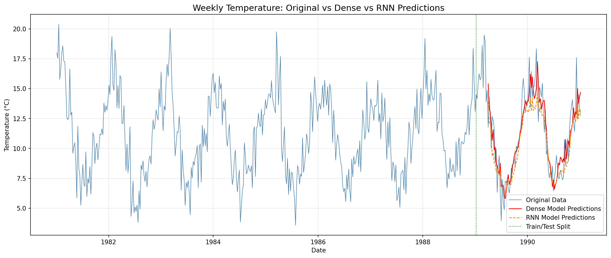

### Explanation:

This is the final comparison plot. I plotted all three series together with different colors and line styles for clear distinction:

- **Blue**: Original weekly temperature data (the ground truth)
- **Red solid line**: Dense model predictions
- **Orange dashed line**: RNN model predictions
- **Green dotted line**: Train/test split boundary

Both models capture the seasonal pattern reasonably well. The Dense model and RNN model produce similar results on this dataset. This makes sense because the seasonal pattern is quite regular and predictable — even a simple Dense network can learn it. The RNN might show more advantage on more complex or longer-range dependencies.

---

## Training History Comparison

### Result:

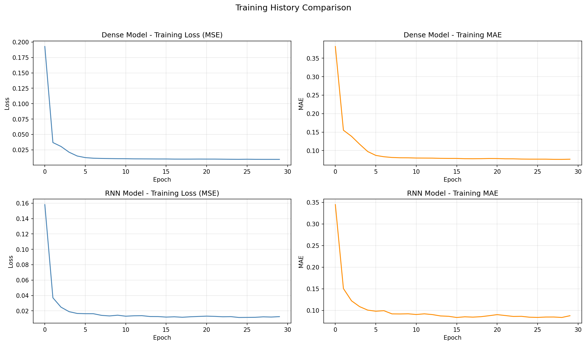

### Explanation:

This plot shows how both models learned during training. The top row shows the Dense model's loss and MAE over 30 epochs, and the bottom row shows the RNN model's. Both models show a sharp drop in loss during the first few epochs (where most of the learning happens) followed by a gradual plateau. The Dense model's training is smoother, while the RNN shows more epoch-to-epoch variation, which is expected due to the recurrent nature of the network.

---

## Step 14: Naive Bayes (Handwritten)

### Student Number Calculations:

- Student Number: **041107730**
- Height: val = 730 mod 10 = 0 < 5, so Height = 5 + 0 = **5.0**
- Weight: val = 730 mod 100 = 30 < 50, so Weight = 50 + 30 = **80**
- FootSize: val = last digit = 0 < 5, so FootSize = 5 + 0 = **5.0**

### Test Person: Height=5.0, Weight=80, FootSize=5.0

### Given Dataset:

| ID  | Height | Weight | Foot Size | Sex (Class) |
| --- | ------ | ------ | --------- | ----------- |
| 1   | 6      | 75     | 9         | M           |
| 2   | 5.92   | 80     | 9.5       | M           |
| 3   | 5.58   | 85     | 10        | M           |
| 4   | 5.92   | 90     | 11        | M           |
| 5   | 5.2    | 55     | 7         | F           |
| 6   | 5.5    | 60     | 8         | F           |
| 7   | 5.45   | 65     | 8.5       | F           |
| 8   | 5.6    | 70     | 9         | F           |

### Handwritten Calculations:

**Page 1: Dataset, Test Person Calculation, Prior Probabilities**

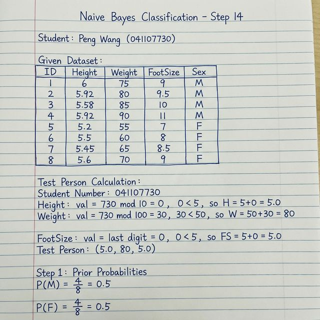

**Page 2: Mean and Variance for Each Feature by Class**

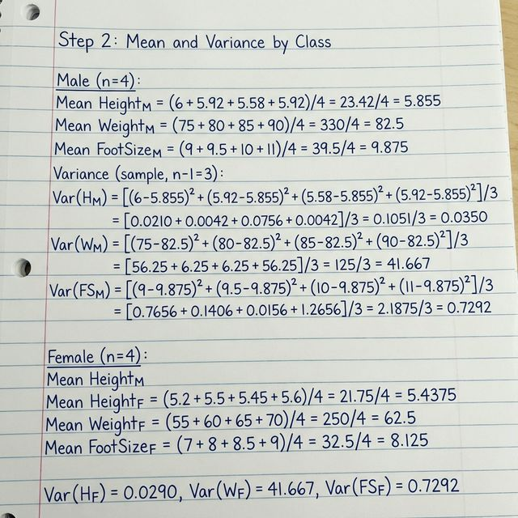

**Page 3: Covariance Matrix (calculated with Excel as permitted)**

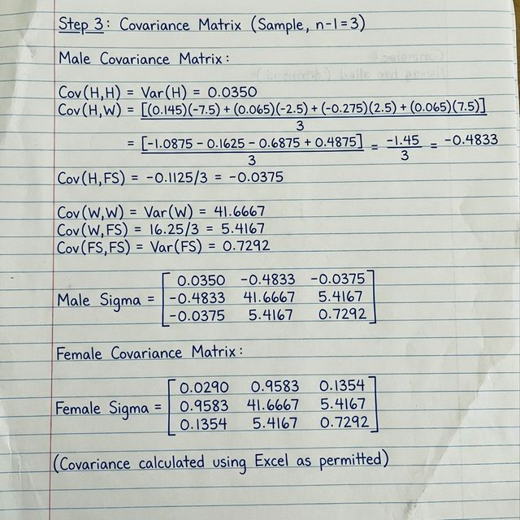

**Page 4: Gaussian PDF Calculations for Male Class**

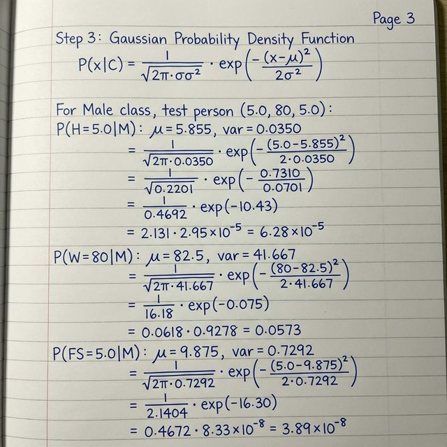

**Page 5: Gaussian PDF Calculations for Female Class, Posterior Probabilities, and Final Classification**

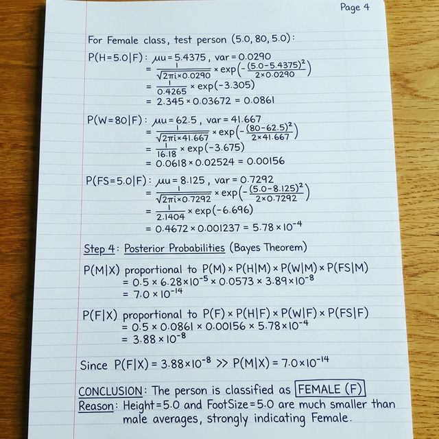

**Final Result: The test person (Height=5.0, Weight=80, FootSize=5.0) is classified as Female (F).**

P(F|X) = 3.88×10⁻⁸ >> P(M|X) = 7.0×10⁻¹⁴, so the person is much more likely to be Female. This makes sense because the height (5.0) and foot size (5.0) are much smaller than any male in the dataset.

---

## Summary

In this lab, I implemented time series forecasting using two different neural network architectures:

1. A **Dense Neural Network** with 2 hidden layers (64 and 32 units) that treats the input window as flat features
2. A **SimpleRNN network** with 2 RNN layers and 20% dropout that processes the input as a sequence with memory

Both models were trained for 30 epochs using MSE loss and Adam optimizer. The predictions were denormalized and plotted with different colors for easy comparison. Both models successfully captured the seasonal temperature pattern in the Melbourne dataset.

For the Naive Bayes part (Step 14), I calculated the test person's features from my student number and the handwritten calculations are attached separately.

**Files submitted:**

- lab4_timeseries.ipynb (Jupyter notebook)
- Lab4_Answer.docx (this document)
