# Lab 5 — RapidMiner Build Guide

## CST8506 — Clustering, Outlier Detection & Stacking

**Student:** Peng Wang | **Student Number:** 041107730

> This guide walks through building both Task 1 and Task 2 processes in RapidMiner Studio, operator by operator.
> Reference Python results are in `courses/ml/code/lab5/lab5_images/`.

---

## Prerequisites

- RapidMiner Studio installed (version 9.x or 10.x)
- **Anomaly Detection Extension** installed (for One-Class SVM operator)
  - Go to: `Help > Marketplace > Search "Anomaly Detection"` → Install → Restart
- Files in RapidMiner working directory or accessible path:
  - `EmployeesSalary.csv`
  - `diabetes.arff` (from Weka data folder, typically `C:\Program Files\Weka-3-8\data\diabetes.arff`)

---

## Task 1: Clustering & Outlier Detection

### Final Process Flow (Subprocess Architecture)

The process uses **subprocess operators** to organize the pipeline into logical blocks:

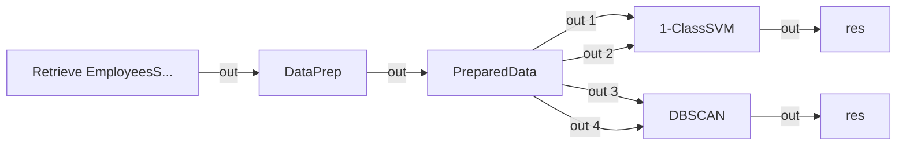

> The process is built as **one RMP file**. All steps are done in RapidMiner using subprocess operators.

---

### Build Steps

---

#### STEP 0 — New Process

1. Open RapidMiner Studio
2. `File > New Process`
3. Name it: `Lab5_Task1_Outlier_Clustering`

---

#### STEP 1 — Retrieve EmployeesSalary

拖拽 **Retrieve**（`Repository > Retrieve`）到画布，`repository entry` 选择 `/data/EmployeesSalary`。

**操作步骤：**

1. 先用 Import Data 向导将 `EmployeesSalary.csv` 导入 Local Repository
2. 拖拽 **Retrieve** 到画布，Parameters → 选择已存储的 EmployeesSalary 数据集
3. 验证 9 列：Id, first_name, last_name, email, Address, Country, Branch, Currency, Salary

---

#### STEP 2 — DataPrep (Subprocess)

拖拽 **Subprocess**（`Utility > Subprocess`）到画布，重命名为 `DataPrep`。

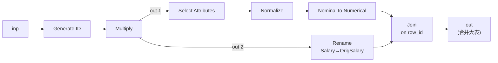

**各算子参数详情：**

**① Generate ID**

| 参数 Parameter       | 值 Value | 含义 Meaning                              |
| -------------------- | -------- | ----------------------------------------- |
| `create nominal ids` | false    | 生成数值类型的 `row_id` 列，用于后续 Join |

**② Multiply** — 输出 2 路：一路做预处理，一路保留原始数据

**③ Select Attributes**

| 参数 Parameter          | 值 Value                                  | 含义 Meaning                                                     |
| ----------------------- | ----------------------------------------- | ---------------------------------------------------------------- |
| `attribute filter type` | subset                                    | 手动选择要保留的列                                               |
| `attributes`            | `Country`, `Currency`, `Salary`, `row_id` | 保留特征列和 ID 列。去掉 Branch（与 Country 冗余）和其他非特征列 |

**④ Normalize**

| 参数 Parameter          | 值 Value         | 含义 Meaning                               |
| ----------------------- | ---------------- | ------------------------------------------ |
| `method`                | Z-transformation | 标准化：(x - μ) / σ                        |
| `attribute filter type` | subset           | 仅对 `Salary` 做标准化（唯一的连续数值列） |

**⑤ Nominal to Numerical**

| 参数 Parameter          | 值 Value     | 含义 Meaning                      |
| ----------------------- | ------------ | --------------------------------- |
| `coding type`           | dummy coding | One-Hot 编码                      |
| `attribute filter type` | subset       | 对 `Country` 和 `Currency` 做编码 |

**⑥ Rename**（放在原始数据路径上，Multiply out 2 → Rename → Join right）

| 参数 Parameter | 值 Value     | 含义 Meaning                                      |
| -------------- | ------------ | ------------------------------------------------- |
| `old name`     | `Salary`     | 原始 Salary 列                                    |
| `new name`     | `OrigSalary` | 重命名为 OrigSalary，避免与标准化后的 Salary 冲突 |

**⑦ Join**

| 参数 Parameter   | 值 Value       | 含义 Meaning               |
| ---------------- | -------------- | -------------------------- |
| `join type`      | **Inner Join** | 将预处理结果与原始数据合并 |
| `key attributes` | `row_id`       | 用 row_id 作为连接键       |

> 输出一张大表：原始列（id, first_name, last_name, email, Address, Country, Branch, Currency, **OrigSalary**）+ 预处理列（标准化 Salary、编码后的特征）

---

#### STEP 3 — PreparedData (Multiply)

拖拽 **Multiply**（`Utility > Multiply`）到画布，重命名为 `PreparedData`。

- 接收 DataPrep 输出的合并大表
- 右键算子 → 添加 output 端口至 **5 个**，分别连接到 1-ClassSVM（2 个）和 DBSCAN（2 个）的输入端口

---

#### STEP 4 — 1-ClassSVM (Subprocess)

拖拽 **Subprocess**（`Utility > Subprocess`）到画布，重命名为 `1-ClassSVM`。

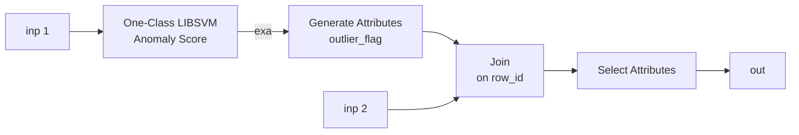

**各算子参数详情：**

**① One-Class LIBSVM Anomaly Score**

| 参数 Parameter           | 值 Value      | 含义 Meaning           |
| ------------------------ | ------------- | ---------------------- |
| `svm type`               | **one-class** | 单类 SVM 模式（默认）  |
| `svm kernel type`        | **rbf**       | 径向基核函数           |
| `automatic gamma tuning` | ✅ checked    | 自动调整 gamma 参数    |
| `nu`                     | **0.5**       | 异常值比例上限（默认） |
| `epsilon`                | 0.001         | 收敛精度（默认）       |
| `shrinking`              | ✅ checked    | 启用收缩加速（默认）   |

> 位置：`Extensions > AnomalyDetection`。无需 label。

**② Generate Attributes**

| 参数 Parameter         | 值 Value                             | 含义 Meaning                                 |
| ---------------------- | ------------------------------------ | -------------------------------------------- |
| `attribute name`       | **outlier_flag**                     | 新建一个布尔标志列                           |
| `function expressions` | `if(outlier > 1.5, "true", "false")` | 分数越高越异常，正常值 ~1.0，>1.5 标记为异常 |

**③ Join**

| 参数 Parameter   | 值 Value       | 含义 Meaning                     |
| ---------------- | -------------- | -------------------------------- |
| `join type`      | **Inner Join** | 将检测结果与大表合并，恢复原始列 |
| `key attributes` | `row_id`       | 用 row_id 作为连接键             |

**④ Select Attributes**

| 参数 Parameter          | 值 Value                                                                                                                      | 含义 Meaning      |
| ----------------------- | ----------------------------------------------------------------------------------------------------------------------------- | ----------------- |
| `attribute filter type` | subset                                                                                                                        | 保留最终展示列    |
| `attributes`            | `id`, `outlier`, `outlier_flag`, `first_name`, `last_name`, `email`, `Address`, `Country`, `Branch`, `Currency`, `OrigSalary` | 原始列 + 异常值列 |

**输出结果表格式：**

| Row No. | id  | outlier | outlier_flag ↓ | first_name | last_name | email | Address | Country | Branch | Currency | OrigSalary |
| ------- | --- | ------- | -------------- | ---------- | --------- | ----- | ------- | ------- | ------ | -------- | ---------- |

> 截图时过滤只显示 `outlier_flag = true` 的行。

---

#### STEP 5 — DBSCAN (Subprocess)

拖拽 **Subprocess**（`Utility > Subprocess`）到画布，重命名为 `DBSCAN`。

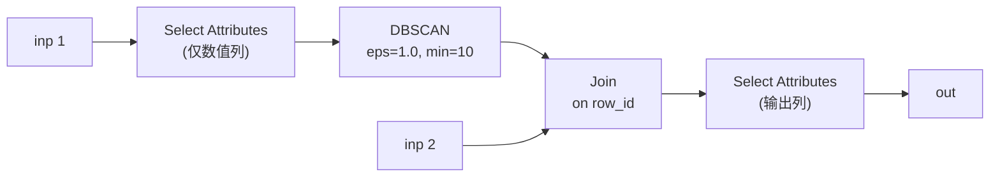

**各算子参数详情：**

**① Select Attributes**（过滤出数值列，DBSCAN 不接受名义型）

| 参数 Parameter          | 值 Value                                                                                                                                                                                                        | 含义 Meaning                              |
| ----------------------- | --------------------------------------------------------------------------------------------------------------------------------------------------------------------------------------------------------------- | ----------------------------------------- |
| `attribute filter type` | subset                                                                                                                                                                                                          | 只保留预处理后的数值列                    |
| `attributes`            | `Salary`, `Country = China`, `Country = Germany`, `Country = Japan`, `Country = Mexico`, `Country = U.S.A.`, `Currency = CHY`, `Currency = EUR`, `Currency = INR`, `Currency = MXD`, `Currency = USD`, `row_id` | 标准化的 Salary + one-hot 编码列 + row_id |

> 注：one-hot 列名格式为 `列名 = 值`，具体列名以实际输出为准。

**② DBSCAN**

| 参数 Parameter      | 值 Value               | 含义 Meaning                   |
| ------------------- | ---------------------- | ------------------------------ |
| `epsilon`           | **1.0**                | 邻域半径 ε（默认）             |
| `minimal points`    | **10**                 | 核心点所需的最少邻居数（默认） |
| `measure_types`     | Numerical Measures     | 距离度量类型                   |
| `numerical_measure` | **Euclidean Distance** | 欧氏距离                       |

**③ Join**

| 参数 Parameter   | 值 Value       | 含义 Meaning                     |
| ---------------- | -------------- | -------------------------------- |
| `join type`      | **Inner Join** | 将聚类结果与大表合并，恢复原始列 |
| `key attributes` | `row_id`       | 用 row_id 作为连接键             |

**④ Select Attributes**（输出列）

| 参数 Parameter          | 值 Value                                                                                                                          | 含义 Meaning                                            |
| ----------------------- | --------------------------------------------------------------------------------------------------------------------------------- | ------------------------------------------------------- |
| `attribute filter type` | subset                                                                                                                            | 保留最终展示列                                          |
| `attributes`            | `id`, `score(cluster_0)`, `cluster`, `first_name`, `last_name`, `email`, `Address`, `Country`, `Branch`, `Currency`, `OrigSalary` | 聚类得分、聚类标签 + 原始列（score 列数取决于聚类结果） |

**输出结果表格式：**

| Row No. | id  | score(cluster_0) | cluster ↑ | first_name | last_name | email | Address | Country | Branch | Currency | OrigSalary |
| ------- | --- | ---------------- | --------- | ---------- | --------- | ----- | ------- | ------- | ------ | -------- | ---------- |

> 注：score 列数量取决于 DBSCAN 找到的聚类数。默认参数下可能只有 1 个聚类（cluster_0）+ noise。

> 截图时：① 截一张 DBSCAN 模型可视化；② 过滤 `cluster = noise` 显示噪声实例。

### Task 1 — Screenshots Checklist

| #   | Screenshot                       | What to Capture                                                                                                 |
| --- | -------------------------------- | --------------------------------------------------------------------------------------------------------------- |
| ✅  | `task1_00_process_overview.png`  | Full canvas showing all 5 subprocess operators                                                                  |
| ✅  | `task1_01_data_prep.png`         | Inside DataPrep subprocess (preprocessing operators)                                                            |
| ✅  | `task1_02_ocsvm_settings.png`    | Inside 1-ClassSVM subprocess, Detect Outlier parameters (kernel=Radial, nu=0.05)                                |
| ✅  | `task1_03_outlier_instances.png` | Result: id, outlier, outlier_flag, first_name, last_name, email, Address, Country, Branch, Currency, OrigSalary |
| ✅  | `task1_04_dbscan_model.png`      | DBSCAN cluster model visualization                                                                              |
| ✅  | `task1_05_noise_instances.png`   | Result with score(cluster_0..3), cluster, plus original columns; filtered to noise                              |

---

## Task 2: Sampling and Stacking

### Final Process Flow (Subprocess Architecture)

Task 2 也使用 **subprocess operators** 组织流程：

**Top-level（数据加载，单独运行一次）：**

**Main process（主流程）：**

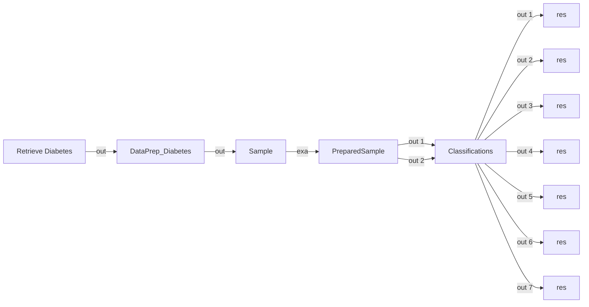

---

### Build Steps

---

#### STEP 0 — New Process

1. `File > New Process`
2. Name it: `Lab5_Task2_Sampling_Stacking`

---

#### STEP 1 — Read ARFF + Store

1. 拖拽 **Read ARFF**（`Import > Read ARFF`）到画布，`data file` 选择 `C:\Program Files\Weka-3-8\data\diabetes.arff`
2. 拖拽 **Store**（`Repository > Store`）到画布，`repository entry` 设为 `/data/diabetes`
3. 连接：Read ARFF `out` → Store `inp`
4. 运行 (Ctrl+R) 将数据存储到 Local Repository

> 运行后，diabetes 数据存储在 Local Repository，共 768 行 9 列。

---

#### STEP 2 — Retrieve Diabetes

拖拽 **Retrieve**（`Repository > Retrieve`）到画布，`repository entry` 选择 `/data/diabetes`，连接 `out` → DataPrep_Diabetes `inp`。

---

#### STEP 3 — DataPrep_Diabetes (Subprocess)

拖拽 **Subprocess**（`Utility > Subprocess`）到画布，重命名为 `DataPrep_Diabetes`。

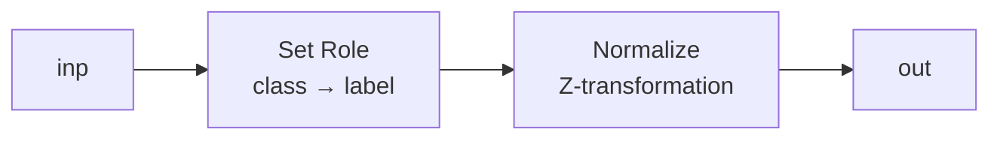

**各算子参数详情：**

**① Set Role**

| 参数 Parameter   | 值 Value  | 含义 Meaning                                                      |
| ---------------- | --------- | ----------------------------------------------------------------- |
| `attribute name` | `class`   | 选择 `class` 列                                                   |
| `target role`    | **label** | 将 `class` 列设为目标变量（标签），告诉 RapidMiner 这是要预测的列 |

**② Normalize**

| 参数 Parameter          | 值 Value         | 含义 Meaning                                                                                                                      |
| ----------------------- | ---------------- | --------------------------------------------------------------------------------------------------------------------------------- |
| `method`                | Z-transformation | 标准化：(x - μ) / σ                                                                                                               |
| `attribute filter type` | all（默认）      | 对所有 8 个数值特征做标准化。kNN 和 SVM 是基于距离的算法，必须标准化防止大尺度特征（如 insu 0–846）支配小尺度特征（如 preg 0–17） |

---

#### STEP 4 — Sample (Bootstrapping)

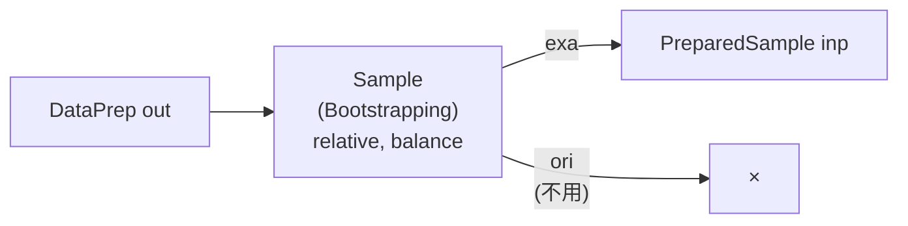

| 字段 Field              | 值 Value                                                  |
| ----------------------- | --------------------------------------------------------- |
| **算子 Operator**       | Sample (Bootstrapping)                                    |
| **显示名 Display Name** | `Sample`                                                  |
| **位置 Location**       | `Data Transformation > Sampling > Sample (Bootstrapping)` |

| 参数 Parameter             | 值 Value      | 含义 Meaning                                               |
| -------------------------- | ------------- | ---------------------------------------------------------- |
| `sample`                   | **relative**  | 用比例指定采样量                                           |
| `balance data`             | ✅ **勾选**  | 平衡类别：通过有放回采样使两类数量相等，解决类别不平衡问题 |
| `sample ratio per class`   | 见下表        | 点 Edit List，为每类指定比例                               |
| `use local random seed`    | ✅ **勾选**  | 启用随机种子                                               |
| `local random seed`        | **730**       | 随机种子（学号后三位），确保结果可复现                     |

**sample ratio per class 设置：**

| class           | ratio   |
| --------------- | ------- |
| tested_negative | **1.0** |
| tested_positive | **1.0** |

> 目标结果：两类各 500，共 1000 个实例（少数类通过有放回采样补齐到多数类数量）。

---

#### STEP 5 — PreparedSample (Subprocess)

拖拽 **Subprocess**（`Utility > Subprocess`）到画布，重命名为 `PreparedSample`。

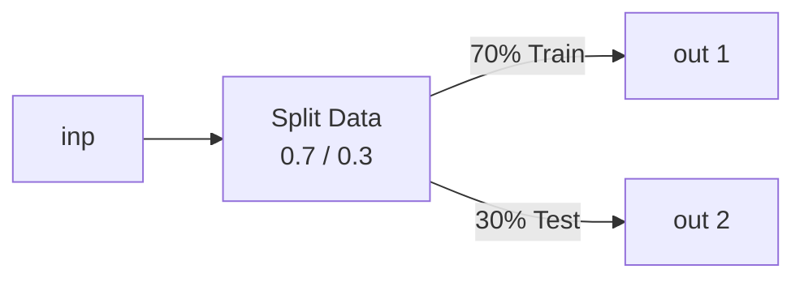

**各算子参数详情：**

**① Split Data**

| 参数 Parameter      | 值 Value                | 含义 Meaning                               |
| ------------------- | ----------------------- | ------------------------------------------ |
| `partitions`        | **0.7 / 0.3**           | 70% 训练集、30% 测试集                     |
| `sampling type`     | **stratified sampling** | 分层采样：保证训练集和测试集的类别比例一致 |
| `use local random seed` | ✅ **勾选**         | 启用随机种子                               |
| `local random seed` | **730**                 | 随机种子，确保可复现                       |

> 注意：需要给 PreparedSample 添加第二个 out 端口（右键子流程 > Add Port）。

---

#### STEP 6 — Classifications (Subprocess)

拖拽 **Subprocess**（`Utility > Subprocess`）到画布，重命名为 `Classifications`。
需要 2 个 inp（train/test）和 7 个 out。

**内部结构：**

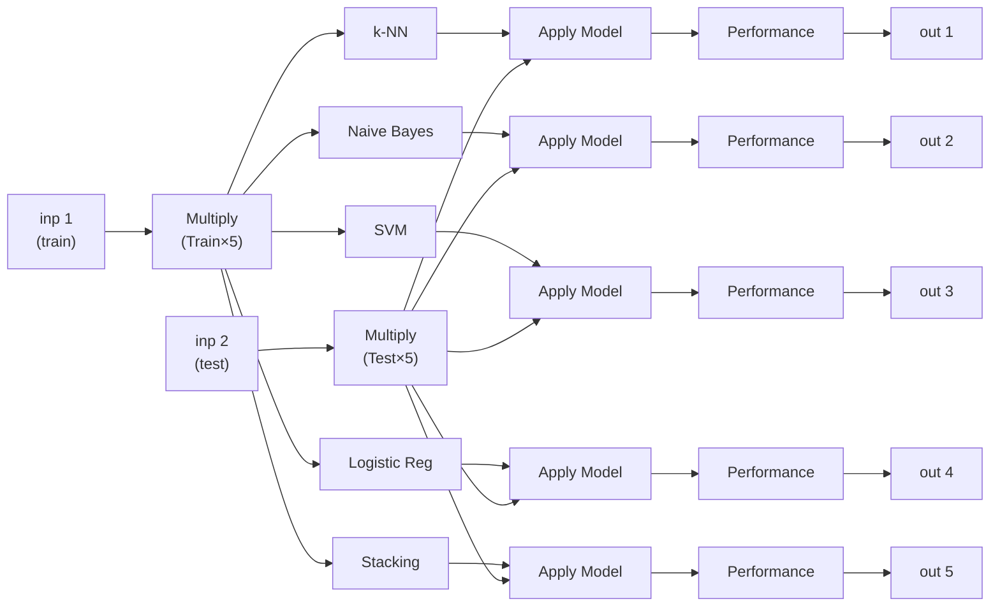

> 每个模型的模式：train → 模型训练 → Apply Model ← test → Performance → out
>
> Multiply (Train) 输出 5 路，Multiply (Test) 输出 5 路，保证所有模型用相同数据。

**各模型参数详情：**

**① kNN**

| 参数 Parameter      | 值 Value               | 含义 Meaning                        |
| ------------------- | ---------------------- | ----------------------------------- |
| `k`                 | **5**                  | 取最近 5 个邻居的多数类进行投票预测 |
| `weighted vote`     | **false**              | 不加权：所有邻居的投票权重相同      |
| `numerical measure` | **Euclidean Distance** | 欧氏距离度量                        |

**② Naïve Bayes**

| 参数 Parameter | 值 Value | 含义 Meaning                                             |
| -------------- | -------- | -------------------------------------------------------- |
| （全部默认）   | —        | 使用默认配置：假设特征条件独立，用贝叶斯定理计算后验概率 |

**③ SVM**

| 参数 Parameter | 值 Value          | 含义 Meaning                             |
| -------------- | ----------------- | ---------------------------------------- |
| `svm_type`     | **C-SVC**（默认） | 标准二分类 SVM                           |
| `kernel_type`  | **Radial** (RBF)  | 径向基核函数：捕捉非线性决策边界         |
| `C`            | **1.0**           | 正则化参数：平衡分类间隔宽度与误分类惩罚 |

**④ Logistic Regression**

| 参数 Parameter | 值 Value | 含义 Meaning                               |
| -------------- | -------- | ------------------------------------------ |
| （全部默认）   | —        | 使用默认配置：对归一化数据拟合线性决策边界 |

**⑤ Stacking**

| 参数 Parameter              | 值 Value                           | 含义 Meaning                                      |
| --------------------------- | ---------------------------------- | ------------------------------------------------- |
| Base learners（内部子流程） | **k-NN**, **Naive Bayes**, **SVM** | 3 个基础学习器分别对训练数据做预测                |
| Meta-learner                | **Logistic Regression**            | 元学习器：学习如何最优地组合 3 个基础学习器的预测 |

> 双击 Stacking 算子进入子流程，内部分两个面板：

**左侧 Base Learner：**

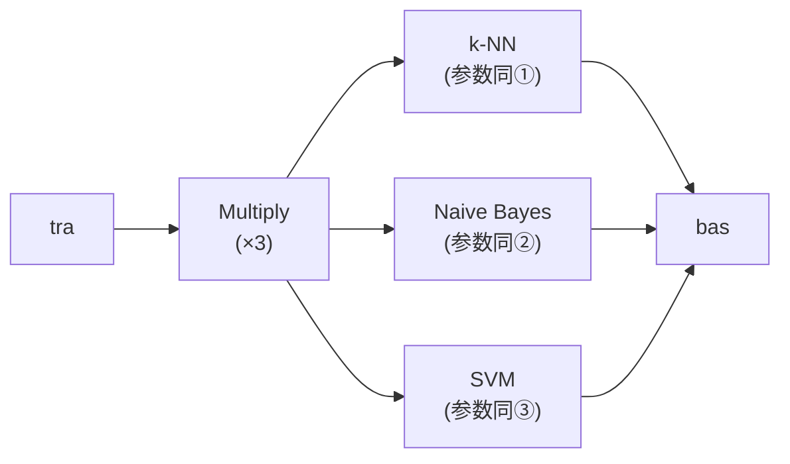

> `tra` → Multiply(3路) → 3个模型的 `tra` 输入，模型输出不用手动连。

**右侧 Stacking Model Learner：**

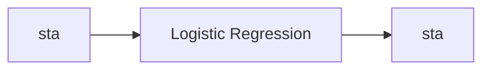

> 拖一个 Logistic Regression，连 `sta → LR tra`，`LR mod → sta` 输出。

**辅助算子（每个模型都需要）：**

| 算子 Operator                | 位置 Location                                             | 含义 Meaning                               |
| ---------------------------- | --------------------------------------------------------- | ------------------------------------------ |
| Apply Model                  | `Scoring > Apply Model`                                   | 将训练好的模型应用到测试集上，得到预测结果 |
| Performance (Classification) | `Evaluation > Performance > Performance (Classification)` | 计算分类性能指标                           |

**Performance 参数：**

| 参数 Parameter     | 值 Value | 含义 Meaning |
| ------------------ | -------- | ------------ |
| `accuracy`         | ✅ 勾选  | 准确率       |
| `precision`        | ✅ 勾选  | 精确率       |
| `recall`           | ✅ 勾选  | 召回率       |
| `f_measure`        | ✅ 勾选  | F1 分数      |
| `confusion matrix` | ✅ 勾选  | 混淆矩阵     |

> 每个 Performance 的 `per` 输出端口连接到 Classifications 子流程的对应 `out` 端口。

---

### Task 2 — Screenshots Checklist

| #   | Screenshot                      | What to Capture                                                                                         |
| --- | ------------------------------- | ------------------------------------------------------------------------------------------------------- |
| ✅  | `task2_00_process_overview.png` | Full canvas showing Read ARFF → Store + Retrieve → DataPrep → Sample → PreparedSample → Classifications |
| ✅  | `task2_01_dataset_loaded.png`   | Diabetes data table (768 rows, class distribution)                                                      |
| ✅  | `task2_02_data_prep.png`        | Inside DataPrep_Diabetes subprocess (Set Role + Normalize)                                              |
| ✅  | `task2_03_before.png`           | Class distribution before resampling (500/268)                                                          |
| ✅  | `task2_03_after.png`            | Class distribution after resampling (500/500)                                                           |
| ✅  | `task2_04_split.png`            | Inside PreparedSample: Split Data parameters (0.7/0.3, seed=730)                                        |
| ✅  | `task2_05_knn.png`              | kNN Performance results                                                                                 |
| ✅  | `task2_05_nb.png`               | Naive Bayes Performance results                                                                         |
| ✅  | `task2_05_svm.png`              | SVM Performance results                                                                                 |
| ✅  | `task2_05_lr.png`               | Logistic Regression Performance results                                                                 |
| ✅  | `task2_06_stacking_setup.png`   | Inside Classifications: Stacking operator with 3 base learners + LR meta                                |
| ✅  | `task2_06_stacking_result.png`  | Stacking Performance results                                                                            |

---

## Results Summary (from Python Verification)

Use these as reference when filling out the Answer Template. Actual RapidMiner results may vary slightly.

### Task 1

| Metric                 | Result         |
| ---------------------- | -------------- |
| Total instances        | 155            |
| Outliers (1-Class SVM) | **42** (27.1%) |
| DBSCAN clusters        | **4**          |
| DBSCAN noise points    | **4**          |

**4 noise instances (investigation priority):**

| Id       | Country | Branch | Currency | Salary         | Issue                                 |
| -------- | ------- | ------ | -------- | -------------- | ------------------------------------- |
| 40010160 | Germany | 1      | EUR      | **60,500,999** | Salary data entry error (×1000 off)   |
| 41010220 | USA     | **6**  | USD      | ~81,000        | Invalid branch number                 |
| 41110300 | USA     | 2      | USD      | **32,000,999** | Salary data entry error (×1000 off)   |
| 41110350 | Mexico  | 2      | **MXD**  | ~71,000        | Invalid currency code (should be MXN) |

### Task 2 (RapidMiner 实际结果)

| Model                          | Accuracy     | Positive Recall | Negative Recall |
| ------------------------------ | ------------ | --------------- | --------------- |
| kNN (k=5)                      | 73.48%       | 47.50%          | 87.33%          |
| **Naïve Bayes**                | **77.83%** 🥇| 55.00%          | 90.00%          |
| SVM (RBF)                      | 77.39%       | 50.00%          | 92.00%          |
| Logistic Regression            | 73.48%       | 37.50%          | 92.67%          |
| Stacking (kNN+NB+SVM → LR)    | 74.78%       | 51.26%          | 87.33%          |

**混淆矩阵：**

| 模型 | TP | FP | FN | TN |
|------|----|----|----|----|
| kNN | 38 | 19 | 42 | 131 |
| NB | 44 | 15 | 36 | 135 |
| SVM | 40 | 12 | 40 | 138 |
| LR | 30 | 11 | 50 | 139 |
| Stacking | 41 | 19 | 39 | 131 |

---

## Common Issues & Fixes

| Issue                                        | Fix                                                                                       |
| -------------------------------------------- | ----------------------------------------------------------------------------------------- |
| "Detect Outlier (Support Vectors)" not found | Install Anomaly Detection extension via `Help > Marketplace`                              |
| DBSCAN gives only 1 cluster                  | Decrease epsilon (try 1.0 or 0.8) or decrease min_points (try 3)                          |
| Join produces extra `_right` columns         | Add another Select Attributes after Join to remove duplicates                             |
| Stacking base learners not configurable      | Double-click the Stacking operator to enter the subprocess                                |
| Performance shows NaN for precision/recall   | Set `positive class` parameter in Performance to `tested_positive`                        |
| Resample doesn't balance classes             | Try `Sample (Bootstrapping)` with balance=true, or manually oversample the minority class |
| SVM very slow                                | Reduce `C` parameter or use linear kernel first to test pipeline                          |

---

## Submission Checklist

Before submitting, verify:

- [ ] Task 1 `.rmp` file saved and tested (runs without errors)
- [ ] Task 2 `.rmp` file saved and tested (runs without errors)
- [ ] All screenshots taken and placed in `lab5_screenshots/` folder
- [ ] Answer Template (`Lab5AnswerTemplate.md`) filled with all screenshots and explanations
- [ ] Results table completed with actual RapidMiner numbers
- [ ] Student name and number correct at top of Answer Template
- [ ] All files submitted to Brightspace (`.rmp` + answer document, NOT zipped)
