# Week 10: 分类器融合 (Classifier Fusion)

> Source: `Week10_ClassifierFusion.pdf`
> Total slides: 28
> Instructor: Dr. Abbas Akkasi | Winter 2026

---

## 1. 分类器融合简介 (Introduction to Classifier Fusion)

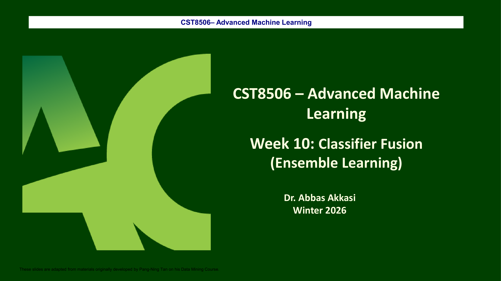

**CST8506 – Advanced Machine Learning:** — CST8506 – 高级机器学习

- Week 10: Classifier Fusion (Ensemble Learning) — 第10周：分类器融合（集成学习）
- These slides are adapted from materials originally developed by Pang-Ning Tan on his Data Mining Course. — 这些幻灯片改编自 Pang-Ning Tan 当初在其数据挖掘课程中开发的材料。

> **📝 承接与解释 (Transition & Explanation):**
> 
> **当前解读**: 这是本周课程的封面，明确了核心主题为“分类器融合”，在学术界更常用的称呼是“集成学习（Ensemble Learning）”。
> **上下文承接**: 作为整节课的起点，它为下一页详细定义“集成方法”做出了直接的引入。

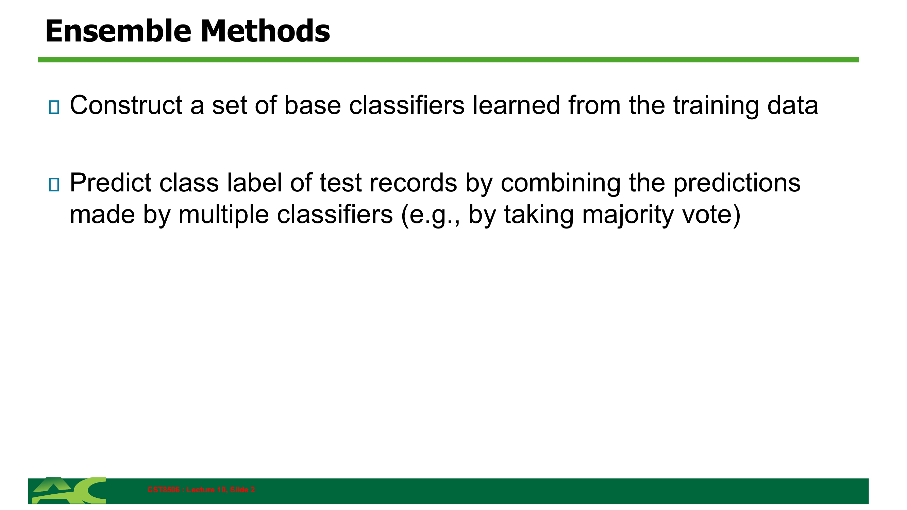

**Ensemble Methods:** — 集成方法

- Construct a set of base classifiers learned from the training data — 从训练数据中训练并构建一组基分类器
- Predict class label of test records by combining the predictions made by multiple classifiers (e.g., by taking majority vote) — 通过组合多个分类器的预测结果（例如，采取多数投票）来预测测试样本的类别标签

> **📝 承接与解释 (Transition & Explanation):**
> 
> **当前解读**: 明确给出了集成方法的工作机制：不依赖单一模型，而是训练多个模型（基分类器）然后聚合它们的结果。
> **上下文承接**: 承接前一页的概念引入，这页讲解了集成学习“是什么”和“怎么做”；自然引发了下一页的核心疑问——“我们为什么需要这么做？这样做有什么好处？”

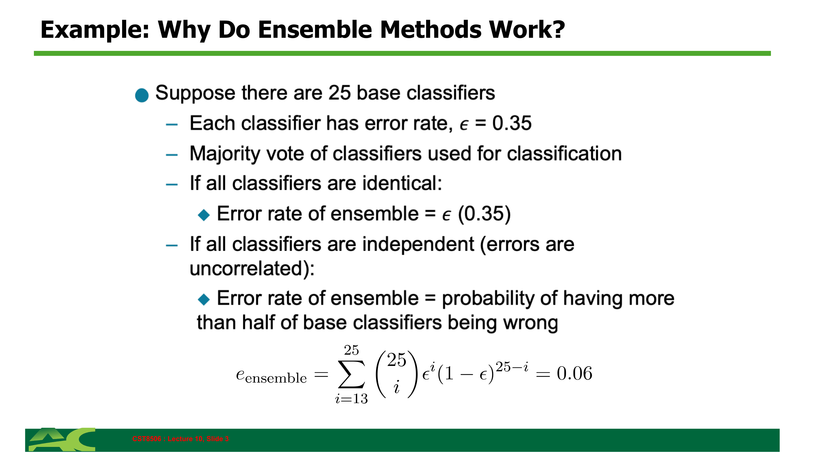

**Example: Why Do Ensemble Methods Work?:** — 示例：为什么集成方法有效？

- (Diagram shows multiple linear classifiers incorrectly classifying a non-linear boundary, but their ensemble creates a non-linear decision boundary capable of separating the classes perfectly.) — （图示展示了单个线性分类器无法正确分类非线性边界，但是它们的集成能够创建完美的非线性决策边界。）

> **📝 承接与解释 (Transition & Explanation):**
> 
> **当前解读**: 通过图解直观地展示了集成学习的强大之处：多个“弱”的线性分类器融合后，能够拟合出复杂的“非线性”分类边界。
> **上下文承接**: 回答了前一页留下的动机问题“为什么这么做”；同时也暗示了这种成功是有前提的，从而平滑过渡到下一页探讨“集成方法生效的必要条件”。

---

## 2. 集成学习的必要条件与原理 (Necessary Conditions & Rationale)

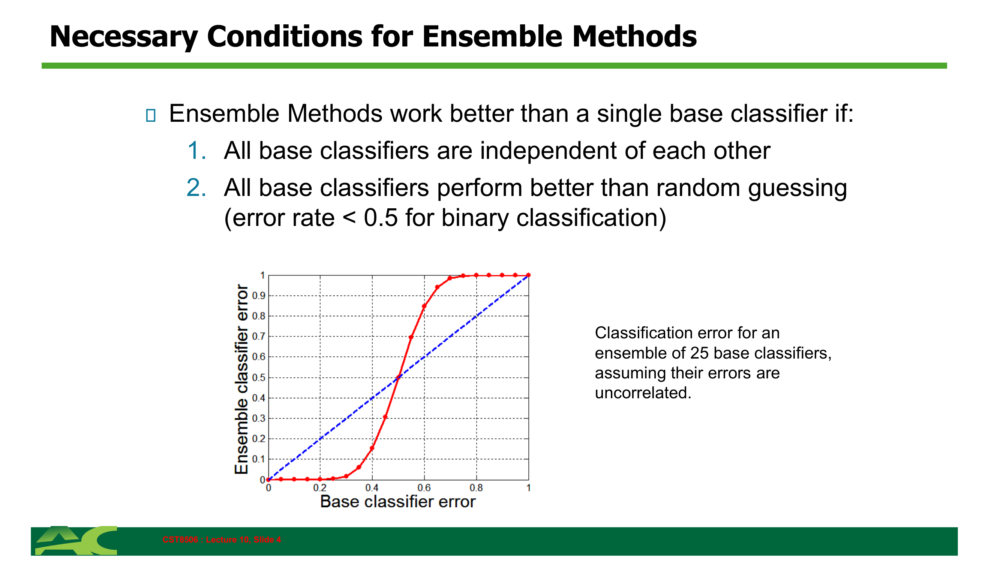

**Necessary Conditions for Ensemble Methods:** — 集成方法的必要条件

- Ensemble Methods work better than a single base classifier if: — 如果满足以下条件，集成方法将比单一基分类器表现更好：
  1. All base classifiers are independent of each other — 1. 所有基分类器彼此独立
  2. All base classifiers perform better than random guessing (error rate < 0.5 for binary classification) — 2. 所有基分类器的表现都优于随机猜测（在二分类中错误率小于0.5）
- Classification error for an ensemble of 25 base classifiers, assuming their errors are uncorrelated. — 假设错误互不相关，25个基分类器的集成可显著降低分类错误率。

> **📝 承接与解释 (Transition & Explanation):**
> 
> **当前解读**: 提出了集成学习成功的核心数学假设——“独立性”和“好于随机（准确率>50%）”。只要满足这两个条件，大数定律保证了集成错误率会呈指数级下降。
> **上下文承接**: 上一页展示了集成的成功案例，这一页总结出普适的前提条件；由此，下一页将从模型选择的角度，说明为什么我们要特意挑选“不稳定”的模型来做基分类器。

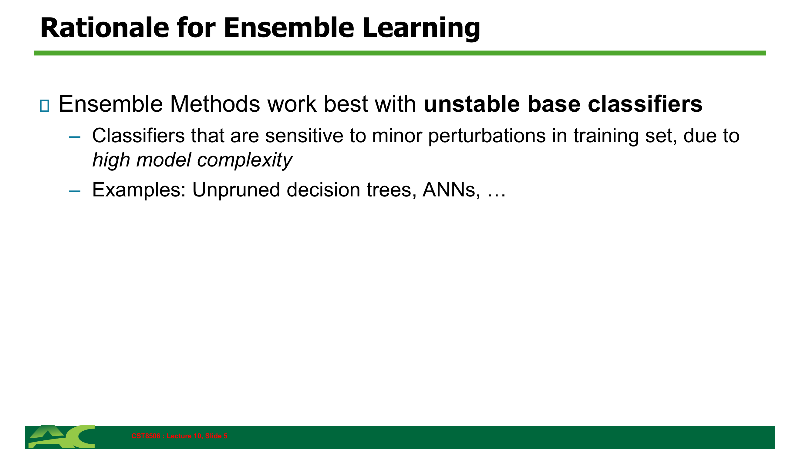

**Rationale for Ensemble Learning:** — 集成学习的理论依据

- Ensemble Methods work best with unstable base classifiers — 集成方法在不稳定的基分类器上效果最好
  - Classifiers that are sensitive to minor perturbations in training set, due to high model complexity — 那些由于模型复杂度高而对训练集的微小扰动非常敏感的分类器
  - Examples: Unpruned decision trees, ANNs, … — 例如：未剪枝的决策树、人工神经网络（ANN）等

> **📝 承接与解释 (Transition & Explanation):**
> 
> **当前解读**: 解释了应该使用怎样的基学习器：必须是“不稳定”的（容易对数据产生波动）。因为只有不稳定，才能保证各个基学习器之间足够“多样化”从而满足前页提到的“独立性”。
> **上下文承接**: 从前页的“条件”延伸到具体的“选型建议”，而“不稳定性”本质上反映的就是模型的高方差，这将直接引出下一节从“偏差-方差”角度进行的严谨数学分析。

---

## 3. 偏差与方差的分解 (Bias-Variance Decomposition)

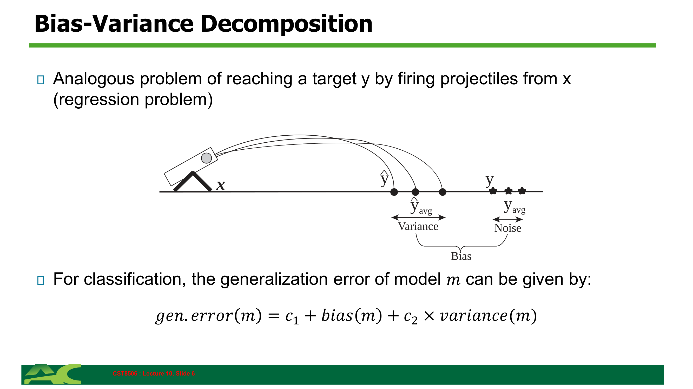

**Bias-Variance Decomposition:** — 偏差与方差分解

- Analogous problem of reaching a target y by firing projectiles from x (regression problem) — 类似于从x发射弹丸命中目标y的问题（回归问题）
- For classification, the generalization error of model can be given by: Error = Bias + Variance + Noise — 对于分类任务，模型的泛化误差可以表示为：误差 = 偏差 + 方差 + 噪声

> **📝 承接与解释 (Transition & Explanation):**
> 
> **当前解读**: 用打靶的类比直观解释了机器学习中最重要的错误来源：Bias（瞄得准不准）和 Variance（打得散不散）。
> **上下文承接**: 承接上一页对“不稳定模型”的探讨，这里从数学层面对“不稳定”给出了清晰的定义（高方差）；这就为下一页讲解“过拟合”与集成方法的作用打下理论基础。

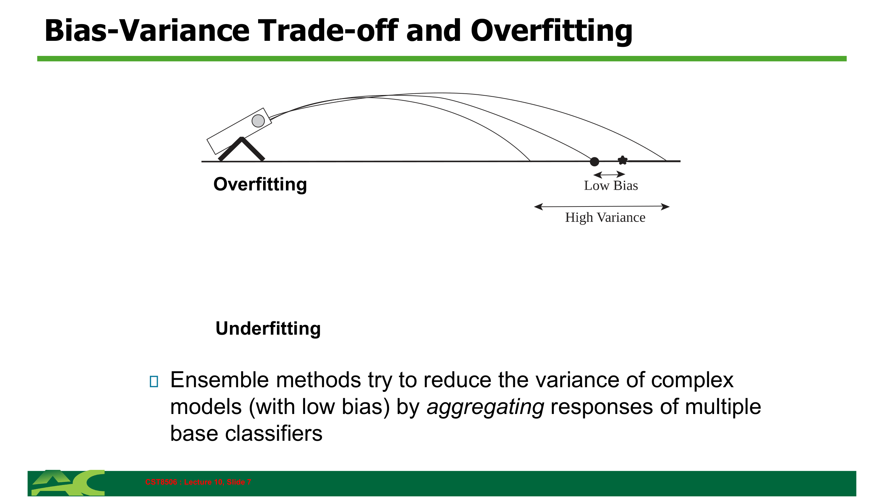

**Bias-Variance Trade-off and Overfitting:** — 偏差-方差权衡与过拟合

- Overfitting (Low Bias, High Variance) — 过拟合（低偏差，高方差）
- Underfitting (High Bias, Low Variance) — 欠拟合（高偏差，低方差）
- Ensemble methods try to reduce the variance of complex models (with low bias) by aggregating responses of multiple base classifiers — 集成方法试图通过聚合多个基分类器的响应来降低复杂模型（低偏差）的方差

> **📝 承接与解释 (Transition & Explanation):**
> 
> **当前解读**: 点明了集成学习（尤其是 Bagging 和 Random Forest）的最核心原理：利用复杂模型先保证低偏差（瞄得准），然后通过集成平均来降低高方差（让散布的点收拢），从而避免过拟合。
> **上下文承接**: 完美闭环了前文的理论探讨；解释完“为什么能降方差”后，接下来自然要进入下一节，讨论具体的工程上“如何构建并聚合这些多样的分类器”。

---

## 4. 通用方法与构建多样性基分类器 (General Approach & Diversity)

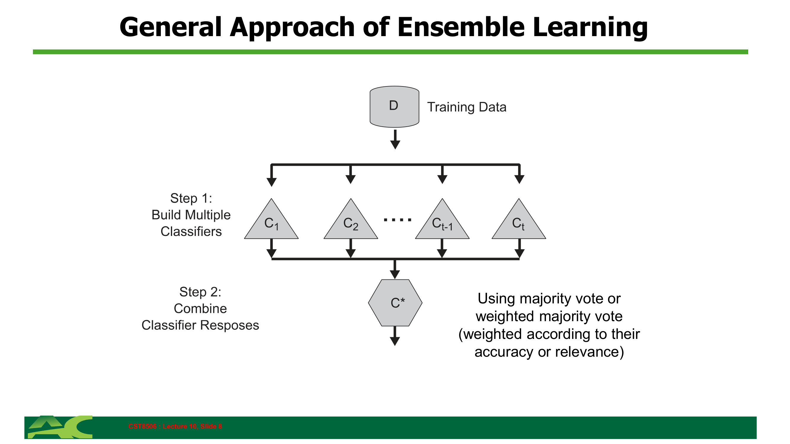

**General Approach of Ensemble Learning:** — 集成学习的通用方法

- Using majority vote or weighted majority vote (weighted according to their accuracy or relevance) — 使用多数投票或加权多数投票（根据它们的准确率或相关性进行加权）

> **📝 承接与解释 (Transition & Explanation):**
> 
> **当前解读**: 介绍了在获得多个分类器后，如何将它们“合体”的决策机制，即普通投票法和依据能力的加权投票法。
> **上下文承接**: 承接了原理部分，进入方法论的探讨。明确了融合策略后，下一页自然需要解决另一个问题：如何才能制造出相互独立的不同预测模型（即多样性）？

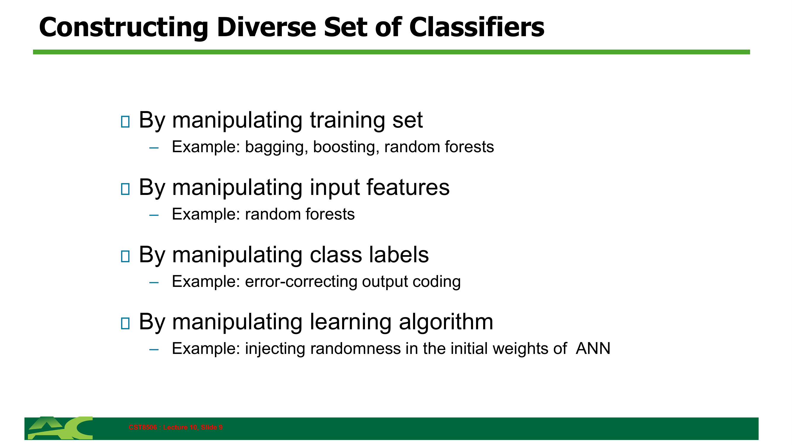

**Constructing Diverse Set of Classifiers:** — 构建多样化的分类器集合

- By manipulating training set — 通过操纵训练集
  - Example: bagging, boosting, random forests — 示例：Bagging，Boosting，随机森林
- By manipulating input features — 通过操纵输入特征
  - Example: random forests — 示例：随机森林
- By manipulating class labels — 通过操纵类别标签
  - Example: error-correcting output coding — 示例：纠错输出编码
- By manipulating learning algorithm — 通过操纵学习算法
  - Example: injecting randomness in the initial weights of ANN — 示例：在人工神经网络中注入随机初始权重

> **📝 承接与解释 (Transition & Explanation):**
> 
> **当前解读**: 总结了工业界用来制造“多样性（Diversity）”的四大策略（分派不同数据、不同特征、不同标签、引入算法随机性）。
> **上下文承接**: 承上启下的一页，它为后续章节列出了学习大纲——我们下一节要学习的 Bagging 和 Boosting 正是通过“操纵训练集”来实现多样性的核心算法。

---

## 5. 自助聚合算法 (Bagging)

### 5.1 自助抽样原理 (Bootstrap Sampling)

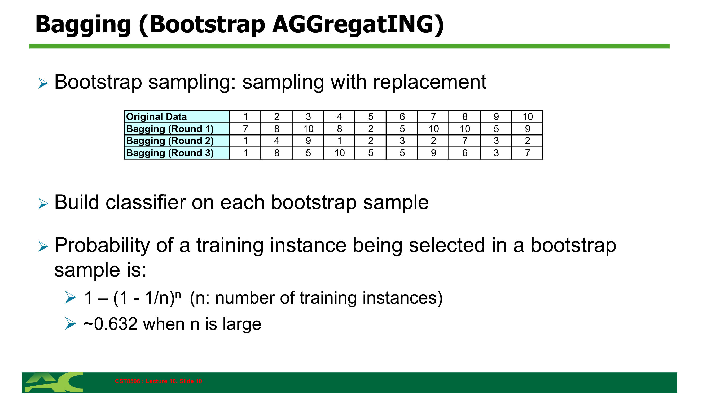

**Bagging (Bootstrap AGGregatING):** — 自助聚合算法（Bagging）

- Bootstrap sampling: sampling with replacement — 自助抽样：有放回的抽样
- Build classifier on each bootstrap sample — 在每个自助抽样样本上构建分类器
- Probability of a training instance being selected in a bootstrap sample is 1 – (1 - 1/n)^n; ~0.632 when n is large — 一个训练实例被选中进入自助样本的概率是 1 – (1 - 1/n)^n ；当 n 很大时，约等于 0.632

> **📝 承接与解释 (Transition & Explanation):**
> 
> **当前解读**: 正式介绍第一大类集成算法Bagging。核心是“有放回抽样”，这会导致每次只抽出约63.2%的独特样本，剩下的36.8%是重复样本。
> **上下文承接**: 具体落实了上一页“操纵训练集”的理念。理解了有放回抽样机制后，下一页立刻展示 Bagging 的完整算法流程框架。

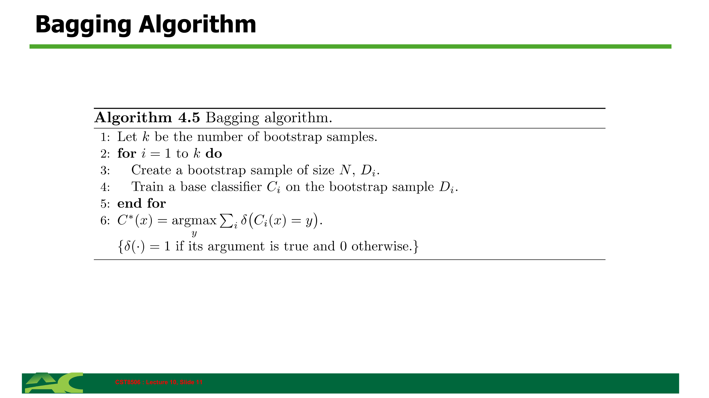

**Bagging Algorithm:** — Bagging算法流程

- (Algorithm loop showing training multiple models on bootstrap samples and final majority vote) — （算法循环显示在自助样本上训练多个模型并进行最终的多数投票）

> **📝 承接与解释 (Transition & Explanation):**
> 
> **当前解读**: 给出了Bagging的伪代码：从原数据集中抽取出k个数据包，训练k个模型，最后用多数投票决定输出。
> **上下文承接**: 将前一页的概念形式化为算法。由于光看公式可能难以理解，下一页开始将用一个完整的一维数据集例子来逐步演示它。

### 5.2 自助聚合示例推演 (Bagging Example Walkthrough)

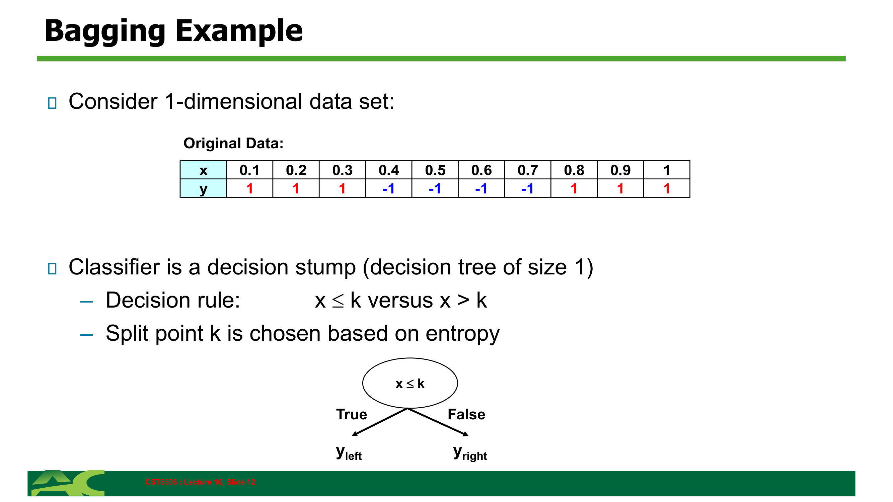

**Bagging Example:** — Bagging 示例

- Consider 1-dimensional data set with 9 points — 考虑一个一维的包含9个数据点的数据集
- Classifier is a decision stump (decision tree of size 1) — 分类器采用决策树桩（即只有一层的决策树）
- Decision rule: x ≤ k versus x > k; Split point k is chosen based on entropy — 决策规则：x ≤ k 对比 x > k；分割点 k 基于信息熵来选择

> **📝 承接与解释 (Transition & Explanation):**
> 
> **当前解读**: 建立了一个极其简单但有代表性的玩具数据集，并指定了非常“弱”的分类器（只切一刀的树桩）。
> **上下文承接**: 这是演示算法前的准备工作。下一页将开始展示在每一轮抽样中，这个树桩是如何发生偏移进而产生多样的决策边界的。

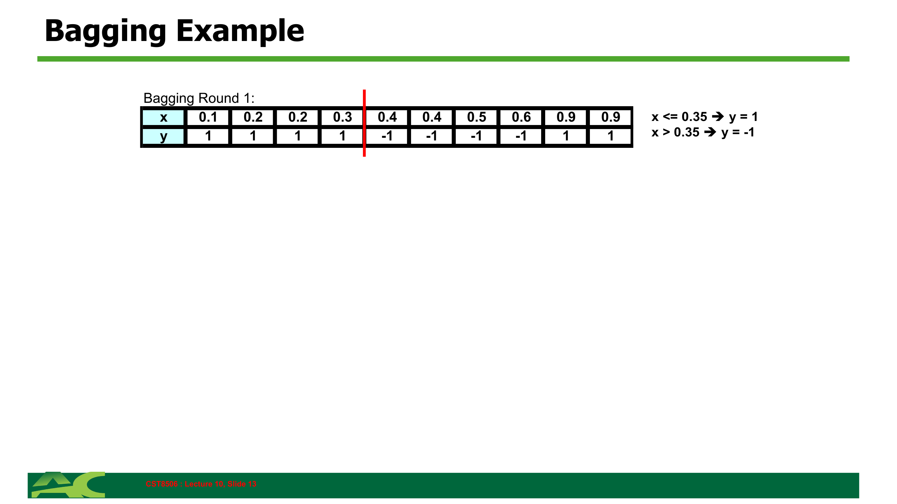

**Bagging Example (Rounds 1-5):** — Bagging 示例（前5轮）

- Bagging Round 1 to 5 show different selected x instances and true y limits. — 第1到5轮Bagging展示了每次抽出的不同x实例和其对应的真实标签y。

> **📝 承接与解释 (Transition & Explanation):**
> 
> **当前解读**: 展示了前5轮有放回抽样的结果，可以明显看到由于抽样不同，某些样本在某些轮次被重复选中（如Round 1中的x=0.2），有些样本直接缺失。
> **上下文承接**: 直观验证了“操纵数据集产生多样性”的理论，因为数据集变了，下一页就可以看到分类器的分割点也会跟着改变。

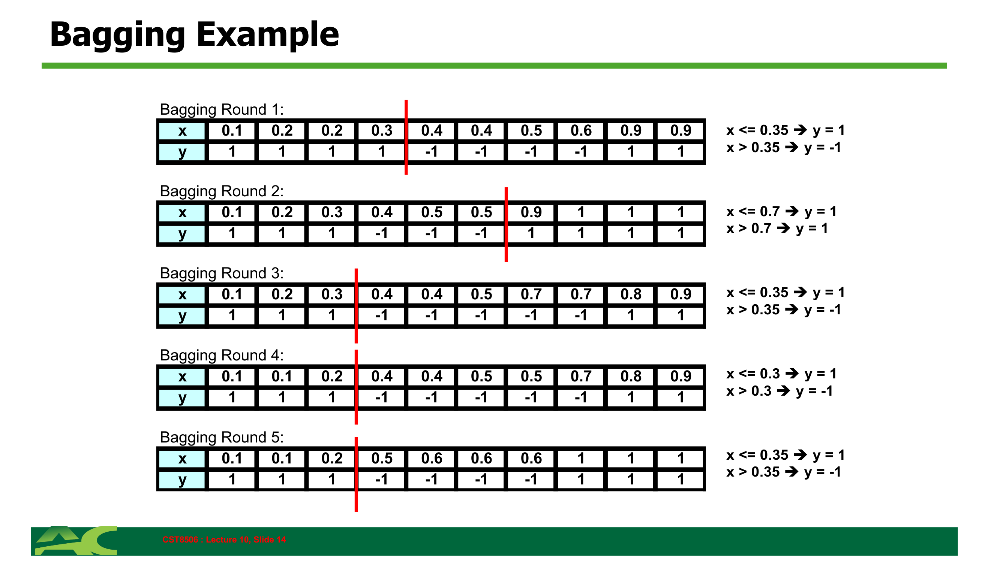

**Bagging Example (Splits 1-5):** — Bagging 示例（分割点1-5）

- Shows the specific split decisions for each sample set: e.g. Round 1: x <= 0.35 => y=1, x > 0.35 => y=-1. — 展示了每个采样集具体的分割决策：例如第一轮中 x <= 0.35 推断为类1。

> **📝 承接与解释 (Transition & Explanation):**
> 
> **当前解读**: 针对前面抽出的五组数据，分别计算出了最优的切分点（0.35, 0.7, 0.3等），印证了不稳定的弱分类器对数据扰动极为敏感。
> **上下文承接**: 这个计算过程展示了上半场的训练，下一页则会完成剩下6-10轮的计算，补全这10个基分类器的集合。

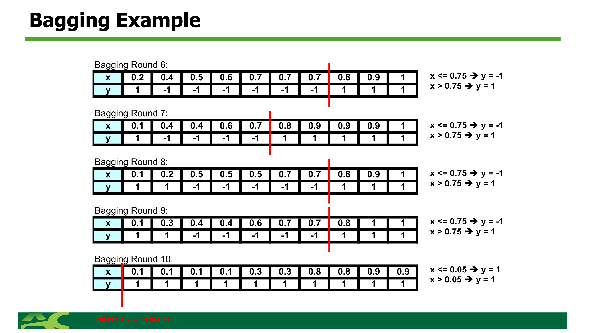

**Bagging Example (Rounds 6-10):** — Bagging 示例（轮次6-10）

- Continuing the bagging rounds and finding the corresponding optimum decision splits. — 继续进行自助采样轮次并寻找相应的最优决策分割点。

> **📝 承接与解释 (Transition & Explanation):**
> 
> **当前解读**: 完成了全量10次采样和训练，这10个模型截然不同，反映了极高的模型方差。
> **上下文承接**: 这两页完整演示了基分类器的生成过程；下一页将把这10个模型的分割点进行统一汇总。

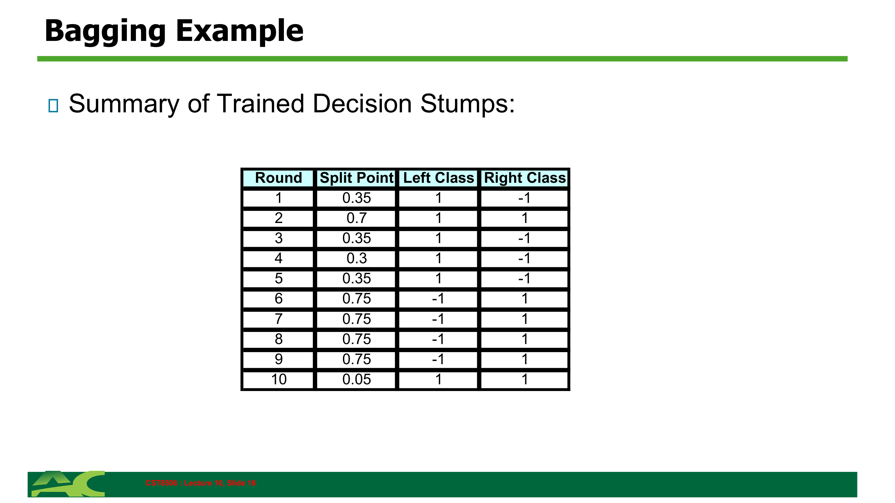

**Summary of Trained Decision Stumps:** — 训练好的决策树桩总结

- Summarizes the split point and class assignments (Left/Right) for all 10 rounds. — 总结了全部10轮中的最佳分割点及左右类别的分配。

> **📝 承接与解释 (Transition & Explanation):**
> 
> **当前解读**: 这是一张汇总表，清晰展现了各分类器的个体差异。
> **上下文承接**: 各自为战的模型已经建立完毕，下一页将进入集成的最后一步——在原始数据集上进行多数投票（Majority Vote），验证最终的预测结果。

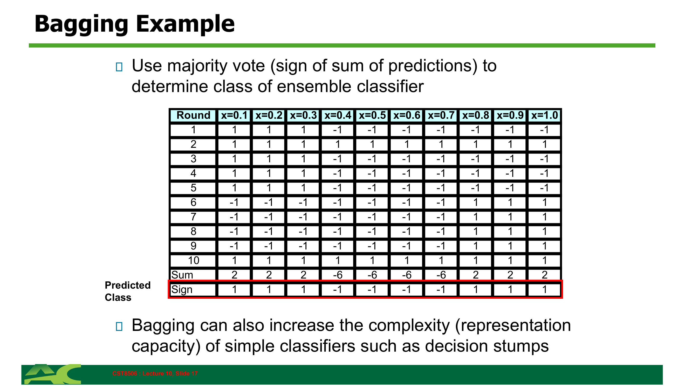

**Bagging Example (Final Voting):** — Bagging 示例（最终投票）

- Use majority vote (sign of sum of predictions) to determine class of ensemble classifier — 使用多数投票（将各预测值的符号求和）来确定集成分类器的最终类别
- Bagging can also increase the complexity (representation capacity) of simple classifiers such as decision stumps — Bagging还能增加诸如决策树桩这类简单分类器的复杂度（表征能力）

> **📝 承接与解释 (Transition & Explanation):**
> 
> **当前解读**: 这是Bagging流程的高潮部分。将10个模型的预测结果按列相加，最终的投票结果居然完美复原了比单一树桩更复杂的分类边界，有效增加了表征能力。
> **上下文承接**: 以此为结，Bagging的降方差逻辑被彻底阐明。但Bagging对待所有样本是“公平”的，这引发思考——如果我们刻意去惩罚那些总是分错的样本呢？这将导向下一节 Boosting 的诞生。

---

## 6. 提升算法 (Boosting & AdaBoost)

### 6.1 Boosting的核心思想 (Core Idea of Boosting)

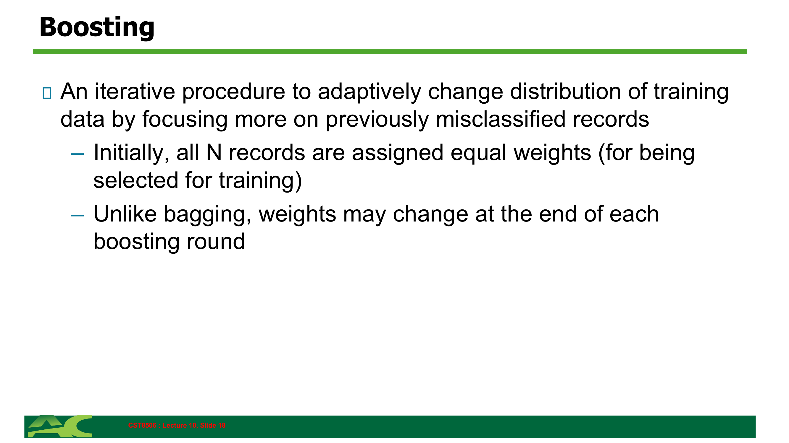

**Boosting:** — 提升算法（Boosting）

- An iterative procedure to adaptively change distribution of training data by focusing more on previously misclassified records — 一种自适应改变训练数据分布的迭代过程，重点关注之前分类错误的记录
- Initially, all N records are assigned equal weights — 初始时，所有 N 条记录都被分配相等的权重
- Unlike bagging, weights may change at the end of each boosting round — 与 Bagging 不同，在每个提升轮次结束时，权重可能会发生变化

> **📝 承接与解释 (Transition & Explanation):**
> 
> **当前解读**: 正式引入Boosting算法大家族。它和Bagging最大的区别在于它是“串行”的：后一个模型会根据前一个模型的结果，故意“针对”那些做错的题目（提升错误样本权重）。
> **上下文承接**: 从概念上划清了Boosting和Bagging的界限。既然要改变权重，下一页立刻用一个形象直观的数据表来演示权重的传递。

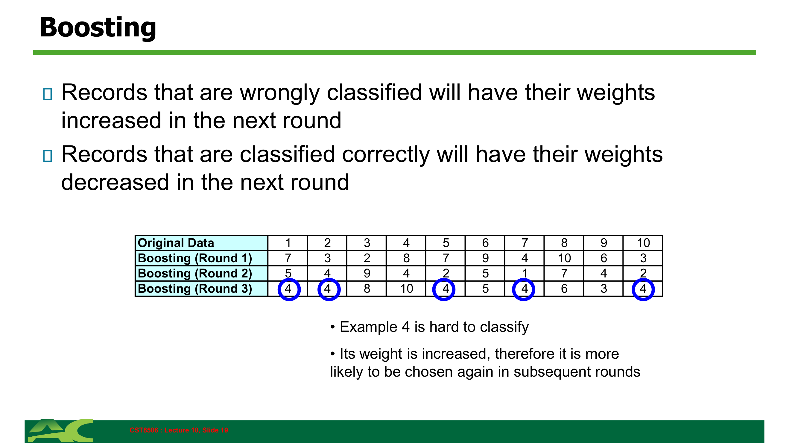

**Boosting Weight Adaptation:** — Boosting权重自适应

- Records that are wrongly classified will have their weights increased in the next round — 错误分类的记录在下一轮中其权重将增加
- Records that are classified correctly will have their weights decreased — 正确分类的记录其权重将降低
- Example 4 is hard to classify; Its weight is increased, therefore it is more likely to be chosen again in subsequent rounds — 样本实例4很难被分类；因此它的权重增加了，于是在后续的轮次中更有可能被选中

> **📝 承接与解释 (Transition & Explanation):**
> 
> **当前解读**: 解析了动态配重的逻辑：好比考试，做对的题下次少复习（降权重），做错的难题天天复习（升权重）。
> **上下文承接**: 说明了样本被操纵的因果逻辑，接下来需要一套严谨的数学公式来把这种直觉量化，这就是下一页要讲的 AdaBoost。

> **🔍 表格数字解读 (Table Numbers Explained):**
>
> 这张 slide 中的表格容易让人困惑。表格中的**数字 = 被抽中的样本编号**。原始数据有10个样本（编号1~10），每一轮 Boosting 按当前样本权重**有放回地抽10次**，组成该轮训练集。
>
> | 行 | 含义 |
> |----|------|
> | Original Data | 原始10个样本的编号 1~10 |
> | Round 1 | 第1轮抽样结果（初始权重相等，均匀随机抽）|
> | Round 2 | 分错样本权重增大，4号开始被抽到更多次 |
> | Round 3 | 4号权重极大，10次里被抽了5次（蓝色圈圈标注）|
>
> **怎么知道谁分错了？** 每轮训练完一个分类器后，用它预测全部10个样本，跟真实标签对比就知道了。
>
> **⚠️ 注意区分两种权重**: 这里说的"权重"是**样本权重 w**（决定每个样本被抽到的概率），不是后面要讲的**模型权重 alpha**（决定每个分类器在投票时的话语权）。两者是不同的东西！

### 6.2 AdaBoost 算法机制 (AdaBoost Algorithm Mechanism)

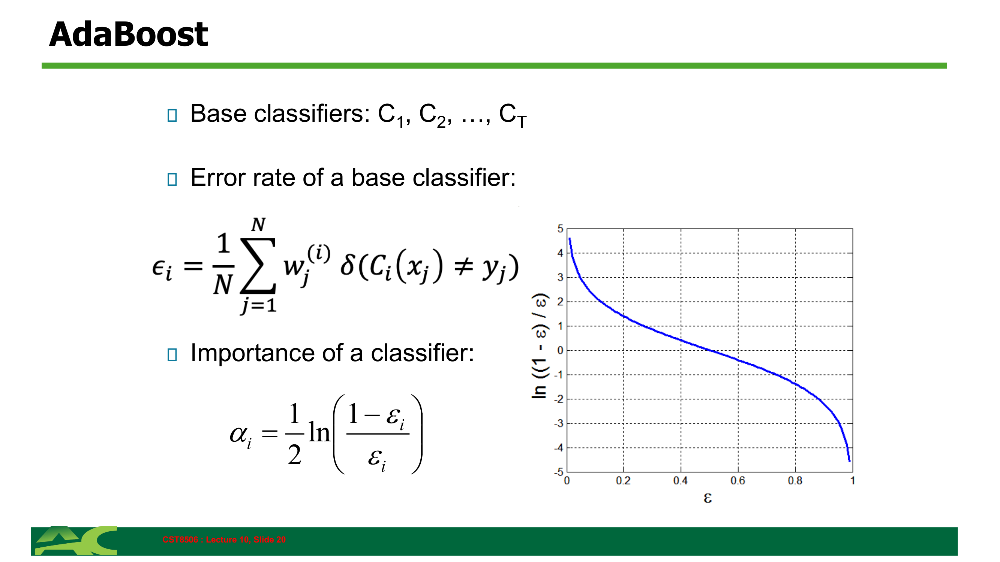

**AdaBoost:** — 自适应提升算法 (AdaBoost)

- Base classifiers: C1, C2, …, CT — 基分类器序列
- Error rate of a base classifier: ε_i — 个体基分类器的错误率（加权）
- Importance of a classifier: `α_i = 1/2 * ln( (1 - ε_i) / ε_i )` — 分类器的重要性系数 alpha

> **📝 承接与解释 (Transition & Explanation):**
> 
> **当前解读**: 介绍了 AdaBoost 中的核心参数 alpha（**模型权重**，区别于前页的样本权重 w）。这个公式非常精妙：错误率 epsilon 越小，算出该模型说话的分量（alpha）就越大。
> **上下文承接**: 前一节解决了"样本怎么赋权(w)"，这一页解决了"模型怎么赋权(alpha)"。两者凑够之后，下一页就可以展示下一轮样本权重的计算公式了。

> **🔍 AdaBoost 两种权重全景图 (Two Weights in AdaBoost):**
>
> | 权重 | 符号 | 作用 | 什么时候用 |
> |------|------|------|----------|
> | **样本权重** | w_j | 决定下一轮每个样本被抽到的概率 | 每轮结束时更新 |
> | **模型权重** | alpha_i | 决定最终投票时该分类器的话语权 | 最终预测时使用 |
>
> **alpha 的直觉**：错误率 epsilon 越低，alpha 越大，这个模型在投票时说了算。
> - epsilon = 0.1（很准）: alpha = 1/2 x ln(9) = **1.10**（话语权很大）
> - epsilon = 0.4（一般）: alpha = 1/2 x ln(1.5) = **0.20**（话语权小）
> - epsilon = 0.5（随机猜）: alpha = 1/2 x ln(1) = **0**（完全没有话语权）

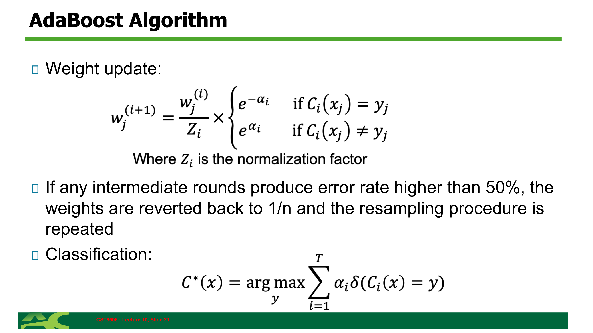

**AdaBoost Algorithm (Updates):** — AdaBoost 算法更新规则

- Weight update: Updates weights using exponential scaling factor `exp(- α_i * y * C(x))` — 权重更新：使用指数缩放因子更新误差样本的权重
- If any intermediate rounds produce error rate higher than 50%, the weights are reverted back to 1/n and the resampling procedure is repeated — 如果产生高于50%错误率的中间轮次，权重重置为1/n并重复重采样
- Classification: Weighted sum based on classification signs — 结合所有分类结果进行基于alpha的加权求和

> **📝 承接与解释 (Transition & Explanation):**
> 
> **当前解读**: 给出了更新样本权重的硬核公式。简单说，如果模型预测和真实标签符号不同（算错了），指数项为正，权重呈指数级放大；算对则权重指数级缩小。
> **上下文承接**: 讲清了数学机制，下一页给出了完整串联所有步骤的标准伪代码。

> **🔍 权重更新公式拆解 (Weight Update Formula Breakdown):**
>
> 公式：`w_new = w_old x exp(-alpha x y x C(x))`
>
> 其中 y = 真实标签(+1或-1)，C(x) = 模型预测(+1或-1)。
>
> | 情况 | y x C(x) | -alpha x y x C(x) | exp(...) | 权重变化 |
> |------|----------|-------------------|----------|----------|
> | **分对了** (y=C(x)) | +1 | -alpha（负数）| < 1 | 权重**缩小** |
> | **分错了** (y 不等于 C(x)) | -1 | +alpha（正数）| > 1 | 权重**放大** |
>
> **具体数字例子**（假设 alpha=0.42）：
> - 分对：w x e^(-0.42) = w x 0.66 → 权重变为原来的 **66%**
> - 分错：w x e^(+0.42) = w x 1.52 → 权重变为原来的 **152%**

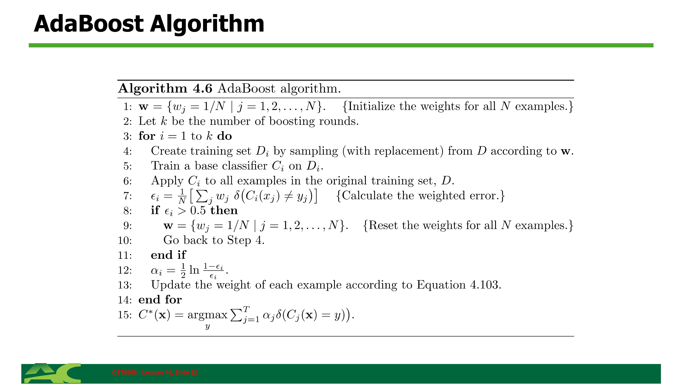

**AdaBoost Algorithm (Pseudocode):** — AdaBoost 算法伪代码

- Formal algorithmic loop of initializing weights, computing error, computing alpha, and updating distributions. — 初始化权重、计算错误、计算alpha以及更新分布的正式算法循环结构。

> **📝 承接与解释 (Transition & Explanation):**
> 
> **当前解读**: 对前面两页的公式进行了模块化拼装，成为了一个可以实际写成 Python 代码的完整算法。
> **上下文承接**: 枯燥的算法流程往往难以记忆，为了便于理解，下一页开始我们将采用和之前 Bagging 一样的数据集，通过手动推演 AdaBoost 的运算过程。

### 6.3 AdaBoost 示例推演 (AdaBoost Example Walkthrough)

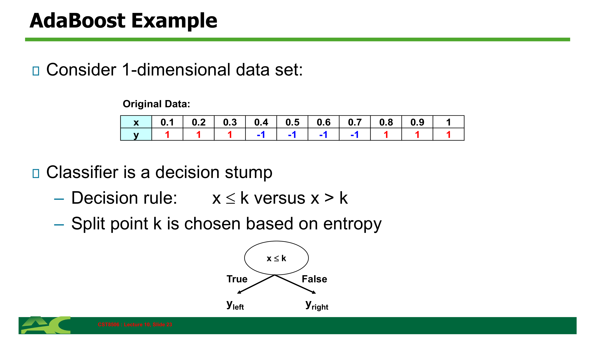

**AdaBoost Example Setup:** — AdaBoost 示例设定

- Consider 1-dimensional data set with 9 original points x and y — 考虑9个点的一维数据集
- Classifier is a decision stump based on entropy — 采用基于熵的决策树桩分类器

> **📝 承接与解释 (Transition & Explanation):**
> 
> **当前解读**: 重新拿出了刚才 Bagging 环节使用的“单层决策树+9个数据点”的设定，这是为了和 Bagging 进行严格的对比。
> **上下文承接**: 设定完毕；下一页我们就马上进入第1到第3轮的迭代运算。

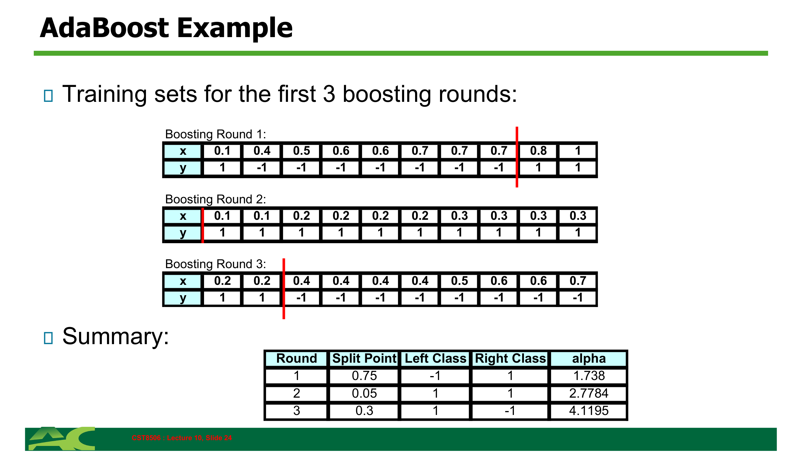

**AdaBoost Example (Rounds 1-3):** — AdaBoost 示例（前3轮）

- Shows Training sets and Summary of the split points, decisions, and computed alpha weights (e.g. 1.738, 2.778, 4.1195) — 展示了训练集抽样结果，以及最佳分割点、决策和算出的模型重要性权重（Alpha值）总结。

> **📝 承接与解释 (Transition & Explanation):**
> 
> **当前解读**: 明显看到随着轮次的增加，那些分错的点被反复复制（因为权重极大），逼迫决策树必须不断调整切分点。且算出的每个模型的发言权(alpha)都不同（越准的轮次 alpha 越大）。
> **上下文承接**: 各轮次模型已经训练完毕，权重也已确定；下一页就是见分晓的时刻，即将把各个模型的输出乘以对应的 alpha 看最终谁能赢。

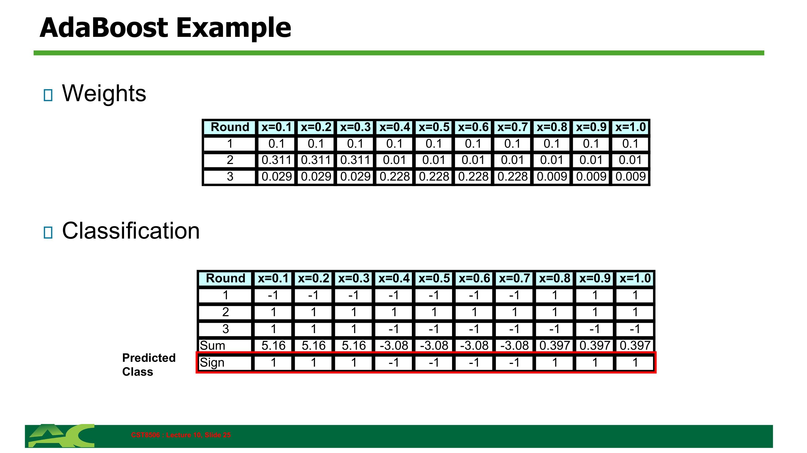

**AdaBoost Example (Final Classification):** — AdaBoost 示例（最终分类）

- Weights table shows how values scaled up/down across iterations — 权重表展示了权重值在迭代过程中如何放大/缩小
- Classification table demonstrates the final weighted sum arriving at perfect label assignments — 分类表展示了各加权求和最终得出了完美的标签分配

> **📝 承接与解释 (Transition & Explanation):**
> 
> **当前解读**: 极其清晰地展示了 AdaBoost 降低模型偏差的能力。即便基模型是只有一层的简陋决策树桩，它依然通过不断的查漏补缺，实现了100%正确的分类。
> **上下文承接**: 至此，降低方差（Bagging）和降低偏差（AdaBoost）的两大理念都已讲透透彻。最后，下一节我们将把这些理念应用到工业界最顶尖的大一统算法。

> **🔍 最终投票的计算过程 (Final Voting Process):**
>
> 最终预测公式：`C*(x) = sign( alpha1 x C1(x) + alpha2 x C2(x) + alpha3 x C3(x) )`
>
> 假设对某个样本，3个分类器的预测和权重如下：
>
> | 分类器 | 预测 C(x) | 模型权重 alpha | alpha x C(x) |
> |--------|-----------|---------------|-------------|
> | C1 | +1 | 1.738 | +1.738 |
> | C2 | -1 | 2.778 | -2.778 |
> | C3 | +1 | 4.120 | +4.120 |
> | **合计** | | | **+3.080** |
>
> sign(+3.080) = **+1** → 最终预测为正类。
> 虽然 C2 投了反对票(-1)，但 C1 和 C3 的 alpha 加起来更大，所以正类胜出。
> **关键**：不是简单数票（2:1），而是比 **alpha 的总和**谁大。

---

## 7. 随机森林与梯度提升 (Random Forest & Gradient Boosting)

### 7.1 随机森林 (Random Forest)

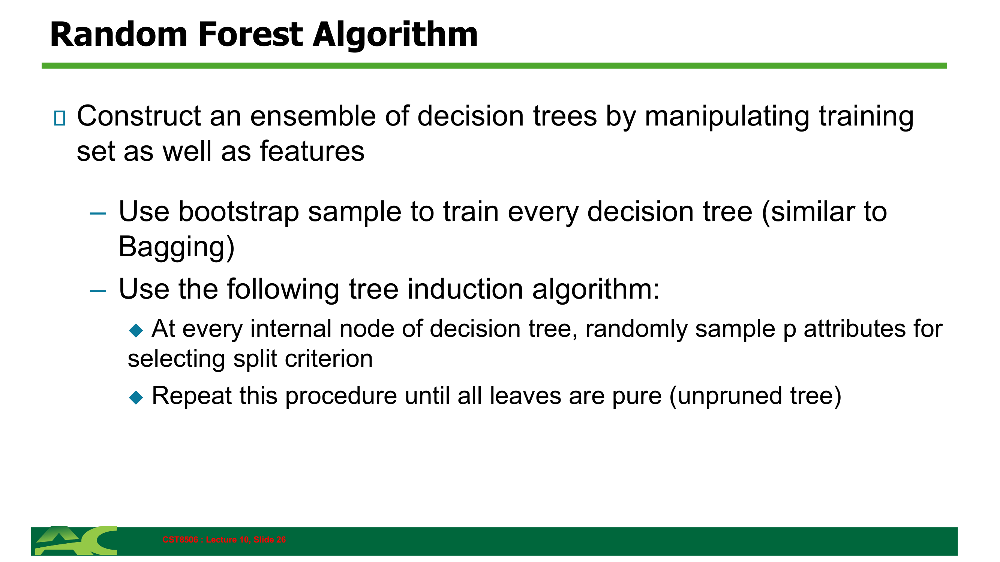

**Random Forest Algorithm:** — 随机森林算法

- Construct an ensemble of decision trees by manipulating training set as well as features — 通过操纵训练集以及不断提取不同特征来构建决策树集成
- Use bootstrap sample to train every decision tree (similar to Bagging) — 使用自助采样来训练每棵决策树（类似于Bagging）
- At every internal node of decision tree, randomly sample p attributes for selecting split criterion — 在决策树的每个内部节点，随机采样p个属性（特征）用于选择分裂标准

> **📝 承接与解释 (Transition & Explanation):**
> 
> **当前解读**: 随机森林其实就是 `Bagging + 特征随机采样`。不仅在样本行上做了采样多样性，还在特征列上做了随机丢弃，进一步迫使模型变得独立和多样。
> **上下文承接**: 是对之前讲解的 Bagging 算法的工业级升华，极大地抵御了过拟合。解释了树模型的组合后，最后一页顺水推舟介绍它的兄弟——Boosting流派的终极形态 XGBoost。

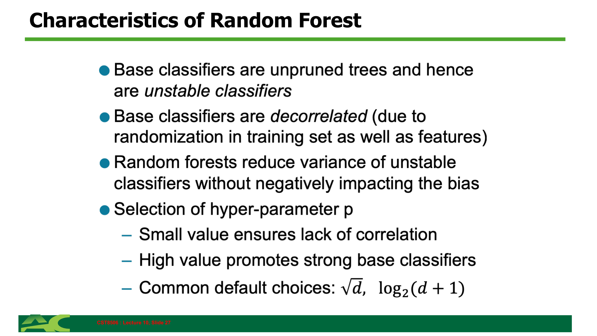

**Characteristics of Random Forest:** — 随机森林特性

- (Bullet points detailing properties like robustness to noise, generalization boundaries, and feature limitations) — （详细说明该模型的对噪声鲁棒性、泛化边界及特征使用限制的要点）

> **📝 承接与解释 (Transition & Explanation):**
> 
> **当前解读**: 总结了随机森林抗躁性强、不容易过拟合等核心优点，它是处理结构化数据时最不需要调参即可获得好性能的无脑模型（Baseline）。
> **上下文承接**: 说完了并行流派的最强王牌；下一页，也是本课程的最后一页，将献给串行流派的当今王者——梯度提升树（GBDT）。

### 7.2 梯度提升 (Gradient Boosting)

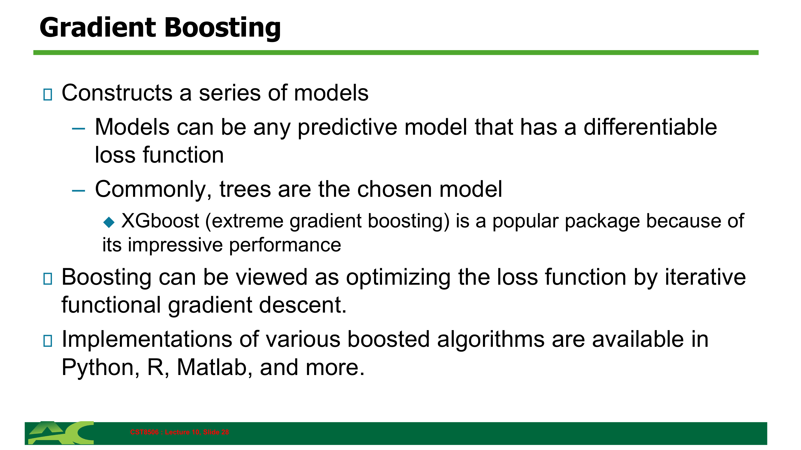

**Gradient Boosting:** — 梯度提升算法

- Constructs a series of models; Models can be any predictive model that has a differentiable loss function — 构建一系列模型序列；模型可以是任何具有可微损失函数的预测模型
- Commonly, trees are the chosen model; XGBoost (extreme gradient boosting) is a popular package because of its impressive performance — 通常将树选为基模型；XGBoost 因为其傲人的表现和处理速度成为当下极其流行的第三方包
- Boosting can be viewed as optimizing the loss function by iterative functional gradient descent — 提升算法可以被视为通过迭代的函数梯度下降来优化代价函数的全过程。

> **📝 承接与解释 (Transition & Explanation):**
> 
> **当前解读**: 梯度提升将 AdaBoost “赋予极高残差权重”的思维几何化了，把它看作是一个沿着目标残差梯度的下降过程。最著名的工程实现 XGBoost 是几乎所有数据科学比赛上的屠榜神器。
> **上下文承接**: 至此，从基本的多个模型投票，到基于概率机制优化的神级算法集成学习的系统性认知闭环完成。本次《分类器融合》的全部课程内容也到此结束。
