# Week 11: 关联规则挖掘 (Association Rule Mining)

> Source: `Week11_Association Rule Mining.pdf`
> Total slides: 32
> Instructor: Dr. Abbas Akkasi | Winter 2026

---

## 1. 关联规则挖掘简介 (Introduction to Association Rule Mining)

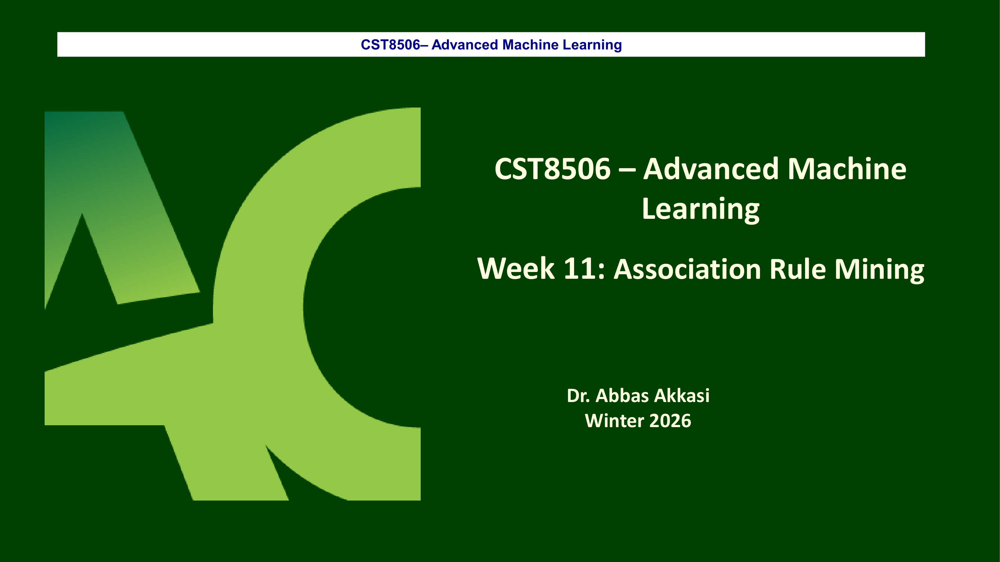

**CST8506 – Advanced Machine Learning:** — CST8506 – 高级机器学习

- Week 11: Association Rule Mining — 第11周：关联规则挖掘

> **📝 承接与解释 (Transition & Explanation):**
>
> **当前解读**: 封面页，明确本周主题为"关联规则挖掘"——无监督学习中一种从交易数据中发现物品之间隐含关系的经典方法。
> **上下文承接**: 作为整节课的起点，接下来第一页将正式定义什么是关联规则，并用经典的"超市购物篮"案例引入。

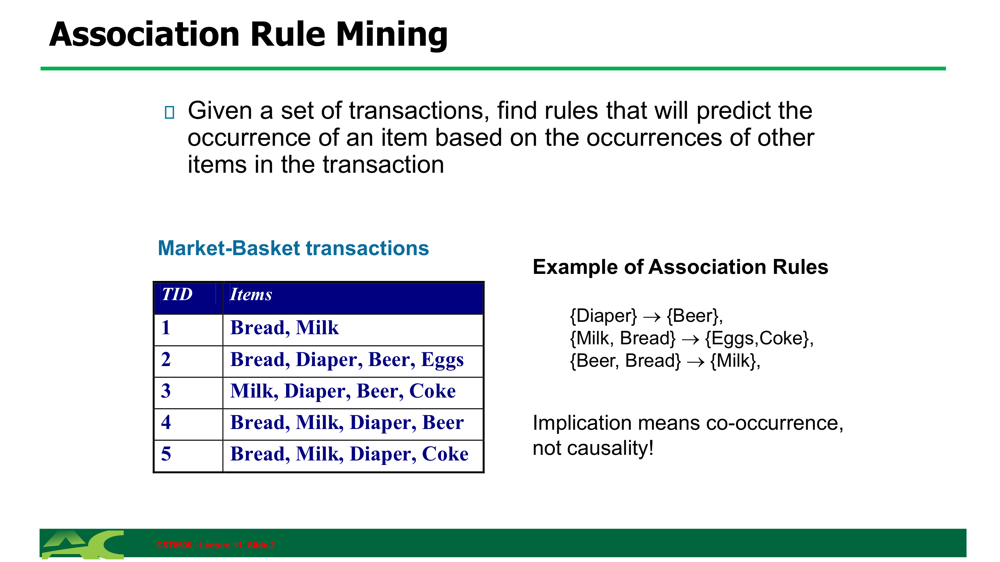

**Association Rule Mining:** — 关联规则挖掘

- Given a set of transactions, find rules that will predict the occurrence of an item based on the occurrences of other items in the transaction — 给定一组交易记录，找到能够根据其他物品的出现来预测某个物品出现的规则
- Market-Basket transactions — 超市购物篮交易

| TID | Items |
|-----|-------|
| 1 | Bread, Milk |
| 2 | Bread, Diaper, Beer, Eggs |
| 3 | Milk, Diaper, Beer, Coke |
| 4 | Bread, Milk, Diaper, Beer |
| 5 | Bread, Milk, Diaper, Coke |

- Example of Association Rules: — 关联规则示例：
  - {Diaper} → {Beer} — {尿布} → {啤酒}
  - {Milk, Bread} → {Eggs, Coke} — {牛奶, 面包} → {鸡蛋, 可乐}
  - {Beer, Bread} → {Milk} — {啤酒, 面包} → {牛奶}
- Implication means co-occurrence, not causality! — 蕴含关系表示共现，而非因果关系！

> **📝 承接与解释 (Transition & Explanation):**
>
> **当前解读**: 用超市购物篮的经典场景直观解释关联规则——"买了尿布的人往往也会买啤酒"。核心要义：这里的"→"只表示"经常同时出现"，不代表因果。
> **上下文承接**: 建立了直觉后，下一页将对"频繁项集"和"支持度"给出精确的数学定义，让我们能够量化这种"经常一起出现"的程度。

---

## 2. 核心定义 (Core Definitions)

### 2.1 频繁项集 (Frequent Itemset)

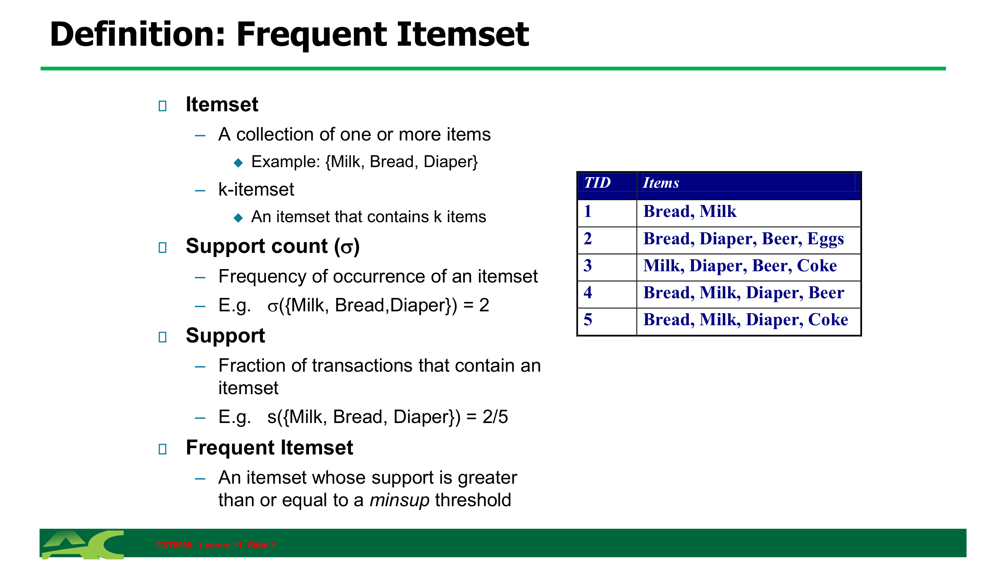

**Definition: Frequent Itemset:** — 定义：频繁项集

- **Itemset** — A collection of one or more items — **项集** — 一个或多个物品的集合
  - Example: {Milk, Bread, Diaper} — 示例：{牛奶, 面包, 尿布}
  - **k-itemset** — An itemset that contains k items — **k-项集** — 包含 k 个物品的项集
- **Support count (σ)** — Frequency of occurrence of an itemset — **支持度计数 (σ)** — 某个项集出现的频次
  - E.g. σ({Milk, Bread, Diaper}) = 2 — 例：σ({牛奶, 面包, 尿布}) = 2
- **Support** — Fraction of transactions that contain an itemset — **支持度** — 包含该项集的交易占总交易的比例
  - E.g. s({Milk, Bread, Diaper}) = 2/5 — 例：s({牛奶, 面包, 尿布}) = 2/5
- **Frequent Itemset** — An itemset whose support is greater than or equal to a minsup threshold — **频繁项集** — 支持度大于或等于最小支持度阈值的项集

> **📝 承接与解释 (Transition & Explanation):**
>
> **当前解读**: 给出了关联规则挖掘的基础术语体系。支持度（Support）是衡量"多常出现"的分母级指标；只有支持度达标的项集才有资格被称为频繁项集。
> **上下文承接**: 定义完"频繁项集"后，下一页将进一步定义"关联规则"本身以及它的第二个关键指标——置信度（Confidence）。

### 2.2 关联规则与评估指标 (Association Rule & Metrics)

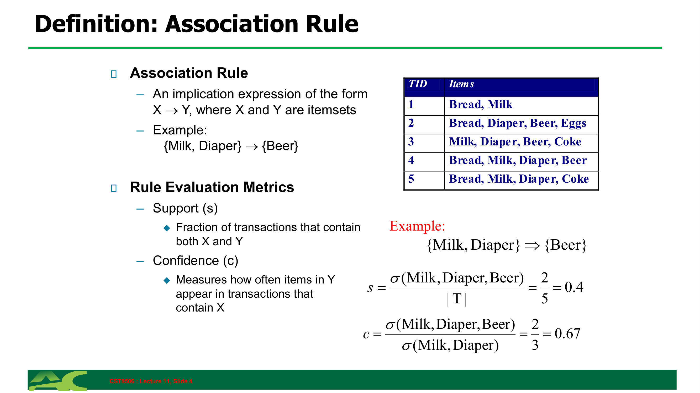

**Definition: Association Rule:** — 定义：关联规则

- **Association Rule** — An implication expression of the form X → Y, where X and Y are itemsets — **关联规则** — 形如 X → Y 的蕴含表达式，其中 X 和 Y 都是项集
  - Example: {Milk, Diaper} → {Beer} — 示例：{牛奶, 尿布} → {啤酒}
- **Rule Evaluation Metrics:** — 规则评估指标：
  - **Support (s)** — Fraction of transactions that contain both X and Y — **支持度 (s)** — 同时包含 X 和 Y 的交易比例
  - **Confidence (c)** — Measures how often items in Y appear in transactions that contain X — **置信度 (c)** — 衡量在包含 X 的交易中，Y 出现的频率
- Example: {Milk, Diaper} ⇒ {Beer} — 示例：{牛奶, 尿布} ⇒ {啤酒}
  - s = σ(Milk, Diaper, Beer) / |T| = 2/5 = 0.4 — 支持度 = 2/5 = 0.4
  - c = σ(Milk, Diaper, Beer) / σ(Milk, Diaper) = 2/3 = 0.67 — 置信度 = 2/3 = 0.67

> **📝 承接与解释 (Transition & Explanation):**
>
> **当前解读**: 引入了关联规则的两大核心评估指标。支持度衡量规则的"普遍性"（这个组合有多常见？），置信度衡量规则的"可靠性"（在前件出现时，后件出现的概率有多大？）。
> **上下文承接**: 理解了评估指标之后，下一页将明确"关联规则挖掘任务"的完整目标——找到同时满足最小支持度和最小置信度的所有规则。

---

## 3. 挖掘任务与计算复杂度 (Mining Task & Computational Complexity)

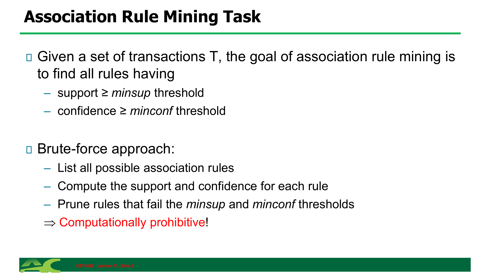

**Association Rule Mining Task:** — 关联规则挖掘任务

- Given a set of transactions T, the goal of association rule mining is to find all rules having — 给定一组交易 T，关联规则挖掘的目标是找出所有满足以下条件的规则：
  - support ≥ minsup threshold — 支持度 ≥ 最小支持度阈值
  - confidence ≥ minconf threshold — 置信度 ≥ 最小置信度阈值
- **Brute-force approach:** — **暴力法：**
  - List all possible association rules — 列出所有可能的关联规则
  - Compute the support and confidence for each rule — 计算每条规则的支持度和置信度
  - Prune rules that fail the minsup and minconf thresholds — 剪枝掉不满足阈值的规则
  - ⇒ Computationally prohibitive! — ⇒ 计算上不可行！

> **📝 承接与解释 (Transition & Explanation):**
>
> **当前解读**: 明确了挖掘的目标函数——同时通过两个阈值的筛选。暴力穷举在理论上可行但实际中不可行，因为规则数量随物品数指数增长。
> **上下文承接**: 说了暴力法"不可行"，下一页将给出具体的数学证明——到底有多少种可能的规则？

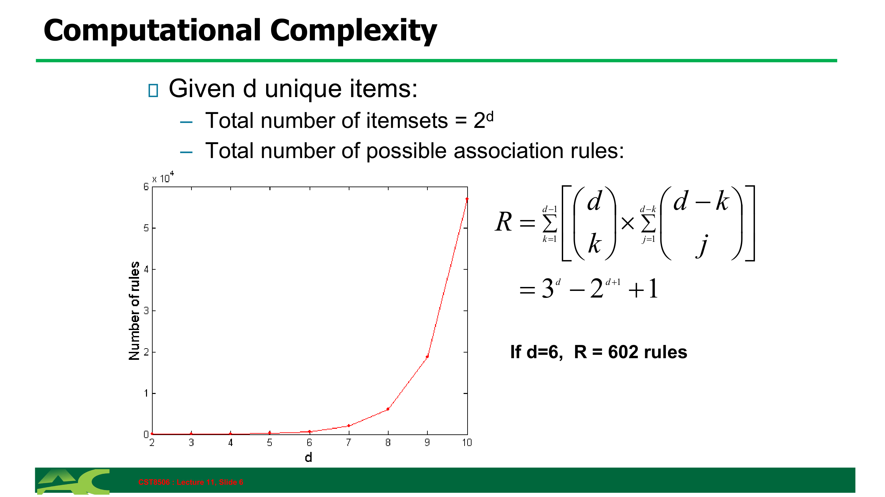

**Computational Complexity:** — 计算复杂度

- Given d unique items: — 给定 d 个不同的物品：
  - Total number of itemsets = 2^d — 所有可能的项集总数 = 2^d
  - Total number of possible association rules: R = 3^d − 2^(d+1) + 1 — 所有可能的关联规则总数 = 3^d − 2^(d+1) + 1
  - If d = 6, R = 602 rules — 如果 d = 6，R = 602 条规则

> **📝 承接与解释 (Transition & Explanation):**
>
> **当前解读**: 仅6个商品就有602条候选规则；实际超市可能有上万种商品，规则数呈指数级爆炸。这从数学上证明了暴力法完全不现实。
> **上下文承接**: 既然暴力法不可行，我们迫切需要一种巧妙的策略来大幅裁剪搜索空间。下一节将介绍"两步法"思路——先找频繁项集、再生成规则。

---

## 4. 两步挖掘策略 (Two-Step Mining Strategy)

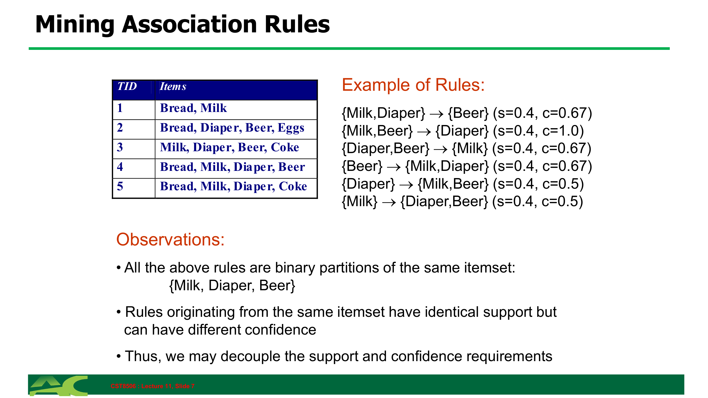

**Mining Association Rules:** — 挖掘关联规则

- Example of Rules from the same itemset {Milk, Diaper, Beer}: — 同一个项集 {牛奶, 尿布, 啤酒} 产生的规则示例：
  - {Milk, Diaper} → {Beer} (s=0.4, c=0.67)
  - {Milk, Beer} → {Diaper} (s=0.4, c=1.0)
  - {Diaper, Beer} → {Milk} (s=0.4, c=0.67)
  - {Beer} → {Milk, Diaper} (s=0.4, c=0.67)
  - {Diaper} → {Milk, Beer} (s=0.4, c=0.5)
  - {Milk} → {Diaper, Beer} (s=0.4, c=0.5)
- **Observations:** — 观察：
  - All the above rules are binary partitions of the same itemset: {Milk, Diaper, Beer} — 以上所有规则都是同一个项集 {牛奶, 尿布, 啤酒} 的二元划分
  - Rules originating from the same itemset have identical support but can have different confidence — 来自同一项集的规则支持度相同，但置信度可以不同
  - Thus, we may decouple the support and confidence requirements — 因此，我们可以将支持度和置信度的要求解耦

> **📝 承接与解释 (Transition & Explanation):**
>
> **当前解读**: 这是本课程最关键的洞察之一——同一个频繁项集的所有"二元划分"共享相同的支持度！这意味着我们可以"先把支持度≥阈值的项集找出来，再问哪些划分方式满足置信度"。
> **上下文承接**: 这个观察直接导出了下一页的"两步法"框架。

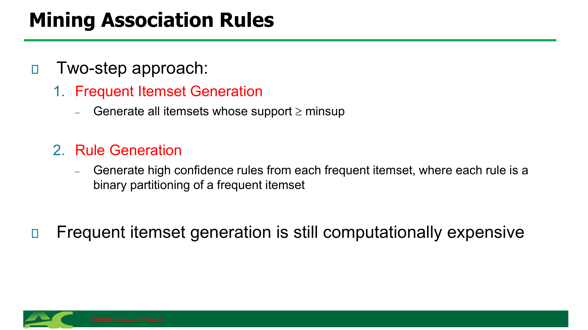

**Mining Association Rules — Two-step approach:** — 挖掘关联规则 — 两步法：

1. **Frequent Itemset Generation** — Generate all itemsets whose support ≥ minsup — **生成频繁项集** — 生成所有支持度 ≥ minsup 的项集
2. **Rule Generation** — Generate high confidence rules from each frequent itemset, where each rule is a binary partitioning of a frequent itemset — **生成规则** — 从每个频繁项集中生成高置信度的规则，每条规则都是频繁项集的一种二元划分
- Frequent itemset generation is still computationally expensive — 频繁项集的生成仍然计算开销很大

> **📝 承接与解释 (Transition & Explanation):**
>
> **当前解读**: 正式提出了两步法。虽然把问题拆成了两步（先找项集、再生成规则），但步骤1的频繁项集生成本身仍然是指数级的，所以我们还需要进一步优化。
> **上下文承接**: 两步法的瓶颈在于步骤1。下一节将聚焦于"频繁项集生成"的优化，从暴力法开始讲起，逐步引出 Apriori 原理。

---

## 5. 频繁项集生成 (Frequent Itemset Generation)

### 5.1 暴力法与挑战 (Brute-Force & Challenges)

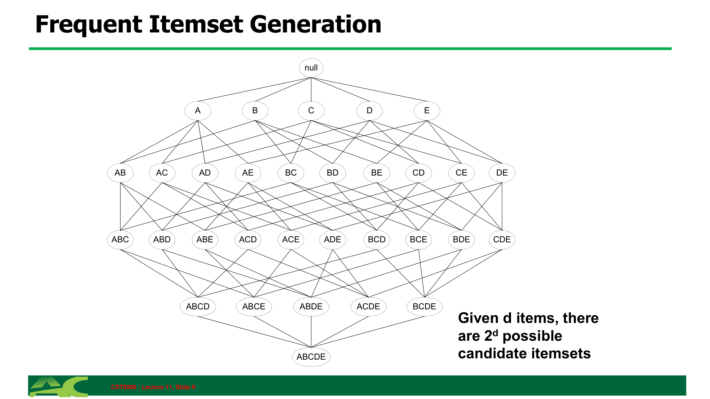

**Frequent Itemset Generation:** — 频繁项集生成

- Given d items, there are 2^d possible candidate itemsets — 给定 d 个物品，共有 2^d 个候选项集
- (Diagram shows the itemset lattice from null → single items → pairs → triplets → ... → full set ABCDE) — （图示展示了从空集 → 单个物品 → 成对 → 三元组 → … → 全集 ABCDE 的项集格结构）

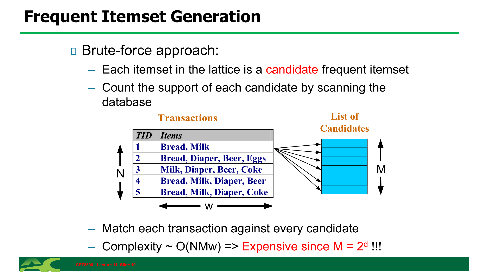

**Frequent Itemset Generation — Brute-force approach:** — 频繁项集生成 — 暴力法：

- Each itemset in the lattice is a candidate frequent itemset — 格中每一个项集都是候选频繁项集
- Count the support of each candidate by scanning the database — 通过扫描数据库来计算每个候选项集的支持度
- Match each transaction against every candidate — 将每条交易记录与每个候选项集逐一匹配
- Complexity ~ O(NMw) ⇒ Expensive since M = 2^d !!! — 复杂度约为 O(NMw) ⇒ 非常昂贵，因为 M = 2^d ！！！

> **📝 承接与解释 (Transition & Explanation):**
>
> **当前解读**: 暴力法需要遍历所有 2^d 个候选项集，并逐条扫描数据库，三重循环 O(NMw) 在面对大规模数据时几乎不可行。
> **上下文承接**: 既然暴力法代价太大，下一页将总结三类优化策略（减少候选数、减少交易数、减少比较次数），为 Apriori 算法的引入做最后铺垫。

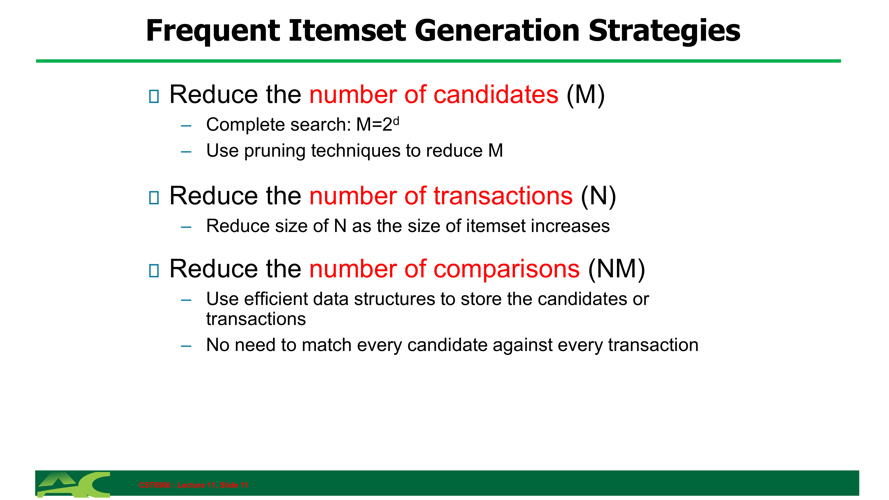

**Frequent Itemset Generation Strategies:** — 频繁项集生成策略

- **Reduce the number of candidates (M)** — **减少候选项集数量**
  - Complete search: M = 2^d — 完全搜索：M = 2^d
  - Use pruning techniques to reduce M — 使用剪枝技术减少 M
- **Reduce the number of transactions (N)** — **减少交易数量**
  - Reduce size of N as the size of itemset increases — 随着项集大小的增加，减少需要搜索的交易数
- **Reduce the number of comparisons (NM)** — **减少比较次数**
  - Use efficient data structures to store the candidates or transactions — 使用高效的数据结构来存储候选项集或交易记录
  - No need to match every candidate against every transaction — 不需要将每个候选项集和每条交易记录都匹配

> **📝 承接与解释 (Transition & Explanation):**
>
> **当前解读**: 点明了优化的三个方向。其中"减少候选数"是最核心的优化手段，这正是 Apriori 原理的核心作用场景。
> **上下文承接**: 下一节将正式引出 Apriori 原理——利用支持度的反单调性来大幅裁剪候选空间。

### 5.2 Apriori 原理 (Apriori Principle)

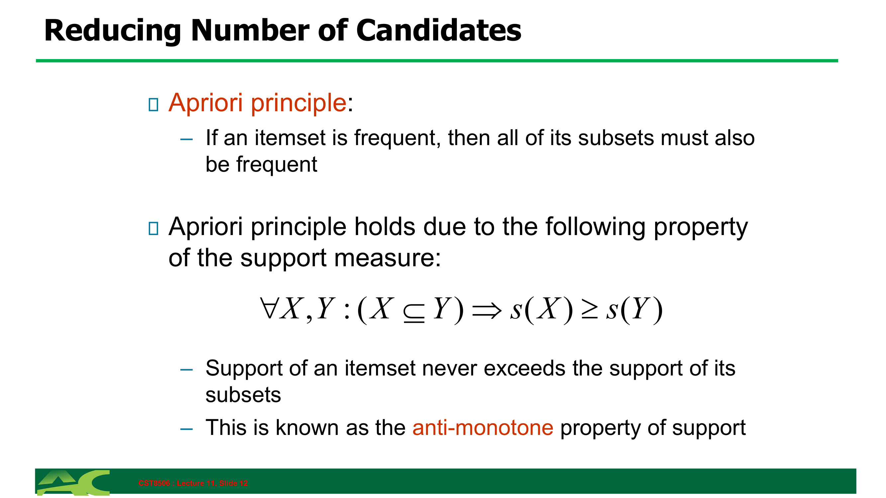

**Reducing Number of Candidates — Apriori principle:** — 减少候选数量 — Apriori 原理：

- If an itemset is frequent, then all of its subsets must also be frequent — 如果一个项集是频繁的，那么它的所有子集也一定是频繁的
- Apriori principle holds due to the following property of the support measure: — Apriori 原理成立，是因为支持度具有以下性质：
  - ∀X, Y : (X ⊆ Y) ⇒ s(X) ≥ s(Y) — 对于所有 X、Y：如果 X 是 Y 的子集，那么 X 的支持度 ≥ Y 的支持度
  - Support of an itemset never exceeds the support of its subsets — 一个项集的支持度永远不会超过其子集的支持度
  - This is known as the **anti-monotone property** of support — 这被称为支持度的**反单调性**

> **📝 承接与解释 (Transition & Explanation):**
>
> **当前解读**: 这是整个 Apriori 算法的理论基石。反单调性（anti-monotone）意味着：超集的支持度只会比子集更低。逆否命题就是——如果一个子集是不频繁的，那么包含它的所有超集都不可能频繁，可以直接剪掉！
> **上下文承接**: 理解了抽象原理后，下一组页面将通过一个具体的五物品数据集逐步演示这个剪枝过程。

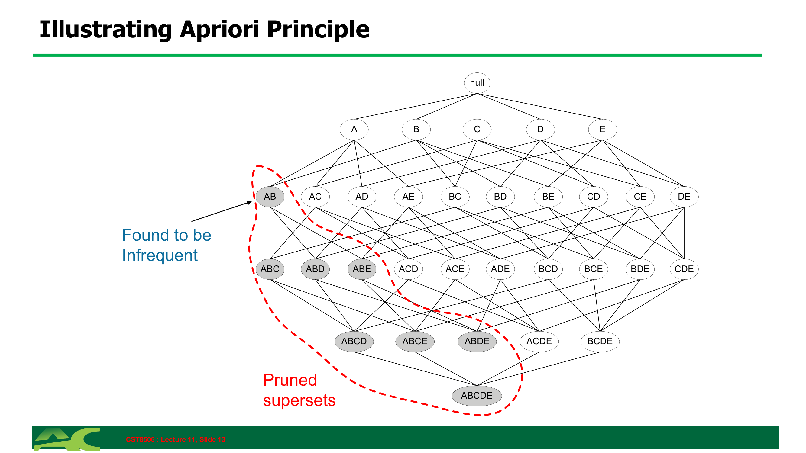

**Illustrating Apriori Principle:** — Apriori 原理图解

- (Diagram shows itemset lattice: if {A, D} is found to be infrequent, all its supersets — {ABD}, {ACD}, {ADE}, {ABCD}, ..., {ABCDE} — are pruned) — （图示展示了项集格：如果发现 {A, D} 不频繁，那么它的所有超集——{ABD}、{ACD}、{ADE}、{ABCD}、…、{ABCDE}——都被剪枝掉）

> **📝 承接与解释 (Transition & Explanation):**
>
> **当前解读**: 用一幅完整的格图直观展示了剪枝的威力——仅仅发现一个 2-项集不频繁，就可以连带剪掉大量超集。
> **上下文承接**: 看完示意图后，接下来的多个页面将用实际的购物篮数据集，从1-项集开始逐层演示 Apriori 的完整工作流程。

### 5.3 Apriori 逐步推演 (Step-by-Step Walkthrough)

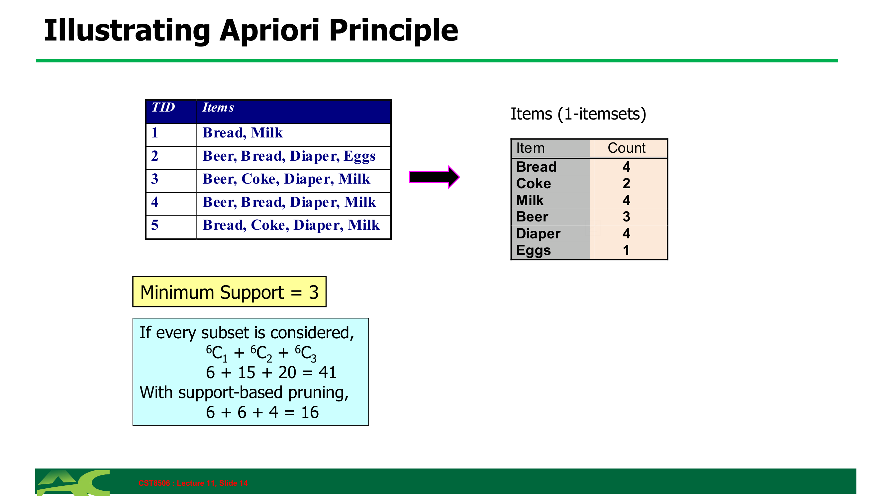

**Illustrating Apriori Principle — 1-itemsets:** — Apriori 原理演示 — 1-项集

- Scan database to count support of each single item — 扫描数据库计算每个单独物品的支持度

| Item | Count |
|------|-------|
| Bread | 4 |
| Coke | 2 |
| Milk | 4 |
| Beer | 3 |
| Diaper | 4 |
| Eggs | 1 |

- Minimum Support = 3 — 最小支持度 = 3

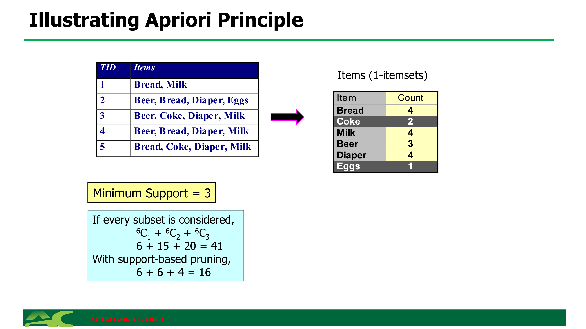

**Illustrating Apriori Principle — Pruning 1-itemsets:** — Apriori 原理演示 — 剪枝1-项集

- With minsup = 3: Coke (count=2) and Eggs (count=1) are pruned — 按 minsup = 3：Coke（计数=2）和 Eggs（计数=1）被剪枝

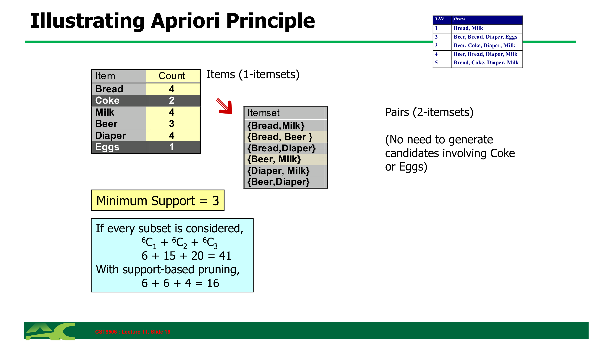

**Illustrating Apriori Principle — 2-itemsets:** — Apriori 原理演示 — 2-项集

- Generate candidate pairs only from frequent 1-itemsets — 仅从频繁1-项集中生成候选项对
- No need to generate candidates involving Coke or Eggs — 无需生成包含 Coke 或 Eggs 的候选

| Itemset Pair | 
|------------|
| {Bread, Milk} |
| {Bread, Beer} |
| {Bread, Diaper} |
| {Beer, Milk} |
| {Diaper, Milk} |
| {Beer, Diaper} |

- If every subset is considered: 6C1 + 6C2 + 6C3 = 6 + 15 + 20 = 41 — 若考虑每个子集：41个
- With support-based pruning: 6 + 6 + 4 = 16 — 经支持度剪枝后：仅16个

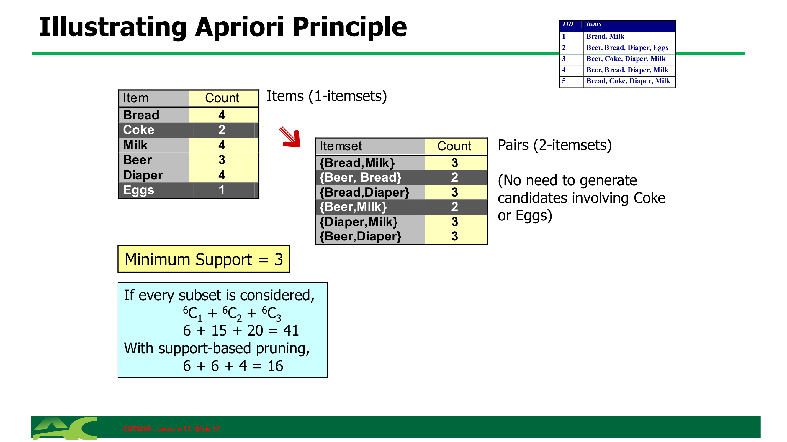

**Illustrating Apriori Principle — Counting 2-itemsets:** — Apriori 原理演示 — 计数2-项集

- Scan database to count support for each candidate 2-itemset — 再次扫描数据库计算每个候选2-项集的支持度

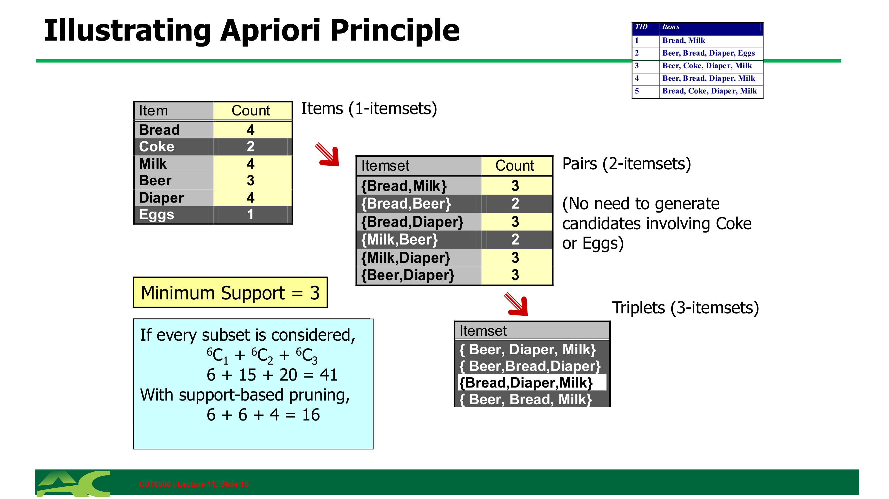

**Illustrating Apriori Principle — 2-itemset results & 3-itemsets:** — Apriori 原理演示 — 2-项集结果与3-项集

- 2-itemset counts after scanning: — 扫描后的2-项集计数：
  - {Bread, Beer} = 2, {Bread, Diaper} = 3, etc. — {面包, 啤酒} = 2，{面包, 尿布} = 3，等
- Candidate 3-itemsets generated from surviving 2-itemsets: — 从存活的2-项集中生成候选3-项集：
  - {Beer, Diaper, Milk}, {Beer, Bread, Diaper}, {Bread, Diaper, Milk}, {Beer, Bread, Milk} — {啤酒, 尿布, 牛奶}，{啤酒, 面包, 尿布}，{面包, 尿布, 牛奶}，{啤酒, 面包, 牛奶}

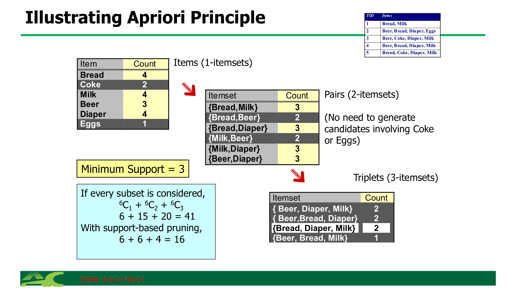

**Illustrating Apriori Principle — Counting 3-itemsets:** — Apriori 原理演示 — 计数3-项集

- Scan database to count support for each candidate 3-itemset — 再次扫描数据库计算3-项集的支持度

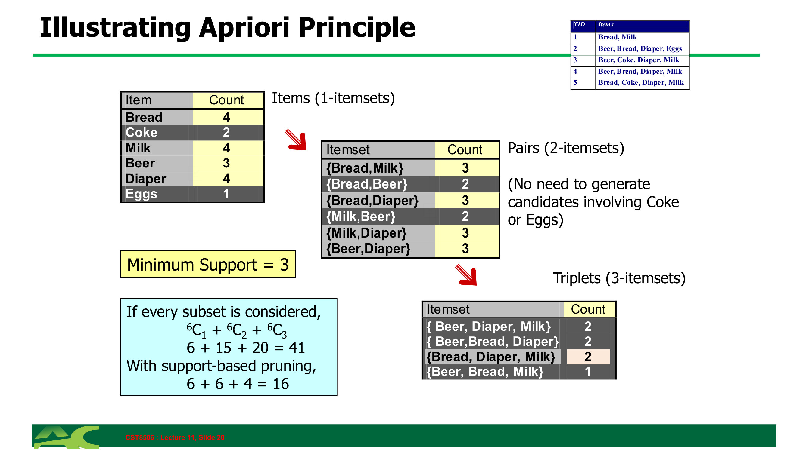

**Illustrating Apriori Principle — Final 3-itemset results:** — Apriori 原理演示 — 最终3-项集结果

- Final frequent 3-itemsets after counting and pruning — 经过计数和剪枝后的最终频繁3-项集

> **📝 承接与解释 (Transition & Explanation):**
>
> **当前解读**: 通过逐层推演（1-项集 → 2-项集 → 3-项集），展示了 Apriori 原理如何将候选数量从41个大幅削减至16个。每一层的剪枝结果都成为下一层的输入，逐步收敛。
> **上下文承接**: 至此我们理解了 Apriori "逐层扩展 + 剪枝"的直觉。下一节将给出 Apriori 算法的正式伪代码和候选生成的具体方法。

---

## 6. Apriori 算法 (Apriori Algorithm)

### 6.1 算法伪代码 (Algorithm Pseudocode)

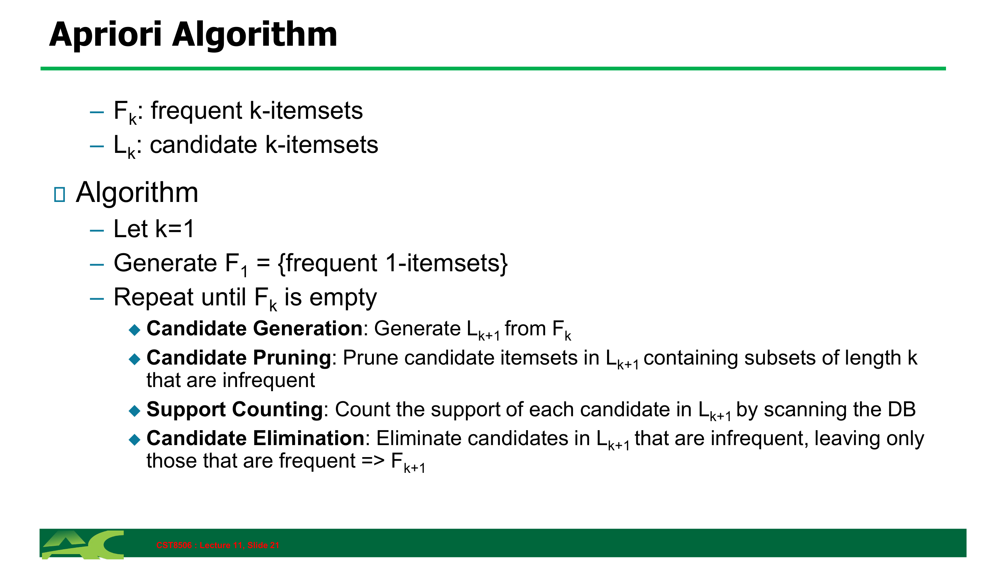

**Apriori Algorithm:** — Apriori 算法

- F_k: frequent k-itemsets — F_k：频繁 k-项集
- L_k: candidate k-itemsets — L_k：候选 k-项集
- **Algorithm:** — **算法流程：**
  - Let k = 1 — 令 k = 1
  - Generate F₁ = {frequent 1-itemsets} — 生成 F₁ = {频繁1-项集}
  - Repeat until F_k is empty: — 重复直到 F_k 为空：
    1. **Candidate Generation:** Generate L_{k+1} from F_k — **候选生成：** 从 F_k 生成 L_{k+1}
    2. **Candidate Pruning:** Prune candidate itemsets in L_{k+1} containing subsets of length k that are infrequent — **候选剪枝：** 剪掉 L_{k+1} 中包含长度为 k 的不频繁子集的候选
    3. **Support Counting:** Count the support of each candidate in L_{k+1} by scanning the DB — **支持度计数：** 通过扫描数据库计算 L_{k+1} 中每个候选的支持度
    4. **Candidate Elimination:** Eliminate candidates in L_{k+1} that are infrequent, leaving only those that are frequent ⇒ F_{k+1} — **候选淘汰：** 淘汰不频繁的候选，保留频繁项集 ⇒ F_{k+1}

> **📝 承接与解释 (Transition & Explanation):**
>
> **当前解读**: 这是 Apriori 算法的完整四步循环：生成候选 → 剪枝 → 计数 → 淘汰。每一层消耗一次完整的数据库扫描。
> **上下文承接**: 伪代码中的"候选生成"步骤是标黑的第一步，但具体怎么从 F_k 生成 L_{k+1}？下一节将详细介绍几种不同的候选生成方法。

### 6.2 候选生成方法 (Candidate Generation Methods)

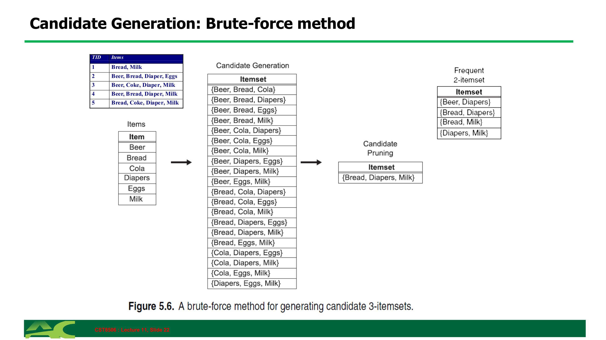

**Candidate Generation: Brute-force method:** — 候选生成：暴力法

- (Shows the transaction table as reference for candidate generation methods) — （展示交易表作为候选生成方法的参考数据）

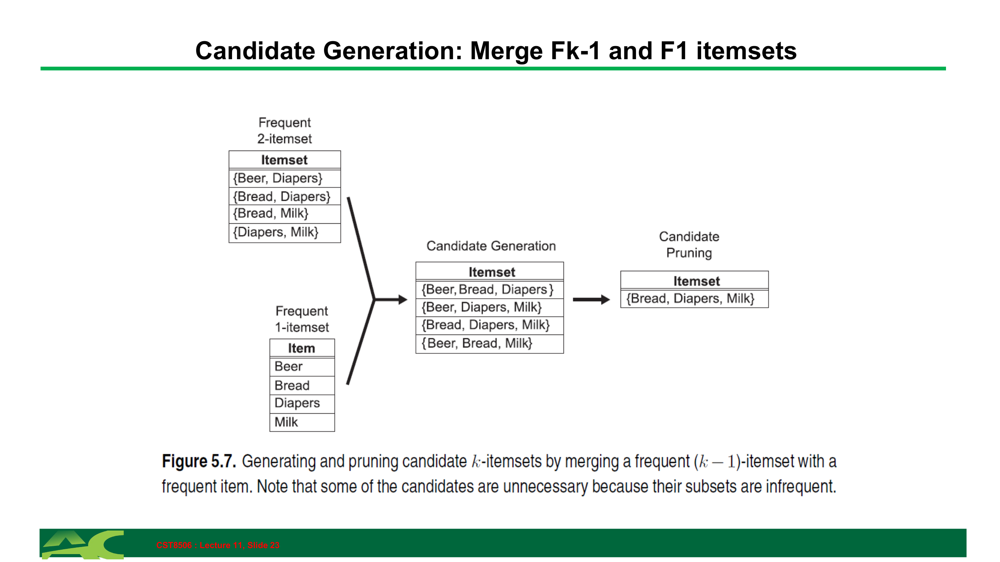

**Candidate Generation: Merge F_{k-1} and F₁ itemsets:** — 候选生成：合并 F_{k-1} 和 F₁ 项集

- (Diagram illustrating the merge of (k-1)-itemsets with 1-itemsets to produce k-itemset candidates) — （图示说明将 (k-1)-项集与1-项集合并来生成 k-项集候选）

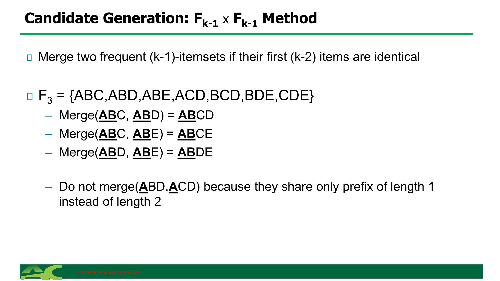

**Candidate Generation: F_{k-1} × F_{k-1} Method:** — 候选生成：F_{k-1} × F_{k-1} 方法

- Merge two frequent (k-1)-itemsets if their first (k-2) items are identical — 如果两个频繁 (k-1)-项集的前 (k-2) 个元素相同，则合并它们
- F₃ = {ABC, ABD, ABE, ACD, BCD, BDE, CDE} — 频繁3-项集集合
  - Merge(ABC, ABD) = ABCD ✅ — 合并(ABC, ABD) = ABCD ✅
  - Merge(ABC, ABE) = ABCE ✅ — 合并(ABC, ABE) = ABCE ✅
  - Merge(ABD, ABE) = ABDE ✅ — 合并(ABD, ABE) = ABDE ✅
  - Do not merge(ABD, ACD) because they share only prefix of length 1 instead of length 2 — 不合并(ABD, ACD)，因为它们仅共享长度为1的前缀而非长度为2

> **📝 承接与解释 (Transition & Explanation):**
>
> **当前解读**: F_{k-1} × F_{k-1} 方法的核心规则是"前缀匹配"——只有前 k-2 个元素完全一致的两个 (k-1)-项集才能合并为一个 k-项集。这比暴力法高效得多。
> **上下文承接**: 候选生成出来只是第一步；下一页将展示对这些候选进行"剪枝"的过程。

### 6.3 候选剪枝 (Candidate Pruning)

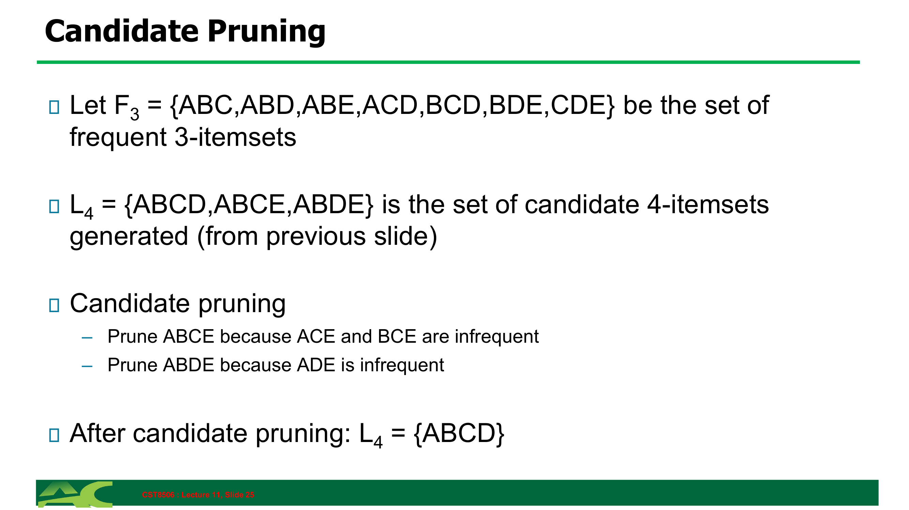

**Candidate Pruning:** — 候选剪枝

- Let F₃ = {ABC, ABD, ABE, ACD, BCD, BDE, CDE} be the set of frequent 3-itemsets — 设 F₃ = {ABC, ABD, ABE, ACD, BCD, BDE, CDE} 为频繁3-项集的集合
- L₄ = {ABCD, ABCE, ABDE} is the set of candidate 4-itemsets generated — L₄ = {ABCD, ABCE, ABDE} 为生成的候选4-项集
- **Candidate pruning:** — **候选剪枝：**
  - Prune ABCE because ACE and BCE are infrequent — 剪掉 ABCE，因为 ACE 和 BCE 不频繁
  - Prune ABDE because ADE is infrequent — 剪掉 ABDE，因为 ADE 不频繁
- **After candidate pruning: L₄ = {ABCD}** — **剪枝后：L₄ = {ABCD}**

> **📝 承接与解释 (Transition & Explanation):**
>
> **当前解读**: 候选剪枝就是 Apriori 原理的直接应用——如果一个候选 k-项集的任何 (k-1) 子集不在 F_{k-1} 中，该候选直接丢弃。这里3个候选仅保留了1个。
> **上下文承接**: 至此我们理解了标准的前缀合并法。下面几页将介绍一种"替代合并法"及其对应的剪枝策略。

### 6.4 替代合并法 (Alternate F_{k-1} × F_{k-1} Method)

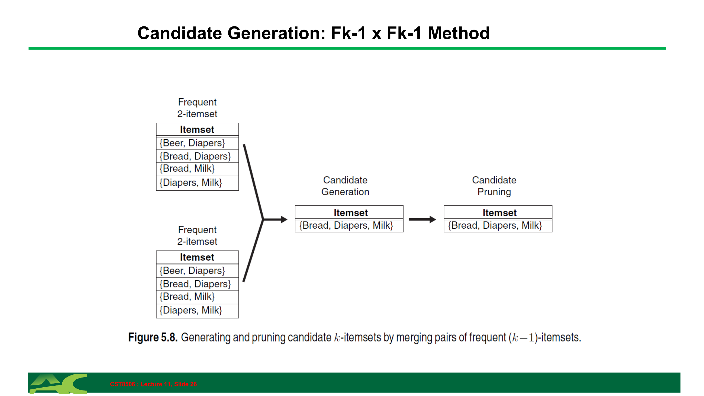

**Candidate Generation: F_{k-1} × F_{k-1} Method (Diagram):** — 候选生成：F_{k-1} × F_{k-1} 方法（图解）

- (Visual diagram illustrating the F_{k-1} × F_{k-1} generation process step-by-step) — （逐步展示 F_{k-1} × F_{k-1} 生成过程的可视化图解）

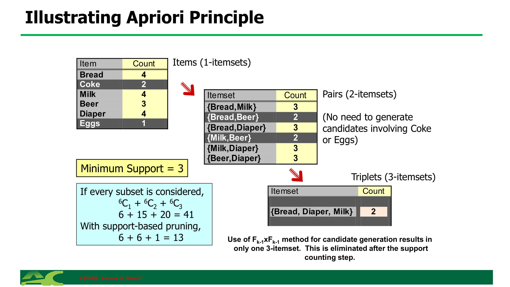

**Illustrating Apriori Principle — Summary with F_{k-1} × F_{k-1}:** — Apriori 原理演示 — 使用 F_{k-1} × F_{k-1} 方法的总结

- Use of F_{k-1} × F_{k-1} method for candidate generation results in only one 3-itemset. This is eliminated after the support counting step. — 使用 F_{k-1} × F_{k-1} 方法进行候选生成后，仅产生一个3-项集。该项集在支持度计数步骤后被淘汰。
- With support-based pruning: 6 + 6 + 1 = 13 — 经支持度剪枝后：6 + 6 + 1 = 13 个候选

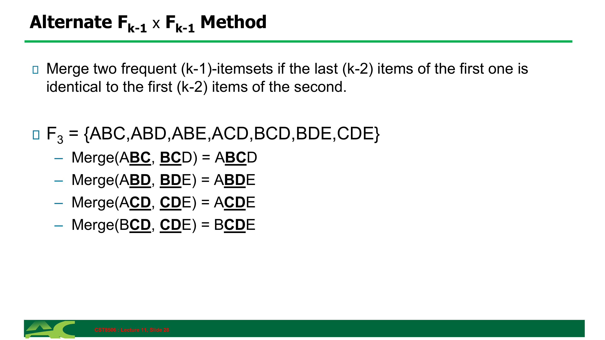

**Alternate F_{k-1} × F_{k-1} Method:** — 替代 F_{k-1} × F_{k-1} 方法

- Merge two frequent (k-1)-itemsets if the **last** (k-2) items of the first one is identical to the **first** (k-2) items of the second — 如果第一个 (k-1)-项集的**后** (k-2) 个元素与第二个 (k-1)-项集的**前** (k-2) 个元素相同，则合并
- F₃ = {ABC, ABD, ABE, ACD, BCD, BDE, CDE}
  - Merge(ABC, BCD) = ABCD ✅
  - Merge(ABD, BDE) = ABDE ✅
  - Merge(ACD, CDE) = ACDE ✅
  - Merge(BCD, CDE) = BCDE ✅

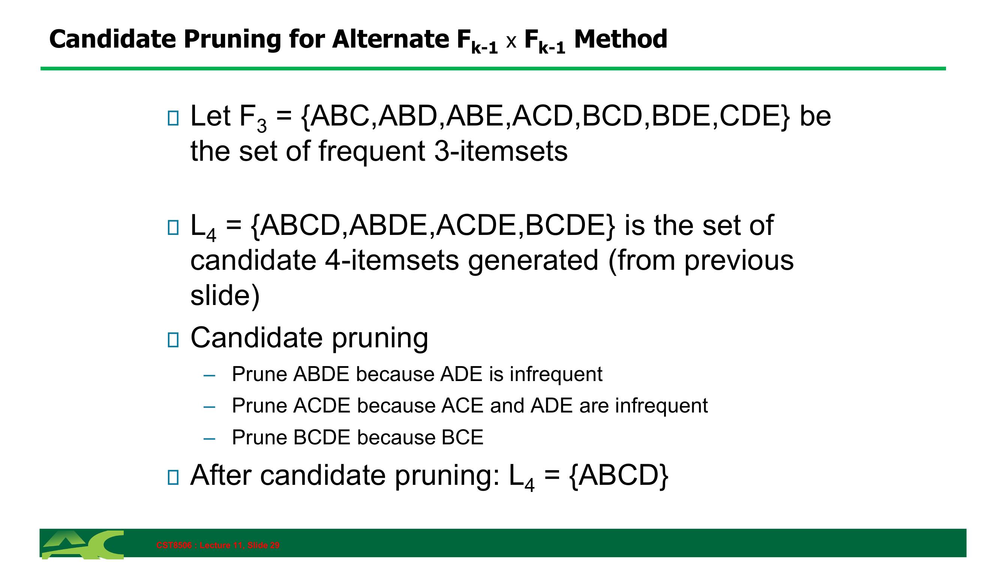

**Candidate Pruning for Alternate F_{k-1} × F_{k-1} Method:** — 替代 F_{k-1} × F_{k-1} 方法的候选剪枝

- L₄ = {ABCD, ABDE, ACDE, BCDE} is the set of candidate 4-itemsets generated — L₄ = {ABCD, ABDE, ACDE, BCDE} 为生成的候选4-项集
- **Candidate pruning:** — **候选剪枝：**
  - Prune ABDE because ADE is infrequent — 剪掉 ABDE，因为 ADE 不频繁
  - Prune ACDE because ACE and ADE are infrequent — 剪掉 ACDE，因为 ACE 和 ADE 不频繁
  - Prune BCDE because BCE is infrequent — 剪掉 BCDE，因为 BCE 不频繁
- **After candidate pruning: L₄ = {ABCD}** — **剪枝后：L₄ = {ABCD}**

> **📝 承接与解释 (Transition & Explanation):**
>
> **当前解读**: 替代合并法使用"后缀-前缀"匹配而非"前缀"匹配。虽然初始候选更多（4个 vs 3个），但剪枝后结果一致（都只剩 ABCD）。两种方法最终结果相同，但中间候选数和剪枝开销不同。
> **上下文承接**: 候选生成和剪枝理清后，下一节将聚焦第三步——支持度计数的实现细节。

---

## 7. 支持度计数与规则生成 (Support Counting & Rule Generation)

### 7.1 支持度计数 (Support Counting)

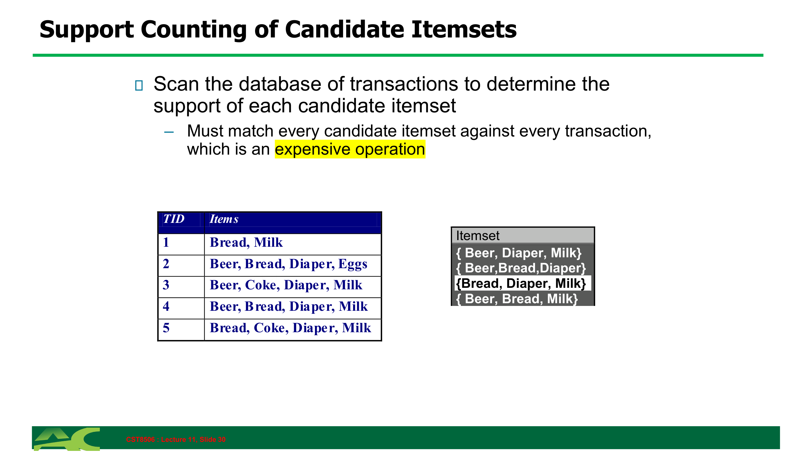

**Support Counting of Candidate Itemsets:** — 候选项集的支持度计数

- Scan the database of transactions to determine the support of each candidate itemset — 扫描交易数据库以确定每个候选项集的支持度
- Must match every candidate itemset against every transaction, which is an expensive operation — 需要将每个候选项集与每条交易记录匹配，这是一个开销很大的操作

| TID | Items |
|-----|-------|
| 1 | Bread, Milk |
| 2 | Beer, Bread, Diaper, Eggs |
| 3 | Beer, Coke, Diaper, Milk |
| 4 | Beer, Bread, Diaper, Milk |
| 5 | Bread, Coke, Diaper, Milk |

- Candidate 3-itemsets to count: — 需要计算支持度的候选3-项集：
  - {Beer, Diaper, Milk}, {Beer, Bread, Diaper}, {Bread, Diaper, Milk}, {Beer, Bread, Milk}

> **📝 承接与解释 (Transition & Explanation):**
>
> **当前解读**: 支持度计数是 Apriori 算法每一轮的必经步骤，需要完整扫描一遍数据库。这也是 Apriori 的主要性能瓶颈之一——每增加一层 k，就要多扫描一次全量数据。
> **上下文承接**: 至此频繁项集的生成完成了。下一步是利用这些频繁项集来生成满足置信度要求的关联规则。

### 7.2 规则生成 (Rule Generation)

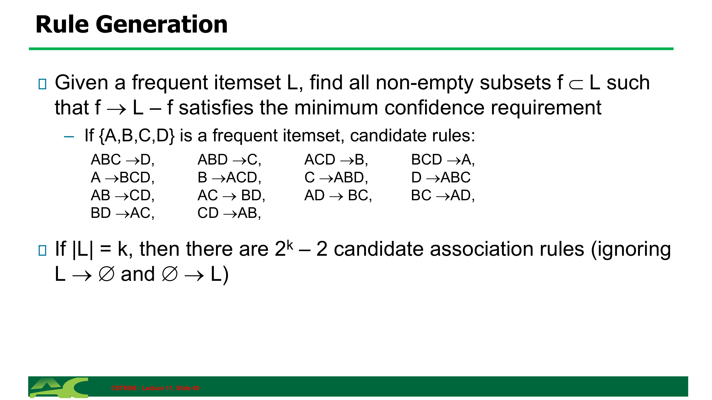

**Rule Generation:** — 规则生成

- Given a frequent itemset L, find all non-empty subsets f ⊂ L such that f → L – f satisfies the minimum confidence requirement — 给定一个频繁项集 L，找出所有非空子集 f ⊂ L，使得 f → L − f 满足最小置信度要求
- If {A, B, C, D} is a frequent itemset, candidate rules: — 如果 {A, B, C, D} 是一个频繁项集，候选规则有：
  - ABC → D, ABD → C, ACD → B, BCD → A
  - AB → CD, AC → BD, AD → BC, BC → AD, BD → AC, CD → AB
  - A → BCD, B → ACD, C → ABD, D → ABC
- If |L| = k, then there are 2^k – 2 candidate association rules (ignoring L → ∅ and ∅ → L) — 如果 |L| = k，则有 2^k − 2 条候选关联规则（排除 L → ∅ 和 ∅ → L）

> **📝 承接与解释 (Transition & Explanation):**
>
> **当前解读**: 规则生成是"两步法"的第二步。对于一个大小为 k 的频繁项集，我们需要检验 2^k − 2 种不同的划分方式（每种划分产生一条规则），保留那些置信度 ≥ minconf 的规则。
> **上下文承接**: 整节课至此完成了关联规则挖掘的完整流程：定义 → 暴力法不可行 → 两步法 → Apriori 原理 → 逐层生成 → 规则产生。

---

## 8. 课程总结 (Summary)

**End of Lecture 11:** — 第11讲结束

> **📝 承接与解释 (Transition & Explanation):**
>
> **当前解读**: 本周课程完成了关联规则挖掘的全部核心内容：从基础定义（支持度、置信度）→ 暴力法的计算瓶颈 → 两步法的解耦思路 → Apriori 原理的剪枝威力 → 候选生成与剪枝方法 → 规则生成。
> **上下文承接**: 至此《关联规则挖掘》的全部课程内容结束。
