# Week 9: 类不平衡问题 (Imbalanced Class Problem)

> Source: `Week9-Imbalance_Class_Problem.pdf`
> Total slides: 43
> Instructor: Dr. Abbas Akkasi | Winter 2026

---

## 1. 类不平衡问题概述 (Class Imbalance Problem Overview)

### 1.1 课程概览 (Course Overview)

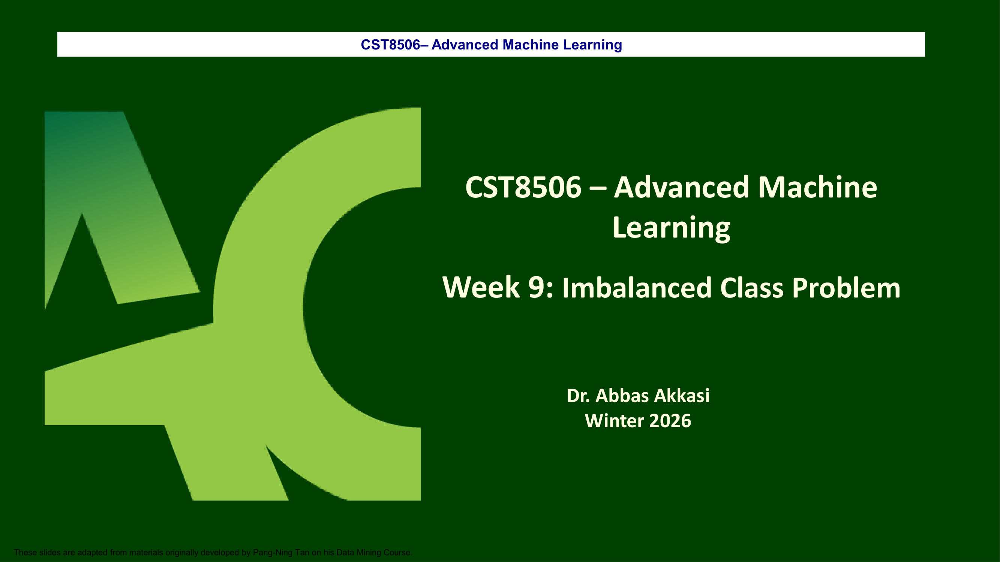

**CST8506 – Advanced Machine Learning, Week 9: Imbalanced Class Problem** — CST8506 – 高级机器学习，第9周：类不平衡问题

- These slides are adapted from materials originally developed by Pang-Ning Tan on his Data Mining Course. — 这些幻灯片改编自 Pang-Ning Tan 的数据挖掘课程原始材料。

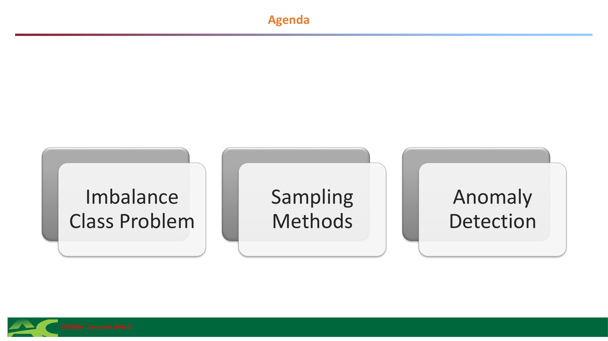

**Agenda** — 议程

- Imbalance Class Problem — 类不平衡问题
- Sampling Methods — 采样方法
- Anomaly Detection — 异常检测

### 1.2 什么是类不平衡问题 (What is Class Imbalance Problem)

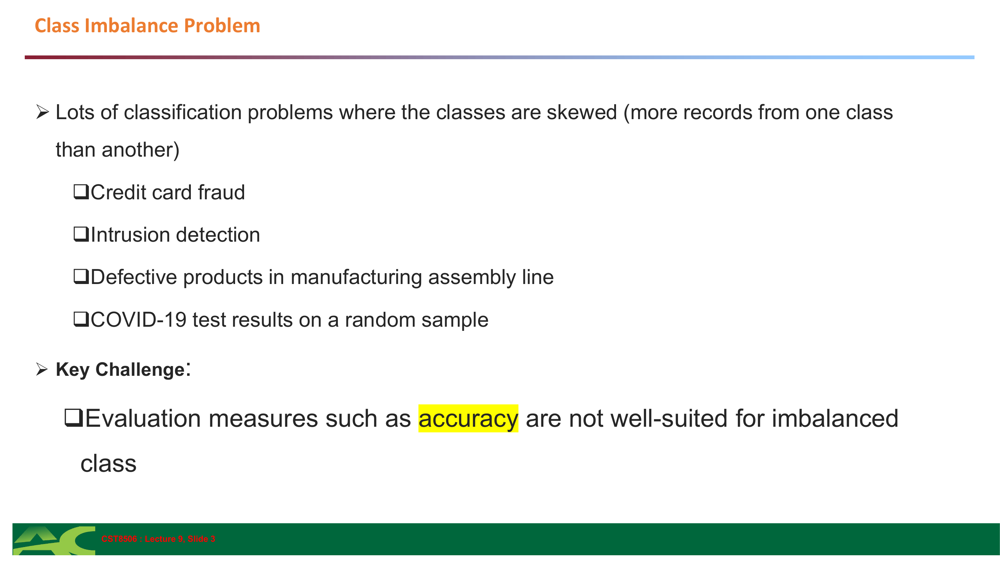

**Class Imbalance Problem** — 类不平衡问题

- Lots of classification problems where the classes are skewed (more records from one class than another) — 许多分类问题中类别是倾斜的（一个类别的记录远多于另一个类别）
  - Credit card fraud — 信用卡欺诈
  - Intrusion detection — 入侵检测
  - Defective products in manufacturing assembly line — 制造装配线中的缺陷产品
  - COVID-19 test results on a random sample — 随机样本中的 COVID-19 检测结果
- **Key Challenge** — **关键挑战**
  - Evaluation measures such as accuracy are not well-suited for imbalanced class — 准确率等评估指标不适合不平衡类别

---

## 2. 混淆矩阵与评估指标 (Confusion Matrix & Evaluation Metrics)

### 2.1 混淆矩阵 (Confusion Matrix)

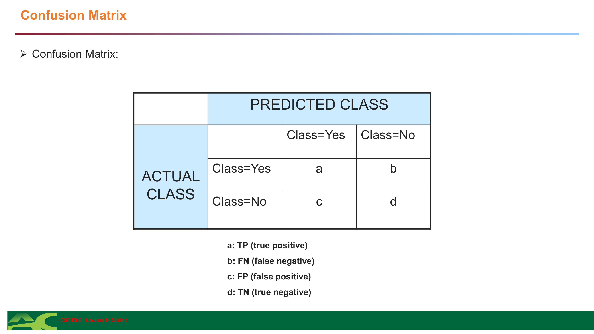

**Confusion Matrix** — 混淆矩阵

| | Predicted Class=Yes | Predicted Class=No |
|---|---|---|
| **Actual Class=Yes** | a: TP (true positive) — 真正例 | b: FN (false negative) — 假反例 |
| **Actual Class=No** | c: FP (false positive) — 假正例 | d: TN (true negative) — 真反例 |

### 2.2 准确率 (Accuracy)

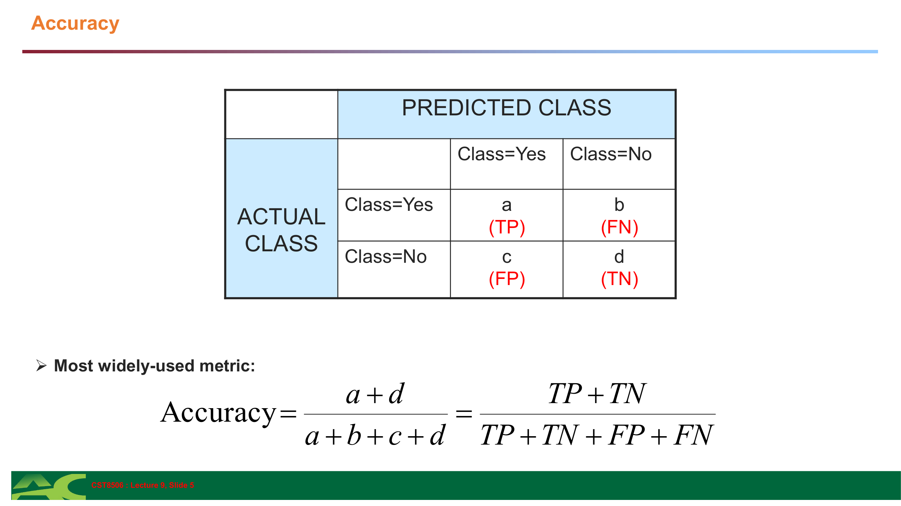

**Accuracy** — 准确率

- Most widely-used metric — 最广泛使用的指标
- `Accuracy = (a + d) / (a + b + c + d) = (TP + TN) / (TP + TN + FP + FN)`

### 2.3 准确率的问题 (Problem with Accuracy)

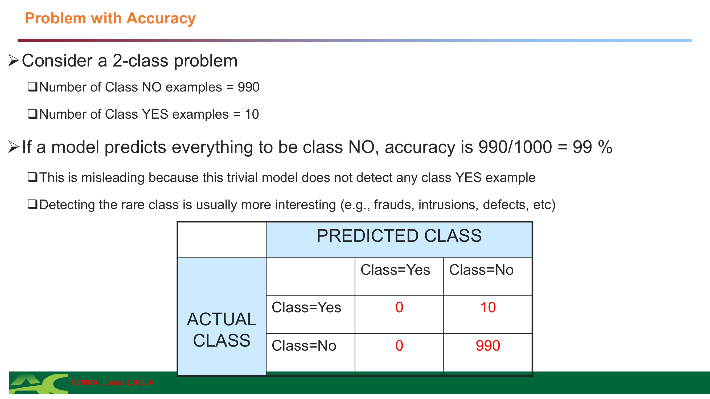

**Problem with Accuracy** — 准确率的问题

- Consider a 2-class problem — 考虑一个二分类问题
  - Number of Class NO examples = 9900 — Class NO 样本数 = 9900
  - Number of Class YES examples = 10 — Class YES 样本数 = 10
- If a model predicts everything to be class NO, accuracy is 990/1000 = 99% — 如果模型将所有样本预测为 Class NO，准确率为 990/1000 = 99%
  - This is misleading because this trivial model does not detect any class YES example — 这是误导性的，因为这个简单模型未能检测到任何 Class YES 样本
  - Detecting the rare class is usually more interesting (e.g., frauds, intrusions, defects, etc) — 检测稀有类别通常更有价值（如欺诈、入侵、缺陷等）

| | Predicted Class=Yes | Predicted Class=No |
|---|---|---|
| **Actual Class=Yes** | 0 | 10 |
| **Actual Class=No** | 0 | 990 |

### 2.4 模型比较 (Which Model is Better?)

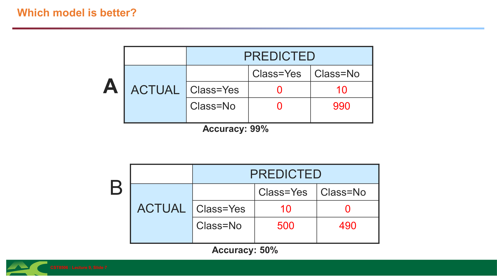

**Which model is better?** — 哪个模型更好？

**Model A:**

| | Predicted Yes | Predicted No |
|---|---|---|
| **Actual Yes** | 0 | 10 |
| **Actual No** | 0 | 990 |

Accuracy: 99% — 准确率：99%

**Model B:**

| | Predicted Yes | Predicted No |
|---|---|---|
| **Actual Yes** | 10 | 0 |
| **Actual No** | 500 | 490 |

Accuracy: 50% — 准确率：50%

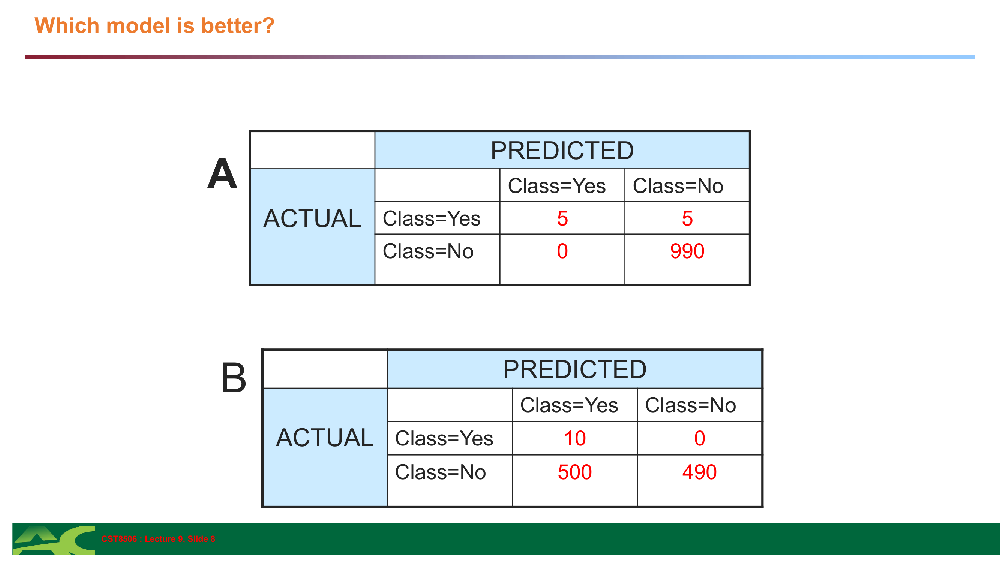

**Which model is better?** — 哪个模型更好？

**Model A:**

| | Predicted Yes | Predicted No |
|---|---|---|
| **Actual Yes** | 5 | 5 |
| **Actual No** | 0 | 990 |

**Model B:**

| | Predicted Yes | Predicted No |
|---|---|---|
| **Actual Yes** | 10 | 0 |
| **Actual No** | 500 | 490 |

### 2.5 替代指标 (Alternative Measures)

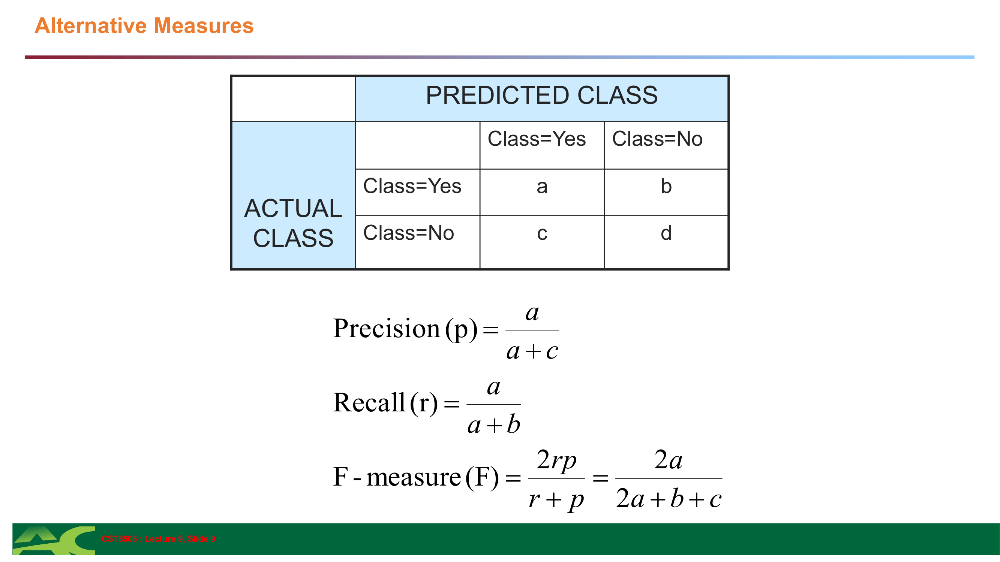

**Alternative Measures** — 替代指标

- **Precision (p)** — 精确率: `p = a / (a + c) = TP / (TP + FP)`
- **Recall (r)** — 召回率: `r = a / (a + b) = TP / (TP + FN)`
- **F-measure (F)** — F值: `F = 2rp / (r + p) = 2a / (2a + b + c)`

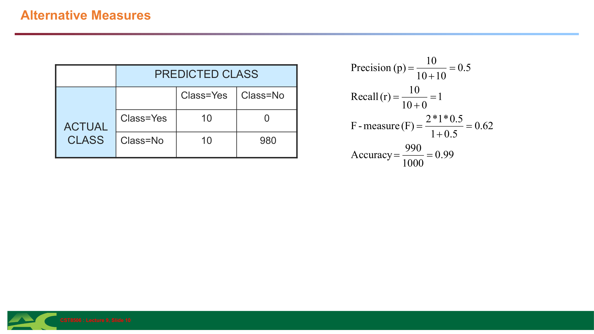

**Alternative Measures — Example 1** — 替代指标 — 示例1

| | Predicted Yes | Predicted No |
|---|---|---|
| **Actual Yes** | 10 | 0 |
| **Actual No** | 10 | 980 |

- Precision (p) = 10/(10+10) = 0.5 — 精确率 = 0.5
- Recall (r) = 10/(10+0) = 1 — 召回率 = 1
- F-measure (F) = 2×1×0.5/(1+0.5) = 0.67 — F值 = 0.67
- Accuracy = 990/1000 = 0.99 — 准确率 = 0.99

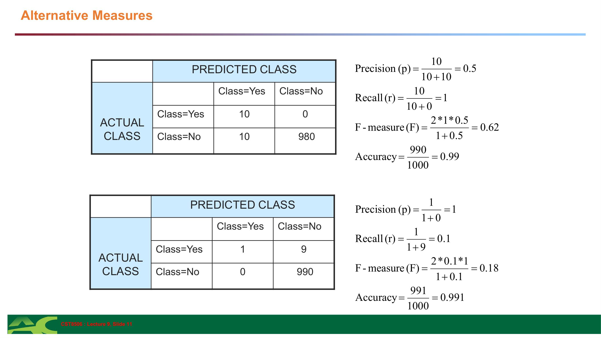

**Alternative Measures — Comparison** — 替代指标 — 对比

**Classifier A:**

| | Predicted Yes | Predicted No |
|---|---|---|
| **Actual Yes** | 10 | 0 |
| **Actual No** | 10 | 980 |

- Precision = 0.5, Recall = 1, F-measure = 0.67, Accuracy = 0.99

**Classifier B:**

| | Predicted Yes | Predicted No |
|---|---|---|
| **Actual Yes** | 1 | 9 |
| **Actual No** | 0 | 990 |

- Precision = 1, Recall = 0.1, F-measure = 0.18, Accuracy = 0.991

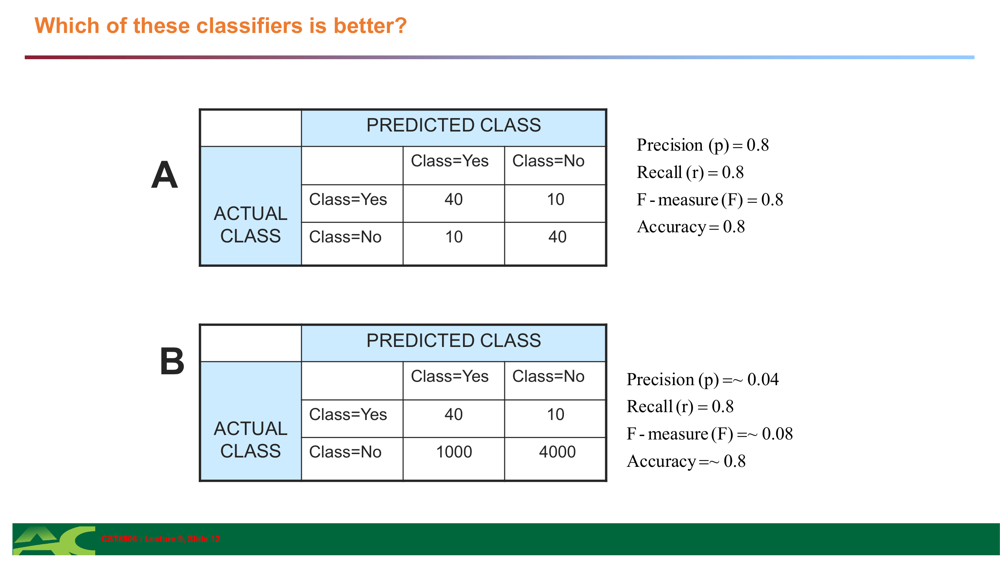

**Which of these classifiers is better?** — 这些分类器哪个更好？

**Classifier A:**

| | Predicted Yes | Predicted No |
|---|---|---|
| **Actual Yes** | 40 | 10 |
| **Actual No** | 10 | 40 |

- Precision = 0.8, Recall = 0.8, F-measure = 0.8, Accuracy = 0.8

**Classifier B:**

| | Predicted Yes | Predicted No |
|---|---|---|
| **Actual Yes** | 40 | 10 |
| **Actual No** | 1000 | 4000 |

- Precision ≈ 0.038, Recall = 0.8, F-measure ≈ 0.07, Accuracy ≈ 0.8

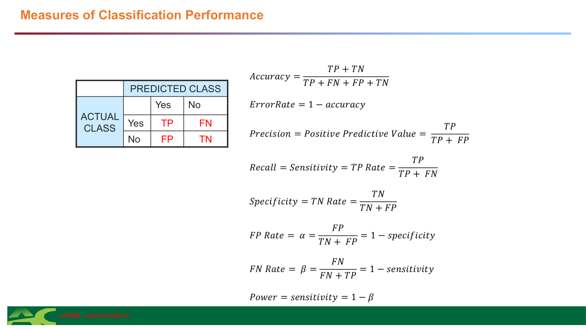

**Measures of Classification Performance** — 分类性能度量

| | Predicted Yes | Predicted No |
|---|---|---|
| **Actual Yes** | TP — 真正例 | FN — 假反例 |
| **Actual No** | FP — 假正例 | TN — 真反例 |

### 2.6 TPR 与 FPR (TPR and FPR)

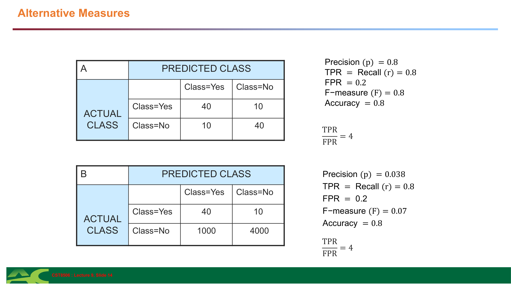

**Alternative Measures — TPR and FPR** — 替代指标 — TPR 和 FPR

**Classifier A:**

| | Predicted Yes | Predicted No |
|---|---|---|
| **Actual Yes** | 40 | 10 |
| **Actual No** | 10 | 40 |

- Precision = 0.8, Recall = 0.8, TPR = 0.8, FPR = 0.2 — 精确率 = 0.8，召回率 = 0.8，真正例率 = 0.8，假正例率 = 0.2
- F-measure = 0.8, Accuracy = 0.8 — F值 = 0.8，准确率 = 0.8
- **TPR = FPR ×4** (because class ratio is 1:1) — TPR = FPR ×4（因为类别比例是1:1）

**Classifier B:**

| | Predicted Yes | Predicted No |
|---|---|---|
| **Actual Yes** | 40 | 10 |
| **Actual No** | 1000 | 4000 |

- Precision = 0.038, Recall = 0.8, TPR = 0.8, FPR = 0.2 — 精确率 = 0.038，召回率 = 0.8，TPR = 0.8，FPR = 0.2
- F-measure = 0.07, Accuracy = 0.8 — F值 = 0.07，准确率 = 0.8
- **TPR = FPR** (same TPR and FPR, but very different precision!) — TPR = FPR（相同的 TPR 和 FPR，但精确率差异巨大！）

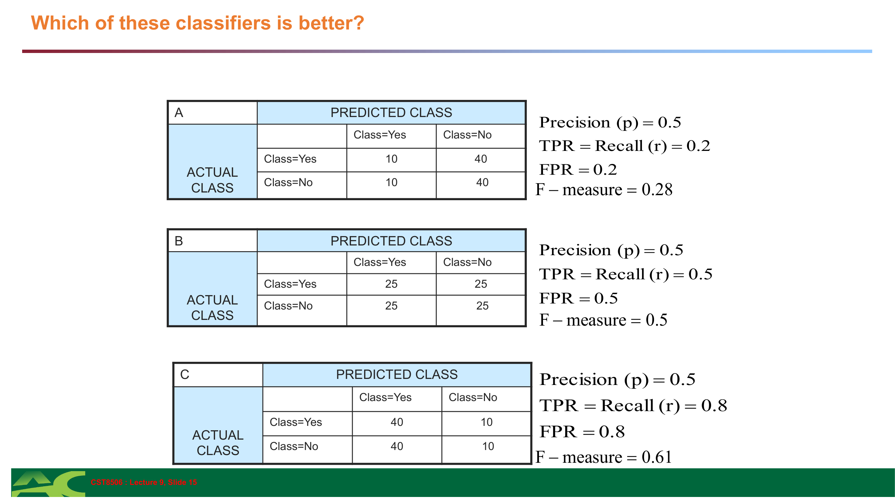

**Which of these classifiers is better?** — 这些分类器哪个更好？

**Classifier A:**

| | Predicted Yes | Predicted No |
|---|---|---|
| **Actual Yes** | 10 | 40 |
| **Actual No** | 10 | 40 |

- Precision = 0.5, Recall = 0.2, TPR = 0.2, FPR = 0.2 — 精确率 = 0.5，召回率 = 0.2，TPR = 0.2，FPR = 0.2
- F-measure = 0.28 — F值 = 0.28

**Classifier B:**

| | Predicted Yes | Predicted No |
|---|---|---|
| **Actual Yes** | 25 | 25 |
| **Actual No** | 25 | 25 |

- Precision = 0.5, Recall = 0.5, TPR = 0.5, FPR = 0.5 — 精确率 = 0.5，召回率 = 0.5，TPR = 0.5，FPR = 0.5
- F-measure = 0.5 — F值 = 0.5

**Classifier C:**

| | Predicted Yes | Predicted No |
|---|---|---|
| **Actual Yes** | 40 | 10 |
| **Actual No** | 40 | 10 |

- Precision = 0.5, Recall = 0.8, TPR = 0.8, FPR = 0.8 — 精确率 = 0.5，召回率 = 0.8，TPR = 0.8，FPR = 0.8
- F-measure = 0.61 — F值 = 0.61

---

## 3. ROC 曲线 (ROC Curve)

### 3.1 ROC 简介 (ROC Introduction)

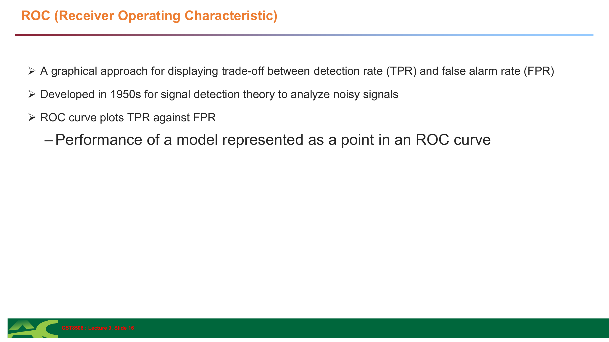

**ROC (Receiver Operating Characteristic)** — ROC（受试者工作特征）曲线

- A graphical approach for displaying trade-off between detection rate (TPR) and false alarm rate (FPR) — 一种图形化方法，用于展示检测率（TPR）和误报率（FPR）之间的权衡
- Developed in 1950s for signal detection theory to analyze noisy signals — 在1950年代为信号检测理论开发，用于分析噪声信号
- ROC curve plots TPR against FPR — ROC 曲线将 TPR 对 FPR 绘图
  - Performance of a model represented as a point in an ROC curve — 模型的性能表示为 ROC 曲线上的一个点

### 3.2 ROC 曲线关键点 (ROC Curve Key Points)

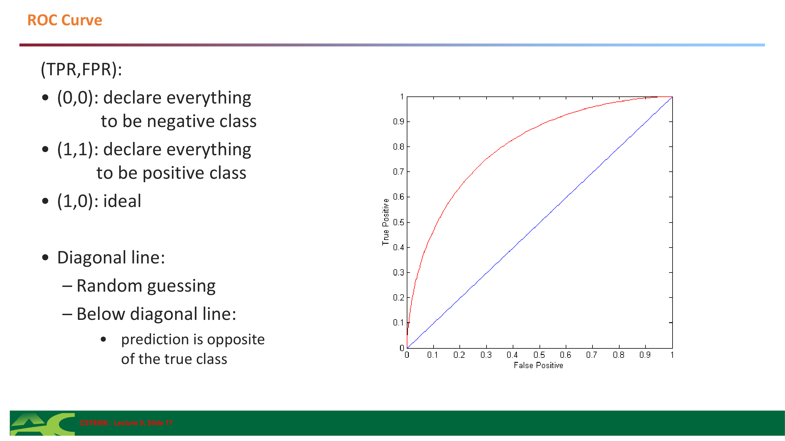

**ROC Curve** — ROC 曲线

- (TPR, FPR) key points — (TPR, FPR) 关键点:
  - **(0, 0):** declare everything to be negative class — 将所有样本预测为负类
  - **(1, 1):** declare everything to be positive class — 将所有样本预测为正类
  - **(1, 0):** ideal — 理想点
  - **Diagonal line:** random guessing — 对角线：随机猜测
    - Below diagonal line: prediction is opposite of the true class — 对角线以下：预测与真实类别相反

### 3.3 ROC 曲线的构建 (How to Construct ROC Curve)

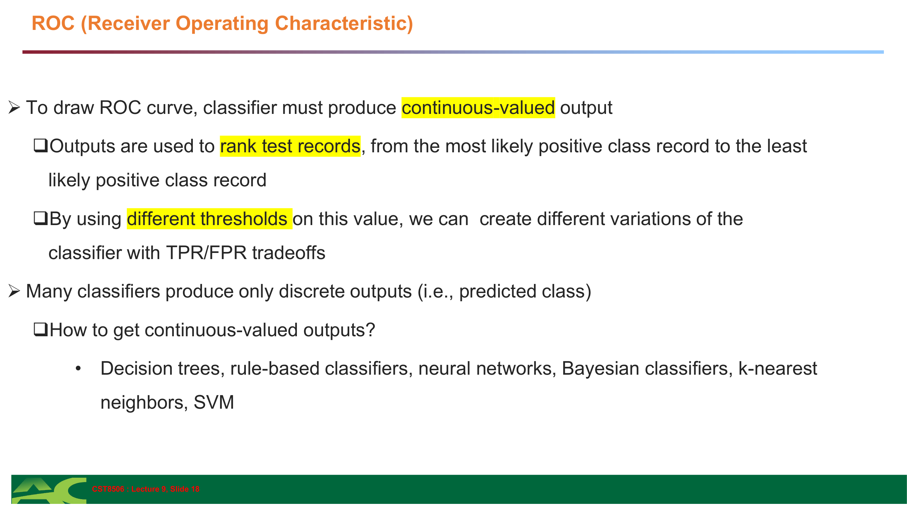

**ROC (Receiver Operating Characteristic)** — ROC（受试者工作特征）

- To draw ROC curve, classifier must produce continuous-valued output — 要绘制 ROC 曲线，分类器必须产生连续值输出
  - Outputs are used to rank test records, from the most likely positive class record to the least likely positive class record — 输出用于对测试记录排序，从最可能的正类到最不可能的正类
  - By using different thresholds on this value, we can create different variations of the classifier with TPR/FPR tradeoffs — 通过对该值使用不同阈值，可以创建具有不同 TPR/FPR 权衡的分类器变体
- Many classifiers produce only discrete outputs (i.e., predicted class) — 许多分类器仅产生离散输出（即预测的类别）
  - How to get continuous-valued outputs? — 如何获得连续值输出？
  - Decision trees, rule-based classifiers, neural networks, Bayesian classifiers, k-nearest neighbors, SVM — 决策树、基于规则的分类器、神经网络、贝叶斯分类器、k近邻、SVM

### 3.4 决策树的连续值输出 (Decision Tree Continuous Outputs)

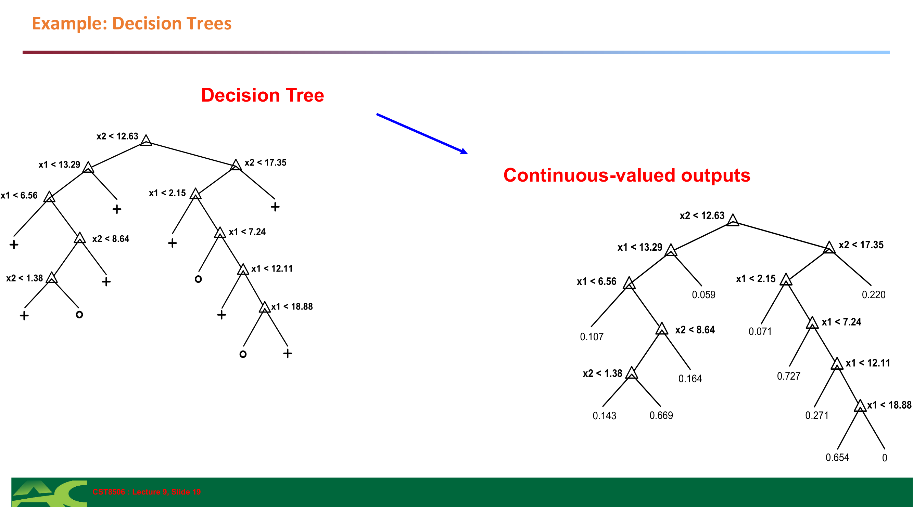

**Example: Decision Trees** — 示例：决策树

- Decision tree can produce continuous-valued outputs using leaf node class proportions — 决策树可以使用叶节点类别比例来产生连续值输出
- Each leaf node outputs a probability score instead of a hard class label — 每个叶节点输出概率分数而非硬性类别标签

### 3.5 ROC 曲线示例 (ROC Curve Example)

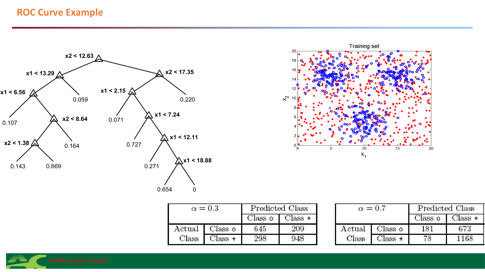

**ROC Curve Example** — ROC 曲线示例

- Leaf node probability values used as thresholds to construct ROC curve — 叶节点概率值用作阈值来构建 ROC 曲线

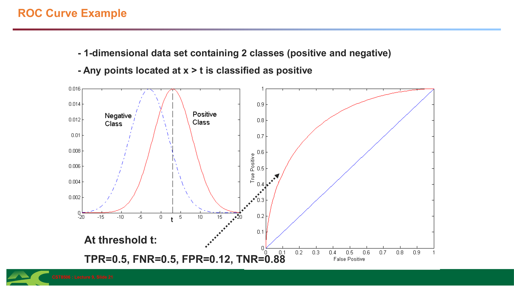

**ROC Curve Example** — ROC 曲线示例

- 1-dimensional data set containing 2 classes (positive and negative) — 包含2个类别（正类和负类）的一维数据集
- Any points located at x > t is classified as positive — 位于 x > t 的任何点被分类为正类
- At threshold t: TPR=0.5, FNR=0.5, FPR=0.12, TNR=0.88 — 在阈值 t 处：TPR=0.5，FNR=0.5，FPR=0.12，TNR=0.88

### 3.6 构建 ROC 曲线的步骤 (Steps to Construct ROC Curve)

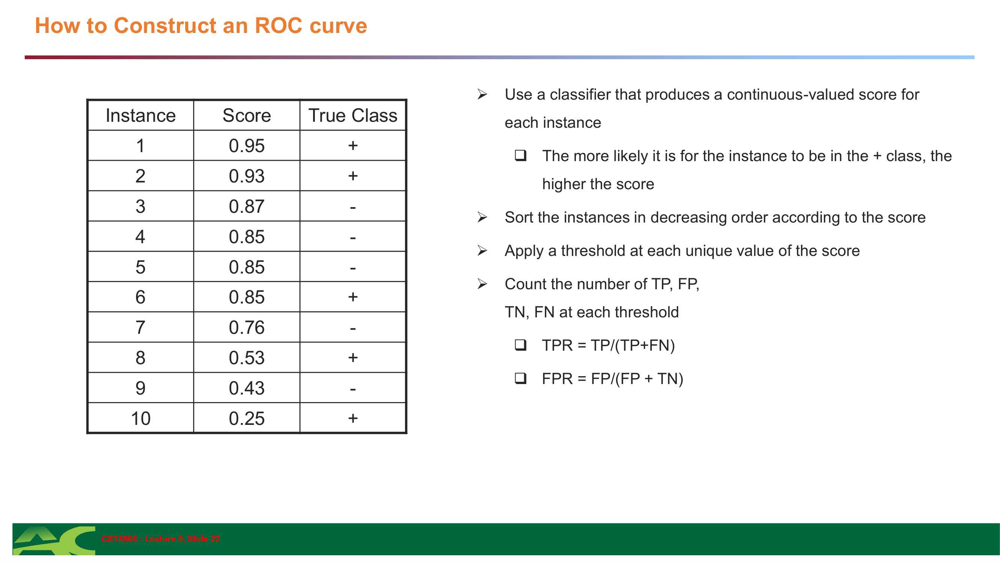

**How to Construct an ROC curve** — 如何构建 ROC 曲线

- Use a classifier that produces a continuous-valued score for each instance — 使用能为每个实例产生连续值分数的分类器
  - The more likely it is for the instance to be in the + class, the higher the score — 实例越可能属于正类，分数越高
- Sort the instances in decreasing order according to the score — 按分数从高到低排序实例
- Apply a threshold at each unique value of the score — 在每个唯一分数值处应用阈值
- Count the number of TP, FP, TN, FN at each threshold — 在每个阈值处计算 TP、FP、TN、FN 的数量
  - TPR = TP/(TP+FN)
  - FPR = FP/(FP+TN)

| Instance — 实例 | Score — 分数 | True Class — 真实类别 |
|---|---|---|
| 1 | 0.95 | + |
| 2 | 0.93 | + |
| 3 | 0.87 | - |
| 4 | 0.85 | - |
| 5 | 0.85 | - |
| 6 | 0.85 | + |
| 7 | 0.76 | - |
| 8 | 0.53 | + |
| 9 | 0.43 | - |
| 10 | 0.25 | + |

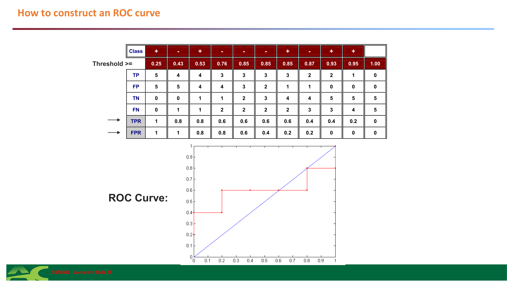

**How to construct an ROC curve** — 如何构建 ROC 曲线

- Table showing TP, FP, TN, FN, TPR, FPR at each threshold — 展示每个阈值下的 TP、FP、TN、FN、TPR、FPR 的表格
- ROC Curve plotted from the computed values — 根据计算值绘制的 ROC 曲线

### 3.7 使用 ROC 进行模型比较 (Using ROC for Model Comparison)

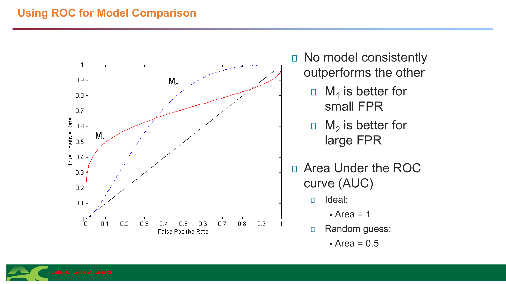

**Using ROC for Model Comparison** — 使用 ROC 进行模型比较

- No model consistently outperforms the other — 没有模型始终优于另一个
- M₁ is better for small FPR — M₁ 在较小 FPR 时更好
- M₂ is better for large FPR — M₂ 在较大 FPR 时更好
- **Area Under the ROC curve (AUC)** — ROC 曲线下面积（AUC）
  - Ideal: Area = 1 — 理想值：面积 = 1
  - Random guess: Area = 0.5 — 随机猜测：面积 = 0.5

---

## 4. 采样方法 (Sampling Methods)

### 4.1 重采样概述 (Resampling Overview)

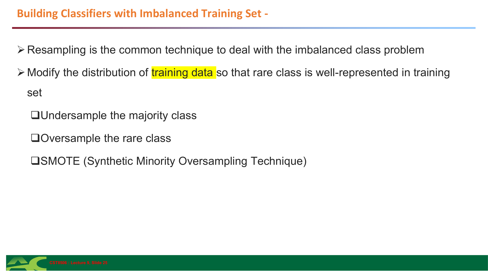

**Building Classifiers with Imbalanced Training Set** — 使用不平衡训练集构建分类器

- Resampling is the common technique to deal with the imbalanced class problem — 重采样是处理类不平衡问题的常用技术
- Modify the distribution of training data so that rare class is well-represented in training set — 修改训练数据的分布，使稀有类别在训练集中得到充分表示
  - **Undersample** the majority class — **欠采样**多数类
  - **Oversample** the rare class — **过采样**少数类
  - **SMOTE** (Synthetic Minority Oversampling Technique) — SMOTE（合成少数类过采样技术）

### 4.2 欠采样 (Undersampling)

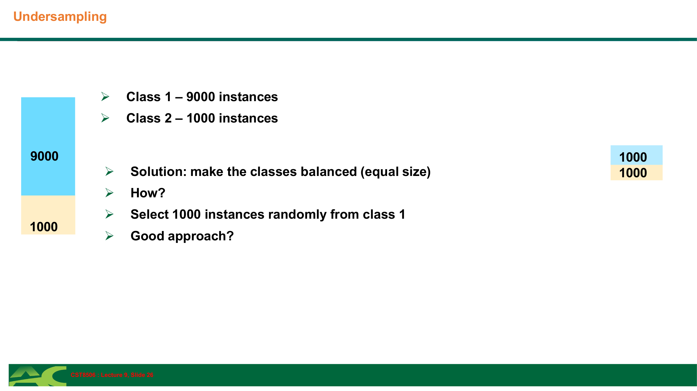

**Undersampling** — 欠采样

- Class 1 – 9000 instances — 类别1 – 9000个实例
- Class 2 – 1000 instances — 类别2 – 1000个实例
- Solution: make the classes balanced (equal size) — 解决方案：使类别平衡（相等大小）
- How? Select 1000 instances randomly from class 1 — 如何做？从类别1中随机选择1000个实例
- Good approach? — 好方法吗？

### 4.3 过采样 (Oversampling)

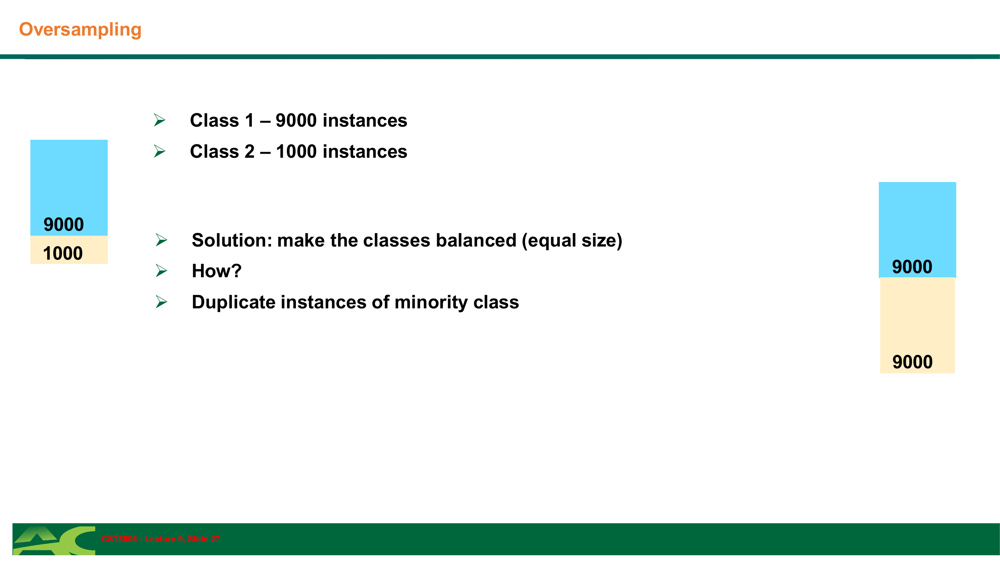

**Oversampling** — 过采样

- Class 1 – 9000 instances — 类别1 – 9000个实例
- Class 2 – 1000 instances — 类别2 – 1000个实例
- Solution: make the classes balanced (equal size) — 解决方案：使类别平衡（相等大小）
- How? Duplicate instances of minority class — 如何做？复制少数类实例

### 4.4 SMOTE (合成少数类过采样技术)

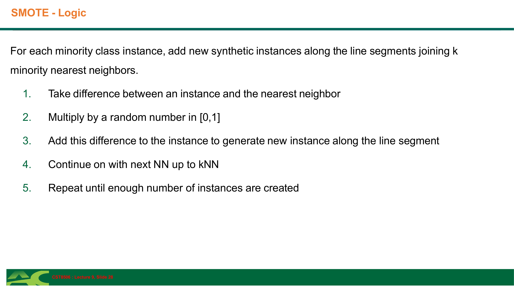

**SMOTE - Logic** — SMOTE - 逻辑

- For each minority class instance, add new synthetic instances along the line segments joining k minority nearest neighbors — 对于每个少数类实例，沿连接 k 个少数类最近邻的线段添加新的合成实例
  1. Take difference between an instance and the nearest neighbor — 计算实例与最近邻之间的差异
  2. Multiply by a random number in [0,1] — 乘以 [0,1] 中的随机数
  3. Add this difference to the instance to generate new instance along the line segment — 将此差异添加到实例以在线段上生成新实例
  4. Continue on with next NN up to kNN — 继续处理下一个近邻直到第 k 个近邻
  5. Repeat until enough number of instances are created — 重复直到创建足够数量的实例

---

## 5. 异常检测 (Anomaly Detection)

### 5.1 异常检测简介 (Introduction to Anomaly Detection)

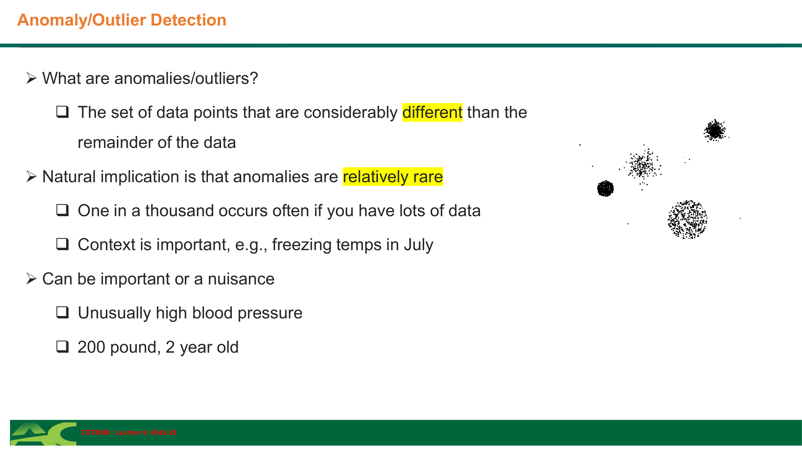

**Anomaly/Outlier Detection** — 异常/离群点检测

- What are anomalies/outliers? — 什么是异常/离群点？
  - The set of data points that are considerably different than the remainder of the data — 与数据其余部分显著不同的数据点集合
- Natural implication is that anomalies are relatively rare — 自然含义是异常相对罕见
  - One in a thousand occurs often if you have lots of data — 如果数据量大，千分之一也会经常出现
  - Context is important, e.g., freezing temps in July — 上下文很重要，如七月的冰点温度
- Can be important or a nuisance — 可能很重要也可能是干扰
  - Unusually high blood pressure — 异常高的血压
  - 200 pound, 2 year old — 200磅的2岁儿童

### 5.2 异常的原因 (Causes of Anomalies)

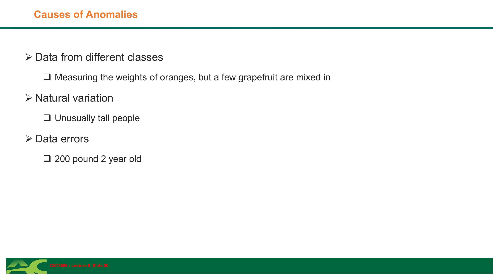

**Causes of Anomalies** — 异常的原因

- Data from different classes — 来自不同类别的数据
  - Measuring the weights of oranges, but a few grapefruit are mixed in — 测量橙子的重量，但混入了一些柚子
- Natural variation — 自然变异
  - Unusually tall people — 异常高的人
- Data errors — 数据错误
  - 200 pound 2 year old — 200磅的2岁儿童

### 5.3 异常检测技术概览 (Overview of Anomaly Detection Techniques)

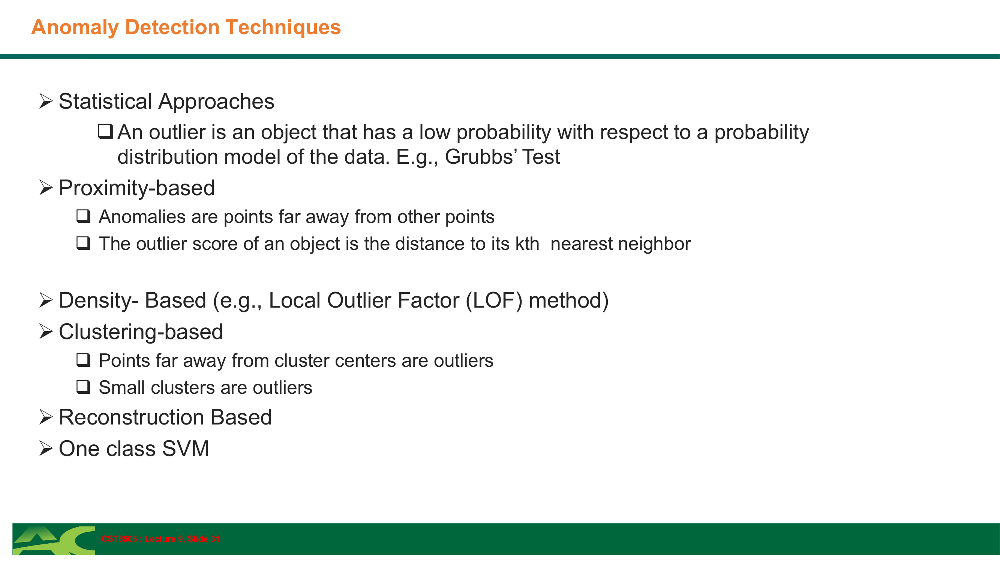

**Anomaly Detection Techniques** — 异常检测技术

- **Statistical Approaches** — 统计方法
  - An outlier is an object that has a low probability with respect to a probability distribution model of the data. E.g., Grubbs' Test — 离群点是相对于数据的概率分布模型具有低概率的对象。如 Grubbs 检验
- **Proximity-based** — 基于邻近度
  - Anomalies are points far away from other points — 异常是远离其他点的点
  - The outlier score of an object is the distance to its kth nearest neighbor — 对象的离群分数是到其第 k 个最近邻的距离
- **Density-Based** (e.g., Local Outlier Factor (LOF) method) — 基于密度（如局部离群因子 LOF 方法）
- **Clustering-based** — 基于聚类
  - Points far away from cluster centers are outliers — 远离簇中心的点是离群点
  - Small clusters are outliers — 小簇是离群点
- **Reconstruction Based** — 基于重构
- **One class SVM** — 单类 SVM

---

## 6. 基于密度的异常检测 (Density-Based Anomaly Detection)

### 6.1 密度方法 (Density-Based Approaches)

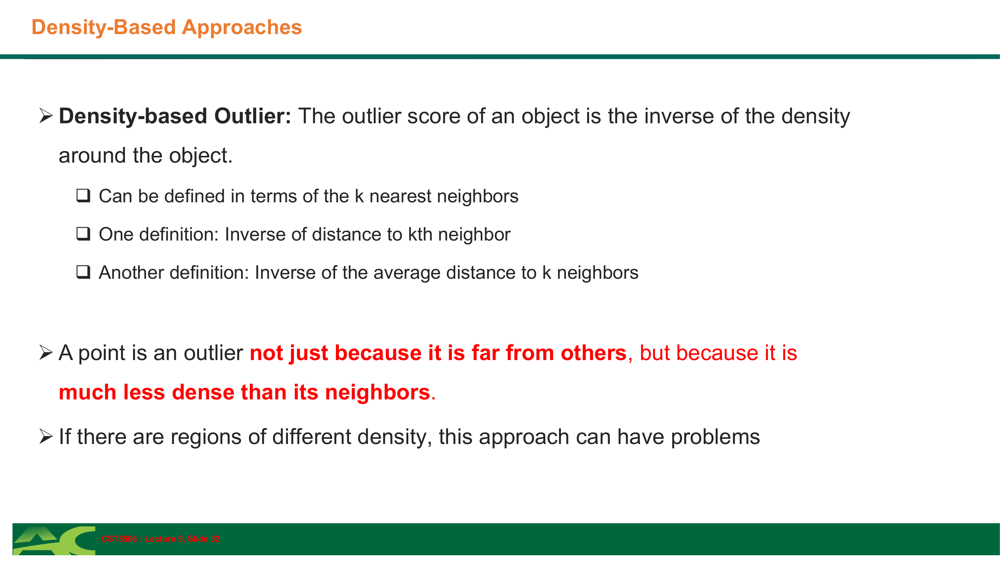

**Density-Based Approaches** — 基于密度的方法

- Density-based Outlier: The outlier score of an object is the inverse of the density around the object — 基于密度的离群点：对象的离群分数是对象周围密度的倒数
  - Can be defined in terms of the k nearest neighbors — 可以用 k 个最近邻来定义
  - One definition: Inverse of distance to kth neighbor — 一种定义：到第 k 个邻居的距离的倒数
  - Another definition: Inverse of the average distance to k neighbors — 另一种定义：到 k 个邻居的平均距离的倒数
- A point is an outlier not just because it is far from others, but because it is much less dense than its neighbors — 一个点是离群点，不仅因为它远离其他点，更因为它比其邻居稀疏得多
- If there are regions of different density, this approach can have problems — 如果存在不同密度的区域，此方法可能存在问题

### 6.2 相对密度 (Relative Density)

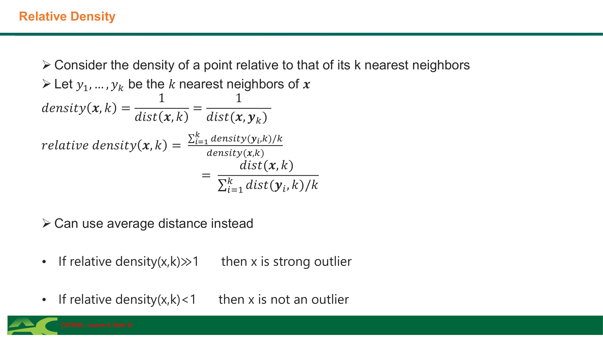

**Relative Density** — 相对密度

- Consider the density of a point relative to that of its k nearest neighbors — 考虑一个点相对于其 k 个最近邻的密度
- `density(x, k) = 1 / dist(x, k)` — 密度 = 1 / 到第k近邻的距离
- `relative density(x, k) = Σ density(yᵢ, k) / k / density(x, k)` — 相对密度 = 邻居平均密度 / 自身密度
- Can use average distance instead — 也可以使用平均距离
  - If relative density(x,k) ≫ 1 then x is strong outlier — 如果相对密度 ≫ 1，则 x 是强离群点
  - If relative density(x,k) < 1 then x is not an outlier — 如果相对密度 < 1，则 x 不是离群点

### 6.3 LOF 方法 (LOF Approach)

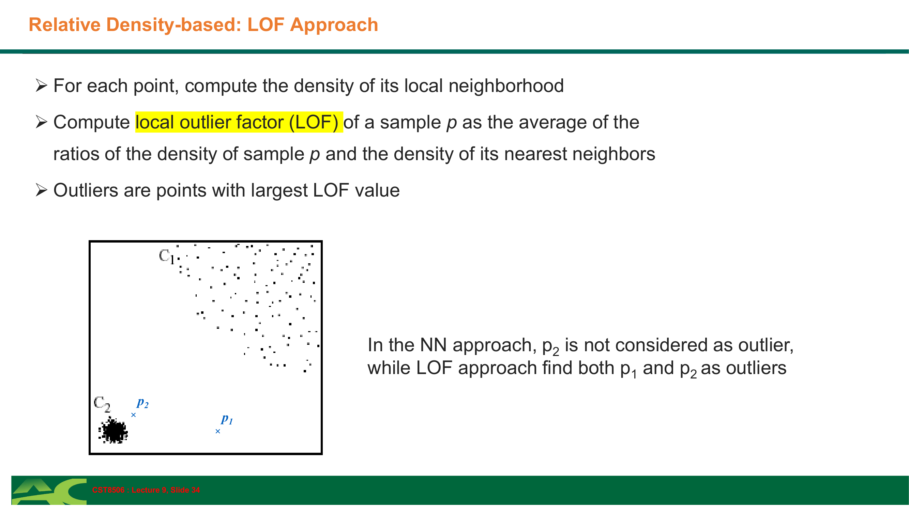

**Relative Density-based: LOF Approach** — 基于相对密度的 LOF 方法

- For each point, compute the density of its local neighborhood — 对每个点，计算其局部邻域的密度
- Compute local outlier factor (LOF) of a sample p as the average of the ratios of the density of sample p and the density of its nearest neighbors — 计算样本 p 的局部离群因子（LOF），即样本 p 的密度与其最近邻密度之比的平均值
- Outliers are points with largest LOF value — 离群点是 LOF 值最大的点
- In the NN approach, p₂ is not considered as outlier, while LOF approach finds both p₁ and p₂ as outliers — 在 NN 方法中，p₂ 不被视为离群点，而 LOF 方法能发现 p₁ 和 p₂ 都是离群点

---

## 7. 基于聚类的异常检测 (Clustering-Based Anomaly Detection)

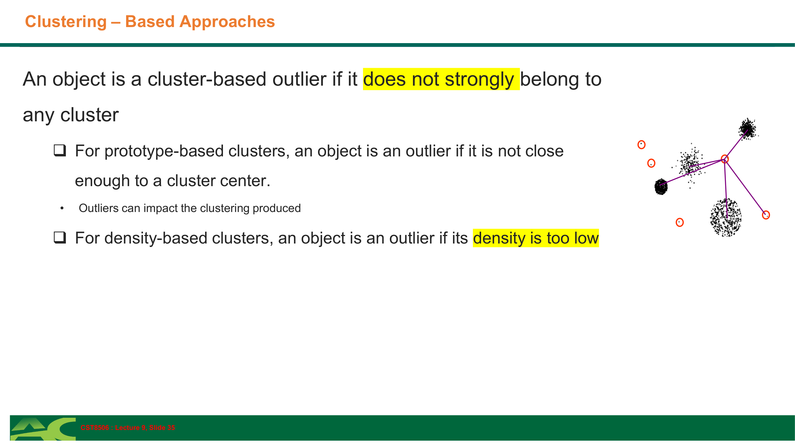

**Clustering-Based Approaches** — 基于聚类的方法

- An object is a cluster-based outlier if it does not strongly belong to any cluster — 如果一个对象不强烈属于任何簇，则它是基于聚类的离群点
  - For prototype-based clusters, an object is an outlier if it is not close enough to a cluster center — 对于基于原型的簇，如果对象不够接近簇中心，则为离群点
    - Outliers can impact the clustering produced — 离群点可以影响产生的聚类结果
  - For density-based clusters, an object is an outlier if its density is too low — 对于基于密度的簇，如果对象的密度太低，则为离群点

---

## 8. 基于重构的异常检测 (Reconstruction-Based Anomaly Detection)

### 8.1 重构方法 (Reconstruction-Based Approaches)

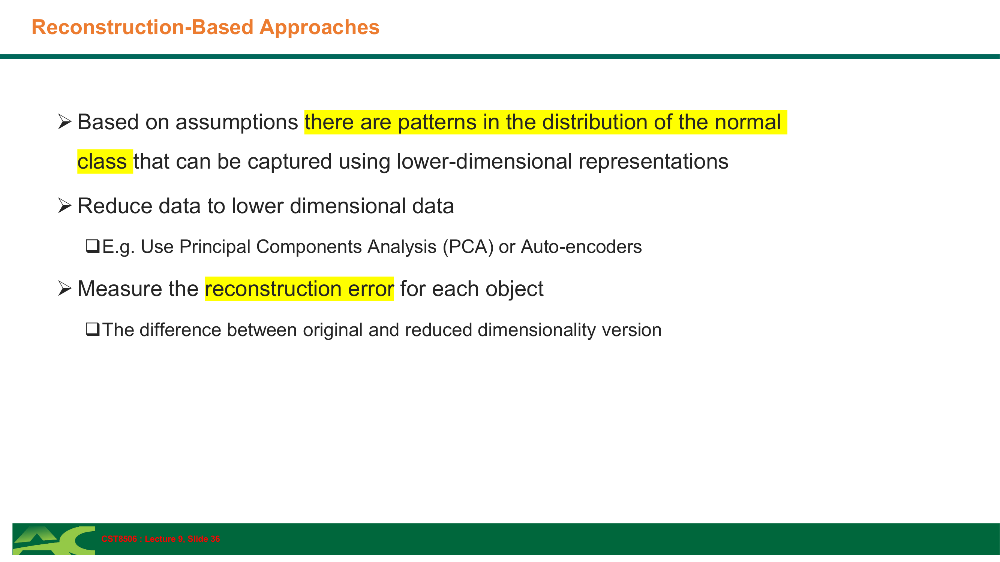

**Reconstruction-Based Approaches** — 基于重构的方法

- Based on assumptions there are patterns in the distribution of the normal class that can be captured using lower-dimensional representations — 假设正常类别的分布中存在可以使用低维表示捕获的模式
- Reduce data to lower dimensional data — 将数据降维到低维数据
  - E.g. Use Principal Components Analysis (PCA) or Auto-encoders — 例如使用主成分分析（PCA）或自动编码器
- Measure the reconstruction error for each object — 测量每个对象的重构误差
  - The difference between original and reduced dimensionality version — 原始版本与降维版本之间的差异

### 8.2 重构误差 (Reconstruction Error)

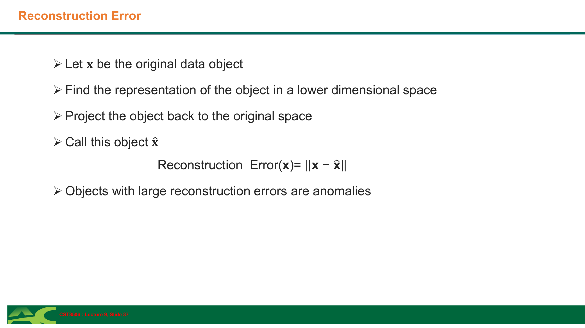

**Reconstruction Error** — 重构误差

- Let **x** be the original data object — 设 **x** 为原始数据对象
- Find the representation of the object in a lower dimensional space — 在低维空间中找到对象的表示
- Project the object back to the original space — 将对象投影回原始空间
- Call this object **x̂** — 称此对象为 **x̂**
- `Reconstruction Error(x) = ‖x − x̂‖` — 重构误差 = ‖x − x̂‖
- Objects with large reconstruction errors are anomalies — 重构误差大的对象是异常

---

## 9. 单类 SVM (One-Class SVM)

### 9.1 OCSVM 简介 (OCSVM Introduction)

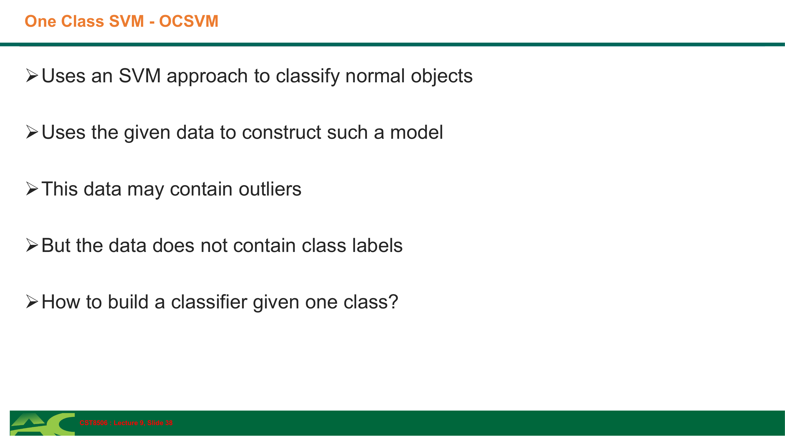

**One Class SVM - OCSVM** — 单类 SVM - OCSVM

- Uses an SVM approach to classify normal objects — 使用 SVM 方法对正常对象进行分类
- Uses the given data to construct such a model — 使用给定数据构建模型
- This data may contain outliers — 该数据可能包含离群点
- But the data does not contain class labels — 但数据不包含类别标签
- How to build a classifier given one class? — 给定一个类别，如何构建分类器？

### 9.2 OCSVM vs SVM (OCSVM 与 SVM 对比)

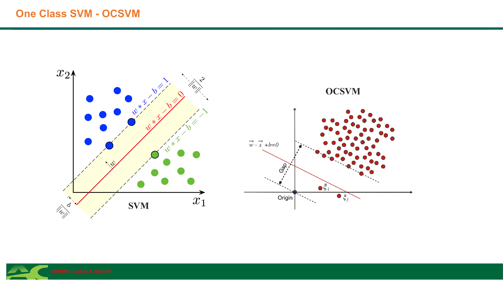

**One Class SVM - OCSVM** — 单类 SVM - OCSVM

- Comparison between OCSVM and traditional SVM — OCSVM 与传统 SVM 的对比
  - SVM: separates two classes with a hyperplane — SVM：用超平面分隔两个类别
  - OCSVM: separates data from the origin with a hyperplane — OCSVM：用超平面将数据与原点分隔

### 9.3 OCSVM 工作原理 (How OCSVM Works)

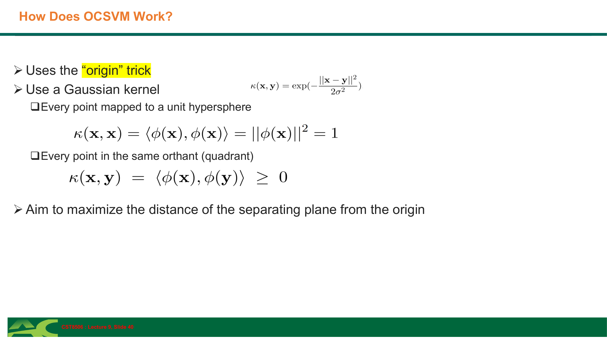

**How Does OCSVM Work?** — OCSVM 如何工作？

- Uses the "origin" trick — 使用"原点"技巧
- Use a Gaussian kernel — 使用高斯核
  - Every point mapped to a unit hypersphere — 每个点映射到单位超球面
  - Every point in the same orthant (quadrant) — 每个点在同一象限
- Aim to maximize the distance of the separating plane from the origin — 目标是最大化分离平面与原点的距离

### 9.4 OCSVM 方程 (Equations for OCSVM)

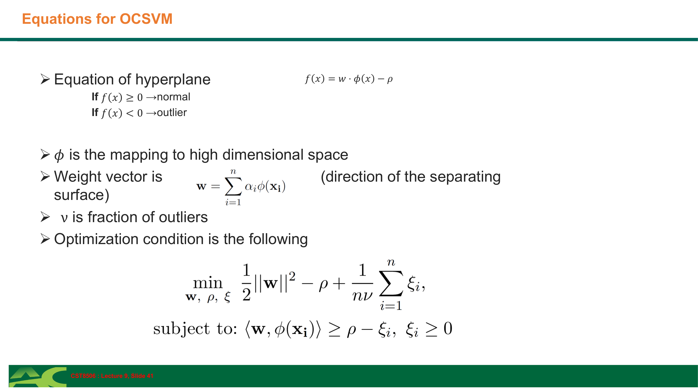

**Equations for OCSVM** — OCSVM 的方程

- If f(x) ≥ 0 → normal — 如果 f(x) ≥ 0 → 正常
- If f(x) < 0 → outlier — 如果 f(x) < 0 → 离群点
- φ is the mapping to high dimensional space — φ 是到高维空间的映射
- Weight vector is the direction of the separating surface — 权重向量是分离面的方向
- ν is fraction of outliers — ν 是离群点的比例
- Optimization condition is the following — 优化条件如下

### 9.5 OCSVM 示例 (OCSVM Example)

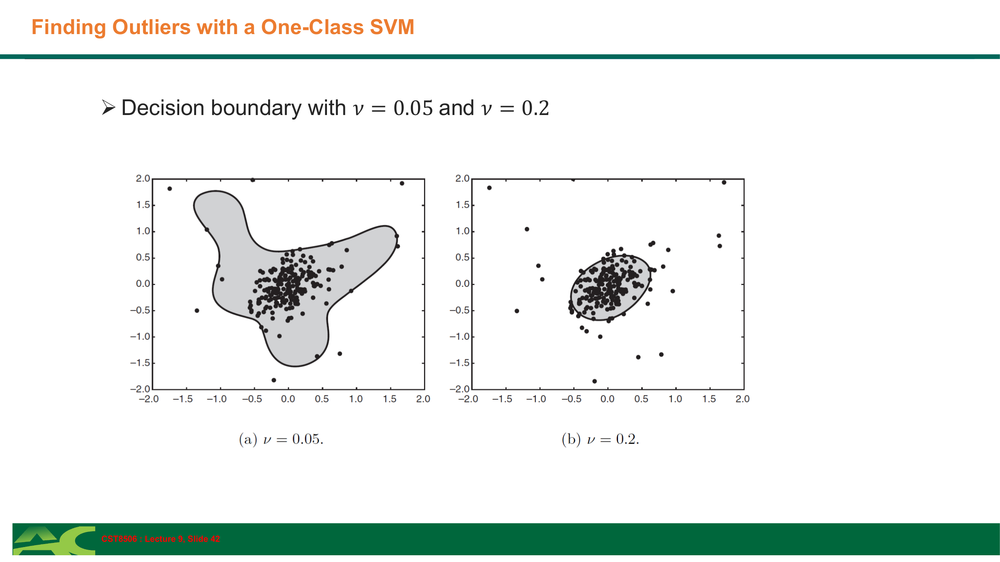

**Finding Outliers with a One-Class SVM** — 使用单类 SVM 发现离群点

- Decision boundary with ν = 0.05 and ν = 0.2 — ν = 0.05 和 ν = 0.2 的决策边界

---

## 10. 总结 (Summary)

**End of Lecture 9** — 第9讲结束
