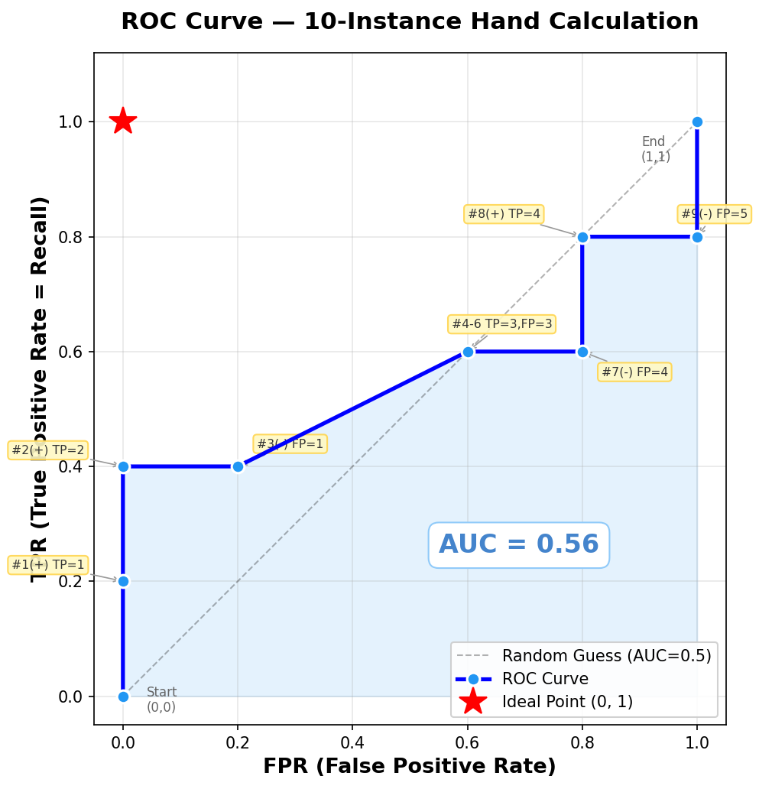
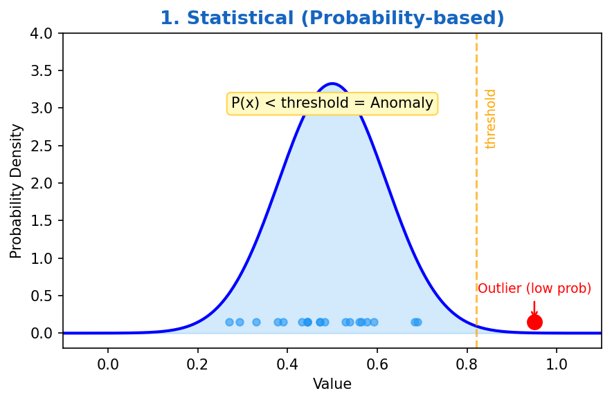
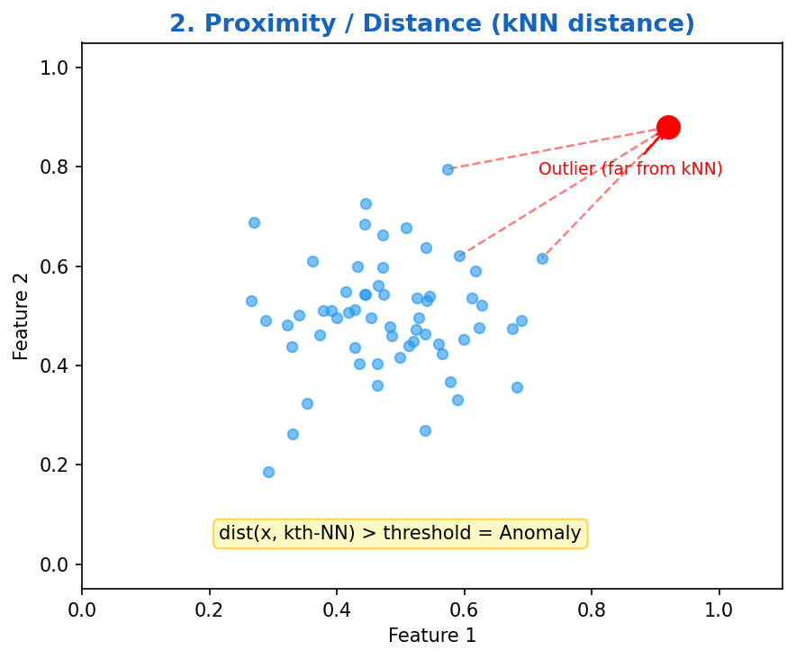
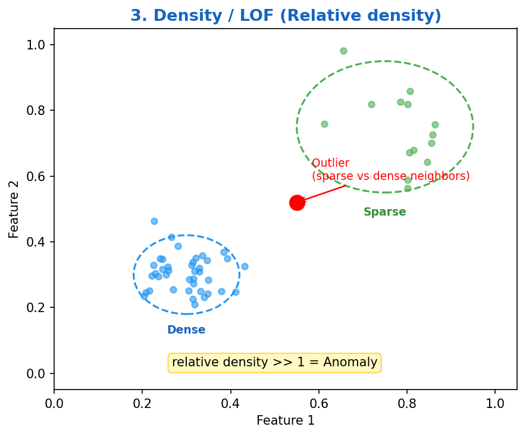
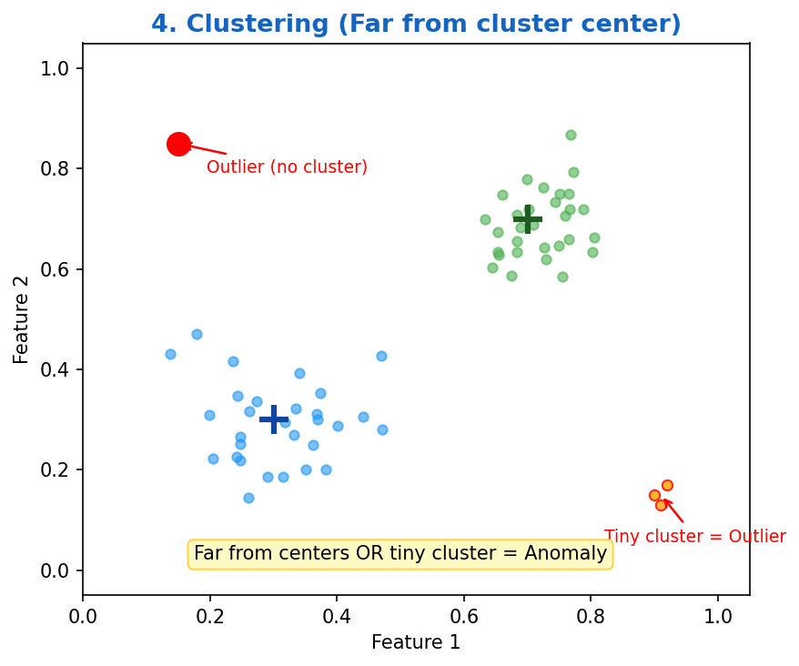
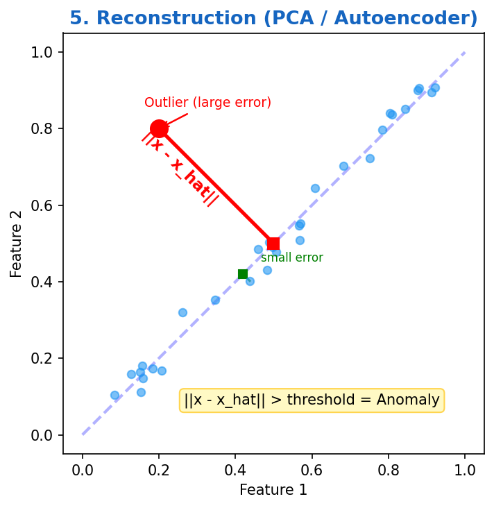
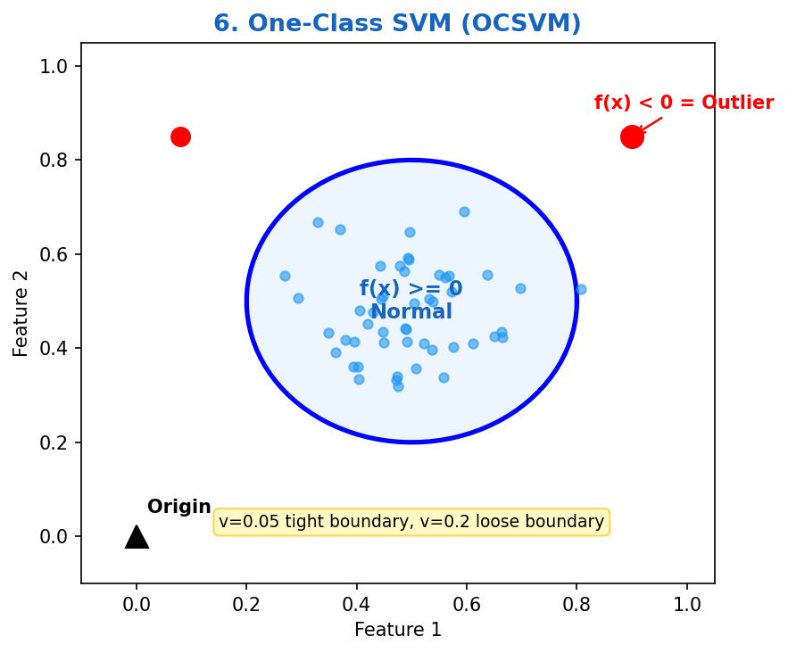

# Week 9 故事线：类不平衡问题与异常检测

> **Source:** `Week9-Imbalance_Class_Problem.pdf`
> **核心主题：** 当数据极度不均衡（欺诈、病变检测）时，传统 Accuracy 失灵，如何正确评价模型？如何从源头改数据？如何彻底跳出分类思维？
> **故事线：** Accuracy 骗局暴露 → 发明新指标（Precision/Recall/F） → 但依赖单一阈值 → ROC 全局评价 → 数据太脏改分布（采样/SMOTE） → 终极方案：不分类，只学"什么是正常"（异常检测 / OCSVM）

---

## 🎬 序幕：Accuracy 是个骗子

考虑一个二分类问题：
- Class NO（正常）= 9900 条
- Class YES（异常）= 10 条

如果模型**闭着眼把所有人判为 NO**：

| | 说"是" | 说"不是" |
|---|---|---|
| **实际是 YES** | 0 | 10 |
| **实际是 NO** | 0 | 990 |

Accuracy = 990/1000 = **99%**！

**但这个模型一个异常都没抓到**——10 个真正有问题的全漏了。Accuracy 在这里完全是在骗你。

> 🔑 **故事转折点：** Accuracy 只看"总共猜对多少"，在不平衡数据上毫无意义 → 我们需要能衡量"抓坏人能力"的新指标！

---

## 📚 第一章：混淆矩阵与新指标

### 1.1 混淆矩阵——所有指标的起点

先搞清一个 2×2 格子，**所有指标都是从这个格子里算除法**：

```
                        模型预测 (Predicted)
                  ┌──────────────┬──────────────┐
                  │  说"是" (P)   │ 说"不是" (N)  │
     ┌────────────┼──────────────┼──────────────┤
实   │ 实际 YES   │  a: TP  ✅   │  b: FN  ❌   │ ← Recall = a/(a+b) 这行
际   │ (Positive) │  猜对+说是   │  漏了！放跑   │    "坏人里抓到几成"
类   ├────────────┼──────────────┼──────────────┤
别   │ 实际 NO    │  c: FP  ❌   │  d: TN  ✅   │ ← FPR = c/(c+d) 这行
     │ (Negative) │  冤枉！误抓   │  猜对+说不是  │    "好人里冤枉几成"
     └────────────┼──────────────┼──────────────┘
                  │              │
                  ↓              ↓
           Precision=a/(a+c)   (看这列)
           "抓的人里真坏人占比"
```

**命名规则（两个字母各管各的）：**

| 字母 | 回答的问题 | 选项 |
|---|---|---|
| **T / F** | 猜**对**了没？ | T=对了, F=错了 |
| **P / N** | 嘴上说**啥**？ | P=说"是", N=说"不是" |

- **TP** = 猜对了 + 说"是" → 实际也是 ✅
- **FP** = 猜错了 + 说"是" → 实际不是 ❌（冤枉好人）
- **FN** = 猜错了 + 说"不是" → 实际是 ❌（放走坏人）
- **TN** = 猜对了 + 说"不是" → 实际也不是 ✅

### 1.2 四大指标——都是从格子里算除法

| 指标 | 公式 | 用 abcd | 人话 |
|---|---|---|---|
| **Accuracy** | (TP+TN)/(全部) | (a+d)/(a+b+c+d) | 总共猜对多少（不平衡时没用） |
| **Precision** | TP/(TP+FP) | a/(a+c) | 你抓的人里，真坏人占多少？（看**列**） |
| **Recall = TPR** | TP/(TP+FN) | a/(a+b) | 真坏人里，你抓到了几成？（看**行**） |
| **FPR** | FP/(FP+TN) | c/(c+d) | 好人里，你冤枉了几成？（看**行**） |
| **F-measure** | 2PR/(P+R) | 2a/(2a+b+c) | Precision 和 Recall 的折中 |
| **FNR** | FN/(TP+FN) | b/(a+b) | 坏人里**漏了**几成？= 1 - TPR |
| **TNR** | TN/(FP+TN) | d/(c+d) | 好人里**放对**几成？= 1 - FPR |

> ⚠️ **TPR 就是 Recall**，同一个公式两个名字。讲混淆矩阵时叫 Recall，画 ROC 时叫 TPR。

> ⚠️ **FNR 和 TNR 不用单独背**，知道 TPR 就自动知道 FNR（1 减一下），知道 FPR 就自动知道 TNR。

### 1.3 ⭐ 用 slides 的例子手算一遍

**示例 1：**

| | 说"是" | 说"不是" |
|---|---|---|
| **实际 YES** | 10 | 0 |
| **实际 NO** | 10 | 980 |

```
Precision = 10/(10+10) = 0.5     ← 抓了 20 人，只有一半是真坏人
Recall    = 10/(10+0)  = 1.0     ← 10 个坏人一个不漏
F-measure = 2×0.5×1/(0.5+1) = 0.67
Accuracy  = 990/1000 = 0.99      ← 看起来很高但没意义
```

**示例 2：两个模型对比——Accuracy 相同但本质天差地别**

**Classifier A:**

| | 说"是" | 说"不是" |
|---|---|---|
| **实际 YES** | 10 | 0 |
| **实际 NO** | 10 | 980 |

Precision = 0.5, Recall = 1, F = 0.67, Accuracy = 0.99

**Classifier B:**

| | 说"是" | 说"不是" |
|---|---|---|
| **实际 YES** | 1 | 9 |
| **实际 NO** | 0 | 990 |

Precision = 1, Recall = 0.1, F = 0.18, Accuracy = 0.991

> 💡 **关键洞察：** B 的 Accuracy（0.991）比 A（0.99）还高！但 B 只抓到了 1/10 的坏人（Recall=0.1）。F-measure 才是靠谱的裁判：A 的 F=0.67 远胜 B 的 F=0.18。

### 1.4 ⭐ TPR vs FPR 的陷阱——Precision 救场

**Classifier A（平衡数据 50:50）：**

| | 说"是" | 说"不是" |
|---|---|---|
| **实际 YES (50)** | 40 | 10 |
| **实际 NO (50)** | 10 | 40 |

TPR = 0.8, FPR = 0.2, **Precision = 0.8**, F = 0.8

**Classifier B（极不平衡 50:5000）：**

| | 说"是" | 说"不是" |
|---|---|---|
| **实际 YES (50)** | 40 | 10 |
| **实际 NO (5000)** | 1000 | 4000 |

TPR = 0.8, FPR = 0.2, **Precision = 0.038**, F = 0.07

> 💡 **关键洞察：** A 和 B 的 TPR、FPR **完全一样**（都是 0.8 和 0.2），但 Precision 天差地别（0.8 vs 0.038）。因为 B 的数据极度不平衡，说"是"的 1040 人中只有 40 个是真坏人。**TPR/FPR 对数据比例不敏感，Precision 敏感。**

### 1.5 ❗ 单一阈值的局限

Precision、Recall、F-measure 都依赖一个固定的分类阈值（如概率 > 0.5 就判正类）。换个阈值，指标就变了。用单一阈值的指标无法公平比较两个模型的"全局潜力"。

> 🔑 **故事转折点：** 我们需要一个"上帝视角"的标尺，一次性看清模型在所有阈值下的表现 → ROC 曲线！

---

## 🎭 第二章：ROC 曲线——全局评价标尺

### 2.1 ROC = 横轴 FPR vs 纵轴 TPR 的曲线

**核心思想：** 不固定阈值，而是把阈值从最严到最松全扫一遍，每个阈值算一组 (FPR, TPR)，连成一条曲线。

**三大关键点：**

| 点 | FPR | TPR | 含义 |
|---|---|---|---|
| **(0, 0)** | 0 | 0 | 最严阈值，谁都不抓 |
| **(1, 1)** | 1 | 1 | 最松阈值，所有人全抓 |
| **(0, 1)** | 0 | 1 | **理想点**——坏人全抓，好人不冤 |
| **对角线** | = | = | 瞎蒙乱猜（FPR = TPR） |

### 2.2 ⭐ 手算 ROC 曲线——完整步骤

slides 给了 10 个实例的具体例子（5 个正类 + 5 个负类），按分数排序：

| 实例 | Score | 真实类别 |
|---|---|---|
| 1 | 0.95 | + |
| 2 | 0.93 | + |
| 3 | 0.87 | - |
| 4 | 0.85 | - |
| 5 | 0.85 | - |
| 6 | 0.85 | + |
| 7 | 0.76 | - |
| 8 | 0.53 | + |
| 9 | 0.43 | - |
| 10 | 0.25 | + |

**步骤：**
1. 按 Score 从高到低排序（已排好）
2. 逐个降低阈值，每次多"抓"一个人
3. 算每个阈值下的 TP, FP → TPR, FPR

```
阈值在实例1之上（谁都不抓）：TP=0, FP=0 → TPR=0/5=0,   FPR=0/5=0   → 点(0, 0)
抓到实例1（+）：            TP=1, FP=0 → TPR=1/5=0.2, FPR=0/5=0   → 点(0, 0.2)
抓到实例2（+）：            TP=2, FP=0 → TPR=2/5=0.4, FPR=0/5=0   → 点(0, 0.4)
抓到实例3（-）：            TP=2, FP=1 → TPR=2/5=0.4, FPR=1/5=0.2 → 点(0.2, 0.4)
抓到实例4-6（-,-,+）：      TP=3, FP=3 → TPR=3/5=0.6, FPR=3/5=0.6 → 点(0.6, 0.6)
抓到实例7（-）：            TP=3, FP=4 → TPR=3/5=0.6, FPR=4/5=0.8 → 点(0.8, 0.6)
抓到实例8（+）：            TP=4, FP=4 → TPR=4/5=0.8, FPR=4/5=0.8 → 点(0.8, 0.8)
抓到实例9（-）：            TP=4, FP=5 → TPR=4/5=0.8, FPR=5/5=1.0 → 点(1.0, 0.8)
抓到实例10（+）：           TP=5, FP=5 → TPR=5/5=1.0, FPR=5/5=1.0 → 点(1.0, 1.0)
```

把这些点连起来就是 ROC 曲线。曲线越靠近左上角 (0,1) 越好。



### 2.3 AUC——把曲线压缩成一个数

**AUC (Area Under the ROC Curve)** = ROC 曲线下方的面积。

| AUC 值 | 含义 |
|---|---|
| 1.0 | 完美模型（曲线贴着左上角） |
| 0.5 | 瞎蒙（曲线在对角线上） |
| < 0.5 | 比瞎蒙还差（预测反了） |

**模型比较：** 两条 ROC 曲线可能交叉（一个在低 FPR 好，另一个在高 FPR 好），AUC 把全局性能压成一个数直接比大小。

### 2.4 如何获得连续分数来画 ROC？

ROC 需要模型输出**连续值分数**，而非只是"是/不是"。常见方法：
- **决策树**：用叶节点的类别比例（如：叶子里 8/10 是正类 → 分数 0.8）
- **神经网络/SVM/贝叶斯**：都有内置的连续输出

> 🔑 **故事转折点：** 评价体系完美了！但评价再好，如果训练数据 99:1 太极端，模型就是学不会少数类的特征 → 必须从源头改数据！

---

## 📖 第三章：重塑数据分布——采样方法

### 3.1 欠采样 (Undersampling)

- Class 1: 9000 条, Class 2: 1000 条
- 做法：从 9000 条中随机抽 1000 条，扔掉 8000 条
- ✅ 数据平衡了
- ❌ 扔掉了 90% 的数据，大量关键特征永久丢失

### 3.2 过采样 (Oversampling)

- 做法：把 1000 条少数类直接复制 9 遍
- ✅ 数据平衡了
- ❌ 模型在一模一样的假样本上死记硬背（过拟合）

### 3.3 ⭐ SMOTE——聪明的合成新样本

**SMOTE (Synthetic Minority Oversampling Technique)**：不复制，而是**凭空生成新的合理样本**。

**步骤：**

```
1. 选一个少数类样本点 x
2. 找它在少数类中的 k 个最近邻
3. 随机选一个邻居 xₙ
4. 计算差异：diff = xₙ - x
5. 生成随机数 λ ∈ [0, 1]
6. 新样本 = x + λ × diff    ← 在 x 和 xₙ 的连线上随机取一个点
7. 重复直到数量够
```

**公式：** `x_new = x + λ × (xₙ - x)`，其中 λ ∈ [0,1]

> 💡 **直觉：** 过采样是复印，SMOTE 是在两个相似样本之间"变形"出一个新的。新样本跟原始样本长得像但不完全一样，不会过拟合。

| 方法 | 做法 | 优点 | 缺点 |
|---|---|---|---|
| Undersampling | 扔掉多数类 | 快 | 丢信息 |
| Oversampling | 复制少数类 | 简单 | 过拟合 |
| **SMOTE** | 邻居间插值合成 | 新样本多样 | 噪声邻居可能产生坏样本 |

> 🔑 **故事转折点：** 如果异常点少到连邻居都找不到，或者异常的形态根本没见过，分类思维走到死胡同 → 跳出分类，只学"什么是正常"！

---

## 🏆 第四章：异常检测——只定义"正常"

### 4.1 什么是异常？

与数据中大部分点**显著不同**的数据点。异常的三种来源：

| 来源 | 例子 |
|---|---|
| 不同类别混入 | 测橙子重量，混进了几个柚子 |
| 自然变异 | 异常高的人 |
| 数据错误 | 200 磅的 2 岁小孩 |

### 4.2 六大异常检测方法总览

| 方法 | 核心判断依据 | 判异常的标准 |
|---|---|---|
| **统计法 (Statistical)** | 概率低 | 不符合假设的分布（如 Grubbs' Test） |
| **距离法 (Proximity)** | 离群远 | 到第 k 个近邻的距离极大 |
| **密度法 (Density/LOF)** | 比邻居稀疏 | 相对密度 ≫ 1 |
| **聚类法 (Clustering)** | 不属于任何大簇 | 远离簇中心，或独自成小簇 |
| **重构法 (Reconstruction)** | 还原失真 | 重构误差 ‖x − x̂‖ 大 |
| **单类 SVM (OCSVM)** | 超平面之外 | f(x) < 0 |





### 4.3 ⭐ 密度法详解——LOF (Local Outlier Factor)

**问题：** 单纯看距离不够。一个点可能离最近邻"远"，但如果它的邻居们也都很稀疏（比如郊区），那它并不异常。关键是**相对密度**。

**Step 1：算密度（density）**

每个点的密度 = 离第 k 个近邻越近 → 密度越高：

```
density(x, k) = 1 / dist(x, 第k近邻)
```

**Step 2：算相对密度（relative density = LOF 核心）**

拿自己的密度跟邻居们的平均密度做对比：

```
                  邻居们的平均密度
relative density = ─────────────── 
                    自己的密度
```

**Step 3：判断规则**

| relative density 值 | 含义 | 判定 |
|---|---|---|
| **≫ 1**（如 5.0） | 邻居很密，自己很稀疏 | ❌ **强异常** |
| **≈ 1**（如 0.9~1.1） | 跟邻居差不多 | ✅ 正常 |
| **< 1**（如 0.3） | 自己比邻居还密 | ✅ 不是异常 |

**⭐ 手算示例（k=2）：**

假设有 5 个点在一维上：A=1, B=2, C=3, D=10, E=100

```
点 C（正常点，在密集区）：
  C 的 2 近邻 = B(距离1), D(距离7) → dist到第2近邻 = 7
  density(C) = 1/7 = 0.143

  邻居 B 的 2 近邻 = A(距离1), C(距离1) → density(B) = 1/1 = 1.0
  邻居 D 的 2 近邻 = C(距离7), E(距离90) → density(D) = 1/90 = 0.011

  邻居平均密度 = (1.0 + 0.011) / 2 = 0.506
  relative density(C) = 0.506 / 0.143 = 3.5  ← 偏高，但看具体场景

点 E（异常点，离群）：
  E 的 2 近邻 = D(距离90), C(距离97) → dist到第2近邻 = 97
  density(E) = 1/97 = 0.010

  邻居 D 的 density = 0.011
  邻居 C 的 density = 0.143

  邻居平均密度 = (0.011 + 0.143) / 2 = 0.077
  relative density(E) = 0.077 / 0.010 = 7.7  ← ≫ 1，强异常！
```

> 💡 **直觉：** E 自己极度稀疏（density=0.01），但它的邻居 C 密度比它高 14 倍 → 相对密度远大于 1 → 异常。LOF 看的不是"你离别人多远"，而是"你跟你邻居比有多孤立"。

**LOF 比单纯距离法强在哪？** slides 指出：在 NN 方法中 p₂ 不被视为离群点，但 LOF 能发现 p₁ 和 p₂ 都是离群点——因为 LOF 考虑了局部密度差异。



### 4.4 聚类法 (Clustering-Based)

- 对于基于原型的聚类（如 K-Means）：远离簇中心的点是异常
- 对于基于密度的聚类（如 DBSCAN）：密度太低的点是异常
- ⚠️ 离群点本身会影响聚类结果（鸡生蛋问题）



### 4.5 ⭐ 重构法 (Reconstruction-Based)

**核心假设：** 正常数据有模式可循，能被低维表示捕获。异常数据打破这个模式。

**步骤：**

```
1. 用 PCA 或 Auto-encoder 学习正常数据的低维表示
2. 对每个数据点 x：
   - 压缩到低维空间
   - 再还原回原始空间 → 得到 x̂
3. 计算 Reconstruction Error = ‖x − x̂‖
4. 误差大的 = 异常
```

> 💡 **直觉：** 就像用一个"只见过猫"的压缩器。给它一张猫图，压缩-还原后还是猫（误差小）。给它一张狗图，还原出来四不像（误差大）→ 捕获异常。



### 4.6 ⭐ One-Class SVM (OCSVM)

**问题：** 只有正常数据，没有异常的标签。普通 SVM 需要两个类才能画超平面，只有一个类怎么办？

**OCSVM 的原点技巧：**

```
普通 SVM：超平面分隔 类A vs 类B
OCSVM：  超平面分隔 所有数据 vs 原点
```

**工作原理：**

1. 用高斯核（Gaussian Kernel）把数据映射到高维空间
   - 映射后所有点都在同一象限（单位超球面上）
2. 找到一个超平面，**最大化**与原点的距离
   - 把绝大部分数据点跟原点隔开
3. 判断规则：
   - `f(x) ≥ 0` → **正常**（在超平面的数据侧）
   - `f(x) < 0` → **异常**（落在原点侧）

**关键参数：**

| 符号 | 含义 |
|---|---|
| φ | 高维映射函数 |
| w | 权重向量（超平面方向） |
| **ν** | **离群点比例**（超参数：你预期数据中有多少比例的异常） |

- ν = 0.05 → 预期 5% 异常 → 边界紧凑
- ν = 0.2 → 预期 20% 异常 → 边界宽松

> 💡 **直觉：** 给所有好人贴一层最紧凑的护城盾牌，盾牌外的统统算异常。ν 控制盾牌有多紧。



---

## 🗺️ 全局回顾：技术演进路线图

```text
┌──────────────────────────────────────────────────────────────┐
│ 技术演进路线图                                                │
│                                                              │
│ 阶段 1：Accuracy（准确率）                                    │
│ ❌ 在 99:1 不平衡数据中，全猜负类也有 99% → 骗人              │
│         │                                                    │
│         ▼                                                    │
│ 阶段 2：Precision, Recall (=TPR), FPR, F-measure             │
│ ✅ 从混淆矩阵的不同角度衡量"抓坏人"能力                       │
│ ❌ 依赖单一阈值，无法看全局                                   │
│         │                                                    │
│         ▼                                                    │
│ 阶段 3：ROC 曲线 + AUC                                       │
│ ✅ 扫描所有阈值，画 FPR vs TPR 曲线，AUC 一个数比高低          │
│ ❌ 评价再好，数据分布扭曲，模型学不到少数类特征                 │
│         │                                                    │
│         ▼                                                    │
│ 阶段 4：采样方法（Undersampling / Oversampling / SMOTE）       │
│ ✅ SMOTE 用邻居插值合成新样本，平衡分布                       │
│ ❌ 异常太稀有或形态未知，分类思维失效                          │
│         │                                                    │
│         ▼                                                    │
│ 终极方案：异常检测（LOF / 重构法 / OCSVM）                    │
│ ✅ 不学"什么是异常"，只学"什么是正常"，正常之外全判异常          │
└──────────────────────────────────────────────────────────────┘
```

### 转折点总结

| 从 → 到 | 解决了什么核心问题？ |
|---|---|
| Accuracy → Precision/Recall/F | 从"总猜对率"到"分角度看抓坏人能力" |
| 单一阈值指标 → ROC/AUC | 从"固定一个阈值"到"扫描所有阈值的全局画像" |
| 评价指标 → 采样/SMOTE | 从"评价准了但数据烂"到"从源头改数据分布" |
| 分类 → 异常检测 | 从"必须知道异常长啥样"到"只定义正常，其余全异常" |

---

## 📝 考试重点检查清单

### 混淆矩阵与指标（必考）

- [ ] 画出 2×2 混淆矩阵，标出 TP/FP/TN/FN（T/F=猜对没，P/N=说啥）
- [ ] 写出 Precision = TP/(TP+FP)，Recall = TP/(TP+FN)，FPR = FP/(FP+TN)
- [ ] 知道 **Recall = TPR**，同一个公式两个名字
- [ ] 写出 F-measure = 2PR/(P+R) = 2a/(2a+b+c)
- [ ] 给一个混淆矩阵，能手算所有指标
- [ ] 能解释 slides 的对比例子：为什么 Accuracy 相近但 F-measure 天差地别

### ROC 曲线（必考）

- [ ] 知道横轴 FPR、纵轴 TPR
- [ ] 记住三大点：(0,0) 全不抓，(1,1) 全抓，(0,1) 完美
- [ ] 对角线 = 随机猜测
- [ ] **能从分数排序表手算 ROC 曲线的每个点**（给 10 个实例，逐步放低阈值，算 TPR 和 FPR）
- [ ] AUC = 1 完美，AUC = 0.5 瞎蒙
- [ ] 知道 ROC 需要连续分数输出（决策树用叶节点比例）

### 采样方法（必考）

- [ ] Undersampling 的缺点：丢信息
- [ ] Oversampling 的缺点：过拟合
- [ ] **SMOTE 的步骤**：选点 → 找 k 近邻 → 选邻居 → 连线插值 `x_new = x + λ(xₙ - x)`

### 异常检测（必考）

- [ ] 六种方法的名称和判异常的核心依据（见 4.2 表格）
- [ ] **LOF 的相对密度公式**：relative density = 邻居平均密度 / 自身密度，≫1 则异常
- [ ] LOF 比距离法强在哪（能处理不同密度区域）
- [ ] **重构法**：Reconstruction Error = ‖x − x̂‖，误差大 = 异常
- [ ] **OCSVM**：超平面分隔数据 vs 原点，f(x)≥0 正常，f(x)<0 异常
- [ ] ν 参数的含义：预期的离群点比例（ν 大 → 边界松 → 更多点判异常）

### 考试陷阱

- [ ] ⚠️ Accuracy 在不平衡数据上会骗人——别选"Accuracy 最高的模型"
- [ ] ⚠️ TPR = Recall，别当成两个不同的东西
- [ ] ⚠️ TPR 和 FPR 可能一样但 Precision 完全不同（受数据比例影响）
- [ ] ⚠️ ROC 的理想点是 **(0, 1)** 不是 (1, 1)
- [ ] ⚠️ OCSVM 的 ν 不是学习率，是"你认为有多大比例的异常"
