# 叶片物种分类机器学习项目 (Leaf Species Classification Using Machine Learning)

> Source: `CST8506_FinalProject_Presentation_Group8(1).pptx`
> Total slides: 38
> Course: CST 8506 – Machine Learning | Group 8 | Algonquin College
> Presenters: Hye Ran Yoo, Peng Wang, Yinyuan Chen
> Date: Apr 3, 2026

---

## 1. 项目简介 (Introduction & Project Overview)

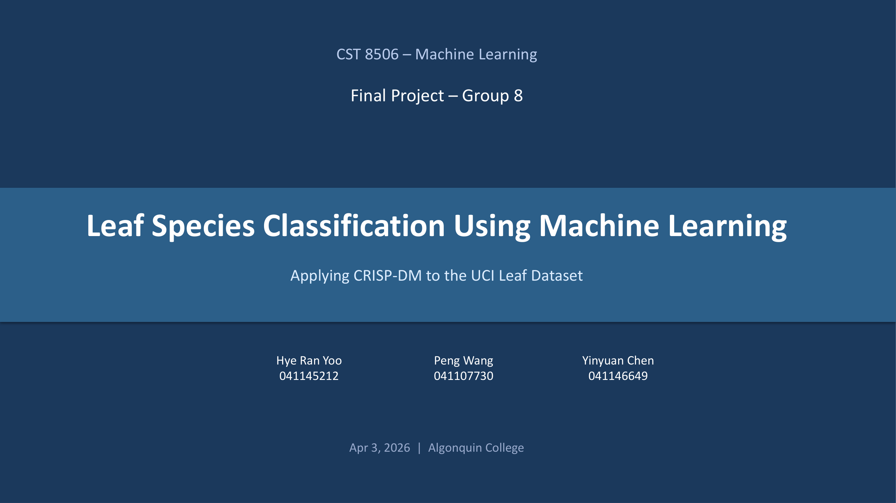

**CST 8506 – Machine Learning — 机器学习**

- Final Project – Group 8 — 期末项目 – 第8组
- **Leaf Species Classification Using Machine Learning — 使用机器学习进行叶片物种分类**
- Applying CRISP-DM to the UCI Leaf Dataset — 将 CRISP-DM 应用于 UCI 叶片数据集

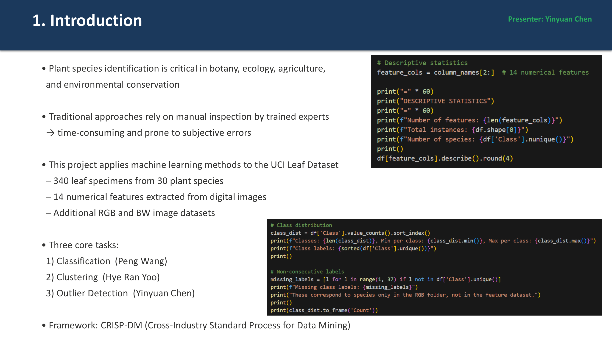

**1. Introduction — 项目简介**

- Plant species identification is critical in botany, ecology, agriculture, and environmental conservation — 植物物种识别在植物学、生态学、农业和环境保护中至关重要
- Traditional approaches rely on manual inspection by trained experts → time-consuming and prone to subjective errors — 传统方法依赖训练有素的专家手动检查 → 耗时且容易出现主观错误
- This project applies machine learning methods to the **UCI Leaf Dataset** — 本项目将机器学习方法应用于 **UCI 叶片数据集**：
  - 340 leaf specimens from 30 plant species — 来自30个植物物种的340个叶片标本
  - 14 numerical features extracted from digital images — 从数字图像中提取的14个数值特征
  - Additional RGB and BW image datasets — 额外的 RGB 和黑白图像数据集
- **Three core tasks — 三大核心任务：**
  1. Classification (Hye Ran Yoo) — 分类
  2. Clustering (Peng Wang) — 聚类
  3. Outlier Detection (Yinyuan Chen) — 异常检测
- **Framework:** CRISP-DM (Cross-Industry Standard Process for Data Mining) — **框架：** CRISP-DM（跨行业数据挖掘标准流程）

---

## 2. 业务理解 (Business Understanding)

### 2.1 项目计划 (Project Plan)

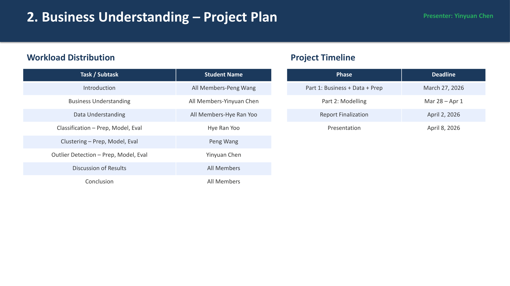

**2. Business Understanding – Project Plan — 业务理解 – 项目计划**

**Workload Distribution — 工作分配：**

| Task / Subtask — 任务/子任务 | Student Name — 负责人 |
|---|---|
| Introduction — 简介 | All Members – Peng Wang — 全体成员 – 王鹏 |
| Business Understanding — 业务理解 | All Members – Yinyuan Chen — 全体成员 – 陈银元 |
| Data Understanding — 数据理解 | All Members – Hye Ran Yoo — 全体成员 – 柳慧兰 |
| Classification – Prep, Model, Eval — 分类 – 准备、建模、评估 | Hye Ran Yoo — 柳慧兰 |
| Clustering – Prep, Model, Eval — 聚类 – 准备、建模、评估 | Peng Wang — 王鹏 |
| Outlier Detection – Prep, Model, Eval — 异常检测 – 准备、建模、评估 | Yinyuan Chen — 陈银元 |
| Discussion of Results — 结果讨论 | All Members — 全体成员 |
| Conclusion — 结论 | All Members — 全体成员 |

**Project Timeline — 项目时间线：**

| Phase — 阶段 | Deadline — 截止日期 |
|---|---|
| Part 1: Business + Data + Prep — 第1部分：业务 + 数据 + 准备 | March 27, 2026 |
| Part 2: Modelling — 第2部分：建模 | Mar 28 – Apr |
| Report Finalization — 报告定稿 | April 2, 2026 |
| Presentation — 答辩展示 | April 8, 2026 |

### 2.2 目标与现状评估 (Objectives & Situation)

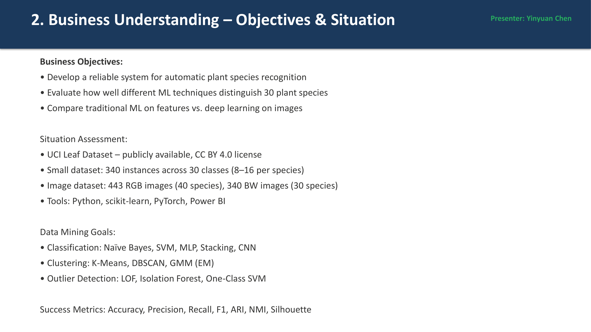

**2. Business Understanding – Objectives & Situation — 业务理解 – 目标与现状**

**Business Objectives — 业务目标：**
- Develop a reliable system for automatic plant species recognition — 开发可靠的自动植物物种识别系统
- Evaluate how well different ML techniques distinguish 30 plant species — 评估不同机器学习技术区分30个植物物种的效果
- Compare traditional ML on features vs. deep learning on images — 比较基于特征的传统机器学习与基于图像的深度学习

**Situation Assessment — 现状评估：**
- UCI Leaf Dataset – publicly available, CC BY 4.0 license — UCI 叶片数据集 – 公开可用，CC BY 4.0 许可证
- Small dataset: 340 instances across 30 classes (8–16 per species) — 小数据集：30个类别的340个实例（每个物种8-16个）
- Image dataset: 443 RGB images (40 species), 340 BW images (30 species) — 图像数据集：443张 RGB 图像（40个物种），340张黑白图像（30个物种）
- Tools: Python, scikit-learn, PyTorch, Power BI — 工具：Python, scikit-learn, PyTorch, Power BI

**Data Mining Goals — 数据挖掘目标：**
- Classification: Naïve Bayes, SVM, MLP, Stacking, CNN — 分类：朴素贝叶斯、支持向量机、多层感知机、堆叠集成、卷积神经网络
- Clustering: K-Means, DBSCAN, GMM (EM) — 聚类：K均值、DBSCAN、高斯混合模型（EM）
- Outlier Detection: LOF, Isolation Forest, One-Class SVM — 异常检测：局部异常因子、孤立森林、单类支持向量机

**Success Metrics — 成功指标：** Accuracy, Precision, Recall, F1, ARI, NMI, Silhouette — 准确率、精确率、召回率、F1分数、ARI、NMI、轮廓系数

---

## 3. 数据理解 (Data Understanding)

### 3.1 特征数据集 (Feature Dataset)

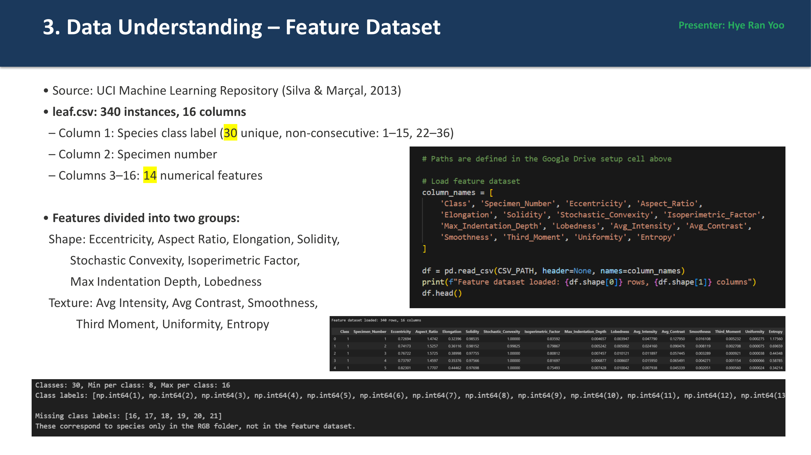

**3. Data Understanding – Feature Dataset — 数据理解 – 特征数据集**

- **Source — 来源：** UCI Machine Learning Repository (Silva & Marçal, 2013)
- **leaf.csv:** 340 instances, 16 columns — 340个实例，16列
  - Column 1: Species class label (30 unique, non-consecutive: 1–15, 22–36) — 第1列：物种类别标签（30个唯一值，非连续：1-15, 22-36）
  - Column 2: Specimen number — 第2列：标本编号
  - Columns 3–16: 14 numerical features — 第3-16列：14个数值特征
- **Features divided into two groups — 特征分为两组：**
  - **Shape — 形状：** Eccentricity（离心率）, Aspect Ratio（长宽比）, Elongation（伸长度）, Solidity（密实度）, Stochastic Convexity（随机凸度）, Isoperimetric Factor（等周因子）, Max Indentation Depth（最大缩进深度）, Lobedness（分叶度）
  - **Texture — 纹理：** Avg Intensity（平均强度）, Avg Contrast（平均对比度）, Smoothness（平滑度）, Third Moment（三阶矩）, Uniformity（均匀度）, Entropy（熵）

### 3.2 图像数据集 (Image Dataset)

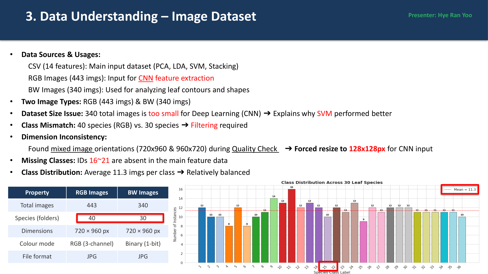

**3. Data Understanding – Image Dataset — 数据理解 – 图像数据集**

- **Data Sources & Usages — 数据来源与用途：**
  - CSV (14 features): Main input dataset (PCA, LDA, SVM, Stacking) — CSV（14个特征）：主输入数据集（PCA、LDA、SVM、堆叠）
  - RGB Images (443 imgs): Input for CNN feature extraction — RGB 图像（443张）：CNN 特征提取输入
  - BW Images (340 imgs): Used for analyzing leaf contours and shapes — 黑白图像（340张）：用于分析叶片轮廓和形状
- Two Image Types: RGB (443 imgs) & BW (340 imgs) — 两种图像类型：RGB（443张）和黑白（340张）
- **Dataset Size Issue — 数据集大小问题：** 340 total images is too small for Deep Learning (CNN) ➔ Explains why SVM performed better — 总共340张图像对深度学习（CNN）来说太少 ➔ 这解释了为什么 SVM 表现更好
- **Class Mismatch — 类别不匹配：** 40 species (RGB) vs. 30 species ➔ Filtering required — 40个物种（RGB）vs. 30个物种 ➔ 需要过滤
- **Dimension Inconsistency — 维度不一致：** Found mixed image orientations (720×960 & 960×720) during Quality Check ➔ Forced resize to 128×128px for CNN input — 质量检查时发现混合的图像方向（720×960和960×720）➔ 强制调整为128×128像素以作为 CNN 输入
- **Missing Classes — 缺失类别：** IDs 16–21 are absent in the main feature data — ID 16-21在主特征数据中不存在
- **Class Distribution — 类别分布：** Average 11.3 imgs per class ➔ Relatively balanced — 平均每类11.3张图像 ➔ 相对均衡

| Property — 属性 | RGB Images — RGB图像 | BW Images — 黑白图像 |
|---|---|---|
| Total images — 总图像数 | 443 | 340 |
| Species (folders) — 物种（文件夹数） | 40 | 30 |
| Dimensions — 维度 | 720 × 960 px | 720 × 960 px |
| Colour mode — 色彩模式 | RGB (3-channel) — RGB（3通道） | Binary (1-bit) — 二值（1位） |
| File format — 文件格式 | JPG | JPG |

### 3.3 探索数据 – 特征分布 (Explore Data – Feature Distributions)

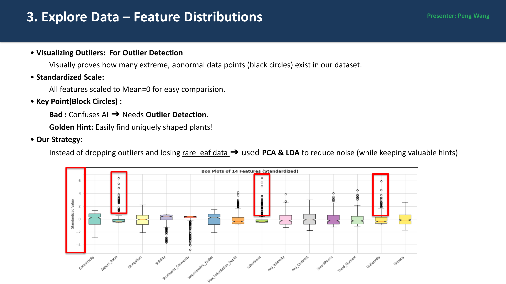

**3. Explore Data – Feature Distributions — 探索数据 – 特征分布**

- **Visualizing Outliers (For Outlier Detection) — 可视化异常值（用于异常检测）：**
  - Visually proves how many extreme, abnormal data points (black circles) exist in our dataset — 直观证明了数据集中存在多少极端、异常的数据点（黑色圆圈）
- **Standardized Scale — 标准化比例尺：** All features scaled to Mean=0 for easy comparison — 所有特征缩放到均值=0，便于比较
- **Key Point (Black Circles) — 关键点（黑色圆圈）：**
  - Bad: Confuses AI ➔ Needs Outlier Detection — 坏处：干扰 AI ➔ 需要异常检测
  - Golden Hint: Easily find uniquely shaped plants! — 好处：容易找到形状独特的植物！
- **Our Strategy — 我们的策略：** Instead of dropping outliers and losing rare leaf data ➔ used PCA & LDA to reduce noise (while keeping valuable hints) — 不是丢弃异常值并失去珍贵的叶片数据 ➔ 而是使用 PCA 和 LDA 来降噪（同时保留有价值的线索）

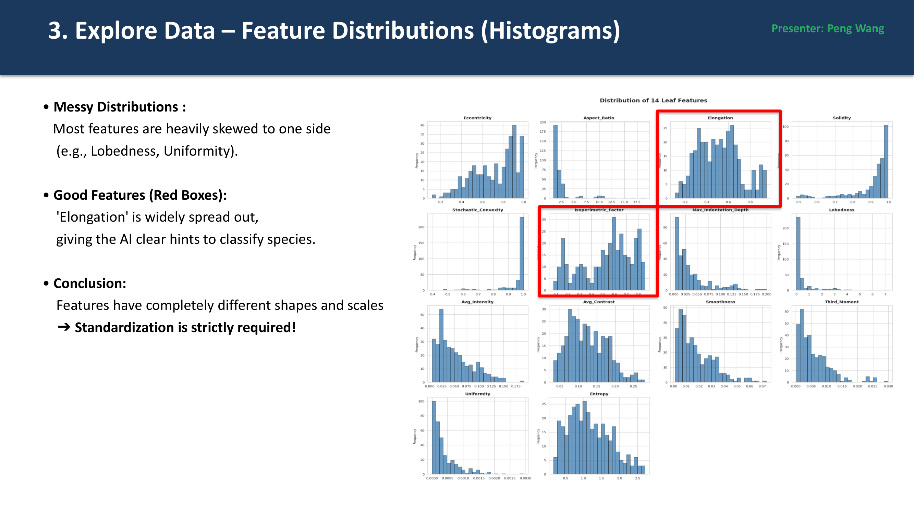

**3. Explore Data – Feature Distributions (Histograms) — 探索数据 – 特征分布（直方图）**

- **Messy Distributions — 混乱的分布：** Most features are heavily skewed to one side (e.g., Lobedness, Uniformity) — 大多数特征严重偏向一侧（如分叶度、均匀度）
- **Good Features (Red Boxes) — 好的特征（红框）：** 'Elongation' is widely spread out, giving the AI clear hints to classify species — "伸长度"分布广泛，为 AI 提供了清晰的分类线索
- **Conclusion — 结论：** Features have completely different shapes and scales ➔ **Standardization is strictly required!** — 特征具有完全不同的形状和尺度 ➔ **标准化是必须的！**

### 3.4 数据质量验证 (Data Quality Verification)

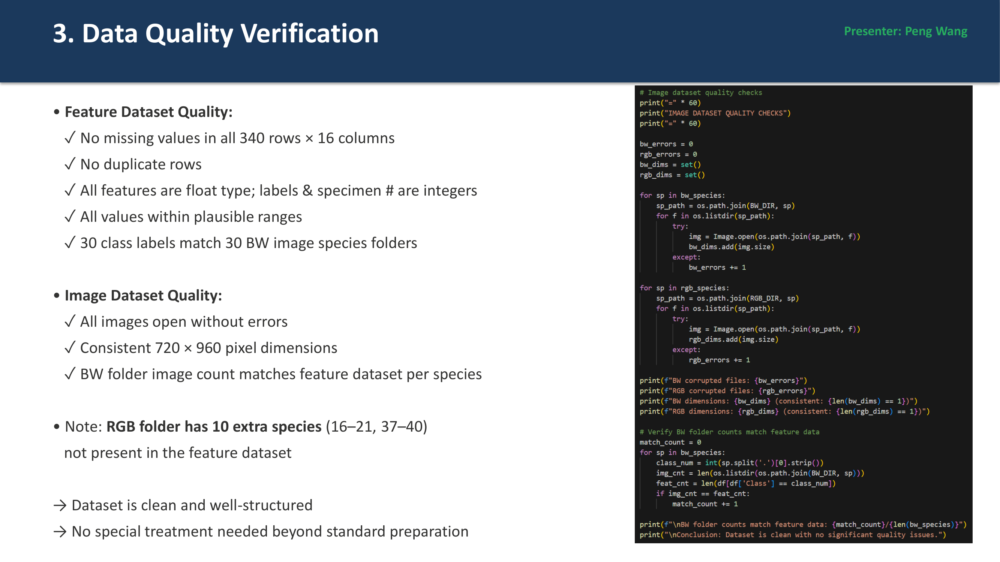

**3. Data Quality Verification — 数据质量验证**

**Feature Dataset Quality — 特征数据集质量：**
- ✓ No missing values in all 340 rows × 16 columns — ✓ 340行×16列中无缺失值
- ✓ No duplicate rows — ✓ 无重复行
- ✓ All features are float type; labels & specimen # are integers — ✓ 所有特征为浮点类型；标签和标本号为整数
- ✓ All values within plausible ranges — ✓ 所有值在合理范围内
- ✓ 30 class labels match 30 BW image species folders — ✓ 30个类别标签与30个黑白图像物种文件夹匹配

**Image Dataset Quality — 图像数据集质量：**
- ✓ All images open without errors — ✓ 所有图像无错误打开
- ✓ Consistent 720 × 960 pixel dimensions — ✓ 一致的 720×960 像素尺寸
- ✓ BW folder image count matches feature dataset per species — ✓ 黑白文件夹图像数量与每个物种的特征数据集匹配

**Note — 注意：** RGB folder has 10 extra species (16–21, 37–40) not present in the feature dataset — RGB 文件夹有10个额外物种（16-21, 37-40）不在特征数据集中
→ Dataset is clean and well-structured → No special treatment needed beyond standard preparation — → 数据集干净且结构良好 → 除标准准备外不需特殊处理

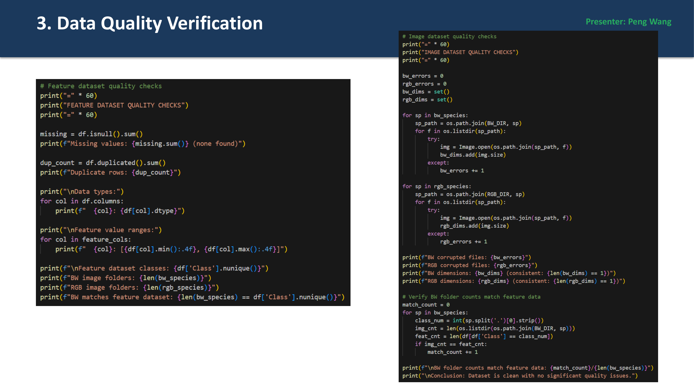

**3. Data Quality Verification (Continued) — 数据质量验证（续）**

---

## 4. 分类 (Classification)

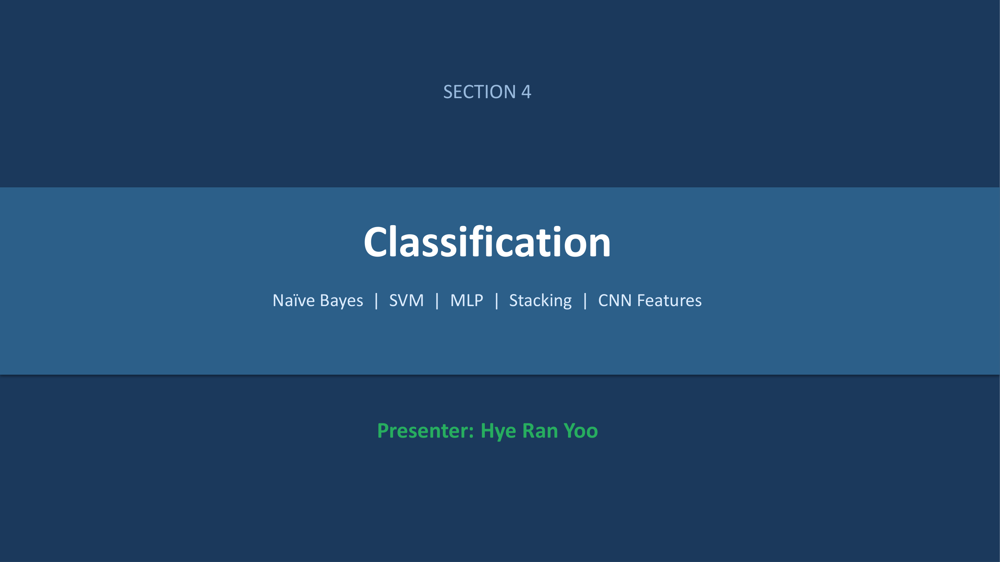

**SECTION: Classification — 章节：分类**
Naïve Bayes | SVM | MLP | Stacking | CNN Features

### 4.1 数据准备 (Data Preparation)

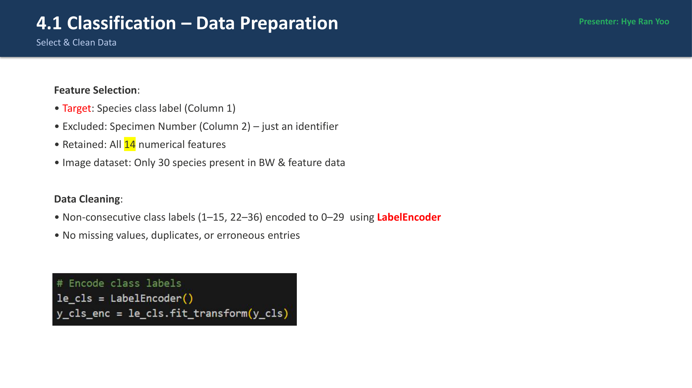

**4.1 Classification – Data Preparation — 分类 – 数据准备**

**Select & Clean Data — 选择与清洗数据：**

**Feature Selection — 特征选择：**
- Target: Species class label (Column 1) — 目标：物种类别标签（第1列）
- Excluded: Specimen Number (Column 2) – just an identifier — 排除：标本编号（第2列）– 仅为标识符
- Retained: All 14 numerical features — 保留：所有14个数值特征
- Image dataset: Only 30 species present in BW & feature data — 图像数据集：仅有30个物种存在于黑白和特征数据中

**Data Cleaning — 数据清洗：**
- Non-consecutive class labels (1–15, 22–36) encoded to 0–29 using LabelEncoder — 使用 LabelEncoder 将非连续类别标签（1-15, 22-36）编码为 0-29
- No missing values, duplicates, or erroneous entries — 无缺失值、重复或错误条目

### 4.2 构建数据 (Construct Data)

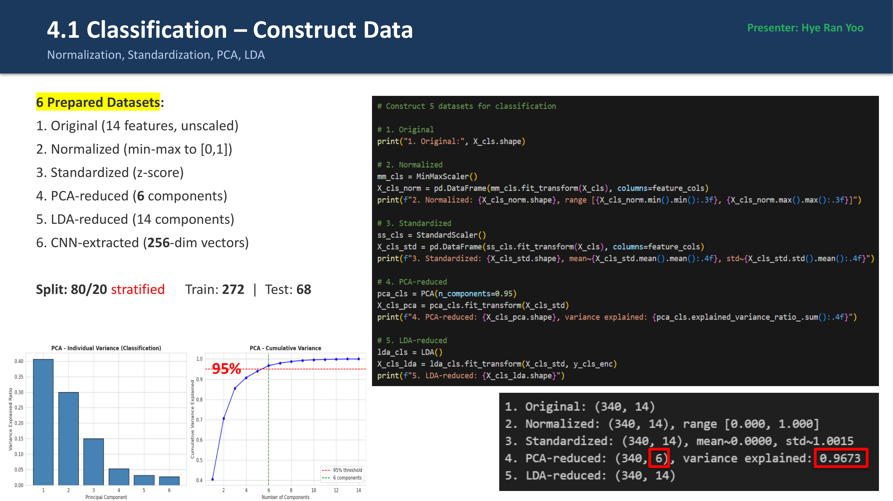

**4.1 Classification – Construct Data — 分类 – 构建数据**

**Normalization, Standardization, PCA, LDA — 归一化、标准化、主成分分析、线性判别分析**

**6 Prepared Datasets — 6个准备好的数据集：**
1. Original (14 features, unscaled) — 原始（14个特征，未缩放）
2. Normalized (min-max to [0,1]) — 归一化（最小-最大缩放到[0,1]）
3. Standardized (z-score) — 标准化（z分数）
4. PCA-reduced (6 components) — PCA降维（6个主成分）
5. LDA-reduced (14 components) — LDA降维（14个判别成分）
6. CNN-extracted (256-dim vectors) — CNN提取（256维向量）

**Split — 数据划分：** 80/20 stratified — 80/20 分层采样 — Train: 272 | Test: 68 — 训练集：272 | 测试集：68

### 4.3 CNN 特征提取 (CNN Feature Extraction)

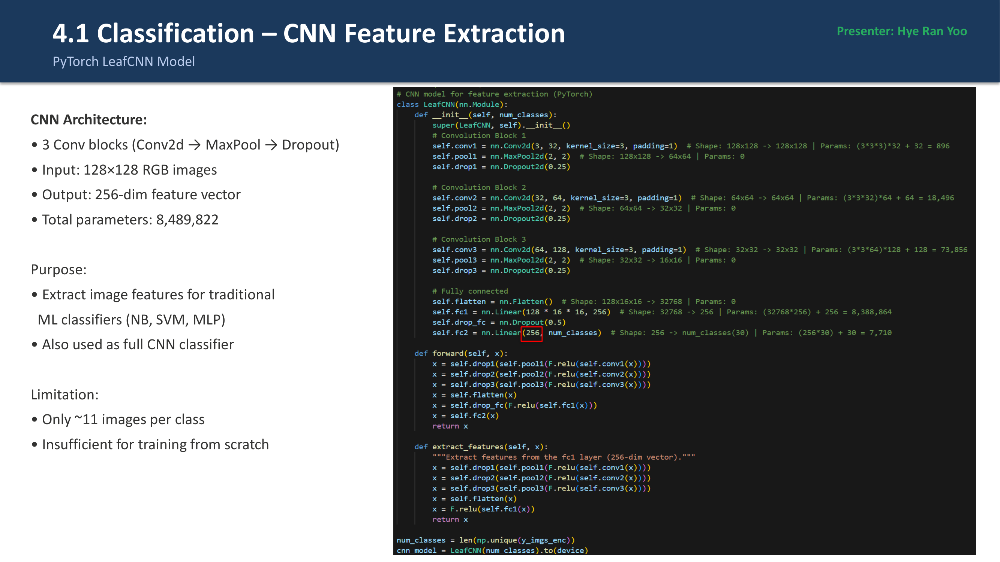

**4.1 Classification – CNN Feature Extraction — 分类 – CNN 特征提取**

**PyTorch LeafCNN Model — PyTorch 叶片CNN模型：**
- **CNN Architecture — CNN 架构：**
  - 3 Conv blocks (Conv2d → MaxPool → Dropout) — 3个卷积块（Conv2d → 最大池化 → Dropout）
  - Input: 128×128 RGB images — 输入：128×128 RGB 图像
  - Output: 256-dim feature vector — 输出：256维特征向量
  - Total parameters: 8,489,822 — 总参数量：8,489,822
- **Purpose — 目的：** Extract image features for traditional ML classifiers (NB, SVM, MLP); also used as full CNN classifier — 为传统机器学习分类器（NB、SVM、MLP）提取图像特征；也用作完整的 CNN 分类器
- **Limitation — 局限性：** Only ~11 images per class — insufficient for training from scratch — 每个类别仅约11张图像 — 不足以从头训练

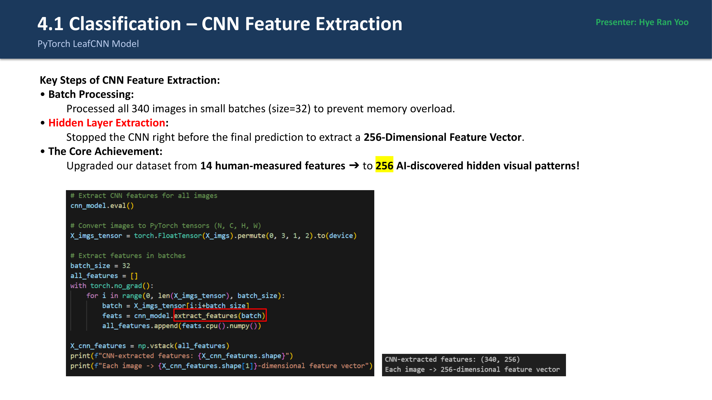

**4.1 Classification – CNN Feature Extraction (Key Steps) — 分类 – CNN 特征提取（关键步骤）**

- **Batch Processing — 批量处理：** Processed all 340 images in small batches (size=32) to prevent memory overload — 以小批量（大小=32）处理所有340张图像以防止内存溢出
- **Hidden Layer Extraction — 隐藏层提取：** Stopped the CNN right before the final prediction to extract a 256-Dimensional Feature Vector — 在最终预测之前停止 CNN，提取256维特征向量
- **The Core Achievement — 核心成就：** Upgraded our dataset from 14 human-measured features ➔ to 256 AI-discovered hidden visual patterns! — 将数据集从14个人工测量特征 ➔ 升级为256个 AI 发现的隐藏视觉模式！

### 4.4 数据整合与格式化 (Integrate Data / Format Data)

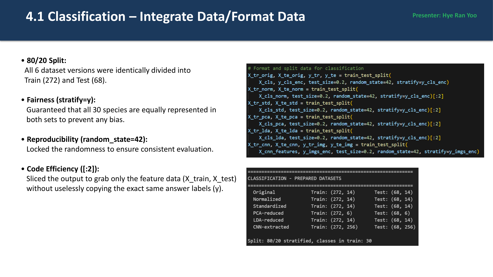

**4.1 Classification – Integrate Data/Format Data — 分类 – 数据整合/格式化**

- **80/20 Split — 80/20划分：** All 6 dataset versions were identically divided into Train (272) and Test (68) — 所有6个数据集版本被统一划分为训练集（272）和测试集（68）
- **Fairness (stratify=y) — 公平性（分层采样=y）：** Guaranteed that all 30 species are equally represented in both sets to prevent any bias — 保证所有30个物种在两个集合中均等分布，防止任何偏差
- **Reproducibility (random_state=42) — 可重复性（随机种子=42）：** Locked the randomness to ensure consistent evaluation — 锁定随机性以确保一致的评估结果
- **Code Efficiency ([:2]) — 代码效率（[:2]）：** Sliced the output to grab only the feature data (X_train, X_test) without uselessly copying the exact same answer labels (y) — 切片输出仅获取特征数据（X_train, X_test），避免不必要地复制相同的标签数据（y）

### 4.5 模型选择 (Model Selection)

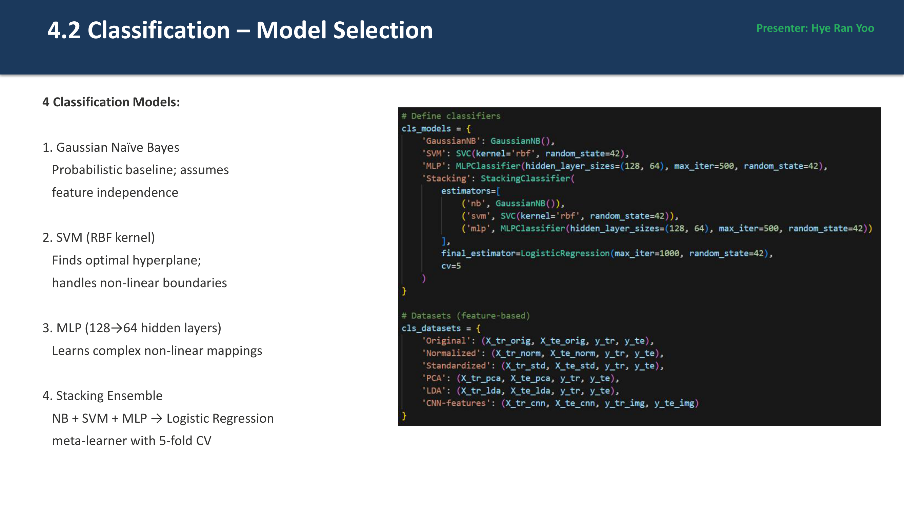

**4.2 Classification – Model Selection — 分类 – 模型选择**

**4 Classification Models — 4个分类模型：**
1. **Gaussian Naïve Bayes — 高斯朴素贝叶斯** — Probabilistic baseline; assumes feature independence — 概率基线；假设特征独立
2. **SVM (RBF kernel) — 支持向量机（RBF核）** — Finds optimal hyperplane; handles non-linear boundaries — 寻找最优超平面；处理非线性边界
3. **MLP (128→64 hidden layers) — 多层感知机（128→64隐藏层）** — Learns complex non-linear mappings — 学习复杂的非线性映射
4. **Stacking Ensemble — 堆叠集成** — NB + SVM + MLP → Logistic Regression meta-learner with 5-fold CV — NB + SVM + MLP → 逻辑回归元学习器，5折交叉验证

### 4.6 训练与评估 (Training & Evaluation)

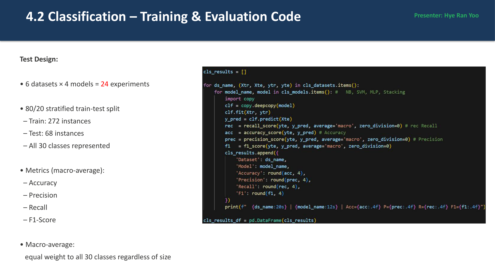

**4.2 Classification – Training & Evaluation Code — 分类 – 训练与评估代码**

**Test Design — 实验设计：**
- 6 datasets × 4 models = **24 experiments** — 6个数据集 × 4个模型 = **24个实验**
- 80/20 stratified train-test split — 80/20分层训练-测试划分
  - Train: 272 instances — 训练集：272个实例
  - Test: 68 instances — 测试集：68个实例
  - All 30 classes represented — 包含所有30个类别
- **Metrics (macro-average) — 评估指标（宏平均）：** Accuracy, Precision, Recall, F1-Score — 准确率、精确率、召回率、F1分数
- **Macro-average — 宏平均：** equal weight to all 30 classes regardless of size — 无论样本量大小，对所有30个类别赋予相同权重

### 4.7 分类结果 (Classification Results)

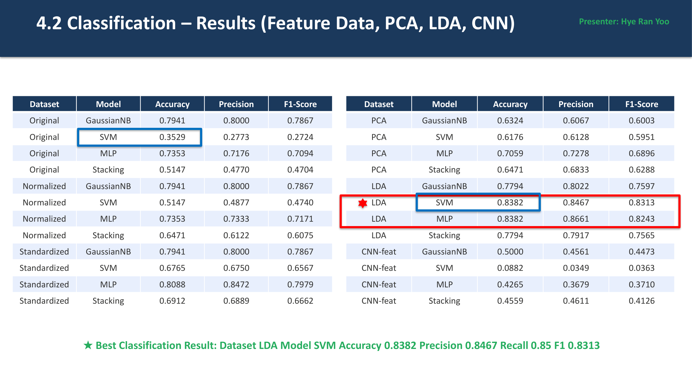

**4.2 Classification – Results (Feature Data, PCA, LDA, CNN) — 分类 – 结果（特征数据、PCA、LDA、CNN）**

| Dataset — 数据集 | Model — 模型 | Accuracy — 准确率 | Precision — 精确率 | F1-Score — F1分数 |
|---|---|---|---|---|
| Original — 原始 | GaussianNB | 0.7941 | 0.8000 | 0.7867 |
| Original — 原始 | SVM | 0.3529 | 0.2773 | 0.2724 |
| Original — 原始 | MLP | 0.7353 | 0.7176 | 0.7094 |
| Original — 原始 | Stacking | 0.5147 | 0.4770 | 0.4704 |
| Normalized — 归一化 | GaussianNB | 0.7941 | 0.8000 | 0.7867 |
| Normalized — 归一化 | SVM | 0.5147 | 0.4877 | 0.4740 |
| Normalized — 归一化 | MLP | 0.7353 | 0.7333 | 0.7171 |
| Normalized — 归一化 | Stacking | 0.6471 | 0.6122 | 0.6075 |
| Standardized — 标准化 | GaussianNB | 0.7941 | 0.8000 | 0.7867 |
| Standardized — 标准化 | SVM | 0.6765 | 0.6750 | 0.6567 |
| Standardized — 标准化 | MLP | 0.8088 | 0.8472 | 0.7979 |
| Standardized — 标准化 | Stacking | 0.6912 | 0.6889 | 0.6662 |
| PCA — 主成分分析 | GaussianNB | 0.6324 | 0.6067 | 0.6003 |
| PCA — 主成分分析 | SVM | 0.6176 | 0.6128 | 0.5951 |
| PCA — 主成分分析 | MLP | 0.7059 | 0.7278 | 0.6896 |
| PCA — 主成分分析 | Stacking | 0.6471 | 0.6833 | 0.6288 |
| LDA — 线性判别分析 | GaussianNB | 0.7794 | 0.8022 | 0.7597 |
| LDA — 线性判别分析 | SVM | **0.8382** | **0.8467** | **0.8313** |
| LDA — 线性判别分析 | MLP | **0.8382** | 0.8661 | 0.8243 |
| LDA — 线性判别分析 | Stacking | 0.7794 | 0.7917 | 0.7565 |
| CNN-feat — CNN特征 | GaussianNB | 0.5000 | 0.4561 | 0.4473 |
| CNN-feat — CNN特征 | SVM | 0.0882 | 0.0349 | 0.0363 |
| CNN-feat — CNN特征 | MLP | 0.4265 | 0.3679 | 0.3710 |
| CNN-feat — CNN特征 | Stacking | 0.4559 | 0.4611 | 0.4126 |

**★ Best Classification Result — ★ 最佳分类结果：** Dataset **LDA** | Model **SVM** | Accuracy **0.8382** | Precision **0.8467** | Recall **0.85** | F1 **0.8313** — 数据集 **LDA** | 模型 **SVM** | 准确率 **0.8382** | 精确率 **0.8467** | 召回率 **0.85** | F1 **0.8313**

### 4.8 评估与关键发现 (Evaluation & Key Findings)

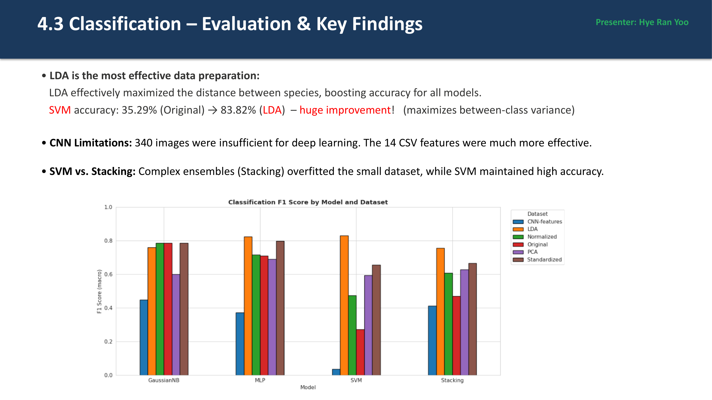

**4.3 Classification – Evaluation & Key Findings — 分类 – 评估与关键发现**

- **LDA is the most effective data preparation — LDA 是最有效的数据准备方法：**
  - LDA effectively maximized the distance between species, boosting accuracy for all models — LDA 有效地最大化了物种间距离，提高了所有模型的准确率
  - SVM accuracy: **35.29% (Original) → 83.82% (LDA)** – huge improvement! (maximizes between-class variance) — SVM 准确率：**35.29%（原始）→ 83.82%（LDA）** – 巨大提升！（最大化类间方差）
- **CNN Limitations — CNN 局限性：** 340 images were insufficient for deep learning. The 14 CSV features were much more effective — 340张图像对深度学习来说不够。14个 CSV 特征更有效
- **SVM vs. Stacking — SVM 对比堆叠：** Complex ensembles (Stacking) overfitted the small dataset, while SVM maintained high accuracy — 复杂集成（堆叠）在小数据集上过拟合，而 SVM 保持了高准确率

---

## 5. 聚类 (Clustering)

**SECTION: Clustering — 章节：聚类**
K-Means | DBSCAN | Gaussian Mixture Model (EM) — K均值 | DBSCAN | 高斯混合模型（EM）

### 5.1 数据准备 (Data Preparation)

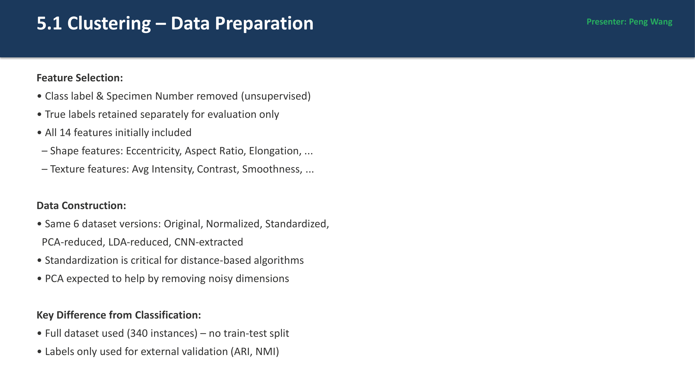

**5.1 Clustering – Data Preparation — 聚类 – 数据准备**

**Feature Selection — 特征选择：**
- Class label & Specimen Number removed (unsupervised) — 移除类别标签和标本编号（无监督学习）
- True labels retained separately for evaluation only — 真实标签单独保留，仅用于评估
- All 14 features initially included — 初始包含所有14个特征
  - Shape features: Eccentricity, Aspect Ratio, Elongation, ... — 形状特征：离心率、长宽比、伸长度等
  - Texture features: Avg Intensity, Contrast, Smoothness, ... — 纹理特征：平均强度、对比度、平滑度等

**Data Construction — 数据构建：**
- Same 6 dataset versions: Original, Normalized, Standardized, PCA-reduced, LDA-reduced, CNN-extracted — 相同的6个数据集版本：原始、归一化、标准化、PCA降维、LDA降维、CNN提取
- Standardization is critical for distance-based algorithms — 标准化对基于距离的算法至关重要
- PCA expected to help by removing noisy dimensions — PCA 有望通过去除噪声维度来提供帮助

**Key Difference from Classification — 与分类的关键区别：**
- Full dataset used (340 instances) – no train-test split — 使用完整数据集（340个实例）– 无训练-测试划分
- Labels only used for external validation (ARI, NMI) — 标签仅用于外部验证（ARI、NMI）

### 5.2 模型选择与代码 (Model Selection & Code)

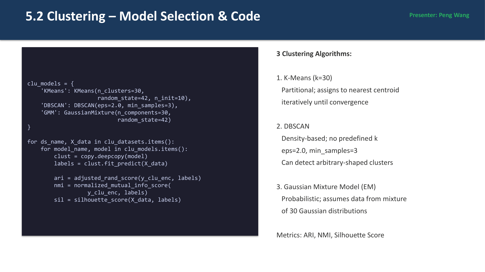

**5.2 Clustering – Model Selection & Code — 聚类 – 模型选择与代码**

**3 Clustering Algorithms — 3个聚类算法：**
1. **K-Means (k=30) — K均值（k=30）** — Partitional; assigns to nearest centroid iteratively until convergence — 分割式；迭代分配到最近质心直到收敛
2. **DBSCAN** — Density-based; no predefined k; eps=2.0, min_samples=3; can detect arbitrary-shaped clusters — 基于密度；无需预定义k；eps=2.0, min_samples=3；可检测任意形状簇
3. **Gaussian Mixture Model (EM) — 高斯混合模型（EM）** — Probabilistic; assumes data from mixture of 30 Gaussian distributions — 概率模型；假设数据来自30个高斯分布的混合

**Metrics — 评估指标：** ARI, NMI, Silhouette Score — 调整兰德指数、标准化互信息、轮廓系数

### 5.3 聚类结果 (Clustering Results)

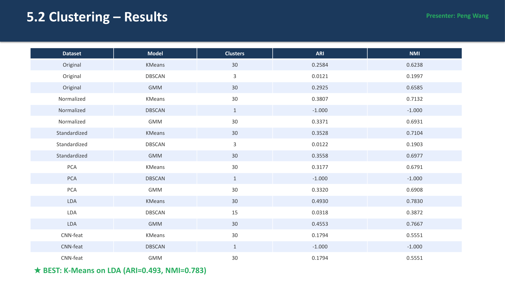

**5.2 Clustering – Results — 聚类 – 结果**

| Dataset — 数据集 | Model — 模型 | Clusters — 簇数 | ARI | NMI |
|---|---|---|---|---|
| Original — 原始 | KMeans | 30 | 0.2584 | 0.6238 |
| Original — 原始 | DBSCAN | 3 | 0.0121 | 0.1997 |
| Original — 原始 | GMM | 30 | 0.2925 | 0.6585 |
| Normalized — 归一化 | KMeans | 30 | 0.3807 | 0.7132 |
| Normalized — 归一化 | DBSCAN | 1 | -1.000 | -1.000 |
| Normalized — 归一化 | GMM | 30 | 0.3371 | 0.6931 |
| Standardized — 标准化 | KMeans | 30 | 0.3528 | 0.7104 |
| Standardized — 标准化 | DBSCAN | 3 | 0.0122 | 0.1903 |
| Standardized — 标准化 | GMM | 30 | 0.3558 | 0.6977 |
| PCA — 主成分分析 | KMeans | 30 | 0.3177 | 0.6791 |
| PCA — 主成分分析 | DBSCAN | 1 | -1.000 | -1.000 |
| PCA — 主成分分析 | GMM | 30 | 0.3320 | 0.6908 |
| LDA — 线性判别分析 | KMeans | 30 | **0.4930** | **0.7830** |
| LDA — 线性判别分析 | DBSCAN | 15 | 0.0318 | 0.3872 |
| LDA — 线性判别分析 | GMM | 30 | 0.4553 | 0.7667 |
| CNN-feat — CNN特征 | KMeans | 30 | 0.1794 | 0.5551 |
| CNN-feat — CNN特征 | DBSCAN | 1 | -1.000 | -1.000 |
| CNN-feat — CNN特征 | GMM | 30 | 0.1794 | 0.5551 |

**★ BEST — ★ 最佳：** K-Means on LDA (ARI=0.493, NMI=0.783) — LDA 上的 K-Means（ARI=0.493, NMI=0.783）

### 5.4 可视化 (Visualizations)

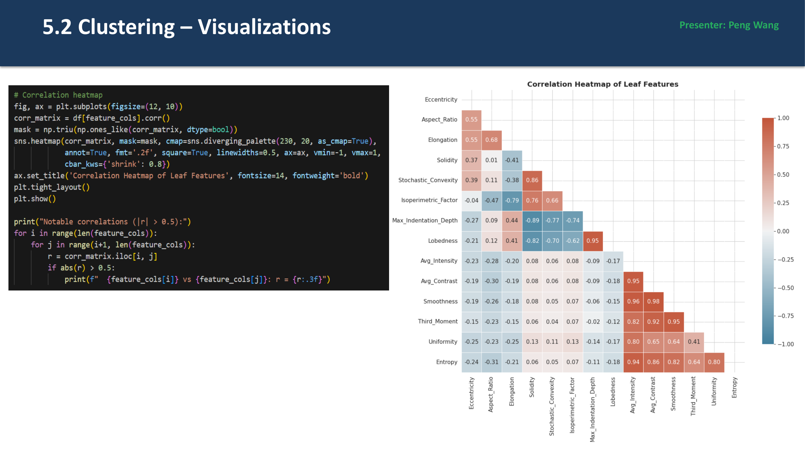

**5.2 Clustering – Visualizations — 聚类 – 可视化**

### 5.5 评估与关键发现 (Evaluation & Key Findings)

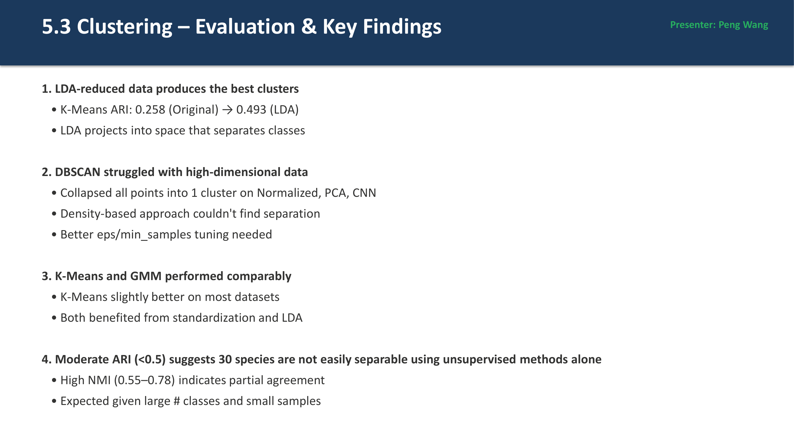

**5.3 Clustering – Evaluation & Key Findings — 聚类 – 评估与关键发现**

1. **LDA-reduced data produces the best clusters — LDA降维数据产生最佳聚类结果**
   - K-Means ARI: 0.258 (Original) → 0.493 (LDA) — K-Means ARI：0.258（原始）→ 0.493（LDA）
   - LDA projects into space that separates classes — LDA 投影到分离类别的空间
2. **DBSCAN struggled with high-dimensional data — DBSCAN 在高维数据上表现不佳**
   - Collapsed all points into 1 cluster on Normalized, PCA, CNN — 在归一化、PCA、CNN 上将所有点归为1个簇
   - Density-based approach couldn't find separation — 基于密度的方法无法找到分离
   - Better eps/min_samples tuning needed — 需要更好地调整 eps/min_samples 参数
3. **K-Means and GMM performed comparably — K-Means 和 GMM 表现相当**
   - K-Means slightly better on most datasets — K-Means 在大多数数据集上略优
   - Both benefited from standardization and LDA — 两者都受益于标准化和 LDA
4. **Moderate ARI (<0.5) suggests 30 species are not easily separable using unsupervised methods alone — 中等 ARI（<0.5）表明仅使用无监督方法难以分离30个物种**
   - High NMI (0.55–0.78) indicates partial agreement — 较高的 NMI（0.55-0.78）表示部分一致
   - Expected given large # classes and small samples — 考虑到大量类别和小样本量，这是预期的

---

## 6. 异常检测 (Outlier Detection)

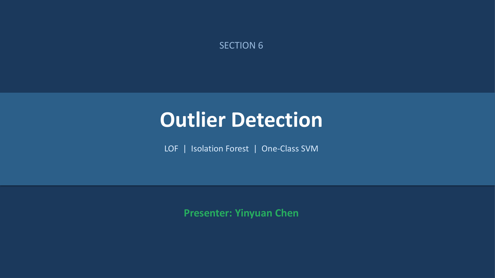

**SECTION: Outlier Detection — 章节：异常检测**
LOF | Isolation Forest | One-Class SVM — 局部异常因子 | 孤立森林 | 单类支持向量机

### 6.1 数据准备 (Data Preparation)

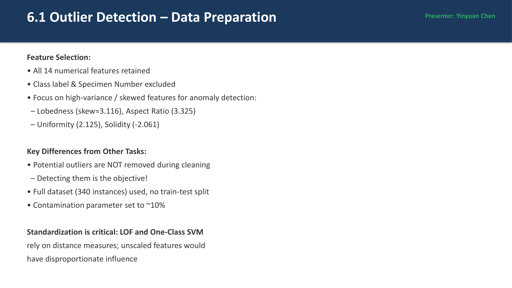

**6.1 Outlier Detection – Data Preparation — 异常检测 – 数据准备**

**Feature Selection — 特征选择：**
- All 14 numerical features retained — 保留所有14个数值特征
- Class label & Specimen Number excluded — 排除类别标签和标本编号
- Focus on high-variance / skewed features for anomaly detection — 聚焦于高方差/偏斜特征以进行异常检测：
  - Lobedness (skew=3.116), Aspect Ratio (3.325) — 分叶度（偏度=3.116）, 长宽比（偏度=3.325）
  - Uniformity (2.125), Solidity (-2.061) — 均匀度（偏度=2.125）, 密实度（偏度=-2.061）

**Key Differences from Other Tasks — 与其他任务的关键区别：**
- Potential outliers are NOT removed during cleaning – detecting them is the objective! — 在数据清洗过程中不移除潜在异常值 – 检测它们就是目标！
- Full dataset (340 instances) used, no train-test split — 使用完整数据集（340个实例），无训练-测试划分
- Contamination parameter set to ~10% — 污染参数设为约10%
- **Standardization is critical — 标准化至关重要：** LOF and One-Class SVM rely on distance measures; unscaled features would have disproportionate influence — LOF 和单类 SVM 依赖距离度量；未缩放的特征会产生不成比例的影响

### 6.2 模型选择与代码 (Model Selection & Code)

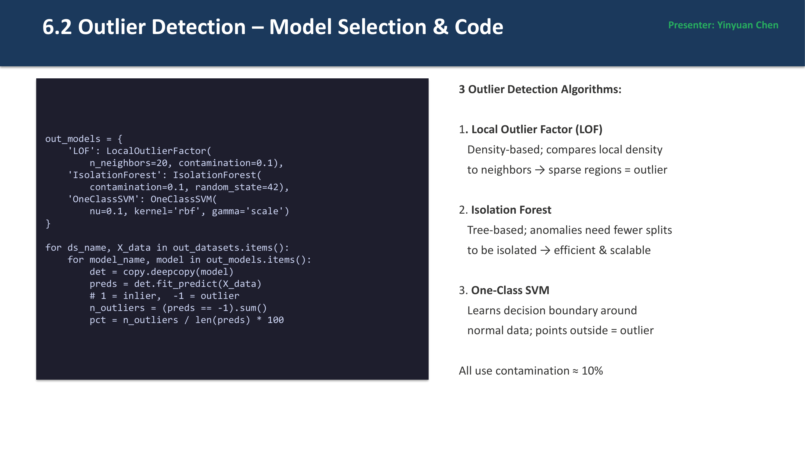

**6.2 Outlier Detection – Model Selection & Code — 异常检测 – 模型选择与代码**

**3 Outlier Detection Algorithms — 3个异常检测算法：**
1. **Local Outlier Factor (LOF) — 局部异常因子** — Density-based; compares local density to neighbors → sparse regions = outlier — 基于密度；比较局部密度与邻居 → 稀疏区域 = 异常
2. **Isolation Forest — 孤立森林** — Tree-based; anomalies need fewer splits to be isolated → efficient & scalable — 基于树；异常值需要更少的分割即可被隔离 → 高效且可扩展
3. **One-Class SVM — 单类支持向量机** — Learns decision boundary around normal data; points outside = outlier — 学习围绕正常数据的决策边界；边界外的点 = 异常

All use contamination ≈ 10% — 所有方法使用约10%的污染率

### 6.3 异常检测结果 (Outlier Detection Results)

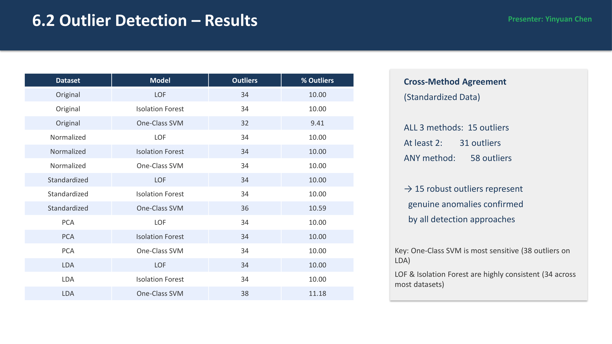

**6.2 Outlier Detection – Results — 异常检测 – 结果**

| Dataset — 数据集 | Model — 模型 | Outliers — 异常数 | % Outliers — 异常百分比 |
|---|---|---|---|
| Original — 原始 | LOF | 34 | 10.00 |
| Original — 原始 | Isolation Forest | 34 | 10.00 |
| Original — 原始 | One-Class SVM | 32 | 9.41 |
| Normalized — 归一化 | LOF | 34 | 10.00 |
| Normalized — 归一化 | Isolation Forest | 34 | 10.00 |
| Normalized — 归一化 | One-Class SVM | 34 | 10.00 |
| Standardized — 标准化 | LOF | 34 | 10.00 |
| Standardized — 标准化 | Isolation Forest | 34 | 10.00 |
| Standardized — 标准化 | One-Class SVM | 36 | 10.59 |
| PCA — 主成分分析 | LOF | 34 | 10.00 |
| PCA — 主成分分析 | Isolation Forest | 34 | 10.00 |
| PCA — 主成分分析 | One-Class SVM | 34 | 10.00 |
| LDA — 线性判别分析 | LOF | 34 | 10.00 |
| LDA — 线性判别分析 | Isolation Forest | 34 | 10.00 |
| LDA — 线性判别分析 | One-Class SVM | 38 | 11.18 |

**Cross-Method Agreement (Standardized Data) — 跨方法一致性（标准化数据）：**
- ALL 3 methods: **15 outliers** — 全部3种方法一致：**15个异常值**
- At least 2: 31 outliers — 至少2种方法一致：31个异常值
- ANY method: 58 outliers — 任一方法检测到：58个异常值
- → 15 robust outliers represent genuine anomalies confirmed by all detection approaches — → 15个稳健异常值代表了被所有检测方法确认的真实异常

**Key — 关键发现：** One-Class SVM is most sensitive (38 outliers on LDA); LOF & Isolation Forest are highly consistent (34 across most datasets) — 单类 SVM 最敏感（LDA 上检测到38个）；LOF 和孤立森林高度一致（大多数数据集上为34个）

### 6.4 评估与关键发现 (Evaluation & Key Findings)

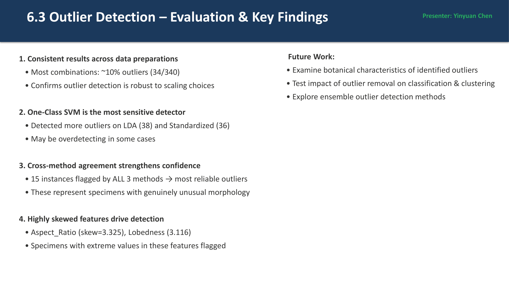

**6.3 Outlier Detection – Evaluation & Key Findings — 异常检测 – 评估与关键发现**

1. **Consistent results across data preparations — 不同数据准备方法间结果一致**
   - Most combinations: ~10% outliers (34/340) — 大多数组合：约10%异常值（34/340）
   - Confirms outlier detection is robust to scaling choices — 确认异常检测对缩放选择具有鲁棒性
2. **One-Class SVM is the most sensitive detector — 单类 SVM 是最敏感的检测器**
   - Detected more outliers on LDA (38) and Standardized (36) — 在 LDA（38个）和标准化（36个）上检测到更多异常值
   - May be overdetecting in some cases — 在某些情况下可能过度检测
3. **Cross-method agreement strengthens confidence — 跨方法一致性增强了置信度**
   - 15 instances flagged by ALL 3 methods → most reliable outliers — 15个实例被全部3种方法标记 → 最可靠的异常值
   - These represent specimens with genuinely unusual morphology — 这些代表了具有真正不寻常形态的标本
4. **Highly skewed features drive detection — 高度偏斜的特征驱动检测**
   - Aspect_Ratio (skew=3.325), Lobedness (3.116) — 长宽比（偏度=3.325）, 分叶度（偏度=3.116）
   - Specimens with extreme values in these features flagged — 在这些特征中具有极端值的标本被标记

**Future Work — 未来工作：**
- Examine botanical characteristics of identified outliers — 检查已识别异常值的植物学特征
- Test impact of outlier removal on classification & clustering — 测试移除异常值对分类和聚类的影响
- Explore ensemble outlier detection methods — 探索集成异常检测方法

---

## 7. 结果讨论 (Discussion of Results)

### 7.1 数据准备的影响 (Impact of Data Preparation)

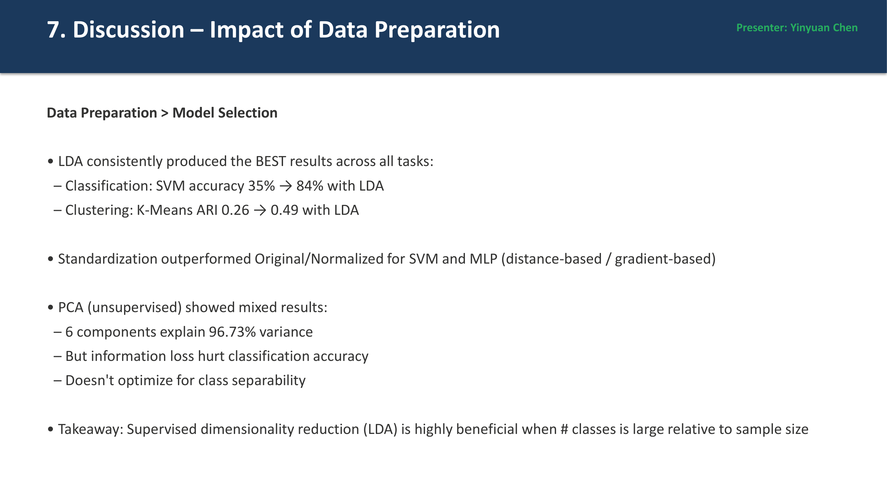

**7. Discussion – Impact of Data Preparation — 讨论 – 数据准备的影响**

**Data Preparation > Model Selection — 数据准备 > 模型选择**

- **LDA consistently produced the BEST results across all tasks — LDA 在所有任务中始终产生最佳结果：**
  - Classification: SVM accuracy **35% → 84%** with LDA — 分类：SVM 准确率从 **35% → 84%**（使用 LDA）
  - Clustering: K-Means ARI **0.26 → 0.49** with LDA — 聚类：K-Means ARI 从 **0.26 → 0.49**（使用 LDA）
- **Standardization** outperformed Original/Normalized for SVM and MLP (distance-based / gradient-based) — **标准化**在 SVM 和 MLP（基于距离/基于梯度）上优于原始/归一化
- **PCA** (unsupervised) showed mixed results — **PCA**（无监督）显示出混合结果：
  - 6 components explain 96.73% variance — 6个成分解释96.73%的方差
  - But information loss hurt classification accuracy — 但信息丢失损害了分类准确率
  - Doesn't optimize for class separability — 不针对类别可分性进行优化
- **Takeaway — 要点：** Supervised dimensionality reduction (LDA) is highly beneficial when # classes is large relative to sample size — 当类别数相对于样本量较大时，有监督降维（LDA）非常有益

### 7.2 CNN 特征与总结 (CNN Features & Summary)

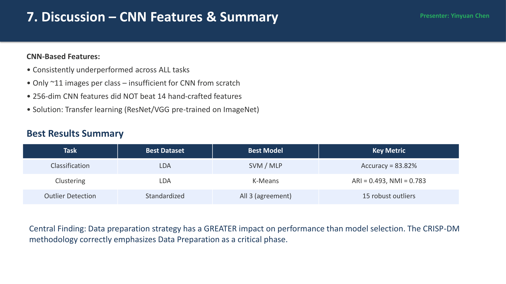

**7. Discussion – CNN Features & Summary — 讨论 – CNN特征与总结**

**CNN-Based Features — 基于CNN的特征：**
- Consistently underperformed across ALL tasks — 在所有任务中持续表现不佳
- Only ~11 images per class – insufficient for CNN from scratch — 每个类别仅约11张图像 – 不足以从头训练 CNN
- 256-dim CNN features did NOT beat 14 hand-crafted features — 256维 CNN 特征没有超越14个手工特征
- **Solution — 解决方案：** Transfer learning (ResNet/VGG pre-trained on ImageNet) — 迁移学习（在 ImageNet 上预训练的 ResNet/VGG）

**Best Results Summary — 最佳结果总结：**

| Task — 任务 | Best Dataset — 最佳数据集 | Best Model — 最佳模型 | Key Metric — 关键指标 |
|---|---|---|---|
| Classification — 分类 | LDA | SVM / MLP | Accuracy = 83.82% — 准确率 = 83.82% |
| Clustering — 聚类 | LDA | K-Means | ARI = 0.493, NMI = 0.783 |
| Outlier Detection — 异常检测 | Standardized — 标准化 | All 3 (agreement) — 3种方法一致 | 15 robust outliers — 15个稳健异常值 |

**Central Finding — 核心发现：** Data preparation strategy has a **GREATER impact on performance** than model selection. The CRISP-DM methodology correctly emphasizes Data Preparation as a critical phase. — 数据准备策略对性能的影响**大于**模型选择。CRISP-DM 方法论正确地强调了数据准备是一个关键阶段。

---

## 8. 结论 (Conclusion)

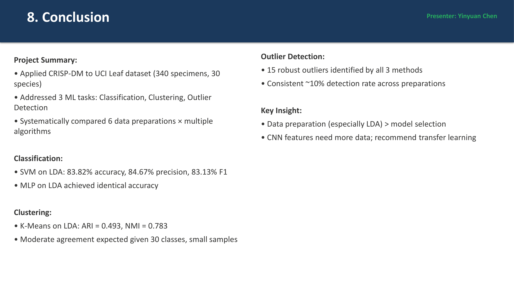

**8. Conclusion — 结论**

**Project Summary — 项目总结：**
- Applied CRISP-DM to UCI Leaf dataset (340 specimens, 30 species) — 将 CRISP-DM 应用于 UCI 叶片数据集（340个标本，30个物种）
- Addressed 3 ML tasks: Classification, Clustering, Outlier Detection — 解决了3个ML任务：分类、聚类、异常检测
- Systematically compared 6 data preparations × multiple algorithms — 系统地比较了6种数据准备方法 × 多种算法

**Classification — 分类：**
- SVM on LDA: 83.82% accuracy, 84.67% precision, 83.13% F1 — LDA 上的 SVM：83.82%准确率，84.67%精确率，83.13% F1
- MLP on LDA achieved identical accuracy — LDA 上的 MLP 达到相同准确率

**Clustering — 聚类：**
- K-Means on LDA: ARI = 0.493, NMI = 0.783 — LDA 上的 K-Means：ARI = 0.493，NMI = 0.783
- Moderate agreement expected given 30 classes, small samples — 考虑到30个类别和小样本量，中等一致性是预期的

**Outlier Detection — 异常检测：**
- 15 robust outliers identified by all 3 methods — 15个稳健异常值被全部3种方法识别
- Consistent ~10% detection rate across preparations — 不同数据准备方法间一致的约10%检测率

**Key Insight — 关键洞察：**
- Data preparation (especially LDA) > model selection — 数据准备（尤其是 LDA）> 模型选择
- CNN features need more data; recommend transfer learning — CNN 特征需要更多数据；建议使用迁移学习

---

## 9. 参考文献 (References)

- Silva, P. & Marçal, A. (2013). Leaf [Dataset]. UCI Machine Learning Repository. https://doi.org/10.24432/C53C78
- Chapman, P., Clinton, J., Kerber, R., et al. (2000). CRISP-DM 1.0: Step-by-step data mining guide. SPSS Inc. — CRISP-DM 1.0：分步数据挖掘指南
- Pedregosa, F., Varoquaux, G., Gramfort, A., et al. (2011). Scikit-learn: Machine learning in Python. JMLR, 12, 2825–2830. — Scikit-learn：Python中的机器学习
- Breunig, M. M., Kriegel, H. P., Ng, R. T., & Sander, J. (2000). LOF: Identifying density-based local outliers. ACM SIGMOD, 29(2), 93–104. — LOF：识别基于密度的局部异常值
- Liu, F. T., Ting, K. M., & Zhou, Z. H. (2008). Isolation forest. IEEE ICDM, 413–422. — 孤立森林

---

## 10. 问答环节 (Q & A)

**Questions & Answers — 答疑环节**

Thank you for your attention! — 感谢您的关注！

**Hye Ran Yoo** (041145212) | **Peng Wang** (041107730) | **Yinyuan Chen** (041146649)

CST 8506 – Machine Learning | Group 8 | Algonquin College — 机器学习 | 第8组 | 亚岗昆学院
