# 04 CST8506 RNN

**Source:** `04_CST8506_RNN.pdf`  
**Total Pages:** 38  
**Format:** Hybrid (pdfplumber + PyMuPDF)

---

## Page 1

### 📷 Page Image

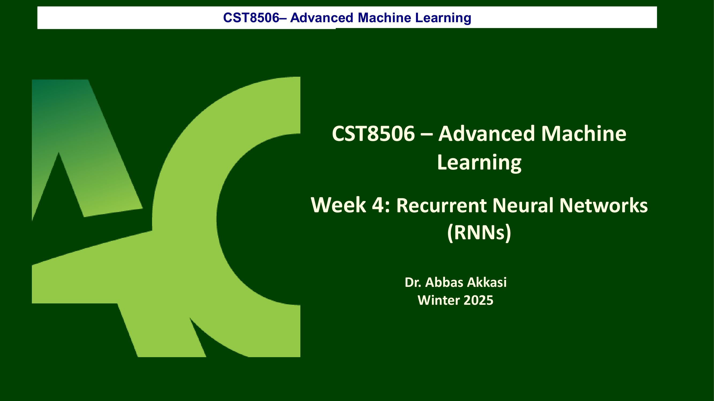

### 📝 Text Content

**ECE 8443 – Pattern Recognition – Advanced Machine Learning**

CST8506 – Advanced Machine
Learning
Week 4: Recurrent Neural Networks
(RNNs)
Dr. Abbas Akkasi
Winter 2025

### ✍️ Notes

> **📝 笔记:**
>
> **课程基本信息 (Course Information):**
>
> - **课程编号**: ECE 8443 / CST8506，即高级机器学习 (Advanced Machine Learning)。
> - **本周主题**: 第 4 周重点讲解循环神经网络 (Recurrent Neural Networks, RNNs)。
> - **讲师**: Dr. Abbas Akkasi。
> - **学期**: 2025年冬季。

---

## Page 2

### 📷 Page Image

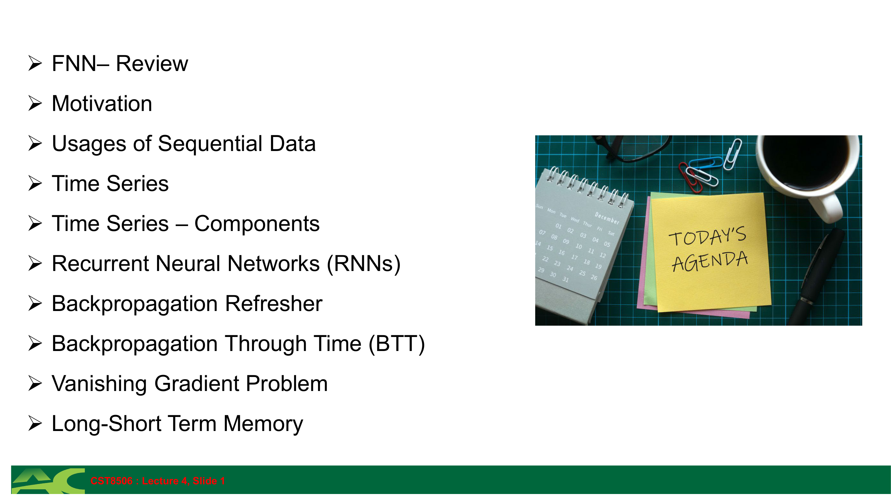

### 📝 Text Content

** FNN– Review**

 Motivation
 Usages of Sequential Data
 Time Series
 Time Series – Components
 Recurrent Neural Networks (RNNs)
 Backpropagation Refresher
 Backpropagation Through Time (BTT)
 Vanishing Gradient Problem
 Long-Short Term Memory
CST8506 : Lecture 4, Slide

### ✍️ Notes

> **📝 笔记:**
>
> **本周学习大纲 (Agenda):**
>
> - **FNN– Review**: 复习前馈神经网络的基础。
> - **Motivation**: 分析为什么需要 RNN 以及 FNN 的局限性。
> - **Usages of Sequential Data**: 序列数据在不同领域的使用案例。
> - **Time Series**: 时间序列的基本概念。
> - **Time Series – Components**: 拆解时间序列的四个核心要素。
> - **RNNs**: 循环神经网络的基础架构与原理。
> - **Backpropagation Refresher**: 误差反向传播算法的回顾。
> - **BTT**: 针对循环神经网络的随时间反向传播 (BPTT)。
> - **Vanishing Gradient Problem**: 梯度消失的成因与挑战。
> - **Long-Short Term Memory**: 学习更先进的 LSTM 架构。

---

## Page 3

### 📷 Page Image

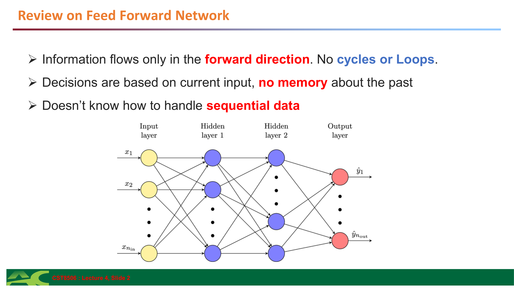

### 📝 Text Content

**Review on Feed Forward Network**

 Information flows only in the forward direction. No cycles or Loops.
 Decisions are based on current input, no memory about the past
 Doesn’t know how to handle sequential data
CST8506 : Lecture 4, Slide

### ✍️ Notes

> **📝 笔记:**
>
> **前馈神经网络 (FNN) 复习:**
>
> - **单向流动**: 信息仅从输入向输出方向传播，不存在循环或闭环结构。
> - **无记忆决策**: 网络对于当前输入的处理完全不依赖于过去的输入。
> - **局限性**: 无法处理具有先后顺序关系的序列数据，因为它没有记忆机制。

---

## Page 4

### 📷 Page Image

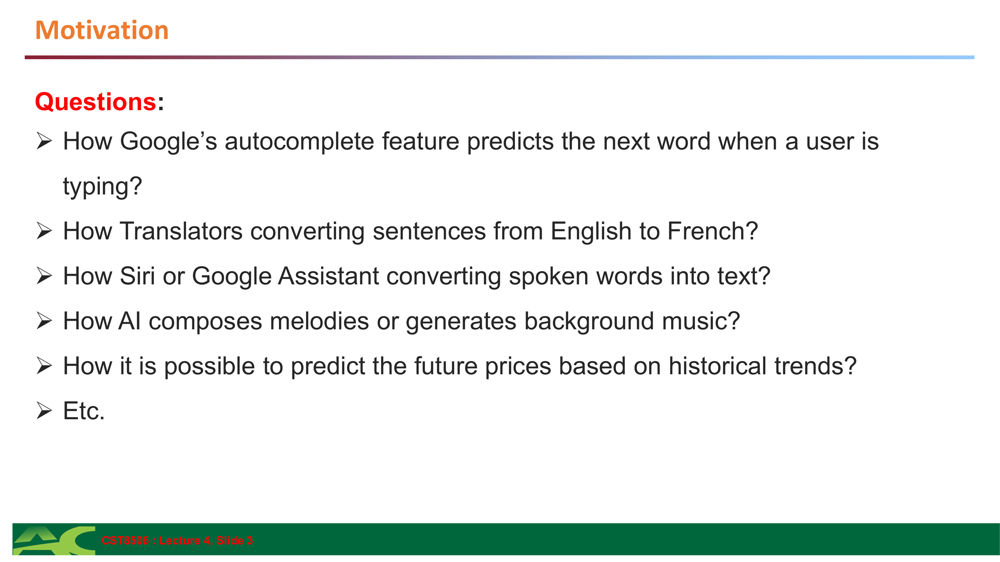

### 📝 Text Content

**Motivation**

Questions:
 How Google’s autocomplete feature predicts the next word when a user is
typing?
 How Translators converting sentences from English to French?
 How Siri or Google Assistant converting spoken words into text?
 How AI composes melodies or generates background music?
 How it is possible to predict the future prices based on historical trends?
 Etc.
CST8506 : Lecture 4, Slide

### ✍️ Notes

> **📝 笔记:**
>
> **引入 RNN 的现实需求 (Motivation):**
>
> - **Google 自动补全**: 如何根据已输入的词预测下一个词？
> - **翻译**: 如将英语句子转换为法语句子。
> - **语音助手 (Siri/Google Assistant)**: 如何将连续的语音信号转换为文本？
> - **AI 作曲**: 如何根据旋律背景生成后续音符？
> - **价格预测**: 如何利用历史趋势预测未来的市场波动？
> - **总结**: 以上所有问题都涉及“序列”特征，需要模型具备处理先后顺序的能力。

---

## Page 5

### 📷 Page Image

### 📝 Text Content

**Motivation …**

We need a model:
 To handle sequential data.
 Able to consider the current input also the previously received inputs.
 Able to memorize history in its internal memory.
FFNs cannot process the sequential data!
What is the solution? Recurrent Neural Networks (RNNs)
CST8506 : Lecture 4, Slide

### ✍️ Notes

> **📝 笔记:**
>
> **模型的核心要求 (Model Requirements):**
>
> - **处理序列能力**: 必须能够接收并处理有序的数据流。
> - **综合考虑历史**: 能够将当前时刻的输入与之前时刻接收的历史信息结合。
> - **内部存储 (Memory)**: 通过内部状态“记忆”历史信息。
> - **结论**: 传统 FNN 无法满足这些要求，因此需要 RNN。

---

## Page 6

### 📷 Page Image

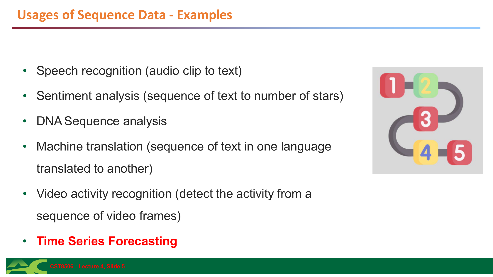

### 📝 Text Content

**Usages of Sequence Data - Examples**

• Speech recognition (audio clip to text)

• Sentiment analysis (sequence of text to number of stars)

• DNA Sequence analysis

• Machine translation (sequence of text in one language

translated to another)

• Video activity recognition (detect the activity from a

sequence of video frames)

• Time Series Forecasting

CST8506 : Lecture 4, Slide

### ✍️ Notes

> **📝 笔记:**
>
> **序列数据应用示例解析 (Usages of Sequence Data):**
>
> - **Speech recognition**: 语音识别，将音频剪辑（非结构化数据）转化为文本序列。
> - **Sentiment analysis**: 情感分析，将文本序列转化为评分（如星级数量），用于理解用户态度。
> - **DNA Sequence analysis**: DNA 序列分析，处理复杂的生物遗传信息序列。
> - **Machine translation**: 机器翻译，实现一种语言文本序列到另一种语言的自动转化。
> - **Video activity recognition**: 视频活动识别，通过分析连续的视频帧序列来检测和识别具体的行为活动。
> - **Time Series Forecasting**: 时间序列预测，基于历史数据序列预测未来的数值发展趋势。

---

## Page 7

### 📷 Page Image

### 📝 Text Content

**Time Series**

• A Time Series is a sequence of data points collected or recorded at

specific time intervals.

• Unlike standard "cross-sectional" data (where you look at a snapshot of

many things at once), time series focuses on one(more) thing over a
duration.

• The X-Axis: Almost always represents time (seconds, days, years).

• The Y-Axis: The variable you are measuring (Price, Temperature,

Population).

• The Goal: To understand the past and, ideally, peer into the future

(Forecasting).
CST8506 : Lecture 4, Slide

### ✍️ Notes

> **📝 笔记:**
>
> **时间序列 (Time Series) 核心定义解析:**
>
> - **定义**: 在特定时间间隔内收集或记录的数据点序列。
> - **对比特点**: 区别于只看瞬间快照的“截面数据”，它侧重于单一变量在持续时间内的演变过程。
> - **X轴 (横轴)**: 几乎固定的代表时间维度（如秒、天、年）。
> - **Y轴 (纵轴)**: 代表被测量的具体变量（如价格、气温、人口数量）。
> - **目标**: 通过对过去规律的深度理解，实现对未来的科学预测 (Forecasting)。

---

## Page 8

### 📷 Page Image

### 📝 Text Content

**Time Series - example**

• Air Passengers

• Non-stationary data

• Mean & sd changes with time

• Seasonal data

• Data from Jan 1949-Dec 1960

Taken from: https://www.kaggle.com/datasets/rakannimer/air-passengers
CST8506 : Lecture 4, Slide

### ✍️ Notes

> **📝 笔记:**
>
> **航空乘客人数 (Air Passengers) 案例分析:**
>
> - **Air Passengers**: 选取航空乘客数量作为典型的时间序列分析案例。
> - **Non-stationary data**: 非平稳数据，表现为数据的统计特性（均值、方差）不随时间保持恒定。
> - **Mean & sd changes with time**: 图表清晰显示均值和标准差随时间推移而发生变化。
> - **Seasonal data**: 具有明显的季节性模式，反映了旅游旺季等周期性规律。
> - **Data Range**: 使用了 1949 年 1 月至 1960 年 12 月的长期历史数据。

---

## Page 9

### 📷 Page Image

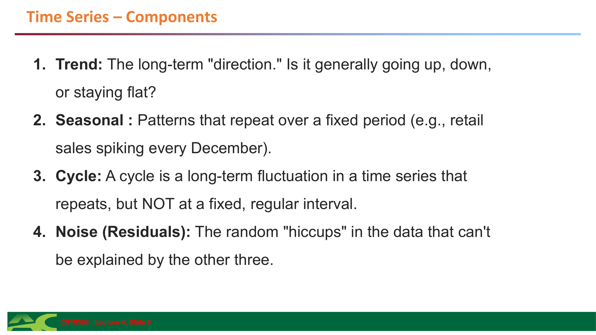

### 📝 Text Content

**Time Series – Components**

1. Trend: The long-term "direction." Is it generally going up, down,
or staying flat?
2. Seasonal : Patterns that repeat over a fixed period (e.g., retail
sales spiking every December).
3. Cycle: A cycle is a long-term fluctuation in a time series that
repeats, but NOT at a fixed, regular interval.
4. Noise (Residuals): The random "hiccups" in the data that can't
be explained by the other three.
CST8506 : Lecture 4, Slide

### ✍️ Notes

> **📝 笔记:**
>
> **时间序列四要素 (Components) 详解:**
>
> - **Trend**: 趋势，揭示数据的长期走向，包括上升、下降或平稳波动的总体方向。
> - **Seasonal**: 季节性，在固定周期（如月、季、年）内重复出现的特定模式。
> - **Cycle**: 周期性，长期的非固定频率波动（不同于季节性的规则周期）。
> - **Noise (Residuals)**: 噪声或残差，排除上述因素后剩余的无法解释的随机干扰项。

---

## Page 10

### 📷 Page Image

### 📝 Text Content

**Time Series – Components**

Original plot
Trend
Seasonal
Residual
CST8506 : Lecture 4, Slide

### ✍️ Notes

> **📝 笔记:**
>
> **成分分解可视化分析 (Components Visualization):**
>
> - **Original plot**: 原始观测数据图，包含所有成分的综合表现。
> - **Trend**: 从原始数据中提取出的平稳长期趋势线。
> - **Seasonal**: 提取出的具有固定频率周期的重复波形。
> - **Residual**: 剔除趋势和季节性后剩下的纯随机噪声部分。

---

## Page 11

### 📷 Page Image

### 📝 Text Content

**Recurrent Neural Networks (RNNs)**

 RNNs are kind of DL models that takes the previous output or hidden
states as inputs. i.e. the composite input at time t has some historical
information about the happenings at time T < t.
 RNNs are useful as their intermediate states can store information about
past inputs for a time that is not fixed.
 In RNNs, each input vector (e.g. word vector) is typically fed into the network
one at a time, not all at once.
CST8506 : Lecture 4, Slide 10

### ✍️ Notes

> **📝 笔记:**
>
> **循环神经网络 (RNNs) 定义与特性:**
>
> - **RNNs 定义**: 一类深度学习模型，将先前的输出或隐藏状态作为当前输入，使时刻 $t$ 的输入包含 $T < t$ 的历史信息。
> - **状态存储**: 其核心优势在于中间状态能够存储非固定时长的前期输入信息。
> - **输入方式**: 在 RNN 中，每个输入向量（如词向量）通常是逐个（one at a time）而非一次性馈入网络的。

---

## Page 12

### 📷 Page Image

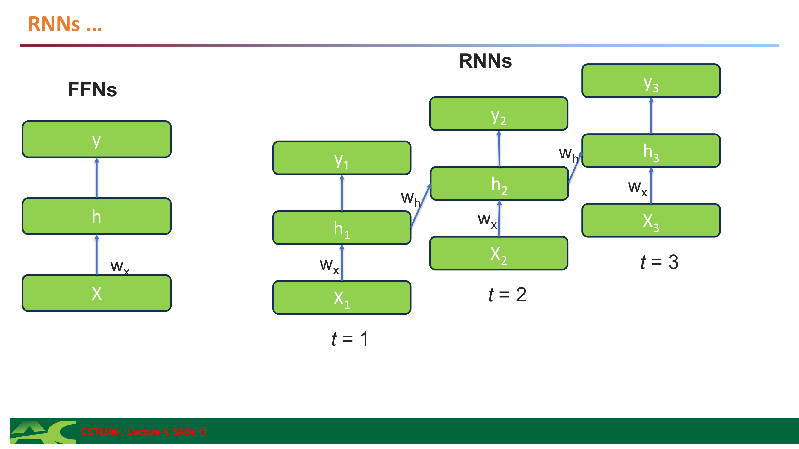

### 📝 Text Content

**RNNs …**

FFNs
y
↑
h
↑
x

RNNs (Unrolling)
y_1      y_2      y_3
↑        ↑        ↑
h_0 → h_1 → h_2 → h_3
↑        ↑        ↑
x_1      x_2      x_3
CST8506 : Lecture 4, Slide 11

### ✍️ Notes

> **📝 笔记:**
>
> **RNN 结构与 FNN 对比图解:**
>
> - **FFNs**: 上方展示了传统前馈网络，数据一次性单向通过，层间无循环。
> - **RNNs (Unrolling)**: 下方图示展示了 RNN 在时间步 t=1、t=2、t=3 的展开。
> - **循环连接**: 图像中带有 W 的圆圈表示循环，展开后显示了隐藏状态 $h$ 如何在各时间步之间传递。

---

## Page 13

### 📷 Page Image

### 📝 Text Content

**RNNs …**

h_t = f(W_x x_t + W_h h_{t-1})

h_t: hidden state at time step t
x_t: input at time step t
W_x and W_h: Weight matrices. Filters that determine the importance of the present input and past information.
 Note that the weights are shared over time
 Essentially, copies of the RNN cell are made over time (unrolling/unfolding), with
different inputs at different time steps.
CST8506 : Lecture 4, Slide 12

### ✍️ Notes

> **📝 笔记:**
>
> **RNN 数学公式与权重共享解析 (RNN Formula & Weight Sharing):**
>
> - **核心公式**: $h_t = f(W_x x_t + W_h h_{t-1})$，定义了时刻 $t$ 的隐藏状态。
> - **变量解释**: $h_t$ 是时刻 $t$ 的隐藏状态，$x_t$ 是当前时刻的输入。
> - **权重矩阵 (W)**: 权重矩阵充当过滤器，决定了当前输入和过去信息对当前状态的影响权重。
> - **权重共享**: 明确说明权重在所有时间步中是共享的 (Shared over time)。
> - **展开机制**: 随时间展开本质上是创建了 RNN 单元的副本，每个副本处理不同时间步的输入。

---

## Page 14

### 📷 Page Image

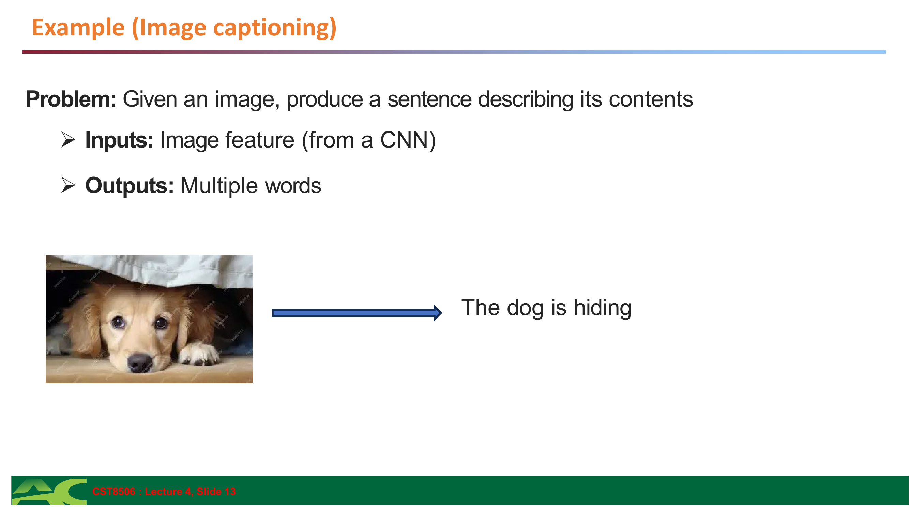

### 📝 Text Content

**Example (Image captioning)**

Problem: Given an image, produce a sentence describing its contents
 Inputs: Image feature (from a CNN)
 Outputs: Multiple words
The dog is hiding
CST8506 : Lecture 4, Slide 13

### ✍️ Notes

> **📝 笔记:**
>
> **图像描述 (Image Captioning) 案例解析:**
>
> - **Problem**: 给定一张图片，生成描述其内容的句子。
> - **Inputs**: 输入是从 CNN 提取的图像特征。
> - **Outputs**: 输出是一系列连续生成的单词。
> - **Example**: 最终生成的句子为 "The dog is hiding"。

---

## Page 15

### 📷 Page Image

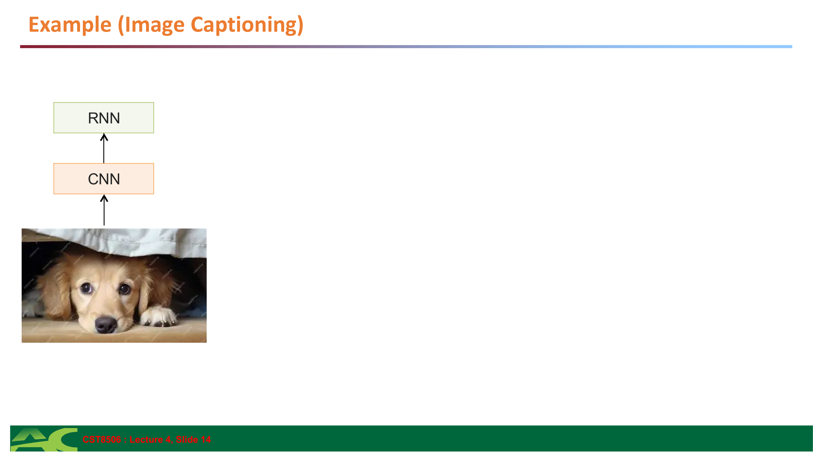

### 📝 Text Content

**Example (Image Captioning)**

RNN
CNN
CST8506 : Lecture 4, Slide 14

### ✍️ Notes

> **📝 笔记:**
>
> **模型编码流向 (Model Encoding Flow):**
>
> - **CNN**: 负责对原始图像进行特征提取和编码。
> - **RNN**: 接收编码后的特征并开始序列生成任务。

---

## Page 16

### 📷 Page Image

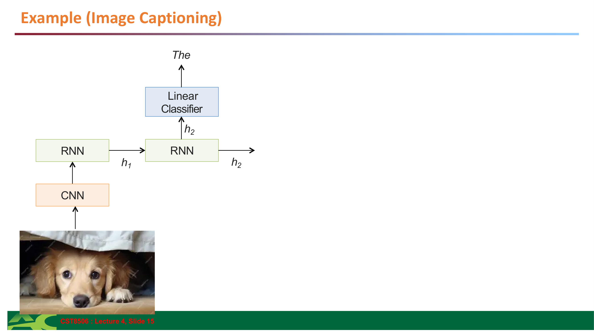

### 📝 Text Content

**Example (Image Captioning)**

The
Linear
Classifier
h
RNN RNN
h h
CNN
CST8506 : Lecture 4, Slide 15

### ✍️ Notes

> **📝 笔记:**
>
> **首词预测机制 (First Word Prediction):**
>
> - **The**: 在第一个时间步预测出单词 "The"。
> - **Linear Classifier**: 通过线性分类层将隐藏状态映射到词空间进行分类。
> - **h**: 隐藏状态传递了图像和已生成词的信息。

---

## Page 17

### 📷 Page Image

### 📝 Text Content

**Example (Image Captioning)**

The dog
h_1  h_2
CNN
CST8506 : Lecture 4, Slide 16

### ✍️ Notes

> **📝 笔记:**
>
> **序列生成的持续性图解 (Sequential Generation):**
>
> - **Inputs**: 此时模型已生成 "The"，其信息通过隐藏状态 $h$ 传给下一步。
> - **The dog**: 展示了预测出第二个单词 "dog" 的过程。
> - **Recurrent Layer**: RNN 副本继续展开，每一层都在接收前一层的上下文信息。
> - **Linear/Classifier**: 输出层继续寻找概率最大的单词。

---

## Page 18

### 📷 Page Image

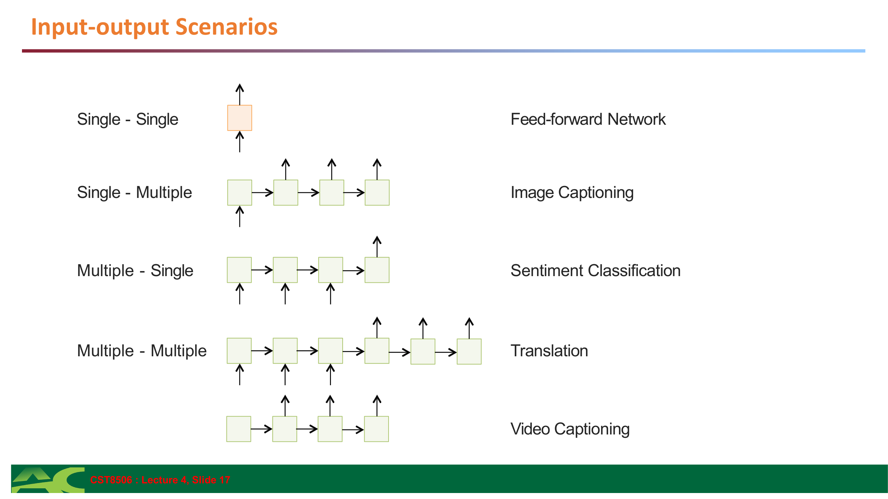

### 📝 Text Content

**Input-output Scenarios**

Single - Single Feed-forward Network
Single - Multiple Image Captioning
Multiple - Single Sentiment Classification
Multiple - Multiple Translation
Video Captioning
CST8506 : Lecture 4, Slide 17

### ✍️ Notes

> **📝 笔记:**
>
> **输入-输出场景 (Scenarios) 对应关系梳理:**
>
> - **Single - Single**: 标准 FNN，如简单的图像归类（图 $\rightarrow$ 标签）。
> - **Single - Multiple**: 图像描述（图 $\rightarrow$ 句子序列）。
> - **Multiple - Single**: 情感分类（评论序列 $\rightarrow$ 正/负评价）。
> - **Multiple - Multiple**: 机器翻译（源语言序列 $\rightarrow$ 目标语言序列）或视频描述。

---

## Page 19

### 📷 Page Image

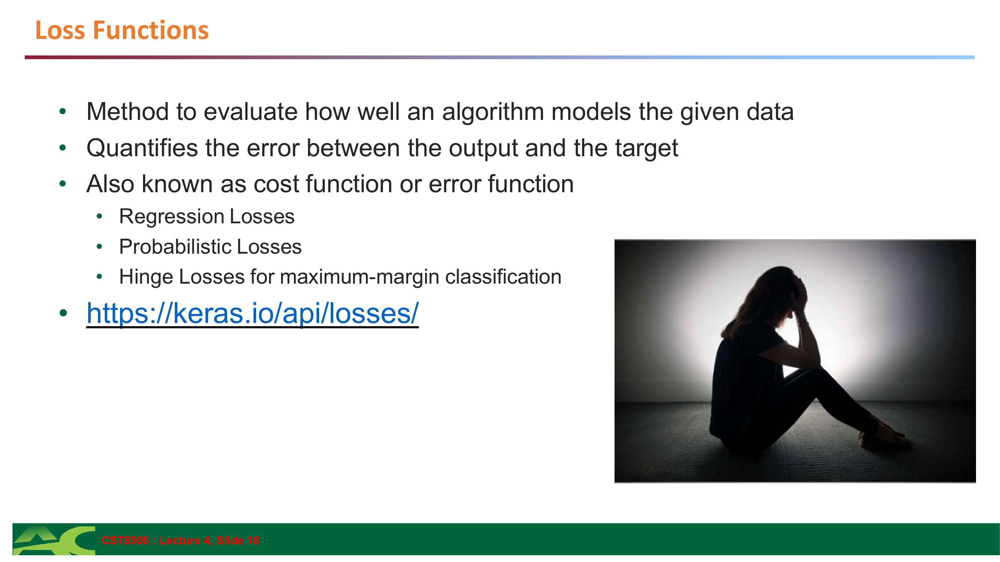

### 📝 Text Content

**Loss Functions**

• Method to evaluate how well an algorithm models the given data

• Quantifies the error between the output and the target

• Also known as cost function or error function

• Regression Losses

• Probabilistic Losses

• Hinge Losses for maximum-margin classification

• https://keras.io/api/losses/

CST8506 : Lecture 4, Slide 18

### ✍️ Notes

> **📝 笔记:**
>
> **损失函数 (Loss Functions) 概念解析:**
>
> - **定义**: 评估算法模型对给定数据的模拟程度。
> - **作用**: 量化输出值与目标值之间的误差。
> - **别名**: 也称为成本函数 (Cost function) 或误差函数 (Error function)。
> - **分类**:
>     - **回归损失**: 用于连续值预测。
>     - **概率损失**: 用于分类概率预测任务。
>     - **合页损失 (Hinge)**: 常用于最大间隔分类任务。

---

## Page 20

### 📷 Page Image

### 📝 Text Content

**Regression Loss Functions**

• Mean Square Error (MSE) / Quadratic Loss / L2 Loss

• Average of the sum of the squared differences between actual value and the predicted

value

• Mean Absolute Error (MAE) / L1 Loss

• Average of the sum of the absolute differences between actual value and the predicted

value

• Robust to outliers since it does not make use of square

• Mean Bias Error

• Average of the sum of the differences between actual value and the predicted value

• Positive and negative values may cancel out – less accurate in practice

• Can be used to see whether model has positive or negative bias

CST8506 : Lecture 4, Slide 19

### ✍️ Notes

> **📝 笔记:**
>
> **回归损失函数详解 (Regression Loss Functions):**
>
> - **MSE (均方误差)**: 实际值与预测值差值的平方之和的平均数。
> - **MAE (平均绝对误差)**: 实际值与预测值差值的绝对值之和的平均数。
>     - **优点**: 对离群点 (Outliers) 鲁棒，因为它不使用平方处理。
> - **MBE (平均偏差误差)**: 差值之和的平均数。
>     - **局限**: 正负值可能抵消，实际精度较低。
>     - **用途**: 检查模型是否存在正向或反向偏差 (Bias)。

---

## Page 21

### 📷 Page Image

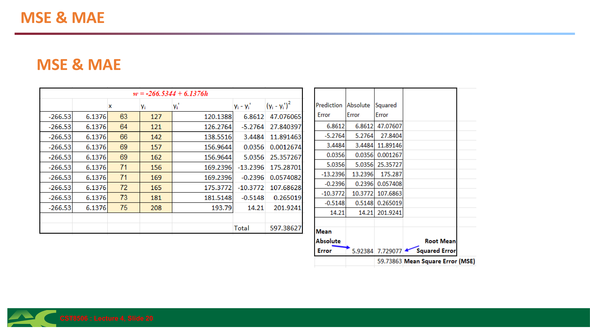

### 📝 Text Content

**MSE & MAE**

CST8506 : Lecture 4, Slide 20

### ✍️ Notes

> **📝 笔记:**
>
> **MSE 与 MAE 可视化对比 (MSE vs MAE):**
>
> - 图像展示了两种误差计算方式的对比。MSE 对较大的误差更为敏感（由于平方处理），而 MAE 则表现得更为平稳，对异常值具有更好的容忍度。

---

## Page 22

### 📷 Page Image

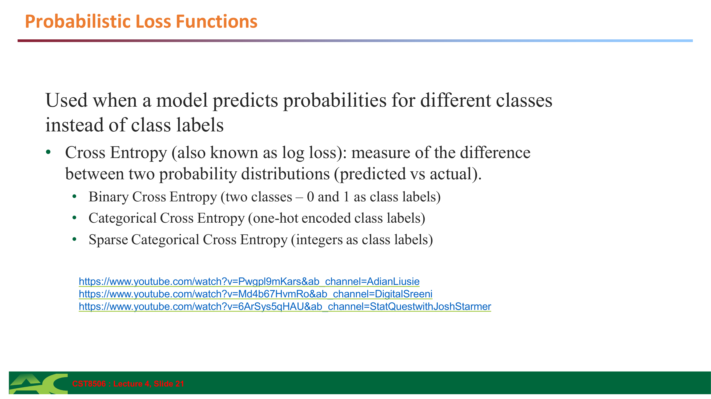

### 📝 Text Content

**Probabilistic Loss Functions**

Used when a model predicts probabilities for different classes
instead of class labels

• Cross Entropy (also known as log loss): measure of the difference between two probability distributions (predicted vs actual).
• Binary Cross Entropy (two classes – 0 and 1 as class labels)
• Categorical Cross Entropy (one-hot encoded class labels)
• Sparse Categorical Cross Entropy (integers as class labels)

https://www.youtube.com/watch?v=Pwgpl9mKars&ab_channel=AdianLiusie
https://www.youtube.com/watch?v=Md4b67HvmRo&ab_channel=DigitalSreeni
https://www.youtube.com/watch?v=6ArSys5qHAU&ab_channel=StatQuestwithJoshStarmer
CST8506 : Lecture 4, Slide 21

### ✍️ Notes

> **📝 笔记:**
>
> **概率损失函数 (Probabilistic Loss Functions) 解析:**
>
> - **适用场景**: 当模型预测的是不同类别的概率而非直接的类标签时使用。
> - **Cross Entropy**: 交叉熵（也称对数损失 log loss），衡量预测概率分布与真实分布之间的差异。
> - **Binary Cross Entropy**: 二元交叉熵，适用于两个类别的分类任务。
> - **Categorical Cross Entropy**: 多分类交叉熵，要求标签为 one-hot 编码格式。
> - **Sparse Categorical Cross Entropy**: 同样用于多分类，但标签直接使用整数索引。

---

## Page 23

### 📷 Page Image

### 📝 Text Content

**Hinge Loss**

• Primarily for classification tasks, especially with SVMs

• Helps maximizes the margin between different classes

• Loss is 0 when the correct class is confidently predicted, but

penalizes predictions that are too close to the decision
boundary

• Requires labels to be -1 and +1 (instead of 0 and 1)

• For multi-class classification: Categorical Hinge Loss

• Can be used in NN

CST8506 : Lecture 4, Slide 22

### ✍️ Notes

> **📝 笔记:**
>
> **合页损失 (Hinge Loss) 特性解析:**
>
> - **主要架构**: 主要用于分类任务，特别是支持向量机 (SVM)。
> - **核心目标**: 帮助最大化不同类别之间的间隔 (Margin)。
> - **惩罚机制**: 当正确类别被自信预测时损失为 0；如果预测结果太靠近分类决策边界，则会产生惩罚。
> - **标签要求**: 要求标签使用 -1 和 +1（而非 0 和 1）。
> - **多分类**: 对应 Categorical Hinge Loss。

---

## Page 24

### 📷 Page Image

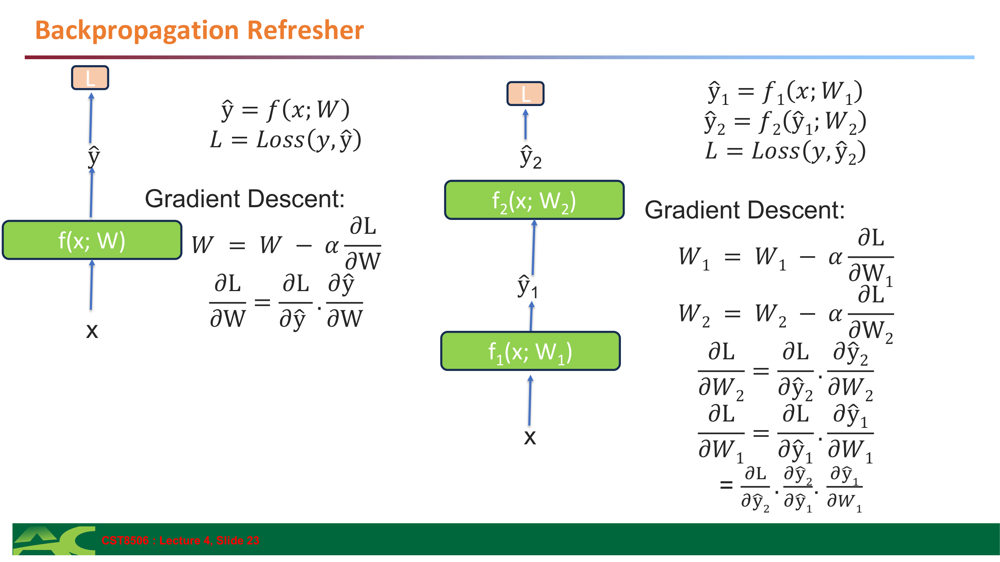

### 📝 Text Content

**Backpropagation Refresher**

Forward Pass:
y_1 = f(x; W_1)
y_2 = f(y_1; W_2)
Loss: L = Loss(y, y_2)

Gradient Descent:
W = W - α * (∂L/∂W)

Chain Rule:
∂L/∂W_2 = (∂L/∂y_2) * (∂y_2/∂W_2)
∂L/∂W_1 = (∂L/∂y_2) * (∂y_2/∂y_1) * (∂y_1/∂W_1)
CST8506 : Lecture 4, Slide 23

### ✍️ Notes

> **📝 笔记:**
>
> **反向传播 (Backpropagation) 复习:**
>
> - **前向计算**: 通过 $y = f(x; W)$ 计算预测值。
> - **损失计算**: $L = Loss(y, y\_hat)$ 量化误差。
> - **权重更新**: 通过梯度下降 $W = W - \alpha \frac{\partial L}{\partial W}$ 进行。
> - **链式法则 (Chain Rule)**: 图像展示了如何通过导数的乘法（如 $\frac{\partial L}{\partial W_2} \cdot \frac{\partial y_2}{\partial W_1}$ 等）将误差从输出层回传至输入层。

---

## Page 25

### 📷 Page Image

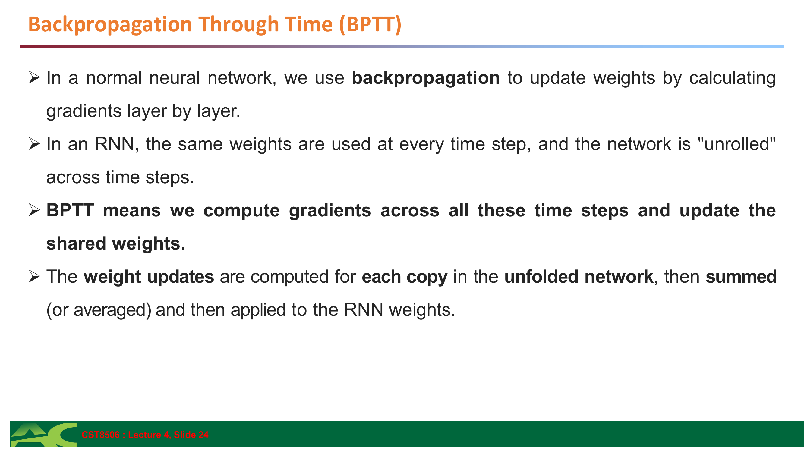

### 📝 Text Content

**Backpropagation Through Time (BPTT)**

 In a normal neural network, we use backpropagation to update weights by calculating
gradients layer by layer.
 In an RNN, the same weights are used at every time step, and the network is "unrolled"
across time steps.

BPTT means we compute gradients across all these time steps and update the
shared weights.
 The weight updates are computed for each copy in the unfolded network, then summed
(or averaged) and then applied to the RNN weights.
CST8506 : Lecture 4, Slide 24

### ✍️ Notes

> **📝 笔记:**
>
> **随时间反向传播 (BPTT) 原理解析:**
>
> - **基本原理**: 在普通神经网络中，反向传播是按层计算的；在 RNN 中，由于权重共享并沿时间展开，反向传播是沿时间步进行的。
> - **展开计算**: BPTT 意味着跨越所有这些展开后的时间步计算梯度，并更新共享权重。
> - **权重汇总**: 每一个副本产生的梯度会被汇总（求和或平均），然后统一应用到 RNN 的权重矩阵上。

---

## Page 26

### 📷 Page Image

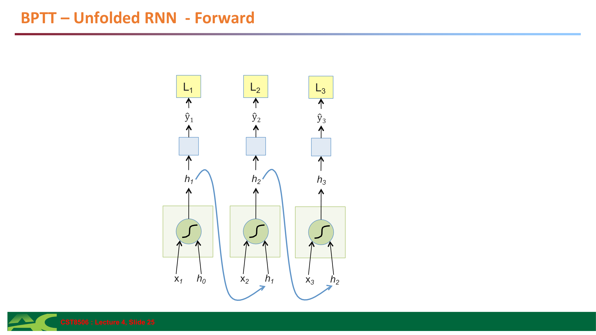

### 📝 Text Content

**BPTT – Unfolded RNN - Forward**

L L L
1 2
y 1 y 2 y
h h h
1 2
x h x h x h
1 0 2 1 3
CST8506 : Lecture 4, Slide 25

### ✍️ Notes

> **📝 笔记:**
>
> **BPTT 前向传播可视化 (BPTT Forward Pass):**
>
> - 展示了展开后的 RNN 前向流动：隐藏状态 $h$ 从 $t=0$ 一直传递到 $t=3$，每个步产生预测值 $\hat{y}$ 和对应的损失 $L$。

---

## Page 27

### 📷 Page Image

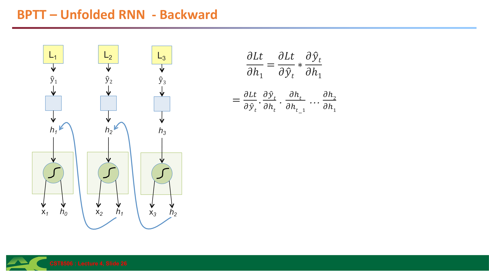

### 📝 Text Content

**BPTT – Unfolded RNN - Backward**

The total gradient of the loss with respect to the weights W is the sum of the gradients at each time step:

∂L/∂W = ∑ (∂L_t / ∂W)

Each ∂L_t / ∂W is calculated using the chain rule, propagating back through the hidden states:
∂L_t / ∂W = (∂L_t / ∂y_t) * (∂y_t / ∂h_t) * (∂h_t / ∂h_{t-1}) * ... * (∂h_1 / ∂W)
CST8506 : Lecture 4, Slide 26

### ✍️ Notes

> **📝 笔记:**
>
> **BPTT 反向传播数学原理 (BPTT Backward Pass):**
>
> - **链式法则图解**: 图像展示了误差如何从损失 $L$ 沿着隐藏状态 $h$ 的反向路径传回。由于权重在每个时刻都是共享的，总梯度是各个时刻梯度的累加。
> - **计算细节**: 公式展示了 $\frac{\partial L}{\partial W}$ 是通过对所有时间步的局部梯度进行求和得到的。

---

## Page 28

### 📷 Page Image

### 📝 Text Content

**Problems with the Vanilla RNN**

 In the same way a product of k real numbers can shrink to zero or explode to
infinity, so can a product of matrices
 Vanishing gradient causes:
 Gradients become extremely small as they propagate backward.
 The first layers (or earliest time steps in RNN) receive almost no updates.
 The network fails to learn long-term dependencies.
CST8506 : Lecture 4, Slide 27

### ✍️ Notes

> **📝 笔记:**
>
> **普通 (Vanilla) RNN 的局限性:**
>
> - **数值稳定性问题**: 就像多个实数相乘会导致数值爆炸或归零一样，矩阵序列相乘（展开后的深层结构）也会导致类似问题。
> - **梯度消失 (Vanishing Gradient) 的后果**:
>     - 梯度在传回到早期层或早期时刻时变得极其微小。
>     - 导致网络前面的权重几乎得不到有效更新。
>     - **长程依赖失效**: 网络无法“记住”并利用较远的历史信息。

---

## Page 29

### 📷 Page Image

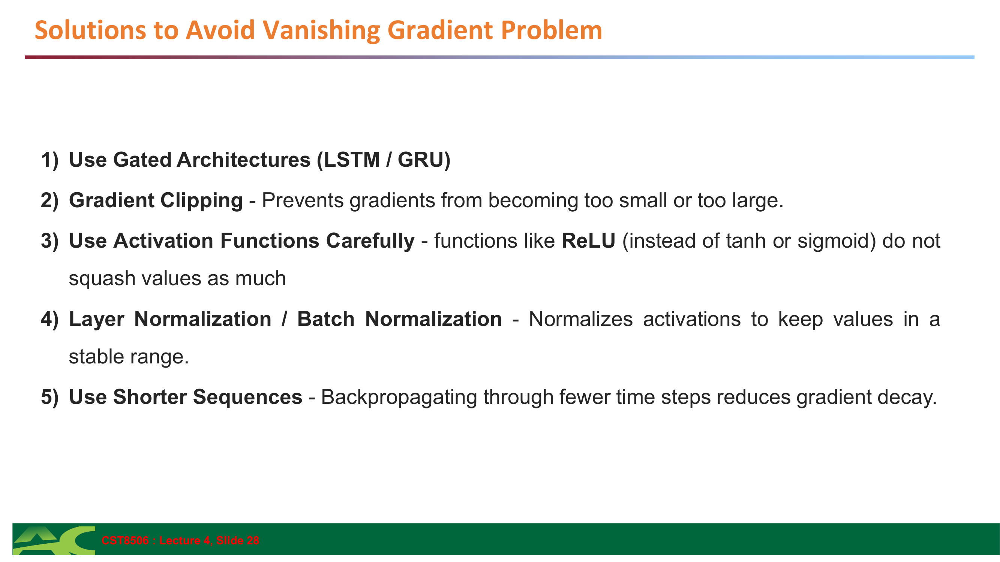

### 📝 Text Content

**Solutions to Avoid Vanishing Gradient Problem**

1) Use Gated Architectures (LSTM / GRU)
2) Gradient Clipping - Prevents gradients from becoming too small or too large.
3) Use Activation Functions Carefully - functions like ReLU (instead of tanh or sigmoid) do not
squash values as much
4) Layer Normalization / Batch Normalization - Normalizes activations to keep values in a
stable range.
5) Use Shorter Sequences - Backpropagating through fewer time steps reduces gradient decay.
CST8506 : Lecture 4, Slide 28

### ✍️ Notes

> **📝 笔记:**
>
> **克服梯度消失的五大方案 (Solutions to Vanishing Gradient):**
>
> 1. **门控架构**: 使用 LSTM 或 GRU 等能够主动管理记忆的结构。
> 2. **梯度裁剪 (Gradient Clipping)**: 强制限制梯度的大小，防止其过大（爆炸）或过小。
> 3. **激活函数选择**: 使用 ReLU 而非 tanh 或 sigmoid，因为它在正半轴没有饱和区，减缓了梯度衰减。
> 4. **归一化 (Batch/Layer Norm)**: 将激活值保持在稳定范围内，防止数值发散。
> 5. **缩短序列**: 减少反向传播的时间步长，直接降低梯度衰减风险。

---

## Page 30

### 📷 Page Image

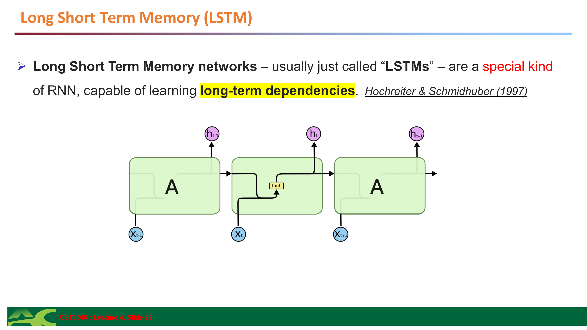

### 📝 Text Content

**Long Short Term Memory (LSTM)**

 Long Short Term Memory networks – usually just called “LSTMs” – are a special kind
of RNN, capable of learning long-term dependencies. Hochreiter & Schmidhuber (1997)
CST8506 : Lecture 4, Slide 29

### ✍️ Notes

> **📝 笔记:**
>
> **长短期记忆网络 (LSTM) 简介:**
>
> - **定义**: 一种特殊的 RNN 架构，专门设计用于学习“长程依赖关系” (Long-term dependencies)。
> - **历史背景**: 由 Hochreiter 和 Schmidhuber 在 1997 年提出，是目前处理序列数据的工业级标准方案。

---

## Page 31

### 📷 Page Image

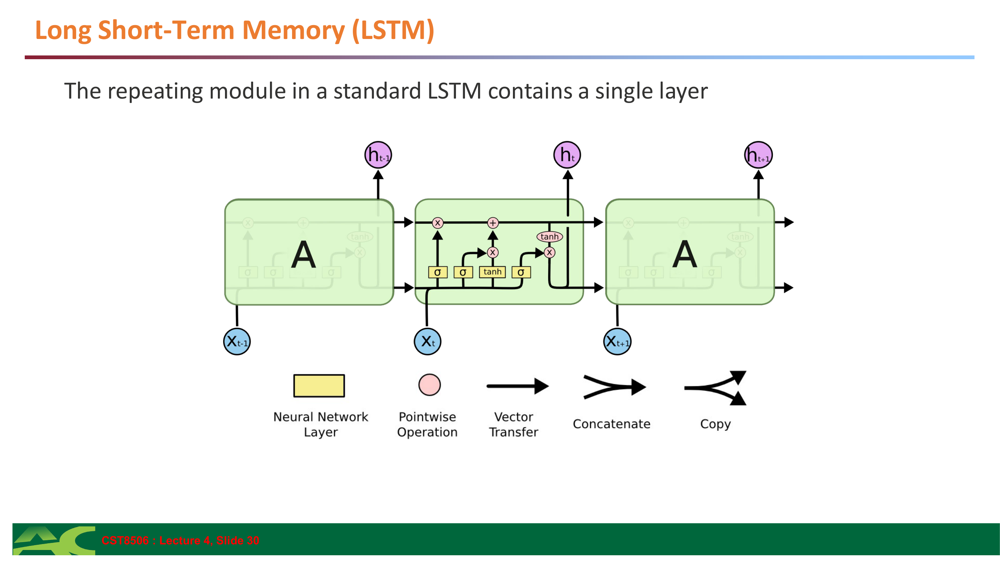

### 📝 Text Content

**Long Short-Term Memory (LSTM)**

The repeating module in a standard LSTM contains a single layer
CST8506 : Lecture 4, Slide 30

### ✍️ Notes

> **📝 笔记:**
>
> **LSTM 内部结构概览 (LSTM Internal Structure):**
>
> - 图像展示了标准 LSTM 的重复单元结构。与 Vanilla RNN 不同的是，它内部包含了更加复杂的交互层级（门控机制），从而实现更灵活的信息管理。

---

## Page 32

### 📷 Page Image

### 📝 Text Content

**Long Short-Term Memory (LSTM)**

 The core idea behind LSTMs is the cell state.
 The LSTM has the ability to remove or add information to the cell state : thanks to gates
 Gates are composed out of a sigmoid neural net layer and a pointwise multiplication
operation
CST8506 : Lecture 4, Slide 31

### ✍️ Notes

> **📝 笔记:**
>
> **LSTM 核心概念 - 细胞状态与门控 (Cell State & Gates):**
>
> - **细胞状态 (Cell State)**: LSTM 的核心思想，像一条传送带贯穿整个链条，只进行少量的线性交互。
> - **能力**: 能够根据需要移除或添加信息到细胞状态中。
> - **门结构**: 由 Sigmoid 神经网络层和逐点乘法操作组成，负责选择性通过信息。

---

## Page 33

### 📷 Page Image

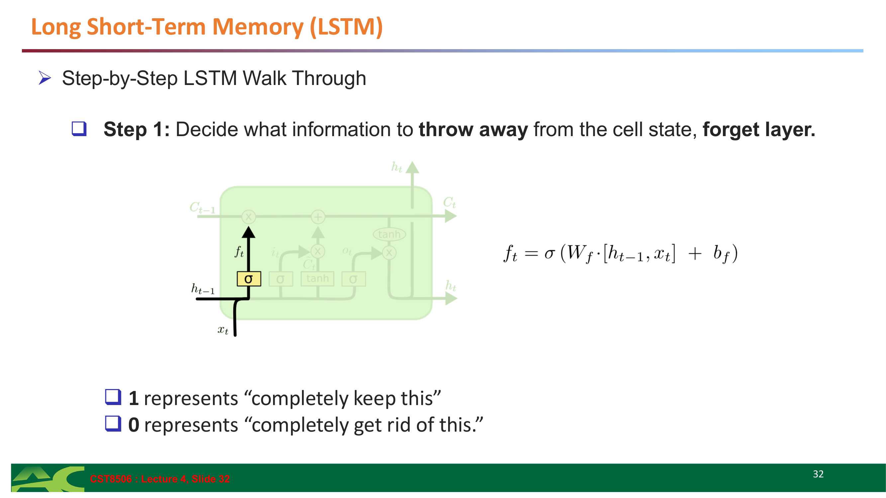

### 📝 Text Content

**Long Short-Term Memory (LSTM)**

 Step-by-Step LSTM Walk Through
 Step 1: Decide what information to throw away from the cell state, forget layer.
 1 represents “completely keep this”
 0 represents “completely get rid of this.”
CST8506 : Lecture 4, Slide 32

### ✍️ Notes

> **📝 笔记:**
>
> **步骤 1：遗忘门 (Forget Gate):**
>
> - **任务**: 决定从细胞状态中丢弃哪些旧信息。
> - **机制**: 逻辑层输出 1 代表“完全保留”，输出 0 代表“完全丢弃”。

---

## Page 34

### 📷 Page Image

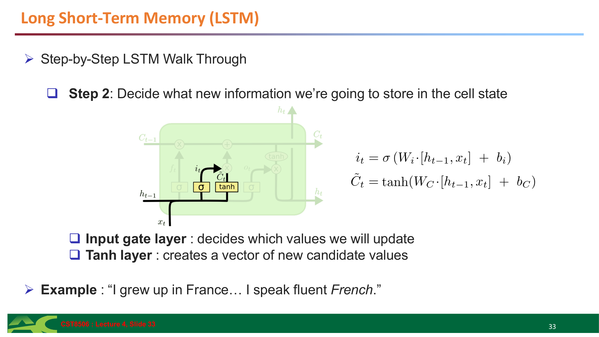

### 📝 Text Content

**Long Short-Term Memory (LSTM)**

 Step-by-Step LSTM Walk Through
 Step 2: Decide what new information we’re going to store in the cell state
 Input gate layer (i_t): decides which values we will update
 Tanh layer (C̃_t): creates a vector of new candidate values
 Example: “I grew up in France… I speak fluent French.”
CST8506 : Lecture 4, Slide 33 33

### ✍️ Notes

> **📝 笔记:**
>
> **步骤 2：输入门 (Input Gate):**
>
> - **任务**: 确定要将哪些新信息存储到细胞状态中。
> - **输入门层**: 决定更新哪些值。
> - **Tanh 层**: 创建一个新的候选值向量。
> - **Example**: 在“我生长在法国...我会流利的法语”例子中，模型需要记住“法国”这个关键上下文。

---

## Page 35

### 📷 Page Image

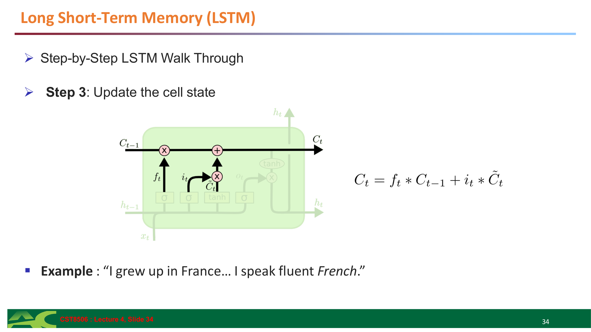

### 📝 Text Content

**Long Short-Term Memory (LSTM)**

 Step-by-Step LSTM Walk Through
 Step 3: Update the cell state (C_t)
 C_t = f_t * C_{t-1} + i_t * C̃_t
 Example: “I grew up in France… I speak fluent French.”
CST8506 : Lecture 4, Slide 34 34

### ✍️ Notes

> **📝 笔记:**
>
> **步骤 3：更新细胞状态 (Update Cell State):**
>
> - **执行**: 将旧状态通过遗忘门处理，再加上输入门筛选出的新候选值，从而完成细胞状态的真正更新。

---

## Page 36

### 📷 Page Image

### 📝 Text Content

**Long Short-Term Memory (LSTM)**

 Step-by-Step LSTM Walk Through
 Step 4: Decide what is the output (h_t)
 h_t = o_t * tanh(C_t)
 Example : “I grew up in France… I speak fluent French.”
CST8506 : Lecture 4, Slide 35

### ✍️ Notes

> **📝 笔记:**
>
> **步骤 4：决定输出 (Output Gate):**
>
> - **任务**: 基于细胞状态决定最终输出什么内容。
> - **机制**: 细胞状态通过 Tanh 层后乘以 Sigmoid 层（输出门）的结果，确定最终隐藏状态 $h_t$。

---

## Page 37

### 📷 Page Image

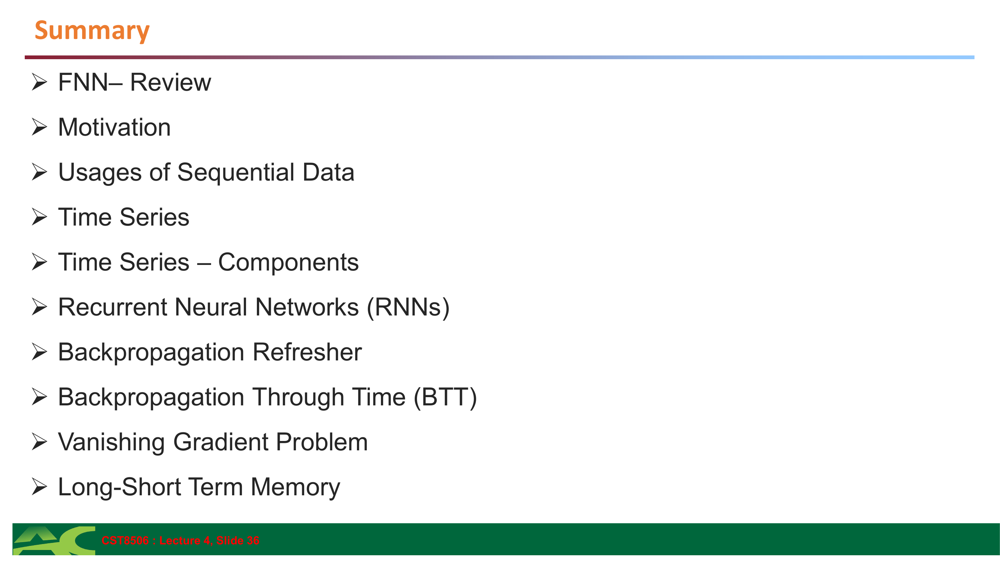

### 📝 Text Content

**Summary**

 FNN– Review
 Motivation
 Usages of Sequential Data
 Time Series
 Time Series – Components
 Recurrent Neural Networks (RNNs)
 Backpropagation Refresher
 Backpropagation Through Time (BTT)
 Vanishing Gradient Problem
 Long-Short Term Memory
CST8506 : Lecture 4, Slide 36

### ✍️ Notes

> **📝 笔记:**
>
> **全课总结 (Summary):**
>
> - **回顾与动机**: 从 FNN 的局限性引出处理序列数据的必要性。
> - **核心概念**: 深入学习了时间序列要素、RNN 基础、权重共享及展开机制。
> - **算法挑战**: 探讨了梯度消失问题及其解决方案 BPTT。
> - **高级架构**: 重点剖析了 LSTM 通过门控机制解决长期依赖问题的原理。

---

## Page 38

### 📷 Page Image

### 📝 Text Content

**CST8506 : Lecture 4, Slide 37**

### ✍️ Notes

> **📝 笔记:**
>
> **延伸学习资源 (Further Learning Resources):**
>
> - 提供了一系列关于 RNN、LSTM 和 BPTT 的深度教学视频（如 StatQuest, DigitalSreeni 等频道），适合后续巩固复习。

---
