# Week 1: 数据预处理与降维 (Data Preprocessing and Dimensionality Reduction)

> Source: `01_CST8506_Preprocessing4.pdf`
> Total slides: 28
> Instructor: Dr. Anu Thomas

---

## 1. 机器学习回顾与 CRISP-DM (Recap & CRISP-DM)

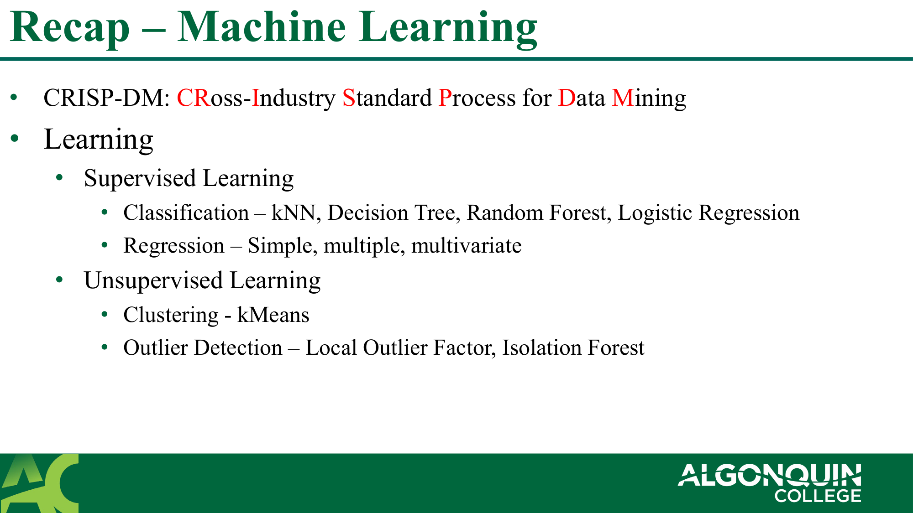

**Recap - Machine Learning:** Text list of learning types (Supervised vs Unsupervised) and common algorithms like classification, regression, clustering, and outlier detection.

**机器学习回顾：** 列出了监督学习（分类、回归）和无监督学习（聚类、异常检测）及常用算法。

- **CRISP-DM:** CRoss-Industry Standard Process for Data Mining — **CRISP-DM:** 跨行业数据挖掘标准流程
- **Learning** — **学习**
- **Supervised Learning** — **监督学习**
  - **Classification** – kNN, Decision Tree, Random Forest, Logistic Regression — **分类** – kNN、决策树、随机森林、逻辑回归
  - **Regression** – Simple, multiple, multivariate — **回归** – 简单、多元、多变量回归
- **Unsupervised Learning** — **无监督学习**
  - **Clustering** - kMeans — **聚类** - kMeans
  - **Outlier Detection** – Local Outlier Factor, Isolation Forest — **异常检测** – 局部异常因子、孤立森林

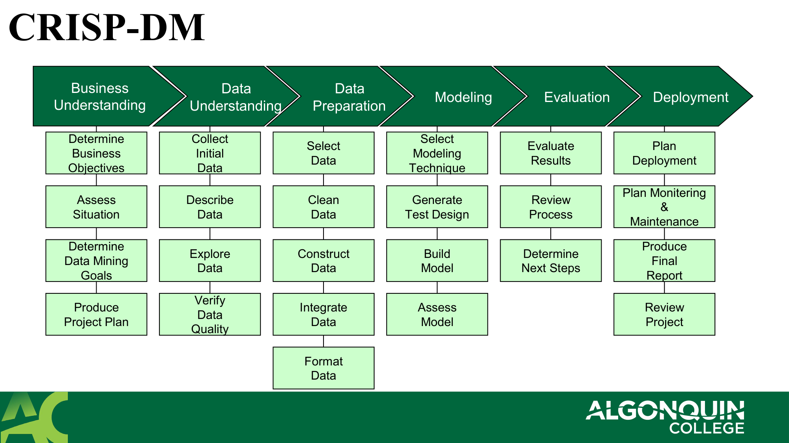

**CRISP-DM Process Diagram:** Flowchart showing the steps of the CRoss-Industry Standard Process for Data Mining, from Business Understanding to Deployment.

**CRISP-DM 流程图：** 展示了跨行业数据挖掘标准流程的步骤，从业务理解一直到部署评估。

- Diagram showing: Business Understanding, Data Understanding, Data Preparation, Modeling, Evaluation, Deployment — 图表展示：业务理解、数据理解、数据准备、建模、评估、部署

> **📝 Notes:**
>
> **📌 What:**
> **(1) CRISP-DM:**
>
> The CRoss-Industry Standard Process for Data Mining. It's an industry-proven methodology providing a structured approach to planning a data mining project.
>
> > > 跨行业数据挖掘标准流程。它是一种经过行业验证的方法论，为规划数据挖掘项目提供了结构化的方法。
>
> **🎯 Why:**
> **(1) Standardized Workflow (标准化工作流):**
>
> ML projects can be chaotic. CRISP-DM provides a predictable framework ensuring we don't skip critical steps like data preparation or business evaluation.
>
> > > 机器学习项目可能很混乱。CRISP-DM 提供了可预测的框架，确保我们不会跳过关键步骤（如数据准备或业务评估）。
>
> **⚠️ Pitfall:**
> **(1) Model-first trap (模型优先陷阱):**
>
> Jumping straight to modeling without proper Business Understanding and Data Preparation is the #1 reason data science projects fail.
>
> > > 没有充分的业务理解和数据准备就直接跳到建模，是数据科学项目失败的首要原因。

---

## 2. 数据预处理 (Preprocessing)

### 2.1 预处理流程 (Preprocessing Steps)

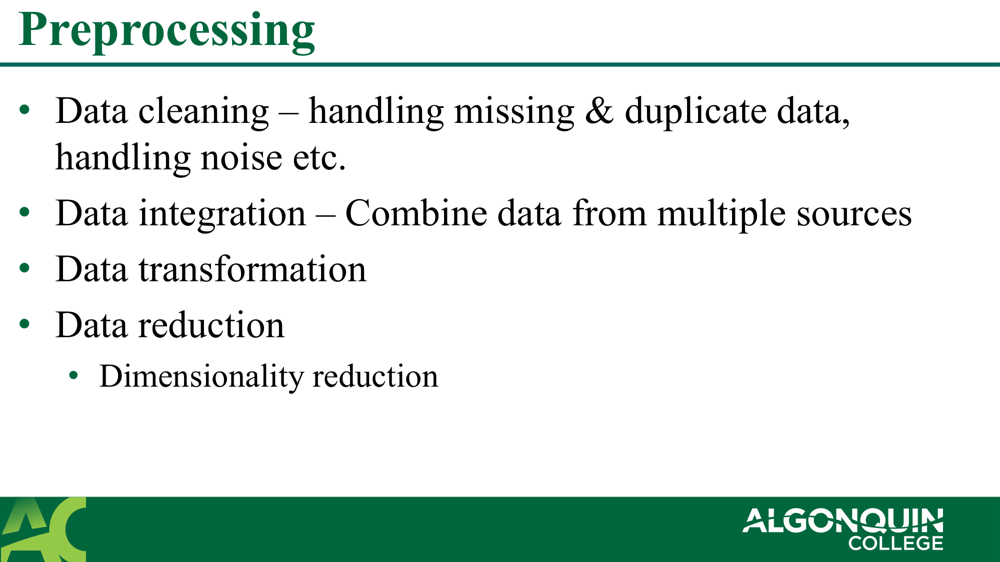

**Preprocessing Steps:** Bulleted list of the main components of data preprocessing, including cleaning, integration, transformation, and reduction.

**预处理步骤：** 列出了数据预处理的主要组成部分，包括清洗、集成、转换和缩减。

- **Data cleaning** – handling missing & duplicate data, handling noise etc. — **数据清洗** – 处理缺失值和重复数据、处理噪声等。
- **Data integration** – Combine data from multiple sources — **数据集成** – 合并来自多个来源的数据
- **Data transformation** — **数据转换**
- **Data reduction** — **数据归约**
- **Dimensionality reduction** — **降维**

### 2.2 数据转换与缩放 (Data Transformation and Scaling)

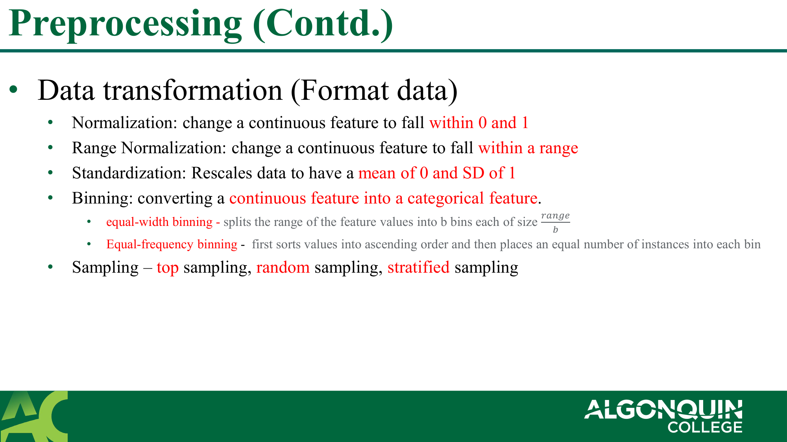

**Data Transformation Details:** Detailed list of methods for transforming data, including kinds of normalization, standardization, binning, and sampling.

**数据转换详情：** 详细列出了转换数据的方法，包括各种归一化、标准化、分箱和采样。

- **Data transformation** (Format data) — **数据转换**（格式化数据）
- **Normalization:** change a continuous feature to fall within 0 and 1 — **归一化：** 改变连续特征的值使其落在 0 和 1 之间
- **Range Normalization:** change a continuous feature to fall within a range — **范围归一化：** 将连续特征缩放到特定范围内
- **Standardization:** Rescales data to have a mean of 0 and SD of 1 — **标准化：** 重新缩放数据使其均值为0，标准差为1
- **Binning:** converting a continuous feature into a categorical feature. — **分箱：** 将连续特征转化为分类特征。
  - **equal-width binning** - splits the range of the feature values into b bins each of size — **等宽分箱** - 将特征值的范围划分为大小相等的 b 个箱子
  - **Equal-frequency binning** - first sorts values into ascending order and then places an equal number of instances into each bin — **等频分箱** - 首先将值按升序排列，然后在每个箱子中放入相等数量的实例
- **Sampling** – top sampling, random sampling, stratified sampling — **采样** – 顶部采样、随机采样、分层采样

> **📝 Notes:**
>
> **🎯 Why:**
> **(1) Scale Sensitivity (量纲敏感性):**
>
> Algorithms based on distance (kNN, K-Means) or gradient descent (Neural Networks) are highly sensitive to the scale of features. Larger-scale features will dominate the modeling process.
>
> > > 基于距离（kNN、K-Means）或梯度下降（神经网络）的算法对特征尺度非常敏感。大尺度的特征会主导建模过程。
>
> **(2) Binning for Non-linearity (分箱用于非线性):**
>
> Binning converts continuous values into categories, which helps linear models capture non-linear relationships and reduces the impact of minor observation errors.
>
> > > 分箱将连续值转换为类别，有助于线性模型捕捉非线性关系，并降低微小观测误差的影响。
>
> **⚖️ Compare:**
> | Feature | Normalization (Min-Max) | Standardization (Z-score) |
> |---|---|---|
> | Boundaries | Fixed range (typically [0, 1]) | Unbounded |
> | Outlier Impact | Very sensitive (bounds get squashed) | Robust, preserves distribution |
> | Formula | (x - min) / (max - min) | (x - mean) / std |
>
> > > | 区别       | 归一化 (Min-Max)          | 标准化 (Z-score) |
> > > | ---------- | ------------------------- | ---------------- |
> > > | 边界       | 固定范围（通常是 [0, 1]） | 无界             |
> > > | 异常值影响 | 非常敏感（边界会被压缩）  | 稳健，保留分布   |
> > > | 公式       | (x - min) / (max - min)   | (x - mean) / std |
>
> **⚠️ Pitfall:**
> **(1) Fit on Train, Transform on Test (在训练集上拟合，在测试集上转换):**
>
> When scaling data, always calculate parameters (min, max, mean, SD) on the TRAINING set only, then use those parameters to transform both train and test. Fit-transforming the test set separately causes data leakage.
>
> > > 缩放数据时，必须始终仅在 训练集 上计算参数（最小、最大、均值、标准差），然后使用这些参数转换训练集和测试集。如果对测试集单独进行fit-transform会导致数据泄露。

---

## 3. 降维概述 (Overview of Dimensionality Reduction)

### 3.1 高维度的缺点 (Drawbacks of High Dimensionality)

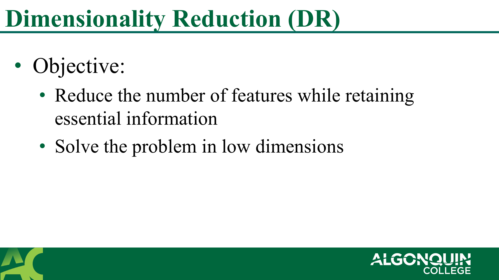

**Dimensionality Reduction Objective:** Lists the goals of DR — reducing features while keeping information to solve problems in low dimensions.

**降维目标：** 列出降维的目标 — 减少特征数量同时保留信息，在低维度下解决问题。

- **Objective:** — **目标：**
  - Reduce the number of features while retaining **essential information** — 减少特征数量的同时保留**基本信息**
  - Solve the problem in low dimensions — 在低维度下解决问题

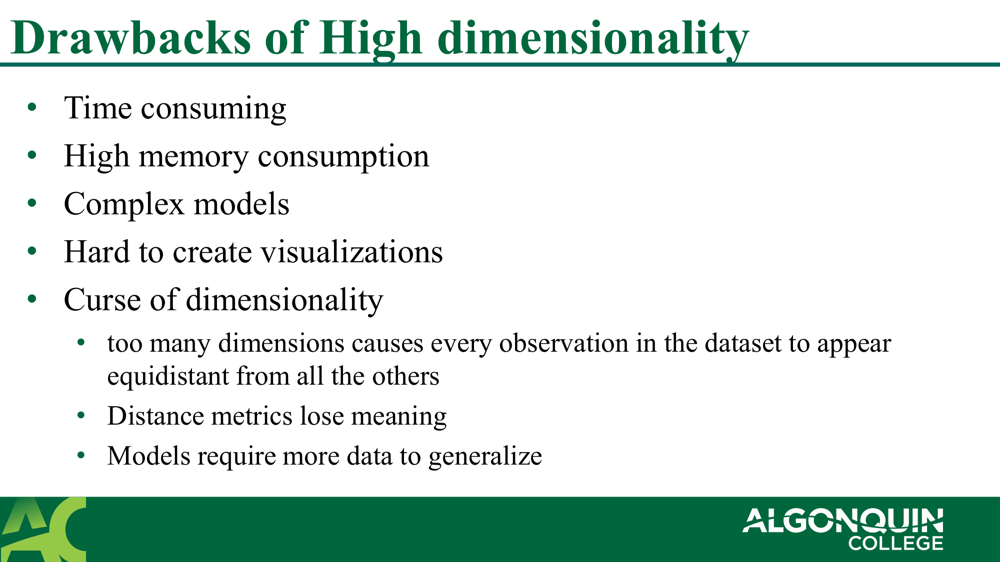

**Drawbacks of High Dimensionality:** Explains why too many features are bad: high cost, complex models, and the "Curse of Dimensionality".

**高维度的缺点：** 解释了为什么特征太多不好：成本高、模型复杂，以及"维度灾难"。

- **Time consuming** — **耗时**
- **High memory consumption** — **内存消耗大**
- **Complex models** — **模型复杂**
- **Hard to create visualizations** — **难以创建可视化**
- **Curse of dimensionality** — **维度灾难**
  - too many dimensions causes every observation in the dataset to appear **equidistant** from all the others — 发特征过多导致数据集中的每一个观察结果显得与其他所有观察结果**等距**
  - Distance metrics lose meaning — 距离度量失去意义
  - Models require more data to generalize — 模型需要更多的数据来泛化

### 3.2 特征选择 vs 特征提取 (Feature Selection vs Extraction)

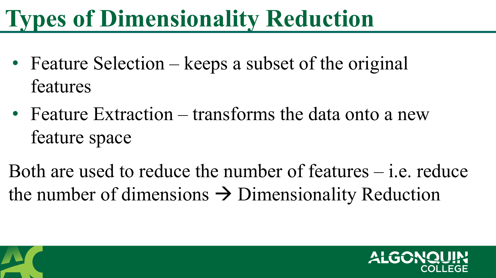

**Types of Dimensionality Reduction:** Compares Feature Selection (keeping a subset) with Feature Extraction (transforming into a new space).

**降维类型：** 比较特征选择（保留子集）和特征提取（转换到新空间）。

- **Feature Selection** – keeps a subset of the original features — **特征选择** – 保留原始特征的一个子集
- **Feature Extraction** – transforms the data onto a new feature space — **特征提取** – 将数据转换到一个新的特征空间
- Both are used to reduce the number of features – i.e. reduce the number of dimensions → Dimensionality Reduction — 两者都用于减少特征数量——即减少维度 → 降维

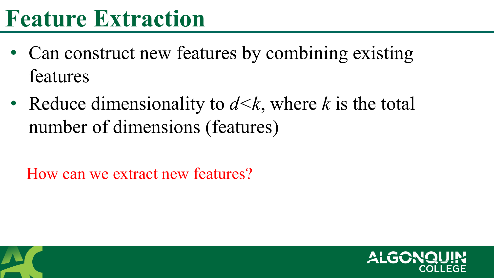

**Feature Extraction:** Explains that new features are constructed by combining existing ones, reducing dimensions from k to d (d < k).

**特征提取：** 解释了通过组合现有特征来构建新特征，将维度从k减少到d（d < k）。

- Can construct new features by combining existing features — 可以通过组合现有特征来构建新特征
- Reduce dimensionality to d<k, where k is the total number of dimensions (features) — 将维度降低到 d<k，其中 k 是维度的总数（特征数）
- How can we extract new features? — 我们如何提取新特征？

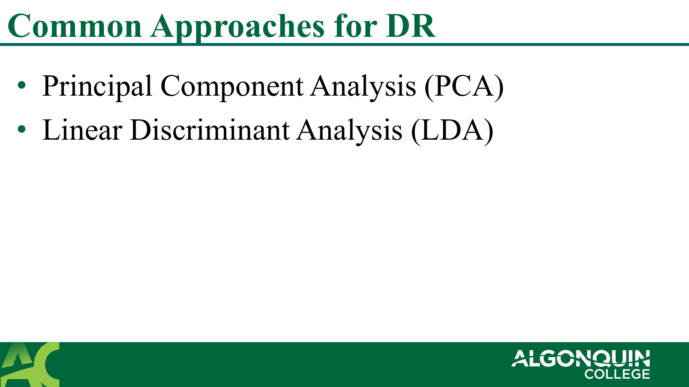

**Common Approaches for DR:** Lists PCA and LDA as the two common techniques.

**常见降维方法：** 列出 PCA 和 LDA 作为两种常用技术。

- **Principal Component Analysis (PCA)** — **主成分分析 (PCA)**
- **Linear Discriminant Analysis (LDA)** — **线性判别分析 (LDA)**

> **📝 Notes:**
>
> **📌 What:**
> **(1) Curse of Dimensionality (维度灾难):**
>
> As dimensions increase, the volume of the space increases exponentially, making data sparse.
>
> > > 随着维度增加，空间的体积呈指数级增长，使得数据变得极其稀疏。
>
> **🎯 Why:**
> **(1) Distance loses meaning (距离失去意义):**
>
> In extremely high dimensions, the distance between the nearest and farthest data point becomes negligibly small. Everything is almost equidistant to everything else, breaking distance-based algorithms like kNN.
>
> > > 在超高维度中，最近点和最远点之间的距离差异变得微小。所有点彼此之间的距离几乎相等，这破坏了像kNN这样基于距离的算法。
>
> **💡 Intuition:**
> **(1) The Empty Room Analogy (空屋迷失类比):**
>
> Placing 10 points on a 1D line of length 10 makes them somewhat close. Placing 10 points in a 10x10 2D square makes them farther apart. Placing 10 points in a huge 10-dimensional hypercube makes them incredibly isolated.
>
> > > 把10个点放在长度为10的1维线上，它们挨得有点近。放在10x10的2维按正方形里，它们离得更远。放在巨大的10维超立方体里，它们变得无比孤立稀疏。
>
> **⚖️ Compare:**
> | Feature | Feature Selection | Feature Extraction |
> |---|---|---|
> | Action | Drops some columns, keeps others | Creates entirely new columns |
> | Meaning | Original features kept their meaning | New features are mathematical blends (hard to interpret) |
> | Example | Keep "Age", drop "Height" | PC1 = 0.5\*Age - 0.2\*Height |
>
> > > | 特性 | 特征选择               | 特征提取                     |
> > > | ---- | ---------------------- | ---------------------------- |
> > > | 动作 | 丢弃某些列，保留其他列 | 创建全新的列                 |
> > > | 意义 | 保留的原始特征含义不变 | 新特征是数学组合（难以解释） |
> > > | 例子 | 保留"年龄"，丢弃"身高" | PC1 = 0.5*年龄 - 0.2*身高    |

---

## 4. 主成分分析 (Principal Component Analysis - PCA)

### 4.1 PCA 是如何工作的？ (How does PCA work?)

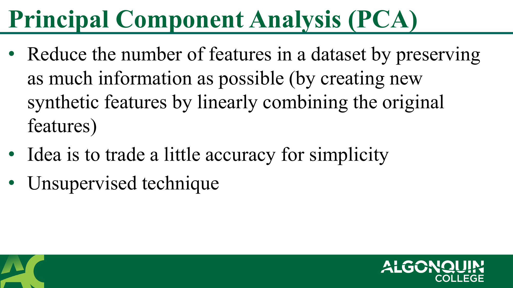

**PCA Introduction:** Describes PCA as preserving information by creating synthetic features via linear combination and trading accuracy for simplicity.

**PCA 简介：** 将 PCA 描述为通过线性组合合成特征来保留信息，并用准确性换取简单性。

- Reduce the number of features in a dataset by preserving as much information as possible (by creating new synthetic features by linearly combining the original features) — 通过尽可能多地保留信息来减少数据集中的特征数量（通过原始特征的线性组合创建新的合成特征）
- Idea is to trade a little accuracy for simplicity — 核心思想是用少许的准确性换取模型的简单性
- **Unsupervised technique** — **无监督技术**

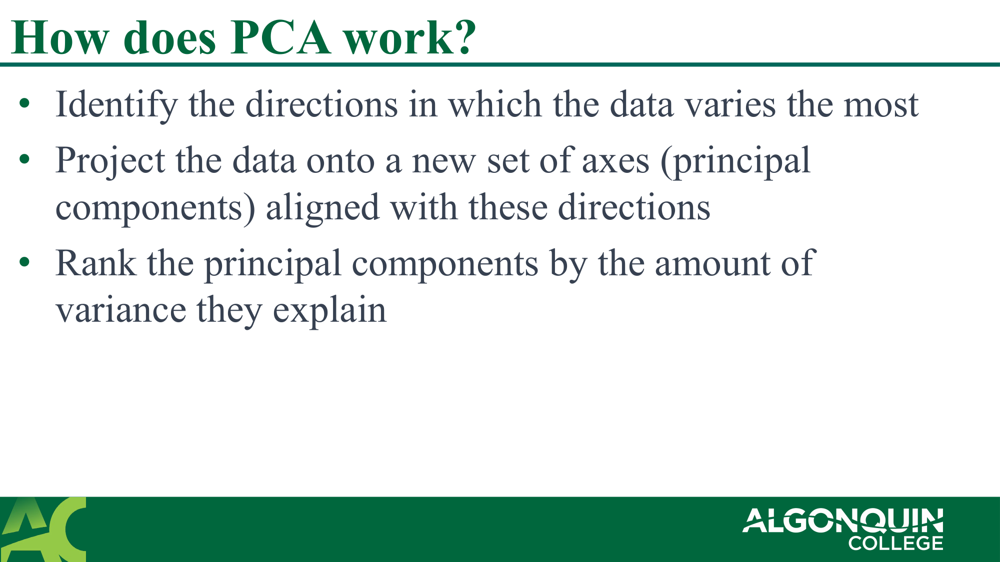

**How Does PCA Work:** Explains finding directions of most variance and projecting data onto these new axes (principal components).

**PCA 是如何工作的：** 解释了寻找数据方差最大方向，并将数据投影到这些新轴（主成分）上。

- Identify the directions in which the data varies the most — 识别数据变化（方差）最大的方向
- Project the data onto a new set of axes (principal components) aligned with these directions — 将数据投影到与这些方向对齐的一组新轴（主成分）上
- Rank the principal components by the amount of variance they explain — 根据所解释的方差大小对主成分进行排名

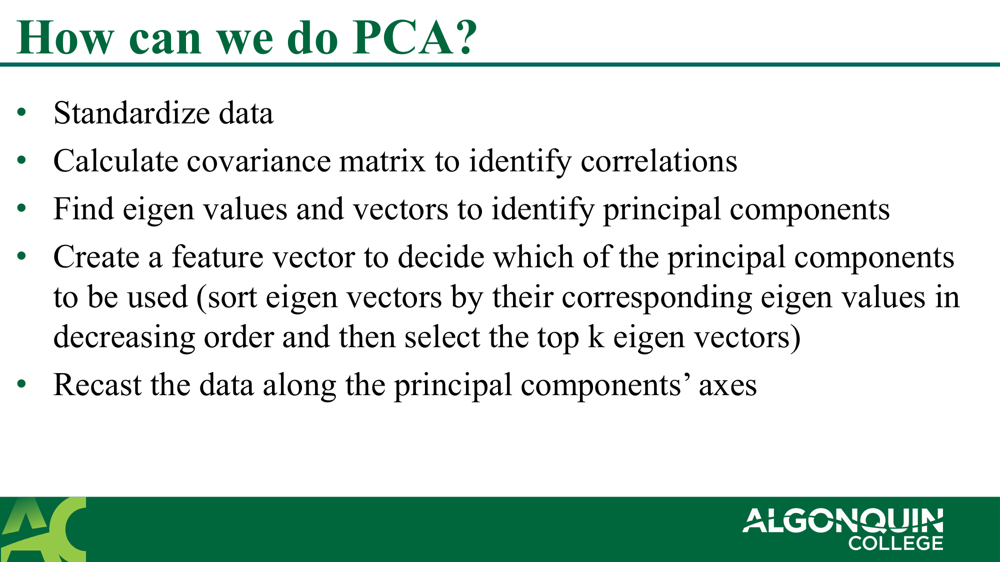

**PCA Steps Checklists:** Lists the 5 concrete steps involved in running PCA.

**PCA 步骤清单：** 运行 PCA 所涉及的 5 个具体步骤。

- **Standardize data** — **标准化数据**
- Calculate **covariance matrix** to identify correlations — 计算**协方差矩阵**以识别相关性
- Find **eigen values** and **vectors** to identify principal components — 寻找**特征值**和**特征向量**以确定主成分
- Create a feature vector to decide which of the principal components to be used (sort eigen vectors by their corresponding eigen values in decreasing order and then select the top k eigen vectors) — 创建一个特征向量来决定使用哪些主成分（将特征向量按对应特征值降序排列，然后选择前 k 个特征向量）
- Recast the data along the principal components’ axes — 沿着主成分的轴重新转换数据

### 4.2 第1步：数据标准化 (Step 1 – Standardize data)

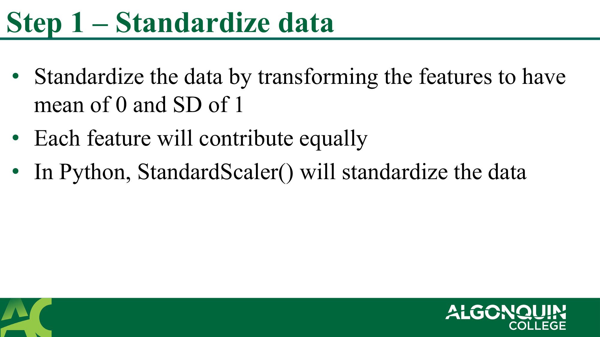

**Step 1 Standardize:** Notes that standardization makes features have mean 0 and SD 1, ensuring equal contribution.

**第一步 标准化：** 标准化使特征均值为 0、标准差为 1，确保每个特征贡献均等。

- Standardize the data by transforming the features to have mean of 0 and SD of 1 — 标准化数据：转换特征使其均值为 0，标准差为 1
- Each feature will contribute equally — 每个特征将有相同的贡献度
- In Python, `StandardScaler()` will standardize the data — 在Python中，`StandardScaler()` 会标准化数据

### 4.3 第2步：计算协方差矩阵 (Step 2 – Calculate Covariance Matrix)

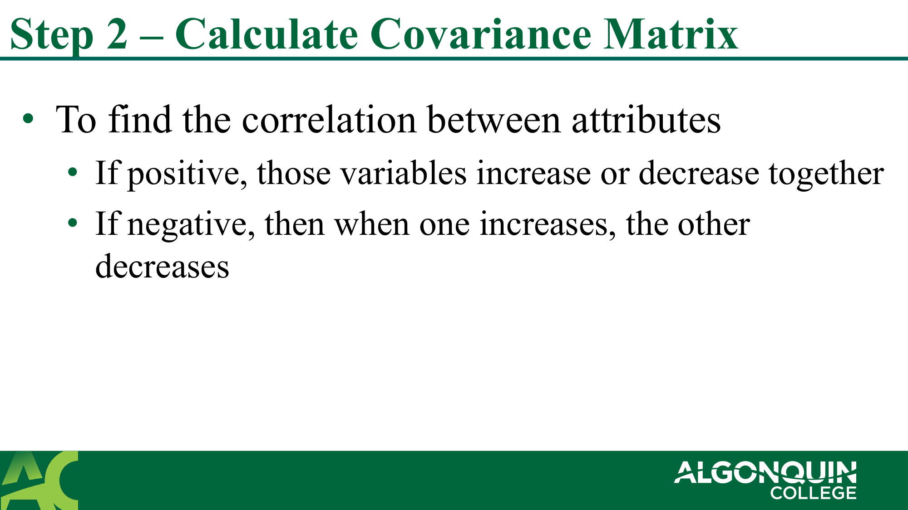

**Step 2 Covariance Matrix:** Calculates correlation between attributes. Positive = move together, Negative = opposite.

**第二步 协方差矩阵：** 用于寻找属性间的相关性。正相关=同向变化，负相关=反向变化。

- To find the correlation between attributes — 寻找属性间的相关性
- If **positive**, those variables increase or decrease together — 如果为**正**，这些变量同步增加或减少
- If **negative**, then when one increases, the other decreases — 如果为**负**，当一个增加时，另一个减少

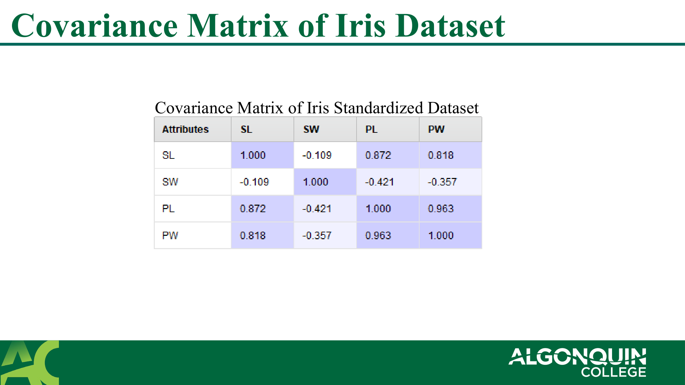

**Covariance Matrix of Iris:** A 4x4 covariance matrix from the standardized Iris dataset.

**Iris数据集的协方差矩阵：** 经过标准化的鸢尾花数据集的 4x4 协方差矩阵展示。

- Covariance Matrix of Iris Standardized Dataset — 标准化Iris数据集的协方差矩阵

### 4.4 第3步：特征值与特征向量 (Eigen Values and Eigen Vectors)

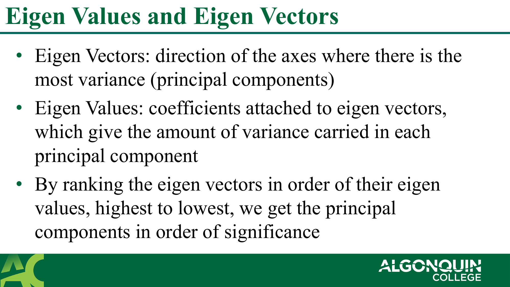

**Eigen Values and Eigen Vectors Description:** Eigenvectors give directions of most variance, eigenvalues give amount of variance.

**特征值与特征向量说明：** 特征向量指出方差最大的轴向，特征值给出每个主成分携带的方差量。

- **Eigen Vectors:** direction of the axes where there is the most variance (principal components) — **特征向量：** 方差最大的轴的方向（即主成分）
- **Eigen Values:** coefficients attached to eigen vectors, which give the amount of variance carried in each principal component — **特征值：** 附加在特征向量上的系数，表示每个主成分包含的方差量
- By ranking the eigen vectors in order of their eigen values, highest to lowest, we get the principal components in order of significance — 将特征向量按特征值从高到低排序，我们就得到了按重要性排列的主成分

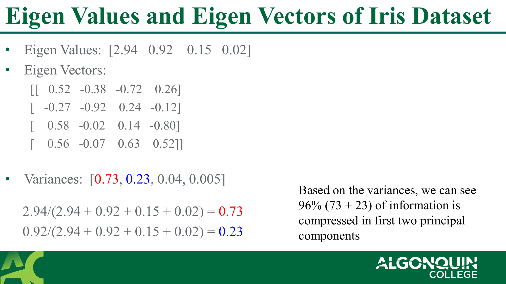

**Eigen Values of Iris Data:** Shows numeric examples of eigenvalues and eigenvectors for Iris data and computing explained variance.

**Iris数据集的特征值：** 鸢尾花数据的特征值和特征向量具体数值，并计算了解释方差。

- **Eigen Values:** [2.94 0.92 0.15 0.02] — **特征值：** [2.94 0.92 0.15 0.02]
- **Eigen Vectors:** 4x4 matrix — **特征向量：** 4x4 矩阵
- **Variances:** [0.73, 0.23, 0.04, 0.005] — **方差比例：** [0.73, 0.23, 0.04, 0.005]
- Based on the variances, we can see 96% (73 + 23) of information is compressed in first two principal components — 基于方差比例可知，前两个主成分中压缩了 96% 的信息 (2.94/(2.94 + 0.92 + 0.15 + 0.02) = 0.73)

### 4.5 提取主成分与确定最佳数量 (Principal Components & Optimal Number)

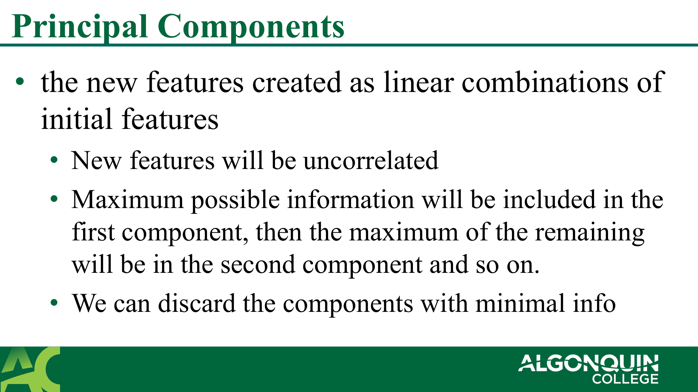

**Principal Components Concept:** New uncorrelated features created by combining initial ones, ordered by information content.

**主成分概念：** 由原始特征线性组合而成的无相关性的新特征，按信息量排序。

- the new features created as linear combinations of initial features — 作为初始特征的线性组合创建的新特征
- New features will be **uncorrelated** — 新特征之间将**没有相关性（正交）**
- Maximum possible information will be included in the first component, then the maximum of the remaining will be in the second component and so on. — 最大可能的信息包含在第一个成分中，剩余信息中的最大部分在第二个成分中，依此类推。
- We can discard the components with minimal info — 我们可以舍弃那些信息量极小的成分

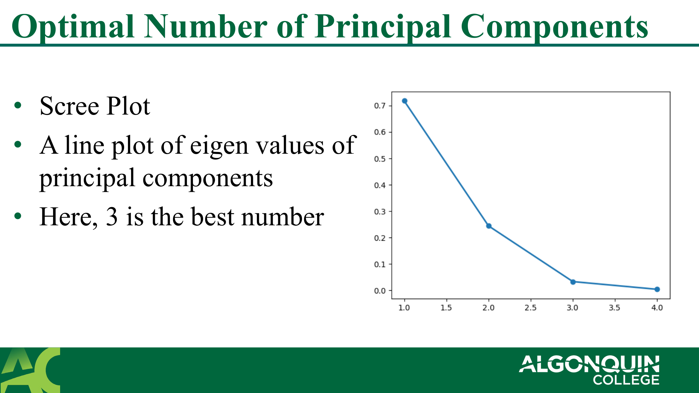

**Scree Plot:** A line plot of eigenvalues to determine the optimal number of PCs using the "elbow" method.

**碎石图 (Scree Plot)：** 特征值的线图，用于决定最佳的主成分数量。

- **Scree Plot** — **碎石图**
- A line plot of eigen values of principal components — 主成分特征值的折线图
- Here, 3 is the best number — 在这里（图中），3 是最佳数量

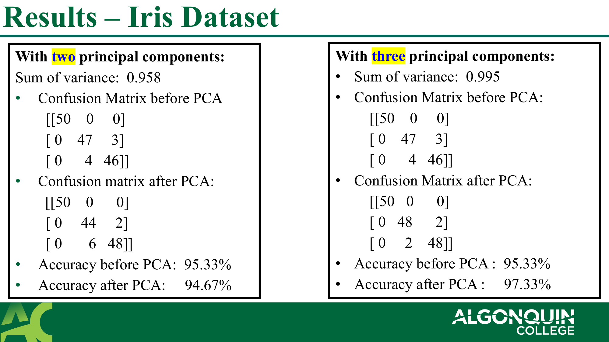

**Results Iris Dataset:** Compares classification confusion matrix and accuracy using models before PCA vs after PCA (with 2 or 3 components).

**Iris 数据集结果：** 对比了使用 PCA 之前与之后（保留 2 个或 3 个主成分）进行分类的混淆矩阵和准确率。

- **With two principal components:** Sum of variance: 0.958, Accuracy after PCA: 94.67% (Before PCA : 95.33%) — **使用两个主成分时：** 方差总和为 0.958，PCA 后准确率为 94.67% (原准确率 95.33%)
- **With three principal components:** Sum of variance: 0.995, Accuracy after PCA : 97.33% — **使用三个主成分时：** 方差总和为 0.995，PCA 后准确率为 97.33%

> **📝 Notes:**
>
> **🎯 Why:**
> **(1) Information = Variance (信息 = 方差):**
>
> In PCA, we equate "spread/variance of the data" with "amount of information." If all data points have the same value on one axis (zero variance), that axis tells us nothing new. By finding directions of maximum variance, we find the axes that distinguish the data points the most.
>
> > > 在PCA中，我们将"数据的散布/方差"等同于"信息量"。如果所有数据点在一个轴上的值相同（零方差），这个轴就无法提供新信息。通过寻找方差最大的方向，我们找到了最能区分这些数据点的轴。
>
> **(2) Uncorrelated Features (无相关特征):**
>
> Principal components are strictly orthogonal to each other, meaning they have 0 correlation. This removes multicollinearity, making algorithms that assume feature independence (like Naive Bayes or linear regression) perform much better.
>
> > > 主成分之间严格正交，意味着它们的相关性为0。这消除了多重共线性，使得假设特征独立性的算法（如朴素贝叶斯或线性回归）表现更好。
>
> **💡 Intuition:**
> **(1) The UFO photos analogy (拍飞碟类比):**
>
> A UFO resembles a flat saucer. If you take a picture from the TOP (PC1), you see its large circular shape (most variance/info). If you take a side picture (PC2), you see a thin line (less variance). PCA rotates the camera to capture the directions showcasing the maximum features of the object.
>
> > > 飞碟就像一个扁平的碟子。如果你从正上方拍照（PC1），你会看到大的圆形结构（最大方差/信息）。如果你从侧面拍照（PC2），只看到一条细线（较小方差）。PCA就是转动相机，找到最能展现物体特征的角度。
>
> **⚠️ Pitfall:**
> **(1) Forgetting to Standardize (忘记标准化):**
>
> If you don't scale features, PCA will treat features with larger numeric values as having high variance simply due to their unit (e.g. Salary in \$100k vs Age in years). PCA will wrongly rotate towards the Salary axis assuming it holds the most "information".
>
> > > 如果不对特征进行标准化，PCA 会将数值绝对值较大的特征误认为是高方差（例如年薪 10 万 vs 年龄 30 岁）。PCA 会因此错误地向年薪轴旋转，误认为它包含了最大的"信息"。
>
> **📝 Exam:**
> **(1) 概念原理题 (Conceptual):**
>
> "Is PCA a feature selection or feature extraction technique? Why?" → It's Feature Extraction. Because it creates strictly new linear combinations of all original features rather than just picking existing columns.
>
> > > "PCA是特征选择还是特征提取技术？为什么？" → 是特征提取。因为它将所有原特征进行新的线性组合，而不是简单地挑出现有的列。

---

## 5. 线性判别分析 (Linear Discriminant Analysis - LDA)

### 5.1 LDA 简介与操作步骤 (Introduction and Steps of LDA)

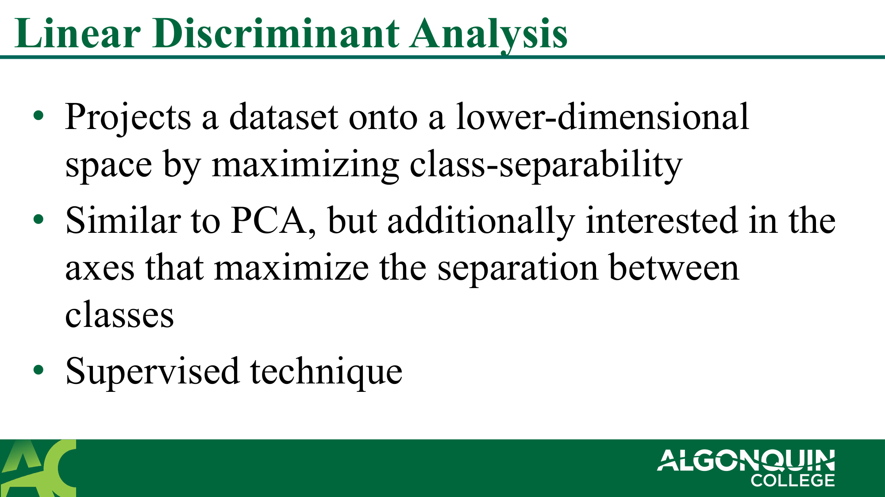

**Linear Discriminant Analysis:** Introduces LDA as a supervised technique reducing dimensions while maximizing class separation.

**线性判别分析简介：** 引入 LDA，这是一种旨在减少维度的同时最大化类别可分性的监督技术。

- Projects a dataset onto a lower-dimensional space by maximizing **class-separability** — 通过最大化**类别间的可分性（类间差异）**，将数据集投影到低维空间
- Similar to PCA, but additionally interested in the axes that maximize the separation between classes — 类似于PCA，但更关注能最大化不同类之间分离度的轴
- **Supervised technique** — **监督技术**

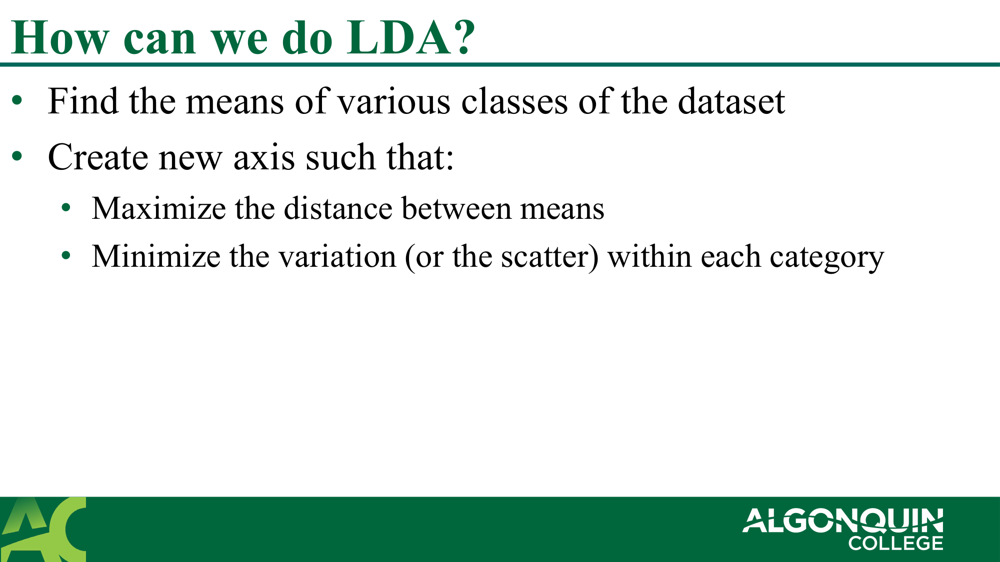

**How can we do LDA:** Gives the principles of finding class means, maximizing distance between means, and minimizing scatter inside classes.

**我们如何进行LDA：** 给出了原理：寻找类均值、最大化均值距离，同时最小化类内分散度。

- Find the means of various classes of the dataset — 求数据集中各个类的均值
- Create new axis such that: — 创建新轴，以满足：
  - Maximize the distance between means — **最大化均值（类间）之间的距离**
  - Minimize the variation (or the scatter) within each category — **最小化各个类别的内部变化（类内散布度/方差）**

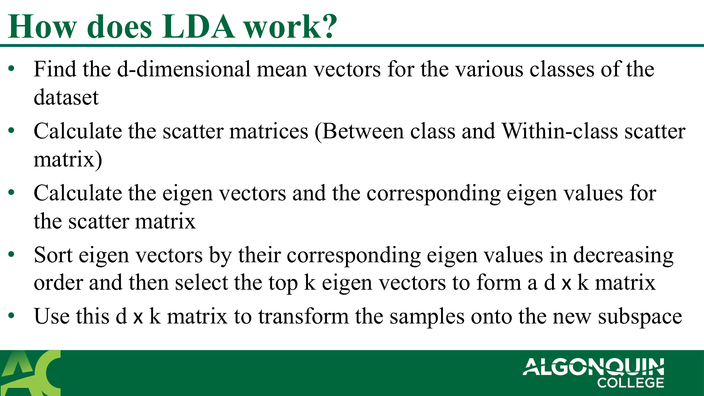

**How does LDA work:** Gives the mathematical steps of LDA similar to the PCA steps using scatter matrices instead of pure covariance.

**LDA是如何工作的：** 给出了类似PCA的数学步骤，但使用的是类间与类内散布矩阵，而不是普通的协方差矩阵。

- Find the d-dimensional mean vectors for the various classes of the dataset — 计算数据集中不同类别的d维均值向量
- Calculate the scatter matrices (Between class and Within-class scatter matrix) — 计算散布矩阵（类间散布矩阵 和 类内散步矩阵）
- Calculate the eigen vectors and the corresponding eigen values for the scatter matrix — 为散布矩阵计算特征向量和对应的特征值
- Sort eigen vectors by their corresponding eigen values in decreasing order and then select the top k eigen vectors to form a d x k matrix — 将特征向量按降序特征值排列，选择前 k 个特征向量
- Use this d x k matrix to transform the samples onto the new subspace — 用这个转换矩阵将样本放入新子空间

### 5.2 PCA 与 LDA 的对比 (PCA vs LDA)

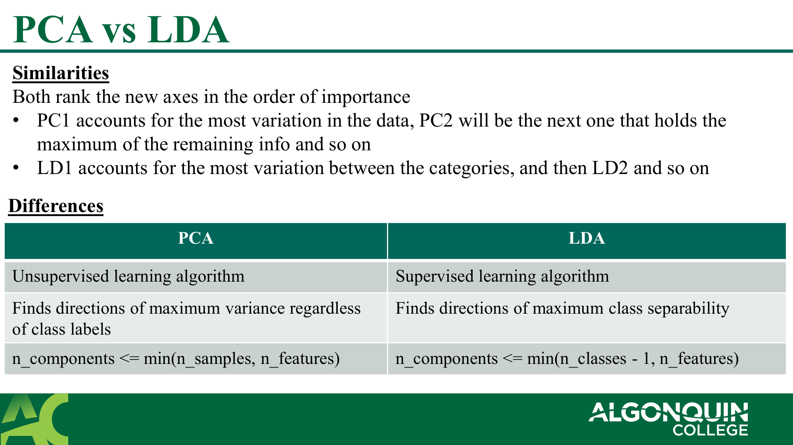

**PCA vs LDA:** Shows similarities and differences between the two methods using a comparative table format.

**PCA 与 LDA 对比：** 展示两者的相似点和差异。

- **Similarities** — **相似之处**
  - Both rank the new axes in the order of importance — 两者都按重要性排列新轴
  - PC1 accounts for the most variation in the data, PC2 will be the next one... — PC1解释了大部分的数据方差，PC2是下一个……
  - LD1 accounts for the most variation between the categories, and then LD2... — LD1解释了类别间最大的方差变化，然后是LD2……

- **Differences** — **差异点**

| PCA                                                             | LDA                                            |
| --------------------------------------------------------------- | ---------------------------------------------- |
| Unsupervised learning algorithm                                 | Supervised learning algorithm                  |
| Finds directions of maximum variance regardless of class labels | Finds directions of maximum class separability |
| n_components <= min(n_samples, n_features)                      | n_components <= min(n_classes - 1, n_features) |

_(中文翻译对比参考下方笔记)_

> **📝 Notes:**
>
> **🎯 Why:**
> **(1) The Goal of LDA (LDA 的核心目标):**
>
> Simply preserving variance (like PCA) might accidentally project data such that distinct classes overlap. LDA specifically uses class labels to force different groups as far apart as possible, making classification tasks far easier.
>
> > > 仅仅像PCA一样保留最大方差，可能会不小心投影出严重重叠的类别数据。LDA 专门利用类别标签，迫使不同类的组尽可能远离彼此，从而大大降低了分类任务的难度。
>
> **(2) Maximize Between-class, Minimize Within-class (最大类间，最小类内):**
>
> Good clustering/classification requires classes to be far apart (Maximize Between-class distances) and tightly grouped (Minimize Within-class scatter). LDA directly optimizes this ratio.
>
> > > 好的聚类或分类需要类别之间离得远（最大化类间距离），同时各自类别扎堆紧凑（最小化类内分散）。LDA 直接优化就是这个比率。
>
> **⚖️ Compare:**
> | Feature | PCA (Principal Component Analysis) | LDA (Linear Discriminant Analysis) |
> |---|---|---|
> | Objective | Maximize global dataset variance | Maximize separation between known classes |
> | Approach type | Unsupervised (ignores `y` labels) | Supervised (requires `y` labels) |
> | Max components | `min(samples, features)` | `min(classes - 1, features)` |
>
> > > | 区别维度     | PCA 主成分分析             | LDA 线性判别分析               |
> > > | ------------ | -------------------------- | ------------------------------ |
> > > | 目标         | 最大化全局数据集的整体方差 | 最大化已知类别的组间分离度     |
> > > | 算法特性     | 无监督（忽略标签 `y`）     | 有监督（必须要有分类标签 `y`） |
> > > | 最大降维维度 | `min(样本数, 特征数)`      | `min(类别数 - 1, 特征数)`      |
>
> **⚠️ Pitfall:**
> **(1) Dimensionality Limit of LDA (LDA 维数限制陷阱):**
>
> Unlike PCA, LDA can only reduce data to at most `(Number of Classes) - 1` dimensions. For a binary classification task (2 classes), LDA can only ever produce 1 dimension (a line), no matter how many input features you had.
>
> > > 与PCA不同，LDA最多只能将数据降至 `(分类数量) - 1` 维。对于二分类任务（2个类），无论你有多少个输入特征，LDA通过降维只能给你 1 个维度（一条线）。
>
> **📝 Exam:**
> **(1) 场景选择题 (Scenario Choice):**
>
> "You have a dataset with strong overlapping clusters and you want to reduce dimensions before applying Logistic Regression. Which is better?" → LDA, because it's supervised and will forcefully separate the clusters if label data is present, unlike PCA which only cares about raw variance.
>
> > > "你的数据集类聚严重重叠，你想在逻辑回归之前进行降维。选什么好？" → LDA。因为它是监督学习，如果有标签，它会主动把类别分开。而PCA可能只会关注全局散布而已。

---

## 6. 参考文献 (References)

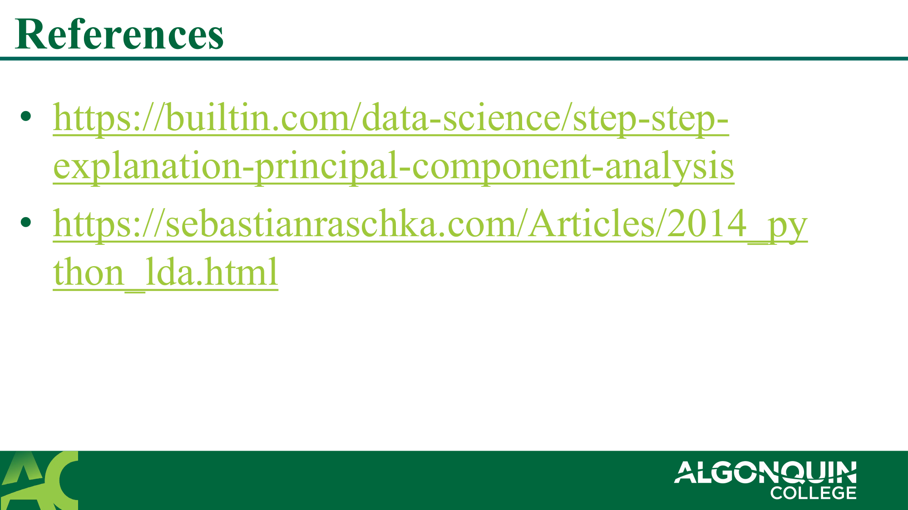

References: (URLs)

- https://builtin.com/data-science/step-step-explanation-principal-component-analysis
- https://sebastianraschka.com/Articles/2014_python_lda.html
