# Week 2: 支持向量机 (Support Vector Machines)

> Source: `02_CST8506_SVM4.pdf`
> Total slides: 25
> Instructor: Dr. Anu Thomas

---

## 1. 线性分离器与分类间隔 (Linear Separators and Classification Margin)

### 1.1 线性分离器示例 (Linear Separator Examples)

**Linear Separator Examples:** Scatter plot showing three different linear lines (red, green, blue) that all successfully separate blue from red dots in 2D space.

**线性分离器示例：** 散点图显示了三条不同的直线（红、绿、蓝），它们都在2D空间中成功地将蓝点与红点分开了。

### 1.2 最佳分离器 (Optimal Separator)

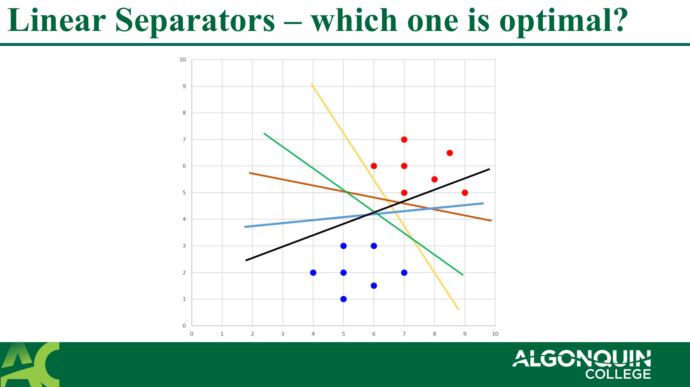

**Optimal Separator:** The green line is highlighted as the optimal separator because it runs exactly down the middle of the empty space between the two classes.

**最佳分离器：** 绿线被突出显示为最佳分离器，因为它恰好穿过两个类别之间空白区域的正中间。

### 1.3 分类间隔概念 (Classification Margin Idea)

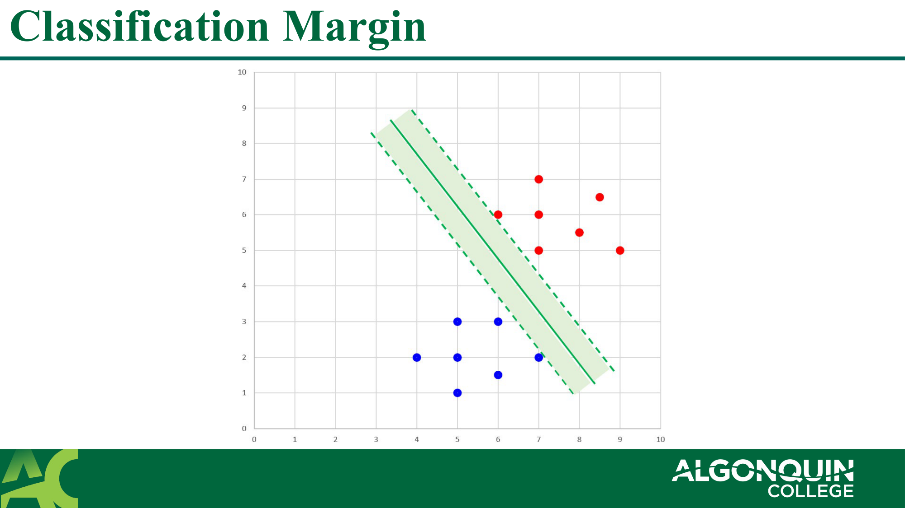

**Classification Margin Idea:** Shows the empty "street" or margin space between the classes, bounded by dashed lines parallel to the decision boundary.

**分类间隔概念：** 展示了类别之间空白的"街道"或边界空间，由平行于决策边界的虚线限定。

### 1.4 支持向量 (Support Vectors)

**Support Vectors marked:** Specific data points touching the dashed boundary lines are circled. These points dictate the width of the margin.

**标记支持向量：** 接触虚线边界的特定数据点被圈出。这些点决定了间隔的宽度。

- Support vectors marked in circle — 圈出的点即为支持向量

### 1.5 间隔定义 (Margin Definition)

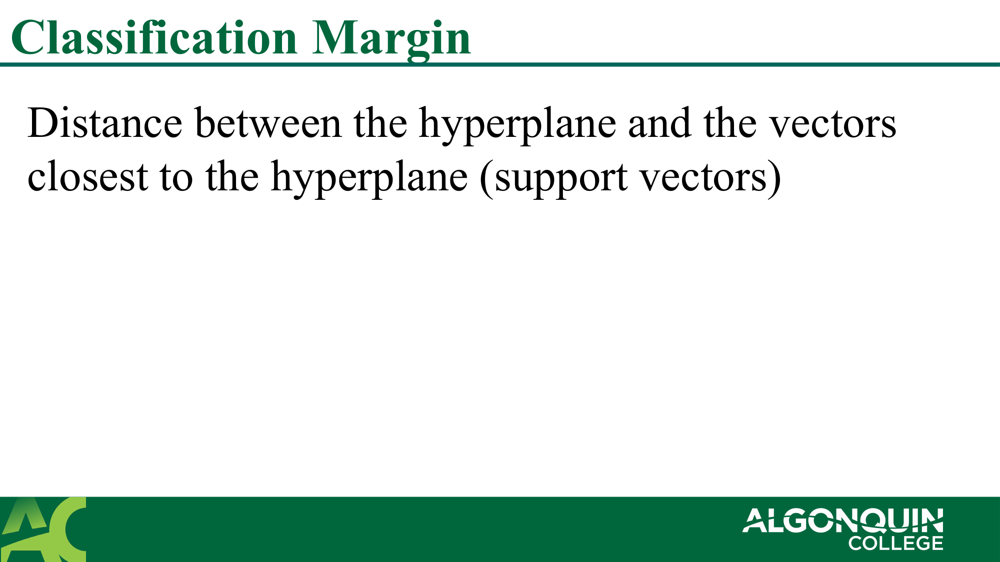

**Margin Definition:** Visual representation of distance $d$ from the hyperplane to the nearest support vectors on both sides.

**间隔定义：** 直观展示了从超平面到两侧最近支持向量的距离 $d$。

- **Classification Margin:** Distance between the hyperplane and the vectors closest to the hyperplane (support vectors) — **分类间隔：** 超平面与距离超平面最近的向量（支持向量）之间的距离

> **📝 Notes:**
>
> **🎯 Why:**
> **(1) Why maximize the margin? (为什么要最大化间隔？):**
>
> A larger margin provides a wider "safety buffer" for future unseen data points. Small margins might overfit and misclassify new points that deviate slightly from the training data.
>
>> 更大的间隔为未来未见的数据点提供了更宽的"安全缓冲"。小间隔可能导致过拟合，从而错分稍微偏离训练数据的新数据点。
>>
>
> **(2) The Street analogy (街道类比):**
>
> Imagine placing a multi-lane highway between the two classes of dots. You want to build the widest possible highway without running over any dots. The center line of the highway is your decision boundary.
>
>> 想象在两类点之间修建一条多车道高速公路。你想在不压到任何点的前提下，修出最宽的高速公路。公路的中心线就是你的决策边界。
>>

---

## 2. 支持向量与 SVM 简介 (Support Vectors and Introduction to SVM)

### 2.1 支持向量总结 (Support Vector Summary)

**Support Vector Summary:** Slide providing the text definition of support vectors and their role in margin maximization.

**支持向量总结：** 幻灯片提供了支持向量的文本定义及其在最大化间隔中的作用。

- Vectors (data points) that : — 向量（数据点）：
  - Are closer to the hyperplane — 更靠近超平面
  - Can influence the position and the orientation of the hyperplane — 能够影响超平面的位置和方向
- Using the support vectors, we maximize the classification margin — 利用支持向量，我们最大化分类间隔

### 2.2 SVM 算法定义 (SVM Algorithm Definitions)

**SVM Algorithm Definitions:** Slide detailing SVM's goal to find a distinct hyperplane in n-dimensional space. Mentions shape based on dimension.

**SVM算法定义：** 幻灯片详细说明了SVM试图在n维空间中寻找清晰的超平面的目标。提到了基于形状的维度。

- **Objective:** find a hyperplane in an n-dimensional space (n is the number of features) that has the maximum margin (that can distinctly classify the instances) — **目标：** 在n维空间（n是特征数量）中找到一个具有最大间隔的超平面（能够清晰地分类实例）
- If n is 1, classifier will be a dot — 如果 n 是 1，分类器将是一个点
- If n is 2, classifier will be a line — 如果 n 是 2，分类器将是一条线
- If n is 3, classifier will be a 2d plane — 如果 n 是 3，分类器将是一个2D平面
- If n>3, classifier will be a hyperplane in the n-dimensional space — 如果 n > 3，分类器将是n维空间中的超平面
- SVM is a supervised algorithm that works best on small complex datasets. — SVM 是一种监督学习算法，在小型复杂数据集上效果最好。
- SVM can be used for classification and regression tasks but generally used more for classification. — SVM 可用于分类和回归任务，但通常更多用于分类。

> **📝 Notes:**
>
> **📌 What:**
> **(1) Hyperplane (超平面):**
>
> A subspace whose dimension is one less than that of its ambient space. For 2D data, it's a 1D line. For 3D data, it's a 2D plane.
>
>> 一个维数比其所在空间小一维的子空间。对于2D数据，它是1D的线。对于3D数据，它是2D的平面。
>>
>
> **🎯 Why:**
> **(1) Why "Support" Vectors? (为什么叫"支持"向量？):**
>
> They literally "support" the margin boundaries like pillars holding up a roof. If you move or remove these points, the margin entirely shifts.
>
>> 它们就像支撑屋顶的柱子一样在字面上"支撑"着间隔的边界。如果你移动或移除这些点，整个间隔就会发生偏移。
>>
>
> **⚠️ Pitfall:**
> **(1) Ignoring non-support vectors (忽略非支持向量):**
>
> A striking property of SVM is that once the optimal boundary is found, all points outside the margin boundaries don't matter at all. You can delete 90% of your training dataset as long as you keep the support vectors, and the model stays exactly the same.
>
>> SVM最引人注目的性质是：一旦找到最优边界，位于间隔边界之外的所有点就完全无关紧要了。只要保留支持向量，你甚至可以删除90%的训练数据，模型也依然完全不变。
>>

---

## 3. 数学基础与优化目标 (Math Foundation and Optimization Function)

### 3.1 预测新点图示 (Predicting a New Point Diagram)

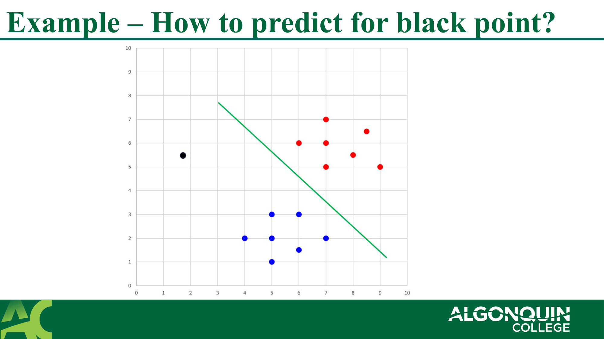

**Predicting a New Point Diagram:** A question showing the established hyperplane and asking how to algorithmically classify a new, unknown black point (vector $u$).

**预测新点图示：** 提出了一个问题，展示已建立的超平面，并询问如何用算法对一个新出现的、未知的黑点（向量 $u$）进行分类。

### 3.2 点积投影 (Dot Product Projection)

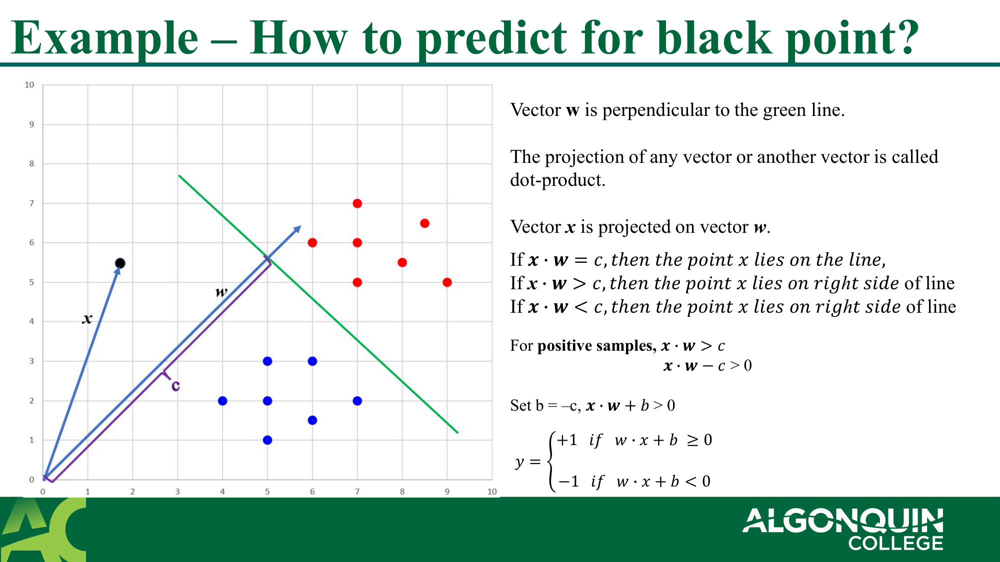

**Dot Product Projection:** Shows mathematically how classifying a new vector $x$ works by taking the dot product with the weight vector $w$ (which is perpendicular to the boundary) and checking if the value exceeds a threshold.

**点积投影：** 从数学上展示了如何对新向量 $x$ 进行分类，即通过将其与权重向量 $w$（垂直于边界）做点积，并检查结果是否超过某个阈值。

- Vector **w** is perpendicular to the green line. The projection of any vector or another vector is called **dot-product**. — 向量 $w$ 垂直于绿线。投影或两个向量的运算被称为**点积**。
- Vector **x** is projected on vector **w**. — 向量 $x$ 被投影到向量 $w$ 上。
- If $w \cdot x \geq c$, it falls on the right of the line (positive class, $y=+1$) — 如果 $w \cdot x \geq c$，它落在直线的右侧（正类，$y=+1$）
- If $w \cdot x < c$, it falls on the left of the line (negative class, $y=-1$) — 如果 $w \cdot x < c$，它落在直线的左侧（负类，$y=-1$）

### 3.3 超平面方程 (Hyperplane Equation)

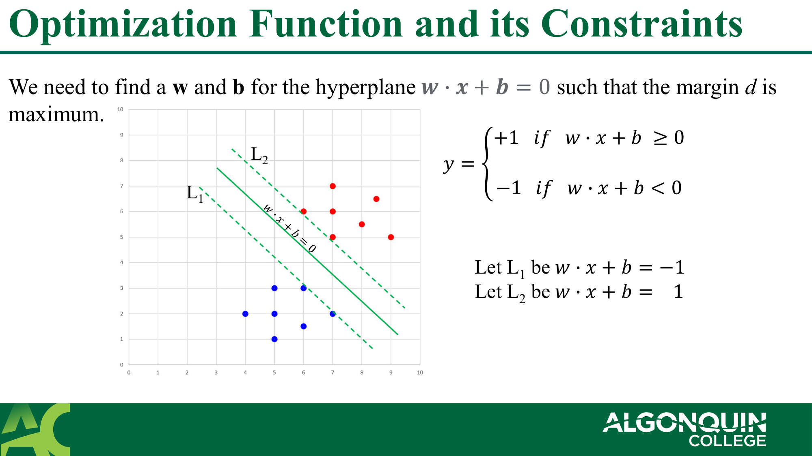

**Hyperplane Equation:** Derives the functional margin and defines the canonical hyperplane using a bias term $b$.

**超平面方程：** 推导了函数间隔，并使用偏置项 $b$ 定义了规范超平面。

- We need to find a w and b for the hyperplane such that the margin d is maximum. — 我们需要为超平面找到 $w$ 和 $b$，以使得间隔 $d$ 最大。
- Let rule be $w \cdot x + b \ge 0$ (for positive) and $w \cdot x + b < 0$ (for negative). — 设规则为 $w \cdot x + b \ge 0$ (正类) 以及 $w \cdot x + b < 0$ (负类)。

### 3.4 正负间隔 (Positive and Negative Margins)

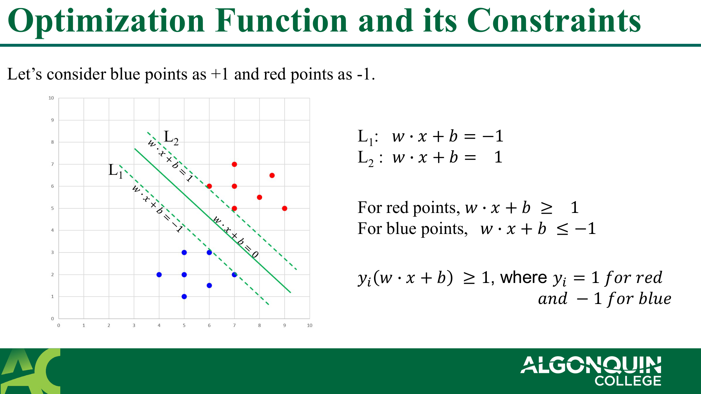

**Positive and Negative Margins:** Shows how the margin boundary constraints are set to +1 and -1.

**正负间隔：** 展示了如何将间隔边界约束设定为 +1 和 -1。

- Let's consider blue points as +1 and red points as -1. — 设蓝点标号为 +1，红点为 -1。
- For blue points: $w \cdot x + b \ge 1$ — 对于蓝点：$w \cdot x + b \ge 1$
- For red points: $w \cdot x + b \le -1$ — 对于红点：$w \cdot x + b \le -1$
- Combined constraint: $y_i (w \cdot x_i + b) \ge 1$ — 综合约束条件：$y_i (w \cdot x_i + b) \ge 1$

### 3.5 超平面之间的距离 (Distance Between Hyperplanes)

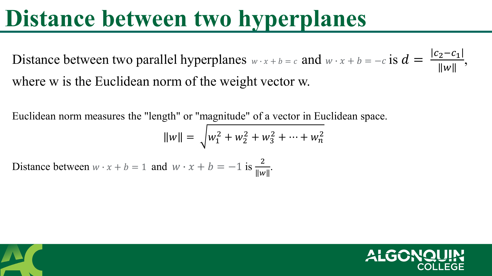

**Distance Between Hyperplanes:** The mathematical calculation of total margin distance is shown to be $2 / ||w||$.

**超平面之间的距离：** 总间隔距离的数学计算过程显示为 $2 / ||w||$。

- Distance between two parallel hyperplanes is $2/||w||$. — 两个平行超平面之间的距离是 $2/|w|$。
- Euclidean norm (||w||) measures the "length" or "magnitude" of a vector in Euclidean space. — 欧几里德范数 ($||w||$) 衡量了向量在欧氏空间中的"长度"或"幅度"。

### 3.6 MMC 优化约束 (MMC Optimization Constraints)

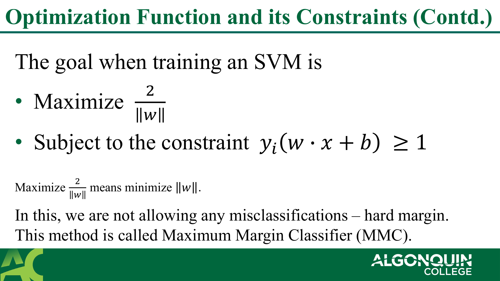

**MMC Optimization constraints:** States the formal goal of Maximum Margin Classifier: maximize margin size subject to no misclassifications.

**MMC优化约束：** 声明了最大间隔分类器的正式目标：在不允许错分的前提下最大化间隔大小。

- The goal when training an SVM is: — 训练SVM时的目标是：
  - Maximize $\frac{2}{||w||}$ — 最大化 $\frac{2}{||w||}$
  - Subject to the constraint: $y_i (w \cdot x_i + b) \ge 1$ — 满足约束条件：$y_i (w \cdot x_i + b) \ge 1$
- This method is called Maximum Margin Classifier (MMC). — 这种方法称为最大间隔分类器（MMC）。

> **📝 Notes:**
>
> **💡 Intuition:**
> **(1) Why minimize ||w|| to maximize margin? (为什么最小化||w||就是最大化间隔？):**
>
> By definition, the margin width equals $2/||w||$. Since we want to make the margin as wide as possible, mathematically, minimizing the denominator $||w||$ maximizes the entire fraction.
>
>> 根据定义，间隔的宽度等于 $2/||w||$。由于我们想使间隔尽可能宽，从数学上讲，最小化分母 $||w||$ 就会最大化整个分数。
>>
>
> **📐 Formula:**
> **(1) Constraint $y_i (w \cdot x_i + b) \ge 1$ (约束解析):**
>
> - For a true positive, $y = +1$, so we enforce $(w \cdot x_i + b) \ge 1$.
> - For a true negative, $y = -1$, so we enforce $(w \cdot x_i + b) \le -1$. Multiplying both sides by $-1$ flips the inequality, giving $(-1)(w \cdot x_i + b) \ge 1$.
> - This elegant single formula perfectly covers both correctness boundaries.
>
>> - 对于真实的正类点，$y=+1$，我们强制 $(w \cdot x_i + b) \ge 1$。
>> - 对于真实的负类点，$y=-1$，我们强制 $(w \cdot x_i + b) \le -1$。两边同乘 $-1$ 会翻转不等号，得到 $-(w \cdot x_i + b) \ge 1$。
>> - 这个优美的单一公式完美地涵盖了两种正确性的边界条件。
>>
>
> **⚠️ Pitfall:**
> **(1) MMC assumes perfect separability (MMC假定完美线性可分):**
>
> The constraint $\ge 1$ means literally ZERO points are allowed inside the street margin or on the wrong side. If the data is overlapping even a little, this optimization has no mathematical solution!
>
>> $\ge 1$的约束意味着绝对不允许任何点进入间隔"街道"内，或越界到错误的半区。如果数据哪怕有最微小的重叠交叉，这个优化在数学上也会无解！
>>
>
> **📖 教材深入 (Textbook Deep Dive):**
>
> **为什么最小化 $\|w\|$ 就是最大化间隔？几何推导过程：**
>
> 设超平面为 $\langle w, x \rangle + b = 0$，任意一点 $x_a$ 到超平面的距离 $r = \frac{|\langle w, x_a \rangle + b|}{\|w\|}$。对于支持向量，$\langle w, x_a \rangle + b = \pm 1$，所以 $r = \frac{1}{\|w\|}$，总间隔宽度 = $\frac{2}{\|w\|}$。
>
> 因此，"最大化间隔" 等价于 "最小化 $\|w\|$"，实际中为了方便求导，我们最小化 $\frac{1}{2}\|w\|^2$（去掉根号，加系数简化梯度）。
>
> — *Mathematics for Machine Learning*, Ch.12.2
>

---

## 4. 软间隔与支持向量分类器 (Soft Margin and Support Vector Classifier)

### 4.1 SVM 类型 (Types of SVM)

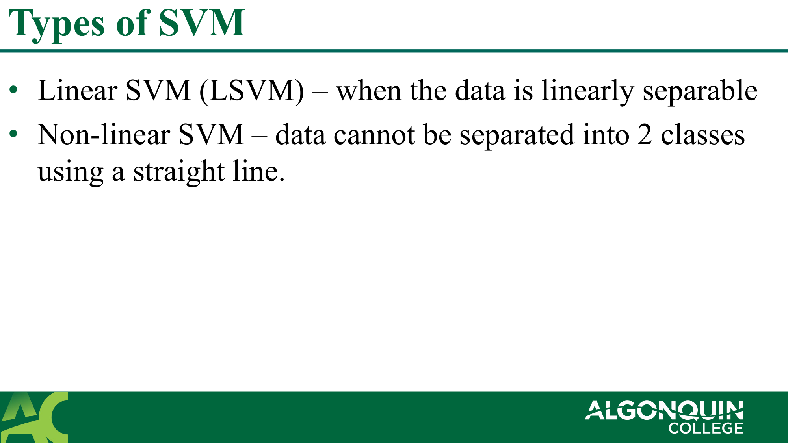

**Types of SVM:** Briefly differentiates Linear SVMs (hard data split) from Non-linear SVMs (where straight lines fail).

**SVM 类型：** 简要区分了线性SVM（硬分离数据）和非线性SVM（直线无法分离时）。

- **Linear SVM (LSVM)** – when the data is linearly separable — **线性SVM (LSVM)** – 当数据是线性可分的
- **Non-linear SVM** – data cannot be separated into 2 classes using a straight line. — **非线性SVM** – 数据无法用一条直线被分成两个类别。

### 4.2 不可分数据 (Inseparable Classes)

**Inseparable Classes (SVC):** Demonstrates real-world overlapping data and the need for a Soft Margin approach.

**不可分数据 (SVC)：** 展示了现实世界中重叠交叉的数据，引出对软间隔方法的需求。

- When the data is not separable we cannot separate them with linear classifiers. — 当数据不可分离时，我们无法用线性分类器将它们分开。
- We need to use **soft-margin** instead of hard margin – by allowing a few misclassifications. — 我们需要使用**软间隔**而不是硬间隔——即允许少量的错误分类。
- This method is called **Support Vector Classifier (SVC)**. — 这种方法称为**支持向量分类器 (SVC)**。

> **📝 Notes:**
>
> **📍 What:**
> **(1) Soft Margin (软间隔):**
>
> An approach that introduces "slack variables" ($\xi_i$) to the constraints. It mathematically says "Be outside the margin, but if you absolutely MUST cross the line, pay a penalty."
>
>> 这种方法向约束条件中引入了"松弛变量" ($\xi_i$)。它的数学含义是"请待在间隔之外，但如果你绝对必须越界，就要支付惩罚代价。"
>>
>
> **🎯 Why:**
> **(1) Robustness to Noise (对噪声的鲁棒性):**
>
> If you have one random red dot sitting deep in the blue territory (an outlier), a Hard Margin model would be ruined trying to dodge it. Soft margins ignore the noise entirely by choosing to cleanly misclassify the outlier rather than wrecking the entire decision boundary holding all other points steady.
>
>> 如果你在蓝色区域深处有一个随机的红色点（异常值），硬间隔模型在试图避开它时会彻底崩溃失效。软间隔会通过选择"直接错分"这个异常值，来无视噪声，而不是为了迁就它而毁掉用来稳固有占绝大部分其他点的整个决策边界。
>>
>
> **📖 教材深入 (Textbook Deep Dive):**
>
> **软间隔的完整优化目标是什么？**
>
> $$\min_{w,b,\xi} \frac{1}{2}\|w\|^2 + C\sum_{n=1}^{N}\xi_n$$
>
> 约束: $y_n(\langle w, x_n \rangle + b) \ge 1 - \xi_n$，且 $\xi_n \ge 0$
>
> 直白理解：第一项 $\|w\|^2$ 是让间隔尽量**宽**，第二项 $C\sum\xi_n$ 是让越界**少**。$C$ 就是两者之间的"天平"——$C$ 大 → 不容忍犯错（接近硬间隔）；$C$ 小 → 宽容犯错（更宽的间隔）。
>
> 当 $\xi_n = 0$ 时，点在间隔外（安全）；$0 < \xi_n < 1$ 时，点在间隔内但没越界（被容忍）；$\xi_n > 1$ 时，点跑到了错误一边（被错分了）。
>
> — *Mathematics for Machine Learning*, Ch.12.2; *Bayesian Reasoning*, Ch.17.6
>

---

## 5. 核函数与非线性 SVM (Kernels and Non-linear SVM)

### 5.1 低维数据转换 (Transforming low-dimensional data)

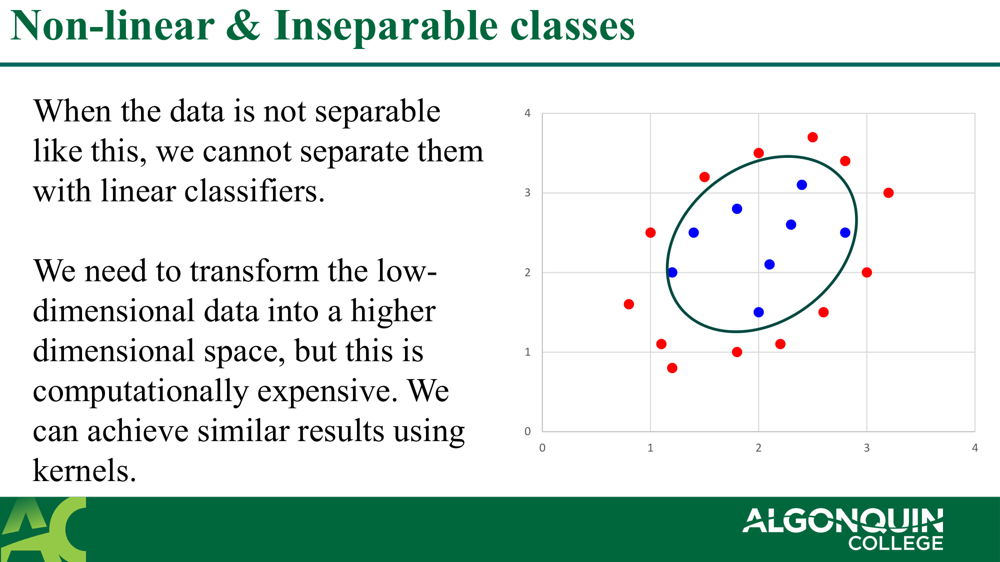

**Transforming low-dimensional data:** Shows concentric circle data projected up into a 3D bowl shape to make a flat 2D plane cut through them perfectly.

**低维数据转换：** 展示了原本呈同心圆分布的不可分集被向上投影成3D碗状形态，使得一个平坦的2D切面可以完美地将两类数据分开。

- When the data is not separable like this, we cannot separate them with linear classifiers. — 当数据像这样不可分时，我们无法用线性分类器分开。
- We need to transform the low-dimensional data into a higher dimensional space, but this is computationally expensive. — 我们需要将低维数据转换到更高维的空间，但这在计算上非常昂贵。
- We can achieve similar results using **kernels**. — 我们可以使用**核函数**实现类似结果。

### 5.2 核函数定义 (Kernel Definition)

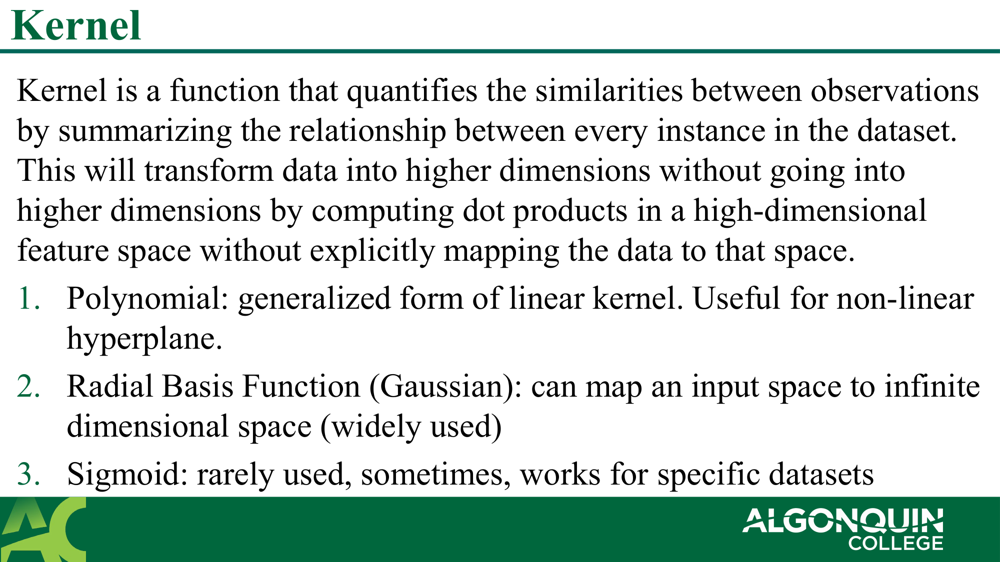

**Kernel Definition:** Defines Kernels as shortcut equations computing similarities, and lists Polynomial, RBF, and Sigmoid.

**核函数定义：** 将核函数定义为计算相似度的捷径公式，列出了多项式、RBF和Sigmoid核。

- **Kernel** is a function that quantifies the similarities between observations by summarizing the relationship between every instance in the dataset. — **核** 是一个函数，它通过总结数据集中每个实例之间的关系来量化观测值之间的相似性。
- This will transform data into higher dimensions without going into higher dimensions by **computing dot products** in a high-dimensional feature space without explicitly mapping the data to that space. — 它能在不升维的情况下降数据转换为高维关系。它通过在高维特征空间中直接**计算点积**来实现，而无需隐式或显式地将数据真正映射上去。
- 1. **Polynomial:** generalized form of linear kernel. Useful for non-linear hyperplane. — **1. 多项式核：** 线性核的推广形式。对非线性超平面有用。
- 2. **Radial Basis Function (Gaussian):** can map an input space to infinite dimensional space (widely used) — **2. 径向基函数 (RBF)：** 能将输入空间映射到无限维空间（非常常用）
- 3. **Sigmoid:** rarely used, sometimes, works for specific datasets — **3. Sigmoid核：** 很少使用，有时在特定数据集上有效

### 5.3 线性核 vs RBF核 示例 (Linear vs RBF Example)

**Linear vs RBF Example:** Comparing a straight-line cut (Linear Kernel) failing on concentric data vs a circular blob cut (RBF Kernel) succeeding.

**线性核 vs RBF核 示例：** 在同心圆数据上，对比了一条直线切割（线性核）失败，而RBF核能成功切出环状面。

### 5.4 线性核 vs 多项式核 示例1 (Linear vs Polynomial Example 1)

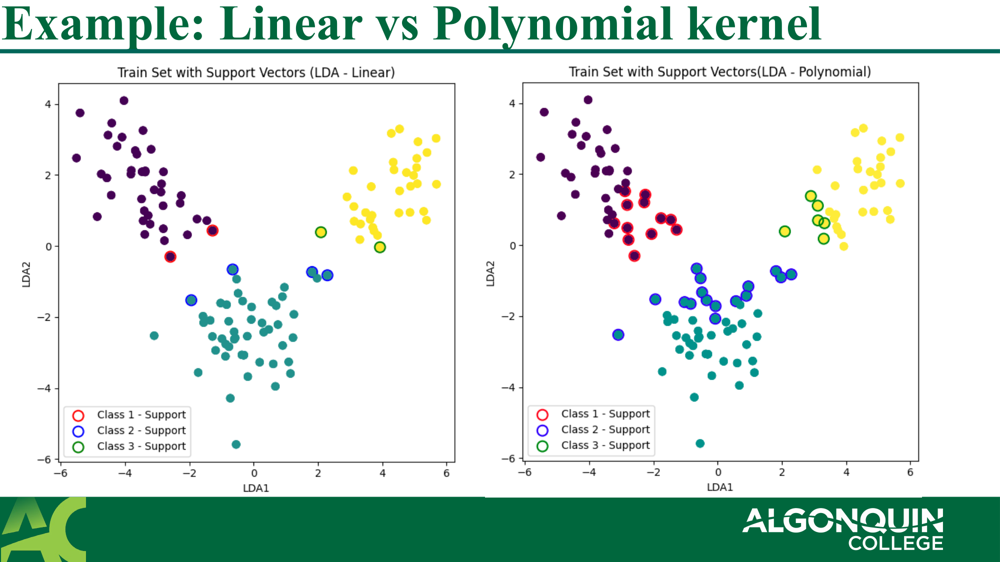

**Linear vs Polynomial (Left image):** Another plot demonstrating how a Polynomial curve can contour around data that a straight linear cut entirely misses.

**线性核 vs 多项式核 (示例1)：** 进一步图解多项式曲线可以如何包裹紧贴直切线根本覆盖不到的数据。

### 5.5 线性核 vs 多项式核 示例2 (Linear vs Polynomial Example 2)

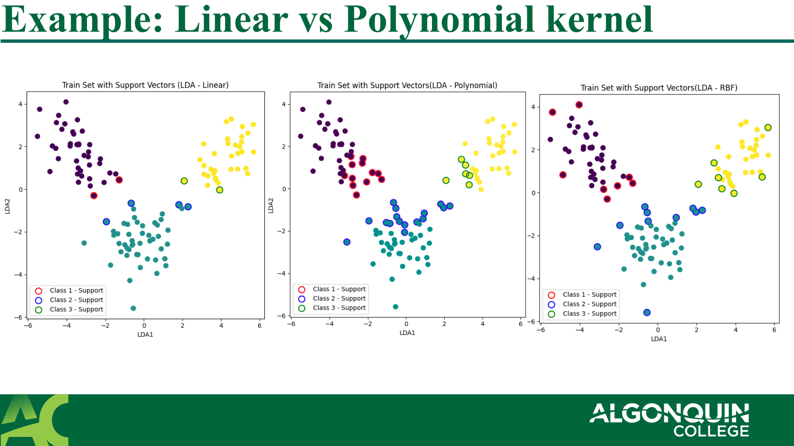

**Linear vs Polynomial Example (Right image):** Further proof of non-linear flexibility.

**线性核 vs 多项式核 (示例2)：** 进一步验证非线性灵活度的例子。

> **📝 Notes:**
>
> **💡 Intuition:**
> **(1) The "Kernel Trick" (核技巧类比):**
>
> Imagine trying to compute how far apart two cities are in a higher-dimensional 3D globe coordinate system using only flat 2D maps. The Kernel Trick is like a magic formula that gives you the exact 3D distance between cities purely by doing math on their 2D flat-map grid coordinates, saving you the computational cost of mapping out the entire 3D sphere.
>
>> 想象你试图仅凭平面的2D地图，却要计算两个城市在高维的3D地球坐标系上有隔得多远。核技巧就像一个神奇的公式，它仅通过在它们2D平面的地图坐标上做数学运算，就能给出精确的3D真实距离，省去了构建展现整个3D球体所需的庞大计算成本。
>>
>
> **⚖️ Compare:**
>
> | Kernel         | Use cases                                     | Pros / Cons                                                                      |
> | -------------- | --------------------------------------------- | -------------------------------------------------------------------------------- |
> | Linear         | Text classification, naturally separable data | Very fast. High bias.                                                            |
> | Polynomial     | Images, curved boundaries                     | Tunable degree. Slow at high degrees.                                            |
> | RBF (Gaussian) | Great default choice for anything             | Handles infinite dims. Very high variance (can easily overfit if$C$ is wrong). |
>
>> | 核类型     | 用例                         | 优缺点                                                                 |
>> | ---------- | ---------------------------- | ---------------------------------------------------------------------- |
>> | 线性       | 文本分类、自然线性可分的数据 | 极快。高偏差。                                                         |
>> | 多项式核   | 图像、曲线边界               | 幂度灵活可调。随着阶数增加极度缓慢。                                   |
>> | RBF (高斯) | 首选万金油                   | 能处理无限维特征映射。模型极度灵活高方差 (如果$C$调不对极易过拟合)。 |
>>
>
> **📖 教材深入 (Textbook Deep Dive):**
>
> **核技巧到底省了什么？**
>
> 很多算法（SVM、PCA、Ridge 回归）的核心计算其实只依赖数据点之间的**内积** $\langle x_i, x_j \rangle$，而不需要知道 $x_i$ 本身长什么样。核函数 $K(x_i, x_j) = \langle \phi(x_i), \phi(x_j) \rangle$ 直接算出高维空间的内积值，**完全跳过了**把数据映射到高维的步骤。
>
> 举个具体例子：RBF（高斯）核 $K(x,y) = e^{-\gamma\|x-y\|^2}$ 对应的是**无穷维**特征空间的内积（可以用泰勒展开证明）。如果你真的要先映射再算内积，维度是∞，算不了。但核函数只需要原始数据就能给出结果——这就是"技巧"所在。
>
> — *Pattern Recognition and ML (Bishop)*, Ch.6; *Understanding ML (Shalev)*, Ch.16
>

---

## 6. SVM 变体与重要超参数 (SVM Types and Important Parameters)

### 6.1 MMC vs SVC vs SVM 总结 (MMC vs SVC vs SVM Summary)

**MMC vs SVC vs SVM Summary:** A cheat-sheet list summarizing what separates the 3 naming conventions based on margin rules and kernels.

**MMC vs SVC vs SVM 总结：** 速查清单，根据间隔宽容规则和核的使用，区分了三大名称的不同之处。

- **Maximum margin Classifier (MMC)** – with **hard** margin — 最大间隔分类器（MMC）– 使用**硬**间隔（不允许错误）
- **Support Vector Classifier (SVC)** – with **soft** margin and linear kernel — 支持向量分类器（SVC）– 使用**软**间隔（允许错误） + 线性核
- **Support Vector Machine (SVM)** – SVC + **non-linear** kernel — 支持向量机（SVM）– SVC + **非线性**核函数（终极完全体）

### 6.2 C 和 Gamma 的参数意义 (C and Gamma Parameters)

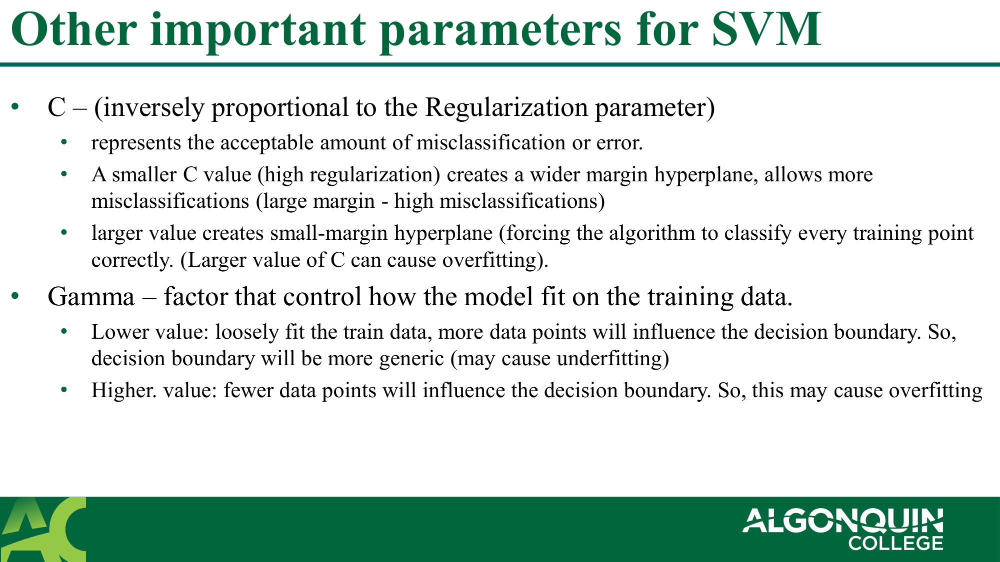

**C and Gamma Parameters:** Explains the impact of tuning Regularization $C$ and the area of influence Gamma ($\gamma$).

**C 和 Gamma 的参数意义：** 解释了调节正则化系数 $C$ 和影响范围参数 $\gamma$ 所带来的表现变化。

- **C** – (inversely proportional to the Regularization parameter) — **C** – （与正则化参数成反比）
  - represents the acceptable amount of misclassification or error. — 表示可接受的错误分类或误差数量。
  - A **smaller C** value (high regularization) creates a wider margin hyperplane, allows more misclassifications (large margin - high misclassifications) — 较小的 **C** 值（强正则化）产生更宽间隔的超平面，允许更多的误分类。
  - **larger value** creates small-margin hyperplane (forcing the algorithm to classify every training point correctly. Larger value of C can cause overfitting). — 较大值会产生极窄的硬边界（迫使算法将每个训练点正确分类。C 值过大容易导致极度过拟合）。
- **Gamma** – factor that control how the model fit on the training data. — **Gamma** – 控制模型拟合训练数据程度的因素。
  - **Lower value:** loosely fit the train data, more data points will influence the decision boundary. decision boundary will be more generic (may cause underfitting) — 较小值：松散拟合数据，较多数据点影响边界，可能欠拟合。
  - **Higher value:** fewer data points will influence the decision boundary. So, this may cause overfitting — 较高值：少数孤立点会极大地影响决策边界收缩（就像高斯孤岛）。极易过拟合。

> **📝 Notes:**
>
> **💡 Intuition:**
> **(1) Parameter C (Cost of violation) (惩罚系数 C):**
>
> Think of $C$ as the "Cost". A low $C$ means mistakes are cheap ("soft" margin). A high $C$ means mistakes are expensive, so the model panics and aggressively wiggles the boundary trying to perfectly enclose every single point.
>
>> 把 $C$ 当作违例"成本"。低 $C$ 意味着犯错成本很低（非常"软"的间隔）。高 $C$ 意味着错分代价极为高昂，所以模型会恐慌并剧烈地扭曲决策面，拼命地试图完美圈出包裹每一个孤立点。
>>
>
> **(2) Parameter Gamma (Sphere of Influence) ($\gamma$ 影响范围):**
>
> Gamma is the radius of influence of a single support vector. Low Gamma = points have a massive radius of influence, creating smooth/broad boundaries. High Gamma = short radius, creating tight "islands" around the support vectors.
>
>> Gamma 是单个支持向量能波及的"辐射半径"。低 Gamma = 每个点的影响范围特别广，从而产生极平滑且广阔的边界。高 Gamma = 影响只局限在点周围很短的距离，从而在个别数据点周围形成死气沉沉的独立"孤岛边界"。
>>
>
> **📝 Exam:**
> **(1) 调节选择题 (Tuning / Overfitting choice):**
>
> "Your SVM model is heavily overfitting the training data. Which settings should you adjust?" → Decrease $C$ and decrease $\gamma$. This forces looser rules and broader, less sensitive boundaries.
>
>> "你的支持向量机模型严重过拟合训练数据。你应当调整哪些设定？" → 降低 $C$ 和降低 $\gamma$。这将迫使使用更宽松的模型限制和更广泛、不那么敏感的决策波段。
>>

---

## 7. 优缺点概览 (Advantages & Disadvantages)

**Advantages & Disadvantages:** Final summary showing why SVM is still used today (high dimensional spaces) and why it's avoided on big data.

**优缺点综述：** 结尾总结，展示了为何SVM至今仍在高维空间中有使用价值，以及为什么在大数据时代我们要避开它。

- **Advantages** — **优点**
  - High accuracy, faster prediction — 高准确度，预测快（推理阶段）
  - **Memory efficient** — 在内存中非常高效
  - Works well if the dataset is small, classes separable — 如果数据集很小，类别可分，效果特别好
  - **Effective in high-dimensional space** — 处理极高维空间非常有效
  - Effective when number of dimensions greater than the number of instances — 甚至在特征维度比实际可用样本数据还要多的时候仍然非常有效！
  - Variety of kernel functions — 可切换多种核函数来应对各种复杂的分布
- **Disadvantages** — **缺点**
  - **Not suitable for larger datasets** — 完全不适合大规模或百万级数据集
  - Poor performance on overlapping classes — 如果类分布严重重叠交融无边界，效果极差
  - Highly sensitive to the type of kernel — 极其依赖你选择对了哪个核并调优好了其专属超参数

> **📝 Notes:**
>
> **🎯 Why:**
> **(1) Memory Efficient (内存高效的原因):**
>
> In inference mode (predicting new data), the SVM ONLY needs the coordinates of its retained Support Vectors. The rest of the multimillion-point training dataset is literally deleted from RAM.
>
>> 在预测推理阶段，SVM 只需要保留那些被选为支持向量（Support Vectors）的点的位置坐标就够了。剩下的那几百万行用来给模型学基本轮廓的训练数据可以直接从内存中全部抛弃删除。
>>
>
> **⚠️ Pitfall:**
> **(1) The O(N²) Trap for Big Data (大数据的平方陷阱):**
>
> SVM solves a quadratic optimization problem. The training time scales roughly between $O(n_{samples}^2)$ and $O(n_{samples}^3)$. Training an SVM on 1,000 points takes seconds. Training it on 1 million points could take weeks. This is why Deep Learning killed SVMs for massive scale data.
>
>> SVM 背后求解的是一个二次最优化问题。它的训练时间大致位于 $O(长_{样本}^2)$ 到 $O(长度_{样本}^3)$ 比例缩放之间递增。把 1,000 个点喂给 SVM 大约就几秒；然而把 100万样本点丢进去，跑上几个星期都算不完。这就是在大规模数据时代，大家全面倒向深度学习的原因。
>>

---

## 8. 参考文献 (References)

- https://towardsdatascience.com/support-vector-machine-introduction-to-machine-learning-algorithms-934a444fca47
- https://www.analyticsvidhya.com/blog/2021/10/support-vector-machinessvm-a-complete-guide-for-beginners/
- https://towardsdatascience.com/hyperparameter-tuning-for-support-vector-machines-c-and-gamma-parameters-6a5097416167/
- https://www.geeksforgeeks.org/machine-learning/gamma-parameter-in-svm/
