# Week 4: 循环神经网络 (Recurrent Neural Networks)

> Source: `04_CST8506_RNN.pdf`
> Total slides: 38
> Instructor: Dr. Abbas Akkasi | Winter 2025

---

## 1. 前馈网络回顾 (Review of Feed Forward Networks)


**Review on Feed Forward Network:** This slide shows the basic FNN architecture with arrows pointing in one direction only (input → hidden → output). No loops or cycles exist in the network.

**前馈网络回顾：** 这张幻灯片展示了基本的FNN架构，箭头只指向一个方向（输入 → 隐藏层 → 输出）。网络中不存在循环。

- Information flows only in the **forward direction**. No cycles or Loops. — 信息仅沿**前向方向**流动。没有循环或回路。
- Decisions are based on **current input**, no memory about the past — 决策仅基于**当前输入**，没有关于过去的记忆
- Doesn't know how to handle **sequential data** — 不知道如何处理**序列数据**


---

## 2. 动机 (Motivation)


**Questions slide:** Lists real-world applications that require understanding sequences, including autocomplete, translation, speech recognition, music generation, and price prediction.

**问题幻灯片：** 列出了需要理解序列的现实应用，包括自动补全、翻译、语音识别、音乐生成和价格预测。

**Questions:**

- How Google's autocomplete feature predicts the **next word** when a user is typing? — Google的自动补全功能如何在用户打字时预测**下一个词**？
- How Translators converting sentences from **English to French**? — 翻译器如何将句子从**英语转换为法语**？
- How Siri or Google Assistant converting **spoken words into text**? — Siri或Google助手如何将**语音转换为文本**？
- How AI composes **melodies** or generates background music? — AI如何创作**旋律**或生成背景音乐？
- How it is possible to predict the **future prices** based on historical trends? — 如何基于历史趋势预测**未来价格**？

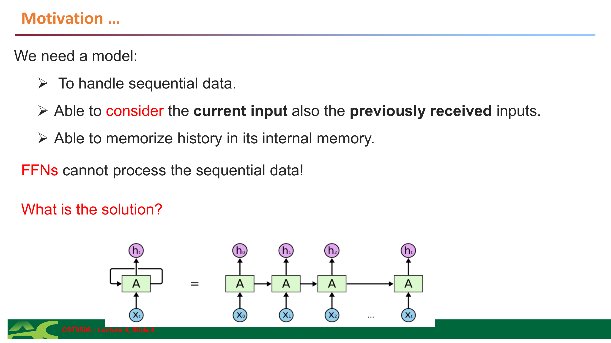

**Solution slide:** Introduces RNN as the solution to sequential data processing, highlighting the need for memory.

**解决方案幻灯片：** 将RNN作为序列数据处理的解决方案，强调对记忆的需求。

**We need a model:**

- To handle **sequential data** — 处理**序列数据**
- Able to consider the **current input** also the **previously received inputs** — 能够考虑**当前输入**以及**之前接收的输入**
- Able to **memorize history** in its internal memory — 能够在内部记忆中**记住历史**

**FFNs cannot process the sequential data!**

**What is the solution? Recurrent Neural Networks (RNNs)**


---

## 3. 序列数据应用 (Usages of Sequence Data)


**Examples slide:** Shows six common applications of sequence models with brief descriptions.

**示例幻灯片：** 展示了序列模型的六个常见应用及简要描述。

**Examples:**

- **Speech recognition** (audio clip to text) — **语音识别**（音频片段转文本）
- **Sentiment analysis** (sequence of text to number of stars) — **情感分析**（文本序列转星级评分）
- **DNA Sequence analysis** — **DNA序列分析**
- **Machine translation** (sequence of text in one language translated to another) — **机器翻译**（一种语言的文本序列翻译成另一种语言）
- **Video activity recognition** (detect the activity from a sequence of video frames) — **视频活动识别**（从视频帧序列中检测活动）
- **Time Series Forecasting** — **时间序列预测**


---

## 4. 时间序列 (Time Series)

### 4.1 概念定义 (Definition)

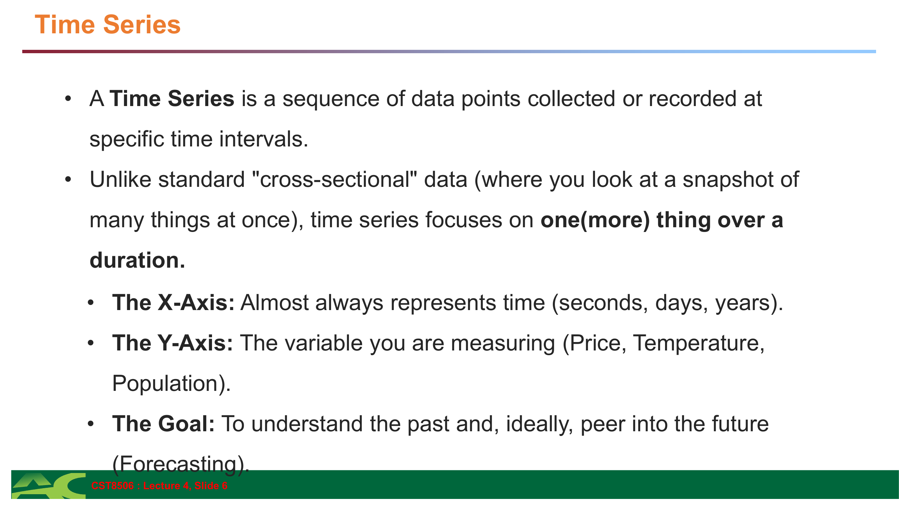

**Definition slide:** Explains time series with X-axis/Y-axis interpretation and the forecasting goal.

**定义幻灯片：** 用X轴/Y轴解释时间序列以及预测目标。

- A **Time Series** is a sequence of data points collected or recorded at specific time intervals. — **时间序列**是在特定时间间隔收集或记录的数据点序列。
- Unlike standard "cross-sectional" data (where you look at a snapshot of many things at once), time series focuses on **one (or more) thing over a duration**. — 与标准的"横截面"数据（一次查看多个事物的快照）不同，时间序列关注**一个（或多个）事物随时间的变化**。
- **The X-Axis:** Almost always represents time (seconds, days, years). — **X轴：** 几乎总是代表时间（秒、天、年）。
- **The Y-Axis:** The variable you are measuring (Price, Temperature, Population). — **Y轴：** 你测量的变量（价格、温度、人口）。
- **The Goal:** To understand the past and, ideally, peer into the future (**Forecasting**). — **目标：** 理解过去，理想情况下，预见未来（**预测**）。

### 4.2 示例：航空乘客数据 (Example: Air Passengers)

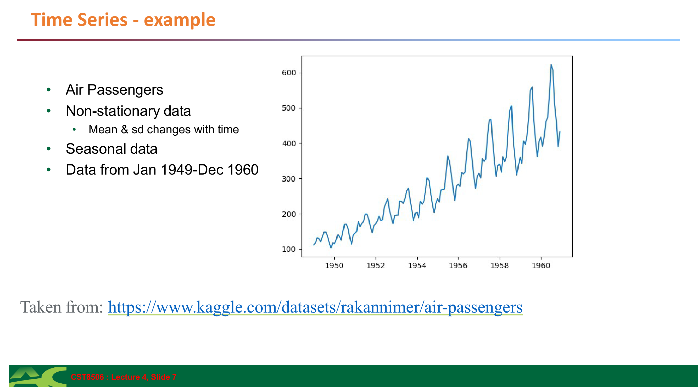

**Air Passengers plot:** Shows a classic time series with visible upward trend and seasonal pattern (peaks in summer months).

**航空乘客图：** 展示了一个经典的时间序列，具有明显的上升趋势和季节性模式（夏季月份的峰值）。

- **Air Passengers** dataset — **航空乘客**数据集
- **Non-stationary data** — Mean & sd changes with time — **非平稳数据** — 均值和标准差随时间变化
- **Seasonal data** — **季节性数据**
- Data from Jan 1949 - Dec 1960 — 数据来自1949年1月至1960年12月

Ref: https://www.kaggle.com/datasets/rakannimer/air-passengers

### 4.3 时间序列成分 (Time Series Components)


**Components definition slide:** Lists the four components of time series decomposition.

**成分定义幻灯片：** 列出时间序列分解的四个成分。

1. **Trend:** The long-term "direction." Is it generally going up, down, or staying flat? — **趋势：** 长期"方向"。总体是上升、下降还是持平？
2. **Seasonal:** Patterns that repeat over a fixed period (e.g., retail sales spiking every December). — **季节性：** 在固定周期内重复的模式（例如，每年12月零售销售激增）。
3. **Cycle:** A cycle is a long-term fluctuation in a time series that repeats, but **NOT at a fixed, regular interval**. — **周期：** 时间序列中重复的长期波动，但**不是在固定的、规则的间隔**。
4. **Noise (Residuals):** The random "hiccups" in the data that can't be explained by the other three. — **噪声（残差）：** 数据中无法被其他三个成分解释的随机"波动"。

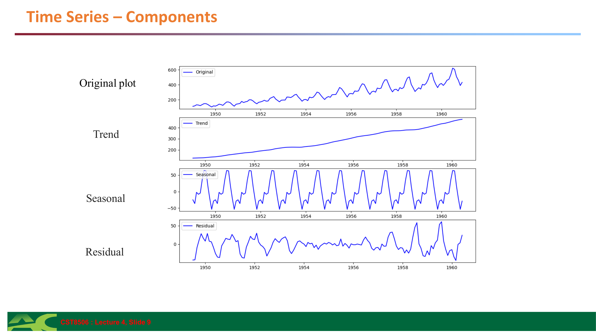

**Decomposition visualization:** Shows the original plot broken down into Trend, Seasonal, and Residual components.

**分解可视化：** 展示原始图分解为趋势、季节性和残差成分。

**Decomposition:**

- Original plot — 原始图
- Trend — 趋势
- Seasonal — 季节性
- Residual — 残差


---

## 5. 循环神经网络 (Recurrent Neural Networks)

### 5.1 RNN 概述 (RNN Overview)

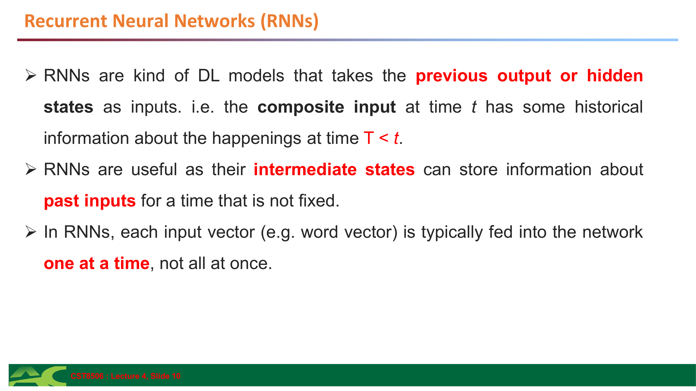

**RNN introduction slide:** Describes RNN's key property of using previous hidden states as inputs.

**RNN介绍幻灯片：** 描述了RNN使用先前隐藏状态作为输入的关键特性。

- RNNs are kind of DL models that takes the **previous output or hidden states as inputs**. i.e. the composite input at time t has some historical information about the happenings at time T < t. — RNN是一种深度学习模型，将**先前的输出或隐藏状态作为输入**。即，时间t的复合输入包含关于时间T < t发生事件的历史信息。
- RNNs are useful as their **intermediate states can store information** about past inputs for a time that is not fixed. — RNN很有用，因为它们的**中间状态可以存储**关于过去输入的信息，存储时间不固定。
- In RNNs, each input vector (e.g. word vector) is typically fed into the network **one at a time**, not all at once. — 在RNN中，每个输入向量（例如词向量）通常**一次一个**地输入网络，而不是一次全部输入。

### 5.2 RNN 与 FFN 对比 (RNN vs FFN)


**Architecture comparison:** Side-by-side diagram showing FFN (no loop) vs RNN (with loop from hidden state back to itself). The RNN shows the same cell repeated across time steps.

**架构对比：** 并排图显示FFN（无循环）vs RNN（隐藏状态循环回自身）。RNN显示同一单元在时间步上重复。

**FFNs vs RNNs Architecture:**

- **FFNs:** `X → h → y` (single pass, no feedback) — **FFN：** `X → h → y`（单次传递，无反馈）
- **RNNs:** `X_t → h_t → y_t` with hidden state `h_{t-1}` feeding back (loop/recurrence) — **RNN：** `X_t → h_t → y_t`，隐藏状态 `h_{t-1}`反馈（循环/递归）

### 5.3 RNN 公式 (RNN Formula)

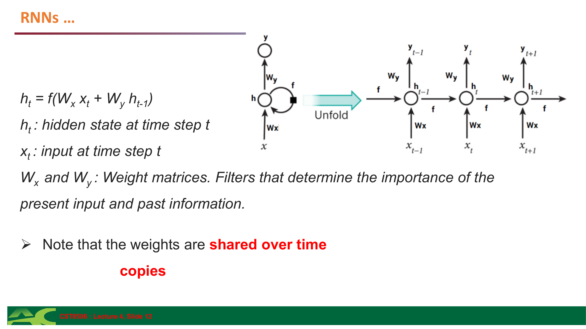

**Formula slide:** Shows the core RNN equation with explanation of weight sharing across time.

**公式幻灯片：** 展示了核心RNN方程以及权重在时间上共享的解释。

**Hidden state formula:**

$$h_t = f(W_x \cdot x_t + W_h \cdot h_{t-1})$$

- $h_t$ = hidden state at time step $t$ — 时间步 $t$ 的隐藏状态
- $x_t$ = input at time step $t$ — 时间步 $t$ 的输入
- $W_x$ = weight matrix for input — 输入的权重矩阵
- $W_h$ = weight matrix for previous hidden state — 前一隐藏状态的权重矩阵
- $f$ = activation function (typically tanh) — 激活函数（通常是 tanh）

**Key Points:**

- Note that the **weights are shared over time** — 注意**权重在时间上是共享的**
- Essentially, copies of the RNN cell are made over time (**unrolling/unfolding**), with different inputs at different time steps. — 本质上，RNN单元在时间上被复制（**展开**），在不同时间步有不同的输入。


---

## 6. 输入输出场景与示例 (Input-Output Scenarios)

### 6.1 图像描述示例 (Image Captioning Example)


**Image captioning problem statement:** Shows an image of a dog with the caption "The dog is hiding".

**图像描述问题陈述：** 展示了一张狗的图片，标题为"The dog is hiding"。

**Problem:** Given an image, produce a sentence describing its contents

- **Inputs:** Image feature (from a CNN) — **输入：** 图像特征（来自CNN）
- **Outputs:** Multiple words — **输出：** 多个词

Example: "The dog is hiding"


**Basic architecture:** CNN extracts features, which are fed to RNN.

**基本架构：** CNN提取特征，然后输入RNN。


**Step 1:** CNN output initializes the first RNN hidden state, which goes through a classifier to produce "The".

**步骤1：** CNN输出初始化第一个RNN隐藏状态，通过分类器产生"The"。

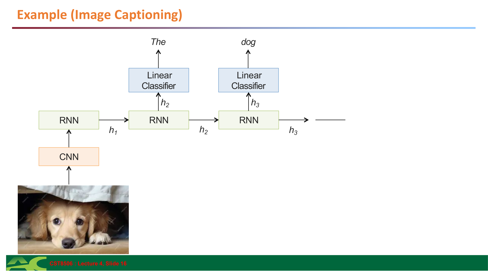

**Step 2:** The previous word "The" and hidden state are fed to produce "dog". This continues until the sentence is complete.

**步骤2：** 前一个词"The"和隐藏状态被输入以产生"dog"。这个过程继续直到句子完成。

**Architecture:** CNN extracts image features → RNN generates caption

**Step-by-step:**

- CNN output → RNN → first hidden state → Linear Classifier → "The"
- Continue: → RNN → next hidden state → Linear Classifier → "dog"

### 6.2 输入输出类型 (Input-Output Types)


**Taxonomy of RNN architectures:** Four different input-output configurations shown as diagrams with examples.

**RNN架构分类：** 四种不同的输入输出配置以图表形式展示，附有示例。

| Type                    | Scenario                       | Example                     |
| ----------------------- | ------------------------------ | --------------------------- |
| **Single - Single**     | Feed-forward Network           | Classification              |
| **Single - Multiple**   | Image Captioning               | Image → "The dog is hiding" |
| **Multiple - Single**   | Sentiment Classification       | Text → Rating               |
| **Multiple - Multiple** | Translation / Video Captioning | Sequence → Sequence         |


---

## 7. 损失函数 (Loss Functions)

### 7.1 概述 (Overview)


**Loss function overview:** General definition and categories of loss functions.

**损失函数概述：** 损失函数的一般定义和类别。

- Method to evaluate how well an algorithm models the given data — 评估算法对给定数据建模效果的方法
- Quantifies the **error between the output and the target** — 量化**输出与目标之间的误差**
- Also known as **cost function** or **error function** — 也称为**代价函数**或**误差函数**

**Categories:**

- Regression Losses — 回归损失
- Probabilistic Losses — 概率损失
- Hinge Losses for maximum-margin classification — 最大间隔分类的Hinge损失

Ref: https://keras.io/api/losses/

### 7.2 回归损失函数 (Regression Loss Functions)

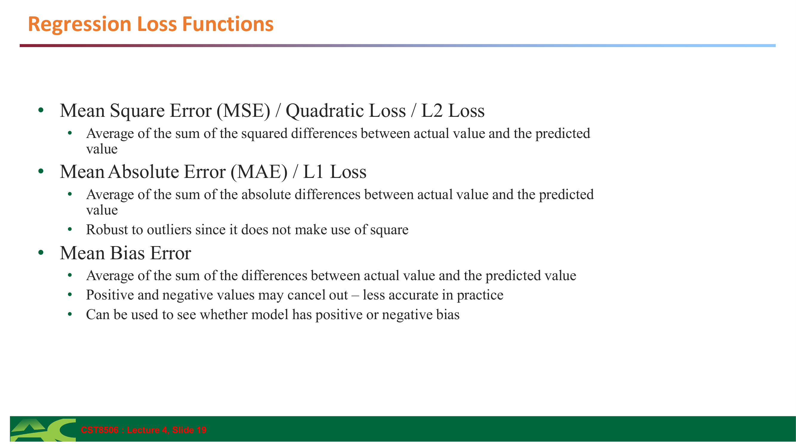

**Regression losses:** Definitions of MSE, MAE, and Mean Bias Error.

**回归损失：** MSE、MAE和平均偏差误差的定义。

**Mean Square Error (MSE) / Quadratic Loss / L2 Loss:**

$$\text{MSE} = \frac{1}{n} \sum_{i=1}^{n}(y_i - \hat{y}_i)^2$$

- $y$ = actual value, $\hat{y}$ = predicted value, $n$ = number of samples
- Penalizes large errors more heavily (squared term)

- Average of the sum of the **squared differences** between actual value and the predicted value — 实际值与预测值之间**平方差**的总和的平均值

**Mean Absolute Error (MAE) / L1 Loss:**

$$\text{MAE} = \frac{1}{n} \sum_{i=1}^{n}|y_i - \hat{y}_i|$$

- Takes absolute difference, not squared
- **Robust to outliers** since it does not make use of square

- Average of the sum of the **absolute differences** between actual value and the predicted value — 实际值与预测值之间**绝对差**的总和的平均值

**Mean Bias Error:**

$$\text{MBE} = \frac{1}{n} \sum_{i=1}^{n}(y_i - \hat{y}_i)$$

- No absolute value or square — can be positive or negative
- Positive and negative values may cancel out – less accurate in practice
- Can be used to see whether model has **positive or negative bias**


**MSE & MAE visualization:** Shows how MSE and MAE differ in penalizing errors.

**MSE和MAE可视化：** 展示MSE和MAE在惩罚误差方面的差异。

### 7.3 概率损失函数 (Probabilistic Loss Functions)


**Cross Entropy losses:** Used when model outputs probabilities rather than class labels.

**交叉熵损失：** 当模型输出概率而不是类别标签时使用。

Used when a model predicts **probabilities** for different classes instead of class labels — 当模型预测不同类别的**概率**而不是类别标签时使用

**Cross Entropy (also known as log loss):**

$$\text{CE} = -\sum_{i} y_i \cdot \log(\hat{y}_i)$$

- $y$ = true distribution (one-hot), $\hat{y}$ = predicted probabilities
- Measure of the **difference between two probability distributions** (predicted vs actual)

**Types:**

- **Binary Cross Entropy** (two classes – 0 and 1 as class labels) — **二元交叉熵**（两个类别 – 0和1作为类别标签）
- **Categorical Cross Entropy** (one-hot encoded class labels) — **分类交叉熵**（独热编码的类别标签）
- **Sparse Categorical Cross Entropy** (integers as class labels) — **稀疏分类交叉熵**（整数作为类别标签）

### 7.4 Hinge Loss

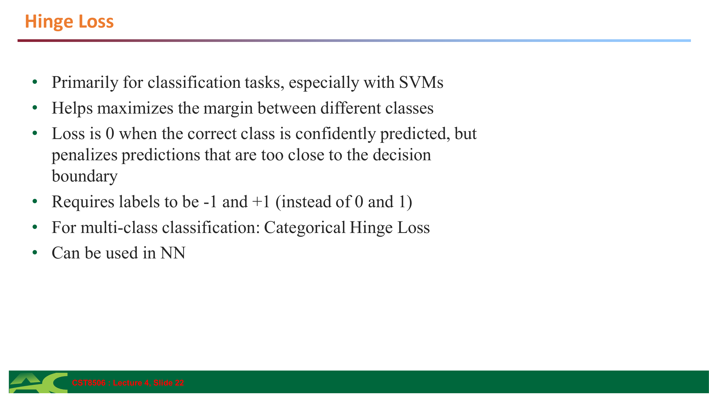

**Hinge loss:** Used for SVMs and maximum-margin classifiers.

**Hinge损失：** 用于SVM和最大间隔分类器。

$$\text{Hinge} = \max(0, 1 - y \cdot \hat{y})$$

- $y \in \{-1, +1\}$, $\hat{y}$ = raw model output (not probability)

- Primarily for classification tasks, especially with **SVMs** — 主要用于分类任务，特别是**SVM**
- Helps maximizes the **margin** between different classes — 帮助最大化不同类别之间的**间隔**
- Loss is **0** when the correct class is confidently predicted, but penalizes predictions that are too close to the decision boundary — 当正确类别被自信地预测时损失为**0**，但惩罚太接近决策边界的预测
- Requires labels to be **-1 and +1** (instead of 0 and 1) — 要求标签为**-1和+1**（而不是0和1）
- For multi-class classification: **Categorical Hinge Loss** — 对于多类分类：**分类Hinge损失**
- Can be used in NN — 可以在神经网络中使用


---

## 8. 反向传播与BPTT (Backpropagation and BPTT)

### 8.1 反向传播回顾 (Backpropagation Refresher)


**Backpropagation diagram:** Shows the chain rule applied to a 2-layer network. Gradients flow backward from loss to weights.

**反向传播图：** 展示了应用于2层网络的链式法则。梯度从损失向权重反向流动。

**Standard Backpropagation:**

- For a 2-layer network: `f₁(x; W₁) → f₂(ŷ₁; W₂) → ŷ₂ → Loss(y, ŷ₂)`

**Gradient Descent:**

$$W = W - \alpha \cdot \frac{\partial L}{\partial W}$$

- $W$ = weights, $\alpha$ = learning rate, $L$ = loss

**Chain Rule:**

$$\frac{\partial L}{\partial W_1} = \frac{\partial L}{\partial \hat{y}_2} \cdot \frac{\partial \hat{y}_2}{\partial \hat{y}_1} \cdot \frac{\partial \hat{y}_1}{\partial W_1}$$

- Gradient flows backward through layers

### 8.2 时间反向传播 (BPTT)


**BPTT concept:** Explains how backpropagation is adapted for RNNs by unrolling through time.

**BPTT概念：** 解释了如何通过在时间上展开来将反向传播适应于RNN。

- In a normal neural network, we use backpropagation to update weights by calculating gradients **layer by layer**. — 在普通神经网络中，我们使用反向传播通过**逐层**计算梯度来更新权重。
- In an RNN, the same **weights are used at every time step**, and the network is "unrolled" across time steps. — 在RNN中，**每个时间步使用相同的权重**，网络在时间步上"展开"。

**BPTT means we compute gradients across all these time steps and update the shared weights.** — **BPTT意味着我们计算所有这些时间步的梯度并更新共享权重。**

- The weight updates are computed for each copy in the unfolded network, then **summed (or averaged)** and then applied to the RNN weights. — 权重更新在展开网络的每个副本中计算，然后**求和（或平均）**，然后应用于RNN权重。

### 8.3 BPTT 展开图 (BPTT Unfolded RNN)


**Forward pass diagram:** Shows the unrolled RNN with inputs x₁, x₂, x₃ feeding into hidden states h₁, h₂, h₃ and producing outputs ŷ₁, ŷ₂, ŷ₃ with losses L₁, L₂, L₃.

**前向传播图：** 展示了展开的RNN，输入x₁, x₂, x₃输入到隐藏状态h₁, h₂, h₃并产生输出ŷ₁, ŷ₂, ŷ₃以及损失L₁, L₂, L₃。

**Forward Pass:**

```
x₁ → h₁ → ŷ₁ → L₁
x₂ → h₂ → ŷ₂ → L₂
x₃ → h₃ → ŷ₃ → L₃
```

(With h₀ as initial hidden state)


**Backward pass diagram:** Shows gradients flowing backward through time with the chain rule multiplying through multiple time steps.

**反向传播图：** 展示了梯度通过时间向后流动，链式法则通过多个时间步相乘。

**Backward Pass:**

- Gradients flow back through time — 梯度通过时间向后流动
- $\frac{\partial L}{\partial W} = \sum_t \frac{\partial L_t}{\partial W}$ summed over all time steps — $\frac{\partial L}{\partial W} = \sum_t \frac{\partial L_t}{\partial W}$ 在所有时间步上求和
- Requires multiplying gradients through many time steps — 需要通过许多时间步相乘梯度


---

## 9. 梯度消失问题 (Vanishing Gradient Problem)

### 9.1 问题描述 (Problem Description)

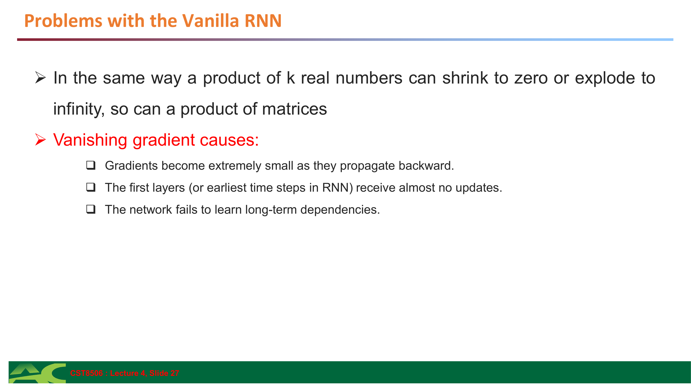

**Vanishing gradient explanation:** Shows how repeated multiplication can cause gradients to shrink to zero.

**梯度消失解释：** 展示了重复乘法如何导致梯度收缩为零。

**Problems with the Vanilla RNN:**

- In the same way a product of k real numbers can shrink to zero or explode to infinity, so can a **product of matrices** — 就像k个实数的乘积可以收缩为零或爆炸到无穷大一样，**矩阵的乘积**也可以

**Vanishing gradient causes:**

- Gradients become **extremely small** as they propagate backward — 梯度在向后传播时变得**极小**
- The **first layers (or earliest time steps in RNN)** receive almost no updates — **第一层（或RNN中最早的时间步）**几乎不接收更新
- The network **fails to learn long-term dependencies** — 网络**无法学习长期依赖**

### 9.2 解决方案 (Solutions)


**Five solutions:** Lists approaches to mitigate vanishing gradients.

**五种解决方案：** 列出减轻梯度消失的方法。

1. **Use Gated Architectures (LSTM / GRU)** — **使用门控架构（LSTM / GRU）**
2. **Gradient Clipping** — Prevents gradients from becoming too small or too large — **梯度裁剪** — 防止梯度变得太小或太大
3. **Use Activation Functions Carefully** — functions like ReLU (instead of tanh or sigmoid) do not squash values as much — **谨慎使用激活函数** — ReLU（代替tanh或sigmoid）不会过度压缩值
4. **Layer Normalization / Batch Normalization** — Normalizes activations to keep values in a stable range — **层归一化/批归一化** — 归一化激活值以保持值在稳定范围内
5. **Use Shorter Sequences** — Backpropagating through fewer time steps reduces gradient decay — **使用更短的序列** — 通过更少的时间步反向传播减少梯度衰减


---

## 10. 长短期记忆网络 (Long Short-Term Memory - LSTM)

### 10.1 LSTM 概述 (LSTM Overview)


**LSTM introduction:** Describes LSTM as a special RNN capable of learning long-term dependencies, with citation.

**LSTM介绍：** 将LSTM描述为一种能够学习长期依赖的特殊RNN，附有引用。

**Long Short Term Memory networks** – usually just called "LSTMs" – are a special kind of RNN, capable of learning **long-term dependencies**.

- Introduced by **Hochreiter & Schmidhuber (1997)** — 由**Hochreiter & Schmidhuber (1997)**提出


**LSTM vs RNN architecture:** Shows that LSTM's repeating module contains more complex structure than vanilla RNN's single layer.

**LSTM vs RNN架构：** 显示LSTM的重复模块比普通RNN的单层包含更复杂的结构。

**The repeating module in a standard LSTM contains a single layer** (vs multiple interacting gates in LSTM)

### 10.2 LSTM 核心概念 (Core Concepts)

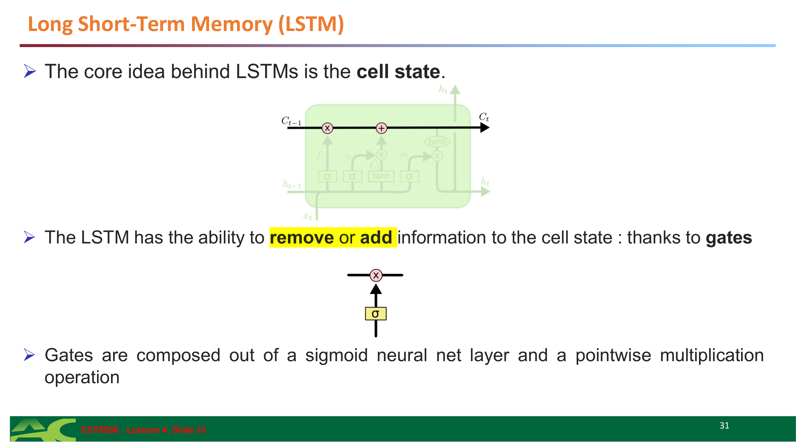

**Cell state and gates:** The key innovation of LSTM is the cell state (the horizontal line at top) and gates that control information flow.

**细胞状态和门：** LSTM的关键创新是细胞状态（顶部的水平线）和控制信息流的门。

- The core idea behind LSTMs is the **cell state** — LSTM的核心思想是**细胞状态**
- The LSTM has the ability to **remove or add information** to the cell state: thanks to **gates** — LSTM有能力**删除或添加信息**到细胞状态：多亏了**门**
- Gates are composed out of a **sigmoid neural net layer** and a **pointwise multiplication operation** — 门由**sigmoid神经网络层**和**逐点乘法运算**组成

### 10.3 LSTM 步骤详解 (Step-by-Step LSTM Walk Through)

#### Step 1: 遗忘门 (Forget Gate)


**Forget gate diagram:** Shows the sigmoid layer that outputs values between 0 and 1, controlling what to forget from the cell state.

**遗忘门图：** 显示输出0到1之间值的sigmoid层，控制从细胞状态中遗忘什么。

**Decide what information to throw away from the cell state, forget layer.**

$$f_t = \sigma(W_f \cdot [h_{t-1}, x_t] + b_f)$$

- $f_t$ = forget gate output (0 to 1 for each dimension)
- $\sigma$ = sigmoid function
- $[h_{t-1}, x_t]$ = concatenation of previous hidden state and current input

- `1` represents **"completely keep this"** — `1`表示**"完全保留"**
- `0` represents **"completely get rid of this"** — `0`表示**"完全丢弃"**

#### Step 2: 输入门 (Input Gate)


**Input gate diagram:** Shows two parts: (1) sigmoid layer deciding what to update, (2) tanh layer creating candidate values.

**输入门图：** 显示两部分：(1) sigmoid层决定更新什么，(2) tanh层创建候选值。

**Decide what new information we're going to store in the cell state:**

$$i_t = \sigma(W_i \cdot [h_{t-1}, x_t] + b_i)$$

$$\tilde{C}_t = \tanh(W_C \cdot [h_{t-1}, x_t] + b_C)$$

- $i_t$ = Input gate (what to update)
- $\tilde{C}_t$ = Candidate values (new information)
- **Input gate layer:** decides which values we will update — **输入门层：** 决定我们将更新哪些值
- **Tanh layer:** creates a vector of new candidate values — **Tanh层：** 创建新候选值的向量

Example: "I grew up in France… I speak fluent French." — 示例："我在法国长大...我说流利的法语。"

#### Step 3: 更新细胞状态 (Update Cell State)


**Cell state update:** Shows the formula combining forget gate output, old cell state, input gate output, and candidate values.

**细胞状态更新：** 显示结合遗忘门输出、旧细胞状态、输入门输出和候选值的公式。

**Update the cell state:**

$$C_t = f_t \odot C_{t-1} + i_t \odot \tilde{C}_t$$

- $f_t \odot C_{t-1}$: old state scaled by forget gate
- $i_t \odot \tilde{C}_t$: new info scaled by input gate

- Multiply old state by forget gate output — 将旧状态乘以遗忘门输出
- Add new candidate values scaled by input gate output — 添加由输入门输出缩放的新候选值

#### Step 4: 输出门 (Output Gate)

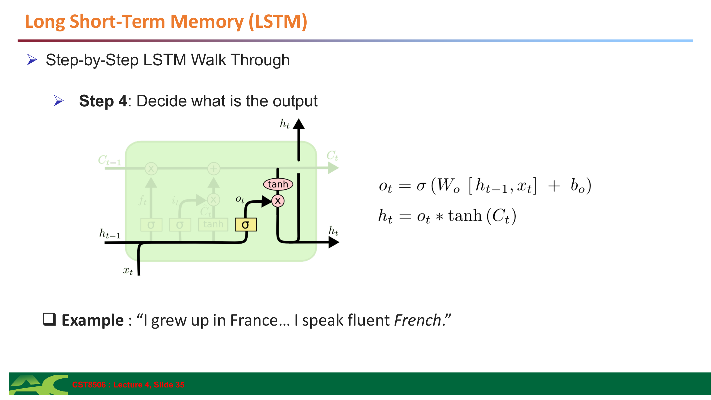

**Output gate diagram:** Shows sigmoid deciding what parts of cell state to output, then cell state through tanh multiplied by that decision.

**输出门图：** 显示sigmoid决定细胞状态的哪些部分输出，然后细胞状态通过tanh乘以该决定。

**Decide what is the output:**

$$o_t = \sigma(W_o \cdot [h_{t-1}, x_t] + b_o)$$

$$h_t = o_t \odot \tanh(C_t)$$

- $o_t$ = Output gate
- $h_t$ = Hidden state output
- Sigmoid layer decides what parts of the cell state to output — Sigmoid层决定细胞状态的哪些部分输出
- Cell state passed through tanh and multiplied by sigmoid output — 细胞状态通过tanh并乘以sigmoid输出

Example: "I grew up in France… I speak fluent French." — 示例："我在法国长大...我说流利的法语。"


---

## 11. 总结 (Summary)


**Summary slide:** Lists all topics covered in the lecture.

**总结幻灯片：** 列出了本讲座涵盖的所有主题。

**Topics Covered:**

- FNN – Review — FNN回顾
- Motivation — 动机
- Usages of Sequential Data — 序列数据的应用
- Time Series — 时间序列
- Time Series – Components — 时间序列成分
- Recurrent Neural Networks (RNNs) — 循环神经网络
- Backpropagation Refresher — 反向传播复习
- Backpropagation Through Time (BPTT) — 时间反向传播
- Vanishing Gradient Problem — 梯度消失问题
- Long-Short Term Memory (LSTM) — 长短期记忆

---
