# Week 5: 朴素贝叶斯分类器 (Naïve Bayes Classifier)

> Source: `Week5_NaiveBayes.pdf`
> Total slides: 28
> Instructor: Dr. Abbas Akkasi | Winter 2026

---

## 1. 课程概览 (Course Overview)

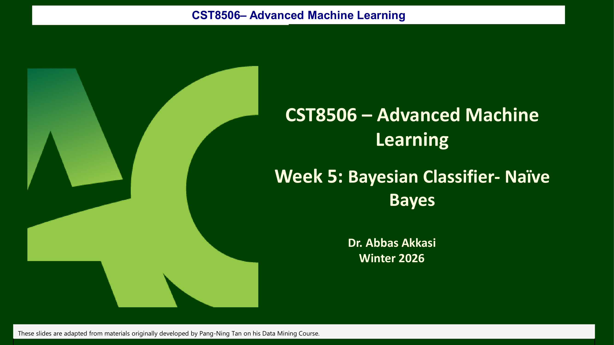

**Title slide:** CST8506 – Advanced Machine Learning, Week 5: Bayesian Classifier - Naïve Bayes. Adapted from materials originally developed by Pang-Ning Tan on his Data Mining Course.

**标题页：** CST8506 – 高级机器学习，第5周：贝叶斯分类器 - 朴素贝叶斯。改编自 Pang-Ning Tan 的数据挖掘课程材料。

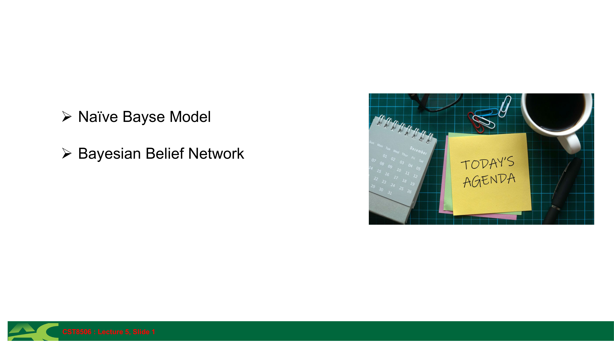

**Agenda slide:** Two main topics — Naïve Bayes Model and Bayesian Belief Network.

**议程页：** 两个主题 — 朴素贝叶斯模型和贝叶斯信念网络。

- **Naïve Bayes Model** — 朴素贝叶斯模型
- **Bayesian Belief Network** — 贝叶斯信念网络

> **📝 Notes:**
>
> _(To be added by note_taking skill)_

---

## 2. 贝叶斯分类器基础 (Bayes Classifier Foundations)

### 2.1 条件概率与贝叶斯定理 (Conditional Probability & Bayes Theorem)

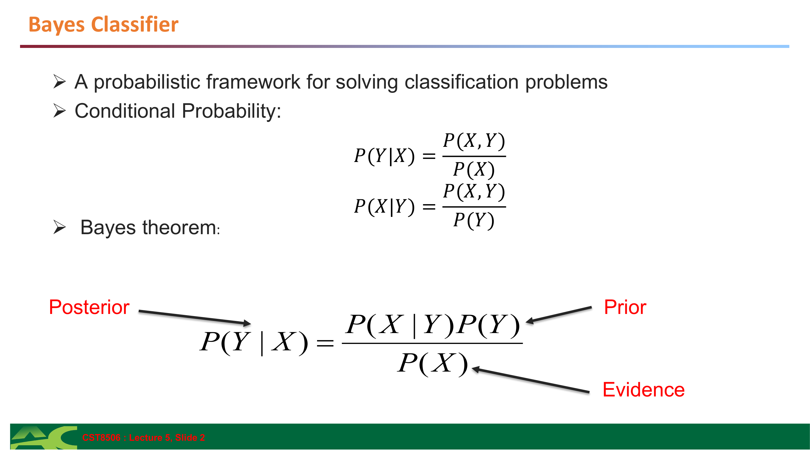

**Bayes Classifier slide:** Shows conditional probability formula and Bayes theorem with labeled components (Posterior, Prior, Evidence).

**贝叶斯分类器页：** 展示条件概率公式和贝叶斯定理，标注了各组成部分（后验、先验、证据）。

- A **probabilistic framework** for solving classification problems — 用于解决分类问题的**概率框架**
- **Conditional Probability:** P(Y|X) = P(X, Y) / P(X) — **条件概率：** P(Y|X) = P(X, Y) / P(X)
- **Bayes theorem:** P(Y|X) = P(X|Y) × P(Y) / P(X) — **贝叶斯定理：** P(Y|X) = P(X|Y) × P(Y) / P(X)
  - P(Y|X) = **Posterior** (后验概率)
  - P(X|Y) = **Likelihood** (似然)
  - P(Y) = **Prior** (先验概率)
  - P(X) = **Evidence** (证据)

### 2.2 条件概率示例 (Conditional Probability Example)

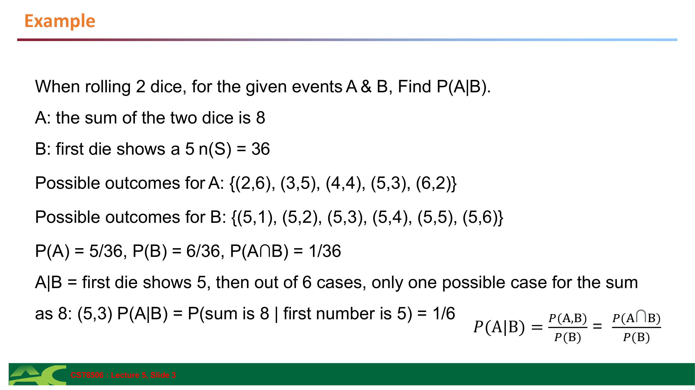

**Dice example:** When rolling 2 dice, find P(A|B) where A = sum is 8, B = first die shows 5.

**骰子示例：** 掷两个骰子，求 P(A|B)，其中 A = 两骰子之和为8，B = 第一个骰子为5。

- Possible outcomes for A: {(2,6), (3,5), (4,4), (5,3), (6,2)} → P(A) = 5/36
- Possible outcomes for B: {(5,1), (5,2), (5,3), (5,4), (5,5), (5,6)} → P(B) = 6/36
- P(A∩B) = 1/36 (only (5,3))
- P(A|B) = P(A∩B) / P(B) = (1/36) / (6/36) = **1/6**

> **📝 Notes:**
>
> **🎯 Why:**
> **(1) "Flip" the question (翻转问题):**
>
> In classification we want P(class|features), but we can only observe P(features|class) from training data. Bayes theorem lets us "flip" the conditional — compute what we _want_ from what we _have_.
>
> > 分类中我们想要 P(类别|特征)，但训练数据只能直接观察到 P(特征|类别)。贝叶斯定理让我们"翻转"条件概率——从我们**有的**计算我们**想要的**。
>
> **(2) Prior knowledge matters (先验知识很重要):**
>
> Unlike distance-based classifiers (e.g., SVM), Bayes explicitly incorporates **prior probability** P(Y). If 99% of emails are spam, even weak evidence should lean toward spam. Ignoring the base rate leads to wrong decisions (the "base rate fallacy").
>
> > 与基于距离的分类器（如SVM）不同，贝叶斯明确地纳入了**先验概率** P(Y)。如果99%的邮件是垃圾邮件，即使证据很弱也应倾向于垃圾邮件。忽略基础比率会导致错误决策（"基础率谬误"）。
>
> **💡 Intuition:**
> **(1) Medical test analogy (医学检测类比):**
>
> A disease test is 99% accurate. You test positive. Are you sick? It depends on how **rare** the disease is (the prior). If only 1 in 10,000 people have it, even with a positive test, your actual probability of being sick is only ~1%. Bayes theorem accounts for this base rate.
>
> > 一项疾病检测准确率99%。你检测阳性。你生病了吗？取决于疾病有多**罕见**（先验）。如果万人中只有1人患病，即使检测阳性，你实际生病的概率也只有约1%。贝叶斯定理考虑了这个基础率。
>
> **(2) Courtroom analogy (法庭类比):**
>
> P(Y) = prior belief (is the defendant likely guilty before evidence?). P(X|Y) = likelihood (how likely is this evidence if guilty?). P(Y|X) = posterior (updated belief after seeing evidence). The jury updates their belief as each piece of evidence is presented.
>
> > P(Y) = 先验信念（在看到证据前被告有多可能有罪？）。P(X|Y) = 似然（如果有罪，这个证据出现的可能性多大？）。P(Y|X) = 后验（看到证据后更新的信念）。陪审团随着每个证据的呈现更新他们的信念。
>
> **📐 Formula:**
> **(1) Bayes theorem decomposition (贝叶斯定理分解):**
>
> P(Y|X) = P(X|Y) × P(Y) / P(X)
>
> - P(Y|X): **Posterior** — the answer we want (probability of class given features)
> - P(X|Y): **Likelihood** — how probable are these features under each class
> - P(Y): **Prior** — how common is each class before seeing features
> - P(X): **Evidence** — normalizing constant (same for all classes, so often ignored in comparison)
>
> > P(Y|X) = P(X|Y) × P(Y) / P(X)
> >
> > - P(Y|X)：**后验概率** — 我们想要的答案（给定特征下类别的概率）
> > - P(X|Y)：**似然** — 在每个类别下这些特征出现的概率
> > - P(Y)：**先验** — 看到特征之前每个类别的频率
> > - P(X)：**证据** — 归一化常数（对所有类别相同，比较时常忽略）
>
> **🔢 Example:**
> **(1) Dice problem walkthrough (骰子问题演练):**
>
> **Problem:** Roll 2 dice. A = sum is 8. B = first die is 5. Find P(A|B).
> **Solution:**
>
> - Sample space n(S) = 36
> - A outcomes: {(2,6),(3,5),(4,4),(5,3),(6,2)} → P(A) = 5/36
> - B outcomes: {(5,1),(5,2),(5,3),(5,4),(5,5),(5,6)} → P(B) = 6/36
> - A∩B = {(5,3)} → P(A∩B) = 1/36
> - P(A|B) = P(A∩B)/P(B) = (1/36)/(6/36) = **1/6**
>
> > **题目：** 掷2个骰子。A = 和为8。B = 第一个骰子为5。求 P(A|B)。
> > **解：**
> >
> > - 样本空间 n(S) = 36
> > - A 的结果：{(2,6),(3,5),(4,4),(5,3),(6,2)} → P(A) = 5/36
> > - B 的结果：{(5,1),(5,2),(5,3),(5,4),(5,5),(5,6)} → P(B) = 6/36
> > - A∩B = {(5,3)} → P(A∩B) = 1/36
> > - P(A|B) = P(A∩B)/P(B) = (1/36)/(6/36) = **1/6**
>
> **⚠️ Pitfall:**
> **(1) Confusing P(A|B) with P(B|A) (混淆条件概率方向):**
>
> P(A|B) ≠ P(B|A) in general. P(sum=8 | first=5) = 1/6, but P(first=5 | sum=8) = 1/5. This asymmetry is the entire reason Bayes theorem is needed.
>
> > P(A|B) ≠ P(B|A)（一般情况下）。P(和=8|第一个=5) = 1/6，但 P(第一个=5|和=8) = 1/5。这种不对称性正是我们需要贝叶斯定理的根本原因。
>
> **(2) Ignoring the prior (忽略先验):**
>
> A common mistake is to compare only likelihoods P(X|Y) without multiplying by priors P(Y). When classes are imbalanced, the prior can completely flip the decision.
>
> > 常见错误是只比较似然 P(X|Y) 而不乘以先验 P(Y)。当类别不平衡时，先验可以完全扭转决策结果。
>
> **📝 Exam:**
> **(1) 计算题 (Calculation):**
>
> "Given P(X|Y), P(Y), compute P(Y|X)." → Apply Bayes formula directly. Remember to compute P(X) as denominator if asked for the actual probability (not just comparison).
>
> > "给定 P(X|Y)、P(Y)，计算 P(Y|X)。" → 直接应用贝叶斯公式。如果要求实际概率（而非仅比较），需要计算 P(X) 作为分母。
>
> **(2) 概念题 (Conceptual):**
>
> "What role does the prior play in Bayes classification?" → It encodes the base rate of each class. Without it, rare diseases would be over-diagnosed (high likelihood ≠ high probability).
>
> > "先验在贝叶斯分类中扮演什么角色？" → 它编码了每个类别的基础比率。没有它，罕见疾病会被过度诊断（高似然 ≠ 高概率）。

---

## 3. 将贝叶斯定理用于分类 (Using Bayes Theorem for Classification)

### 3.1 分类问题的概率表述 (Probabilistic Formulation)

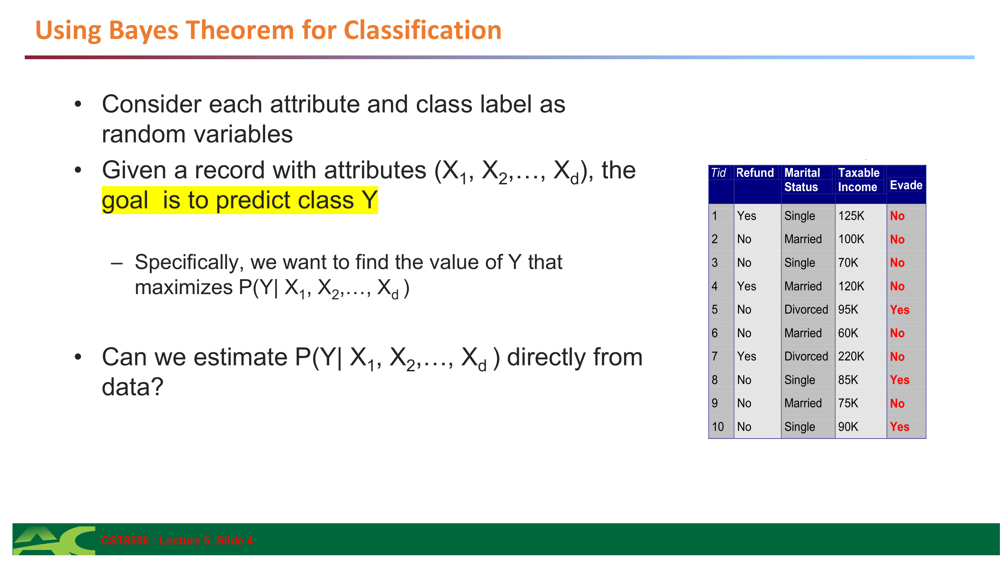

**Classification setup:** Shows a tax evasion dataset with attributes (Refund, Marital Status, Taxable Income, Evade).

**分类问题设定：** 展示一个税务逃税数据集，包含属性（退税、婚姻状况、应税收入、逃税）。

- Consider each attribute and class label as **random variables** — 将每个属性和类别标签视为**随机变量**
- Given a record with attributes (X₁, X₂, …, Xd), the goal is to predict class Y — 给定属性记录 (X₁, X₂, …, Xd)，目标是预测类别 Y
- Specifically, we want to find the value of Y that **maximizes P(Y| X₁, X₂, …, Xd)** — 找到使 **P(Y| X₁, X₂, …, Xd) 最大化**的 Y 值

### 3.2 后验概率计算 (Posterior Probability Computation)

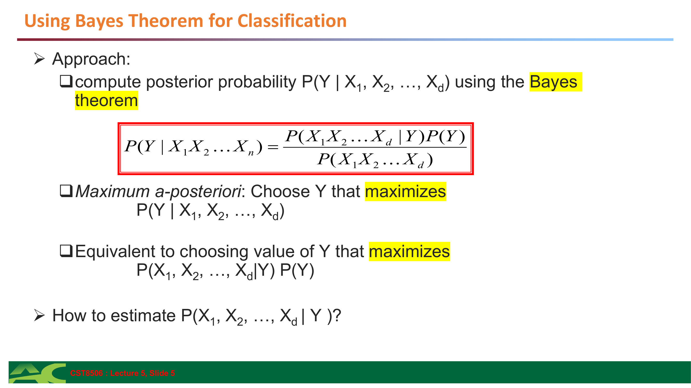

**Approach slide:** Shows the mathematical formulation for computing posterior probability.

**方法页：** 展示计算后验概率的数学公式。

- Compute posterior probability using Bayes theorem: P(Y | X₁X₂…Xd) = P(X₁X₂…Xd |Y) × P(Y) / P(X₁X₂…Xd) — 用贝叶斯定理计算后验概率
- **Maximum a-posteriori (MAP):** Choose Y that maximizes P(Y | X₁, X₂, …, Xd) — **最大后验估计：** 选择使 P(Y | X₁, X₂, …, Xd) 最大的 Y
- Equivalent to choosing Y that maximizes **P(X₁, X₂, …, Xd |Y) × P(Y)** — 等价于最大化 **P(X₁, X₂, …, Xd |Y) × P(Y)**
- Key question: **How to estimate P(X₁, X₂, …, Xd | Y)?** — 关键问题：**如何估计 P(X₁, X₂, …, Xd | Y)？**

> **📝 Notes:**
>
> **🎯 Why:**
> **(1) Why MAP instead of full posterior? (为什么用MAP而非完整后验？):**
>
> Computing the exact posterior P(Y|X) requires dividing by P(X), which means summing P(X|Y)×P(Y) over ALL classes. MAP skips this expensive denominator because we only need to **compare** classes — the denominator is the same for all Y values, so it cancels out.
>
> > 计算精确后验 P(Y|X) 需要除以 P(X)，即对所有类别求和 P(X|Y)×P(Y)。MAP 跳过这个昂贵的分母，因为我们只需要**比较**类别——分母对所有 Y 值相同，所以在比较中抵消了。
>
> **(2) The curse of dimensionality (维度灾难):**
>
> Directly estimating P(X₁, X₂, …, Xd | Y) from data is impossible for high-dimensional data. With d binary attributes, there are 2ᵈ possible attribute combinations — exponential growth means we'd need exponentially more training data. This is the **fundamental motivation** for the Naïve Bayes independence assumption.
>
> > 直接从数据估计 P(X₁, X₂, …, Xd | Y) 对高维数据是不可能的。d 个二值属性有 2ᵈ 种可能组合——指数增长意味着需要指数级更多的训练数据。这是朴素贝叶斯独立性假设的**根本动机**。
>
> **💡 Intuition:**
> **(1) Voting analogy (投票类比):**
>
> MAP is like an election where each candidate (class) campaigns with evidence P(X|Y) and their popularity P(Y). The candidate with the highest combined score wins — you don't need to know **everyone's** total score, just who's highest.
>
> > MAP 就像选举，每个候选人（类别）用证据 P(X|Y) 和人气 P(Y) 竞选。得分最高的候选人获胜——你不需要知道**所有人**的总分，只需要知道谁最高。
>
> **(2) Why P(X) can be ignored (为什么可以忽略 P(X)):**
>
> P(X) is like the total number of voters — it's the same regardless of which candidate you're evaluating. So for comparison purposes, it's irrelevant.
>
> > P(X) 就像投票者总数——无论你评估哪个候选人，它都是相同的。所以在比较目的下，它是无关的。
>
> **⚙️ How:**
> **(1) MAP decision rule (MAP决策规则):**
>
> Instead of computing P(Y|X) = P(X|Y)P(Y)/P(X), we compute: argmax_Y P(X|Y) × P(Y). The class with the largest product wins. This avoids the expensive P(X) computation entirely.
>
> > 不计算 P(Y|X) = P(X|Y)P(Y)/P(X)，而是计算：argmax_Y P(X|Y) × P(Y)。乘积最大的类别获胜。这完全避免了计算昂贵的 P(X)。
>
> **⚖️ Compare:**
> **(1) MAP vs MLE (Maximum Likelihood Estimation):**
>
> | Aspect          | MAP                   | MLE            |
> | --------------- | --------------------- | -------------- |
> | Formula         | argmax P(X\|Y) × P(Y) | argmax P(X\|Y) |
> | Uses prior?     | ✅ Yes                | ❌ No          |
> | When identical? | When P(Y) is uniform  | Always         |
>
> > | 方面       | MAP                   | MLE            |
> > | ---------- | --------------------- | -------------- |
> > | 公式       | argmax P(X\|Y) × P(Y) | argmax P(X\|Y) |
> > | 用先验？   | ✅ 是                 | ❌ 否          |
> > | 何时相同？ | 当 P(Y) 均匀分布时    | 始终           |
>
> **⚠️ Pitfall:**
> **(1) "Just compare likelihoods" trap (只比较似然的陷阱):**
>
> Students often forget to multiply by P(Y). When P(Yes)=0.01 and P(No)=0.99, even if P(X|Yes) > P(X|No), the MAP answer may still be No.
>
> > 学生经常忘记乘以 P(Y)。当 P(是)=0.01 且 P(否)=0.99 时，即使 P(X|是) > P(X|否)，MAP 答案可能仍然是"否"。
>
> **📝 Exam:**
> **(1) 推理题 (Reasoning):**
>
> "Why can we drop P(X) in MAP classification?" → Because P(X) is constant across all classes — it doesn't affect which class has the highest score.
>
> > "为什么MAP分类中可以去掉 P(X)？" → 因为 P(X) 对所有类别是常数——它不影响哪个类别得分最高。
>
> **(2) 计算题 (Calculation):**
>
> "Given P(X|Y=1)=0.3, P(Y=1)=0.4, P(X|Y=0)=0.5, P(Y=0)=0.6. What is the MAP class?" → P(X|1)×P(1) = 0.12 vs P(X|0)×P(0) = 0.30 → **Class = 0**.
>
> > "给定 P(X|Y=1)=0.3, P(Y=1)=0.4, P(X|Y=0)=0.5, P(Y=0)=0.6。MAP类别是什么？" → P(X|1)×P(1) = 0.12 vs P(X|0)×P(0) = 0.30 → **类别 = 0**。

---

## 4. 条件独立性与朴素贝叶斯假设 (Conditional Independence & Naïve Bayes Assumption)

### 4.1 条件独立性 (Conditional Independence)

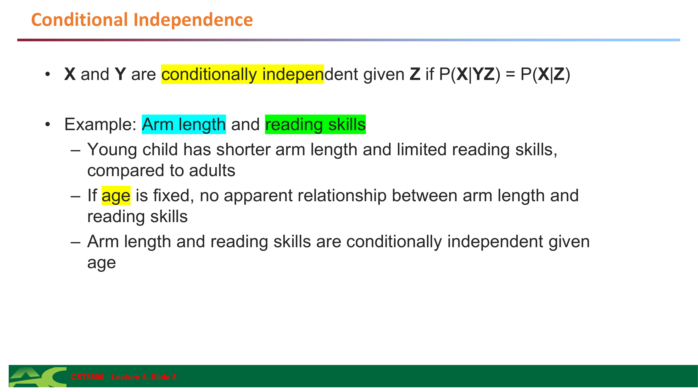

**Conditional Independence slide:** Defines conditional independence with the arm length / reading skills example.

**条件独立性页：** 用臂长/阅读能力的例子定义条件独立性。

- X and Y are **conditionally independent** given Z if **P(X|YZ) = P(X|Z)** — 如果 **P(X|YZ) = P(X|Z)**，则 X 和 Y 在给定 Z 下**条件独立**
- Example: **Arm length and reading skills** — 示例：**臂长和阅读能力**
  - Young child has shorter arm length and limited reading skills, compared to adults — 与成人相比，幼儿的臂长较短且阅读能力有限
  - If **age** is fixed, no apparent relationship between arm length and reading skills — 如果**年龄**固定，臂长和阅读能力之间没有明显关系
  - Arm length and reading skills are conditionally independent **given age** — 臂长和阅读能力在**给定年龄**下条件独立

### 4.2 朴素贝叶斯分类器定义 (Naïve Bayes Classifier Definition)

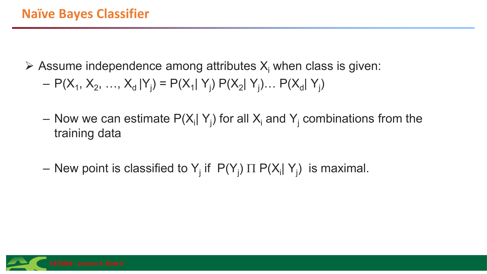

**Core assumption slide:** The Naïve Bayes independence assumption that simplifies the likelihood computation.

**核心假设页：** 朴素贝叶斯的独立性假设，简化了似然的计算。

- Assume **independence** among attributes Xᵢ when class is given — 假设在给定类别时属性 Xᵢ 之间**相互独立**
- P(X₁, X₂, …, Xd | Yⱼ) = P(X₁|Yⱼ) × P(X₂|Yⱼ) × … × P(Xd|Yⱼ) — 联合概率分解为各属性条件概率的乘积
- Now we can estimate P(Xᵢ|Yⱼ) for **all Xᵢ and Yⱼ combinations** from the training data — 可以从训练数据中估计**所有 Xᵢ 和 Yⱼ 组合**的条件概率
- New point is classified to Yⱼ if **P(Yⱼ) × Π P(Xᵢ|Yⱼ) is maximal** — 如果 **P(Yⱼ) × Π P(Xᵢ|Yⱼ) 最大**则分类为 Yⱼ

> **📝 Notes:**
>
> **📌 What:**
> **(1) Conditional independence definition (条件独立性定义):**
>
> Two variables X and Y are conditionally independent given Z if knowing Y gives no additional information about X once Z is already known. Formally: P(X|Y,Z) = P(X|Z).
>
> > 两个变量 X 和 Y 在给定 Z 下条件独立，意味着一旦 Z 已知，知道 Y 不会提供关于 X 的额外信息。形式化：P(X|Y,Z) = P(X|Z)。
>
> **(2) The "Naïve" assumption (朴素假设):**
>
> Naïve Bayes assumes ALL attributes are conditionally independent given the class label. This means P(X₁,X₂,...,Xd|Y) = Π P(Xᵢ|Y). The word "naïve" reflects that this assumption is almost **never true** in reality — but it works surprisingly well anyway.
>
> > 朴素贝叶斯假设在给定类别标签下所有属性**条件独立**。即 P(X₁,X₂,...,Xd|Y) = Π P(Xᵢ|Y)。"朴素"一词反映了这个假设在现实中几乎**永远不成立**——但它出奇地好用。
>
> **🎯 Why:**
> **(1) Exponential → Linear (指数变线性):**
>
> Without the independence assumption, estimating P(X₁,...,Xd|Y) requires observing every possible combination of d attributes. With 10 binary attributes, that's 2¹⁰ = 1024 combinations per class. With independence, we only need 10 × 2 = 20 estimates per class. Complexity drops from **O(vᵈ) to O(v×d)**.
>
> > 没有独立性假设，估计 P(X₁,...,Xd|Y) 需要观察 d 个属性的每种可能组合。10个二值属性有 2¹⁰ = 1024 种组合（每个类别）。有了独立性假设，只需 10 × 2 = 20 个估计。复杂度从 **O(vᵈ) 降到 O(v×d)**。
>
> **(2) Small data, still works (数据少也能用):**
>
> Because each P(Xᵢ|Y) is estimated separately, NB needs very little training data. Even with 100 samples, each attribute probability can be estimated reliably. This is why NB is a go-to for text classification where features (words) outnumber samples.
>
> > 因为每个 P(Xᵢ|Y) 是独立估计的，NB 需要非常少的训练数据。即使只有100个样本，每个属性概率也能可靠估计。这就是为什么 NB 是文本分类的首选。
>
> **💡 Intuition:**
> **(1) Arm length / reading analogy (臂长/阅读类比):**
>
> Both correlate with age. Ignore age → they seem correlated. **Fix age** (e.g., all 10-year-olds) → correlation vanishes. This is conditional independence given age. NB treats class as the "age" — once class is known, attributes become independent.
>
> > 两者都与年龄相关。忽略年龄→看起来相关。**固定年龄**（如都是10岁）→相关性消失。这就是给定年龄的条件独立。NB 把类别当作"年龄"——一旦类别已知，属性变得独立。
>
> **(2) Independent dice rolls (独立骰子投掷):**
>
> P(3,1,4,1,5) with independent dice = 1/6⁵. NB treats attributes the same way — once class is known, each attribute behaves like an independent "dice roll" and their joint probability is the product.
>
> > 独立骰子 P(3,1,4,1,5) = 1/6⁵。NB 对属性同理——一旦类别已知，每个属性像独立"骰子投掷"，联合概率是乘积。
>
> **⚖️ Compare:**
> **(1) Naïve Bayes vs Full Bayes vs SVM:**
>
> | Aspect        | Naïve Bayes    | Full Bayes      | SVM             |
> | ------------- | -------------- | --------------- | --------------- |
> | Independence? | ✅ Assumed     | ❌ Not needed   | N/A             |
> | Parameters    | O(d) per class | O(vᵈ) per class | Support vectors |
> | Data needed   | Very small     | Very large      | Moderate        |
> | Correlations? | ❌ Ignored     | ✅ Captured     | ✅ Captured     |
>
> > | 方面     | 朴素贝叶斯  | 完全贝叶斯 | SVM      |
> > | -------- | ----------- | ---------- | -------- |
> > | 独立性？ | ✅ 假设成立 | ❌ 不需要  | 不适用   |
> > | 参数数   | 每类 O(d)   | 每类 O(vᵈ) | 支持向量 |
> > | 数据需求 | 非常少      | 非常多     | 中等     |
> > | 相关性？ | ❌ 忽略     | ✅ 捕获    | ✅ 捕获  |
>
> **⚠️ Pitfall:**
> **(1) "Independent" ≠ "Conditionally independent" (独立 ≠ 条件独立):**
>
> Two attributes can be marginally dependent but conditionally independent given class. NB requires conditional independence given class, NOT marginal independence.
>
> > 两个属性可以边际相关但条件独立（给定类别）。NB 要求的是给定类别的条件独立，**不是**边际独立。
>
> **(2) Why "naïve" still works (为什么"朴素"仍然有效):**
>
> NB only needs the **ranking** of posterior probabilities to be correct — actual values can be wrong as long as the correct class is ranked highest.
>
> > NB 只需要后验概率的**排名**正确——只要正确类别排名最高，实际概率值可以是错的。
>
> **📝 Exam:**
> **(1) 概念题 (Conceptual):**
>
> "What is the key assumption in Naïve Bayes?" → Attributes are conditionally independent given the class label. This reduces the joint likelihood to a product of individual likelihoods.
>
> > "朴素贝叶斯的关键假设是什么？" → 给定类别标签下属性条件独立。联合似然简化为各似然的乘积。
>
> **(2) 推理题 (Reasoning):**
>
> "Give an example of conditional independence." → Arm length and reading skills are conditionally independent given age. Once age is known, arm length gives no info about reading.
>
> > "给出条件独立的例子。" → 臂长和阅读能力在给定年龄下条件独立。一旦年龄已知，臂长不提供阅读信息。

---

## 5. 朴素贝叶斯实例演练 (Naïve Bayes Worked Example)

### 5.1 示例数据与设置 (Example Data & Setup)

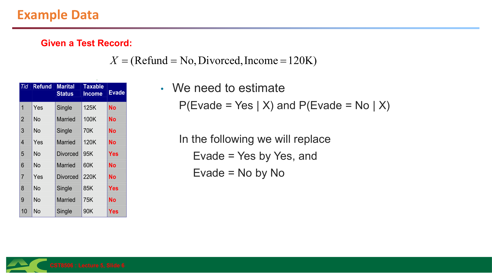

**Test record setup:** Given X = (Refund = No, Divorced, Income = 120K), estimate P(Evade = Yes|X) and P(Evade = No|X).

**测试记录设定：** 给定 X = (退税 = 否, 离婚, 收入 = 120K)，估计 P(逃税 = 是|X) 和 P(逃税 = 否|X)。

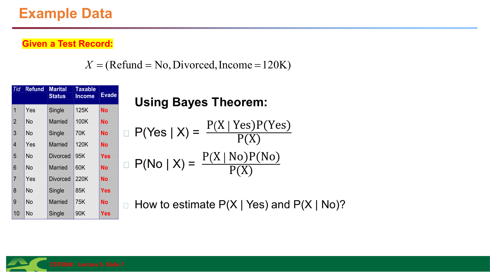

**Full dataset:** 10 records with attributes Refund, Marital Status, Taxable Income, and class label Evade (Yes/No).

**完整数据集：** 10条记录，包含退税、婚姻状况、应税收入和类别标签逃税（是/否）。

### 5.2 似然计算分解 (Likelihood Decomposition)

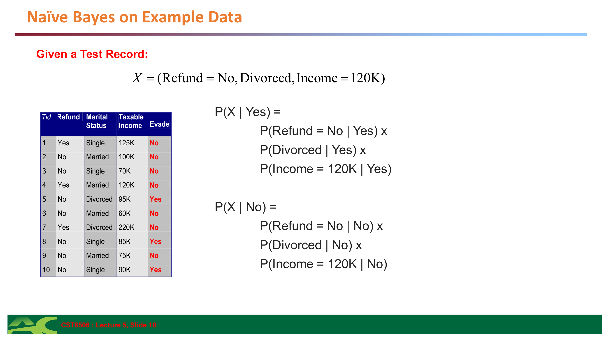

**Decomposition slide:** Shows how joint likelihood P(X|class) is decomposed into individual attribute likelihoods.

**分解页：** 展示联合似然 P(X|class) 如何分解为各属性的似然。

- P(X | Yes) = P(Refund=No | Yes) × P(Divorced | Yes) × P(Income=120K | Yes)
- P(X | No) = P(Refund=No | No) × P(Divorced | No) × P(Income=120K | No)

### 5.3 概率估计方法 (Probability Estimation Methods)

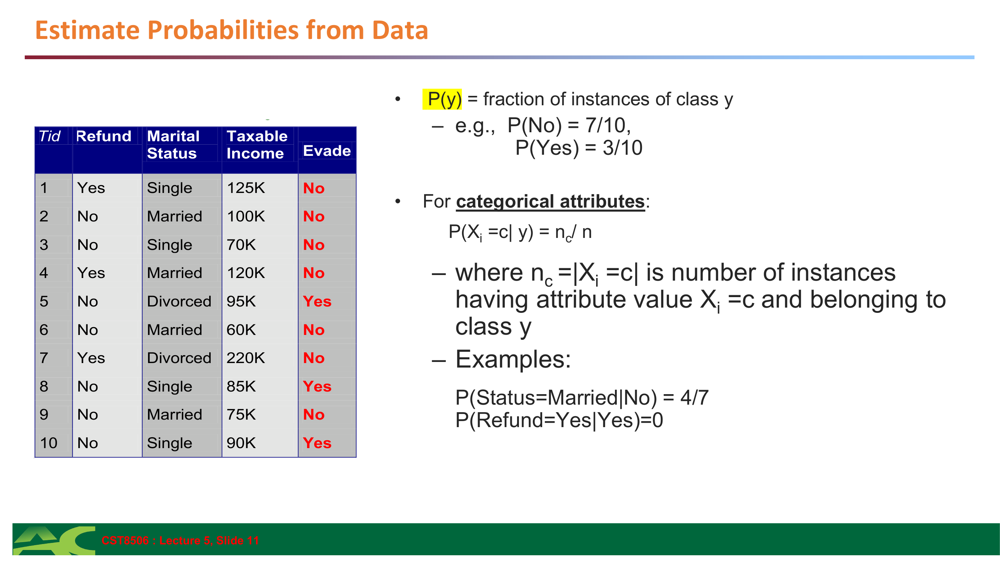

**Estimation from data:** Shows how to estimate probabilities for categorical and continuous attributes.

**从数据估计概率：** 展示如何估计分类属性和连续属性的概率。

- **P(y)** = fraction of instances of class y — e.g., P(No) = 7/10, P(Yes) = 3/10
- **For categorical attributes:** P(Xᵢ = c | y) = nc / n — nc为 Xᵢ=c 且 Y=y 的实例数
  - Example: P(Status=Married | No) = 4/7, P(Refund=Yes | Yes) = 0

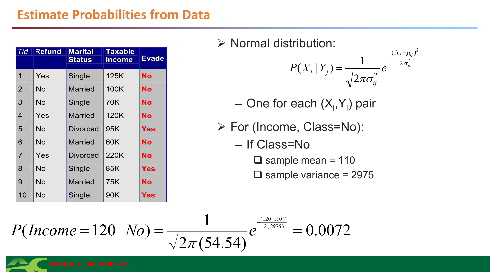

**Continuous attributes:** Shows the Gaussian (Normal) distribution formula for estimating continuous attribute probabilities.

**连续属性：** 展示用于估计连续属性概率的高斯（正态）分布公式。

- **Normal distribution:** P(Xᵢ|Yⱼ) = (1/√(2πσ²ᵢⱼ)) × exp(-(Xᵢ - μᵢⱼ)² / (2σ²ᵢⱼ))
  - One distribution for each (Xᵢ, Yⱼ) pair — 每对 (Xᵢ, Yⱼ) 一个分布
- For (Income, Class=No): sample mean = 110, sample variance = 2975
- P(Income=120 | No) = (1/√(2π×2975)) × exp(-(120-110)²/(2×2975)) = **0.0072**

### 5.4 完整分类示例 (Complete Classification Example)

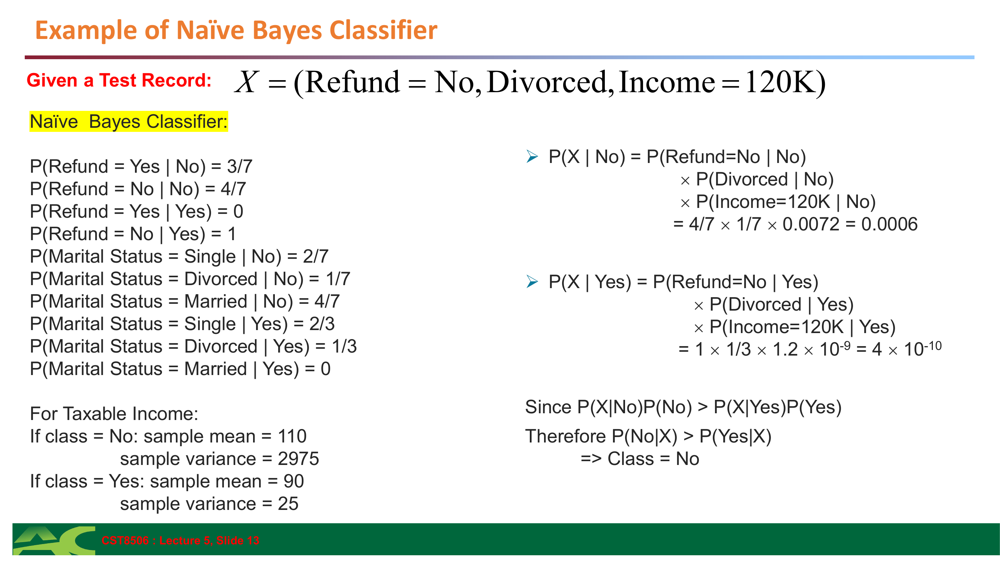

**Complete example:** Shows the full Naïve Bayes computation for the test record X = (Refund=No, Divorced, Income=120K).

**完整示例：** 展示测试记录 X = (退税=否, 离婚, 收入=120K) 的完整朴素贝叶斯计算。

- P(X | No) = 4/7 × 1/7 × 0.0072 = **0.0006**
- P(X | Yes) = 1 × 1/3 × 1.2×10⁻⁹ = **4×10⁻¹⁰**
- Since P(X|No)×P(No) > P(X|Yes)×P(Yes) → **Class = No**

> **📝 Notes:**
>
> **⚙️ How:**
> **(1) Categorical estimation (分类属性估计):**
>
> Count how many times each attribute value appears in each class, then divide. P(Refund=No|No) = (count of No-class records with Refund=No) / (total No-class records) = 4/7.
>
> > 统计每个属性值在每个类别中出现的次数，然后相除。P(退税=否|否) = (退税=否且类别=否的记录数) / (类别=否的总记录数) = 4/7。
>
> **(2) Continuous estimation via Gaussian (连续属性的高斯估计):**
>
> For continuous attributes, assume a **Gaussian distribution** within each class. Compute mean μ and variance σ² from training data, then plug the test value into the PDF: P(x|class) = (1/√(2πσ²)) × exp(-(x-μ)²/(2σ²)). This gives a **probability density**, not a probability.
>
> > 对连续属性，假设每个类别内服从**高斯分布**。从训练数据计算均值 μ 和方差 σ²，然后将测试值代入PDF：P(x|class) = (1/√(2πσ²)) × exp(-(x-μ)²/(2σ²))。这给出**概率密度**，而非概率。
>
> **🔢 Example:**
> **(1) Tax evasion walkthrough (逃税分类演练):**
>
> **Problem:** X = (Refund=No, Divorced, Income=120K). Classify as Evade Yes/No.
> **Solution:**
>
> - P(Yes) = 3/10, P(No) = 7/10
> - P(X|No) = P(Refund=No|No) × P(Divorced|No) × P(Income=120K|No) = 4/7 × 1/7 × 0.0072 = 0.0006
> - P(X|Yes) = P(Refund=No|Yes) × P(Divorced|Yes) × P(Income=120K|Yes) = 1 × 1/3 × 1.2×10⁻⁹ = 4×10⁻¹⁰
> - P(X|No)×P(No) = 0.0006 × 0.7 = 0.00042
> - P(X|Yes)×P(Yes) = 4×10⁻¹⁰ × 0.3 = 1.2×10⁻¹⁰
> - 0.00042 ≫ 1.2×10⁻¹⁰ → **Class = No**
>
> > **题目：** X = (退税=否, 离婚, 收入=120K)。分类为逃税是/否。
> > **解：**
> >
> > - P(是) = 3/10，P(否) = 7/10
> > - P(X|否) = 4/7 × 1/7 × 0.0072 = 0.0006
> > - P(X|是) = 1 × 1/3 × 1.2×10⁻⁹ = 4×10⁻¹⁰
> > - P(X|否)×P(否) = 0.00042 ≫ P(X|是)×P(是) = 1.2×10⁻¹⁰ → **类别 = 否**
>
> **⚠️ Pitfall:**
> **(1) Density ≠ Probability (密度 ≠ 概率):**
>
> For continuous attributes, the Gaussian formula gives **probability density**, which can exceed 1. This is fine — we're only comparing densities across classes, not interpreting them as actual probabilities.
>
> > 对连续属性，高斯公式给出的是**概率密度**，可以超过1。这没问题——我们只是在类别间比较密度，而非将其解释为实际概率。
>
> **(2) Same variance assumption (相同方差假设):**
>
> In this example, Class=Yes has variance=25 and Class=No has variance=2975. The tiny Yes-class variance means Income=120K gets an extremely small density (far from mean=90) — this single attribute dominates the decision.
>
> > 在此例中，类别=是的方差=25，类别=否的方差=2975。是类的极小方差意味着收入=120K得到极小密度（远离均值=90）——这单个属性主导了决策。
>
> **📝 Exam:**
> **(1) 计算题 (Calculation):**
>
> "Given this dataset and test record, compute NB classification." → Must show: (a) count-based estimates for categorical, (b) Gaussian for continuous, (c) multiply all, (d) compare.
>
> > "给定数据集和测试记录，计算NB分类。" → 必须展示：(a)分类属性的计数估计，(b)连续属性的高斯，(c)全部相乘，(d)比较。
>
> **(2) 概念题 (Conceptual):**
>
> "Why do we use Gaussian distribution for continuous attributes?" → Because we can't count exact values — continuous values rarely repeat. The Gaussian models the spread and center of values per class.
>
> > "为什么用高斯分布处理连续属性？" → 因为无法对精确值计数——连续值很少重复。高斯建模每个类别值的分布中心与展幅。

---

## 6. 部分信息决策 (Decision with Partial Information)

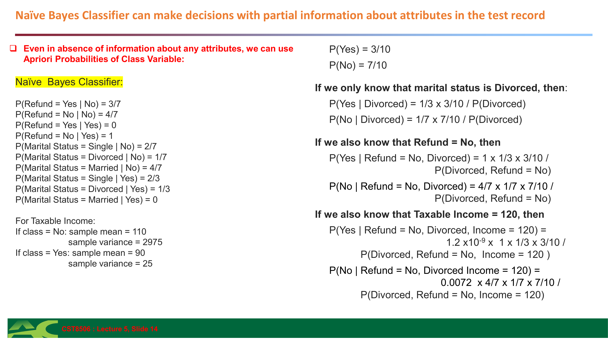

**Partial information slide:** Shows that Naïve Bayes can make decisions even with incomplete attribute information.

**部分信息页：** 展示朴素贝叶斯即使在属性信息不完整时也能做出决策。

- Even in absence of information about any attributes, we can use P(Yes) = 3/10 — 即使没有任何属性信息，也可使用先验概率
- If we only know Marital Status = Divorced → P(Yes|Divorced) vs P(No|Divorced)
- As more attributes become known, the classification becomes more confident — 随着已知属性增多，分类更有信心

> **📝 Notes:**
>
> **🎯 Why:**
> **(1) Graceful degradation (优雅降级):**
>
> Unlike SVM or KNN which need ALL features to compute distance/margin, NB can simply **drop missing attributes from the product**. The remaining attributes still contribute to classification. This makes NB naturally robust to missing data.
>
> > 与需要所有特征计算距离/间隔的 SVM 或 KNN 不同，NB 可以简单地**从乘积中去掉缺失属性**。剩余属性仍然贡献于分类。这使 NB 天然对缺失数据稳健。
>
> **(2) Progressive refinement (渐进细化):**
>
> With zero attributes → use prior P(Y). With one attribute → posterior shifts. With more attributes → posterior becomes more confident. This mirrors how humans reason: start with base rates, update with each new piece of evidence.
>
> > 零属性→使用先验 P(Y)。一个属性→后验偏移。更多属性→后验更确信。这与人类推理方式一致：从基础比率开始，随每条新证据更新。
>
> **💡 Intuition:**
> **(1) Building a case (建立证据链):**
>
> Like a detective solving a crime: with no evidence, use base rate ("most crimes are by known people"). Learn the suspect is divorced → update. Learn they didn't file refund → update again. Each fact multiplies into the posterior.
>
> > 像侦探破案：没有证据时用基础比率（"大多数犯罪是熟人所为"）。得知嫌疑人离婚→更新。得知没有报税→再更新。每个事实都乘入后验。
>
> **⚠️ Pitfall:**
> **(1) More features ≠ always better (更多特征 ≠ 总是更好):**
>
> If an added feature violates conditional independence (e.g., it's redundant with another), it can **hurt** classification by double-counting evidence. This is a known weakness of NB.
>
> > 如果新增特征违反条件独立性（如与另一个特征冗余），它可能通过重复计算证据**损害**分类。这是 NB 的已知弱点。

---

## 7. 朴素贝叶斯的问题 (Issues with Naïve Bayes)

### 7.1 零概率问题 (Zero Probability Problem)

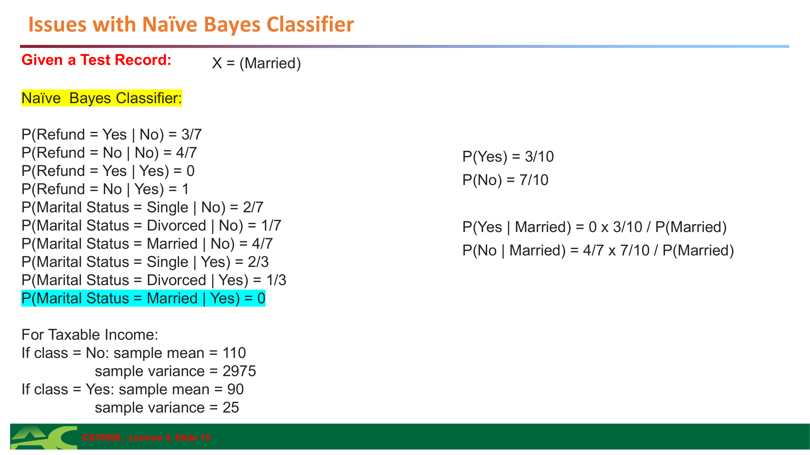

**Zero probability issue:** Shows that P(Married|Yes) = 0 makes the entire posterior zero, regardless of other attributes.

**零概率问题：** 展示 P(已婚|是) = 0 会使整个后验概率为零，无论其他属性如何。

- Given X = (Married): P(Yes | Married) = **0** × 3/10 / P(Married) — 一个条件概率为0就使整个乘积为0

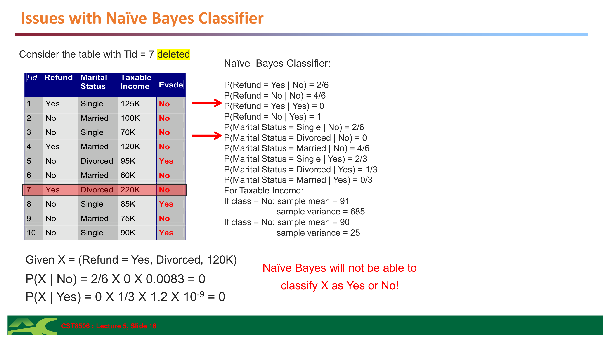

**Classification failure:** With Tid=7 deleted, P(Divorced|No) = 0 and P(Refund=Yes|Yes) = 0, making classification impossible.

**分类失败：** 删除 Tid=7 后，P(离婚|否) = 0 且 P(退税=是|是) = 0，导致无法分类。

- P(X|No) = 2/6 × **0** × 0.0083 = **0**
- P(X|Yes) = **0** × 1/3 × 1.2×10⁻⁹ = **0**
- Naïve Bayes will **not be able to classify** X as Yes or No! — 朴素贝叶斯**无法分类**！

### 7.2 拉普拉斯平滑 (Laplace Smoothing / m-estimate)

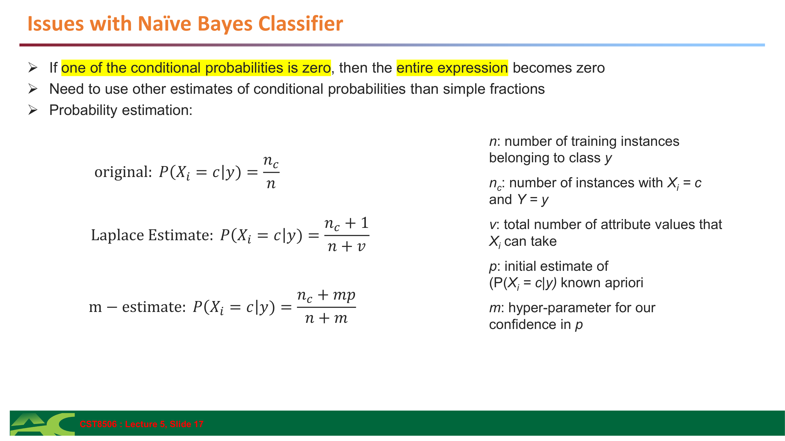

**Smoothing solutions:** Shows Laplace smoothing and m-estimate to handle zero probabilities.

**平滑方案：** 展示拉普拉斯平滑和 m-估计来处理零概率问题。

- **Original:** P(Xᵢ = c | y) = nc / n
- **Laplace smoothing:** P(Xᵢ = c | y) = (nc + 1) / (n + v)
  - v = total number of attribute values that Xᵢ can take — v = Xᵢ 可取值的总数
- **m-estimate:** P(Xᵢ = c | y) = (nc + m×p) / (n + m)
  - p = initial estimate of P(Xᵢ = c | y) known a priori — p = 先验初始估计
  - m = hyper-parameter for confidence in p — m = 对p置信度的超参数

> **📝 Notes:**
>
> **🎯 Why:**
> **(1) Product-of-zeros problem (零的乘积问题):**
>
> NB multiplies all P(Xᵢ|Y) together. If **any one** is zero, the entire product becomes zero — all other evidence is completely wiped out. This is catastrophic because it means a single unseen attribute-class combination vetoes the entire classification.
>
> > NB 将所有 P(Xᵢ|Y) 相乘。如果**任何一个**为零，整个乘积变为零——所有其他证据完全被抹杀。这是灾难性的，因为一个未见过的属性-类别组合就否决了整个分类。
>
> **(2) Absence of evidence ≠ evidence of absence (无证据 ≠ 证据为零):**
>
> Just because no "Married" person in the training set evades taxes doesn't mean it's impossible. The true probability is just very small, not zero. Smoothing reflects this reality.
>
> > 仅因训练集中没有"已婚"人逃税，并不意味着不可能。真实概率只是很小，不是零。平滑反映了这个现实。
>
> **📐 Formula:**
> **(1) Laplace smoothing (拉普拉斯平滑):**
>
> P(Xᵢ=c|y) = (nc + 1) / (n + v)
>
> - nc = count of class-y instances with Xᵢ=c
> - n = total class-y instances
> - v = number of possible values for Xᵢ
> - Effect: adds 1 "virtual" observation for each possible value → no probability is ever zero
>
> > P(Xᵢ=c|y) = (nc + 1) / (n + v)
> >
> > - nc = 类别y中 Xᵢ=c 的计数
> > - n = 类别y的总实例数
> > - v = Xᵢ 的可能取值数
> > - 效果：为每个可能值添加1个"虚拟"观察 → 没有概率为零
>
> **(2) m-estimate (m-估计):**
>
> P(Xᵢ=c|y) = (nc + m×p) / (n + m)
>
> - p = prior estimate (e.g., 1/v for uniform)
> - m = equivalent sample size for prior → controls how much we trust prior vs data
> - When m=0: pure frequency estimate. When m→∞: pure prior estimate.
>
> > P(Xᵢ=c|y) = (nc + m×p) / (n + m)
> >
> > - p = 先验估计（如均匀分布时 1/v）
> > - m = 先验的等效样本量 → 控制信任先验还是数据
> > - m=0 时：纯频率估计。m→∞ 时：纯先验估计。
>
> **💡 Intuition:**
> **(1) Adding fake reviews (添加假评论):**
>
> Laplace smoothing is like a restaurant review system that starts every new restaurant with 1 fake positive and 1 fake negative review. Even with zero real reviews, the rating isn't 0% or 100% — it's a neutral 50%. As real reviews accumulate, the fake ones get diluted.
>
> > 拉普拉斯平滑就像一个餐厅评价系统，为每家新餐厅默认添加1个假好评和1个假差评。即使没有真实评价，评分也不是0%或100%——而是中性的50%。随着真实评价积累，假评价被稀释。
>
> **⚖️ Compare:**
> **(1) Laplace vs m-estimate:**
>
> | Aspect             | Laplace (α=1)              | m-estimate       |
> | ------------------ | -------------------------- | ---------------- |
> | Prior              | Uniform (1/v)              | Configurable (p) |
> | Smoothing strength | Fixed (+1 per value)       | Tunable (m)      |
> | Special case       | m-estimate with m=v, p=1/v | General form     |
>
> > | 方面     | 拉普拉斯 (α=1)       | m-估计     |
> > | -------- | -------------------- | ---------- |
> > | 先验     | 均匀 (1/v)           | 可配置 (p) |
> > | 平滑强度 | 固定 (每值+1)        | 可调 (m)   |
> > | 特殊情况 | m=v, p=1/v 的 m-估计 | 通用形式   |
>
> **⚠️ Pitfall:**
> **(1) Over-smoothing with small datasets (小数据集过度平滑):**
>
> With very few training examples, Laplace smoothing can dominate the real counts. If n=3 and v=5, adding 1 to each value means the "fake" data accounts for 5/(3+5) = 62.5% of the estimate. Consider reducing smoothing strength.
>
> > 训练样本很少时，拉普拉斯平滑可能主导真实计数。如果 n=3 且 v=5，为每个值加1意味着"假"数据占估计的 5/(3+5) = 62.5%。考虑降低平滑强度。
>
> **📝 Exam:**
> **(1) 计算题 (Calculation):**
>
> "Apply Laplace smoothing to P(Married|Yes) when nc=0, n=3, v=3." → (0+1)/(3+3) = 1/6 ≈ 0.167 (instead of 0).
>
> > "对 P(已婚|是) 应用拉普拉斯平滑，nc=0, n=3, v=3。" → (0+1)/(3+3) = 1/6 ≈ 0.167（而非0）。

---

## 8. 更多分类示例 (Additional Classification Example)

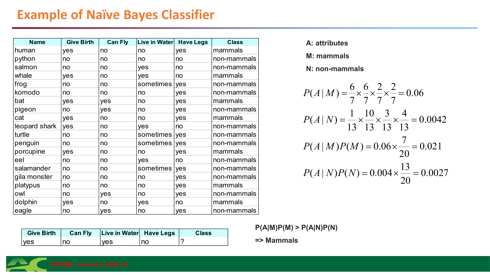

**Animal classification:** A larger example with 20 animal records, classifying as Mammals vs Non-mammals using attributes (Give Birth, Can Fly, Live in Water, Have Legs).

**动物分类：** 更大规模的示例，20条动物记录，用属性（产仔、能飞、水生、有腿）分类为哺乳动物 vs 非哺乳动物。

- Test record: (Give Birth = yes, Can Fly = no, Live in Water = yes, Have Legs = no)
- P(A|M) = 6/7 × 6/7 × 2/7 × ... = 0.06 → P(A|M)×P(M) = 0.021
- P(A|N) = 1/13 × 10/13 × 3/13 × ... = 0.0042 → P(A|N)×P(N) = 0.0027
- P(A|M)×P(M) > P(A|N)×P(N) → **Class = Mammals**

> **📝 Notes:**
>
> **🔢 Example:**
> **(1) Animal classification walkthrough (动物分类演练):**
>
> **Problem:** Classify (Give Birth=yes, Fly=no, Water=yes, Legs=no) as Mammal or Non-mammal.
> **Solution:**
>
> - P(M) = 7/20 = 0.35, P(N) = 13/20 = 0.65
> - P(A|M) = P(Birth=yes|M) × P(Fly=no|M) × P(Water=yes|M) × P(Legs=no|M) = 6/7 × 6/7 × 2/7 × ... = 0.06
> - P(A|N) = 1/13 × 10/13 × 3/13 × ... = 0.0042
> - P(A|M)×P(M) = 0.021 vs P(A|N)×P(N) = 0.0027 → **Mammal**
>
> > **题目：** 分类 (产仔=是, 飞=否, 水生=是, 有腿=否) 为哺乳动物或非哺乳动物。
> > **解：** P(A|M)×P(M) = 0.021 vs P(A|N)×P(N) = 0.0027 → **哺乳动物**
>
> **⚠️ Pitfall:**
> **(1) Rare attribute values dominate (稀有属性值主导):**
>
> In this example, "Live in Water = yes" only appears in 2/7 mammals vs 3/13 non-mammals. Rare attribute values have low probabilities that can disproportionately drive the product down. Always check which attribute most influences the result.
>
> > 在此例中，"水生=是" 只在 2/7 的哺乳动物和 3/13 的非哺乳动物中出现。稀有属性值的低概率可能不成比例地拉低乘积。总是检查哪个属性最影响结果。

---

## 9. 朴素贝叶斯总结 (Naïve Bayes Summary)

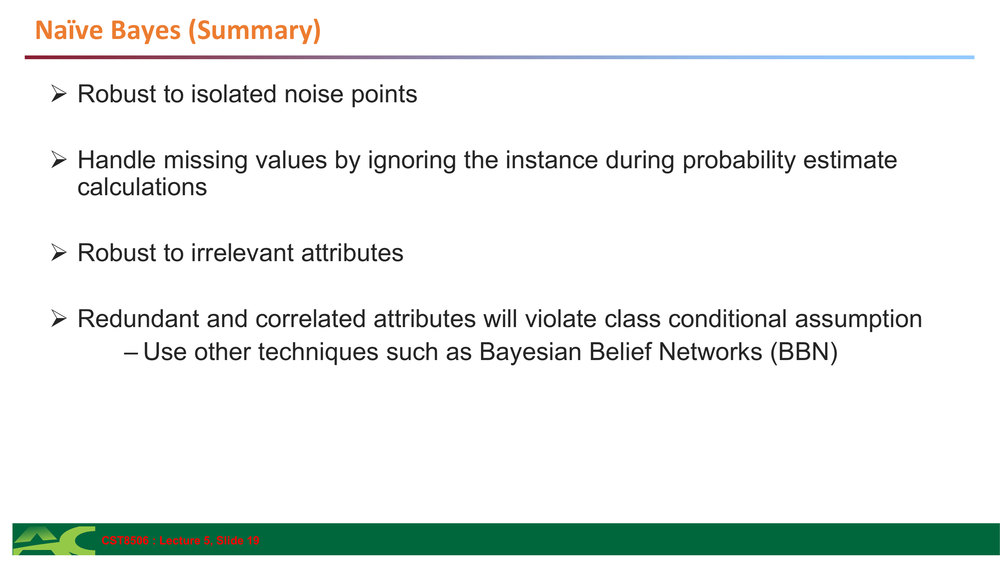

**Summary slide:** Lists strengths and weaknesses of Naïve Bayes.

**总结页：** 列出朴素贝叶斯的优缺点。

- **Robust to isolated noise points** — 对孤立噪声点稳健
- **Handle missing values** by ignoring the instance during probability estimate calculations — 通过在概率估计中忽略该实例来**处理缺失值**
- **Robust to irrelevant attributes** — 对无关属性稳健
- **Redundant and correlated attributes** will violate class conditional assumption — **冗余和相关属性**会违反类条件独立假设
  - Use other techniques such as Bayesian Belief Networks (BBN) — 使用贝叶斯信念网络等其他技术

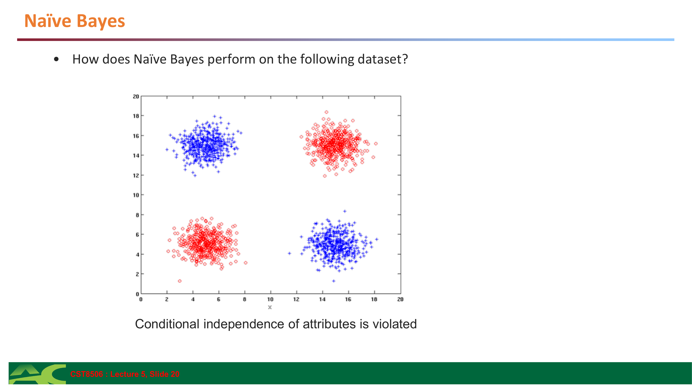

**Performance question:** How does Naïve Bayes perform when conditional independence of attributes is violated?

**性能问题：** 当属性的条件独立性被违反时，朴素贝叶斯表现如何？

> **📝 Notes:**
>
> **⚖️ Compare:**
> **(1) Naïve Bayes vs SVM vs KNN:**
>
> | Aspect              | Naïve Bayes         | SVM                   | KNN                 |
> | ------------------- | ------------------- | --------------------- | ------------------- |
> | Noise robustness    | ✅ High             | ✅ High (soft margin) | ❌ Low              |
> | Missing values      | ✅ Natural handling | ❌ Needs imputation   | ❌ Needs imputation |
> | Irrelevant features | ✅ Robust           | ⚠️ Moderate           | ❌ Sensitive        |
> | Correlated features | ❌ Degrades         | ✅ Handles via kernel | ⚠️ Moderate         |
> | Training speed      | ✅ O(n×d)           | ❌ O(n²–n³)           | ✅ None (lazy)      |
>
> > | 方面       | 朴素贝叶斯  | SVM            | KNN          |
> > | ---------- | ----------- | -------------- | ------------ |
> > | 噪声鲁棒性 | ✅ 高       | ✅ 高 (软间隔) | ❌ 低        |
> > | 缺失值     | ✅ 自然处理 | ❌ 需要插补    | ❌ 需要插补  |
> > | 无关特征   | ✅ 鲁棒     | ⚠️ 中等        | ❌ 敏感      |
> > | 相关特征   | ❌ 降级     | ✅ 核处理      | ⚠️ 中等      |
> > | 训练速度   | ✅ O(n×d)   | ❌ O(n²–n³)    | ✅ 无 (懒惰) |
>
> **⚠️ Pitfall:**
> **(1) Correlated attributes double-count evidence (相关属性重复计算证据):**
>
> If two attributes are copies of each other (e.g., "income in dollars" and "income in euros"), NB treats them as independent evidence, effectively squaring the likelihood contribution. This makes NB overconfident in its (possibly wrong) prediction.
>
> > 如果两个属性是彼此的副本（如"美元收入"和"欧元收入"），NB 将它们视为独立证据，实际上将似然贡献平方化。这使 NB 对其（可能错误的）预测过度自信。
>
> **📝 Exam:**
> **(1) 简答题 (Short answer):**
>
> "List 3 strengths and 1 weakness of Naïve Bayes." → Strengths: robust to noise, handles missing values, robust to irrelevant attributes, fast O(n×d). Weakness: degrades with correlated/redundant attributes.
>
> > "列出 NB 的3个优点和1个缺点。" → 优点：抵抗噪声、处理缺失值、抵抗无关属性、快速O(n×d)。缺点：相关/冗余属性会降级。

---

## 10. 贝叶斯信念网络 (Bayesian Belief Networks)

### 10.1 BBN 定义与结构 (BBN Definition & Structure)

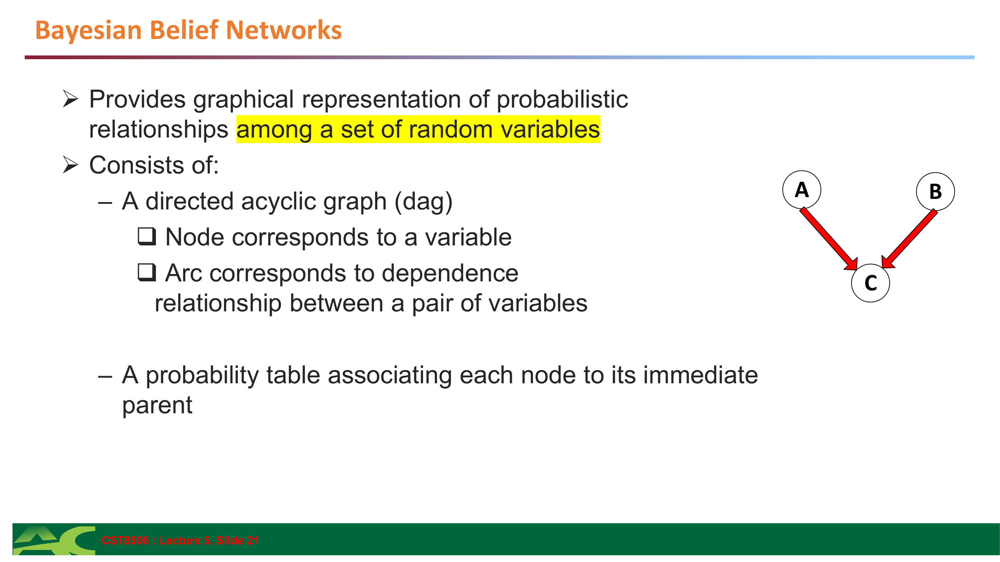

**BBN definition:** Provides graphical representation of probabilistic relationships among random variables.

**BBN 定义：** 提供随机变量之间概率关系的图形表示。

- A **directed acyclic graph (DAG)** — 一个**有向无环图 (DAG)**
  - **Node** corresponds to a variable — **节点**对应一个变量
  - **Arc** corresponds to dependence relationship between a pair of variables — **弧**对应变量对之间的依赖关系
- A **probability table** associating each node to its immediate parent — 将每个节点与其直接父节点关联的**概率表**

### 10.2 BBN 中的条件独立性 (Conditional Independence in BBN)

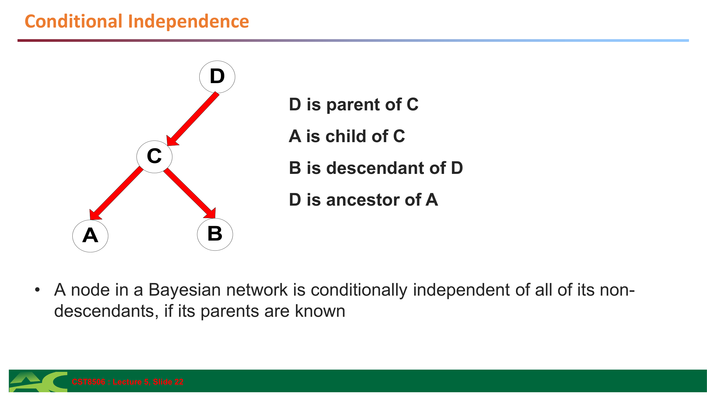

**BBN conditional independence:** Shows parent-child-descendant-ancestor relationships in the DAG.

**BBN 条件独立性：** 展示 DAG 中的父-子-后代-祖先关系。

- D is parent of C; A is child of C; B is descendant of D; D is ancestor of A
- A node in a Bayesian network is **conditionally independent of all of its non-descendants**, if its parents are known — 在贝叶斯网络中，如果父节点已知，则节点**与所有非后代节点条件独立**

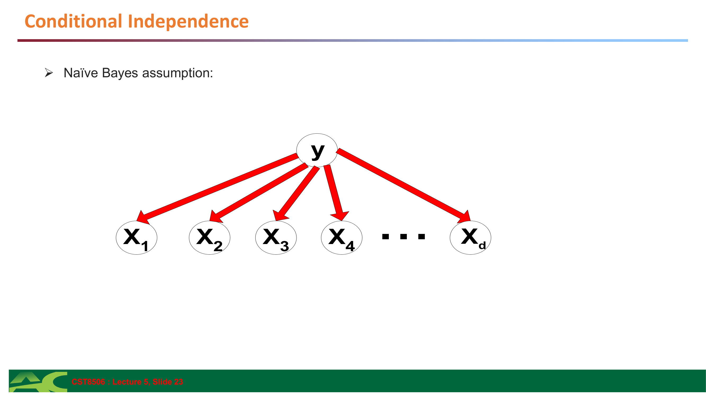

**Naïve Bayes as BBN:** Shows Naïve Bayes assumption as a special BBN structure where Y is the parent of all attributes X₁, X₂, …, Xd.

**朴素贝叶斯作为 BBN：** 展示朴素贝叶斯假设作为特殊的 BBN 结构，其中 Y 是所有属性 X₁, X₂, …, Xd 的父节点。

### 10.3 概率表 (Probability Tables)

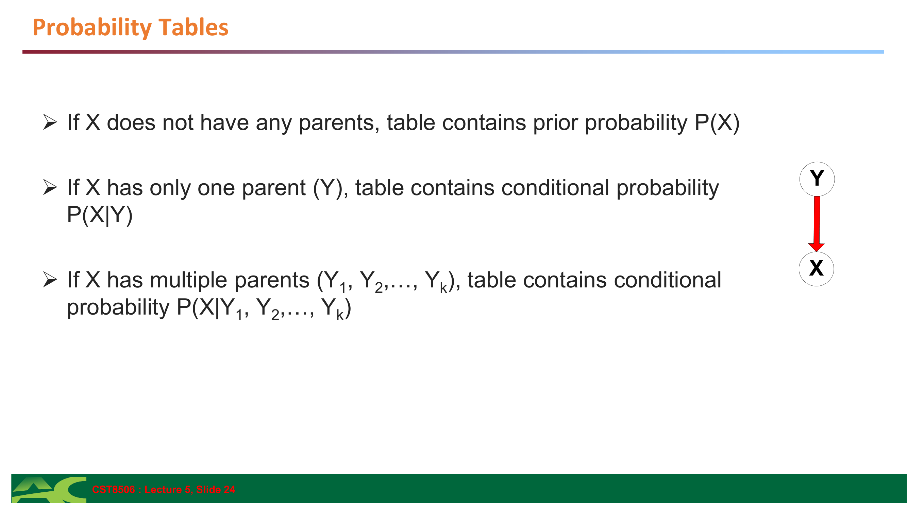

**Probability table rules:** Shows how probability tables work based on parent relationships.

**概率表规则：** 展示概率表如何根据父节点关系工作。

- If X **does not have any parents**, table contains **prior probability** P(X) — 无父节点则包含**先验概率**
- If X has **only one parent** (Y), table contains **conditional probability** P(X|Y) — 一个父节点则包含**条件概率**
- If X has **multiple parents** (Y₁, Y₂, …, Yk), table contains P(X|Y₁, Y₂, …, Yk) — 多个父节点则包含**联合条件概率**

> **📝 Notes:**
>
> **🎯 Why:**
> **(1) Relaxing the "naïve" assumption (放松"朴素"假设):**
>
> NB assumes ALL attributes are independent given class — a flat star-shaped DAG (Y→X₁, Y→X₂, ...). BBN allows **selective dependencies** between attributes. This means we can model "Exercise affects Diet" without assuming they're independent.
>
> > NB 假设所有属性给定类别独立——一个扁平的星形 DAG (Y→X₁, Y→X₂, ...)。BBN 允许属性之间的**选择性依赖**。即可以建模"运动影响饮食"而不假设它们独立。
>
> **(2) Encode domain knowledge (编码领域知识):**
>
> The DAG structure lets domain experts encode known causal relationships. A doctor knows that Heart Disease causes Chest Pain and High Blood Pressure — this direction matters for both inference and interpretability.
>
> > DAG 结构让领域专家编码已知的因果关系。医生知道心脏病导致胸痛和高血压——这个方向对推理和可解释性都很重要。
>
> **💡 Intuition:**
> **(1) Family tree analogy (家族树类比):**
>
> A BBN is like a family tree for variables. Parents directly influence children. If you know your parents' traits, knowing your grandparents' gives no additional info about yours (conditional independence given parents). The "Markov Blanket" is like your immediate family.
>
> > BBN 像变量的家族树。父母直接影响子女。如果你知道父母的特征，知道祖父母不会给你提供额外信息（给定父母的条件独立）。"马尔科夫毯"就像你的直系亲属。
>
> **⚖️ Compare:**
> **(1) Naïve Bayes vs BBN:**
>
> | Aspect       | Naïve Bayes               | BBN                         |
> | ------------ | ------------------------- | --------------------------- |
> | Structure    | Flat star (Y→all X)       | Arbitrary DAG               |
> | Dependencies | All X independent given Y | Some X can depend on others |
> | Parameters   | O(d) per class            | Exponential in max parents  |
> | Flexibility  | Low                       | High                        |
>
> > | 方面   | 朴素贝叶斯           | BBN                |
> > | ------ | -------------------- | ------------------ |
> > | 结构   | 扁平星形 (Y→所有X)   | 任意 DAG           |
> > | 依赖   | 给定 Y 后所有 X 独立 | 部分 X 可依赖其他  |
> > | 参数   | 每类 O(d)            | 指数于最大父节点数 |
> > | 灵活性 | 低                   | 高                 |
>
> **📝 Exam:**
> **(1) 概念题 (Conceptual):**
>
> "How is Naïve Bayes a special case of BBN?" → NB is a BBN with a single parent node (class Y) and all attributes X₁...Xd as children. No edges exist between any X nodes.
>
> > "NB 如何是 BBN 的特例？" → NB 是一个 BBN，其中类别 Y 是唯一父节点，所有属性 X₁...Xd 是子节点。X 节点之间没有边。

---

## 11. BBN 推理实例 (BBN Inference Example)

### 11.1 心脏病网络 (Heart Disease Network)

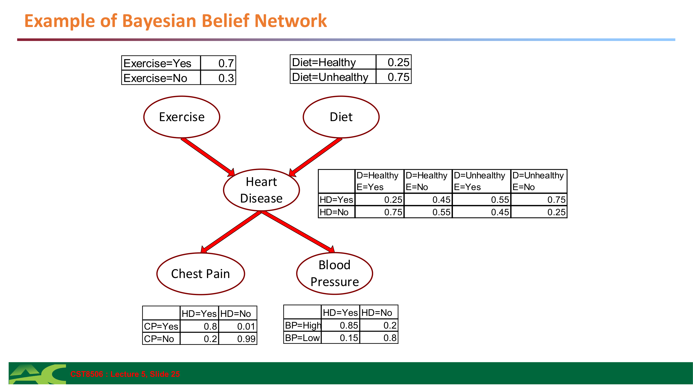

**Heart disease BBN example:** A complete BBN with nodes Exercise, Diet, Heart Disease, Blood Pressure, Chest Pain, and their conditional probability tables.

**心脏病 BBN 示例：** 完整的 BBN，包含节点：运动、饮食、心脏病、血压、胸痛，及其条件概率表。

- **Root nodes (prior probabilities):**
  - P(Exercise=Yes) = 0.7, P(Exercise=No) = 0.3
  - P(Diet=Healthy) = 0.25, P(Diet=Unhealthy) = 0.75
- **Heart Disease (depends on Exercise & Diet):**
  - P(HD=Yes | E=Yes, D=Healthy) = 0.25
  - P(HD=Yes | E=No, D=Unhealthy) = 0.75
- **Chest Pain & Blood Pressure (depend on Heart Disease):**
  - P(CP=Yes | HD=Yes) = 0.8, P(BP=High | HD=Yes) = 0.85

### 11.2 BBN 推理计算 (BBN Inference Computation)

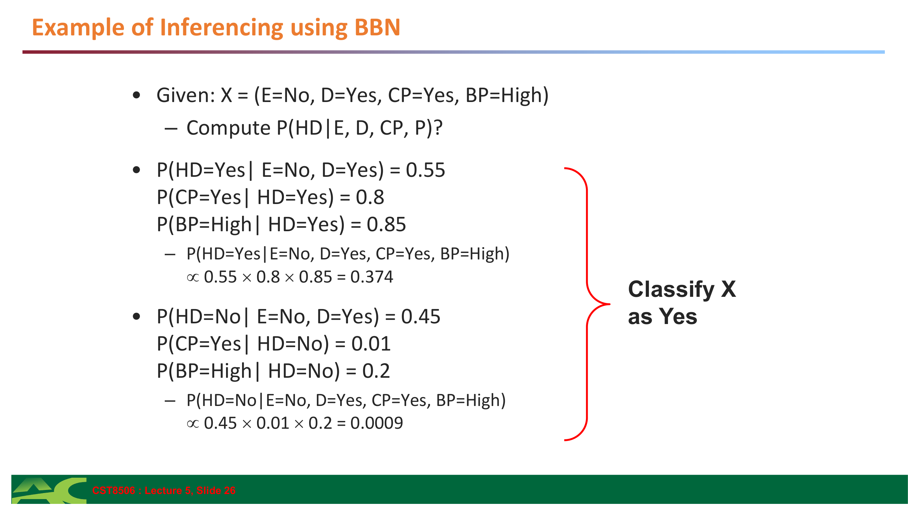

**Inference example:** Given X = (E=No, D=Yes, CP=Yes, BP=High), compute P(HD|X).

**推理示例：** 给定 X = (运动=否, 饮食=健康, 胸痛=是, 血压=高)，计算 P(HD|X)。

- P(HD=Yes | E=No, D=Yes) = 0.45 → × P(CP=Yes|HD=Yes) × P(BP=High|HD=Yes) = 0.45 × 0.8 × 0.85 = **0.306** (note: slide shows 0.55 for HD=Yes)
- P(HD=No | E=No, D=Yes) = 0.55 → × P(CP=Yes|HD=No) × P(BP=High|HD=No) = 0.55 × 0.01 × 0.2 = **0.0011** (note: slide shows 0.45 for HD=No)
- Since 0.306 ≫ 0.0011 → **Classify X as HD = Yes** — 分类为心脏病 = 是

> **📝 Notes:**
>
> **⚙️ How:**
> **(1) BBN inference steps (BBN 推理步骤):**
>
> Step 1: Look up P(HD|parents) from the conditional table → P(HD=Yes|E=No,D=Yes) = 0.45.
> Step 2: Multiply by child likelihoods: P(CP=Yes|HD=Yes) × P(BP=High|HD=Yes) = 0.8 × 0.85.
> Step 3: Product = 0.45 × 0.8 × 0.85 = 0.306 (proportional to P(HD=Yes|all evidence)).
> Repeat for HD=No: 0.55 × 0.01 × 0.2 = 0.0011. Compare.
>
> > 步骤1：从条件表查找 P(HD|父节点) → P(HD=是|E=否,D=是) = 0.45。
> > 步骤2：乘以子节点似然：P(CP=是|HD=是) × P(BP=高|HD=是) = 0.8 × 0.85。
> > 步骤3：乘积 = 0.45 × 0.8 × 0.85 = 0.306（正比于 P(HD=是|所有证据)）。
> > 对 HD=否 重复：0.55 × 0.01 × 0.2 = 0.0011。比较。
>
> **🔢 Example:**
> **(1) Heart disease inference (心脏病推理):**
>
> **Problem:** Given Evidence = (Exercise=No, Diet=Healthy, ChestPain=Yes, BloodPressure=High). Does the patient have heart disease?
> **Solution:**
>
> - P(HD=Yes|E=No,D=Healthy) = 0.45 (from CPT)
> - P(HD=Yes, CP=Yes, BP=High | E=No, D=Healthy) ∝ 0.45 × 0.8 × 0.85 = **0.306**
> - P(HD=No|E=No,D=Healthy) = 0.55
> - P(HD=No, CP=Yes, BP=High | E=No, D=Healthy) ∝ 0.55 × 0.01 × 0.2 = **0.0011**
> - 0.306 ≫ 0.0011 → **Classify as Heart Disease = Yes**
>
> > **题目：** 给定证据 = (运动=否, 饮食=健康, 胸痛=是, 血压=高)。患者是否有心脏病？
> > **解：** 0.306 ≫ 0.0011 → **分类为心脏病 = 是**
>
> **⚠️ Pitfall:**
> **(1) BBN ≠ Causal model (BBN ≠ 因果模型):**
>
> BBN encodes **conditional dependencies**, not necessarily causal relationships. The edges often align with causation (disease → symptom), but the math works even if edges are reversed. Don't over-interpret the direction.
>
> > BBN 编码的是**条件依赖**，不一定是因果关系。边往往与因果一致（疾病→症状），但数学上边反转也工作。不要过度解读方向。
>
> **📝 Exam:**
> **(1) 计算题 (Calculation):**
>
> "Given this BBN and evidence, compute P(X|evidence)." → Look up CPTs, multiply parent conditionals by child likelihoods, compare across hypotheses.
>
> > "给定 BBN 和证据，计算 P(X|证据)。" → 查找 CPT，父节点条件概率乘以子节点似然，跨假设比较。

---

## 12. 结语 (Conclusion)

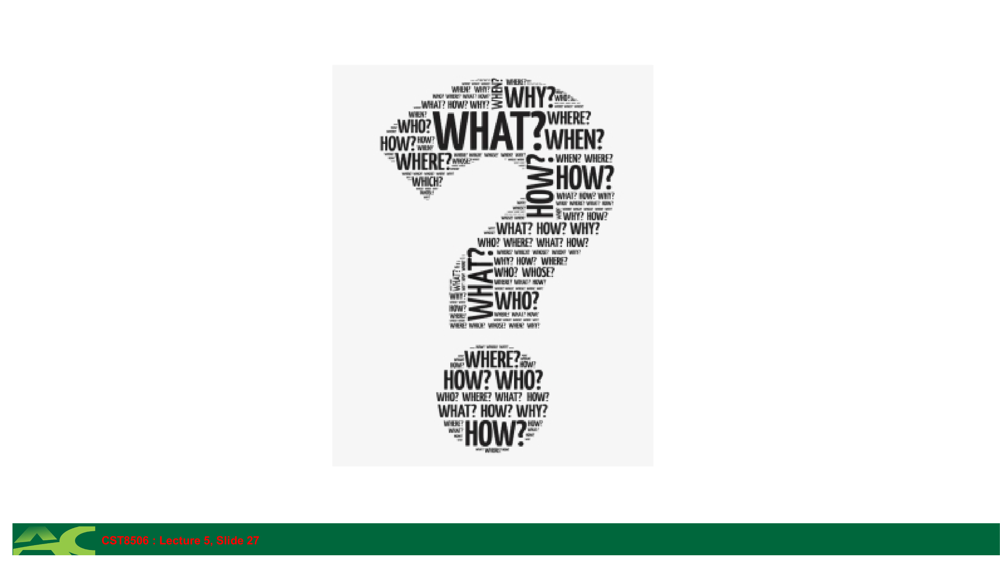

**End slide.**

**结束页。**
