# Week 6: 聚类分析 (Clustering)

> Source: `Week6Clustering.pdf`
> Total slides: 50
> Instructor: Dr. Abbas Akkasi | Winter 2026
> Adapted from materials by Pang-Ning Tan (Data Mining Course)

---

## 1. 聚类分析概述 (What is Cluster Analysis?)

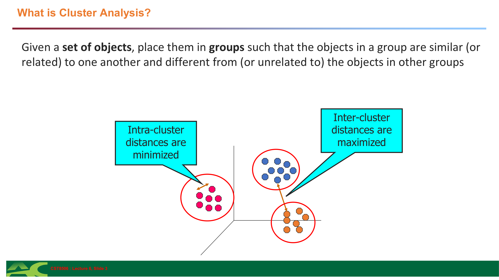

- Given a set of objects, place them in **groups** such that objects in a group are **similar** to one another and **different** from objects in other groups
- Goal: **minimize intra-cluster distances**, **maximize inter-cluster distances**

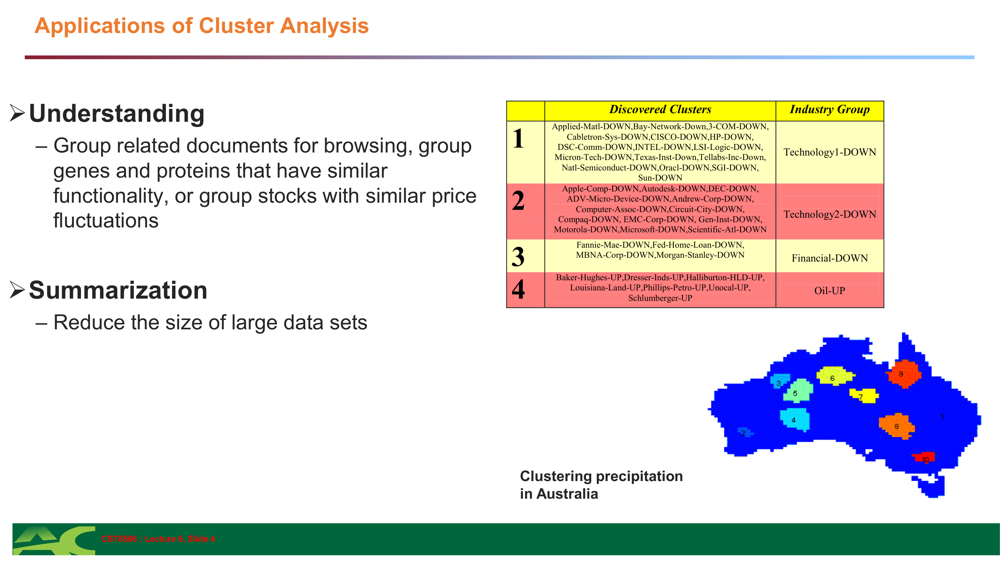

**Applications:**

- **Understanding:** Group related documents for browsing, group genes/proteins with similar functionality, group stocks with similar price fluctuations
- **Summarization:** Reduce the size of large data sets (e.g., clustering precipitation data in Australia)

---

## 2. 聚类类型 (Types of Clusterings)

### 2.1 划分聚类 vs 层次聚类 (Partitional vs Hierarchical)

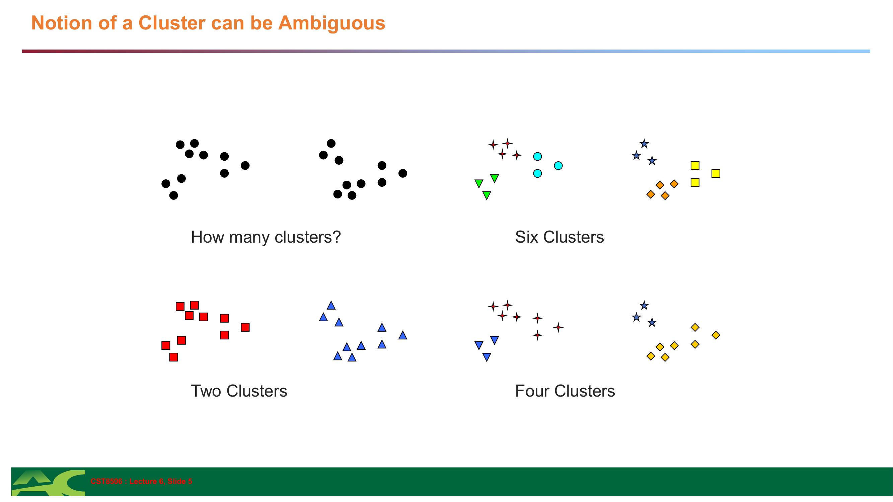

- How many clusters? The notion of a cluster can be **ambiguous** — same data can have 2, 4, or 6 clusters depending on perspective

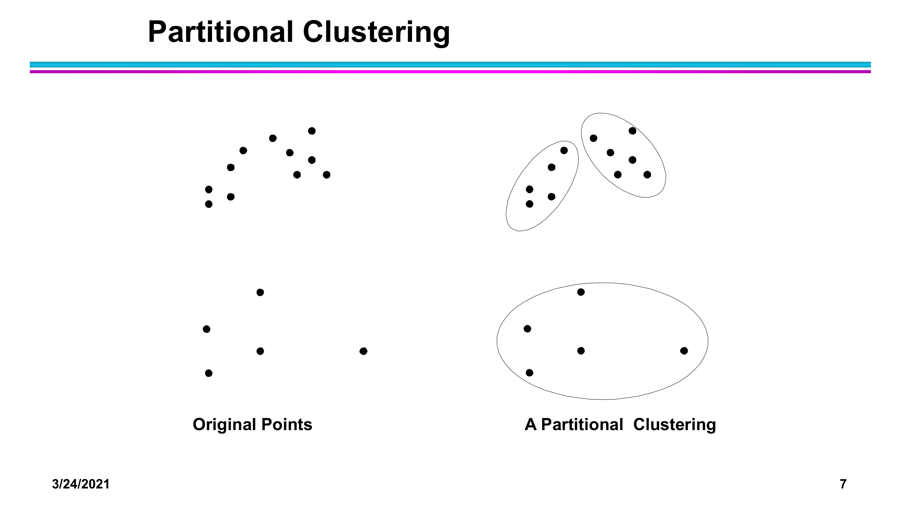

- **Partitional Clustering:** Divides data into **non-overlapping** subsets (clusters)

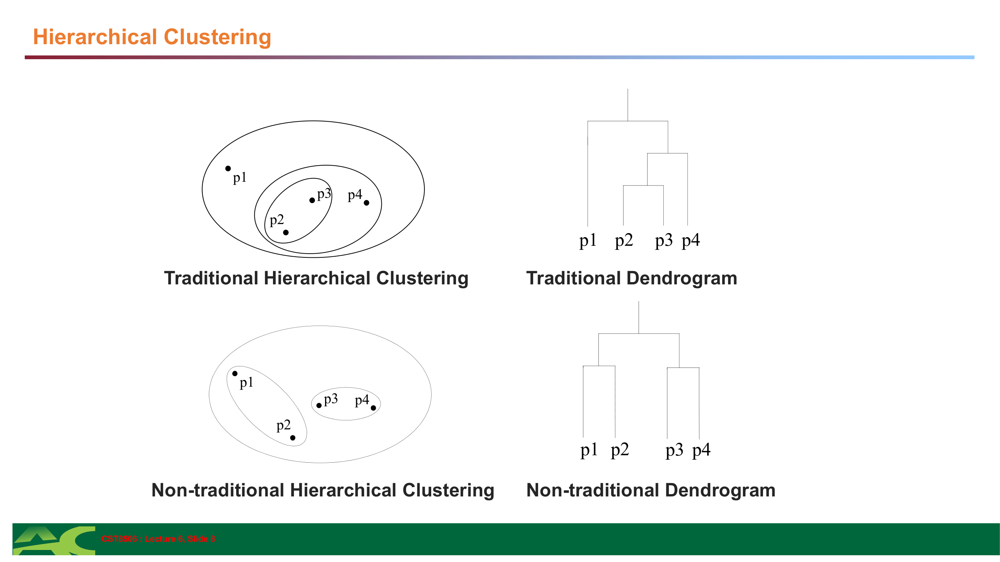

- **Hierarchical Clustering:** Creates **nested clusters** organized as a hierarchical tree (dendrogram)
- Traditional vs Non-traditional dendrograms

### 2.2 簇的类型 (Types of Clusters)

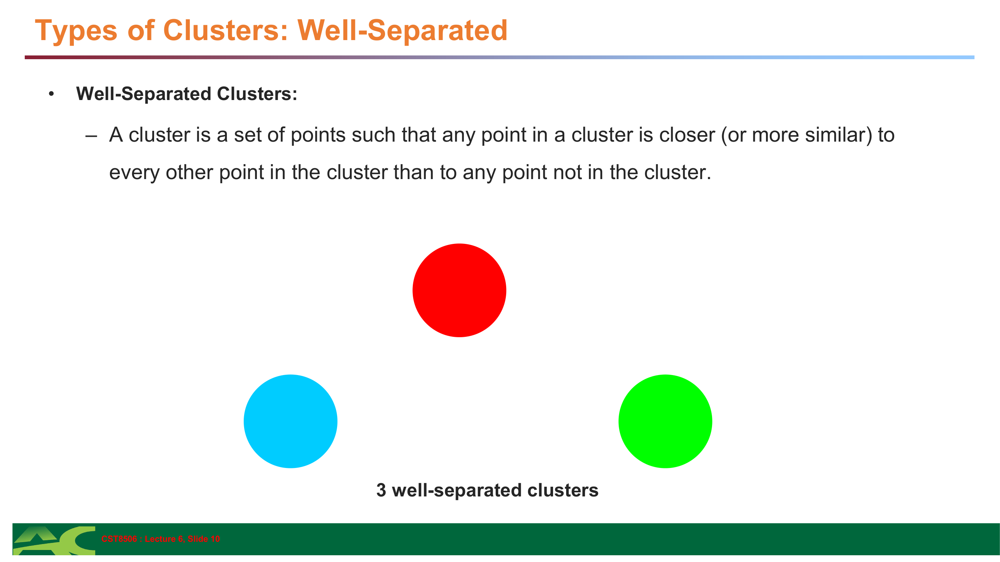

**Well-separated:** Every point closer to its cluster than to any other cluster

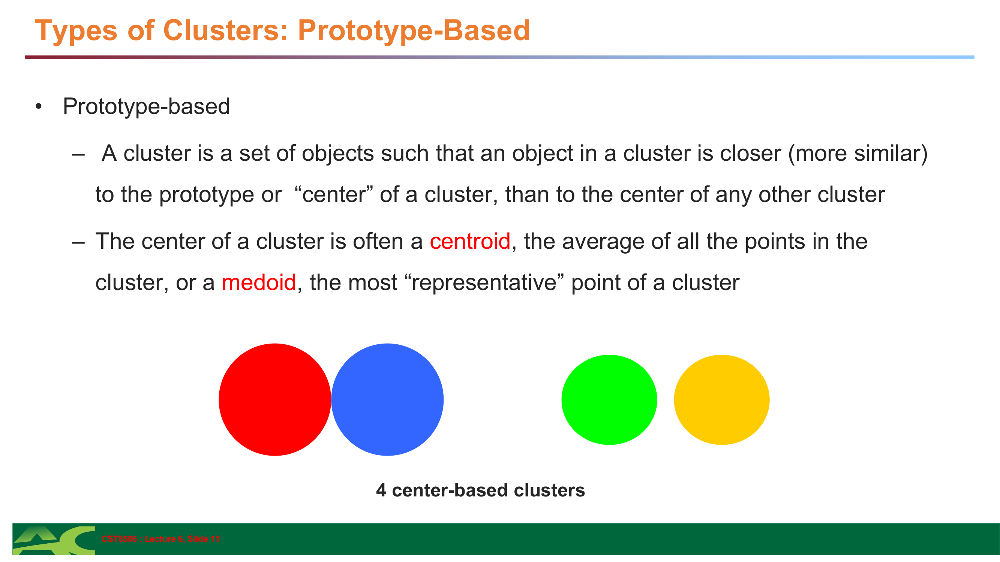

**Prototype-based:** Each point closer to the centroid (mean/medoid) of its cluster than to any other centroid

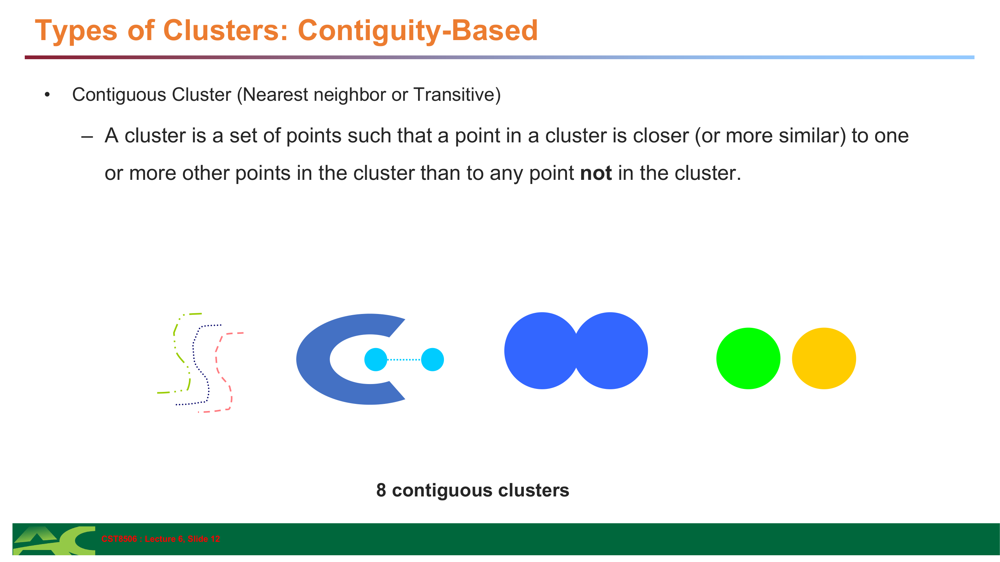

**Contiguity-based (Nearest neighbor):** Each point closer to at least one point in its cluster than to any point outside

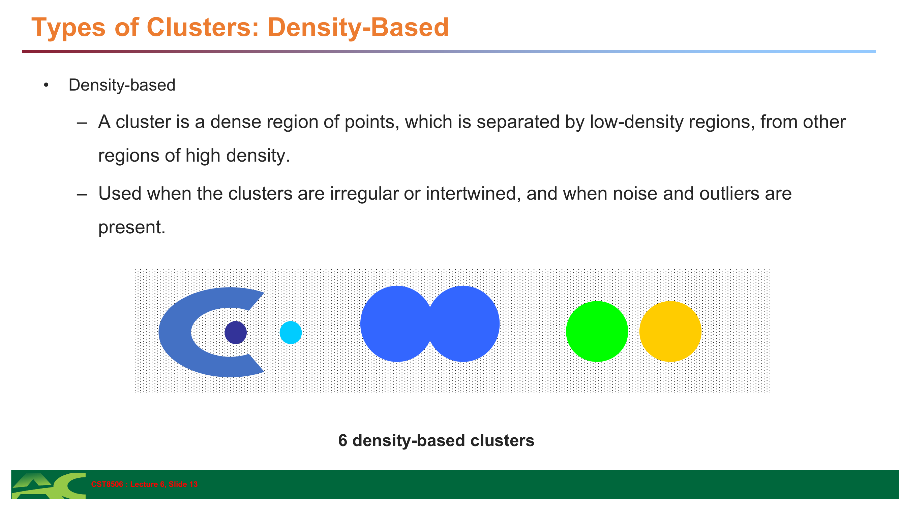

**Density-based:** Dense regions separated by low-density regions. Used for irregular or intertwined clusters with noise/outliers.

---

## 3. K-Means 聚类 (K-Means Clustering)

### 3.1 基本算法 (Basic Algorithm)

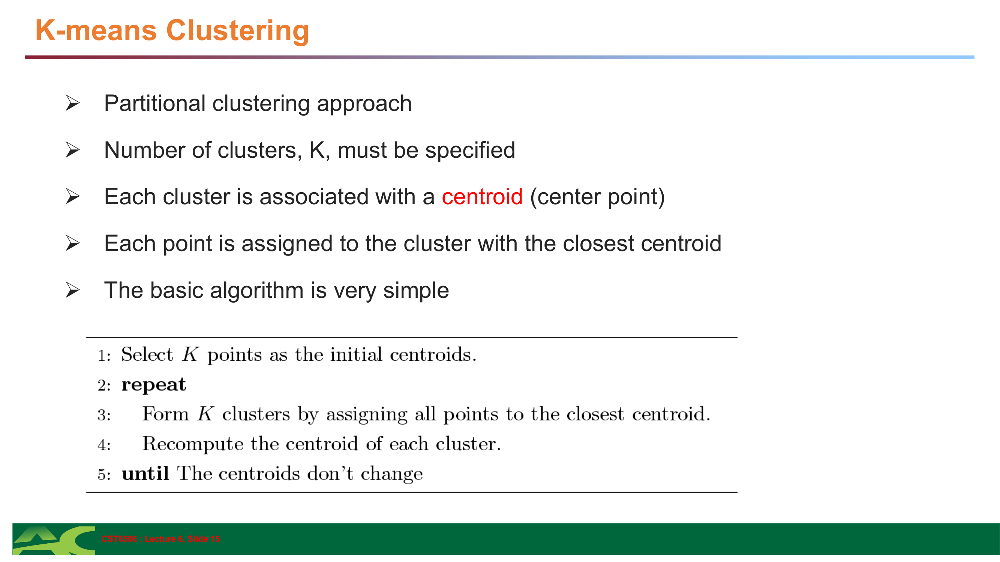

- **Partitional** clustering approach
- Number of clusters **K must be specified**
- Each cluster is associated with a **centroid** (center point)
- Each point is assigned to the cluster with the **closest centroid**

**Algorithm:**

1. Choose K initial centroids (often randomly)
2. **Repeat:**
   - Assign each point to the nearest centroid
   - Recompute cluster centroids (mean of all points in cluster)
3. **Until** centroids stop changing (or few points change clusters)

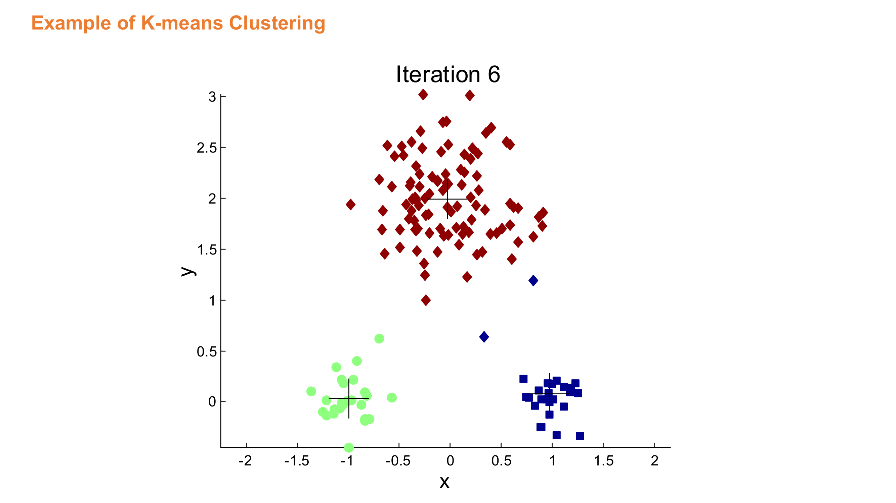

K-Means iteration example (iteration 1–6): initial random centroids gradually move to the true cluster centers.

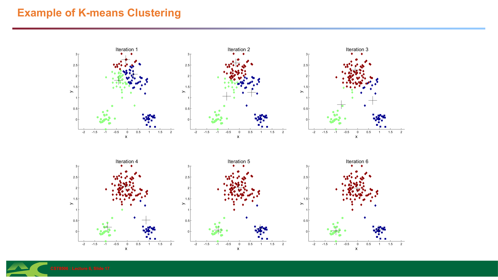

Continued iteration — centroids converge to stable positions.

### 3.2 细节与复杂度 (Details & Complexity)

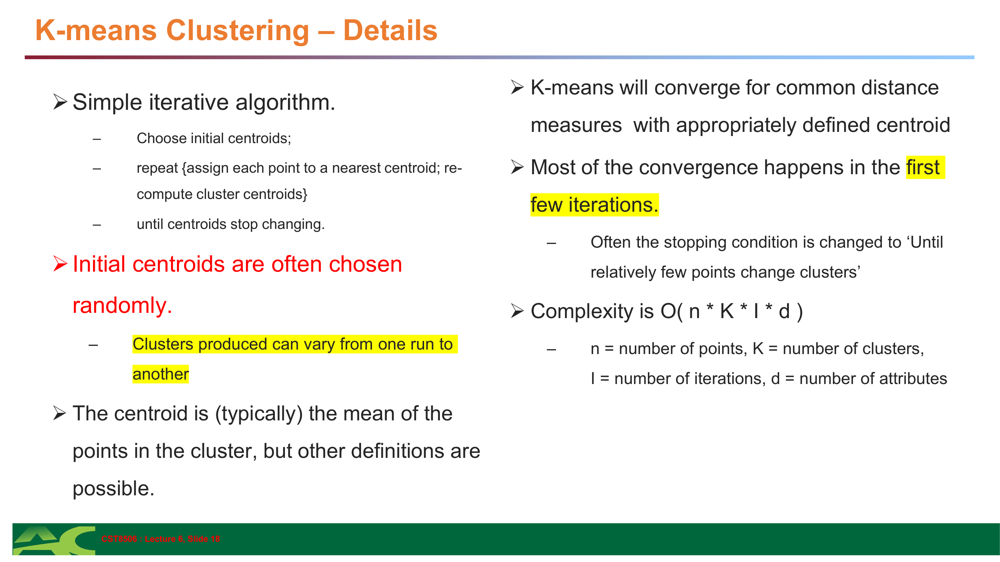

- **Convergence:** K-Means will converge for common distance measures
- Most convergence happens in the **first few iterations**
- **Complexity:** O(n × K × I × d)
  - n = number of points
  - K = number of clusters
  - I = number of iterations
  - d = number of attributes
- Initial centroids are often chosen **randomly** → clusters can vary from run to run
- The centroid is typically the **mean** of points in the cluster

### 3.3 目标函数: SSE (Objective Function: Sum of Squared Error)

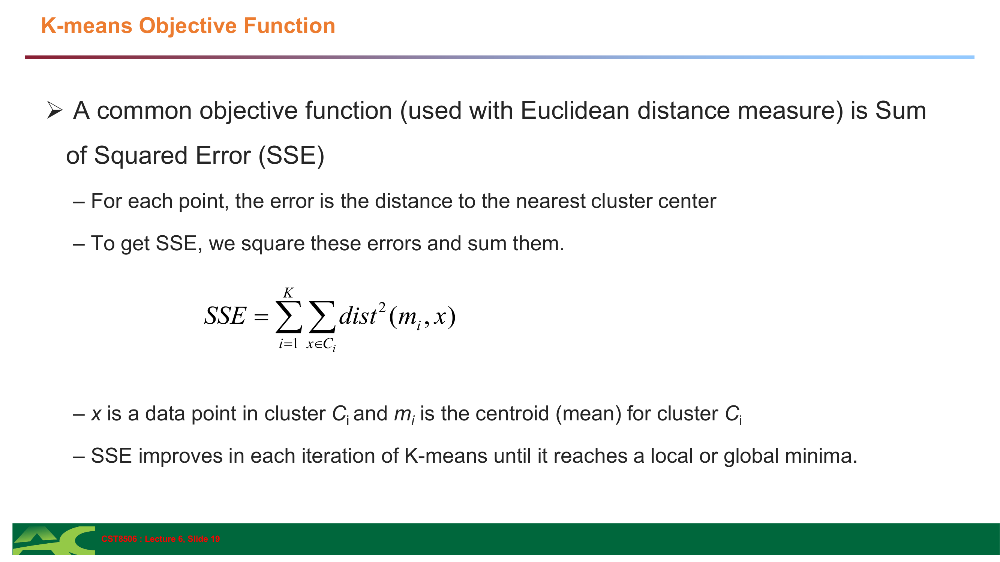

- **SSE** = Σᵢ Σₓ∈Cᵢ ‖x - mᵢ‖²  = Σᵢ Σₓ∈Cᵢ Σⱼ (xⱼ - mᵢⱼ)²
  - x = data point in cluster Cᵢ
  - mᵢ = centroid (mean) of cluster Cᵢ
  - ‖x - mᵢ‖² = squared Euclidean distance = sum of squared differences across all d dimensions
- SSE improves in each iteration until it reaches a **local or global minimum**
- Goal: find the clustering that minimizes SSE

---

## 4. 层次聚类 (Hierarchical Clustering)

### 4.1 概述 (Overview)

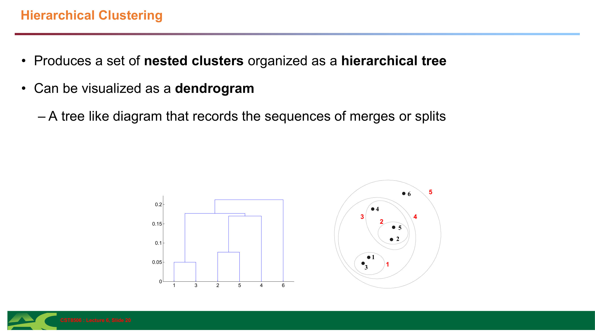

- Produces **nested clusters** organized as a hierarchical tree
- Visualized as a **dendrogram** — a tree diagram recording sequences of merges or splits
- **No need to specify K** in advance — choose K by cutting the dendrogram at the desired level

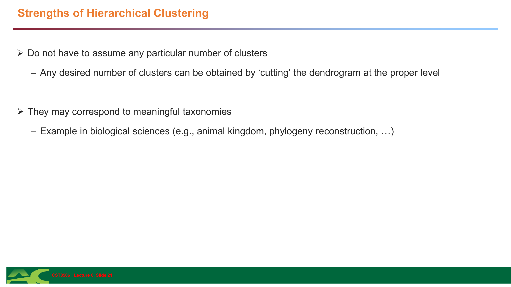

**Strengths:**

- Do not have to assume any particular number of clusters — obtain any K by cutting dendrogram
- May correspond to meaningful taxonomies (e.g., biological sciences, phylogeny)

### 4.2 凝聚 vs 分裂 (Agglomerative vs Divisive)

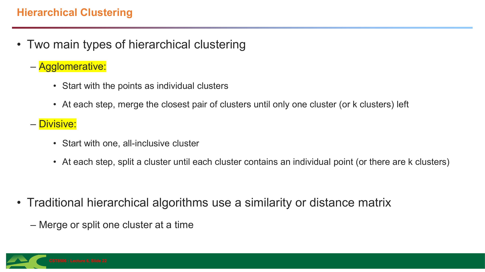

- **Agglomerative (Bottom-up):**
  - Start with each point as an individual cluster
  - At each step, merge the **closest pair** of clusters
  - Continue until only one cluster (or K clusters) remains
- **Divisive (Top-down):**
  - Start with one all-inclusive cluster
  - At each step, **split** a cluster
  - Continue until each cluster contains an individual point (or K clusters)
- Traditional hierarchical algorithms use a **similarity or distance matrix**

### 4.3 凝聚算法 (Agglomerative Algorithm)

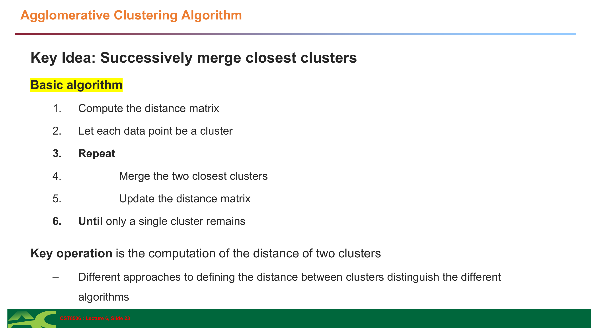

**Basic algorithm / 基本算法：**

1. Compute the **distance matrix** — 计算距离矩阵
2. Let each data point be a cluster — 每个数据点自成一个簇
3. **Repeat:** Merge the two closest clusters → Update the distance matrix — **重复：** 合并最近的两个簇 → 更新距离矩阵
4. **Until** only a single cluster remains — **直到** 只剩一个簇

**Key operation:** how to define the distance between two clusters — different definitions give different algorithms

**关键操作：** 如何定义两个簇之间的距离 — 不同的定义产生不同的算法变体（MIN / MAX / Average / Ward）

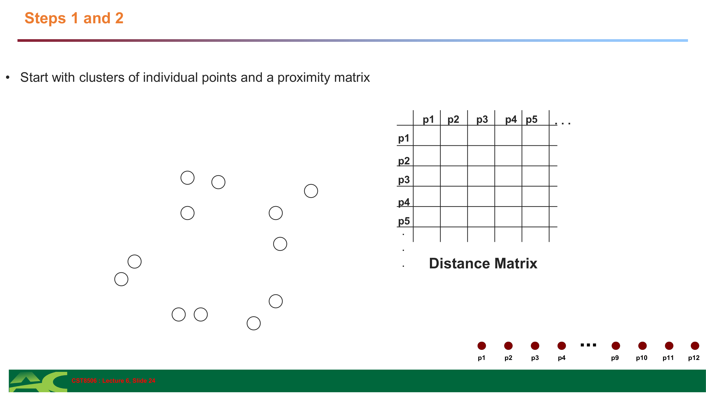

**Steps 1 & 2:** Start with individual points and a proximity matrix. Left: scatter plot where each point = one cluster. Right: N×N distance matrix (p1–p5…). Bottom: dendrogram with each point as a leaf node — no merges yet.

**步骤 1 和 2：** 从单个数据点开始，建立距离矩阵。左侧：散点图，每个点 = 一个簇。右侧：N×N 距离矩阵（p1–p5…）。底部：树状图初始状态，每个点各自为叶节点，尚未发生任何合并。

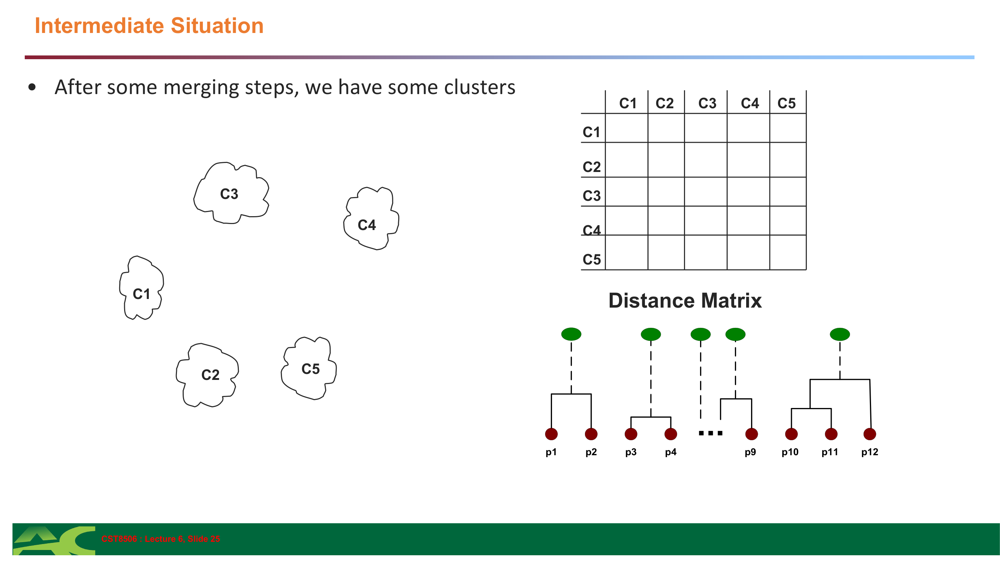

**Intermediate situation:** After some merging steps, individual points have formed 5 clusters (C1–C5, shown as "cloud" shapes). Distance matrix has shrunk to 5×5. The dendrogram records all previous merges (some points already connected).

**中间状态：** 经过若干次合并后，原始数据点已形成5个簇（C1–C5，用"云朵"形状表示）。距离矩阵缩小为 5×5。树状图已记录了之前的所有合并（部分点已经通过连线合并）。

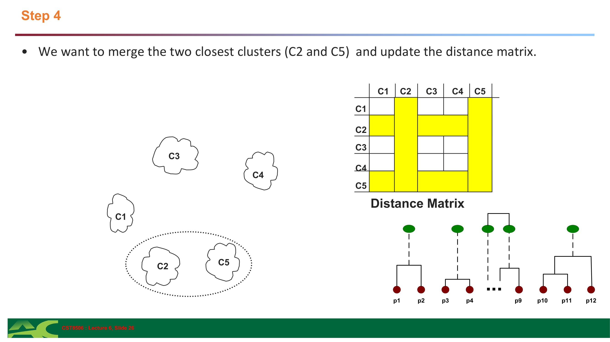

**Merge step (Step 4):** Find minimum in 5×5 distance matrix → C2 and C5 are closest (yellow-highlighted rows/columns). Dotted oval on the left circles C2 and C5, indicating they will merge. Dendrogram will add a new connecting branch.

**合并步骤（第4步）：** 在 5×5 距离矩阵中找最小值 → C2 和 C5 距离最近（黄色高亮的行/列）。左侧虚线椭圆将 C2 和 C5 圈在一起，表示即将合并。树状图将画一条新的连接分支。

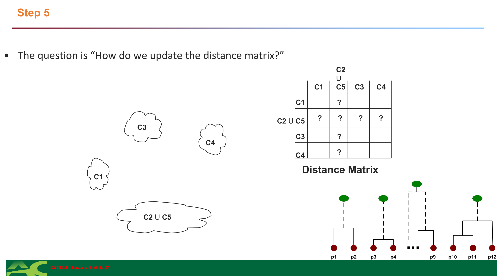

**After merge (Step 5):** C2 and C5 merged into "C2 ∪ C5". Matrix shrinks to 4×4, but new cluster's distances to C1, C3, C4 are marked **"?"** — must be recomputed. How to compute "?" depends on the **linkage method**: MIN (smallest), MAX (largest), Average (mean), Ward (SSE increase).

**合并后（第5步）：** C2 和 C5 合并为 "C2 ∪ C5"。矩阵缩小为 4×4，但新簇到 C1、C3、C4 的距离标为 **"?"** — 需要重新计算。"?" 怎么算取决于**链接方法**：MIN（取最小）、MAX（取最大）、Average（取平均）、Ward（取 SSE 增量）。

### 4.4 簇间距离定义 (Inter-Cluster Distance Methods)

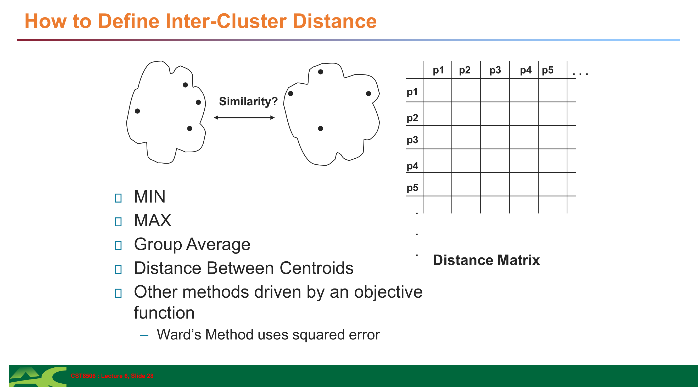

**Overview slide:** Title "How to Define Inter-Cluster Distance". Left: two "cloud" clusters with a double-arrow labeled "Similarity?" between them. Right: distance matrix (p1–p5…). Bottom: lists all 5 methods — MIN, MAX, Group Average, Distance Between Centroids, and Ward's Method (objective-function-driven, uses squared error). This slide frames the central question: after merging, how do you compute the new cluster's distances?

**概览幻灯片：** 标题"如何定义簇间距离"。左侧：两个"云朵"簇之间标注"Similarity?"的双向箭头。右侧：距离矩阵（p1–p5…）。底部：列出全部5种方法 — MIN、MAX、Group Average、质心距离和Ward方法（基于目标函数，使用平方误差）。本页提出核心问题：合并后，如何计算新簇的距离？

| Method                           | Definition                                                         | Also Called       |
| -------------------------------- | ------------------------------------------------------------------ | ----------------- |
| **MIN (Single Linkage)**   | Minimum distance between any two points in different clusters      | Nearest neighbor  |
| **MAX (Complete Linkage)** | Maximum distance between any two points in different clusters      | Farthest neighbor |
| **Group Average**          | Average distance between all pairs of points in different clusters | Average linkage   |
| **Centroid Distance**      | Distance between the centroids of two clusters                     | —                |
| **Ward's Method**          | Increase in total SSE after merging two clusters                   | Minimum variance  |

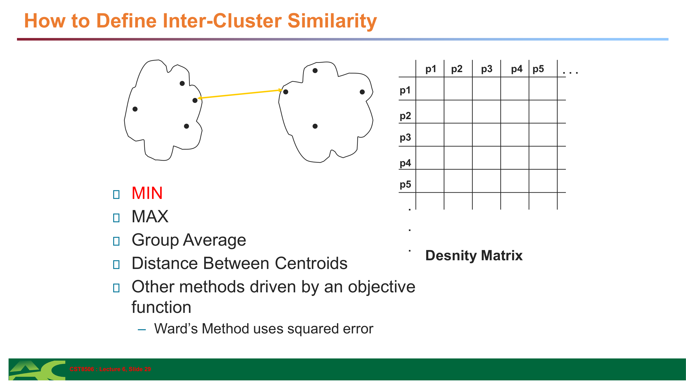

**MIN (Single Linkage):** Same two-cluster diagram, but now a single yellow line connects the two closest points (one from each cluster) — this shortest cross-cluster distance is used. "MIN" is highlighted in the method list. Intuition: only the nearest pair matters.

**MIN（单链接）：** 同样的两个簇图，但现在一条黄色线连接了两个最近的点（每个簇各一个）— 使用这个最短跨簇距离。方法列表中"MIN"被高亮。直觉理解：只有最近的那一对点有关系。

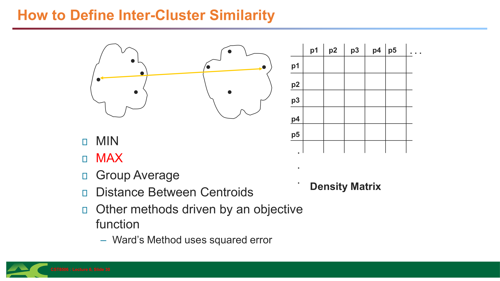

**MAX (Complete Linkage):** Same diagram, but the yellow line now connects the two farthest points (one from each cluster) — this longest cross-cluster distance is used. "MAX" is highlighted. Intuition: the worst-case pair determines the distance.

**MAX（完全链接）：** 同样的图，但黄色线现在连接两个最远的点（每个簇各一个）— 使用这个最长跨簇距离。"MAX"被高亮。直觉理解：最坏情况的那对点决定了距离。

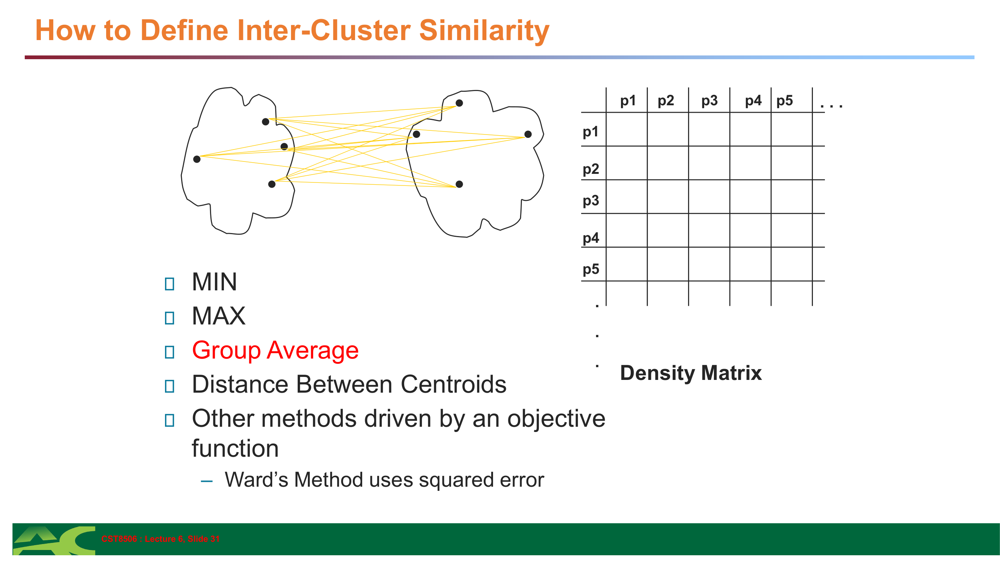

**Group Average:** Same diagram, but now many yellow lines connect every pair of points across the two clusters — all pairwise distances are drawn. The cluster distance = average of all these pairwise distances. "Group Average" is highlighted. Intuition: considers ALL cross-cluster point pairs, not just extremes.

**组平均：** 同样的图，但现在多条黄色线连接了两个簇之间的所有点对 — 绘制了全部成对距离。簇间距离 = 所有这些成对距离的平均值。"Group Average"被高亮。直觉理解：考虑所有跨簇点对，不只是极端的。

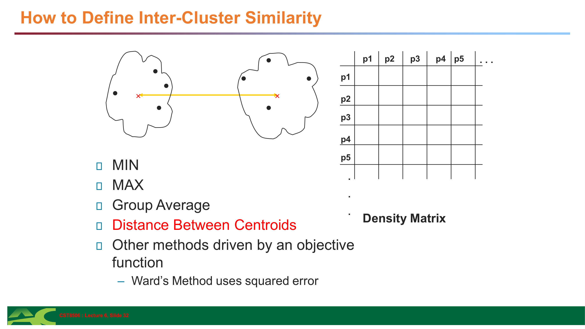

**Distance Between Centroids:** Same diagram, but now each cluster has a centroid marked with "×" (red cross). A single yellow line connects the two centroids — their distance is used. "Distance Between Centroids" is highlighted. Intuition: represents each cluster by its center of mass.

**质心距离：** 同样的图，但现在每个簇用"×"（红色叉号）标注了质心。一条黄色线连接两个质心 — 用它们之间的距离。"Distance Between Centroids"被高亮。直觉理解：用质心（重心）代表整个簇。

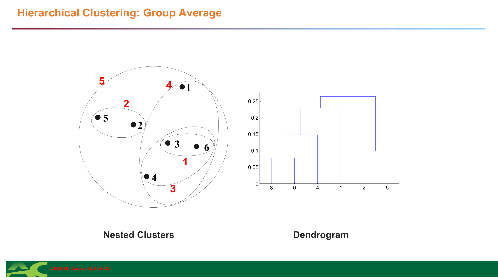

**Group Average full example:** Left: 6 data points (labeled 1–6) shown with nested ellipses representing the hierarchical clustering result — innermost clusters {3,6} and {1,4} merge first, then larger clusters form (numbered 1–5 as merge order in red). Right: corresponding dendrogram with y-axis showing merge distance (0 to 0.25); merge order matches the nested structure.

**组平均完整示例：** 左侧：6个数据点（编号1–6），用嵌套椭圆表示层次聚类结果 — 最内层的簇{3,6}和{1,4}先合并，然后逐步形成更大的簇（红色数字1–5表示合并顺序）。右侧：对应的树状图，y轴显示合并距离（0到0.25）；合并顺序与嵌套结构一致。

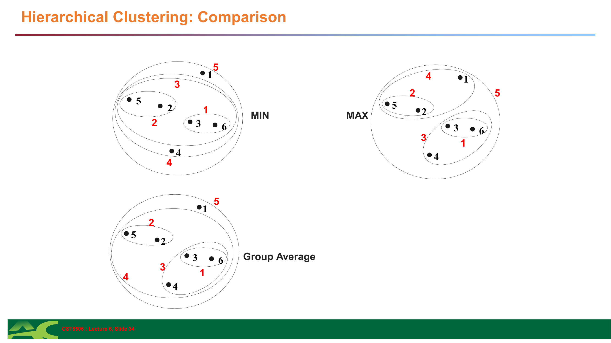

**Comparison of linkage methods on the same data (6 points):** Three nested-cluster diagrams side by side — MIN, MAX, and Group Average. Each shows the same 6 points but with different merge orders (red numbers) and different final cluster shapes. MIN: produces elongated, chain-like clusters (points merge in sequence). MAX: produces compact, balanced clusters (distant points forced together later). Group Average: compromise between the two.

**同一数据（6个点）上不同链接方法的比较：** 三组嵌套簇图并排展示 — MIN、MAX 和 Group Average。每组使用相同的6个点，但合并顺序（红色数字）和最终簇形状不同。MIN：产生细长的链状簇（点按序号链式合并）。MAX：产生紧凑、均衡的簇（远距离的点被推迟合并）。Group Average：两者的折中。

---

## 5. DBSCAN (基于密度的聚类)

### 5.1 核心概念 (Core Concepts)

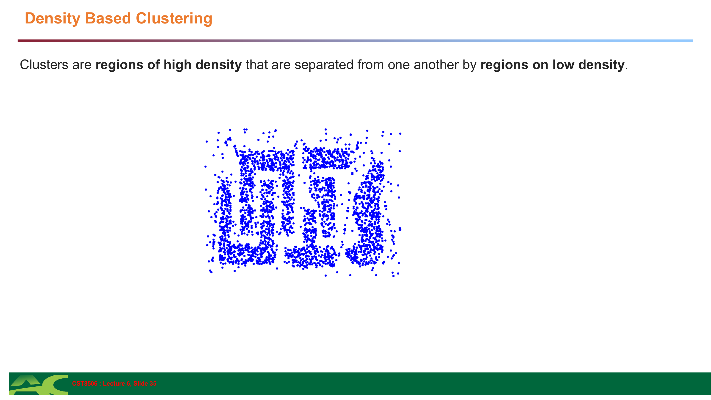

**Density-Based Clustering introduction:** Title "Density Based Clustering". Text: "Clusters are **regions of high density** separated from one another by **regions on low density**." Below: a scatter plot of blue dots forming block-letter shapes (resembling characters) — dense regions form the letter strokes, sparse/empty regions form the gaps. This motivates density-based methods: the "shape" of each character cluster is highly non-spherical, so K-Means would fail here.

**基于密度的聚类引入：** 标题"Density Based Clustering"。文字："簇是被**低密度区域**分隔的**高密度区域**。"下方：蓝色散点图呈方块字母形状 — 密集区域构成字母笔画，稀疏/空白区域构成间隔。这引出了基于密度方法的动机：每个字符簇的"形状"高度非球形，K-Means在这里会失败。

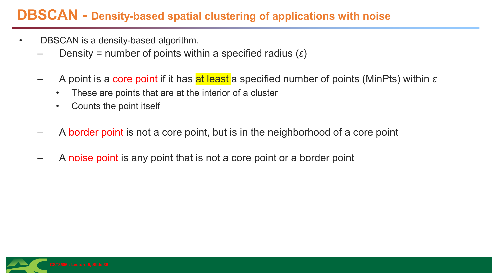

**DBSCAN definition slide:** Title "DBSCAN - Density-based spatial clustering of applications with noise". Defines: Density = number of points within radius ε. Three point types: **core point** (orange text, has ≥ MinPts neighbors within ε, "at least" is highlighted in yellow — note it counts the point itself), **border point** (orange text, not core but within ε of a core point), **noise point** (orange text, neither core nor border). Key detail on slide: "Counts the point itself" — this is a common exam trap.

**DBSCAN 定义幻灯片：** 标题"DBSCAN - 基于密度的带噪声空间聚类"。定义：密度 = 半径ε内的点数。三种点类型：**核心点**（橙色文字，ε内有≥MinPts个邻居，"at least"被黄色高亮 — 注意会把自身也算在内），**边界点**（橙色文字，不是核心点但在某个核心点的ε内），**噪声点**（橙色文字，既不是核心点也不是边界点）。幻灯片关键细节："Counts the point itself" — 这是常见的考试陷阱。

- **Density** = number of points within a specified radius (ε, epsilon) — 密度 = 指定半径ε内的点数
- **Two parameters:** ε (radius) and MinPts (minimum points) — 两个参数：ε（半径）和 MinPts（最小点数）
- **Core point:** has at least MinPts points within ε (**including itself**) — interior of cluster — 核心点：ε内至少有MinPts个点（**包括自身**）— 簇的内部
- **Border point:** not a core point, but in the neighborhood of a core point — 边界点：不是核心点，但在某个核心点的邻域内
- **Noise point:** neither core nor border — outlier — 噪声点：既不是核心也不是边界 — 异常值

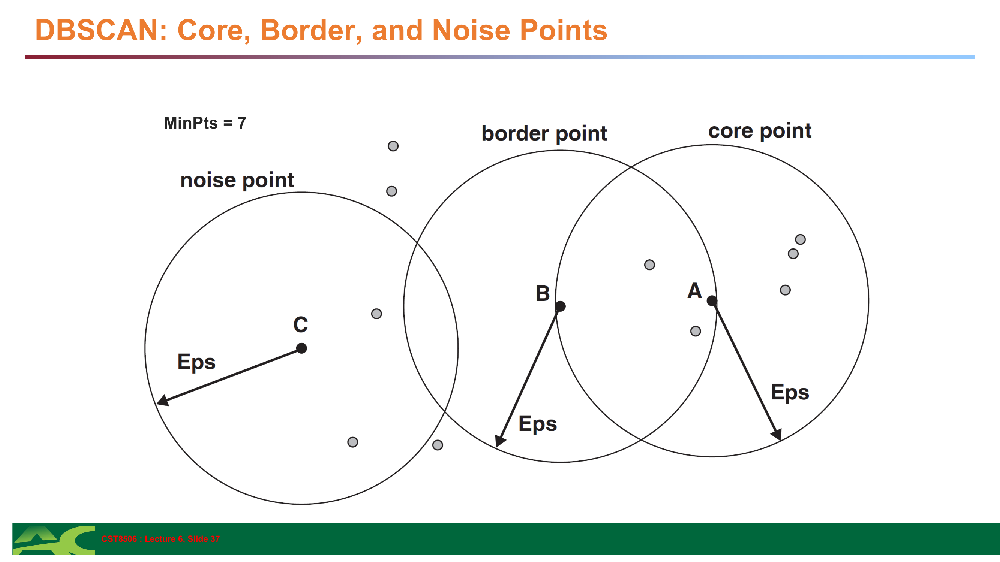

**Diagram of three point types (MinPts = 7):** Three overlapping circles with radius Eps. Right circle (labeled "core point", point **A**): point A (black dot) has ≥ 7 points (gray dots) within its ε-circle → core. Middle circle (labeled "border point", point **B**): point B has < 7 points in its own ε-circle, but falls inside A's ε-circle → border. Left circle (labeled "noise point", point **C**): point C has < 7 points in its ε-circle and doesn't fall in any core point's circle → noise. The Eps arrows show the radius of each circle.

**三种点类型示意图（MinPts = 7）：** 三个半径为Eps的重叠圆。右侧圆（标注"core point"，点**A**）：点A（黑色实心点）在其ε圆内有≥7个点（灰色点）→ 核心点。中间圆（标注"border point"，点**B**）：点B自己的ε圆内不足7个点，但落入了A的ε圆内 → 边界点。左侧圆（标注"noise point"，点**C**）：点C的ε圆内不足7个点，也不在任何核心点的圆内 → 噪声点。Eps箭头标注了每个圆的半径。

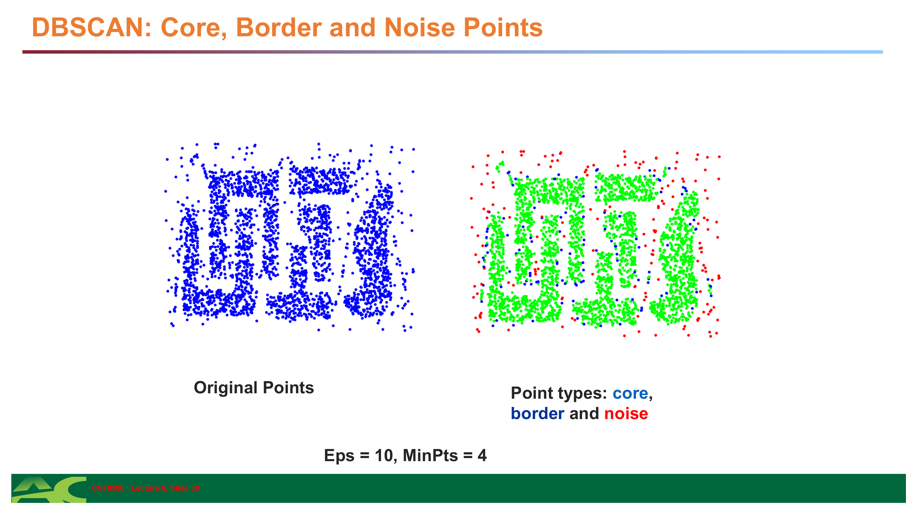

**Real example (Eps = 10, MinPts = 4):** Left: original scatter plot (all blue dots), forming block-letter shapes — same data as page 35. Right: after DBSCAN classification — **green** = core points (dense interior of each letter stroke), **blue** = border points (edges of letter strokes), **red** = noise points (scattered outside the letters). The letter shapes are clearly preserved by core+border points, while isolated dots are correctly flagged as noise.

**实际示例（Eps = 10, MinPts = 4）：** 左图：原始散点图（全蓝色点），形成方块字母形状 — 与第35页相同的数据。右图：DBSCAN分类后 — **绿色** = 核心点（每个字母笔画的密集内部），**蓝色** = 边界点（字母笔画的边缘），**红色** = 噪声点（字母外部的孤立点）。核心+边界点清楚地保留了字母形状，而孤立的点被正确标记为噪声。

### 5.2 算法步骤 (Algorithm Steps)

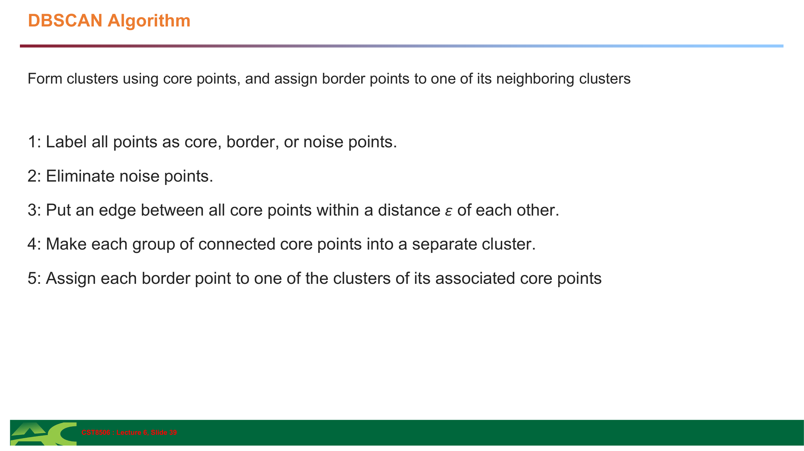

**DBSCAN Algorithm slide:** Title "DBSCAN Algorithm". Summary line: "Form clusters using core points, and assign border points to one of its neighboring clusters." Then 5 numbered steps listed in plain text. This is the complete pseudocode — note it is NOT iterative like K-Means; it runs in a single pass (label → eliminate → connect → cluster → assign).

**DBSCAN 算法幻灯片：** 标题"DBSCAN Algorithm"。摘要行："用核心点形成簇，将边界点分配到其相邻簇之一。"然后列出5个编号步骤。这是完整的伪代码 — 注意它不像K-Means那样迭代；它一次性完成（标记→去除→连接→成簇→分配）。

**Algorithm steps / 算法步骤：**

1. **Label** all points as core, border, or noise — **标记**所有点为核心、边界或噪声
2. **Eliminate** noise points — **去除**噪声点
3. Put an **edge** between all core points within distance ε of each other — 在所有距离ε内的核心点之间连**边**
4. Make each group of **connected core points** into a separate cluster — 每组**连通的核心点**构成一个独立的簇
5. **Assign** each border point to one of the clusters of its associated core points — 将每个边界点**分配**到其关联核心点所在的簇

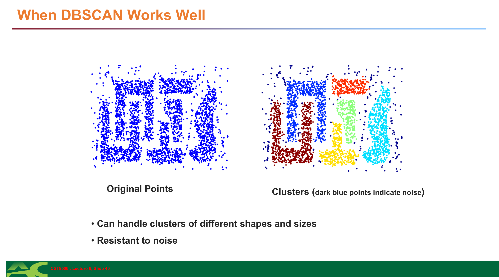

**"When DBSCAN Works Well" slide:** Left: original scatter plot (all blue dots) forming block-letter shapes — same data as before. Right: DBSCAN result — each letter is assigned a different color (dark red, blue, red/orange, yellow, green, cyan), and **dark blue dots scattered around the letters = noise** (automatically excluded). Bottom text: "Can handle clusters of different shapes and sizes" and "Resistant to noise." This demonstrates that DBSCAN correctly separated each letter as a distinct cluster despite their non-convex shapes.

**"DBSCAN何时表现好"幻灯片：** 左图：原始散点图（全蓝色点），形成方块字母形状 — 与之前相同的数据。右图：DBSCAN结果 — 每个字母被分配不同颜色（深红、蓝、红/橙、黄、绿、青），**字母周围散布的深蓝色点 = 噪声**（被自动排除）。底部文字："Can handle clusters of different shapes and sizes"和"Resistant to noise"。这展示了DBSCAN正确地将每个字母分为独立的簇，尽管它们的形状是非凸的。

- Can handle clusters of **different shapes and sizes** — 能处理**不同形状和大小**的簇
- **Resistant to noise** (dark blue points = noise, automatically excluded) — **抗噪声**（深蓝色点 = 噪声，被自动排除）

---

## 6. 基于分布的聚类: EM (Distribution-based Clustering: EM)

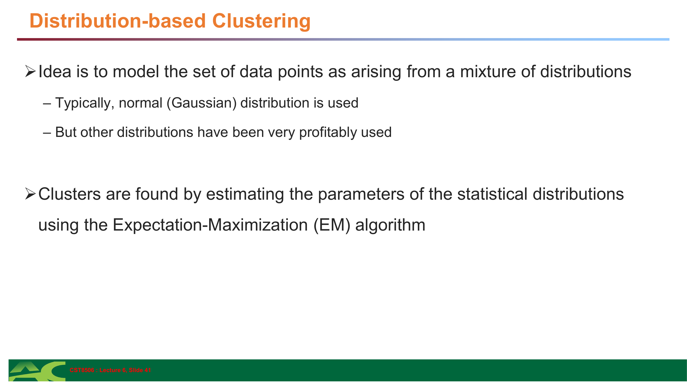

**Distribution-based Clustering introduction:** Title "Distribution-based Clustering". Two bullet points: (1) "Idea is to model the set of data points as arising from a mixture of distributions" with sub-bullets noting Gaussian is typical but other distributions work too; (2) "Clusters are found by estimating the parameters of the statistical distributions using the Expectation-Maximization (EM) algorithm." This is a text-only overview slide — no diagrams.

**基于分布的聚类引入：** 标题"Distribution-based Clustering"。两个要点：(1) "将数据点集建模为来自混合分布" — 通常用高斯分布，但其他分布也可以；(2) "通过期望最大化（EM）算法估计统计分布的参数来发现簇。"这是纯文字概览页 — 没有图表。

> **📎 Background / 背景知识：**
> **Gaussian (Normal) Distribution** = the classic "bell curve" 🔔. Most natural phenomena cluster around an average value, with fewer observations far from the center — this shape is a Gaussian.
> - Defined by just **2 parameters**: **μ** (mean = where the bell is centered) and **σ** (standard deviation = how wide/narrow the bell is)
> - Example: human heights — most people are near average height, few are very tall or very short → bell-shaped histogram
> - Why use it for clustering? If each cluster's data roughly forms a bell shape, we can describe the entire cluster with just (μ, σ) instead of listing every point
>
>> **高斯（正态）分布** = 经典的"钟形曲线" 🔔。大多数自然现象围绕均值聚集，远离中心的观测更少 — 这个形状就是高斯分布。
>> - 仅由**2个参数**定义：**μ**（均值 = 钟形曲线中心位置）和 **σ**（标准差 = 钟形曲线宽窄）
>> - 示例：人的身高 — 大部分人接近平均身高，很高或很矮的人少 → 直方图呈钟形
>> - 为什么用它做聚类？如果每个簇的数据大致呈钟形，只需 (μ, σ) 就能描述整个簇，不用列出每个点

- Model data as arising from a **mixture of distributions** (typically Gaussian) — 将数据建模为**混合分布**（通常是高斯分布）
- Clusters are found by estimating distribution parameters using **Expectation-Maximization (EM)** algorithm — 通过**EM算法**估计分布参数来发现簇

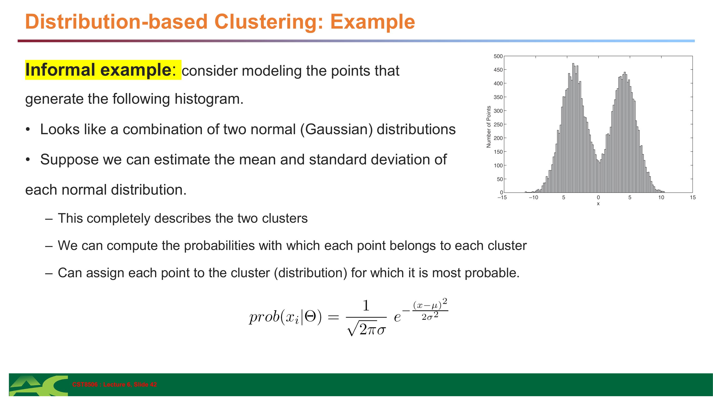

**Distribution-based Clustering Example:** Title "Distribution-based Clustering: Example". Left: text labeled "Informal example" (orange highlighted) describing modeling points that generate a histogram. Right: a histogram (bar chart) with x-axis = x values (range −15 to 15), y-axis = "Number of Points" (up to 500). The histogram shows **two overlapping bell-shaped peaks** — one centered around −5 and another around +5. Below: three bullet points explaining that if we estimate each Gaussian's μ and σ, we completely describe the clusters, can compute membership probabilities, and assign points. Bottom: the Gaussian PDF formula: prob(xᵢ|Θ) = (1/√(2πσ)) · e^(−(x−μ)²/(2σ²)).

**基于分布的聚类示例：** 标题"Distribution-based Clustering: Example"。左侧："Informal example"（橙色高亮）文字描述。右侧：直方图（柱状图），x轴 = x值（范围−15到15），y轴 = "Number of Points"（最高500）。直方图显示**两个重叠的钟形峰** — 一个中心约在−5，另一个约在+5。下方：三个要点说明如果估计每个高斯的μ和σ，就能完全描述簇、计算隶属概率并分配点。底部：高斯PDF公式：prob(xᵢ|Θ) = (1/√(2πσ)) · e^(−(x−μ)²/(2σ²))。

- **Gaussian PDF (Probability Density Function / 概率密度函数):** prob(xᵢ|Θ) = (1/√(2πσ)) · e^(−(x−μ)²/(2σ²))
  - xᵢ = a data point — 一个数据点
  - Θ = parameters {μ, σ} — 参数集
  - μ = mean (center of the bell curve) — 均值（钟形曲线中心）
  - σ = standard deviation (width of the bell curve) — 标准差（钟形曲线宽度）
  - Overall: probability of observing xᵢ given this Gaussian — 在给定高斯下观察到xᵢ的概率

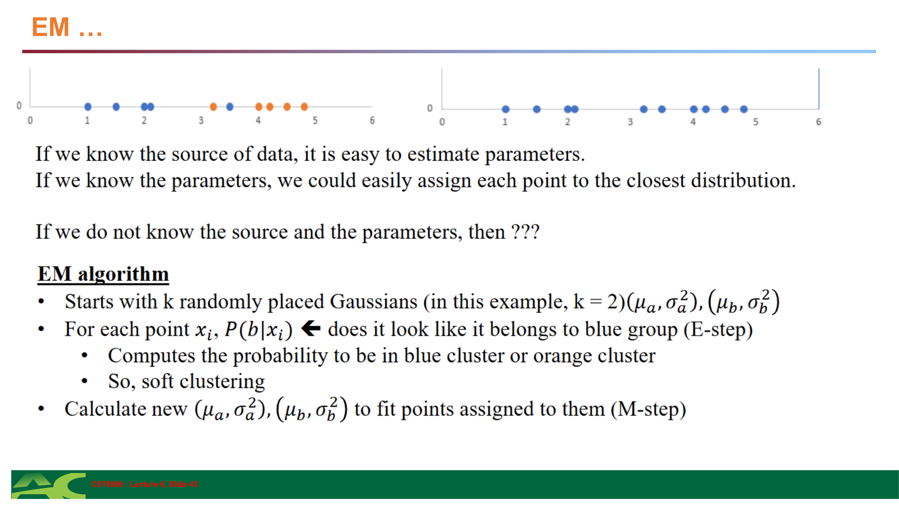

**EM algorithm motivation slide:** Title "EM…". Top: two side-by-side 1D scatter plots (number line 0–6). Left plot: points colored **blue and orange** showing known cluster membership — easy to estimate parameters. Right plot: same points but **all blue** (unknown membership) — can't estimate directly. Below: the chicken-and-egg problem text: "If we know the source → easy to estimate parameters. If we know the parameters → easy to assign points. If we know neither → ???" Then **EM algorithm** steps: start with k randomly placed Gaussians (k=2: (μₐ,σₐ²), (μᵦ,σᵦ²)); E-step: for each point xᵢ, compute P(b|xᵢ) = probability of belonging to blue group (soft clustering); M-step: calculate new (μₐ,σₐ²), (μᵦ,σᵦ²) to fit points weighted by their probabilities.

**EM算法动机幻灯片：** 标题"EM…"。顶部：两个并排的1D散点图（数轴0–6）。左图：点用**蓝色和橙色**着色表示已知簇归属 — 容易估计参数。右图：同样的点但**全是蓝色**（未知归属）— 无法直接估计。下方：鸡与蛋问题文字："知道来源→容易估参数。知道参数→容易分配点。两个都不知道→???" 然后是**EM算法**步骤：从k个随机放置的高斯开始（k=2: (μₐ,σₐ²), (μᵦ,σᵦ²)）；E步：对每个点xᵢ，计算P(b|xᵢ) = 属于蓝组的概率（软聚类）；M步：计算新的(μₐ,σₐ²), (μᵦ,σᵦ²)以拟合按概率加权的点。

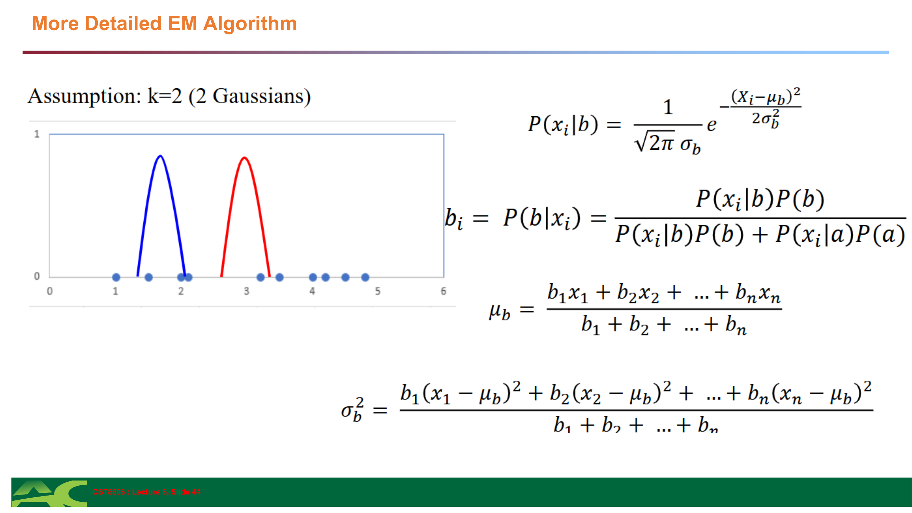

**More Detailed EM Algorithm slide:** Title "More Detailed EM Algorithm". Left: plot showing the same 1D data points on number line 0–6, with two fitted Gaussian curves — **blue** (centered ~2) and **red** (centered ~3.5) — representing the two estimated components. Right: three formulas stacked vertically: (1) **P(xᵢ|b)** = Gaussian PDF for cluster b — likelihood of point xᵢ under cluster b; (2) **bᵢ = P(b|xᵢ)** = Bayes' rule: P(xᵢ|b)P(b) / [P(xᵢ|b)P(b) + P(xᵢ|a)P(a)] — posterior probability (E-step); (3) **μᵦ** = weighted mean = (b₁x₁+b₂x₂+…+bₙxₙ)/(b₁+b₂+…+bₙ) — M-step update for mean; (4) **σᵦ²** = weighted variance = Σbᵢ(xᵢ−μᵦ)²/Σbᵢ — M-step update for variance.

**更详细的EM算法幻灯片：** 标题"More Detailed EM Algorithm"。左侧：同样1D数据点在数轴0–6上，带两条拟合高斯曲线 — **蓝色**（中心~2）和**红色**（中心~3.5）— 代表两个估计分量。右侧：三个公式纵向排列：(1) **P(xᵢ|b)** = 簇b的高斯PDF — xᵢ在簇b下的似然；(2) **bᵢ = P(b|xᵢ)** = 贝叶斯公式：P(xᵢ|b)P(b) / [P(xᵢ|b)P(b) + P(xᵢ|a)P(a)] — 后验概率（E步）；(3) **μᵦ** = 加权均值 = (b₁x₁+b₂x₂+…+bₙxₙ)/(b₁+b₂+…+bₙ) — M步更新均值；(4) **σᵦ²** = 加权方差 = Σbᵢ(xᵢ−μᵦ)²/Σbᵢ — M步更新方差。

**Key formulas / 关键公式：**

- **E-step (Expectation):** Compute posterior probability using Bayes' rule — 用贝叶斯公式计算后验概率
  - bᵢ = P(b|xᵢ) = P(xᵢ|b)P(b) / [P(xᵢ|b)P(b) + P(xᵢ|a)P(a)]
  - bᵢ = probability that point xᵢ belongs to cluster b — 点xᵢ属于簇b的概率
  - P(xᵢ|b) = Gaussian PDF evaluated at xᵢ with parameters μᵦ, σᵦ — 用μᵦ, σᵦ参数在xᵢ处求高斯PDF值
  - P(b) = mixing weight (prior probability of cluster b) — 混合权重（簇b的先验概率）
- **M-step (Maximization):** Re-estimate parameters using weighted statistics — 用加权统计量重新估计参数
  - μᵦ = Σ(bᵢ · xᵢ) / Σbᵢ  (weighted mean) — 加权均值
  - σᵦ² = Σbᵢ(xᵢ − μᵦ)² / Σbᵢ  (weighted variance) — 加权方差
  - P(b) = Σbᵢ / N  (updated mixing weight) — 更新后的混合权重

---

## 7. 聚类有效性评估 (Cluster Validity)

### 7.1 评估指标分类 (Types of Measures)

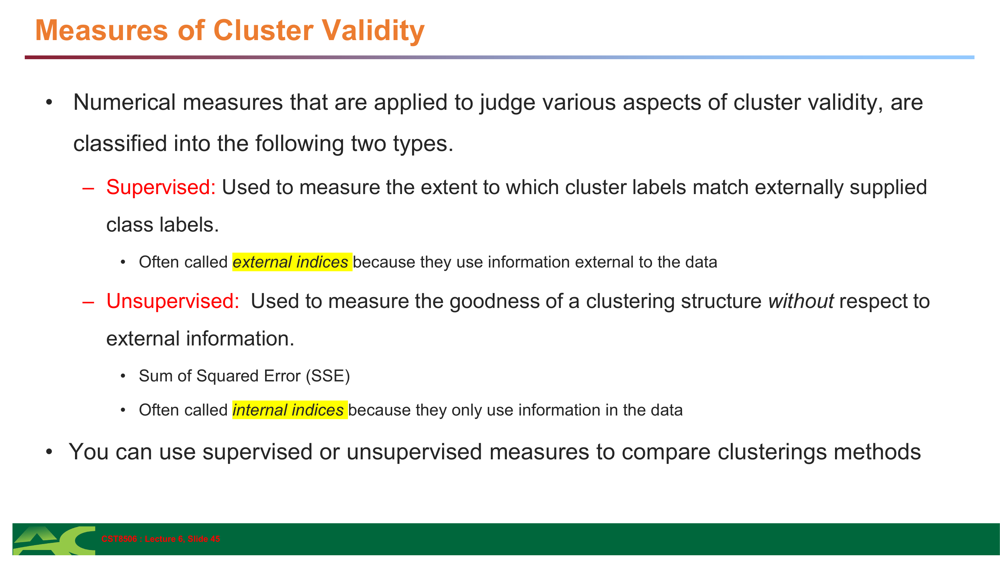

**Measures of Cluster Validity slide:** Title "Measures of Cluster Validity". Text explains numerical measures for judging clustering quality, classified into two types: **Supervised** (orange text) — measures how well cluster labels match externally supplied class labels, often called ***external indices*** (yellow highlighted); **Unsupervised** (orange text) — measures goodness of clustering without external information (e.g., SSE), often called ***internal indices*** (yellow highlighted). Bottom bullet: "You can use supervised or unsupervised measures to compare clustering methods."

**聚类有效性度量幻灯片：** 标题"Measures of Cluster Validity"。文字解释评判聚类质量的数值指标，分为两类：**有监督**（橙色文字）— 衡量聚类标签与外部提供的类标签匹配程度，常称为***外部指标***（黄色高亮）；**无监督**（橙色文字）— 在没有外部信息的情况下衡量聚类的好坏（如SSE），常称为***内部指标***（黄色高亮）。底部要点："可以使用有监督或无监督指标来比较聚类方法。"

| Type | Description | Also Called |
| --- | --- | --- |
| **Supervised (External)** | Measures how well cluster labels match externally supplied class labels | External indices — 外部指标 |
| **Unsupervised (Internal)** | Measures goodness of clustering without external information (e.g., SSE) | Internal indices — 内部指标 |

### 7.2 凝聚度与分离度 (Cohesion and Separation)

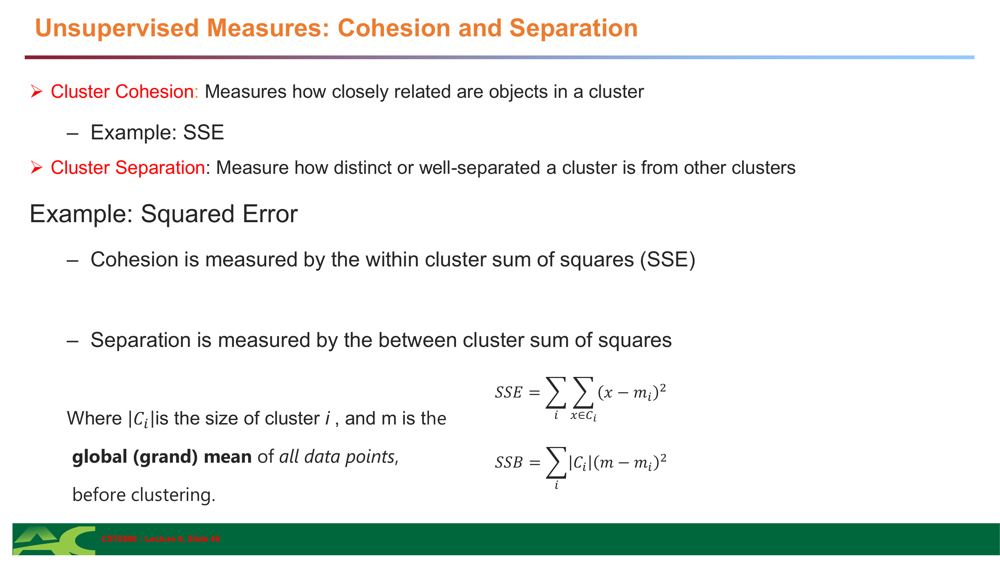

**Unsupervised Measures: Cohesion and Separation slide:** Title "Unsupervised Measures: Cohesion and Separation". Top: **Cluster Cohesion** (orange text) — "Measures how closely related are objects in a cluster", example = SSE. **Cluster Separation** (orange text) — "Measure how distinct or well-separated a cluster is from other clusters". Middle section titled "Example: Squared Error": cohesion measured by **within cluster sum of squares** (SSE), separation measured by **between cluster sum of squares** (SSB). Right side: two formulas — SSE = Σᵢ Σ_{x∈Cᵢ} (x − mᵢ)² and SSB = Σᵢ |Cᵢ|(m − mᵢ)². Bottom left: "|Cᵢ| is the size of cluster i, and m is the **global (grand) mean** of all data points."

**无监督度量：凝聚度与分离度幻灯片：** 标题"Unsupervised Measures: Cohesion and Separation"。顶部：**簇凝聚度**（橙色文字）— "衡量簇内对象有多紧密"，示例 = SSE。**簇分离度**（橙色文字）— "衡量一个簇与其他簇有多分离"。中间标题"Example: Squared Error"：凝聚度用**簇内平方和**（SSE）衡量，分离度用**簇间平方和**（SSB）衡量。右侧：两个公式 — SSE = Σᵢ Σ_{x∈Cᵢ} (x − mᵢ)² 和 SSB = Σᵢ |Cᵢ|(m − mᵢ)²。左下："|Cᵢ|是簇i的大小，m是所有数据点的**全局（总）均值**。"

- **Cohesion (SSE / SSW):** How closely related are objects within a cluster — 簇内对象有多紧密
  - SSE = Σᵢ Σ_{x∈Cᵢ} (x − mᵢ)² — 簇内平方和
  - mᵢ = centroid of cluster i — 簇i的质心
- **Separation (SSB):** How distinct a cluster is from other clusters — 簇与其他簇有多分离
  - SSB = Σᵢ |Cᵢ| · (m − mᵢ)² — 簇间平方和
  - m = global (grand) mean of all data points — 所有数据点的全局均值
  - |Cᵢ| = number of points in cluster i — 簇i中的点数

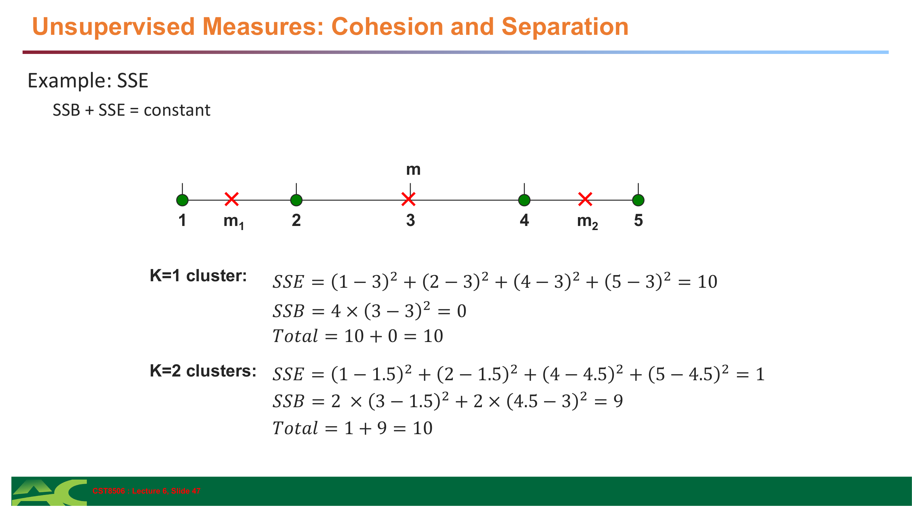

**Worked example slide — SSB + SSE = constant:** Title "Unsupervised Measures: Cohesion and Separation". Top: "Example SSE, SSB + SSE = constant". A 1D number line from 1 to 5 with four green dots at positions 1, 2, 4, 5. Red **×** marks show cluster centroids: m₁ ≈ 1.5, m₂ ≈ 4.5. A vertical arrow labeled **m** points to position 3 = grand mean. Below: two calculations — **K=1:** SSE=(1−3)²+(2−3)²+(4−3)²+(5−3)²=10, SSB=4×(3−3)²=0, Total=10. **K=2:** clusters {1,2} m₁=1.5, {4,5} m₂=4.5; SSE=(1−1.5)²+(2−1.5)²+(4−4.5)²+(5−4.5)²=1, SSB=2×(1.5−3)²+2×(4.5−3)²=9, Total=10 ✓.

**算例幻灯片 — SSB + SSE = 常数：** 标题"Unsupervised Measures: Cohesion and Separation"。顶部："Example SSE, SSB + SSE = constant"。1D数轴从1到5，四个绿色点在位置1、2、4、5。红色**×**标记为簇质心：m₁≈1.5, m₂≈4.5。垂直箭头标记**m**指向位置3 = 全局均值。下方两组计算 — **K=1：** SSE=10, SSB=0, 总计=10。**K=2：** 簇{1,2} m₁=1.5, {4,5} m₂=4.5; SSE=1, SSB=9, 总计=10 ✓。

**Worked Example / 算例** — SSB + SSE = TSS (constant / 常数):

- K=1 cluster: data = {1, 2, 4, 5}, grand mean m = 3
  - SSE = (1−3)² + (2−3)² + (4−3)² + (5−3)² = 4+1+1+4 = **10**
  - SSB = 4 × (3−3)² = **0**
  - Total = 10 + 0 = **10**
- K=2 clusters: {1,2} m₁=1.5, {4,5} m₂=4.5
  - SSE = (1−1.5)² + (2−1.5)² + (4−4.5)² + (5−4.5)² = 0.25×4 = **1**
  - SSB = 2×(1.5−3)² + 2×(4.5−3)² = 4.5+4.5 = **9**
  - Total = 1 + 9 = **10** ✓
- **Key insight / 关键发现:** SSE↓ + SSB↑ = constant. More clusters → lower SSE, higher SSB — 更多簇 → SSE更低、SSB更高

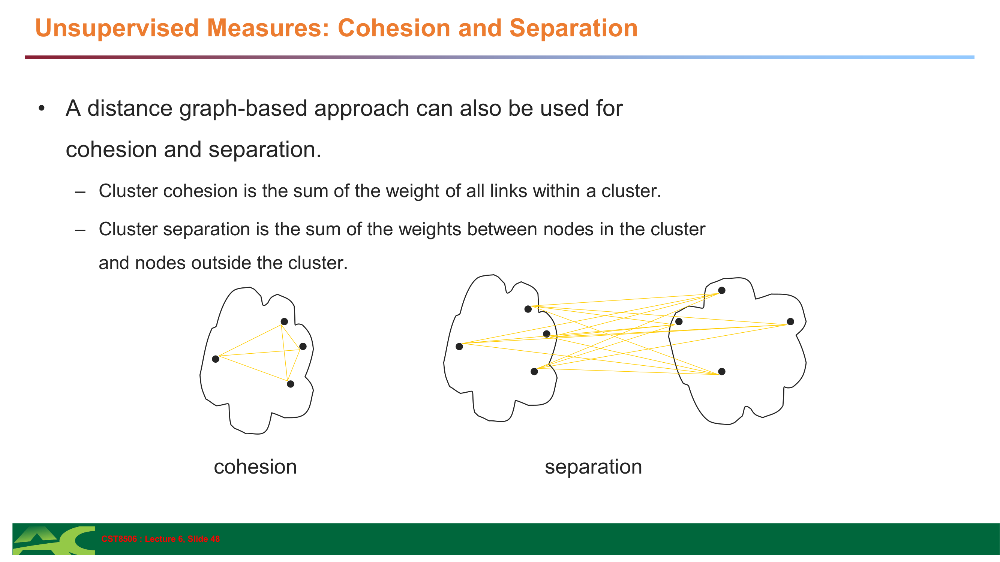

**Graph-based approach slide:** Title "Unsupervised Measures: Cohesion and Separation". Text: "A distance graph-based approach can also be used for cohesion and separation." Two diagrams: Left labeled **"cohesion"** — a single cloud-shaped cluster with 3 nodes, all internal edges drawn as yellow lines (sum of all intra-cluster link weights = cohesion). Right labeled **"separation"** — two cloud-shaped clusters (left with 4 nodes, right with 3 nodes), yellow lines connect nodes **between** the two clusters (sum of all inter-cluster link weights = separation). No internal edges shown on the right diagram.

**基于图的方法幻灯片：** 标题"Unsupervised Measures: Cohesion and Separation"。文字："也可以使用基于距离图的方法来计算凝聚度和分离度。"两张图：左图标记**"cohesion"** — 一个云状簇内有3个节点，所有内部边用黄色线画出（簇内链接权重之和 = 凝聚度）。右图标记**"separation"** — 两个云状簇（左4个节点，右3个节点），黄色线连接**两个簇之间**的节点（簇间链接权重之和 = 分离度）。右图不显示内部边。

- **Graph-based cohesion** = sum of weights of all links **within** a cluster — 簇**内部**所有链接权重之和
- **Graph-based separation** = sum of weights between nodes **in** the cluster and nodes **outside** — 簇内节点与簇**外**节点之间的权重之和

### 7.3 轮廓系数 (Silhouette Coefficient)

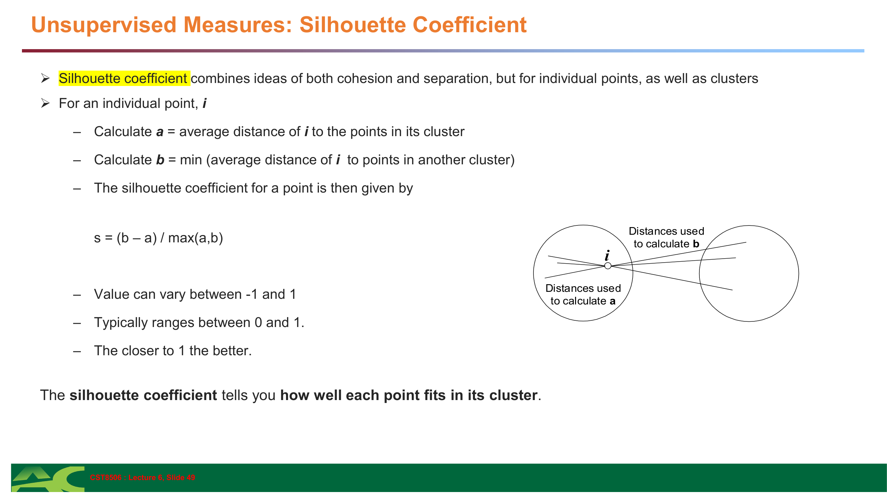

**Unsupervised Measures: Silhouette Coefficient slide:** Title "Unsupervised Measures: Silhouette Coefficient". Top: "Silhouette coefficient" (yellow highlighted) combines ideas of cohesion and separation for individual points. Steps listed: calculate **a** = average distance of point i to points in its cluster; calculate **b** = min(average distance of i to points in another cluster); s = (b−a)/max(a,b). Range [-1, 1], typically [0, 1], closer to 1 is better. Right side: diagram showing point **i** (white circle) at the boundary of two circular clusters — lines going left labeled "Distances used to calculate **a**" (to its own cluster), lines going right labeled "Distances used to calculate **b**" (to nearest other cluster). Bottom: "The **silhouette coefficient** tells you **how well each point fits in its cluster**."

**无监督度量：轮廓系数幻灯片：** 标题"Unsupervised Measures: Silhouette Coefficient"。顶部："轮廓系数"（黄色高亮）结合了凝聚度和分离度的概念，针对单个点。步骤：计算**a** = 点i到自己簇内其他点的平均距离；计算**b** = min(点i到其他簇中所有点的平均距离)；s = (b−a)/max(a,b)。范围[-1, 1]，通常[0, 1]，越接近1越好。右侧：点**i**（白色圆圈）在两个圆形簇的边界 — 左侧线条标记"计算**a**的距离"（到自己簇），右侧线条标记"计算**b**的距离"（到最近的其他簇）。底部："**轮廓系数**告诉你**每个点在其簇中有多合适**。"

Combines cohesion and separation for **individual points** — 结合凝聚度和分离度评估**单个点**：

1. Calculate **a** = average distance of point i to other points **in its cluster** — 点i到**自己簇内**其他点的平均距离
2. Calculate **b** = minimum (average distance of point i to points **in another cluster**) — 点i到**其他各簇**平均距离的最小值
3. **Silhouette coefficient:** s = (b − a) / max(a, b)
   - Range: [-1, 1] — 范围：[-1, 1]
   - Typically: [0, 1] — 通常在[0, 1]
   - **Closer to 1 = better** — 越接近1越好

---

## 8. 总结 (Summary)

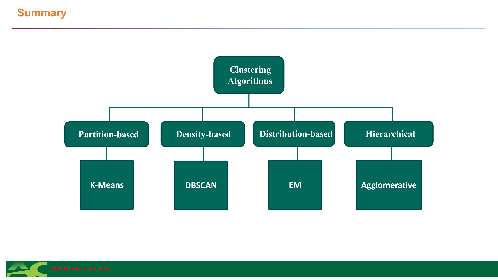

| Category                     | Algorithm     | Key Property                                      |
| ---------------------------- | ------------- | ------------------------------------------------- |
| **Partition-based**    | K-Means       | Specify K, centroid-based, minimizes SSE          |
| **Density-based**      | DBSCAN        | ε + MinPts, arbitrary shapes, handles noise      |
| **Distribution-based** | EM            | Gaussian mixture, soft (probabilistic) assignment |
| **Hierarchical**       | Agglomerative | No K needed, dendrogram, various linkage methods  |

---
