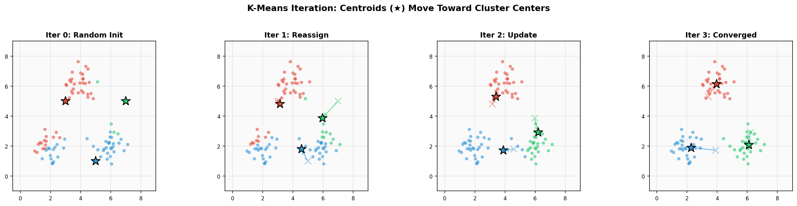
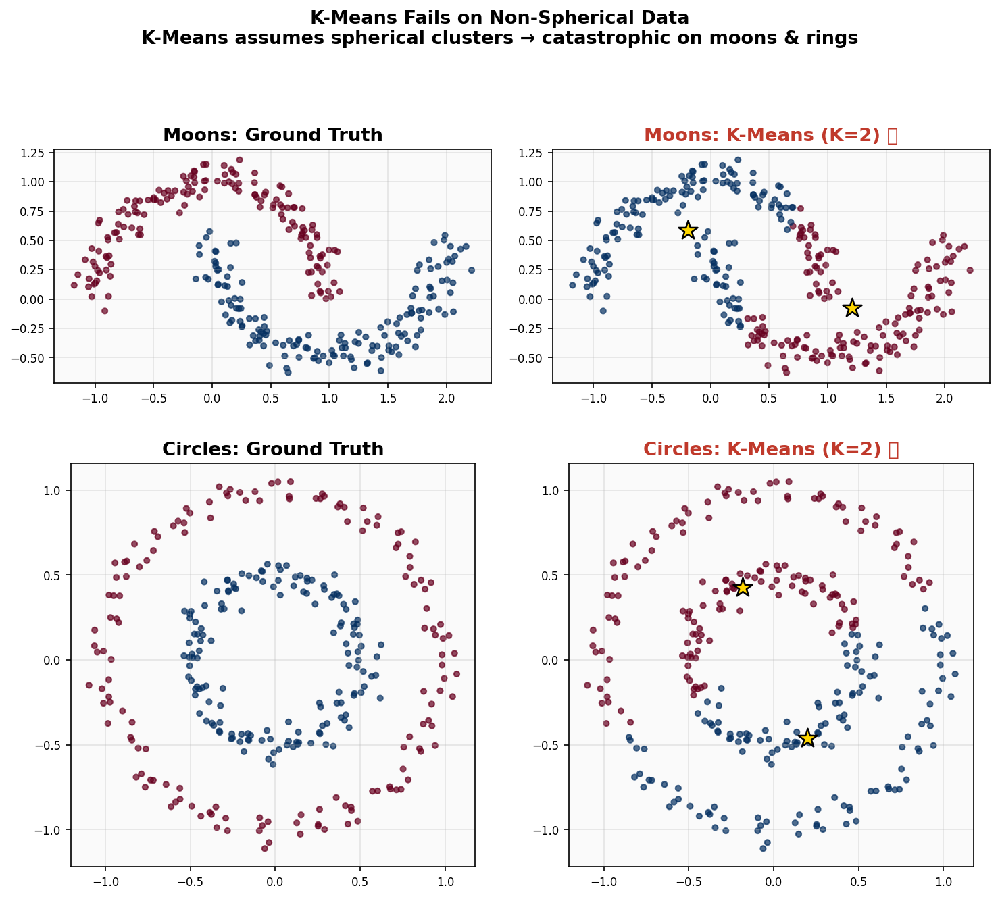
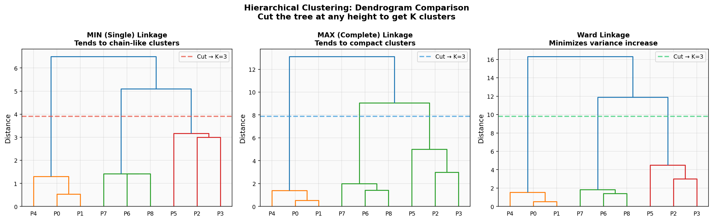
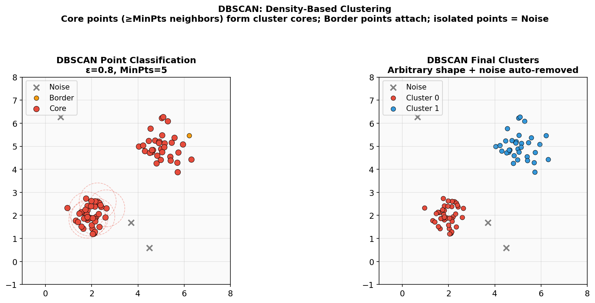
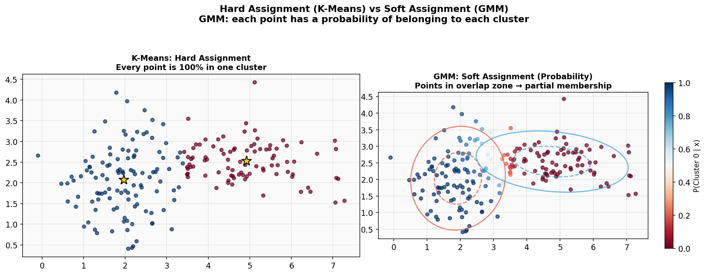
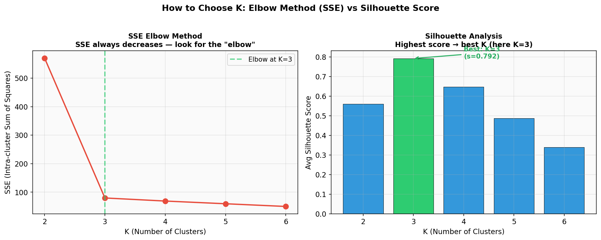

# Week 6 故事线：从"猜K个球"到"让数据自己说话"的聚类进化

> **Source:** `Week6Clustering.pdf`
> **核心主题：** 给一堆没有标签的数据，如何发现其中隐藏的分组？
> **故事线：** 四种聚类算法的因果演进——K-Means（球形硬分）→ 层次聚类（不用猜K）→ DBSCAN（任意形状+噪声）→ EM/GMM（概率软分配）

---

## 🎬 序幕：我们要解决什么问题？

### 从"分类"到"聚类"——没有标签怎么办？

之前学的 SVM、Naive Bayes 等都是**监督学习**——有人告诉你每个样本是"猫"还是"狗"，你学会规则然后预测新样本。

但如果**没有人告诉你有哪些类别**呢？

```
监督学习（分类）:
  训练数据: [(点1, 猫), (点2, 狗), (点3, 猫), ...]
  任务: 学习规则，预测新点是猫还是狗

无监督学习（聚类）:
  训练数据: [点1, 点2, 点3, ...]  ← 没有标签！
  任务: 发现数据中隐藏的分组
```

> 💡 **照片分组类比：** 给你一堆没有标签的照片，你会自然地按"人物"、"风景"、"美食"分组。没人告诉你怎么分——你从数据本身发现了结构。

### 聚类的核心目标

```
最小化 簇内距离（Intra-cluster）  ← 同一组内的点要紧凑
最大化 簇间距离（Inter-cluster）  ← 不同组之间要远
```

### 四大流派预览

|  流派  |   代表算法   |      核心思想      | 一句话                   |
| :----: | :----------: | :----------------: | ------------------------ |
| 划分式 | **K-Means**  |  围绕K个质心分组   | "猜K个中心，反复调整"    |
| 层次式 | **凝聚聚类** |  自底向上逐步合并  | "先散后聚，画出族谱"     |
| 密度式 |  **DBSCAN**  | 按密度连通区域分组 | "人多的地方是一群"       |
| 分布式 |  **EM/GMM**  | 用概率分布拟合数据 | "每个点有概率属于每个群" |

> 🔑 每个流派的诞生都是因为上一个流派的"致命缺陷"。

---

## 📚 第一章：方案一——K-Means（⚠️ 简单粗暴，但只能画圆）

### 1.1 算法：磁铁与铁屑

**K-Means 的五步舞：**

```
1. 你指定 K（想要几个簇）
2. 随机放 K 个"磁铁"（初始质心）
3. 每个铁屑（数据点）被最近的磁铁吸引  ← 分配步骤
4. 每个磁铁移到自己吸引的铁屑正中间    ← 更新步骤
5. 重复 3-4，直到磁铁不再移动          ← 收敛
```

**目标函数——SSE（误差平方和）：**

$$SSE = \sum_{i=1}^{K} \sum_{x \in C_i} \|x - m_i\|^2$$

翻译：对每个簇里的每个点，算它到质心的距离平方，全部加起来。**越小=越紧凑=越好。**



### 1.2 K-Means 的优势

| 优势          | 说明                                             |
| ------------- | ------------------------------------------------ |
| ✅ **极快**   | 复杂度 O(n·K·I·d)，线性的！通常 10-20 次迭代收敛 |
| ✅ **简单**   | 概念直觉、代码简洁，5 行 sklearn 搞定            |
| ✅ **可扩展** | 百万级数据轻松处理                               |

### 1.3 ❌ K-Means 的四大致命缺陷

| 缺陷               | 说明                       | 后果                      |
| ------------------ | -------------------------- | ------------------------- |
| **① 必须指定 K**   | 你得提前"猜"有几个簇       | 猜错 K → 整个聚类都是错的 |
| **② 只能画球形簇** | 假设每个簇是"围绕质心的球" | 月牙形、环形数据 → 灾难   |
| **③ 没有噪声概念** | 每个点必须属于某个簇       | 异常值扭曲质心位置        |
| **④ 随机初始化**   | 不同运行结果可能不同       | 可能卡在局部最优          |



> 🔑 **故事转折点：** K-Means 快速简洁，但必须猜 K、只能处理球形簇、无法处理噪声。我们需要一种"不用猜 K"的方法 → 层次聚类！

---

## 🧮 第二章：方案二——层次聚类（⚠️ 不用猜 K，但太慢了）

### 2.1 核心创新：倒过来的淘汰赛

**凝聚式（Agglomerative）层次聚类：**

```
从 N 个独立点开始
    ↓ 找最近的两个簇，合并
从 N-1 个簇开始
    ↓ 找最近的两个簇，合并
从 N-2 个簇开始
    ↓ ...
最终合为 1 个簇

整个过程画成树状图（Dendrogram）
```

**关键优势：不用指定 K！** 合并完成后，你可以在树状图的任意高度"切一刀"来得到想要的 K 个簇。

### 2.2 链接方法——"两个簇之间有多远？"

合并时需要计算簇间距离。不同的计算方法产生完全不同的结果：

|      链接方法       |         公式         |       效果       | 类比                     |
| :-----------------: | :------------------: | :--------------: | ------------------------ |
|  **MIN（单链接）**  | 两簇中最近点对的距离 |   链状、细长簇   | 两国最近的边境口岸       |
| **MAX（完全链接）** | 两簇中最远点对的距离 |   紧凑、球形簇   | 两国最远的两个城市       |
|     **Average**     |  所有点对距离的平均  |       折中       | 所有城市对的平均距离     |
|      **Ward**       |  合并后 SSE 的增量   | 紧凑、最小化方差 | 合并后"混乱程度"增加多少 |



> ⚠️ **MIN 的链接效应：** 如果两个本该分开的簇之间有一个噪声点当"桥梁"，MIN 会把它们错误合并——像一块松散的石头把两个岛连在一起。

### 2.3 层次聚类 vs K-Means

|  维度  |  K-Means   |    层次聚类    |
| :----: | :--------: | :------------: |
| 指定 K |  ✅ 必须   |   ❌ 不需要    |
|  速度  | O(nKI) 快  |   O(n³) 极慢   |
|  内存  |    O(n)    | O(n²) 距离矩阵 |
|  结果  |  平面分组  |   嵌套树结构   |
| 可逆性 | 每轮重分配 |   合并不可逆   |

### 2.4 ❌ 层次聚类的致命缺陷

1. **太慢了：** O(n²) 内存 + O(n³) 时间。10 万个点 → 100 亿个距离条目，根本存不下。
2. **合并不可逆：** 早期的错误合并（如被噪声点骗了）会一路传播到顶层。
3. **仍然不处理噪声：** 每个点都会被合并到某个簇里。
4. **仍然只适合球形簇：** MAX 和 Ward 偏好球形簇。

> 🔑 **故事转折点：** 层次聚类解决了"猜 K"的问题（用树状图事后选择），但速度太慢、不处理噪声、仍然偏好球形簇。我们需要一种"任意形状 + 自动去噪"的方法 → DBSCAN！

---

## 🧠 第三章：方案三——DBSCAN（✅ 任意形状 + 内置去噪！）

### 3.1 核心创新：用"密度"定义簇

DBSCAN 的革命性思路：**簇 = 密集区域之间被稀疏空地隔开。**

不看点到中心的距离，而看**邻域内有多少个点**：

| 点类型 | 条件 | 含义 |
|--------|------|------|
| **核心点 (Core)** | ε 邻域内 ≥ MinPts 个点 | 人缘好，自己就能带起一群 |
| **边界点 (Border)** | ε 邻域内 < MinPts，但在某个核心点的 ε 内 | 认识大佬，蹭群 |
| **噪声点 (Noise)** | ε 邻域内 < MinPts，且不在任何核心点的 ε 内 | 孤独者，被丢弃 |

### 3.2 DBSCAN 五步算法

```
1. 标记  → 每个点分类为核心/边界/噪声
2. 去噪  → 丢弃噪声点
3. 连边  → 在ε距离内的核心点之间画线
4. 成簇  → 每组连通的核心点 = 一个簇
5. 归附  → 边界点加入最近核心点的簇
```

> 💡 **朋友链类比：** (1) 找人缘好的人（核心=认识≥MinPts人）。(2) 忽略孤独者（噪声）。(3) 人缘好的人互相认识→画友谊线。(4) 每个朋友圈=一个簇。(5) 认识某个人缘好的人的腼腆者加入该圈。



### 3.3 DBSCAN vs K-Means

|   特性   |     K-Means      |        DBSCAN        |
| :------: | :--------------: | :------------------: |
|  指定 K  |     ✅ 必须      |     ❌ 自动发现      |
|  簇形状  |      仅球形      |     **任意形状**     |
| 噪声处理 |        无        | **内置（独立类别）** |
|   参数   |        K         |      ε, MinPts       |
|  迭代？  |     多轮迭代     |     **单遍完成**     |
|  确定性  | 否（随机初始化） |    核心/噪声确定     |

### 3.4 ❌ DBSCAN 的弱点

| 弱点         | 原因                                                |
| ------------ | --------------------------------------------------- |
| **密度不均** | 全局一个 ε → 密集簇和稀疏簇无法用同一个半径         |
| **高维数据** | 维度灾难让 ε 距离失去意义                           |
| **参数敏感** | ε 和 MinPts 选不好 → 要么全是噪声，要么全合为一个簇 |

> ⚠️ **考试陷阱：** 核心点定义中"包括自身"！MinPts=4 时，一个点加上 3 个邻居 = 4 → 是核心点。

> 🔑 **故事转折点：** DBSCAN 解决了形状和噪声问题，但只做**硬分配**（每个点要么属于一个簇，要么是噪声）。如果一个点"可能同时属于两个簇"呢？而且它无法对簇的分布给出概率解释。→ EM/GMM！

---

## 🏰 第四章：方案四——EM / 高斯混合模型（✅ 概率软分配）

### 4.1 核心创新："概率隶属"代替"硬分配"

K-Means 说：**"你属于簇 A！"**（0 或 1）

EM/GMM 说：**"你有 80% 概率属于簇 A，20% 概率属于簇 B。"**

```
K-Means（硬分配）:              EM/GMM（软分配）:
  点 x → 属于簇 A               点 x → P(A|x) = 0.8, P(B|x) = 0.2
  (非此即彼)                    (概率分布)
```

### 4.2 鸡与蛋问题

```
如果知道分组 → 容易算参数（均值、方差）
如果知道参数 → 容易分配点
但我们两个都不知道！→ EM 交替逼近
```

### 4.3 EM 两步迭代

```
初始化：随机设置 K 个高斯分布的 (μ, σ², 混合权重)

E步（Expectation）:
  对每个点 xᵢ，计算它属于每个高斯的概率
  bᵢ = P(b|xᵢ) = P(xᵢ|b)·P(b) / Σⱼ P(xᵢ|j)·P(j)
  → 输出：每个点对每个簇的"软隶属度"

M步（Maximization）:
  用加权统计量更新参数
  μᵦ = Σ(bᵢ·xᵢ) / Σbᵢ        ← 加权均值
  σᵦ² = Σbᵢ(xᵢ−μᵦ)² / Σbᵢ   ← 加权方差
  P(b) = Σbᵢ / N               ← 更新混合权重

重复 E → M → E → M ... 直到收敛
```

> 💡 **模糊眼镜类比：** 戴着模糊眼镜看两群重叠的人。E步：眯眼猜"这人 70% 在 A 群"。M步：用这些猜测重算每群中心。每轮视线更清晰，直到人群稳定。



### 4.4 K-Means 是 EM 的特殊情况！

|  维度  |    K-Means    |        EM (GMM)         |
| :----: | :-----------: | :---------------------: |
|  分配  | 硬（0 或 1）  |       软（概率）        |
| 簇模型 |   只有质心    | 完整高斯（μ, σ², 权重） |
| 簇形状 | 球形、等方差  |    椭圆形、不同方差     |
|  关系  | EM 的特殊情况 |     K-Means 的推广      |

**数学证明：** 当所有簇方差相等且固定，隶属概率强制为 0 或 1 时，EM 退化为 K-Means。所以 K-Means 其实是"阉割版 EM"！

---

## 📏 第五章：如何评判聚类的好坏？

### 5.1 内部指标：SSE 与 SSB

没有标签怎么评估？用数据本身的结构：

|  指标   |    全称    |  衡量什么  | 好 = |
| :-----: | :--------: | :--------: | :--: |
| **SSE** | 簇内平方和 | 簇有多紧凑 | 越低 |
| **SSB** | 簇间平方和 | 簇有多分离 | 越高 |

**万恒等式：** SSE + SSB = TSS（总平方和，常数）

→ SSE 降了 → SSB 自动升了 → 两个指标本质是一回事！

**算例验证：**

```
数据 = {1, 2, 4, 5}，全局均值 m = 3，TSS = 10

K=1：  SSE = 10，SSB = 0，  总 = 10 ✓ （一个大簇，极散）
K=2：  SSE = 1， SSB = 9，  总 = 10 ✓ （两个紧凑簇）
K=4：  SSE = 0， SSB = 10， 总 = 10 ✓ （每个点自成一簇）
```

### 5.2 轮廓系数——"你在正确的队里吗？"

SSE 只看整体，轮廓系数**逐个点**评估：

$$s_i = \frac{b_i - a_i}{\max(a_i, b_i)}$$

- $a_i$ = 点 i 到**自己簇内**其他点的平均距离（越小越紧凑）
- $b_i$ = 点 i 到**最近的其他簇**所有点的平均距离（越大越分离）

|   s 值   | 含义                             |
| :------: | -------------------------------- |
| ≈ **1**  | 完美！离自己队很近，离对手队很远 |
| ≈ **0**  | 在两队交界处，不确定属于哪队     |
| ≈ **-1** | 分错了！离对手队更近             |

**用途：** 试 K=2,3,4,...，计算每个 K 的平均轮廓系数，选**最高**的。



---

## 🗺️ 全局回顾：技术演进路线图

```
┌─────────────────────────────────────────────────────────────┐
│              聚类算法技术演进路线图                            │
│                                                             │
│  📦 K-Means (划分式聚类)                                      │
│     ✅ 极快 O(nKId)，简单直观，可扩展                        │
│     ✅ 适合大数据、球形簇                                    │
│     ❌ 必须指定K → 猜错K全军覆没                             │
│     ❌ 只能球形簇 → 月牙/环形数据失败                        │
│     ❌ 无噪声概念 → 异常值扭曲质心                           │
│                    │                                        │
│                    ▼                                        │
│  🌳 层次聚类 (凝聚式)                                         │
│     ✅ 不用指定K → 树状图事后选择                            │
│     ✅ 展示数据的嵌套层级结构                                │
│     ❌ O(n³)时间 + O(n²)空间 → 大数据不适用                  │
│     ❌ 合并不可逆 → 早期错误无法纠正                         │
│     ❌ 仍然不处理噪声                                        │
│                    │                                        │
│                    ▼                                        │
│  🔬 DBSCAN (密度式聚类)                                       │
│     ✅ 不用指定K → 自动发现簇数                              │
│     ✅ 任意形状的簇 → 月牙/字母都能处理                      │
│     ✅ 内置噪声检测 → 异常值被自动排除                       │
│     ❌ 密度不均时失败（单一ε无法兼顾）                       │
│     ❌ 只做硬分配（每个点非此即彼）                           │
│                    │                                        │
│                    ▼                                        │
│  🎲 EM / GMM (分布式聚类)                                     │
│     ✅ 软分配 → 每个点有概率属于多个簇                       │
│     ✅ 是K-Means的推广（后者是其特殊情况）                   │
│     ✅ 能拟合椭圆形、不等大小的簇                            │
│     ❌ 仍需指定K（高斯分量数）                               │
│     ❌ 假设高斯分布 → 非高斯形状拟合差                       │
│     ❌ 局部最优（同K-Means）                                 │
└─────────────────────────────────────────────────────────────┘
```

### 转折点总结

| 从 → 到             | 解决了什么核心问题？                       |
| ------------------- | ------------------------------------------ |
| K-Means → 层次聚类  | 从"必须猜K"到"不用猜K"——树状图事后切割     |
| 层次聚类 → DBSCAN   | 从"球形假设"到"任意形状"——基于密度而非距离 |
| K-Means/DBSCAN → EM | 从"硬分配"到"软分配"——概率隶属             |
| 所有算法 → 评估指标 | 怎么判断聚类好不好？SSE+SSB+轮廓系数       |

---

## 🎓 考试重点检查清单

### 概念理解

- [ ] 能解释聚类与分类的区别（无监督 vs 有监督）
- [ ] 能描述 K-Means 算法的五步流程
- [ ] 能解释 SSE 的含义和公式
- [ ] 能区分划分聚类和层次聚类
- [ ] 能描述凝聚式层次聚类的算法（距离矩阵→找最小→合并→更新→重复）
- [ ] 能区分 MIN/MAX/Average/Ward 四种链接方法
- [ ] 能定义 DBSCAN 的核心点、边界点、噪声点
- [ ] 能说出"包括自身"这个陷阱（MinPts=4，3 个邻居+自己=4→核心点）
- [ ] 能描述 DBSCAN 的五步算法
- [ ] 能解释 EM 的 E 步和 M 步各做什么
- [ ] 能解释"K-Means 是 EM 的特殊情况"

### 公式掌握

- [ ] SSE = Σᵢ Σ\_{x∈Cᵢ} ‖x − mᵢ‖²
- [ ] SSB = Σᵢ |Cᵢ| · (m − mᵢ)²
- [ ] SSE + SSB = TSS（常数）
- [ ] 轮廓系数 s = (b − a) / max(a, b)
- [ ] 高斯 PDF = (1/√(2πσ)) · e^(−(x−μ)²/(2σ²))
- [ ] E步：bᵢ = P(xᵢ|b)·P(b) / Σⱼ P(xᵢ|j)·P(j)
- [ ] M步：μᵦ = Σ(bᵢ·xᵢ) / Σbᵢ

### 计算题准备

- [ ] 给定数据和聚类结果，计算 SSE
- [ ] 给定数据，计算 SSE 和 SSB，验证 SSE+SSB=TSS
- [ ] 给定 a 和 b，计算轮廓系数
- [ ] 给定距离矩阵，用指定链接方法做凝聚聚类
- [ ] 给定点和成对距离，标记 DBSCAN 的核心/边界/噪声
- [ ] 给定当前 EM 参数，计算 E 步的后验概率

### 对比题准备

- [ ] K-Means vs 层次聚类（速度、指定 K、结构）
- [ ] K-Means vs DBSCAN（簇形状、噪声、参数）
- [ ] K-Means vs EM（硬分配 vs 软分配、簇模型）
- [ ] MIN vs MAX 链接（链状 vs 紧凑、噪声敏感度）
- [ ] SSE vs 轮廓系数（整体 vs 个体、偏好）
- [ ] 四种算法的综合比较（适用场景、优缺点）

### 陷阱题准备

- [ ] K-Means 总是收敛 ≠ 总是找到最优解（只保证局部最优）
- [ ] SSE 随 K 增大**总是下降**——不能只看最低 SSE 选 K
- [ ] DBSCAN 核心点定义中"包括自身"
- [ ] DBSCAN 边界点归属是**非确定性的**（取决于处理顺序）
- [ ] EM 的 K-Means 特殊情况：方差相等+固定，隶属概率 0/1
- [ ] 层次聚类合并**不可逆**
- [ ] 轮廓系数偏好凸形簇（非凸形状即使聚类正确也可能得分低）

---

> 📖 **故事总结：** 聚类的进化史就是一部不断打破假设的历史。K-Means 假设"我知道有几个球形群"，层次聚类去掉了"我知道几个"但还是偏好球形，DBSCAN 彻底去掉了形状假设但只能硬分配，EM 引入了概率软分配但又加回了"高斯形状"假设。**没有完美的聚类算法——只有最适合你数据的算法。** 选择的关键：了解你的数据长什么样，然后匹配最合适的工具。
