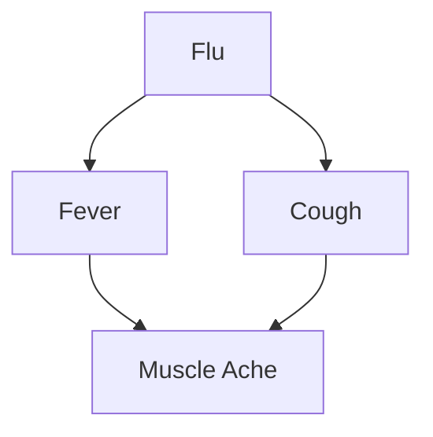

# 26W_CST8506_100 — Advanced Machine Learning — Midterm Exam

**Date:** Wednesday, Feb 25, 13:00 PM

---

**Exam Rules:**

- 20 multiple-choice + 10 True/False questions (3 marks each)
- 4 written questions requiring clear and concise answers
- No electronic devices allowed
- Duration: 75 minutes (cannot leave in first 15 min)
- Must sign attendance form

---

## Part 1: True / False (Q1–Q10, 3 marks each)

---

### Q1
**Feature selection and feature extraction are identical techniques, both aiming to reduce dimensionality by creating new synthetic features.**

> **Answer: False**
>
> - **Feature selection** picks a subset of existing features (no new features created).
> - **Feature extraction** (e.g., PCA, LDA) creates **new synthetic features** by transforming/combining originals.
> - They are fundamentally different approaches to dimensionality reduction.

---

### Q2
**Equal-frequency binning involves dividing the range of a continuous feature into intervals of equal width.**

> **Answer: False**
>
> - **Equal-width binning** divides the range into intervals of equal width.
> - **Equal-frequency (equal-depth) binning** divides data so each bin contains approximately the same **number of data points**.
> - The statement describes equal-width, not equal-frequency.

---

### Q3
**In an SVM, the hyperplane is chosen to minimize the distance between itself and the closest data points from each class.**

> **Answer: False**
>
> - SVM **maximizes** the margin (distance to the closest points — support vectors), not minimizes it.
> - The goal is to find the hyperplane with the **maximum margin**.

---

### Q4
**The kernel trick allows SVMs to operate in a high-dimensional feature space without the computational cost of explicitly transforming the data into that space.**

> **Answer: True**
>
> - The kernel trick computes dot products in a high-dimensional space using a kernel function $K(x_i, x_j) = \phi(x_i) \cdot \phi(x_j)$, without ever computing $\phi(x)$ explicitly.
> - This avoids the "curse of dimensionality" in computation.

---

### Q5
**In a convolutional layer, the values within a filter (or kernel) are pre-defined constants, such as the Sobel filter, and cannot be learned during training.**

> **Answer: False**
>
> - In a CNN, the filter weights are **learned during training** via backpropagation.
> - Pre-defined filters like Sobel are used in traditional image processing, not in learned convolutions.

---

### Q6
**Backpropagation Through Time (BPTT) works by unrolling the RNN, applying the standard backpropagation algorithm to each time step independently, and then updating the weights for each time step separately.**

> **Answer: False**
>
> - BPTT does unroll the RNN and apply backpropagation.
> - However, it does **not** update weights for each time step **separately**. RNNs share weights across all time steps; gradients are **accumulated** across all time steps and then used for a single weight update.

---

### Q7
**Conditional independence means that if two variables, X and Y, are independent, they remain independent even after conditioning on a third variable Z.**

> **Answer: False**
>
> - **Conditional independence** means $P(X, Y | Z) = P(X|Z) \cdot P(Y|Z)$, i.e., X and Y are independent **given** Z.
> - This is different from marginal independence. Two marginally independent variables can become **dependent** after conditioning (and vice versa — e.g., "explaining away").

---

### Q8
**Naïve Bayes is considered robust to irrelevant features because the probability estimates for irrelevant features will roughly cancel out across classes.**

> **Answer: True**
>
> - If a feature is irrelevant, its conditional probability $P(x_i | C)$ will be roughly the same for all classes, so it contributes equally to the numerator for each class and effectively cancels out in classification.

---

### Q9
**Different clustering algorithms applied to the same dataset will always produce identical results.**

> **Answer: False**
>
> - Different algorithms (K-Means, DBSCAN, Hierarchical) have different assumptions (shape, density, connectivity) and will generally produce **different** clusterings.
> - Even the same algorithm with different initializations (e.g., K-Means) can yield different results.

---

### Q10
**The MIN (single-link) hierarchical clustering method defines the distance between two clusters as the distance between their farthest points.**

> **Answer: False**
>
> - **MIN (single-link)** uses the distance between the **closest** (nearest) points of two clusters.
> - **MAX (complete-link)** uses the distance between the **farthest** points.

---

## Part 2: Multiple Choice (Q11–Q30, 3 marks each)

---

### Q11
A data scientist wants to convert a continuous feature, 'Age', into a categorical feature with three categories: 'Young', 'Middle-aged', and 'Senior'. This process is an example of:

- a) Standardization
- b) Normalization
- c) Binning
- d) Age is not a continuous feature

> **Answer: c) Binning**
>
> Converting a continuous variable into discrete categories (bins) is called **binning** (also known as discretization).

---

### Q12
After performing PCA on a dataset, you get the following eigenvalues for the 4 principal components: [3.2, 1.1, 0.4, 0.1]. What is the proportion of variance explained by the first principal component?

- a) 3.2%
- b) 32%
- c) Approximately 67%
- d) Approximately 80%

> **Answer: c) Approximately 67%**
>
> Total variance = 3.2 + 1.1 + 0.4 + 0.1 = **4.8**
>
> Proportion = 3.2 / 4.8 = **0.667 ≈ 67%**

---

### Q13
A key similarity between PCA and LDA is that both:

- a) Are unsupervised learning algorithms.
- b) Rank the new axes they create in order of importance.
- c) Aim to maximize class separability.
- d) Can produce a number of components equal to the number of original features.

> **Answer: b) Rank the new axes they create in order of importance.**
>
> - PCA ranks axes by variance explained; LDA ranks by discriminative power.
> - (a) is wrong because LDA is supervised; (c) only applies to LDA; (d) LDA produces at most $C-1$ components.

---

### Q14
What is the primary objective of a Maximum Margin Classifier (Hard Margin SVM)?

- a) To minimize the number of support vectors.
- b) To find any hyperplane that separates the classes.
- c) To find a hyperplane that maximizes the distance to the closest points from each class.
- d) To minimize the sum of squared errors on the training data.

> **Answer: c) To find a hyperplane that maximizes the distance to the closest points from each class.**
>
> Hard Margin SVM finds the hyperplane with the **maximum margin** — the greatest perpendicular distance to the nearest data point from either class.

---

### Q15
Which of the following is stated as a primary advantage of SVM?

- a) It performs exceptionally well on very large datasets with millions of samples.
- b) It is highly interpretable, like a single decision tree.
- c) It is memory efficient and effective in high-dimensional spaces.
- d) It requires no parameter tuning.

> **Answer: c) It is memory efficient and effective in high-dimensional spaces.**
>
> SVM is memory efficient (only stores support vectors) and performs well in high-dimensional spaces. It is NOT efficient for very large datasets, NOT easily interpretable, and DOES require tuning (C, kernel, γ).

---

### Q16
For a data point $\mathbf{x}$ that lies exactly on the decision hyperplane, what is the value of $\mathbf{w} \cdot \mathbf{x} + b$?

- a) 1
- b) -1
- c) 0
- d) It depends on the class of the point.

> **Answer: c) 0**
>
> The decision boundary is defined by $\mathbf{w} \cdot \mathbf{x} + b = 0$. Any point lying exactly on the hyperplane satisfies this equation.

---

### Q17
Why is a standard Multi-Layer Perceptron (MLP) generally not used for direct processing of raw, high-resolution images?

- a) MLPs cannot use non-linear activation functions.
- b) The number of parameters becomes astronomically large, leading to overfitting and high computational cost.
- c) MLPs require sequential data as input, which images are not.
- d) MLPs are only capable of binary classification.

> **Answer: b) The number of parameters becomes astronomically large, leading to overfitting and high computational cost.**
>
> For a 224×224×3 image, a fully connected layer would need 224×224×3 = 150,528 weights **per neuron**. This is why CNNs use local connectivity and weight sharing to dramatically reduce parameters.

---

### Q18
If you have an input volume of 32×32×3 and use 10 filters of size 5×5 with stride 1 and 'same' padding, what is the spatial dimension (height and width) and depth of the output volume?

- a) 28×28×10
- b) 32×32×3
- c) 32×32×10
- d) 28×28×3

> **Answer: c) 32×32×10**
>
> - **'same' padding** preserves spatial dimensions → 32×32.
> - **10 filters** → depth = 10.
> - Output: **32×32×10**.

---

### Q19
The filters in the first layer of a trained CNN are most likely to detect:

- a) High-level concepts like faces or objects.
- b) Low-level features like edges, colors, and blobs.
- c) Complex patterns like eyes or wheels.
- d) The class label of the image.

> **Answer: b) Low-level features like edges, colors, and blobs.**
>
> Early layers learn simple, low-level features (edges, textures). Deeper layers combine these into increasingly complex/abstract representations.

---

### Q20
What is the primary benefit of weight sharing in Recurrent Neural Networks?

- a) It makes the network deeper and thus more powerful.
- b) It allows the network to be trained with Backpropagation Through Time.
- c) It enables the network to process sequences of variable length and generalize patterns across different positions in the sequence.
- d) It completely eliminates the vanishing gradient problem.

> **Answer: c) It enables the network to process sequences of variable length and generalize patterns across different positions in the sequence.**
>
> Weight sharing means the same $W_x, W_h$ are used at every time step, so the network can handle any sequence length and recognize patterns regardless of position.

---

### Q21
The vanishing gradient problem in RNNs is most directly analogous to what phenomenon in a simple numerical product?

- a) Multiplying many numbers that are all close to 1.
- b) Multiplying many numbers that are all less than 1 (e.g., 0.1 × 0.1 × 0.1...).
- c) Adding many numbers that are all greater than 1.
- d) Dividing a large number by a very small number.

> **Answer: b) Multiplying many numbers that are all less than 1 (e.g., 0.1 × 0.1 × 0.1...)**
>
> During BPTT, the gradient involves repeated multiplication of $\frac{\partial h_t}{\partial h_{t-1}}$. If these partial derivatives are < 1, the product shrinks exponentially → **vanishing gradient**.

---

### Q22
The fundamental recurrence relation for the hidden state $h_t$ in a simple RNN is given by:

- a) $h_t = f(W_x \cdot x_t)$
- b) $h_t = f(W_x \cdot x_t + W_y \cdot h_{t-1})$
- c) $h_t = f(W_y \cdot h_{t-1})$
- d) $h_t = W_x \cdot x_t + W_y \cdot h_{t-1}$

> **Answer: b) $h_t = f(W_x \cdot x_t + W_y \cdot h_{t-1})$**
>
> The hidden state combines:
> - Current input $x_t$ weighted by $W_x$
> - Previous hidden state $h_{t-1}$ weighted by $W_y$ (often called $W_h$)
> - Passed through a nonlinear activation function $f$ (usually tanh or ReLU).

---

### Q23
Which formula correctly represents Bayes' Theorem?

- a) $P(Y|X) = P(X|Y) \times P(Y)$
- b) $P(Y|X) = \frac{P(X|Y)}{P(Y)}$
- c) $P(Y|X) = \frac{P(X|Y) \cdot P(Y)}{P(X)}$
- d) $P(Y|X) = \frac{P(X) \cdot P(Y)}{P(X|Y)}$

> **Answer: c) $P(Y|X) = \frac{P(X|Y) \cdot P(Y)}{P(X)}$**
>
> Bayes' Theorem: **Posterior = (Likelihood × Prior) / Evidence**

---

### Q24
The Laplace estimate for a categorical feature addresses the zero-frequency problem by:

- a) Discarding features that have zero probabilities.
- b) Artificially increasing the count of each class outcome by one.
- c) Replacing all zero probabilities with a very small constant like 1e-9.
- d) Increasing the count of each feature value for a given class by one and adjusting the denominator accordingly.

> **Answer: d) Increasing the count of each feature value for a given class by one and adjusting the denominator accordingly.**
>
> Laplace smoothing: $P(x_i | C) = \frac{\text{count}(x_i, C) + 1}{\text{count}(C) + |V|}$, where $|V|$ is the number of distinct values the feature can take.

---

### Q25
Which of the following is NOT a stated advantage or characteristic of the Naïve Bayes classifier?

- a) It is robust to isolated noise points.
- b) It performs well even when features are highly correlated and redundant.
- c) It can handle missing values by ignoring them during probability estimation.
- d) It is robust to irrelevant attributes.

> **Answer: b) It performs well even when features are highly correlated and redundant.**
>
> Naïve Bayes assumes **conditional independence** between features. Highly correlated/redundant features violate this assumption and degrade performance (double-counting evidence).

---

### Q26
You have a dataset where a categorical feature has a value that was never seen in the training data for a particular class. Without any form of smoothing, how will Naïve Bayes handle a test instance with this unseen feature value?

- a) It will ignore that feature for that instance and base the decision on the other features.
- b) It will assign a very small probability to that feature for that class.
- c) It will assign a probability of zero to that class for that instance.
- d) It will throw an error and fail to classify the instance.

> **Answer: c) It will assign a probability of zero to that class for that instance.**
>
> Because Naïve Bayes multiplies all conditional probabilities: $P(C|x) \propto P(C) \prod_i P(x_i|C)$. If any $P(x_i|C) = 0$, the entire product becomes 0. This is exactly the problem Laplace smoothing addresses.

---

### Q27
In which type of clustering is a cluster defined as a set of points such that any point in the cluster is closer to the "center" of that cluster than to the center of any other cluster?

- a) Well-separated clusters
- b) Contiguity-based clusters
- c) Prototype-based clusters
- d) Density-based clusters

> **Answer: c) Prototype-based clusters**
>
> In prototype-based clustering (e.g., K-Means), each cluster is represented by a **centroid** (prototype), and each point belongs to the cluster whose centroid is nearest.

---

### Q28
What does the 'd' represent in the K-means complexity formula $O(n \cdot K \cdot I \cdot d)$?

- a) The distance between clusters.
- b) The density of the data points.
- c) The number of attributes (dimensions) of the data.
- d) The number of iterations until convergence.

> **Answer: c) The number of attributes (dimensions) of the data.**
>
> In $O(n \cdot K \cdot I \cdot d)$: $n$ = number of points, $K$ = number of clusters, $I$ = number of iterations, $d$ = number of **dimensions** (attributes).

---

### Q29
Which of the following is a major advantage of hierarchical clustering over partitional methods like K-means?

- a) It is much faster and can handle millions of data points easily.
- b) It does not require the user to pre-specify the number of clusters.
- c) It is guaranteed to find the globally optimal clustering.
- d) All of the above options

> **Answer: b) It does not require the user to pre-specify the number of clusters.**
>
> Hierarchical clustering builds a **dendrogram** — you can cut it at any level to get different numbers of clusters after the fact. K-Means requires specifying $K$ in advance.

---

### Q30
In DBSCAN, what is a "border point"?

- a) A point with fewer than MinPts neighbors within ε, but which is within the ε-neighborhood of a core point.
- b) Any point that is not a core point.
- c) A point with more than MinPts neighbors within ε.
- d) A point that lies exactly on the boundary of the dataset's convex hull.

> **Answer: a) A point with fewer than MinPts neighbors within ε, but which is within the ε-neighborhood of a core point.**
>
> DBSCAN defines three types:
> - **Core point:** ≥ MinPts neighbors within ε
> - **Border point:** < MinPts neighbors within ε, but reachable from a core point
> - **Noise point:** neither core nor border

---

## Part 3: Written Questions (Q31–Q34)

---

### Q31 — CNN Dimension Calculation (18 marks)

**Given:** Input images 32×32 RGB, convolutional layer with 6 filters of size 5×5, stride = 1, 'same' padding.

---

#### (a) Output feature map dimensions from the convolutional layer (6 marks)

> **Answer: 32 × 32 × 6**
>
> - **'Same' padding** preserves spatial dimensions: height = 32, width = 32
> - **6 filters** → depth = 6
> - Formula with 'same' padding: output size = input size = **32×32**
> - Output: **32 × 32 × 6**

---

#### (b) Dimensions after max-pooling with 2×2 filter, stride = 2 (6 marks)

> **Answer: 16 × 16 × 6**
>
> - Output size = $\frac{\text{input size}}{\text{stride}} = \frac{32}{2} = 16$
> - Pooling does not change depth.
> - Output: **16 × 16 × 6**

---

#### (c) Number of parameters between flattened layer and fully connected layer with 100 neurons (6 marks)

> **Answer: 153,700 (weights + biases)**
>
> - Flattened size = 16 × 16 × 6 = **1,536**
> - Weights to FC layer = 1,536 × 100 = **153,600**
> - Biases = 100
> - **Total parameters = 153,600 + 100 = 153,700**
>
> *(If the question asks for "weights" only: **153,600**)*

---

### Q32 — RNN Architecture & Loss Function (12 marks)

**Task A:** Predicting the daily closing price for the next 5 days, given 60 days of prices.

**Task B:** Classifying the sentiment of a movie review as positive or negative.

---

#### (a) Architecture type for each task (6 marks)

> **Task A: Many-to-Many**
> - Input: a sequence of 60 daily prices (many)
> - Output: a sequence of 5 predicted prices (many)
> - This is a many-to-many mapping (sequence → sequence).
>
> **Task B: Many-to-One**
> - Input: a sequence of words from a movie review (many)
> - Output: a single sentiment label (positive/negative) (one)
> - This is a many-to-one mapping.

---

#### (b) Appropriate loss function for each task (6 marks)

> **Task A: Mean Squared Error (MSE)**
> - This is a **regression** task (predicting continuous stock prices).
> - MSE = $\frac{1}{n}\sum_{i=1}^{n}(y_i - \hat{y}_i)^2$ is the standard loss for regression.
>
> **Task B: Binary Cross-Entropy (BCE)**
> - This is a **binary classification** task (positive vs. negative).
> - BCE = $-[y \log(\hat{y}) + (1-y)\log(1-\hat{y})]$ is the standard loss for binary classification.

---

### Q33 — Bayesian Network (12 marks)

**Nodes:** Flu (F), Fever (E), Cough (C), Muscle Ache (M)

**Relationships:** Flu → Fever, Flu → Cough, Fever → Muscle Ache, Cough → Muscle Ache

---

#### (a) DAG (Directed Acyclic Graph) (6 marks)

```
        Flu (F)
       /       \
      ↓         ↓
  Fever (E)   Cough (C)
       \       /
        ↓     ↓
     Muscle Ache (M)
```



---

#### (b) Full joint probability equation (6 marks)

> **Answer:**
>
> $$P(F, E, C, M) = P(F) \cdot P(E|F) \cdot P(C|F) \cdot P(M|E, C)$$
>
> **Reasoning** (using chain rule + conditional independence from DAG):
> - F is a root node → $P(F)$
> - E depends only on F → $P(E|F)$
> - C depends only on F → $P(C|F)$
> - M depends on both E and C → $P(M|E, C)$

---

### Q34 — Hierarchical Clustering with MAX Link (18 marks)

**Data points:** {1, 2, 5, 9}

**Distance metric:** Euclidean (absolute difference in 1D)

**Linkage:** MAX (Complete Link)

---

#### (a) Initial distance matrix (6 marks)

|       | **1** | **2** | **5** | **9** |
|:-----:|:-----:|:-----:|:-----:|:-----:|
| **1** |   0   |   1   |   4   |   8   |
| **2** |   1   |   0   |   3   |   7   |
| **5** |   4   |   3   |   0   |   4   |
| **9** |   8   |   7   |   4   |   0   |

> Distances: |1−2|=1, |1−5|=4, |1−9|=8, |2−5|=3, |2−9|=7, |5−9|=4

---

#### (b) First merge (6 marks)

> **Points 1 and 2 are merged first** at distance **1**.
>
> This is the smallest distance in the matrix. The new cluster is {1, 2}.

---

#### (c) Updated distance matrix after first merge (6 marks)

Using **MAX (Complete Link)**: distance to merged cluster = maximum of individual distances.

- dist({1,2}, 5) = max(|1−5|, |2−5|) = max(4, 3) = **4**
- dist({1,2}, 9) = max(|1−9|, |2−9|) = max(8, 7) = **8**

Updated distance matrix:

|           | **{1,2}** | **5** | **9** |
|:---------:|:---------:|:-----:|:-----:|
| **{1,2}** |     0     |   4   |   8   |
| **5**     |     4     |   0   |   4   |
| **9**     |     8     |   4   |   0   |

> Next merge would be either {1,2}↔5 or 5↔9 (both distance 4).
