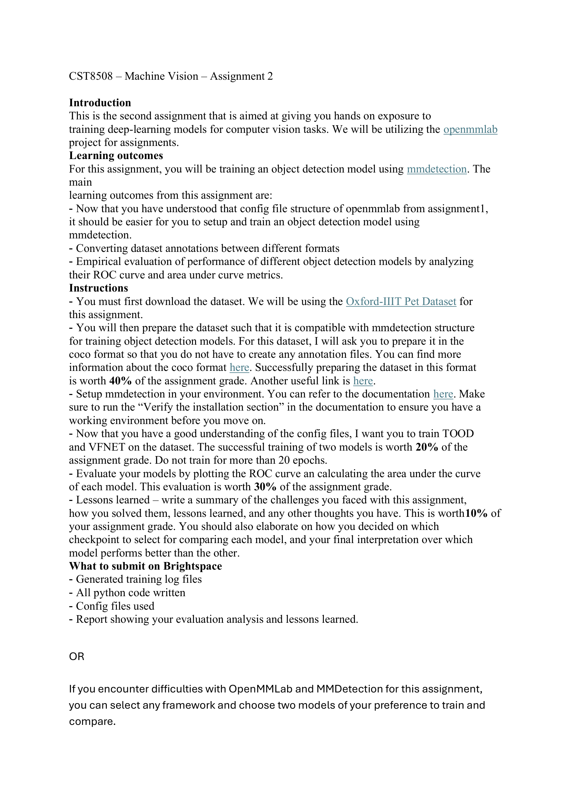

# CST8508 Machine Vision — Assignment 2 — 机器视觉作业 2

**Source 来源:** `Assignment 2.pdf`  
**Total Pages 总页数:** 1

---

## 📷 Original Document — 原始文档

---

## 1. Introduction — 简介

- This is the second assignment that is aimed at giving you hands on exposure to training deep-learning models for computer vision tasks. — 这是第二个作业，旨在让你获得训练深度学习模型进行计算机视觉任务的实践经验。
- We will be utilizing the openmmlab project for assignments. — 我们将使用 OpenMMLab 项目来完成作业。

---

## 2. Learning Outcomes — 学习目标

- For this assignment, you will be training an object detection model using mmdetection. — 在本次作业中，你将使用 mmdetection 训练一个目标检测模型。
- Now that you have understood the config file structure of openmmlab from assignment1, it should be easier for you to setup and train an object detection model using mmdetection. — 既然你已经从 Assignment 1 中理解了 OpenMMLab 的配置文件结构，那么使用 mmdetection 创建和训练目标检测模型应该更容易了。
- Converting dataset annotations between different formats. — 在不同格式之间转换数据集标注。
- Empirical evaluation of performance of different object detection models by analyzing their ROC curve and area under curve metrics. — 通过分析 ROC 曲线和 AUC（曲线下面积）指标，对不同目标检测模型的性能进行实证评估。

---

## 3. Instructions — 作业指南

### 3.1 Download Dataset — 下载数据集

- You must first download the dataset. We will be using the **Oxford-IIIT Pet Dataset** for this assignment. — 你必须先下载数据集。本次作业我们使用 **Oxford-IIIT Pet 数据集**。

### 3.2 Prepare Dataset in COCO Format — 准备 COCO 格式数据集 (**40%**)

- You will then prepare the dataset such that it is compatible with mmdetection structure for training object detection models. — 然后你需要将数据集准备成与 mmdetection 训练目标检测模型兼容的结构。
- For this dataset, I will ask you to prepare it in the **coco format** so that you do not have to create any annotation files. — 对于这个数据集，要求你将其准备为 **COCO 格式**，这样你就不需要创建标注文件。
- You can find more information about the coco format here. Another useful link is here. — 你可以在相关链接中找到更多关于 COCO 格式的信息。
- **Successfully preparing the dataset in this format is worth 40% of the assignment grade.** — **成功按此格式准备数据集占作业成绩的 40%。**

### 3.3 Setup mmdetection — 搭建 mmdetection 环境

- Setup mmdetection in your environment. You can refer to the documentation here. — 在你的环境中搭建 mmdetection。你可以参考相关文档。
- Make sure to run the "Verify the installation section" in the documentation to ensure you have a working environment before you move on. — 确保运行文档中的"验证安装"部分，以确保你有一个可用的环境后再继续。

### 3.4 Train Models — 训练模型 (**20%**)

- Now that you have a good understanding of the config files, I want you to train **TOOD** and **VFNET** on the dataset. — 既然你已经对配置文件有了很好的理解，我希望你在数据集上训练 **TOOD** 和 **VFNET** 两个模型。
- The successful training of two models is worth **20%** of the assignment grade. — 成功训练两个模型占作业成绩的 **20%**。
- **Do not train for more than 20 epochs.** — **训练不要超过 20 个 epoch。**

### 3.5 Evaluate Models — 评估模型 (**30%**)

- Evaluate your models by plotting the **ROC curve** and calculating the **area under the curve** of each model. — 通过绘制 **ROC 曲线**并计算每个模型的**曲线下面积 (AUC)** 来评估你的模型。
- This evaluation is worth **30%** of the assignment grade. — 此评估占作业成绩的 **30%**。

### 3.6 Lessons Learned — 经验总结 (**10%**)

- Write a summary of the challenges you faced with this assignment, how you solved them, lessons learned, and any other thoughts you have. — 写一份总结，包括你在本次作业中遇到的挑战、如何解决的、经验教训以及其他想法。
- This is worth **10%** of your assignment grade. — 这部分占作业成绩的 **10%**。
- You should also elaborate on how you decided on which checkpoint to select for comparing each model, and your final interpretation over which model performs better than the other. — 你还应该详细说明你如何决定选择哪个检查点来比较每个模型，以及你对哪个模型表现更好的最终解读。

---

## 4. What to Submit on Brightspace — 在 Brightspace 上提交什么

- Generated training log files — 生成的训练日志文件
- All python code written — 所有编写的 Python 代码
- Config files used — 使用的配置文件
- Report showing your evaluation analysis and lessons learned — 展示评估分析和经验总结的报告

---

## 5. Alternative Option — 替代方案

> **OR** If you encounter difficulties with OpenMMLab and MMDetection for this assignment, you can select any framework and choose two models of your preference to train and compare. — **或者**：如果你在本次作业中使用 OpenMMLab 和 MMDetection 遇到困难，你可以选择任何框架，并选择两个你偏好的模型进行训练和比较。

---

## 6. Grading Summary — 评分总结

| Component 组成部分 | Weight 权重 |
|---|---|
| Dataset preparation in COCO format — COCO 格式数据集准备 | **40%** |
| Successful training of two models — 成功训练两个模型 | **20%** |
| ROC curve + AUC evaluation — ROC 曲线 + AUC 评估 | **30%** |
| Lessons learned summary — 经验总结 | **10%** |
| **Total 总计** | **100%** |

---
