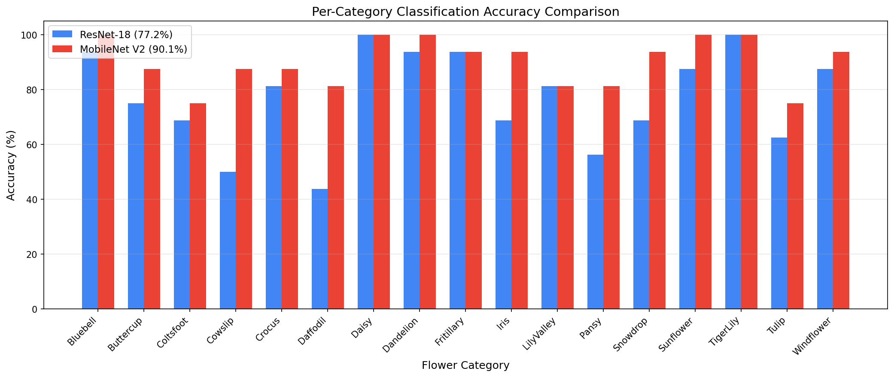
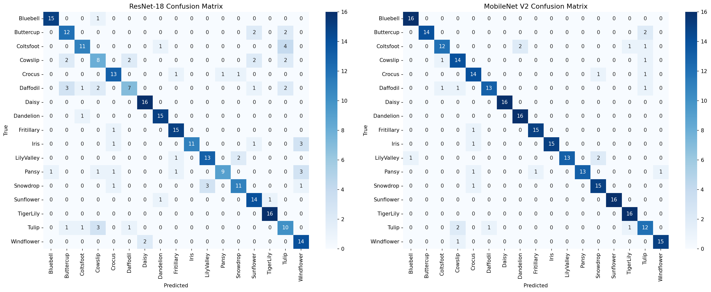

# CST8508 Machine Vision - Assignment 1 Report

**Author:** Peng Wang  
**Student Number:** 041107730  
**Date:** February 2026

---

## 1. Introduction

This assignment involves training deep learning models for image classification using the
[mmpretrain](https://github.com/open-mmlab/mmpretrain) framework from OpenMMLab. The
[Oxford Flowers 17](https://www.robots.ox.ac.uk/~vgg/data/flowers/17/) dataset was used,
containing 17 categories of flowers with approximately 80 images each.

Two models were selected for comparison:

- **ResNet-18** — A residual network with 18 layers, using SGD optimizer
- **MobileNet V2** — A lightweight network using depthwise separable convolutions, with Adam optimizer

### Training Environment

| Component  | Version               |
| ---------- | --------------------- |
| OS         | Ubuntu 22.04 (WSL2)   |
| GPU        | NVIDIA RTX 4060 (8GB) |
| Python     | 3.8 (conda)           |
| PyTorch    | 2.4.1 + CUDA 12.1     |
| mmengine   | 0.10.7                |
| mmcv       | 2.2.0                 |
| mmpretrain | 1.2.0                 |

---

## 2. Dataset Preparation (20%)

### 2.1 Dataset Overview

The Oxford Flowers 17 dataset contains 1,360 images across 17 flower categories:
Bluebell, Buttercup, Coltsfoot, Cowslip, Crocus, Daffodil, Daisy, Dandelion,
Fritillary, Iris, LilyValley, Pansy, Snowdrop, Sunflower, TigerLily, Tulip, Windflower.

### 2.2 SubFolder Format

The dataset was organized into the **SubFolder format** as required by mmpretrain's `CustomDataset`:

```
data/flowers17/
├── train/
│   ├── Bluebell/           (62 images)
│   ├── Buttercup/          (62 images)
│   ├── ...
│   └── Windflower/         (62 images)
└── val/
    ├── Bluebell/           (16 images)
    ├── Buttercup/          (16 images)
    ├── ...
    └── Windflower/         (16 images)
```

- **Training set:** ~1,054 images (62 per category)
- **Validation set:** ~272 images (16 per category)
- Split was performed using the provided `train_set.json` and `val_set.json` files.

### 2.3 Why SubFolder Format?

The SubFolder format was chosen because:

- No annotation files need to be created
- Class names are automatically inferred from subfolder names
- It is the simplest format compatible with mmpretrain

---

## 3. Model Training (50%)

### 3.1 Model 1: ResNet-18

| Parameter         | Value                                |
| ----------------- | ------------------------------------ |
| Architecture      | ResNet-18 (4 stages, 512-dim output) |
| Optimizer         | SGD (lr=0.01, momentum=0.9)          |
| LR Scheduler      | Cosine Annealing (T_max=100)         |
| Batch Size        | 32                                   |
| Epochs            | 100                                  |
| Input Size        | 224×224                              |
| Data Augmentation | RandomResizedCrop, RandomFlip        |

### 3.2 Model 2: MobileNet V2

| Parameter         | Value                                            |
| ----------------- | ------------------------------------------------ |
| Architecture      | MobileNet V2 (widen_factor=1.0, 1280-dim output) |
| Optimizer         | Adam (lr=0.001)                                  |
| LR Scheduler      | Cosine Annealing (T_max=100)                     |
| Batch Size        | 32                                               |
| Epochs            | 100                                              |
| Input Size        | 224×224                                          |
| Data Augmentation | RandomResizedCrop, RandomFlip                    |

### 3.3 Key Differences

| Aspect       | ResNet-18             | MobileNet V2                     |
| ------------ | --------------------- | -------------------------------- |
| Parameters   | ~11.7M                | ~3.4M                            |
| Architecture | Standard convolutions | Depthwise separable convolutions |
| Optimizer    | SGD                   | Adam                             |
| Feature Dim  | 512                   | 1280                             |
| Design Goal  | Accuracy              | Efficiency                       |

---

## 4. Evaluation Analysis (20%)

### 4.1 Metrics Used

- **Top-1 Accuracy**: Percentage of correct predictions
- **Top-5 Accuracy**: Percentage where correct class is in top 5 predictions
- **Per-class Accuracy**: Accuracy breakdown by flower category
- **Confusion Matrix**: Visual analysis of classification errors

### 4.2 Training Progress

**ResNet-18 Validation Accuracy (Top-1) by Epoch:**

| Epoch | Top-1 (%) | Top-5 (%) |
| ----- | --------- | --------- |
| 10    | 38.97     | 80.51     |
| 20    | 52.57     | 91.54     |
| 30    | 60.66     | 95.96     |
| 40    | 65.07     | 93.75     |
| 50    | 69.49     | 95.96     |
| 60    | 72.43     | 97.43     |
| 70    | 72.79     | 97.43     |
| 80    | 74.63     | 97.43     |
| 90    | 77.21     | 97.79     |
| 100   | 76.47     | 98.16     |

**MobileNet V2 Validation Accuracy (Top-1) by Epoch:**

| Epoch | Top-1 (%) | Top-5 (%) |
| ----- | --------- | --------- |
| 10    | 55.88     | 92.65     |
| 20    | 63.60     | 95.22     |
| 30    | 70.22     | 95.96     |
| 40    | 75.00     | 97.06     |
| 50    | 84.93     | 98.90     |
| 60    | 85.29     | 98.53     |
| 70    | 88.24     | 98.90     |
| 80    | 89.71     | 98.90     |
| 90    | 90.07     | 98.53     |
| 100   | 89.71     | 98.90     |

### 4.3 Final Results (Best Checkpoint — Epoch 90)

| Metric              | ResNet-18 | MobileNet V2 |
| ------------------- | --------- | ------------ |
| Top-1 Accuracy      | 77.21%    | 90.07%       |
| Top-5 Accuracy      | 97.79%    | 98.53%       |
| Macro Avg Precision | 0.78      | 0.91         |
| Macro Avg Recall    | 0.77      | 0.90         |
| Macro Avg F1-Score  | 0.77      | 0.90         |

MobileNet V2 outperformed ResNet-18 by approximately **13 percentage points** in Top-1 accuracy.

### 4.4 Per-Category Analysis

**Figure 1: Per-Category Accuracy Comparison**



**Figure 2: Confusion Matrices**



**ResNet-18 — Best/Worst Categories:**

| Category  | Precision | Recall | F1   |
| --------- | --------- | ------ | ---- |
| TigerLily | 0.94      | 1.00   | 0.97 |
| Daisy     | 0.89      | 1.00   | 0.94 |
| Dandelion | 0.88      | 0.94   | 0.91 |
| Cowslip   | 0.53      | 0.50   | 0.52 |
| Daffodil  | 0.70      | 0.44   | 0.54 |
| Tulip     | 0.50      | 0.62   | 0.56 |

**MobileNet V2 — Best/Worst Categories:**

| Category  | Precision | Recall | F1   |
| --------- | --------- | ------ | ---- |
| Daisy     | 1.00      | 1.00   | 1.00 |
| Sunflower | 1.00      | 1.00   | 1.00 |
| Bluebell  | 0.94      | 1.00   | 0.97 |
| Tulip     | 0.67      | 0.75   | 0.71 |
| Coltsfoot | 0.86      | 0.75   | 0.80 |
| Cowslip   | 0.78      | 0.88   | 0.82 |

**Key Observations:**

- Categories with distinctive visual features (Sunflower, Daisy, TigerLily) achieve high accuracy in both models
- Visually similar categories (Cowslip vs Coltsfoot, Buttercup vs Dandelion) are more challenging
- MobileNet V2 shows significantly better performance on difficult categories like Daffodil (0.87 vs 0.54 F1) and Pansy (0.90 vs 0.69 F1)
- The Adam optimizer with MobileNet V2 appears to converge faster and more effectively than SGD with ResNet-18 on this small dataset

---

## 5. Lessons Learned (10%)

### 5.1 Challenges Faced

1. **Environment Setup Complexity**: OpenMMLab requires specific compatible versions
   of PyTorch, mmcv, and mmengine. Initial attempts on Google Colab failed because
   PyTorch 2.10+cu128 had no pre-built mmcv wheel. Attempts to build from source
   also failed due to Python 3.12 incompatibility with `pkg_resources`. The solution
   was to use a local WSL (Ubuntu 22.04) environment with conda, following the
   official mmpretrain tutorial exactly: conda + Python 3.8 + PyTorch 2.4.1 + CUDA 12.1.

2. **NumPy Version Conflicts**: In the WSL venv environment, NumPy 2.x caused segfaults
   with PyTorch 2.1.2. Downgrading NumPy did not resolve the issue. Switching to conda
   (which manages binary compatibility automatically) solved this completely.

3. **Dataset Organization**: The Oxford Flowers 17 dataset provides raw images without
   a predefined folder structure. A custom `prepare_dataset.py` script was written to
   download, extract, and organize images into the SubFolder format using predefined
   train/val split JSON files.

4. **Config File Structure**: The `ImageClassificationInferencer` requires a
   `test_dataloader` in the config, but our configs only defined `train_dataloader`
   and `val_dataloader`. Adding `test_dataloader = val_dataloader` resolved this.

5. **Small Dataset Considerations**: With only ~62 training images per class, overfitting
   is a concern. Data augmentation (RandomResizedCrop, RandomFlip) and cosine annealing
   LR schedule helped. Both models showed continued improvement up to epoch 90, with
   slight fluctuation at epoch 100.

### 5.2 Key Takeaways

- **Environment Matters**: The biggest lesson was that environment setup is half the
  battle. Conda with the official tutorial versions (Python 3.8, PyTorch + CUDA via
  conda, mim for OpenMMLab packages) is the most reliable path. Avoid mixing pip/conda
  or using bleeding-edge Python versions.

- **MobileNet V2 Surprised Me**: Despite having only ~3.4M parameters (vs ResNet-18's
  ~11.7M), MobileNet V2 achieved 90% accuracy compared to ResNet-18's 77%. The Adam
  optimizer likely helped MobileNet V2 converge better on this small dataset, while
  SGD with ResNet-18 may have needed more careful hyperparameter tuning.

- **Config-Based Training**: The config-driven approach makes experiments highly
  reproducible. Changing models, datasets, or hyperparameters only requires editing
  config files, not rewriting training loops.

- **OpenMMLab Ecosystem**: Once you learn the structure of one OpenMMLab project
  (config system, registry, runner), all others become much easier to use.

- **Automation Saves Time**: Writing `assignment1.sh` as an all-in-one script
  (setup → check → train → evaluate → copy results) made the workflow reproducible
  and eliminated manual steps.

### 5.3 Future Improvements

- Use **pretrained ImageNet weights** for transfer learning — this would significantly
  boost accuracy on this small dataset by leveraging features learned from 1.2M images
- Experiment with **stronger data augmentation** (ColorJitter, RandomRotation, CutOut)
  to further combat overfitting with limited training data
- Try **fine-tuning** (freezing early layers) vs training from scratch to compare
  convergence speed and final accuracy
- Explore more advanced architectures (EfficientNet, Vision Transformer) to understand
  how modern architectures perform on small-scale classification tasks
- Implement **learning rate warmup** to stabilize early training phases
