# CST8508 Assignment 2 -- Study Notes (学习笔记)

**Student:** Peng Wang | **ID:** 041107730 | **Date:** March 20, 2026

> This document contains code screenshots, output screenshots, and bilingual explanations for self-study.
> 本文档包含代码截图、输出截图和双语解释，用于自学复习。

---

## Setup: Imports and Configuration (导入与配置)

### Code

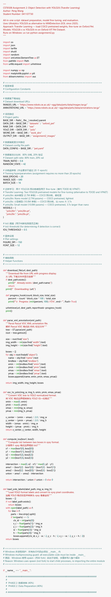

**Explanation:**

- Import all required libraries: ultralytics (YOLO), numpy, matplotlib, sklearn. — 导入所需库：ultralytics (YOLO), numpy, matplotlib, sklearn。
- Define configuration constants at the top: paths, hyperparameters, model names. — 在文件顶部定义配置常量：路径、超参数、模型名称。
- Two models are compared: YOLO26-n (2.7M params) vs YOLO26-s (10.0M params). — 比较两个模型：YOLO26-n（2.7M 参数）vs YOLO26-s（10.0M 参数）。
- `workers=0` is required on Windows to avoid multiprocessing spawn errors. — Windows 上必须设置 `workers=0` 以避免多进程 spawn 错误。

---

## Step 1: Download Dataset (下载数据集)

### Code

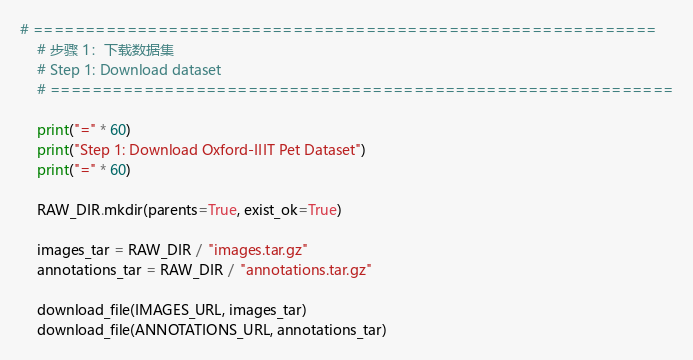

### Output

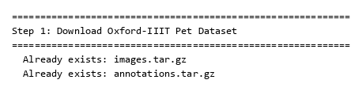

**Explanation:**

- Download Oxford-IIIT Pet Dataset from the official Oxford Robotics website. — 从牛津机器人研究所官网下载 Oxford-IIIT 宠物数据集。
- Two archives: `images.tar.gz` (photos) and `annotations.tar.gz` (bounding boxes). — 两个压缩包：`images.tar.gz`（照片）和 `annotations.tar.gz`（边界框标注）。
- `urlretrieve()` downloads with a progress hook showing percentage. — `urlretrieve()` 带进度回调显示下载百分比。
- Files are cached: "Already exists" means no re-download needed. — 文件已缓存："Already exists" 表示无需重新下载。

---

## Step 2: Extract Dataset (解压数据集)

### Code

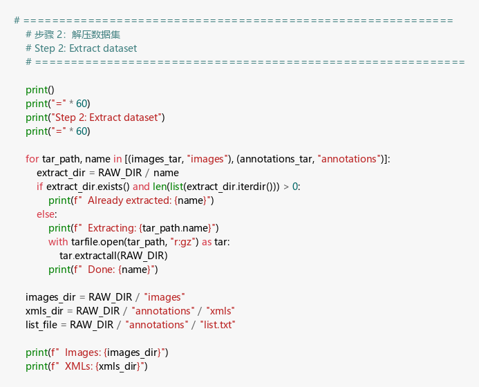

### Output

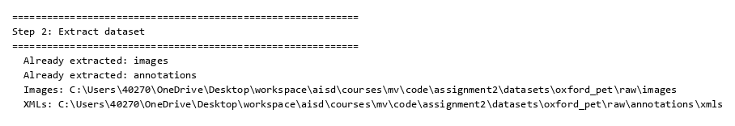

**Explanation:**

- Extract tar.gz archives to the raw data directory using Python's `tarfile` module. — 使用 Python 的 `tarfile` 模块将 tar.gz 压缩包解压到原始数据目录。
- Images are in `raw/images/`, XML annotations in `raw/annotations/xmls/`. — 图片在 `raw/images/`，XML 标注在 `raw/annotations/xmls/`。
- Extraction is skipped if directory already has content (idempotent). — 如果目录已有内容则跳过解压（幂等操作）。

---

## Step 3: Parse Class Mapping (解析类别映射)

### Code

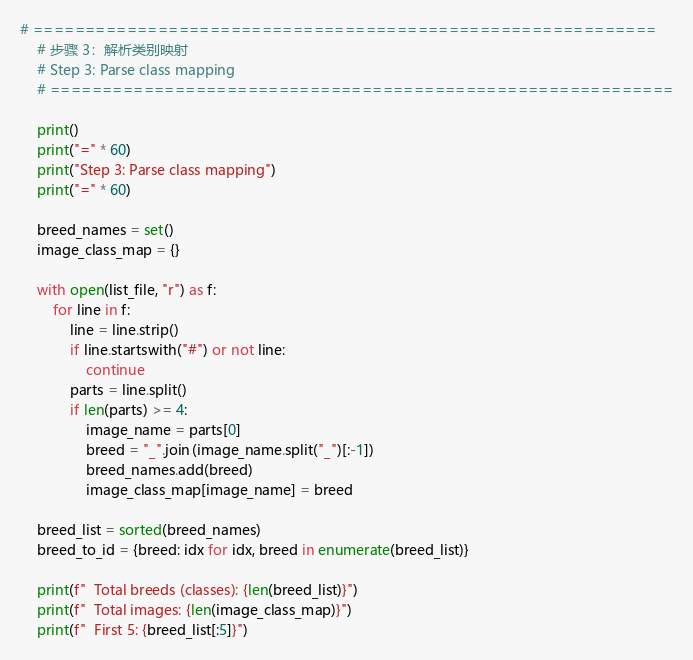

### Output

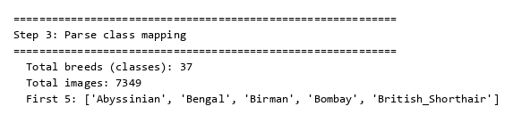

**Explanation:**

- Parse the `list.txt` file to extract breed names from image filenames. — 解析 `list.txt` 文件，从图片文件名中提取品种名称。
- Naming convention: `Breed_Name_123.jpg` where breed is everything before the last `_`. — 命名规则：`Breed_Name_123.jpg`，品种名是最后一个 `_` 之前的部分。
- 37 unique breeds found (25 dogs + 12 cats), mapped to class IDs 0-36. — 共发现 37 个品种（25 种狗 + 12 种猫），映射到类别 ID 0-36。
- Total 7,349 images across all breeds. — 所有品种共 7,349 张图片。

---

## Step 4: Convert XML to YOLO Format (XML 转 YOLO 格式)

### Code

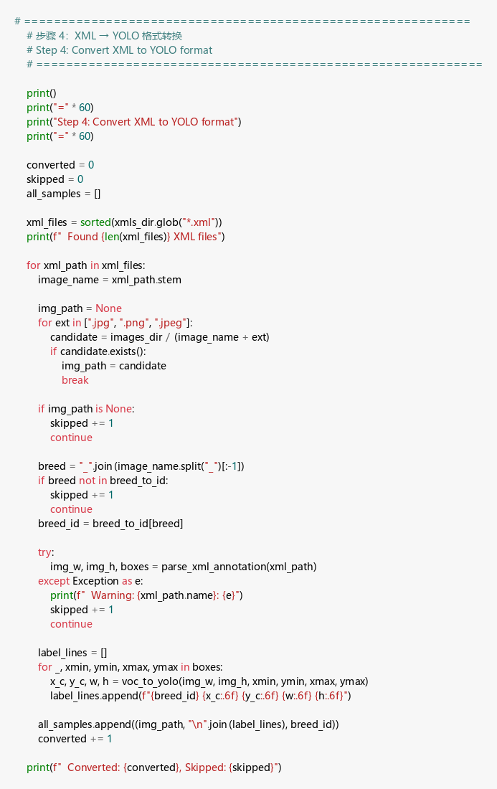

### Output

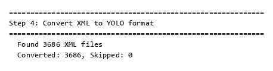

**Explanation:**

- Convert Pascal VOC XML bounding boxes to YOLO normalized format. — 将 Pascal VOC XML 边界框转为 YOLO 归一化格式。
- VOC format: `(xmin, ymin, xmax, ymax)` in pixels; YOLO: `(class_id, x_center, y_center, width, height)` normalized to [0,1]. — VOC 格式：像素坐标 `(xmin, ymin, xmax, ymax)`；YOLO 格式：`(class_id, x_center, y_center, width, height)` 归一化到 [0,1]。
- All 3,686 XML files were successfully converted (0 skipped). — 全部 3,686 个 XML 文件成功转换（0 个跳过）。
- Bounding boxes are clipped to image boundaries to handle edge cases. — 边界框被裁剪到图片边界以处理边缘情况。

---

## Step 5: Split Train/Val (划分训练/验证集)

### Code

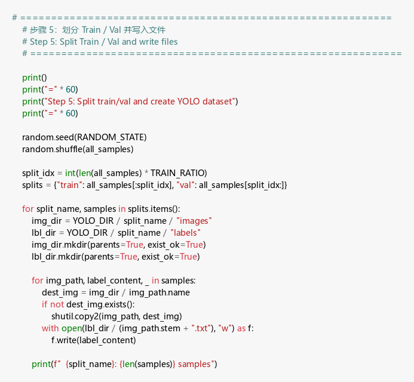

### Output

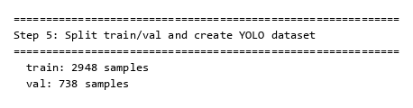

**Explanation:**

- Split annotated images into 80% train (2,948) and 20% val (738). — 将标注图片划分为 80% 训练集（2,948）和 20% 验证集（738）。
- Random seed fixed at 42 for reproducibility. — 随机种子固定为 42 以保证可重复性。
- Images and labels are copied to `yolo/train/` and `yolo/val/` subdirectories. — 图片和标签被复制到 `yolo/train/` 和 `yolo/val/` 子目录。
- YOLO expects this exact directory structure for training. — YOLO 训练要求的正是这种目录结构。

---

## Step 6: Generate pet.yaml (生成数据集配置)

### Code

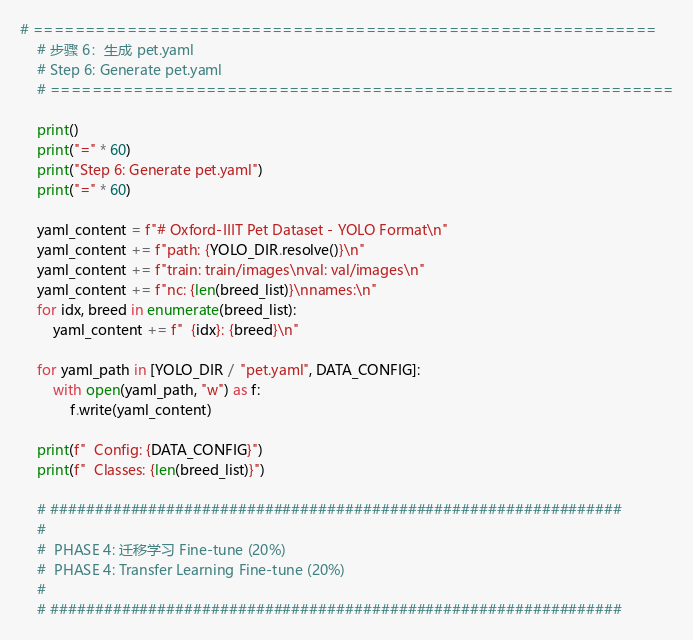

### Output

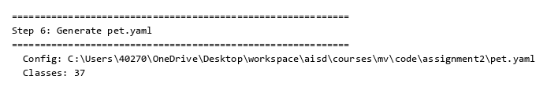

**Explanation:**

- Generate `pet.yaml` config file required by YOLO for dataset definition. — 生成 YOLO 数据集定义所需的 `pet.yaml` 配置文件。
- Contains: path to dataset, train/val image directories, number of classes (37), and class names. — 包含：数据集路径、训练/验证图片目录、类别数量（37）和类别名称。
- This file is passed to `model.train(data="pet.yaml")` during training. — 训练时通过 `model.train(data="pet.yaml")` 传入此文件。

---

## Step 7: Fine-tune Models (微调模型 -- Transfer Learning)

### Code

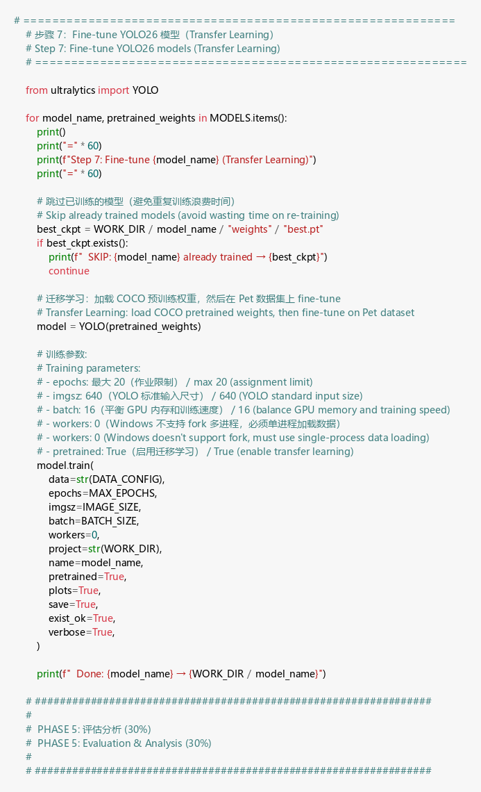

### Output

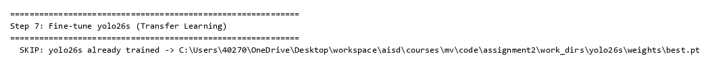

**Explanation:**

- Transfer Learning approach: load COCO-pretrained weights, fine-tune on Pet dataset. — 迁移学习方法：加载 COCO 预训练权重，在宠物数据集上微调。
- YOLO26-n (Nano, 2.7M params) uses ~2.9 GB GPU memory, trains ~52s/epoch. — YOLO26-n（纳米，2.7M 参数）使用约 2.9 GB GPU 内存，每 epoch 约 52 秒。
- YOLO26-s (Small, 10.0M params) uses ~4.8 GB GPU memory, trains ~77s/epoch. — YOLO26-s（小型，10.0M 参数）使用约 4.8 GB GPU 内存，每 epoch 约 77 秒。
- Skip logic: if `best.pt` already exists, training is skipped to save time. — 跳过逻辑：如果 `best.pt` 已存在，则跳过训练以节省时间。
- `pretrained=True` enables transfer learning from COCO 80-class detector. — `pretrained=True` 启用从 COCO 80 类检测器的迁移学习。

---

## Step 8: Evaluate Models (模型评估)

### Code

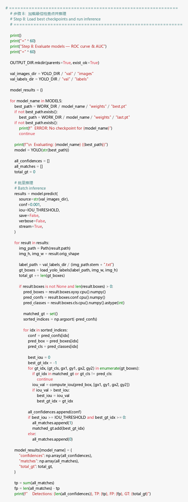

### Output

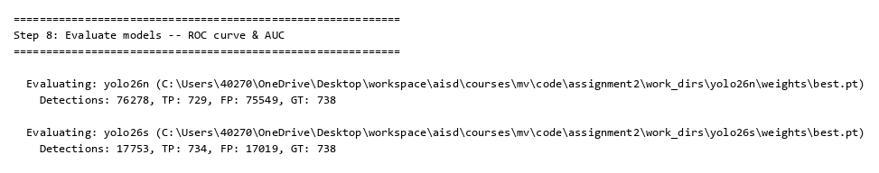

**Explanation:**

- Run inference on all 738 validation images with very low confidence threshold (0.001). — 以极低的置信度阈值（0.001）对全部 738 张验证图片进行推理。
- Low threshold ensures we capture the full range of predictions for ROC analysis. — 低阈值确保捕获完整的预测范围以用于 ROC 分析。
- Each prediction is matched to ground truth using IoU >= 0.5 (TP if matched, FP otherwise). — 每个预测通过 IoU >= 0.5 与真实标注匹配（匹配则为 TP，否则为 FP）。
- YOLO26-n: 729 TP / 75,549 FP; YOLO26-s: 734 TP / 17,019 FP. — YOLO26-n：729 个 TP / 75,549 个 FP；YOLO26-s：734 个 TP / 17,019 个 FP。
- The large FP count for YOLO26-n shows it generates many low-confidence false detections. — YOLO26-n 的大量 FP 说明它产生了许多低置信度的误检测。

---

## Step 9: Compute ROC and AUC (计算 ROC 曲线和 AUC)

### Code

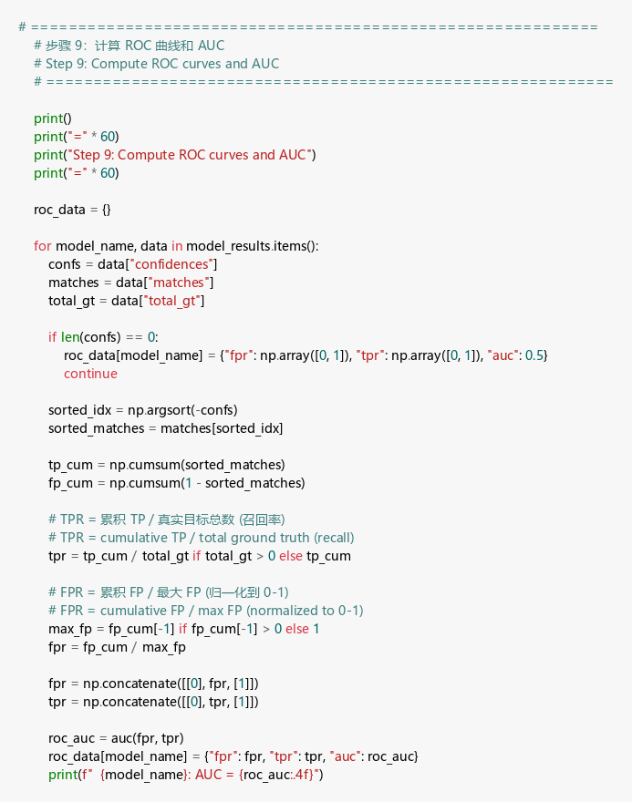

### Output

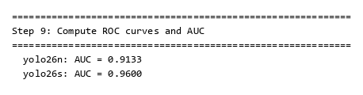

**Explanation:**

- Sort detections by confidence (highest first), compute cumulative TP and FP counts. — 按置信度降序排列检测结果，计算累积 TP 和 FP 数量。
- TPR (True Positive Rate) = cumulative TP / total GT objects. — TPR（真正例率）= 累积 TP / 总真实目标数。
- FPR (False Positive Rate) = cumulative FP / max FP (normalized). — FPR（假正例率）= 累积 FP / 最大 FP（归一化）。
- AUC computed using sklearn's `auc()` function with trapezoidal rule. — 使用 sklearn 的 `auc()` 函数（梯形法则）计算 AUC。
- YOLO26-n AUC = 0.9133, YOLO26-s AUC = 0.9600 (higher is better). — YOLO26-n AUC = 0.9133，YOLO26-s AUC = 0.9600（越高越好）。

---

## Step 10: Plot ROC Curves (绘制 ROC 曲线)

### Code

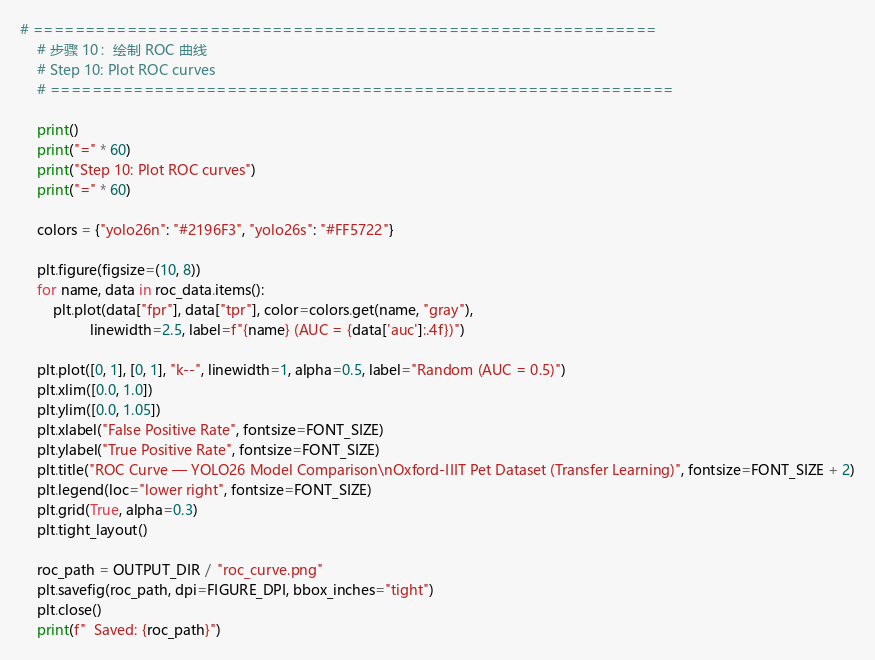

### Output

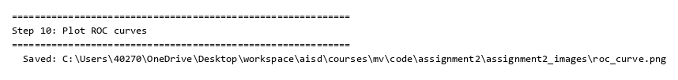

### Plot

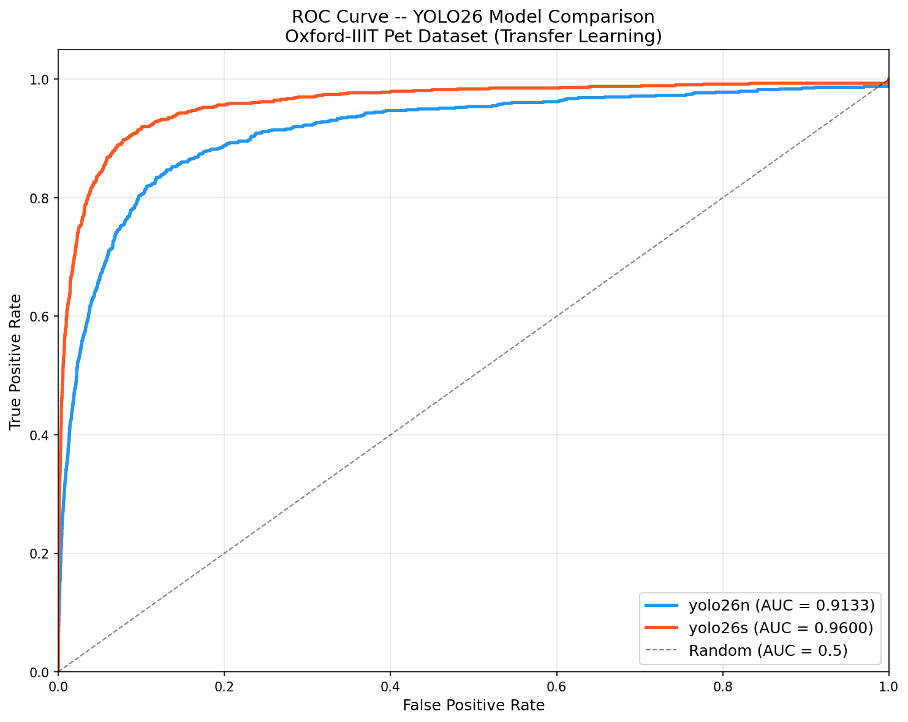

**Explanation:**

- ROC curve plots TPR vs FPR at different confidence thresholds. — ROC 曲线在不同置信度阈值下绘制 TPR vs FPR。
- YOLO26-s (orange) curve is consistently above YOLO26-n (blue), meaning better performance. — YOLO26-s（橙色）曲线始终在 YOLO26-n（蓝色）上方，表示性能更好。
- Random baseline (diagonal) has AUC = 0.5; both models are far above it. — 随机基线（对角线）AUC = 0.5；两个模型都远高于它。
- The gap between curves shows the 3.7x parameter advantage of YOLO26-s. — 曲线之间的差距体现了 YOLO26-s 3.7 倍参数量的优势。

---

## Step 11: Plot Model Comparison (绘制模型对比图)

### Code

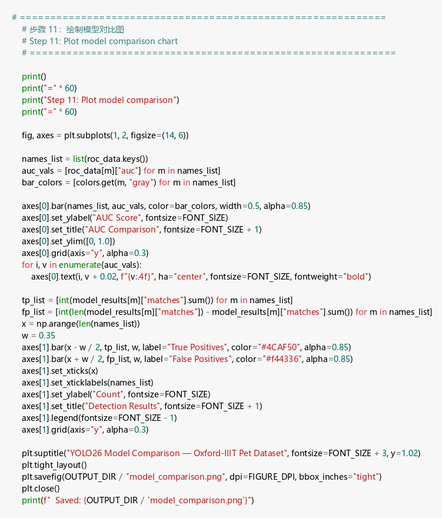

### Output

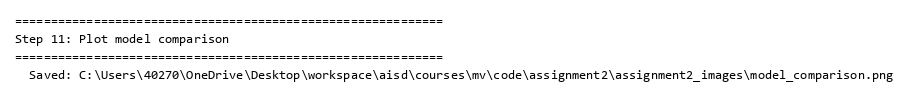

### Plot

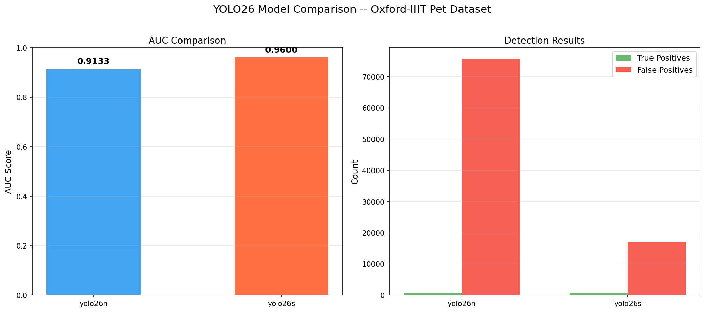

**Explanation:**

- Left chart: AUC bar comparison shows YOLO26-s (0.96) > YOLO26-n (0.91). — 左图：AUC 柱状对比显示 YOLO26-s（0.96）> YOLO26-n（0.91）。
- Right chart: Detection results show YOLO26-n has 4.4x more False Positives. — 右图：检测结果显示 YOLO26-n 有 4.4 倍多的误检测（FP）。
- Both models detect nearly all ground truth objects (~730/738 TP). — 两个模型都检测到了几乎所有真实目标（约 730/738 TP）。
- The key difference is precision: YOLO26-s is much more selective in its predictions. — 关键差异在于精度：YOLO26-s 在预测时更加精准。

---

## Step 12: Evaluation Summary (评估总结)

### Code

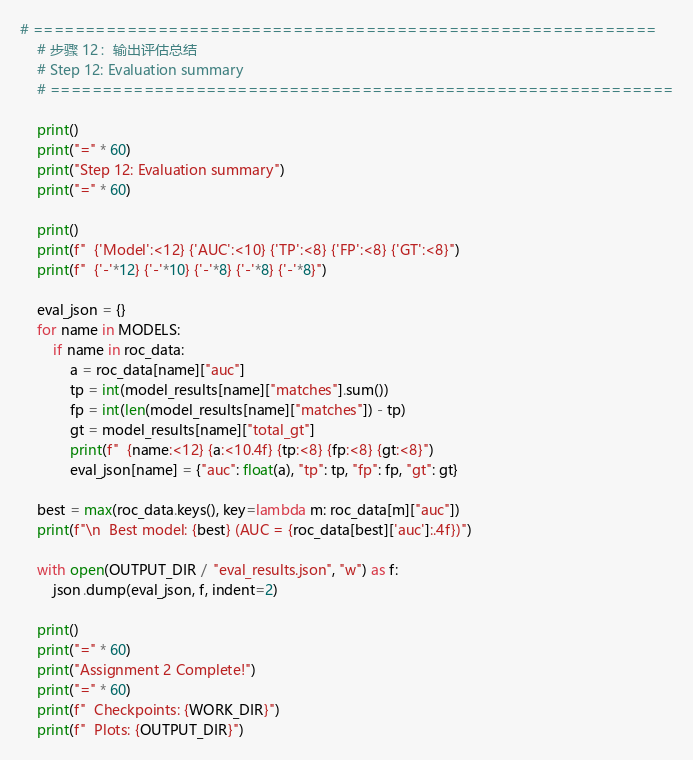

### Output

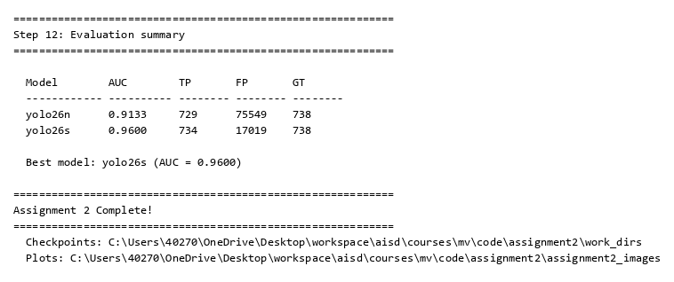

**Explanation:**

- Summary table shows all key metrics side by side for easy comparison. — 汇总表将所有关键指标并列显示，方便对比。
- Best model: YOLO26-s with AUC = 0.9600, clearly outperforming YOLO26-n. — 最佳模型：YOLO26-s，AUC = 0.9600，明显优于 YOLO26-n。
- Results saved to `eval_results.json` for programmatic access. — 结果保存到 `eval_results.json` 以便程序化访问。
- Conclusion: larger model capacity (10M vs 2.7M params) is essential for fine-grained 37-class pet detection. — 结论：更大的模型容量（10M vs 2.7M 参数）对于 37 类细粒度宠物检测至关重要。
