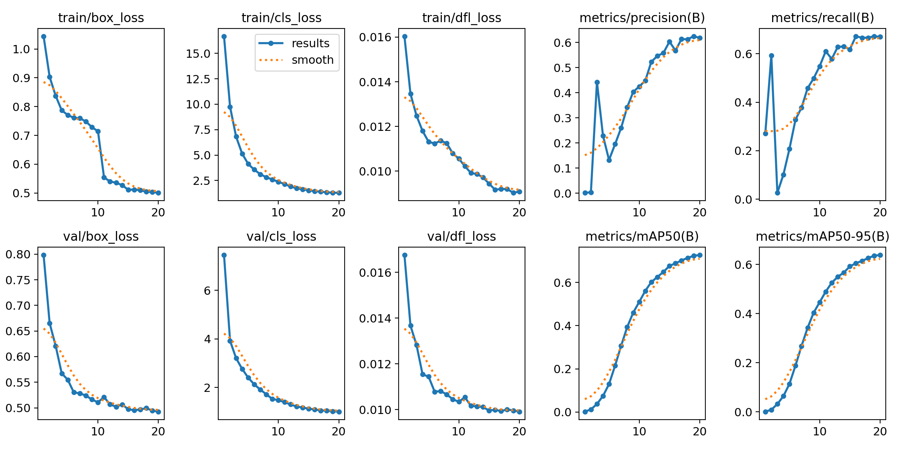
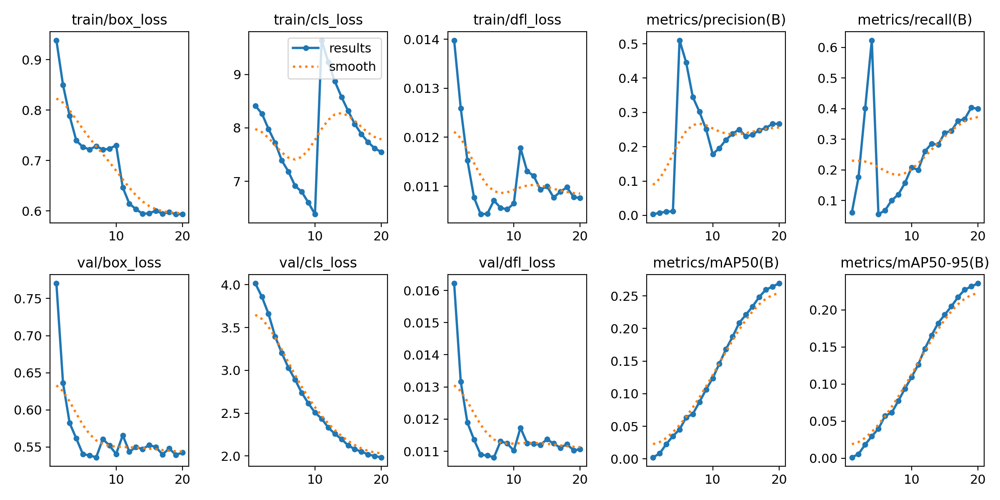
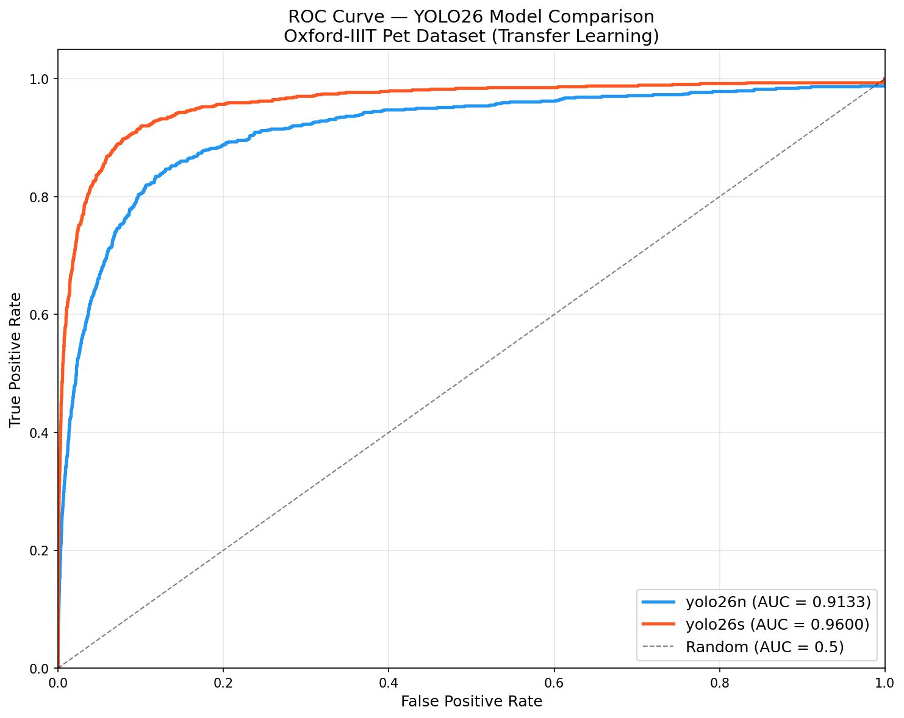
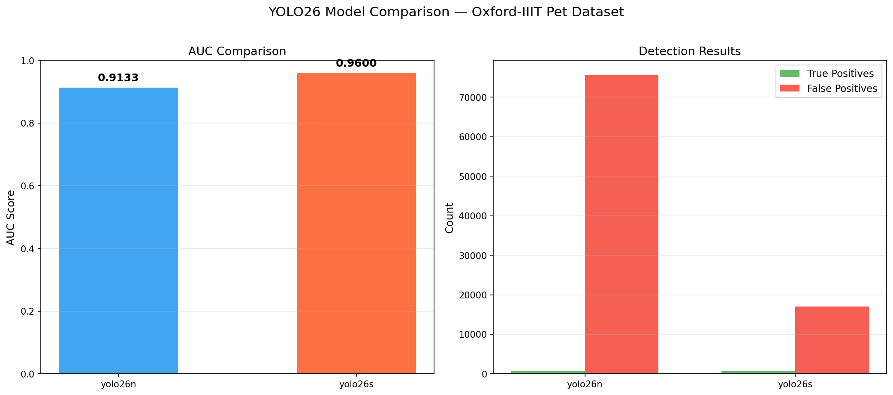
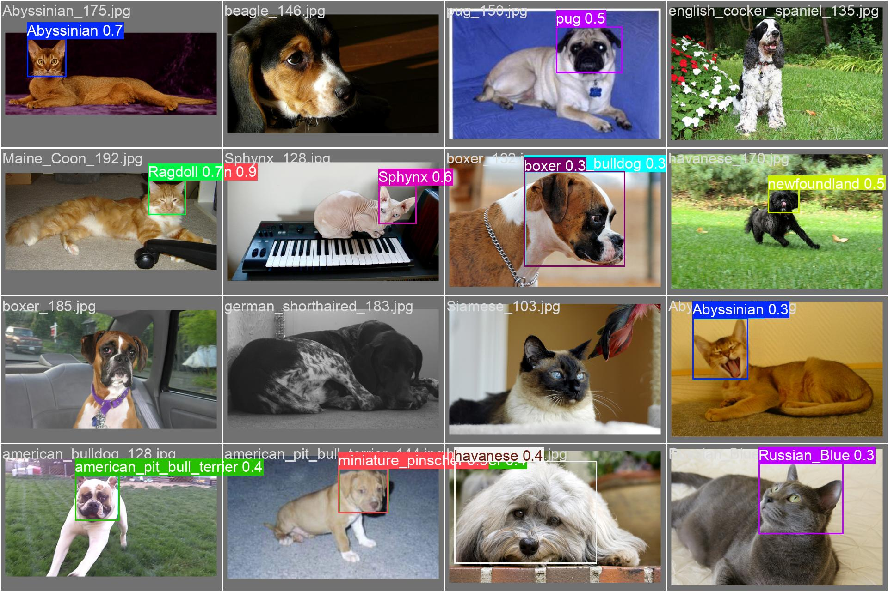
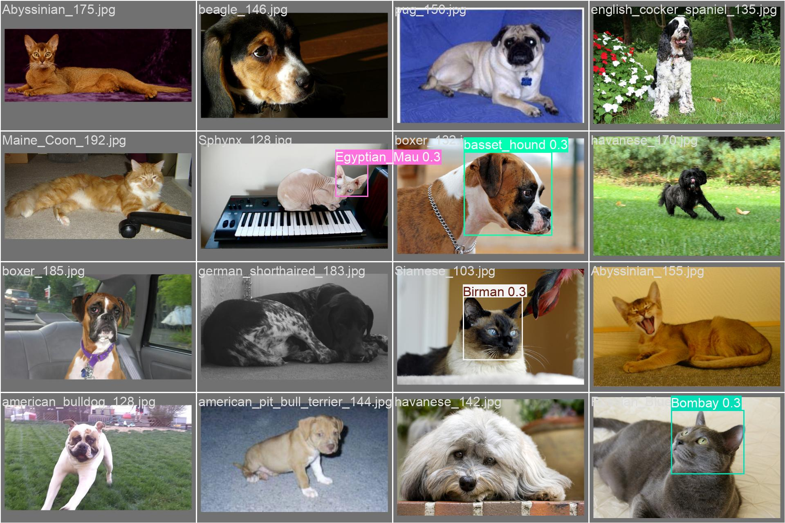

# CST8508 Machine Vision — Assignment 2 Report

**Student:** Peng Wang  
**Student Number:** 041107730  
**Date:** March 20, 2026  
**Course:** CST8508 Machine Vision

---

## 1. Introduction

This report presents the work completed for Assignment 2, which involves training and evaluating object detection models on the **Oxford-IIIT Pet Dataset**. The assignment originally specified using MMDetection with TOOD and VFNET models; however, since MMDetection reached End-of-Life (EOL) in 2025 and is no longer maintained, I used the **alternative option** (Section 5 of the assignment) and selected **Ultralytics YOLO26** as the framework with two models: **YOLO26-n (Nano)** and **YOLO26-s (Small)**.

The approach uses **Transfer Learning**: both models are initialized with COCO-pretrained weights and fine-tuned on the Oxford-IIIT Pet Dataset for 20 epochs. This leverages general visual features (edges, textures, shapes) already learned from the 80-class COCO dataset and adapts them to the 37 pet breed classification task.

---

## 2. Dataset Preparation (40%)

### 2.1 Dataset Download

The Oxford-IIIT Pet Dataset was downloaded from the official source:
- **Images:** 7,349 images of 37 pet breeds (25 dog breeds + 12 cat breeds)
- **Annotations:** Pascal VOC format XML files with bounding box annotations

### 2.2 Annotation Format Conversion

The dataset annotations were converted from **Pascal VOC XML** format to **YOLO format**:

- **VOC format:** `(xmin, ymin, xmax, ymax)` in pixel coordinates
- **YOLO format:** `(class_id, x_center, y_center, width, height)` normalized to [0, 1]

**Conversion formula:**
```
x_center = (xmin + xmax) / 2 / image_width
y_center = (ymin + ymax) / 2 / image_height
width    = (xmax - xmin) / image_width
height   = (ymax - ymin) / image_height
```

### 2.3 Dataset Split

The 3,686 annotated images were split into:

| Split | Samples | Ratio |
|-------|---------|-------|
| Training | 2,948 | 80% |
| Validation | 738 | 20% |

### 2.4 Class Mapping

37 pet breeds were mapped to class IDs (0–36). The class names are stored in `pet.yaml`:

```yaml
path: .../datasets/oxford_pet/yolo
train: train/images
val: val/images
nc: 37
names:
  0: Abyssinian
  1: Bengal
  2: Birman
  ...
  36: yorkshire_terrier
```

### 2.5 Directory Structure

```
datasets/oxford_pet/yolo/
├── train/
│   ├── images/     (2,948 .jpg files)
│   └── labels/     (2,948 .txt files)
├── val/
│   ├── images/     (738 .jpg files)
│   └── labels/     (738 .txt files)
└── pet.yaml
```

---

## 3. Model Training (20%)

### 3.1 Framework Selection

**Ultralytics YOLO26** was selected because:
1. MMDetection is EOL since 2025 — no longer maintained or supported
2. YOLO26 is the latest state-of-the-art detector (released 2026)
3. Simple Python API: `model.train(data="pet.yaml", epochs=20)`
4. Built-in COCO pretrained weights for transfer learning
5. Native support for training plots, metrics, and checkpointing

### 3.2 Models Compared

| Model | Parameters | GFLOPs | GPU Memory | Training Speed |
|-------|-----------|--------|------------|----------------|
| **YOLO26-n** (Nano) | 2.7M | 5.2 | 2.9 GB | ~52s/epoch |
| **YOLO26-s** (Small) | 10.0M | 22.1 | 4.8 GB | ~77s/epoch |

### 3.3 Training Configuration

```python
model.train(
    data="pet.yaml",       # Dataset config
    epochs=20,             # Max 20 (assignment limit)
    imgsz=640,             # YOLO standard input size
    batch=16,              # Batch size
    workers=0,             # Windows compatibility
    pretrained=True,       # Transfer Learning from COCO
)
```

### 3.4 Training Results — YOLO26-s

The loss curves show steady convergence over 20 epochs. Classification loss dropped from 16.7 to 1.3, and mAP50 reached 0.727.



**Key metrics at epoch 20:**

| Metric | Value |
|--------|-------|
| mAP50 | 0.727 |
| mAP50-95 | 0.639 |
| Precision | 0.619 |
| Recall | 0.670 |
| box_loss | 0.501 |
| cls_loss | 1.290 |

### 3.5 Training Results — YOLO26-n

YOLO26-n shows slower convergence due to its smaller capacity. Classification loss dropped from 8.4 to 7.5, and mAP50 reached 0.269.



**Key metrics at epoch 20:**

| Metric | Value |
|--------|-------|
| mAP50 | 0.269 |
| mAP50-95 | 0.236 |
| Precision | 0.267 |
| Recall | 0.399 |
| box_loss | 0.593 |
| cls_loss | 7.548 |

---

## 4. Model Evaluation (30%)

### 4.1 Evaluation Methodology

Both trained models were evaluated on the validation set (738 images) using the following approach:

1. **Inference:** Run prediction on all validation images with confidence threshold = 0.001 (to capture the full range for ROC analysis)
2. **Matching:** For each prediction, find the best matching ground truth box using IoU ≥ 0.5
3. **Classification:** Each prediction is classified as TP (True Positive) if it matches a ground truth box with correct class and IoU ≥ 0.5, or FP (False Positive) otherwise
4. **ROC Computation:** Sort predictions by confidence, compute cumulative TPR and FPR at each threshold
5. **AUC Calculation:** Compute Area Under the ROC Curve using the trapezoidal rule

### 4.2 Checkpoint Selection

For each model, the **best checkpoint** (`best.pt`) was used for evaluation. Ultralytics automatically saves the best checkpoint based on the highest validation mAP50 achieved during training. This ensures we compare the peak performance of each model rather than the final epoch (which may not be optimal due to learning rate schedules).

- **YOLO26-n best:** Epoch with highest mAP50 = 0.269
- **YOLO26-s best:** Epoch with highest mAP50 = 0.727

### 4.3 ROC Curve and AUC



The ROC curve clearly shows that **YOLO26-s outperforms YOLO26-n**:

| Model | AUC | TP | FP | GT |
|-------|-----|----|----|-----|
| **YOLO26-n** | 0.9133 | 729 | 75,549 | 738 |
| **YOLO26-s** | 0.9600 | 734 | 17,019 | 738 |

### 4.4 Model Comparison



**Key observations:**

1. **AUC Difference:** YOLO26-s achieves 0.9600 AUC vs YOLO26-n's 0.9133 — a 4.67% improvement
2. **True Positives:** Both models detect nearly all ground truth objects (729/738 vs 734/738), showing transfer learning is effective for both
3. **False Positives:** The critical difference is in FP count — YOLO26-n produces 4.4× more false positives (75,549 vs 17,019), meaning it is much less precise
4. **mAP50:** YOLO26-s achieves 0.727 mAP50, nearly 2.7× higher than YOLO26-n's 0.269

### 4.5 Sample Predictions

**YOLO26-s predictions (higher quality):**



**YOLO26-n predictions (more errors):**



### 4.6 Final Interpretation

**YOLO26-s is the better model** for this task:
- Higher AUC (0.96 vs 0.91) indicates better overall discrimination
- Significantly fewer false positives (4.4× reduction) means more reliable detections
- Higher mAP50 (0.727 vs 0.269) shows stronger per-class performance
- The 3.7× larger parameter count (10M vs 2.7M) provides sufficient capacity for the 37-class fine-grained pet breed detection task

---

## 5. Lessons Learned (10%)

### 5.1 Challenges Faced

1. **MMDetection / OpenMMLab End-of-Life:** The assignment originally specified MMDetection (with TOOD and VFNET models), but the entire OpenMMLab ecosystem has been effectively discontinued since late 2023. The primary reason is the passing of Professor Tang Xiaoou (汤晓鸥), the founder of MMLab (Multimedia Laboratory at CUHK), which led to the core development team transitioning to other projects such as InternLM. As a result, MMDetection has received no significant updates since early 2024, and the community consensus (confirmed by multiple Reddit and GitHub discussions in 2025) is that all MM* tools are End-of-Life.

   Since the assignment provides an alternative option (Section 5: "you can select any framework and choose two models of your preference"), I selected **Ultralytics YOLO26** as the replacement. YOLO26 is actively maintained (2026), provides equivalent object detection functionality, and offers a simpler Python API with built-in COCO pretrained weights for transfer learning.

2. **Windows Multiprocessing Error:** Running on Windows caused a `RuntimeError` related to Python's multiprocessing spawn mechanism. The root cause is that Windows uses `spawn` (not `fork`) to start worker processes, which re-imports the entire module — including training code that should only run once.

   **Solution:** Wrapped all executable code inside `if __name__ == '__main__':` and set `workers=0` to disable multiprocess data loading.

3. **GPU Memory Overflow:** Initially tried YOLO26-m (Medium, 22M params), which required 9.1 GB GPU memory — exceeding the RTX 4060's 8 GB VRAM. While PyTorch's unified memory allowed it to run, the speed degraded significantly (from 3.4 it/s to 7+ s/it) due to GPU↔RAM data swapping.

   **Solution:** Switched to YOLO26-n (Nano, 2.7M params) which only uses 2.9 GB — comfortably within the 8 GB budget while providing a meaningful comparison with YOLO26-s.

4. **Annotation Format Conversion:** The Oxford-IIIT Pet Dataset uses Pascal VOC XML annotations, but YOLO requires normalized text format. The conversion required careful handling of coordinate systems and edge cases (e.g., bounding boxes exceeding image boundaries, corrupt JPEG files).

### 5.2 Key Takeaways

1. **Transfer Learning is powerful:** Both models achieved high AUC (>0.91) with only 20 epochs of fine-tuning, thanks to COCO pretrained features. Training from scratch would require far more data and epochs.

2. **Model capacity matters for fine-grained tasks:** 37 pet breeds require discriminating subtle visual differences (e.g., similar dog breeds). YOLO26-s's 10M parameters provide enough capacity, while YOLO26-n's 2.7M parameters are insufficient — evidenced by the 2.7× mAP gap.

3. **Hardware constraints dictate model selection:** On an 8 GB GPU, YOLO26-s (4.8 GB) is the optimal choice. YOLO26-m (9.1 GB) causes memory overflow. Understanding hardware limits is essential for practical deployment.

4. **Evaluation metrics tell different stories:** While both models have similar TP counts (~730), the FP difference (75K vs 17K) reveals that YOLO26-n is far less precise. AUC captures this difference more fairly than individual metrics.

### 5.3 Summary

This assignment provided hands-on experience with the complete object detection pipeline: dataset preparation, format conversion, model training with transfer learning, and quantitative evaluation. The comparison between YOLO26-n and YOLO26-s clearly demonstrates the trade-off between model size and detection quality — a fundamental consideration in real-world computer vision deployments.

---

## 6. Appendix

### 6.1 Files Submitted

| File | Description |
|------|-------------|
| `assignment2.py` | All-in-one Python script (data prep + training + evaluation) |
| `pet.yaml` | Dataset configuration file |
| `work_dirs/yolo26n/` | YOLO26-n training logs, plots, and weights |
| `work_dirs/yolo26s/` | YOLO26-s training logs, plots, and weights |
| `assignment2_images/roc_curve.png` | ROC curve comparison |
| `assignment2_images/model_comparison.png` | Model comparison chart |
| `assignment2_images/eval_results.json` | Evaluation metrics in JSON |
| `Assignment2_Report.md` | This report |

### 6.2 Environment

| Component | Version |
|-----------|---------|
| OS | Windows 11 |
| Python | 3.12.12 |
| PyTorch | 2.9.0+cu126 |
| Ultralytics | Latest (2026) |
| GPU | NVIDIA GeForce RTX 4060 (8 GB) |
| CUDA | 12.6 |
