# Final Project: 基于网络摄像头的行人检测、跟踪与居中系统 (Webcam-Based Person Detection, Tracking, and Centering)

> Source: `CST8508_FinalProject_Presentation_HyeRanYoo_PengWang_final_updated.pptx`
> Total slides: 17
> Instructor: Hye Ran Yoo, Peng Wang | April 2026

---

## 1. 项目概述 (Project Overview)

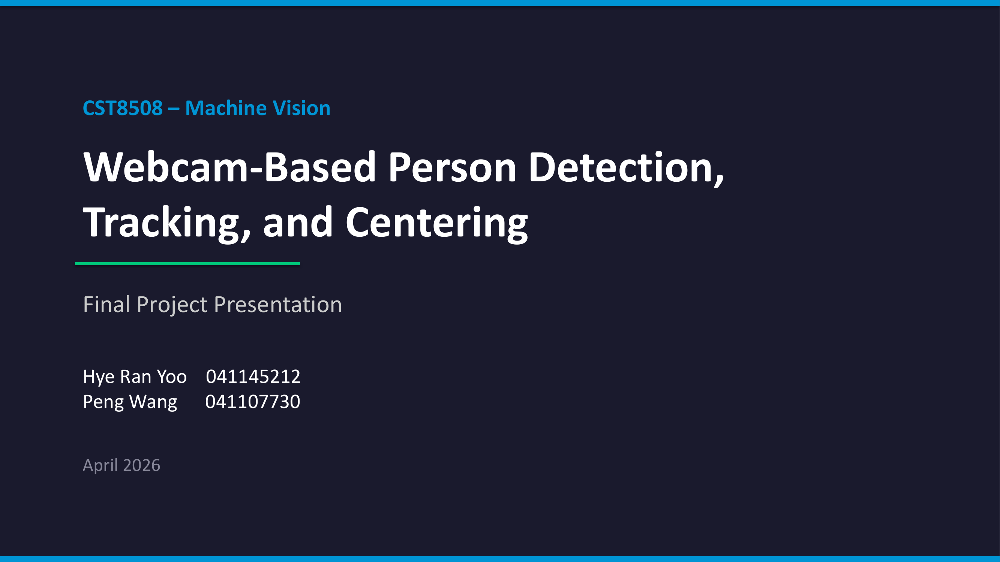

**CST8508 – Machine Vision — 机器视觉**

- Webcam-Based Person Detection, Tracking, and Centering — 基于网络摄像头的行人检测、跟踪与居中系统
- Final Project Presentation — 期末项目演示
- Hye Ran Yoo 041145212 — Hye Ran Yoo 041145212
- Peng Wang 041107730 — Peng Wang 041107730
- April 2026 — 2026年4月

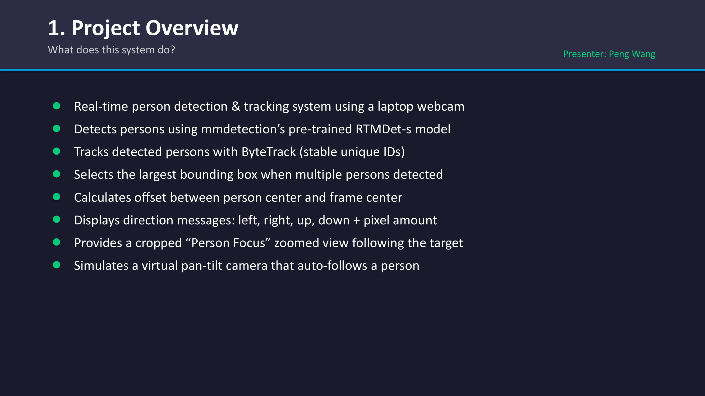

**What does this system do? — 该系统能做什么？**
Presenter: Peng Wang — 讲者: Peng Wang

- Real-time person detection & tracking system using a laptop webcam — 使用笔记本电脑网络摄像头的实时行人检测与跟踪系统
- Detects persons using mmdetection’s pre-trained **RTMDet-s** model — 使用 mmdetection 的预训练模型 **RTMDet-s** 进行行人检测
- Tracks detected persons with **ByteTrack** (stable unique IDs) — 使用 **ByteTrack** 跟踪检测到的行人（提供稳定的唯一ID）
- Selects the **largest bounding box** when multiple persons detected — 当检测到多个人时，选择**最大的边界框**
- Calculates offset between person center and frame center — 计算行人中心与画面中心之间的偏移量
- Displays direction messages: left, right, up, down + pixel amount — 显示方向信息：左、右、上、下及像素偏移量
- Provides a cropped “Person Focus” zoomed view following the target — 提供跟踪目标的“行人聚焦”裁剪放大视图
- Simulates a virtual pan-tilt camera that auto-follows a person — 模拟自动跟随行人的虚拟云台相机

> **📝 Notes:**
>
> **承接**: 本节作为开篇，介绍了项目的整体目标和核心功能；这些系统概述将为下一节「系统架构设计」提供功能需求背景。

---

## 2. 系统架构 (System Architecture)

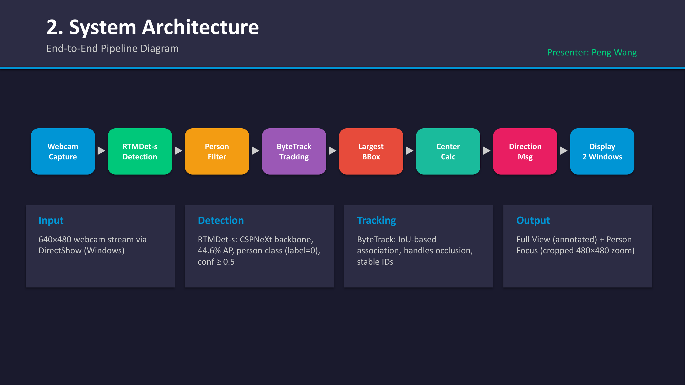

**End-to-End Pipeline Diagram — 端到端流水线图**
Presenter: Peng Wang — 讲者: Peng Wang

- Webcam Capture → RTMDet-s Detection → ByteTrack Tracking → Largest BBox Filter → Center Calc → Direction Msg → Display 2 Windows — 摄像头捕捉 → RTMDet-s检测 → ByteTrack跟踪 → 最大边界框过滤 → 中心计算 → 方向信息 → 双窗口显示
- Input: 640×480 webcam stream via DirectShow (Windows) — 输入：通过DirectShow (Windows) 的 640×480 摄像头视频流
- Detection: **RTMDet-s**: CSPNeXt backbone, 44.6% AP, person class (label=0), conf ≥ 0.5 — 检测：**RTMDet-s**：CSPNeXt 主干网络，44.6% AP，行人分类 (标签=0)，置信度 ≥ 0.5
  - *Backbone (主干网络)*: The core neural network structure responsible for extracting basic visual features from raw images; CSPNeXt ensures fast CPU performance. — *Backbone（主干网络）*：负责从原始图像中提取边缘特征等核心视觉信息的底层神经网络组建；CSPNeXt 设计保证了它在CPU上的极速表现。
- Tracking: **ByteTrack**: IoU-based association, handles occlusion, stable IDs — 跟踪：**ByteTrack**：基于 IoU 的关联，处理遮挡问题，提供稳定 IDs
- Output: Full View (annotated) + Person Focus (cropped 480×480 zoom) — 输出：完整视图（带标注） + 行人聚焦（裁剪的 480×480 放大视图）

> **📝 Notes:**
>
> **承接**: 上一节展示了系统的核心功能，本节将其拆解为端到端的处理流水线；这个理论框架将为下一节的具体「环境搭建」和「核心功能模块」提供蓝图指导。

---

## 3. 环境与配置 (Environment Setup & Configuration Management)

### 3.1 环境设置 (Environment Setup)

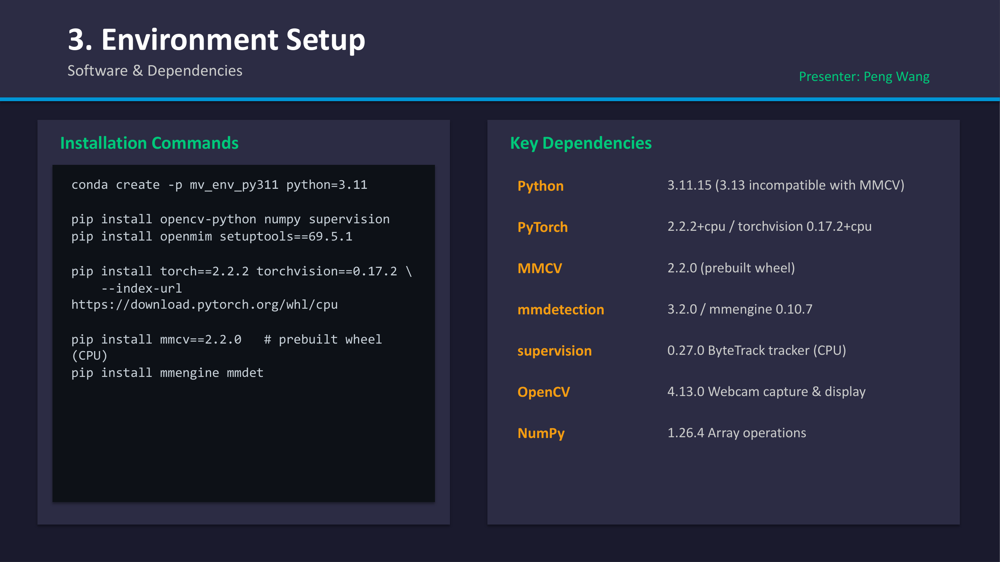

**Software & Dependencies — 软件与依赖库**
Presenter: Peng Wang — 讲者: Peng Wang

**Installation Commands — 安装命令**
```bash
conda create -p mv_env_py311 python=3.11
pip install opencv-python numpy supervision
pip install openmim setuptools==69.5.1
pip install torch==2.2.2 torchvision==0.17.2 --index-url https://download.pytorch.org/whl/cpu
pip install mmcv==2.2.0 # prebuilt wheel
pip install mmengine mmdet
```

**Key Dependencies — 核心依赖库**
- **Python 3.11.15** (3.13 incompatible with MMCV) — (3.13 与 MMCV 的 C++ 扩展不兼容)
- **PyTorch 2.2.2+cpu** / torchvision 0.17.2+cpu
- **MMCV 2.2.0** (prebuilt wheel) — (预编译的 wheel 安装包)
- **mmdetection 3.2.0** / mmengine 0.10.7
- **supervision 0.27.0** ByteTrack tracker (CPU) — ByteTrack 跟踪器 (CPU版)
- **OpenCV 4.13.0** Webcam capture & display — 用于摄像头捕捉和显示
- **NumPy 1.26.4** Array operations — 数组运算

### 3.2 配置管理 (Configuration Management)

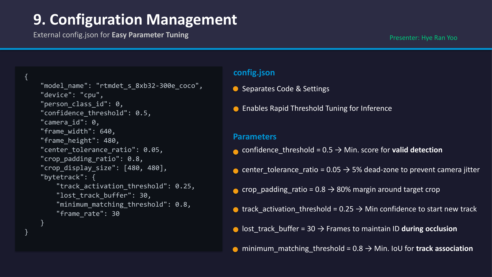

**External config.json for Easy Parameter Tuning — 用于便捷参数调优的外部 config.json 文件**
Presenter: Hye Ran Yoo — 讲者: Hye Ran Yoo

**config.json**
```json
{
  "model_name": "rtmdet_s_8xb32-300e_coco",
  "device": "cpu",
  "person_class_id": 0,
  "confidence_threshold": 0.5,
  "camera_id": 0,
  "frame_width": 640,
  "frame_height": 480,
  "center_tolerance_ratio": 0.05,
  "crop_padding_ratio": 0.8,
  "crop_display_size": [480, 480],
  "bytetrack": {
    "track_activation_threshold": 0.25,
    "lost_track_buffer": 30,
    "minimum_matching_threshold": 0.8,
    "frame_rate": 30
  }
}
```

**Separates Code & Settings / Enables Rapid Threshold Tuning for Inference — 分离代码与设置 / 支持推理阈值的快速调优**
- **confidence_threshold = 0.5** → Min. score for valid detection — 有效检测的最小得分阈值
- **center_tolerance_ratio = 0.05** → 5% dead-zone to prevent camera jitter — 5% 的盲区以防止镜头抖动
- **crop_padding_ratio = 0.8** → 80% margin around target crop — 目标裁剪周围的 80% 边距
- **track_activation_threshold = 0.25** → Min confidence to start new track — 开始新跟踪的最小置信度
- **lost_track_buffer = 30** → Frames to maintain ID during occlusion — 遮挡期间保持 ID 的帧数
- **minimum_matching_threshold = 0.8** → Min. IoU for track association — 跟踪关联的最小 IoU

> **📝 Notes:**
>
> **承接**: 在明确了架构之后，本节落实了项目的依赖库版本要求和 JSON 配置文件设计；这些具体的参数设定将主导下一节「检测模块与跟踪模块」中的模型初始化。

---

## 4. 核心组件 (Core Modules)

### 4.1 检测模块 (Detection Module – RTMDet-s)

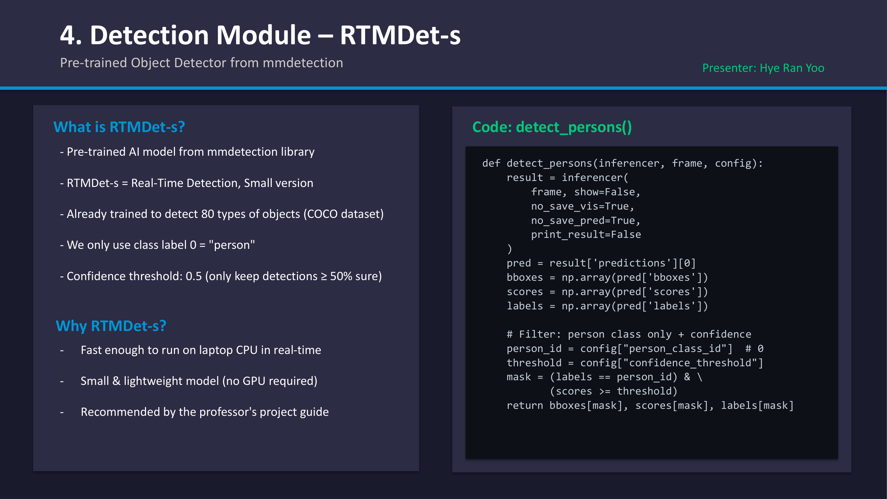

**Pre-trained Object Detector from mmdetection — mmdetection 的预训练目标检测器**
Presenter: Hye Ran Yoo — 讲者: Hye Ran Yoo

**What is RTMDet-s? — 什么是 RTMDet-s?**
- Pre-trained AI model from mmdetection library — 来自 mmdetection 库的预训练 AI 模型
- RTMDet-s = Real-Time Detection, Small version — 小型化实时检测版本
- Already trained to detect 80 types of objects (COCO dataset) — 已经过训练可检测 80 种目标 (COCO 数据集)
- We only use class label 0 = "person" — 我们仅使用分类标签 0 = "行人 (person)"
- Confidence threshold: 0.5 (only keep detections ≥ 50% sure) — 置信度阈值：0.5（仅保留确定性 ≥ 50% 的检测结果）

**Why RTMDet-s? — 为什么选择 RTMDet-s?**
- Fast enough to run on laptop CPU in real-time — 足够快，可在笔记本电脑 CPU 上实行实时运行
- Small & lightweight model (no GPU required) — 小型轻量化模型 (不需要 GPU)
- Recommended by the professor's project guide — 教授项目指南中的推荐模型

**Code: `detect_persons()` — 代码: 检测行人()**
```python
def detect_persons(inferencer, frame, config):
    result = inferencer(
        frame, show=False,
        no_save_vis=True,
        no_save_pred=True,
        print_result=False
    )
    pred = result['predictions'][0]
    bboxes = np.array(pred['bboxes'])
    scores = np.array(pred['scores'])
    labels = np.array(pred['labels'])

    # Filter: person class only + confidence
    person_id = config["person_class_id"] 
    threshold = config["confidence_threshold"]
    mask = (labels == person_id) & (scores >= threshold)
    return bboxes[mask], scores[mask], labels[mask]
```

### 4.2 跟踪模块 (Tracking Module – ByteTrack)

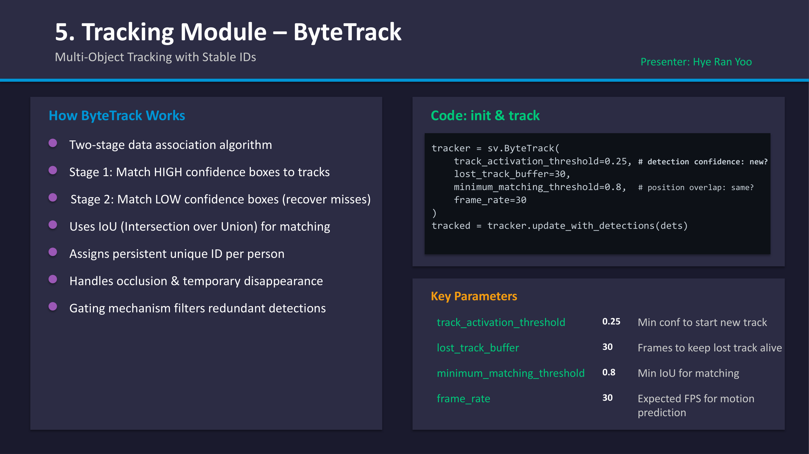

**Multi-Object Tracking with Stable IDs — 具有稳定 ID 的多目标跟踪**
Presenter: Hye Ran Yoo — 讲者: Hye Ran Yoo

**How ByteTrack Works — ByteTrack 的工作原理**
- Two-stage data association algorithm — 两阶段数据关联算法
  - **Stage 1**: Match HIGH confidence boxes to tracks — 第1阶段: 将高置信度框匹配到跟踪轨迹
  - **Stage 2**: Match LOW confidence boxes (recover misses) — 第2阶段: 匹配低置信度框 (恢复丢失的目标)
- Uses IoU (Intersection over Union) for matching — 使用 IoU (交并比) 进行匹配
  - *IoU (Intersection over Union)*: A metric measuring how much two bounding boxes overlap. High IoU between frames means it's likely the same person. — *IoU（交并比）*：衡量两个边界框重叠程度的指标。前后两帧的框重叠越多，越被指认为同一个人。
- Assigns persistent unique ID per person — 为每个人分配持久的唯一 ID
- Handles occlusion & temporary disappearance — 处理遮挡和目标短暂消失
- Gating mechanism filters redundant detections — 门控机制过滤冗余检测

**Key Parameters — 核心参数**
- `track_activation_threshold` **0.25**: Min conf to start new track — 开始新跟踪的最低置信度
- `lost_track_buffer` **30**: Frames to keep lost track alive — 保持丢失的跟踪轨迹存活的帧数
- `minimum_matching_threshold` **0.8**: Min IoU for matching — 匹配的最小 IoU
- `frame_rate` **30**: Expected FPS for motion prediction — 运动预测的预估 FPS

**Code: init & track — 代码: 初始化与跟踪**
```python
tracker = sv.ByteTrack(
    track_activation_threshold=0.25, # detection confidence: new?
    lost_track_buffer=30,
    minimum_matching_threshold=0.8, # position overlap: same?
    frame_rate=30
)
tracked = tracker.update_with_detections(dets)
```

> **📝 Notes:**
>
> **承接**: 上一节的配置文件为模型提供了运行参数，本节具体拆解了基于 RTMDet 的检测步骤和基于 ByteTrack 的追踪策略；成功追踪到人体后，下一节「最大目标选择与居中」将接管后续的处理逻辑。

---

## 5. 控制逻辑 (Control Logic)

### 5.1 最大候选框选择 (Largest Bounding Box Selection)

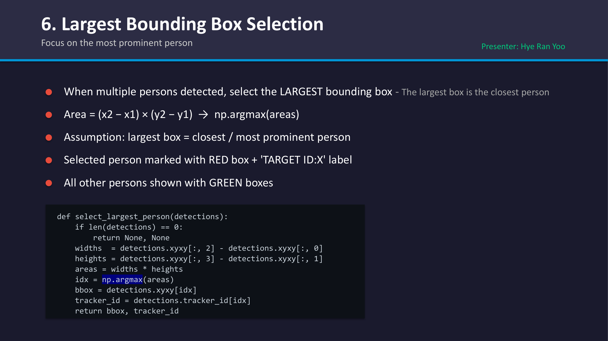

**Focus on the most prominent person — 聚焦最突出的人**
Presenter: Hye Ran Yoo — 讲者: Hye Ran Yoo

- When multiple persons detected, select the **LARGEST** bounding box — 当检测到多个人时，选择**最大**的边界框
- `Area = (x2 − x1) × (y2 − y1) → np.argmax(areas)` — 面积计算公式
- Assumption: largest box = closest / most prominent person — 假设前提：最大的框 = 最近 / 最突出的人
- Selected person marked with RED box + 'TARGET ID:X' label — 选中的人将用红框 + 'TARGET ID:X' 标签标记
- All other persons shown with GREEN boxes — 所有其他人用绿框显示

```python
def select_largest_person(detections):
    if len(detections) == 0:
        return None, None
    widths = detections.xyxy[:, 2] - detections.xyxy[:, 0]
    heights = detections.xyxy[:, 3] - detections.xyxy[:, 1]
    areas = widths * heights
    idx = np.argmax(areas)
    bbox = detections.xyxy[idx]
    tracker_id = detections.tracker_id[idx]
    return bbox, tracker_id
```

### 5.2 居中计算逻辑 (Camera Centering Logic)

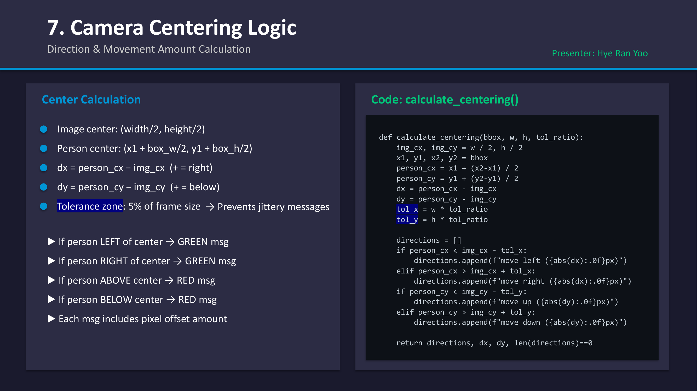

**Direction & Movement Amount Calculation — 方向与移动量计算**
Presenter: Hye Ran Yoo — 讲者: Hye Ran Yoo

**Center Calculation — 中心计算**
- Image center: `(width/2, height/2)` — 图像中心
- Person center: `(x1 + box_w/2, y1 + box_h/2)` — 行人中心
- `dx = person_cx − img_cx` (+ = right) — (+ 代表向右)
- `dy = person_cy − img_cy` (+ = below) — (+ 代表向下)
- Tolerance zone: 5% of frame size → Prevents jittery messages — 容差区域：画面尺寸的 5% → 防止抖动的消息提示

**Direction Logic — 方向逻辑**
- If person **LEFT** of center → GREEN msg (move left) — 位于中心左侧 → 绿色提示 (向左移)
- If person **RIGHT** of center → GREEN msg (move right) — 位于中心右侧 → 绿色提示 (向右移)
- If person **ABOVE** center → RED msg (move up) — 位于中心上方 → 红色提示 (向上移)
- If person **BELOW** center → RED msg (move down) — 位于中心下方 → 红色提示 (向下移)
- Each msg includes pixel offset amount — 每条信息包括像素偏移量

**Code: `calculate_centering()` — 代码: 计算居中()**
```python
def calculate_centering(bbox, w, h, tol_ratio):
    img_cx, img_cy = w / 2, h / 2
    x1, y1, x2, y2 = bbox
    person_cx = x1 + (x2-x1) / 2
    person_cy = y1 + (y2-y1) / 2

    dx = person_cx - img_cx
    dy = person_cy - img_cy

    tol_x = w * tol_ratio
    tol_y = h * tol_ratio

    directions = []
    if person_cx < img_cx - tol_x:
        directions.append(f"move left ({abs(dx):.0f}px)")
    elif person_cx > img_cx + tol_x:
        directions.append(f"move right ({abs(dx):.0f}px)")
    
    if person_cy < img_cy - tol_y:
        directions.append(f"move up ({abs(dy):.0f}px)")
    elif person_cy > img_cy + tol_y:
        directions.append(f"move down ({abs(dy):.0f}px)")

    return directions, dx, dy, len(directions)==0
```

### 5.3 虚拟云台跟进视图 (Crop & Center View)

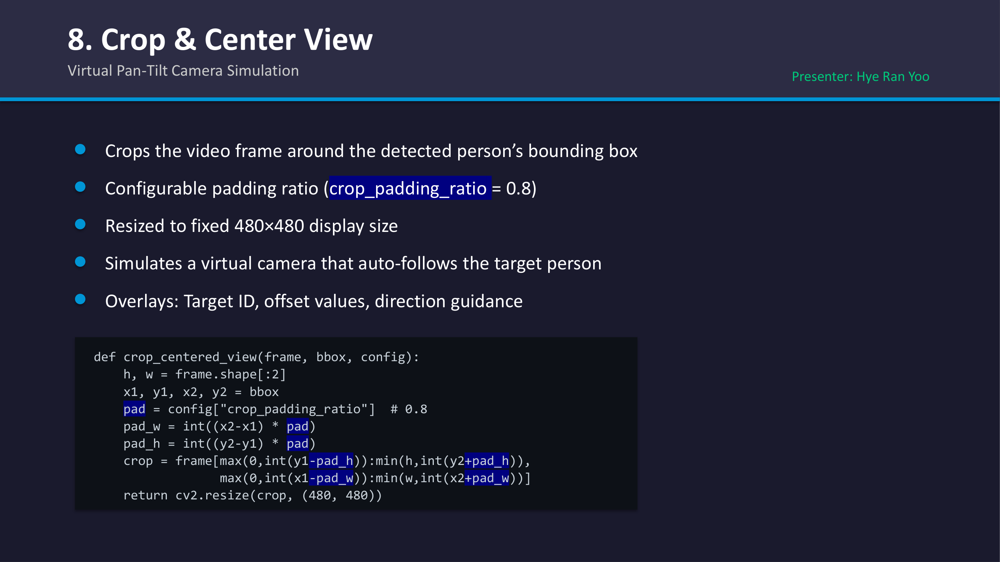

**Virtual Pan-Tilt Camera Simulation — 虚拟云台相机模拟**
Presenter: Hye Ran Yoo — 讲者: Hye Ran Yoo

- Crops the video frame around the detected person’s bounding box — 围绕检测到的行人边界框裁剪视频画面
- Configurable padding ratio (`crop_padding_ratio = 0.8`) — 可配置的边距比例
- Resized to fixed 480×480 display size — 调整为固定的 480x480 显示尺寸
- Simulates a virtual camera that auto-follows the target person — 模拟自动跟随目标行人的虚拟相机
  - *PTZ (Pan-Tilt-Zoom)*: Refers to physical camera hardware movement. This project uses "virtual" PTZ via software image cropping instead of physical motors. — *PTZ（云台平移/俯仰/缩放）*：指代外接相机的机械运动。本项目通过软件图像裁切实现了“虚拟”云台跟飞，而非使用物理伺服电机去驱动球机移动。
- Overlays: Target ID, offset values, direction guidance — 叠加层：目标ID、偏移量和方向指导

```python
def crop_centered_view(frame, bbox, config):
    h, w = frame.shape[:2]
    x1, y1, x2, y2 = bbox
    pad = config["crop_padding_ratio"] # 0.8
    pad_w = int((x2-x1) * pad)
    pad_h = int((y2-y1) * pad)
    crop = frame[max(0,int(y1-pad_h)):min(h,int(y2+pad_h)),
                 max(0,int(x1-pad_w)):min(w,int(x2+pad_w))]
    return cv2.resize(crop, (480, 480))
```

> **📝 Notes:**
>
> **承接**: 上一节探讨了如何识别和追踪图像中的人体目标，本节详述了如何从中挑选主要目标（Largest Box）并计算位移和生成动态视角；所有逻辑拼接完整后，下一节「主循环与结果展示」将呈现整个系统的运行效果。

---

## 6. 系统运行与展示 (System Execution and Results)

### 6.1 主循环逻辑 (Main Video Loop)

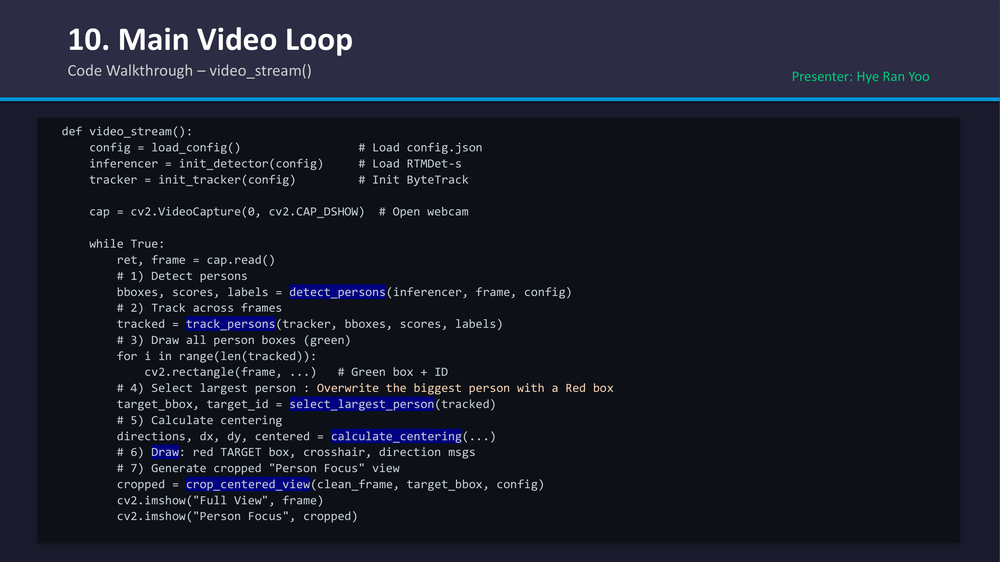

**Code Walkthrough – `video_stream()` — 代码走读: `video_stream()`**
Presenter: Hye Ran Yoo — 讲者: Hye Ran Yoo

```python
def video_stream():
    config = load_config() # Load config.json
    inferencer = init_detector(config) # Load RTMDet-s
    tracker = init_tracker(config) # Init ByteTrack
    cap = cv2.VideoCapture(0, cv2.CAP_DSHOW) # Open webcam

    while True:
        ret, frame = cap.read()
        # 1) Detect persons
        bboxes, scores, labels = detect_persons(inferencer, frame, config)
        # 2) Track across frames
        tracked = track_persons(tracker, bboxes, scores, labels)
        
        # 3) Draw all person boxes (green)
        for i in range(len(tracked)):
            cv2.rectangle(frame, ...) # Green box + ID
            
        # 4) Select largest person : Overwrite the biggest person with a Red box
        target_bbox, target_id = select_largest_person(tracked)
        
        # 5) Calculate centering
        directions, dx, dy, centered = calculate_centering(...)
        
        # 6) Draw: red TARGET box, crosshair, direction msgs
        # 7) Generate cropped "Person Focus" view
        cropped = crop_centered_view(clean_frame, target_bbox, config)
        
        cv2.imshow("Full View", frame)
        cv2.imshow("Person Focus", cropped)
```

### 6.2 实时演示 (Live Demo / Visual Annotations)

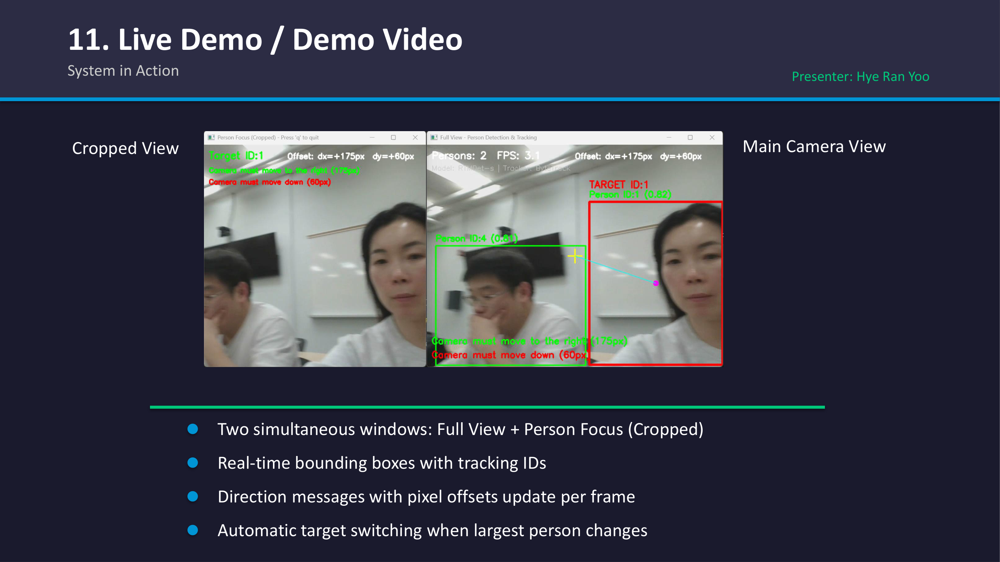

**System in Action — 系统运行演示**
Presenter: Hye Ran Yoo — 讲者: Hye Ran Yoo

- Two simultaneous windows: `Full View` + `Person Focus` (Cropped) — 双窗口同步显示：完整视图 + 行人聚焦(裁剪)
- Real-time bounding boxes with tracking IDs — 带跟踪 ID 的实时边界框
- Direction messages with pixel offsets update per frame — 带有每帧更新像素偏移量的方向说明信息
- Automatic target switching when largest person changes — 当最大目标发生变化时自动切换检测目标

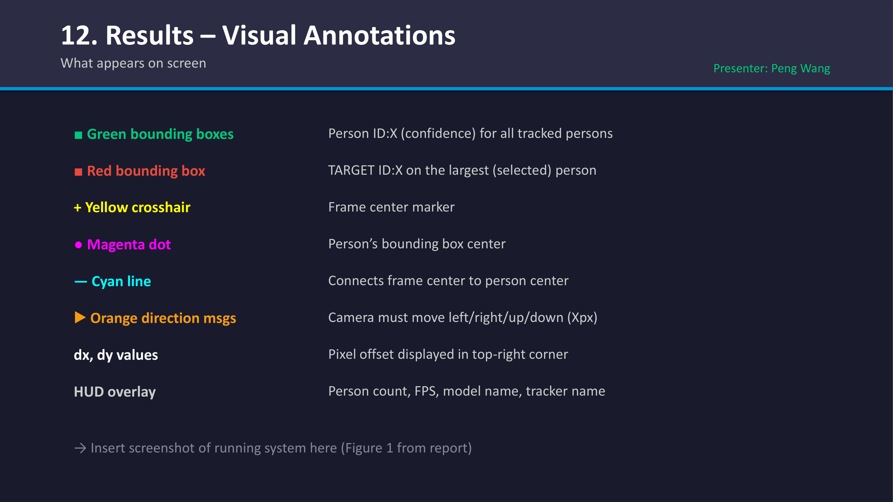

**What appears on screen (Results – Visual Annotations) — 屏幕显示内容 (结果与视觉标注)**
Presenter: Peng Wang — 讲者: Peng Wang

- 🟩 **Green bounding boxes**: `Person ID:X (confidence)` for all tracked persons — 绿框：所有被追踪行人的 `Person ID:X (置信度)`
- 🟥 **Red bounding box**: `TARGET ID:X` on the largest (selected) person — 红框：最大(选中)行人的 `TARGET ID:X`
- 🟨 **Yellow crosshair**: Frame center marker — 黄色十字：画面中心标记
- 🟪 **Magenta dot**: Person’s bounding box center — 洋红色圆点：行人边界框中心
- 🟦 **Cyan line**: Connects frame center to person center — 青色连线：连接画面中心和行人中心
- 🟧 **Orange direction msgs**: Camera must move left/right/up/down (Xpx) — 橙色方向信息：提醒相机需要左/右/上/下移 (Xpx)
- **HUD overlay**: Person count, FPS, model name, tracker name, and dx, dy values (Pixel offset displayed in top-right corner) — HUD叠加显示：总人数、FPS、模型名称、追踪器名称以及dx/dy偏移量(显示在右上角)

> **📝 Notes:**
>
> **承接**: 前面章节解析了所有的实现代码和处理逻辑，本节展示了实机运行的主循环全貌以及丰富的 HUD 信息叠加；在看到系统成功运行后，下一节「项目总结与评估」将反思开发过程中的挑战和经验。

---

## 7. 总结与评估 (Conclusions and Evaluation)

### 7.1 技术栈梳理 (Tech Stack)

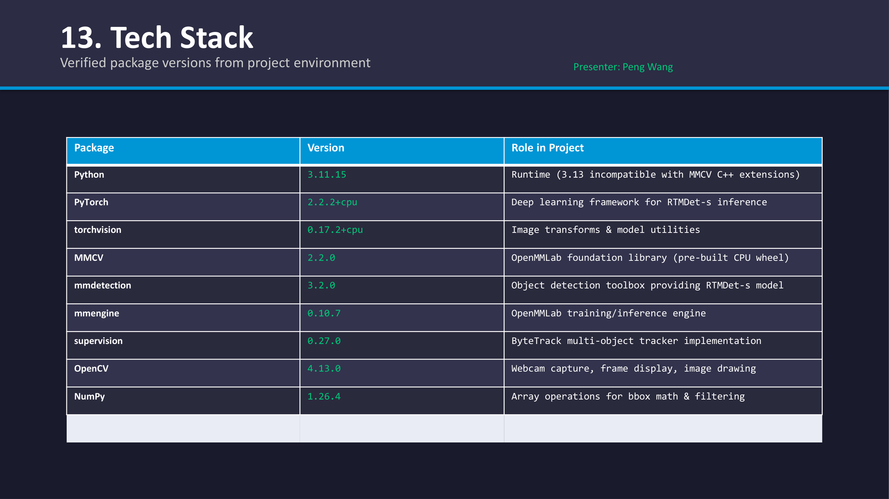

**Verified package versions from project environment — 项目环境已验证包版本**
Presenter: Peng Wang — 讲者: Peng Wang

| Package | Version | Role in Project | Role (中文) |
|---------|---------|-----------------|-------------|
| Python | 3.11.15 | Runtime (3.13 incompatible with MMCV C++ extensions) | 运行环境（3.13无法兼容 MMCV C++ 扩展）|
| PyTorch | 2.2.2+cpu | Deep learning framework for RTMDet-s inference | 用于 RTMDet-s 推理的深度学习框架 |
| torchvision | 0.17.2+cpu | Image transforms & model utilities | 图像变换和模型工具 |
| MMCV | 2.2.0 | OpenMMLab foundation library (pre-built CPU wheel) | OpenMMLab 基础库（预编译 CPU wheel 包）|
| mmdetection | 3.2.0 | Object detection toolbox providing RTMDet-s model | 提供 RTMDet-s 模型的目标检测工具箱 |
| mmengine | 0.10.7 | OpenMMLab training/inference engine | OpenMMLab 训练/推理引擎 |
| supervision | 0.27.0 | ByteTrack multi-object tracker implementation | ByteTrack 多目标跟踪器实现 |
| OpenCV | 4.13.0 | Webcam capture, frame display, image drawing | 摄像头捕捉、画面展示和图像绘制 |
| NumPy | 1.26.4 | Array operations for bbox math & filtering | 用于边界框数学计算和过滤的数组操作 |

### 7.2 挑战与反思 (Challenges & Lessons Learned)

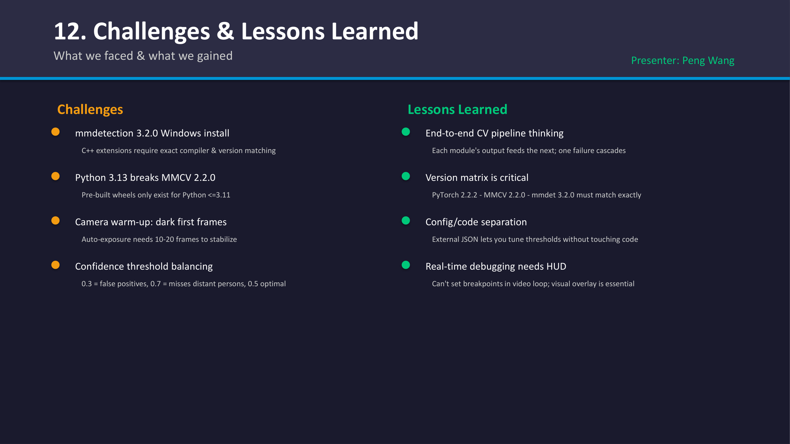

**What we faced & what we gained — 我们面临的挑战与收获**
Presenter: Peng Wang — 讲者: Peng Wang

**Challenges — 挑战**
- **mmdetection 3.2.0 Windows install**: C++ extensions require exact compiler & version matching — C++ 扩展需要完全匹配的编译器和版本
- **Python 3.13 breaks MMCV 2.2.0**: Pre-built wheels only exist for Python <=3.11 — 预编译版(Wheels)只存在于 Python <=3.11 环境
- **Camera warm-up**: dark first frames, Auto-exposure needs 10-20 frames to stabilize — 摄像头预热：前几帧画面较暗，自动曝光需要 10-20 帧来稳定
- **Confidence threshold balancing**: 0.3 = false positives, 0.7 = misses distant persons, 0.5 optimal — 0.3(过低)=假阳性，0.7(过高)=漏掉远处的行人，0.5即为最优取值

**Lessons Learned — 经验教训**
- **End-to-end CV pipeline thinking**: Each module's output feeds the next; one failure cascades — 端到端机器视觉开发思维：每个模块输出喂给下一个，一环失效导致全盘失效
- **Version matrix is critical**: PyTorch 2.2.2 + MMCV 2.2.0 + mmdet 3.2.0 must match exactly — 版本矩阵至关重要：框架各版本需精准匹配
- **Config/code separation**: External JSON lets you tune thresholds without touching code — 配置文件分离：外部 JSON 实现阈值的免修改代码调优
- **Real-time debugging needs HUD**: Can't set breakpoints in video loop; visual overlay is essential — 实时调试需要 HUD 辅助：视频循环无法设置断点，因此视觉覆盖不可或缺
  - *HUD (Head-Up Display)*: Drawing real-time variables directly onto the video frame to avoid video freezes from breakpoints or unreadable console spam. — *HUD（平视显示/抬显）*：将实时变量直接绘制叠加在视频画面上，以避免打断点导致的视频流卡死或终端输出刷屏。

### 7.3 系统评估 (Evaluation)

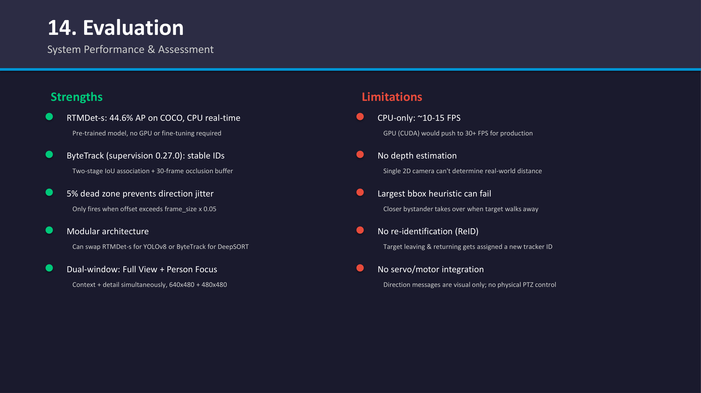

**System Performance & Assessment — 系统性能及评估**

**Strengths: — 优势：**
- **RTMDet-s**: 44.6% AP on COCO, CPU real-time. Pre-trained model, no GPU or fine-tuning required. — 在COCO数据集44.6%的AP分数，CPU可实时运算。预训练模型，不仅不需要GPU，而且不需要微调。
  - *COCO (Common Objects in Context)*: A major visual database used as the standard benchmark for object detection. — *COCO*：计算机视觉界最权威的大型开源图像数据库和“考卷”，包含80类日常目标的标准测试。
  - *AP (Average Precision)*: The score assessing detection accuracy (combining precision and recall); >40% is considered excellent. — *AP（平均精度）*：综合查准率和查全率的严苛大考评分，得分能达到 40% 以上已经代表极其强大的检测能力。
- **ByteTrack (supervision 0.27.0)**: stable IDs. Two-stage IoU association + 30-frame occlusion buffer. — 提供稳定的ID追踪。两阶段IoU关联算法+30帧的遮挡缓冲机制。
  - *Occlusion Buffer (遮挡缓冲)*: Retains a person's ID for 30 frames even if they are temporarily blocked by an obstacle, preventing them from being treated as a "new" person when they reappear. — *遮挡缓冲*：在目标被树木或异物短暂遮挡时（最高容忍30帧）强行保留其身份ID卡，防止其重新出现时被误当做“新目标”。
- **5% dead zone prevents direction jitter**: Only fires when offset exceeds frame_size x 0.05. — 5%大小的死区防止了方向判定抖动：只有偏移超出画面规模的0.05倍时才触发提示。
  - *Dead Zone (防抖死区)*: An invisible center boundary where minor AI box fluctuations won't trigger movement alarms, preventing the system from continuously stuttering left and right. — *防抖死区*：在画面中心划定的一块隐形安全区，人的稍微偏移或AI画框的噪点“呼吸”均会被系统无视，从而彻底杜绝方向指令像帕金森一样疯狂左右横跳。
- **Modular architecture**: Can swap RTMDet-s for YOLOv8 or ByteTrack for DeepSORT. — 模块化架构：允许将RTMDet-s替换为YOLOv8，或将ByteTrack替换为DeepSORT。
  - *Decoupled Design (解耦设计)*: The detection and tracking stages are independent. Replacing one engine doesn't break the rest of the pipeline. — *解耦架构*：由于检测和追踪并非强行捆绑，这种“插拔式”架构意味着即使日后更换性能更强大的检测器引擎，下方的判定逻辑也无需推倒重来。
- **Dual-window**: Full View + Person Focus. Context + detail simultaneously, 640x480 + 480x480. — 采用双窗口设计：包含整体视图+行人焦点。全局上下文和局部细节同时显示。
  - *Context + Detail (宏观感知与局部特写)*: The global window ensures situational awareness (knowing where others are), while the cropped window provides an uninterrupted target close-up. — *全局与聚焦*：全局画面如同“上帝视角”，能把控环境中所有人的态势；而独立跳出的裁切小窗口则相当于“导播室特写”，全程死锁主角。

**Limitations: — 局限性：**
- **CPU-only:** ~10-15 FPS. GPU (CUDA) would push to 30+ FPS for production. — 仅支持CPU运算下的帧率仅为~10-15 FPS，GPU算力将在真实生产环境中支撑起30以上的FPS。
  - *FPS Bottleneck (帧率硬件瓶颈)*: Visual algorithms heavily rely on parallel computing. CPUs process sequentially, capping the frame rate. Adding a dedicated NVIDIA GPU (CUDA) is the standard industry cure for sluggish performance. — *算力瓶颈*：视觉任务需要极高的并发计算，笔记本CPU的线性串行指令最终导致了画面粘滞。在企业实战中，挂载英伟达GPU（CUDA加速）是突破帧率上限的唯一解。
- **No depth estimation:** Single 2D camera can't determine real-world distance. — 缺乏深度估测：单一2D相机无法测量真实物理世界中的实际距离。
  - *2D vs 3D Dimensional Blindness (维度盲区)*: A single webcam acts like one eye, lacking the stereoscopic vision or LiDAR to comprehend spatial depth. — *维度降维打击*：单个普通摄像头等同于“独眼”，它缺乏如双目测距或激光雷达那样的立体三维（3D）纵深空间感知力，系统根本不知道人离它具体有几米远。
- **Largest bbox heuristic can fail:** Closer bystander takes over when target walks away. — 最大边界框判定逻辑可能失效：如果追踪目标走远了，近侧路人便会抢占最大目标检测框的位置。
  - *Heuristic Failure (启发式策略失效)*: We equate "largest box" to "primary target." This crude logic breaks abruptly if a random uninteresting person walks immediately in front of the lens. — *启发式逻辑硬伤*：我们过于简单粗暴地将“画面的框最大”等同于“当前主角”。如果此时有无聊的路人紧贴着镜头走过，系统会瞬间将其误判为最大目标从而叛逃锁定。
- **No re-identification (ReID):** Target leaving & returning gets assigned a new tracker ID. — 缺乏重新识别特征：目标先离开再回归后会被分配一个新的追踪ID。
  - *ReID (Re-Identification)*: Advanced feature matching (e.g., memorizing clothing/faces) across time. Without it, the system only relies on continuous positional tracking. — *ReID（行人重识别）*：跨越时间维度去记忆目标外观（如衣物/面部特征）的独立高级技术。因为没有它兜底，系统只能依靠短暂连续的位置重叠（IoU）来认人，一旦目标走出画面再回来便会身份重置。
- **No servo/motor integration:** Direction messages are visual only; no physical PTZ control. — 缺乏电机/伺服机制整合：目前的方向信息仍然只停留在视觉效果上，而并非通过真实的物理手段完成控制。


**Questions & Answers — 问答环节**
- Thank you for your attention! — 感谢倾听！
- Hye Ran Yoo 041145212 | Peng Wang 041107730 — Hye Ran Yoo 041145212 | Peng Wang 041107730
- CST8508 – Machine Vision | April 2026 — CST8508 – 机器视觉 | 2026年4月

> **📝 Notes:**
>
> **承接**: 前面的讨论涵盖了架构设计和运行结果，本节的总结则从工程实践的角度审视了系统的性能瓶颈和改进空间，为未来的机器视觉项目指明了更完善的演进方向。

---
