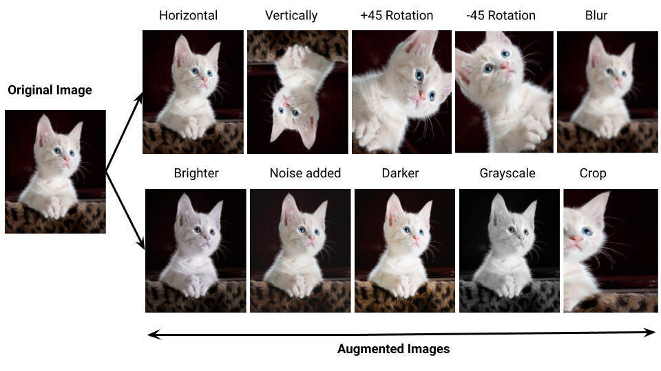
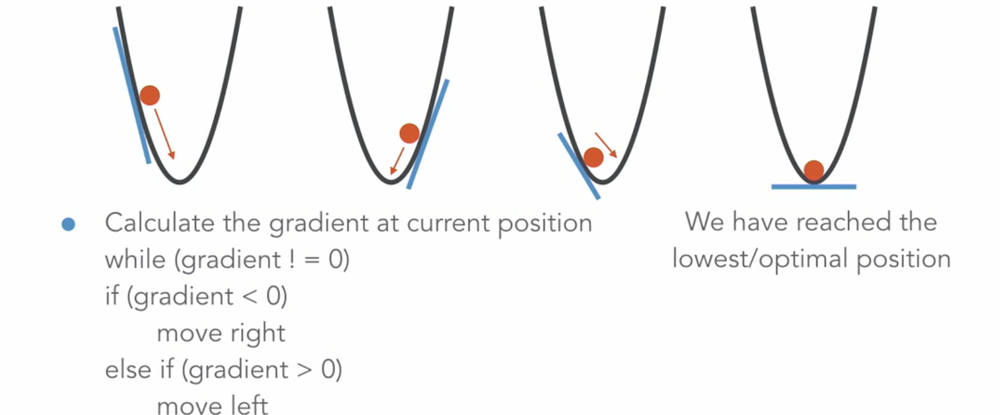
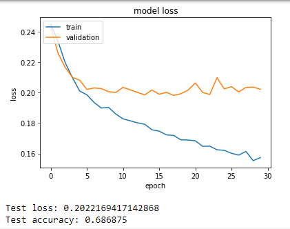

# CST8508 Machine Vision — Midterm Review Notes 期中复习笔记

> **考试信息 / Exam Info:**
> - 📅 Date: Feb 19, 2026, 7:00 PM – 8:00 PM
> - ⏱ Duration: 60 min | Total Marks: 25 | Weight: 15%
> - 📝 Format: MCQ + Fill in the blanks + Short answer + Mathematical questions
> - ✅ Calculators allowed | ❌ No electronic devices
> - 📖 Scope: Weeks 1–5

---

## Table of Contents

1. [Week 1: Introduction to Machine Vision](#week-1-introduction-to-machine-vision)
2. [Week 2: Image Processing Fundamentals](#week-2-image-processing-fundamentals)
3. [Week 3: Feature Detection & Description](#week-3-feature-detection--description)
4. [Week 4: Convolutional Neural Networks (CNNs)](#week-4-convolutional-neural-networks-cnns)
5. [Week 5: Deep Learning for Image Classification](#week-5-deep-learning-for-image-classification)
6. [Cross-Topic: DL vs Traditional CV](#cross-topic-dl-vs-traditional-cv)
7. [Key Formulas & Calculations](#key-formulas--calculations)
8. [Lab Practical Highlights](#lab-practical-highlights)
9. [Quiz Review (Past Questions)](#quiz-review-past-questions)

---

## Week 1: Introduction to Machine Vision

> 📖 Sources: Slides, CV Applications paper

### 1.1 What is Machine Vision? 什么是机器视觉？

Machine Vision (MV) 是一种使机器能够**解释和理解**来自周围环境的视觉信息的技术。

**核心定义：** Imaging-based automatic inspection and analysis（基于成像的自动检测与分析）

> ⚠️ **考点 (Quiz Q1):** MV 的主要用途是 "Imaging-based automatic inspection and analysis"，不是游戏开发或网页设计。

### 1.2 Machine Vision Workflow 机器视觉工作流程

```
Image Acquisition → Image Processing → Interpretation/Action
  (图像采集)        (图像处理/分析)      (解释/决策执行)
```

> ⚠️ **考点 (Quiz Q3):** 负责分析和操作图像的阶段是 **Image Processing**。

- **Image Acquisition 图像采集:** Capturing images using cameras/sensors (CCD, CMOS sensors)
- **Image Processing 图像处理:** Analyzing and manipulating images (filtering, edge detection, etc.)
- **Interpretation/Action 解释/动作:** Making decisions based on processed images

### 1.3 Key Technologies 核心技术

| 技术 | 说明 |
|------|------|
| Image Sensors (CCD/CMOS) | 图像传感器，负责将光信号转换为数字信号 |
| Image Processing | 滤波、边缘检测等图像处理技术 |
| Machine Learning / Deep Learning | 用于模式识别、分类等高级视觉任务 |
| OpenCV | 开源计算机视觉库，Python 接口 |
| PyTorch | 深度学习框架 |

### 1.4 Applications 应用领域

来自 slides + CV Applications paper:

| 应用领域 | 具体例子 |
|----------|----------|
| **Manufacturing 制造业** | Quality inspection 质量检测, assembly line 流水线检查 |
| **Autonomous Vehicles 自动驾驶** | Lane keeping, obstacle detection, 3D mapping |
| **Medical Imaging 医学影像** | Diagnostics 诊断, surgical assistance 手术辅助 |
| **Retail 零售** | Barcode scanning, inventory management |
| **Agriculture 农业** | Drone-based crop inspection, water level detection |
| **Security 安全** | Face ID, surveillance, social distancing detection |
| **E-commerce 电商** | Product classification, virtual try-on |

### 1.5 What is a Pixel? 像素是什么？

- **Pixel** = Picture Element，图像的最小单元
- 位于 (x, y) 坐标处的数值表示
- **Grayscale 灰度图:** 单个值 (0=黑, 255=白)
- **Color 彩色图:** RGB 三元组 (Red, Green, Blue)

### 1.6 Image Types 图像类型

| 类型 | 说明 |
|------|------|
| Binary Image 二值图 | 只有 0 和 1 (黑白) |
| Grayscale 灰度图 | 256 级灰度 (0-255) |
| 8-bit Color | 256 色 |
| 16-bit Color (RGB) | 65,536 色, 分为 R/G/B 通道 |

---

## Week 2: Image Processing Fundamentals

> 📖 Sources: Slides, resources/week2.md

### 2.1 Image Filtering 图像滤波

滤波是通过**卷积核 (kernel)** 对图像进行处理的过程。

#### Image Blurring 图像模糊（平滑）

> ⚠️ **考点 (Quiz Q8):** 使图像平滑的滤波类型是 **Image Blurring**。

- **目的:** 降噪 (noise reduction)、平滑图像
- **方法:** 通过对邻域像素取平均值实现
- **常见类型:**
  - **Average Blur 均值模糊:** 简单平均
  - **Gaussian Blur 高斯模糊:** 使用高斯权重，中心像素权重更高
  - **Median Blur 中值模糊:** 取中值，适合椒盐噪声

#### Image Sharpening 图像锐化

- **目的:** 增强边缘和细节
- **原理:** 突出像素值的变化（梯度）

### 2.2 Edge Detection 边缘检测

#### Canny Edge Detection Canny 边缘检测

> 📷 Canny 边缘检测效果示例 (Week 2 Slide 12):


> **图注：** 左侧为原始灰度图（cameraman），右侧为 Canny 检测结果。可以看到 Canny 生成了清晰且单像素宽的边缘线，人物轮廓、三脚架和背景建筑的边缘都被准确提取出来，同时抑制了噪声。这是 5 步流程（降噪→梯度→非极大值抑制→双阈值→滞后跟踪）的最终效果。

> ⚠️ **考点 (Quiz Q5):** Canny 边缘检测包含的阶段：**All of the above**（全部）

**步骤 Steps:**

```
1. Noise Reduction   → 高斯模糊降噪
2. Gradient Calculation → 计算图像梯度（方向和幅度）
3. Non-Maximum Suppression → 非极大值抑制，细化边缘
4. Double Thresholding → 双阈值分类（强/弱/非边缘）
5. Edge Tracking by Hysteresis → 滞后边缘跟踪
```

> ⚠️ **考点 (Quiz Q6):** 使用两个阈值(高和低)将边缘分为强、弱和非边缘的阶段是 **Double Thresholding**。

```python
# OpenCV Canny 示例
edges = cv2.Canny(image, threshold1=100, threshold2=200)
```

### 2.3 Image Histograms 图像直方图

> ⚠️ **考点 (Quiz Q4, Q7):**
> - 显示图像中特定亮度级别有多少像素的图表 = **Image Histogram**
> - 直方图的水平轴 = **Different brightness levels**（不同亮度级别）

> 📷 直方图示例 — X=亮度级别, Y=像素数量 (Week 2 Slide 15):


> **图注：** 水平轴 X 表示像素亮度级别（从左 0=纯黑 到右 255=纯白），垂直轴 Y 表示该亮度级别对应的像素数量。柱子越高代表该亮度出现的像素越多。此直方图呈现右偏分布，说明大部分像素集中在中高亮度区域。考试要记住：**X 轴 = brightness levels（不是 pixel count）**。

- **X-axis 水平轴:** Brightness/intensity levels（亮度级别, 0–255）
- **Y-axis 垂直轴:** Number/count of pixels（像素数量）
- **Left region 左侧:** 较暗像素的数量 | **Right region 右侧:** 较亮像素的数量
- **Bins 分段:** 可以将 0–255 范围分成子区间（bins），每个 bin 统计该范围内的像素数
- **用途:** 理解图像的亮度分布，辅助阈值选择，判断图像是偏暗、偏亮还是均衡

> 📷 直方图 + 阈值处理 完整流程图 (Week 2 Slide 17 — Original → Histogram → Thresholded):


> **图注：** 三步流程：① **Original** 原始灰度图 → ② **Histogram** 计算亮度分布直方图，红色竖线标记阈值 threshold 位置 → ③ **Thresholded** 以该阈值将图像转为黑白二值图（亮度 > threshold 为白，否则为黑）。这是 Binary Thresholding 的典型应用，直方图帮助选择合适的阈值位置。

### 2.4 Image Thresholding 图像阈值处理

将灰度图像转换为二值图像的过程。

| 类型 | 说明 | 适用场景 |
|------|------|----------|
| **Binary Thresholding** | 固定阈值，大于阈值=白，小于=黑 | 光照均匀的简单场景 |
| **Adaptive Thresholding** | 局部计算阈值 | ⚠️ **不均匀光照** |
| **Otsu's Thresholding** | 自动选择最优阈值 | 双峰分布 |

> ⚠️ **考点 (Quiz Q10):** 处理不均匀光照的阈值技术 = **Adaptive Thresholding**

### 2.5 Morphological Operations 形态学操作

> ⚠️ **考点 (Quiz Q2):** 形态学操作用于 **Processing images based on shapes**（基于形状处理图像）

| 操作 | 英文 | 效果 |
|------|------|------|
| 腐蚀 | Erosion | 缩小前景对象，去除噪点 |
| 膨胀 | Dilation | 扩大前景对象，填充小孔 |
| 开运算 | Opening | 先腐蚀后膨胀，去除小噪点 |
| 闭运算 | Closing | 先膨胀后腐蚀，填补小孔 |

> 📷 Erosion vs Dilation 效果对比 (Week 2 Slide 21):

| Erosion（腐蚀后噪点被去除） | Dilation（膨胀后前景扩大） |
|:---:|:---:|
|  |  |

> **图注：** 两图对比同一个白色字母「j」在二值图上的形态学效果。**左图 Erosion（腐蚀）：** 前景白色区域被收缩，字母笔画变细，散落的小白点噪声被完全消除。**右图 Dilation（膨胀）：** 前景白色区域被扩展，字母笔画变粗，细小间隙被填补。记住：**Erosion = 所有像素为1才保留（消噪），Dilation = 至少一个像素为1就扩展（填孔）**。

**像素级规则 (from slides):**
- **Erosion:** Kernel 滑过图像，只有当 kernel 下**所有像素都为 1** 时，输出才为 1，否则腐蚀为 0 → 边界像素被丢弃，前景缩小
- **Dilation:** Kernel 滑过图像，只要 kernel 下**至少一个像素为 1**，输出就为 1 → 前景扩大
- **Opening:** 先腐蚀去噪 → 再膨胀恢复对象大小（噪点不会恢复）
- **Closing:** 先膨胀填孔 → 再腐蚀恢复大小（孔不会再出现）
- **应用:** Medical Imaging, Robotics, Document Processing, Fingerprint Recognition

### 2.6 Image Transformations 图像变换

**Affine Transformation 仿射变换** (from slides): `y = Ax + b`
- **A:** 线性变换矩阵（旋转、缩放、剪切）
- **b:** 平移向量
- 保持**直线和平行线**不变

| 变换 | 英文 | 说明 |
|------|------|------|
| 平移 | Translation | 在 x/y 方向移动图像 |
| 旋转 | Rotation | 围绕指定点旋转图像 |
| 缩放 | Scaling | 改变图像大小 |
| 剪切 | Shearing | 沿 x/y 轴倾斜图像 |

### 2.7 Digital Image Fundamentals (from week2.md)

- **Image 图像:** 二维函数 F(x,y)，(x,y) 是空间坐标，F 的值是该点的强度
- **Digital Image 数字图像:** x, y 和 F 的值都是有限的
- 图像可以表示为**矩阵 (Matrix)**，每个元素是一个像素值

---

## Week 3: Feature Detection & Description

> 📖 Sources: Slides

### 3.1 Segmentation & Binary Images

> ⚠️ **考点 (Quiz Q9):** 分割的输出通常是 **Binary Image**（二值图像）

- **Segmentation 图像分割:** 将图像分成有意义的区域/对象
- 输出是 Binary Image：前景(对象) vs 背景

### 3.2 Contours 轮廓

- **轮廓:** 连接具有相同颜色/强度的所有连续点的曲线，形成**封闭路径**
- 与 edge detection 的区别：轮廓要求边缘必须形成**封闭路径 (closed path)**
- 用于形状分析 (shape analysis)、对象检测和识别
- Binary image (from segmentation) 是 contour detection 的输入（预处理）

```python
# OpenCV 轮廓操作
# findContours 返回: contours(轮廓列表) + hierarchy(父子关系)
contours, hierarchy = cv2.findContours(binary, cv2.RETR_TREE, cv2.CHAIN_APPROX_SIMPLE)
# drawContours: thickness >= 0 画轮廓线, thickness < 0 填充轮廓内部
cv2.drawContours(image, contours, -1, (0,255,0), 3)
```

> ⚠️ **考点 (Quiz Q11):** 绘制轮廓的 OpenCV 命令 = `cv2.drawContours()`

### 3.3 Image Gradients 图像梯度

- **梯度:** 测量图像函数 F(x,y) 在 X 或 Y 方向上的**变化量**
- **Magnitude 幅度:** 变化的大小（用颜色变化表示）
- **Direction 方向:** 变化的方向（用箭头表示）
- 是所有特征检测算法的基础

> 📷 图像梯度可视化 — 蓝色箭头表示梯度方向 (Week 3 Slide 14):


> **图注：** 蓝色箭头表示每个位置的梯度方向（指向亮度变化最快的方向），箭头长度表示梯度幅度（变化越大箭头越长）。**左图：** 中心有一个暗点的图像，梯度方向从亮向暗（向中心辐射聚拢）。**右图：** 左暗右亮的水平渐变，梯度全部指向左方（从亮到暗的方向）。梯度是边缘检测（Canny、Sobel等）和特征检测（SIFT、Harris等）的数学基础。

### 3.4 Feature Detection Algorithms 特征检测算法

#### SIFT (Scale-Invariant Feature Transform)

不变性: **缩放(scale)、旋转(rotation)**，部分不变于光照变化

**5 个步骤:**
1. **Scale-space Extrema Detection 尺度空间极值检测:** 使用 DoG (Difference of Gaussian) 在多个尺度上寻找关键点
2. **Keypoint Localization 关键点定位:** 精化关键点，消除低对比度点和边缘点
3. **Orientation Assignment 方向分配:** 基于局部梯度方向分配主方向 → **旋转不变性**
4. **Descriptor Generation 描述符生成:** 关键点区域 → 4×4 子块 → 梯度直方图 → **128维特征向量**
5. **Feature Matching 特征匹配:** 使用欧氏距离比较描述符

#### SURF (Speeded Up Robust Features)

- SIFT 的**更快替代方案**，对 scale, rotation, illumination 鲁棒
- 使用 **Hessian 矩阵** 检测关键点（比 SIFT 的 DoG 更快）
- 使用 **积分图 (integral images)** + **box filters** 加速卷积运算
- 方向分配: 计算圆形区域内的 **Haar 小波响应 (Haar wavelet responses)**
- 4×4 子区域 → 每个子区域计算 x/y 方向 Haar 小波响应总和 → **64维描述符**
- 适合**实时应用**

#### ORB (Oriented FAST and Rotated BRIEF)

> ⚠️ **考点 (Quiz Q12):** ORB = **FAST** keypoint detector + **BRIEF** descriptor

- **FAST:** 快速角点检测器（keypoint detector）
- **BRIEF:** 二进制描述符（descriptor）
- 优势: 开源、快速、适合资源有限的环境

#### Feature Algorithms Comparison 对比

| 特征 | SIFT | SURF | ORB |
|------|------|------|-----|
| 速度 | 慢 | 中等 | **最快** |
| 描述符维度 | 128-D | 64-D | 32 bytes (binary) |
| 不变性 | Scale + Rotation | Scale + Rotation | Rotation |
| 专利 | Yes (expired) | Yes | **No (free)** |
| 适用场景 | 精确匹配 | 实时+精确 | 实时/嵌入式 |

### 3.5 HOG (Histogram of Oriented Gradients)

> ⚠️ **考点 (Quiz Q13):** 有效用于**人体检测 (human detection)** 的技术 = **HOG**

- 捕捉梯度方向模式，匹配人体结构
- 常与 SVM (Support Vector Machine) 结合用于行人检测
- 工作流程: 图像 → 灰度 → 计算梯度 → 划分cell → 构建直方图 → 归一化 → 特征向量

### 3.6 Machine Learning in Feature Detection

来自 slides (Week 3 Slide 25):

| ML 类型 | 英文 | 说明 | 例子 |
|--------|------|------|------|
| 监督学习 | Supervised Learning | 使用标注数据训练 | Email Spam Detection |
| 无监督学习 | Unsupervised Learning | 无标注数据，发现模式 | Customer Segmentation |
| 半监督学习 | Semi-supervised | 结合两者 | Google Photos |

### 3.7 Real-Time Feature Detection Challenges

- 平衡**计算速度**与**准确度**是核心挑战
- 解决方案: Algorithm optimization, 低级语言 (C/C++), **GPU/TPU 硬件加速**
- 未来趋势: Deep Learning 替代手工特征，确能自动、准确地检测特征

---

## Week 4: Convolutional Neural Networks (CNNs)

> 📖 Sources: Slides, DL vs Traditional CV paper

### 4.1 Artificial Neural Networks (ANNs) 人工神经网络

- 灵感来自人脑的结构和功能
- 由互连的节点(neurons 神经元)组成
- 通过分析大量数据进行学习，擅长识别复杂模式

**ANN 用于图像分类的缺点:**
- 需要将 2D 图像展平为 1D 向量 → **丢失空间信息**
- 参数数量巨大（如 1000×1000px 图像）→ 计算成本高
- 容易过拟合 + 训练时间长

### 4.2 CNN 核心优势 (vs ANN)

1. **Handles high-dimensional structured data** (images, videos, audio)
2. **Hierarchical feature learning** 层次化特征学习
3. **Robust to translation** 对对象位移鲁棒

### 4.3 CNN Architecture CNN 架构

> 📷 CNN 架构全景图 (Week 4 Slide 8):


> **图注：** 完整 CNN 架构流程：输入图像 → 多轮「**Conv 卷积层**（特征提取）+ **Pooling 池化层**（降维）」→ **Flatten 展平** → **Fully Connected 全连接层** → **Output 输出**。注意前半段（Conv+Pooling）是特征提取器，后半段（FC）是分类器。每经过一组 Conv+Pool，特征图的空间尺寸缩小但深度（channels）增加。

```
Input Image
    ↓
Convolutional Layer (特征提取) ← 使用 kernels/filters
    ↓
Activation Function (非线性激活) ← ReLU, Sigmoid, Tanh
    ↓
Pooling Layer (下采样) ← Max Pooling, Average Pooling
    ↓
[重复多次]
    ↓
Flatten (展平) ← 多维特征图 → 1D 向量
    ↓
Fully Connected Layer (全连接层) ← W * input + b
    ↓
Output (输出) ← Softmax
```

### 4.3 CNN Layers CNN 各层详解

#### Convolutional Layer 卷积层

- 使用 **kernel/filter (卷积核)** 在图像上滑动
- 执行**点积运算 (dot product)** → 输出 **Feature Map (特征图)**
- 自动学习检测特征（边缘、纹理、形状等）
- **Kernel:** 权重矩阵，训练后自动发现最佳特征

> 📷 卷积运算过程示例 — Input × Kernel = Output (Week 4 Slide 13):


> **图注：** 左侧 6×6 输入矩阵（绿色高亮区域为当前 kernel 覆盖位置），中间 3×3 kernel/filter（权重为 [1,0,-1; 2,0,-2; 1,0,-1] — 这是一个 Sobel 垂直边缘检测核），右侧为输出 feature map。**运算过程：** 将 kernel 与输入对应区域做逐元素乘法再求和（点积），结果写入 output 对应位置。kernel 从左上角开始滑动，每次移动 1 步（stride=1），逐个计算输出值。

> 📷 Feature Map 输出尺寸公式 (Week 4 Slide 17):


> **图注：** 输出尺寸公式 **Output = (N - F + 2P) / S + 1**，其中 **N** = 输入图像大小，**F** = filter/kernel 大小，**P** = padding（填充）大小，**S** = stride（步长）。右侧图示展示了 padding 的效果：原始 N×N 图像周围补零。**例如：** 输入 6×6，kernel 3×3，无 padding (P=0)，stride=1 → Output = (6-3+0)/1+1 = **4×4**。

#### Pooling Layer 池化层

> ⚠️ **考点 (Quiz Q14):** 负责下采样 feature maps 的层 = **Pooling Layer**

| 类型 | 操作 | 作用 |
|------|------|------|
| **Max Pooling** | 取窗口内最大值 | 保留最显著特征 |
| **Average Pooling** | 取窗口内平均值 | 保留整体特征 |

> 📷 Max Pooling vs Average Pooling 计算示例 (Week 4 Slide 20):


> **图注：** 以 2×2 窗口、stride=2 为例。**Max Pooling：** 在每个 2×2 窗口中取最大值，保留最显著的特征响应。**Average Pooling：** 取窗口内 4 个值的平均值，保留整体特征信息。两者都将空间尺寸减半（例如 4×4 → 2×2），从而减少参数量和计算开销，同时增强平移不变性。考试常考 **Pooling Layer** 是负责下采样的层。

- **目的:** 降低空间维度、减少计算量、保留重要特征

#### Fully Connected Layer 全连接层

- **Flattening 展平:** 将多维 feature maps 转换为一维向量，沿 depth 维度拼接
- **Weight Matrix & Bias:** `output = W * input + b`
  - W: (n × m) 矩阵，n = 神经元数，m = 展平向量长度
  - b: 偏置向量，长度 = 当前层神经元数
  - W 和 b 都是**可学习参数 (learnable parameters)**
- 用于最终的分类决策
- 输出层神经元数 = 类别数，通过 **Softmax** 输出概率分布（最高概率 = 预测类别）

### 4.4 Activation Functions 激活函数

> 📷 神经元激活函数工作原理 — z = f(Σ ωᵢxᵢ + b) (Week 4 Slide 24):


> **图注：** 单个神经元的计算过程：多个输入 x₁, x₂, ... 分别乘以权重 ω₁, ω₂, ...，加上偏置 b 得到线性加权和，然后通过激活函数 f() 产生输出。图中展示了三种常见激活函数的曲线形状：**Sigmoid**（S 形，输出 0~1）、**Tanh**（双曲正切，输出 -1~1）、**ReLU**（大于 0 原样输出，小于 0 输出 0）。考试要记住：**ReLU 最常用**，Sigmoid 常用于二分类输出层。

| 函数 | 公式/特点 | 优缺点 |
|------|-----------|--------|
| **ReLU** | f(x) = max(0, x) | ✅ 简单高效，减少梯度消失；❌ Dead neuron |
| **Sigmoid** | f(x) = 1/(1+e^(-x)), 输出 (0,1) | ✅ 输出概率；❌ 梯度消失，输出非零中心 |
| **Tanh** | f(x) = (e^x - e^(-x))/(e^x + e^(-x)), 输出 (-1,1) | ✅ 零中心；❌ 梯度消失 |

- 激活函数引入**非线性 (non-linearity)**，使网络能学习复杂模式
- **ReLU** 是最常用的，更接近生物神经元的行为（要么激活要么不激活）

### 4.5 Backpropagation 反向传播

- 只在**训练时**发生，通过最小化损失来优化网络参数
- Supervised learning algorithm

**6 个基本步骤 (from slides):**
1. **Feed a sample** → 输入样本到网络
2. **Calculate MSE/Loss** → 计算损失（预测 vs 实际）
3. **Calculate output error terms** → 计算输出层每个神经元的误差项
4. **Calculate hidden layer error terms** → 递归计算隐藏层误差
5. **Apply the delta rule** → 应用 delta 规则计算权重更新量
6. **Adjust the weights** → 更新权重

### 4.6 Training Process 训练过程

1. **Initialize Weights 初始化权重**
2. **Forward Propagation 前向传播:** 输入 → 层层计算 → 预测输出
3. **Calculate Loss 计算损失:** 预测值与真实值的差距
4. **Backpropagation 反向传播:** 计算梯度
5. **Optimizer 优化器:** 调整权重以减小损失

### 4.6 Performance Metrics 性能指标

> ⚠️ **考点 (Quiz Q15):** 衡量总预测(正/负)中正确比例的指标 = **Accuracy**

| 指标 | 公式 | 含义 |
|------|------|------|
| **Accuracy 准确率** | (TP+TN)/(TP+TN+FP+FN) | 总体正确率 |
| **Precision 精确率** | TP/(TP+FP) | 预测为正的准确度 |
| **Recall 召回率** | TP/(TP+FN) | 实际为正中被正确识别的比例 |
| **F1 Score** | 2×(P×R)/(P+R) | Precision 和 Recall 的调和平均 |
| **ROC Curve** | TPR vs FPR at various thresholds | 可视化分类器在不同阈值下的表现 |
| **AUC** | Area Under ROC Curve | 单一数值总结整体性能 (0.5=随机, 1.0=完美) |

其中：
- **TP (True Positive):** 正确预测为正
- **TN (True Negative):** 正确预测为负
- **FP (False Positive):** 错误预测为正 (Type I Error)
- **FN (False Negative):** 错误预测为负 (Type II Error)

#### Confusion Matrix 混淆矩阵

> 📷 混淆矩阵示例 (Week 4 Slide 33):


> **图注：** 混淆矩阵是 2×2 表格，行是 **Actual 真实标签**，列是 **Predicted 预测结果**。四个格子分别为：**TP**（真正例：实际正、预测也正）、**FP**（假正例：实际负、却预测正 — Type I Error）、**FN**（假反例：实际正、却预测负 — Type II Error）、**TN**（真反例：实际负、预测也负）。所有性能指标（Accuracy、Precision、Recall、F1）都由这 4 个值计算得出。

```
                Predicted
                Pos    Neg
Actual  Pos  |  TP  |  FN  |
        Neg  |  FP  |  TN  |
```

#### ROC Curve & AUC

> 📷 ROC 曲线图 — 越靠近左上角(0,1)表示分类器越好 (Week 4 Slide 34):


> **图注：** ROC 曲线通过不断改变分类阈值来描绘分类器性能。**X 轴 = FPR（假正率）**，越小越好；**Y 轴 = TPR（真正率/Recall）**，越大越好。曲线上每个点对应一个阈值设置。**对角虚线**是随机猜测的基准（AUC=0.5）。曲线越贴近**左上角 (0,1) 点**说明分类器越好（FPR=0 且 TPR=1，即零误报且全部正确检出）。**AUC（曲线下面积）** 越大=性能越好，AUC=1.0 为完美分类器。

- **X 轴:** False Positive Rate (FPR) = FP/(FP+TN)
- **Y 轴:** True Positive Rate (TPR) = TP/(TP+FN) = Recall
- **对角线虚线:** Random classifier (AUC=0.5)，随机猜测
- **曲线越靠近左上角:** 分类器性能越好 (AUC→1.0)
- **AUC = 1.0:** Perfect classifier 完美分类器

---

## Week 5: Deep Learning for Image Classification

> 📖 Sources: Slides, Pruning vs Quantization paper

### 5.1 Dataset Preparation 数据集准备

- **Training Set 训练集:** 用于训练模型（~70-80%）
- **Validation Set 验证集:** 用于调参和早停（~10-15%）
- **Test Set 测试集:** 用于最终评估（~10-15%）

> **Why split? (from slides):** 训练集用于学习，验证集用于调参和监控过拟合，测试集用于最终评估泛化能力

#### Data Preprocessing 数据预处理

- **Resizing:** 调整图像到统一尺寸
- **Normalization 归一化:** 像素值缩放到 0-1 范围
- **Color space conversion:** 如需转为灰度图
- 目的：确保 CNN 的输入一致，提高学习效果，减少计算量

#### Data Augmentation 数据增强

- 通过变换人为扩大训练集
- 技术: Rotation, Flipping, Scaling, Cropping, Color Jittering, Adding Noise
- 目的: 减少过拟合、增加数据多样性

> 📷 数据增强示例 — 从一张图像生成多种变体 (Week 5 Slide 8):



> **图注：** 从左下角的一张原始猫咪图像出发，通过不同变换生成 10 种变体：**Horizontal/Vertical Flip**（水平/垂直翻转）、**±45° Rotation**（旋转）、**Blur**（模糊）、**Brighter/Darker**（调整亮度）、**Noise Added**（加噪声）、**Grayscale**（灰度化）、**Crop**（裁剪）。数据增强能有效增大训练集规模、提升模型泛化能力、**减少过拟合**，且不需要额外收集数据。

### 5.2 CNN Architecture Design CNN 架构设计

设计考虑因素:
- 层数和每层的 filters 数量
- Kernel size (常见: 3×3, 5×5)
- Pooling strategy
- Learning rate, Batch size, Epochs

### 5.3 Loss Functions 损失函数

| 损失函数 | 适用场景 |
|----------|----------|
| **Cross-Entropy Loss (Log Loss)** | 分类任务 |
| **Binary Cross-Entropy** | 二分类 |
| **Mean Squared Error (MSE)** | 回归任务 |

### 5.4 Gradient Descent 梯度下降

- 用于最小化损失函数的优化算法
- 计算损失函数对模型参数的**梯度 (gradient)**
- 沿梯度的**反方向**更新参数 → 找到最优权重组合

> 📷 梯度下降直观图 — 沿斜率方向迭代移动直到最低点 (Week 5 Slide 15):



> **图注：** 从左到右展示梯度下降的迭代过程。橙色小球代表当前参数位置，U 形曲线代表损失函数。蓝色切线表示当前梯度（斜率方向）。算法步骤：① 计算当前位置梯度；② 如果梯度 < 0 则向右移动，梯度 > 0 则向左移动（即**沿梯度反方向**）；③ 重复直到梯度 ≈ 0，到达曲线最低点（最优解）。**学习率 (learning rate)** 控制每步移动的大小 —— 太大会震荡，太小会收敛慢。

### 5.5 Optimizers 优化器

| 优化器 | 特点 |
|--------|------|
| **SGD** (Stochastic Gradient Descent) | 简单有效，但可能收敛慢 |
| **Adam** | 自适应学习率，通用性强，最广泛使用 |
| **RMSprop** | 在训练中自适应调整学习率 |

> 有时会在训练的不同阶段使用不同的优化器以获得更好效果

### 5.5 Overfitting vs Underfitting 过拟合与欠拟合

#### Overfitting 过拟合

> 📷 过拟合典型表现 — 训练 loss 持续下降但验证 loss 开始上升 (Week 5 Slide 25):



> **图注：** 横轴为 epoch（训练轮次），纵轴为 loss。**蓝色线 = train loss**（训练损失），持续下降说明模型不断拟合训练数据。**橙色线 = validation loss**（验证损失），先下降后在约 epoch 10 后开始上升/不再下降。两条线的**差距拉大**就是过拟合的信号——模型在训练集上表现越来越好，但在新数据上的泛化能力变差。此图中 test accuracy ≈ 0.69 也说明泛化不理想。**Early Stopping** 的策略就是在验证 loss 开始上升前停止训练。

- **症状:** 训练准确率 >> 验证准确率
- **原因:** 模型过于复杂，参数过多
- **解决方法:**
  1. **Dropout:** 随机关闭部分神经元，防止共适应
  2. **Regularization 正则化:** L1 (Lasso), L2 (Ridge) 惩罚大权重
  3. **Data Augmentation** 数据增强
  4. **Simplify Model** 简化模型（减少层数/神经元）
  5. **Early Stopping** 早停：验证集性能开始下降时停止训练
  6. **Batch Normalization** 批归一化：对每层输入归一化，加速训练、稳定学习

#### Underfitting 欠拟合

- **症状:** 训练和验证准确率都低
- **解决方法:**
  1. 增加模型复杂度（更多层/神经元）
  2. 延长训练时间
  3. 使用更强大的特征提取方法
  4. 改进数据预处理和增强

### 5.6 Hardware Resources 硬件资源

| 硬件 | 特点 |
|------|------|
| **CPU** | 通用计算，核心少，DL 训练较慢 |
| **GPU** | 数千核心，适合并行计算，DL 训练主选 |
| **TPU** | 专为神经网络设计，计算最快 |

### 5.7 CNN Optimization 优化技术 (from paper)

来自 "Pruning vs Quantization" 论文：

| 技术 | 原理 | 效果 |
|------|------|------|
| **Pruning 剪枝** | 移除冗余神经元/权重 | 减少模型大小 |
| **Quantization 量化** | 降低数值精度（如 FP16→INT8） | 减少存储和计算 |
| **Efficient Architectures** | 使用 MobileNets 等轻量架构 | 适合移动设备 |

> **论文结论:** 量化通常优于剪枝。只有在非常高的压缩比(2-3 bits)下，剪枝可能更好。

### 5.9 Integrating CNNs with Other Techniques

来自 slides (Week 5 Slide 29):
- **CNN + RNN:** 用于视频分类 (video classification)
- **CNN + NLP:** 用于图像描述 (image captioning)
- 多模态学习: CNN 处理视觉数据，其他模型处理序列/文本数据

### 5.10 CNN Applications 应用领域

- Image Classification 图像分类
- Object Detection 对象检测
- Semantic/Instance Segmentation 语义/实例分割
- Multiple Object Tracking 多对象跟踪
- Re-identification 重识别
- Medical Imaging / Autonomous Vehicles / Facial Recognition / Quality Control

---

## Cross-Topic: DL vs Traditional CV

> 📖 Source: "Deep Learning vs Traditional Computer Vision" paper

### Traditional CV 传统计算机视觉

- 手工设计特征 (hand-crafted features): SIFT, SURF, HOG, etc.
- 配合传统 ML 分类器: SVM, KNN
- **优点:** 透明、可解释、计算要求低、适合简单任务
- **缺点:** 需要人工选择特征，难以处理复杂场景

### Deep Learning 深度学习

- 端到端学习 (end-to-end learning)
- CNN 自动提取特征
- **优点:** 更高精度、更强灵活性、适合复杂任务
- **缺点:** 需要大量数据和计算资源、黑盒模型

### Hybrid Approaches 混合方法

- 结合传统 CV + DL 的优势
- 例如: 用 CV 算法预处理 → 再用 DL 分类
- 可以在边缘设备上实现更高效的处理
- 适用于 3D Vision, SLAM, Panoramic stitching 等新兴领域

### When to use what? 什么时候用什么？

| 场景 | 推荐方法 |
|------|----------|
| 简单分类（如颜色检测） | Traditional CV |
| 数据有限 | Traditional CV / Transfer Learning |
| 复杂图像分类 | Deep Learning (CNN) |
| 实时性要求高 + 资源有限 | ORB + Traditional ML |
| 3D Vision / SLAM | Hybrid (CV + DL) |
| 大数据 + 高精度需求 | Deep Learning |

---

## Key Formulas & Calculations

### Convolution 卷积运算

对于 kernel K 和图像 I:
```
Output(x,y) = Σ_i Σ_j K(i,j) × I(x+i, y+j)
```

### Pooling 池化

- **Max Pooling:** Output = max(window values)
- **Average Pooling:** Output = mean(window values)

### Performance Metrics 性能指标

```
Accuracy  = (TP + TN) / (TP + TN + FP + FN)
Precision = TP / (TP + FP)
Recall    = TP / (TP + FN)
F1 Score  = 2 × (Precision × Recall) / (Precision + Recall)
```

### Feature Map Size 特征图大小计算

```
Output Size = (Input Size - Kernel Size + 2 × Padding) / Stride + 1
```

Example: Input=32×32, Kernel=5×5, Padding=0, Stride=1
→ Output = (32 - 5 + 0) / 1 + 1 = **28×28**

### Total Parameters 参数计算

For a Convolutional Layer:
```
Parameters = (Kernel_H × Kernel_W × Input_Channels + 1) × Output_Channels
            (weights)                                (bias)
```

Example: 3×3 kernel, 3 input channels, 32 output filters
→ Params = (3×3×3 + 1) × 32 = **896**

---

## Lab Practical Highlights

### Lab 1: OpenCV Basics (Week 1-2)
- Image reading/writing: `cv2.imread()`, `cv2.imwrite()`
- Color space conversion: `cv2.cvtColor(img, cv2.COLOR_BGR2GRAY)`
- Display images: `cv2.imshow()`, `cv2.waitKey()`

### Lab 2: Image Processing (Week 2)
- Blur: `cv2.GaussianBlur(img, (5,5), 0)`
- Canny: `cv2.Canny(img, 100, 200)`
- Threshold: `cv2.threshold(gray, 127, 255, cv2.THRESH_BINARY)`
- Morphology: `cv2.morphologyEx(img, cv2.MORPH_OPEN, kernel)`

### Lab 3: Feature Detection (Week 3)
- ORB: `orb = cv2.ORB_create(); kp, des = orb.detectAndCompute(img, None)`
- Feature Matching: `bf = cv2.BFMatcher(); matches = bf.match(des1, des2)`
- Draw Keypoints: `cv2.drawKeypoints(img, kp, output)`

### Lab 4: Webcam + Timestamp (Week 4)
- Video capture: `cap = cv2.VideoCapture(0)`
- Add text: `cv2.putText(frame, text, pos, font, scale, color, thickness)`

---

## Quiz Review (Past Questions)

> 以下是 Quiz 1 中的 15 道题目的核心考点总结。

| # | Topic | Key Answer |
|---|-------|------------|
| 1 | MV 主要用途 | Imaging-based automatic inspection and analysis |
| 2 | 形态学操作 | Processing images based on shapes |
| 3 | 图像分析在哪个阶段 | Image Processing |
| 4 | 亮度分布图表 | Image Histogram |
| 5 | Canny 步骤 | All of the above (全部) |
| 6 | 双阈值在哪步 | Double Thresholding |
| 7 | 直方图 X 轴 | Different brightness levels |
| 8 | 平滑滤波器 | Image Blurring |
| 9 | 分割输出 | Binary Image |
| 10 | 不均匀光照阈值 | Adaptive Thresholding |
| 11 | 画轮廓命令 | cv2.drawContours() |
| 12 | ORB 组成 | FAST keypoint detector + BRIEF descriptor |
| 13 | 人体检测技术 | HOG (Histogram of Oriented Gradients) |
| 14 | 下采样的层 | Pooling Layer |
| 15 | 总体正确率指标 | Accuracy |

---

## Quick Reference Card 速查卡

### Week 1: 基础概念
- MV = 基于成像的自动检测分析
- Workflow: Acquisition → Processing → Action
- Pixel = 图像最小单元, 灰度(单值) / 彩色(RGB 三值)

### Week 2: 图像处理
- Blurring (平滑) / Sharpening (锐化)
- Canny: 降噪 → 梯度 → 非极大值 → 双阈值 → 滞后跟踪
- Histogram: X=亮度, Y=像素数
- Adaptive Threshold = 不均匀光照解决方案
- 形态学: Erosion/Dilation/Opening/Closing

### Week 3: 特征检测
- SIFT (128-D, 慢, 精确) / SURF (64-D, 快) / ORB (FAST+BRIEF, 最快, 免费)
- HOG = 人体检测
- Segmentation → Binary Image
- cv2.drawContours() 画轮廓

### Week 4: CNN
- Conv → Activation → Pooling → FC → Output
- ReLU = max(0,x) 最常用
- Pooling: 下采样, 减少计算
- Metrics: Accuracy, Precision, Recall, F1

### Week 5: Deep Learning
- 数据增强 → 减少过拟合
- Overfitting: Dropout, L1/L2, Early Stopping
- Optimizers: SGD, Adam, RMSprop
- GPU/TPU 加速训练
- Pruning vs Quantization: 一般 Quantization 更好

---

> 📅 Last updated: 2026-02-17
> 📚 Sources: Weeks 1-5 slides, quizes1.md, resources/week2.md, 3 research papers, Labs 1-4 code
