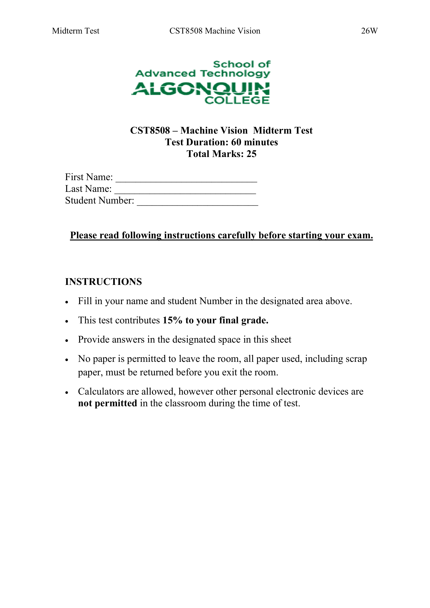
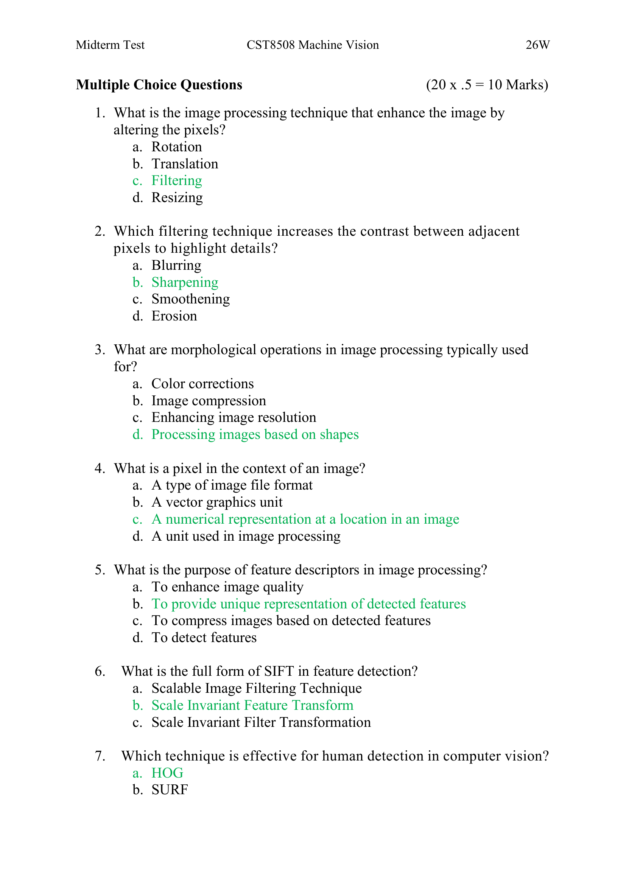
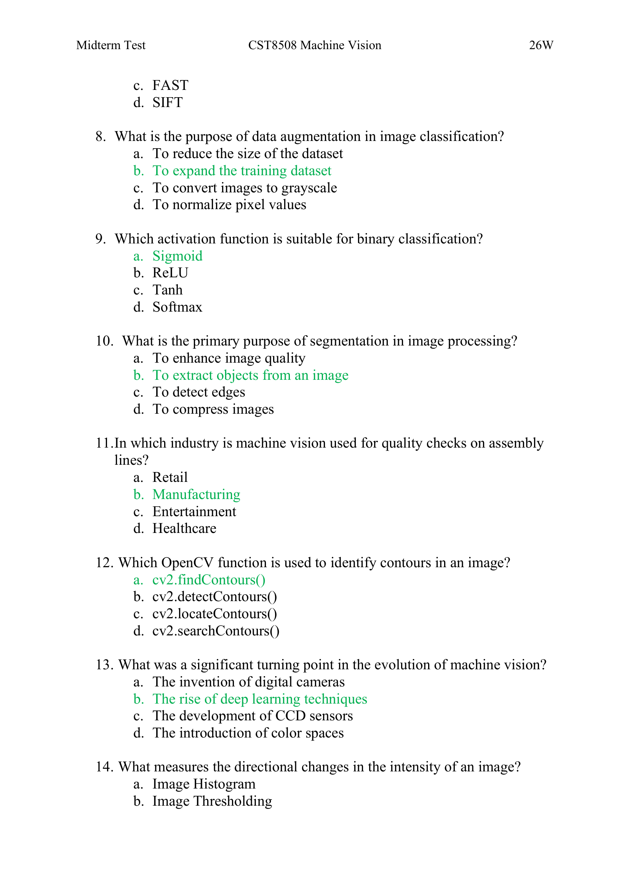
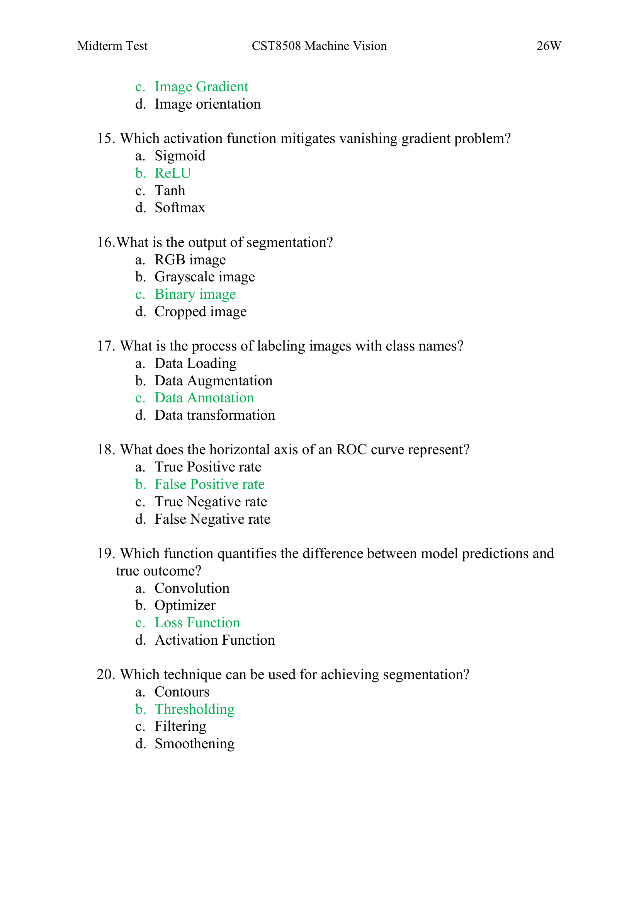
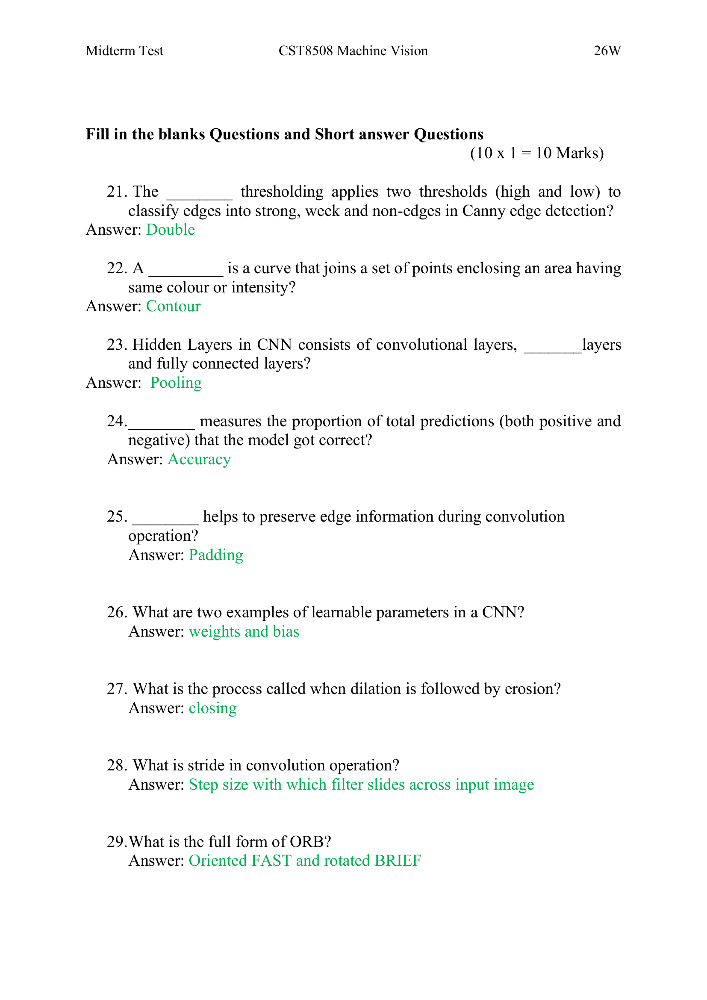
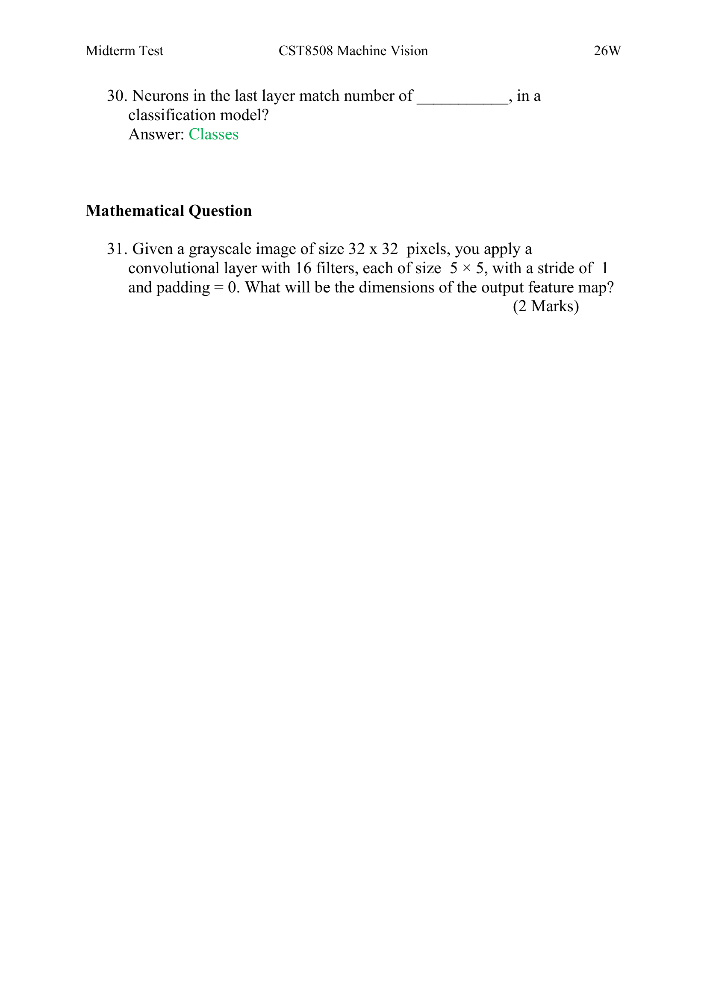
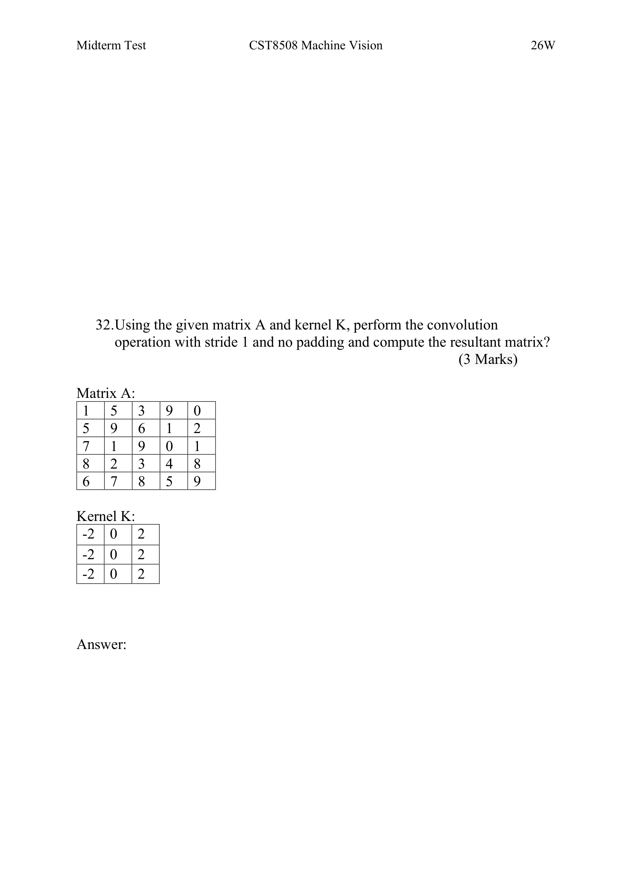
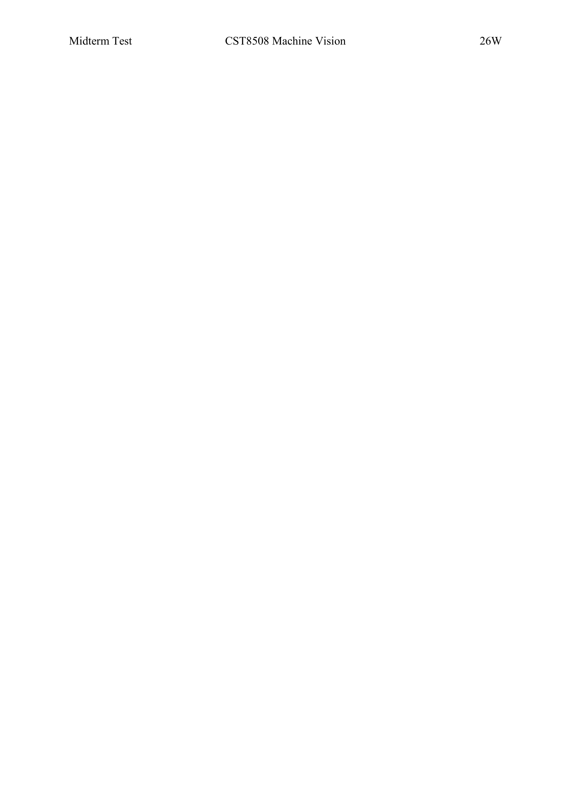

# 期中考试解答 (Midterm Test Solutions) — CST8508 Machine Vision 26W

> Source: `CST8508_26W_Midterm_Test_Solutions.docx`
> Total pages: 10
> Total Marks: 25 | Duration: 60 minutes
> Weight: 15% of final grade — 占总成绩15%

---

## 1. 考试信息 (Exam Information)



**Midterm Test CST8508 Machine Vision 26W — 期中考试 CST8508 机器视觉 26W**

- Test Duration: 60 minutes — 考试时长：60分钟
- Total Marks: 25 — 总分：25分
- This test contributes 15% to your final grade — 此考试占最终成绩的15%
- Provide answers in the designated space in this sheet — 在试卷指定区域作答
- No paper is permitted to leave the room — 不允许将纸张带出教室
- Calculators are allowed, however other personal electronic devices are not permitted — 允许使用计算器，但不允许使用其他个人电子设备

---

## 2. 选择题 (Multiple Choice Questions) — 20 × 0.5 = 10 Marks



### 2.1 图像处理基础 (Image Processing Fundamentals) — Q1-Q4

**Q1.** What is the image processing technique that enhances the image by altering the pixels? — 哪种图像处理技术通过改变像素来增强图像？

- a. Rotation — 旋转
- b. Translation — 平移
- **c. Filtering ✅** — 滤波
- d. Resizing — 缩放

**Q2.** Which filtering technique increases the contrast between adjacent pixels to highlight details? — 哪种滤波技术增加相邻像素之间的对比度以突出细节？

- a. Blurring — 模糊
- **b. Sharpening ✅** — 锐化
- c. Smoothening — 平滑
- d. Erosion — 腐蚀

**Q3.** What are morphological operations in image processing typically used for? — 图像处理中的形态学运算通常用于什么？

- a. Color corrections — 颜色校正
- b. Image compression — 图像压缩
- c. Enhancing image resolution — 增强图像分辨率
- **d. Processing images based on shapes ✅** — 基于形状处理图像

**Q4.** What is a pixel in the context of an image? — 在图像上下文中，什么是像素？

- a. A type of image file format — 一种图像文件格式
- b. A vector graphics unit — 一种矢量图形单位
- **c. A numerical representation at a location in an image ✅** — 图像中某位置的数值表示
- d. A unit used in image processing — 用于图像处理的单位

### 2.2 特征检测与描述 (Feature Detection & Descriptors) — Q5-Q7

**Q5.** What is the purpose of feature descriptors in image processing? — 图像处理中特征描述符的目的是什么？

- a. To enhance image quality — 增强图像质量
- **b. To provide unique representation of detected features ✅** — 为检测到的特征提供唯一表示
- c. To compress images based on detected features — 基于检测到的特征压缩图像
- d. To detect features — 检测特征

**Q6.** What is the full form of SIFT in feature detection? — 特征检测中SIFT的全称是什么？

- a. Scalable Image Filtering Technique — 可扩展图像滤波技术
- **b. Scale Invariant Feature Transform ✅** — 尺度不变特征变换
- c. Scale Invariant Filter Transformation — 尺度不变滤波变换



**Q7.** Which technique is effective for human detection in computer vision? — 计算机视觉中哪种技术对人体检测有效？

- **a. HOG ✅** — 方向梯度直方图
- b. SURF
- c. FAST
- d. SIFT

### 2.3 深度学习与分类 (Deep Learning & Classification) — Q8-Q9

**Q8.** What is the purpose of data augmentation in image classification? — 图像分类中数据增强的目的是什么？

- a. To reduce the size of the dataset — 减小数据集大小
- **b. To expand the training dataset ✅** — 扩展训练数据集
- c. To convert images to grayscale — 将图像转换为灰度
- d. To normalize pixel values — 归一化像素值

**Q9.** Which activation function is suitable for binary classification? — 哪个激活函数适用于二分类？

- **a. Sigmoid ✅**
- b. ReLU
- c. Tanh
- d. Softmax

### 2.4 图像分割与应用 (Segmentation & Applications) — Q10-Q12

**Q10.** What is the primary purpose of segmentation in image processing? — 图像处理中分割的主要目的是什么？

- a. To enhance image quality — 增强图像质量
- **b. To extract objects from an image ✅** — 从图像中提取对象
- c. To detect edges — 检测边缘
- d. To compress images — 压缩图像

**Q11.** In which industry is machine vision used for quality checks on assembly lines? — 机器视觉在哪个行业用于装配线质量检查？

- a. Retail — 零售
- **b. Manufacturing ✅** — 制造业
- c. Entertainment — 娱乐
- d. Healthcare — 医疗保健

**Q12.** Which OpenCV function is used to identify contours in an image? — 哪个OpenCV函数用于识别图像中的轮廓？

- **a. cv2.findContours() ✅**
- b. cv2.detectContours()
- c. cv2.locateContours()
- d. cv2.searchContours()

### 2.5 机器视觉历史与概念 (MV History & Concepts) — Q13-Q14



**Q13.** What was a significant turning point in the evolution of machine vision? — 机器视觉发展中的一个重要转折点是什么？

- a. The invention of digital cameras — 数码相机的发明
- **b. The rise of deep learning techniques ✅** — 深度学习技术的兴起
- c. The development of CCD sensors — CCD传感器的发展
- d. The introduction of color spaces — 颜色空间的引入

**Q14.** What measures the directional changes in the intensity of an image? — 什么度量图像强度的方向变化？

- a. Image Histogram — 图像直方图
- b. Image Thresholding — 图像阈值化
- **c. Image Gradient ✅** — 图像梯度
- d. Image orientation — 图像方向

### 2.6 CNN 与模型评估 (CNN & Model Evaluation) — Q15-Q20

**Q15.** Which activation function mitigates vanishing gradient problem? — 哪个激活函数缓解梯度消失问题？

- a. Sigmoid
- **b. ReLU ✅**
- c. Tanh
- d. Softmax

**Q16.** What is the output of segmentation? — 分割的输出是什么？

- a. RGB image — RGB图像
- b. Grayscale image — 灰度图像
- **c. Binary image ✅** — 二值图像
- d. Cropped image — 裁剪图像

**Q17.** What is the process of labeling images with class names? — 用类别名称标注图像的过程称为什么？

- a. Data Loading — 数据加载
- b. Data Augmentation — 数据增强
- **c. Data Annotation ✅** — 数据标注
- d. Data transformation — 数据变换

**Q18.** What does the horizontal axis of an ROC curve represent? — ROC曲线的横轴代表什么？

- a. True Positive rate — 真阳性率
- **b. False Positive rate ✅** — 假阳性率
- c. True Negative rate — 真阴性率
- d. False Negative rate — 假阴性率

**Q19.** Which function quantifies the difference between model predictions and true outcome? — 哪个函数量化模型预测与真实结果之间的差异？

- a. Convolution — 卷积
- b. Optimizer — 优化器
- **c. Loss Function ✅** — 损失函数
- d. Activation Function — 激活函数

**Q20.** Which technique can be used for achieving segmentation? — 哪种技术可以用于实现分割？

- a. Contours — 轮廓
- **b. Thresholding ✅** — 阈值化
- c. Filtering — 滤波
- d. Smoothening — 平滑

---

## 3. 填空题与简答题 (Fill in the Blanks & Short Answer) — 10 × 1 = 10 Marks



**Q21.** The ________ thresholding applies two thresholds (high and low) to classify edges into strong, weak and non-edges in Canny edge detection? — ________ 阈值化在Canny边缘检测中应用两个阈值（高和低）将边缘分为强边缘、弱边缘和非边缘？

> **Answer: Double** — 答案：双（Double）阈值化

**Q22.** A _________ is a curve that joins a set of points enclosing an area having same colour or intensity? — _________ 是一条连接一组点的曲线，这些点围成具有相同颜色或强度的区域？

> **Answer: Contour** — 答案：轮廓（Contour）

**Q23.** Hidden Layers in CNN consists of convolutional layers, _______layers and fully connected layers? — CNN的隐藏层由卷积层、_______层和全连接层组成？

> **Answer: Pooling** — 答案：池化（Pooling）层

**Q24.** ________ measures the proportion of total predictions (both positive and negative) that the model got correct? — ________ 度量模型正确预测的总比例（包括正预测和负预测）？

> **Answer: Accuracy** — 答案：准确率（Accuracy）

**Q25.** ________ helps to preserve edge information during convolution operation? — ________ 有助于在卷积运算中保留边缘信息？

> **Answer: Padding** — 答案：填充（Padding）

**Q26.** What are two examples of learnable parameters in a CNN? — CNN中可学习参数的两个例子是什么？

> **Answer: Weights and Bias** — 答案：权重（Weights）和偏置（Bias）

**Q27.** What is the process called when dilation is followed by erosion? — 先膨胀后腐蚀的过程叫什么？

> **Answer: Closing** — 答案：闭运算（Closing）

**Q28.** What is stride in convolution operation? — 卷积运算中的步长是什么？

> **Answer: Step size with which filter slides across input image** — 答案：滤波器在输入图像上滑动的步长大小

**Q29.** What is the full form of ORB? — ORB的全称是什么？

> **Answer: Oriented FAST and Rotated BRIEF** — 答案：定向FAST和旋转BRIEF



**Q30.** Neurons in the last layer match number of ___________, in a classification model? — 分类模型中最后一层的神经元数量与___________的数量匹配？

> **Answer: Classes** — 答案：类别（Classes）

---

## 4. 计算题 (Mathematical Questions) — 5 Marks

### 4.1 卷积输出尺寸计算 (Convolution Output Dimension) — Q31, 2 Marks

**Q31.** Given a grayscale image of size 32 × 32 pixels, you apply a convolutional layer with 16 filters, each of size 5 × 5, with a stride of 1 and padding = 0. What will be the dimensions of the output feature map? — 给定一个32×32像素的灰度图像，应用一个包含16个5×5滤波器的卷积层，步长为1，填充为0。输出特征图的维度是什么？

> **解题公式 (Formula):**
>
> `Output = (Input - Filter + 2×Padding) / Stride + 1`
>
> `Output = (32 - 5 + 2×0) / 1 + 1 = 28`
>
> **Answer: 28 × 28 × 16**
>
> - 空间维度 (Spatial): 28 × 28（每个方向缩小：32-5+1=28）
> - 深度/通道数 (Depth/Channels): 16（等于滤波器数量）



### 4.2 卷积运算计算 (Convolution Operation Calculation) — Q32, 3 Marks

**Q32.** Using the given matrix A and kernel K, perform the convolution operation with stride 1 and no padding and compute the resultant matrix? — 使用给定的矩阵A和卷积核K，执行步长为1、无填充的卷积运算，计算结果矩阵？

**Matrix A (矩阵A):**

```
1  5  3  9
5  9  6  1
7  1  9  0
8  2  3  4
6  7  8  5
```

**Kernel K (卷积核K):**

```
-2  0
-2  0
-2  0
```

> **解题过程 (Solution Process):**
>
> Kernel size: 3×2, Input: 5×4, Stride: 1, Padding: 0
> - 卷积核尺寸：3×2, 输入：5×4, 步长：1, 填充：0
>
> Output size = ((5-3)/1 + 1) × ((4-2)/1 + 1) = **3 × 3**
> - 输出尺寸 = ((5-3)/1 + 1) × ((4-2)/1 + 1) = **3 × 3**
>
> Each output element = sum of element-wise multiplication:
> - 每个输出元素 = 对应位置逐元素相乘之和
>
> **Position (0,0):** `1×(-2) + 5×0 + 5×(-2) + 9×0 + 7×(-2) + 1×0 = -2-10-14 = -26`
>
> **Position (0,1):** `5×(-2) + 3×0 + 9×(-2) + 6×0 + 1×(-2) + 9×0 = -10-18-2 = -30`
>
> **Position (0,2):** `3×(-2) + 9×0 + 6×(-2) + 1×0 + 9×(-2) + 0×0 = -6-12-18 = -36`
>
> **Position (1,0):** `5×(-2) + 9×0 + 7×(-2) + 1×0 + 8×(-2) + 2×0 = -10-14-16 = -40`
>
> **Position (1,1):** `9×(-2) + 6×0 + 1×(-2) + 9×0 + 2×(-2) + 3×0 = -18-2-4 = -24`
>
> **Position (1,2):** `6×(-2) + 1×0 + 9×(-2) + 0×0 + 3×(-2) + 4×0 = -12-18-6 = -36`
>
> **Position (2,0):** `7×(-2) + 1×0 + 8×(-2) + 2×0 + 6×(-2) + 7×0 = -14-16-12 = -42`
>
> **Position (2,1):** `1×(-2) + 9×0 + 2×(-2) + 3×0 + 7×(-2) + 8×0 = -2-4-14 = -20`
>
> **Position (2,2):** `9×(-2) + 0×0 + 3×(-2) + 4×0 + 8×(-2) + 5×0 = -18-6-16 = -40`
>
> **Result Matrix (结果矩阵):**
>
> ```
> -26  -30  -36
> -40  -24  -36
> -42  -20  -40
> ```


**Page 8-10 — 答题纸 (Answer sheets for calculations)**




---

## 5. 分值分布总结 (Marks Distribution Summary)

| 题型 (Question Type) | 数量 (Count) | 分值 (Marks) | 占比 (%) |
|---|---|---|---|
| 选择题 Multiple Choice (Q1-Q20) | 20 | 10 (0.5 each) | 40% |
| 填空/简答 Fill-in/Short Answer (Q21-Q30) | 10 | 10 (1.0 each) | 40% |
| 计算题 Mathematical (Q31-Q32) | 2 | 5 (2+3) | 20% |
| **合计 Total** | **32** | **25** | **100%** |

---

## 6. 知识点覆盖范围 (Topic Coverage Map)

| Week | 主题 (Topic) | 题号 (Questions) |
|---|---|---|
| Week 1 | 机器视觉概述 (MV Introduction) | Q11, Q13 |
| Week 2 | 图像处理基础 (Image Processing) | Q1, Q2, Q3, Q4, Q14, Q21, Q22, Q27 |
| Week 3 | 特征检测与描述 (Feature Detection) | Q5, Q6, Q7, Q29 |
| Week 4 | CNN基础 (CNN Introduction) | Q23, Q25, Q26, Q28, Q30, Q31, Q32 |
| Week 5 | 深度学习 (Deep Learning) | Q8, Q9, Q15, Q17, Q19 |
| Cross-topic | 分割与评估 (Segmentation & Evaluation) | Q10, Q16, Q18, Q20, Q24 |
