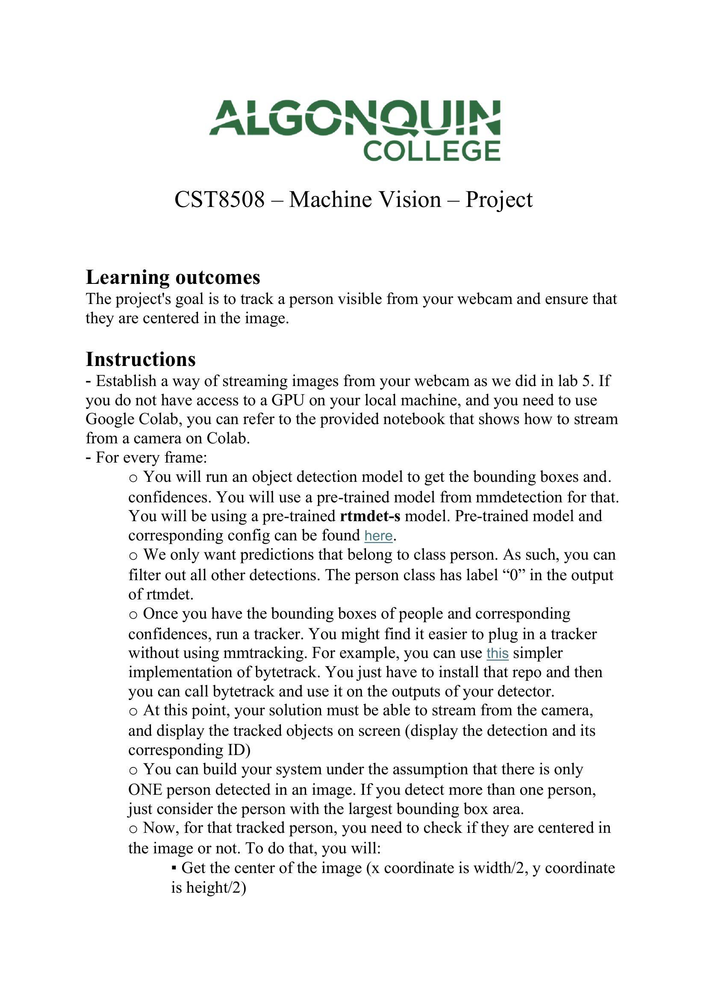
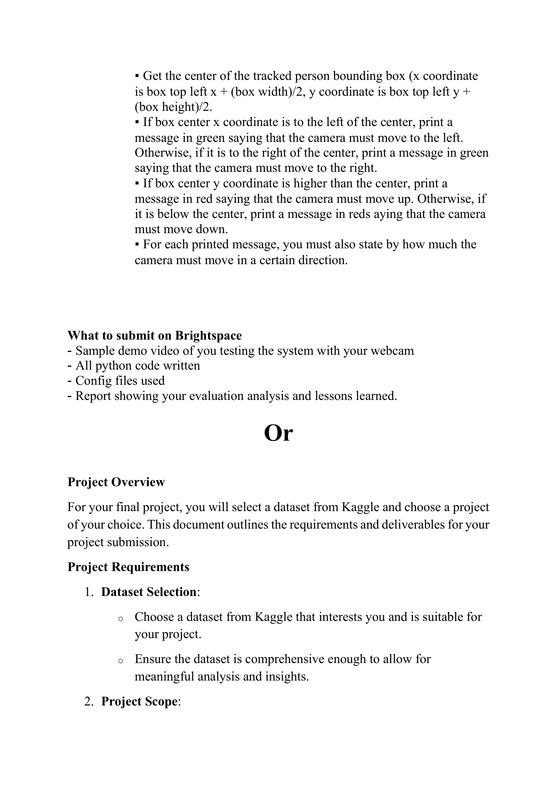
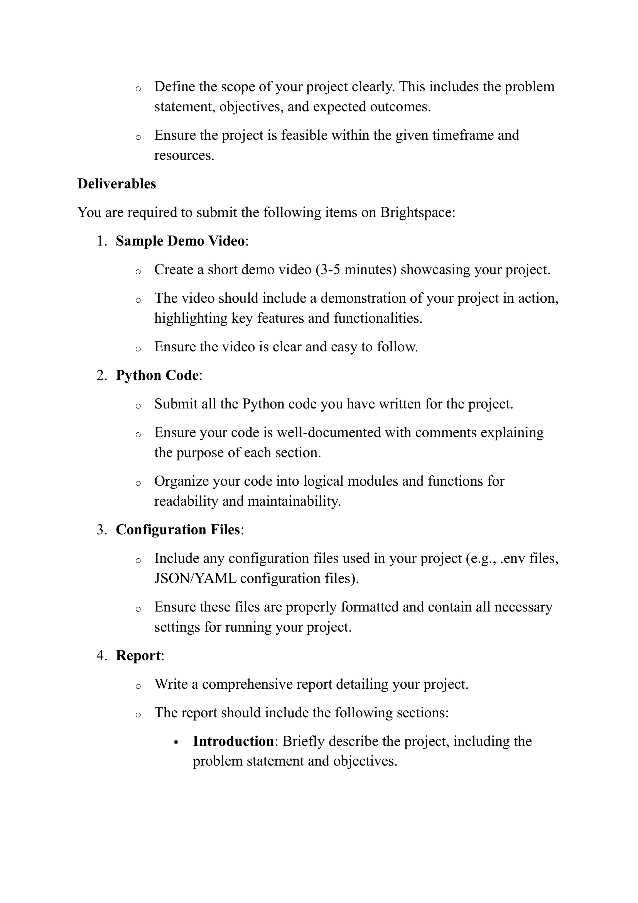
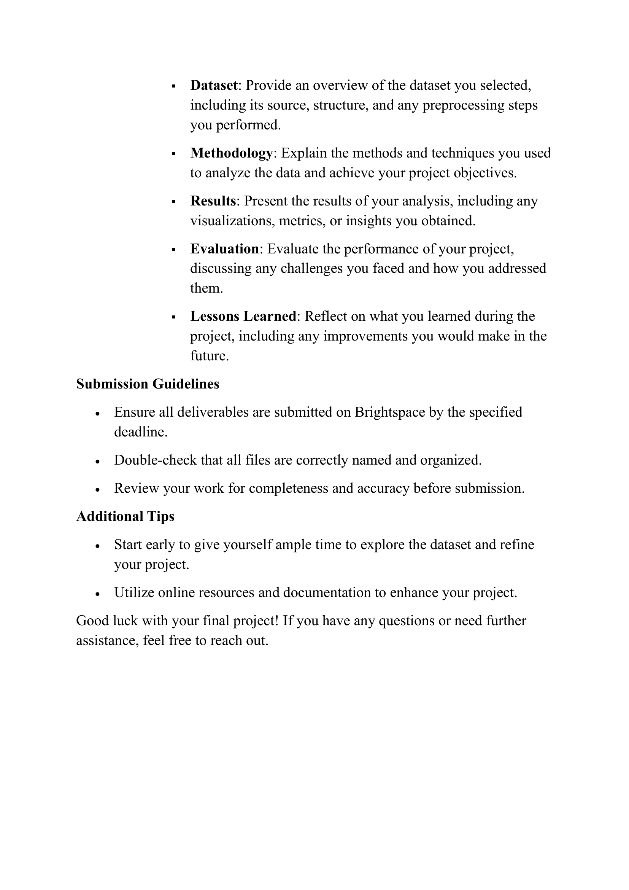

# 期末项目：人物追踪与摄像头居中 (CST8508 – Machine Vision – Final Project)

> Source: `CST8508_Project11.docx`
> Total pages: 4
> Course: CST8508 – Machine Vision

---

## 1. 项目目标 (Learning Outcomes)

**Project Goal — 项目目标**

- The project's goal is to track a person visible from your webcam and ensure that they are centered in the image. — 项目目标是追踪网络摄像头中可见的人物，并确保该人物居于图像中心。

---

## 2. 系统搭建指令 (Instructions)

### 2.1 摄像头流式传输 (Webcam Streaming)

- Establish a way of streaming images from your webcam as we did in lab 5. — 建立从网络摄像头获取图像流的方式，如 Lab 5 中所做的那样。
- If you do not have access to a GPU on your local machine, and you need to use Google Colab, you can refer to the provided notebook that shows how to stream from a camera on Colab. — 如果你本地没有 GPU 需要使用 Google Colab，可参考提供的 notebook 了解如何在 Colab 上从摄像头获取流。

### 2.2 目标检测 (Object Detection)

- For every frame, you will run an object detection model to get the bounding boxes and confidences. — 对每一帧运行目标检测模型以获取边界框和置信度。
- You will use a pre-trained model from mmdetection for that. You will be using a pre-trained **rtmdet-s** model. Pre-trained model and corresponding config can be found here. — 使用 **mmdetection** 中的预训练模型，具体使用预训练的 **rtmdet-s** 模型。预训练模型与对应配置文件可在文档链接处找到。
- We only want predictions that belong to class **person**. As such, you can filter out all other detections. The person class has label "0" in the output of rtmdet. — 只保留 **person** 类别的预测结果，过滤掉所有其他检测。person 类别在 rtmdet 输出中的标签为 **"0"**。

### 2.3 目标追踪 (Object Tracking)

- Once you have the bounding boxes of people and corresponding confidences, run a tracker. — 获得人物边界框和对应置信度后，运行追踪器。
- You might find it easier to plug in a tracker without using mmtracking. For example, you can use this simpler implementation of **bytetrack**. You just have to install that repo and then you can call bytetrack and use it on the outputs of your detector. — 你可能发现不使用 mmtracking 而直接接入追踪器更简便。例如可使用更简洁的 **ByteTrack** 实现，只需安装该仓库后即可调用 ByteTrack 处理检测器输出。
- At this point, your solution must be able to stream from the camera, and display the tracked objects on screen (display the detection and its corresponding ID). — 此时你的方案应能从摄像头获取流，并在屏幕上显示被追踪的对象（显示检测框及其对应 ID）。

### 2.4 单人假设 (Single Person Assumption)

- You can build your system under the assumption that there is only **ONE** person detected in an image. — 可以假设图像中仅检测到**一个**人。
- If you detect more than one person, just consider the person with the **largest bounding box area**. — 如果检测到多个人，只考虑**边界框面积最大**的那个人。

### 2.5 居中判断逻辑 (Centering Logic)

- Now, for that tracked person, you need to check if they are centered in the image or not. To do that, you will: — 对于被追踪的人物，需要检查其是否位于图像中心。方法如下：

**Step 1: 获取图像中心 (Get Image Center)**
- Get the center of the image (x coordinate is **width/2**, y coordinate is **height/2**). — 获取图像中心（x 坐标 = **宽度/2**，y 坐标 = **高度/2**）。

**Step 2: 获取人物边界框中心 (Get Bounding Box Center)**
- Get the center of the tracked person bounding box (x coordinate is **box top left x + (box width)/2**, y coordinate is **box top left y + (box height)/2**). — 获取被追踪人物边界框中心（x 坐标 = **左上角 x + 框宽/2**，y 坐标 = **左上角 y + 框高/2**）。

**Step 3: 水平方向判断 (Horizontal Direction)**
- If box center x coordinate is to the **left** of the center, print a message in **green** saying that the camera must move to the left. — 如果框中心 x 坐标在图像中心**左侧**，用**绿色**打印提示摄像头需向左移动。
- Otherwise, if it is to the **right** of the center, print a message in **green** saying that the camera must move to the right. — 否则，如果在图像中心**右侧**，用**绿色**打印提示摄像头需向右移动。

**Step 4: 垂直方向判断 (Vertical Direction)**
- If box center y coordinate is **higher** than the center, print a message in **red** saying that the camera must move up. — 如果框中心 y 坐标比图像中心**高**，用**红色**打印提示摄像头需向上移动。
- Otherwise, if it is **below** the center, print a message in **red** saying that the camera must move down. — 否则，如果在图像中心**下方**，用**红色**打印提示摄像头需向下移动。

**Step 5: 偏移量 (Offset Amount)**
- For each printed message, you must also state by **how much** the camera must move in a certain direction. — 每条打印信息还必须说明摄像头需要朝某方向移动**多少**。

---

## 3. 提交要求 — 选项 A：追踪项目 (Submission — Option A: Tracking Project)

- Sample demo video of you testing the system with your webcam — 提交使用网络摄像头测试系统的演示视频示例
- All python code written — 提交所有编写的 Python 代码
- Config files used — 提交使用的配置文件
- Report showing your evaluation analysis and lessons learned — 提交包含评估分析和经验教训的报告

---

## 4. 备选方案 — 选项 B：自选数据集项目 (Alternative — Option B: Kaggle Dataset Project)

### 4.1 项目概述 (Project Overview)

- For your final project, you will select a dataset from **Kaggle** and choose a project of your choice. This document outlines the requirements and deliverables for your project submission. — 期末项目中，你将从 **Kaggle** 选择一个数据集并自选项目。本文档概述了项目提交的要求和交付物。

### 4.2 项目要求 (Project Requirements)

**1. 数据集选择 (Dataset Selection):**
- Choose a dataset from Kaggle that interests you and is suitable for your project. — 从 Kaggle 选择一个你感兴趣且适合你项目的数据集。
- Ensure the dataset is comprehensive enough to allow for meaningful analysis and insights. — 确保数据集足够全面，能进行有意义的分析和洞察。

**2. 项目范围 (Project Scope):**
- Define the scope of your project clearly. This includes the problem statement, objectives, and expected outcomes. — 清晰定义项目范围，包括问题陈述、目标和预期结果。
- Ensure the project is feasible within the given timeframe and resources. — 确保项目在给定时间和资源内可行。

### 4.3 交付物 (Deliverables)

**1. 演示视频 (Sample Demo Video):**
- Create a short demo video (3-5 minutes) showcasing your project. — 制作一段 3-5 分钟的简短演示视频展示你的项目。
- The video should include a demonstration of your project in action, highlighting key features and functionalities. — 视频应包含项目实际运行展示，突出关键功能和特性。
- Ensure the video is clear and easy to follow. — 确保视频清晰易懂。

**2. Python 代码 (Python Code):**
- Submit all the Python code you have written for the project. — 提交所有为项目编写的 Python 代码。
- Ensure your code is well-documented with comments explaining the purpose of each section. — 确保代码有良好的注释说明每个部分的用途。
- Organize your code into logical modules and functions for readability and maintainability. — 将代码组织成逻辑模块和函数，保证可读性和可维护性。

**3. 配置文件 (Configuration Files):**
- Include any configuration files used in your project (e.g., .env files, JSON/YAML configuration files). — 包含项目中使用的所有配置文件（如 .env 文件、JSON/YAML 配置文件）。
- Ensure these files are properly formatted and contain all necessary settings for running your project. — 确保这些文件格式正确且包含运行项目所需的所有配置。

**4. 报告 (Report):**

- Write a comprehensive report detailing your project. The report should include the following sections: — 撰写一份详细的综合报告，报告应包含以下章节：

| Section 章节 | Description 描述 |
|---|---|
| **Introduction — 引言** | Briefly describe the project, including the problem statement and objectives. — 简要描述项目，包括问题陈述和目标。 |
| **Dataset — 数据集** | Provide an overview of the dataset you selected, including its source, structure, and any preprocessing steps you performed. — 概述所选数据集，包括来源、结构和执行的预处理步骤。 |
| **Methodology — 方法论** | Explain the methods and techniques you used to analyze the data and achieve your project objectives. — 说明用于分析数据和实现项目目标的方法与技术。 |
| **Results — 结果** | Present the results of your analysis, including any visualizations, metrics, or insights you obtained. — 展示分析结果，包括可视化、指标或获得的洞察。 |
| **Evaluation — 评估** | Evaluate the performance of your project, discussing any challenges you faced and how you addressed them. — 评估项目性能，讨论面临的挑战及解决方式。 |
| **Lessons Learned — 经验教训** | Reflect on what you learned during the project, including any improvements you would make in the future. — 反思项目中学到的内容，包括未来可以改进的方面。 |

---

## 5. 提交指南与建议 (Submission Guidelines & Tips)

**提交指南 (Submission Guidelines):**
- Ensure all deliverables are submitted on Brightspace by the specified deadline. — 确保所有交付物在截止日期前提交到 Brightspace。
- Double-check that all files are correctly named and organized. — 仔细检查所有文件命名正确且组织有序。
- Review your work for completeness and accuracy before submission. — 提交前检查作品的完整性和准确性。

**额外建议 (Additional Tips):**
- Start early to give yourself ample time to explore the dataset and refine your project. — 尽早开始，留出充足时间探索数据集和完善项目。
- Utilize online resources and documentation to enhance your project. — 利用在线资源和文档提升你的项目质量。

> Good luck with your final project! If you have any questions or need further assistance, feel free to reach out. — 祝你期末项目顺利！如有任何问题或需要帮助，请随时联系。
