# Week 10: 计算机视觉传感器与传感器融合 (CV Sensors and Sensor Fusion)

> Source: `Week 10 - CV Sensors and Sensor Fusion.pptx`
> Total slides: 24
> Instructor: Stephin Rachel Thomas | April 02, 2026

---

## 1. 计算机视觉中的传感器概述 (Introduction to Sensors in Computer Vision)

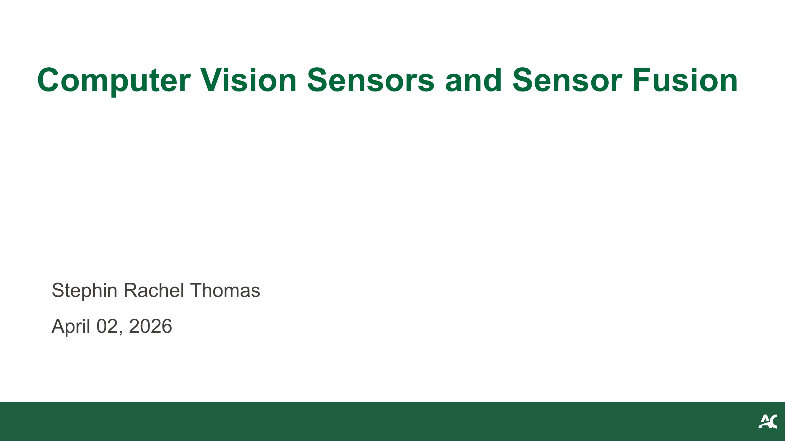

**计算机视觉传感器与传感器融合 (Computer Vision Sensors and Sensor Fusion)**

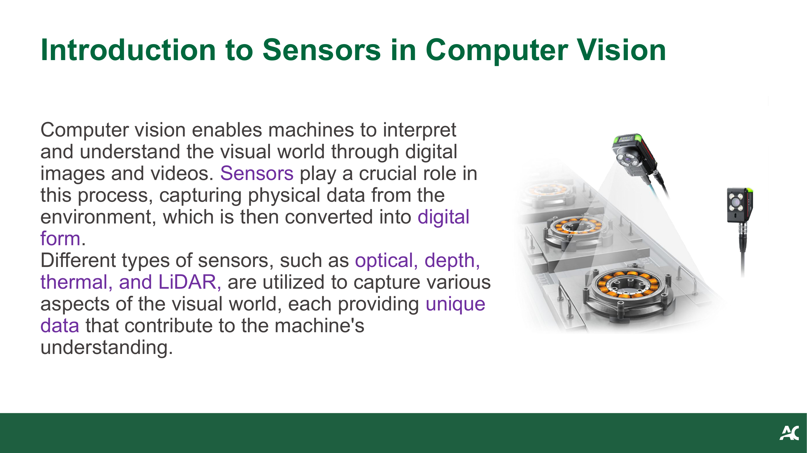

- Computer vision enables machines to interpret and understand the visual world through digital images and videos. Sensors play a crucial role in this process, capturing physical data from the environment, which is then converted into digital form.
- 计算机视觉使机器能够通过数字图像和视频来解释和理解视觉世界。传感器在此过程中发挥关键作用，从环境中捕获物理数据，然后将其转换为数字形式。

- Different types of sensors, such as **optical**, **depth**, **thermal**, and **LiDAR**, are utilized to capture various aspects of the visual world, each providing unique data that contribute to the machine's understanding.
- 不同类型的传感器，如**光学传感器**、**深度传感器**、**热成像传感器**和 **LiDAR**，用于捕获视觉世界的各个方面，每种传感器提供独特的数据，帮助机器理解环境。

> **📝 Notes:**
>
> **承接**: 本节作为开篇，概述计算机视觉中传感器的角色和主要类型（光学、深度、热成像、LiDAR）；这些基础分类将为下一节「光学传感器详解」提供分类框架。

---

## 2. 光学传感器 (Optical Sensors)

### 2.1 基本原理与应用 (Basics and Applications)

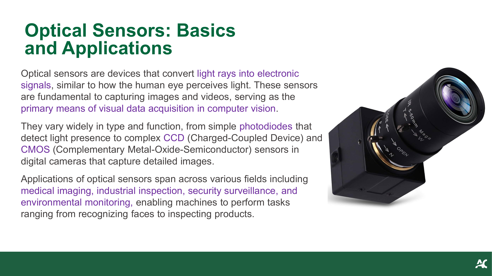

- Optical sensors are devices that convert light rays into electronic signals, similar to how the human eye perceives light. These sensors are fundamental to capturing images and videos, serving as the primary means of visual data acquisition in computer vision.
- 光学传感器是将光线转换为电子信号的设备，类似于人眼感知光线的方式。这些传感器是捕获图像和视频的基础，是计算机视觉中视觉数据采集的主要手段。

- They vary widely in type and function, from simple **photodiodes** that detect light presence to complex **CCD (Charged-Coupled Device)** and **CMOS (Complementary Metal-Oxide-Semiconductor)** sensors in digital cameras that capture detailed images.
- 光学传感器类型和功能差异很大，从检测光线存在的简单**光电二极管（photodiodes）** 到数码相机中捕获详细图像的复杂 **CCD（电荷耦合器件）** 和 **CMOS（互补金属氧化物半导体）** 传感器。

- Applications of optical sensors span across various fields including **medical imaging**, **industrial inspection**, **security surveillance**, and **environmental monitoring**, enabling machines to perform tasks ranging from recognizing faces to inspecting products.
- 光学传感器的应用涵盖多个领域，包括**医学成像**、**工业检测**、**安全监控**和**环境监测**，使机器能够执行从人脸识别到产品检测的各种任务。

### 2.2 CCD 与 CMOS 对比 (CCD vs CMOS)

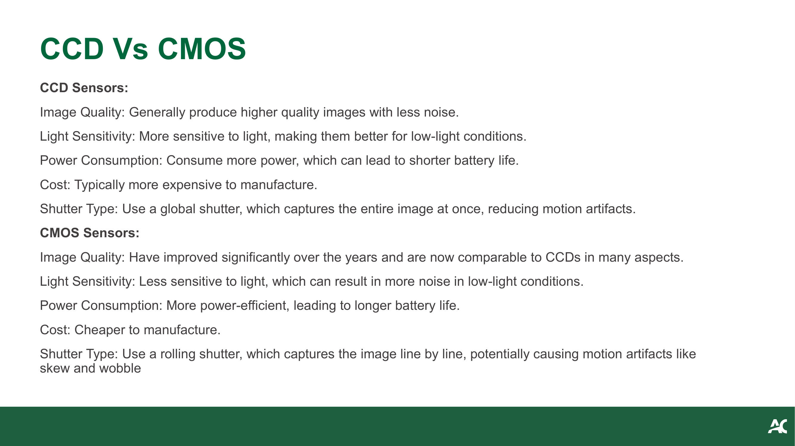

**CCD 传感器 (CCD Sensors):**

| 特征 (Feature) | CCD |
|---|---|
| 图像质量 (Image Quality) | Generally produce higher quality images with less noise / 通常产生更高质量、更低噪声的图像 |
| 光敏感度 (Light Sensitivity) | More sensitive to light, making them better for low-light conditions / 对光线更敏感，更适合低光环境 |
| 功耗 (Power Consumption) | Consume more power, which can lead to shorter battery life / 功耗更高，可能导致电池寿命更短 |
| 成本 (Cost) | Typically more expensive to manufacture / 通常制造成本更高 |
| 快门类型 (Shutter Type) | Use a **global shutter**, which captures the entire image at once, reducing motion artifacts / 使用**全局快门**，一次性捕获整个图像，减少运动伪影 |

**CMOS 传感器 (CMOS Sensors):**

| 特征 (Feature) | CMOS |
|---|---|
| 图像质量 (Image Quality) | Have improved significantly over the years and are now comparable to CCDs in many aspects / 多年来显著改善，在许多方面可与 CCD 媲美 |
| 光敏感度 (Light Sensitivity) | Less sensitive to light, which can result in more noise in low-light conditions / 对光线不太敏感，低光条件下可能产生更多噪声 |
| 功耗 (Power Consumption) | More power-efficient, leading to longer battery life / 更节能，电池寿命更长 |
| 成本 (Cost) | Cheaper to manufacture / 制造成本更低 |
| 快门类型 (Shutter Type) | Use a **rolling shutter**, which captures the image line by line, potentially causing motion artifacts like skew and wobble / 使用**卷帘快门**，逐行捕获图像，可能导致倾斜和抖动等运动伪影 |

> **📝 Notes:**
>
> **承接**: 上一节概述了传感器的整体分类；本节深入光学传感器的原理和 CCD/CMOS 两大核心技术的差异对比；这些光学基础将为下一节「深度传感器」的 3D 感知能力形成对照参考。

---

## 3. 深度传感器 (Depth Sensors)

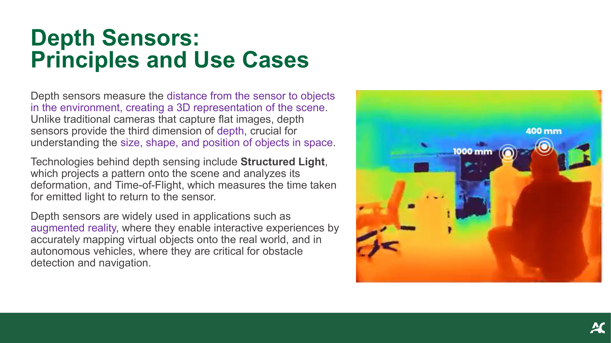

- Depth sensors measure the distance from the sensor to objects in the environment, creating a **3D representation** of the scene. Unlike traditional cameras that capture flat images, depth sensors provide the third dimension of depth, crucial for understanding the size, shape, and position of objects in space.
- 深度传感器测量传感器到环境中物体的距离，创建场景的**三维表示**。与捕获平面图像的传统相机不同，深度传感器提供深度这第三个维度，对于理解物体在空间中的大小、形状和位置至关重要。

- Technologies behind depth sensing include **Structured Light**, which projects a pattern onto the scene and analyzes its deformation, and **Time-of-Flight (ToF)**, which measures the time taken for emitted light to return to the sensor.
- 深度传感技术包括**结构光（Structured Light）**（向场景投射图案并分析其变形）和**飞行时间（Time-of-Flight, ToF）**（测量发射光返回传感器所用时间）。

- Depth sensors are widely used in applications such as **augmented reality**, where they enable interactive experiences by accurately mapping virtual objects onto the real world, and in **autonomous vehicles**, where they are critical for obstacle detection and navigation.
- 深度传感器广泛应用于**增强现实**（通过精确映射虚拟对象到现实世界来实现交互体验）和**自动驾驶汽车**（在障碍物检测和导航中至关重要）等领域。

> **📝 Notes:**
>
> **承接**: 上一节介绍了光学传感器（2D 成像）；本节引入深度传感器提供第三维度信息（3D），展示了从 2D 图像到 3D 空间感知的进步；下一节将介绍热成像传感器，进一步拓展传感器在非可见光波段的应用。

---

## 4. 热成像传感器 (Thermal Imaging Sensors)

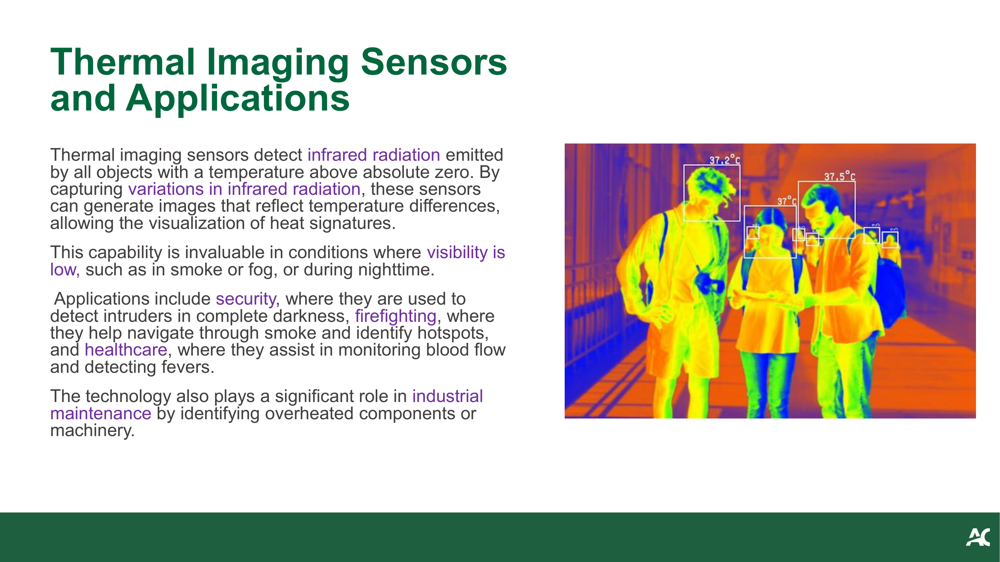

- Thermal imaging sensors detect **infrared radiation** emitted by all objects with a temperature above absolute zero. By capturing variations in infrared radiation, these sensors can generate images that reflect temperature differences, allowing the visualization of **heat signatures**.
- 热成像传感器检测所有温度高于绝对零度的物体发射的**红外辐射**。通过捕获红外辐射的变化，这些传感器可以生成反映温度差异的图像，从而实现**热特征**的可视化。

- This capability is invaluable in conditions where visibility is low, such as in **smoke or fog**, or during **nighttime**.
- 这种能力在能见度低的情况下非常有价值，例如在**烟雾或雾霾**中，或在**夜间**。

- Applications include:
  - **Security / 安全监控**: Detect intruders in complete darkness / 在完全黑暗中检测入侵者
  - **Firefighting / 消防**: Navigate through smoke and identify hotspots / 在烟雾中导航并识别热点
  - **Healthcare / 医疗**: Monitor blood flow and detect fevers / 监测血流并检测发烧
  - **Industrial maintenance / 工业维护**: Identify overheated components or machinery / 识别过热组件或机械

> **📝 Notes:**
>
> **承接**: 前两节分别介绍了可见光（光学传感器）和主动式 3D 感知（深度传感器）；本节引入被动式红外感知（热成像），展示了在恶劣视觉条件下的独特价值；下一节将介绍 LiDAR，另一种主动式传感技术。

---

## 5. LiDAR 传感器 (LiDAR Sensors)

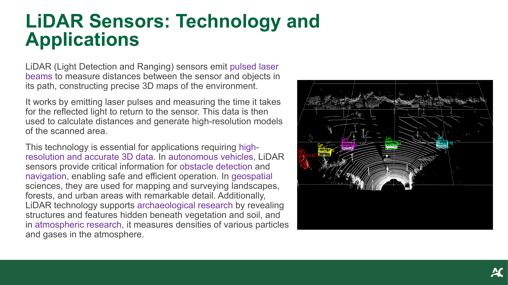

- **LiDAR (Light Detection and Ranging)** sensors emit pulsed laser beams to measure distances between the sensor and objects in its path, constructing **precise 3D maps** of the environment.
- **LiDAR（光检测和测距）** 传感器发射脉冲激光束来测量传感器与其路径上物体之间的距离，构建环境的**精确三维地图**。

- It works by emitting laser pulses and measuring the time it takes for the reflected light to return to the sensor. This data is then used to calculate distances and generate **high-resolution models** of the scanned area.
- 其工作原理是发射激光脉冲并测量反射光返回传感器所需的时间。然后利用这些数据计算距离并生成扫描区域的**高分辨率模型**。

- Applications:
  - **Autonomous vehicles / 自动驾驶**: Critical for obstacle detection and navigation / 在障碍物检测和导航中至关重要
  - **Geospatial sciences / 地理空间科学**: Mapping and surveying landscapes, forests, and urban areas / 绘制和测量景观、森林和城市区域
  - **Archaeological research / 考古研究**: Revealing structures hidden beneath vegetation and soil / 揭示隐藏在植被和土壤下的结构
  - **Atmospheric research / 大气研究**: Measures densities of various particles and gases / 测量各种粒子和气体的密度

> **📝 Notes:**
>
> **承接**: 上一节介绍了热成像（被动式红外感知）；本节介绍 LiDAR（主动式激光感知），它通过发射激光脉冲生成高精度 3D 点云，是自动驾驶的核心传感器之一；下一节将介绍雷达传感器，补全传感器类型的知识图谱。

---

## 6. 雷达传感器 (Radar Sensors)

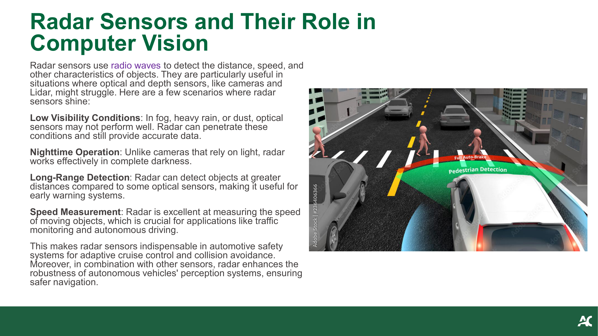

- Radar sensors use **radio waves** to detect the distance, speed, and other characteristics of objects. They are particularly useful in situations where optical and depth sensors, like cameras and LiDAR, might struggle.
- 雷达传感器使用**无线电波**来检测物体的距离、速度和其他特征。在光学和深度传感器（如相机和 LiDAR）可能失效的情况下，雷达传感器特别有用。

- Key advantages / 关键优势:
  - **Low Visibility Conditions / 低能见度**: In fog, heavy rain, or dust, optical sensors may not perform well. Radar can penetrate these conditions and still provide accurate data. / 在雾、大雨或灰尘中，光学传感器效果不佳。雷达可以穿透这些条件并仍然提供准确数据。
  - **Nighttime Operation / 夜间操作**: Unlike cameras that rely on light, radar works effectively in complete darkness. / 与依赖光线的相机不同，雷达在完全黑暗中也能有效工作。
  - **Long-Range Detection / 远距离检测**: Radar can detect objects at greater distances compared to some optical sensors, making it useful for early warning systems. / 雷达可以在比一些光学传感器更远的距离上检测物体，有利于早期预警系统。
  - **Speed Measurement / 速度测量**: Radar is excellent at measuring the speed of moving objects, which is crucial for traffic monitoring and autonomous driving. / 雷达在测量运动物体速度方面表现出色，对于交通监控和自动驾驶至关重要。

- This makes radar sensors indispensable in automotive safety systems for **adaptive cruise control** and **collision avoidance**. In combination with other sensors, radar enhances the robustness of autonomous vehicles' perception systems, ensuring safer navigation.
- 这使得雷达传感器在汽车安全系统中不可或缺，用于**自适应巡航控制**和**碰撞避免**。与其他传感器组合使用时，雷达增强了自动驾驶车辆感知系统的鲁棒性，确保更安全的导航。

> **📝 Notes:**
>
> **承接**: 前面四节依次介绍了光学、深度、热成像和 LiDAR 传感器；本节介绍雷达——唯一使用无线电波的传感器类型，完成了五大传感器类型的知识图谱；下一节将正式进入「传感器融合」主题，解释为何需要组合多种传感器。

---

## 7. 传感器融合基础 (Sensor Fusion Fundamentals)

### 7.1 核心概念 (Core Concepts)

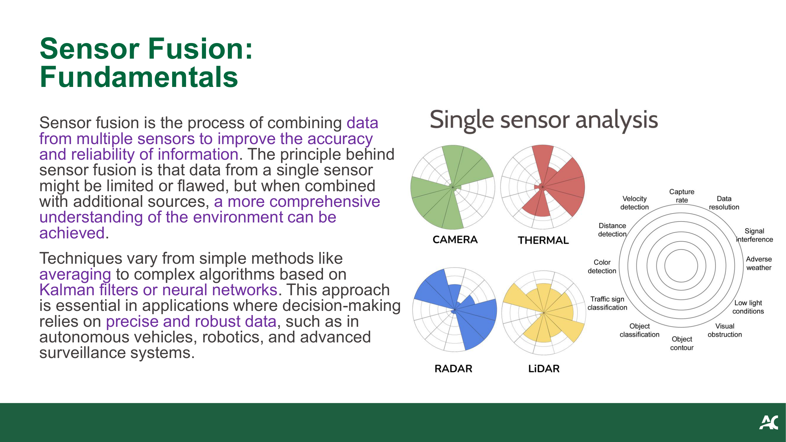

- **Sensor fusion** is the process of combining data from multiple sensors to improve the accuracy and reliability of information. The principle behind sensor fusion is that data from a single sensor might be limited or flawed, but when combined with additional sources, a more comprehensive understanding of the environment can be achieved.
- **传感器融合**是结合来自多个传感器的数据以提高信息准确性和可靠性的过程。传感器融合的原理是，单个传感器的数据可能有限或有缺陷，但当与其他数据源结合时，可以获得对环境更全面的理解。

- Techniques vary from simple methods like **averaging** to complex algorithms based on **Kalman filters** or **neural networks**. This approach is essential in applications where decision-making relies on precise and robust data, such as in autonomous vehicles, robotics, and advanced surveillance systems.
- 技术手段从简单的**平均法**到基于**卡尔曼滤波器（Kalman filters）** 或**神经网络**的复杂算法。这种方法在决策依赖于精确和稳健数据的应用中至关重要，例如自动驾驶车辆、机器人技术和高级监控系统。

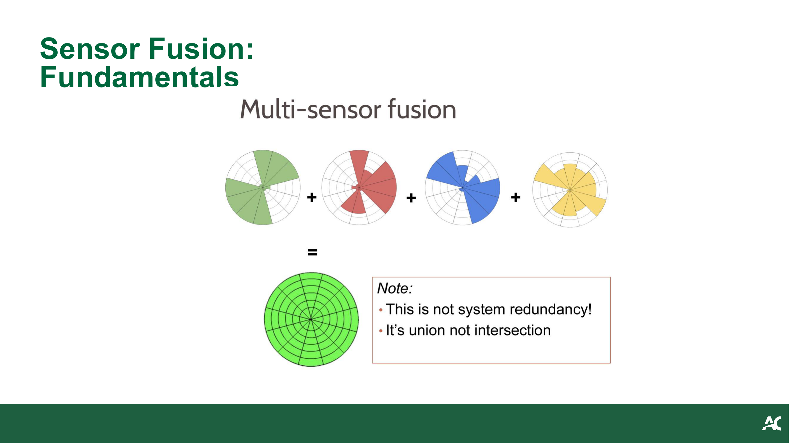

### 7.2 单传感器与多传感器分析 (Single Sensor vs Multi-Sensor Analysis)

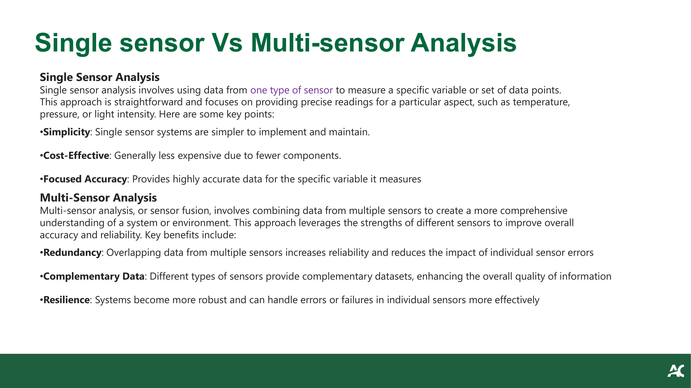

**单传感器分析 (Single Sensor Analysis):**

- Single sensor analysis involves using data from one type of sensor to measure a specific variable or set of data points. This approach is straightforward and focuses on providing precise readings for a particular aspect.
- 单传感器分析涉及使用一种传感器的数据来测量特定变量或数据点集。这种方法简单直观，专注于提供特定方面的精确读数。

- **Simplicity / 简单性**: Single sensor systems are simpler to implement and maintain / 单传感器系统更容易实现和维护
- **Cost-Effective / 成本效益**: Generally less expensive due to fewer components / 由于组件更少，通常成本更低
- **Focused Accuracy / 精准度**: Provides highly accurate data for the specific variable it measures / 为测量的特定变量提供高精度数据

**多传感器分析 (Multi-Sensor Analysis):**

- Multi-sensor analysis, or sensor fusion, involves combining data from multiple sensors to create a more comprehensive understanding of a system or environment.
- 多传感器分析（即传感器融合）涉及结合来自多个传感器的数据，以创建对系统或环境的更全面理解。

- **Redundancy / 冗余性**: Overlapping data from multiple sensors increases reliability and reduces the impact of individual sensor errors / 来自多个传感器的重叠数据提高可靠性，减少单个传感器错误的影响
- **Complementary Data / 互补数据**: Different types of sensors provide complementary datasets, enhancing the overall quality of information / 不同类型的传感器提供互补的数据集，提高信息的整体质量
- **Resilience / 弹性**: Systems become more robust and can handle errors or failures in individual sensors more effectively / 系统变得更加鲁棒，能更有效地处理单个传感器的错误或故障

### 7.3 传感器权衡对比 (Sensor Trade-Offs)

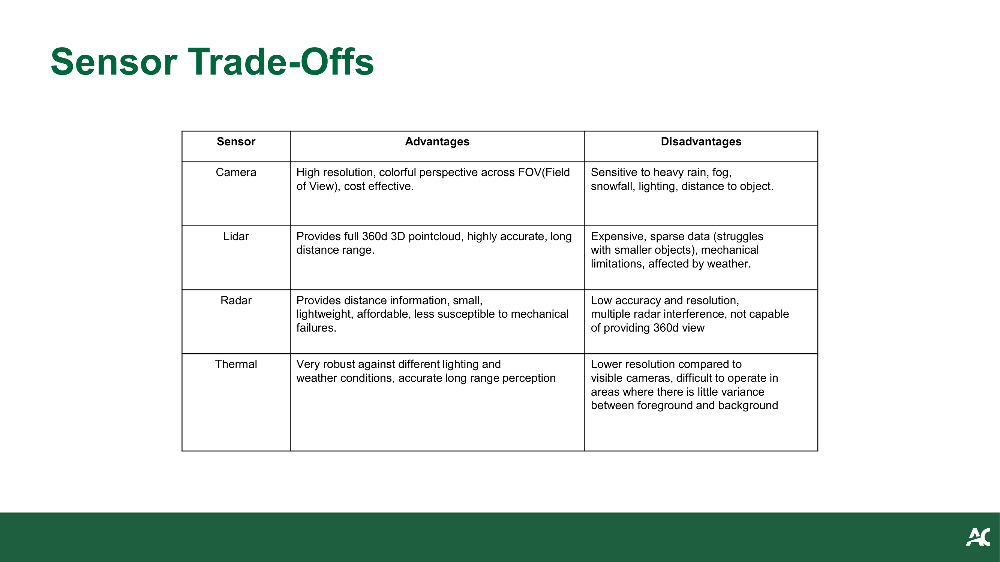

| 传感器 (Sensor) | 优势 (Advantages) | 劣势 (Disadvantages) |
|---|---|---|
| **Camera / 相机** | High resolution, colorful perspective across FOV, cost effective / 高分辨率、彩色视角覆盖视野、性价比高 | Sensitive to heavy rain, fog, snowfall, lighting, distance to object / 易受大雨、雾、雪、光照、物体距离影响 |
| **LiDAR** | Provides full 360° 3D point cloud, highly accurate, long distance range / 提供 360° 3D 点云、高精度、远距离 | Expensive, sparse data (struggles with smaller objects), mechanical limitations, affected by weather / 价格昂贵、数据稀疏、机械限制、受天气影响 |
| **Radar / 雷达** | Provides distance information, small, lightweight, affordable, less susceptible to mechanical failures / 提供距离信息、体积小、轻便、经济、不易受机械故障影响 | Low accuracy and resolution, multiple radar interference, not capable of providing 360° view / 精度和分辨率低、多雷达干扰、无法提供 360° 视角 |
| **Thermal / 热成像** | Very robust against different lighting and weather conditions, accurate long range perception / 对不同光照和天气条件非常鲁棒、远距离感知准确 | Lower resolution compared to visible cameras, difficult to operate in areas where there is little variance between foreground and background / 分辨率低于可见光相机、前景和背景差异小的区域难以工作 |

> **📝 Notes:**
>
> **承接**: 前面各节分别介绍了五大传感器类型的独立特性；本节正式引入传感器融合的概念，解释了为何单传感器不够用，并通过权衡对比表清晰展示了各传感器的互补关系；下一节将深入讨论传感器融合面临的技术挑战。

---

## 8. 传感器融合：挑战与数据处理 (Challenges and Data Processing in Sensor Fusion)

### 8.1 融合挑战 (Challenges in Sensor Fusion)

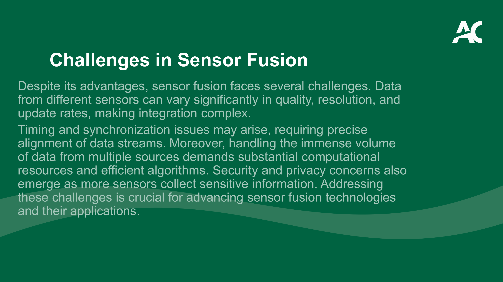

- Despite its advantages, sensor fusion faces several challenges. Data from different sensors can vary significantly in **quality, resolution, and update rates**, making integration complex.
- 尽管传感器融合有很多优势，但也面临多项挑战。来自不同传感器的数据在**质量、分辨率和更新率**方面差异很大，使得集成变得复杂。

- **Timing and synchronization** issues may arise, requiring precise alignment of data streams. Moreover, handling the immense volume of data from multiple sources demands **substantial computational resources** and efficient algorithms.
- **时序和同步**问题可能出现，需要精确对齐数据流。此外，处理来自多个源的海量数据需要**大量计算资源**和高效算法。

- **Security and privacy** concerns also emerge as more sensors collect sensitive information. Addressing these challenges is crucial for advancing sensor fusion technologies and their applications.
- 随着更多传感器收集敏感信息，**安全和隐私**问题也随之出现。解决这些挑战对于推进传感器融合技术及其应用至关重要。

### 8.2 数据处理与集成 (Data Processing and Integration)

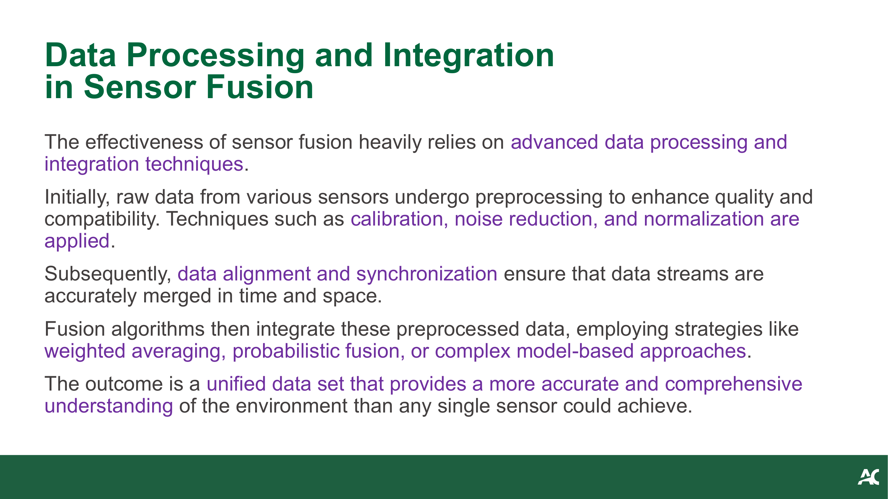

- The effectiveness of sensor fusion heavily relies on advanced **data processing and integration** techniques.
- 传感器融合的有效性在很大程度上依赖于先进的**数据处理和集成**技术。

- Processing pipeline / 处理流程:
  1. **Preprocessing / 预处理**: Raw data undergoes calibration, noise reduction, and normalization / 原始数据进行校准、降噪和归一化
  2. **Alignment & Synchronization / 对齐与同步**: Data streams are accurately merged in time and space / 数据流在时间和空间上精确合并
  3. **Fusion Algorithms / 融合算法**: Integrate preprocessed data using strategies like **weighted averaging**, **probabilistic fusion**, or complex **model-based approaches** / 使用加权平均、概率融合或复杂的基于模型的方法集成预处理数据
  4. **Unified Output / 统一输出**: A unified dataset providing more accurate and comprehensive understanding than any single sensor / 提供比任何单一传感器更准确和全面理解的统一数据集

> **📝 Notes:**
>
> **承接**: 上一节建立了传感器融合的理论基础和互补性分析；本节深入融合过程中的实际技术挑战（同步、计算资源、隐私）以及数据处理流程（预处理→对齐→融合→输出）；下一节将展示传感器融合在实际场景中的应用。

---

## 9. 传感器融合的实际应用 (Real-World Applications of Sensor Fusion)

### 9.1 综合应用场景 (Overview of Applications)

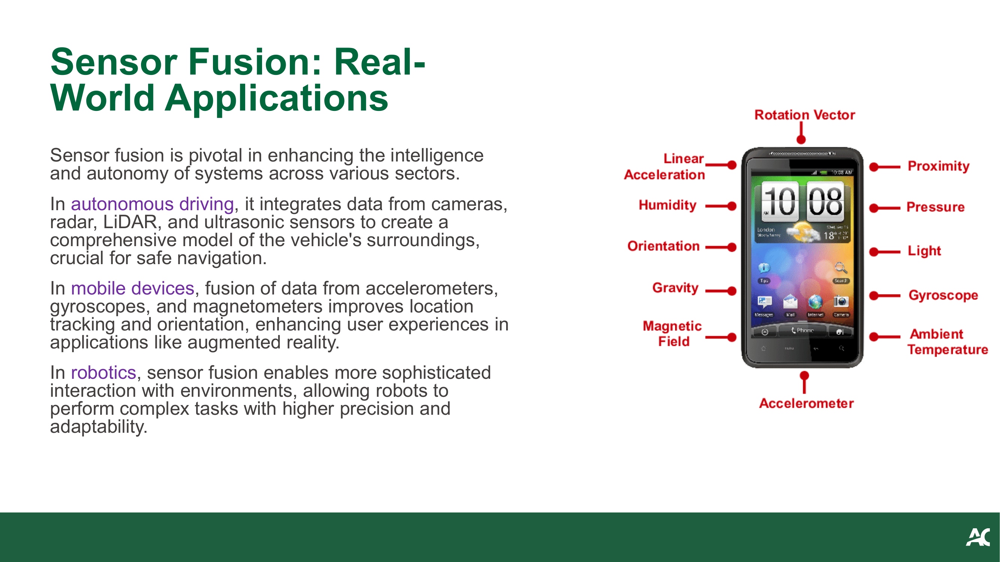

- Sensor fusion is pivotal in enhancing the intelligence and autonomy of systems across various sectors.
- 传感器融合在提升各行业系统的智能化和自主性方面发挥着关键作用。

- **Autonomous driving / 自动驾驶**: Integrates data from cameras, radar, LiDAR, and ultrasonic sensors to create a comprehensive model of the vehicle's surroundings, crucial for safe navigation. / 集成来自相机、雷达、LiDAR 和超声波传感器的数据，创建车辆周围环境的综合模型，对安全导航至关重要。
- **Mobile devices / 移动设备**: Fusion of data from accelerometers, gyroscopes, and magnetometers improves location tracking and orientation, enhancing user experiences in applications like augmented reality. / 加速计、陀螺仪和磁力计的数据融合改善位置跟踪和方向定位，提升增强现实等应用的用户体验。
- **Robotics / 机器人技术**: Sensor fusion enables more sophisticated interaction with environments, allowing robots to perform complex tasks with higher precision and adaptability. / 传感器融合实现与环境的更复杂交互，使机器人能以更高精度和适应性执行复杂任务。

### 9.2 自动驾驶汽车 (Autonomous Vehicles)

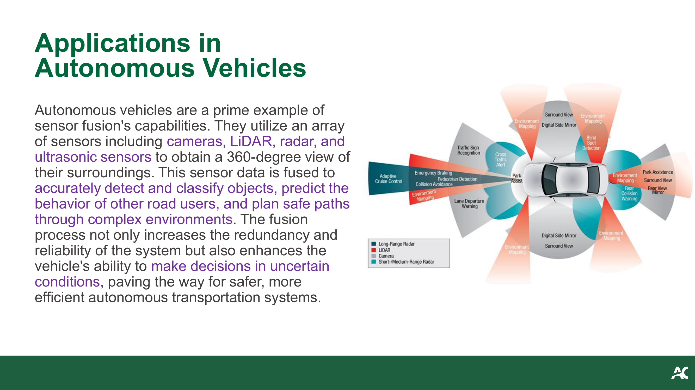

- Autonomous vehicles are a prime example of sensor fusion's capabilities. They utilize an array of sensors including cameras, LiDAR, radar, and ultrasonic sensors to obtain a **360-degree view** of their surroundings.
- 自动驾驶汽车是传感器融合能力的典型示例。它们利用一系列传感器（包括相机、LiDAR、雷达和超声波传感器）获得周围环境的 **360 度视图**。

- This sensor data is fused to accurately **detect and classify objects**, **predict the behavior** of other road users, and **plan safe paths** through complex environments.
- 这些传感器数据被融合以精确**检测和分类物体**、**预测**其他道路使用者的行为，并在复杂环境中**规划安全路径**。

- The fusion process not only increases the **redundancy and reliability** of the system but also enhances the vehicle's ability to make decisions in **uncertain conditions**, paving the way for safer, more efficient autonomous transportation systems.
- 融合过程不仅增加了系统的**冗余性和可靠性**，还增强了车辆在**不确定条件**下做出决策的能力，为更安全、更高效的自动驾驶运输系统铺平道路。

### 9.3 机器人与无人机 (Robotics and Drones)

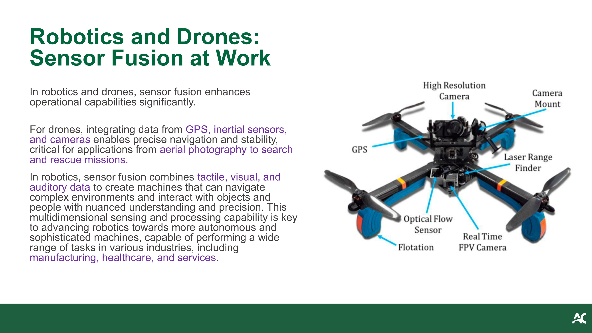

- In **robotics and drones**, sensor fusion enhances operational capabilities significantly.
- 在**机器人和无人机**领域，传感器融合显著增强了操作能力。

- For **drones / 无人机**: Integrating data from GPS, inertial sensors, and cameras enables precise navigation and stability, critical for applications from aerial photography to search and rescue missions.
- 对于**无人机**: 集成来自 GPS、惯性传感器和相机的数据实现精确导航和稳定性，对于从航拍到搜救任务的应用至关重要。

- In **robotics / 机器人**: Sensor fusion combines tactile, visual, and auditory data to create machines that can navigate complex environments and interact with objects and people with nuanced understanding and precision.
- 在**机器人技术**中: 传感器融合结合触觉、视觉和听觉数据，创建能够导航复杂环境并以细致的理解和精确度与物体和人互动的机器。

- This multidimensional sensing and processing capability is key to advancing robotics towards more autonomous and sophisticated machines, capable of performing a wide range of tasks in various industries, including manufacturing, healthcare, and services.
- 这种多维感知和处理能力是推动机器人技术走向更自主和复杂机器的关键，能够在制造业、医疗保健和服务业等各种行业中执行各种任务。

> **📝 Notes:**
>
> **承接**: 上一节讨论了融合的技术挑战和数据处理流程；本节展示了传感器融合在自动驾驶、移动设备、机器人和无人机等领域的具体应用，将理论与实际场景紧密结合；下一节将讨论未来趋势和伦理考量。

---

## 10. 未来趋势与伦理考量 (Future Trends and Ethical Considerations)

### 10.1 传感器技术未来趋势 (Future Trends in Sensor Technology)

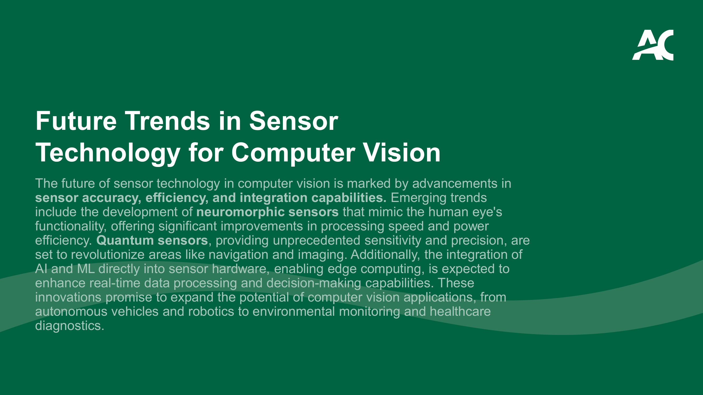

- The future of sensor technology in computer vision is marked by advancements in sensor accuracy, efficiency, and integration capabilities.
- 计算机视觉中传感器技术的未来以传感器精度、效率和集成能力的进步为标志。

- Emerging trends / 新兴趋势:
  - **Neuromorphic sensors / 仿神经传感器**: Mimic the human eye's functionality, offering significant improvements in processing speed and power efficiency / 模拟人眼功能，在处理速度和能效方面提供显著改进
  - **Quantum sensors / 量子传感器**: Providing unprecedented sensitivity and precision, set to revolutionize areas like navigation and imaging / 提供前所未有的灵敏度和精度，将革新导航和成像等领域
  - **Edge AI integration / 边缘 AI 集成**: Integration of AI and ML directly into sensor hardware, enabling edge computing, enhancing real-time data processing and decision-making / 将 AI 和 ML 直接集成到传感器硬件中，实现边缘计算，增强实时数据处理和决策能力

### 10.2 挑战与伦理考量 (Challenges and Ethical Considerations)

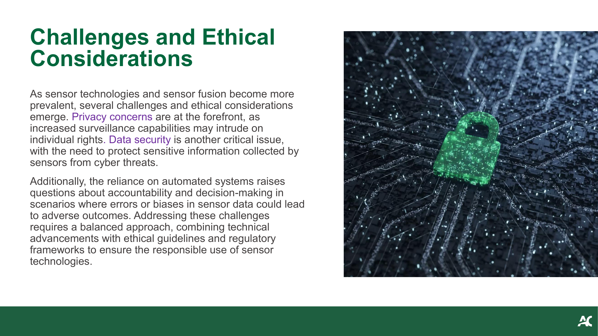

- As sensor technologies and sensor fusion become more prevalent, several challenges and ethical considerations emerge.
- 随着传感器技术和传感器融合的普及，出现了一些挑战和伦理问题。

- **Privacy / 隐私**: Increased surveillance capabilities may intrude on individual rights / 增强的监控能力可能侵犯个人权利
- **Data security / 数据安全**: Need to protect sensitive information collected by sensors from cyber threats / 需要保护传感器收集的敏感信息免受网络威胁
- **Accountability / 问责性**: Reliance on automated systems raises questions about accountability and decision-making in scenarios where errors or biases in sensor data could lead to adverse outcomes / 对自动化系统的依赖引发了关于问责和决策的问题——传感器数据中的错误或偏差可能导致不良后果

- Addressing these challenges requires a balanced approach, combining **technical advancements** with **ethical guidelines** and **regulatory frameworks** to ensure the responsible use of sensor technologies.
- 解决这些挑战需要一种平衡的方法，将**技术进步**与**伦理准则**和**监管框架**相结合，以确保传感器技术的负责任使用。

### 10.3 总结 (Conclusion)

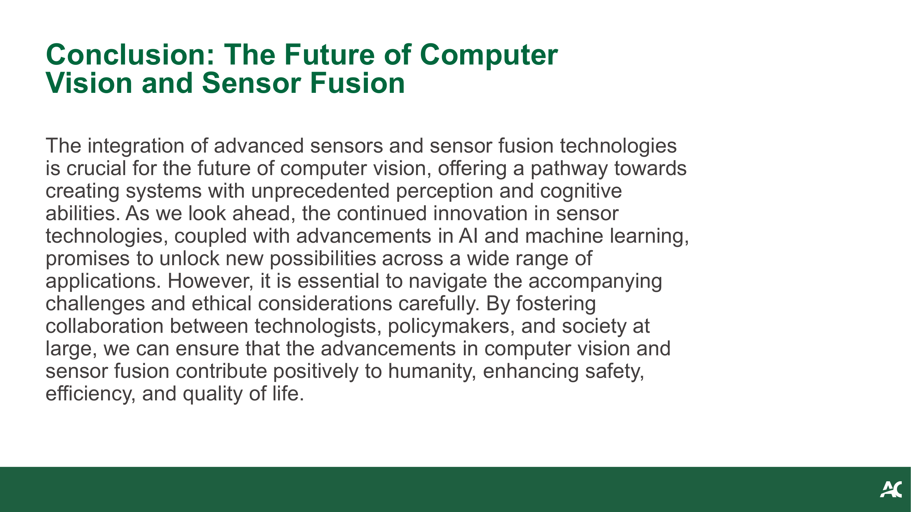

- The integration of advanced sensors and sensor fusion technologies is crucial for the future of computer vision, offering a pathway towards creating systems with unprecedented perception and cognitive abilities.
- 先进传感器和传感器融合技术的集成对于计算机视觉的未来至关重要，为创建具有前所未有的感知和认知能力的系统提供了途径。

- As we look ahead, the continued innovation in sensor technologies, coupled with advancements in AI and machine learning, promises to unlock new possibilities across a wide range of applications.
- 展望未来，传感器技术的持续创新，加上人工智能和机器学习的进步，有望在广泛的应用领域中释放新的可能性。

- By fostering collaboration between **technologists, policymakers, and society at large**, we can ensure that the advancements in computer vision and sensor fusion contribute positively to humanity, enhancing safety, efficiency, and quality of life.
- 通过推动**技术人员、政策制定者和社会各界**之间的合作，我们可以确保计算机视觉和传感器融合的进步对人类产生积极贡献，提升安全性、效率和生活质量。

> **📝 Notes:**
>
> **承接**: 前面各节完成了从传感器类型到融合技术再到实际应用的完整技术链；本节展望未来技术趋势（仿神经、量子、边缘 AI），讨论伦理挑战（隐私、安全、问责），并以全课程总结收尾；下面附录为期末考试复习要点。

---

## 附录：期末复习要点 (Appendix: Revision Topics)

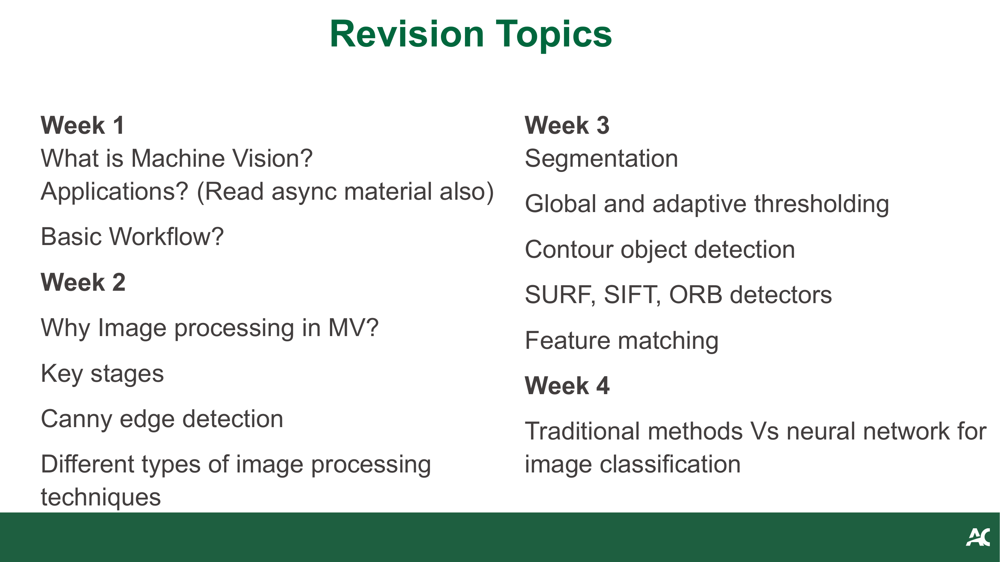

**Week 1**: What is Machine Vision? Applications? Basic Workflow?

**Week 2 (Async)**: Segmentation, Global and adaptive thresholding, Contour object detection

**Week 3**: SURF, SIFT, ORB detectors, Feature matching, Canny edge detection

**Week 4**: Traditional methods vs neural network for image classification

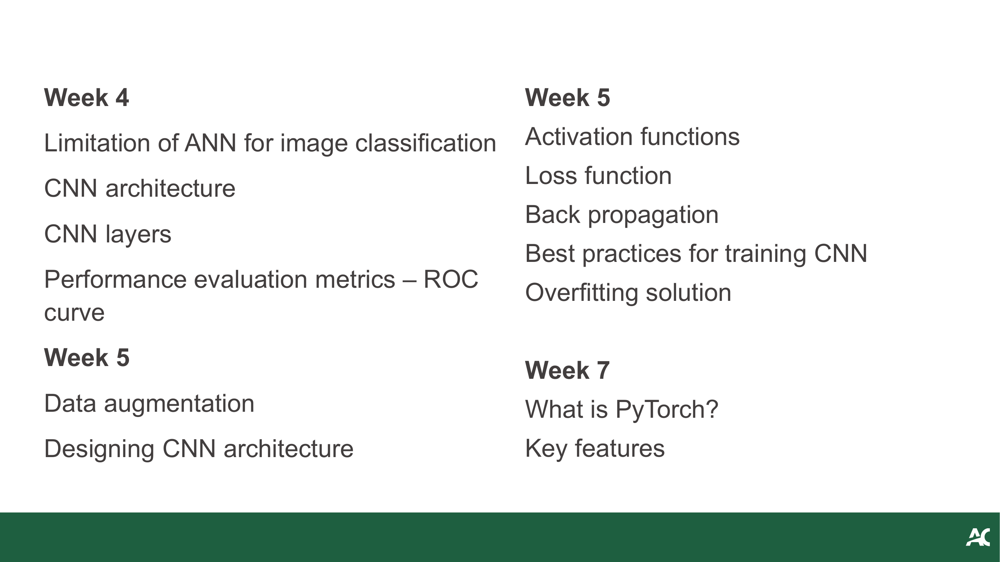

**Week 4 (cont.)**: Activation functions, Loss function, Back propagation, CNN architecture, CNN layers, Best practices for training CNN, Overfitting solutions

**Week 5**: Limitation of ANN for image classification, Performance evaluation metrics – ROC curve, Data augmentation, Designing CNN architecture

**Week 7**: What is PyTorch? Key features

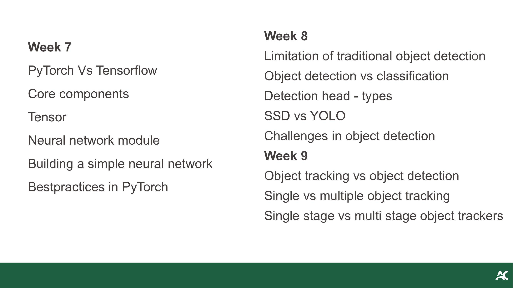

**Week 7 (cont.)**: PyTorch vs TensorFlow, Core components, Tensor, Neural network module, Building a simple neural network, Best practices in PyTorch

**Week 8**: Limitation of traditional object detection, Object detection vs classification, Detection head types, SSD vs YOLO, Challenges in object detection

**Week 9**: Object tracking vs object detection, Single vs multiple object tracking, Single stage vs multi stage object trackers, Data augmentation, Designing CNN architecture

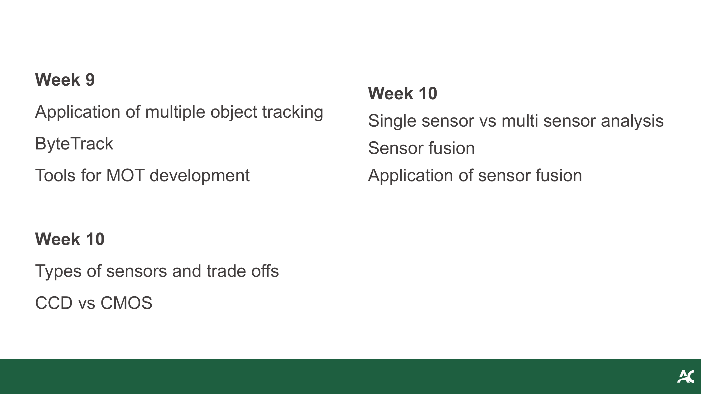

**Week 9 (cont.)**: Application of multiple object tracking, ByteTrack, Tools for MOT development

**Week 10**: Single sensor vs multi sensor analysis, Sensor fusion, Application of sensor fusion, Types of sensors and trade-offs, CCD vs CMOS
