# Week 11: OpenMMLab 与 CV 技术栈 (OpenMMLab and CV Tech Stack)

> Source: `Week 11 - OpenMMLab and CV Tech Stack.pptx`
> Total slides: 30
> Instructor: Stephin Rachel Thomas | June 30, 2025

---

## 1. 课程概览 (Course Overview)

**OpenMMLab and CV Tech Stack** — OpenMMLab 与 CV 技术栈

---

## 2. OpenMMLab 简介 (Introduction to OpenMMLab)

### 2.1 什么是 OpenMMLab (What is OpenMMLab?)

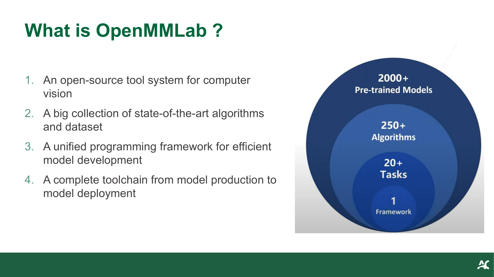

**What is OpenMMLab?** — 什么是 OpenMMLab？

1. An open-source tool system for computer vision — 用于计算机视觉的开源工具体系
2. A big collection of state-of-the-art algorithms and dataset — 大量最先进算法和数据集的集合
3. A unified programming framework for efficient model development — 用于高效模型开发的统一编程框架
4. A complete toolchain from model production to model deployment — 从模型生产到模型部署的完整工具链

### 2.2 设计理念 (The Philosophy Behind OpenMMLab)

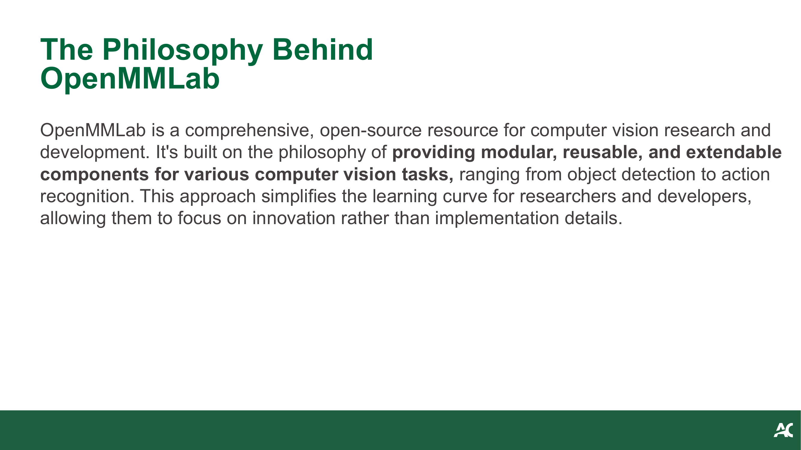

**The Philosophy Behind OpenMMLab** — OpenMMLab 的设计理念

- OpenMMLab is a comprehensive, open-source resource for computer vision research and development. — OpenMMLab 是用于计算机视觉研究和开发的综合性开源资源。
- It's built on the philosophy of providing modular, reusable, and extendable components for various computer vision tasks, ranging from object detection to action recognition. — 其设计理念是为从目标检测到动作识别等各种计算机视觉任务提供模块化、可复用和可扩展的组件。
- This approach simplifies the learning curve for researchers and developers, allowing them to focus on innovation rather than implementation details. — 这种方法简化了研究人员和开发者的学习曲线，使他们能专注于创新而非实现细节。

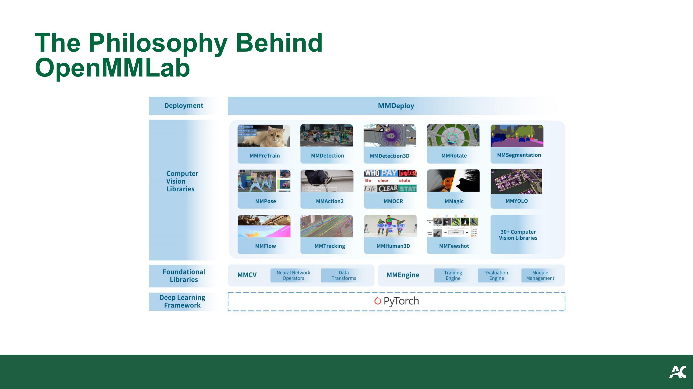

**The Philosophy Behind OpenMMLab** — OpenMMLab 设计理念（图示）

---

## 3. 模块化方法 (Modular Approach in OpenMMLab)

### 3.1 模块化设计 (Modular Design)

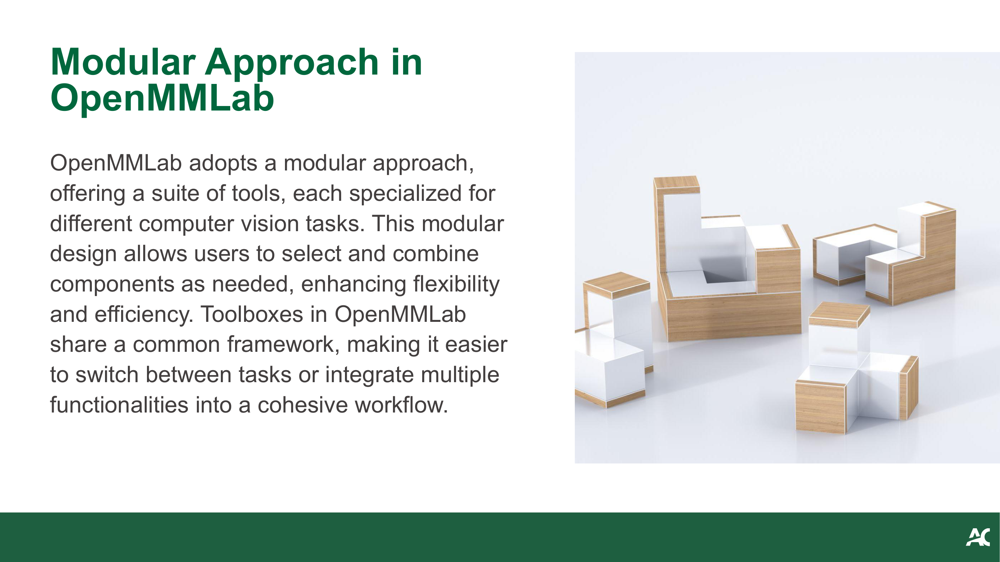

**Modular Approach in OpenMMLab** — OpenMMLab 的模块化方法

- OpenMMLab adopts a modular approach, offering a suite of tools, each specialized for different computer vision tasks. — OpenMMLab 采用模块化方法，提供一套工具，每个工具专门用于不同的计算机视觉任务。
- This modular design allows users to select and combine components as needed, enhancing flexibility and efficiency. — 这种模块化设计允许用户按需选择和组合组件，增强灵活性和效率。
- Toolboxes in OpenMMLab share a common framework, making it easier to switch between tasks or integrate multiple functionalities into a cohesive workflow. — OpenMMLab 中的工具箱共享一个通用框架，使得在任务之间切换或将多个功能集成到一个连贯的工作流中变得更容易。

### 3.2 多样化源码的挑战 (Challenges of Diverse Source Codes)

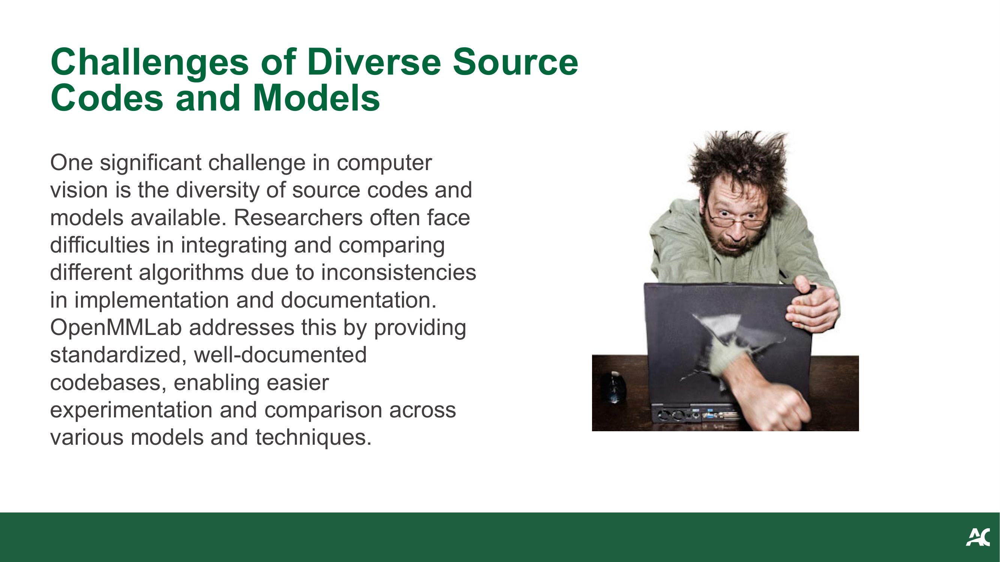

**Challenges of Diverse Source Codes and Models** — 多样化源码和模型的挑战

- One significant challenge in computer vision is the diversity of source codes and models available. — 计算机视觉中的一个重大挑战是可用源码和模型的多样性。
- Researchers often face difficulties in integrating and comparing different algorithms due to inconsistencies in implementation and documentation. — 研究人员由于实现和文档的不一致性，在集成和比较不同算法时经常遇到困难。
- OpenMMLab addresses this by providing standardized, well-documented codebases, enabling easier experimentation and comparison across various models and techniques. — OpenMMLab 通过提供标准化、文档完善的代码库来解决这一问题，使跨各种模型和技术的更容易实验和比较。

### 3.3 统一接口 (Unified Interface)

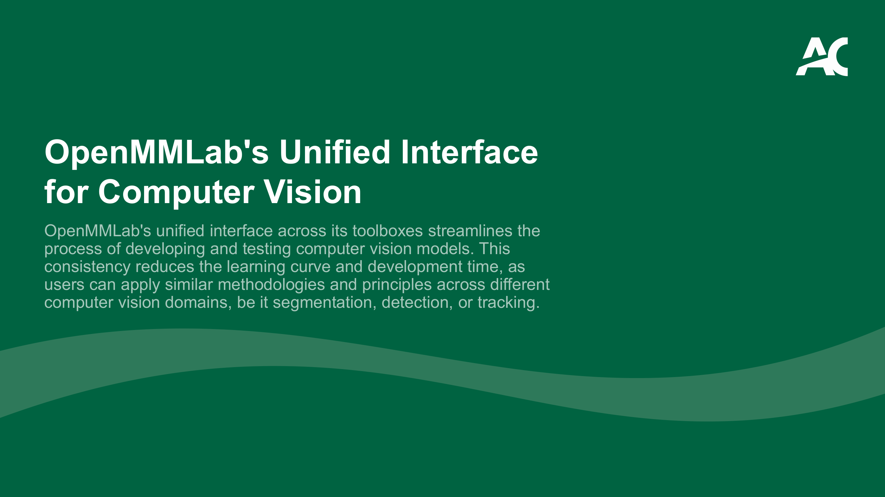

**OpenMMLab's Unified Interface for Computer Vision** — OpenMMLab 的统一计算机视觉接口

- OpenMMLab's unified interface across its toolboxes streamlines the process of developing and testing computer vision models. — OpenMMLab 跨工具箱的统一接口简化了开发和测试计算机视觉模型的过程。
- This consistency reduces the learning curve and development time, as users can apply similar methodologies and principles across different computer vision domains, be it segmentation, detection, or tracking. — 这种一致性减少了学习曲线和开发时间，用户可以在不同的计算机视觉领域应用类似的方法和原则，无论是分割、检测还是跟踪。

---

## 4. OpenMMLab 核心工具箱 (Core OpenMMLab Toolboxes)

### 4.1 MMPretrain: 预训练与分类 (Pre-trained Models and Classification)

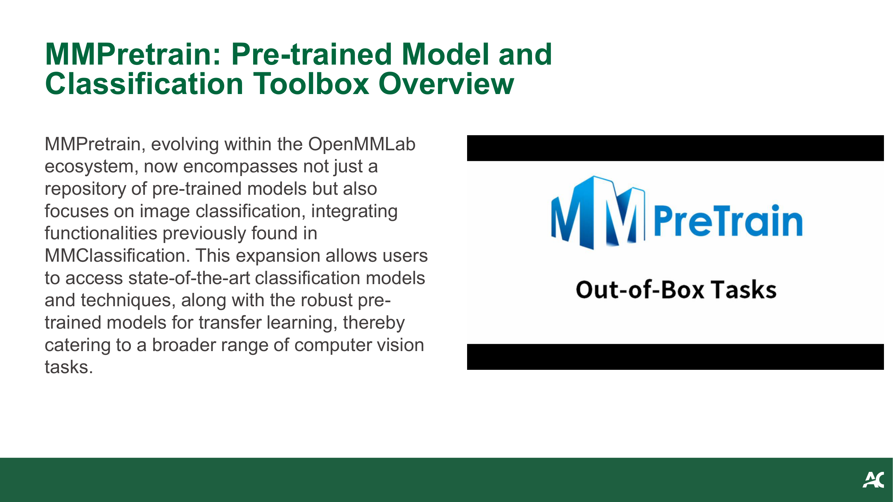

**MMPretrain: Pre-trained Model and Classification Toolbox Overview** — MMPretrain：预训练模型与分类工具箱概述

- MMPretrain, evolving within the OpenMMLab ecosystem, now encompasses not just a repository of pre-trained models but also focuses on image classification, integrating functionalities previously found in MMClassification. — MMPretrain 在 OpenMMLab 生态系统中不断演进，现在不仅包含预训练模型库，还专注于图像分类，整合了之前 MMClassification 中的功能。
- This expansion allows users to access state-of-the-art classification models and techniques, along with the robust pre-trained models for transfer learning, thereby catering to a broader range of computer vision tasks. — 这一扩展使用户能够获取最先进的分类模型和技术，以及用于迁移学习的强大预训练模型，从而满足更广泛的计算机视觉任务需求。

### 4.2 MMDetection: 目标检测 (Object Detection)

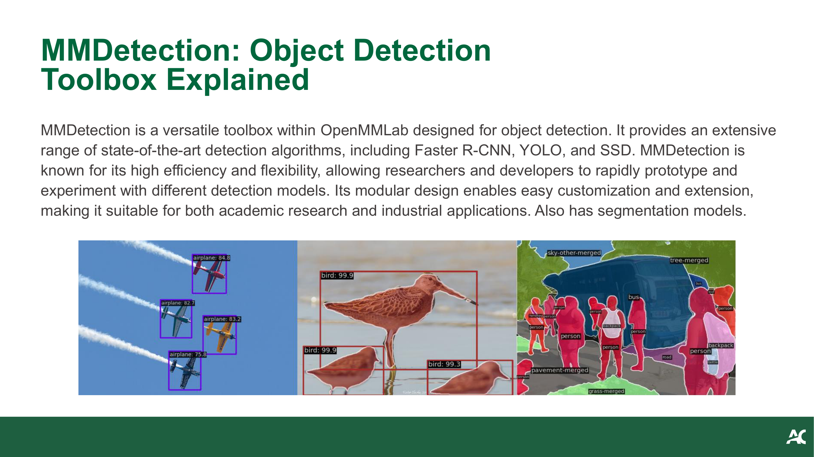

**MMDetection: Object Detection Toolbox Explained** — MMDetection：目标检测工具箱解析

- MMDetection is a versatile toolbox within OpenMMLab designed for object detection. — MMDetection 是 OpenMMLab 中专为目标检测设计的通用工具箱。
- It provides an extensive range of state-of-the-art detection algorithms, including Faster R-CNN, YOLO, and SSD. — 它提供了大量最先进的检测算法，包括 Faster R-CNN、YOLO 和 SSD。
- MMDetection is known for its high efficiency and flexibility, allowing researchers and developers to rapidly prototype and experiment with different detection models. — MMDetection 以高效性和灵活性著称，使研究人员和开发者能快速原型化和实验不同的检测模型。
- Its modular design enables easy customization and extension, making it suitable for both academic research and industrial applications. Also has segmentation models. — 其模块化设计便于自定义和扩展，适合学术研究和工业应用。也包含分割模型。

### 4.3 MMDetection3D: 3D 目标检测 (3D Object Detection)

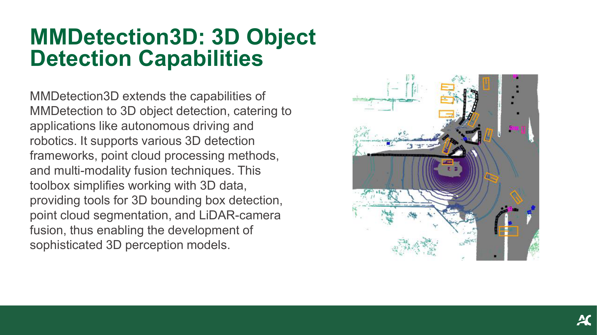

**MMDetection3D: 3D Object Detection Capabilities** — MMDetection3D：3D 目标检测能力

- MMDetection3D extends the capabilities of MMDetection to 3D object detection, catering to applications like autonomous driving and robotics. — MMDetection3D 将 MMDetection 的能力扩展到 3D 目标检测，适用于自动驾驶和机器人等应用。
- It supports various 3D detection frameworks, point cloud processing methods, and multi-modality fusion techniques. — 它支持各种 3D 检测框架、点云处理方法和多模态融合技术。
- This toolbox simplifies working with 3D data, providing tools for 3D bounding box detection, point cloud segmentation, and LiDAR-camera fusion, thus enabling the development of sophisticated 3D perception models. — 该工具箱简化了与 3D 数据的工作，提供 3D 边界框检测、点云分割和 LiDAR-相机融合工具，从而开发复杂的 3D 感知模型。

### 4.4 MMRotate: 旋转检测 (Rotation Detection)

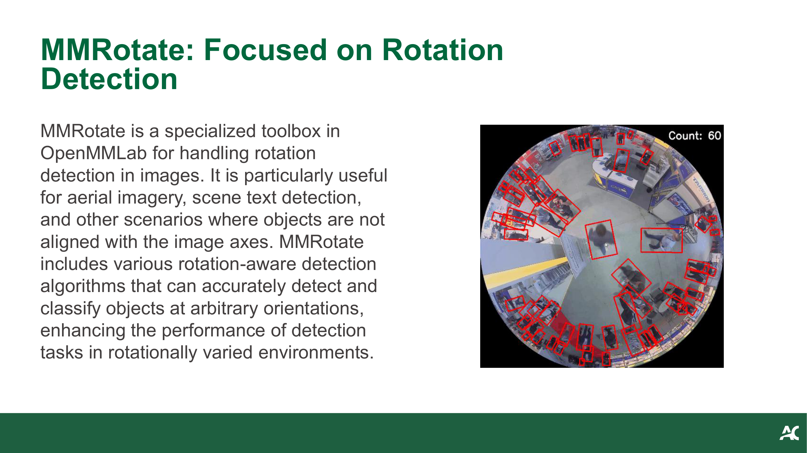

**MMRotate: Focused on Rotation Detection** — MMRotate：专注旋转检测

- MMRotate is a specialized toolbox in OpenMMLab for handling rotation detection in images. — MMRotate 是 OpenMMLab 中专门处理图像旋转检测的工具箱。
- It is particularly useful for aerial imagery, scene text detection, and other scenarios where objects are not aligned with the image axes. — 它特别适用于航拍图像、场景文字检测以及物体未与图像轴对齐的其他场景。
- MMRotate includes various rotation-aware detection algorithms that can accurately detect and classify objects at arbitrary orientations, enhancing the performance of detection tasks in rotationally varied environments. — MMRotate 包含各种旋转感知检测算法，可以准确检测和分类任意方向的物体，增强旋转变化环境中检测任务的性能。

### 4.5 MMTracking: 视频目标跟踪 (Video Object Tracking)

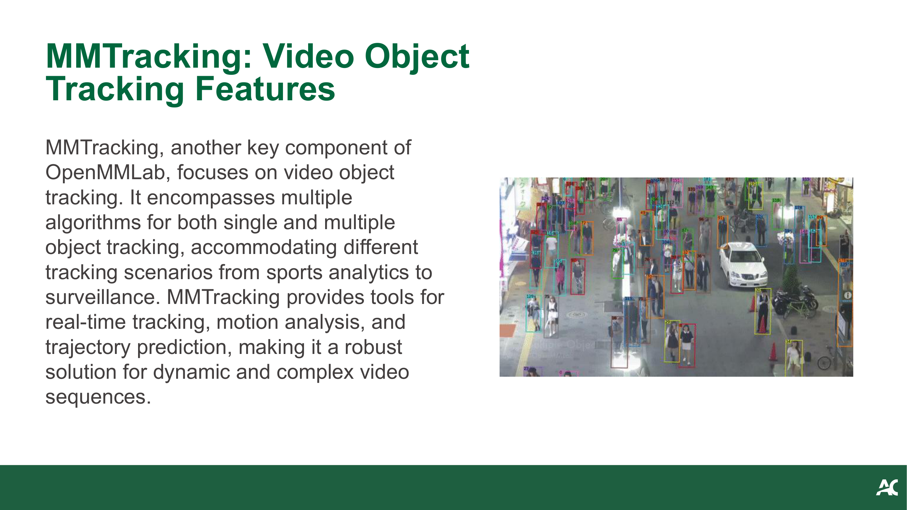

**MMTracking: Video Object Tracking Features** — MMTracking：视频目标跟踪功能

- MMTracking, another key component of OpenMMLab, focuses on video object tracking. — MMTracking 是 OpenMMLab 的另一个关键组件，专注于视频目标跟踪。
- It encompasses multiple algorithms for both single and multiple object tracking, accommodating different tracking scenarios from sports analytics to surveillance. — 它包含多种用于单目标和多目标跟踪的算法，适应从体育分析到监控的不同跟踪场景。
- MMTracking provides tools for real-time tracking, motion analysis, and trajectory prediction, making it a robust solution for dynamic and complex video sequences. — MMTracking 提供实时跟踪、运动分析和轨迹预测工具，是动态复杂视频序列的强大解决方案。

### 4.6 MMSegmentation: 语义分割 (Semantic Segmentation)

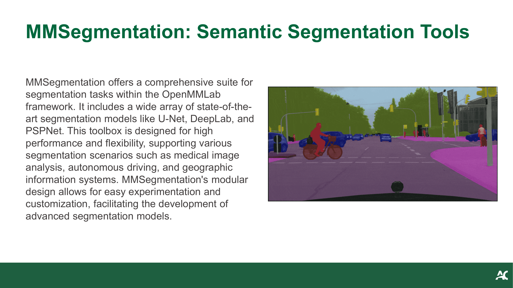

**MMSegmentation: Semantic Segmentation Tools** — MMSegmentation：语义分割工具

- MMSegmentation offers a comprehensive suite for segmentation tasks within the OpenMMLab framework. — MMSegmentation 在 OpenMMLab 框架内为分割任务提供了一个综合工具套件。
- It includes a wide array of state-of-the-art segmentation models like U-Net, DeepLab, and PSPNet. — 它包含大量最先进的分割模型，如 U-Net、DeepLab 和 PSPNet。
- This toolbox is designed for high performance and flexibility, supporting various segmentation scenarios such as medical image analysis, autonomous driving, and geographic information systems. — 该工具箱设计用于高性能和灵活性，支持医学图像分析、自动驾驶和地理信息系统等各种分割场景。
- MMSegmentation's modular design allows for easy experimentation and customization, facilitating the development of advanced segmentation models. — MMSegmentation 的模块化设计便于实验和自定义，促进高级分割模型的开发。

### 4.7 MMAction2: 动作识别 (Action Recognition)

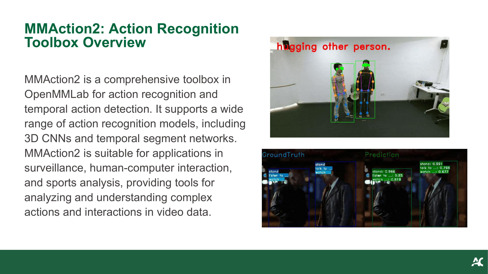

**MMAction2: Action Recognition Toolbox Overview** — MMAction2：动作识别工具箱概述

- MMAction2 is a comprehensive toolbox in OpenMMLab for action recognition and temporal action detection. — MMAction2 是 OpenMMLab 中用于动作识别和时序动作检测的综合工具箱。
- It supports a wide range of action recognition models, including 3D CNNs and temporal segment networks. — 它支持多种动作识别模型，包括 3D CNN 和时序片段网络。
- MMAction2 is suitable for applications in surveillance, human-computer interaction, and sports analysis, providing tools for analyzing and understanding complex actions and interactions in video data. — MMAction2 适用于监控、人机交互和体育分析等应用，提供分析和理解视频数据中复杂动作和交互的工具。

### 4.8 MMDeploy: 部署工具 (Deployment Tools)

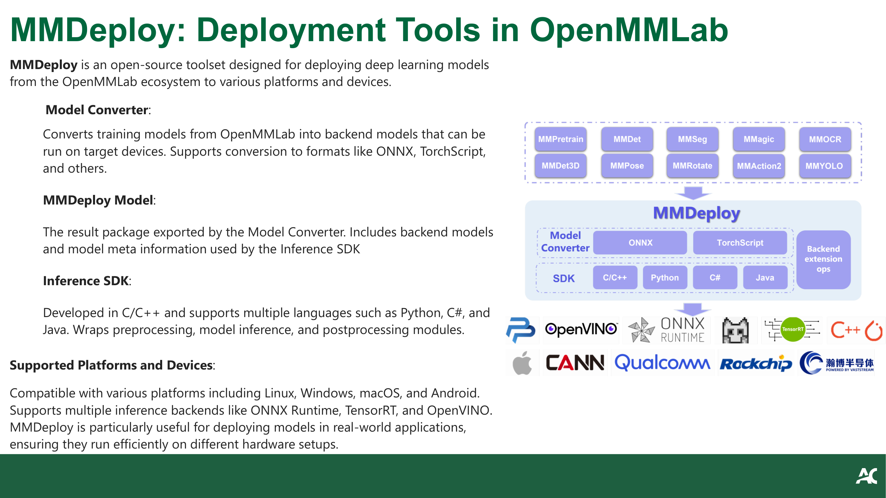

**MMDeploy: Deployment Tools in OpenMMLab** — MMDeploy：OpenMMLab 中的部署工具

- MMDeploy is an open-source toolset designed for deploying deep learning models from the OpenMMLab ecosystem to various platforms and devices. — MMDeploy 是一个开源工具集，旨在将 OpenMMLab 生态系统中的深度学习模型部署到各种平台和设备上。
- **Model Converter** — **模型转换器**: Converts training models from OpenMMLab into backend models that can be run on target devices. Supports conversion to formats like ONNX, TorchScript, and others. — 将 OpenMMLab 的训练模型转换为可在目标设备上运行的后端模型。支持转换为 ONNX、TorchScript 等格式。
- **MMDeploy Model** — **MMDeploy 模型**: The result package exported by the Model Converter. Includes backend models and model meta information used by the Inference SDK. — 模型转换器导出的结果包。包含后端模型和推理 SDK 使用的模型元信息。
- **Inference SDK** — **推理 SDK**: Developed in C/C++ and supports multiple languages such as Python, C#, and Java. Wraps preprocessing, model inference, and postprocessing modules. — 用 C/C++ 开发，支持 Python、C#、Java 等多种语言。封装了预处理、模型推理和后处理模块。
- **Supported Platforms and Devices** — **支持的平台和设备**: Compatible with various platforms including Linux, Windows, macOS, and Android. Supports multiple inference backends like ONNX Runtime, TensorRT, and OpenVINO. — 兼容 Linux、Windows、macOS 和 Android 等多种平台。支持 ONNX Runtime、TensorRT 和 OpenVINO 等多种推理后端。
- MMDeploy is particularly useful for deploying models in real-world applications, ensuring they run efficiently on different hardware setups. — MMDeploy 特别适合在实际应用中部署模型，确保在不同硬件配置上高效运行。

---

## 5. Conda 环境管理 (Conda Environment Management)

### 5.1 Conda 在 CV 中的重要性 (Importance of Conda in CV)

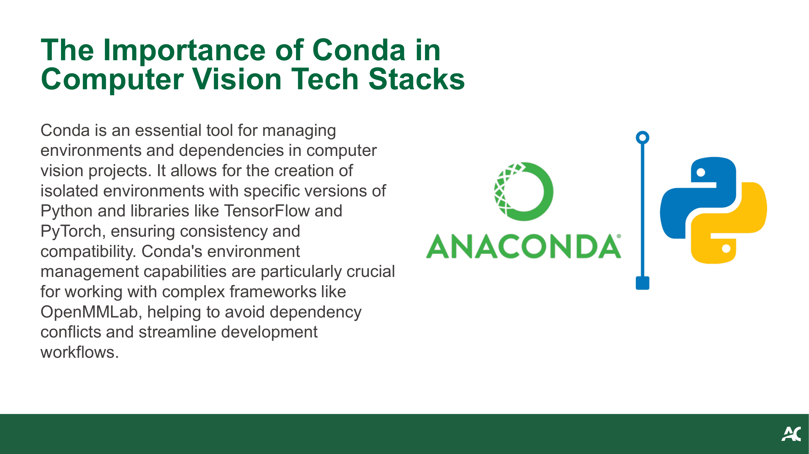

**The Importance of Conda in Computer Vision Tech Stacks** — Conda 在计算机视觉技术栈中的重要性

- Conda is an essential tool for managing environments and dependencies in computer vision projects. — Conda 是管理计算机视觉项目中环境和依赖的重要工具。
- It allows for the creation of isolated environments with specific versions of Python and libraries like TensorFlow and PyTorch, ensuring consistency and compatibility. — 它允许创建隔离的环境，包含特定版本的 Python 和 TensorFlow、PyTorch 等库，确保一致性和兼容性。
- Conda's environment management capabilities are particularly crucial for working with complex frameworks like OpenMMLab, helping to avoid dependency conflicts and streamline development workflows. — Conda 的环境管理能力对于与 OpenMMLab 等复杂框架协作尤为关键，有助于避免依赖冲突和简化开发工作流。

### 5.2 Conda 基础与安装 (Conda Basics and Installation)

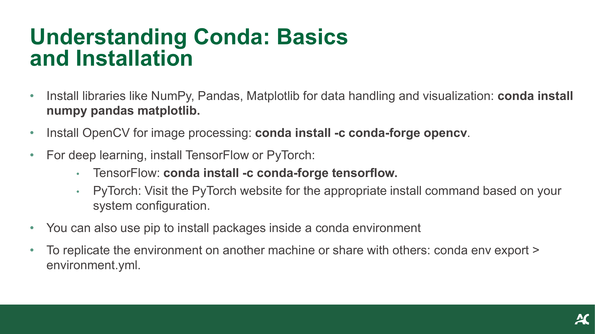

**Understanding Conda: Basics and Installation** — 理解 Conda：基础与安装

- Install libraries like NumPy, Pandas, Matplotlib for data handling and visualization: `conda install numpy pandas matplotlib`. — 安装 NumPy、Pandas、Matplotlib 等库用于数据处理和可视化：`conda install numpy pandas matplotlib`。
- Install OpenCV for image processing: `conda install -c conda-forge opencv`. — 安装 OpenCV 用于图像处理：`conda install -c conda-forge opencv`。
- For deep learning, install TensorFlow or PyTorch: — 对于深度学习，安装 TensorFlow 或 PyTorch：
  - TensorFlow: `conda install -c conda-forge tensorflow`. — TensorFlow：`conda install -c conda-forge tensorflow`。
  - PyTorch: Visit the PyTorch website for the appropriate install command based on your system configuration. — PyTorch：访问 PyTorch 网站获取基于系统配置的适当安装命令。
- You can also use pip to install packages inside a conda environment. — 也可以在 conda 环境中使用 pip 安装包。
- To replicate the environment on another machine or share with others: `conda env export > environment.yml`. — 要在另一台机器上复制环境或与他人共享：`conda env export > environment.yml`。

### 5.3 Conda 高级功能 (Advanced Features of Conda)

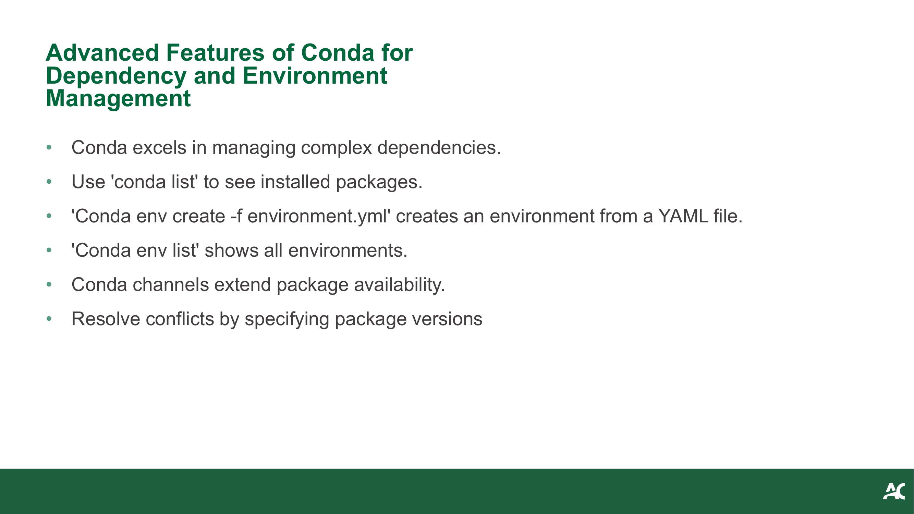

**Advanced Features of Conda for Dependency and Environment Management** — Conda 依赖和环境管理的高级功能

- Conda excels in managing complex dependencies. — Conda 擅长管理复杂依赖。
- Use `conda list` to see installed packages. — 使用 `conda list` 查看已安装的包。
- `conda env create -f environment.yml` creates an environment from a YAML file. — `conda env create -f environment.yml` 从 YAML 文件创建环境。
- `conda env list` shows all environments. — `conda env list` 显示所有环境。
- Conda channels extend package availability. — Conda 频道扩展了包的可用性。
- Resolve conflicts by specifying package versions. — 通过指定包版本来解决冲突。

---

## 6. Docker 容器化 (Docker Containerization)

### 6.1 Docker 简介 (Introduction to Docker)

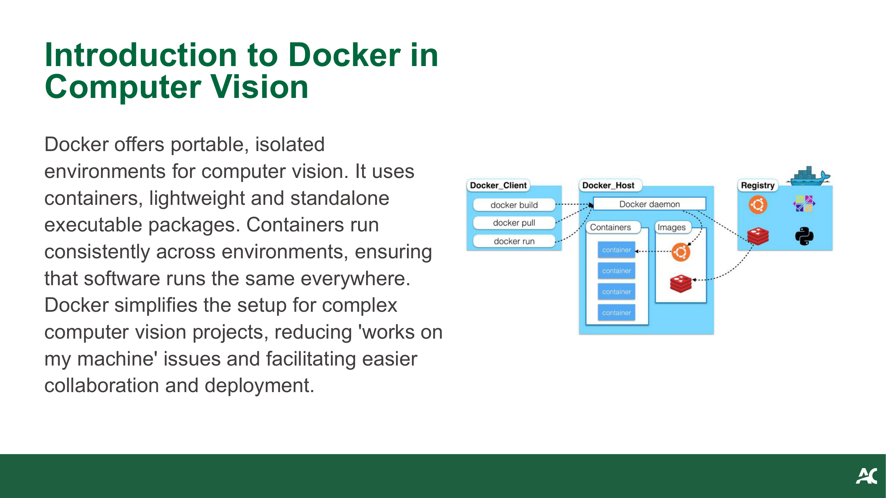

**Introduction to Docker in Computer Vision** — Docker 在计算机视觉中的简介

- Docker offers portable, isolated environments for computer vision. — Docker 为计算机视觉提供可移植的隔离环境。
- It uses containers, lightweight and standalone executable packages. — 它使用容器——轻量级、独立的可执行包。
- Containers run consistently across environments, ensuring that software runs the same everywhere. — 容器在各种环境中一致运行，确保软件在任何地方运行方式相同。
- Docker simplifies the setup for complex computer vision projects, reducing 'works on my machine' issues and facilitating easier collaboration and deployment. — Docker 简化了复杂计算机视觉项目的设置，减少"在我的机器上可以运行"的问题，便于协作和部署。

### 6.2 Docker 开发与部署 (Docker Development and Deployment)

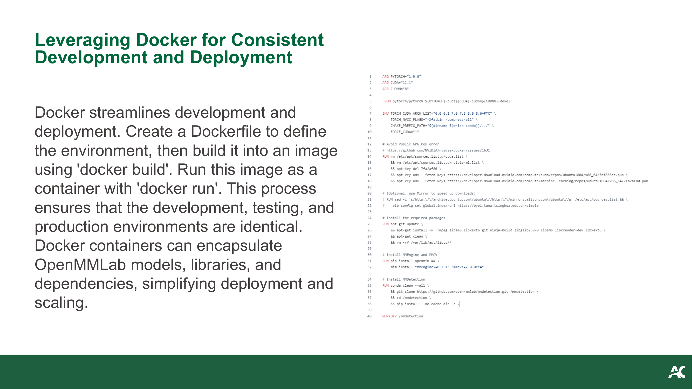

**Leveraging Docker for Consistent Development and Deployment** — 利用 Docker 实现一致的开发和部署

- Docker streamlines development and deployment. — Docker 简化了开发和部署。
- Create a Dockerfile to define the environment, then build it into an image using `docker build`. — 创建 Dockerfile 定义环境，然后使用 `docker build` 构建为镜像。
- Run this image as a container with `docker run`. — 使用 `docker run` 将镜像作为容器运行。
- This process ensures that the development, testing, and production environments are identical. — 此过程确保开发、测试和生产环境完全一致。
- Docker containers can encapsulate OpenMMLab models, libraries, and dependencies, simplifying deployment and scaling. — Docker 容器可以封装 OpenMMLab 模型、库和依赖，简化部署和扩展。

### 6.3 Docker Hub (Docker Hub)

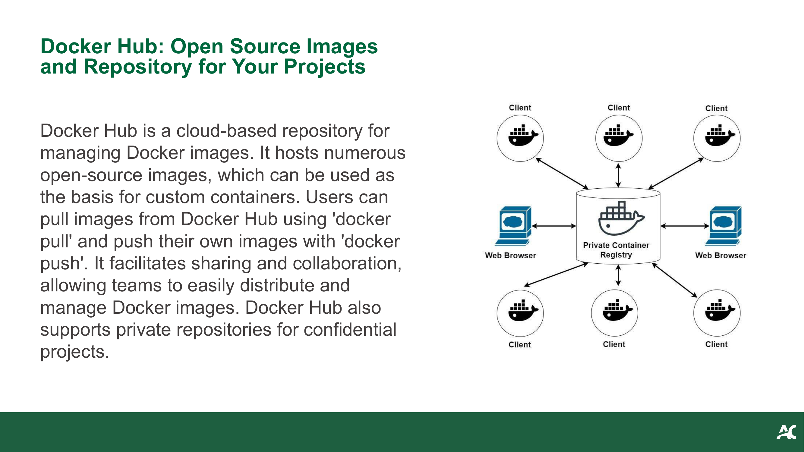

**Docker Hub: Open Source Images and Repository for Your Projects** — Docker Hub：项目的开源镜像和仓库

- Docker Hub is a cloud-based repository for managing Docker images. — Docker Hub 是基于云的 Docker 镜像管理仓库。
- It hosts numerous open-source images, which can be used as the basis for custom containers. — 它托管大量开源镜像，可作为自定义容器的基础。
- Users can pull images from Docker Hub using `docker pull` and push their own images with `docker push`. — 用户可以使用 `docker pull` 拉取镜像，使用 `docker push` 推送自己的镜像。
- It facilitates sharing and collaboration, allowing teams to easily distribute and manage Docker images. — 它促进共享和协作，使团队能轻松分发和管理 Docker 镜像。
- Docker Hub also supports private repositories for confidential projects. — Docker Hub 还支持用于机密项目的私有仓库。

---

## 7. VS Code 开发工具 (VS Code Development Tools)

### 7.1 VS Code 简介 (VS Code for CV Development)

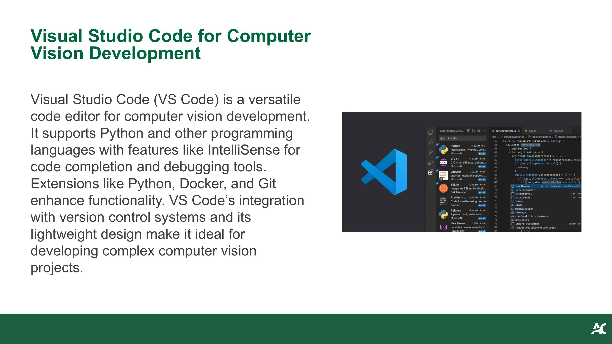

**Visual Studio Code for Computer Vision Development** — VS Code 用于计算机视觉开发

- Visual Studio Code (VS Code) is a versatile code editor for computer vision development. — Visual Studio Code (VS Code) 是用于计算机视觉开发的通用代码编辑器。
- It supports Python and other programming languages with features like IntelliSense for code completion and debugging tools. — 它支持 Python 和其他编程语言，具有 IntelliSense 代码补全和调试工具等功能。
- Extensions like Python, Docker, and Git enhance functionality. — Python、Docker 和 Git 等扩展增强了功能。
- VS Code's integration with version control systems and its lightweight design make it ideal for developing complex computer vision projects. — VS Code 与版本控制系统的集成及其轻量化设计使其成为开发复杂计算机视觉项目的理想选择。

### 7.2 插件与远程调试 (Plugins and Remote Debugging)

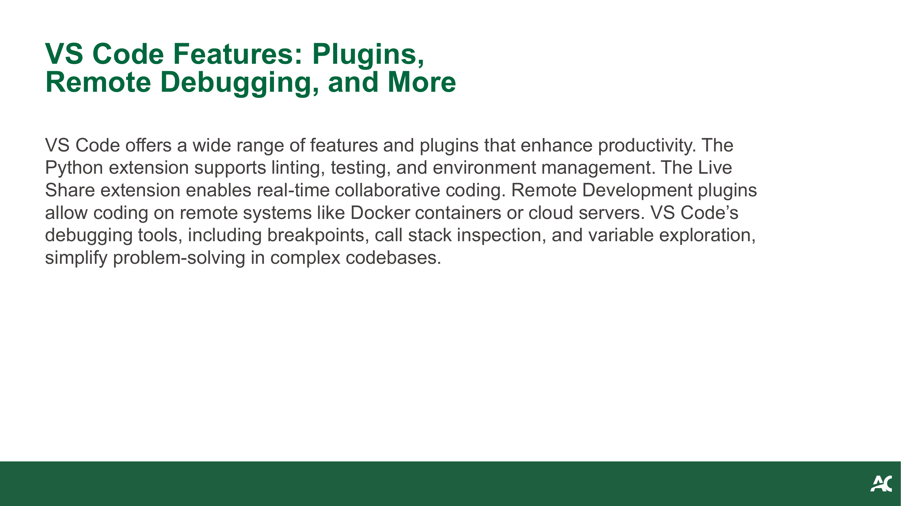

**VS Code Features: Plugins, Remote Debugging, and More** — VS Code 功能：插件、远程调试等

- VS Code offers a wide range of features and plugins that enhance productivity. — VS Code 提供大量增强生产力的功能和插件。
- The Python extension supports linting, testing, and environment management. — Python 扩展支持代码检查、测试和环境管理。
- The Live Share extension enables real-time collaborative coding. — Live Share 扩展支持实时协作编程。
- Remote Development plugins allow coding on remote systems like Docker containers or cloud servers. — Remote Development 插件允许在 Docker 容器或云服务器等远程系统上编程。
- VS Code's debugging tools, including breakpoints, call stack inspection, and variable exploration, simplify problem-solving in complex codebases. — VS Code 的调试工具（包括断点、调用栈检查和变量查看）简化了复杂代码库中的问题排查。

### 7.3 在 Docker 中调试 (Debugging in Docker with VS Code)

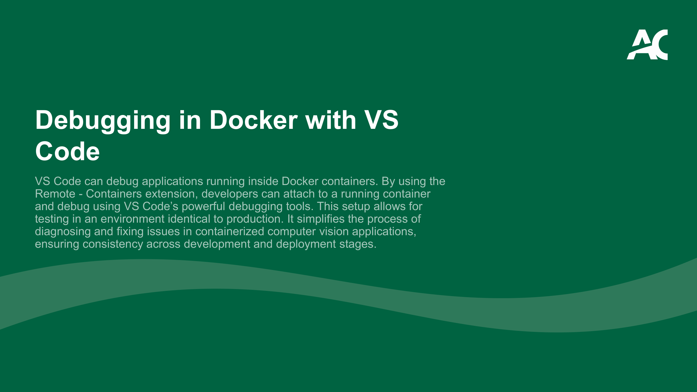

**Debugging in Docker with VS Code** — 在 Docker 中使用 VS Code 调试

- VS Code can debug applications running inside Docker containers. — VS Code 可以调试在 Docker 容器内运行的应用。
- By using the Remote - Containers extension, developers can attach to a running container and debug using VS Code's powerful debugging tools. — 通过使用 Remote - Containers 扩展，开发者可以附加到运行中的容器并使用 VS Code 强大的调试工具进行调试。
- This setup allows for testing in an environment identical to production. — 这种设置允许在与生产环境完全一致的环境中进行测试。
- It simplifies the process of diagnosing and fixing issues in containerized computer vision applications, ensuring consistency across development and deployment stages. — 它简化了容器化计算机视觉应用中问题诊断和修复的过程，确保开发和部署阶段的一致性。

---

## 8. AWS EC2 云计算 (AWS EC2 Cloud Computing)

### 8.1 EC2 简介 (Introduction to EC2)

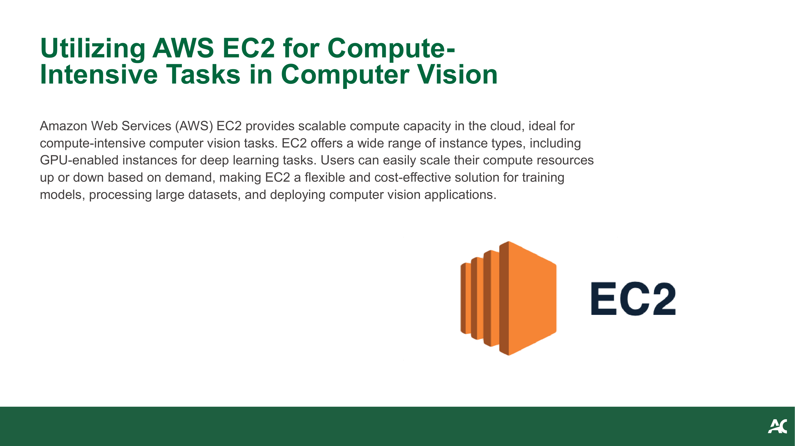

**Utilizing AWS EC2 for Compute-Intensive Tasks in Computer Vision** — 利用 AWS EC2 进行计算机视觉中的计算密集型任务

- Amazon Web Services (AWS) EC2 provides scalable compute capacity in the cloud, ideal for compute-intensive computer vision tasks. — AWS EC2 在云端提供可扩展的计算容量，适合计算密集型的计算机视觉任务。
- EC2 offers a wide range of instance types, including GPU-enabled instances for deep learning tasks. — EC2 提供多种实例类型，包括用于深度学习任务的 GPU 实例。
- Users can easily scale their compute resources up or down based on demand, making EC2 a flexible and cost-effective solution for training models, processing large datasets, and deploying computer vision applications. — 用户可以根据需求轻松扩展或缩减计算资源，使 EC2 成为训练模型、处理大型数据集和部署计算机视觉应用的灵活且经济的解决方案。

### 8.2 EC2 工作负载优化 (Optimizing Workloads on EC2)

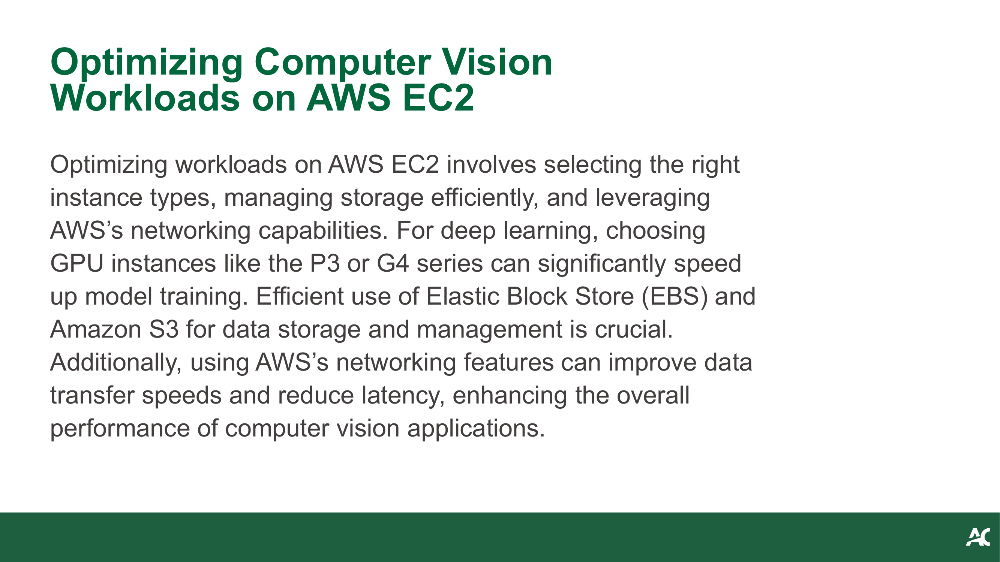

**Optimizing Computer Vision Workloads on AWS EC2** — 优化 AWS EC2 上的计算机视觉工作负载

- Optimizing workloads on AWS EC2 involves selecting the right instance types, managing storage efficiently, and leveraging AWS's networking capabilities. — 优化 AWS EC2 上的工作负载涉及选择正确的实例类型、高效管理存储和利用 AWS 的网络能力。
- For deep learning, choosing GPU instances like the P3 or G4 series can significantly speed up model training. — 对于深度学习，选择 P3 或 G4 系列等 GPU 实例可以显著加速模型训练。
- Efficient use of Elastic Block Store (EBS) and Amazon S3 for data storage and management is crucial. — 高效使用 EBS 和 Amazon S3 进行数据存储和管理至关重要。
- Additionally, using AWS's networking features can improve data transfer speeds and reduce latency, enhancing the overall performance of computer vision applications. — 此外，使用 AWS 的网络功能可以提高数据传输速度并降低延迟，增强计算机视觉应用的整体性能。

### 8.3 可扩展性与成本管理 (Scalability and Cost Management)

**Advanced Use of AWS EC2: Scalability and Cost Management** — AWS EC2 高级使用：可扩展性与成本管理

- AWS EC2 excels in scalable computing, allowing users to adjust resources as per project demands. — AWS EC2 在可扩展计算方面表现出色，允许用户根据项目需求调整资源。
- It's vital for handling varying workloads, especially in large-scale computer vision projects. — 对于处理变化的工作负载至关重要，特别是大规模计算机视觉项目。
- Utilize Auto Scaling to adjust capacity and maintain performance. — 利用 Auto Scaling 调整容量并保持性能。
- Cost management tools like AWS Budgets and Cost Explorer help monitor and optimize expenses. — AWS Budgets 和 Cost Explorer 等成本管理工具有助于监控和优化支出。
- Spot Instances offer cost savings for flexible workloads. — Spot Instances 为灵活的工作负载提供成本节约。

---

## 9. 社区与支持 (Community and Support)

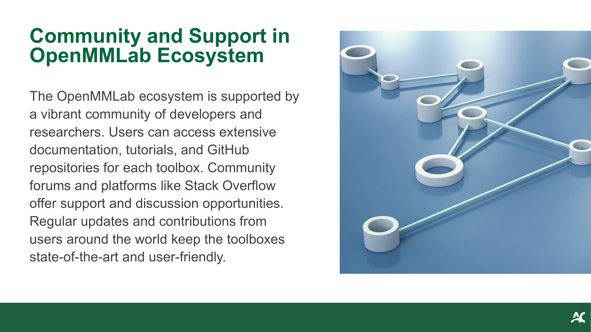

**Community and Support in OpenMMLab Ecosystem** — OpenMMLab 生态系统中的社区与支持

- The OpenMMLab ecosystem is supported by a vibrant community of developers and researchers. — OpenMMLab 生态系统由一个充满活力的开发者和研究人员社区支持。
- Users can access extensive documentation, tutorials, and GitHub repositories for each toolbox. — 用户可以访问每个工具箱的丰富文档、教程和 GitHub 仓库。
- Community forums and platforms like Stack Overflow offer support and discussion opportunities. — 社区论坛和 Stack Overflow 等平台提供支持和讨论机会。
- Regular updates and contributions from users around the world keep the toolboxes state-of-the-art and user-friendly. — 来自全球用户的定期更新和贡献使工具箱保持最先进和用户友好。

---

## 10. TensorFlow Object Detection API

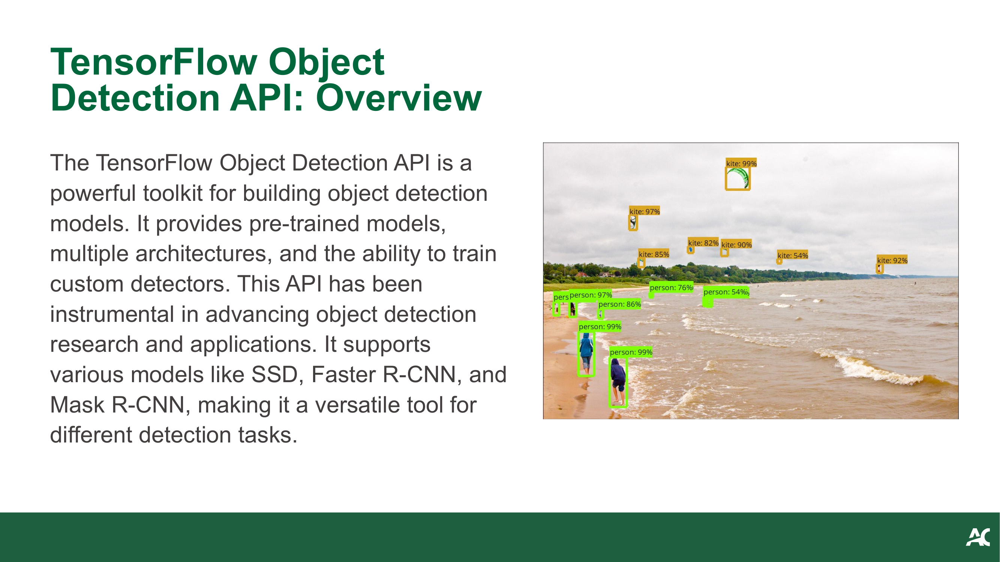

**TensorFlow Object Detection API: Overview** — TensorFlow 目标检测 API 概述

- The TensorFlow Object Detection API is a powerful toolkit for building object detection models. — TensorFlow 目标检测 API 是构建目标检测模型的强大工具包。
- It provides pre-trained models, multiple architectures, and the ability to train custom detectors. — 它提供预训练模型、多种架构以及训练自定义检测器的能力。
- This API has been instrumental in advancing object detection research and applications. — 该 API 在推进目标检测研究和应用方面发挥了重要作用。
- It supports various models like SSD, Faster R-CNN, and Mask R-CNN, making it a versatile tool for different detection tasks. — 它支持 SSD、Faster R-CNN 和 Mask R-CNN 等多种模型，是不同检测任务的通用工具。

---

## 11. 总结 (Conclusion)

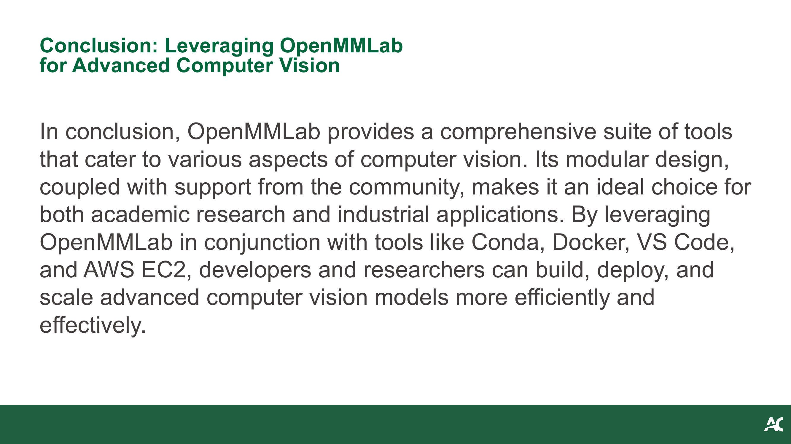

**Conclusion: Leveraging OpenMMLab for Advanced Computer Vision** — 总结：利用 OpenMMLab 进行高级计算机视觉

- In conclusion, OpenMMLab provides a comprehensive suite of tools that cater to various aspects of computer vision. — 总而言之，OpenMMLab 提供了一套满足计算机视觉各方面需求的综合工具。
- Its modular design, coupled with support from the community, makes it an ideal choice for both academic research and industrial applications. — 其模块化设计加上社区支持，使其成为学术研究和工业应用的理想选择。
- By leveraging OpenMMLab in conjunction with tools like Conda, Docker, VS Code, and AWS EC2, developers and researchers can build, deploy, and scale advanced computer vision models more efficiently and effectively. — 通过将 OpenMMLab 与 Conda、Docker、VS Code 和 AWS EC2 等工具结合使用，开发者和研究人员可以更高效地构建、部署和扩展高级计算机视觉模型。
