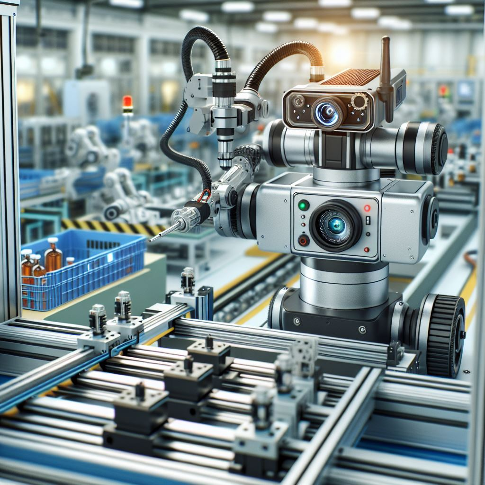
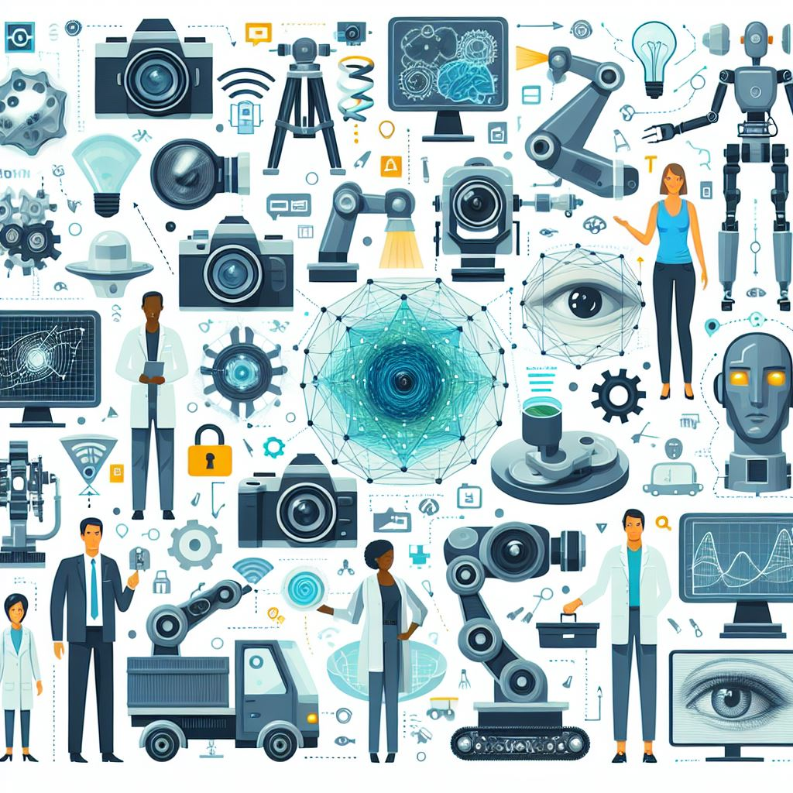
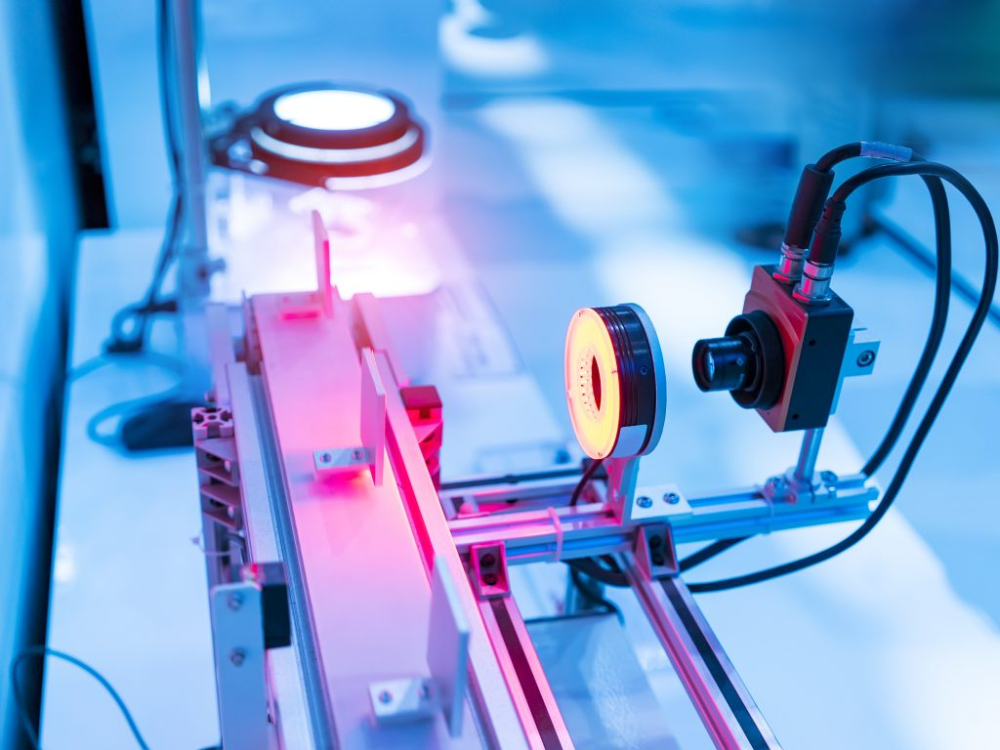
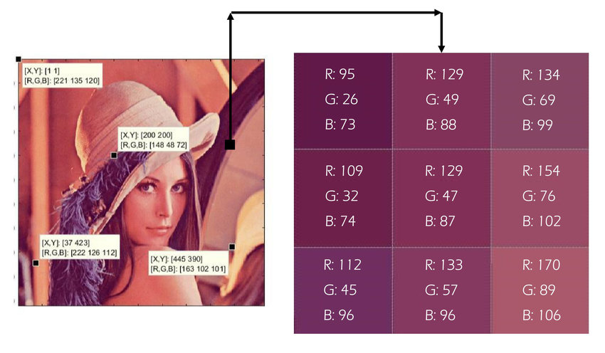
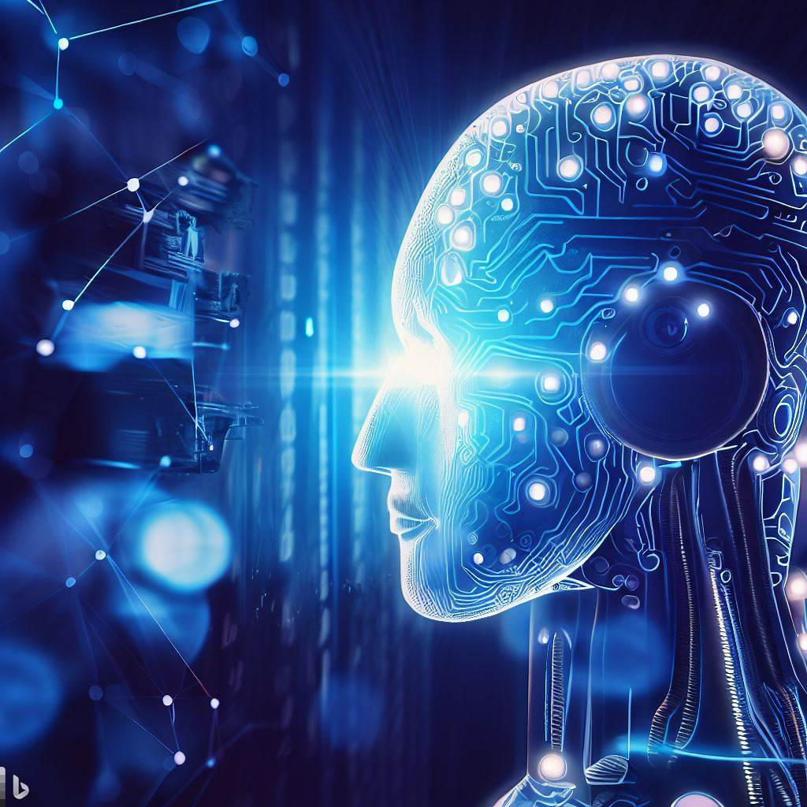
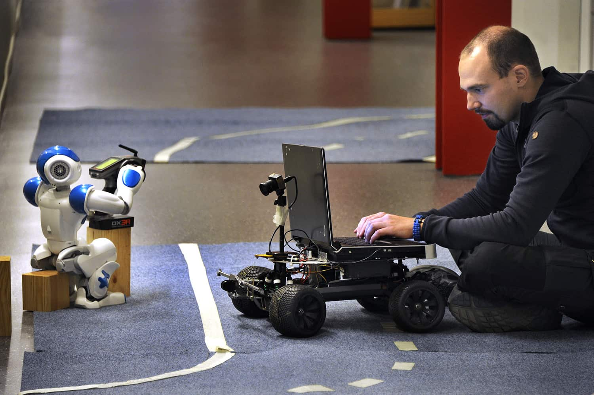
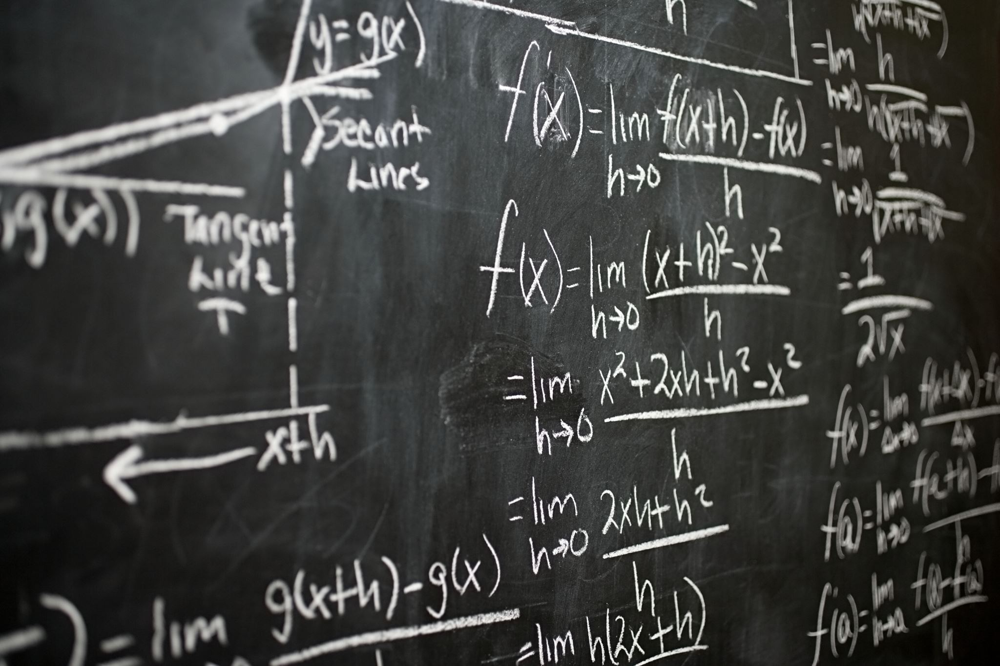

# Week 1: Week 1 - Introduction to Machine Vision1

> Source: `Week 1 - Introduction to Machine Vision1.pptx`
> Total slides: 17

---

## Slide 1

### Understanding the Technology Behind Visual Perception in Machines
### Instructor: Stephin Rachel Thomas
### 15-01-2026

Introduction to Machine Vision

---

## Slide 2

### General Information

Course Brightspace page https://brightspace.algonquincollege.com/d2l/le/content/846092/Home
Please read the course outline and course section information (CSI)
Main focus of the labs is to assess your understanding of implementation and demoyour work in each session
Professional behaviour is expected from all the students
Lab activities and assignements should be done individually, and any use of online materials, including useof ChatGPT and LLMs stated clearly as references.

---

## Slide 3

### Course Overview

We are here right now. The field of CV is huge, we will hope to scratch the surface in this class.

This course will take you on an exciting journey through the world of Machine Vision, combining theoretical knowledge with practical applications. Get ready to explore the path from pixels to perception!

---

## Slide 4

### Machine vision is a technology that enables machines to interpret and understand visual information from the surrounding environment.
### It involves capturing images or videos using cameras or sensors, processing these images to extract useful information, and then using this information to make decisions or perform specific tasks.

What is Machine Vision?

---

## Slide 5

### The journey of Machine Vision began with simple image capturing devices, evolving through the digital revolution to sophisticated AI algorithms. Key milestones include the development of digital cameras, the rise of neural networks, and significant increases in computing power.

History and Evolution of Machine Vision

What was the significant turning point?

The rise of deep learning techniques

---

## Slide 6

### Essential technologies in Machine Vision include image sensors (like CCD and CMOS), image processing techniques (such as filtering and edge detection), and the role of Machine Learning, particularly deep learning, in modern Machine Vision systems.

Key Technologies in Machine Vision

---

## Slide 7

### Machine Vision is all around us!
### In retail, it's used for barcode scanning and inventory management.
### In the manufacturing industry, it ensures quality checks on the assembly line.
### In entertainment it allows the detection and tracking of objects of interest, enhancing visual effects in movies and games.
### Lane keeping, blind spot checking, adaptive cruise, etc. in autonomous vehicles.
### Think about how these technologies affect our daily lives and the efficiency of businesses.

Applications of Machine Vision in Everyday Life

---

## Slide 8

### Machine Vision in Advanced Applications

Machine Vision is pivotal in advanced fields.
Autonomous vehicles use it for navigation
Medical imaging uses it for diagnostics and surgical assistance
Facial recognition systems enhance security and personalized experiences.
These applications highlight the versatility and transformative power of Machine Vision.

Refer to Week 1 Asynchronous material

---

## Slide 9

### Basic Workflow of a Machine Vision System

The workflow of a Machine Vision system can be summarized in three steps:
Image Acquisition (Capturing the image)
Image Processing (Analyzing and Manipulating the image)
Interpretation/Action (Making decisions based on the processed image).
For example, in an automated inspection system in manufacturing, this workflow ensures quality control.

---

## Slide 10

### Introduction to Image Processing

Image processing forms the core of Machine Vision.
We deal with different Image Formats like JPEG, PNG, and RAW, and Color Spaces such as RGB and HSV.
Let’s see a quick example of how to read an image using OpenCV.

---

## Slide 11

### What is a pixel?

The Basic Unit of an Image
Think of a pixel as a numerical representation at location (x,y) in an image.
It is either a single value (in grayscale images representing the black intensity), or a tuple of 3 values representing the Red, Green, and Blue intensities.

---

## Slide 12

### The evolution of AI, especially Deep Learning, has revolutionized Machine Vision.AI enhances its accuracy and enables the recognition of complex patterns.
### In upcoming sessions, we’ll dive deeper into how CNNs work and how they’re applied in real-world scenarios

Transition to AI in Machine Vision

---

## Slide 13

### Convolutional Neural Networks (CNNs) are a class of deep neural networks, most commonly applied to analyzing visual imagery. They are powerful for automated feature extraction in images, which we'll delve into in later lectures. Here's a visual to give you a taste of what's coming!

Convolutional Neural Networks - A Sneak Peek

---

## Slide 14

### The skills you acquire in this course open doors to numerous career paths. Potential roles include Machine Vision Engineer, Data Scientist, and Research and Development positions. Industries that are actively seeking these skills range from Healthcare to Automotive and Consumer Electronics.

Career Opportunities in Machine Vision

---

## Slide 15

### To deepen your understanding, here are some recommended resources:
### https://youtu.be/ArPaAX_PhIs?si=iB53B6NqweLtwVUD
### Let’s be honest…. ChatGpt is an excellent learning resource too!
### We'll also be using Python, OpenCV, and PyTorch extensively, so familiarizing yourself with these tools will be beneficial.

Resources for Further Learning

---

## Slide 16

### •	The basics of Machine Vision.
### •	Its history and key technologies.
### •	Real-world applications, from everyday
### uses to advanced fields.
### Remember, the world of Machine Vision is as expansive as it is exciting, and you're just getting started!

Summary of Today’s Lecture

Images are generated by Microsoft Copilot AI tool

---

## Slide 17

### Next Week Preview

Next week, we'll dive into the Fundamentals of Image Processing. We'll explore how images are captured, processed

---
