# Week 1: 机器视觉导论 (Introduction to Machine Vision)

> Source: `Week 1 - Introduction to Machine Vision1.pptx`
> Total slides: 17
> Instructor: Stephin Rachel Thomas | 15-01-2026

---

## 1. 课程信息 (Course Information)

### 1.1 课程标题 (Course Title)

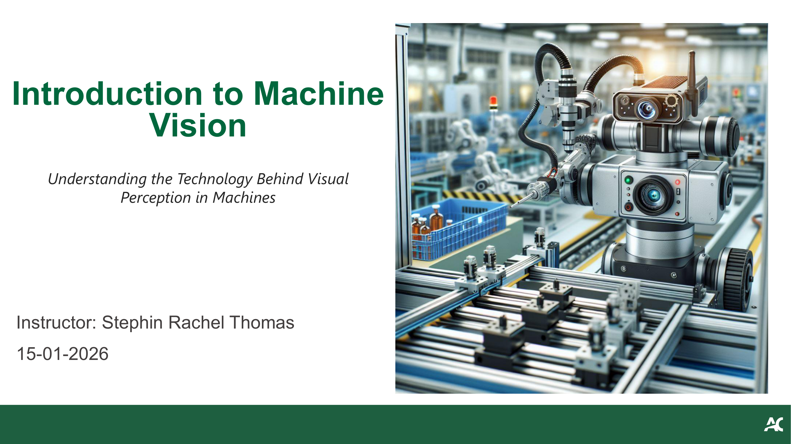

**Title slide:** Course title "Introduction to Machine Vision" with subtitle "Understanding the Technology Behind Visual Perception in Machines." Decorative AI-generated image of a robotic eye/camera.

**标题页：** 课程名"Introduction to Machine Vision"，副标题"Understanding the Technology Behind Visual Perception in Machines。"装饰性AI生成的机器人眼睛/摄像头图像。

### 1.2 课程后勤与政策 (Course Logistics and Policy)

**General information slide:** Course logistics including Brightspace link, lab assessment focus, and academic integrity policy.

**课程基本信息页：** 包括Brightspace链接、实验评估重点和学术诚信政策。

- Course Brightspace page: https://brightspace.algonquincollege.com/d2l/le/content/846092/Home — 课程Brightspace页面
- Please read the course outline and course section information (CSI) — 请阅读课程大纲和课程章节信息
- Main focus of the labs is to assess your understanding of implementation and demo your work in each session — 实验重点是评估你对实现的理解并在每次课上展示你的工作
- Professional behaviour is expected from all students — 要求所有学生保持专业行为
- Lab activities and assignments should be done individually; any use of online materials, including ChatGPT and LLMs, must be stated clearly as references — 实验和作业应独立完成；使用任何在线材料（包括ChatGPT和LLM）必须明确注明引用

> **📝 Notes:**
>
> **⚠️ Pitfall:**
> **(1) Lab Demo is Mandatory (实验演示强制):**
>
> You must demo your work during the lab session, not just submit the code. Missing the demo means losing marks even if code is correct.
>
>> 必须在实验课上演示你的工作，不只是提交代码。即使代码正确，错过演示也会扣分。
>>
>
> **(2) ChatGPT Usage Must Be Cited (AI工具必须引用):**
>
> Using AI tools is allowed but must be explicitly referenced. Failing to cite is treated as academic dishonesty.
>
>> 允许使用AI工具但必须明确引用。未引用视为学术不诚信。
>>
>
> **📝 Exam:**
> **(1) Lab Workflow (实验工作流):**
>
> Course policy questions are unlikely on exams, but understanding the lab workflow (implement → demo → submit) is essential for lab assessments.
>
>> 课程政策不太可能出现在考试中，但理解实验工作流（实现 → 演示 → 提交）对实验评估至关重要。
>>

---

## 2. 课程概览 (Course Overview)

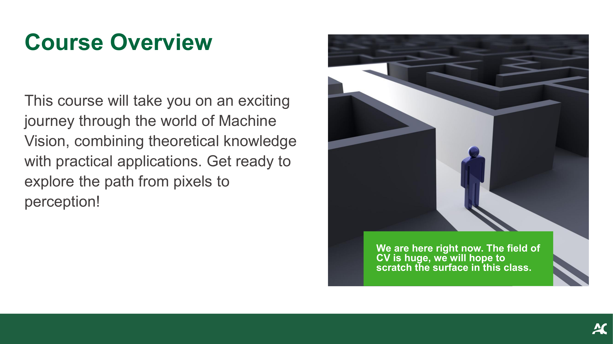

**Course overview slide:** Describes the course journey through Machine Vision, combining theory with practical applications. Mentions covering the path "from pixels to perception."

**课程概览页：** 描述机器视觉课程旅程，将理论与实践应用结合。提到从"像素到感知"的学习路径。

- This course takes you on a journey through the world of Machine Vision, combining theoretical knowledge with practical applications — 本课程带你踏上机器视觉之旅，将理论知识与实际应用结合
- Get ready to explore the path from **pixels to perception** — 准备好探索从**像素到感知**的路径
- The field of CV is huge; we will hope to scratch the surface in this class — 计算机视觉领域很大；我们在这门课中只能浅尝辄止

> **📝 Notes:**
>
> **💡 Intuition:**
> **(1) Pixels-to-Perception Pipeline (像素到感知流水线):**
>
> "Pixels to perception" captures the entire Machine Vision pipeline: raw numerical pixel values (data) → processed features (information) → semantic understanding (knowledge).
>
>> "从像素到感知"概括了整个机器视觉流水线：原始数值像素（数据）→ 处理后的特征（信息）→ 语义理解（知识）。
>>
>
> **(2) Language Analogy (语言类比):**
>
> Think of it like learning a language: pixels = individual letters, features = words, perception = understanding the sentence meaning.
>
>> 就像学语言：像素 = 单个字母，特征 = 单词，感知 = 理解句子含义。
>>
>
> **⚖️ Compare:**
> **(1) MV vs CV vs IP (机器视觉 vs 计算机视觉 vs 图像处理):**
>
> | Term | Scope | Focus |
> |---|---|---|
> | **Machine Vision** | Industrial/practical | End-to-end systems (capture → process → act) |
> | **Computer Vision** | Academic/research | Algorithms for image understanding |
> | **Image Processing** | Sub-field | Low-level pixel manipulation (filtering, enhancement) |
>
>> | 术语 | 范围 | 关注点 |
>> |---|---|---|
>> | **机器视觉** | 工业/实用 | 端到端系统（采集 → 处理 → 行动） |
>> | **计算机视觉** | 学术/研究 | 图像理解算法 |
>> | **图像处理** | 子领域 | 底层像素操作（滤波、增强） |
>>
>
> **⚠️ Pitfall:**
> **(1) MV ≠ CV (机器视觉 ≠ 计算机视觉):**
>
> Don't confuse Machine Vision with Computer Vision. Machine Vision emphasizes the **complete system** (hardware + software + decision-making), while Computer Vision focuses primarily on the **algorithmic** understanding of images. In industry, "Machine Vision" implies a production-ready system.
>
>> 不要混淆机器视觉和计算机视觉。机器视觉强调**完整系统**（硬件 + 软件 + 决策），而计算机视觉主要关注图像的**算法**理解。在工业界，"机器视觉"意味着一个生产就绪的系统。
>>

---

## 3. 什么是机器视觉 (What is Machine Vision?)

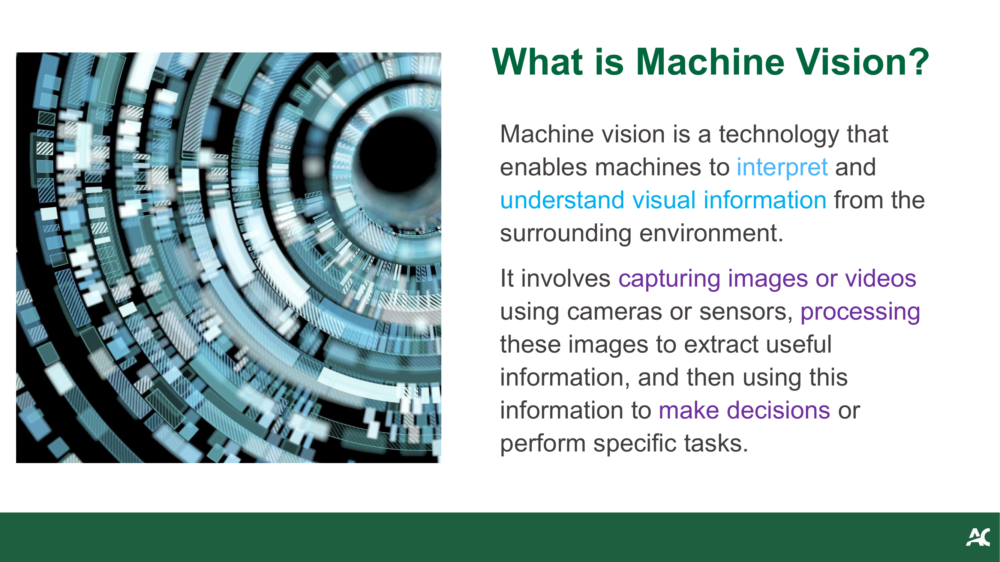

**Definition slide:** Machine vision definition with a decorative AI-generated image showing a robotic/mechanical eye with colorful visual processing elements.

**定义页：** 机器视觉定义，配有AI生成的装饰性图片，展示了一个带有彩色视觉处理元素的机器人/机械眼。

- **Machine vision** is a technology that enables machines to interpret and understand visual information from the surrounding environment — **机器视觉**是一种使机器能够解读和理解周围环境视觉信息的技术
- It involves **capturing** images or videos using cameras or sensors, **processing** these images to extract useful information, and then **using** this information to make decisions or perform specific tasks — 包括用摄像头或传感器**采集**图像或视频，**处理**图像以提取有用信息，然后**利用**这些信息做出决策或执行特定任务

> **📝 Notes:**
>
> **🎯 Why:**
> **(1) Human vs Machine Gap (人机差距):**
>
> Humans process visual information effortlessly — we recognize faces, read text, and navigate spaces without thinking. But for machines, a digital image is just a matrix of numbers.
>
>> 人类毫不费力地处理视觉信息 — 我们不假思索地识别人脸、阅读文字、在空间中导航。但对机器来说，数字图像只是一个数字矩阵。
>>
>
> **(2) Bridging the Gap (弥合差距):**
>
> Machine Vision bridges this gap by giving machines the ability to extract *meaning* from those numbers, enabling automation of tasks that previously required human eyes.
>
>> 机器视觉通过赋予机器从这些数字中提取*含义*的能力来弥合这一差距，使以前需要人眼的任务实现自动化。
>>
>
> **💡 Intuition:**
> **(1) Digital Eyes + Brain (数字眼睛 + 大脑):**
>
> Think of Machine Vision as giving a machine a pair of "digital eyes" plus a "brain" to understand what it sees. The camera is the eye (capture), image processing is the visual cortex (analyze), and the decision/action stage is the prefrontal cortex (decide what to do).
>
>> 把机器视觉想象成给机器一双"数字眼睛"加上一个"大脑"来理解所看到的东西。摄像头是眼睛（采集），图像处理是视觉皮层（分析），决策/行动阶段是前额叶（决定做什么）。
>>
>
> **⚙️ How:**
> **(1) Three-Stage Pipeline (三阶段流水线):**
>
> The three core stages (Capture → Process → Act) map directly to the Machine Vision pipeline: (1) **Sensors** convert light to electrical signals → digital pixel values, (2) **Algorithms** transform pixel values into features (edges, shapes, textures), (3) **Decision logic** (rules or ML models) interprets features to trigger actions.
>
>> 三个核心阶段（采集 → 处理 → 行动）直接对应机器视觉流水线：(1) **传感器**将光转换为电信号 → 数字像素值，(2) **算法**将像素值转换为特征（边缘、形状、纹理），(3) **决策逻辑**（规则或ML模型）解读特征以触发行动。
>>
>
> **📝 Exam:**
> **(1) Definition + Stages (定义+阶段):**
>
> "Define Machine Vision and describe its three core stages." → Definition + Capture/Process/Act with examples.
>
>> "定义机器视觉并描述其三个核心阶段。" → 定义 + 采集/处理/行动，附带例子。
>>

---

## 4. 历史与演进 (History and Evolution of Machine Vision)

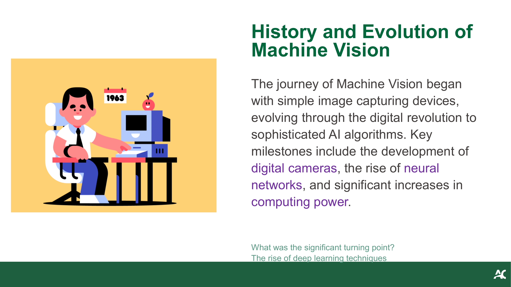

**History slide:** Timeline of Machine Vision evolution from simple image capture to AI algorithms, with key milestones highlighted.

**历史页：** 机器视觉从简单图像采集到AI算法的演变时间线，重点标出了关键里程碑。

- The journey began with simple image capturing devices, evolving through the digital revolution to sophisticated AI algorithms — 从简单的图像采集设备开始，经过数字革命发展为复杂的AI算法
- Key milestones: development of **digital cameras**, the rise of **neural networks**, and significant increases in **computing power** — 关键里程碑：**数码相机**的发展、**神经网络**的兴起、**计算能力**的大幅提升
- Significant turning point: the rise of **deep learning** techniques — 重要转折点：**深度学习**技术的兴起

> **📝 Notes:**
>
> **🎯 Why:**
> **(1) Why DL Dominates (为何深度学习主导):**
>
> Understanding the history reveals *why* deep learning dominates today. Traditional Machine Vision relied on hand-crafted features (e.g., SIFT, HOG) that required domain expertise. Deep learning eliminated this bottleneck by learning features automatically from data.
>
>> 了解历史揭示了*为什么*深度学习今天占主导地位。传统机器视觉依赖手工设计的特征（如SIFT、HOG），需要领域专业知识。深度学习通过从数据中自动学习特征消除了这个瓶颈。
>>
>
> **💡 Intuition:**
> **(1) Analog Era (模拟时代 1960s–1980s):**
>
> Simple sensors, basic edge detection — like using a magnifying glass.
>
>> 简单传感器，基本边缘检测 — 像用放大镜。
>>
>
> **(2) Digital Era (数字时代 1990s–2000s):**
>
> Digital cameras + handcrafted algorithms — like using measuring tools.
>
>> 数码相机 + 手工算法 — 像用测量工具。
>>
>
> **(3) AI Era (AI时代 2012–present):**
>
> CNNs learn to see — like training a student to recognize patterns on their own.
>
>> CNN学会"看" — 像训练学生自己识别模式。
>>
>
> **⚠️ Pitfall:**
> **(1) Classical Methods Still Useful (经典方法仍有用):**
>
> The "turning point" (2012, AlexNet winning ImageNet) didn't mean traditional methods became useless. In constrained industrial environments with consistent lighting and objects, classical methods (template matching, thresholding) are still faster, cheaper, and more interpretable than deep learning.
>
>> "转折点"（2012年AlexNet赢得ImageNet）并不意味着传统方法变得无用。在光照和物体一致的受控工业环境中，经典方法（模板匹配、阈值分割）仍然比深度学习更快、更便宜、更可解释。
>>

---

## 5. 关键技术 (Key Technologies in Machine Vision)

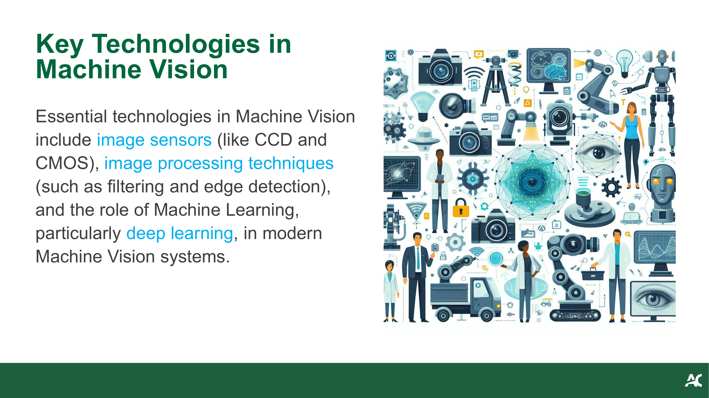

**Key technologies slide:** Shows essential technologies including image sensors and processing techniques, with a futuristic AI-generated illustration of a robotic figure.

**关键技术页：** 展示了包括图像传感器和处理技术在内的核心技术，配有一个未来感的AI生成机器人插图。

- **Image sensors**: CCD (Charge-Coupled Device) and CMOS (Complementary Metal-Oxide Semiconductor) — **图像传感器**：CCD（电荷耦合器件）和CMOS（互补金属氧化物半导体）
- **Image processing techniques**: filtering, edge detection — **图像处理技术**：滤波、边缘检测
- **Machine Learning**, particularly **deep learning**, in modern Machine Vision systems — **机器学习**，尤其是**深度学习**，在现代机器视觉系统中的作用

> **📝 Notes:**
>
> **📌 What:**
> **(1) Three Technology Pillars (三大技术支柱):**
>
> (1) **Hardware** — sensors that convert light to data; (2) **Classical algorithms** — mathematical operations on pixel values; (3) **Learned models** — neural networks that automatically discover patterns.
>
>> (1) **硬件** — 将光转换为数据的传感器；(2) **经典算法** — 对像素值的数学运算；(3) **学习模型** — 自动发现模式的神经网络。
>>
>
> **⚖️ Compare:**
> **(1) CCD vs CMOS 传感器对比:**
>
> | Feature | CCD | CMOS |
> |---|---|---|
> | **Power consumption** | High | Low |
> | **Speed** | Slower readout | Faster (per-pixel amplifier) |
> | **Noise** | Lower (uniform readout) | Higher (varies per pixel) |
> | **Cost** | Expensive | Cheap (standard chip fabrication) |
> | **Common use** | Scientific/medical imaging | Smartphones, webcams, most cameras |
>
>> | 特性 | CCD | CMOS |
>> |---|---|---|
>> | **功耗** | 高 | 低 |
>> | **速度** | 读出较慢 | 更快（逐像素放大） |
>> | **噪声** | 较低（均匀读出） | 较高（逐像素不同） |
>> | **成本** | 昂贵 | 便宜（标准芯片制造） |
>> | **常见用途** | 科学/医学成像 | 智能手机、摄像头、大多数相机 |
>>
>
> **💡 Intuition:**
> **(1) CCD = Bucket Brigade (传水桶):**
>
> CCD is like a bucket brigade — each pixel passes its charge to the next in a chain until it reaches a single output amplifier. This ensures uniform quality but is slow.
>
>> CCD像传水桶 — 每个像素将电荷依次传递直到到达单一输出放大器。质量均匀但较慢。
>>
>
> **(2) CMOS = Per-Pixel Meter (逐像素仪表):**
>
> CMOS is like giving each pixel its own meter — faster but with slight pixel-to-pixel variation.
>
>> CMOS像给每个像素自己的仪表 — 更快但像素之间有轻微差异。
>>
>
> **📝 Exam:**
> **(1) CCD vs CMOS Comparison (CCD与CMOS对比):**
>
> "Compare CCD and CMOS sensors." → Table of differences (power, speed, noise, cost, use case).
>
>> "比较CCD和CMOS传感器。" → 差异表（功耗、速度、噪声、成本、应用）。
>>
>
> **(2) Three Key Technologies (三大关键技术):**
>
> "Name three key technologies in Machine Vision." → Sensors, image processing algorithms, machine learning.
>
>> "列举机器视觉的三项关键技术。" → 传感器、图像处理算法、机器学习。
>>

---

## 6. 日常应用 (Applications in Everyday Life)

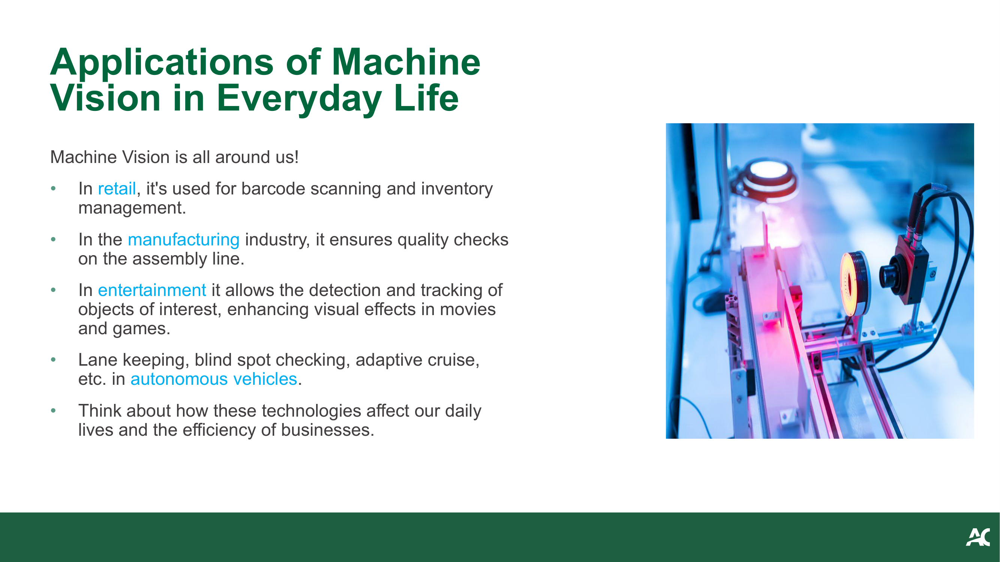

**Everyday applications slide:** Grid of real-world examples with small icons/images illustrating each application area.

**日常应用页：** 以小图标/图片网格形式展示各应用领域的实际案例。

- **Retail**: barcode scanning and inventory management — **零售**：条码扫描和库存管理
- **Manufacturing**: quality checks on the assembly line — **制造业**：流水线上的质量检测
- **Entertainment**: detection and tracking of objects of interest, enhancing visual effects in movies and games — **娱乐**：感兴趣对象的检测与跟踪，增强电影和游戏中的视觉效果
- **Autonomous vehicles**: lane keeping, blind spot checking, adaptive cruise — **自动驾驶**：车道保持、盲区检查、自适应巡航

> **📝 Notes:**
>
> **🎯 Why:**
> **(1) MV Impacts Daily Life (MV影响日常生活):**
>
> These applications illustrate that Machine Vision isn't just academic — it impacts daily life. The common thread is **replacing or augmenting human visual inspection** where speed, consistency, or scale exceeds human capability.
>
>> 这些应用说明机器视觉不只是学术性的 — 它影响日常生活。共同点是在速度、一致性或规模超出人类能力的地方**替代或增强人类视觉检查**。
>>
>
> **(2) Speed Advantage (速度优势):**
>
> A factory inspector might check 100 items/hour; a Machine Vision system checks thousands per minute without fatigue.
>
>> 工厂检查员每小时可能检查100件物品；机器视觉系统每分钟检查数千件而不会疲劳。
>>
>
> **💡 Intuition:**
> **(1) Retail → Recognition (零售 → 识别):**
>
> Barcode = pattern matching.
>
>> 条码 = 模式匹配。
>>
>
> **(2) Manufacturing → Anomaly Detection (制造 → 异常检测):**
>
> Defect ≠ normal.
>
>> 缺陷 ≠ 正常。
>>
>
> **(3) Entertainment → Tracking (娱乐 → 跟踪):**
>
> Follow object across frames.
>
>> 跨帧追踪对象。
>>
>
> **(4) Autonomous Driving → Scene Understanding (自动驾驶 → 场景理解):**
>
> Lanes, obstacles, signs all at once.
>
>> 同时识别车道、障碍物、标志。
>>
>
> **📝 Exam:**
> **(1) Examples + Capabilities (示例+能力):**
>
> "Give two examples of Machine Vision in everyday life and explain which MV capability each uses." → e.g., barcode scanning (pattern recognition), quality inspection (anomaly detection).
>
>> "举两个日常生活中机器视觉的例子，并说明各自使用了哪种MV能力。" → 如条码扫描（模式识别）、质量检测（异常检测）。
>>

---

## 7. 高级应用 (Advanced Applications)

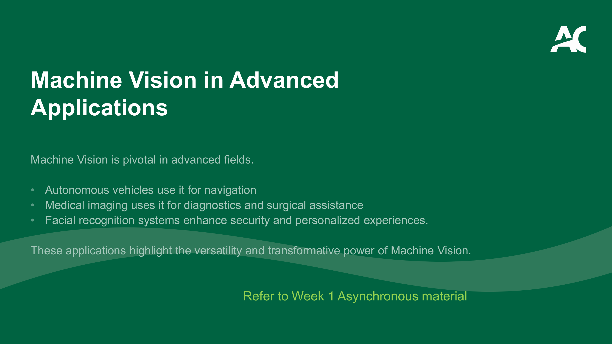

**Advanced applications slide:** Text-heavy slide listing three advanced application areas of Machine Vision.

**高级应用页：** 文字为主的幻灯片，列出机器视觉的三个高级应用领域。

- **Autonomous vehicles** use it for navigation — **自动驾驶汽车**用于导航
- **Medical imaging** uses it for diagnostics and surgical assistance — **医学影像**用于诊断和手术辅助
- **Facial recognition** systems enhance security and personalized experiences — **人脸识别**系统增强安全性和个性化体验
- Ref: Week 1 Asynchronous material

> **📝 Notes:**
>
> **🎯 Why:**
> **(1) Life-Critical Decisions (关乎生命的决策):**
>
> Advanced applications push Machine Vision beyond simple inspection into **life-critical decisions**. A self-driving car must process 360° visual input in real-time to avoid collisions.
>
>> 高级应用将机器视觉从简单检查推向**关乎生命的决策**。自动驾驶汽车必须实时处理360°视觉输入以避免碰撞。
>>
>
> **(2) Invisible Detection (不可见检测):**
>
> Medical imaging can detect tumors invisible to the naked eye. The stakes here demand much higher accuracy and reliability than everyday applications.
>
>> 医学影像可以检测肉眼看不见的肿瘤。这些场景对准确性和可靠性的要求远高于日常应用。
>>
>
> **⚖️ Compare:**
> **(1) Everyday vs Advanced (日常 vs 高级应用):**
>
> | Aspect | Everyday Applications | Advanced Applications |
> |---|---|---|
> | **Error tolerance** | High (a misread barcode can be rescanned) | Very low (misdiagnosis or crash) |
> | **Real-time requirement** | Often batch processing | Must be real-time |
> | **Data complexity** | 2D images, structured | 3D, multi-modal (LiDAR + camera) |
>
>> | 方面 | 日常应用 | 高级应用 |
>> |---|---|---|
>> | **容错率** | 高（条码读错可以重扫） | 极低（误诊或碰撞） |
>> | **实时要求** | 通常批处理 | 必须实时 |
>> | **数据复杂度** | 2D图像，结构化 | 3D，多模态（LiDAR + 摄像头） |
>>
>
> **⚠️ Pitfall:**
> **(1) Not Always Deep Learning (不总是深度学习):**
>
> Don't assume "more advanced = always uses deep learning." Autonomous vehicles use sensor fusion (LiDAR + radar + camera), not just vision. Medical imaging often combines ML with domain-specific preprocessing.
>
>> 不要假设"更高级 = 总是用深度学习"。自动驾驶使用传感器融合（LiDAR + 雷达 + 摄像头），不仅仅是视觉。医学影像经常将ML与特定领域预处理结合。
>>
>
> **(2) Ethical Concerns (伦理问题):**
>
> Facial recognition raises serious **ethical concerns** (bias, privacy) that must be considered alongside technical capability.
>
>> 人脸识别引起严重的**伦理问题**（偏见、隐私），必须与技术能力一起考虑。
>>

---

## 8. 机器视觉系统工作流 (Basic Workflow of a Machine Vision System)

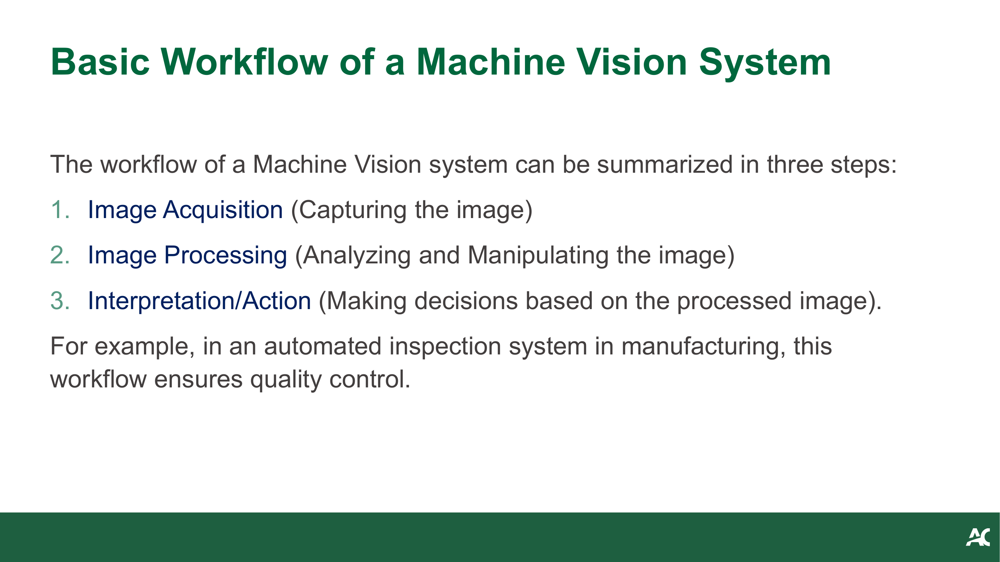

**Workflow slide:** Three-step workflow diagram showing the pipeline from image acquisition to action.

**工作流页：** 三步工作流程图，展示从图像采集到行动的流水线。

1. **Image Acquisition** — Capturing the image — **图像采集** — 获取图像
2. **Image Processing** — Analyzing and manipulating the image — **图像处理** — 分析和处理图像
3. **Interpretation/Action** — Making decisions based on the processed image — **解读/行动** — 基于处理后的图像做出决策

- Example: in an automated inspection system in manufacturing, this workflow ensures quality control — 例如：在制造业的自动检测系统中，该工作流确保质量控制

> **📝 Notes:**
>
> **🎯 Why:**
> **(1) Universal Template (通用模板):**
>
> This three-stage pipeline is the **universal template** for every Machine Vision system. Whether it's a simple barcode reader or a self-driving car, the workflow is always: Capture → Process → Decide. Understanding this helps you decompose any MV problem into manageable parts.
>
>> 这个三阶段流水线是每个机器视觉系统的**通用模板**。无论是简单的条码阅读器还是自动驾驶汽车，工作流总是：采集 → 处理 → 决策。理解这一点有助于将任何MV问题分解为可管理的部分。
>>
>
> **💡 Intuition:**
> **(1) Security Guard Analogy (保安类比):**
>
> Think of it like a security guard: (1) **Eyes** see someone approaching (acquisition), (2) **Brain** recognizes the face and checks against a list (processing), (3) **Action** — open the door or sound an alarm (interpretation/action).
>
>> 想象一个保安：(1) **眼睛**看到有人走来（采集），(2) **大脑**识别面孔并与名单核对（处理），(3) **行动** — 开门或拉响警报（解读/行动）。
>>
>
> **(2) Independent Failure (独立失败):**
>
> Each stage can fail independently: blurry camera, bad algorithm, or wrong decision logic.
>
>> 每个阶段都可能独立失败：模糊的摄像头、差的算法、或错误的决策逻辑。
>>
>
> **⚙️ How:**
> **(1) Stage 2 Complexity (第二阶段复杂性):**
>
> In practice, Stage 2 (Image Processing) is the most complex and typically involves multiple sub-steps: **preprocessing** (noise removal, normalization) → **feature extraction** (edges, corners, textures) → **classification/detection** (ML model or rules). This course will focus heavily on this stage across Weeks 2–5.
>
>> 实际中，第二阶段（图像处理）最复杂，通常包括多个子步骤：**预处理**（去噪、归一化）→ **特征提取**（边缘、角点、纹理）→ **分类/检测**（ML模型或规则）。本课程将在第2-5周重点讲述这一阶段。
>>
>
> **📝 Exam:**
> **(1) Workflow + Example (工作流+示例):**
>
> "Describe the basic workflow of a Machine Vision system with an example." → Three stages + manufacturing/security/medical example.
>
>> "描述机器视觉系统的基本工作流并举例。" → 三个阶段 + 制造/安防/医疗示例。
>>

---

## 9. 图像处理基础 (Introduction to Image Processing)

### 9.1 图像格式与色彩空间 (Image Formats and Color Spaces)

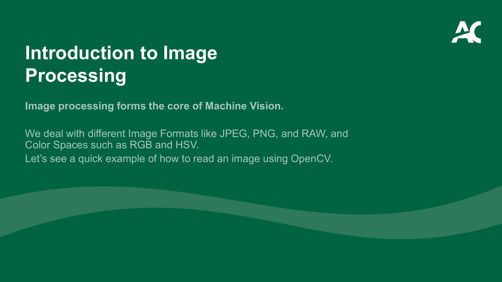

**Image processing intro slide:** Text about image formats and color spaces, with mention of OpenCV.

**图像处理入门页：** 关于图像格式和色彩空间的文字说明，提及OpenCV。

- Image processing forms the **core** of Machine Vision — 图像处理是机器视觉的**核心**
- **Image Formats**: JPEG, PNG, RAW — **图像格式**：JPEG、PNG、RAW
- **Color Spaces**: RGB and HSV — **色彩空间**：RGB和HSV
- Quick example of how to read an image using **OpenCV** — 使用**OpenCV**读取图像的快速示例

### 9.2 像素定义 (Pixel Definition)

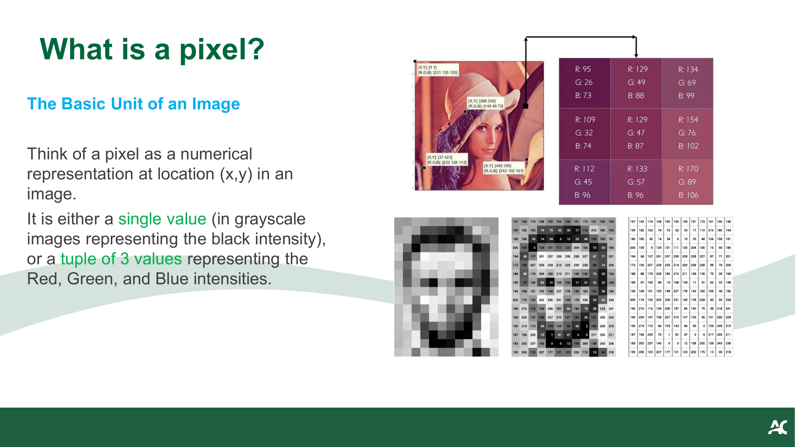

**Pixel definition slide:** Explains what a pixel is with a zoomed-in image showing individual pixel values in a grid.

**像素定义页：** 解释什么是像素，配有放大的网格图显示各像素值。

- A **pixel** is a numerical representation at location (x, y) in an image — **像素**是图像中位置(x, y)处的数值表示
- **Grayscale**: single value representing black intensity — **灰度图**：单个值表示黑色强度
- **Color (RGB)**: tuple of 3 values representing Red, Green, and Blue intensities — **彩色图（RGB）**：3个值的元组，表示红、绿、蓝的强度

> **📝 Notes:**
>
> **📌 What:**
> **(1) Digital Image as Matrix (数字图像为矩阵):**
>
> A digital image is fundamentally a **2D matrix** (grayscale) or **3D tensor** (color: H × W × 3) of integer values, typically in the range [0, 255] for 8-bit images.
>
>> 数字图像本质上是一个**二维矩阵**（灰度图）或**三维张量**（彩色图：H × W × 3），8位图像的值通常在[0, 255]范围内。
>>
>
> **🎯 Why:**
> **(1) Foundation of Everything (一切的基础):**
>
> Understanding that images are just numbers is the **foundation of everything else** in this course. Every algorithm (filtering, edge detection, CNN) is just mathematical operations on these numbers. If you don't grasp this, later concepts will feel like magic.
>
>> 理解图像只是数字是本课程**一切内容的基础**。每个算法（滤波、边缘检测、CNN）都只是对这些数字进行的数学运算。如果不理解这一点，后面的概念会觉得像魔法。
>>
>
> **⚖️ Compare:**
> **(1) Image Formats (图像格式对比):**
>
> | Format | Compression | Transparency | Best for |
> |---|---|---|---|
> | **JPEG** | Lossy | No | Photos (small file size) |
> | **PNG** | Lossless | Yes (alpha channel) | Graphics, screenshots |
> | **RAW** | None | No | Professional photography, maximum quality |
>
>> | 格式 | 压缩 | 透明度 | 最佳用途 |
>> |---|---|---|---|
>> | **JPEG** | 有损 | 无 | 照片（文件小） |
>> | **PNG** | 无损 | 有（alpha通道） | 图形、截图 |
>> | **RAW** | 无 | 无 | 专业摄影、最高质量 |
>>
>
> **💡 Intuition:**
> **(1) RGB vs HSV (显示器视角 vs 人类视角):**
>
> RGB is how a *monitor* thinks about color (mix red, green, blue lights). HSV is how a *human* thinks about color (what hue? how vivid? how bright?). HSV is much easier for tasks like "find all red objects" because you just filter on hue, regardless of lighting.
>
>> RGB是*显示器*理解颜色的方式（混合红绿蓝光）。HSV是*人类*理解颜色的方式（什么色调？多鲜艳？多亮？）。HSV在"找出所有红色物体"这类任务中更方便，因为只需过滤色调，不受光照影响。
>>
>
> **⚠️ Pitfall:**
> **(1) OpenCV Uses BGR (通道顺序陷阱):**
>
> **OpenCV uses BGR, not RGB!** When you read an image with `cv2.imread()`, channels are Blue-Green-Red. Displaying with matplotlib (which expects RGB) without conversion will show wrong colors.
>
>> **OpenCV用BGR，不是RGB！** 用`cv2.imread()`读取图像时，通道顺序是蓝-绿-红。不转换就用matplotlib（期望RGB）显示会导致颜色错误。
>>
>
> **(2) Pixel Coordinates (像素坐标陷阱):**
>
> In OpenCV, images are accessed as `image[y, x]` (row, column), not `image[x, y]`. This is a frequent source of bugs.
>
>> 在OpenCV中，图像通过`image[y, x]`（行，列）访问，而不是`image[x, y]`。这是一个常见的bug来源。
>>
>
> **📝 Exam:**
> **(1) Pixel Definition (像素定义):**
>
> "What is a pixel? Explain the difference between grayscale and RGB images." → Pixel = numerical value at (x,y); grayscale = 1 value [0-255]; RGB = 3 values (R, G, B) each [0-255].
>
>> "什么是像素？解释灰度图和RGB图的区别。" → 像素 = (x,y)处的数值；灰度 = 1个值[0-255]；RGB = 3个值(R,G,B)各[0-255]。
>>
>
> **(2) HSV Preference (HSV偏好):**
>
> "Why might HSV be preferred over RGB for color-based object detection?" → Hue separates color from lighting conditions.
>
>> "为什么基于颜色的目标检测可能更倾向于用HSV而非RGB？" → 色调将颜色与光照条件分开。
>>

---

## 10. AI与深度学习在机器视觉中的过渡 (Transition to AI in Machine Vision)

### 10.1 AI与深度学习的影响 (Impact of AI and Deep Learning)

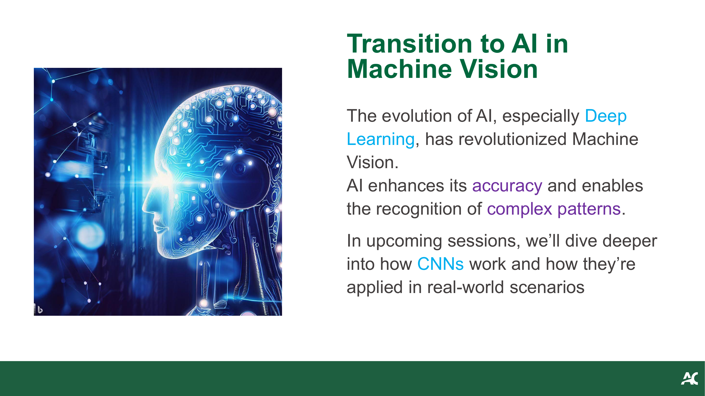

**AI transition slide:** Shows the evolution of AI and deep learning transforming Machine Vision, with a futuristic AI-generated brain/network illustration.

**AI过渡页：** 展示AI和深度学习如何改变机器视觉，配有未来感的AI生成大脑/网络插图。

- The evolution of AI, especially **Deep Learning**, has revolutionized Machine Vision — AI的发展，尤其是**深度学习**，已经彻底改变了机器视觉
- AI enhances accuracy and enables recognition of **complex patterns** — AI提高了准确性并使识别**复杂模式**成为可能
- In upcoming sessions: how **CNNs** work and real-world applications — 后续课程：**CNN**的工作原理及实际应用

### 10.2 CNN预览 (CNN Sneak Peek)

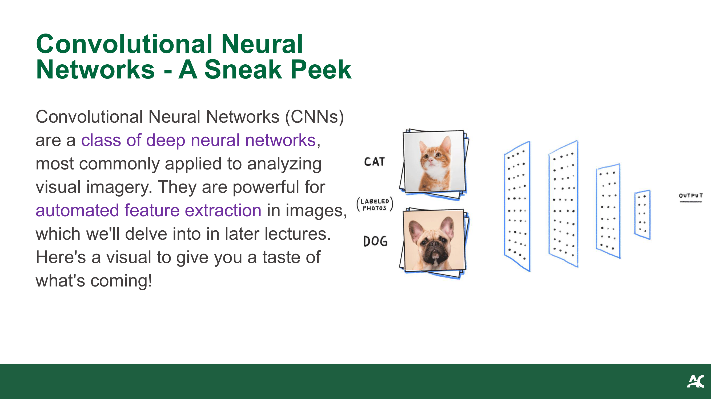

**CNN sneak peek slide:** Brief introduction to CNNs with a CNN architecture diagram.

**CNN预览页：** 简要介绍CNN，配有CNN架构图。

- **Convolutional Neural Networks (CNNs)** are a class of deep neural networks, most commonly applied to analyzing visual imagery — **卷积神经网络（CNN）**是一类深度神经网络，最常用于分析视觉图像
- Powerful for **automated feature extraction** in images — 在图像中进行**自动特征提取**方面非常强大
- Will be covered in detail in later lectures — 将在后续课程中详细讲述

> **📝 Notes:**
>
> **🎯 Why:**
> **(1) Manual vs Automatic Features (手动 vs 自动特征):**
>
> Traditional image processing requires engineers to **manually design** which features to extract (edges? textures? histograms?). Deep learning flips this: the network **learns** the best features for the task automatically from labeled data. This is why CNNs consistently outperform hand-crafted features on complex tasks.
>
>> 传统图像处理需要工程师**手动设计**要提取哪些特征。深度学习颠覆了这一点：网络从标注数据中**自动学习**最佳特征。这就是CNN在复杂任务上始终优于手工特征的原因。
>>
>
> **💡 Intuition:**
> **(1) Recipe vs Tasting (菜谱 vs 品尝):**
>
> Traditional approach: you tell the machine "look for edges, then circles, then classify." CNN approach: you show the machine 10,000 cat photos and 10,000 dog photos, and it figures out *on its own* what features distinguish them. It's the difference between giving someone a recipe vs. letting them learn to cook by tasting many dishes.
>
>> 传统方法：你告诉机器"先找边缘，然后找圆形，然后分类。"CNN方法：你给机器看10,000张猫照片和10,000张狗照片，它*自己*弄清楚什么特征能区分它们。就像给人一个菜谱 vs. 让他们通过品尝许多菜肴来学习做饭。
>>
>
> **⚖️ Compare:**
> **(1) Traditional CV vs Deep Learning CV (传统CV vs 深度学习CV):**
>
> | Aspect | Traditional CV | Deep Learning CV |
> |---|---|---|
> | **Feature design** | Manual (needs domain knowledge) | Automatic (learned from data) |
> | **Data requirement** | Small datasets OK | Needs large labeled datasets |
> | **Interpretability** | High (you know what features are used) | Low ("black box") |
> | **Complex patterns** | Struggles | Excels |
> | **Compute cost** | Low (CPU sufficient) | High (GPU needed) |
>
>> | 方面 | 传统CV | 深度学习CV |
>> |---|---|---|
>> | **特征设计** | 手动（需要领域知识） | 自动（从数据学习） |
>> | **数据需求** | 小数据集即可 | 需要大量标注数据 |
>> | **可解释性** | 高（知道用了什么特征） | 低（"黑盒"） |
>> | **复杂模式** | 困难 | 擅长 |
>> | **计算成本** | 低（CPU就够） | 高（需要GPU） |
>>
>
> **⚠️ Pitfall:**
> **(1) CNN Not the Only Option (CNN不是唯一选择):**
>
> CNN is **not** the only deep learning architecture for vision. Vision Transformers (ViT) are increasingly popular.
>
>> CNN**不是**唯一的视觉深度学习架构。Vision Transformers (ViT)越来越流行。
>>
>
> **(2) Overfitting Risk (过拟合风险):**
>
> CNNs without sufficient training data **overfit** — they memorize training images instead of learning general patterns. Data augmentation and transfer learning are standard countermeasures.
>
>> 训练数据不足的CNN会**过拟合** — 它们记住训练图像而不是学习通用模式。数据增强和迁移学习是标准对策。
>>

---

## 11. 职业机遇 (Career Opportunities in Machine Vision)

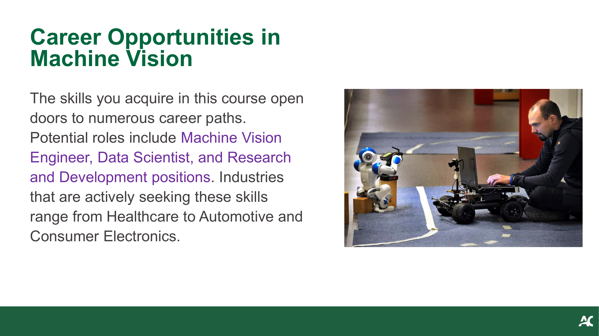

**Career slide:** Describes career paths in Machine Vision with a futuristic AI-generated city/technology landscape.

**职业页：** 描述机器视觉领域的职业路径，配有未来感的AI生成城市/科技景观。

- Potential roles: **Machine Vision Engineer**, **Data Scientist**, **R&D** positions — 潜在岗位：**机器视觉工程师**、**数据科学家**、**研发**岗位
- Industries: **Healthcare**, **Automotive**, **Consumer Electronics** — 行业：**医疗**、**汽车**、**消费电子**

> **📝 Notes:**
>
> **💡 Intuition:**
> **(1) T-Shaped Skill Stack (T型技能栈):**
>
> The skill stack for Machine Vision careers forms a T-shape: **broad base** (programming, math, ML fundamentals) + **deep specialization** (one domain like medical imaging or autonomous driving). This course builds the broad base; internships and projects build the specialization.
>
>> 机器视觉职业的技能栈呈T字形：**宽广的基础**（编程、数学、ML基础）+ **深入的专长**（一个领域如医学影像或自动驾驶）。本课程构建广泛基础；实习和项目构建专长。
>>
>
> **⚠️ Pitfall:**
> **(1) DS vs MV Engineer (数据科学家 vs MV工程师):**
>
> "Data Scientist" and "Machine Vision Engineer" have very different day-to-day work. Data Scientists spend more time on data cleaning, statistical analysis, and model selection. MV Engineers deal with hardware integration, real-time constraints, and system deployment. Know which path aligns with your interests.
>
>> "数据科学家"和"机器视觉工程师"的日常工作非常不同。数据科学家更多时间在数据清理、统计分析和模型选择上。MV工程师处理硬件集成、实时约束和系统部署。了解哪条路径与你的兴趣一致。
>>

---

## 12. 学习资源 (Resources for Further Learning)

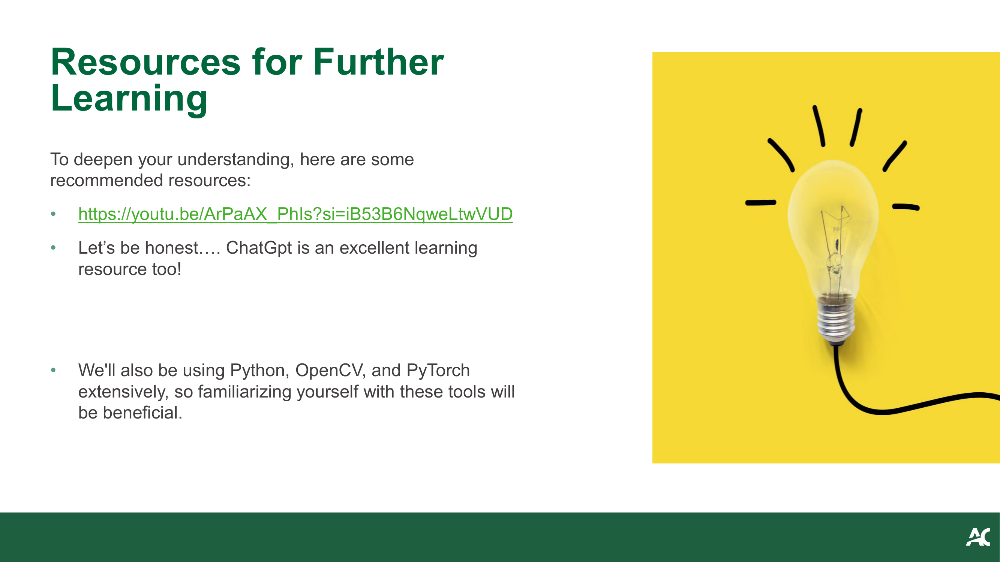

**Resources slide:** Recommended resources for deepening understanding.

**资源页：** 推荐加深理解的学习资源。

- Video resource: https://youtu.be/ArPaAX_PhIs?si=iB53B6NqweLtwVUD
- ChatGPT as a learning resource — ChatGPT作为学习资源
- Tools: **Python**, **OpenCV**, and **PyTorch** — 工具：**Python**、**OpenCV**和**PyTorch**

> **📝 Notes:**
>
> **💡 Intuition:**
> **(1) Tool Progression (工具递进):**
>
> The three tools represent a natural progression: **Python** (general programming) → **OpenCV** (classical image processing: filtering, edge detection, feature extraction) → **PyTorch** (deep learning: CNNs, training, inference). You'll use OpenCV heavily in Weeks 2–3 and PyTorch in Weeks 4–5.
>
>> 三个工具代表自然递进：**Python**（通用编程）→ **OpenCV**（经典图像处理：滤波、边缘检测、特征提取）→ **PyTorch**（深度学习：CNN、训练、推理）。你将在第2-3周大量使用OpenCV，第4-5周使用PyTorch。
>>
>
> **⚠️ Pitfall:**
> **(1) Tensor Format Mismatch (张量格式不匹配):**
>
> OpenCV and PyTorch handle image tensors differently: OpenCV uses **(H, W, C)** with BGR channel order and `numpy` arrays; PyTorch uses **(C, H, W)** with RGB and `torch.Tensor`. Converting between them requires both dimension permutation and channel reordering — a very common source of bugs.
>
>> OpenCV和PyTorch处理图像张量的方式不同：OpenCV使用**(H, W, C)**格式、BGR通道顺序和`numpy`数组；PyTorch使用**(C, H, W)**格式、RGB顺序和`torch.Tensor`。两者之间的转换需要同时进行维度置换和通道重排序 — 这是非常常见的bug来源。
>>

---

## 13. 本讲小结 (Summary of Today's Lecture)

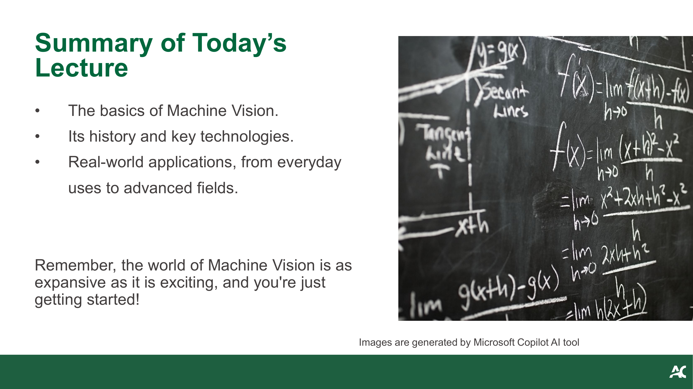

**Summary slide:** Recap of the lecture with an AI-generated collage of Machine Vision concepts.

**总结页：** 讲座回顾，配有AI生成的机器视觉概念拼贴画。

- The basics of Machine Vision — 机器视觉基础
- Its history and key technologies — 历史与关键技术
- Real-world applications, from everyday uses to advanced fields — 实际应用，从日常用途到高级领域
- "The world of Machine Vision is as expansive as it is exciting, and you're just getting started!" — "机器视觉世界既广阔又令人兴奋，你才刚刚起步！"

> **📝 Notes:**
>
> **📌 What:**
> **(1) Key Takeaway 1 — MV Pipeline (MV流水线):**
>
> Machine Vision = Capture → Process → Act.
>
>> 机器视觉 = 采集 → 处理 → 行动。
>>
>
> **(2) Key Takeaway 2 — Three Pillars (三大支柱):**
>
> Three technology pillars: sensors, algorithms, ML/DL.
>
>> 三大技术支柱：传感器、算法、ML/DL。
>>
>
> **(3) Key Takeaway 3 — DL Turning Point (深度学习转折点):**
>
> Deep learning was the turning point (2012, AlexNet).
>
>> 深度学习是转折点（2012年AlexNet）。
>>
>
> **(4) Key Takeaway 4 — Images as Numbers (图像即数字):**
>
> Images are just matrices of numbers (pixels).
>
>> 图像只是数字矩阵（像素）。
>>
>
> **(5) Key Takeaway 5 — Tools (工具):**
>
> Tools: Python + OpenCV + PyTorch.
>
>> 工具：Python + OpenCV + PyTorch。
>>
>
> **📝 Exam:**
> **(1) MV Definition (定义题):**
>
> "Define Machine Vision" → technology enabling machines to interpret visual information.
>
>> "定义机器视觉" → 使机器能够解读视觉信息的技术。
>>
>
> **(2) MV Workflow (工作流题):**
>
> "Three stages of MV workflow" → Capture, Process, Interpret/Act.
>
>> "MV工作流的三个阶段" → 采集、处理、解读/行动。
>>
>
> **(3) CCD vs CMOS (传感器对比):**
>
> "CCD vs CMOS" → comparison table.
>
>> "CCD vs CMOS" → 比较表。
>>
>
> **(4) DL Turning Point (转折点题):**
>
> "Why was deep learning a turning point?" → automatic feature learning from data.
>
>> "为什么深度学习是转折点？" → 从数据自动学习特征。
>>

---

## 14. 下周预告 (Next Week Preview)

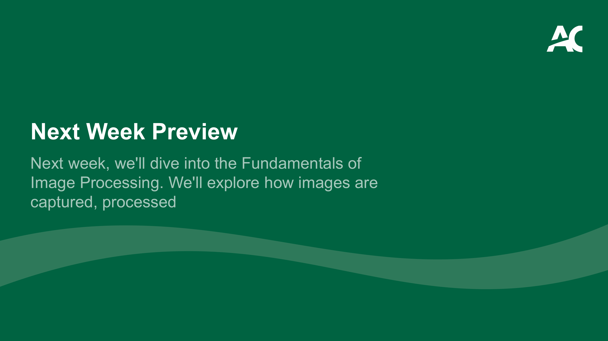

**Preview slide:** Brief preview of next week's topic.

**预告页：** 简要预告下周主题。

- Next week: **Fundamentals of Image Processing** — 下周：**图像处理基础**
- Topics: how images are captured and processed — 主题：图像如何被获取和处理

---
