# Week 2: 图像处理基础 (Fundamentals of Image Processing)

> Source: `Week 2 - Fundamentals of Image Processing1.pptx`
> Total slides: 24
> Instructor: Stephin Rachel Thomas | 22-01-2026

---

## 1. 今日主题 (Today's Topics)

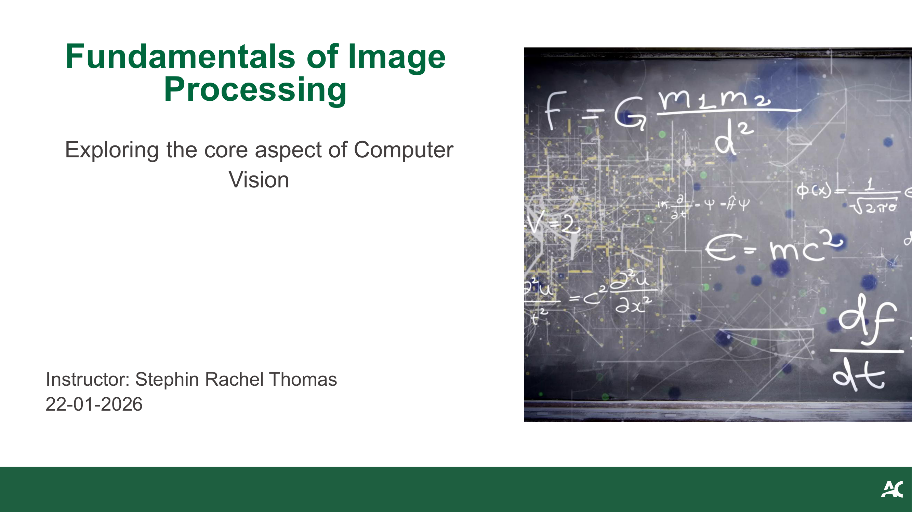

**Title slide:** "Fundamentals of Image Processing — Exploring the core aspect of Computer Vision." Decorative background with a circuit-board aesthetic.

**标题页：** "Fundamentals of Image Processing — 探索计算机视觉的核心方面。"搭配电路板风格的装饰性背景。

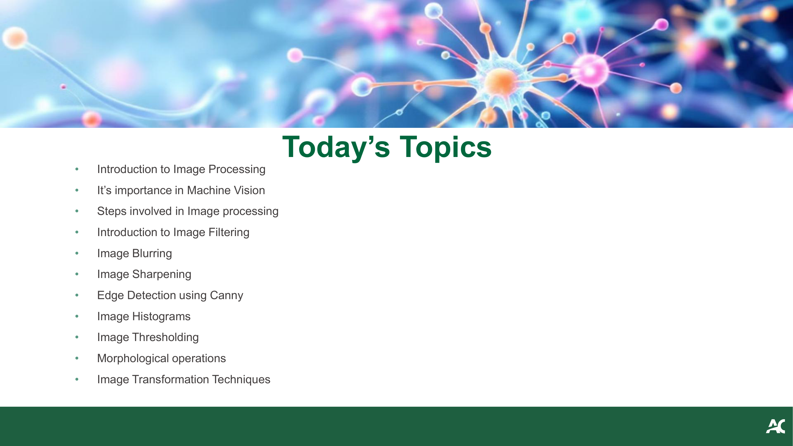

**Topics outline slide:** Lists all topics covered this week in bullet-point format.

**主题大纲页：** 以项目符号列出本周涵盖的所有主题。

- Introduction to Image Processing — 图像处理简介
- Importance in Machine Vision — 在机器视觉中的重要性
- Steps involved in Image Processing — 图像处理的步骤
- Image Filtering (Blurring, Sharpening) — 图像滤波（模糊、锐化）
- Edge Detection using Canny — 使用Canny进行边缘检测
- Image Histograms — 图像直方图
- Image Thresholding — 图像阈值化
- Morphological Operations — 形态学操作
- Image Transformation Techniques — 图像变换技术

---

## 2. 图像处理简介 (Introduction to Image Processing)

### 2.1 图像处理定义 (Image Processing Definition)

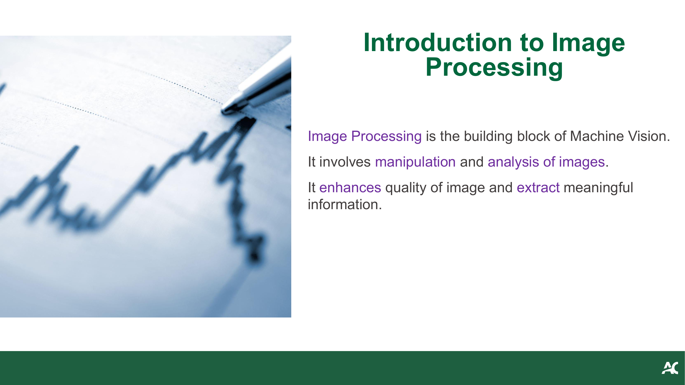

**Introduction slide:** Defines image processing as the building block of Machine Vision, with a futuristic illustration.

**简介页：** 将图像处理定义为机器视觉的构建基石，配有未来感插图。

- **Image Processing** is the building block of Machine Vision — **图像处理**是机器视觉的构建基石
- It involves **manipulation** and **analysis of images** — 它涉及图像的**操作**和**分析**
- It **enhances** quality of image and **extract** meaningful information — 它**增强**图像质量并**提取**有意义的信息

### 2.2 图像处理的重要性 (Importance in Machine Vision)

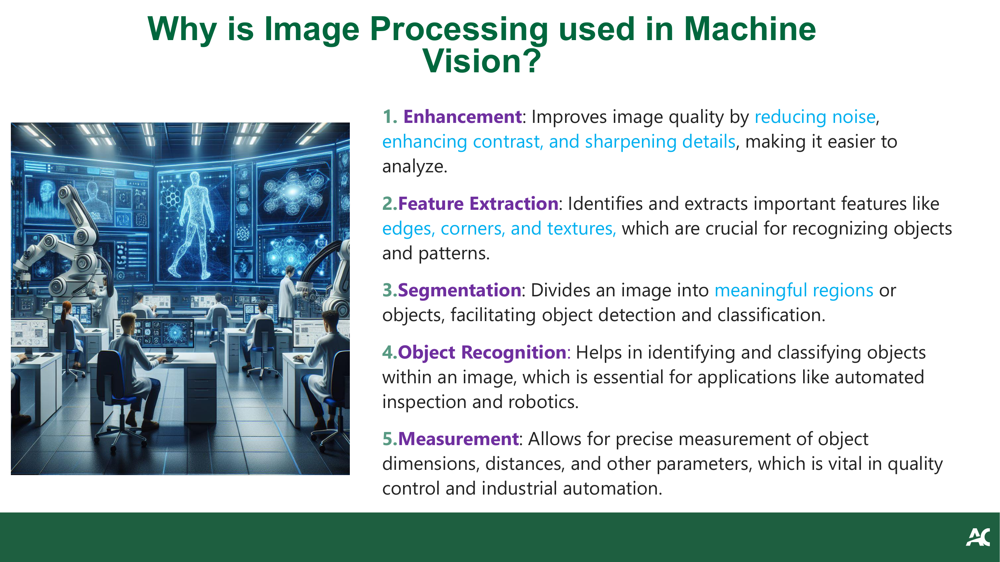

**Why image processing slide:** Lists five key reasons image processing is essential for Machine Vision.

**为什么需要图像处理页：** 列出了图像处理对机器视觉至关重要的五个关键原因。

1. **Enhancement**: Improves image quality by **reducing noise, enhancing contrast, and sharpening details**, making it easier to analyze — **增强**：通过**降噪、增强对比度和锐化细节**来改善图像质量，使其更易于分析
2. **Feature Extraction**: Identifies and extracts important features like **edges, corners, and textures**, which are crucial for recognizing objects and patterns — **特征提取**：识别和提取重要特征，如**边缘、角点和纹理**，这对识别对象和模式至关重要
3. **Segmentation**: Divides an image into **meaningful regions** or objects, facilitating object detection and classification — **分割**：将图像划分为**有意义的区域**或对象，促进目标检测和分类
4. **Object Recognition**: Helps in identifying and classifying objects within an image, which is essential for applications like automated inspection and robotics — **目标识别**：帮助识别和分类图像中的对象，这对自动化检测和机器人等应用至关重要
5. **Measurement**: Allows for precise measurement of object dimensions, distances, and other parameters, which is vital in quality control and industrial automation — **测量**：允许精确测量对象尺寸、距离和其他参数，这对质量控制和工业自动化至关重要

> **📝 Notes:**
>
> **🎯 Why:**
> **(1) Preprocessing Pipeline (预处理流水线):**
>
> Image processing is not an end goal — it's the **preprocessing pipeline** that makes downstream tasks (classification, detection, tracking) possible. Raw camera images are noisy, unevenly lit, and cluttered. Without processing, no ML model can reliably work.
>
>> 图像处理不是最终目标 — 它是使下游任务（分类、检测、跟踪）成为可能的**预处理流水线**。原始相机图像是有噪声的、光照不均匀的、杂乱的。没有处理，任何ML模型都无法可靠工作。
>>
>
> **💡 Intuition:**
> **(1) Cooking Analogy (烹饪类比):**
>
> Think of image processing as "cleaning and preparing ingredients before cooking." You wouldn't throw unwashed, uncut vegetables into a pot. Similarly, raw images need noise removal (washing), enhancement (cutting to reveal), and segmentation (separating ingredients) before the "cooking" (classification/detection) begins.
>
>> 把图像处理想象成"烹饪前清洗和准备食材"。你不会把没洗没切的蔬菜直接扔进锅里。同样，原始图像需要去噪（清洗）、增强（切开以显现）和分割（分离食材），然后才能开始"烹饪"（分类/检测）。
>>
>
> **⚖️ Compare:**
> **(1) Image Processing vs Computer Vision (图像处理 vs 计算机视觉):**
>
> | Concept                   | Image Processing            | Computer Vision                    |
> | ------------------------- | --------------------------- | ---------------------------------- |
> | **Focus**           | Transform / enhance pixels  | Understand / interpret content     |
> | **Input → Output** | Image → Image              | Image → Meaning (labels, boxes)   |
> | **Example**         | Denoising, contrast stretch | "This is a cat", "Object at (x,y)" |
> | **Analogy**         | Washing & cutting food      | Cooking & tasting food             |
>
>> | 概念                 | 图像处理         | 计算机视觉                  |
>> | -------------------- | ---------------- | --------------------------- |
>> | **关注点**     | 变换/增强像素    | 理解/解释内容               |
>> | **输入→输出** | 图像→图像       | 图像→含义（标签、框）      |
>> | **示例**       | 去噪、对比度拉伸 | "这是一只猫"、"对象在(x,y)" |
>> | **类比**       | 清洗和切食材     | 烹饪和品尝食物              |
>>
>
> **⚠️ Pitfall:**
> **(1) Categories Not Steps (类别而非步骤):**
>
> The 5 reasons listed are not sequential steps — they're **categories of use**. A real pipeline might only use 2-3 of them depending on the application. Don't assume every MV system needs all five.
>
>> 列出的5个原因不是顺序步骤 — 它们是**使用类别**。实际的流水线可能根据应用只使用其中2-3个。不要假设每个MV系统都需要全部五个。
>>
>
> **📝 Exam:**
> **(1) List 3 Reasons (列举3个原因):**
>
> "List 3 reasons why image processing is important in Machine Vision." → Pick any 3: Enhancement, Feature Extraction, Segmentation, Object Recognition, Measurement.
>
>> "列出图像处理在机器视觉中重要的3个原因。" → 任选3个：增强、特征提取、分割、目标识别、测量。
>>

---

## 3. 图像处理的关键阶段 (Key Stages in Image Processing)

### 3.1 九阶段概览 (Nine Stages Overview)

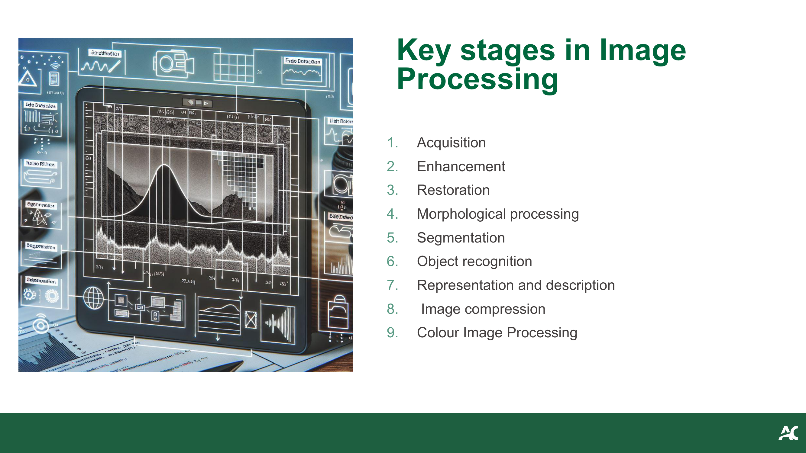

**Key stages overview slide:** A numbered list of 9 key stages in image processing, with a flowchart-style diagram.

**关键阶段概览页：** 图像处理9个关键阶段的编号列表，配有流程图风格的示意图。

### 3.2 阶段详解第1部分 (Stages Detail — Part 1)

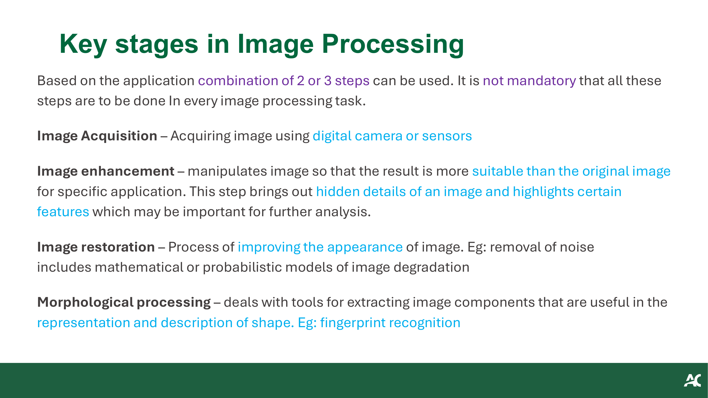

**Stages detail slide (part 1):** Detailed descriptions of Acquisition, Enhancement, Restoration, and Morphological processing.

**阶段详解页（第1部分）：** 采集、增强、复原和形态学处理的详细描述。

### 3.3 阶段详解第2部分 (Stages Detail — Part 2)

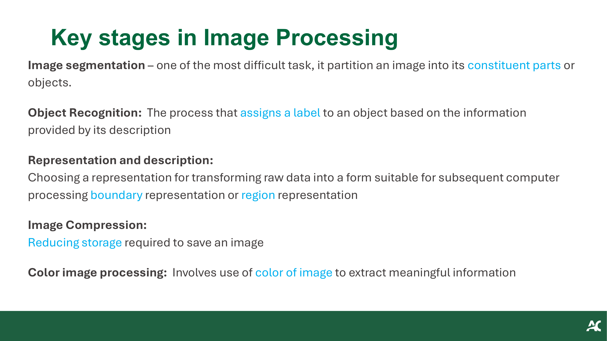

**Stages detail slide (part 2):** Detailed descriptions of Segmentation, Object Recognition, Representation, Compression, and Color processing.

**阶段详解页（第2部分）：** 分割、目标识别、表示、压缩和颜色处理的详细描述。

**Nine Key Stages:**

1. **Acquisition** — Capturing image using digital camera or sensors — **采集** — 使用数码相机或传感器获取图像
2. **Enhancement** — Manipulates image to be more suitable for specific application; brings out hidden details — **增强** — 使图像更适合特定应用；显现隐藏细节
3. **Restoration** — Improving appearance (e.g., noise removal); uses mathematical models of degradation — **复原** — 改善外观（如去噪）；使用退化的数学模型
4. **Morphological processing** — Tools for extracting image components useful for shape description (e.g., fingerprint) — **形态学处理** — 提取对形状描述有用的图像组件的工具（如指纹）
5. **Segmentation** — Partitions image into constituent parts or objects (one of the most difficult tasks) — **分割** — 将图像划分为组成部分或对象（最困难的任务之一）
6. **Object Recognition** — Assigns a label to an object based on its description — **目标识别** — 根据描述为对象分配标签
7. **Representation & Description** — Transforms raw data into a form suitable for processing (boundary or region) — **表示与描述** — 将原始数据转换为适合处理的形式（边界或区域）
8. **Image Compression** — Reducing storage required to save an image — **图像压缩** — 减少保存图像所需的存储空间
9. **Color Image Processing** — Using color information to extract meaningful data — **彩色图像处理** — 利用颜色信息提取有意义的数据

- Not all steps are required for every task — based on application, a combination of 2-3 steps may suffice — 并非每个任务都需要所有步骤 — 根据应用，2-3步的组合可能就足够了

> **📝 Notes:**
>
> **🎯 Why:**
> **(1) Canonical Framework (经典框架):**
>
> These 9 stages form the **canonical framework** from Gonzalez & Woods' textbook. They represent the full spectrum of what image processing can do. In practice, you'll pick a subset: e.g., a defect detection system uses Acquisition → Enhancement → Segmentation → Recognition.
>
>> 这9个阶段构成了Gonzalez & Woods教科书中的**经典框架**。它们代表了图像处理能做的全部。实践中你会选择子集：如缺陷检测系统使用采集 → 增强 → 分割 → 识别。
>>
>
> **💡 Intuition:**
> **(1) Menu Not Recipe (菜单而非菜谱):**
>
> Think of it as a **menu, not a recipe**. You don't order every dish at a restaurant — you pick what suits your meal. Similarly, a face recognition system might only need: Acquisition → Enhancement → Segmentation → Recognition (skipping compression, morphology, etc.).
>
>> 把它想象成**菜单，而不是菜谱**。你不会在餐厅点所有的菜 — 你挑选适合你这顿饭的。同样，人脸识别系统可能只需要：采集 → 增强 → 分割 → 识别（跳过压缩、形态学等）。
>>
>
> **⚖️ Compare:**
> **(1) Enhancement vs Restoration (增强 vs 复原):**
>
> | Stage       | Purpose                | Example                               |
> | ----------- | ---------------------- | ------------------------------------- |
> | Enhancement | Make image look better | Increase contrast of dark photo       |
> | Restoration | Undo known degradation | Remove motion blur with deconvolution |
>
>> | 阶段 | 目的             | 示例                 |
>> | ---- | ---------------- | -------------------- |
>> | 增强 | 让图像看起来更好 | 增加暗照片的对比度   |
>> | 复原 | 撤销已知退化     | 用反卷积去除运动模糊 |
>>
>
> **⚠️ Pitfall:**
> **(1) Enhancement ≠ Restoration (增强 ≠ 复原):**
>
> Don't confuse **Enhancement** and **Restoration**: Enhancement is subjective (make it "look better"), while Restoration uses a mathematical model of the degradation to undo it. Enhancement can lose information; restoration tries to recover it.
>
>> 不要混淆**增强**和**复原**：增强是主观的（让它"看起来更好"），而复原使用退化的数学模型来撤销它。增强可能丢失信息；复原试图恢复信息。
>>
>
> **📝 Exam:**
> **(1) List 9 Stages (列举9阶段):**
>
> "List the 9 key stages of image processing." → Memorize the list.
>
>> "列出图像处理的9个关键阶段。" → 记住这个列表。
>>
>
> **(2) Most Difficult Stage (最难阶段):**
>
> "Which stage is considered the most difficult?" → Segmentation.
>
>> "哪个阶段被认为是最困难的？" → 分割。
>>
>
> **(3) Enhancement vs Restoration (增强 vs 复原区别):**
>
> "What is the difference between Enhancement and Restoration?" → Enhancement is subjective improvement; Restoration uses mathematical models to undo degradation.
>
>> "增强和复原有什么区别？" → 增强是主观改善；复原使用数学模型撤销退化。
>>

---

## 4. 图像滤波 (Image Filtering)

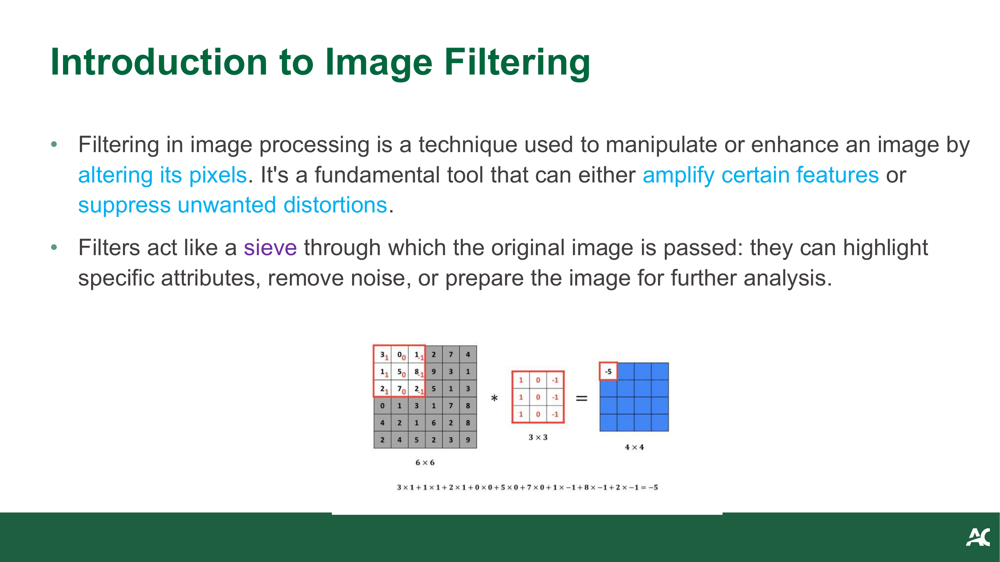

**Convolution visual example:** Top: two bullet points defining filtering. Bottom: a complete convolution demo — left shows a 6×6 input image matrix with a red box highlighting the top-left 3×3 region being processed; center shows a 3×3 filter kernel; right shows the resulting 4×4 output matrix with a blue cell marking the computed value. Below the matrices: the element-wise multiply-and-sum arithmetic written out step by step (each input pixel × corresponding kernel weight, then summed). Output size = (6 - 3 + 1) = 4×4.

**卷积可视示例：** 上方：两个要点定义滤波。下方：完整的卷积演示 — 左侧是6×6输入图像矩阵，红框标记正在处理的左上角3×3区域；中间是3×3滤波核；右侧是4×4输出矩阵，蓝色单元格标记计算结果。矩阵下方：逐步写出的逐元素乘加运算（每个输入像素 × 对应核权重，然后求和）。输出尺寸 = (6 - 3 + 1) = 4×4。

- Filtering in image processing is a technique used to manipulate or enhance an image by **altering its pixels**. It's a fundamental tool that can either **amplify certain features** or **suppress unwanted distortions** — 图像处理中的滤波是一种通过**改变像素**来操作或增强图像的技术。它是一种基本工具，可以**放大某些特征**或**抑制不需要的失真**
- Filters act like a **sieve** through which the original image is passed: they can highlight specific attributes, remove noise, or prepare the image for further analysis — 滤波器像**筛子**一样，原始图像通过它：可以突出特定属性、去除噪声、或为进一步分析做准备

> **📝 Notes:**
>
> **📌 What:**
> **(1) Filter/Kernel (滤波器/核):**
> A filter (also called a **kernel** or **convolution matrix**) is a small matrix (e.g., 3×3, 5×5) with pre-set or learned weights. Each weight determines how much the corresponding pixel contributes to the output.
>
>> 滤波器（也称**核**或**卷积矩阵**）是一个小矩阵（如3×3、5×5），具有预设或学习到的权重。每个权重决定对应像素对输出的贡献度。
>>
>
> **(2) Convolution operation (卷积运算):**
> The kernel slides across the image one pixel at a time. At each position, it computes a **weighted sum** (加权和) of the covered pixel neighborhood — multiply each pixel by the corresponding kernel weight and sum all products — producing one output pixel. This full sliding process is called **convolution**.
>
>> 核在图像上逐像素滑动。在每个位置，对覆盖的像素邻域计算**加权和** — 每个像素乘以对应核权重，再把所有乘积求和 — 产生一个输出像素。整个滑动过程称为**卷积**。
>>
>
> **(3) Weighted sum vs weighted average (加权和 vs 加权平均):**
> Weighted sum = Σ(pixel × weight). Weighted average = Σ(pixel × weight) / Σ(weight) — i.e., normalizes to 1.
> Only blur kernels (all positive, sum = 1) are true **weighted averages**. Sharpening/edge kernels have negative weights or sum ≠ 1, so they are weighted sums but **NOT** averages.
>
>> 加权和 = Σ(像素 × 权重)。加权平均 = Σ(像素 × 权重) / Σ(权重) — 即归一化为1。
>> 只有模糊核（全正，和=1）才是真正的**加权平均**。锐化/边缘核有负权重或和≠1，是加权和但**不是**平均。
>>
>
> **🎯 Why:**
> Why not just modify pixels directly? Because image properties are **contextual** — whether a pixel is "noise" or "edge" depends on what its neighbors look like. A filter examines the neighborhood to make informed decisions. Direct pixel modification would be arbitrary and destructive.
>
>> 为什么不直接修改像素？因为图像属性是**上下文相关的** — 一个像素是"噪声"还是"边缘"取决于它的邻居是什么样子。滤波器检查邻域做出明智的决策。直接修改像素将是任意的和破坏性的。
>>
>
> **💡 Intuition:**
> Imagine looking through frosted glass (blur filter) vs. a magnifying glass (sharpen filter). Both change what you see, but by altering how you combine information from the surrounding area. The filter kernel defines the "lens prescription."
>
>> 想象透过磨砂玻璃（模糊滤波器）vs. 放大镜（锐化滤波器）看东西。两者都改变你看到的，但通过改变你如何组合周围区域的信息来实现。滤波核定义了"镜片处方"。
>>
>
> **⚙️ How:**
> The kernel slides across the image one pixel at a time. At each position, it overlaps a pixel neighborhood. Multiply each overlapping pair (pixel × kernel weight), sum all products → one output pixel. Repeat for every pixel in the image. In OpenCV: `cv2.filter2D(img, -1, kernel)` applies any custom kernel.
>
>> 核在图像上逐像素滑动。在每个位置，它覆盖一个像素邻域。将每对重叠的值相乘（像素 × 核权重），将所有乘积求和 → 得到一个输出像素。对图像中每个像素重复此操作。在OpenCV中：`cv2.filter2D(img, -1, kernel)` 可应用任意自定义核。
>>
>
> **📐 Formula:**
> **(1) Correlation vs True Convolution (互相关 vs 真卷积):**
>
> - **Correlation** (slide demo, OpenCV, CNN): output(x,y) = Σᵢ Σⱼ input(x**+**i, y**+**j) × kernel(i,j) — no kernel flip
> - **True convolution** (math): output(x,y) = Σᵢ Σⱼ input(x**−**i, y**−**j) × kernel(i,j) — kernel flipped 180°
> - For **symmetric kernels** (averaging, Gaussian), both give identical results
> - In practice, OpenCV `filter2D` and CNN "convolution" layers use **correlation** (no flip)
>
>> - **互相关**（slide演示、OpenCV、CNN）：output(x,y) = Σᵢ Σⱼ input(x**+**i, y**+**j) × kernel(i,j) — 不翻转核
>> - **真正卷积**（数学）：output(x,y) = Σᵢ Σⱼ input(x**−**i, y**−**j) × kernel(i,j) — 核翻转180°
>> - 对于**对称核**（均值、高斯），两者结果完全相同
>> - 实际中 OpenCV `filter2D` 和 CNN "卷积层"用的都是**互相关**（不翻转）
>>
>
> **(2) Symbol legend (符号图例):**
>
> - input(x,y) = pixel value at position (x,y)
> - kernel(i,j) = weight at offset (i,j)
> - Σᵢ Σⱼ = sum over all kernel positions (3×3: i,j ∈ {-1,0,1}, 9 positions total)
>
>> - input(x,y) = 位置(x,y)的像素值
>> - kernel(i,j) = 偏移(i,j)处的权重
>> - Σᵢ Σⱼ = 遍历核的所有位置求和（3×3：i,j ∈ {-1,0,1}，共9个位置）
>>
>
> **(3) Output size (输出尺寸):**
> output_size = (input_size − kernel_size + 1): e.g., 6×6 input with 3×3 kernel → 4×4 output
>
>> 输出尺寸 = (输入尺寸 − 核尺寸 + 1)：如6×6输入配3×3核 → 4×4输出
>>
>
> **🔢 Example:**
> **Problem:** A 3×3 image region centered at pixel (1,1) with values:
> `[[10, 10, 10], [10, 50, 10], [10, 10, 10]]`
> Apply an averaging kernel: `[[1,1,1],[1,1,1],[1,1,1]] / 9`
> **Question:** What is the output pixel value at (1,1)?
> **Solution:**
>
> - Sum = 10+10+10+10+50+10+10+10+10 = 130
> - Output = 130 / 9 ≈ **14.4** (the bright center pixel 50 gets "diluted" by its dark neighbors → smoothing effect)
>
>> **题目：** 以像素(1,1)为中心的3×3图像区域值为：
>> `[[10, 10, 10], [10, 50, 10], [10, 10, 10]]`
>> 应用均值核：`[[1,1,1],[1,1,1],[1,1,1]] / 9`
>> **问：** 位置(1,1)的输出像素值是多少？
>> **解：**
>>
>> - 总和 = 10+10+10+10+50+10+10+10+10 = 130
>> - 输出 = 130 / 9 ≈ **14.4**（亮的中心像素50被暗邻居"稀释" → 平滑效果）
>>
>
> **⚖️ Compare:**
>
> | Operation                         | Kernel Property                     | Effect                 |
> | --------------------------------- | ----------------------------------- | ---------------------- |
> | **Low-pass (Blur)**         | All positive, sums to 1             | Smooths, removes noise |
> | **High-pass (Sharpen)**     | Center positive, neighbors negative | Enhances edges         |
> | **Band-pass (Edge detect)** | Sums to 0                           | Extracts edges only    |
>
>> | 操作                       | 核属性         | 效果           |
>> | -------------------------- | -------------- | -------------- |
>> | **低通（模糊）**     | 全正，和为1    | 平滑，去除噪声 |
>> | **高通（锐化）**     | 中心正，邻居负 | 增强边缘       |
>> | **带通（边缘检测）** | 和为0          | 仅提取边缘     |
>>
>
> **⚠️ Pitfall:**
> (1) **Boundary handling**: When the kernel reaches the image border, there are no neighbors outside. OpenCV pads with zeros by default, which can create dark borders. Use `cv2.BORDER_REFLECT` for better results.
> (2) **Kernel size must be odd** (3×3, 5×5, 7×7) so that there's a well-defined center pixel.
> (3) **Negative output values & uint8 overflow**: High-pass kernels (sharpening, edge detection) produce negative values. OpenCV `filter2D` with `ddepth=-1` (default uint8) **saturate-clips** negatives to 0 (black), losing edge info. Raw numpy uint8 arithmetic **wraps around**: -5 → 251 (near white) — a classic bug. Fix: use `ddepth=cv2.CV_64F` to preserve negatives, then `cv2.convertScaleAbs()` to map back to uint8.
>
>> (1) **边界处理**：当核到达图像边界时，外面没有邻居。OpenCV默认用零填充，可能产生暗边。使用 `cv2.BORDER_REFLECT`效果更好。
>> (2) **核大小必须是奇数**（3×3、5×5、7×7），这样才有定义明确的中心像素。
>> (3) **负值输出与uint8溢出**：高通核（锐化、边缘检测）会产生负值。OpenCV `filter2D` 默认uint8会**饱和截断**负值为0（黑色），丢失边缘信息。原生numpy uint8运算会**环绕溢出**：-5 → 251（近白色）——经典bug。解决：使用 `ddepth=cv2.CV_64F` 保留负值，再用 `cv2.convertScaleAbs()` 转回uint8。
>>
>
> **📝 Exam:**
> "What is image filtering?" → A technique that slides a small matrix (kernel) across an image, computing weighted sums of pixel neighborhoods to enhance or suppress features.
> "What is the difference between convolution and correlation?" → Convolution flips the kernel before sliding; correlation does not. In practice (symmetric kernels), they give the same result.
>
>> "什么是图像滤波？" → 一种将小矩阵（核）在图像上滑动的技术，计算像素邻域的加权和以增强或抑制特征。
>> "卷积和相关有什么区别？" → 卷积在滑动前翻转核；相关不翻转。实际中（对称核），它们给出相同结果。
>>

---

## 5. 图像模糊 (Image Blurring)

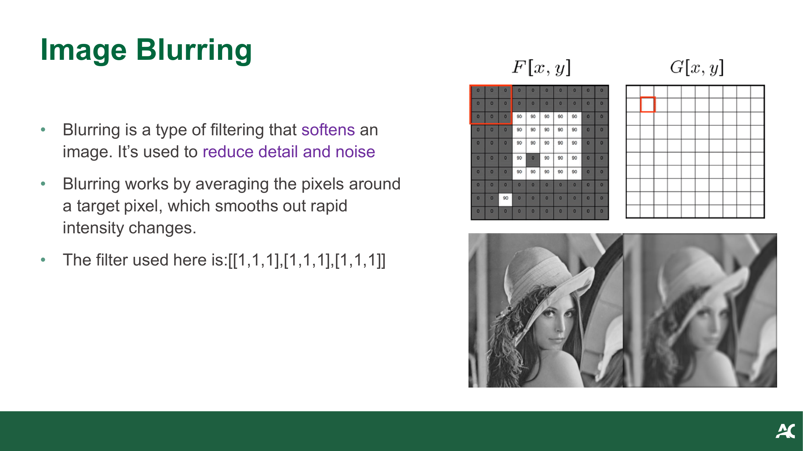

**Blurring slide:** Shows a blurred image example with the averaging kernel [[1,1,1],[1,1,1],[1,1,1]], demonstrating noise reduction effect.

**模糊页：** 展示了用均值核[[1,1,1],[1,1,1],[1,1,1]]的模糊图像示例，演示降噪效果。

- Blurring is a type of filtering that **softens** an image. It's used to **reduce detail and noise** — 模糊是一种**柔化**图像的滤波方式。用于**减少细节和噪声**
- Blurring works by averaging the pixels around a target pixel, which smooths out rapid intensity changes — 模糊通过对目标像素周围的像素取平均值来工作，平滑急剧的强度变化
- The filter used here is: `[[1,1,1],[1,1,1],[1,1,1]]` — 这里使用的滤波核是：`[[1,1,1],[1,1,1],[1,1,1]]`

> **📝 Notes:**
>
> **🎯 Why:**
> Noise in images comes from sensors (especially in low light). Blurring trades spatial resolution for noise reduction. It's a **mandatory preprocessing step** before operations that amplify noise (like edge detection, gradient computation). Without blurring first, downstream operations produce noisy, unreliable results.
>
>> 图像噪声来自传感器（特别是低光照）。模糊用空间分辨率换取降噪。它是放大噪声的操作（如边缘检测、梯度计算）之前的**必要预处理步骤**。不先模糊，下游操作会产生噪声大、不可靠的结果。
>>
>
> **💡 Intuition:**
> Blurring is like asking "what's the average temperature of this neighborhood?" — individual hot/cold spots (noise) disappear because they get diluted by their neighbors. But if a hot spot is large enough (real feature), it survives the averaging.
>
>> 模糊就像问"这个社区的平均温度是多少？" — 个别的高温/低温点（噪声）消失了因为它们被邻居稀释。但如果一个高温点足够大（真实特征），它能在平均中保存。
>>
>
> **⚙️ How:**
> The 3×3 averaging kernel `[[1,1,1],[1,1,1],[1,1,1]] / 9` replaces each pixel with the **mean of its 9-pixel neighborhood**. Larger kernels (5×5, 7×7) produce stronger blur. Gaussian blur uses a bell-curve weighted kernel instead of uniform weights, preserving edges better.
>
>> 3×3均值核 `[[1,1,1],[1,1,1],[1,1,1]] / 9`将每个像素替换为其**9像素邻域的均值**。更大的核（5×5、7×7）产生更强的模糊。高斯模糊使用钟形曲线加权核而不是均匀权重，能更好地保留边缘。
>>
>
> **📐 Formula:**
> **(1) Box blur (方框模糊):**
> `output(x,y) = (1/9) × Σ input(x+i, y+j)` for i,j ∈ {-1,0,1}
> All 9 neighbors contribute equally — simple average.
>
>> `output(x,y) = (1/9) × Σ input(x+i, y+j)` 对 i,j ∈ {-1,0,1}
>> 9个邻居贡献相同 — 简单平均。
>>
>
> **(2) Gaussian blur (高斯模糊):**
> `G(x,y) = (1 / 2πσ²) × e^(-(x²+y²) / 2σ²)` — σ controls blur strength.
>
> - σ = 1: gentle blur; σ = 3: strong blur; σ = 5: very strong blur.
> - **Rule of thumb**: kernel size ≈ 6σ + 1 (to capture 99.7% of the Gaussian).
> - Center pixel gets highest weight, farther pixels get exponentially less — preserves edges better than box blur.
>
>> `G(x,y) = (1 / 2πσ²) × e^(-(x²+y²) / 2σ²)` — σ控制模糊强度。
>>
>> - σ = 1：轻微模糊；σ = 3：强模糊；σ = 5：非常强的模糊。
>> - **经验法则**：核大小 ≈ 6σ + 1（捕获99.7%的高斯）。
>> - 中心像素权重最高，越远的像素指数递减 — 比方框模糊更好地保留边缘。
>>
>
> **⚖️ Compare:**
>
> | Filter Type             | Kernel                      | Best for                             | OpenCV Function           |
> | ----------------------- | --------------------------- | ------------------------------------ | ------------------------- |
> | **Average (Box)** | Uniform weights             | General smoothing                    | `cv2.blur()`            |
> | **Gaussian**      | Bell-curve weights          | Noise removal while preserving edges | `cv2.GaussianBlur()`    |
> | **Median**        | Takes median value          | Salt-and-pepper noise removal        | `cv2.medianBlur()`      |
> | **Bilateral**     | Spatial + intensity weights | Edge-preserving denoising            | `cv2.bilateralFilter()` |
>
>> | 滤波类型               | 核            | 最适合           | OpenCV函数                |
>> | ---------------------- | ------------- | ---------------- | ------------------------- |
>> | **均值（方框）** | 均匀权重      | 一般平滑         | `cv2.blur()`            |
>> | **高斯**         | 钟形权重      | 去噪同时保留边缘 | `cv2.GaussianBlur()`    |
>> | **中值**         | 取中值        | 椒盐噪声去除     | `cv2.medianBlur()`      |
>> | **双边**         | 空间+强度权重 | 保边去噪         | `cv2.bilateralFilter()` |
>>
>
> **⚠️ Pitfall:**
> (1) Bigger kernel ≠ always better. Large kernels destroy fine details and edges along with noise.
> (2) Gaussian blur is preferred over box blur in most real applications because it doesn't introduce artifacts (ringing).
> (3) **Median filter** is NOT a convolution — it takes the median, not a weighted sum. This makes it non-linear but excellent for salt-and-pepper noise.
>
>> (1) 更大的核 ≠ 总是更好。大核会和噪声一起破坏精细细节和边缘。
>> (2) 在大多数实际应用中，高斯模糊优于方框模糊，因为它不会引入伪影（振铃）。
>> (3) **中值滤波器**不是卷积 — 它取中值，不是加权和。这使它非线性但对椒盐噪声极其有效。
>>
>
> **📝 Exam:**
> "Which filter type smoothens an image?" → Image Blurring (averaging filter).
> "What does the kernel [[1,1,1],[1,1,1],[1,1,1]]/9 do?" → Replaces each pixel with the average of its 3×3 neighborhood.
> "Which filter is best for salt-and-pepper noise?" → Median filter.
>
>> "哪种滤波类型平滑图像？" → 图像模糊（均值滤波器）。
>> "核[[1,1,1],[1,1,1],[1,1,1]]/9做什么？" → 将每个像素替换为其3×3邻域的平均值。
>> "哪种滤波器最适合椒盐噪声？" → 中值滤波器。
>>

---

## 6. 图像锐化 (Image Sharpening)

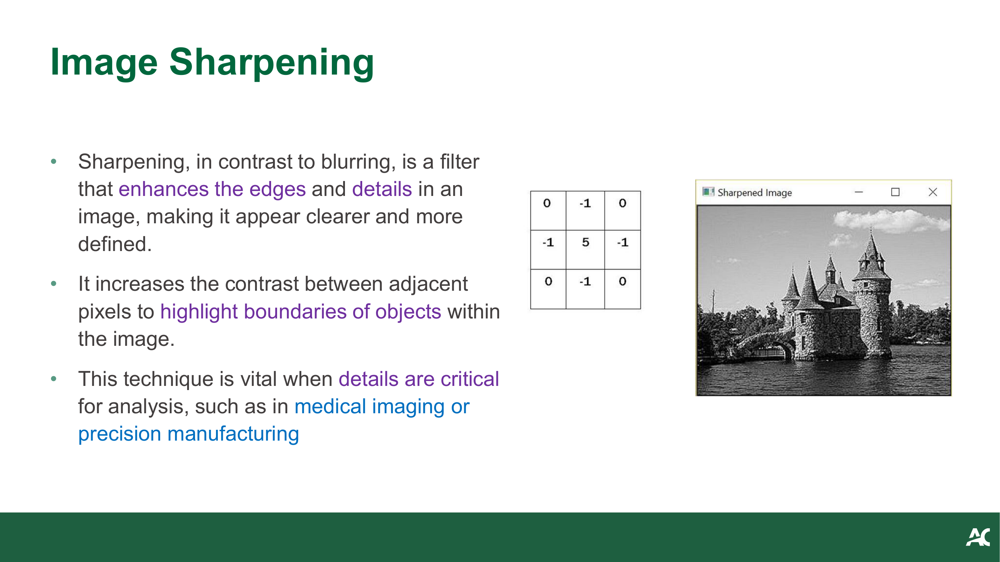

**Sharpening slide:** Shows a sharpened image example, demonstrating enhanced edges and details.

**锐化页：** 展示了锐化图像示例，演示增强的边缘和细节。

- Sharpening, in contrast to blurring, is a filter that **enhances the edges** and **details** in an image, making it appear clearer and more defined — 锐化与模糊相反，是一种**增强图像边缘**和**细节**的滤波器，使图像看起来更清晰、更精确
- It increases the contrast between adjacent pixels to **highlight boundaries of objects** within the image — 它增加相邻像素之间的对比度，以**突出图像内对象的边界**
- This technique is vital when **details are critical** for analysis, such as in **medical imaging or precision manufacturing** — 当**细节对分析至关重要**时，这种技术至关重要，例如在**医学影像或精密制造**中

> **📝 Notes:**
>
> **🎯 Why:**
> Images captured by cameras or scanned documents often appear slightly soft due to the lens optics, sensor limitations, or compression. Sharpening recovers the crispness lost during capture. In **medical imaging**, sharpening can reveal subtle structures (tumors, fractures) that would otherwise be missed. In **precision manufacturing**, sharpened images help robotic systems detect defects at sub-pixel accuracy.
>
>> 相机拍摄或扫描的图像由于镜头光学、传感器限制或压缩，通常看起来略微模糊。锐化恢复了拍摄过程中丢失的清晰度。在**医学影像**中，锐化可以揭示微妙的结构（肿瘤、骨折），否则会被忽略。在**精密制造**中，锐化后的图像帮助机器人系统以亚像素精度检测缺陷。
>>
>
> **💡 Intuition:**
> Sharpening is the **opposite** of blurring. Blurring averages out differences; sharpening amplifies them. Think of turning up the "contrast" knob on a TV — edges become more pronounced, but if you turn too far, you get harsh artifacts.
>
>> 锐化是模糊的**相反操作**。模糊平均掉差异；锐化放大它们。就像调高电视的"对比度"旋钮 — 边缘更明显，但如果调太多，会产生刺眼的伪影。
>>
>
> **⚙️ How:**
> Sharpening typically uses a kernel like `[[0,-1,0],[-1,5,-1],[0,-1,0]]`. The center value (5) is larger than the sum of neighbors (-4), so it **amplifies the difference** between a pixel and its surroundings. This is essentially: `sharpened = original + α × (original - blurred)`, known as **unsharp masking**.
>
>> 锐化通常使用如 `[[0,-1,0],[-1,5,-1],[0,-1,0]]`的核。中心值（5）大于邻居之和（-4），所以它**放大像素与周围的差**。本质上：`锐化 = 原始 + α × (原始 - 模糊)`，称为**反锐化掩模**。
>>
>
> **📐 Formula:**
> **Unsharp Masking**: `sharpened = original + α × (original - GaussianBlur(original))`
>
> - α controls **sharpening strength**: α = 0.5 (subtle), α = 1.0 (standard), α = 2.0 (aggressive).
> - The subtraction `(original - blurred)` extracts the **high-frequency details** (edges). Adding them back amplifies those edges.
>
>> **反锐化掩模**：`锐化 = 原始 + α × (原始 - GaussianBlur(原始))`
>>
>> - α控制**锐化强度**：α = 0.5（微妙）、α = 1.0（标准）、α = 2.0（激进）。
>> - 减法 `(原始 - 模糊)`提取**高频细节**（边缘）。加回去放大了这些边缘。
>>
>
> **⚖️ Compare:**
>
> | Aspect                | Blurring                   | Sharpening                   |
> | --------------------- | -------------------------- | ---------------------------- |
> | **Goal**        | Reduce noise/detail        | Enhance edges/detail         |
> | **Kernel sum**  | = 1 (preserves brightness) | > 1 (amplifies center)       |
> | **Risk**        | Loses fine details         | Amplifies noise              |
> | **When to use** | Before edge detection      | After denoising, for display |
>
>> | 方面               | 模糊            | 锐化             |
>> | ------------------ | --------------- | ---------------- |
>> | **目标**     | 减少噪声/细节   | 增强边缘/细节    |
>> | **核求和**   | = 1（保持亮度） | > 1（放大中心）  |
>> | **风险**     | 丢失精细细节    | 放大噪声         |
>> | **使用时机** | 边缘检测前      | 去噪后、用于显示 |
>>
>
> **⚠️ Pitfall:**
> Sharpening **amplifies noise** along with edges. In noisy images, always blur first to remove noise, then sharpen to recover edges. Applying sharpening to a noisy image makes the noise worse.
>
>> 锐化会同时**放大噪声**和边缘。在有噪声的图像中，总是先模糊去噪，然后再锐化恢复边缘。对有噪声的图像应用锐化会使噪声更严重。
>>
>
> **📝 Exam:**
> (1) **定义题 (Definition):**
> "What does image sharpening do?" → Enhances edges and details by amplifying the difference between a pixel and its neighbors.
>
>> "图像锐化做什么？" → 通过放大像素与邻居的差异来增强边缘和细节。
>>
>
> (2) **公式解释题 (Formula explanation):**
> "Explain unsharp masking." → `sharpened = original + α × (original − blurred)`. It subtracts a blurred version to extract edge details, then adds them back with amplification factor α.
>
>> "解释反锐化掩模。" → `锐化 = 原始 + α × (原始 − 模糊)`。减去模糊版本提取边缘细节，然后用放大系数α加回。
>>
>
> (3) **推理题 (Reasoning):**
> "Why should you blur before sharpening?" → Sharpening amplifies ALL high-frequency content, including noise. Blurring first removes noise (high-frequency), so subsequent sharpening only amplifies real edges.
>
>> "为什么应该先模糊再锐化？" → 锐化放大所有高频内容，包括噪声。先模糊去掉噪声（高频），这样后续锐化只放大真实边缘。
>>

---

## 7. 基本图像操作 (Basic Image Manipulations)

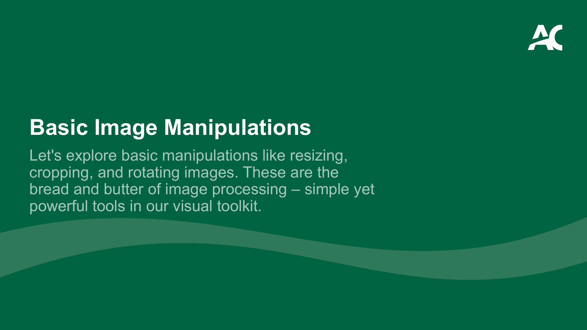

**Manipulations slide:** Introduces resizing, cropping, and rotating as fundamental tools, with visual examples.

**操作页：** 介绍调整大小、裁剪和旋转作为基本工具，配有视觉示例。

- Let's explore basic manipulations like resizing, cropping, and rotating images. These are the bread and butter of image processing – simple yet powerful tools in our visual toolkit — 让我们探索调整大小、裁剪和旋转图像等基本操作。这些是图像处理的基本功 – 简单却强大的视觉工具

> **📝 Notes:**
>
> **🎯 Why:**
> These operations seem trivial, but they are used in **every single** computer vision pipeline. Resizing normalizes input dimensions for ML models (which require fixed-size inputs). Cropping extracts **regions of interest** (ROI) for focused analysis. Rotation corrects misaligned images (tilted documents, rotated objects). Without these tools, raw camera images cannot enter processing pipelines.
>
>> 这些操作看似简单，但在**每一个**计算机视觉流水线中都会用到。调整大小将输入尺寸标准化，供ML模型使用（需要固定大小输入）。裁剪提取**感兴趣区域**（ROI）进行集中分析。旋转校正偏斜图像（倾斜的文档、旋转的对象）。没有这些工具，原始相机图像无法进入处理流水线。
>>
>
> **💡 Intuition:**
> These are the **Photoshop basics** of computer vision. Just as you crop a photo before posting on social media, or resize it for a website, CV pipelines need the same operations — but programmatically, applied to thousands of images per second, with precise mathematical control.
>
>> 这些是计算机视觉的**Photoshop基础**。就像你在社交媒体发布前裁剪照片，或为网站调整大小一样，CV流水线需要同样的操作 — 但以编程方式，每秒处理数千张图像，具有精确的数学控制。
>>
>
> **⚙️ How:**
> In OpenCV: `cv2.resize(img, (width, height))` for resizing, `img[y1:y2, x1:x2]` for cropping (numpy slicing), `cv2.getRotationMatrix2D()` + `cv2.warpAffine()` for rotation. Note: resize takes (width, height) but array shape is (height, width) — a common source of confusion.
>
>> 在OpenCV中：`cv2.resize(img, (width, height))`调整大小，`img[y1:y2, x1:x2]`裁剪（numpy切片），`cv2.getRotationMatrix2D()` + `cv2.warpAffine()`旋转。注意：resize接受(width, height)但数组形状是(height, width) — 常见的混淆点。
>>
>
> **⚖️ Compare:**
>
> | Interpolation      | `cv2` Constant  | Best for               | Quality                |
> | ------------------ | ----------------- | ---------------------- | ---------------------- |
> | **Nearest**  | `INTER_NEAREST` | Speed, pixel art       | Blocky at large scales |
> | **Bilinear** | `INTER_LINEAR`  | Upscaling (default)    | Smooth, fast           |
> | **Area**     | `INTER_AREA`    | **Downscaling**  | Best quality           |
> | **Bicubic**  | `INTER_CUBIC`   | High-quality upscaling | Smooth, slower         |
>
>> | 插值             | `cv2` 常量      | 最适合         | 质量         |
>> | ---------------- | ----------------- | -------------- | ------------ |
>> | **最近邻** | `INTER_NEAREST` | 速度、像素艺术 | 大尺度时块状 |
>> | **双线性** | `INTER_LINEAR`  | 放大（默认）   | 平滑、快速   |
>> | **区域**   | `INTER_AREA`    | **缩小** | 最高质量     |
>> | **双三次** | `INTER_CUBIC`   | 高质量放大     | 平滑、较慢   |
>>
>
> **⚠️ Pitfall:**
> (1) **Resizing loses information** — downscaling discards pixels permanently. Always keep the original image.
> (2) **Interpolation matters**: `cv2.INTER_LINEAR` (default) for upscaling, `cv2.INTER_AREA` for downscaling gives best quality.
> (3) `cv2.resize()` takes `(width, height)` but `img.shape` returns `(height, width, channels)` — mixing them up causes **stretched or squashed** images. This is the #1 bug in beginner CV code.
>
>> (1) **调整大小会丢失信息** — 缩小会永久丢弃像素。始终保留原始图像。
>> (2) **插值方法很重要**：放大用 `cv2.INTER_LINEAR`（默认），缩小用 `cv2.INTER_AREA`质量最好。
>> (3) `cv2.resize()`接受 `(width, height)`但 `img.shape`返回 `(height, width, channels)` — 搞混会导致**拉伸或压扁**的图像。这是初学者CV代码的#1 bug。
>>
>
> **📝 Exam:**
> "How do you crop an image in OpenCV?" → Using numpy slicing: `cropped = img[y1:y2, x1:x2]`.
> "Which interpolation method is best for downscaling?" → `cv2.INTER_AREA`.
> "What is the default interpolation in cv2.resize()?" → `cv2.INTER_LINEAR` (bilinear).
>
>> "在OpenCV中如何裁剪图像？" → 使用numpy切片：`cropped = img[y1:y2, x1:x2]`。
>> "哪种插值方法最适合缩小？" → `cv2.INTER_AREA`。
>> "cv2.resize()的默认插值是什么？" → `cv2.INTER_LINEAR`（双线性）。
>>

---

## 8. Canny边缘检测 (Edge Detection using Canny)

### 8.1 降噪与梯度计算 (Noise Reduction and Gradient Calculation)

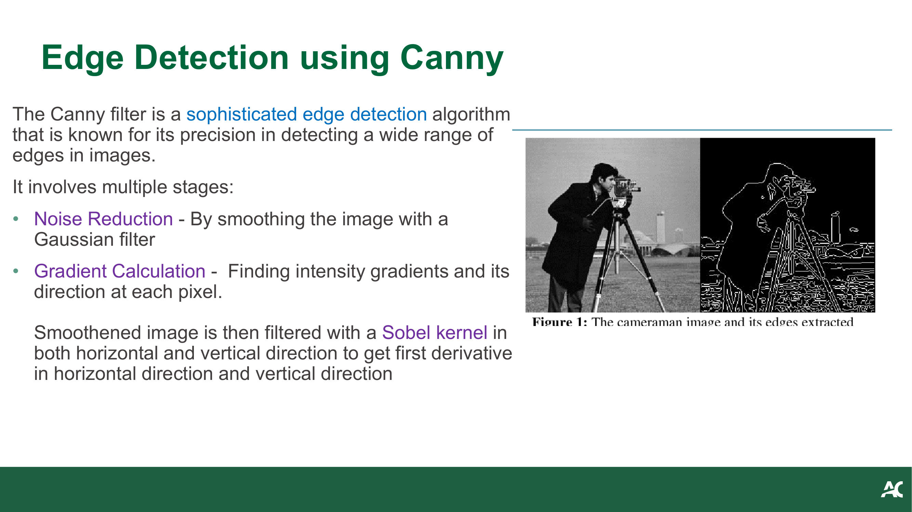

**Canny edge detection slide (part 1):** Title "Edge Detection using Canny". Left: introduces the Canny filter as a "sophisticated edge detection algorithm" with high precision. Lists the first 2 stages: Noise Reduction (Gaussian filter) and Gradient Calculation (Sobel kernel in horizontal + vertical directions). Right: side-by-side comparison — original grayscale cameraman image (left) and its extracted white edges on black background (right), captioned "Figure 1: The cameraman image and its edges extracted".

**Canny边缘检测页（第1部分）：** 标题"Edge Detection using Canny"。左侧：介绍Canny滤波器为"精密边缘检测算法"，精度高。列出前2阶段：噪声降低（高斯滤波器）和梯度计算（水平+垂直方向Sobel核）。右侧：并排对比 — 原始灰度摄影师图像（左）与提取的白色边缘黑色背景图（右），标注"Figure 1: The cameraman image and its edges extracted"。

- The Canny filter is a **sophisticated edge detection** algorithm that is known for its precision in detecting a wide range of edges in images — Canny滤波器是一种**精密边缘检测**算法，以其在检测图像中各种边缘的精确度而闻名
- It involves multiple stages: — 它涉及多个阶段：
  1. **Noise Reduction** - By smoothing the image with a Gaussian filter — **降噪** - 用高斯滤波器平滑图像
  2. **Gradient Calculation** - Finding intensity gradients and its direction at each pixel — **梯度计算** - 找到每个像素的强度梯度及其方向
- Smoothened image is then filtered with a **Sobel kernel** in both horizontal and vertical direction to get first derivative in horizontal direction and vertical direction — 平滑后的图像用**Sobel核**在水平和垂直方向上滤波，得到水平方向和垂直方向的一阶导数

### 8.2 NMS、双阈值与滞后跟踪 (NMS, Double Thresholding and Hysteresis)

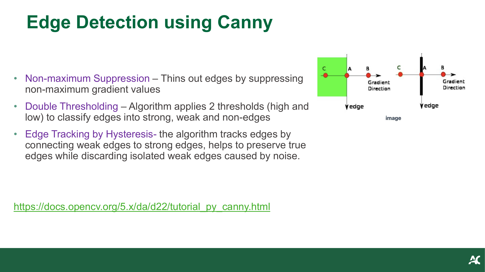

**Canny edge detection slide (part 2):** Covers the remaining 3 stages: Non-maximum Suppression (suppressing non-maximum gradient values), Double Thresholding (classifying into strong, weak, non-edges), and Edge Tracking by Hysteresis (connecting weak edges to strong edges). Right: NMS diagram — two cross-shaped diagrams showing 3 points (C, A, B) along the gradient direction, with point A on the edge. Left diagram shows the points on the edge itself (green region); right diagram shows the points on the image plane. Arrows indicate gradient direction perpendicular to the edge.

**Canny边缘检测页（第2部分）：** 覆盖剩余3阶段：非极大值抑制（抑制非最大梯度值）、双阈值（分为强、弱、非边缘）和滞后边缘跟踪（将弱边缘连接到强边缘）。右侧：NMS示意图 — 两个十字形图展示沿梯度方向的3个点（C、A、B），A点在边缘上。左图显示这些点在边缘（绿色区域）上的位置；右图显示在图像平面上的位置。箭头指示垂直于边缘的梯度方向。

- **Non-maximum Suppression** – Thins out edges by suppressing non-maximum gradient values — **非极大值抑制** – 通过抑制非最大梯度值来细化边缘
- **Double Thresholding** – Algorithm applies 2 thresholds (high and low) to classify edges into strong, weak and non-edges — **双阈值** – 算法应用2个阈值（高和低）将边缘分为强边缘、弱边缘和非边缘
- **Edge Tracking by Hysteresis**- the algorithm tracks edges by connecting weak edges to strong edges, helps to preserve true edges while discarding isolated weak edges caused by noise — **滞后边缘跟踪** - 算法通过将弱边缘连接到强边缘来跟踪边缘，有助于保留真实边缘同时丢弃由噪声引起的孤立弱边缘

- Ref: https://docs.opencv.org/5.x/da/d22/tutorial_py_canny.html

> **📝 Notes:**
>
> **📌 What:**
> Canny edge detection is a **multi-stage algorithm** that produces clean, thin, well-connected edges from a grayscale image. It goes far beyond simple gradient thresholding by adding noise suppression, edge thinning, and connectivity analysis. It is considered the **gold standard** of classical edge detection.
>
>> Canny边缘检测是一种**多阶段算法**，从灰度图像中产生干净、细的、连接良好的边缘。它远超简单的梯度阈值化，增加了噪声抑制、边缘细化和连通性分析。它被认为是经典边缘检测的**黄金标准**。
>>
>
> **🎯 Why:**
> Why 5 stages instead of just thresholding the gradient? Because raw gradients produce **thick, noisy edges**. Each stage solves a specific problem: (1) noise would create false gradients, (2) gradients find edges but they're thick, (3) NMS makes them 1-pixel thin, (4) thresholding removes weak noise-edges, (5) hysteresis preserves real edge continuity.
>
>> 为什么是5个阶段而不是直接对梯度做阈值？因为原始梯度产生**粗的、有噪声的边缘**。每个阶段解决一个特定问题：(1)噪声会产生假梯度，(2)梯度找到边缘但它们很粗，(3)NMS使它们变为1像素细，(4)阈值去除弱的噪声边缘，(5)滞后保持真实边缘的连续性。
>>
>
> **💡 Intuition:**
> Think of finding a mountain ridge on a topographic map: (1) First, smooth out small bumps (noise reduction). (2) Calculate slope at every point (gradient). (3) Only keep the highest points along the ridge (NMS). (4) Mark definite ridge points (strong) and possible points (weak). (5) Walk along the ridge — if a weak point connects to a strong one, it's real; if it's isolated, it's just a rock.
>
>> 想象在地形图上找山脊：(1)首先平滑小凸起（降噪）。(2)计算每个点的坡度（梯度）。(3)只保留山脊上最高的点（NMS）。(4)标记确定的山脊点（强）和可能的点（弱）。(5)沿山脊走 — 如果弱点连接到强点，它是真的；如果孤立的，它只是一块石头。
>>
>
> **⚙️ How:**
> **(1) Stage 1 — Noise Reduction (降噪):**
>
> Apply a Gaussian blur to smooth the image. This is critical because the next step (differentiation) amplifies noise. Typical kernel: 5×5 Gaussian.
>
>> 应用高斯模糊平滑图像。这很关键，因为下一步（求导）会放大噪声。典型核：5×5高斯。
>>
>
> **(2) Stage 2 — Gradient Calculation (梯度计算):**
>
> Convolve the smoothed image with Sobel kernels in X and Y directions to get Gx and Gy. Then compute magnitude `|G| = √(Gx² + Gy²)` and direction `θ = arctan(Gy/Gx)`. Every pixel now has an edge strength and orientation.
>
>> 用Sobel核在X和Y方向对平滑图像做卷积得到Gx和Gy。然后计算幅值`|G| = √(Gx² + Gy²)`和方向`θ = arctan(Gy/Gx)`。每个像素现在有了边缘强度和方向。
>>
>
> **(3) Stage 3 — Non-maximum Suppression, NMS (非极大值抑制):**
>
> For each pixel, look at its two neighbors **along the gradient direction** (perpendicular to the edge). If the pixel is NOT the local maximum among these three, suppress it to 0. Result: edges become **1-pixel thin**. This is NOT thresholding — it's a local maximum filter along the gradient direction.
>
>> 对每个像素，查看其沿**梯度方向**（垂直于边缘）的两个邻居。如果该像素不是这三个中的局部最大值，就抑制为0。结果：边缘变为**1像素宽**。这不是阈值化 — 而是沿梯度方向的局部最大值滤波。
>>
>
> **(4) Stage 4 — Double Thresholding (双阈值):**
>
> Apply two thresholds (T_high, T_low) to classify every pixel: gradient ≥ T_high → **strong edge** (definitely real), T_low ≤ gradient < T_high → **weak edge** (maybe real), gradient < T_low → **non-edge** (discard). Common ratio: T_low : T_high = 1:2 or 1:3.
>
>> 应用两个阈值（T_high, T_low）分类每个像素：梯度 ≥ T_high → **强边缘**（确定是真的），T_low ≤ 梯度 < T_high → **弱边缘**（可能是真的），梯度 < T_low → **非边缘**（丢弃）。常见比率：T_low : T_high = 1:2 或 1:3。
>>
>
> **(5) Stage 5 — Edge Tracking by Hysteresis (滞后边缘跟踪):**
>
> Starting from strong edges, trace along connected weak edges. If a weak edge is connected (8-connectivity) to a strong edge, it's promoted to a real edge. Isolated weak edges are discarded as noise. This preserves edge **continuity** while removing false positives.
>
>> 从强边缘开始，沿连接的弱边缘追踪。如果弱边缘与强边缘相连（8连通），就提升为真实边缘。孤立的弱边缘作为噪声丢弃。这保持了边缘的**连续性**，同时去除误检。
>>
>
> **(6) OpenCV API:**
>
> `edges = cv2.Canny(img, threshold1, threshold2)` — threshold1 = T_low, threshold2 = T_high. Lower T_low → more edges detected (including noise); higher T_high → only strongest edges kept.
>
>> `edges = cv2.Canny(img, threshold1, threshold2)` — threshold1 = T_low，threshold2 = T_high。T_low越低 → 检测到更多边缘（包括噪声）；T_high越高 → 只保留最强的边缘。
>>
>
> **📐 Formula:**
> **(1) Gradient magnitude (梯度幅值):**
>
> `|G| = √(Gx² + Gy²)` where Gx and Gy are horizontal and vertical Sobel derivatives.
>
>> `|G| = √(Gx² + Gy²)` 其中Gx和Gy是水平和垂直Sobel导数。
>>
>
> **(2) Gradient direction (梯度方向):**
>
> `θ = arctan(Gy / Gx)` — used by NMS to determine which neighbors to compare.
>
>> `θ = arctan(Gy / Gx)` — NMS用来确定比较哪些邻居。
>>
>
> **(3) Sobel kernel (Sobel核):**
>
> Horizontal: `[[-1,0,1],[-2,0,2],[-1,0,1]]` — detects vertical edges.
> Vertical: `[[-1,-2,-1],[0,0,0],[1,2,1]]` — detects horizontal edges.
>
>> 水平：`[[-1,0,1],[-2,0,2],[-1,0,1]]` — 检测垂直边缘。
>> 垂直：`[[-1,-2,-1],[0,0,0],[1,2,1]]` — 检测水平边缘。
>>
>
> **⚖️ Compare:**
>
> | Feature | Sobel | Laplacian | Canny |
> |---|---|---|---|
> | Output | Gradient magnitude (thick edges) | Second derivative (zero-crossings) | Binary thin edges |
> | Edge thickness | Thick (multi-pixel) | Medium | **1-pixel thin** |
> | Noise handling | None (amplifies noise) | Very sensitive to noise | Built-in Gaussian smoothing |
> | Thresholding | Manual single threshold | Manual single threshold | **Automatic double threshold + hysteresis** |
> | Connectivity | No connectivity analysis | No connectivity analysis | **Hysteresis preserves continuity** |
> | Use case | Quick gradient visualization | Blob/region boundary detection | **Production-quality edge detection** |
>
>> | 特性 | Sobel | Laplacian | Canny |
>> |---|---|---|---|
>> | 输出 | 梯度幅值（粗边缘） | 二阶导数（过零点） | 二值细边缘 |
>> | 边缘厚度 | 粗（多像素） | 中等 | **1像素细** |
>> | 噪声处理 | 无（放大噪声） | 对噪声非常敏感 | 内置高斯平滑 |
>> | 阈值化 | 手动单阈值 | 手动单阈值 | **自动双阈值+滞后** |
>> | 连通性 | 无连通性分析 | 无连通性分析 | **滞后保持连续性** |
>> | 使用场景 | 快速梯度可视化 | Blob/区域边界检测 | **生产级边缘检测** |
>>
>
> **⚠️ Pitfall:**
> (1) **Gradient calculation is differentiation** — it amplifies noise. That's why Step 1 (Gaussian smoothing) is essential. Skipping it = useless noisy output.
> (2) **NMS ≠ thresholding.** NMS compares gradient magnitudes **along the gradient direction** to find local maxima. It produces thin edges. Thresholding (Stage 4) is a separate step that classifies by magnitude.
> (3) **Double thresholding produces THREE categories** (strong/weak/non-edge), not two. This is an exam trap — students often think it's just "edge vs non-edge".
> (4) **Hysteresis is about connectivity**, not magnitude. A weak edge becomes real only if connected to a strong edge — it doesn't get re-evaluated by magnitude.
>
>> (1) **梯度计算本质是求导** — 它会放大噪声。这就是为什么第1步（高斯平滑）必不可少。跳过它 = 无用的噪声输出。
>> (2) **NMS ≠ 阈值化。** NMS沿**梯度方向**比较梯度幅值以找局部最大值，产生细边缘。阈值化（第4步）是单独的步骤，按幅值分类。
>> (3) **双阈值产生三个类别**（强/弱/非边缘），不是两个。这是考试陷阱 — 学生常以为只是"边缘 vs 非边缘"。
>> (4) **滞后关注的是连通性**，不是幅值。弱边缘只有连接到强边缘才变为真实边缘 — 不会重新按幅值评估。
>>
>
> **📝 Exam:**
> (1) **记忆题 (Recall):**
> "Select the stages involved in Canny edge detection?" → All five: Noise Reduction, Gradient Calculation, Non-maximum Suppression, Double Thresholding, Edge Tracking by Hysteresis.
>
>> "选择Canny边缘检测中涉及的阶段？" → 全部五个：降噪、梯度计算、非极大值抑制、双阈值、滞后边缘跟踪。
>>
>
> (2) **概念辨析题 (Conceptual):**
> "Which stage applies two thresholds to classify edges?" → Double Thresholding (Stage 4). Classifies into strong, weak, and non-edges.
> "What does Non-maximum Suppression do?" → Thins edges to 1-pixel width by keeping only local maxima along gradient direction.
>
>> "哪个阶段应用两个阈值来分类边缘？" → 双阈值（第4步）。分为强、弱、非边缘。
>> "非极大值抑制做什么？" → 通过保留梯度方向上的局部最大值，将边缘细化为1像素宽。
>>
>
> (3) **推理题 (Reasoning):**
> "Why is Gaussian smoothing the first step in Canny?" → Gradient calculation is differentiation, which amplifies noise. Smoothing removes noise before differentiation so gradients reflect real edges, not noise.
>
>> "为什么高斯平滑是Canny的第一步？" → 梯度计算是求导，会放大噪声。平滑在求导前去除噪声，使梯度反映真实边缘而非噪声。
>>
>
> (4) **对比题 (Comparison):**
> "Compare Canny to simple Sobel thresholding." → Sobel produces thick, noisy edges with no connectivity. Canny adds smoothing (noise), NMS (thinning), double threshold (classification), hysteresis (connectivity) — producing clean, thin, connected edges.
>
>> "比较Canny和简单Sobel阈值化。" → Sobel产生粗的、有噪声的、无连通性的边缘。Canny增加了平滑（噪声）、NMS（细化）、双阈值（分类）、滞后（连通性）— 产生干净、细的、连接的边缘。
>>

---

## 9. 图像直方图 (Image Histograms)

### 9.1 直方图定义 (Histogram Definition)

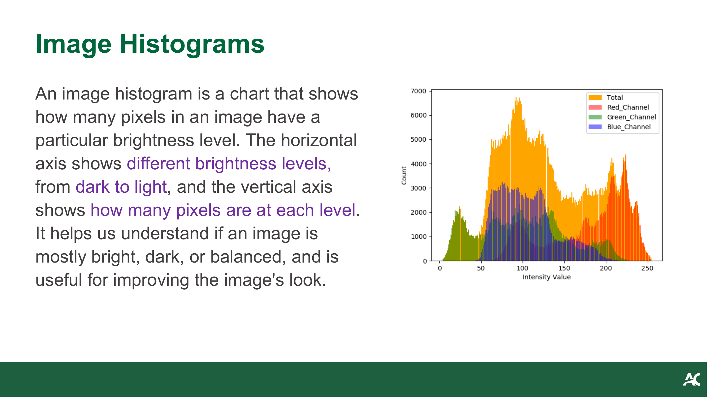

**Image Histograms title slide:** Title "Image Histograms" in green. Left: paragraph defining what a histogram is — "An image histogram is a chart that shows how many pixels in an image have a particular brightness level. The horizontal axis shows **different brightness levels**, from **dark to light**, and the vertical axis shows **how many pixels are at each level**. It helps us understand if an image is mostly bright, dark, or balanced, and is useful for improving the image's look." Right: a multi-channel histogram chart with X-axis "Intensity Value" (0–250) and Y-axis "Count" (0–7000). Legend shows 4 overlapping layers: **Total** (orange fill, tallest), **Red_Channel** (red), **Green_Channel** (green), **Blue_Channel** (blue/purple). The histogram has two main peaks around intensity 50–80 and 150–200, typical of a natural image.

**图像直方图标题页：** 标题"Image Histograms"（绿色）。左侧：定义直方图的段落 — "图像直方图是一个图表，显示图像中有多少像素具有特定亮度级别。水平轴显示**不同的亮度级别**，从**暗到亮**，垂直轴显示**每个级别有多少像素**。它帮助我们了解图像是主要明亮、暗还是均衡，对改善图像外观有用。"右侧：多通道直方图，X轴"Intensity Value"（0–250），Y轴"Count"（0–7000）。图例显示4个重叠层：**Total**（橙色填充，最高），**Red_Channel**（红色），**Green_Channel**（绿色），**Blue_Channel**（蓝/紫色）。直方图在强度50–80和150–200附近有两个主峰，典型的自然图像分布。

- An image histogram is a chart that shows how many pixels in an image have a particular brightness level. The horizontal axis shows **different brightness levels**, from **dark to light**, and the vertical axis shows **how many pixels are at each level**. It helps us understand if an image is mostly bright, dark, or balanced, and is useful for improving the image's look. — 图像直方图是一个图表，显示图像中有多少像素具有特定亮度级别。水平轴显示**不同的亮度级别**，从**暗到亮**，垂直轴显示**每个级别有多少像素**。它帮助我们了解图像是主要明亮、暗还是均衡的，对改善图像外观有用。

### 9.2 直方图结构 (Histogram Structure)

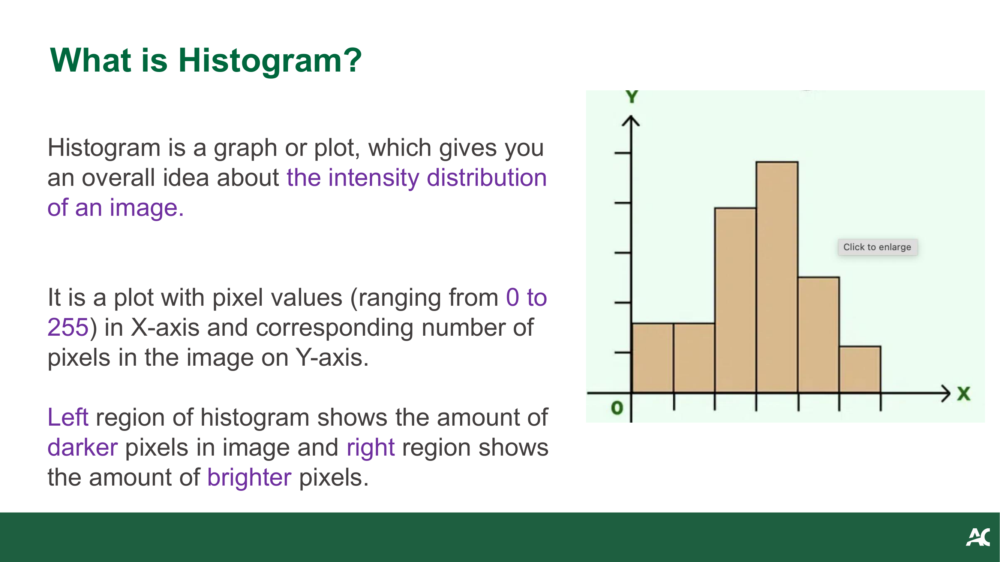

**What is Histogram? slide:** Title "What is Histogram?" in green. Left side: three text blocks — (1) "Histogram is a graph or plot, which gives you an overall idea about **the intensity distribution of an image**." (purple highlighted); (2) "It is a plot with pixel values (ranging from **0 to 255**) in X-axis and corresponding number of pixels in the image on Y-axis." (purple "0 to 255"); (3) "**Left** region of histogram shows the amount of **darker** pixels in image and **right** region shows the amount of **brighter** pixels." (purple "Left", "darker", "right", "brighter"). Right side: a simplified bar chart on light green background — Y-axis labeled "Y", X-axis labeled "X" with "0" in green at origin. Shows ~8 bars of varying heights forming a rough bell shape, illustrating a typical histogram distribution.

**什么是直方图？页：** 标题"What is Histogram?"（绿色）。左侧：三段文字 — (1) "直方图是一种图形或图表，给你关于**图像强度分布**的整体概念。"（紫色高亮）；(2) "它是一个X轴为像素值（范围从**0到255**），Y轴为图像中对应像素数量的图表。"（紫色"0 to 255"）；(3) "直方图的**左侧**区域显示图像中**较暗**像素的数量，**右侧**区域显示**较亮**像素的数量。"（紫色高亮关键词）。右侧：浅绿色背景上的简化柱状图 — Y轴标"Y"，X轴标"X"，原点绿色"0"。约8根高矮不一的柱子形成粗略钟形，展示典型直方图分布。

- Histogram is a graph or plot, which gives you an overall idea about **the intensity distribution of an image**. — 直方图是一种图形或图表，给你关于**图像强度分布**的整体概念。
- It is a plot with pixel values (ranging from **0 to 255**) in X-axis and corresponding number of pixels in the image on Y-axis. — 它是一个X轴为像素值（范围从**0到255**），Y轴为图像中对应像素数量的图表。
- **Left** region of histogram shows the amount of **darker** pixels in image and **right** region shows the amount of **brighter** pixels. — 直方图的**左侧**区域显示图像中**较暗**像素的数量，**右侧**区域显示**较亮**像素的数量。

### 9.3 直方图与分箱 (Histogram and Bins)

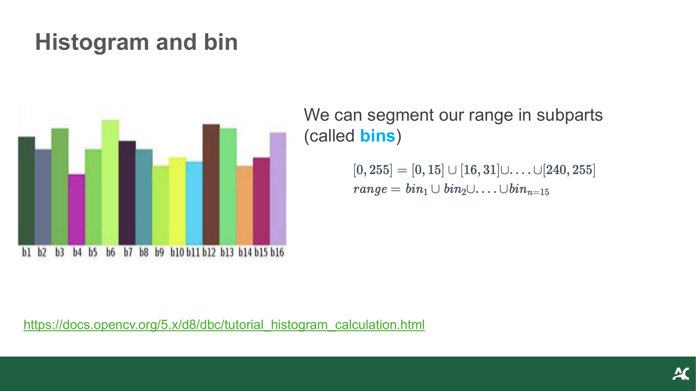

**Histogram and bin slide:** Title "Histogram and bin" in dark green. Left: a colorful bar chart with 16 bins (labeled b1–b16 on X-axis), each bar a different color (pink, green, brown, teal, olive, etc.), heights varying — this shows a histogram with 16 bins instead of 256. Right: text "We can segment our range in subparts (called **bins**)" with "bins" in cyan/blue. Below: the mathematical notation `[0, 255] = [0, 15] ∪ [16, 31] ∪ ... ∪ [240, 255]` and `range = bin₁ ∪ bin₂ ∪ ... ∪ binₙ₌₁₅`. Bottom: reference link to https://docs.opencv.org/5.x/d8/dbc/tutorial_histogram_calculation.html.

**直方图和bin页：** 标题"Histogram and bin"（深绿色）。左侧：彩色柱状图，16个bin（X轴标b1–b16），每根柱颜色不同（粉、绿、棕、青、橄榄等），高度各异 — 展示16个bin的直方图。右侧：文字"We can segment our range in subparts (called **bins**)"（"bins"用青色/蓝色）。下方：数学表达式 `[0, 255] = [0, 15] ∪ [16, 31] ∪ ... ∪ [240, 255]` 和 `range = bin₁ ∪ bin₂ ∪ ... ∪ binₙ₌₁₅`。底部：参考链接。

- We can segment our range in subparts (called **bins**) — 我们可以将范围分成子部分（称为**bins**）
- [0, 255] = [0, 15] ∪ [16, 31] ∪ ... ∪ [240, 255] — 将0-255的完整范围拆分为16个等宽子区间
- range = bin₁ ∪ bin₂ ∪ ... ∪ bin_{n=15} — 范围 = 各bin的并集
- Ref: https://docs.opencv.org/5.x/d8/dbc/tutorial_histogram_calculation.html

> **📝 Notes:**
>
> **📌 What:**
> **(1) Image Histogram (图像直方图):**
>
> A bar chart that counts how many pixels have each intensity value (0–255). X-axis = brightness level, Y-axis = pixel count. It summarizes the tonal distribution of an entire image into one chart — essentially a "fingerprint" of the image's brightness composition.
>
>> 一个柱状图，统计每个强度值（0–255）有多少个像素。X轴 = 亮度级别，Y轴 = 像素数量。它将整张图像的色调分布汇总到一张图表中 — 本质上是图像亮度组成的"指纹"。
>>
>
> **(2) Bins (分箱):**
>
> Instead of counting every single intensity (256 values), you can group intensities into sub-ranges called bins. 16 bins means each bin covers 16 intensity values ([0,15], [16,31], ..., [240,255]). Fewer bins = coarser but more compact representation.
>
>> 不用逐个统计256个强度值，可以将强度分组到称为bin的子范围。16个bin意味着每个bin覆盖16个强度值。更少的bin = 更粗糙但更紧凑的表示。
>>
>
> **(3) Multi-channel histogram (多通道直方图):**
>
> Color images have separate histograms for each channel (Red, Green, Blue). The "Total" histogram sums across channels. Page 14 shows this — each channel's distribution is overlaid in different colors, letting you see which channel dominates at each intensity.
>
>> 彩色图像每个通道（红、绿、蓝）有独立的直方图。"Total"直方图是各通道的总和。第14页展示了这一点 — 每个通道的分布用不同颜色叠加显示，让你看到每个强度值处哪个通道占主导。
>>
>
> **🎯 Why:**
> Histograms are the **diagnostic tool** of image processing. Before applying any filter or transformation, look at the histogram to understand the image's tonal distribution. Is it underexposed (histogram bunched left)? Overexposed (bunched right)? Low contrast (narrow histogram)? The histogram tells you WHAT to fix before you fix it.
>
>> 直方图是图像处理的**诊断工具**。在应用任何滤波器或变换之前，查看直方图以了解图像的色调分布。是否曝光不足（直方图集中在左侧）？过度曝光（集中在右侧）？低对比度（直方图窄）？直方图在你修复之前告诉你需要修复什么。
>>
>
> **💡 Intuition:**
> A histogram is like a **population census by age**. Instead of asking "how many people of each age live here?", you're asking "how many pixels of each brightness live here?" A well-exposed photo has a **spread-out** histogram (all ages represented); an underexposed photo bunches up at the left (mostly dark). A histogram with all bars crammed into a narrow band = low contrast = everyone is the same age = boring city.
>
>> 直方图就像按年龄进行的**人口普查**。不是问"这里每个年龄有多少人？"，而是问"这里每个亮度有多少像素？"曝光良好的照片有**分散的**直方图（所有年龄都有代表）；曝光不足的照片集中在左边（大多数是暗像素）。所有柱子挤在窄带内的直方图 = 低对比度 = 所有人年龄一样 = 无聊的城市。
>>
>
> **⚙️ How:**
> In OpenCV: `hist = cv2.calcHist([img], [0], None, [256], [0, 256])`. Parameters: `[0]` = first channel, `[256]` = 256 bins, `[0, 256]` = pixel value range. **Histogram equalization** (`cv2.equalizeHist()`) stretches the histogram to fill the full 0-255 range, improving contrast. For color images, convert to HSV/YCrCb first and equalize only the V/Y (brightness) channel — never equalize R,G,B channels separately (destroys color balance).
>
>> 在OpenCV中：`hist = cv2.calcHist([img], [0], None, [256], [0, 256])`。参数：`[0]` = 第一个通道，`[256]` = 256个bins，`[0, 256]` = 像素值范围。**直方图均衡化**（`cv2.equalizeHist()`）将直方图拉伸以填满0-255范围，改善对比度。对彩色图像，先转换到HSV/YCrCb空间，只均衡V/Y（亮度）通道 — 不要分别均衡R,G,B通道（会破坏色彩平衡）。
>>
>
> **📐 Formula:**
> **(1) Histogram equalization (直方图均衡化):**
>
> `new_value(v) = round( (CDF(v) - CDF_min) / (N - CDF_min) × (L-1) )`
>
> Reading piece by piece:
> - `CDF(v)`: cumulative count of all pixels with intensity ≤ v — "how many pixels are at or below brightness v"
> - `CDF_min`: the smallest non-zero CDF value — the first intensity that actually has pixels
> - `N`: total number of pixels in the image (width × height)
> - `L`: number of intensity levels (typically 256 for 8-bit images)
> - `(CDF(v) - CDF_min) / (N - CDF_min)`: normalizes the cumulative count to [0, 1] range
> - `× (L-1)`: scales to [0, 255] range
> - `round(...)`: ensures integer output (pixel values must be integers)
> - Overall: remaps each old intensity v to a new value so that the output histogram is approximately uniform
>
>> 逐段读：
>> - `CDF(v)`：强度 ≤ v 的所有像素累计数 — "有多少像素亮度在v或以下"
>> - `CDF_min`：最小的非零CDF值 — 第一个实际有像素的强度
>> - `N`：图像总像素数（宽 × 高）
>> - `L`：强度级别数（8位图像通常为256）
>> - `(CDF(v) - CDF_min) / (N - CDF_min)`：将累计数归一化到[0, 1]范围
>> - `× (L-1)`：缩放到[0, 255]范围
>> - `round(...)`：确保整数输出（像素值必须是整数）
>> - 整体：将每个旧强度v映射到新值，使输出直方图近似均匀
>>
>
> **(2) Bin width calculation (bin宽度计算):**
>
> `bin_width = (max_value - min_value) / num_bins`
> With 16 bins over [0, 255]: bin_width = 256/16 = 16 → each bin covers 16 intensity values.
>
>> 16个bin覆盖[0, 255]：bin_width = 256/16 = 16 → 每个bin覆盖16个强度值。
>>
>
> **🔢 Example:**
> **Problem:** A tiny 2×2 grayscale image has pixels: [50, 50, 100, 150]. Apply histogram equalization (L=256).
> **Solution:**
>
> - Histogram: h(50)=2, h(100)=1, h(150)=1
> - CDF: CDF(50)=2, CDF(100)=3, CDF(150)=4
> - CDF_min=2, N=4, L=256
> - new(50) = round((2-2)/(4-2) × 255) = round(0) = **0**
> - new(100) = round((3-2)/(4-2) × 255) = round(127.5) = **128**
> - new(150) = round((4-2)/(4-2) × 255) = round(255) = **255**
> - Result: [0, 0, 128, 255] — full range utilized! ✓
>
>> **题目：** 一个2×2灰度图像像素为：[50, 50, 100, 150]。进行直方图均衡化（L=256）。
>> **解：**
>>
>> - 直方图：h(50)=2, h(100)=1, h(150)=1
>> - CDF：CDF(50)=2, CDF(100)=3, CDF(150)=4
>> - CDF_min=2, N=4, L=256
>> - new(50) = round((2-2)/(4-2) × 255) = round(0) = **0**
>> - new(100) = round((3-2)/(4-2) × 255) = round(127.5) = **128**
>> - new(150) = round((4-2)/(4-2) × 255) = round(255) = **255**
>> - 结果：[0, 0, 128, 255] — 完整范围利用！✓
>>
>
> **⚖️ Compare:**
>
> | Feature | Raw Histogram | After Equalization |
> |---|---|---|
> | Intensity spread | May be narrow (e.g., 80–150) | Full range (0–255) |
> | Contrast | Low if bunched | Maximized |
> | Use case | Diagnosis — "what does this image look like?" | Enhancement — "make it look better" |
> | Reversible? | N/A | No — information is lost in the mapping |
>
>> | 特性 | 原始直方图 | 均衡化后 |
>> |---|---|---|
>> | 强度分布 | 可能很窄（如80–150） | 全范围（0–255） |
>> | 对比度 | 如果集中则低 | 最大化 |
>> | 用途 | 诊断 — "这个图像什么样？" | 增强 — "让它看起来更好" |
>> | 可逆？ | 不适用 | 不可逆 — 映射中丢失信息 |
>>
>
> **⚠️ Pitfall:**
> (1) The histogram only shows **intensity distribution**, not spatial information. Two completely different images can have identical histograms — a checkerboard and a half-black-half-white image with the same pixel counts produce the same histogram.
> (2) **Bins ≠ intensities**. If you use 16 bins instead of 256, each bin groups 16 intensity values together — useful for compact representation but loses detail. The slide (page 16) shows 16 bins with `[0,15] ∪ [16,31] ∪ ... ∪ [240,255]`.
> (3) **Don't equalize color channels separately.** Applying `equalizeHist()` to R, G, B independently shifts each channel differently, destroying color relationships. Convert to HSV or YCrCb and equalize only the brightness channel.
>
>> (1) 直方图只显示**强度分布**，不包含空间信息。两张完全不同的图像可以有相同的直方图 — 棋盘格和半黑半白图像如果像素数量相同就会产生相同直方图。
>> (2) **Bins ≠ 强度值**。如果用16个bins而不是256个，每个bin将16个强度值合并 — 对紧凑表示有用但丢失细节。幻灯片（第16页）展示了16个bin：`[0,15] ∪ [16,31] ∪ ... ∪ [240,255]`。
>> (3) **不要分别均衡彩色通道。** 对R、G、B独立应用`equalizeHist()`会让每个通道移动不同距离，破坏色彩关系。应转换到HSV或YCrCb空间，只均衡亮度通道。
>>
>
> **📝 Exam:**
> (1) **填空题 (Fill-in-the-blank):**
> "The horizontal axis of an image histogram shows ____?" → Different brightness levels (from 0=dark to 255=light).
>
>> "图像直方图的水平轴显示____？" → 不同的亮度级别（从0=暗到255=亮）。
>>
>
> (2) **概念题 (Conceptual):**
> "Which chart shows how many pixels have a particular brightness level?" → Image Histogram.
> "What is a bin in the context of histograms?" → A sub-range of the intensity range used to group multiple intensity values into one count.
>
>> "哪个图表显示有多少像素具有特定亮度级别？" → 图像直方图。
>> "直方图中的bin是什么？" → 用于将多个强度值分组为一个计数的强度范围子区间。
>>
>
> (3) **公式计算题 (Formula calculation):**
> "Given pixel values [30, 30, 60, 90], apply histogram equalization." → Must compute histogram, CDF, CDF_min, then apply the formula to each unique intensity.
>
>> "给定像素值[30, 30, 60, 90]，进行直方图均衡化。" → 必须计算直方图、CDF、CDF_min，然后对每个唯一强度应用公式。
>>

---

## 10. 图像阈值化 (Image Thresholding)

### 10.1 阈值化简介 (Thresholding Introduction)

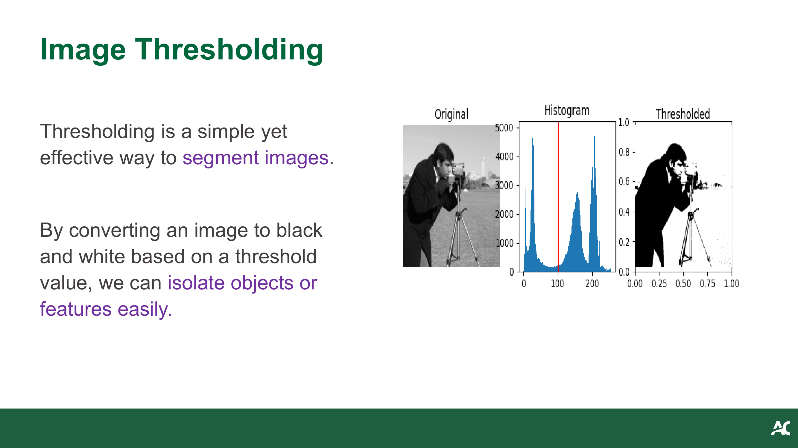

**Image Thresholding intro slide:** Title "Image Thresholding" in green. Left side: two text paragraphs — (1) "Thresholding is a simple yet effective way to **segment images**." ("segment images" in purple); (2) "By converting an image to black and white based on a threshold value, we can **isolate objects or features easily**." ("isolate objects or features easily" in purple). Right side: three images in a row — "Original" (grayscale cameraman photo), "Histogram" (blue bar chart with Y-axis 0–5000, X-axis 0–200+, showing bimodal distribution with a red vertical threshold line around intensity 100), "Thresholded" (binary black-and-white version of the cameraman image, Y-axis 0.0–1.0).

**图像阈值化介绍页：** 标题"Image Thresholding"（绿色）。左侧：两段文字 — (1) "Thresholding is a simple yet effective way to **segment images**."（"segment images"紫色）；(2) "By converting an image to black and white based on a threshold value, we can **isolate objects or features easily**."（"isolate objects or features easily"紫色）。右侧：三张图并排 — "Original"（灰度摄影师照片），"Histogram"（蓝色柱状图，Y轴0–5000，X轴0–200+，双峰分布，红色竖直阈值线约在强度100处），"Thresholded"（摄影师的二值黑白版，Y轴0.0–1.0）。

- Thresholding is a simple yet effective way to **segment images**. — 阈值化是一种简单而有效的**图像分割**方法。
- By converting an image to black and white based on a threshold value, we can **isolate objects or features easily**. — 通过基于阈值将图像转换为黑白，我们可以轻松地**隔离对象或特征**。

### 10.2 简单阈值与自适应阈值 (Simple vs Adaptive Thresholding)

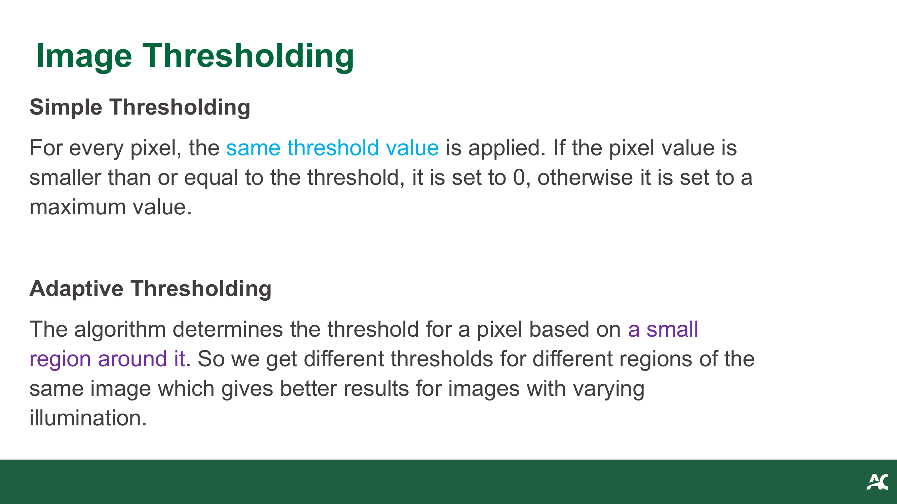

**Image Thresholding detail slide:** Title "Image Thresholding" in green. Two subsections: (1) "**Simple Thresholding**" (bold black heading) — paragraph explaining that for every pixel, the **same threshold value** ("same threshold value" in purple) is applied; if the pixel value is smaller than or equal to the threshold, it is set to 0, otherwise it is set to a maximum value. (2) "**Adaptive Thresholding**" (bold black heading) — paragraph explaining that the algorithm determines the threshold for a pixel based on **a small region around it** ("a small region around it" in purple), giving different thresholds for different regions of the same image, which gives better results for images with varying illumination.

**图像阈值化详情页：** 标题"Image Thresholding"（绿色）。两个子部分：(1) "**Simple Thresholding**"（粗体黑色标题）— 段落解释对每个像素应用**相同的阈值**（"same threshold value"紫色）；如果像素值小于或等于阈值，设为0，否则设为最大值。(2) "**Adaptive Thresholding**"（粗体黑色标题）— 段落解释算法基于像素周围的**一个小区域**（"a small region around it"紫色）确定阈值，对同一图像的不同区域得到不同阈值，对光照变化的图像效果更好。

- **Simple Thresholding**: For every pixel, the **same threshold value** is applied. If the pixel value is smaller than or equal to the threshold, it is set to 0, otherwise it is set to a maximum value. — **简单阈值**：对每个像素应用**相同的阈值**。如果像素值小于或等于阈值，设为0，否则设为最大值。
- **Adaptive Thresholding**: The algorithm determines the threshold for a pixel based on **a small region around it**. So we get different thresholds for different regions of the same image which gives better results for images with varying illumination. — **自适应阈值**：算法基于像素周围的**一个小区域**确定阈值。因此对同一图像的不同区域得到不同的阈值，对光照变化的图像效果更好。

> **📝 Notes:**
>
> **🎯 Why:**
> Thresholding is the simplest form of **segmentation** — separating foreground from background. It's fast, easy to understand, and works well when there's good contrast between object and background. It's the first step in many industrial inspection pipelines.
>
>> 阈值化是**分割**的最简单形式 — 将前景与背景分离。它快速、易于理解，在对象和背景之间对比度良好时效果很好。它是许多工业检测流水线的第一步。
>>
>
> **💡 Intuition:**
> Simple thresholding is like a **flat speed limit** (60 km/h everywhere). Adaptive thresholding is like **variable speed limits** that change based on road conditions. On a well-lit highway, a flat limit works; on a winding mountain road with varying visibility, you need adaptive limits.
>
>> 简单阈值像**统一限速**（到处都是60km/h）。自适应阈值像**可变限速**，根据道路条件变化。在光照良好的高速路上，统一限速可行；在能见度变化的山路上，你需要自适应限速。
>>
>
> **⚖️ Compare:**
>
> | Type               | Threshold                   | Best for                 |
> | ------------------ | --------------------------- | ------------------------ |
> | **Simple**   | Global (single value)       | Uniform lighting         |
> | **Adaptive** | Local (varies per region)   | Uneven lighting, shadows |
> | **Otsu's**   | Automatic (histogram-based) | Bimodal histogram images |
>
>> | 类型             | 阈值                 | 最适合           |
>> | ---------------- | -------------------- | ---------------- |
>> | **简单**   | 全局（单一值）       | 均匀光照         |
>> | **自适应** | 局部（每个区域不同） | 不均匀光照、阴影 |
>> | **Otsu**   | 自动（基于直方图）   | 双峰直方图图像   |
>>
>
> **⚠️ Pitfall:**
> Don't use simple thresholding on images with **uneven lighting** — one side bright, other side dark. The global threshold will correctly segment one side but fail on the other. Always check illumination uniformity first.
>
>> 不要在**光照不均匀**的图像上使用简单阈值 — 一侧亮，另一侧暗。全局阈值会正确分割一侧但在另一侧失败。始终先检查光照均匀性。
>>
>
> **📝 Exam:**
> "Output of segmentation is typically a _____ image." → Binary image.
> "Which thresholding technique is used for uneven lighting?" → Adaptive Thresholding.
>
>> "分割的输出通常是_____图像。" → 二值图像。
>> "哪种阈值技术用于不均匀光照？" → 自适应阈值。
>>

---

## 11. 形态学操作 (Morphological Operations)

### 11.1 腐蚀 (Erosion)

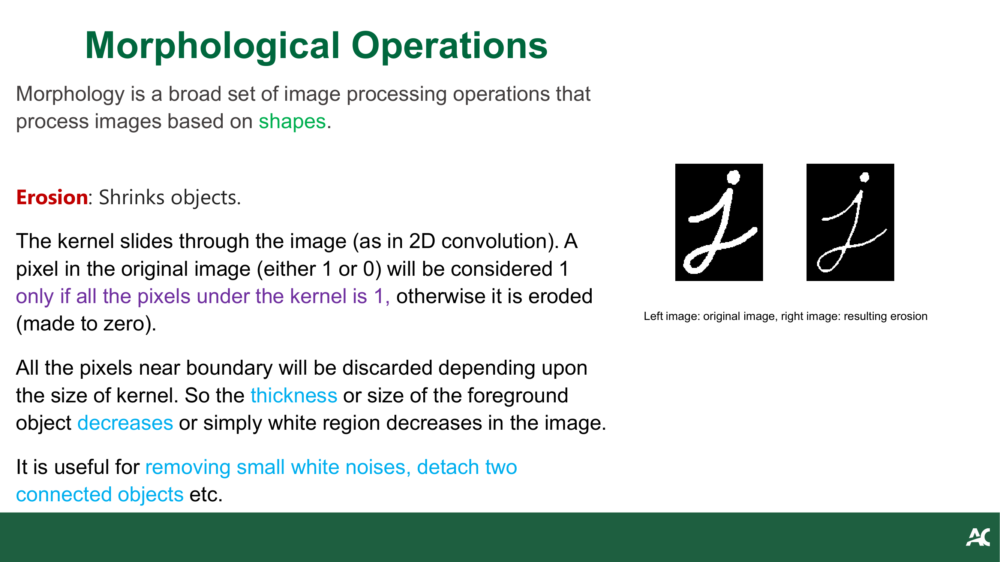

**Morphological Operations — Erosion slide:** Title "Morphological Operations" in dark green (large, centered). Introductory text: "Morphology is a broad set of image processing operations that process images based on **shapes**." ("shapes" in purple). Then "**Erosion**: Shrinks objects." ("Erosion" in red bold). Two paragraphs: (1) "The kernel slides through the image (as in 2D convolution). A pixel in the original image (either 1 or 0) will be considered 1 **only if all the pixels under the kernel is 1,** otherwise it is eroded (made to zero)." ("only if all the pixels under the kernel is 1," in purple). (2) "All the pixels near boundary will be discarded depending upon the size of kernel. So the **thickness** or size of the foreground object **decreases** or simply white region decreases in the image." ("thickness" in purple, "decreases" in purple). (3) "It is useful for **removing small white noises, detach two connected objects** etc." (highlighted in purple). Right side: two black-and-white images of a handwritten "j" — left is original, right is eroded (thinner strokes), captioned "Left image: original image, right image: resulting erosion".

**形态学操作 — 腐蚀页：** 标题"Morphological Operations"（深绿色，大号居中）。引言："Morphology is a broad set of image processing operations that process images based on **shapes**."（"shapes"紫色）。然后"**Erosion**: Shrinks objects."（"Erosion"红色粗体）。两段文字：(1) "核在图像上滑动（如2D卷积）。原始图像中的像素只有在**核下所有像素都为1**时才被认为是1，否则被腐蚀（变为零）。"（"only if all the pixels under the kernel is 1,"紫色）。(2) "所有靠近边界的像素将根据核的大小被丢弃。因此前景对象的**粗细**或大小**减小**。"（"thickness"紫色，"decreases"紫色）。(3) "对**去除小白噪声、分离连通对象**等有用。"（紫色高亮）。右侧：两张手写"j"的黑白图像 — 左为原图，右为腐蚀后（笔画变细），标注"Left image: original image, right image: resulting erosion"。

- Morphology is a broad set of image processing operations that process images based on **shapes**. — 形态学是一组广泛的图像处理操作，基于**形状**处理图像。
- **Erosion**: Shrinks objects. — **腐蚀**：缩小对象。
- The kernel slides through the image (as in 2D convolution). A pixel in the original image (either 1 or 0) will be considered 1 **only if all the pixels under the kernel is 1,** otherwise it is eroded (made to zero). — 核在图像上滑动（如2D卷积）。原始图像中的像素（1或0）只有在**核下所有像素都为1**时才被认为是1，否则被腐蚀（变为零）。
- All the pixels near boundary will be discarded depending upon the size of kernel. So the **thickness** or size of the foreground object **decreases** or simply white region decreases in the image. — 所有靠近边界的像素将根据核的大小被丢弃。因此前景对象的**粗细**或大小**减小**，或者简单说图像中的白色区域减小。
- It is useful for **removing small white noises, detach two connected objects** etc. — 对**去除小白噪声、分离两个连通对象**等有用。

### 11.2 膨胀 (Dilation)

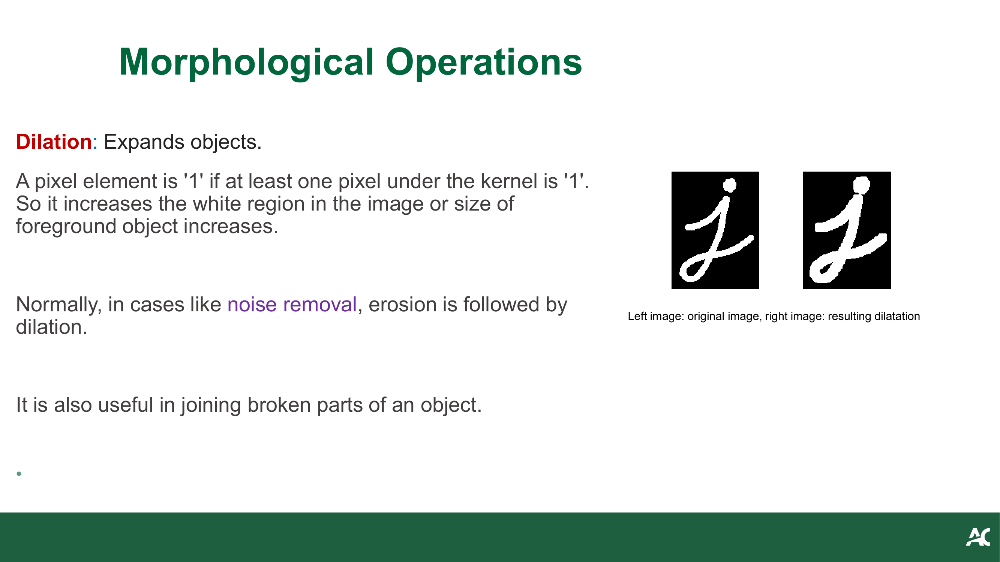

**Morphological Operations — Dilation slide:** Title "Morphological Operations" in dark green (large, centered). "**Dilation**: Expands objects." ("Dilation" in red bold). Two paragraphs: (1) "A pixel element is '1' if at least one pixel under the kernel is '1'. So it increases the white region in the image or size of foreground object increases." (2) "Normally, in cases like **noise removal**, erosion is followed by dilation." ("noise removal" in purple). (3) "It is also useful in joining broken parts of an object." A bullet point marker visible at bottom. Right side: two black-and-white images of a handwritten "j" — left is original, right is dilated (thicker strokes), captioned "Left image: original image, right image: resulting dilatation".

**形态学操作 — 膨胀页：** 标题"Morphological Operations"（深绿色，大号居中）。"**Dilation**: Expands objects."（"Dilation"红色粗体）。两段文字：(1) "如果核下至少有一个像素为'1'，则像素元素为'1'。因此它增加图像中的白色区域或前景对象的大小增加。"(2) "通常，在**噪声去除**等情况下，腐蚀后跟着膨胀。"（"noise removal"紫色）。(3) "它在连接对象的断裂部分也很有用。"底部有一个项目符号。右侧：两张手写"j"的黑白图像 — 左为原图，右为膨胀后（笔画变粗），标注"Left image: original image, right image: resulting dilatation"。

- **Dilation**: Expands objects. — **膨胀**：扩展对象。
- A pixel element is '1' if at least one pixel under the kernel is '1'. So it increases the white region in the image or size of foreground object increases. — 如果核下至少有一个像素为'1'，则像素元素为'1'。因此它增加图像中的白色区域或前景对象的大小增加。
- Normally, in cases like **noise removal**, erosion is followed by dilation. — 通常，在**噪声去除**等情况下，腐蚀后跟着膨胀。
- It is also useful in joining broken parts of an object. — 它在连接对象的断裂部分也很有用。

### 11.3 开运算与闭运算 (Opening and Closing)

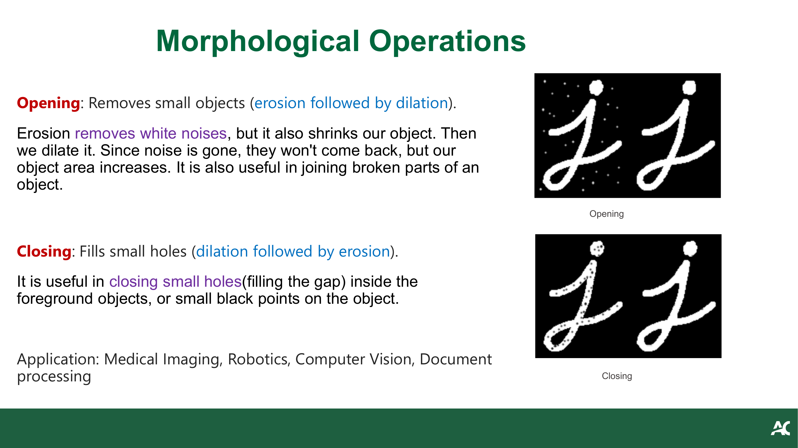

**Morphological Operations — Opening & Closing slide:** Title "Morphological Operations" in dark green (large, centered). Two subsections: (1) "**Opening**: Removes small objects (**erosion followed by dilation**)." ("Opening" in red bold, "erosion followed by dilation" in purple). Paragraph: "Erosion **removes white noises**, but it also shrinks our object. Then we dilate it. Since noise is gone, they won't come back, but our object area increases. It is also useful in joining broken parts of an object." ("removes white noises" in purple). Right top: two side-by-side images showing opening result on handwritten "j", captioned "Opening". (2) "**Closing**: Fills small holes (**dilation followed by erosion**)." ("Closing" in red bold, "dilation followed by erosion" in purple). Paragraph: "It is useful in **closing small holes** (filling the gap) inside the foreground objects, or small black points on the object." ("closing small holes" in purple). Right bottom: two side-by-side images showing closing result on handwritten "j" with noise dots, captioned "Closing". Bottom: "Application: Medical Imaging, Robotics, Computer Vision, Document processing".

**形态学操作 — 开运算和闭运算页：** 标题"Morphological Operations"（深绿色，大号居中）。两个子部分：(1) "**Opening**: Removes small objects (**erosion followed by dilation**)."（"Opening"红色粗体，"erosion followed by dilation"紫色）。段落解释腐蚀**去除白噪声**但也缩小对象，然后膨胀恢复。右上：两张并排图展示开运算结果，标注"Opening"。(2) "**Closing**: Fills small holes (**dilation followed by erosion**)."（"Closing"红色粗体，"dilation followed by erosion"紫色）。段落解释可以**填充前景内的小孔**。右下：两张并排图展示闭运算结果，标注"Closing"。底部："Application: Medical Imaging, Robotics, Computer Vision, Document processing"。

- **Opening**: Removes small objects (**erosion followed by dilation**). — **开运算**：去除小对象（**腐蚀后膨胀**）。
- Erosion **removes white noises**, but it also shrinks our object. Then we dilate it. Since noise is gone, they won't come back, but our object area increases. It is also useful in joining broken parts of an object. — 腐蚀**去除白噪声**，但也会缩小对象。然后我们膨胀它。由于噪声已消失，它们不会回来，但对象面积增大。它在连接对象断裂部分也有用。
- **Closing**: Fills small holes (**dilation followed by erosion**). — **闭运算**：填充小孔（**膨胀后腐蚀**）。
- It is useful in **closing small holes** (filling the gap) inside the foreground objects, or small black points on the object. — 对前景对象内的**填充小孔**（填补间隙）或对象上的小黑点有用。
- Application: Medical Imaging, Robotics, Computer Vision, Document processing — 应用：医学影像、机器人、计算机视觉、文档处理

> **📝 Notes:**
>
> **🎯 Why:**
> After thresholding, the binary image often has imperfections: small noise dots (white specks in background), small holes (black specks in objects), or objects touching that should be separate. Morphological operations **clean up** these binary images using shape-based rules.
>
>> 阈值化后，二值图像通常有缺陷：小噪声点（背景中的白斑）、小孔（对象中的黑斑）或应该分开的对象接触在一起。形态学操作使用基于形状的规则**清理**这些二值图像。
>>
>
> **💡 Intuition:**
>
> - **Erosion** = "sanding down" an object — the boundary retreats inward. Small objects disappear entirely.
> - **Dilation** = "inflating" an object — the boundary expands outward. Small gaps get filled.
> - **Opening** = sand down first (removes noise), then inflate back (restores size). Like cleaning a dirty whiteboard — erase the smudges, then redraw the intended lines.
> - **Closing** = inflate first (fills holes), then sand down (restores size). Like spackling a wall — fill the holes, then sand smooth.
>
>> - **腐蚀** = "打磨"对象 — 边界向内退缩。小对象完全消失。
>> - **膨胀** = "膨胀"对象 — 边界向外扩展。小间隙被填充。
>> - **开运算** = 先打磨（去噪），再膨胀回来（恢复大小）。就像擦干净脏白板 — 擦除污迹，然后重画预期的线条。
>> - **闭运算** = 先膨胀（填孔），再打磨（恢复大小）。就像给墙壁做泥子 — 填孔，然后打磨光滑。
>>
>
> **⚖️ Compare:**
>
> | Operation         | Order           | Removes            | Preserves     |
> | ----------------- | --------------- | ------------------ | ------------- |
> | **Opening** | Erode → Dilate | Small bright noise | Overall shape |
> | **Closing** | Dilate → Erode | Small dark holes   | Overall shape |
>
>> | 操作             | 顺序         | 去除       | 保留     |
>> | ---------------- | ------------ | ---------- | -------- |
>> | **开运算** | 腐蚀 → 膨胀 | 小的亮噪声 | 整体形状 |
>> | **闭运算** | 膨胀 → 腐蚀 | 小的暗孔洞 | 整体形状 |
>>
>
> **⚠️ Pitfall:**
> (1) **Order matters!** Opening ≠ Closing. Erosion→Dilation removes noise; Dilation→Erosion fills holes. Swapping the order changes the result completely.
> (2) **Kernel size matters** — a 3×3 kernel removes only tiny noise; 5×5 or 7×7 can remove larger imperfections but may distort object shapes.
>
>> (1) **顺序很重要！** 开运算 ≠ 闭运算。腐蚀→膨胀去噪；膨胀→腐蚀填孔。交换顺序会完全改变结果。
>> (2) **核大小很重要** — 3×3的核只能去除微小噪声；5×5或7×7可以去除更大的缺陷但可能扭曲对象形状。
>>
>
> **📝 Exam:**
> "What are morphological operations used for?" → Processing images based on shapes.
> "What is Opening?" → Erosion followed by Dilation — removes small noise.
> "What is Closing?" → Dilation followed by Erosion — fills small holes.
>
>> "形态学操作用于什么？" → 基于形状处理图像。
>> "什么是开运算？" → 腐蚀后膨胀 — 去除小噪声。
>> "什么是闭运算？" → 膨胀后腐蚀 — 填充小孔。
>>

---

## 12. 图像变换技术 (Image Transformation Techniques)

### 12.1 仿射变换公式 (Affine Transformation Formula)

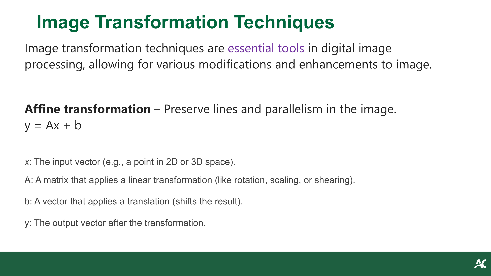

**Image Transformation Techniques — Affine slide:** Title "Image Transformation Techniques" in green (large). Opening sentence: "Image transformation techniques are **essential tools** in digital image processing, allowing for various modifications and enhancements to image." ("essential tools" in purple). Then bold heading "**Affine transformation** – Preserve lines and parallelism in the image." followed by the formula "y = Ax + b" in large serif font. Below the formula, four parameter definitions: "*x*: The input vector (e.g., a point in 2D or 3D space).", "A: A matrix that applies a linear transformation (like rotation, scaling, or shearing).", "b: A vector that applies a translation (shifts the result).", "y: The output vector after the transformation."

**图像变换技术 — 仿射变换页：** 标题"Image Transformation Techniques"（绿色大号）。开头句："Image transformation techniques are **essential tools** in digital image processing, allowing for various modifications and enhancements to image."（"essential tools"紫色）。然后粗体标题"**Affine transformation** – Preserve lines and parallelism in the image." 后跟大号衬线字体公式"y = Ax + b"。公式下方四个参数定义："*x*: 输入向量"，"A: 应用线性变换的矩阵"，"b: 应用平移的向量"，"y: 变换后的输出向量"。

- Image transformation techniques are **essential tools** in digital image processing, allowing for various modifications and enhancements to image. — 图像变换技术是数字图像处理中的**基本工具**，允许对图像进行各种修改和增强。
- **Affine transformation** – Preserve lines and parallelism in the image. — **仿射变换** – 保持图像中的直线和平行性。
- y = Ax + b
  - *x*: The input vector (e.g., a point in 2D or 3D space). — *x*：输入向量（如2D或3D空间中的点）。
  - A: A matrix that applies a linear transformation (like rotation, scaling, or shearing). — A：应用线性变换的矩阵（如旋转、缩放或剪切）。
  - b: A vector that applies a translation (shifts the result). — b：应用平移的向量（移动结果）。
  - y: The output vector after the transformation. — y：变换后的输出向量。

### 12.2 变换类型 (Transformation Types)

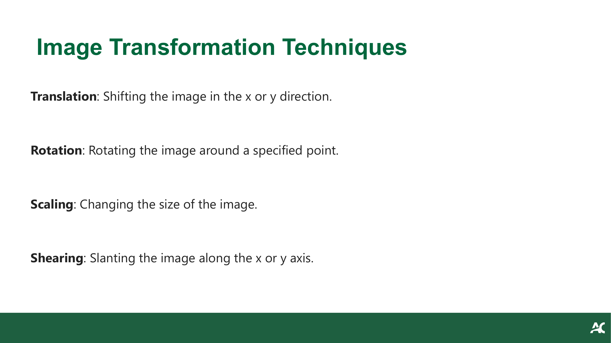

**Image Transformation Techniques — Types slide:** Title "Image Transformation Techniques" in green (large). Four transformation types listed, each with bold heading in black: "**Translation**: Shifting the image in the x or y direction.", "**Rotation**: Rotating the image around a specified point.", "**Scaling**: Changing the size of the image.", "**Shearing**: Slanting the image along the x or y axis." Clean text-only layout with no diagrams on this slide.

**图像变换技术 — 类型页：** 标题"Image Transformation Techniques"（绿色大号）。列出四种变换类型，每种用黑色粗体标题："**Translation**: Shifting the image in the x or y direction."、"**Rotation**: Rotating the image around a specified point."、"**Scaling**: Changing the size of the image."、"**Shearing**: Slanting the image along the x or y axis." 简洁纯文字布局，此页无图表。

- **Translation**: Shifting the image in the x or y direction. — **平移**：在x或y方向上移动图像。
- **Rotation**: Rotating the image around a specified point. — **旋转**：围绕指定点旋转图像。
- **Scaling**: Changing the size of the image. — **缩放**：改变图像的大小。
- **Shearing**: Slanting the image along the x or y axis. — **剪切**：沿x或y轴倾斜图像。

> **📝 Notes:**
>
> **📌 What:**
> An **affine transformation** is any transformation that can be expressed as a matrix multiplication plus translation: y = Ax + b. It preserves parallel lines, ratios of distances along a line, and collinearity (points on a line remain on a line).
>
>> **仿射变换**是任何可以表示为矩阵乘法加平移的变换：y = Ax + b。它保持平行线、沿直线的距离比例和共线性（线上的点仍在线上）。
>>
>
> **💡 Intuition:**
> Think of a rubber sheet with a drawing on it. You can stretch it, rotate it, slide it, or slant it — but you can't tear it or fold it. Any transformation you can do with the rubber sheet (without tearing) is an affine transformation.
>
>> 想象一张画有图案的橡皮纸。你可以拉伸它、旋转它、滑动它或倾斜它 — 但不能撕裂或折叠它。任何你能对橡皮纸做的变换（不撕裂）都是仿射变换。
>>
>
> **⚙️ How:**
> All affine transforms in OpenCV use `cv2.warpAffine(img, M, (cols, rows))` where M is a 2×3 transformation matrix.
>
>> OpenCV中所有仿射变换使用 `cv2.warpAffine(img, M, (cols, rows))`，其中M是2×3变换矩阵。
>>
>
> **(1) Translation (平移):**
> M = `[[1,0,tx],[0,1,ty]]` — shifts the image by (tx, ty) pixels.
>
>> M = `[[1,0,tx],[0,1,ty]]` — 将图像平移(tx, ty)个像素。
>>
>
> **(2) Rotation (旋转):**
> Use `cv2.getRotationMatrix2D(center, angle, scale)` to build the rotation matrix M.
>
>> 用 `cv2.getRotationMatrix2D(center, angle, scale)` 构建旋转矩阵M。
>>
>
> **(3) Scaling (缩放):**
> `cv2.resize()` is simpler and more common than building a scaling matrix for `warpAffine`.
>
>> `cv2.resize()` 比为 `warpAffine` 构建缩放矩阵更简单、更常用。
>>
>
> **⚠️ Pitfall:**
> Affine transformation **does NOT** preserve angles (shearing changes angles) or distances (scaling changes distances). It only preserves **parallelism** and **collinearity**. A stronger constraint is a **rigid transformation** (only rotation + translation), which preserves distances.
>
>> 仿射变换**不**保持角度（剪切改变角度）或距离（缩放改变距离）。它只保持**平行性**和**共线性**。更强的约束是**刚性变换**（只有旋转 + 平移），它保持距离。
>>
>
> **📝 Exam:**
> "What does an affine transformation preserve?" → Lines and parallelism.
> "Write the affine transformation formula." → y = Ax + b.
> "Name four types of image transformations." → Translation, Rotation, Scaling, Shearing.
>
>> "仿射变换保持什么？" → 直线和平行性。
>> "写出仿射变换公式。" → y = Ax + b。
>> "列出四种图像变换类型。" → 平移、旋转、缩放、剪切。
>>

---

## 13. 下周预告 (Next Week Preview)

**Preview slide:** Brief preview of next week's topic.

**预告页：** 简要预告下周主题。

- Next week: **Feature Detection and Description** — 下周：**特征检测与描述**

---
