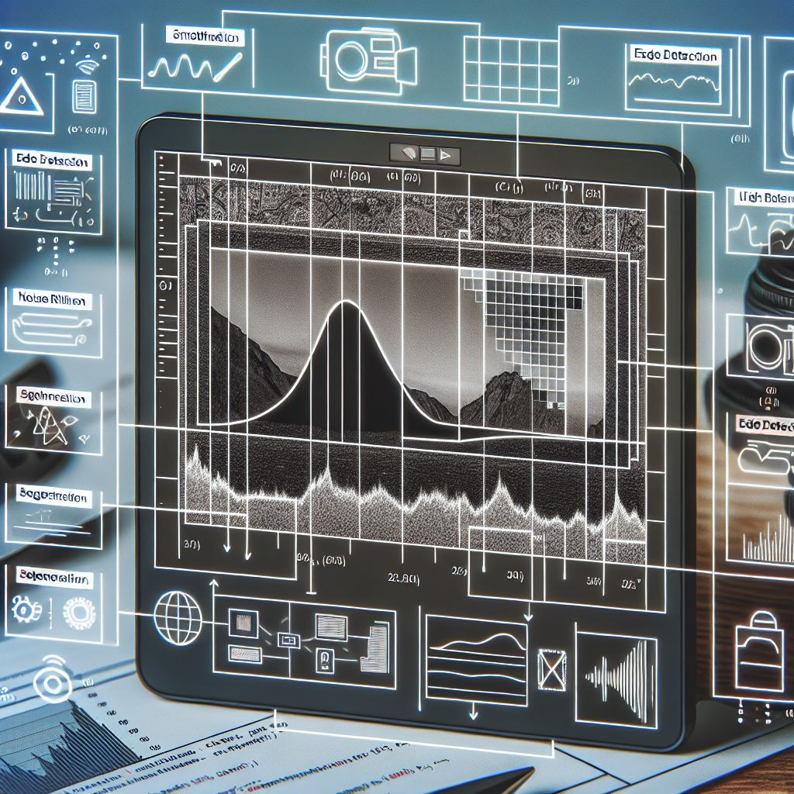
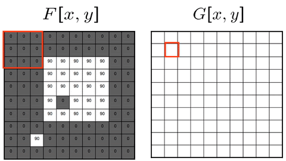
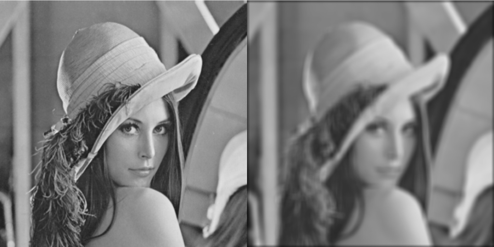
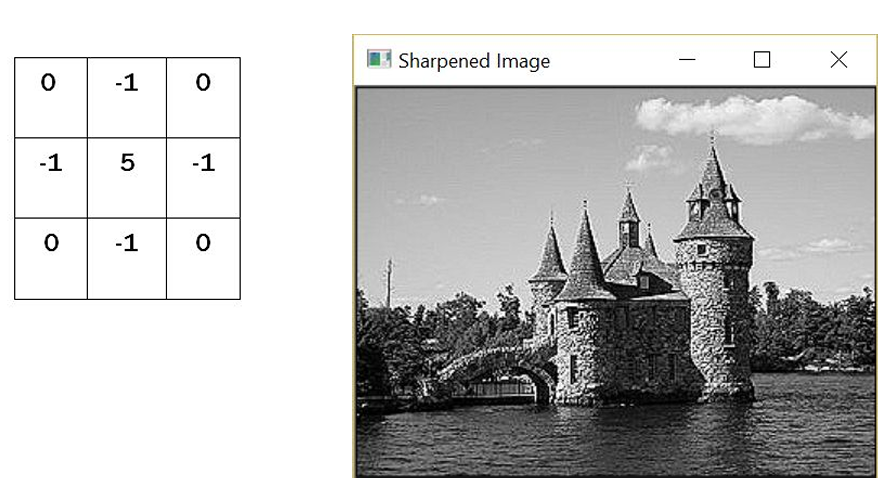
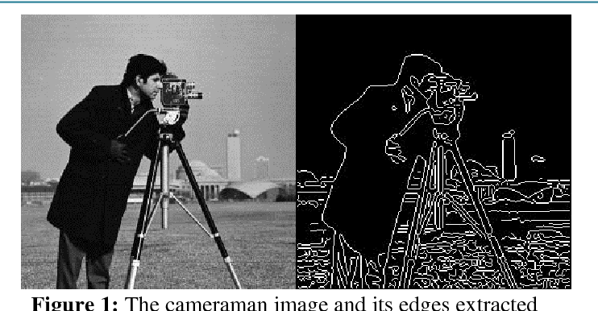
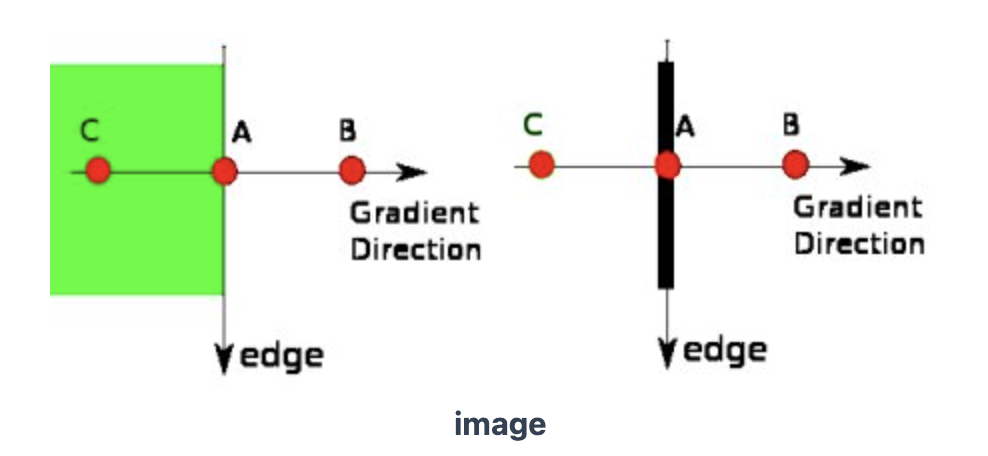
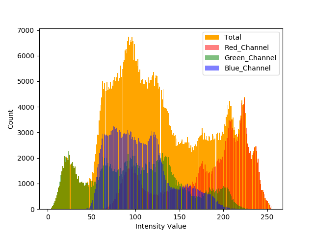
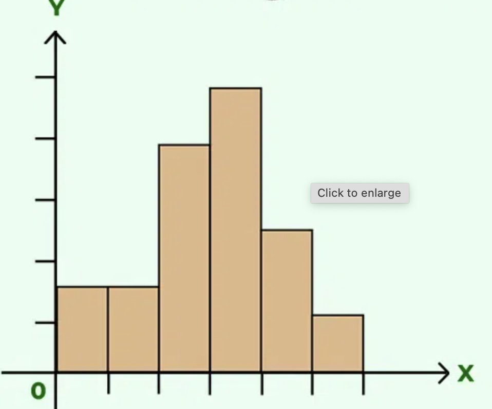
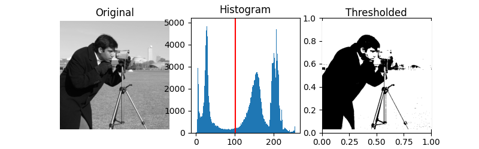

# Week 2: 图像处理基础 (Fundamentals of Image Processing)

> Source: `Week 2 - Fundamentals of Image Processing1.pptx`
> Total slides: 24
> Instructor: Stephin Rachel Thomas | 22-01-2026

---

## 1. 图像处理简介 (Introduction to Image Processing)

- Image Processing is the building block of Machine Vision
- Involves manipulation and analysis of images
- Enhances quality and extracts meaningful information

**Why Image Processing in Machine Vision:**

- **Enhancement:** Reduces noise, enhances contrast, sharpens details
- **Feature Extraction:** Identifies edges, corners, textures
- **Segmentation:** Divides image into meaningful regions
- **Object Recognition:** Identifies and classifies objects
- **Measurement:** Precise measurement of dimensions and distances

> **📝 Notes / 笔记:**
>
> **📌 What / 是什么:**
> Image processing = mathematically manipulating pixel values to enhance, extract, or transform image data. It is the "preprocessing" before any ML/DL model.
> 图像处理 = 对像素值进行数学操作以增强、提取或变换图像数据。它是任何 ML/DL 模型之前的"预处理"。
>
> **🎯 Why / 为什么:**
> Why can't we skip straight to CNN? Because raw images are noisy, poorly lit, and contain irrelevant information. Processing removes noise, highlights what matters, and standardizes input — making ML models faster and more accurate. A clean input can improve CNN accuracy by 10-20%.
> 为什么不能直接跳到 CNN？因为原始图像有噪声、光照不好、包含无关信息。处理去除噪声、突出重要内容、标准化输入 — 让 ML 模型更快更准确。干净的输入可以将 CNN 准确率提高 10-20%。
>
> **💡 Intuition / 直觉:**
> Like cooking: raw ingredients (raw image) need washing, cutting, seasoning (processing) before cooking (ML). You can't make a good dish from dirty ingredients.
> 像做饭：生食材（原始图像）需要清洗、切割、调味（处理）才能烹饪（ML）。用脏食材做不出好菜。
>
> **⚙️ How / 怎么算:** —
>
> **⚖️ Compare / 对比:**
> The 5 purposes form a progression:Enhancement → Feature Extraction → Segmentation → Recognition → Measurement.
> Each step builds on the previous. You enhance first, then extract features from the enhanced image, then segment, etc.
> 五个目的形成递进关系：增强→特征提取→分割→识别→测量。每步建立在前一步基础上。
>
> **⚠️ Pitfall / 易错点:**
> These 5 are not separate tasks — they're often combined. A real system might use enhancement + segmentation + recognition together.
> 这5个不是独立任务 — 通常组合使用。真实系统可能同时用增强+分割+识别。
>
> **📝 Exam / 考法:**
> "List and explain 5 reasons why image processing is used in machine vision." Know all 5 with one-sentence explanations.
> "列出并解释图像处理在机器视觉中的5个用途。" 需要掌握全部5个及其一句话解释。

---

## 2. 图像处理阶段 (Key Stages)

Nine stages (not all required for every task):

1. **Acquisition** — Camera/sensor capture
2. **Enhancement** — Improve quality, reveal hidden details
3. **Restoration** — Remove noise/degradation
4. **Morphological processing** — Shape-based extraction (e.g., fingerprints)
5. **Segmentation** — Partition image into parts/objects
6. **Object recognition** — Assign labels to objects
7. **Representation and description** — Transform to computer-processable form
8. **Image compression** — Reduce storage
9. **Colour Image Processing** — Use color for information extraction

> **📝 Notes / 笔记:**
>
> **📌 What / 是什么:**
> A complete pipeline from capture to understanding. Not all stages are needed — pick 2-3 based on your task.
> 从采集到理解的完整流水线。不需要所有阶段 — 根据任务选2-3个。
>
> **🎯 Why / 为什么:**
> Why so many stages? Because image understanding is hard. Each stage addresses a specific deficiency: noise (restoration), too much data (compression), lack of structure (segmentation). Real systems cherry-pick what they need.
> 为什么这么多阶段？因为图像理解很难。每个阶段解决一个具体不足：噪声（恢复）、数据太多（压缩）、缺乏结构（分割）。真实系统只选需要的。
>
> **💡 Intuition / 直觉:**
> Think of it like a hospital workflow: Admission (acquisition) → X-ray (enhancement) → Clean scan (restoration) → Identify organs (segmentation) → Diagnosis (recognition). Not every patient needs every test.
> 像医院流程：入院（获取）→ X光（增强）→ 清晰扫描（恢复）→ 识别器官（分割）→ 诊断（识别）。不是每个患者都需要所有检查。
>
> **⚙️ How / 怎么算:** —
>
> **⚖️ Compare / 对比:**
> Enhancement vs Restoration: Enhancement = make it look better for a specific purpose (subjective). Restoration = undo known degradation using mathematical models (objective). Enhancement adds info that wasn't there; restoration recovers info that was lost.
> 增强 vs 恢复：增强 = 让它看起来更适合特定用途（主观）。恢复 = 用数学模型撤销已知的退化（客观）。增强添加原本没有的信息；恢复找回丢失的信息。
>
> **⚠️ Pitfall / 易错点:**
> Segmentation is listed as "the most difficult task" — because it requires deciding what constitutes an "object," which depends on context. The same image might be segmented differently for different tasks.
> 分割被列为"最困难的任务" — 因为需要判断什么构成"对象"，而这取决于上下文。同一图像在不同任务中分割方式可能不同。
>
> **📝 Exam / 考法:**
> "List the key stages of image processing and explain any 3." Focus on Enhancement, Segmentation, and Object Recognition — the most tested ones.
> "列出图像处理的关键阶段并解释其中3个。" 重点是增强、分割和目标识别 — 最常考的。

---

## 3. 图像滤波 (Image Filtering)

Filtering manipulates images by altering pixels. Filters act like a sieve — highlight attributes, remove noise, or prepare for analysis.

### 3.1 模糊 (Image Blurring)

- Softens image, reduces detail and noise
- Works by averaging pixels around a target pixel
- Example filter: `[[1,1,1],[1,1,1],[1,1,1]]`

### 3.2 锐化 (Image Sharpening)

- Enhances edges and details, increases contrast between adjacent pixels
- Vital for medical imaging and precision manufacturing

> **📝 Notes / 笔记:**
>
> **📌 What / 是什么:**
> Filtering = sliding a small matrix (kernel) over the image, computing weighted sums at each position to produce a new pixel value.
> 滤波 = 将一个小矩阵（核）在图像上滑动，在每个位置计算加权和以生成新的像素值。
>
> **🎯 Why / 为什么:**
> Why do we need both blurring AND sharpening — they're opposites? Because they serve different goals. Blur removes noise BEFORE edge detection (prevents false edges). Sharpen enhances edges AFTER detection for clearer visualization. Often used in sequence, not separately.
> 为什么同时需要模糊和锐化 — 它们不是相反的吗？因为服务不同目标。模糊在边缘检测前去噪（防止假边缘）。锐化在检测后增强边缘让可视化更清晰。通常按顺序使用，不是单独使用。
>
> **💡 Intuition / 直觉:**
> The `[[1,1,1],[1,1,1],[1,1,1]]` blur kernel: each output pixel = average of itself and 8 neighbors. Like asking 9 people their salary and replacing yours with the group average — extreme values get smoothed out.
> `[[1,1,1],[1,1,1],[1,1,1]]` 模糊核：每个输出像素 = 自身和8个邻居的平均。像问9个人工资然后用平均值替代你的 — 极端值被平滑掉。
>
> **⚙️ How / 怎么算:**
> The 3×3 kernel slides across the image. At each position, multiply kernel values by overlapping pixel values, sum them up → that's the new center pixel. This is called **convolution** — the same operation CNNs use in Week 4.
> 3×3 核在图像上滑动。每个位置将核值与重叠的像素值相乘并求和 → 这就是新的中心像素。这叫**卷积** — 与第4周 CNN 使用的操作相同。
>
> **⚖️ Compare / 对比:**
> Blur vs Sharpen: Blur averages (smooths differences). Sharpen amplifies (exaggerates differences). Mathematically, sharpening = original + (original - blurred), which boosts edges.
> 模糊 vs 锐化：模糊取平均（平滑差异）。锐化放大（夸大差异）。数学上，锐化 = 原图 + (原图 - 模糊图)，即增强边缘。
>
> **⚠️ Pitfall / 易错点:**
> Bigger kernel ≠ always better. Too much blur loses important features. Too much sharpening amplifies noise. Finding the right balance is key.
> 更大的核 ≠ 一定更好。过度模糊丢失重要特征。过度锐化放大噪声。找到平衡点是关键。
>
> **📝 Exam / 考法:**
> "Explain how image blurring works using a 3×3 kernel." Walk through the convolution process with a small example.
> "用3×3核解释图像模糊的工作原理。" 用一个小例子演示卷积过程。

---

## 4. Canny 边缘检测 (Edge Detection using Canny)

Five stages:

1. **Noise Reduction** — Gaussian filter smoothing
2. **Gradient Calculation** — Sobel kernel for intensity gradients
3. **Non-maximum Suppression** — Thin edges to 1-pixel width
4. **Double Thresholding** — Classify into strong, weak, non-edges
5. **Edge Tracking by Hysteresis** — Connect weak edges to strong edges

Ref: https://docs.opencv.org/5.x/da/d22/tutorial_py_canny.html

> **📝 Notes / 笔记:**
>
> **📌 What / 是什么:**
> Canny = the gold standard of edge detection. A complete 5-step pipeline that produces clean, thin, accurate edges.
> Canny = 边缘检测的黄金标准。一个完整的5步流水线，产生干净、纤细、准确的边缘。
>
> **🎯 Why / 为什么:**
> Why 5 steps instead of just computing gradients? Because raw gradients are noisy and produce thick messy edges. Each step solves a specific problem:
> Step 1: noise → false edges. Step 2: find candidates. Step 3: thick → thin. Step 4: separate real vs questionable. Step 5: keep questionable only if connected to real.
> 为什么5步而不是直接算梯度？因为原始梯度有噪声且产生粗厚混乱的边缘。每步解决一个问题：
> 第1步：噪声→假边缘。第2步：找候选。第3步：粗→细。第4步：区分真实和可疑。第5步：可疑的只有连接到真实的才保留。
>
> **💡 Intuition / 直觉:**
> Like finding coastlines on a satellite photo: First denoise the image (clouds removed). Then find all color changes (water-land boundary candidates). Then thin them to lines. Then keep only strong boundaries, and weak ones that connect to strong ones. Isolated weak boundaries = noise, discard.
> 像在卫星图上找海岸线：先去噪（去掉云）。然后找所有颜色变化（水-陆地边界候选）。细化成线。然后只保留强边界，以及连接到强边界的弱边界。孤立的弱边界=噪声，丢弃。
>
> **⚙️ How / 怎么算:**
> Step 2 internally uses Sobel operator to compute gradients. So Canny = Sobel + a full refinement pipeline. If you understand Sobel, you understand the core of Canny.
> 第2步内部使用 Sobel 算子计算梯度。所以 Canny = Sobel + 完整精化流程。理解了 Sobel，就理解了 Canny 的核心。
>
> **⚖️ Compare / 对比:**
> Sobel vs Canny: Sobel gives raw gradient magnitudes (noisy, thick). Canny gives clean 1-pixel-wide edges. Sobel = one step in Canny's pipeline (step 2). Use Sobel when you need gradient info; use Canny when you need clean edges.
> Sobel vs Canny：Sobel 给出原始梯度幅值（有噪声、粗厚）。Canny 给出干净的1像素宽边缘。Sobel = Canny 流程中的一步（第2步）。需要梯度信息用 Sobel；需要干净边缘用 Canny。
>
> **⚠️ Pitfall / 易错点:**
> The two threshold values (high and low) are critical. If both too low → too many edges (noise). If both too high → miss real edges. Rule of thumb: high:low ratio of 2:1 or 3:1.
> 两个阈值（高和低）至关重要。两个都太低→太多边缘（噪声）。都太高→漏掉真实边缘。经验法则：高:低比例 2:1 或 3:1。
>
> **📝 Exam / 考法:**
> "Explain each step of the Canny edge detection algorithm." Don't just list 5 names — explain WHY each step is needed. This distinguishes a good answer from a mediocre one.
> "解释 Canny 边缘检测算法的每一步。" 不要只列出5个名称 — 解释为什么需要每一步。这是好答案和普通答案的区别。

---

## 5. 图像直方图 (Image Histograms)

- X-axis: pixel values (0-255), Y-axis: pixel count
- Left = darker pixels, Right = brighter pixels
- **Bin:** Divides pixel range into subparts for counting

Ref: https://docs.opencv.org/5.x/d8/dbc/tutorial_histogram_calculation.html

> **📝 Notes / 笔记:**
>
> **📌 What / 是什么:**
> A graph showing the distribution of pixel brightness in an image — essentially the image's "fingerprint."
> 显示图像中像素亮度分布的图表 — 本质上是图像的"指纹"。
>
> **🎯 Why / 为什么:**
> Why look at histograms? Because they tell you problems invisible to the eye: Is the image too dark? (histogram leans left) Too bright? (leans right) Low contrast? (narrow peak). This guides which preprocessing to apply.
> 为什么看直方图？因为它们能告诉你肉眼看不到的问题：图像太暗？（直方图偏左）太亮？（偏右）对比度低？（窄峰）。这指导你应用哪种预处理。
>
> **💡 Intuition / 直觉:**
> Like a class grade distribution: if all grades cluster around 50% (narrow histogram) = everyone's mediocre. If spread from 0-100% (wide histogram) = high contrast/variety. Histogram equalization = grading on a curve.
> 像班级成绩分布：如果所有成绩集中在50%附近（窄直方图）= 都很平庸。分布从0-100%（宽直方图）= 高对比/多样性。直方图均衡化 = 按曲线评分。
>
> **⚙️ How / 怎么算:**
> Bin = how many "buckets" to divide 0-255 into. 256 bins = one per value (full detail). 16 bins = group 16 values together (less detail, smoother histogram). Fewer bins = smoother curve but less precision.
> Bin = 将0-255分成多少个"桶"。256个bin = 每个值一个（完全详细）。16个bin = 每16个值一组（细节少、更平滑）。bin越少 = 曲线越平滑但精度越低。
>
> **⚖️ Compare / 对比:** —
>
> **⚠️ Pitfall / 易错点:**
> A histogram tells you NOTHING about where pixels are located — two completely different images can have identical histograms. It's a statistical summary, not a spatial one.
> 直方图不能告诉你像素在哪里 — 两张完全不同的图像可以有相同的直方图。它是统计摘要，不是空间信息。
>
> **📝 Exam / 考法:**
> "What can you tell about an image from its histogram?" Dark/bright/contrast analysis. Also: "What are bins in a histogram?"
> "从直方图能了解图像的什么信息？" 暗/亮/对比度分析。还有："直方图中的bin是什么？"

---

## 6. 图像阈值化 (Image Thresholding)

- **Simple:** Same threshold for all pixels. ≤ threshold → 0, else → max
- **Adaptive:** Different threshold per region. Methods: adaptive_mean, adaptive_gaussian

> **📝 Notes / 笔记:**
>
> **📌 What / 是什么:**
> Convert grayscale image to binary (black/white) — the simplest form of segmentation.
> 将灰度图转为二值图（黑/白）— 最简单的分割形式。
>
> **🎯 Why / 为什么:**
> Why binarize? Because many downstream tasks (contour detection, morphology) require binary input. Thresholding is the bridge between grayscale processing and shape analysis.
> 为什么二值化？因为许多下游任务（轮廓检测、形态学）需要二值输入。阈值化是灰度处理和形状分析之间的桥梁。
>
> **💡 Intuition / 直觉:**
> Simple thresholding = pass/fail with a fixed cutoff (e.g., 50% to pass). Works if the test is fair.
> Adaptive thresholding = curved grading per section (easy section gets lower cutoff, hard section gets higher). Works when difficulty varies.
> 简单阈值 = 固定分数线及格（如50分及格）。考试公平时有效。
> 自适应阈值 = 按章节给不同分数线（简单章节低线，难章节高线）。难度不均时有效。
>
> **⚙️ How / 怎么算:** —
>
> **⚖️ Compare / 对比:**
> Simple vs Adaptive: Simple uses ONE global value — fails with uneven lighting (shadow side all goes black). Adaptive computes local thresholds — handles lighting variations. Rule: uniform lighting → simple. Variable lighting → adaptive.
> 简单 vs 自适应：简单用一个全局值 — 光照不均时失效（阴影侧全变黑）。自适应计算局部阈值 — 处理光照变化。规则：光照均匀→简单。光照变化→自适应。
>
> **⚠️ Pitfall / 易错点:**
> Choosing the wrong threshold value ruins everything. Too low = everything white. Too high = everything black. Use Otsu's method for automatic threshold selection (OpenCV: `cv2.THRESH_OTSU`).
> 选错阈值会毁掉一切。太低=全白。太高=全黑。用 Otsu 方法自动选择阈值（OpenCV: `cv2.THRESH_OTSU`）。
>
> **📝 Exam / 考法:**
> "Compare simple and adaptive thresholding. When would you use each?" The lighting condition is the key differentiator.
> "比较简单和自适应阈值化。何时使用各自？" 光照条件是关键区分因素。

---

## 7. 形态学操作 (Morphological Operations)

- **Erosion:** All pixels under kernel must be 1 → shrinks objects, removes noise
- **Dilation:** At least one pixel under kernel is 1 → expands objects, joins parts
- **Opening = Erosion + Dilation:** Removes small noise
- **Closing = Dilation + Erosion:** Fills small holes

Applications: Medical Imaging, Robotics, Computer Vision, Document processing

> **📝 Notes / 笔记:**
>
> **📌 What / 是什么:**
> Operations on binary images based on shape. Think of them as "sculpting" black-and-white images with a small tool (kernel).
> 基于形状对二值图像的操作。把它们想象成用小工具（核）"雕刻"黑白图像。
>
> **🎯 Why / 为什么:**
> Why not just use thresholding? Because thresholding creates messy binary images — small noise dots, broken edges, holes in objects. Morphological operations are the cleanup crew that fixes these artifacts.
> 为什么不只用阈值化？因为阈值化产生杂乱的二值图像 — 小噪点、断裂的边缘、对象中的孔洞。形态学操作是修复这些伪影的清理工。
>
> **💡 Intuition / 直觉:**
> Erosion = "peeling" the object — like peeling an orange, outer layer removed. Dilation = "inflating" — like inflating a balloon, object grows outward. Opening = peel then inflate (noise gone, object recovers). Closing = inflate then peel (holes filled, object stays same size).
> 腐蚀 = "剥皮" — 像剥橙子，外层被去掉。膨胀 = "充气" — 像吹气球，对象向外增长。开运算 = 先剥皮再充气（噪声消失，对象恢复）。闭运算 = 先充气再剥皮（孔洞填充，对象大小不变）。
>
> **⚙️ How / 怎么算:** —
>
> **⚖️ Compare / 对比:**
> Opening vs Closing — memory trick:
>
> - **Opening** "opens" gaps between objects (removes bridges/noise connecting them)
> - **Closing** "closes" gaps within objects (fills holes/cracks inside them)
>   开运算 vs 闭运算 — 记忆技巧：
> - **开**运算"打开"对象间的间隙（去除连接它们的桥梁/噪声）
> - **闭**运算"关闭"对象内的间隙（填充内部的孔洞/裂缝）
>
> **⚠️ Pitfall / 易错点:**
> Order matters! Opening ≠ Closing. Erosion→Dilation (opening) removes small white spots. Dilation→Erosion (closing) fills small black holes. Reversing the order gives completely different results.
> 顺序很重要！开运算 ≠ 闭运算。腐蚀→膨胀（开）去除小白点。膨胀→腐蚀（闭）填充小黑洞。颠倒顺序结果完全不同。
>
> **📝 Exam / 考法:**
> "What is the difference between opening and closing?" + "Which operation would you use to remove small noise dots?" (Opening).
> "开运算和闭运算有什么区别？" + "用哪个操作去除小噪点？"（开运算）。

---

## 8. 图像变换 (Image Transformation)

**Affine transformation:** `y = Ax + b` — preserves lines and parallelism

Four types:

- **Translation:** Shift in x/y direction
- **Rotation:** Around a specified point
- **Scaling:** Change size
- **Shearing:** Slant along x/y axis

> **📝 Notes / 笔记:**
>
> **📌 What / 是什么:**
> Geometric transformations that change position, size, or orientation of image content while keeping straight lines straight.
> 改变图像内容的位置、大小或方向的几何变换，同时保持直线仍为直线。
>
> **🎯 Why / 为什么:**
> Why transform images? Data augmentation (Week 5) uses rotation/scaling/flipping to create training variety. Also used for aligning images (e.g., straightening a tilted document scan).
> 为什么变换图像？数据增强（第5周）使用旋转/缩放/翻转创造训练多样性。也用于对齐图像（如拉直倾斜的文档扫描）。
>
> **💡 Intuition / 直觉:**
> `y = Ax + b`: A matrix does the "reshaping" (rotate/scale/shear), b vector does the "moving" (translate). Together they can position anything anywhere.
> `y = Ax + b`：A矩阵做"变形"（旋转/缩放/剪切），b向量做"移动"（平移）。组合起来可以把任何东西放到任何位置。
>
> **⚙️ How / 怎么算:**
> Key property of affine: parallel lines STAY parallel after transformation. This is what distinguishes it from perspective transformation (where parallels can converge, like railroad tracks).
> 仿射的关键性质：平行线变换后仍然平行。这是它与透视变换的区别（透视变换中平行线可以汇聚，像铁轨）。
>
> **⚖️ Compare / 对比:**
> Affine vs Perspective: Affine preserves parallelism (6 parameters). Perspective allows vanishing points (8 parameters). Affine is a subset of perspective.
> 仿射 vs 透视：仿射保持平行（6个参数）。透视允许消失点（8个参数）。仿射是透视的子集。
>
> **⚠️ Pitfall / 易错点:** —
>
> **📝 Exam / 考法:**
> "What is affine transformation? Name the 4 types." Translation, Rotation, Scaling, Shearing. Know the formula `y = Ax + b`.
> "什么是仿射变换？列出4种类型。" 平移、旋转、缩放、剪切。掌握公式 `y = Ax + b`。

---

## 9. 下周预告 (Next Week Preview)

Next week: **Feature Detection and Description**

---
