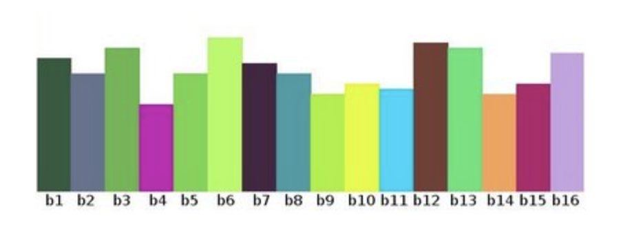
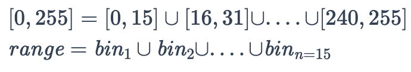

# Week 2: Week 2 - Fundamentals of Image Processing1

> Source: `Week 2 - Fundamentals of Image Processing1.pptx`
> Total slides: 24

---

## Slide 1

### Exploring the core aspect of Computer Vision
### Instructor: Stephin Rachel Thomas22-01-2026

Fundamentals of Image Processing

---

## Slide 2

### Introduction to Image Processing
### It’s importance in Machine Vision
### Steps involved in Image processing
### Introduction to Image Filtering
### Image Blurring
### Image Sharpening
### Edge Detection using Canny
### Image Histograms
### Image Thresholding
### Morphological operations
### Image Transformation Techniques

Today’s Topics

---

## Slide 3

### Image Processing is the building block of Machine Vision.
### It involves manipulation and analysis of images.
### It enhances quality of image and extract meaningful information.

Introduction to Image Processing

---

## Slide 4

### Enhancement: Improves image quality by reducing noise, enhancing contrast, and sharpening details, making it easier to analyze.
### Feature Extraction: Identifies and extracts important features like edges, corners, and textures, which are crucial for recognizing objects and patterns.
### Segmentation: Divides an image into meaningful regions or objects, facilitating object detection and classification.
### Object Recognition: Helps in identifying and classifying objects within an image, which is essential for applications like automated inspection and robotics.
### Measurement: Allows for precise measurement of object dimensions, distances, and other parameters, which is vital in quality control and industrial automation.

Why is Image Processing used in Machine Vision?

---

## Slide 5

### Acquisition
### Enhancement
### Restoration
### Morphological processing
### Segmentation
### Object recognition
### Representation and description
### Image compression
### Colour Image Processing

Key stages in Image Processing

---

## Slide 6

### Key stages in Image Processing

Based on the application combination of 2 or 3 steps can be used. It is not mandatory that all these steps are to be done In every image processing task.
Image Acquisition – Acquiring image using digital camera or sensors
Image enhancement – manipulates image so that the result is more suitable than the original image for specific application. This step brings out hidden details of an image and highlights certain features which may be important for further analysis.
Image restoration – Process of improving the appearance of image. Eg: removal of noiseincludes mathematical or probabilistic models of image degradation
Morphological processing – deals with tools for extracting image components that are useful in the representation and description of shape. Eg: fingerprint recognition

---

## Slide 7

### Key stages in Image Processing

Image segmentation – one of the most difficult task, it partition an image into its constituent parts or objects.
Object Recognition:  The process that assigns a label to an object based on the information provided by its description
Representation and description:Choosing a representation for transforming raw data into a form suitable for subsequent computer processing boundary representation or region representation
Image Compression: Reducing storage required to save an image
Color image processing:  Involves use of color of image to extract meaningful information

---

## Slide 8

### Filtering in image processing is a technique used to manipulate or enhance an image by altering its pixels. It's a fundamental tool that can either amplify certain features or suppress unwanted distortions.
### Filters act like a sieve through which the original image is passed: they can highlight specific attributes, remove noise, or prepare the image for further analysis.

Introduction to Image Filtering

---

## Slide 9

### Blurring is a type of filtering that softens an image. It’s used to reduce detail and noise
### Blurring works by averaging the pixels around a target pixel, which smooths out rapid intensity changes.
### The filter used here is:[[1,1,1],[1,1,1],[1,1,1]]

Image Blurring

---

## Slide 10

### Sharpening, in contrast to blurring, is a filter that enhances the edges and details in an image, making it appear clearer and more defined.
### It increases the contrast between adjacent pixels to highlight boundaries of objects within the image.
### This technique is vital when details are critical for analysis, such as in medical imaging or precision manufacturing

Image Sharpening

---

## Slide 11

### Basic Image Manipulations

Let's explore basic manipulations like resizing, cropping, and rotating images. These are the bread and butter of image processing – simple yet powerful tools in our visual toolkit.

---

## Slide 12

### The Canny filter is a sophisticated edge detection algorithm that is known for its precision in detecting a wide range of edges in images.
### It involves multiple stages:
### Noise Reduction - By smoothing the image with a Gaussian filter
### Gradient Calculation -  Finding intensity gradients and its direction at each pixel.Smoothened image is then filtered with a Sobel kernel in both horizontal and vertical direction to get first derivative in horizontal direction and vertical direction

Edge Detection using Canny

---

## Slide 13

### Non-maximum Suppression – Thins out edges by suppressing non-maximum gradient values
### Double Thresholding – Algorithm applies 2 thresholds (high and low) to classify edges into strong, weak and non-edges
### Edge Tracking by Hysteresis- the algorithm tracks edges by connecting weak edges to strong edges, helps to preserve true edges while discarding isolated weak edges caused by noise.
### https://docs.opencv.org/5.x/da/d22/tutorial_py_canny.html

Edge Detection using Canny

---

## Slide 14

### An image histogram is a chart that shows how many pixels in an image have a particular brightness level. The horizontal axis shows different brightness levels, from dark to light, and the vertical axis shows how many pixels are at each level. It helps us understand if an image is mostly bright, dark, or balanced, and is useful for improving the image's look.

Image Histograms

---

## Slide 15

### What is Histogram?

Histogram is a graph or plot, which gives you an overall idea about the intensity distribution of an image.
It is a plot with pixel values (ranging from 0 to 255) in X-axis and corresponding number of pixels in the image on Y-axis.
Left region of histogram shows the amount of darker pixels in image and right region shows the amount of brighter pixels.

---

## Slide 16

### Histogram and bin

https://docs.opencv.org/5.x/d8/dbc/tutorial_histogram_calculation.html

We can segment our range in subparts
(called bins)

---

## Slide 17

### Thresholding is a simple yet effective way to segment images.
### By converting an image to black and white based on a threshold value, we can isolate objects or features easily.

Image Thresholding

---

## Slide 18

### Simple Thresholding
### For every pixel, the same threshold value is applied. If the pixel value is smaller than or equal to the threshold, it is set to 0, otherwise it is set to a maximum value.
### Adaptive Thresholding
### The algorithm determines the threshold for a pixel based on a small region around it. So we get different thresholds for different regions of the same image which gives better results for images with varying illumination.

Image Thresholding

---

## Slide 19

### Morphology is a broad set of image processing operations that process images based on shapes.
### Erosion: Shrinks objects.
### The kernel slides through the image (as in 2D convolution). A pixel in the original image (either 1 or 0) will be considered 1 only if all the pixels under the kernel is 1, otherwise it is eroded (made to zero).
### All the pixels near boundary will be discarded depending upon the size of kernel. So the thickness or size of the foreground object decreases or simply white region decreases in the image.
### It is useful for removing small white noises, detach two connected objects etc.

Morphological Operations

Left image: original image, right image: resulting erosion

---

## Slide 20

### Dilation: Expands objects.
### A pixel element is '1' if at least one pixel under the kernel is '1'. So it increases the white region in the image or size of foreground object increases.
### Normally, in cases like noise removal, erosion is followed by dilation.
### It is also useful in joining broken parts of an object.

Morphological Operations

Left image: original image, right image: resulting dilatation

---

## Slide 21

### Opening: Removes small objects (erosion followed by dilation).
### Erosion removes white noises, but it also shrinks our object. Then we dilate it. Since noise is gone, they won't come back, but our object area increases. It is also useful in joining broken parts of an object.
### Closing: Fills small holes (dilation followed by erosion).
### It is useful in closing small holes(filling the gap) inside the foreground objects, or small black points on the object.
### Application: Medical Imaging, Robotics, Computer Vision, Document processing

Morphological Operations

Opening

Closing

---

## Slide 22

### Image transformation techniques are essential tools in digital image processing, allowing for various modifications and enhancements to image.
### Affine transformation – Preserve lines and parallelism in the image. y = Ax + b
### x: The input vector (e.g., a point in 2D or 3D space).
### A: A matrix that applies a linear transformation (like rotation, scaling, or shearing).
### b: A vector that applies a translation (shifts the result).
### y: The output vector after the transformation.

Image Transformation Techniques

---

## Slide 23

### Translation: Shifting the image in the x or y direction.
### Rotation: Rotating the image around a specified point.
### Scaling: Changing the size of the image.
### Shearing: Slanting the image along the x or y axis.

Image Transformation Techniques

---

## Slide 24

### Next Week Preview

Next week, we'll dive into the Feature detection and Description.

---
