# Week 3: Week. 3-Object_Feature Detection and Description

> Source: `Week. 3-Object_Feature Detection and Description.pptx`
> Total slides: 28

---

## Slide 1

### Instructor: Stephin Rachel Thomas
### 29-01-2026

Object / Feature Detection and Description

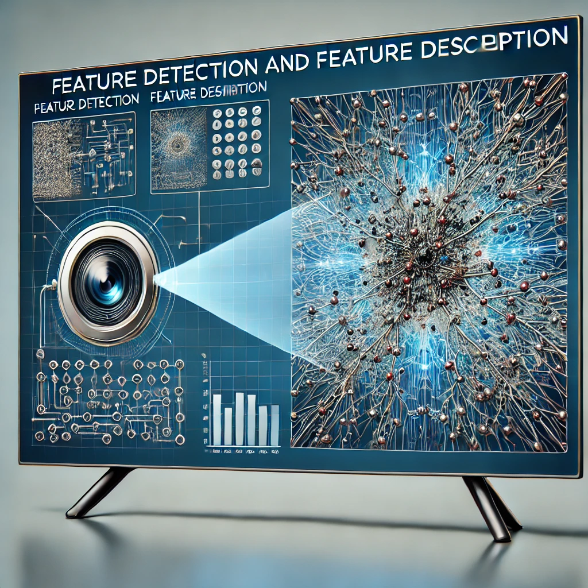

---

## Slide 2

### Segmentation and Binary Images
### Basic and Adaptive threshold
### Introduction to Contours
### Introduction to Feature Detection
### Basic concept of Feature Detection
### Image Gradient
### Scale Invariant Feature Transform (SIFT)
### Speeded Up Robust Features (SURF)
### Advanced Feature Detection Techniques
### Feature Descriptors
### Feature Matching and Applications
### Machine Learning in Feature Detection
### Future trend in Feature Description

Today’s Topics

---

## Slide 3

### Segmentation – Extracts objects from image for further processing
### Output of segmentation is typically a binary image –Image with values of zero and one(black and white)
### 1 indicates the piece of image we wanted to use and 0 indicates everything else.
### Binary image is key component of many image processing algorithms, and it acts as a mask for the area of the source image
### One of the typical way to get a binary image is to use thresholding algorithm
### Thresholding is a type of segmentation that looks at the values of the source image and perform a comparison against one central value to decide whether a single pixel or group of pixels should have a value of zero or one.

Segmentation and Binary Images

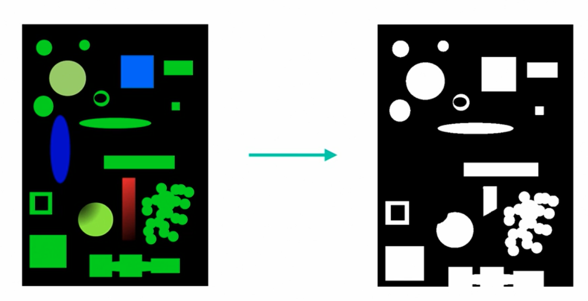

---

## Slide 4

Segmentation and Binary Images

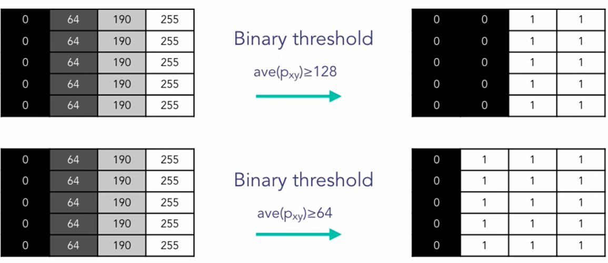

---

## Slide 5

### Hands on Exercise

---

## Slide 6

### Binary thresholding is not ideal for events such as uneven lighting, adaptive thresholding is a solution
### Instead of taking a simple global value as a threshold comparison, adaptive thresholding will use its local neighborhood of the image to determine whether a relative threshold is met, thus counteract issues like uneven lighting.
### It calculates threshold value for each sub regions instead of the whole image
### Adaptive methods - adaptive_mean or adaptive_gaussian

Adaptive Thresholding

---

## Slide 7

### Hands on Exercise

---

## Slide 8

### A contour is a curve that joins a set of points enclosing an area having the same color or intensity.
### The area of uniform color or intensity forms the object that we are trying to detect and the curve enclosing this area is the contour representing the shape of the object.
### It works similar to edge detection but with the restriction that the edges detected must form a closed path
### Contours defines boundaries of objects in an image
### Useful for shape analysis, object detection and recognition.
### The output of segmentation (binary image) is used as input for contour detection(pre-processing)

Introduction to Contours

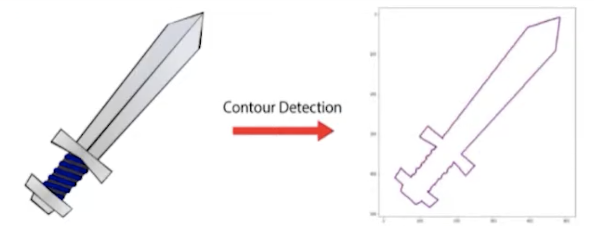

---

## Slide 9

Contour Object Detection

Cv2.findContours()  - OpenCV built in function for finding contours in an image.
This method returns:
Contours – A list of contours in the image. Each contour is a vector of boundary points
Hierarchy – optional output vector containing information about image topology 									(parent-child relationship)

---

## Slide 10

Contour Object Detection

Cv2.drawContours() - The function draws contour outlines in the image if 𝚝𝚑𝚒𝚌𝚔𝚗𝚎𝚜𝚜≥0 or fills the area bounded by the contours if 𝚝𝚑𝚒𝚌𝚔𝚗𝚎𝚜𝚜<0

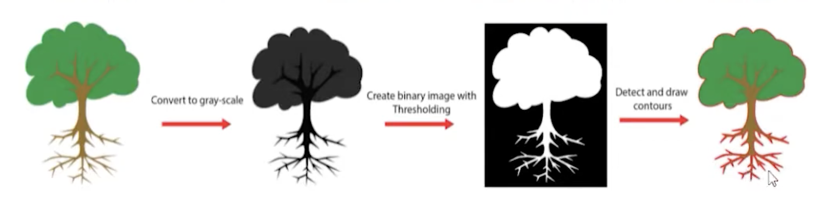

---

## Slide 11

### Definition: It is the process of identifying and locating significant structures or patterns within an image.
### These features are crucial for understanding and interpreting visual information in tasks such as object recognition, motion tracking, and image classification.
### A feature is an interesting part of an image
### Examples: Edges (sharp changes in intensity), Corners (intersection of two edges), Blobs (regions of similar texture or color), and Ridges (lines of high intensity).

Introduction to Feature Detection

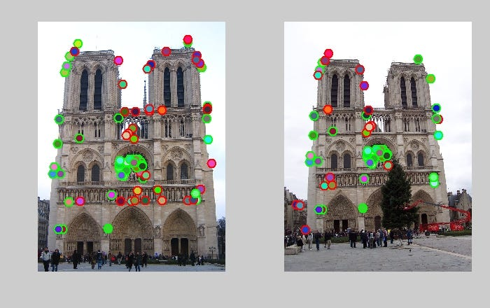

---

## Slide 12

### Feature detection has evolved significantly since the early days of computer vision.
### Early techniques focused on simple edge detection, while modern approaches leverage complex algorithms and deep learning.
### Applications span various domains including –
### Autonomous vehicles (for navigation and obstacle detection),
### Medical imaging (for disease diagnosis),
### Augmented reality (for enhancing real-world environments with digital overlays).

Historical Context and Importance

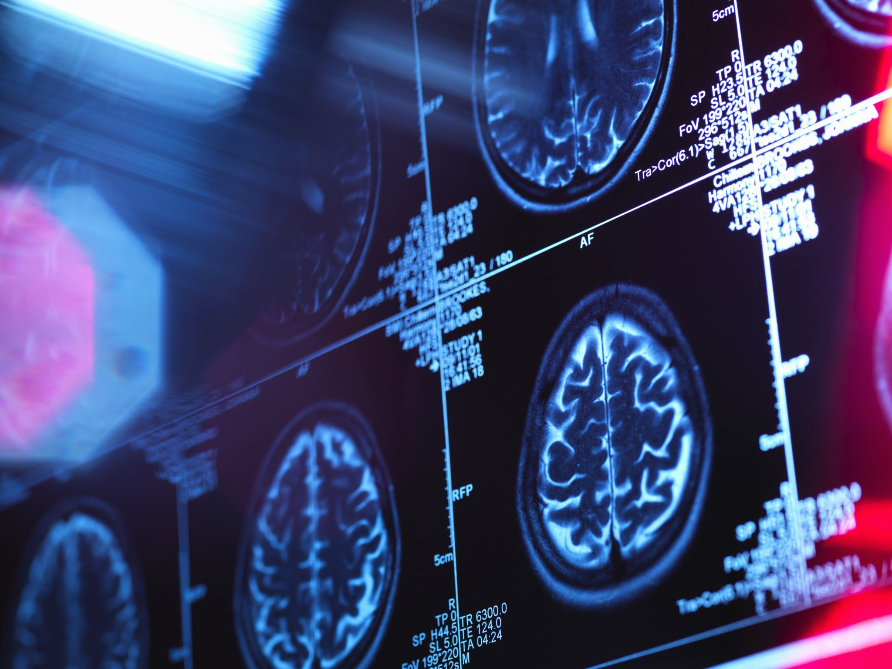

---

## Slide 13

Basic Concepts of Feature Detection

Understanding Image Gradients: Gradients measure directional changes in the intensity
or color of an image and are fundamental in identifying features.

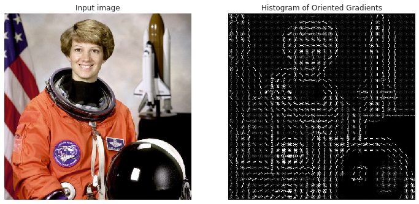

---

## Slide 14

### Image Gradient

Measure of change in Image function F(x,y) in X or Y direction

Change in color represents magnitude and the blue arrows represent the direction

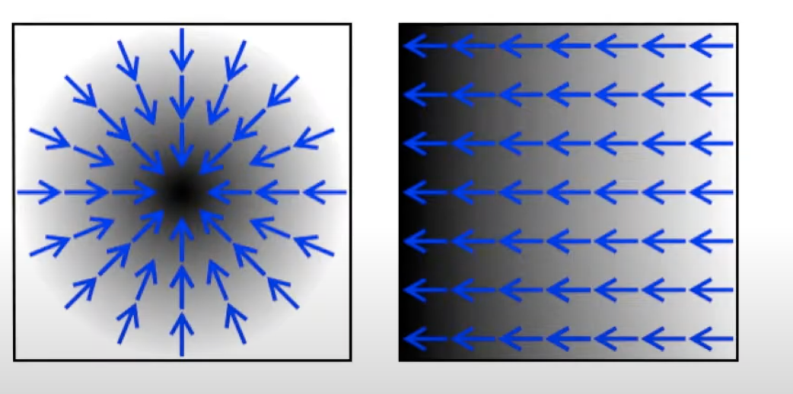

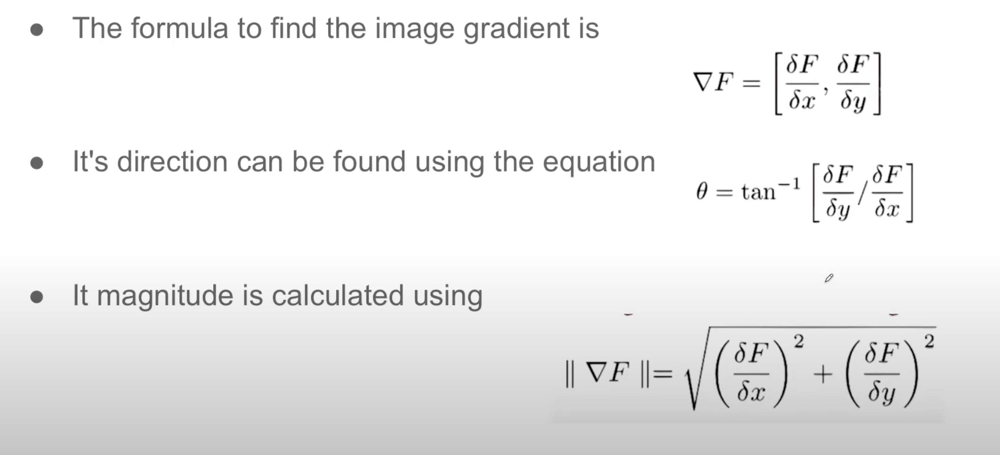

---

## Slide 15

### SIFT identifies and describes local features in images. It's invariant to scaling, rotation, and partially invariant to change in illumination and 3D camera viewpoint. Detects corners ,circles, blobs etc.
### Keypoints – Special points in an image that carry unique information
### The SIFT (Scale-Invariant Feature Transform) algorithm is a powerful method in computer vision for detecting and describing local features in images. Here's a breakdown of its main steps:
### 1. Scale-space Extrema Detection
### Detect potential keypoints by searching for local extrema (maxima/minima) in a series of Difference of Gaussian (DoG) images.
### This is done across multiple scales (octaves) to ensure scale invariance.

Scale-Invariant Feature Transform (SIFT)

---

## Slide 16

### 2. Keypoint Localization
### Refine the detected keypoints by:
- Eliminating low-contrast points.
- Removing points that lie along edges
### This improves stability and accuracy.
### 3. Orientation Assignment
### Assign one or more orientations to each keypoint based on the local image gradient directions.
### This ensures rotation invariance.

Scale-Invariant Feature Transform (SIFT)

---

## Slide 17

### 4. Keypoint Descriptor Generation
### Around each keypoint, a region is taken and divided into smaller blocks.
### For each block, a histogram of gradient orientations is computed.
### These histograms are concatenated into a 128-dimensional feature vector (descriptor).
### 5. Feature Matching (Optional)
### Descriptors from different images can be compared using distance metrics (like Euclidean distance) to find matching keypoints.

Scale-Invariant Feature Transform (SIFT)

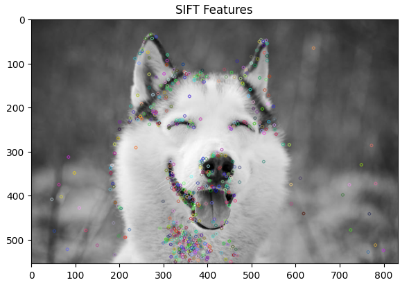

---

## Slide 18

### Introduction: SURF is a faster alternative to SIFT, offering robustness to changes in scale, rotation, and illumination.
### Advantages: SURF is faster due to integral images for image convolutions, uses fewer features while maintaining accuracy, and is more suitable for real-time applications.

Speeded Up Robust Features (SURF)

---

## Slide 19

### Interest Point Detection:
- Uses a Hessian matrix-based detector to find keypoints.
- Faster than SIFT due to use of integral images and box filters.
### Scale-space Representation:
- Like SIFT, SURF detects features at multiple scales.

Speeded Up Robust Features (SURF)

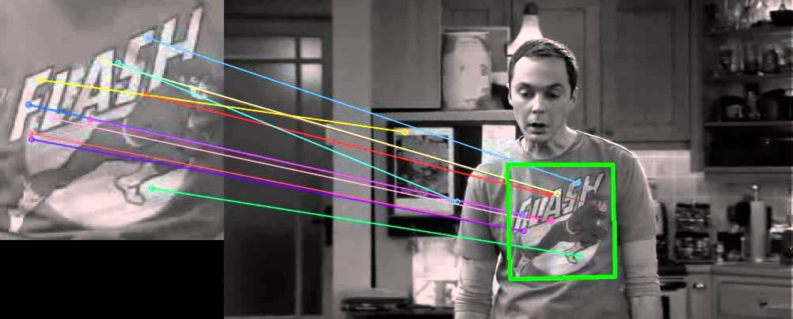

---

## Slide 20

### 3.  Orientation Assignment:
- Computes Haar wavelet responses in a circular region around the keypoint.
- Assigns a dominant orientation for rotation invariance.
### 4.  Descriptor Generation:
- A square region around the keypoint is divided into 4×4 subregions.
- For each subregion, Haar wavelet responses in x and y directions are summed.
- This results in a 64-dimensional descriptor (compared to SIFT’s 128).

Speeded Up Robust Features (SURF)

---

## Slide 21

### ORB is a fusion of FAST keypoint detector and BRIEF descriptor with many modifications to enhance performance.
### FAST – Features from Accelerated Segment Test
### BRIEF – Binary Robust Independent Elementary Features
### ORB takes advantages of FAST corner detection technique to locate keypoints efficiently. Unlike traditional algorithms that use gradient information, FAST focuses on intensity changes making it robust and fast. Also, ORB employs BRIEF to generate binary descriptors for each keypoint, allowing for efficient matching.
### Cv2.ORB_create() – OpenCV function for creating ORB detector with standard parameters
### Deep Learning Approaches: The use of Convolutional Neural Networks (CNNs) for feature detection and description, surpassing traditional methods in accuracy and robustness.

Advanced Feature Detection TechniquesORB (Oriented FAST and Roated BRIEF)

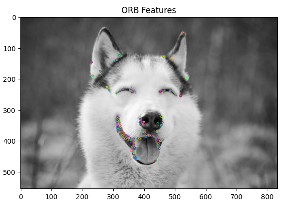

---

## Slide 22

### Definition: Descriptors provide a unique and robust representation of the detected features, crucial for feature matching.
### The Histogram of Oriented Gradients (HOG) is particularly effective for human detection in computer vision.
### Plots image pixel orientations and gradients on a histogram – simplifies the representation of image
### It works by analyzing gradients and edge directions in localized portions of an image, creating a unique representation of human shapes and postures. This makes HOG highly effective for applications like pedestrian detection in autonomous vehicles and surveillance, as it can reliably identify humans even under varying conditions.

Feature Descriptors

Left : Absolute value of x-gradient. Right : Absolute value of y-gradient.

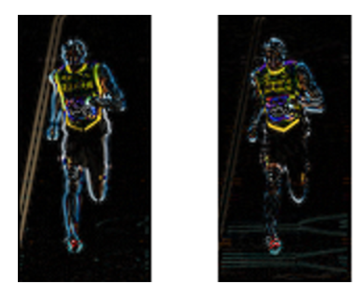

---

## Slide 23

### Feature Descriptors

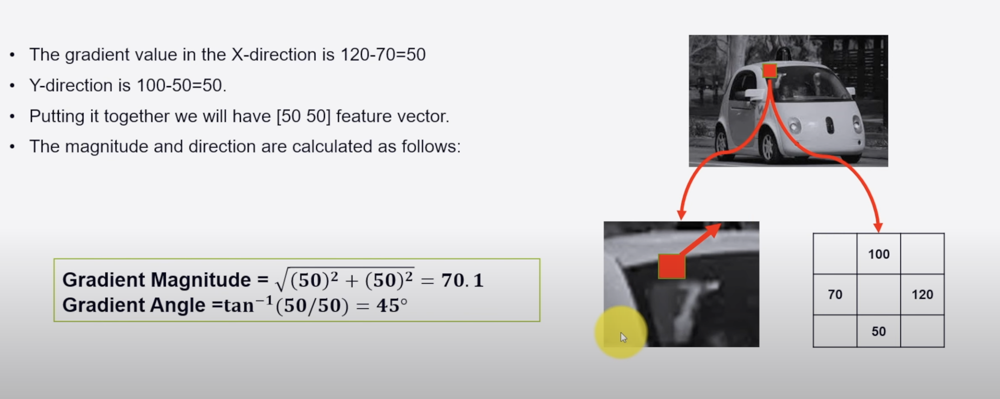

---

## Slide 24

### Feature Matching and Applications

---

## Slide 25

### In the field of computer vision, machine learning algorithms significantly enhance feature detection by improving accuracy and efficiency. These algorithms learn from extensive data, refining the process of identifying image features.
### The techniques include:
### 1. Supervised learning: uses labeled data for training
### Eg: Email Spam detection
### 2. Unsupervised learning: for pattern discovery without labeled data
### Eg: Customer Segmentation based on purchasing behavior
### 3. Semi-supervised learning: combines both approaches
### Eg: Google photos

Machine Learning in Feature Detection

---

## Slide 26

### Real-time feature detection in computer vision faces significant challenges, particularly in balancing computational demands with the need for accuracy. In applications like video surveillance and autonomous driving, where decisions must be made swiftly and accurately, these challenges are amplified.
### Common remedies:
### Algorithm optimizations
### Use low-level programming languages (surely not python)
### Utilizes hardware acceleration (GPUs and TPUs)

Real-Time Feature Detection

---

## Slide 27

### Future Trends in Feature Detection

Deep learning, with its advanced neural networks, is enhancing the capability to automatically and accurately detect features in images by learning complex patterns in large datasets.
This approach is a departure from traditional methods that relied on handcrafted algorithms and is proving to be more effective in handling the nuances and variability in real-world images.
Enabling smarter feature detection systems that can adapt and improve over time, learning from new data and experiences

---

## Slide 28

### Next Week

Introduction to CNN
Architecture of CNN
How CNN resolves common computer vision problems

---
