# Week 3: 目标特征检测与描述 (Object Feature Detection and Description)

> Source: `Week 3-Object_Feature Detection and Description.pdf`
> Total Pages: 28
> Instructor: Stephin Rachel Thomas | 29-01-2026

---

## 1. 今日主题 (Today's Topics)

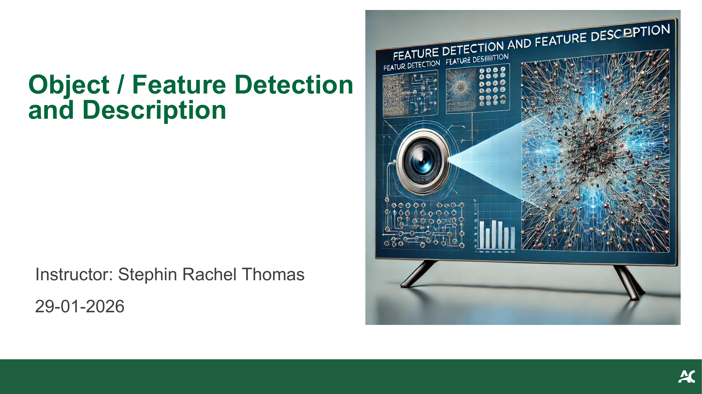

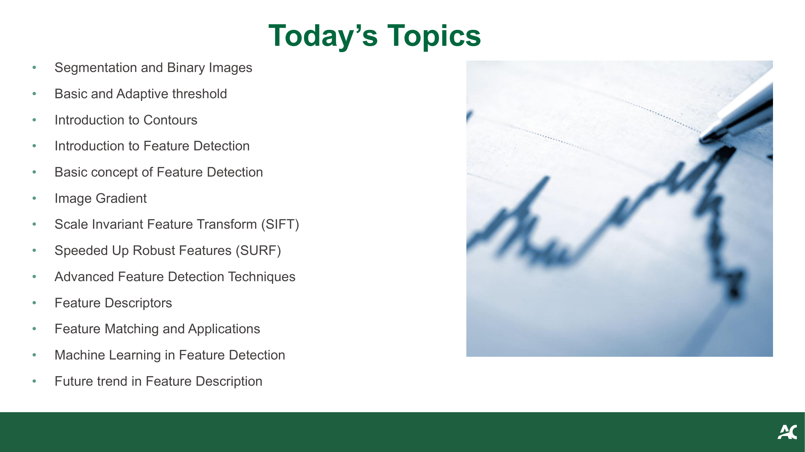

- Segmentation and Binary Images — 分割与二值图像
- Basic and Adaptive Threshold — 基本阈值与自适应阈值
- Introduction to Contours — 轮廓简介
- Introduction to Feature Detection — 特征检测简介
- Basic Concept of Feature Detection — 特征检测基本概念
- Image Gradient — 图像梯度
- Scale Invariant Feature Transform (SIFT) — 尺度不变特征变换
- Speeded Up Robust Features (SURF) — 加速稳健特征
- Advanced Feature Detection Techniques — 高级特征检测技术
- Feature Descriptors — 特征描述子
- Feature Matching and Applications — 特征匹配与应用
- Machine Learning in Feature Detection — 特征检测中的机器学习
- Future Trends in Feature Detection — 特征检测的未来趋势

---

## 2. 分割与二值图像 (Segmentation and Binary Images)

### 2.1 分割与阈值化定义 (Segmentation and Thresholding Definition)

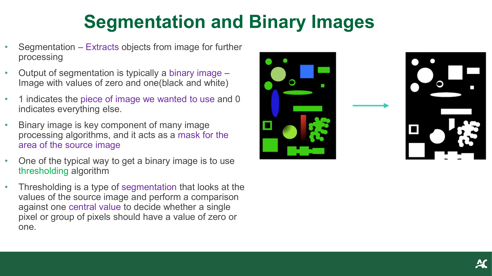

- Segmentation – **Extracts** objects from image for further processing — 分割 – **提取**图像中的对象以进行后续处理
- Output of segmentation is typically a **binary image** – Image with values of zero and one(black and white) — 分割的输出通常是**二值图像** – 值为零和一的图像（黑和白）
- 1 indicates the **piece of image we wanted to use** and 0 indicates everything else. — 1表示**我们想用的图像部分**，0表示其他所有内容。
- Binary image is key component of many image processing algorithms, and it acts as a **mask for the area of the source image** — 二值图像是许多图像处理算法的关键组件，它充当**源图像区域的掩模**
- One of the typical way to get a binary image is to use **thresholding** algorithm — 获取二值图像的典型方法之一是使用**阈值化**算法
- Thresholding is a type of **segmentation** that looks at the values of the source image and perform a comparison against one **central value** to decide whether a single pixel or group of pixels should have a value of zero or one. — 阈值化是一种**分割**，它查看源图像的值并与一个**中心值**进行比较，以决定单个像素或一组像素的值应为零还是一。

### 2.2 二值阈值化数值示例 (Binary Thresholding Numerical Examples)

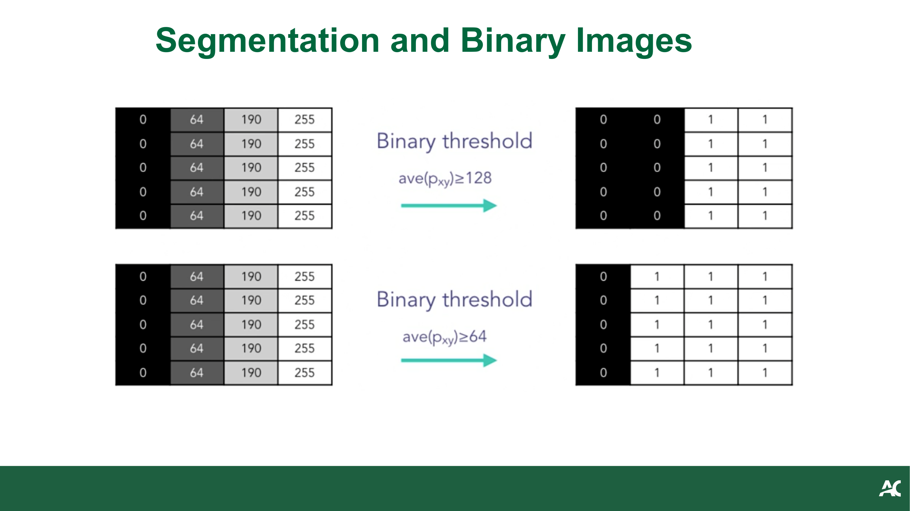

**Binary thresholding numerical examples:** Shows pixel grid examples of binary thresholding — demonstrates threshold ≥128 and threshold ≥64 applied to sample pixel values, illustrating how different threshold values produce different binary outputs.

**二值阈值化数值示例：** 展示二值阈值化的像素网格示例 — 演示阈值≥128和阈值≥64应用于示例像素值，说明不同阈值如何产生不同的二值输出。

**Section divider:** "Hands on Exercise" title slide — marks the transition to a practical exercise segment.

---

## 3. 自适应阈值 (Adaptive Thresholding)

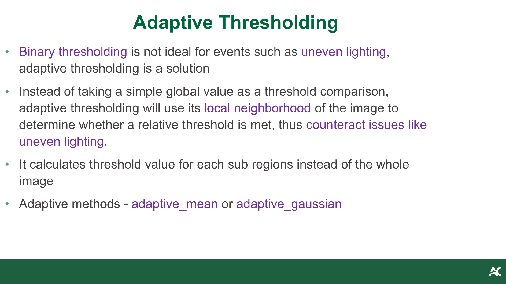

- **Binary thresholding** is not ideal for events such as **uneven lighting**, adaptive thresholding is a solution — **二值阈值化**对诸如**光照不均匀**的情况不理想，自适应阈值化是一种解决方案
- Instead of taking a simple global value as a threshold comparison, adaptive thresholding will use its **local neighborhood** of the image to determine whether a relative threshold is met, thus **counteract issues like uneven lighting**. — 不是取一个简单的全局值作为阈值比较，自适应阈值化将使用图像的**本地邻域**来确定是否满足相对阈值，从而**抵消光照不均匀等问题**。
- It calculates threshold value for **each sub regions** instead of the whole image — 为**每个子区域**而非整个图像计算阈值
- Adaptive methods - `adaptive_mean` or `adaptive_gaussian` — 自适应方法 - `adaptive_mean` 或 `adaptive_gaussian`

**Section divider:** "Hands on Exercise" title slide — marks the transition to an adaptive thresholding practice segment.

---

## 4. 轮廓简介 (Introduction to Contours)

### 4.1 轮廓定义 (Contour Definition)

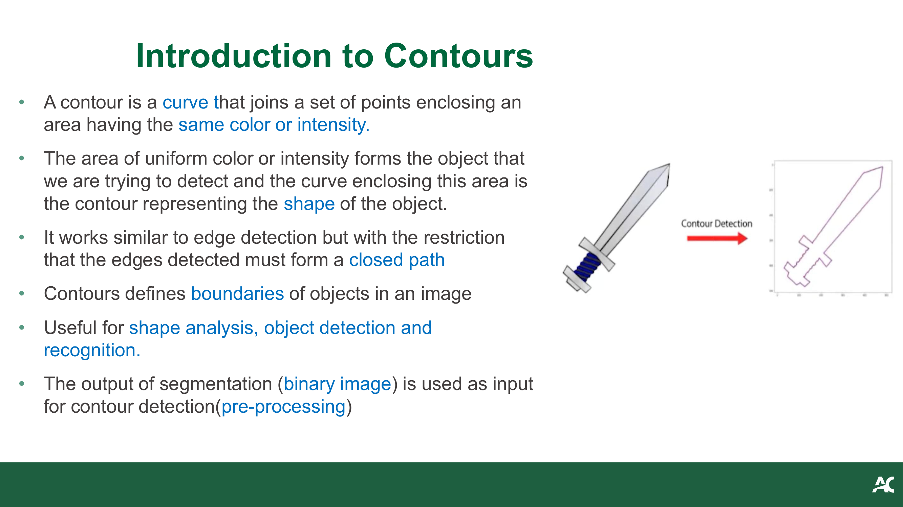

- A contour is a **curve** that joins a set of points enclosing an area having the **same color or intensity**. — 轮廓是连接一组点的**曲线**，这些点围住具有**相同颜色或强度**的区域。
- The area of uniform color or intensity forms the object that we are trying to detect and the curve enclosing this area is the contour representing the **shape** of the object. — 均匀颜色或强度的区域形成我们试图检测的对象，围住该区域的曲线就是代表对象**形状**的轮廓。
- It works similar to edge detection but with the restriction that the edges detected must form a **closed path** — 它的工作原理类似于边缘检测，但限制是检测到的边缘必须形成**闭合路径**
- Contours defines **boundaries** of objects in an image — 轮廓定义图像中对象的**边界**
- Useful for **shape analysis, object detection and recognition**. — 适用于**形状分析、目标检测和识别**。
- The output of segmentation (**binary image**) is used as input for contour detection(**pre-processing**) — 分割的输出（**二值图像**）用作轮廓检测的输入（**预处理**）

### 4.2 轮廓查找函数 (Finding Contours — findContours)

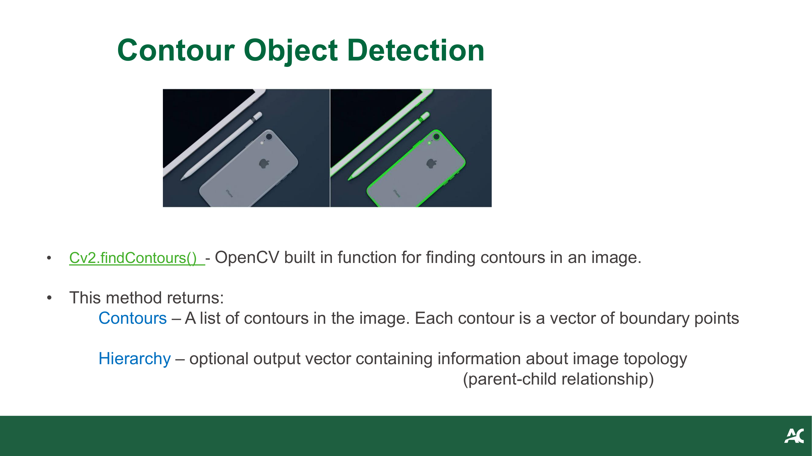

- `Cv2.findContours()` - OpenCV built in function for finding contours in an image. — `Cv2.findContours()` - OpenCV内置的用于在图像中查找轮廓的函数。
- This method returns: **Contours** – A list of contours in the image. Each contour is a vector of boundary points. **Hierarchy** – optional output vector containing information about image topology (parent-child relationship) — 此方法返回：**Contours** – 图像中轮廓的列表。每个轮廓是一个边界点向量。**Hierarchy** – 包含图像拓扑信息的可选输出向量（父子关系）

### 4.3 轮廓绘制与流水线 (Drawing Contours — drawContours Pipeline)

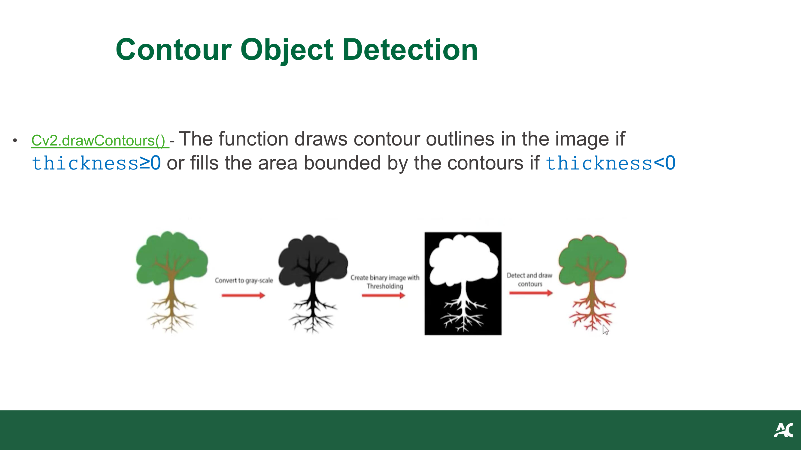

**Contour Object Detection slide (drawContours):** Title "Contour Object Detection." Text: `Cv2.drawContours()` function description. Below: a 4-step pipeline illustration using a tree — (1) original color tree → "Convert to gray-scale" → (2) grayscale tree → "Create binary image with Thresholding" → (3) binary black-and-white tree → "Detect and draw contours" → (4) original tree with red contour outlines.

**轮廓对象检测页（drawContours）：** 标题"Contour Object Detection。"文字：`Cv2.drawContours()` 函数描述。下方：使用树的4步流水线图示 — (1) 原始彩色树 → "Convert to gray-scale" → (2) 灰度树 → "Create binary image with Thresholding" → (3) 二值黑白树 → "Detect and draw contours" → (4) 带红色轮廓线的原始树。

- `Cv2.drawContours()` - The function draws contour outlines in the image if `thickness≥0` or fills the area bounded by the contours if `thickness<0` — `Cv2.drawContours()` - 该函数在 `thickness≥0` 时在图像中绘制轮廓线，或在 `thickness<0` 时填充轮廓围成的区域

---

## 5. 特征检测简介 (Introduction to Feature Detection)

### 5.1 特征检测定义与类型 (Definition and Feature Types)

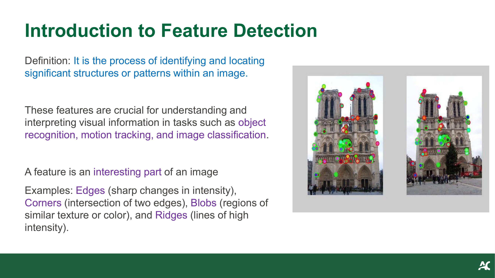

- Definition: It is the process of **identifying and locating significant structures or patterns within an image**. — 定义：它是**识别和定位图像中重要结构或模式**的过程。
- These features are crucial for understanding and interpreting visual information in tasks such as **object recognition, motion tracking, and image classification**. — 这些特征对于在**目标识别、运动跟踪和图像分类**等任务中理解和解释视觉信息至关重要。
- A feature is an **interesting part** of an image — 特征是图像中**有趣的部分**
- Examples: **Edges** (sharp changes in intensity), **Corners** (intersection of two edges), **Blobs** (regions of similar texture or color), and **Ridges** (lines of high intensity). — 示例：**边缘**（强度的急剧变化）、**角点**（两条边缘的交叉）、**斑点**（相似纹理或颜色的区域）和**脊线**（高强度的线条）。

### 5.2 历史背景与重要性 (Historical Context and Importance)

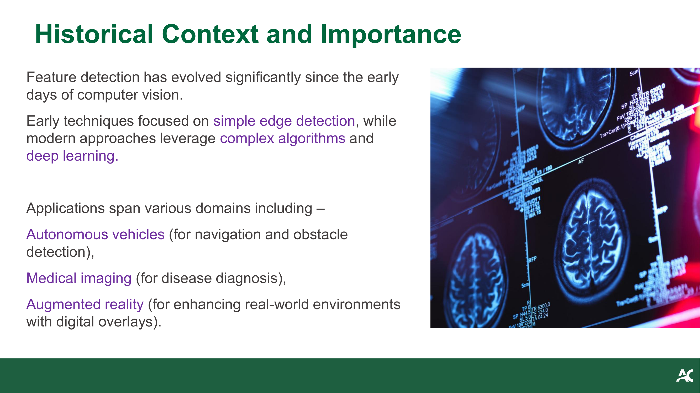

- Feature detection has evolved significantly since the early days of computer vision. — 特征检测自计算机视觉早期以来已经有了显著的发展。
- Early techniques focused on **simple edge detection**, while modern approaches leverage **complex algorithms** and **deep learning**. — 早期技术专注于**简单的边缘检测**，而现代方法利用**复杂算法**和**深度学习**。
- Applications span various domains including – **Autonomous vehicles** (for navigation and obstacle detection), **Medical imaging** (for disease diagnosis), **Augmented reality** (for enhancing real-world environments with digital overlays). — 应用跨越多个领域，包括 – **自动驾驶车辆**（用于导航和障碍物检测）、**医学影像**（用于疾病诊断）、**增强现实**（用于通过数字叠加增强现实世界环境）。

---

## 6. 图像梯度 (Image Gradient)

### 6.1 基本概念与HOG (Basic Concepts and HOG)

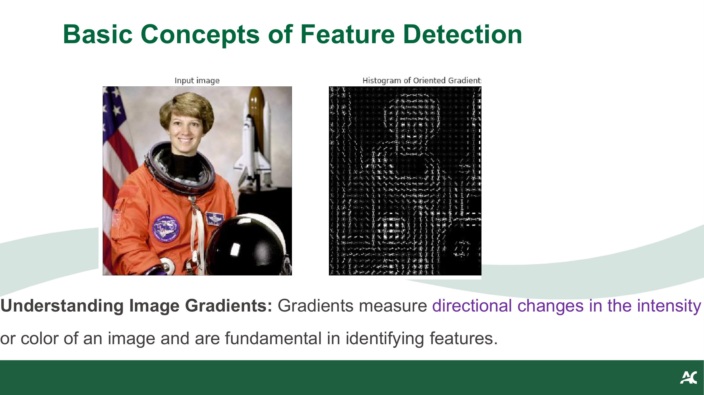

- **Understanding Image Gradients:** Gradients measure **directional changes in the intensity** or color of an image and are fundamental in identifying features. — **理解图像梯度：** 梯度测量图像**强度的方向性变化**或颜色变化，是识别特征的基础。

### 6.2 梯度公式与计算 (Gradient Formulas and Computation)

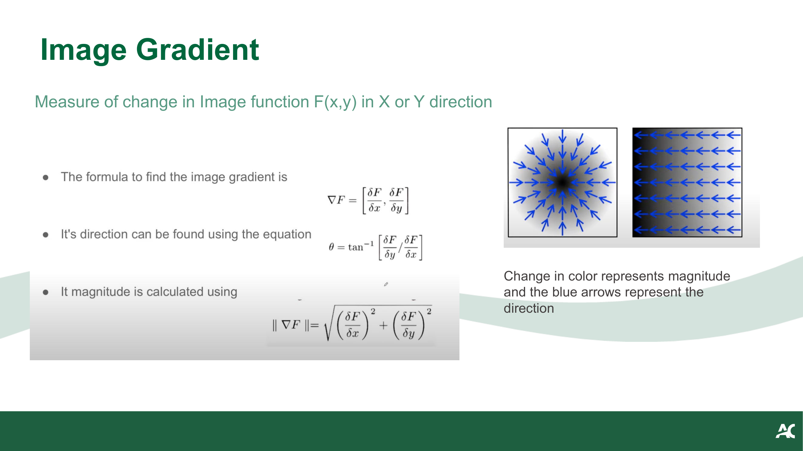

- Measure of change in Image function F(x,y) in X or Y direction — 图像函数F(x,y)在X或Y方向的变化度量
- The formula to find the image gradient is ∇F = [δF/δx, δF/δy] — 求图像梯度的公式为 ∇F = [δF/δx, δF/δy]
  - ∇F = gradient vector (梯度向量), a 2D vector
  - δF/δx = partial derivative of image intensity in X (horizontal) direction (X方向偏导数)
  - δF/δy = partial derivative of image intensity in Y (vertical) direction (Y方向偏导数)
- It's direction can be found using the equation θ = tan⁻¹[δF/δy / δF/δx] — 其方向可通过公式 θ = tan⁻¹[δF/δy / δF/δx] 求得
  - θ = gradient direction in degrees (梯度方向，单位：度)
  - tan⁻¹ = inverse tangent / arctan (反正切)
- It magnitude is calculated using ‖∇F‖ = √((δF/δx)² + (δF/δy)²) — 其幅值使用 ‖∇F‖ = √((δF/δx)² + (δF/δy)²) 计算
  - ‖∇F‖ = gradient magnitude (梯度幅值), scalar value — larger = sharper edge
  - Overall: Pythagorean theorem on the gradient vector — 整体：对梯度向量用勾股定理
- Change in color represents **magnitude** and the blue arrows represent the **direction** — 颜色变化代表**幅值**，蓝色箭头代表**方向**

---

## 7. 尺度不变特征变换 (Scale-Invariant Feature Transform — SIFT)

### 7.1 SIFT概述与步骤1 (SIFT Overview and Step 1)

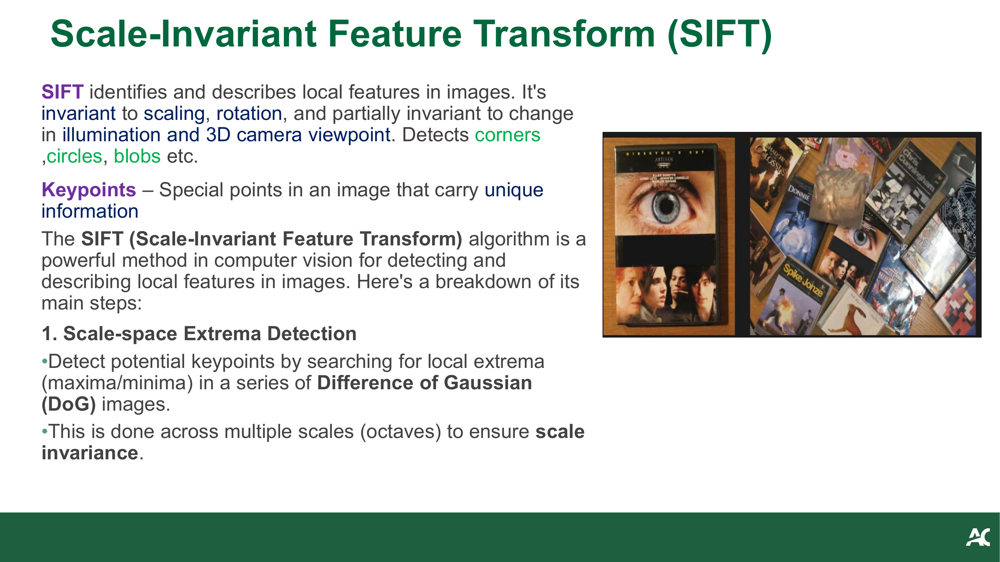

- **SIFT** identifies and describes local features in images. It's **invariant** to **scaling**, **rotation**, and partially invariant to change in **illumination and 3D camera viewpoint**. Detects **corners**, **circles**, **blobs** etc. — **SIFT**识别和描述图像中的局部特征。它对**缩放**、**旋转****不变**，对**光照和3D相机视角**变化部分不变。检测**角点**、**圆**、**斑点**等。
- **Keypoints** – Special points in an image that carry **unique information** — **关键点** – 图像中携带**独特信息**的特殊点
- The **SIFT (Scale-Invariant Feature Transform)** algorithm is a powerful method in computer vision for detecting and describing local features in images. Here's a breakdown of its main steps: — **SIFT（尺度不变特征变换）**算法是计算机视觉中用于检测和描述图像局部特征的强大方法。以下是其主要步骤分解：
- **1. Scale-space Extrema Detection** — **1. 尺度空间极值检测**
  - Detect potential keypoints by searching for local extrema (maxima/minima) in a series of **Difference of Gaussian (DoG)** images. — 通过在一系列**高斯差分（DoG）**图像中搜索局部极值（极大/极小值）来检测候选关键点。
  - This is done across multiple scales (octaves) to ensure **scale invariance**. — 这是跨多个尺度（octave）完成的以确保**尺度不变性**。

### 7.2 步骤2-3：定位与方向分配 (Steps 2-3: Localization and Orientation)

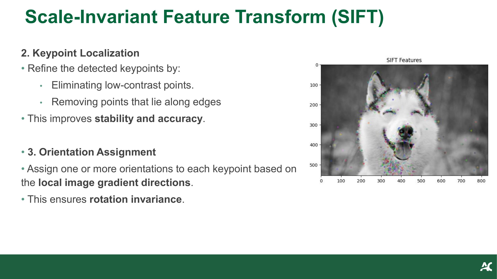

- **2. Keypoint Localization** — **2. 关键点定位**
  - Refine the detected keypoints by: Eliminating low-contrast points. Removing points that lie along edges — 通过以下方式精化检测到的关键点：消除低对比度点。去除沿边缘的点
  - This improves **stability and accuracy**. — 这提高了**稳定性和精度**。
- **3. Orientation Assignment** — **3. 方向分配**
  - Assign one or more orientations to each keypoint based on the **local image gradient directions**. — 基于**局部图像梯度方向**为每个关键点分配一个或多个方向。
  - This ensures **rotation invariance**. — 这确保了**旋转不变性**。

### 7.3 步骤4-5：描述子与匹配 (Steps 4-5: Descriptor and Matching)

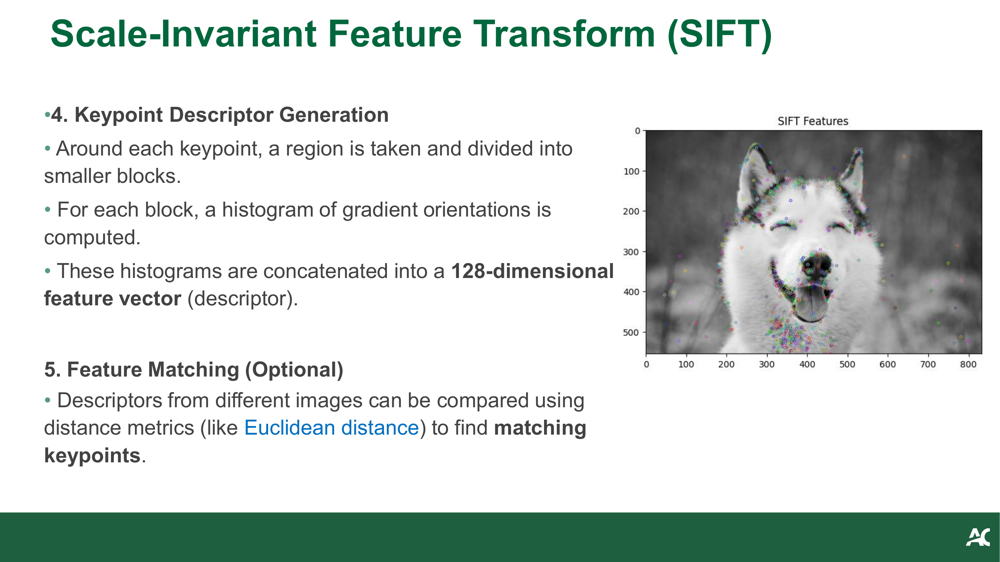

- **4. Keypoint Descriptor Generation** — **4. 关键点描述子生成**
  - Around each keypoint, a region is taken and divided into smaller blocks. — 在每个关键点周围取一个区域并分成更小的块。
  - For each block, a histogram of gradient orientations is computed. — 对每个块计算梯度方向的直方图。
  - These histograms are concatenated into a **128-dimensional feature vector** (descriptor). — 这些直方图拼接成**128维特征向量**（描述子）。
- **5. Feature Matching (Optional)** — **5. 特征匹配（可选）**
  - Descriptors from different images can be compared using distance metrics (like **Euclidean distance**) to find **matching keypoints**. — 不同图像的描述子可以使用距离度量（如**欧氏距离**）进行比较以找到**匹配的关键点**。

---

## 8. 加速稳健特征 (Speeded Up Robust Features — SURF)

### 8.1 SURF简介与优势 (SURF Introduction and Advantages)

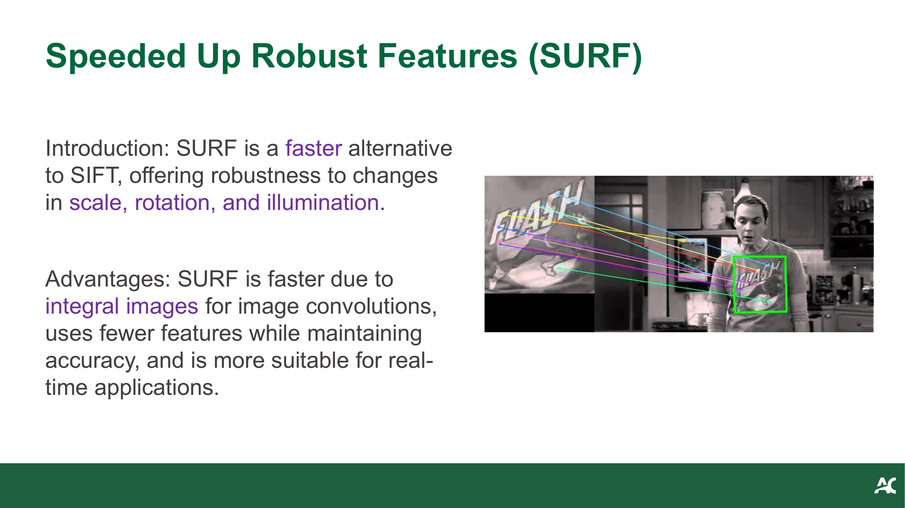

**SURF introduction slide (title: "Speeded Up Robust Features (SURF)"):** Left side contains two text blocks: the first introduces SURF as a faster alternative to SIFT with robustness to changes in scale, rotation, and illumination (keywords "faster", "scale, rotation, and illumination" in purple); the second describes advantages — SURF is faster due to "integral images" (in purple) for image convolutions, uses fewer features while maintaining accuracy, and is more suitable for real-time applications. Right side shows a grayscale feature matching example: two frames of a person (from a TV show), with colorful lines (cyan, yellow, magenta, green) connecting matched keypoints between the two images; a green rectangle highlights the matched region in the right frame.

**SURF介绍页（标题："Speeded Up Robust Features (SURF)"）：** 左侧包含两个文字块：第一个介绍SURF是SIFT的更快替代品，对缩放、旋转和光照变化具有鲁棒性（关键词"faster"、"scale, rotation, and illumination"为紫色）；第二个描述优势 — SURF由于使用"积分图像"（紫色）进行图像卷积而更快，使用更少特征同时保持精度，更适合实时应用。右侧展示灰度特征匹配示例：一个人物（电视节目）的两帧画面，彩色线条（青色、黄色、品红、绿色）连接两幅图之间的匹配关键点；右帧中绿色矩形框高亮显示匹配区域。

- Introduction: SURF is a **faster** alternative to SIFT, offering robustness to changes in **scale, rotation, and illumination**. — 介绍：SURF是SIFT的**更快**替代品，对**缩放、旋转和光照**变化具有鲁棒性。
- Advantages: SURF is faster due to **integral images** for image convolutions, uses fewer features while maintaining accuracy, and is more suitable for real-time applications. — 优势：SURF由于使用**积分图像**进行图像卷积而更快，使用更少特征同时保持精度，更适合实时应用。

### 8.2 步骤1-2：兴趣点检测与尺度空间 (Steps 1-2: Interest Point Detection and Scale-space)

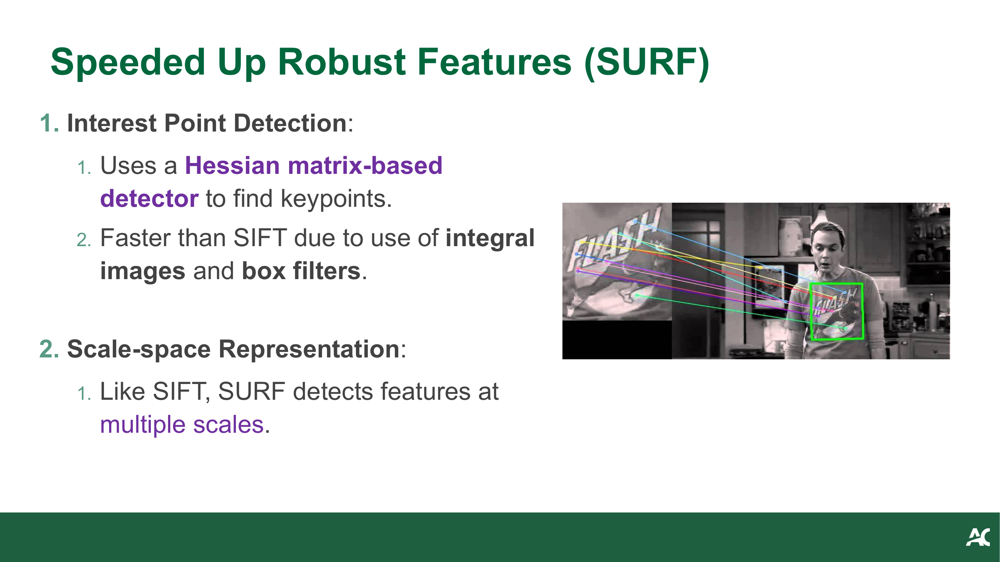

**SURF steps 1-2 slide (title: "Speeded Up Robust Features (SURF)"):** Shows two numbered steps in green. Step "1. Interest Point Detection": sub-point 1 states it uses a **Hessian matrix-based detector** (in purple bold) to find keypoints; sub-point 2 states it is faster than SIFT due to use of **integral images** and **box filters** (both in bold). Step "2. Scale-space Representation": sub-point 1 states like SIFT, SURF detects features at **multiple scales** (in purple). Right side shows the same grayscale feature matching image from Page 18.

**SURF步骤1-2页（标题："Speeded Up Robust Features (SURF)"）：** 展示两个绿色编号步骤。步骤"1. Interest Point Detection"：子点1说明使用**基于Hessian矩阵的检测器**（紫色加粗）查找关键点；子点2说明由于使用**积分图像**和**盒式滤波器**（均为加粗）而比SIFT更快。步骤"2. Scale-space Representation"：子点1说明类似SIFT，SURF在**多个尺度**（紫色）检测特征。右侧展示与Page 18相同的灰度特征匹配图。

- **1. Interest Point Detection:** Uses a **Hessian matrix-based detector** to find keypoints. Faster than SIFT due to use of **integral images** and **box filters**. — **1. 兴趣点检测：** 使用**基于Hessian矩阵的检测器**查找关键点。由于使用**积分图像**和**盒式滤波器**而比SIFT更快。
- **2. Scale-space Representation:** Like SIFT, SURF detects features at **multiple scales**. — **2. 尺度空间表示：** 类似SIFT，SURF在**多个尺度**检测特征。

### 8.3 步骤3-4：方向分配与描述子生成 (Steps 3-4: Orientation and Descriptor Generation)

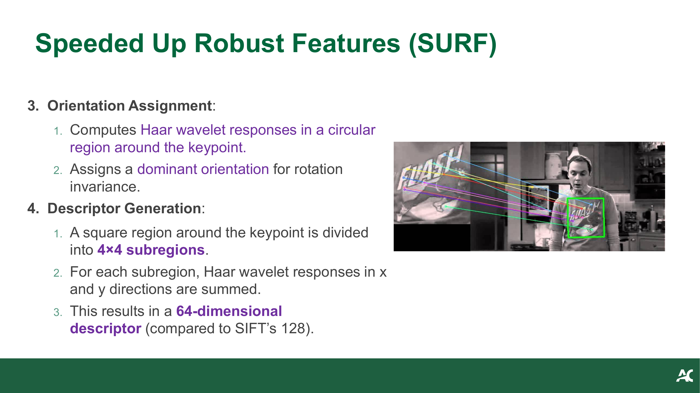

**SURF steps 3-4 slide (title: "Speeded Up Robust Features (SURF)"):** Continues with two more numbered steps in green. Step "3. Orientation Assignment": sub-point 1 states it computes Haar wavelet responses in a circular region around the keypoint (in purple); sub-point 2 states it assigns a dominant orientation (in purple) for rotation invariance. Step "4. Descriptor Generation": sub-point 1 states a square region around the keypoint is divided into **4×4 subregions** (in purple bold); sub-point 2 states for each subregion, Haar wavelet responses in x and y directions are summed; sub-point 3 states this results in a **64-dimensional descriptor** (in purple bold, compared to SIFT's 128). Right side shows the same feature matching image.

**SURF步骤3-4页（标题："Speeded Up Robust Features (SURF)"）：** 继续展示两个绿色编号步骤。步骤"3. Orientation Assignment"：子点1说明在关键点周围的圆形区域计算Haar小波响应（紫色）；子点2说明分配主方向（紫色）以实现旋转不变性。步骤"4. Descriptor Generation"：子点1说明关键点周围的方形区域被分成**4×4子区域**（紫色加粗）；子点2说明对每个子区域，x和y方向的Haar小波响应求和；子点3说明结果为**64维描述子**（紫色加粗，对比SIFT的128）。右侧展示相同的特征匹配图。

- **3. Orientation Assignment:** Computes Haar wavelet responses in a circular region around the keypoint. Assigns a dominant orientation for rotation invariance. — **3. 方向分配：** 在关键点周围的圆形区域计算Haar小波响应。分配主方向以实现旋转不变性。
- **4. Descriptor Generation:** A square region around the keypoint is divided into **4×4 subregions**. For each subregion, Haar wavelet responses in x and y directions are summed. This results in a **64-dimensional descriptor** (compared to SIFT's 128). — **4. 描述子生成：** 关键点周围的方形区域被分成**4×4子区域**。对每个子区域，x和y方向的Haar小波响应求和。结果为**64维描述子**（对比SIFT的128维）。

---

## 9. 高级特征检测技术 (Advanced Feature Detection — ORB)

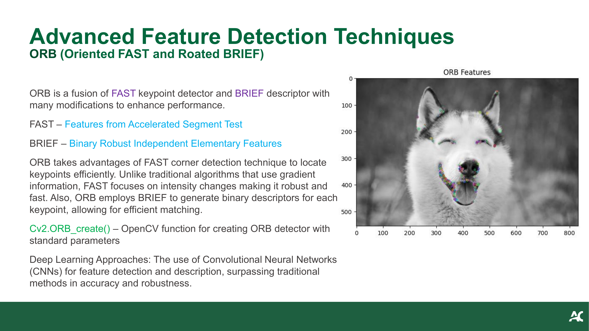

- ORB is a fusion of **FAST** keypoint detector and **BRIEF** descriptor with many modifications to enhance performance. — ORB是**FAST**关键点检测器和**BRIEF**描述子的融合，有许多修改以增强性能。
- **FAST** – Features from Accelerated Segment Test — **FAST** – 加速分段测试特征
- **BRIEF** – Binary Robust Independent Elementary Features — **BRIEF** – 二进制稳健独立基本特征
- ORB takes advantages of FAST corner detection technique to locate keypoints efficiently. Unlike traditional algorithms that use gradient information, FAST focuses on intensity changes making it robust and fast. Also, ORB employs BRIEF to generate binary descriptors for each keypoint, allowing for efficient matching. — ORB利用FAST角点检测技术高效定位关键点。不同于使用梯度信息的传统算法，FAST关注强度变化使其鲁棒且快速。同时，ORB使用BRIEF为每个关键点生成二进制描述子，实现高效匹配。
- `Cv2.ORB_create()` – OpenCV function for creating ORB detector with standard parameters — `Cv2.ORB_create()` – 创建带标准参数的ORB检测器的OpenCV函数
- **Deep Learning Approaches**: The use of Convolutional Neural Networks (CNNs) for feature detection and description, surpassing traditional methods in accuracy and robustness. — **深度学习方法**：使用卷积神经网络（CNN）进行特征检测和描述，在精度和鲁棒性上超越传统方法。

---

## 10. 特征描述与HOG (Feature Descriptors & HOG)

### 10.1 特征描述子定义与HOG (Feature Descriptor Definition and HOG)

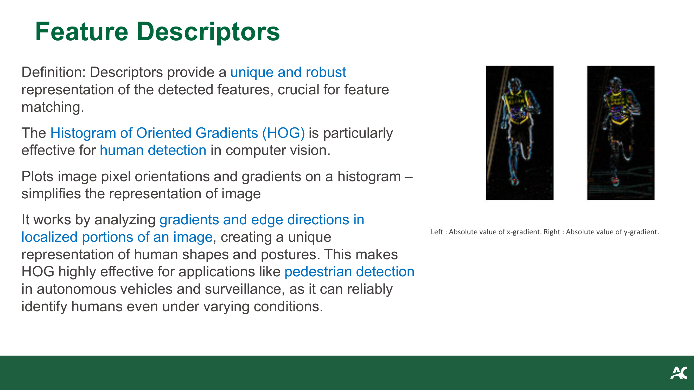

- Definition: Descriptors provide a **unique and robust** representation of the detected features, crucial for feature matching. — 定义：**描述子**为被检测到的特征生成**独特且鲁棒的**表示形式，是实现特征匹配的关键。
- The **Histogram of Oriented Gradients (HOG)** is particularly effective for **human detection** in computer vision. — **方向梯度直方图（HOG）**在计算机视觉中对**人体检测**特别有效。
- Plots image pixel orientations and gradients on a histogram – simplifies the representation of image — 在直方图上绘制图像像素方向和梯度 – 简化图像的表示
- It works by analyzing **gradients and edge directions in localized portions of an image**, creating a unique representation of human shapes and postures. This makes HOG highly effective for applications like **pedestrian detection** in autonomous vehicles and surveillance, as it can reliably identify humans even under varying conditions. — 通过分析**图像局部区域中的梯度和边缘方向**，创建人体形状和姿态的唯一表示。这使HOG对自动驾驶和监控中的**行人检测**等应用非常有效，因为它可以在各种条件下可靠地识别人类。

### 10.2 梯度计算示例 (Gradient Calculation Example)

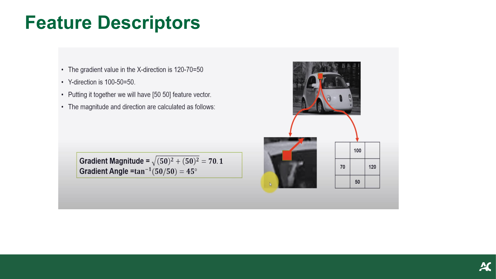

- The gradient value in the X-direction is 120-70=50 — X方向的梯度值为120-70=50
- Y-direction is 100-50=50. — Y方向为100-50=50。
- Putting it together we will have [50 50] feature vector. — 将它们组合在一起，我们将得到[50 50]特征向量。
- The magnitude and direction are calculated as follows: — 幅值和方向的计算如下：
  - Gradient Magnitude = √(50)²+(50)² = **70.1** — 梯度幅值 = √(50)²+(50)² = **70.1**
  - Gradient Angle = tan⁻¹(50/50) = **45°** — 梯度角度 = tan⁻¹(50/50) = **45°**

---

## 11. 特征匹配与应用 (Feature Matching and Applications)

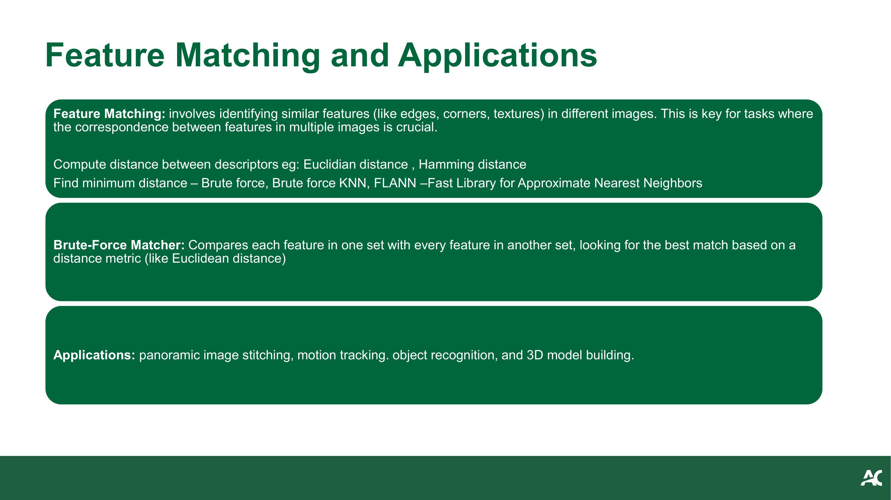

- **Feature Matching:** involves identifying similar features (like edges, corners, textures) in different images. This is key for tasks where the correspondence between features in multiple images is crucial. — **特征匹配：**涉及在不同图像中识别相似特征（如边缘、角点、纹理）。这对于多幅图像中特征对应关系至关重要的任务是关键的。
- Compute distance between descriptors eg: **Euclidian distance**, **Hamming distance** — 计算描述子之间的距离，如：**欧氏距离**、**汉明距离**
- Find minimum distance – **Brute force**, **Brute force KNN**, **FLANN** – Fast Library for Approximate Nearest Neighbors — 寻找最小距离 – **暴力匹配**、**暴力KNN**、**FLANN** – 快速近似最近邻库
- **Brute-Force Matcher:** Compares each feature in one set with every feature in another set, looking for the best match based on a distance metric (like Euclidean distance) — **暴力匹配器：**将一组中的每个特征与另一组中的每个特征进行比较，基于距离度量（如欧氏距离）寻找最佳匹配
- **Applications:** panoramic image stitching, motion tracking, object recognition, and 3D model building. — **应用：**全景图像拼接、运动跟踪、目标识别和三维模型构建。

---

## 12. 特征检测中的机器学习 (Machine Learning in Feature Detection)

### 12.1 机器学习类型 (Machine Learning Types)

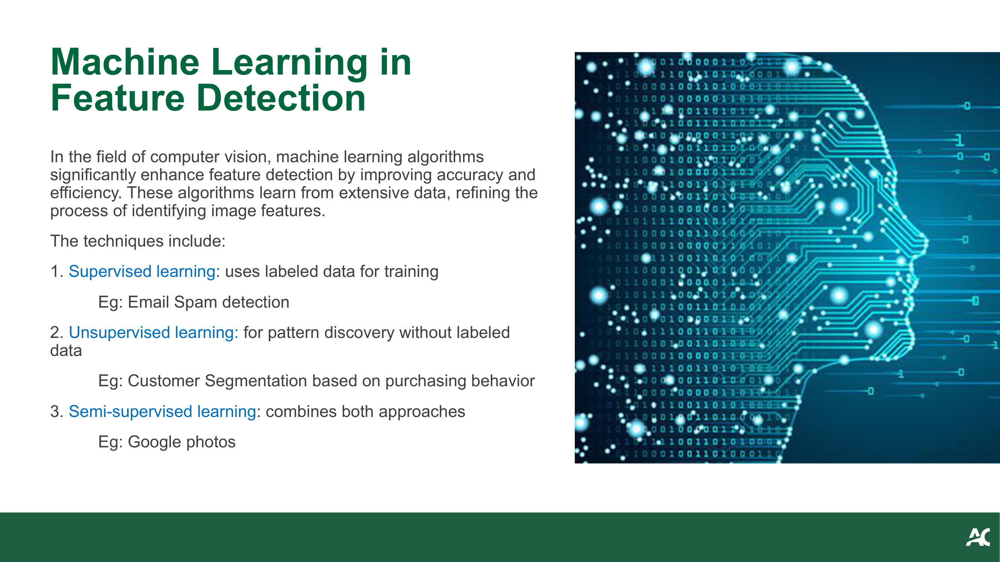

- In the field of computer vision, machine learning algorithms significantly enhance feature detection by improving accuracy and efficiency. These algorithms learn from extensive data, refining the process of identifying image features. — 在计算机视觉领域，机器学习算法通过提高准确性和效率显著增强特征检测。这些算法从大量数据中学习，精化识别图像特征的过程。
- **Supervised learning**: uses labeled data for training. Eg: Email Spam detection — **监督学习**：使用标注数据进行训练。例：垃圾邮件检测
- **Unsupervised learning**: for pattern discovery without labeled data. Eg: Customer Segmentation based on purchasing behavior — **无监督学习**：用于无标注数据的模式发现。例：基于购买行为的客户分群
- **Semi-supervised learning**: combines both approaches. Eg: Google photos — **半监督学习**：结合两种方法。例：Google相册

### 12.2 实时特征检测 (Real-Time Feature Detection)

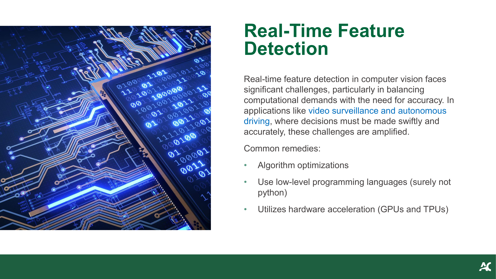

- Real-time feature detection in computer vision faces significant challenges, particularly in balancing computational demands with the need for accuracy. In applications like **video surveillance and autonomous driving**, where decisions must be made swiftly and accurately, these challenges are amplified. — 计算机视觉中的实时特征检测面临重大挑战，特别是在平衡计算需求和精度需求方面。在**视频监控和自动驾驶**等需要迅速准确做出决策的应用中，这些挑战被放大。
- Common remedies: Algorithm optimizations; Use low-level programming languages (surely not python); Utilizes hardware acceleration (**GPUs and TPUs**) — 常见解决方案：算法优化；使用底层编程语言（肯定不是python）；利用硬件加速（**GPU和TPU**）

---

## 13. 特征检测未来趋势 (Future Trends in Feature Detection)

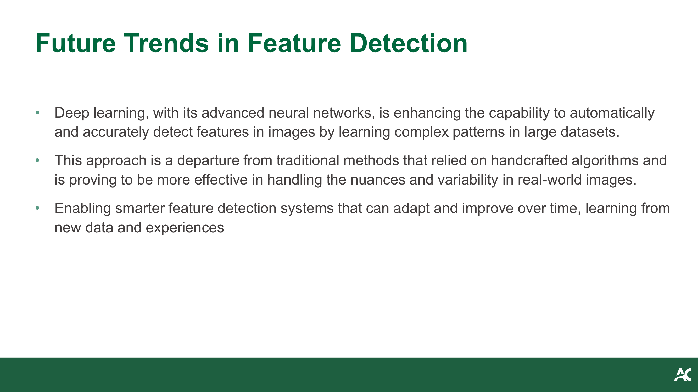

- Deep learning, with its advanced neural networks, is enhancing the capability to automatically and accurately detect features in images by learning complex patterns in large datasets. — 深度学习凭借其先进的神经网络，通过学习大型数据集中的复杂模式，增强了自动准确检测图像特征的能力。
- This approach is a departure from traditional methods that relied on **handcrafted algorithms** and is proving to be more effective in handling the nuances and variability in real-world images. — 这种方法是对依赖**手工算法**的传统方法的转变，在处理现实图像的细微差异和多样性方面证明更有效。
- Enabling smarter feature detection systems that can adapt and improve over time, learning from new data and experiences — 实现更智能的特征检测系统，能够随时间适应和改进，从新数据和经验中学习

---

## 14. 下周预告 (Next Week Preview)

- Next week: **Introduction to CNN**, Architecture of CNN, How CNN resolves common computer vision problems — 下周：**CNN简介**、CNN架构、CNN如何解决常见计算机视觉问题

---
