# Week 4: 卷积神经网络简介 (Introduction to Convolutional Neural Networks)

> Source: `Week 4 - Introduction to Convolutional Neural Networks (CNNs)1.pptx`
> Total slides: 37
> Instructor: Stephin Rachel Thomas | Feb 05, 2026

---

## 1. 人工神经网络与图像分类 (Artificial Neural Networks & Image Classification)

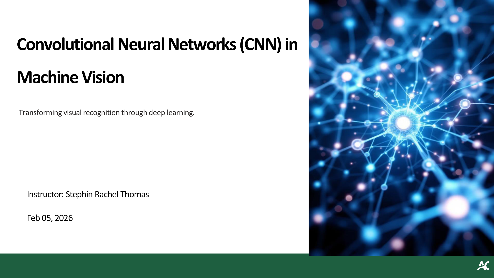

**Title slide:** Dark gradient background with "Convolutional Neural Networks (CNN) in Machine Vision" in large white text. Subtitle reads "Transforming visual recognition through deep learning." Bottom: Instructor name and date. Decorative AI-themed imagery on right side.

**标题页：** 深色渐变背景，大号白色文字"Convolutional Neural Networks (CNN) in Machine Vision"。副标题"Transforming visual recognition through deep learning." 底部显示讲师姓名和日期。右侧有AI主题装饰图。

- **Convolutional Neural Networks (CNN) in Machine Vision** — 通过深度学习变革视觉识别
- Transforming visual recognition through deep learning.

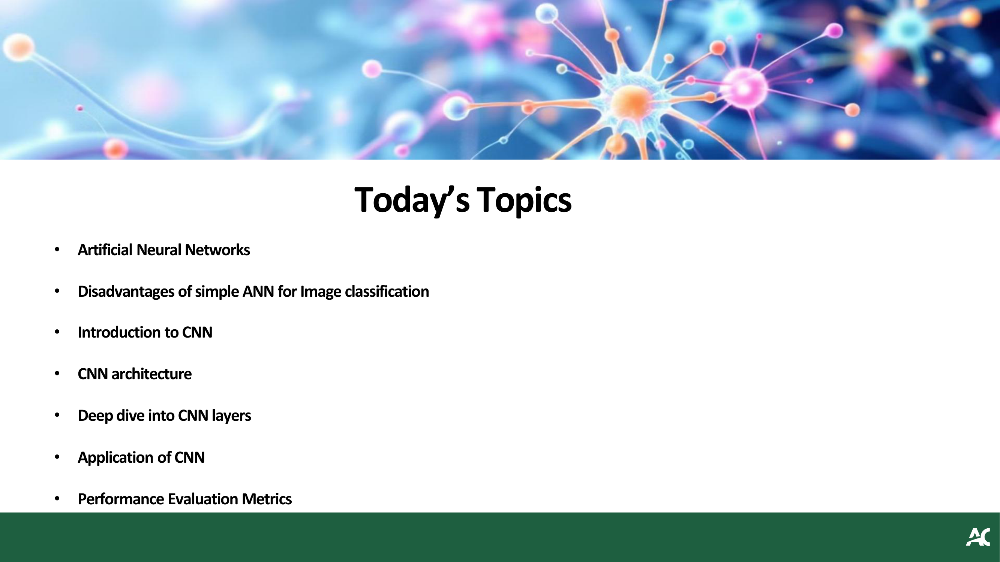

**Agenda slide:** "Today's Topics" as header. Seven bullet items listed vertically on left side, each with a green bullet point. Right side shows a decorative image of a layered neural network visualization.

**议程页：** 标题"Today's Topics"。左侧纵向列出七个要点，每个前有绿色圆点。右侧展示一张分层神经网络的装饰性可视化图片。

**Today's Topics:**

- Artificial Neural Networks — 人工神经网络
- Disadvantages of simple ANN for Image classification — 简单ANN用于图像分类的缺点
- Introduction to CNN — CNN简介
- CNN architecture — CNN架构
- Deep dive into CNN layers — 深入CNN各层
- Application of CNN — CNN的应用
- Performance Evaluation Metrics — 性能评估指标

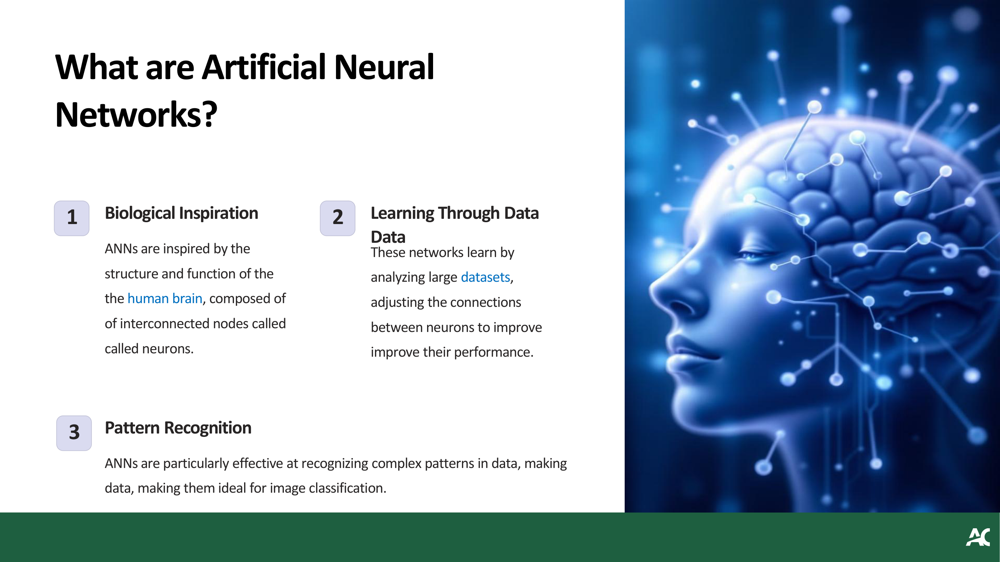

**ANN overview slide:** Title "What are Artificial Neural Networks?" Three numbered green-boxed items: (1) Biological Inspiration — brain icon with neuron illustration, (2) Learning Through Data — chart/data icon, (3) Pattern Recognition — spanning the bottom. Each box contains a brief description.

**ANN概述页：** 标题"What are Artificial Neural Networks?" 三个绿色编号方框：(1) Biological Inspiration — 大脑图标与神经元插图，(2) Learning Through Data — 图表/数据图标，(3) Pattern Recognition — 横跨底部。每个方框包含简要描述。

**What are Artificial Neural Networks?** — **什么是人工神经网络？**

1. **Biological Inspiration** — ANNs are inspired by the structure and function of the human brain, composed of interconnected nodes called neurons. — **生物启发** — ANN受人脑结构和功能的启发，由称为神经元的互连节点组成。
2. **Learning Through Data** — These networks learn by analyzing large datasets, adjusting the connections between neurons to improve their performance. — **通过数据学习** — 这些网络通过分析大型数据集来学习，调整神经元之间的连接以提高性能。
3. **Pattern Recognition** — ANNs are particularly effective at recognizing complex patterns in data, making them ideal for image classification. — **模式识别** — ANN在识别数据中的复杂模式方面特别有效，使其成为图像分类的理想选择。

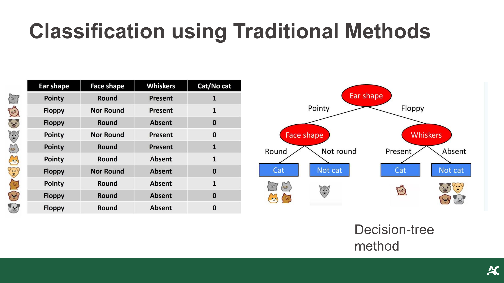

**Traditional classification slide:** Title "Classification using Traditional Methods". Shows a flowchart of a decision-tree method: input image → hand-crafted feature extraction → decision tree classifier → output class. Labeled "Decision-tree method" at bottom.

**传统分类页：** 标题"Classification using Traditional Methods"。展示决策树方法的流程图：输入图像 → 手工特征提取 → 决策树分类器 → 输出类别。底部标注"Decision-tree method"。

- **Classification using Traditional Methods** — 展示决策树方法的传统分类流程图
- Decision-tree method — 决策树方法

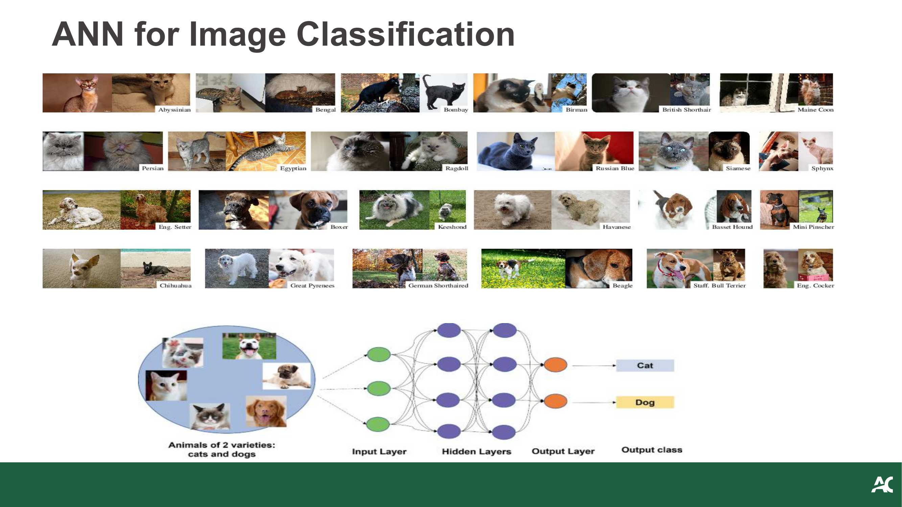

**ANN classification slide:** Title "ANN for Image Classification". Shows a neural network diagram: input layer (pixels from a cat/dog image fed as flattened vector), multiple hidden layers with interconnected nodes, output layer producing class labels. Arrows indicate forward pass direction.

**ANN分类页：** 标题"ANN for Image Classification"。展示神经网络结构图：输入层（猫/狗图像像素展平为向量），多个全连接隐藏层及节点互联，输出层输出类别标签。箭头指示前向传播方向。

- **ANN for Image Classification** — 展示用ANN对图像进行分类的流程：输入层接收像素、隐藏层提取特征、输出层给出类别

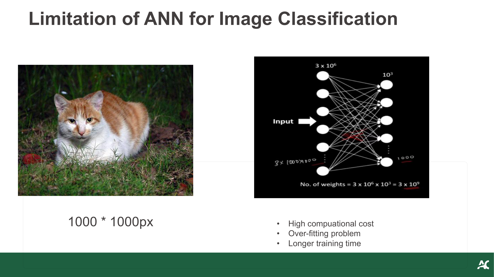

**ANN limitation slide:** Title "Limitation of ANN for Image Classification". Left side: large "1000 * 1000px" text with an image icon showing a high-resolution photo. Right side: three bullet points listing computational cost, over-fitting, and training time issues. Visual emphasizes the massive parameter count when flattening a 1000×1000 image.

**ANN局限性页：** 标题"Limitation of ANN for Image Classification"。左侧：大号"1000 * 1000px"文字及展示高分辨率照片的图标。右侧：三个要点列出计算成本、过拟合和训练时间问题。视觉强调将1000×1000图像展平后的巨大参数量。

**Limitation of ANN for Image Classification:** — **ANN用于图像分类的局限性：**

- 1000 * 1000px
- High computational cost — 高计算成本
- Over-fitting problem — 过拟合问题
- Longer training time — 训练时间更长

> **📝 Notes:**
>
> **📌 What:**
> **(1) Artificial Neural Network (ANN / 人工神经网络):**
>
> A computing model inspired by the biological brain, consisting of interconnected nodes (neurons) organized in layers — input, hidden, and output. Each connection has a learnable weight.
>
>> 受生物大脑启发的计算模型，由分层组织的互连节点（神经元）组成——输入层、隐藏层和输出层。每个连接有可学习的权重。
>>
>
> **(2) Traditional vs ANN classification (传统方法 vs ANN分类):**
>
> Traditional methods (e.g., decision trees) require **hand-crafted features** — humans decide what to measure (edges, colors, shapes). ANNs learn features **automatically** from raw data, eliminating the feature engineering bottleneck.
>
>> 传统方法（如决策树）需要**手工设计特征**——人类决定测量什么（边缘、颜色、形状）。ANN从原始数据**自动学习**特征，消除了特征工程瓶颈。
>>
>
> **🎯 Why:**
> Why can't plain ANN handle images well? A 1000×1000 RGB image has 3,000,000 input values. In a fully connected ANN, every input connects to every neuron in the first hidden layer — if that layer has 1000 neurons, that's **3 billion** weights just in layer 1. This causes: (1) enormous memory/compute cost, (2) massive overfitting risk because the model has far more parameters than needed, (3) slow training.
>
>> 为什么普通ANN处理不好图像？一张1000×1000 RGB图像有3,000,000个输入值。在全连接ANN中，每个输入连接到第一隐藏层的每个神经元——如果该层有1000个神经元，仅第一层就有**30亿**个权重。这导致：(1) 巨大的内存/计算开销，(2) 大量过拟合风险（参数远多于所需），(3) 训练速度慢。
>>
>
> **💡 Intuition:**
> Imagine reading a newspaper by cutting every word out and throwing them randomly on a table — you can still identify individual words, but all **spatial relationships** (which word is next to which, paragraph structure) are lost. That's what happens when you flatten a 2D image into a 1D vector for ANN: the pixel at (0,0) and (999,999) are treated as equally unrelated as pixel (0,0) and (0,1). ANN has no concept of "nearby pixels."
>
>> 想象把报纸上每个字剪下来随机撒在桌上——你还能认出单个字，但所有**空间关系**（哪个字在哪个旁边、段落结构）都丢失了。把2D图像展平为1D向量给ANN就是这样：像素(0,0)和(999,999)被当作与(0,0)和(0,1)一样无关。ANN没有"相邻像素"的概念。
>>
>
> **⚖️ Compare:**
> | Feature | Traditional Methods | ANN | CNN (next section) |
> |---|---|---|---|
> | Feature extraction | Manual (hand-crafted) | Automatic but loses spatial info | Automatic + spatial-aware |
> | Parameters for 1000×1000 | Depends on features | ~billions (fully connected) | ~thousands (weight sharing) |
> | Translation invariance | No | No | Yes (same filter scans everywhere) |
>
>> | 特性 | 传统方法 | ANN | CNN（下一节） |
>> |---|---|---|---|
>> | 特征提取 | 手动 | 自动但丢失空间信息 | 自动 + 保留空间感知 |
>> | 1000×1000参数量 | 取决于特征 | ~数十亿（全连接） | ~数千（权重共享） |
>> | 平移不变性 | 无 | 无 | 有（同一滤波器扫描各处） |
>>
>
> **⚠️ Pitfall:**
> (1) **"ANN can't do images"** is an oversimplification — ANN CAN classify small images (e.g., MNIST 28×28 = 784 pixels works fine). The limitation is for **high-resolution, real-world images** where parameter explosion is the issue.
> (2) **Overfitting ≠ underfitting.** ANN with too many parameters memorizes training images but generalizes poorly to new ones. The solution isn't just "add more data" — it's a fundamentally different architecture (CNN).
>
>> (1) **"ANN不能处理图像"**是过度简化——ANN可以分类小图像（如MNIST 28×28=784像素没问题）。局限性在于**高分辨率真实世界图像**的参数爆炸问题。
>> (2) **过拟合≠欠拟合。** 参数过多的ANN会记住训练图像但泛化性差。解决方案不只是"加数据"——而是需要根本不同的架构（CNN）。
>>
>
> **📝 Exam:**
> (1) **计算题 (Calculation):** "A 256×256 grayscale image is fed to a fully connected layer with 128 neurons. How many weights?" → 256×256×128 = 8,388,608 weights.
> (2) **对比题 (Comparison):** "List 3 limitations of ANN for image classification." → High computational cost, overfitting, longer training time.
> (3) **概念题 (Concept):** "Why does ANN lose spatial information?" → Flattening destroys 2D structure; all pixels are treated as independent features.
>
>> (1) **计算题：** "一张256×256灰度图像输入128个神经元的全连接层，有多少权重？" → 256×256×128 = 8,388,608个权重。
>> (2) **对比题：** "列出ANN用于图像分类的3个局限。" → 高计算成本、过拟合、训练时间长。
>> (3) **概念题：** "为什么ANN丢失空间信息？" → 展平破坏2D结构；所有像素被当作独立特征。
>>

---

## 2. CNN简介与架构 (Introduction to CNN & Architecture)

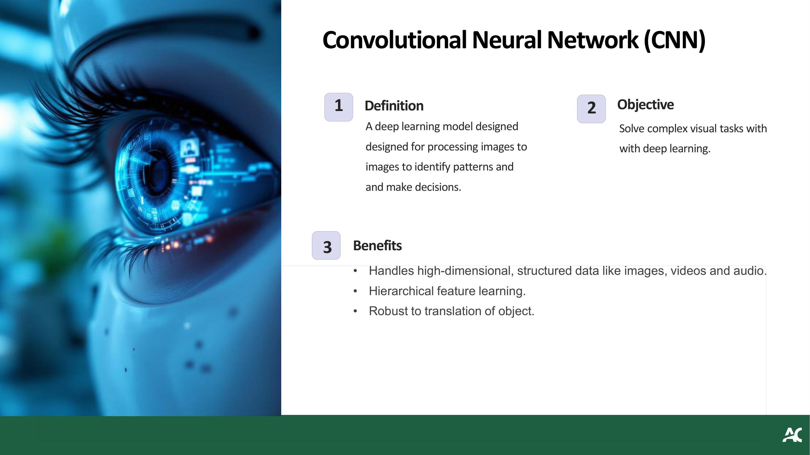

**CNN definition slide:** Title "Convolutional Neural Network (CNN)". Three numbered green sections: (1) Definition — deep learning model for images, (2) Objective — solve visual tasks, (3) Benefits — three bullet points. Background shows a stylized layered network graphic in green/teal tones.

**CNN定义页：** 标题"Convolutional Neural Network (CNN)"。三个绿色编号区域：(1) Definition — 用于图像的深度学习模型，(2) Objective — 解决视觉任务，(3) Benefits — 三个要点。背景展示绿色/青色调的风格化分层网络图。

**Convolutional Neural Network (CNN):** — **卷积神经网络（CNN）：**

1. **Definition** — A deep learning model designed for processing images to identify patterns and make decisions. — **定义** — 一种专为处理图像以识别模式和做出决定而设计的深度学习模型。
2. **Objective** — Solve complex visual tasks with deep learning. — **目标** — 用深度学习解决复杂的视觉任务。
3. **Benefits:** — **优势：**
   - Handles high-dimensional, structured data like images, videos and audio. — 处理图像、视频和音频等高维结构化数据。
   - Hierarchical feature learning. — 层次化特征学习。
   - Robust to translation of object. — 对物体平移具有鲁棒性。

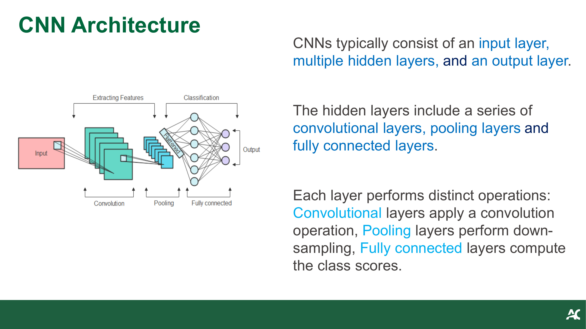

**CNN architecture slide:** Title "CNN Architecture". Left side: descriptive paragraph about input layer, hidden layers, and output layer. Right side: a detailed CNN architecture diagram showing the pipeline — input image → convolutional layers (multiple colored feature map stacks) → pooling layers (reduced stacks) → fully connected layers → output classification. Arrows connect each stage sequentially.

**CNN架构页：** 标题"CNN Architecture"。左侧：关于输入层、隐藏层和输出层的描述性段落。右侧：详细的CNN架构图展示完整流程——输入图像 → 卷积层（多组彩色特征图堆叠）→ 池化层（缩小的堆叠）→ 全连接层 → 输出分类。箭头依次连接每个阶段。

**CNN Architecture:** — **CNN架构：**

- CNNs typically consist of an input layer, multiple hidden layers, and an output layer. — CNN通常由输入层、多个隐藏层和输出层组成。
- The hidden layers include a series of convolutional layers, pooling layers and fully connected layers. — 隐藏层包括一系列卷积层、池化层和全连接层。
- Each layer performs distinct operations: Convolutional layers apply a convolution operation, Pooling layers perform down-sampling, Fully connected layers compute the class scores. — 每层执行不同的操作：卷积层执行卷积运算，池化层执行下采样，全连接层计算类别分数。

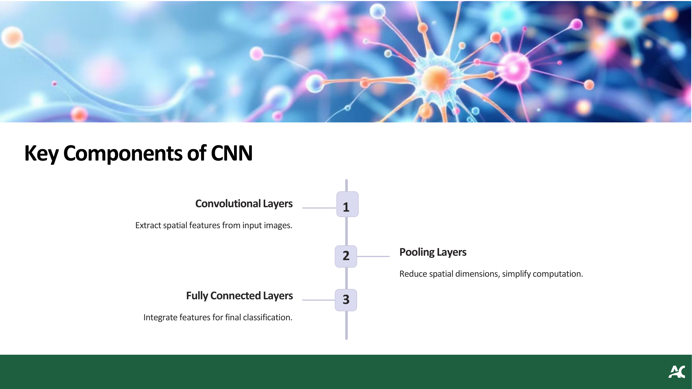

**Key components slide:** Title "Key Components of CNN". Three horizontal green cards: (1) "Convolutional Layers" — Extract spatial features from input images, (2) "Pooling Layers" — Reduce spatial dimensions, simplify computation, (3) "Fully Connected Layers" — Integrate features for final classification. Each card has an associated icon.

**关键组件页：** 标题"Key Components of CNN"。三个水平绿色卡片：(1) "Convolutional Layers" — 从输入图像提取空间特征，(2) "Pooling Layers" — 减少空间维度、简化计算，(3) "Fully Connected Layers" — 整合特征用于最终分类。每个卡片配有关联图标。

**Key Components of CNN:** — **CNN的关键组件：**

- **Convolutional Layers** — Extract spatial features from input images. — **卷积层** — 从输入图像中提取空间特征。
- **Pooling Layers** — Reduce spatial dimensions, simplify computation. — **池化层** — 减少空间维度，简化计算。
- **Fully Connected Layers** — Integrate features for final classification. — **全连接层** — 整合特征用于最终分类。

> **📝 Notes:**
>
> **📌 What:**
> **(1) CNN (卷积神经网络):**
>
> A specialized neural network that preserves and exploits the **spatial structure** of input data. Instead of connecting every input to every neuron (like ANN), CNN uses small **filters** that scan locally across the input, sharing the same weights everywhere.
>
>> 一种保留并利用输入数据**空间结构**的专用神经网络。与ANN将每个输入连接到每个神经元不同，CNN使用在输入上局部扫描的小**滤波器**，在各处共享相同权重。
>>
>
> **(2) Three-stage pipeline (三阶段流水线):**
>
> Input → **Feature Extraction** (conv layers extract what) → **Downsampling** (pooling layers shrink where) → **Classification** (FC layers decide which class).
>
>> 输入 → **特征提取**（卷积层提取"是什么"）→ **下采样**（池化层缩小"在哪里"）→ **分类**（全连接层决定"哪个类别"）。
>>
>
> **🎯 Why:**
> CNN solves ANN's three problems simultaneously through two key innovations: (1) **Local connectivity** — each neuron only looks at a small patch (e.g., 3×3), not the entire image. This drastically reduces the number of connections. (2) **Weight sharing** — the same 3×3 filter is reused across all positions in the image. A 3×3 filter has only 9 parameters regardless of image size. This is why CNN can handle 1000×1000 images with just thousands of parameters instead of billions.
>
>> CNN通过两个关键创新同时解决ANN的三个问题：(1) **局部连接**——每个神经元只看一个小区域（如3×3），而非整张图像，大幅减少连接数。(2) **权重共享**——同一个3×3滤波器在图像所有位置重复使用。一个3×3滤波器无论图像多大都只有9个参数。这就是CNN用数千个参数（而非数十亿）就能处理1000×1000图像的原因。
>>
>
> **💡 Intuition:**
> Think of CNN as a **security guard with a flashlight** inspecting a dark warehouse. ANN = turning on ALL lights at once (expensive, overwhelming). CNN = shining a small flashlight (3×3 filter) systematically across the warehouse, looking for suspicious patterns. The flashlight (filter) is the same everywhere — if it spots a crack in one corner, it can also spot the same crack in any other corner. This is **translation invariance**.
>
>> 把CNN想象成一个拿着**手电筒的保安**在黑暗仓库巡检。ANN = 一次性打开所有灯（昂贵、信息过载）。CNN = 用一个小手电（3×3滤波器）系统地照遍仓库，寻找可疑模式。手电（滤波器）到处都一样——如果在一个角落发现裂缝，在任何其他角落也能发现同样的裂缝。这就是**平移不变性**。
>>
>
> **⚖️ Compare:**
> | Aspect | ANN (Fully Connected) | CNN |
> |---|---|---|
> | Connection | Every neuron ↔ every input | Each neuron ↔ local patch only |
> | Parameters | O(input_size × neurons) | O(filter_size² × num_filters) |
> | Spatial awareness | None (flattened input) | Yes (2D filters preserve layout) |
> | Weight sharing | No | Yes (same filter reused) |
> | Best for | Tabular data, small vectors | Images, video, audio |
>
>> | 方面 | ANN（全连接） | CNN |
>> |---|---|---|
>> | 连接方式 | 每个神经元↔每个输入 | 每个神经元↔局部区域 |
>> | 参数量 | O(输入大小×神经元数) | O(滤波器大小²×滤波器数) |
>> | 空间感知 | 无（展平输入） | 有（2D滤波器保留布局） |
>> | 权重共享 | 无 | 有（同一滤波器复用） |
>> | 适用场景 | 表格数据、小向量 | 图像、视频、音频 |
>>
>
> **⚠️ Pitfall:**
> (1) **"Hierarchical feature learning"** doesn't mean each layer learns a completely different thing independently. Layer 1 detects edges → Layer 2 combines edges into textures → Layer 3 combines textures into parts → etc. Each layer **builds on** the previous one.
> (2) **"Robust to translation"** means a cat in the top-left and a cat in the bottom-right both activate the same cat-detecting filter. It does NOT mean CNN is robust to rotation or scaling — those require data augmentation or special architectures.
>
>> (1) **"层次化特征学习"**不意味着每层独立学习完全不同的东西。第1层检测边缘 → 第2层组合边缘为纹理 → 第3层组合纹理为部件 → 等等。每层**基于**前一层构建。
>> (2) **"对平移鲁棒"**意味着左上角的猫和右下角的猫都激活同一个猫检测滤波器。但这不意味着CNN对旋转或缩放鲁棒——那些需要数据增强或特殊架构。
>>
>
> **📝 Exam:**
> (1) **定义题 (Definition):** "What are the three main types of layers in a CNN?" → Convolutional, Pooling, Fully Connected.
> (2) **概念题 (Concept):** "What is weight sharing and why is it important?" → The same filter weights are used across all spatial positions, dramatically reducing parameter count.
> (3) **对比题 (Comparison):** "Compare how ANN and CNN process a 100×100 image."
>
>> (1) **定义题：** "CNN的三种主要层类型？" → 卷积层、池化层、全连接层。
>> (2) **概念题：** "什么是权重共享，为什么重要？" → 同一组滤波器权重在所有空间位置复用，大幅减少参数量。
>> (3) **对比题：** "比较ANN和CNN如何处理100×100图像。"
>>

---

## 3. 卷积层详解 (Convolutional Layers Deep Dive)

### 3.1 卷积层原理 (Convolutional Layer Fundamentals)

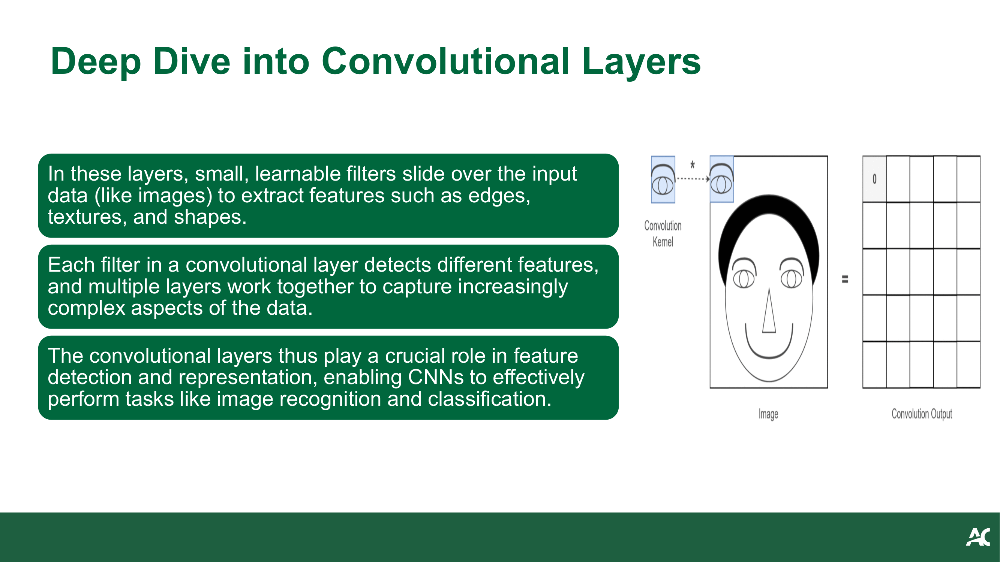

**Convolutional layer overview slide:** Title "Deep Dive into Convolutional Layers". Left side: three paragraph descriptions about learnable filters, feature detection, and role in recognition. Right side: a visualization of a CNN processing an input image through multiple convolutional layers, showing feature maps becoming more abstract at each stage — from edges in early layers to complex patterns in deeper layers.

**卷积层概述页：** 标题"Deep Dive into Convolutional Layers"。左侧：三段描述，关于可学习滤波器、特征检测和在识别中的作用。右侧：CNN处理输入图像经过多个卷积层的可视化，展示特征图在每个阶段变得更加抽象——从早期层的边缘到深层的复杂模式。

**Deep Dive into Convolutional Layers:** — **深入卷积层：**

- In these layers, small, learnable filters slide over the input data (like images) to extract features such as edges, textures, and shapes. — 在这些层中，小的可学习滤波器在输入数据（如图像）上滑动，提取边缘、纹理和形状等特征。
- Each filter in a convolutional layer detects different features, and multiple layers work together to capture increasingly complex aspects of the data. — 卷积层中的每个滤波器检测不同的特征，多个层协同工作以捕获数据中越来越复杂的方面。
- The convolutional layers thus play a crucial role in feature detection and representation, enabling CNNs to effectively perform tasks like image recognition and classification. — 因此卷积层在特征检测和表示中起着关键作用，使CNN能够有效执行图像识别和分类等任务。

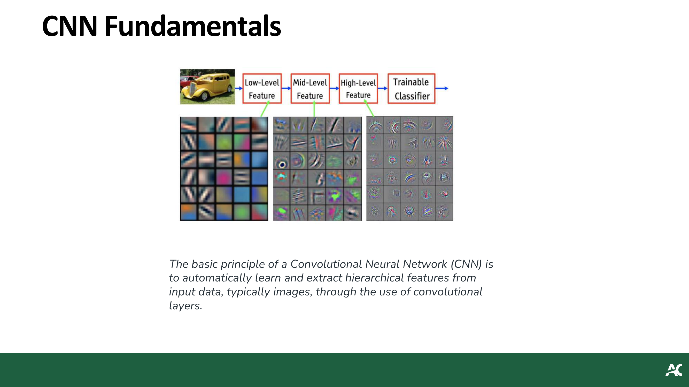

**CNN fundamentals slide:** Title "CNN Fundamentals". Contains a paragraph about the basic principle of CNN: automatically learning and extracting hierarchical features. Below the text: a diagram showing the feature hierarchy — Layer 1 learns simple edges/lines → Layer 2 combines into textures/corners → Layer 3 detects object parts → Final layers recognize full objects.

**CNN基础页：** 标题"CNN Fundamentals"。包含关于CNN基本原理的段落：自动学习和提取分层特征。文字下方：展示特征层次结构的图——第1层学习简单边缘/线条 → 第2层组合为纹理/角 → 第3层检测物体部件 → 最终层识别完整物体。

**CNN Fundamentals:** — **CNN基础：**

- The basic principle of a Convolutional Neural Network (CNN) is to automatically learn and extract hierarchical features from input data, typically images, through the use of convolutional layers. — 卷积神经网络（CNN）的基本原理是通过使用卷积层，从输入数据（通常是图像）中自动学习和提取分层特征。

### 3.2 特征图与卷积运算 (Feature Maps & Convolution Operation)

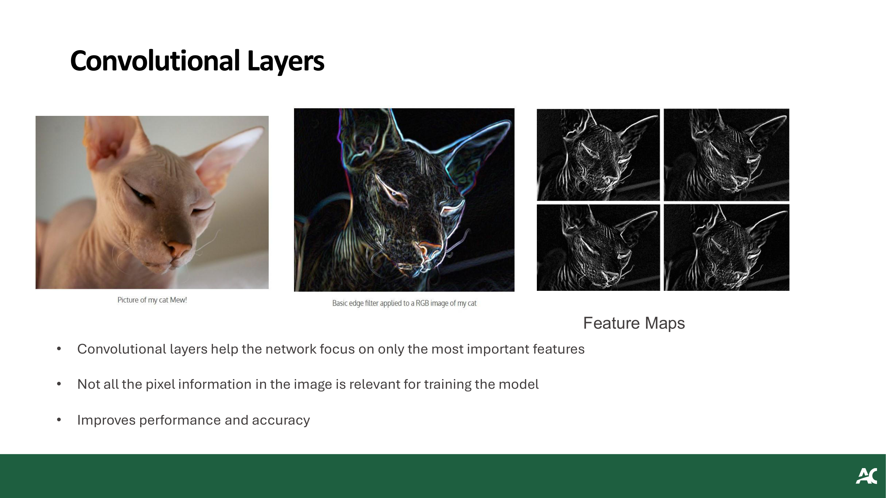

**Feature maps slide:** Title "Convolutional Layers — Feature Maps". Left side: three bullet points about focusing on important features, irrelevant pixel info, and performance improvement. Right side: a visualization showing an input image being processed by multiple filters, each producing a different feature map — one highlighting horizontal edges, another vertical edges, another textures. The output feature maps are stacked.

**特征图页：** 标题"Convolutional Layers — Feature Maps"。左侧：三个要点——聚焦重要特征、无关像素信息、提升性能。右侧：可视化展示输入图像经多个滤波器处理，每个产生不同特征图——一个高亮水平边缘、一个垂直边缘、一个纹理。输出特征图堆叠显示。

**Convolutional Layers — Feature Maps:** — **卷积层 — 特征图：**

- Convolutional layers help the network focus on only the most important features — 卷积层帮助网络只关注最重要的特征
- Not all the pixel information in the image is relevant for training the model — 图像中并非所有像素信息都与训练模型相关
- Improves performance and accuracy — 提高性能和准确度

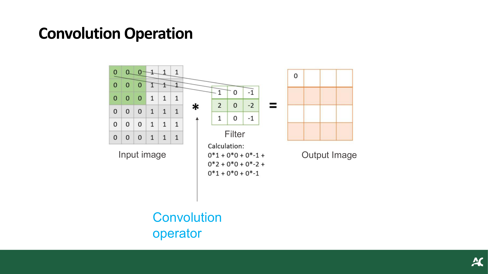

**Convolution operation overview slide:** Title "Convolution Operation". Diagram shows three elements in a row: "Input image" (a grid/matrix) → "Filter" (smaller grid labeled "Convolution operator" with an arrow) → "Output Image" (resulting grid). Arrows indicate the convolution operator transforms the input through the filter to produce the output.

**卷积运算概述页：** 标题"Convolution Operation"。图示横向三个元素："Input image"（一个网格/矩阵）→ "Filter"（较小网格，标注"Convolution operator"，带箭头）→ "Output Image"（结果网格）。箭头表示卷积算子通过滤波器将输入转换为输出。

- **Convolution Operation** — 展示卷积运算过程：输入图像通过滤波器（卷积算子）生成输出图像

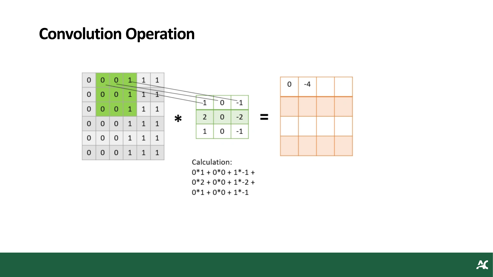

**Step-by-step convolution slide:** Title "Convolution Operation". Shows a detailed worked example: a 5×5 input matrix with numerical values (e.g., 1s and 0s) and a 3×3 filter/kernel (e.g., values 1,0,1 / 0,1,0 / 1,0,1). The filter is positioned at the top-left of the input. Element-wise multiplication and summation are shown, producing one output value. The resulting 3×3 output matrix is partially filled, demonstrating where subsequent filter positions will fill in.

**逐步卷积运算页：** 标题"Convolution Operation"。展示详细示例：一个5×5输入矩阵（含数值如1和0）和一个3×3滤波器/核（如值1,0,1 / 0,1,0 / 1,0,1）。滤波器放在输入左上角位置。展示逐元素乘法和求和，产生一个输出值。3×3输出矩阵部分填充，展示后续滤波器位置将填入的内容。

- **Convolution Operation** — 展示5×5输入矩阵与3×3滤波器执行卷积运算的详细步骤，逐步填充输出矩阵

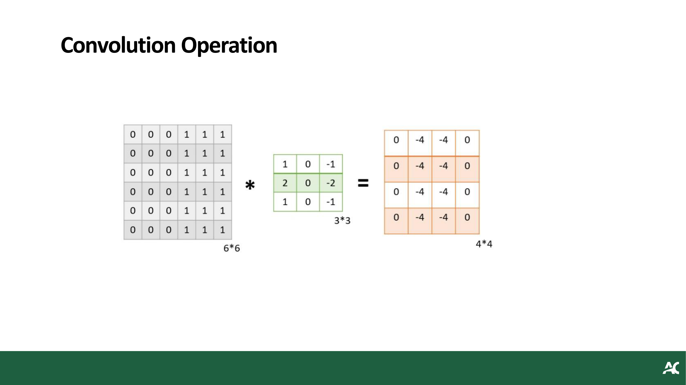

**Stride demonstration slide:** Title "Convolution Operation". Shows the same 5×5 input and 3×3 filter, but now demonstrating stride: the filter moves 2 positions at a time instead of 1. Two highlighted positions of the filter on the input are shown (position 1 at top-left, position 2 shifted right by 2). The resulting output is smaller (2×2 instead of 3×3), illustrating how larger stride reduces output size.

**步幅演示页：** 标题"Convolution Operation"。展示相同的5×5输入和3×3滤波器，但演示步幅：滤波器每次移动2个位置而非1个。输入上展示滤波器的两个高亮位置（位置1在左上、位置2右移2格）。输出更小（2×2而非3×3），说明较大步幅如何减小输出尺寸。

- **Convolution Operation** — 展示步幅（Stride）在卷积运算中的作用：滤波器以指定步长在输入上滑动

### 3.3 滤波器尺寸、步幅与填充 (Filter Size, Stride & Padding)

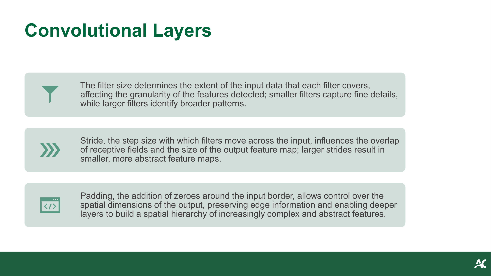

**Hyperparameters slide:** Title "Convolutional Layers". Three paragraphs explaining the three key hyperparameters: (1) Filter size — smaller captures fine details, larger captures broader patterns. (2) Stride — step size, larger = smaller output. (3) Padding — adding zeroes around the border to preserve spatial dimensions. Right side: visual examples showing the effect of each parameter on the output.

**超参数页：** 标题"Convolutional Layers"。三段文字解释三个关键超参数：(1) Filter size — 越小捕获越细节、越大捕获越宏观的模式。(2) Stride — 步长，越大输出越小。(3) Padding — 在边界周围添加零以保留空间维度。右侧：每个参数对输出影响的可视化示例。

**Convolutional Layers — Key Hyperparameters:** — **卷积层 — 关键超参数：**

- The **filter size** determines the extent of the input data that each filter covers, affecting the granularity of the features detected; smaller filters capture fine details, while larger filters identify broader patterns. — **滤波器大小**决定每个滤波器覆盖输入数据的范围，影响检测到的特征粒度；较小的滤波器捕获精细细节，较大的滤波器识别更宏观的模式。
- **Stride**, the step size with which filters move across the input, influences the overlap of receptive fields and the size of the output feature map; larger strides result in smaller, more abstract feature maps. — **步幅**，滤波器在输入上移动的步长，影响感受野的重叠和输出特征图的大小；较大的步幅产生更小、更抽象的特征图。
- **Padding**, the addition of zeroes around the input border, allows control over the spatial dimensions of the output, preserving edge information and enabling deeper layers to build a spatial hierarchy of increasingly complex and abstract features. — **填充**，在输入边界周围添加零，允许控制输出的空间维度，保留边缘信息并使更深层能够构建越来越复杂和抽象特征的空间层次结构。

### 3.4 输出尺寸计算 (Output Size Calculation)

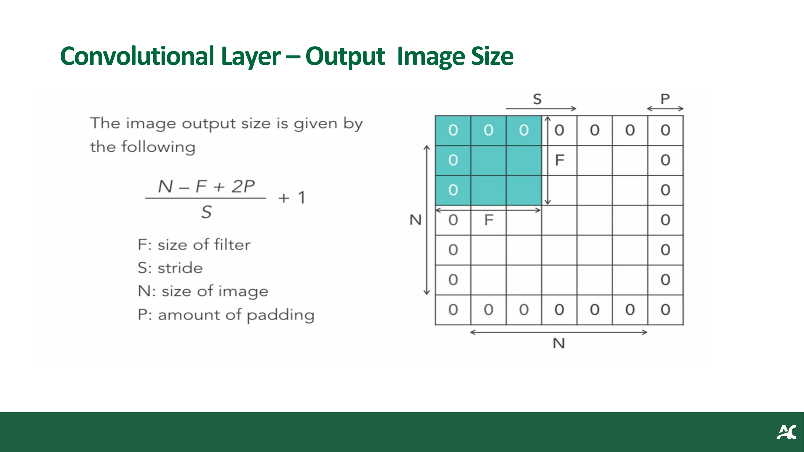

**Output size formula slide:** Title "Convolutional Layer – Output Image Size" in green. Left side: text "The image output size is given by the following" with formula (N – F + 2P) / S + 1 displayed below. Four variable definitions listed: F: size of filter, S: stride, N: size of image, P: amount of padding. Right side: a grid diagram showing an N×N image matrix with zero-padding (P) around the border — padding cells contain "0". A cyan-highlighted F×F filter region is shown at the top-left corner. Arrows annotate S (stride), P (padding width), F (filter size), and N (image dimension).

**输出尺寸公式页：** 标题"Convolutional Layer – Output Image Size"为绿色。左侧：文字"The image output size is given by the following"，下方显示公式(N – F + 2P) / S + 1。四个变量定义：F: size of filter，S: stride，N: size of image，P: amount of padding。右侧：网格图展示带零填充(P)的N×N图像矩阵——填充单元格包含"0"。左上角显示青色高亮的F×F滤波器区域。箭头标注S（步幅）、P（填充宽度）、F（滤波器大小）和N（图像维度）。

**Convolutional Layer – Output Image Size:** — **卷积层 — 输出图像尺寸：**

- The image output size is given by the following — 图像输出尺寸由以下公式给出
- **(N – F + 2P) / S + 1**
  - F: size of filter — F：滤波器大小
  - S: stride — S：步幅
  - N: size of image — N：图像大小
  - P: amount of padding — P：填充量

> **📝 Notes:**
>
> **📌 What:**
> **(1) Filter/Kernel (滤波器/核):**
>
> A small matrix (e.g., 3×3, 5×5) with **learnable** weights. Unlike image processing kernels (hand-designed, e.g., Sobel), CNN filters are learned automatically via backpropagation. Each filter specializes in detecting one type of feature.
>
>> 一个小矩阵（如3×3、5×5），具有**可学习**的权重。与图像处理核（手工设计，如Sobel）不同，CNN滤波器通过反向传播自动学习。每个滤波器专门检测一种特征。
>>
>
> **(2) Feature map (特征图):**
>
> The output of applying one filter to an input. If a layer has 32 filters, it produces 32 feature maps (one per filter). Each feature map is a 2D "activation map" showing where in the input that particular feature was detected.
>
>> 将一个滤波器应用于输入的输出。如果一层有32个滤波器，就产生32个特征图。每个特征图是一个2D"激活图"，显示输入中该特定特征被检测到的位置。
>>
>
> **(3) Stride (步幅):**
>
> How many pixels the filter jumps each time it moves. Stride=1 means slide by 1 pixel (maximum overlap). Stride=2 means skip every other position (output is ~half the size).
>
>> 滤波器每次移动跳过多少像素。Stride=1表示每次滑动1像素（最大重叠）。Stride=2表示隔一个位置（输出约为一半大小）。
>>
>
> **(4) Padding (填充):**
>
> Adding rows/columns of zeros around the input border. "Same" padding (P = ⌊F/2⌋) keeps output size = input size. "Valid" padding (P=0) shrinks the output.
>
>> 在输入边界周围添加零的行/列。"Same"填充（P = ⌊F/2⌋）保持输出尺寸=输入尺寸。"Valid"填充（P=0）输出尺寸缩小。
>>
>
> **🎯 Why:**
> **(1) Why learnable filters instead of fixed ones?**
>
> In Week 2, we used hand-designed kernels (Gaussian for blur, Sobel for edges). The problem: humans must decide WHICH features matter. CNNs let the data decide — through training, filters automatically learn to detect the features most useful for the task. Early layers typically learn edge detectors (surprisingly similar to Sobel!), while deeper layers learn task-specific patterns.
>
>> 第2周我们用手工设计的核（高斯用于模糊、Sobel用于边缘）。问题是：人类必须决定哪些特征重要。CNN让数据来决定——通过训练，滤波器自动学习检测对任务最有用的特征。早期层通常学习边缘检测器（与Sobel惊人地相似！），而更深层学习任务特定的模式。
>>
>
> **(2) Why padding matters?**
>
> Without padding, each conv layer shrinks the output. After 5 layers of 3×3 convolution without padding on a 32×32 input: 32→30→28→26→24→22. You lose 10 pixels of border information! With "same" padding, 32→32→32→32→32 — no information loss. This is critical for deep networks with many layers.
>
>> 没有填充，每个卷积层都会缩小输出。在32×32输入上用5层3×3卷积不加填充：32→30→28→26→24→22。丢失10像素的边界信息！用"same"填充：32→32→32→32→32——无信息损失。这对多层的深度网络至关重要。
>>
>
> **💡 Intuition:**
> **(1) Convolution as a question (卷积如同提问):**
>
> _[Reused from math-concept-library: signal_processing.md → Convolution]_
> Each filter is a **question** asked at every position: "Does this 3×3 patch look like a horizontal edge?" The output feature map is the **answer map** — bright where the answer is "yes", dark where "no". Multiple filters = asking multiple questions simultaneously.
>
>> 每个滤波器是在每个位置问的一个**问题**："这个3×3区域看起来像水平边缘吗？"输出特征图是**答案图**——"是"的地方亮，"否"的地方暗。多个滤波器 = 同时问多个问题。
>>
>
> **(2) Stride as zoom level (步幅如同缩放级别):**
>
> Stride=1 is like reading every word of a book (thorough but slow). Stride=2 is like reading every other word (faster, coarser). Stride=2 halves the output, acting like 2× zoom-out — useful when you want to quickly reduce spatial dimensions.
>
>> Stride=1像逐字读书（彻底但慢）。Stride=2像隔字阅读（更快、更粗略）。Stride=2将输出减半，像2倍缩小——当你想快速减小空间维度时很有用。
>>
>
> **📐 Formula:**
> Reading **Output = (N – F + 2P) / S + 1** piece by piece:
> - **N – F**: how much "room" the filter has to slide (input size minus filter size)
> - **+ 2P**: padding adds P pixels on each side, so 2P total extra room
> - **/ S**: divide by stride — larger stride = fewer positions
> - **+ 1**: count the starting position (off-by-one correction)
> - ⚠️ In practice, if the result is not an integer, apply floor ⌊...⌋ (you can't place a filter partially outside the image)
>
>> 逐段读 **Output = (N – F + 2P) / S + 1**：
>> - **N – F**：滤波器可滑动的"空间"（输入大小减滤波器大小）
>> - **+ 2P**：填充在每侧加P像素，共增加2P的额外空间
>> - **/ S**：除以步幅——步幅越大，位置越少
>> - **+ 1**：计入起始位置（消除偏移1的误差）
>> - ⚠️ 实际中，如果结果不是整数，需向下取整 ⌊...⌋（滤波器不能部分超出图像边界）
>>
>
> **🔢 Example:**
> **Problem:** N=7, F=3, P=0, S=1. What is the output size?
> **Solution:**
> - Output = (7 – 3 + 2×0) / 1 + 1 = 4/1 + 1 = 4 + 1 = **5×5**
>
> **Problem 2:** N=7, F=3, P=1, S=2.
> **Solution:**
> - Output = (7 – 3 + 2×1) / 2 + 1 = 6/2 + 1 = 3 + 1 = **4×4**
>
>> **题目：** N=7，F=3，P=0，S=1。输出尺寸？
>> **解：** Output = (7–3+0)/1 + 1 = 4+1 = **5×5**
>>
>> **题目2：** N=7，F=3，P=1，S=2。
>> **解：** Output = (7–3+2)/2 + 1 = 3+1 = **4×4**
>>
>
> **⚖️ Compare:**
> | | Week 2 Convolution (Image Processing) | Week 4 Convolution (CNN) |
> |---|---|---|
> | Kernel design | Hand-crafted (Gaussian, Sobel) | Learned from data |
> | Purpose | One specific task (blur, edge) | Automatic feature discovery |
> | Kernel values | Fixed (e.g., [-1,0,1]) | Updated by backpropagation |
> | Number of kernels | Usually 1-2 | Dozens to hundreds per layer |
> | Operation | Same mathematical operation | Same mathematical operation |
>
>> | | 第2周卷积（图像处理） | 第4周卷积（CNN） |
>> |---|---|---|
>> | 核设计 | 手工设计（高斯、Sobel） | 从数据学习 |
>> | 目的 | 单一特定任务（模糊、边缘） | 自动特征发现 |
>> | 核值 | 固定（如[-1,0,1]） | 通过反向传播更新 |
>> | 核数量 | 通常1-2个 | 每层数十到数百个 |
>> | 运算方式 | 相同的数学运算 | 相同的数学运算 |
>>
>
> **⚠️ Pitfall:**
>
> (1) **Filter size vs depth:** A 3×3 filter applied to an input with 64 channels actually has 3×3×64 = 576 weights (+ 1 bias). Don't forget the **depth dimension** — each filter must match the depth of its input.
>
>> (1) **滤波器大小 vs 深度：** 一个3×3滤波器应用于64通道的输入实际上有3×3×64=576个权重（+1偏置）。别忘了**深度维度**——每个滤波器必须匹配输入深度。
>>
>
> (2) **"Same" padding ≠ same output size always.** "Same" padding only preserves size when stride=1. With stride=2 and same padding, output is still halved.
>
>> (2) **"Same"填充≠输出尺寸始终不变。** "Same"填充仅在stride=1时保持尺寸。stride=2加same填充，输出仍减半。
>>
>
> (3) **Output size formula applies per spatial dimension.** For non-square inputs, compute width and height separately.
>
>> (3) **输出尺寸公式按空间维度单独计算。** 非正方形输入需分别计算宽和高。
>>
>
> **📝 Exam:**
>
> **(1) 计算题 (Calculation):**
>
> "N=28, F=5, P=2, S=1. What is the output size?"
> → (28–5+4)/1 + 1 = **28×28**
>
>> "N=28，F=5，P=2，S=1。输出尺寸？"
>> → (28–5+4)/1 + 1 = **28×28**
>>
>
> **(2) 计算题 (Calculation):**
>
> "How many parameters in a conv layer with 16 filters of size 3×3 applied to a 3-channel (RGB) input?"
> → 16 × (3×3×3 + 1) = 16 × 28 = **448 parameters**
>
>> "一个卷积层有16个3×3滤波器，作用于3通道RGB输入，有多少参数？"
>> → 16×(3×3×3+1) = 16×28 = **448个参数**
>>
>
> **(3) 概念题 (Concept):**
>
> "What is the difference between a hand-crafted kernel and a learned CNN filter?"
> → Hand-crafted is fixed by design; CNN filters are initialized randomly and optimized by backpropagation.
>
>> "手工设计核和CNN学习到的滤波器有什么区别？"
>> → 手工设计的是固定的；CNN滤波器随机初始化并通过反向传播优化。
>>

---

## 4. 池化层 (Pooling Layers)

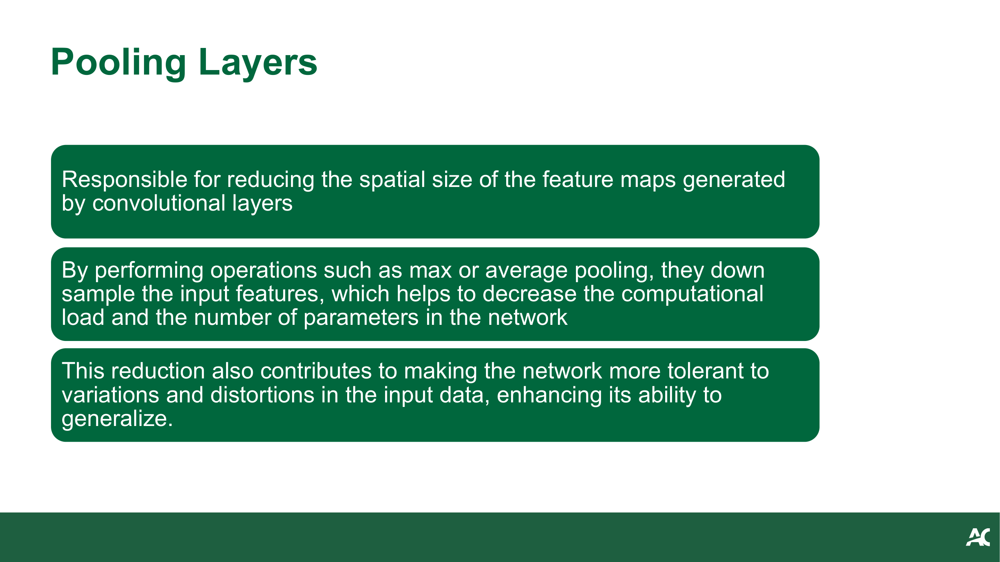

**Pooling layers overview slide:** Title "Pooling Layers". Left side: three paragraphs explaining the role of pooling — reducing spatial size, decreasing computational load, and improving generalization. Right side: a diagram showing a feature map (larger grid) being reduced to a smaller grid through pooling, with arrows indicating the downsampling process.

**池化层概述页：** 标题"Pooling Layers"。左侧：三段文字解释池化的作用——减小空间尺寸、降低计算负载、提高泛化能力。右侧：图示特征图（较大网格）通过池化缩小为较小网格，箭头指示下采样过程。

**Pooling Layers:** — **池化层：**

- Responsible for reducing the spatial size of the feature maps generated by convolutional layers — 负责减小卷积层生成的特征图的空间尺寸
- By performing operations such as max or average pooling, they down sample the input features, which helps to decrease the computational load and the number of parameters in the network — 通过执行最大池化或平均池化等操作，它们对输入特征进行下采样，有助于减少网络的计算负载和参数数量
- This reduction also contributes to making the network more tolerant to variations and distortions in the input data, enhancing its ability to generalize. — 这种减少还有助于使网络对输入数据中的变化和失真更具容忍性，增强其泛化能力。

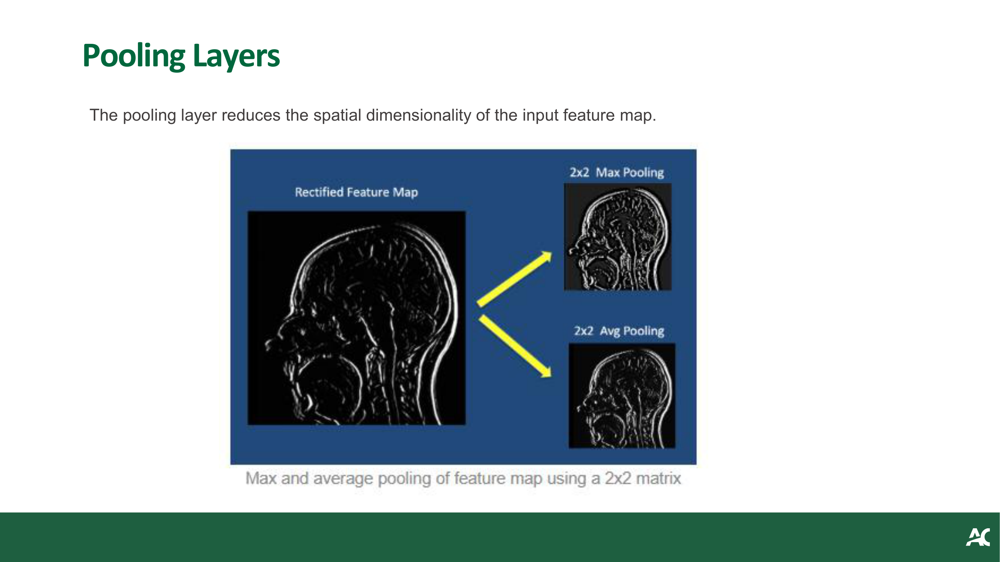

**Max pooling slide:** Title "Pooling Layers". Shows a 4×4 input feature map with numerical values (e.g., 1,1,2,4 / 5,6,7,8 / 3,2,1,0 / 1,2,3,4). A 2×2 window is highlighted in four colors (one per quadrant). For each 2×2 region, the maximum value is selected: top-left 6, top-right 8, bottom-left 3, bottom-right 4 → producing a 2×2 output. Label reads "Max Pooling" with stride=2.

**最大池化页：** 标题"Pooling Layers"。展示4×4输入特征图（含数值如1,1,2,4 / 5,6,7,8 / 3,2,1,0 / 1,2,3,4）。四种颜色高亮2×2窗口（每个象限一种）。对每个2×2区域选最大值：左上6、右上8、左下3、右下4 → 产生2×2输出。标注"Max Pooling"，stride=2。

- The pooling layer reduces the spatial dimensionality of the input feature map. — 池化层减少输入特征图的空间维度。

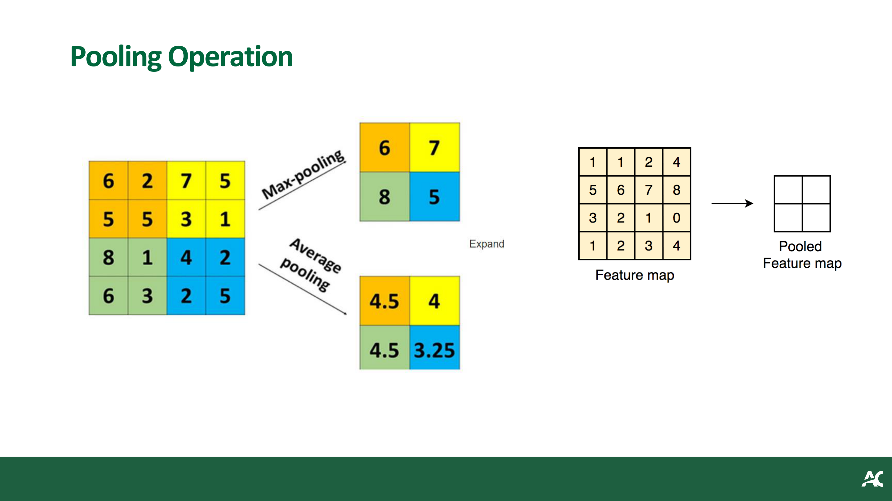

**Average pooling slide:** Title "Pooling Operation". Same layout as max pooling slide but now computing averages: for each 2×2 region, all four values are averaged instead of taking the maximum. The output 2×2 matrix shows the mean of each quadrant. Side-by-side comparison with max pooling may be shown, highlighting the difference in output values.

**平均池化页：** 标题"Pooling Operation"。与最大池化页布局相同，但现在计算平均值：对每个2×2区域取四个值的平均而非最大值。2×2输出矩阵显示每个象限的均值。可能展示与最大池化的并排比较，高亮输出值的差异。

> **📝 Notes:**
>
> **🎯 Why:**
> After convolution, feature maps are large and contain redundant spatial information. We care about **WHETHER** a feature (e.g., an edge) exists in a region, not its exact pixel coordinate. Pooling achieves two goals simultaneously: (1) **reduces computation** — a 224×224 map becomes 112×112, reducing subsequent operations by 4×, and (2) **adds translation tolerance** — if a cat's eye shifts by 1 pixel, the max in a 2×2 region likely stays the same.
>
>> 卷积后，特征图很大且包含冗余空间信息。我们关心特征（如边缘）**是否存在**于某区域，而非其精确像素坐标。池化同时实现两个目标：(1) **减少计算**——224×224变为112×112，后续运算减少4倍，(2) **增加平移容忍度**——如果猫眼移动1像素，2×2区域的最大值可能不变。
>>
>
> **💡 Intuition:**
> **(1) Max pooling as "did you see it?" (最大池化如同"你看到了吗？"):**
>
> Imagine dividing a photo into 2×2 grid sections and asking each section: "Did you see an edge?" Max pooling keeps the strongest "yes" response — if ANY pixel in the block detected an edge strongly, that information is preserved. Weaker signals and background are discarded.
>
>> 想象把照片分成2×2网格区域，问每个区域："你看到边缘了吗？"最大池化保留最强的"是"——如果块中任何像素强烈检测到边缘，该信息被保留。较弱的信号和背景被丢弃。
>>
>
> **(2) Average pooling as "what's the mood?" (平均池化如同"整体氛围如何？"):**
>
> Average pooling asks: "What's the average activation in this region?" It's like summarizing a paragraph — you get the gist but lose strong individual statements. Used when you want a **smooth** summary rather than sharp peaks.
>
>> 平均池化问的是："这个区域的平均激活是多少？"像总结一段话——你得到大意但丢失强烈的个别陈述。当你想要**平滑**的总结而非尖锐的峰值时使用。
>>
>
> **⚖️ Compare:**
> | Feature | Max Pooling | Average Pooling |
> |---|---|---|
> | Operation | Takes maximum in window | Takes average in window |
> | Keeps | Strongest activation only | Overall activation level |
> | Best for | Edge/texture detection (most CNNs) | Smooth features, final layer (GAP) |
> | Noise sensitivity | Less sensitive (noise rarely = max) | More sensitive (noise affects average) |
> | Information loss | Discards 75% of values (2×2) | Blends all values |
>
>> | 特性 | 最大池化 | 平均池化 |
>> |---|---|---|
>> | 操作 | 窗口内取最大值 | 窗口内取平均值 |
>> | 保留 | 仅最强激活 | 整体激活水平 |
>> | 适用 | 边缘/纹理检测（大多数CNN） | 平滑特征、最终层（GAP） |
>> | 噪声敏感度 | 较不敏感（噪声很少是最大值） | 更敏感（噪声影响平均值） |
>> | 信息损失 | 丢弃75%的值（2×2） | 混合所有值 |
>>
>
> **⚠️ Pitfall:**
> (1) **Pooling has NO learnable parameters** — don't confuse it with convolution. Conv layers learn filters; pooling just applies a fixed rule (max or average). This means pooling contributes ZERO to the model's parameter count.
> (2) **Pooling output size formula is the same** as convolution: Output = ⌊(W - F) / S⌋ + 1 (usually no padding in pooling). Common setup: 2×2 pool with stride 2 → output is exactly half.
> (3) **Modern architectures** (like ResNet) sometimes replace pooling with **strided convolution** (stride=2 conv layer), which achieves similar downsampling but with learnable parameters.
>
>> (1) **池化没有可学习参数**——别跟卷积混淆。卷积层学习滤波器；池化只应用固定规则（最大或平均）。池化对模型参数量贡献为零。
>> (2) **池化输出尺寸公式与卷积相同**：Output = ⌊(W-F)/S⌋+1（池化通常无填充）。常用设置：2×2池化、stride=2 → 输出恰好减半。
>> (3) **现代架构**（如ResNet）有时用**步幅卷积**（stride=2的卷积层）替代池化，实现类似下采样但有可学习参数。
>>
>
> **📝 Exam:**
> (1) **计算题 (Calculation):** "Apply 2×2 max pooling with stride 2 to: [[1,3,2,4],[5,6,7,8],[3,2,1,0],[1,2,3,4]]. What is the output?" → [[6,8],[3,4]].
> (2) **对比题 (Comparison):** "What is the difference between max pooling and average pooling?" → Max keeps strongest activation; average computes mean. Max is more common in CNNs.
> (3) **概念题 (Concept):** "Does pooling have learnable parameters? Why or why not?" → No. It applies a fixed rule (max/avg) — nothing to learn.
>
>> (1) **计算题：** "对[[1,3,2,4],[5,6,7,8],[3,2,1,0],[1,2,3,4]]应用2×2最大池化，stride=2。输出？" → [[6,8],[3,4]]。
>> (2) **对比题：** "最大池化和平均池化的区别？" → 最大保留最强激活；平均计算均值。最大池化在CNN中更常用。
>> (3) **概念题：** "池化有可学习参数吗？为什么？" → 没有。它应用固定规则（最大/平均）——没有什么需要学习。
>>

---

## 5. 全连接层与展平 (Fully Connected Layers & Flattening)

### 5.1 全连接层 (Fully Connected Layers)

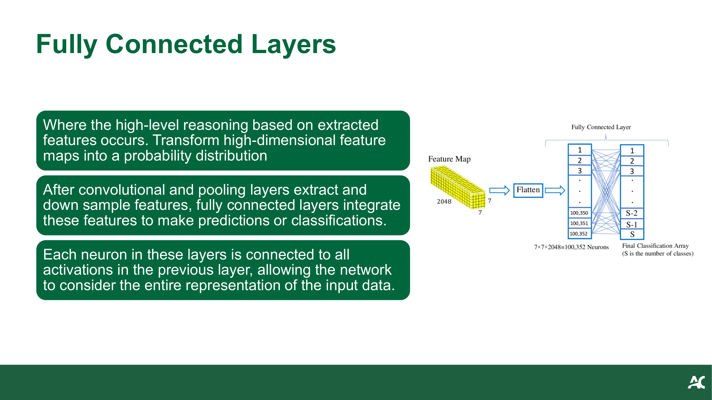

**Fully connected layers slide:** Title "Fully Connected Layers". Left side: three paragraphs describing FC layers' role in high-level reasoning, integrating features for classification, and full connectivity to previous layer. Right side: a diagram showing a series of feature maps being flattened into a 1D vector and then connected to a fully connected layer with all-to-all connections, ending at an output layer with class labels (e.g., cat, dog, bird).

**全连接层页：** 标题"Fully Connected Layers"。左侧：三段文字描述FC层在高级推理、整合特征用于分类、与前一层全连接方面的作用。右侧：图示一系列特征图被展平为1D向量，然后连接到全连接层（所有到所有的连接），最后到输出层，输出类别标签（如猫、狗、鸟）。

**Fully Connected Layers:** — **全连接层：**

- Where the high-level reasoning based on extracted features occurs. Transform high-dimensional feature maps into a probability distribution — 基于提取特征进行高级推理的地方。将高维特征图转换为概率分布
- After convolutional and pooling layers extract and down sample features, fully connected layers integrate these features to make predictions or classifications. — 在卷积层和池化层提取并下采样特征后，全连接层整合这些特征进行预测或分类。
- Each neuron in these layers is connected to all activations in the previous layer, allowing the network to consider the entire representation of the input data. — 这些层中的每个神经元都与前一层的所有激活相连，使网络能够考虑输入数据的整体表示。

### 5.2 展平操作 (Flattening)

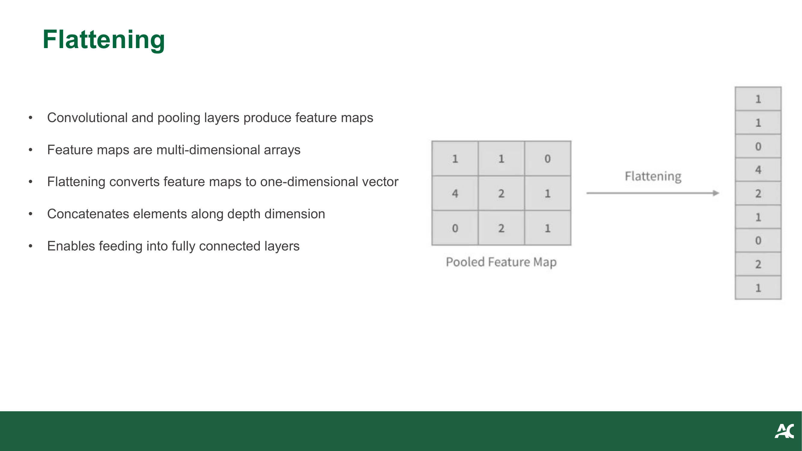

**Flattening slide:** Title "Flattening". Left side: five bullet points explaining the flattening process. Right side: a visual diagram showing a 3D feature map block (e.g., 3×3×depth) being unrolled into a single long 1D vector (9×depth elements). Arrows show the row-by-row or depth-first concatenation order.

**展平操作页：** 标题"Flattening"。左侧：五个要点解释展平过程。右侧：可视化图展示3D特征图块（如3×3×深度）被展开为单一长1D向量（9×深度个元素）。箭头显示逐行或深度优先的拼接顺序。

- Convolutional and pooling layers produce feature maps — 卷积层和池化层生成特征图
- Feature maps are multi-dimensional arrays — 特征图是多维数组
- Flattening converts feature maps to one-dimensional vector — 展平将特征图转换为一维向量
- Concatenates elements along depth dimension — 沿深度维度拼接元素
- Enables feeding into fully connected layers — 使其能够输入全连接层

### 5.3 权重矩阵与偏置向量 (Weight Matrix & Bias Vector)

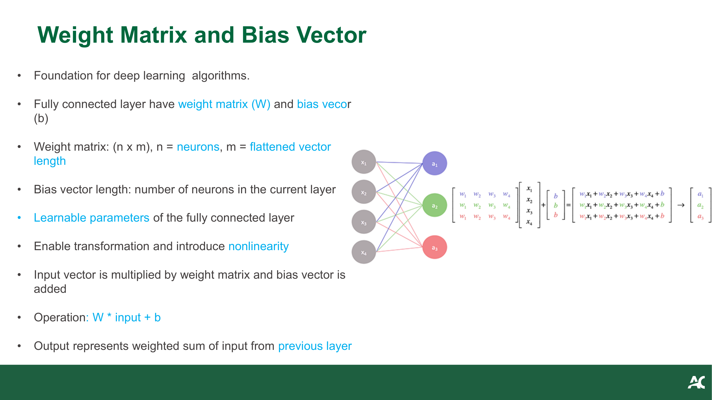

**Weight matrix slide:** Title "Weight Matrix and Bias Vector". Left side: eight bullet points explaining W, b, their dimensions, and the operation W*input+b. Right side: a diagram showing the matrix multiplication — a weight matrix W (n×m) multiplied by the input vector x (m×1), plus bias vector b (n×1), producing the output vector z (n×1). Arrows and labeled dimensions illustrate the shapes.

**权重矩阵页：** 标题"Weight Matrix and Bias Vector"。左侧：八个要点解释W、b、它们的维度及W*input+b运算。右侧：矩阵乘法图——权重矩阵W(n×m)乘以输入向量x(m×1)，加偏置向量b(n×1)，产生输出向量z(n×1)。箭头和标注的维度说明形状。

**Weight Matrix and Bias Vector:** — **权重矩阵和偏置向量：**

- Foundation for deep learning algorithms. — 深度学习算法的基础。
- Fully connected layer have **weight matrix (W)** and **bias vector (b)** — 全连接层有**权重矩阵（W）**和**偏置向量（b）**
- Weight matrix: (n x m), n = neurons, m = flattened vector length — 权重矩阵：(n x m)，n = 神经元数，m = 展平向量长度
- Bias vector length: number of neurons in the current layer — 偏置向量长度：当前层的神经元数量
- **Learnable parameters** of the fully connected layer — 全连接层的**可学习参数**
- Enable transformation and introduce **nonlinearity** — 启用变换并引入**非线性**
- Input vector is multiplied by weight matrix and bias vector is added — 输入向量乘以权重矩阵并加上偏置向量
- Operation: **W * input + b** — 运算：**W * input + b**
- Output represents weighted sum of input from previous layer — 输出表示前一层输入的加权和

> **📝 Notes:**
>
> **📌 What:**
> **(1) Flattening (展平):**
>
> The bridge between the spatial (2D/3D) world of conv/pool layers and the vector (1D) world of FC layers. If the last pooling layer outputs a 7×7×512 feature map, flattening produces a 7×7×512 = 25,088-element vector. No learning happens here — it's purely a reshape operation.
>
>> 连接卷积/池化层的空间（2D/3D）世界和全连接层的向量（1D）世界的桥梁。如果最后一个池化层输出7×7×512特征图，展平产生7×7×512=25,088个元素的向量。这里不发生学习——纯粹是一个形状变换操作。
>>
>
> **(2) Fully Connected (FC) Layer (全连接层):**
>
> Every neuron connects to every value in the input vector. For a flattened 25,088 vector going into a 4,096-neuron FC layer, there are 25,088×4,096 = 102,760,448 weights. This is why FC layers account for **most of a CNN's parameters** despite conv layers doing the heavy feature extraction.
>
>> 每个神经元连接输入向量中的每个值。25,088展平向量进入4,096神经元的FC层，有25,088×4,096=102,760,448个权重。这就是为什么FC层占CNN**大部分参数**，尽管卷积层做了大量特征提取工作。
>>
>
> **🎯 Why:**
> Conv and pooling layers extract "what features are where" but they can't make a decision. The feature map says "there's an eye here, a nose there, whiskers over there" — but someone needs to combine ALL these scattered facts and conclude "this is a cat." FC layers serve as the **decision-maker** that integrates all spatial features into a final class prediction.
>
>> 卷积和池化层提取"什么特征在哪里"，但不能做出决定。特征图说"这里有眼睛、那里有鼻子、那边有胡须"——但需要有人将所有这些分散的事实整合起来，得出"这是一只猫"的结论。FC层充当**决策者**，将所有空间特征整合为最终的类别预测。
>>
>
> **💡 Intuition:**
> Think of the CNN as a detective investigation. Conv layers are **detectives on the ground** who find clues (edges, textures, patterns) at specific locations. Pooling layers are **summary reports** that condense findings. Flattening is **compiling all reports into one dossier**. The FC layer is the **judge in the courtroom** who reads the entire dossier and renders a verdict (classification). The judge needs to see ALL the evidence together, which is why FC is fully connected.
>
>> 把CNN想象成一次侦探调查。卷积层是在现场找线索（边缘、纹理、模式）的**地面侦探**。池化层是浓缩发现的**总结报告**。展平是**将所有报告编入一份档案**。FC层是法庭上的**法官**，阅读整份档案并做出判决（分类）。法官需要同时看到所有证据，这就是FC为什么要全连接。
>>
>
> **⚙️ How:**
> The computation z = W·x + b is a linear transformation:
> - **W·x**: each row of W contains the weights for one neuron. The dot product of that row with x produces one output value — how much this neuron "fires" for this input.
> - **+ b**: bias shifts the activation threshold. Without bias, the decision boundary must pass through the origin, which is too restrictive.
> - **After z**: an activation function (ReLU, Softmax) is applied to introduce nonlinearity (covered in §6).
>
>> 计算z = W·x + b是一个线性变换：
>> - **W·x**：W的每行包含一个神经元的权重。该行与x的点积产生一个输出值——该神经元对此输入的"激发"程度。
>> - **+ b**：偏置移动激活阈值。没有偏置，决策边界必须过原点，这太受限制。
>> - **z之后**：应用激活函数（ReLU、Softmax）引入非线性（§6中讲解）。
>>
>
> **⚠️ Pitfall:**
> (1) **FC layers are the parameter bottleneck.** In VGGNet, the FC layers use ~123M of the total 138M parameters (89%!). This is why modern architectures (ResNet, etc.) replace FC with **Global Average Pooling (GAP)** which has zero parameters.
> (2) **Nonlinearity comes from the activation function, NOT from W·x+b.** W·x+b itself is purely linear. Without activation, stacking 100 FC layers is equivalent to one FC layer (because linear∘linear = linear).
>
>> (1) **FC层是参数瓶颈。** VGGNet中FC层使用了总共138M参数中的~123M（89%！）。这就是为什么现代架构（ResNet等）用零参数的**全局平均池化（GAP）** 替代FC。
>> (2) **非线性来自激活函数，而非W·x+b。** W·x+b本身是纯线性的。没有激活函数，堆叠100个FC层等价于一个FC层（因为线性∘线性=线性）。
>>
>
> **📝 Exam:**
> (1) **计算题 (Calculation):** "A conv output is 5×5×64. After flattening, this feeds into an FC layer with 256 neurons. How many weights?" → 5×5×64×256 = 409,600 weights (+ 256 biases).
> (2) **概念题 (Concept):** "Why is flattening necessary before FC layers?" → FC layers expect 1D vector input; conv/pool produce 2D/3D feature maps.
> (3) **推理题 (Reasoning):** "Why do FC layers have most of CNN's parameters?" → Full connectivity means every input value connects to every neuron, creating O(input × neurons) weights.
>
>> (1) **计算题：** "卷积输出5×5×64。展平后输入256神经元的FC层。有多少权重？" → 5×5×64×256 = 409,600个权重（+256个偏置）。
>> (2) **概念题：** "为什么FC层前需要展平？" → FC层需要1D向量输入；卷积/池化产生2D/3D特征图。
>> (3) **推理题：** "为什么FC层有CNN的大部分参数？" → 全连接意味着每个输入值连接到每个神经元，产生O(输入×神经元)个权重。
>>

---

## 6. 激活函数与输出层 (Activation Functions & Output Layer)

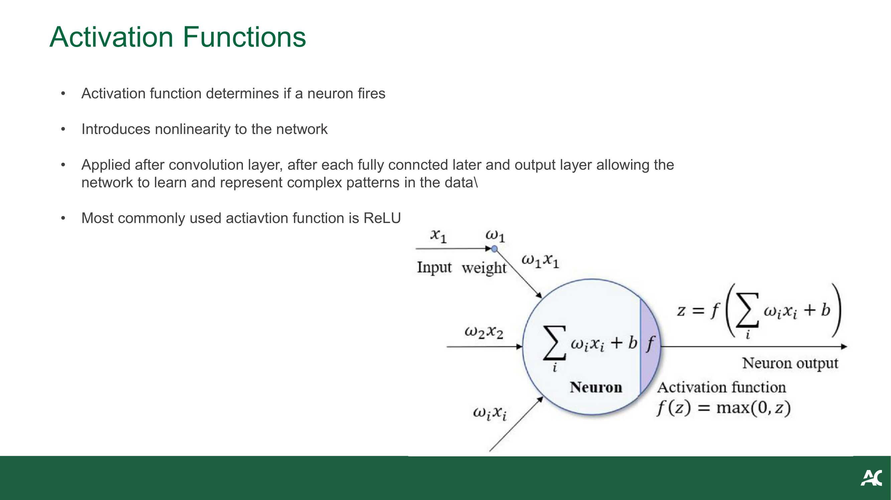

**Activation functions slide:** Title "Activation Functions". Left side: a neuron model diagram showing inputs x₁, x₂, ..., xₙ each multiplied by weights ω₁, ω₂, ..., ωₙ, then summed with bias b to produce z = Σωᵢxᵢ + b, which passes through activation function f to produce output. Right side: the ReLU formula f(z) = max(0, z) with its graph — a flat line at 0 for negative inputs, and a diagonal line for positive inputs. Four bullet points about activation functions below.

**激活函数页：** 标题"Activation Functions"。左侧：神经元模型图，输入x₁,x₂,...,xₙ分别乘以权重ω₁,ω₂,...,ωₙ，然后与偏置b求和得z=Σωᵢxᵢ+b，通过激活函数f输出。右侧：ReLU公式f(z)=max(0,z)及其图形——负输入处为0的平线，正输入处为对角线。下方四个关于激活函数的要点。

- Activation function determines if a neuron fires — 激活函数决定神经元是否激活
- Introduces nonlinearity to the network — 为网络引入非线性
- Applied after convolution layer, after each fully connected layer and output layer allowing the network to learn and represent complex patterns in the data — 在卷积层之后、每个全连接层之后和输出层应用，使网络能够学习和表示数据中的复杂模式
- Most commonly used activation function is **ReLU** — 最常用的激活函数是**ReLU**

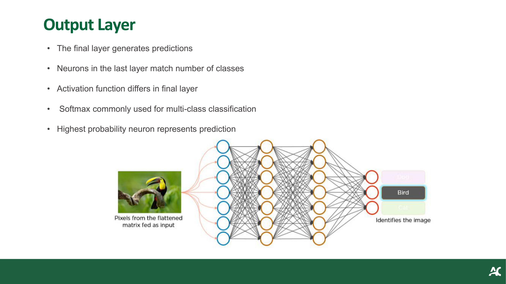

**Output layer slide:** Title "Output Layer". Left side: five bullet points about the final layer's role in generating predictions, matching neurons to classes, and using Softmax. Right side: a diagram showing the last FC layer connecting to an output layer with N neurons (one per class, e.g., cat=0.85, dog=0.10, bird=0.05). The Softmax function converts raw scores into probabilities that sum to 1. The highest probability neuron is highlighted as the predicted class.

**输出层页：** 标题"Output Layer"。左侧：关于最终层生成预测、神经元匹配类别数、使用Softmax的五个要点。右侧：图示最后一个FC层连接到输出层，有N个神经元（每个类别一个，如cat=0.85, dog=0.10, bird=0.05）。Softmax函数将原始分数转换为总和为1的概率。最高概率神经元被高亮为预测类别。

**Output Layer:** — **输出层：**

- The final layer generates predictions — 最后一层生成预测
- Neurons in the last layer match number of classes — 最后一层的神经元数量与类别数匹配
- Activation function differs in final layer — 最后一层的激活函数不同
- **Softmax** commonly used for multi-class classification — **Softmax**常用于多类分类
- Highest probability neuron represents prediction — 最高概率的神经元代表预测结果

> **📝 Notes:**
>
> **📌 What:**
> **(1) ReLU — Rectified Linear Unit (修正线性单元):**
>
> f(z) = max(0, z). The simplest and most widely used activation function in hidden layers. Outputs z if z > 0, outputs 0 otherwise. It's like a gate that lets positive signals through and blocks negative ones.
>
>> f(z) = max(0, z)。最简单且最广泛使用的隐藏层激活函数。z>0时输出z，否则输出0。就像一扇门，让正信号通过，阻止负信号。
>>
>
> **(2) Softmax (Softmax函数):**
>
> Converts a vector of raw scores (logits) into a probability distribution. softmax(zᵢ) = e^zᵢ / Σⱼe^zⱼ. All outputs are positive and sum to 1, making them interpretable as class probabilities.
>
>> 将原始分数（logits）向量转换为概率分布。softmax(zᵢ) = e^zᵢ / Σⱼe^zⱼ。所有输出为正且和为1，可解释为类别概率。
>>
>
> **🎯 Why:**
> **(1) Why nonlinearity is essential:**
>
> Without activation functions, the entire network is one giant linear function — no matter how many layers you stack, y = W₃·W₂·W₁·x = W_combined·x. A linear model can only draw straight decision boundaries. Real-world problems (cat vs dog) require curved, complex boundaries. Activation functions **break** linearity at every layer, enabling the network to approximate **any** continuous function.
>
>> 没有激活函数，整个网络是一个巨大的线性函数——无论堆叠多少层，y=W₃·W₂·W₁·x=W_combined·x。线性模型只能画直线决策边界。现实问题（猫vs狗）需要弯曲、复杂的边界。激活函数在每层**打破**线性，使网络能近似**任何**连续函数。
>>
>
> **(2) Why ReLU replaced Sigmoid:**
>
> Sigmoid: σ(z) = 1/(1+e⁻ᶻ) saturates at 0 and 1 — gradients become tiny (vanishing gradient problem), slowing training dramatically. ReLU: gradient is either 0 or 1 — no saturation for positive values, enabling much faster and deeper training.
>
>> Sigmoid：σ(z)=1/(1+e⁻ᶻ) 在0和1处饱和——梯度变得微小（梯度消失问题），严重减慢训练。ReLU：梯度要么为0要么为1——正值没有饱和，训练更快更深。
>>
>
> **💡 Intuition:**
> **(1) ReLU as a light switch (ReLU如同灯的开关):**
>
> ReLU is like a light dimmer switch that only works in one direction: turn the dial to the left (negative input) — nothing happens, light stays off. Turn to the right (positive input) — brightness increases proportionally. This simplicity is why it's so fast to compute and so effective.
>
>> ReLU像一个只能单向工作的灯光调节器：向左转（负输入）——什么都不发生，灯保持关。向右转（正输入）——亮度按比例增加。这种简单性是它计算快速且有效的原因。
>>
>
> **(2) Softmax as vote normalization (Softmax如同投票归一化):**
>
> Imagine 10 judges score a gymnastics performance: [8.5, 7.2, 9.1, ...]. Softmax normalizes these into percentages that sum to 100% — the highest score (9.1) gets the largest share. The output tells you "48% chance it's class 3, 30% chance it's class 1..."
>
>> 想象10个裁判给体操打分：[8.5, 7.2, 9.1, ...]。Softmax将这些归一化为总和100%的百分比——最高分（9.1）获得最大份额。输出告诉你"48%概率是类别3、30%概率是类别1..."
>>
>
> **⚠️ Pitfall:**
> (1) **"Dead ReLU" problem:** If a neuron's input is always negative (e.g., due to a large negative bias), its output is always 0, gradient is always 0, and it never updates — it's "dead." Solutions: use Leaky ReLU (small slope for negative values) or careful weight initialization.
> (2) **Softmax vs Sigmoid for output:** Softmax is for multi-class (mutually exclusive: cat OR dog). Sigmoid is for multi-label (an image can be BOTH "outdoor" AND "sunny"). Don't confuse them on the exam.
>
>> (1) **"死亡ReLU"问题：** 如果神经元的输入始终为负（如由于大的负偏置），输出始终为0，梯度始终为0，永不更新——它"死了"。解决方案：用Leaky ReLU（负值有小斜率）或谨慎的权重初始化。
>> (2) **Softmax vs Sigmoid用于输出：** Softmax用于多分类（互斥：猫或狗）。Sigmoid用于多标签（图像可以同时是"户外"和"晴天"）。考试不要混淆。
>>
>
> **📝 Exam:**
> (1) **计算题 (Calculation):** "Apply ReLU to [-2, 0, 3, -1, 5]." → [0, 0, 3, 0, 5].
> (2) **概念题 (Concept):** "Why is an activation function necessary in neural networks?" → Without it, multiple layers collapse to a single linear transformation, unable to learn complex patterns.
> (3) **对比题 (Comparison):** "Compare ReLU and Sigmoid." → ReLU: max(0,z), no vanishing gradient for positive values, may have dead neurons. Sigmoid: 1/(1+e⁻ᶻ), outputs in (0,1), suffers vanishing gradient.
>
>> (1) **计算题：** "对[-2,0,3,-1,5]应用ReLU。" → [0,0,3,0,5]。
>> (2) **概念题：** "为什么神经网络需要激活函数？" → 没有它，多层坍缩为单一线性变换，无法学习复杂模式。
>> (3) **对比题：** "比较ReLU和Sigmoid。" → ReLU：max(0,z)，正值无梯度消失，可能有死神经元。Sigmoid：1/(1+e⁻ᶻ)，输出在(0,1)，有梯度消失问题。
>>

---

## 7. 反向传播与CNN处理流程 (Back Propagation & CNN Pipeline)

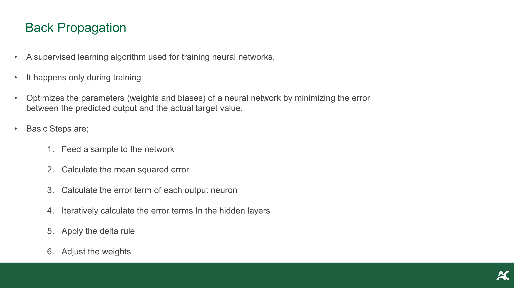

**Backpropagation slide:** Title "Back Propagation". Left side: six-step numbered list describing the backpropagation algorithm. Right side: a neural network diagram with forward pass arrows (left-to-right) and backward pass arrows (right-to-left, shown in red/orange). The backward arrows represent gradient flow. Labels indicate "error propagation" moving from output to input. Additional description about supervised learning and parameter optimization above the steps.

**反向传播页：** 标题"Back Propagation"。左侧：六步编号列表描述反向传播算法。右侧：神经网络图，前向传播箭头（从左到右）和反向传播箭头（从右到左，红色/橙色）。反向箭头表示梯度流。标签指示"误差传播"从输出到输入的方向。步骤上方有关于监督学习和参数优化的附加描述。

**Back Propagation:** — **反向传播：**

- A supervised learning algorithm used for training neural networks. — 一种用于训练神经网络的监督学习算法。
- It happens only during training — 仅在训练期间发生
- Optimizes the parameters (weights and biases) of a neural network by minimizing the error between the predicted output and the actual target value. — 通过最小化预测输出与实际目标值之间的误差来优化神经网络的参数（权重和偏置）。
- Basic Steps are: — 基本步骤是：
  1. Feed a sample to the network — 向网络输入一个样本
  2. Calculate the mean squared error — 计算均方误差
  3. Calculate the error term of each output neuron — 计算每个输出神经元的误差项
  4. Iteratively calculate the error terms in the hidden layers — 迭代计算隐藏层中的误差项
  5. Apply the delta rule — 应用delta规则
  6. Adjust the weights — 调整权重

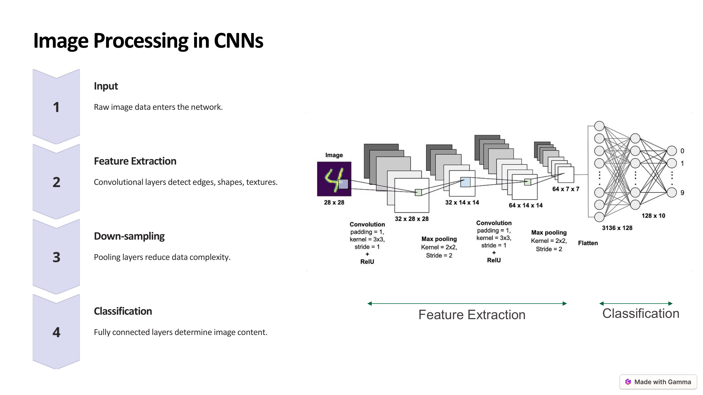

**CNN pipeline slide:** Title "Image Processing in CNNs". Shows the complete CNN processing flow as a horizontal pipeline: Starting from "Input" (a sample cat photo) → "Feature Extraction" (multiple convolutional layer stacks extracting edges, shapes, textures) → "Down-sampling" (pooling layers reducing size) → "Classification" (FC layers making a decision). Below the pipeline: a labeled "Feature Extraction" and "Classification" division showing the two major phases.

**CNN流程图页：** 标题"Image Processing in CNNs"。展示完整CNN处理流程的水平管道：从"Input"（一张猫的样本照片）→ "Feature Extraction"（多个卷积层堆叠提取边缘、形状、纹理）→ "Down-sampling"（池化层减小尺寸）→ "Classification"（FC层做出决定）。管道下方：标注的"Feature Extraction"和"Classification"划分，展示两个主要阶段。

- **Input** — Raw image data enters the network. — **输入** — 原始图像数据进入网络。
- **Feature Extraction** — Convolutional layers detect edges, shapes, textures. — **特征提取** — 卷积层检测边缘、形状、纹理。
- **Down-sampling** — Pooling layers reduce data complexity. — **下采样** — 池化层降低数据复杂度。
- **Classification** — Fully connected layers determine image content. — **分类** — 全连接层确定图像内容。

> **📝 Notes:**
>
> **🎯 Why:**
> A network starts with random weights — its predictions are essentially random. Backpropagation is the **learning mechanism**: it measures how wrong the prediction was (loss), then traces back through every layer to figure out which weights contributed most to the error, and adjusts them proportionally. Without backpropagation, neural networks cannot learn — they'd be stuck with random weights forever.
>
>> 网络从随机权重开始——预测本质上是随机的。反向传播是**学习机制**：它测量预测有多错（损失），然后回溯每一层，找出哪些权重对误差贡献最大，按比例调整。没有反向传播，神经网络无法学习——会永远停留在随机权重上。
>>
>
> **💡 Intuition:**
> Think of backpropagation as a **blame game going backwards**. Imagine a relay race where the team finished last. The coach starts with the final runner: "You were 2 seconds slow." Then traces back: "You received the baton late because runner 3 was 1.5 seconds slow." Each runner gets told: "You contributed X seconds of slowness, so fix your form proportionally." **This is exactly what gradient descent does** — each weight gets blamed proportionally for the error and adjusted accordingly.
>
>> 把反向传播想象成一个**向后追究责任的游戏**。想象接力赛中团队跑了最后一名。教练从最后一棒开始："你慢了2秒。"然后追溯："你接棒晚了因为第3棒慢了1.5秒。"每个跑者被告知："你贡献了X秒的延迟，按比例调整你的姿势。"**这正是梯度下降做的事**——每个权重按比例为误差"担责"并相应调整。
>>
>
> **⚙️ How:**
> The 6 steps map to mathematical operations:
> - Steps 1-2: **Forward pass** — compute output and loss (MSE = Σ(predicted - actual)²/n)
> - Steps 3-4: **Backward pass** — apply the **chain rule** to compute ∂Loss/∂w for every weight w. The chain rule breaks the derivative into layer-by-layer products: ∂L/∂w₁ = ∂L/∂a₃ · ∂a₃/∂a₂ · ∂a₂/∂w₁
> - Steps 5-6: **Weight update** — apply the **delta rule**: wₙₑw = w_old - η · (∂Loss/∂w), where η is the learning rate. Larger gradient = larger adjustment.
>
>> 6个步骤对应的数学运算：
>> - 步骤1-2：**前向传播**——计算输出和损失（MSE = Σ(预测-实际)²/n）
>> - 步骤3-4：**反向传播**——应用**链式法则**计算每个权重w的∂Loss/∂w。链式法则将导数分解为逐层乘积：∂L/∂w₁ = ∂L/∂a₃ · ∂a₃/∂a₂ · ∂a₂/∂w₁
>> - 步骤5-6：**权重更新**——应用**delta规则**：w_new = w_old - η·(∂Loss/∂w)，其中η是学习率。梯度越大=调整越大。
>>
>
> **⚠️ Pitfall:**
> (1) **Backpropagation only happens during training, NOT inference.** When a trained CNN classifies a new image, it only does the forward pass. Backprop is turned off (no gradient computation needed), which is why inference is much faster.
> (2) **Learning rate η is critical.** Too large → overshoots the minimum (diverges). Too small → takes forever to converge. This is why learning rate scheduling (start large, decay over time) is commonly used.
> (3) **Don't confuse backpropagation with gradient descent.** Backpropagation = the algorithm to **compute** gradients. Gradient descent = the algorithm to **use** those gradients for weight updates. They work together but are distinct concepts.
>
>> (1) **反向传播只在训练时发生，推理时不发生。** 当训练好的CNN分类新图像时，只做前向传播。反向传播关闭（不需要计算梯度），这就是推理更快的原因。
>> (2) **学习率η至关重要。** 太大→超过最小值（发散）。太小→收敛过慢。这就是为什么常用学习率调度（开始大、逐渐衰减）。
>> (3) **不要混淆反向传播和梯度下降。** 反向传播=**计算**梯度的算法。梯度下降=**使用**这些梯度更新权重的算法。它们协同工作但是不同的概念。
>>
>
> **📝 Exam:**
> (1) **步骤题 (Steps):** "List the 6 basic steps of backpropagation." → Feed sample, calculate MSE, calculate output error terms, propagate error to hidden layers, apply delta rule, adjust weights.
> (2) **概念题 (Concept):** "Does backpropagation occur during inference? Why not?" → No. During inference, only the forward pass runs — no labels are available to compute loss, and no weight updates are needed.
> (3) **推理题 (Reasoning):** "What mathematical rule enables backpropagation through multiple layers?" → The chain rule of calculus, which decomposes the gradient of a composite function into products of local gradients.
>
>> (1) **步骤题：** "列出反向传播的6个基本步骤。" → 输入样本、计算MSE、计算输出误差项、向隐藏层传播误差、应用delta规则、调整权重。
>> (2) **概念题：** "推理时是否发生反向传播？为什么不？" → 不。推理时只运行前向传播——没有标签可计算损失，也不需要更新权重。
>> (3) **推理题：** "什么数学法则使反向传播能穿过多层？" → 微积分的链式法则，将复合函数的梯度分解为局部梯度的乘积。
>>

---

## 8. CNN应用与现实影响 (Applications & Real-World Impact)

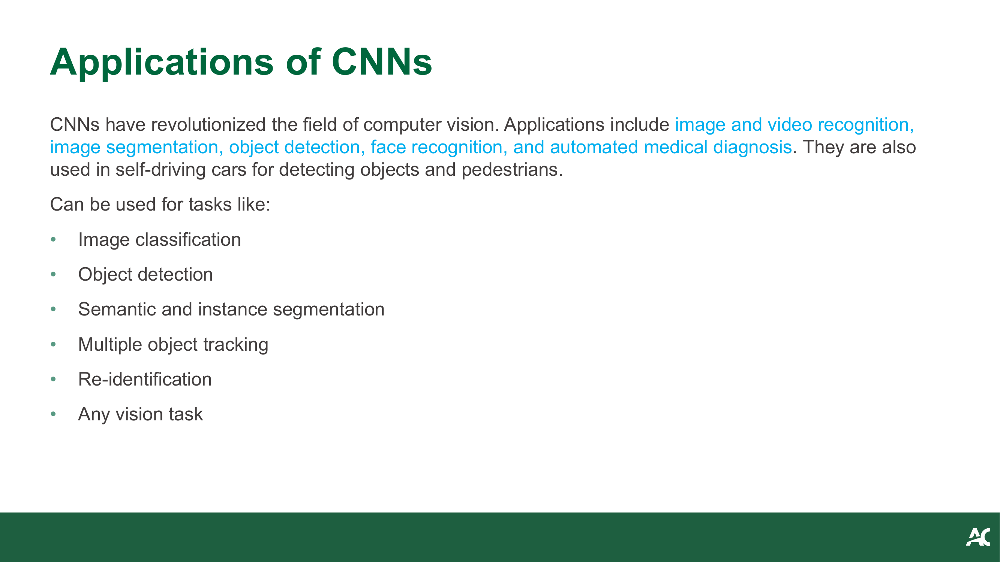

**Applications slide:** Title "Applications of CNNs". Top paragraph describes CNN's revolution in computer vision. Below: a bulleted list of applications — image classification, object detection, semantic and instance segmentation, multiple object tracking, re-identification, and "any vision task." Right side: a grid of example images showing each application type in action (bounding boxes around objects, segmented images, tracked person silhouettes).

**应用场景页：** 标题"Applications of CNNs"。顶部段落描述CNN对计算机视觉的革命性影响。下方：应用场景的项目符号列表——图像分类、目标检测、语义和实例分割、多目标跟踪、重识别以及"任何视觉任务"。右侧：示例图像网格，展示每种应用类型的实际效果（目标周围的边界框、分割图像、被跟踪的人物轮廓）。

**Applications of CNNs:** — **CNN的应用：**

- CNNs have revolutionized the field of computer vision. Applications include image and video recognition, image segmentation, object detection, face recognition, and automated medical diagnosis. They are also used in self-driving cars for detecting objects and pedestrians. — CNN已经彻底改变了计算机视觉领域。应用包括图像和视频识别、图像分割、目标检测、人脸识别和自动化医疗诊断。它们还用于自动驾驶汽车中检测物体和行人。
- Can be used for tasks like: — 可用于以下任务：
  - Image classification — 图像分类
  - Object detection — 目标检测
  - Semantic and instance segmentation — 语义分割和实例分割
  - Multiple object tracking — 多目标跟踪
  - Re-identification — 重识别
  - Any vision task — 任何视觉任务

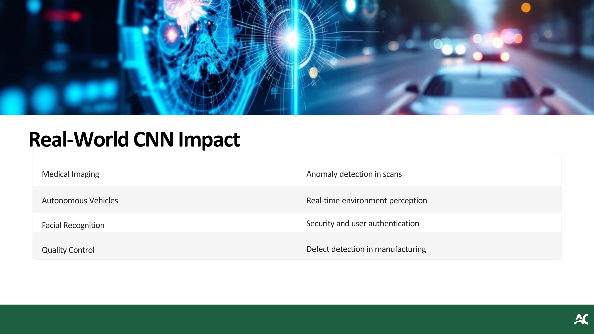

**Real-world impact slide:** Title "Real-World CNN Impact". Four horizontal cards/rows, each with a domain and its application: Medical Imaging → Anomaly detection in scans, Autonomous Vehicles → Real-time environment perception, Facial Recognition → Security and user authentication, Quality Control → Defect detection in manufacturing. Background features a cityscape at night with AI visual overlay effects (glowing networks and recognized objects).

**现实影响页：** 标题"Real-World CNN Impact"。四行水平卡片，每行显示一个领域及其应用：Medical Imaging → 扫描中的异常检测，Autonomous Vehicles → 实时环境感知，Facial Recognition → 安全和用户认证，Quality Control → 制造中的缺陷检测。背景为夜间城市景观，覆盖AI视觉效果（发光网络和被识别的物体）。

| Domain              | Application                          | 领域              | 应用             |
| ------------------- | ------------------------------------ | ------------------- | -------------------- |
| Medical Imaging     | Anomaly detection in scans           | 医学影像     | 扫描中的异常检测           |
| Autonomous Vehicles | Real-time environment perception     | 自动驾驶 | 实时环境感知     |
| Facial Recognition  | Security and user authentication     | 人脸识别  | 安全和用户认证     |
| Quality Control     | Defect detection in manufacturing    | 质量控制     | 制造中的缺陷检测    |

> **📝 Notes:**
>
> **🎯 Why:**
> CNNs are not just an academic topic — they power the most impactful AI systems today. Understanding applications helps you: (1) know which CNN architecture fits which problem, (2) anticipate exam questions about practical scenarios, and (3) see why the theory from previous sections matters in practice.
>
>> CNN不仅是学术话题——它们驱动着当今最有影响力的AI系统。了解应用帮助你：(1) 知道哪种CNN架构适合哪种问题，(2) 预期关于实际场景的考试问题，(3) 理解前面章节理论在实践中的意义。
>>
>
> **💡 Intuition:**
> **(1) Classification vs Detection vs Segmentation (分类 vs 检测 vs 分割):**
>
> Classification: "This image contains a cat" (one label per image). Detection: "There's a cat at coordinates (100,200)-(300,400)" (bounding box + label). Segmentation: "These exact pixels belong to a cat" (pixel-level mask). Each task builds on the previous — detection = classification + localization, segmentation = detection at pixel level.
>
>> 分类："这张图有一只猫"（每张图一个标签）。检测："坐标(100,200)-(300,400)处有只猫"（边界框+标签）。分割："这些精确的像素属于猫"（像素级掩码）。每个任务基于前一个构建——检测=分类+定位，分割=像素级检测。
>>
>
> **⚖️ Compare:**
> | Task | Output | Granularity | Example Architecture |
> |---|---|---|---|
> | Classification | Single label | Image-level | VGG, ResNet |
> | Object Detection | Bounding boxes + labels | Region-level | YOLO, Faster R-CNN |
> | Semantic Segmentation | Pixel-wise class map | Pixel-level | FCN, U-Net |
> | Instance Segmentation | Per-object pixel mask | Object + pixel | Mask R-CNN |
>
>> | 任务 | 输出 | 粒度 | 示例架构 |
>> |---|---|---|---|
>> | 分类 | 单个标签 | 图像级 | VGG, ResNet |
>> | 目标检测 | 边界框+标签 | 区域级 | YOLO, Faster R-CNN |
>> | 语义分割 | 像素类别图 | 像素级 | FCN, U-Net |
>> | 实例分割 | 每个物体的像素掩码 | 物体+像素 | Mask R-CNN |
>>
>
> **📝 Exam:**
> (1) **应用题 (Application):** "Name 4 real-world applications of CNNs." → Medical imaging (anomaly detection), autonomous vehicles (environment perception), facial recognition (security), quality control (defect detection).
> (2) **对比题 (Comparison):** "What is the difference between image classification and object detection?" → Classification assigns one label to entire image; detection locates multiple objects with bounding boxes and labels.
>
>> (1) **应用题：** "列举CNN的4个现实应用。" → 医学影像（异常检测）、自动驾驶（环境感知）、人脸识别（安全认证）、质量控制（缺陷检测）。
>> (2) **对比题：** "图像分类和目标检测的区别？" → 分类给整张图像分配一个标签；检测用边界框和标签定位多个物体。
>>

---

## 9. 性能评估指标 (Performance Evaluation Metrics)

### 9.1 分类、回归与聚类评估概览 (Classification, Regression & Clustering Overview)

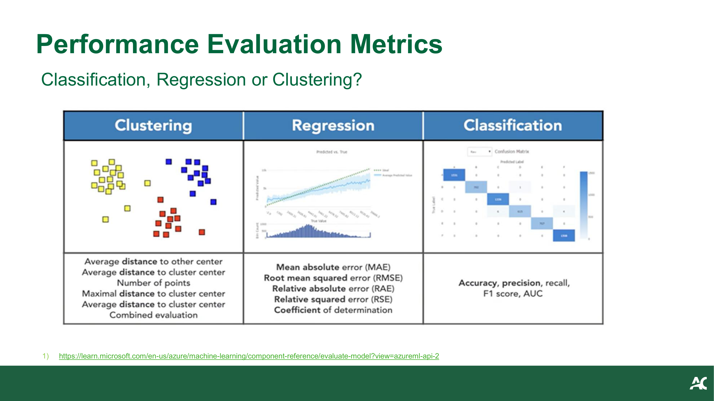

**Evaluation overview slide:** Title "Performance Evaluation Metrics". Shows a comparison table of three task types: Clustering (distance-based metrics), Regression (MAE, RMSE), Classification (Accuracy, Precision, Recall, F1, AUC). Each column has representative metric names. Reference link at the bottom.

**评估概述页：** 标题"Performance Evaluation Metrics"。展示三类任务的评估指标对比表：聚类（基于距离的指标）、回归（MAE、RMSE）、分类（Accuracy、Precision、Recall、F1、AUC）。每列有代表性指标名称。底部有参考链接。

**Performance Evaluation Metrics — Classification, Regression or Clustering?** — 展示三类任务的评估指标对比表：聚类（距离度量）、回归（MAE/RMSE等）、分类（Accuracy/Precision/Recall/F1/AUC）

Ref: https://learn.microsoft.com/en-us/azure/machine-learning/component-reference/evaluate-model?view=azureml-api-2

### 9.2 准确率与精确率 (Accuracy & Precision)

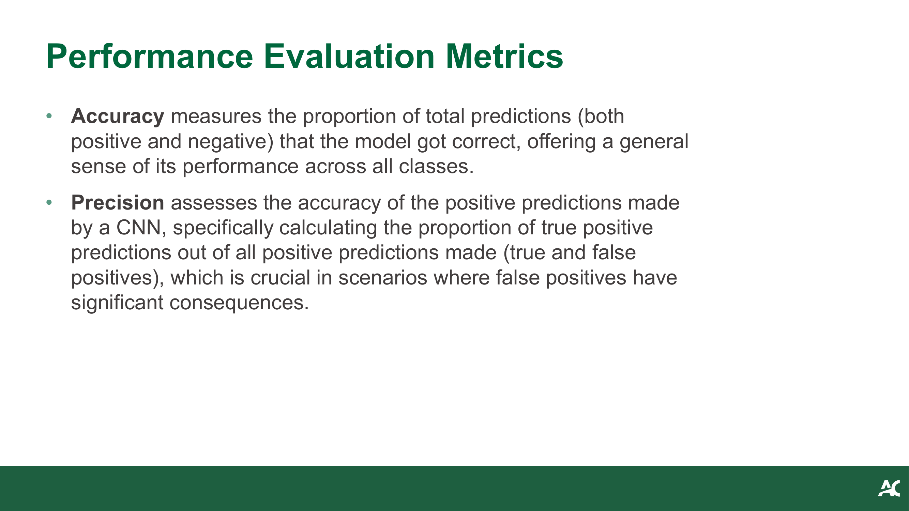

**Accuracy & Precision slide:** Title "Accuracy & Precision". Two sections: (1) Accuracy — definition and formula text explaining proportion of correct predictions. (2) Precision — definition focusing on positive prediction correctness. Each has a small illustrative icon. Formulas may be shown inline.

**准确率与精确率页：** 标题"Accuracy & Precision"。两个部分：(1) Accuracy——定义和公式文字，解释正确预测的比例。(2) Precision——定义，聚焦正预测的正确性。每个配有小插图图标。公式可能内联展示。

- **Accuracy** measures the proportion of total predictions (both positive and negative) that the model got correct, offering a general sense of its performance across all classes. — **准确率**衡量模型正确预测的总比例（包括正例和反例），提供其在所有类别中性能的总体感觉。
- **Precision** assesses the accuracy of the positive predictions made by a CNN, specifically calculating the proportion of true positive predictions out of all positive predictions made (true and false positives), which is crucial in scenarios where false positives have significant consequences. — **精确率**评估CNN正预测的准确性，具体计算真正例占所有正预测（真正例和假正例）的比例，在假正例产生重大后果的场景中至关重要。

### 9.3 召回率、F1分数与ROC (Recall, F1 Score & ROC)

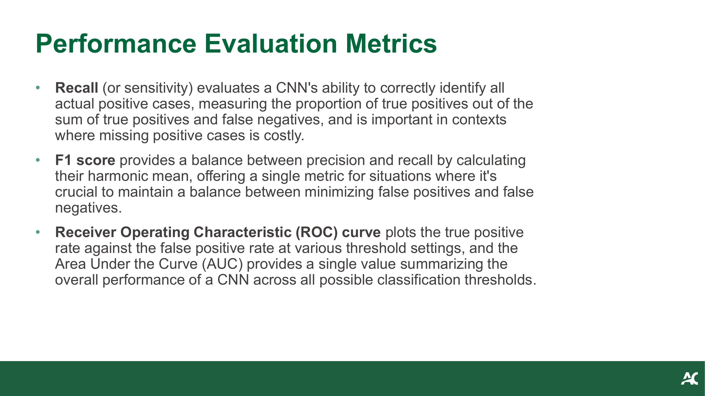

**F1 and ROC slide:** Top section: "F1-Score" — formula F1 = 2 × (Precision × Recall) / (Precision + Recall), with explanation about harmonic mean balancing precision and recall. Bottom section: "ROC Curve" — a graph showing Receiver Operating Characteristic curve with True Positive Rate on y-axis and False Positive Rate on x-axis. A diagonal dashed line represents random chance (AUC=0.5), and a curved line above it represents a good classifier (AUC closer to 1.0). Area under the curve (AUC) is shaded.

**F1和ROC页：** 顶部："F1-Score"——公式F1 = 2×(Precision×Recall)/(Precision+Recall)，附关于调和平均数平衡精确率和召回率的说明。底部："ROC Curve"——接收者操作特征曲线图，y轴为True Positive Rate，x轴为False Positive Rate。对角虚线代表随机猜测（AUC=0.5），上方曲线代表好的分类器（AUC接近1.0）。曲线下面积（AUC）被阴影标出。

- **F1-Score** = 2 × (Precision × Recall) / (Precision + Recall) — **F1分数** = 2 × (精确率 × 召回率) / (精确率 + 召回率)
  - Harmonic mean of precision and recall — 精确率和召回率的调和平均数
  - Balances both metrics into a single score — 将两个指标平衡为一个单一分数
- **ROC Curve** — Receiver Operating Characteristic — **ROC曲线** — 接收者操作特征曲线
  - Plots True Positive Rate vs False Positive Rate — 绘制真正例率vs假正例率
  - **AUC** (Area Under Curve) — closer to 1.0 = better model — **AUC**（曲线下面积）— 越接近1.0 = 模型越好
  - Diagonal line = random chance (AUC = 0.5) — 对角线 = 随机猜测（AUC = 0.5）

### 9.4 混淆矩阵 (Confusion Matrix)

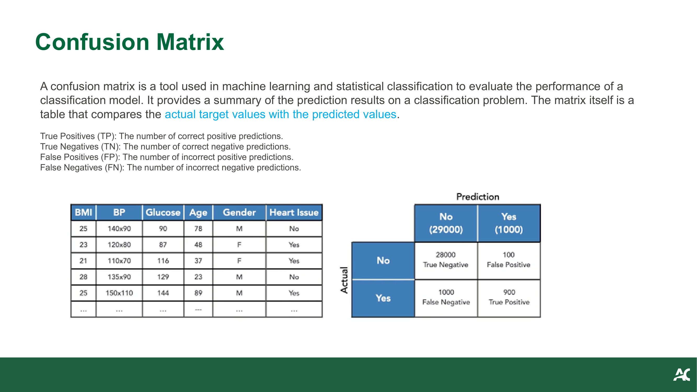

**Confusion matrix slide:** Title "Confusion Matrix". Shows a 2×2 grid table with "Predicted" on the x-axis (Positive/Negative columns) and "Actual" on the y-axis (Positive/Negative rows). Four quadrants are color-coded: TP (green, top-left), FP (red, top-right), FN (red/orange, bottom-left), TN (green, bottom-right). Brief definitions of each term appear beside the matrix.

**混淆矩阵页：** 标题"Confusion Matrix"。展示2×2网格表，x轴"Predicted"（Positive/Negative列），y轴"Actual"（Positive/Negative行）。四个象限彩色编码：TP（绿色，左上）、FP（红色，右上）、FN（红/橙色，左下）、TN（绿色，右下）。矩阵旁有每个术语的简要定义。

**Confusion Matrix** — 展示混淆矩阵结构图：Predicted vs Actual 的2×2表格，标注TP/TN/FP/FN四个象限

- A confusion matrix is a tool used in machine learning and statistical classification to evaluate the performance of a classification model. It provides a summary of the prediction results on a classification problem. The matrix itself is a table that compares the actual target values with the predicted values. — 混淆矩阵是机器学习和统计分类中用于评估分类模型性能的工具。它提供分类问题预测结果的摘要。矩阵本身是一个将实际目标值与预测值进行比较的表格。
- **True Positives (TP):** The number of correct positive predictions. — **真正例（TP）：**正确的正预测数量。
- **True Negatives (TN):** The number of correct negative predictions. — **真反例（TN）：**正确的负预测数量。
- **False Positives (FP):** The number of incorrect positive predictions. — **假正例（FP）：**错误的正预测数量。
- **False Negatives (FN):** The number of incorrect negative predictions. — **假反例（FN）：**错误的负预测数量。

### 9.5 评估指标公式 (Metric Formulas)

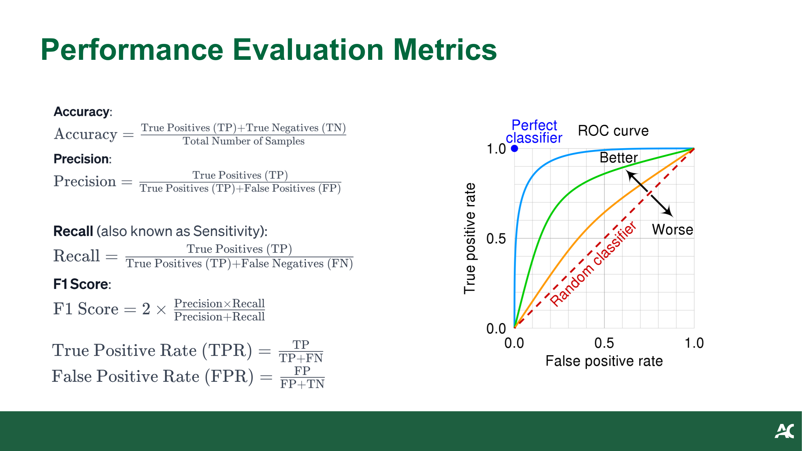

**Formula summary slide:** Title "Performance Evaluation Metrics". Lists four formulas with mathematical notation: Accuracy = (TP+TN)/(TP+TN+FP+FN), Precision = TP/(TP+FP), Recall = TP/(TP+FN), F1 = 2×(P×R)/(P+R). Each formula has a brief one-line description. Clean layout with formulas in large font.

**公式总结页：** 标题"Performance Evaluation Metrics"。列出四个带数学符号的公式：Accuracy = (TP+TN)/(TP+TN+FP+FN)，Precision = TP/(TP+FP)，Recall = TP/(TP+FN)，F1 = 2×(P×R)/(P+R)。每个公式附一行简要描述。清晰的大字体公式布局。

**Performance Evaluation Metrics — Formulas** — 展示Accuracy、Precision、Recall和F1 Score的计算公式

> **📝 Notes:**
>
> **📌 What:**
> **(1) The Four Outcomes (四种结果):**
>
> Every prediction falls into exactly one of four categories. Think of a fire alarm:
> - **TP (True Positive):** Alarm rings → fire exists → ✅ correct alert
> - **FP (False Positive):** Alarm rings → no fire → ❌ false alarm (Type I error)
> - **FN (False Negative):** Alarm silent → fire exists → ❌ missed fire (Type II error)
> - **TN (True Negative):** Alarm silent → no fire → ✅ correct silence
>
>> 每个预测恰好落入四个类别之一。以火警为例：
>> - **TP（真正例）：** 警报响→有火→✅正确报警
>> - **FP（假正例）：** 警报响→无火→❌误报（第I类错误）
>> - **FN（假反例）：** 警报没响→有火→❌漏报（第II类错误）
>> - **TN（真反例）：** 警报没响→无火→✅正确沉默
>>
>
> **🎯 Why:**
> **(1) Why accuracy alone is misleading:**
>
> If 99% of medical scans are healthy, a model that ALWAYS predicts "healthy" gets 99% accuracy — but catches **zero** cancers. This is the **class imbalance trap**. Precision, recall, and F1 were designed to evaluate performance on the **minority class** (e.g., cancer patients) which is often the class we care about most.
>
>> 如果99%的医学扫描是健康的，一个始终预测"健康"的模型准确率99%——但检出**零**例癌症。这是**类别不平衡陷阱**。精确率、召回率和F1被设计来评估**少数类**（如癌症患者）的性能，这通常是我们最关心的类。
>>
>
> **(2) When to prioritize Precision vs Recall:**
>
> - **Precision matters most** when false positives are costly: Email spam filter → FP means a legitimate email goes to spam (important email missed). You want high precision.
> - **Recall matters most** when false negatives are costly: Cancer screening → FN means a cancer patient is told "you're fine" (life-threatening). You want high recall.
> - **F1 balances both** when you can't afford to sacrifice either.
>
>> - **精确率更重要**当假正例代价高：垃圾邮件过滤→FP意味着合法邮件进垃圾箱（重要邮件丢失）。你需要高精确率。
>> - **召回率更重要**当假反例代价高：癌症筛查→FN意味着癌症患者被告知"你很好"（致命）。你需要高召回率。
>> - **F1平衡两者**当你不能牺牲任一方时。
>>
>
> **📐 Formula:**
>
> **(1) Accuracy = (TP + TN) / (TP + TN + FP + FN):**
>
> - Numerator **(TP + TN)**: all correct predictions — both correctly identified positives and correctly identified negatives
> - Denominator **(TP + TN + FP + FN)**: total number of predictions (i.e., every sample in the dataset)
> - Overall: "what fraction of ALL predictions were correct?" Range: [0, 1]
> - ⚠️ Misleading on imbalanced datasets — a model that always predicts the majority class can score high
>
>> **(1) Accuracy = (TP + TN) / (TP + TN + FP + FN)：**
>>
>> - 分子 **(TP + TN)**：所有正确的预测——正确识别的正例和正确识别的负例
>> - 分母 **(TP + TN + FP + FN)**：预测总数（即数据集中的每个样本）
>> - 整体："所有预测中有多少比例是正确的？" 范围：[0, 1]
>> - ⚠️ 在不平衡数据集上具有误导性——总是预测多数类的模型也能得高分
>>
>
> **(2) Precision = TP / (TP + FP):**
>
> - Numerator **TP**: samples correctly predicted as positive
> - Denominator **(TP + FP)**: all samples the model **predicted** as positive (correct + false alarms)
> - Overall: "of everything the model **flagged as positive**, how many were actually positive?" Range: [0, 1]
> - High precision = few false alarms
>
>> **(2) Precision = TP / (TP + FP)：**
>>
>> - 分子 **TP**：正确预测为正例的样本
>> - 分母 **(TP + FP)**：模型**预测为正例**的所有样本（正确 + 误报）
>> - 整体："模型**标记为正例**的样本中，有多少实际是正例？" 范围：[0, 1]
>> - 高精确率 = 少误报
>>
>
> **(3) Recall = TP / (TP + FN):**
>
> - Numerator **TP**: positive samples correctly found by the model
> - Denominator **(TP + FN)**: all **actually positive** samples (found + missed)
> - Overall: "of all the **real positives**, how many did the model catch?" Range: [0, 1]
> - High recall = few missed positives
>
>> **(3) Recall = TP / (TP + FN)：**
>>
>> - 分子 **TP**：模型正确找到的正例样本
>> - 分母 **(TP + FN)**：所有**实际为正例**的样本（找到的 + 遗漏的）
>> - 整体："所有**真正的正例**中，模型捕获了多少？" 范围：[0, 1]
>> - 高召回率 = 少漏检
>>
>
> **(4) F1 = 2 · P · R / (P + R):**
>
> - **2 · P · R**: product of Precision and Recall, doubled
> - **(P + R)**: sum of Precision and Recall
> - This is the **harmonic mean** — it penalizes extreme imbalance between P and R far more than an arithmetic mean would
> - If either P or R is near 0, F1 collapses to near 0 (arithmetic mean would hide this). Range: [0, 1]
>
>> **(4) F1 = 2 · P · R / (P + R)：**
>>
>> - **2 · P · R**：精确率和召回率的乘积，乘以2
>> - **(P + R)**：精确率和召回率之和
>> - 这是**调和平均**——比算术平均更严厉地惩罚P和R之间的极端不平衡
>> - 如果P或R中任一接近0，F1就会趋近于0（算术平均会掩盖这一点）。范围：[0, 1]
>>
>
> **(5) AUC = Area under the ROC curve:**
>
> - ROC curve: plots **Recall (TPR)** on Y-axis vs **False Positive Rate (FPR = FP/(FP+TN))** on X-axis at varying classification thresholds
> - AUC measures the model's overall ability to **rank** positives above negatives
> - AUC = 1.0: perfect separation; AUC = 0.5: random guessing (diagonal line). Range: [0, 1]
>
>> **(5) AUC = ROC曲线下面积：**
>>
>> - ROC曲线：在不同分类阈值下，Y轴画**召回率(TPR)**，X轴画**假正率(FPR = FP/(FP+TN))**
>> - AUC衡量模型将正例**排序**在负例之上的整体能力
>> - AUC = 1.0：完美分离；AUC = 0.5：随机猜测（对角线）。范围：[0, 1]
>>
>
> **🔢 Example:**
> **Problem:** A cancer detector has: TP=80, FP=20, FN=10, TN=890. Calculate all metrics.
> **Solution:**
> - Accuracy = (80+890)/(80+890+20+10) = 970/1000 = **0.97**
> - Precision = 80/(80+20) = 80/100 = **0.80** (20% of "cancer" predictions were wrong)
> - Recall = 80/(80+10) = 80/90 = **0.889** (missed 10 out of 90 actual cancers)
> - F1 = 2×0.80×0.889/(0.80+0.889) = 1.422/1.689 = **0.842**
> - Note: 97% accuracy looks great, but 10 cancer patients were missed!
>
>> **题目：** 一个癌症检测器有：TP=80, FP=20, FN=10, TN=890。计算所有指标。
>> **解：**
>> - 准确率 = (80+890)/(80+890+20+10) = 970/1000 = **0.97**
>> - 精确率 = 80/(80+20) = 80/100 = **0.80**（20%的"癌症"预测是错的）
>> - 召回率 = 80/(80+10) = 80/90 = **0.889**（漏掉了90个实际癌症中的10个）
>> - F1 = 2×0.80×0.889/(0.80+0.889) = 1.422/1.689 = **0.842**
>> - 注意：97%的准确率看起来很好，但10个癌症患者被漏掉了！
>>
>
> **💡 Intuition:**
> **(1) Precision vs Recall tug-of-war (精确率与召回率此消彼长):**
>
> Imagine a fisherman. To maximize recall (catch all target fish), use a huge net — you'll catch everything, but also lots of unwanted fish (low precision). To maximize precision (only target fish), use a tiny precise hook — you'll never catch a wrong fish, but miss many target fish (low recall). **F1 finds the optimal net size.**
>
>> 想象一个渔夫。为最大化召回率（抓住所有目标鱼），用一张巨网——你抓住一切，但也有很多不想要的鱼（低精确率）。为最大化精确率（只要目标鱼），用小精确的鱼钩——永不抓错鱼，但错过很多目标鱼（低召回率）。**F1找到最佳网的大小。**
>>
>
> **(2) ROC curve intuition (ROC曲线直觉):**
>
> The ROC curve plots "sensitivity" (recall) against "false alarm rate" at different thresholds. A perfect model goes straight up to (0,1) then right — AUC = 1.0. A random model follows the diagonal — AUC = 0.5. The higher and left-er the curve, the better the model distinguishes positive from negative cases.
>
>> ROC曲线在不同阈值下绘制"灵敏度"（召回率）vs"误报率"。完美模型直接上到(0,1)再向右——AUC=1.0。随机模型沿对角线——AUC=0.5。曲线越高越靠左，模型区分正/负样本越好。
>>
>
> **⚠️ Pitfall:**
> (1) **F1 uses harmonic mean, NOT arithmetic mean.** Harmonic mean penalizes extreme imbalance: if Precision=1.0 and Recall=0.01, arithmetic mean = 0.505 (looks OK), but F1 = 0.02 (correctly shows terrible performance).
> (2) **Accuracy is valid only for balanced datasets.** For imbalanced datasets (common in real-world problems), always report F1, Precision, and Recall alongside accuracy.
> (3) **Confusion matrix rows vs columns:** Different textbooks swap them. Always check: does the row represent actual or predicted? The slide convention: rows = actual, columns = predicted.
>
>> (1) **F1用调和平均，不是算术平均。** 调和平均惩罚极端不平衡：如果Precision=1.0而Recall=0.01，算术平均=0.505（看起来还行），但F1=0.02（正确显示糟糕性能）。
>> (2) **准确率仅对平衡数据集有效。** 对于不平衡数据集（现实中常见），始终在准确率旁报告F1、精确率和召回率。
>> (3) **混淆矩阵的行vs列：** 不同教材会互换。总是检查：行代表实际还是预测？本课程约定：行=实际，列=预测。
>>
>
> **📝 Exam:**
>
> **(1) 计算题 (Calculation):**
>
> "Given TP=50, FP=10, FN=5, TN=35. Calculate Accuracy, Precision, Recall, and F1."
> - Accuracy = (50+35) / (50+35+10+5) = 85/100 = **0.85**
> - Precision = 50 / (50+10) = 50/60 = **0.833**
> - Recall = 50 / (50+5) = 50/55 = **0.909**
> - F1 = 2 × 0.833 × 0.909 / (0.833 + 0.909) = 1.514 / 1.742 = **0.870**
>
>> "已知 TP=50, FP=10, FN=5, TN=35。计算准确率、精确率、召回率和F1。"
>> - 准确率 = (50+35)/100 = **0.85**
>> - 精确率 = 50/60 = **0.833**
>> - 召回率 = 50/55 = **0.909**
>> - F1 = 2×0.833×0.909/(0.833+0.909) = **0.870**
>>
>
> **(2) 概念题 (Concept):**
>
> "In a medical diagnosis system, which metric is most important: accuracy, precision, or recall? Why?"
> → **Recall**, because failing to detect a disease (FN) is more dangerous than a false alarm (FP). A missed cancer diagnosis could be fatal; a false alarm only leads to additional testing.
>
>> "在医疗诊断系统中，哪个指标最重要：准确率、精确率还是召回率？为什么？"
>> → **召回率**，因为未检出疾病（FN）比误报（FP）更危险。漏检癌症可能致命；误报只是多做一次检查。
>>
>
> **(3) 分析题 (Analysis):**
>
> "A model has 99% accuracy but F1=0.10. What does this tell you?"
> → **Severe class imbalance.** The dataset is dominated by one class (e.g., 99% negative). The model correctly predicts the majority class, achieving high accuracy, but almost completely fails on the minority class (the one we actually care about), resulting in a very low F1.
>
>> "一个模型准确率99%但F1=0.10。说明什么？"
>> → **严重的类别不平衡。** 数据集被一个类别主导（如99%为负例）。模型正确预测多数类，获得高准确率，但几乎完全无法识别少数类（我们真正关心的类），导致F1极低。
>>

---

## 10. 伦理考虑与下周预告 (Ethical Considerations & Next Week Preview)

### 10.1 伦理考虑与AI偏见 (Ethical Considerations & Bias in CNNs)

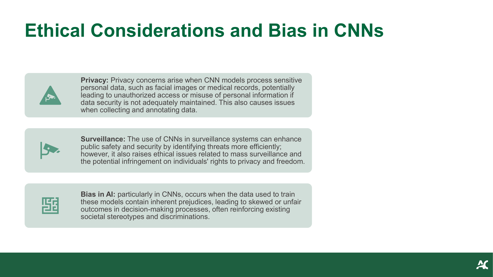

**Ethics slide:** Title "Ethical Considerations and Bias in CNNs". Three sections with icons: (1) Privacy — padlock icon, paragraph about processing sensitive data. (2) Surveillance — camera icon, paragraph about public safety vs civil liberties. (3) Bias in AI — scales icon, paragraph about training data prejudices leading to unfair outcomes. Dark background with contrasting text.

**伦理考虑页：** 标题"Ethical Considerations and Bias in CNNs"。三个配图标的部分：(1) Privacy — 挂锁图标，关于处理敏感数据的段落。(2) Surveillance — 相机图标，关于公共安全vs公民自由的段落。(3) Bias in AI — 天平图标，关于训练数据偏见导致不公正结果的段落。深色背景配对比文字。

**Ethical Considerations and Bias in CNNs:** — **CNN的伦理考虑和偏见：**

- **Privacy:** Privacy concerns arise when CNN models process sensitive personal data, such as facial images or medical records, potentially leading to unauthorized access or misuse of personal information if data security is not adequately maintained. This also causes issues when collecting and annotating data. — **隐私：**当CNN模型处理敏感个人数据（如面部图像或医疗记录）时，如果数据安全未得到充分维护，可能导致未经授权的访问或个人信息的滥用。这也在收集和标注数据时产生问题。
- **Surveillance:** The use of CNNs in surveillance systems can enhance public safety and security by identifying threats more efficiently; however, it also raises ethical issues related to mass surveillance and the potential infringement on individuals' rights to privacy and freedom. — **监控：**在监控系统中使用CNN可以通过更有效地识别威胁来增强公共安全；然而，它也引发了与大规模监控和可能侵犯个人隐私和自由权利相关的伦理问题。
- **Bias in AI:** particularly in CNNs, occurs when the data used to train these models contain inherent prejudices, leading to skewed or unfair outcomes in decision-making processes, often reinforcing existing societal stereotypes and discriminations. — **AI偏见：**尤其在CNN中，当用于训练这些模型的数据包含固有偏见时，会导致决策过程中的偏斜或不公平结果，往往强化现有的社会刻板印象和歧视。

> **📝 Notes:**
>
> **📌 What:**
> **(1) Three pillars of CNN ethics (CNN伦理三大支柱):**
>
> - **Privacy:** CNN models trained on facial/medical data can expose personal information if data leaks or if models memorize training samples. GDPR and similar laws regulate this.
> - **Surveillance:** Face recognition in public spaces enables mass tracking without consent. China's social credit system and Western police facial recognition are real examples.
> - **Bias:** If training data is 90% light-skinned faces, the model will perform poorly on darker-skinned faces. This has been documented in commercial systems (MIT study by Buolamwini & Gebru).
>
>> - **隐私：** 在面部/医疗数据上训练的CNN模型如果数据泄露或模型记住训练样本，可能暴露个人信息。GDPR等法律对此进行监管。
>> - **监控：** 公共场所的人脸识别在未经同意的情况下实现大规模跟踪。中国社会信用系统和西方警察面部识别是真实例子。
>> - **偏见：** 如果训练数据90%是浅肤色人脸，模型在深肤色人脸上表现会很差。这在商业系统中已被记录（MIT的Buolamwini & Gebru研究）。
>>
>
> **🎯 Why:**
> Ethics questions appear on exams because they test your ability to think beyond the technical. The key insight: **technology itself is neutral, but its application can be harmful.** A CNN that detects tumors is lifesaving; the same CNN architecture used for mass surveillance without consent is harmful. Understanding this nuance is both exam-relevant and professionally important.
>
>> 伦理问题出现在考试中是因为它们测试你超越技术层面的思考能力。关键洞察：**技术本身是中性的，但其应用可能有害。** 检测肿瘤的CNN可以救命；同样的CNN架构在未经同意的情况下用于大规模监控则有害。理解这种差异既与考试相关，也在职业上很重要。
>>
>
> **⚠️ Pitfall:**
> (1) **"More data = less bias"** is a common misconception. If you collect MORE data with the SAME bias (e.g., more photos from one demographic), you amplify the bias. The solution is **diverse, representative data** and **bias auditing**.
> (2) Don't assume ethical issues only apply to facial recognition. Medical AI can also be biased (trained mostly on data from one ethnic group), and autonomous vehicles may perform differently in neighborhoods with different demographics.
>
>> (1) **"更多数据=更少偏见"**是常见误解。如果你收集具有相同偏见的更多数据（如来自一个人口群体的更多照片），你会放大偏见。解决方案是**多样化、有代表性的数据**和**偏见审计**。
>> (2) 不要以为伦理问题只适用于人脸识别。医疗AI也可能有偏见（主要在一个种族群体的数据上训练），自动驾驶车辆在不同人口统计特征的社区可能表现不同。
>>
>
> **📝 Exam:**
> (1) **论述题 (Discussion):** "Discuss three ethical concerns related to the use of CNNs." → Privacy (sensitive data processing), surveillance (mass tracking), bias (unfair outcomes from biased training data).
> (2) **概念题 (Concept):** "How can bias enter a CNN model?" → Through biased training data — if certain groups are underrepresented, the model learns to perform poorly on those groups.
>
>> (1) **论述题：** "讨论使用CNN的三个伦理顾虑。" → 隐私（敏感数据处理）、监控（大规模跟踪）、偏见（偏见训练数据导致不公正结果）。
>> (2) **概念题：** "偏见如何进入CNN模型？" → 通过有偏见的训练数据——如果某些群体代表不足，模型学会在这些群体上表现不佳。
>>

### 10.2 参考文献 (References)

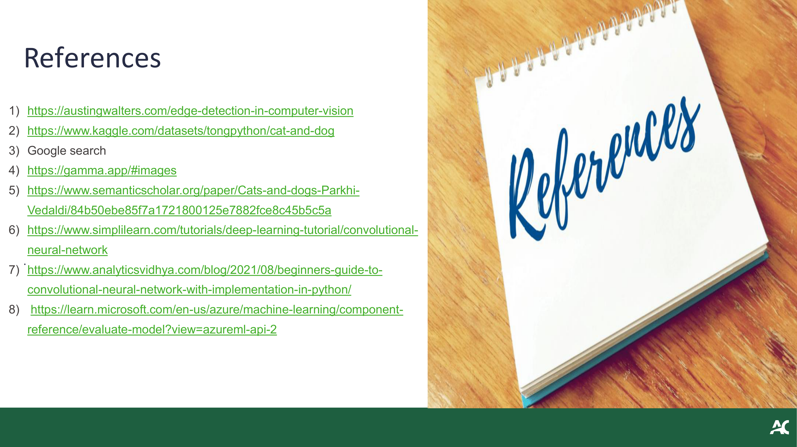

**References slide:** Title "References". A numbered list of 8 hyperlinks on a dark background, including sources from Microsoft Learn, Kaggle, Semantic Scholar, SimpliLearn, and Analytics Vidhya. Each link is displayed as plain URL text.

**参考文献页：** 标题"References"。深色背景上的8个编号超链接列表，包括来自Microsoft Learn、Kaggle、Semantic Scholar、SimpliLearn和Analytics Vidhya的来源。每个链接显示为纯URL文字。

1. https://austingwalters.com/edge-detection-in-computer-vision
2. https://www.kaggle.com/datasets/tongpython/cat-and-dog
3. Google search
4. https://gamma.app/#images
5. https://www.semanticscholar.org/paper/Cats-and-dogs-Parkhi-Vedaldi/84b50ebe85f7a1721800125e7882fce8c45b5c5a
6. https://www.simplilearn.com/tutorials/deep-learning-tutorial/convolutional-neural-network
7. https://www.analyticsvidhya.com/blog/2021/08/beginners-guide-to-convolutional-neural-network-with-implementation-in-python/
8. https://learn.microsoft.com/en-us/azure/machine-learning/component-reference/evaluate-model?view=azureml-api-2

### 10.3 下周预告 (Next Week Preview)

**Next week preview slide:** Title "Next Week Topics". Six bullet points listing upcoming topics in white text on a dark gradient background. Decorative AI/neural network imagery on the right side.

**下周预告页：** 标题"Next Week Topics"。深色渐变背景上六个白色文字的要点列出下周主题。右侧有AI/神经网络装饰图像。

**Next Week Topics:** — **下周主题：**

- CNN Training Process — CNN训练过程
- Loss Function — 损失函数
- Different types of Activation Functions — 不同类型的激活函数
- Back propagation Algorithm — 反向传播算法
- Common Problems in Machine Vision — 机器视觉中的常见问题
- CNN Solutions — CNN解决方案
