# Week 4: Week 4 - Introduction to Convolutional Neural Networks (CNNs)1

> Source: `Week 4 - Introduction to Convolutional Neural Networks (CNNs)1.pptx`
> Total slides: 37

---

## Slide 1

### Convolutional Neural Networks (CNN) in Machine Vision

Transforming visual recognition through deep learning.

Instructor: Stephin Rachel Thomas
Feb 05, 2026

---

## Slide 2

### Today’s Topics

Artificial Neural Networks
Disadvantages of simple ANN for Image classification
Introduction to CNN
CNN architecture
Deep dive into CNN layers
Application of CNN
Performance Evaluation Metrics

---

## Slide 3

### What are Artificial Neural Networks?

Biological Inspiration

ANNs are inspired by the structure and function of the human brain, composed of interconnected nodes called neurons.

2

Learning Through Data

These networks learn by analyzing large datasets, adjusting the connections between neurons to improve their performance.

Pattern Recognition

ANNs are particularly effective at recognizing complex patterns in data, making them ideal for image classification.

1

3

---

## Slide 4

### Classification using Traditional Methods

Decision-tree method

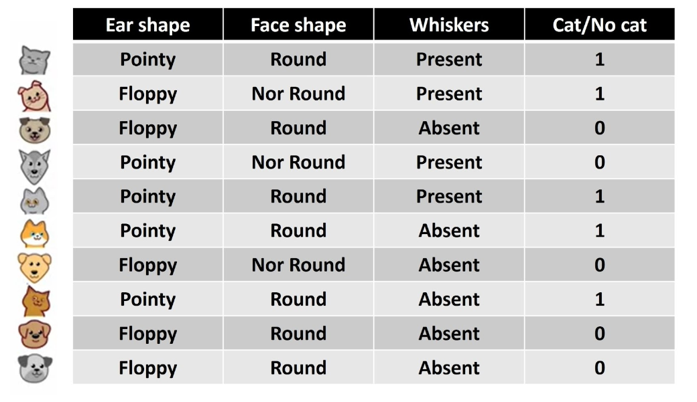

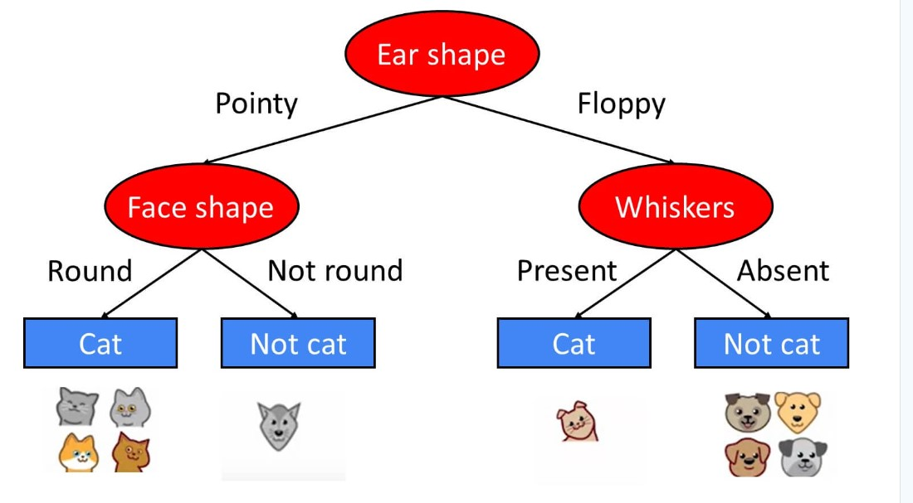

---

## Slide 5

### ANN for Image Classification

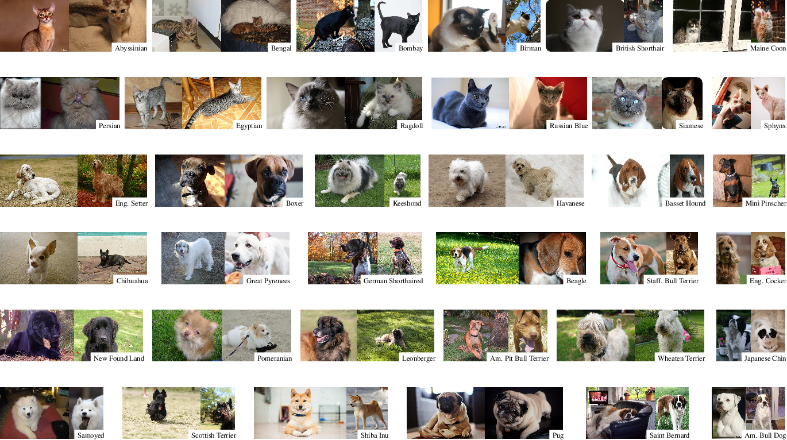

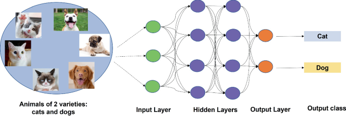

---

## Slide 6

### Limitation of ANN for Image Classification

1000 * 1000px

High compuational cost
Over-fitting problem
Longer training time

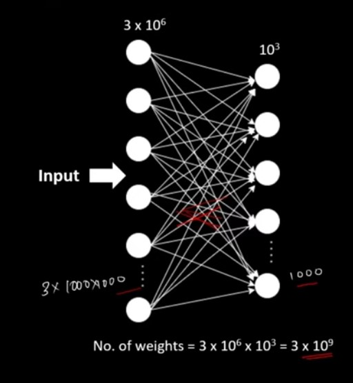

---

## Slide 7

Convolutional Neural Network (CNN)

1

Definition

A deep learning model designed for processing images to identify patterns and make decisions.

2

Objective

Solve complex visual tasks with deep learning.

3

Benefits

Handles high-dimensional, structured data like images, videos and audio.
Hierarchical feature learning.
Robust to translation of object.

---

## Slide 8

### CNNs typically consist of an input layer, multiple hidden layers, and an output layer.
### The hidden layers include a series of convolutional layers, pooling layers and fully connected layers.
### Each layer performs distinct operations: Convolutional layers apply a convolution operation, Pooling layers perform down-sampling, Fully connected layers compute the class scores.

CNN Architecture

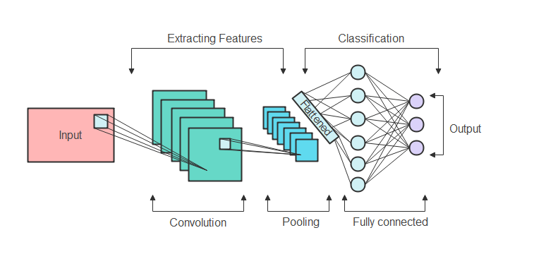

---

## Slide 9

Key Components of CNN

1

Convolutional Layers

Extract spatial features from input images.

2

Pooling Layers

Reduce spatial dimensions, simplify computation.

3

Fully Connected Layers

Integrate features for final classification.

---

## Slide 10

### Deep Dive into Convolutional Layers

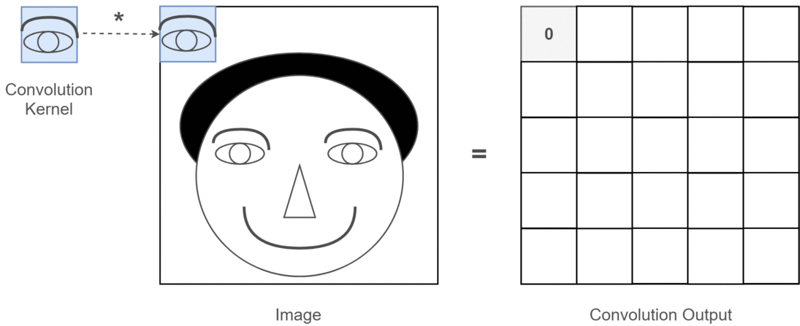

---

## Slide 11

### CNN Fundamentals

The basic principle of a Convolutional Neural Network (CNN) is to automatically learn and extract hierarchical features from input data, typically images, through the use of convolutional layers.

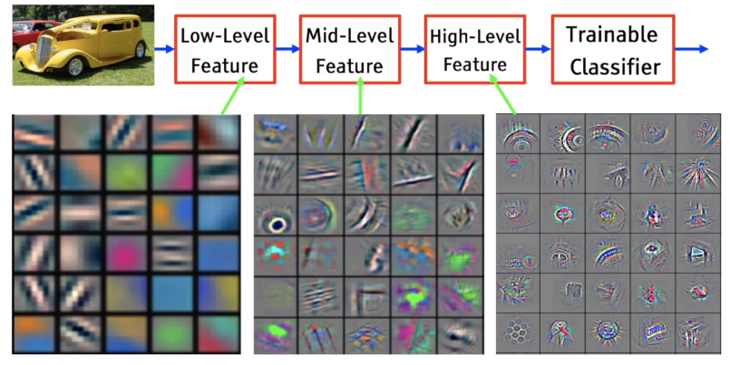

---

## Slide 12

### Convolutional Layers

Feature Maps

Convolutional layers help the network focus on only the most important features
Not all the pixel information in the image is relevant for training the model
Improves performance and accuracy

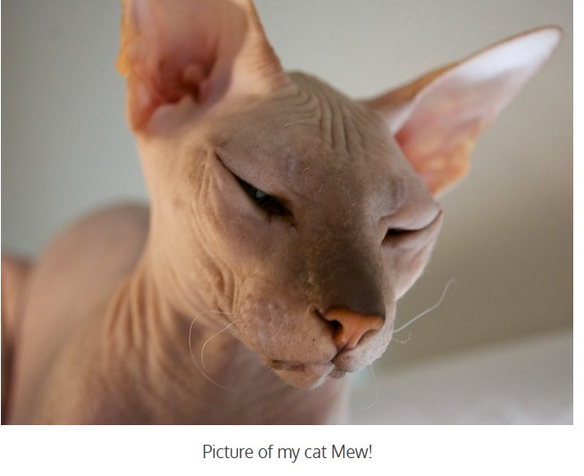

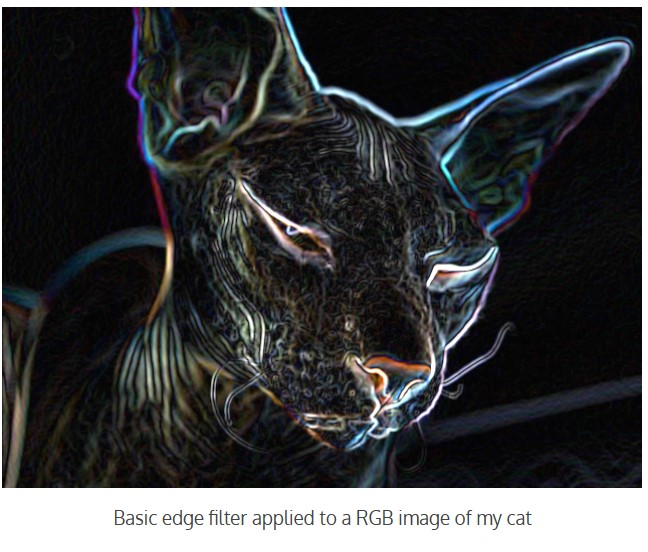

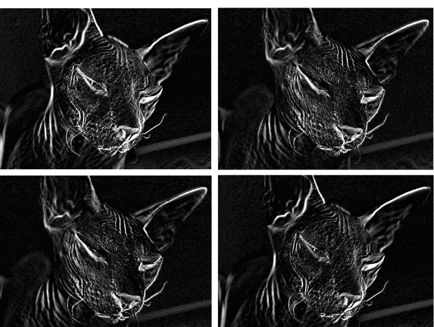

---

## Slide 13

### Convolution Operation

Filter

Convolution operator

Input image

Output Image

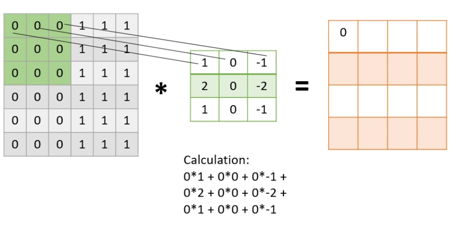

---

## Slide 14

### Convolution Operation

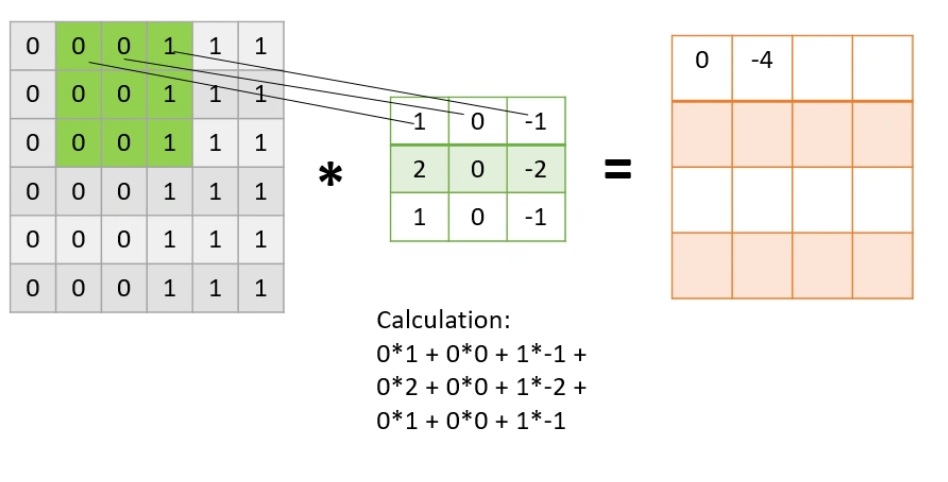

---

## Slide 15

### Convolution Operation

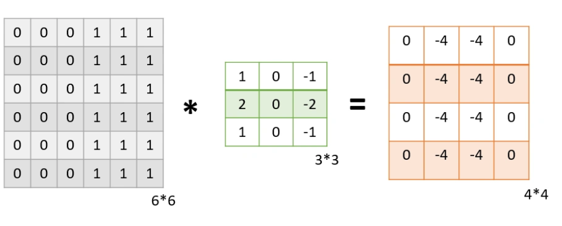

---

## Slide 16

### Convolutional Layers

---

## Slide 17

Convolutional Layer – Output  Image Size

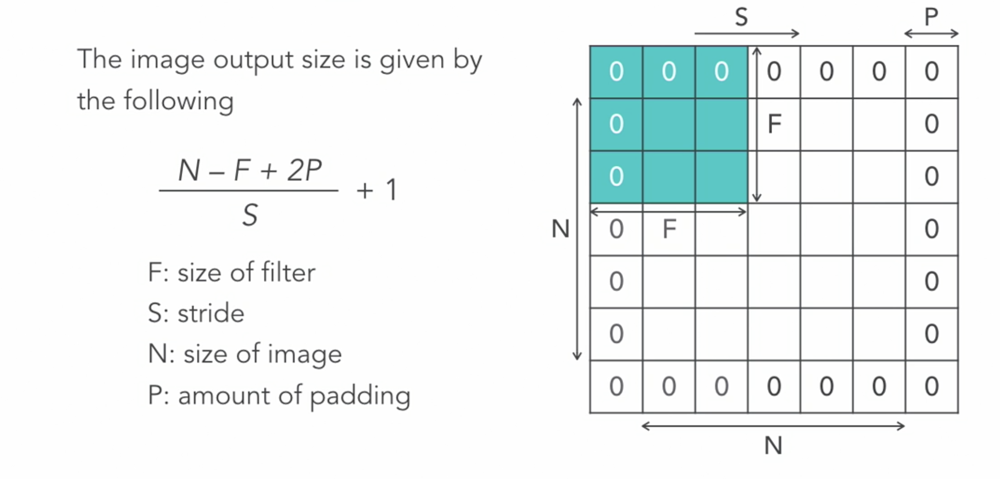

---

## Slide 18

### Pooling Layers

---

## Slide 19

### Pooling Layers

The pooling layer reduces the spatial dimensionality of the input feature map.

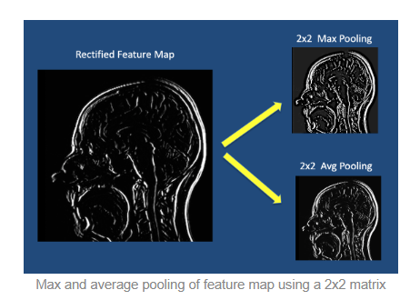

---

## Slide 20

### Pooling Operation

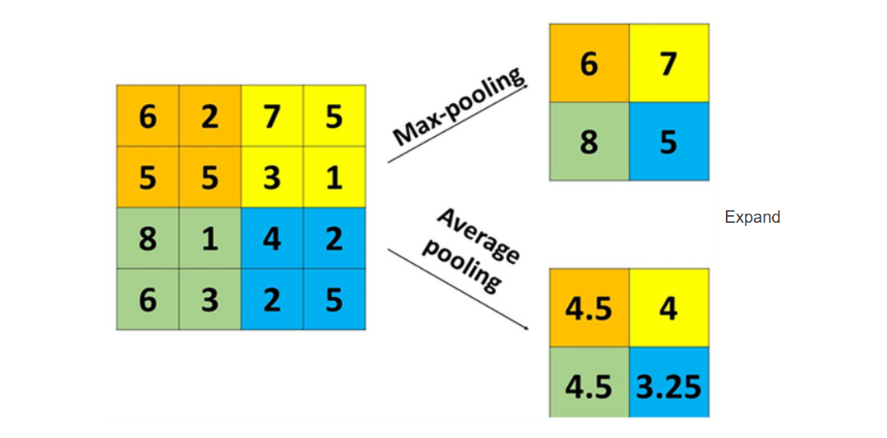

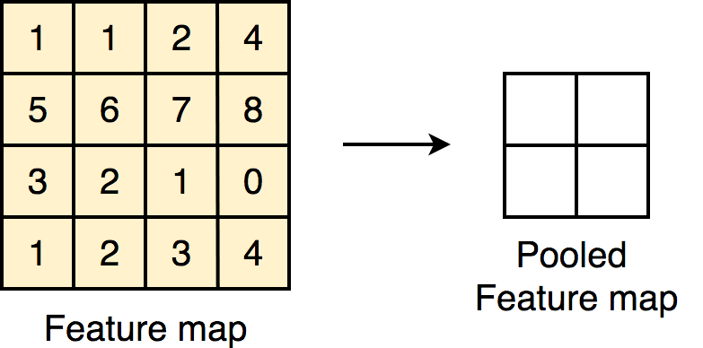

---

## Slide 21

### Fully Connected Layers

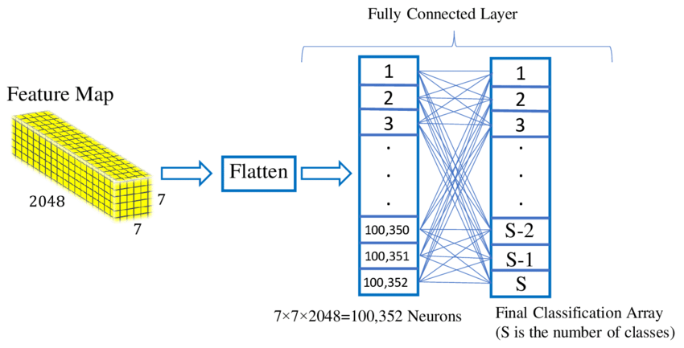

---

## Slide 22

### Flattening

Convolutional and pooling layers produce feature maps
Feature maps are multi-dimensional arrays
Flattening converts feature maps to one-dimensional vector
Concatenates elements along depth dimension
Enables feeding into fully connected layers

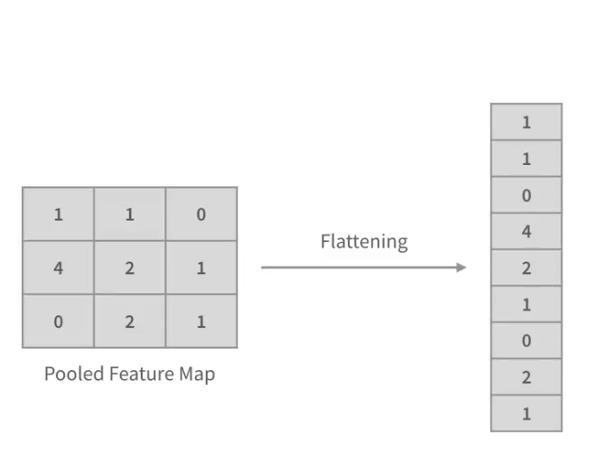

---

## Slide 23

### Weight Matrix and Bias Vector

Foundation for deep learning  algorithms.
Fully connected layer have weight matrix (W) and bias vecor (b)
Weight matrix: (n x m), n = neurons, m = flattened vector length
Bias vector length: number of neurons in the current layer
Learnable parameters of the fully connected layer
Enable transformation and introduce nonlinearity
Input vector is multiplied by weight matrix and bias vector is added
Operation: W * input + b
Output represents weighted sum of input from previous layer

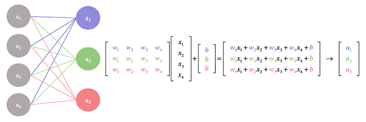

---

## Slide 24

### Activation Functions

Activation function determines if a neuron fires
Introduces nonlinearity to the network
Applied after convolution layer, after each fully conncted later and output layer allowing the network to learn and represent complex patterns in the data\
Most commonly used actiavtion function is ReLU

---

## Slide 25

### Output Layer

The final layer generates predictions
Neurons in the last layer match number of classes
Activation function differs in final layer
Softmax commonly used for multi-class classification
Highest probability neuron represents prediction

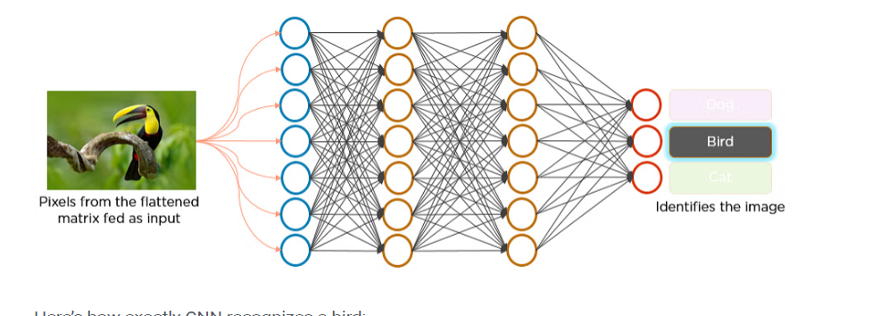

---

## Slide 26

### A supervised learning algorithm used for training neural networks.
### It happens only during training
### Optimizes the parameters (weights and biases) of a neural network by minimizing the error between the predicted output and the actual target value.
### Basic Steps are;
- Feed a sample to the network
- Calculate the mean squared error
- Calculate the error term of each output neuron
- Iteratively calculate the error terms In the hidden layers
- Apply the delta rule
- Adjust the weights

Back Propagation

> **Speaker Notes:** (log loss)

---

## Slide 27

### Image Processing in CNNs

Input

Raw image data enters the network.

Feature Extraction

Convolutional layers detect edges, shapes, textures.

Down-sampling

Pooling layers reduce data complexity.

Classification

Fully connected layers determine image content.

Feature Extraction

Classification

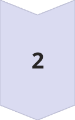

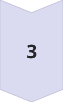

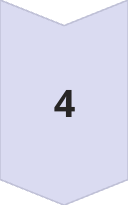

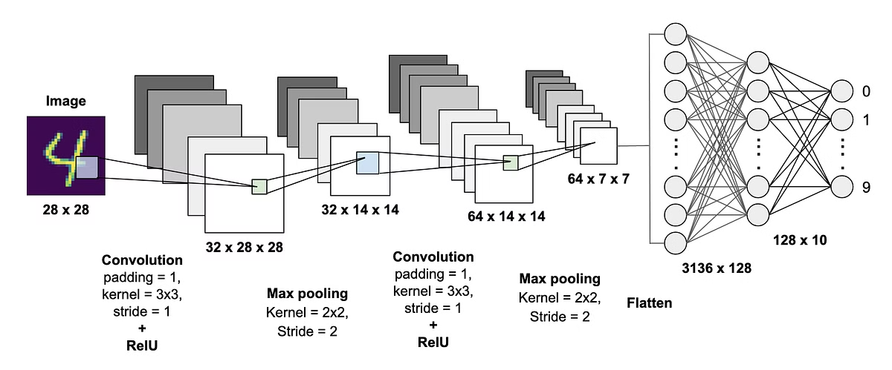

---

## Slide 28

### CNNs have revolutionized the field of computer vision. Applications include image and video recognition, image segmentation, object detection, face recognition, and automated medical diagnosis. They are also used in self-driving cars for detecting objects and pedestrians.
### Can be used for tasks like:
### Image classification
### Object detection
### Semantic and instance segmentation
### Multiple object tracking
### Re-identification
### Any vision task

Applications of CNNs

---

## Slide 29

Real-World CNN Impact

Medical Imaging

Anomaly detection in scans

Autonomous Vehicles

Real-time environment perception

Facial Recognition

Security and user authentication

Quality Control

Defect detection in manufacturing

---

## Slide 30

### Performance Evaluation Metrics

Classification, Regression or Clustering?

https://learn.microsoft.com/en-us/azure/machine-learning/component-reference/evaluate-model?view=azureml-api-2

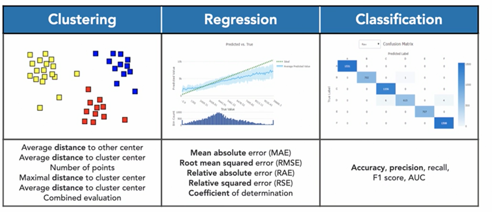

---

## Slide 31

### Performance Evaluation Metrics

Accuracy measures the proportion of total predictions (both positive and negative) that the model got correct, offering a general sense of its performance across all classes.
Precision assesses the accuracy of the positive predictions made by a CNN, specifically calculating the proportion of true positive predictions out of all positive predictions made (true and false positives), which is crucial in scenarios where false positives have significant consequences.

---

## Slide 32

### Performance Evaluation Metrics

Recall (or sensitivity) evaluates a CNN's ability to correctly identify all actual positive cases, measuring the proportion of true positives out of the sum of true positives and false negatives, and is important in contexts where missing positive cases is costly.
F1 score provides a balance between precision and recall by calculating their harmonic mean, offering a single metric for situations where it's crucial to maintain a balance between minimizing false positives and false negatives.
Receiver Operating Characteristic (ROC) curve plots the true positive rate against the false positive rate at various threshold settings, and the Area Under the Curve (AUC) provides a single value summarizing the overall performance of a CNN across all possible classification thresholds.

---

## Slide 33

### Confusion Matrix

A confusion matrix is a tool used in machine learning and statistical classification to evaluate the performance of a classification model. It provides a summary of the prediction results on a classification problem. The matrix itself is a table that compares the actual target values with the predicted values.

True Positives (TP): The number of correct positive predictions.
True Negatives (TN): The number of correct negative predictions.
False Positives (FP): The number of incorrect positive predictions.
False Negatives (FN): The number of incorrect negative predictions.

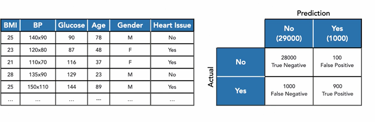

---

## Slide 34

### Performance Evaluation Metrics

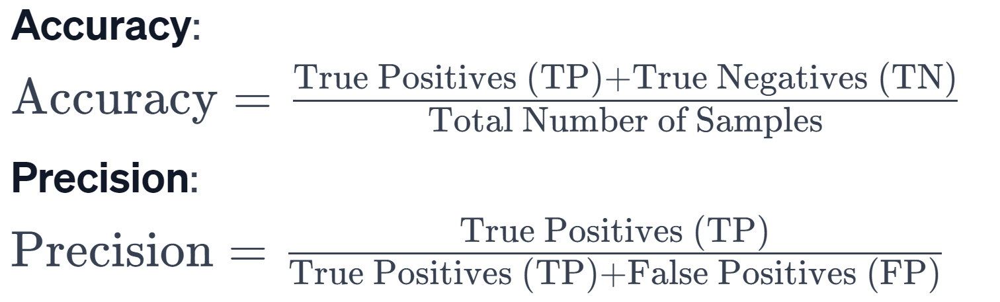

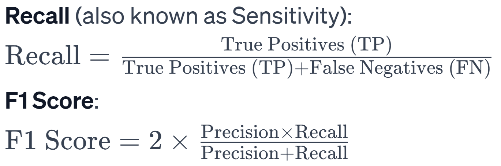

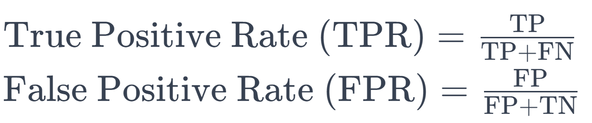

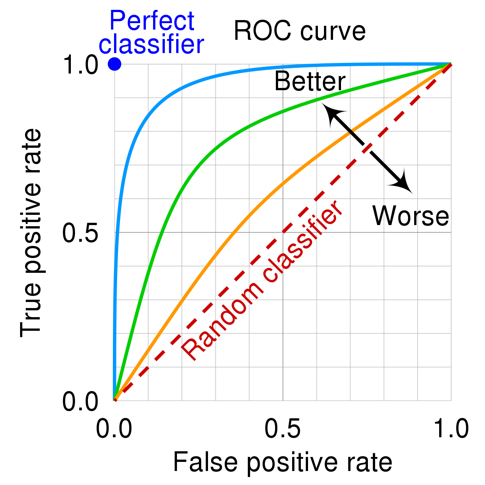

---

## Slide 35

### Ethical Considerations and Bias in CNNs

---

## Slide 36

### References

https://austingwalters.com/edge-detection-in-computer-vision
https://www.kaggle.com/datasets/tongpython/cat-and-dog
Google search
https://gamma.app/#images
https://www.semanticscholar.org/paper/Cats-and-dogs-Parkhi-Vedaldi/84b50ebe85f7a1721800125e7882fce8c45b5c5a
https://www.simplilearn.com/tutorials/deep-learning-tutorial/convolutional-neural-network
https://www.analyticsvidhya.com/blog/2021/08/beginners-guide-to-convolutional-neural-network-with-implementation-in-python/
https://learn.microsoft.com/en-us/azure/machine-learning/component-reference/evaluate-model?view=azureml-api-2

.

---

## Slide 37

### Next Week Topics

CNN Training Process
Loss Function
Different types of Activation Functions
Back propagation Algorithm
Common Problems in Machine Vision
CNN Solutions

.

---
