# Week 5: 图像分类的深度学习 (Deep Learning for Image Classification)

> Source: `Week5_ Deep Learning for Image Classification1.pptx`
> Total slides: 32
> Instructor: Stephin Rachel Thomas | Feb 12, 2026

---

## 1. 深度学习概述 (Introduction to Deep Learning)

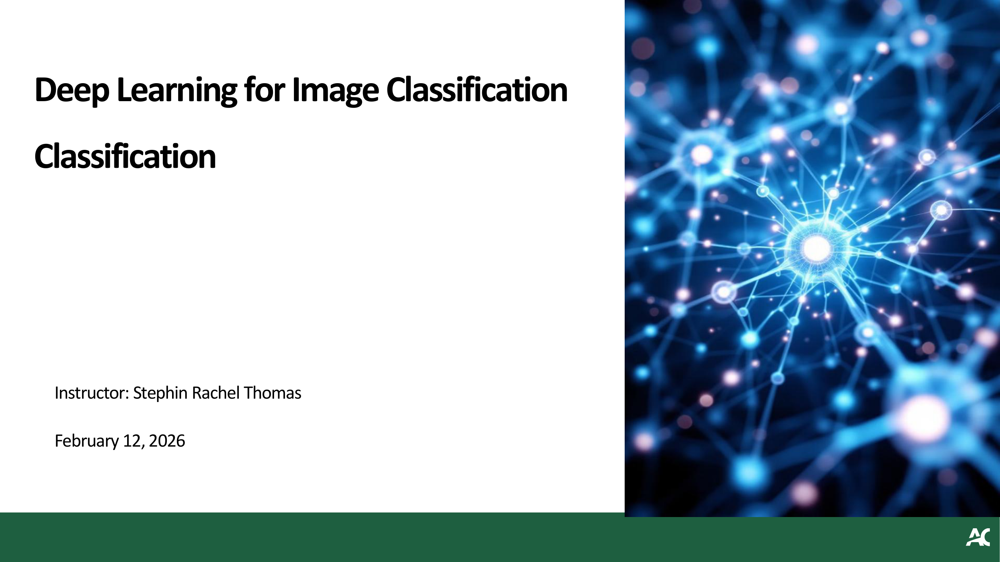

- **Deep Learning for Image Classification** — 图像分类的深度学习
- Instructor: Stephin Rachel Thomas — 讲师：Stephin Rachel Thomas
- February 12, 2026

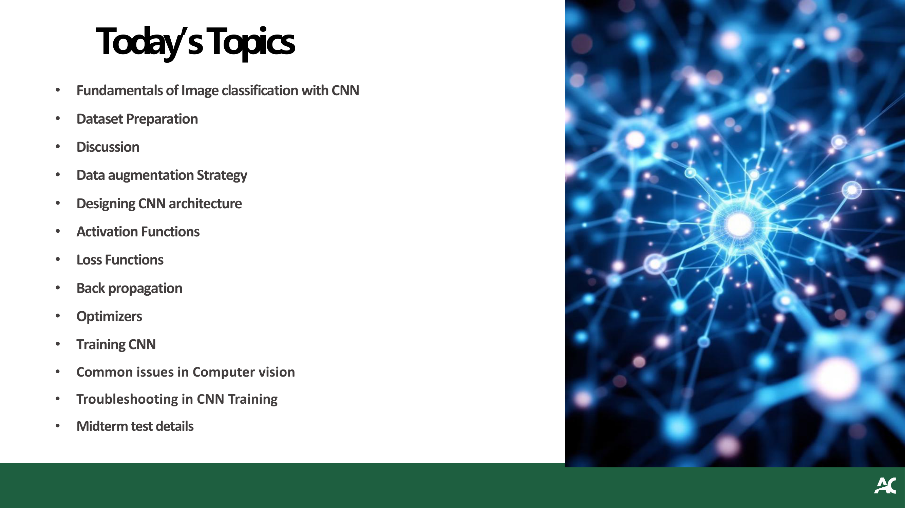

**Today's Topics:**

- Fundamentals of Image classification with CNN — CNN图像分类基础
- Dataset Preparation — 数据集准备
- Discussion — 讨论
- Data augmentation Strategy — 数据增强策略
- Designing CNN architecture — CNN架构设计
- Activation Functions — 激活函数
- Loss Functions — 损失函数
- Back propagation — 反向传播
- Optimizers — 优化器
- Training CNN — 训练CNN
- Common issues in Computer vision — 计算机视觉中的常见问题
- Troubleshooting in CNN Training — CNN训练故障排除
- Midterm test details — 期中考试详情

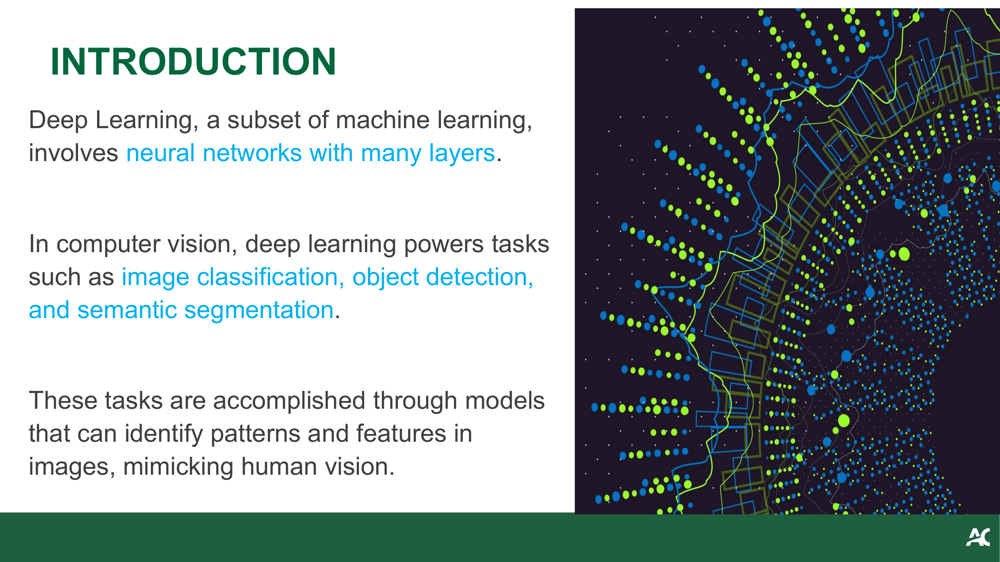

- Deep Learning, a subset of machine learning, involves neural networks with many layers. — 深度学习是机器学习的一个子集，涉及多层神经网络。
- In computer vision, deep learning powers tasks such as image classification, object detection, and semantic segmentation. — 在计算机视觉中，深度学习支持图像分类、目标检测和语义分割等任务。
- These tasks are accomplished through models that can identify patterns and features in images, mimicking human vision. — 这些任务通过能够识别图像中的模式和特征的模型来完成，模拟人类视觉。

---

## 2. CNN图像分类基础 (Fundamentals of Image Classification with CNNs)

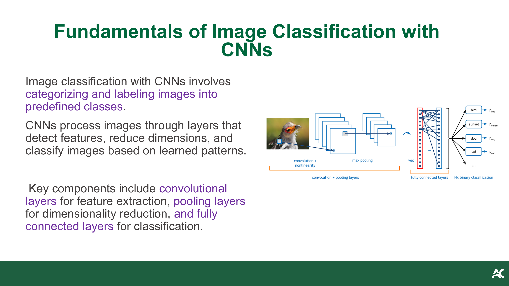

- Image classification with CNNs involves categorizing and labeling images into predefined classes. — CNN图像分类涉及将图像分类并标注到预定义类别中。
- CNNs process images through layers that detect features, reduce dimensions, and classify images based on learned patterns. — CNN通过各层处理图像，检测特征、降低维度，并根据学习到的模式对图像进行分类。
- Key components include convolutional layers for feature extraction, pooling layers for dimensionality reduction, and fully connected layers for classification. — 关键组件包括用于特征提取的卷积层、用于降维的池化层和用于分类的全连接层。

---

## 3. 数据集准备 (Dataset Preparation)

### 3.1 数据收集与标注 (Collection and Annotation)

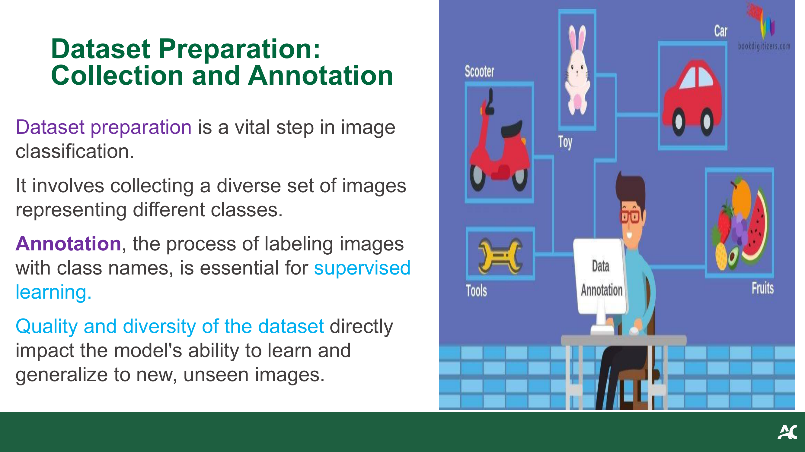

- Dataset preparation is a vital step in image classification. — 数据集准备是图像分类的关键步骤。
- It involves collecting a diverse set of images representing different classes. — 它涉及收集代表不同类别的多样化图像集。
- Annotation, the process of labeling images with class names, is essential for supervised learning. — 标注，即用类名标记图像的过程，对监督学习至关重要。
- Quality and diversity of the dataset directly impact the model's ability to learn and generalize to new, unseen images. — 数据集的质量和多样性直接影响模型学习和泛化到新的、未见过的图像的能力。

### 3.2 数据预处理 (Data Preprocessing)

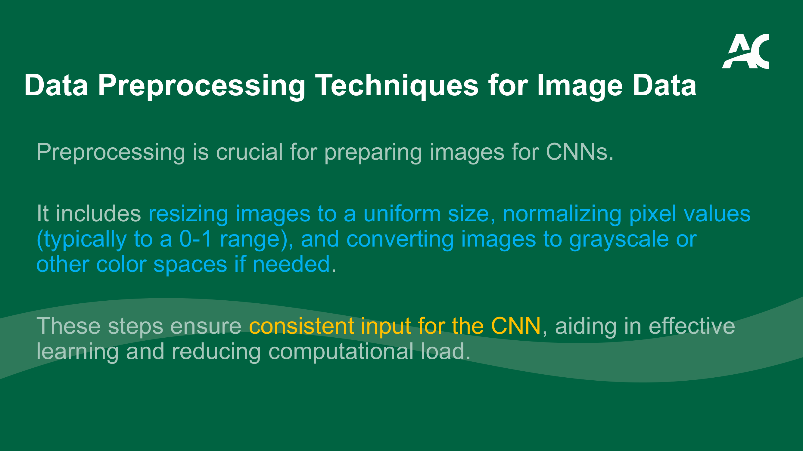

- Preprocessing is crucial for preparing images for CNNs. — 预处理对于为CNN准备图像至关重要。
- It includes resizing images to a uniform size, normalizing pixel values (typically to a 0-1 range), and converting images to grayscale or other color spaces if needed. — 它包括将图像调整为统一大小、归一化像素值（通常到0-1范围）、以及根据需要将图像转换为灰度或其他色彩空间。
- These steps ensure consistent input for the CNN, aiding in effective learning and reducing computational load. — 这些步骤确保CNN的一致输入，有助于有效学习并减少计算负荷。

### 3.3 数据集划分讨论 (Data Split Discussion)

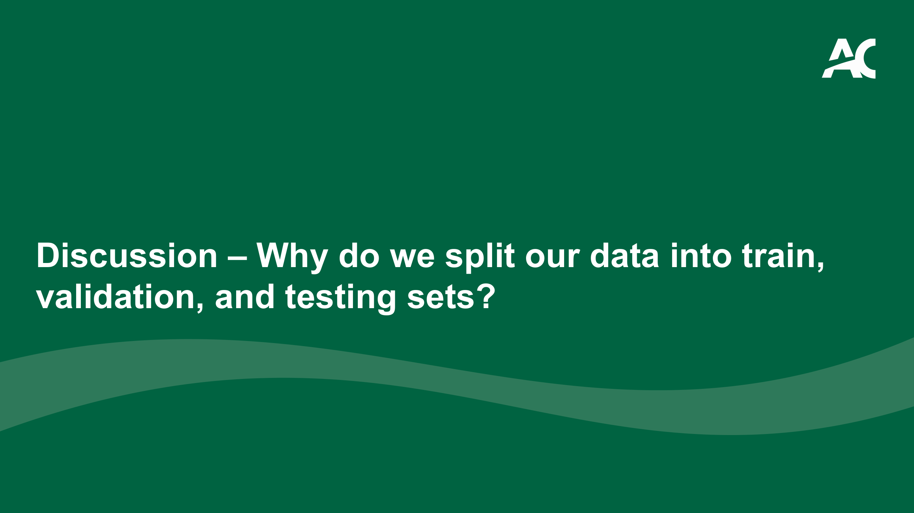

- **Discussion – Why do we split our data into train, validation, and testing sets?** — 讨论——为什么我们要将数据分为训练集、验证集和测试集？

### 3.4 数据增强策略 (Data Augmentation Strategies)

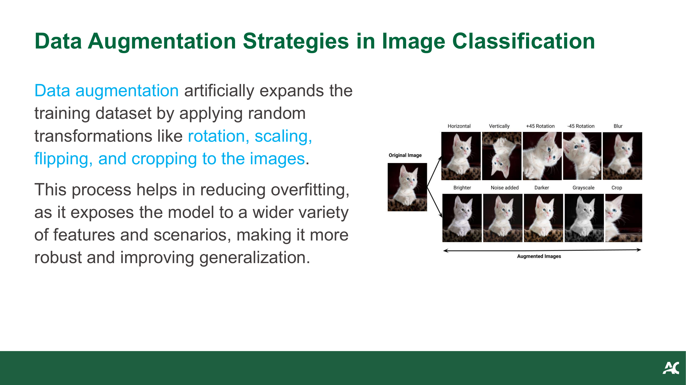

- Data augmentation artificially expands the training dataset by applying random transformations like rotation, scaling, flipping, and cropping to the images. — 数据增强通过对图像应用旋转、缩放、翻转和裁剪等随机变换来人为扩展训练数据集。
- This process helps in reducing overfitting, as it exposes the model to a wider variety of features and scenarios, making it more robust and improving generalization. — 这一过程有助于减少过拟合，因为它使模型接触到更广泛的特征和场景，使其更加鲁棒并提高泛化能力。

---

## 4. CNN架构设计 (Designing a CNN Architecture)

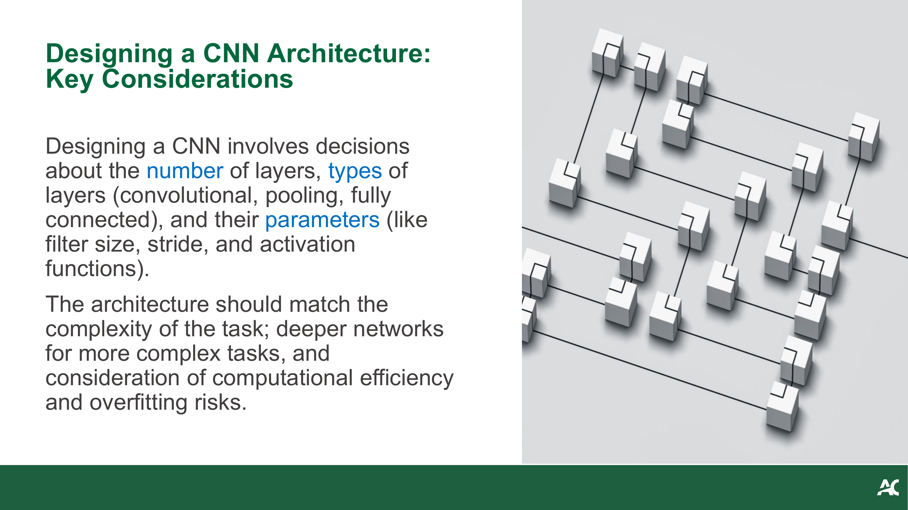

- Designing a CNN involves decisions about the number of layers, types of layers (convolutional, pooling, fully connected), and their parameters (like filter size, stride, and activation functions). — 设计CNN涉及关于层数、层类型（卷积、池化、全连接）及其参数（如滤波器大小、步长和激活函数）的决策。
- The architecture should match the complexity of the task; deeper networks for more complex tasks, and consideration of computational efficiency and overfitting risks. — 架构应与任务的复杂度相匹配；更复杂的任务使用更深的网络，并考虑计算效率和过拟合风险。

---

## 5. 激活函数 (Activation Functions)

### 5.1 激活函数概述 (Overview)

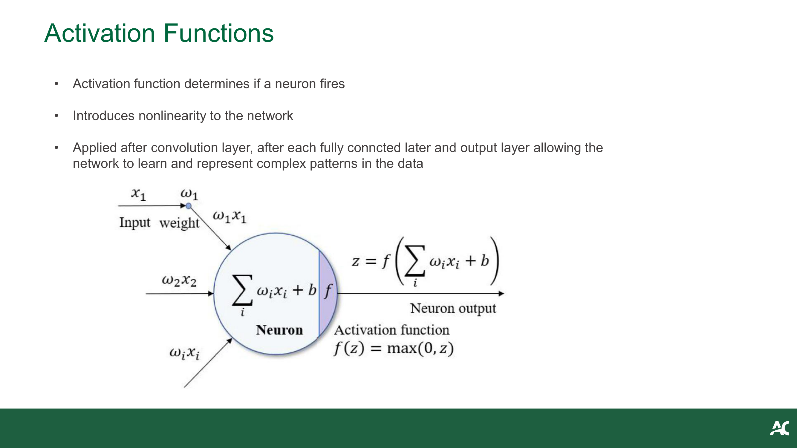

- Activation function determines if a neuron fires — 激活函数决定神经元是否激活
- Introduces nonlinearity to the network — 向网络引入非线性
- Applied after convolution layer, after each fully connected later and output layer allowing the network to learn and represent complex patterns in the data — 应用在卷积层之后、每个全连接层之后和输出层，使网络能够学习和表示数据中的复杂模式

### 5.2 Sigmoid 函数

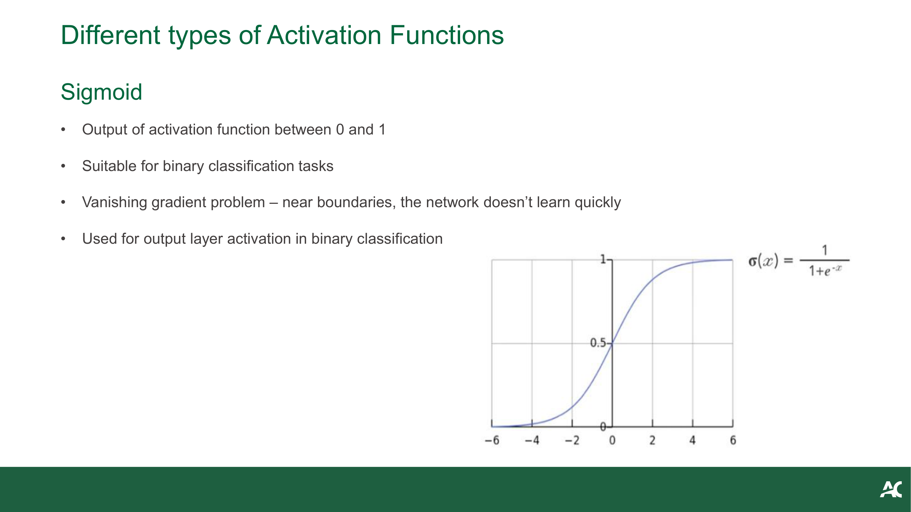

**Sigmoid:**
- Output of activation function between 0 and 1 — 激活函数输出在0和1之间
- Suitable for binary classification tasks — 适用于二分类任务
- Vanishing gradient problem – near boundaries, the network doesn't learn quickly — 梯度消失问题——在边界附近，网络学习速度很慢
- Used for output layer activation in binary classification — 用于二分类中的输出层激活

### 5.3 Tanh 函数

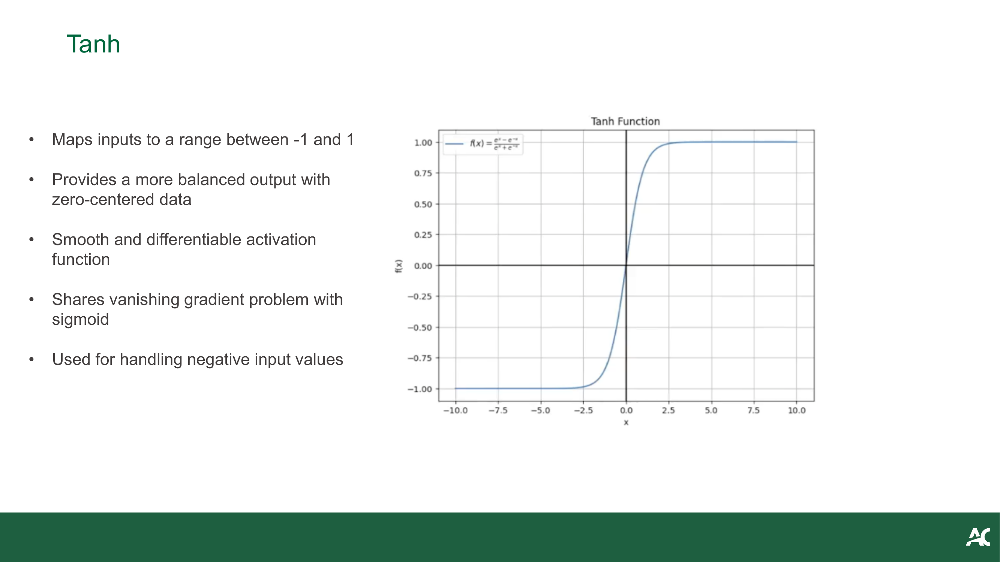

**Tanh:**
- Maps inputs to a range between -1 and 1 — 将输入映射到-1和1之间的范围
- Provides a more balanced output with zero-centered data — 提供以零为中心的更平衡的输出
- Smooth and differentiable activation function — 平滑且可微的激活函数
- Shares vanishing gradient problem with sigmoid — 与sigmoid共享梯度消失问题
- Used for handling negative input values — 用于处理负输入值

### 5.4 ReLU 函数 (Rectified Linear Unit)

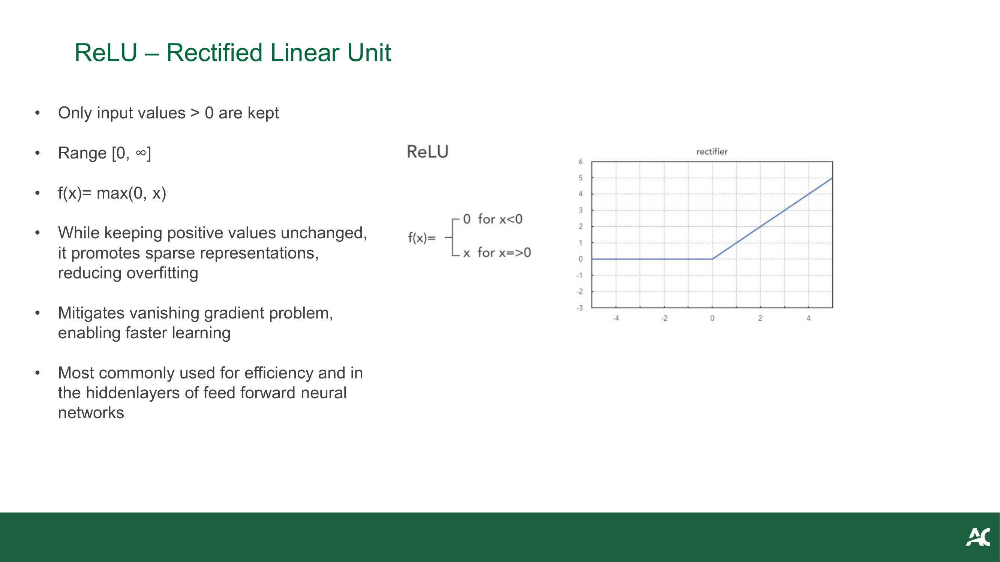

**ReLU – Rectified Linear Unit:**
- Only input values > 0 are kept — 仅保留大于0的输入值
- Range [0, ∞] — 范围[0, ∞]
- f(x)= max(0, x)
- While keeping positive values unchanged, it promotes sparse representations, reducing overfitting — 在保持正值不变的同时，促进稀疏表示，减少过拟合
- Mitigates vanishing gradient problem, enabling faster learning — 缓解梯度消失问题，实现更快学习
- Most commonly used for efficiency and in the hidden layers of feed forward neural networks — 最常用于前馈神经网络的隐藏层中，效率高

---

## 6. 损失函数 (Loss Functions)

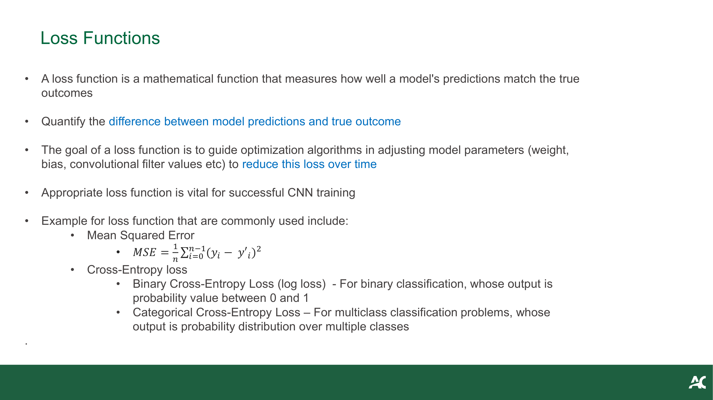

- A loss function is a mathematical function that measures how well a model's predictions match the true outcomes — 损失函数是衡量模型预测与真实结果匹配程度的数学函数
- Quantify the difference between model predictions and true outcome — 量化模型预测与真实结果之间的差异
- The goal of a loss function is to guide optimization algorithms in adjusting model parameters (weight, bias, convolutional filter values etc) to reduce this loss over time — 损失函数的目标是引导优化算法调整模型参数（权重、偏置、卷积滤波器值等）以逐步减少损失
- Appropriate loss function is vital for successful CNN training — 适当的损失函数对CNN训练成功至关重要
- Example for loss function that are commonly used include: — 常用损失函数示例包括：
  - **Mean Squared Error** — 均方误差
  - **Cross-Entropy loss** — 交叉熵损失
  - **Binary Cross-Entropy Loss (log loss)** - For binary classification, whose output is probability value between 0 and 1 — 二元交叉熵损失（对数损失）- 用于二分类，输出为0到1之间的概率值
  - **Categorical Cross-Entropy Loss** – For multiclass classification problems, whose output is probability distribution over multiple classes — 分类交叉熵损失——用于多分类问题，输出为多个类别上的概率分布

- **MSE (Mean Squared Error)** = (1/N) Σᵢ (yᵢ - ŷᵢ)²
  - N = total number of samples (样本总数)
  - yᵢ = actual true value for sample i (样本i的真实类别/值)
  - ŷᵢ = model prediction for sample i (模型对样本i的预测值)
  - Overall: measures average squared difference between predictions and actuals. (总体：测量预测和真实值之间的平均平方差。)

- **BCE (Binary Cross-Entropy)** = -(1/N) Σᵢ [ yᵢ·log(ŷᵢ) + (1-yᵢ)·log(1-ŷᵢ) ]
  - yᵢ = actual binary class label (0 or 1) (实际二分类标签，0或1)
  - ŷᵢ = predicted probability of class 1 (预测为类1的概率)
  - Overall: guides binary classification by heavily penalizing confident wrong predictions. (总体：通过重度惩罚自信的错误预测来指导二分类。)

- **CCE (Categorical Cross-Entropy)** = -(1/N) Σᵢ Σⱼ yᵢⱼ·log(ŷᵢⱼ)
  - N = total number of samples (样本总数)
  - C = number of classes (类别数)
  - yᵢⱼ = one-hot encoded true label for sample i, class j (1 if sample i belongs to class j, else 0) (样本i类别j的one-hot编码真实标签，属于该类为1否则为0)
  - ŷᵢⱼ = predicted probability of sample i belonging to class j, output of softmax (样本i属于类别j的预测概率，softmax的输出)
  - Overall: generalizes BCE to multi-class; only the true class's predicted probability contributes to the loss. (总体：将BCE推广到多分类；只有真实类别的预测概率对损失有贡献。)

---

## 7. 梯度下降与反向传播 (Gradient Descent & Back Propagation)

### 7.1 梯度下降 (Gradient Descent)

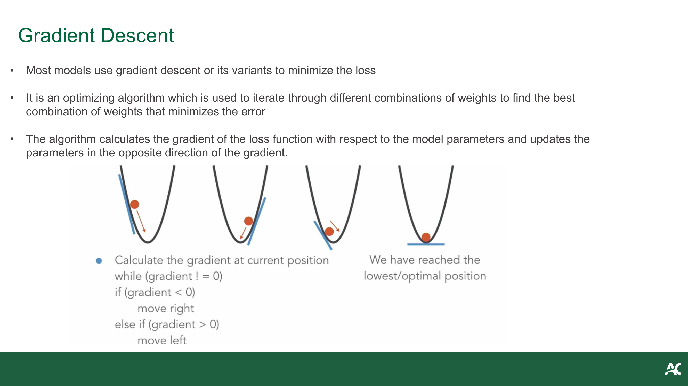

- Most models use gradient descent or its variants to minimize the loss — 大多数模型使用梯度下降或其变体来最小化损失
- It is an optimizing algorithm which is used to iterate through different combinations of weights to find the best combination of weights that minimizes the error — 它是一种优化算法，用于迭代不同的权重组合以找到使误差最小化的最佳权重组合
- The algorithm calculates the gradient of the loss function with respect to the model parameters and updates the parameters in the opposite direction of the gradient. — 该算法计算损失函数相对于模型参数的梯度，并在梯度的反方向更新参数。

### 7.2 反向传播概述 (Back Propagation Overview)

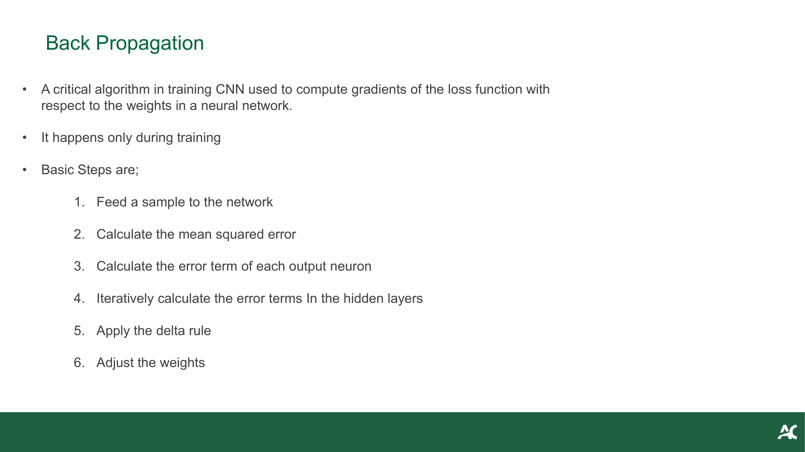

- A critical algorithm in training CNN used to compute gradients of the loss function with respect to the weights in a neural network. — 训练CNN的关键算法，用于计算损失函数相对于神经网络权重的梯度。
- It happens only during training — 仅在训练期间发生
- Basic Steps are: — 基本步骤是：
  1. Feed a sample to the network — 将样本馈入网络
  2. Calculate the mean squared error — 计算均方误差
  3. Calculate the error term of each output neuron — 计算每个输出神经元的误差项
  4. Iteratively calculate the error terms in the hidden layers — 迭代计算隐藏层的误差项
  5. Apply the delta rule — 应用delta规则
  6. Adjust the weights — 调整权重

### 7.3 反向传播步骤详解 (Back Propagation Steps)

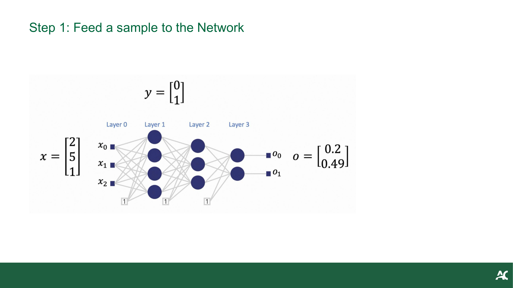

- **Step 1: Feed a sample to the Network** — 步骤1：将样本馈入网络

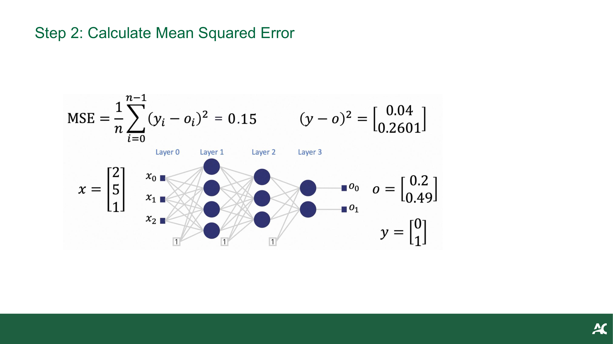

- **Step 2: Calculate Mean Squared Error** — 步骤2：计算均方误差

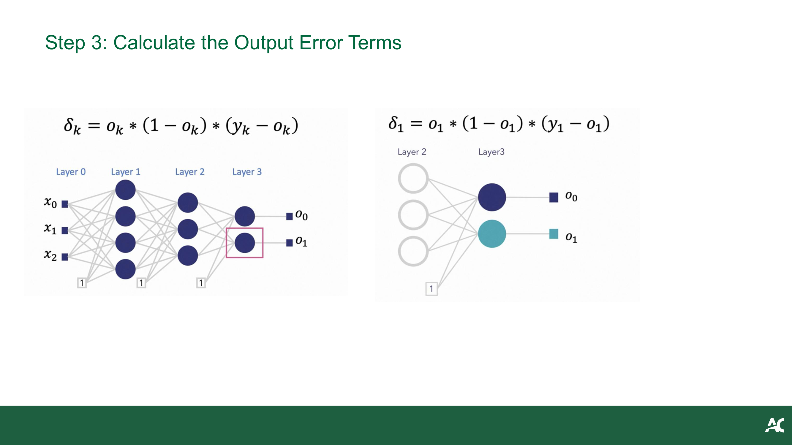

- **Step 3: Calculate the Output Error Terms** — 步骤3：计算输出误差项

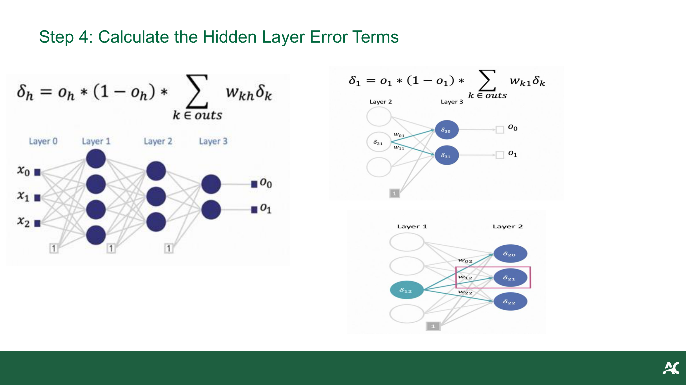

- **Step 4: Calculate the Hidden Layer Error Terms** — 步骤4：计算隐藏层误差项

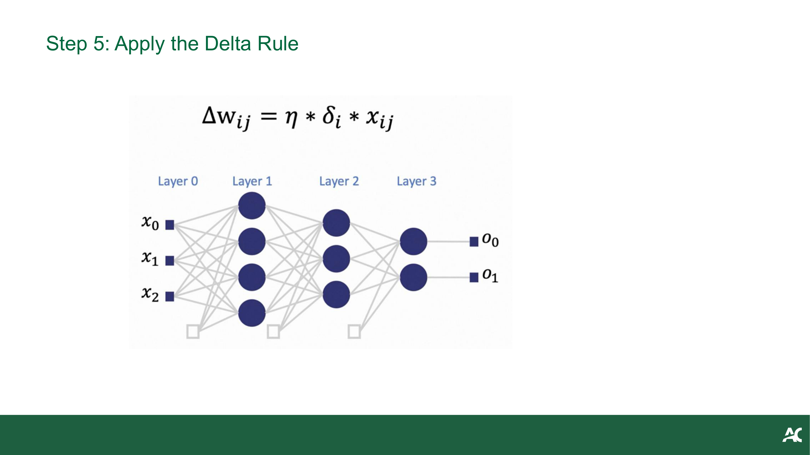

- **Step 5: Apply the Delta Rule** — 步骤5：应用Delta规则

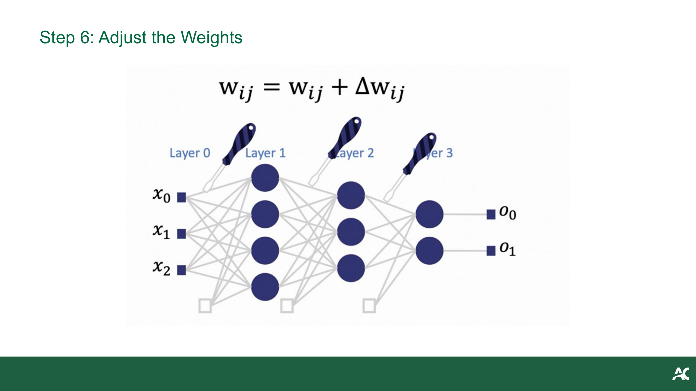

- **Step 6: Adjust the Weights** — 步骤6：调整权重

- **Weight Update Formula** = w_new = w_old - η * (∂L/∂w)
  - w_new = updated weight after taking a step (迈出一步后更新的权重)
  - w_old = current weight value (当前权重值)
  - η (eta) = learning rate, a hyperparameter controlling step size (学习率，控制步长的超参数)
  - ∂L/∂w = gradient of the loss L with respect to the weight w (损失L对权重w的梯度)
  - Overall: Move the weight opposite to the gradient to decrease the loss. (总体：朝梯度的反方向移动权重以减少损失。)

---

## 8. 优化器 (Optimizers)

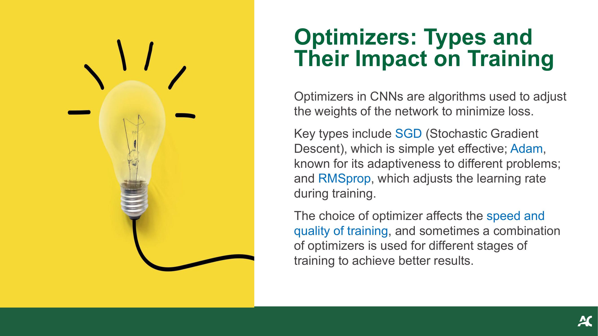

- Optimizers in CNNs are algorithms used to adjust the weights of the network to minimize loss. — CNN中的优化器是用于调整网络权重以最小化损失的算法。
- Key types include SGD (Stochastic Gradient Descent), which is simple yet effective; Adam, known for its adaptiveness to different problems; and RMSprop, which adjusts the learning rate during training. — 关键类型包括SGD（随机梯度下降），简单而有效；Adam，以其对不同问题的适应性而闻名；以及RMSprop，在训练期间调整学习率。
- The choice of optimizer affects the speed and quality of training, and sometimes a combination of optimizers is used for different stages of training to achieve better results. — 优化器的选择影响训练的速度和质量，有时在训练的不同阶段使用优化器的组合以获得更好的结果。

---

## 9. 训练CNN (Training a CNN)

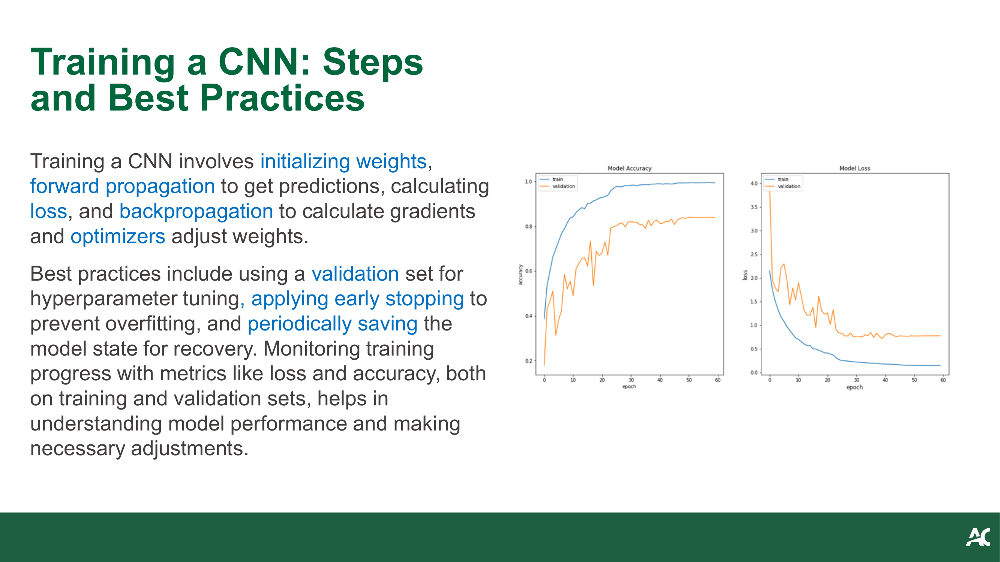

- Training a CNN involves initializing weights, forward propagation to get predictions, calculating loss, and backpropagation to calculate gradients and optimizers adjust weights. — 训练CNN涉及初始化权重、前向传播获得预测、计算损失以及反向传播计算梯度并由优化器调整权重。
- Best practices include using a validation set for hyperparameter tuning, applying early stopping to prevent overfitting, and periodically saving the model state for recovery. — 最佳实践包括使用验证集进行超参数调优、应用早停防止过拟合以及定期保存模型状态以便恢复。
- Monitoring training progress with metrics like loss and accuracy, both on training and validation sets, helps in understanding model performance and making necessary adjustments. — 使用损失和准确率等指标监控训练和验证集上的训练进度，有助于了解模型性能并进行必要调整。

---

## 10. 过拟合与预防策略 (Overfitting & Prevention Strategies)

### 10.1 理解过拟合 (Understanding Overfitting)

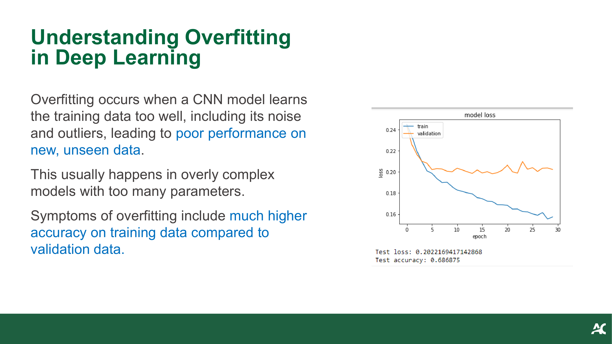

- Overfitting occurs when a CNN model learns the training data too well, including its noise and outliers, leading to poor performance on new, unseen data. — 过拟合发生在CNN模型过度学习训练数据（包括其噪声和异常值）时，导致在新的、未见过的数据上表现不佳。
- This usually happens in overly complex models with too many parameters. — 这通常发生在参数过多的过度复杂模型中。
- Symptoms of overfitting include much higher accuracy on training data compared to validation data. — 过拟合的症状包括训练数据上的准确率远高于验证数据。

### 10.2 防止过拟合的策略 (Prevention Strategies)

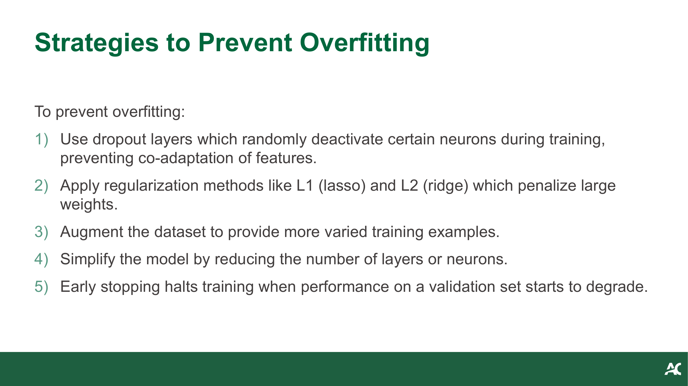

**Strategies to Prevent Overfitting:** — **防止过拟合的策略：**

1. Use dropout layers which randomly deactivate certain neurons during training, preventing co-adaptation of features. — 使用dropout层在训练期间随机停用某些神经元，防止特征共适应。
2. Apply regularization methods like L1 (lasso) and L2 (ridge) which penalize large weights. — 应用L1（lasso）和L2（ridge）等正则化方法，惩罚大权重。
3. Augment the dataset to provide more varied training examples. — 增强数据集以提供更多样化的训练示例。
4. Simplify the model by reducing the number of layers or neurons. — 通过减少层数或神经元数来简化模型。
5. Early stopping halts training when performance on a validation set starts to degrade. — 当验证集上的性能开始下降时，早停会停止训练。

---

## 11. 硬件资源及优化 (Hardware Resources & Optimization)

### 11.1 CPU vs GPU vs TPU

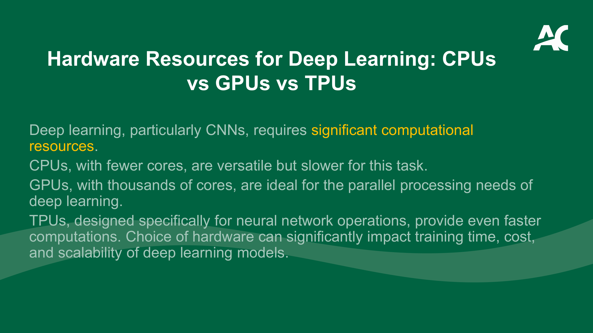

- Deep learning, particularly CNNs, requires significant computational resources. — 深度学习，特别是CNN，需要大量计算资源。
- CPUs, with fewer cores, are versatile but slower for this task. — CPU核心较少，通用但在此任务中较慢。
- GPUs, with thousands of cores, are ideal for the parallel processing needs of deep learning. — GPU拥有数千个核心，非常适合深度学习的并行处理需求。
- TPUs, designed specifically for neural network operations, provide even faster computations. — TPU专为神经网络运算设计，提供更快的计算。
- Choice of hardware can significantly impact training time, cost, and scalability of deep learning models. — 硬件的选择会显著影响深度学习模型的训练时间、成本和可扩展性。

### 11.2 CNN资源优化 (Optimizing CNNs for Efficient Resource Use)

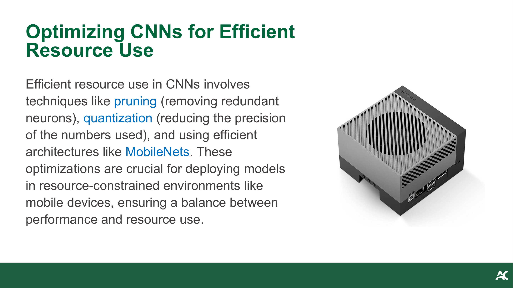

- Efficient resource use in CNNs involves techniques like pruning (removing redundant neurons), quantization (reducing the precision of the numbers used), and using efficient architectures like MobileNets. — CNN的高效资源使用涉及剪枝（移除冗余神经元）、量化（降低使用数字的精度）和使用MobileNets等高效架构等技术。
- These optimizations are crucial for deploying models in resource-constrained environments like mobile devices, ensuring a balance between performance and resource use. — 这些优化对于在移动设备等资源受限环境中部署模型至关重要，确保性能和资源使用之间的平衡。

---

## 12. CNN与其他深度学习技术集成 (Integrating CNNs with Other Techniques)

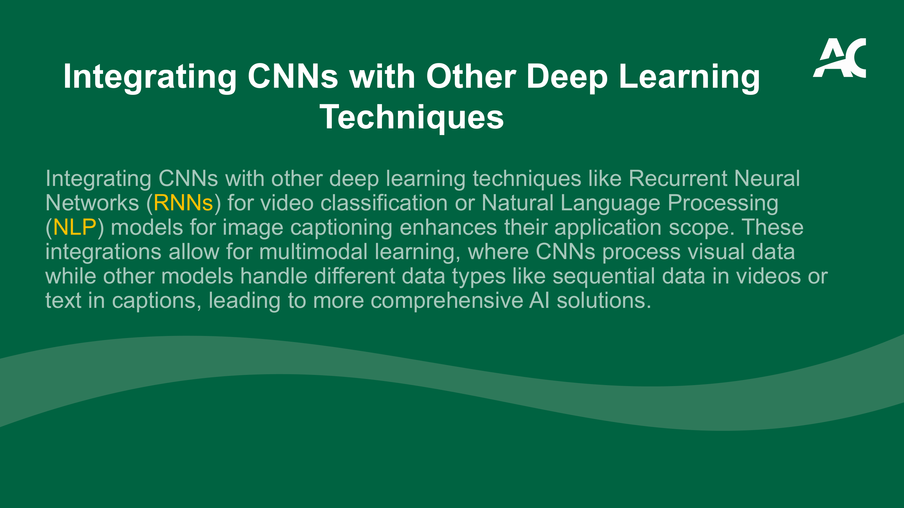

- Integrating CNNs with other deep learning techniques like Recurrent Neural Networks (RNNs) for video classification or Natural Language Processing (NLP) models for image captioning enhances their application scope. — 将CNN与循环神经网络（RNN）用于视频分类或自然语言处理（NLP）模型用于图像描述等其他深度学习技术集成，扩展了其应用范围。
- These integrations allow for multimodal learning, where CNNs process visual data while other models handle different data types like sequential data in videos or text in captions, leading to more comprehensive AI solutions. — 这些集成允许多模态学习，CNN处理视觉数据，而其他模型处理不同的数据类型（如视频中的序列数据或描述中的文本），从而产生更全面的AI解决方案。

---

## 13. CNN训练故障排除 (Troubleshooting CNN Training)

### 13.1 常见问题与排除策略 (Common Issues & Strategies)

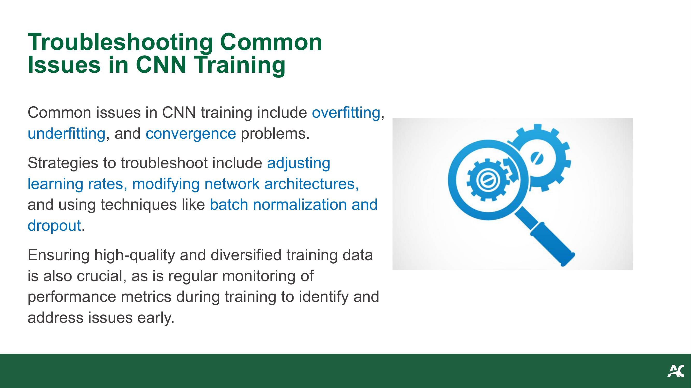

- Common issues in CNN training include overfitting, underfitting, and convergence problems. — CNN训练中的常见问题包括过拟合、欠拟合和收敛问题。
- Strategies to troubleshoot include adjusting learning rates, modifying network architectures, and using techniques like batch normalization and dropout. — 故障排除策略包括调整学习率、修改网络架构以及使用批量归一化和dropout等技术。
- Ensuring high-quality and diversified training data is also crucial, as is regular monitoring of performance metrics during training to identify and address issues early. — 确保高质量和多样化的训练数据也至关重要，同样重要的是在训练期间定期监控性能指标以及早发现和解决问题。

### 13.2 欠拟合解决方案 (Techniques to Address Underfitting)

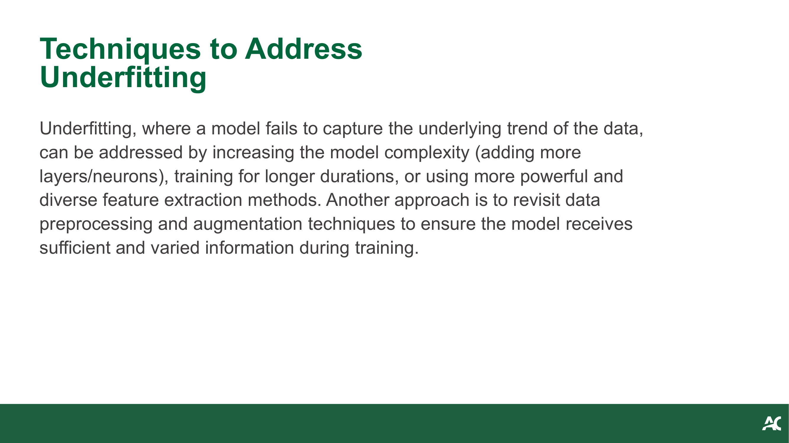

- Underfitting, where a model fails to capture the underlying trend of the data, can be addressed by increasing the model complexity (adding more layers/neurons), training for longer durations, or using more powerful and diverse feature extraction methods. — 欠拟合，即模型未能捕捉数据的潜在趋势，可以通过增加模型复杂度（添加更多层/神经元）、延长训练时间或使用更强大和多样化的特征提取方法来解决。
- Another approach is to revisit data preprocessing and augmentation techniques to ensure the model receives sufficient and varied information during training. — 另一种方法是重新审视数据预处理和增强技术，以确保模型在训练期间获得充足和多样的信息。

---

## 14. 期中考试详情 (Midterm Test Details)

**CST8508_26W - Midterm Test:**

- Paper based exam on Feb 19 – 7.00pm – 8.00 pm — 2月19日纸质考试——晚7:00–8:00
- Total Marks: 25 — 总分：25
- Duration: 60 min — 时长：60分钟
- Calculators allowed — 允许使用计算器
- No other personal electronic devices allowed in the classroom during test — 考试期间不允许在教室使用其他个人电子设备
- Contributes to 15% of final grade — 占最终成绩的15%
- Test Format: — 考试格式：
  - Multiple Choice Questions — 选择题
  - Fill in the blanks Questions — 填空题
  - Short answer Questions — 简答题
  - Mathematical Questions — 数学题

---
