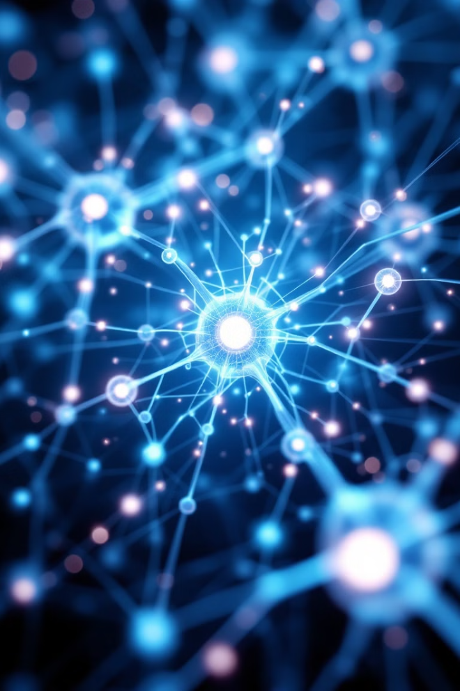
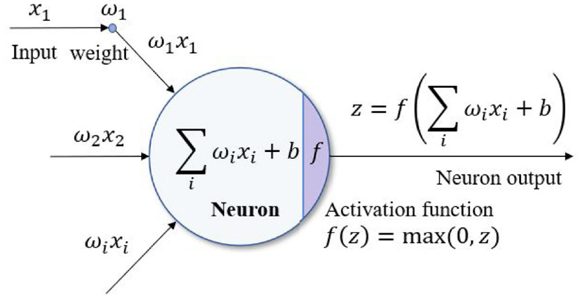
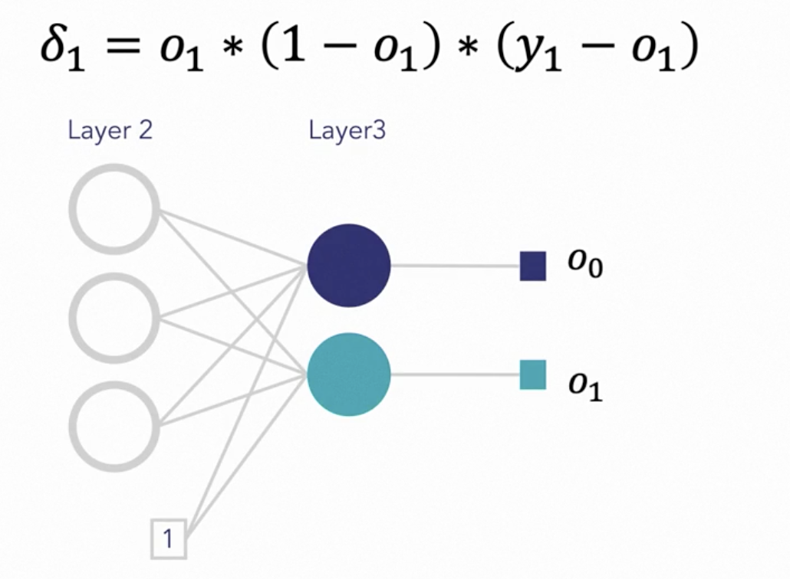
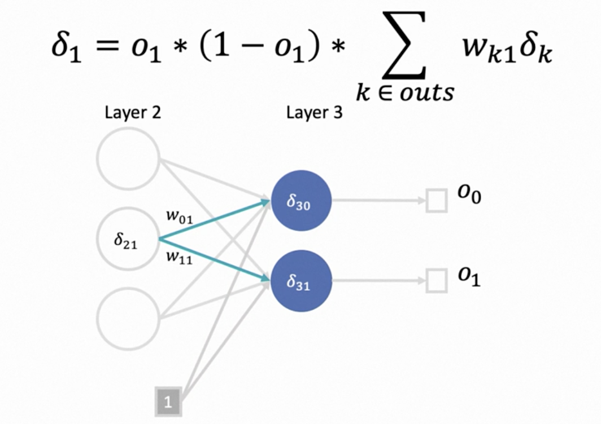
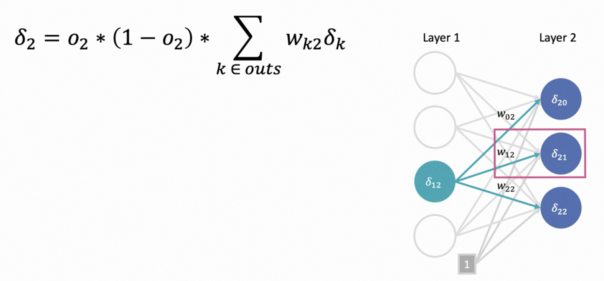

# Week 5: Week5_ Deep Learning for Image Classification1

> Source: `Week5_ Deep Learning for Image Classification1.pptx`
> Total slides: 32

---

## Slide 1

### Deep Learning for Image Classification

Instructor: Stephin Rachel Thomas
February 12, 2026

---

## Slide 2

### Today’s Topics

Fundamentals of Image classification with CNN
Dataset Preparation
Discussion
Data augmentation Strategy
Designing CNN architecture
Activation Functions
Loss Functions
Back propagation
Optimizers
Training CNN
Common issues in Computer vision
Troubleshooting in CNN Training
Midterm test details

---

## Slide 3

### Deep Learning, a subset of machine learning, involves neural networks with many layers.
### In computer vision, deep learning powers tasks such as image classification, object detection, and semantic segmentation.
### These tasks are accomplished through models that can identify patterns and features in images, mimicking human vision.

INTRODUCTION

---

## Slide 4

### Image classification with CNNs involves categorizing and labeling images into predefined classes.
### CNNs process images through layers that detect features, reduce dimensions, and classify images based on learned patterns.
### Key components include convolutional layers for feature extraction, pooling layers for dimensionality reduction, and fully connected layers for classification.

Fundamentals of Image Classification with CNNs

---

## Slide 5

### Dataset preparation is a vital step in image classification.
### It involves collecting a diverse set of images representing different classes.
### Annotation, the process of labeling images with class names, is essential for supervised learning.
### Quality and diversity of the dataset directly impact the model's ability to learn and generalize to new, unseen images.

Dataset Preparation: Collection and Annotation

---

## Slide 6

### Data Preprocessing Techniques for Image Data

Preprocessing is crucial for preparing images for CNNs.
It includes resizing images to a uniform size, normalizing pixel values (typically to a 0-1 range), and converting images to grayscale or other color spaces if needed.
These steps ensure consistent input for the CNN, aiding in effective learning and reducing computational load.

---

## Slide 7

### Discussion – Why do we split our data into train, validation, and testing sets?

---

## Slide 8

### Data augmentation artificially expands the training dataset by applying random transformations like rotation, scaling, flipping, and cropping to the images.
### This process helps in reducing overfitting, as it exposes the model to a wider variety of features and scenarios, making it more robust and improving generalization.

Data Augmentation Strategies in Image Classification

---

## Slide 9

### Designing a CNN involves decisions about the number of layers, types of layers (convolutional, pooling, fully connected), and their parameters (like filter size, stride, and activation functions).
### The architecture should match the complexity of the task; deeper networks for more complex tasks, and consideration of computational efficiency and overfitting risks.

Designing a CNN Architecture: Key Considerations

---

## Slide 10

### Activation Functions

Activation function determines if a neuron fires
Introduces nonlinearity to the network
Applied after convolution layer, after each fully conncted later and output layer allowing the network to learn and represent complex patterns in the data

---

## Slide 11

### Different types of Activation Functions
### Sigmoid

Output of activation function between 0 and 1
Suitable for binary classification tasks
Vanishing gradient problem – near boundaries, the network doesn’t learn quickly
Used for output layer activation in binary classification

---

## Slide 12

### Tanh

Maps inputs to a range between -1 and 1
Provides a more balanced output with zero-centered data
Smooth and differentiable activation function
Shares vanishing gradient problem with sigmoid
Used for handling negative input values

---

## Slide 13

### ReLU – Rectified Linear Unit

Only input values > 0 are kept
Range [0, ∞]
f(x)= max(0, x)
While keeping positive values unchanged, it promotes sparse representations, reducing overfitting
Mitigates vanishing gradient problem, enabling faster learning
Most commonly used for efficiency and in the hiddenlayers of feed forward neural networks

---

## Slide 14

Loss Functions

> **Speaker Notes:** (log loss)

---

## Slide 15

### Most models use gradient descent or its variants to minimize the loss
### It is an optimizing algorithm which is used to iterate through different combinations of weights to find the best
### combination of weights that minimizes the error
### The algorithm calculates the gradient of the loss function with respect to the model parameters and updates the
### parameters in the opposite direction of the gradient.

Gradient Descent

---

## Slide 16

### A critical algorithm in training CNN used to compute gradients of the loss function with respect to the weights in a neural network.
### It happens only during training
### Basic Steps are;
- Feed a sample to the network
- Calculate the mean squared error
- Calculate the error term of each output neuron
- Iteratively calculate the error terms In the hidden layers
- Apply the delta rule
- Adjust the weights

Back Propagation

> **Speaker Notes:** (log loss)

---

## Slide 17

Step 1: Feed a sample to the Network

> **Speaker Notes:** (log loss)

---

## Slide 18

Step 2: Calculate Mean Squared Error

> **Speaker Notes:** (log loss)

---

## Slide 19

Step 3: Calculate the Output Error Terms

> **Speaker Notes:** (log loss)

---

## Slide 20

Step 4: Calculate the Hidden Layer Error Terms

> **Speaker Notes:** (log loss)

---

## Slide 21

Step 5: Apply the Delta Rule

> **Speaker Notes:** (log loss)

---

## Slide 22

Step 6: Adjust the Weights

> **Speaker Notes:** (log loss)

---

## Slide 23

### Optimizers in CNNs are algorithms used to adjust the weights of the network to minimize loss.
### Key types include SGD (Stochastic Gradient Descent), which is simple yet effective; Adam, known for its adaptiveness to different problems; and RMSprop, which adjusts the learning rate during training.
### The choice of optimizer affects the speed and quality of training, and sometimes a combination of optimizers is used for different stages of training to achieve better results.

Optimizers: Types and Their Impact on Training

---

## Slide 24

### Training a CNN involves initializing weights, forward propagation to get predictions, calculating loss, and backpropagation to calculate gradients and optimizers adjust weights.
### Best practices include using a validation set for hyperparameter tuning, applying early stopping to prevent overfitting, and periodically saving the model state for recovery. Monitoring training progress with metrics like loss and accuracy, both on training and validation sets, helps in understanding model performance and making necessary adjustments.

Training a CNN: Steps and Best Practices

---

## Slide 25

### Overfitting occurs when a CNN model learns the training data too well, including its noise and outliers, leading to poor performance on new, unseen data.
### This usually happens in overly complex models with too many parameters.
### Symptoms of overfitting include much higher accuracy on training data compared to validation data.

Understanding Overfitting in Deep Learning

---

## Slide 26

### To prevent overfitting:
### Use dropout layers which randomly deactivate certain neurons during training, preventing co-adaptation of features.
### Apply regularization methods like L1 (lasso) and L2 (ridge) which penalize large weights.
### Augment the dataset to provide more varied training examples.
### Simplify the model by reducing the number of layers or neurons.
### Early stopping halts training when performance on a validation set starts to degrade.

Strategies to Prevent Overfitting

---

## Slide 27

### Hardware Resources for Deep Learning: CPUs vs GPUs vs TPUs

Deep learning, particularly CNNs, requires significant computational resources.
CPUs, with fewer cores, are versatile but slower for this task.
GPUs, with thousands of cores, are ideal for the parallel processing needs of deep learning.
TPUs, designed specifically for neural network operations, provide even faster computations. Choice of hardware can significantly impact training time, cost, and scalability of deep learning models.

---

## Slide 28

### Optimizing CNNs for Efficient Resource Use

Efficient resource use in CNNs involves techniques like pruning (removing redundant neurons), quantization (reducing the precision of the numbers used), and using efficient architectures like MobileNets. These optimizations are crucial for deploying models in resource-constrained environments like mobile devices, ensuring a balance between performance and resource use.

---

## Slide 29

### Integrating CNNs with Other Deep Learning Techniques

Integrating CNNs with other deep learning techniques like Recurrent Neural Networks (RNNs) for video classification or Natural Language Processing (NLP) models for image captioning enhances their application scope. These integrations allow for multimodal learning, where CNNs process visual data while other models handle different data types like sequential data in videos or text in captions, leading to more comprehensive AI solutions.

---

## Slide 30

### Common issues in CNN training include overfitting, underfitting, and convergence problems.
### Strategies to troubleshoot include adjusting learning rates, modifying network architectures, and using techniques like batch normalization and dropout.
### Ensuring high-quality and diversified training data is also crucial, as is regular monitoring of performance metrics during training to identify and address issues early.

Troubleshooting Common Issues in CNN Training

---

## Slide 31

### Underfitting, where a model fails to capture the underlying trend of the data, can be addressed by increasing the model complexity (adding more layers/neurons), training for longer durations, or using more powerful and diverse feature extraction methods. Another approach is to revisit data preprocessing and augmentation techniques to ensure the model receives sufficient and varied information during training.

Techniques to Address Underfitting

---

## Slide 32

### CST8508_26W -  Midterm Test

Paper based exam on Feb 19 – 7.00pm – 8.00 pm
Total Marks : 25
Duration: 60 min
Calculators allowed
No other personal electronic devices allowed in the classroom during test
Contributes to 15% of final grade
Test Format
- Multiple Choice Questions
- Fill in the blanks Questions
- Short answer Questions
- Mathematical Questions

---
