# Week 5: 深度学习图像分类 (Deep Learning for Image Classification)

> Source: `Week5_ Deep Learning for Image Classification1.pptx`
> Total slides: 32
> Instructor: Stephin Rachel Thomas | February 12, 2026

---

## 1. 深度学习简介 (Introduction)

- Deep Learning is a subset of machine learning, involves neural networks with many layers
- Powers tasks: image classification, object detection, semantic segmentation
- Models identify patterns and features in images, mimicking human vision

> **📝 笔记:**
>
> **深度学习:** 机器学习的子集, 使用多层神经网络。核心任务: 图像分类、目标检测、语义分割。模仿人类视觉识别图像中的模式和特征。

---

## 2. CNN 图像分类基础 (Fundamentals of Image Classification with CNNs)

- Categorizing and labeling images into predefined classes
- Key components: convolutional layers (feature extraction) → pooling layers (dimensionality reduction) → fully connected layers (classification)

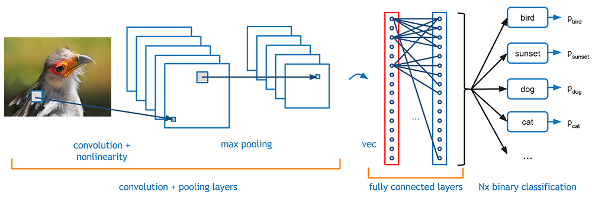

> **📝 笔记:**
>
> **CNN 分类流程:** 卷积层提取特征 → 池化层降维 → 全连接层分类。将图像分到预定义的类别中。

---

## 3. 数据准备 (Dataset Preparation)

### 3.1 数据收集与标注 (Collection and Annotation)

- Collect diverse images representing different classes
- **Annotation:** Labeling images with class names for supervised learning
- Quality and diversity directly impact model's ability to learn and generalize

### 3.2 数据预处理 (Preprocessing)

- **Resizing** images to uniform size
- **Normalizing** pixel values (typically to 0-1 range)
- Converting to grayscale or other color spaces if needed
- Ensures consistent CNN input, reduces computational load

### 3.3 数据划分讨论 (Data Splitting)

**Discussion:** Why do we split data into train, validation, and testing sets?

### 3.4 数据增强 (Data Augmentation)

- Artificially expands training dataset by applying random transformations: rotation, scaling, flipping, cropping
- Reduces overfitting, improves generalization
- Exposes model to wider variety of features and scenarios

> **📝 笔记:**
>
> **数据准备四步:**
>
> - **收集标注:** 多样性和质量决定模型泛化能力
> - **预处理:** 统一尺寸、归一化(0-1)、转换颜色空间
> - **划分:** 训练集(学习)、验证集(调参)、测试集(最终评估)
> - **增强:** 旋转/翻转/缩放/裁剪 → 扩充数据集, 减少过拟合
>
> **💡 提示:** 数据质量比数据数量更重要; 数据增强是对抗过拟合的有效手段

---

## 4. CNN 架构设计 (Designing CNN Architecture)

- Decisions: number of layers, types (conv/pooling/FC), parameters (filter size, stride, activation)
- Deeper networks for more complex tasks
- Consider computational efficiency and overfitting risks

> **📝 笔记:**
>
> **设计原则:** 任务越复杂→网络越深; 需平衡计算效率和过拟合风险。关键参数: 层数、滤波器大小、步长、激活函数。

---

## 5. 激活函数 (Activation Functions)

### 5.1 Sigmoid

- Output between 0 and 1, suitable for binary classification
- **Problem:** Vanishing gradient — near boundaries, learning is slow
- Used for output layer in binary classification

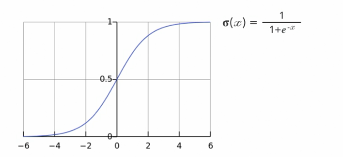

### 5.2 Tanh

- Maps inputs to range [-1, 1], zero-centered
- Smooth and differentiable
- Also has vanishing gradient problem
- Used for handling negative input values

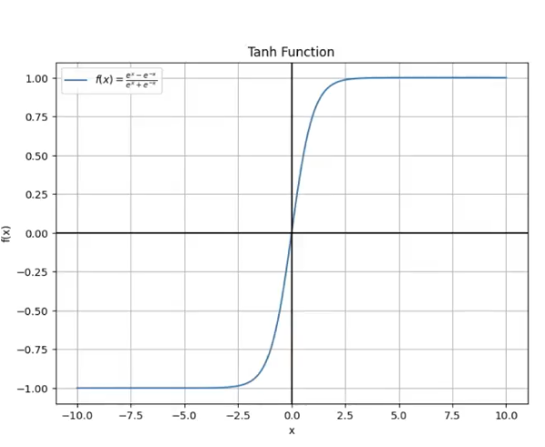

### 5.3 ReLU (Rectified Linear Unit)

- `f(x) = max(0, x)`, range [0, ∞]
- Promotes sparse representations, reducing overfitting
- Mitigates vanishing gradient problem, enables faster learning
- **Most commonly used** in hidden layers

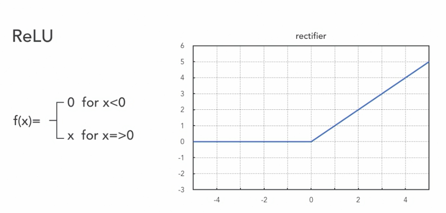

> **📝 笔记:**
>
> **三种激活函数对比:**
>
> | 函数    | 范围   | 优点                   | 缺点     | 使用场景       |
> | ------- | ------ | ---------------------- | -------- | -------------- |
> | Sigmoid | [0,1]  | 适合概率输出           | 梯度消失 | 二分类输出层   |
> | Tanh    | [-1,1] | 零中心化               | 梯度消失 | 处理负值       |
> | ReLU    | [0,∞]  | 快速学习, 缓解梯度消失 | 死神经元 | **隐藏层首选** |
>
> **💡 提示:** ReLU 是最常用的隐藏层激活函数, 考试需掌握三者的区别和适用场景

---

## 6. 损失函数与优化 (Loss Functions & Optimization)

### 6.1 梯度下降 (Gradient Descent)

- Optimizing algorithm to find best weight combination that minimizes error
- Calculates gradient of loss function with respect to model parameters
- Updates parameters in **opposite direction** of the gradient

### 6.2 反向传播 (Back Propagation)

Computes gradients of loss function, **only during training**.

**Six steps:**

1. Feed a sample to the network
2. Calculate the mean squared error
3. Calculate the error term of each output neuron
4. Iteratively calculate the error terms in the hidden layers
5. Apply the delta rule
6. Adjust the weights

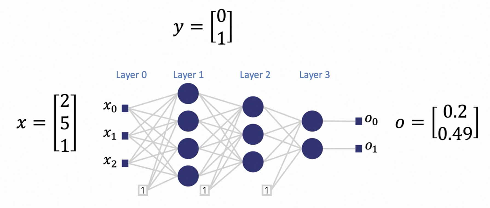
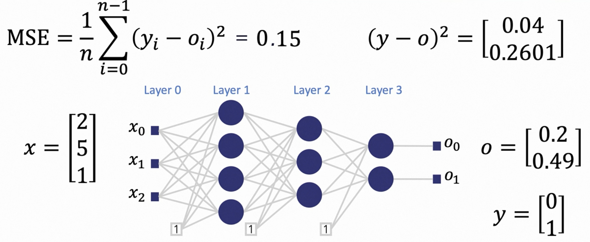
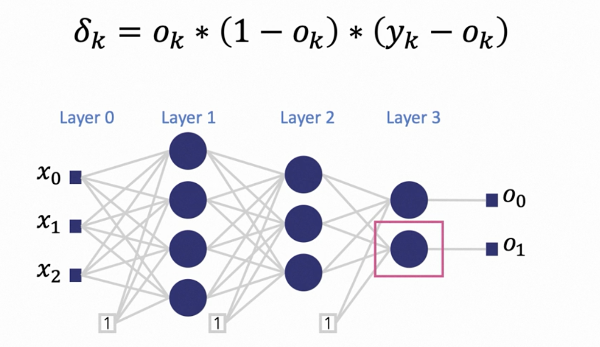
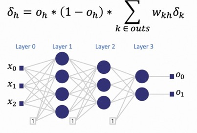
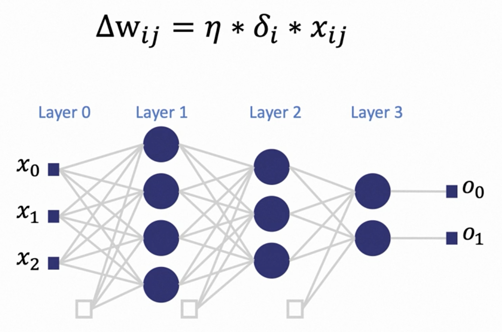
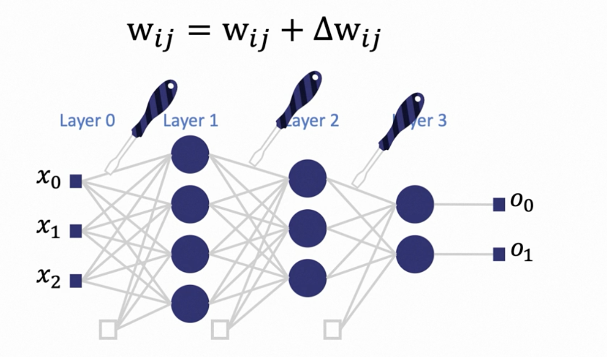

> **📝 笔记:**
>
> **梯度下降:** 沿梯度反方向更新参数, 最小化损失函数。
> **反向传播 6 步:** 前向传播→计算MSE→输出层误差→隐藏层误差→Delta规则→更新权重。
> 只在训练时发生, 是神经网络学习的核心算法。

### 6.3 优化器 (Optimizers)

- **SGD (Stochastic Gradient Descent):** Simple yet effective
- **Adam:** Adaptive to different problems
- **RMSprop:** Adjusts learning rate during training
- Choice affects speed and quality of training

> **📝 笔记:**
>
> **三种优化器:** SGD(简单有效)、Adam(自适应, 最常用)、RMSprop(自动调整学习率)。不同阶段可组合使用。

---

## 7. CNN 训练 (Training a CNN)

### 7.1 训练步骤与最佳实践 (Steps and Best Practices)

- Initialize weights → Forward propagation → Calculate loss → Backpropagation → Adjust weights
- Best practices:
  - Validation set for hyperparameter tuning
  - Early stopping to prevent overfitting
  - Periodically save model state
  - Monitor loss and accuracy on both training and validation sets

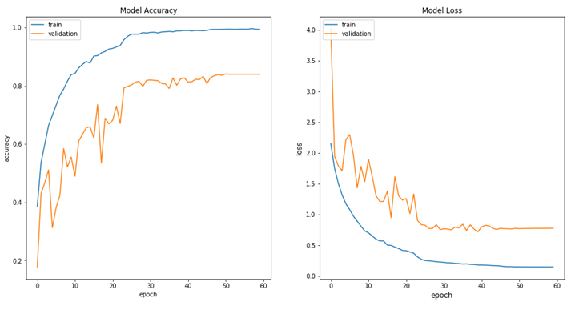

> **📝 笔记:**
>
> **训练流程:** 初始化权重 → 前向传播 → 计算损失 → 反向传播 → 更新权重 (循环)
> **最佳实践:** 用验证集调参、早停防过拟合、定期保存模型、监控训练/验证指标

---

## 8. 过拟合与欠拟合 (Overfitting & Underfitting)

### 8.1 过拟合 (Overfitting)

- Model learns training data too well, including noise and outliers
- Happens in overly complex models with too many parameters
- Symptom: Much higher accuracy on training vs validation data

### 8.2 防止过拟合的策略 (Prevention Strategies)

1. **Dropout layers** — Randomly deactivate neurons during training
2. **Regularization** — L1 (lasso) and L2 (ridge) penalize large weights
3. **Data augmentation** — More varied training examples
4. **Simplify model** — Reduce layers or neurons
5. **Early stopping** — Halt when validation performance degrades

### 8.3 欠拟合 (Underfitting)

- Model fails to capture underlying data trends
- Solutions: Increase model complexity, train longer, more powerful feature extraction, revisit data preprocessing/augmentation

> **📝 笔记:**
>
> **过拟合:** 训练精度高但验证精度低 → Dropout/正则化/数据增强/简化模型/早停
> **欠拟合:** 训练精度和验证精度都低 → 增加模型复杂度/延长训练/改进特征提取
>
> **💡 提示:** 过拟合 = 学得太"死", 欠拟合 = 学得太"浅"。两者都需要避免。

---

## 9. 硬件与优化 (Hardware & Optimization)

### 9.1 硬件资源 (CPUs vs GPUs vs TPUs)

- **CPUs:** Fewer cores, versatile but slower for deep learning
- **GPUs:** Thousands of cores, ideal for parallel processing
- **TPUs:** Designed specifically for neural network operations, fastest

### 9.2 高效优化 (Efficient Resource Use)

- **Pruning:** Removing redundant neurons
- **Quantization:** Reducing number precision
- **Efficient architectures:** MobileNets
- Crucial for mobile/resource-constrained environments

> **📝 笔记:**
>
> **硬件选择:** CPU(通用慢) < GPU(并行快) < TPU(专用最快)
> **模型优化:** 剪枝(去冗余) + 量化(降精度) + 轻量架构(MobileNet) → 部署到移动设备

---

## 10. CNN 与其他技术集成 (Integration with Other Techniques)

- **CNN + RNN:** Video classification
- **CNN + NLP:** Image captioning
- Multimodal learning: CNNs process visual data while other models handle sequential/text data

> **📝 笔记:**
>
> **多模态学习:** CNN处理视觉 + RNN处理时序(视频) + NLP处理文本(图像描述), 构建更全面的AI解决方案。

---

## 11. CNN 训练问题排查 (Troubleshooting)

Common issues: overfitting, underfitting, convergence problems

Strategies:

- Adjust learning rates
- Modify network architectures
- Batch normalization and dropout
- High-quality, diversified training data
- Regular performance metric monitoring

> **📝 笔记:**
>
> **排查清单:** 学习率调整、网络架构修改、批归一化(Batch Normalization)、Dropout、数据质量检查、持续监控指标。

---

## 12. 期中考试信息 (Midterm Test)

- **CST8508_26W - Midterm Test**
- Date: **Feb 19**, 7:00pm – 8:00pm
- Total Marks: **25**, Duration: **60 min**
- Contributes to **15%** of final grade
- Calculators allowed, no personal electronic devices
- Format:
  - Multiple Choice Questions
  - Fill in the blanks
  - Short answer Questions
  - Mathematical Questions

> **📝 笔记:**
>
> **期中考试重点:**
>
> - 纸质考试, 60 分钟, 25 分, 占总成绩 15%
> - 可以带计算器, 不能带电子设备
> - 题型: 选择题 + 填空题 + 简答题 + 计算题
> - **复习重点:** Week 1-5 所有核心概念, 特别是 CNN 架构、卷积运算、评估指标、激活函数、反向传播

---
