# Week 7: PyTorch 简介 (Introduction to PyTorch)

> Source: `Week 7 - Introduction to Pytorch.pptx`
> Total slides: 23
> Instructor: Stephin Rachel Thomas | June 17, 2025

---

## 1. 课程概览 (Course Overview)

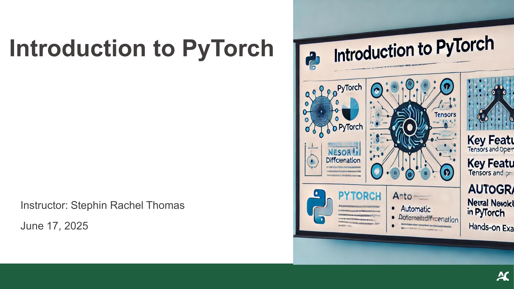

**Introduction to PyTorch** — PyTorch 简介

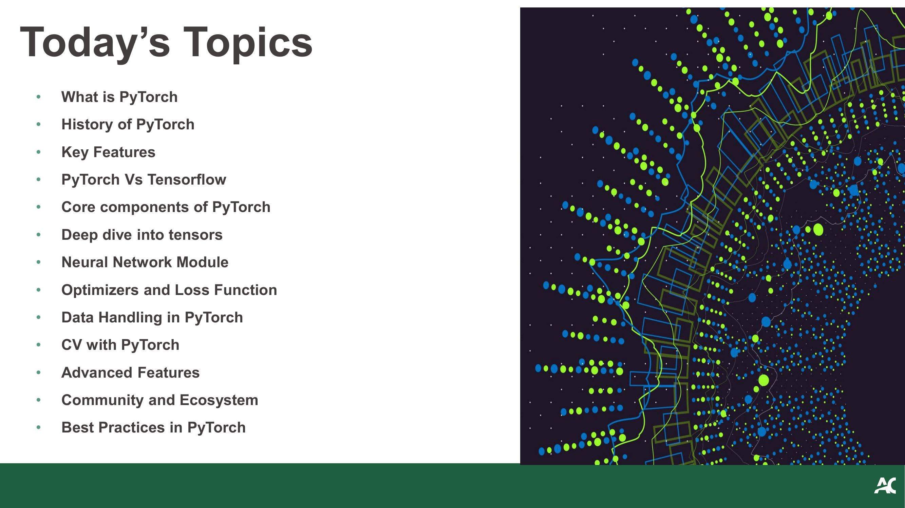

**Today's Topics:** — 今日话题

- What is PyTorch — 什么是 PyTorch
- History of PyTorch — PyTorch 的历史
- Key Features — 关键特性
- PyTorch Vs TensorFlow — PyTorch 与 TensorFlow 对比
- Core components of PyTorch — PyTorch 核心组件
- Deep dive into tensors — 深入理解张量 (Tensor)
- Neural Network Module — 神经网络模块
- Optimizers and Loss Function — 优化器与损失函数
- Data Handling in PyTorch — PyTorch 中的数据处理
- CV with PyTorch — 用 PyTorch 做计算机视觉
- Advanced Features — 高级特性
- Community and Ecosystem — 社区与生态系统
- Best Practices in PyTorch — PyTorch 最佳实践

---

## 2. 什么是 PyTorch (What is PyTorch?)

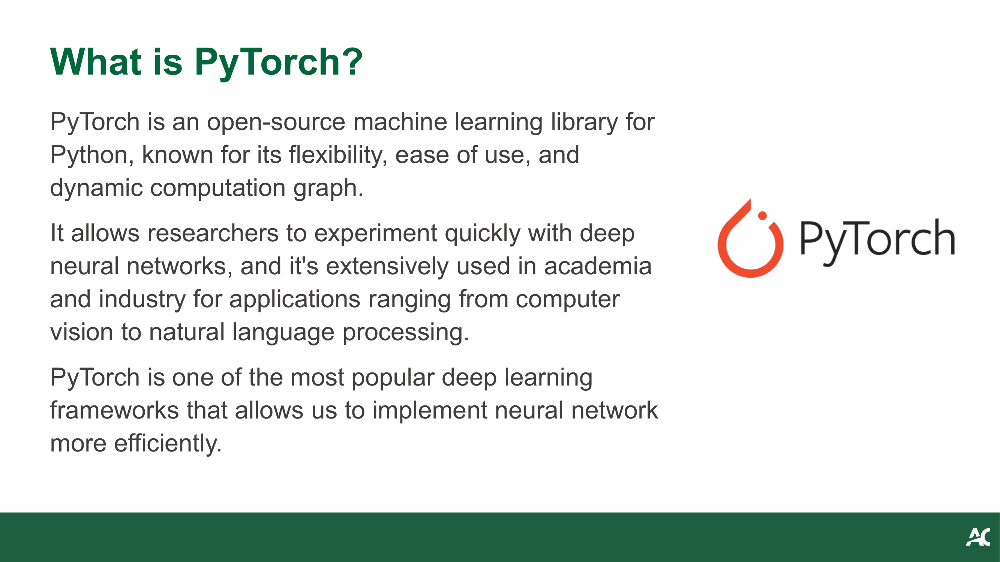

**What is PyTorch?** — 什么是 PyTorch？

- PyTorch is an open-source machine learning library for Python, known for its flexibility, ease of use, and dynamic computation graph. — PyTorch 是一个开源的 Python 机器学习库，以灵活性、易用性和动态计算图著称。
- It allows researchers to experiment quickly with deep neural networks, and it's extensively used in academia and industry for applications ranging from computer vision to natural language processing. — 它帮助研究人员快速进行深度神经网络实验，在学术界和工业界被广泛用于计算机视觉到自然语言处理等应用。
- PyTorch is one of the most popular deep learning frameworks that allows us to implement neural network more efficiently. — PyTorch 是最流行的深度学习框架之一，使我们能更高效地实现神经网络。

---

## 3. PyTorch 的历史 (History of PyTorch)

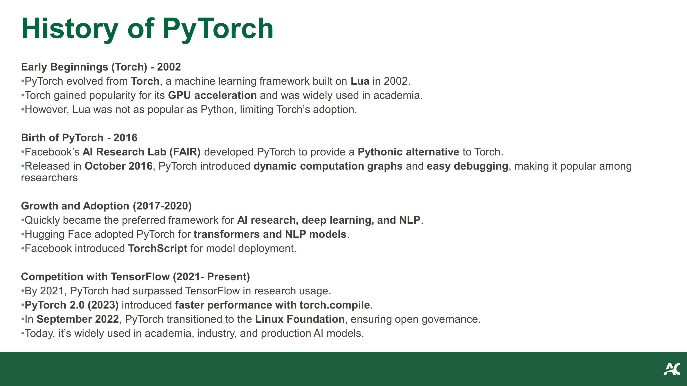

**History of PyTorch** — PyTorch 的历史

**Early Beginnings (Torch) - 2002** — 早期起源 (Torch) - 2002

- PyTorch evolved from Torch, a machine learning framework built on Lua in 2002. — PyTorch 起源于 Torch，一个 2002 年基于 Lua 构建的机器学习框架。
- Torch gained popularity for its GPU acceleration and was widely used in academia. — Torch 因 GPU 加速功能而流行，在学术界广泛使用。
- However, Lua was not as popular as Python, limiting Torch's adoption. — 然而 Lua 不如 Python 流行，限制了 Torch 的推广。

**Birth of PyTorch - 2016** — PyTorch 的诞生 - 2016

- Facebook's AI Research Lab (FAIR) developed PyTorch to provide a Pythonic alternative to Torch. — Facebook 人工智能研究实验室 (FAIR) 开发了 PyTorch，为 Torch 提供 Pythonic 替代方案。
- Released in October 2016, PyTorch introduced dynamic computation graphs and easy debugging, making it popular among researchers. — 2016 年 10 月发布，PyTorch 引入了动态计算图和便捷调试，深受研究人员欢迎。

**Growth and Adoption (2017-2020)** — 增长与普及 (2017-2020)

- Quickly became the preferred framework for AI research, deep learning, and NLP. — 迅速成为 AI 研究、深度学习和 NLP 的首选框架。
- Hugging Face adopted PyTorch for transformers and NLP models. — Hugging Face 采用 PyTorch 来构建 Transformer 和 NLP 模型。
- Facebook introduced TorchScript for model deployment. — Facebook 推出 TorchScript 用于模型部署。

**Competition with TensorFlow (2021-Present)** — 与 TensorFlow 的竞争 (2021 至今)

- By 2021, PyTorch had surpassed TensorFlow in research usage. — 到 2021 年，PyTorch 在研究领域的使用量已超过 TensorFlow。
- PyTorch 2.0 (2023) introduced faster performance with torch.compile. — PyTorch 2.0 (2023) 通过 torch.compile 引入了更快的性能。
- In September 2022, PyTorch transitioned to the Linux Foundation, ensuring open governance. — 2022 年 9 月，PyTorch 转入 Linux 基金会，确保开放治理。
- Today, it's widely used in academia, industry, and production AI models. — 如今它在学术界、工业界和生产级 AI 模型中被广泛使用。

---

## 4. PyTorch 关键特性 (Key Features of PyTorch)

### 4.1 核心特性概述 (Core Features Overview)

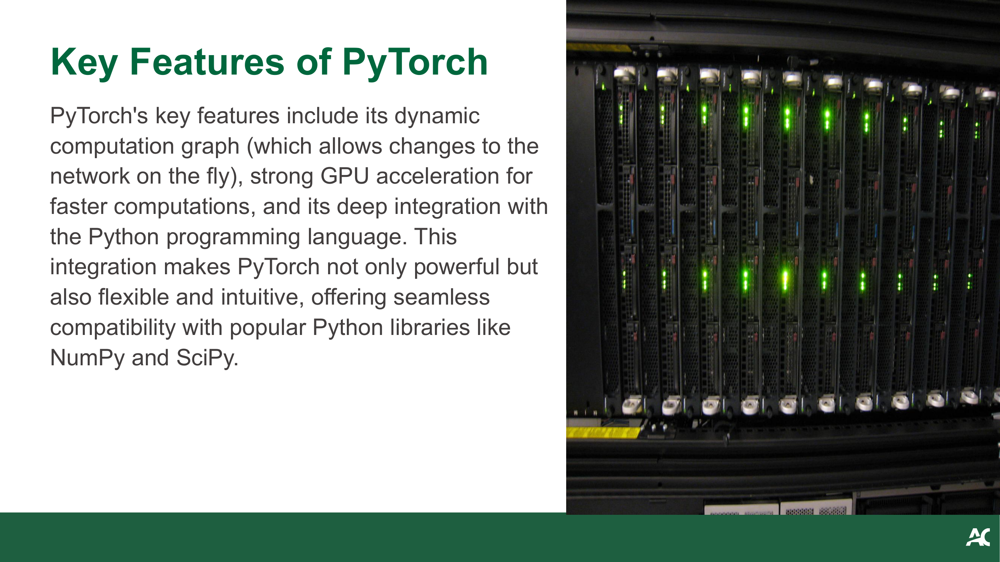

**Key Features of PyTorch** — PyTorch 的关键特性

- PyTorch's key features include its dynamic computation graph (which allows changes to the network on the fly), strong GPU acceleration for faster computations, and its deep integration with the Python programming language. — PyTorch 的关键特性包括动态计算图（允许即时修改网络）、强大的 GPU 加速以实现更快的计算、以及与 Python 编程语言的深度集成。
- This integration makes PyTorch not only powerful but also flexible and intuitive, offering seamless compatibility with popular Python libraries like NumPy and SciPy. — 这种集成使 PyTorch 不仅强大，而且灵活直观，与 NumPy 和 SciPy 等流行 Python 库无缝兼容。

### 4.2 功能特点 (Functional Highlights)

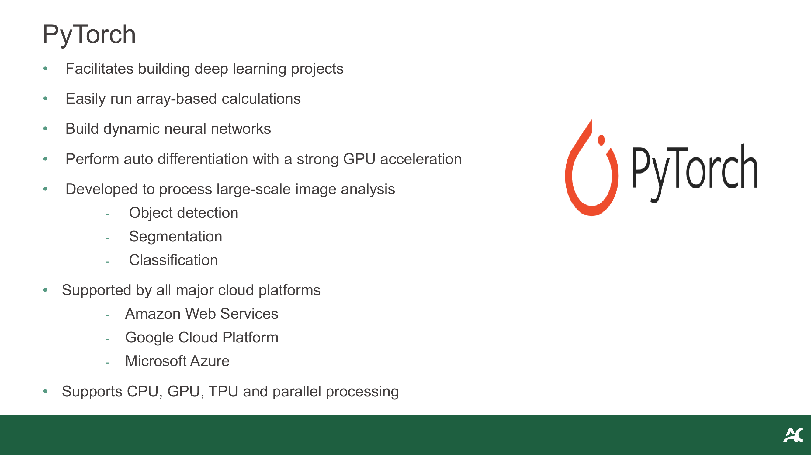

**PyTorch** — PyTorch 功能特点

- Facilitates building deep learning projects — 便于构建深度学习项目
- Easily run array-based calculations — 轻松执行基于数组的计算
- Build dynamic neural networks — 构建动态神经网络
- Perform auto differentiation with a strong GPU acceleration — 执行自动微分，配合强大的 GPU 加速
- Developed to process large-scale image analysis — 专为大规模图像分析处理而开发
  - Object detection — 目标检测
  - Segmentation — 语义分割
  - Classification — 图像分类
- Supported by all major cloud platforms — 所有主要云平台均支持
  - Amazon Web Services — 亚马逊云服务
  - Google Cloud Platform — 谷歌云平台
  - Microsoft Azure — 微软 Azure
- Supports CPU, GPU, TPU and parallel processing — 支持 CPU、GPU、TPU 及并行处理

---

## 5. PyTorch 与 TensorFlow 对比 (PyTorch vs. TensorFlow)

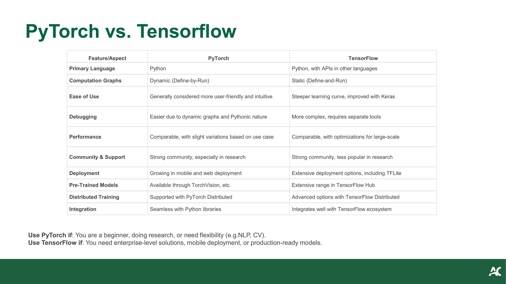

**PyTorch vs. TensorFlow** — PyTorch 与 TensorFlow 对比

| Feature/Aspect — 特性 | PyTorch | TensorFlow |
|---|---|---|
| Primary Language — 主要语言 | Python | Python, with APIs in other languages — Python，附带其他语言 API |
| Computation Graphs — 计算图 | Dynamic (Define-by-Run) — 动态（边定义边运行） | Static (Define-and-Run) — 静态（先定义后运行） |
| Ease of Use — 易用性 | Generally considered more user-friendly and intuitive — 通常被认为更友好直观 | Steeper learning curve, improved with Keras — 学习曲线较陡，通过 Keras 改善 |
| Debugging — 调试 | Easier due to dynamic graphs and Pythonic nature — 因动态图和 Pythonic 特性更容易 | More complex, requires separate tools — 更复杂，需要额外工具 |
| Performance — 性能 | Comparable, with slight variations based on use case — 相当，因使用场景略有差异 | Comparable, with optimizations for large-scale — 相当，针对大规模场景有优化 |
| Community & Support — 社区支持 | Strong community, especially in research — 社区强大，尤其在研究领域 | Strong community, less popular in research — 社区强大，在研究领域不太流行 |
| Deployment — 部署 | Growing in mobile and web deployment — 移动端和 Web 部署不断增长 | Extensive deployment options, including TFLite — 丰富的部署选项，包括 TFLite |
| Pre-Trained Models — 预训练模型 | Available through TorchVision, etc. — 通过 TorchVision 等获取 | Extensive range in TensorFlow Hub — TensorFlow Hub 中有大量模型 |
| Distributed Training — 分布式训练 | Supported with PyTorch Distributed — 通过 PyTorch Distributed 支持 | Advanced options with TensorFlow Distributed — TensorFlow Distributed 提供高级选项 |
| Integration — 集成 | Seamless with Python libraries — 与 Python 库无缝集成 | Integrates well with TensorFlow ecosystem — 与 TensorFlow 生态系统良好集成 |

- Use PyTorch if: You are a beginner, doing research, or need flexibility (e.g. NLP, CV). — 选择 PyTorch：如果你是初学者、做研究或需要灵活性（如 NLP、CV）。
- Use TensorFlow if: You need enterprise-level solutions, mobile deployment, or production-ready models. — 选择 TensorFlow：如果你需要企业级解决方案、移动端部署或生产就绪模型。

---

## 6. PyTorch 核心组件 (Core Components of PyTorch)

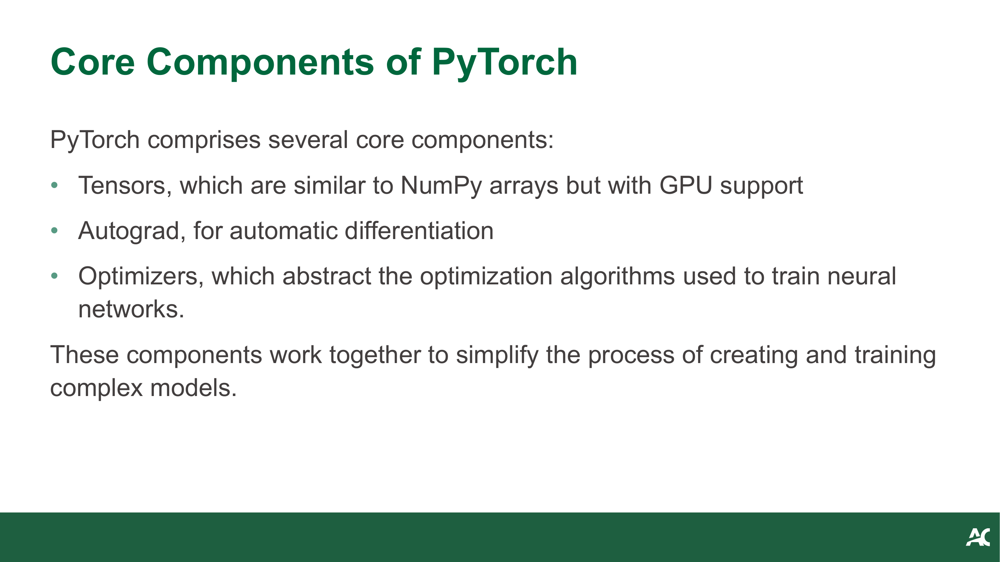

**Core Components of PyTorch** — PyTorch 核心组件

- PyTorch comprises several core components: — PyTorch 包含几个核心组件：
  - **Tensors**, which are similar to NumPy arrays but with GPU support — **张量 (Tensor)**，类似于 NumPy 数组但支持 GPU
  - **Autograd**, for automatic differentiation — **自动微分 (Autograd)**，用于自动求导
  - **Optimizers**, which abstract the optimization algorithms used to train neural networks. — **优化器 (Optimizer)**，抽象了训练神经网络所用的优化算法
- These components work together to simplify the process of creating and training complex models. — 这些组件协同工作，简化了创建和训练复杂模型的过程。

---

## 7. 深入理解张量 (Deep Dive into Tensors)

### 7.1 张量简介 (Introduction to Tensors)

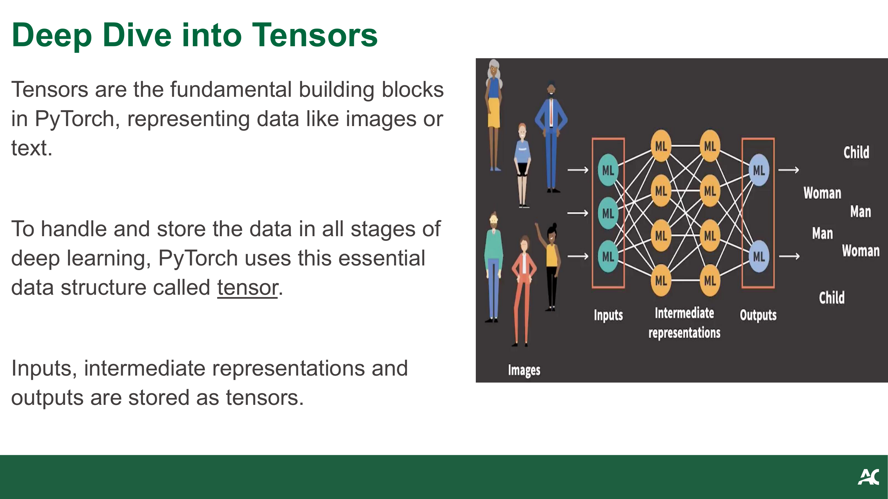

**Deep Dive into Tensors** — 深入理解张量

- Tensors are the fundamental building blocks in PyTorch, representing data like images or text. — 张量是 PyTorch 的基本构建模块，用于表示图像或文本等数据。
- To handle and store the data in all stages of deep learning, PyTorch uses this essential data structure called tensor. — 为了在深度学习的各个阶段处理和存储数据，PyTorch 使用了这种称为张量的基本数据结构。
- Inputs, intermediate representations and outputs are stored as tensors. — 输入、中间表示和输出都以张量形式存储。

### 7.2 张量的数学定义 (Mathematical Definition of Tensors)

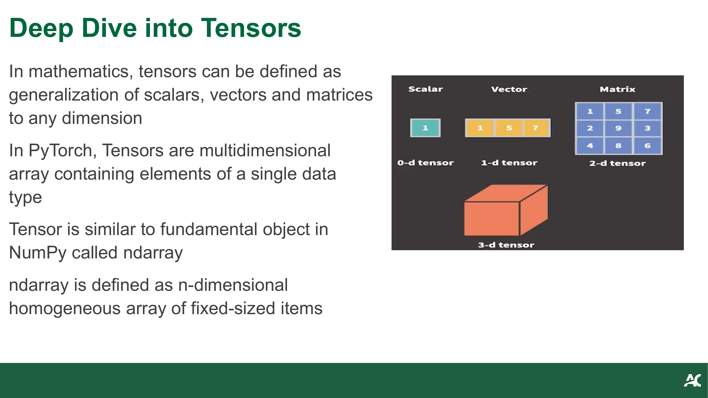

**Deep Dive into Tensors** — 张量的数学定义

- In mathematics, tensors can be defined as generalization of scalars, vectors and matrices to any dimension — 在数学中，张量可以定义为标量、向量和矩阵向任意维度的推广
- In PyTorch, Tensors are multidimensional array containing elements of a single data type — 在 PyTorch 中，Tensor 是包含单一数据类型元素的多维数组
- Tensor is similar to fundamental object in NumPy called ndarray — Tensor 类似于 NumPy 中的基本对象 ndarray
- ndarray is defined as n-dimensional homogeneous array of fixed-sized items — ndarray 被定义为固定大小项的 n 维同质数组

### 7.3 张量的优势 (Advantages of Tensors)

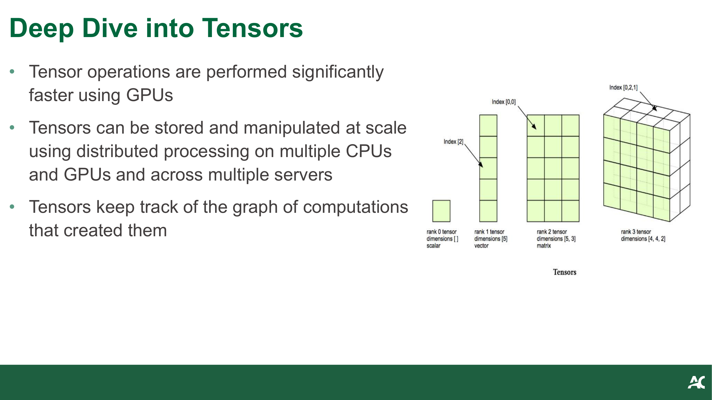

**Deep Dive into Tensors** — 张量的优势

- Tensor operations are performed significantly faster using GPUs — 使用 GPU 可以显著加速张量运算
- Tensors can be stored and manipulated at scale using distributed processing on multiple CPUs and GPUs and across multiple servers — 张量可以通过多个 CPU 和 GPU 以及跨多个服务器的分布式处理进行大规模存储和操作
- Tensors keep track of the graph of computations that created them — 张量会追踪创建它们的计算图

### 7.4 张量代码示例 (Tensor Code Examples)

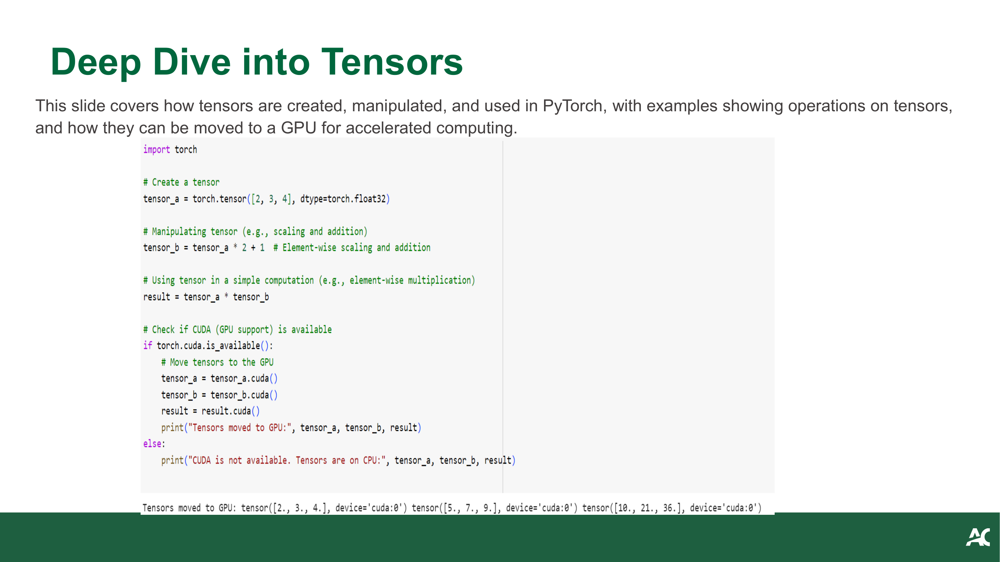

**Deep Dive into Tensors** — 张量代码示例

- This slide covers how tensors are created, manipulated, and used in PyTorch, with examples showing operations on tensors, and how they can be moved to a GPU for accelerated computing. — 本页展示了如何在 PyTorch 中创建、操作和使用张量，包括张量运算示例以及如何将它们移动到 GPU 进行加速计算。

---

## 8. 自动微分 (Automatic Differentiation / Autograd)

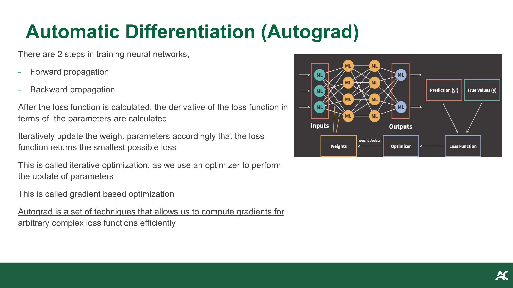

**Automatic Differentiation (Autograd)** — 自动微分 (Autograd)

- There are 2 steps in training neural networks: — 训练神经网络有两个步骤：
  - Forward propagation — 前向传播
  - Backward propagation — 反向传播
- After the loss function is calculated, the derivative of the loss function in terms of the parameters are calculated — 损失函数计算完成后，会计算损失函数相对于参数的导数
- Iteratively update the weight parameters accordingly that the loss function returns the smallest possible loss — 迭代地更新权重参数，使损失函数返回尽可能小的损失值
- This is called iterative optimization, as we use an optimizer to perform the update of parameters — 这称为迭代优化，因为我们使用优化器来执行参数更新
- This is called gradient based optimization — 这称为基于梯度的优化
- Autograd is a set of techniques that allows us to compute gradients for arbitrary complex loss functions efficiently — Autograd 是一组技术，使我们能够为任意复杂的损失函数高效计算梯度

---

## 9. 神经网络模块 (Neural Network Module)

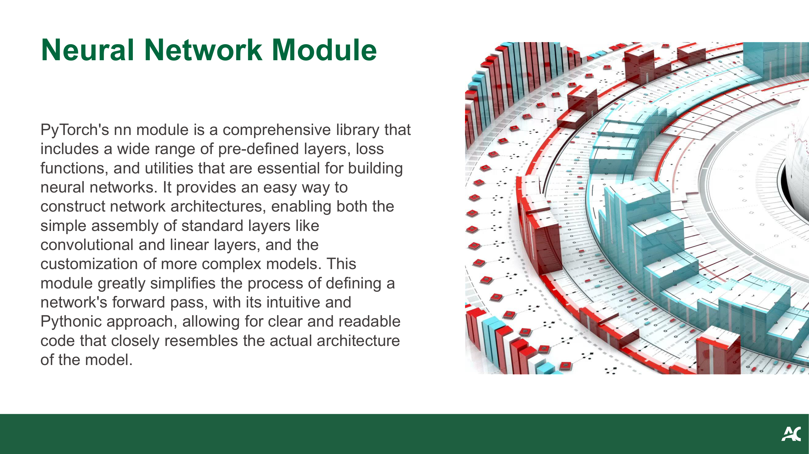

**Neural Network Module** — 神经网络模块

- PyTorch's nn module is a comprehensive library that includes a wide range of pre-defined layers, loss functions, and utilities that are essential for building neural networks. — PyTorch 的 nn 模块是一个综合库，包含大量预定义的层、损失函数和工具，对构建神经网络至关重要。
- It provides an easy way to construct network architectures, enabling both the simple assembly of standard layers like convolutional and linear layers, and the customization of more complex models. — 它提供了一种简单的方式来构建网络架构，既能简单组合卷积层和全连接层等标准层，也能自定义更复杂的模型。
- This module greatly simplifies the process of defining a network's forward pass, with its intuitive and Pythonic approach, allowing for clear and readable code that closely resembles the actual architecture of the model. — 该模块以其直观和 Pythonic 的方式大大简化了定义网络前向传递的过程，使代码清晰可读且紧密贴合模型的实际架构。

---

## 10. 优化器与损失函数 (Optimizers and Loss Functions)

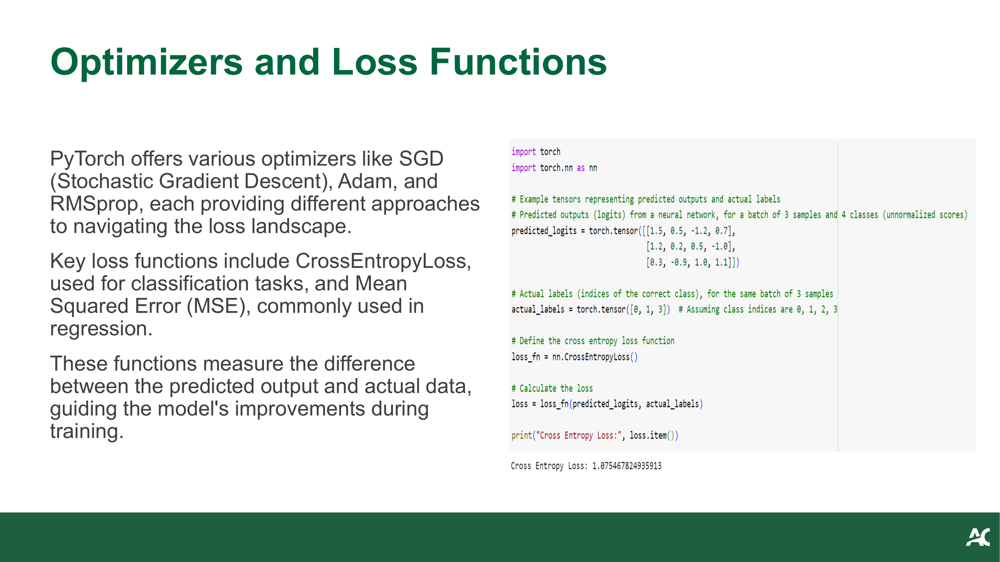

**Optimizers and Loss Functions** — 优化器与损失函数

- PyTorch offers various optimizers like SGD (Stochastic Gradient Descent), Adam, and RMSprop, each providing different approaches to navigating the loss landscape. — PyTorch 提供多种优化器，如 SGD（随机梯度下降）、Adam 和 RMSprop，各自提供不同的损失函数空间导航策略。
- Key loss functions include CrossEntropyLoss, used for classification tasks, and Mean Squared Error (MSE), commonly used in regression. — 关键损失函数包括用于分类任务的 CrossEntropyLoss 和常用于回归的均方误差 (MSE)。
- These functions measure the difference between the predicted output and actual data, guiding the model's improvements during training. — 这些函数衡量预测输出与实际数据之间的差异，指导模型在训练过程中改进。

---

## 11. 深度学习训练流程 (DL Training Process)

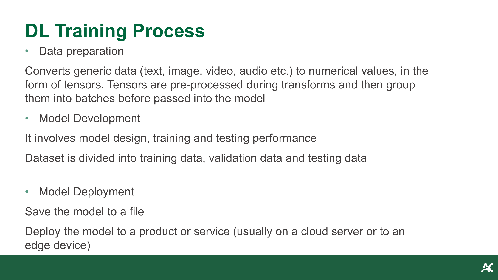

**DL Training Process** — 深度学习训练流程

- **Data preparation** — **数据准备**
  - Converts generic data (text, image, video, audio etc.) to numerical values, in the form of tensors. Tensors are pre-processed during transforms and then group them into batches before passed into the model — 将通用数据（文本、图像、视频、音频等）转换为张量形式的数值。张量在转换过程中进行预处理，然后分组成批次再传入模型
- **Model Development** — **模型开发**
  - It involves model design, training and testing performance — 涉及模型设计、训练和测试性能
  - Dataset is divided into training data, validation data and testing data — 数据集分为训练数据、验证数据和测试数据
- **Model Deployment** — **模型部署**
  - Save the model to a file — 将模型保存到文件
  - Deploy the model to a product or service (usually on a cloud server or to an edge device) — 将模型部署到产品或服务中（通常是云服务器或边缘设备）

---

## 12. PyTorch 数据处理 (Data Handling in PyTorch)

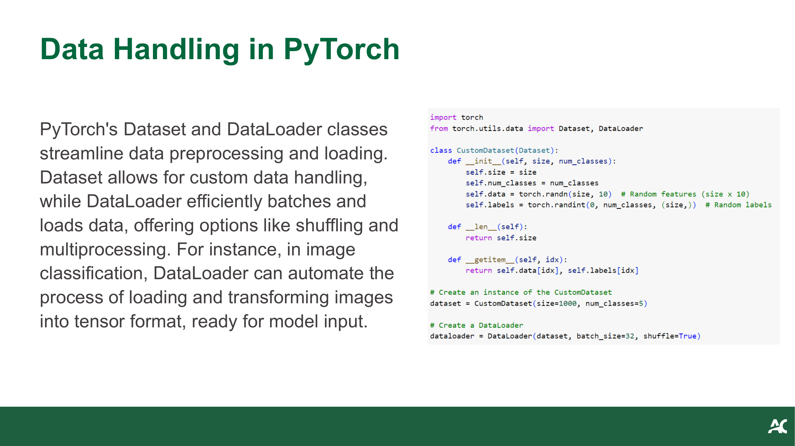

**Data Handling in PyTorch** — PyTorch 数据处理

- PyTorch's Dataset and DataLoader classes streamline data preprocessing and loading. — PyTorch 的 Dataset 和 DataLoader 类简化了数据预处理和加载。
- Dataset allows for custom data handling, while DataLoader efficiently batches and loads data, offering options like shuffling and multiprocessing. — Dataset 允许自定义数据处理，而 DataLoader 高效地批量加载数据，提供打乱 (shuffling) 和多进程等选项。
- For instance, in image classification, DataLoader can automate the process of loading and transforming images into tensor format, ready for model input. — 例如在图像分类中，DataLoader 可以自动完成加载和将图像转换为张量格式的过程，准备好输入模型。

---

## 13. 构建简单神经网络 (Building a Simple Neural Network)

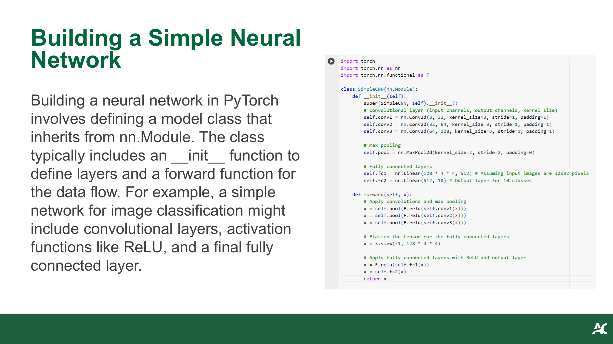

**Building a Simple Neural Network** — 构建简单神经网络

- Building a neural network in PyTorch involves defining a model class that inherits from nn.Module. — 在 PyTorch 中构建神经网络需要定义一个继承自 nn.Module 的模型类。
- The class typically includes an `__init__` function to define layers and a `forward` function for the data flow. — 该类通常包含一个 `__init__` 函数来定义层，以及一个 `forward` 函数来定义数据流。
- For example, a simple network for image classification might include convolutional layers, activation functions like ReLU, and a final fully connected layer. — 例如，一个简单的图像分类网络可能包含卷积层、ReLU 等激活函数和一个最终的全连接层。

---

## 14. PyTorch 计算机视觉 (Computer Vision with PyTorch)

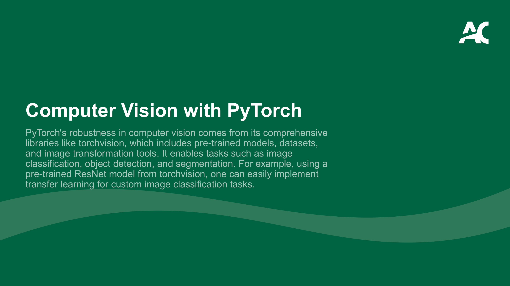

**Computer Vision with PyTorch** — PyTorch 计算机视觉

- PyTorch's robustness in computer vision comes from its comprehensive libraries like torchvision, which includes pre-trained models, datasets, and image transformation tools. — PyTorch 在计算机视觉领域的强大来自于 torchvision 等综合库，其中包含预训练模型、数据集和图像变换工具。
- It enables tasks such as image classification, object detection, and segmentation. — 它支持图像分类、目标检测和语义分割等任务。
- For example, using a pre-trained ResNet model from torchvision, one can easily implement transfer learning for custom image classification tasks. — 例如，使用 torchvision 中的预训练 ResNet 模型，可以轻松实现自定义图像分类任务的迁移学习 (Transfer Learning)。

---

## 15. 高级特性 (Advanced Features in PyTorch)

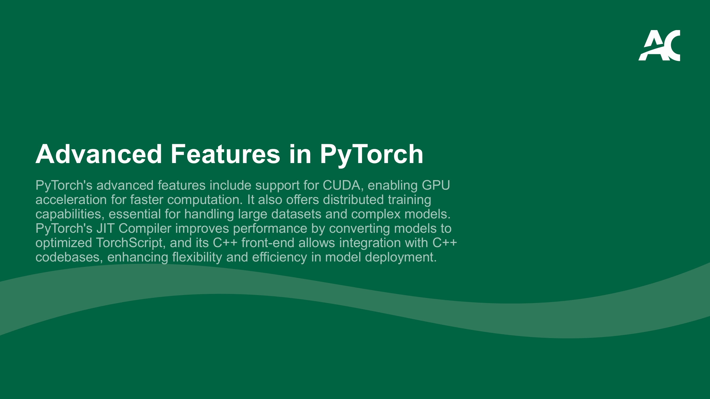

**Advanced Features in PyTorch** — PyTorch 高级特性

- PyTorch's advanced features include support for CUDA, enabling GPU acceleration for faster computation. — PyTorch 的高级特性包括对 CUDA 的支持，实现 GPU 加速以加快计算。
- It also offers distributed training capabilities, essential for handling large datasets and complex models. — 它还提供分布式训练功能，对处理大型数据集和复杂模型至关重要。
- PyTorch's JIT Compiler improves performance by converting models to optimized TorchScript, and its C++ front-end allows integration with C++ codebases, enhancing flexibility and efficiency in model deployment. — PyTorch 的 JIT 编译器通过将模型转换为优化的 TorchScript 来提高性能，其 C++ 前端允许与 C++ 代码库集成，增强模型部署的灵活性和效率。

---

## 16. 社区与生态系统 (Community and Ecosystem)

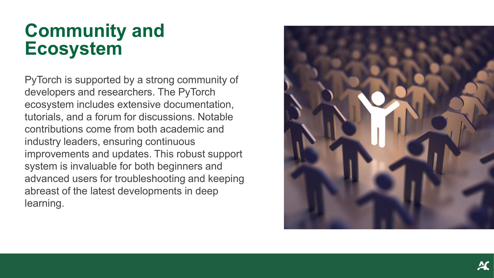

**Community and Ecosystem** — 社区与生态系统

- PyTorch is supported by a strong community of developers and researchers. — PyTorch 由一个强大的开发者和研究者社区支持。
- The PyTorch ecosystem includes extensive documentation, tutorials, and a forum for discussions. — PyTorch 生态系统包含丰富的文档、教程和讨论论坛。
- Notable contributions come from both academic and industry leaders, ensuring continuous improvements and updates. — 来自学术界和工业界领袖的重要贡献确保了持续改进和更新。
- This robust support system is invaluable for both beginners and advanced users for troubleshooting and keeping abreast of the latest developments in deep learning. — 这个强大的支持系统对初学者和高级用户都很宝贵，有助于排错和了解深度学习的最新发展。

---

## 17. 最佳实践 (Best Practices in PyTorch)

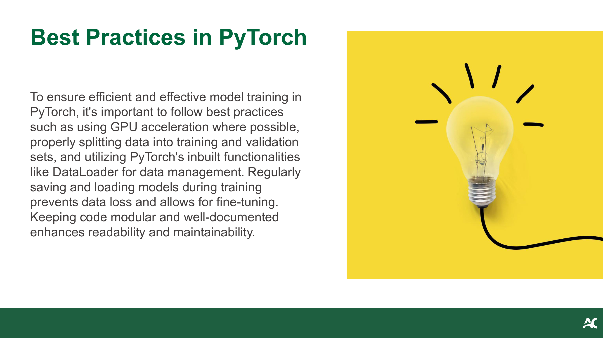

**Best Practices in PyTorch** — PyTorch 最佳实践

- To ensure efficient and effective model training in PyTorch, it's important to follow best practices such as using GPU acceleration where possible, properly splitting data into training and validation sets, and utilizing PyTorch's inbuilt functionalities like DataLoader for data management. — 为确保 PyTorch 中模型训练的高效性，遵循最佳实践很重要，例如尽可能使用 GPU 加速、正确划分训练集和验证集、以及利用 DataLoader 等 PyTorch 内置功能进行数据管理。
- Regularly saving and loading models during training prevents data loss and allows for fine-tuning. — 训练过程中定期保存和加载模型可以防止数据丢失并允许微调。
- Keeping code modular and well-documented enhances readability and maintainability. — 保持代码模块化和良好文档化可以增强可读性和可维护性。

---

## 18. 总结与要点 (Conclusion and Key Takeaways)

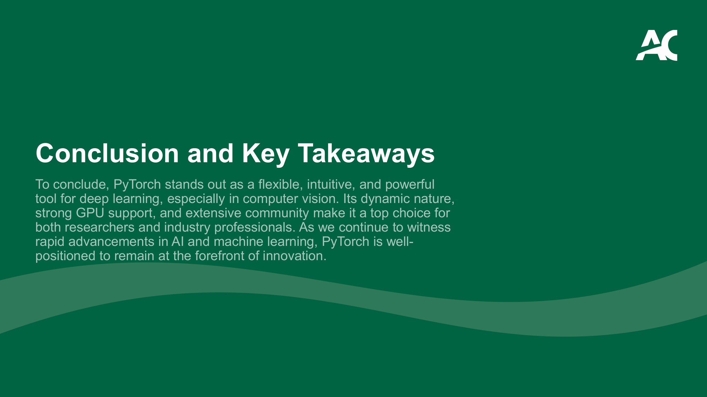

**Conclusion and Key Takeaways** — 总结与关键要点

- To conclude, PyTorch stands out as a flexible, intuitive, and powerful tool for deep learning, especially in computer vision. — 总而言之，PyTorch 是一个灵活、直观且强大的深度学习工具，尤其在计算机视觉领域表现突出。
- Its dynamic nature, strong GPU support, and extensive community make it a top choice for both researchers and industry professionals. — 其动态特性、强大的 GPU 支持和广泛的社区使其成为研究人员和行业专业人士的首选。
- As we continue to witness rapid advancements in AI and machine learning, PyTorch is well-positioned to remain at the forefront of innovation. — 随着 AI 和机器学习的快速发展，PyTorch 有望继续保持创新前沿地位。
