# Week 8: 目标检测基础 (Object Detection Fundamentals)

> Source: `Week 8 - Object Detection Fundamentals.pptx`
> Total slides: 27
> Instructor: Stephin Rachel Thomas | March 19, 2026

---

## 1. 课程概览 (Course Overview)

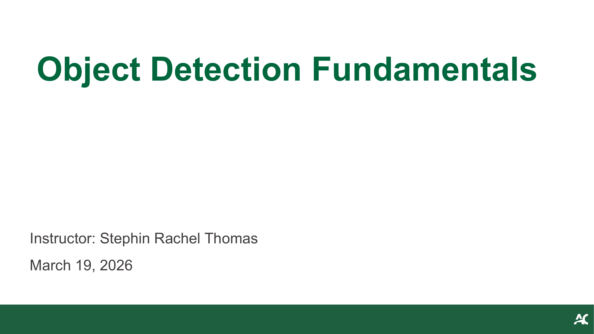

**Object Detection Fundamentals** — 目标检测基础

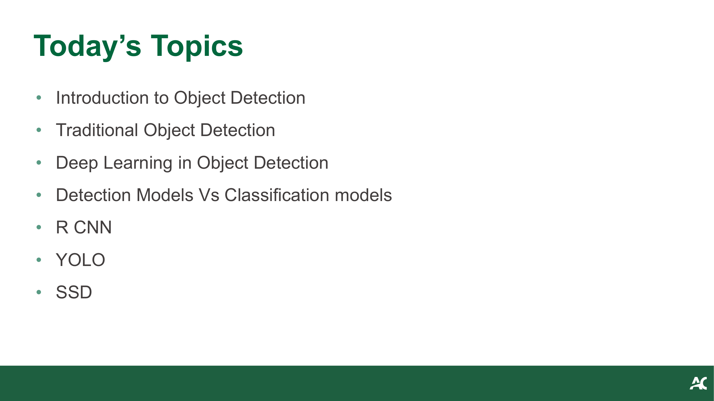

**Today's Topics:** — 今日话题

- Introduction to Object Detection — 目标检测简介
- Traditional Object Detection — 传统目标检测
- Deep Learning in Object Detection — 深度学习在目标检测中的应用
- Detection Models Vs Classification Models — 检测模型与分类模型对比
- R-CNN — 区域卷积神经网络
- YOLO — 你只看一次 (You Only Look Once)
- SSD — 单次多框检测器

> **📝 Notes:**
>
> **承接**: 本节作为开篇，列出本周从传统方法到深度学习的目标检测学习路线；这些主题将为后续「目标检测简介」和「传统 vs 深度学习」的技术演进铺垫框架。

---

## 2. 目标检测简介 (Introduction to Object Detection)

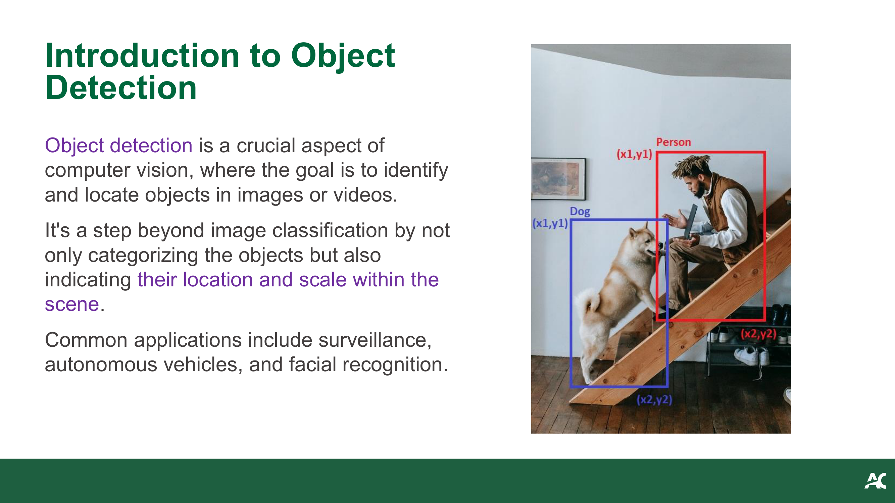

**Introduction to Object Detection** — 目标检测简介

- Object detection is a crucial aspect of computer vision, where the goal is to identify and locate objects in images or videos. — 目标检测是计算机视觉的关键方向，目标是在图像或视频中识别和定位物体。
- It's a step beyond image classification by not only categorizing the objects but also indicating their location and scale within the scene. — 它比图像分类更进一步，不仅对物体进行分类，还指出其在场景中的位置和尺度。
- Common applications include surveillance, autonomous vehicles, and facial recognition. — 常见应用包括监控、自动驾驶和人脸识别。

> **📝 Notes:**
>
> **承接**: 上一节列出了本周学习大纲；本节定义目标检测的核心任务（分类+定位），区分它与图像分类的关键差异；为下一节「目标检测的演进」提供概念基础。

---

## 3. 目标检测的演进 (The Evolution of Object Detection)

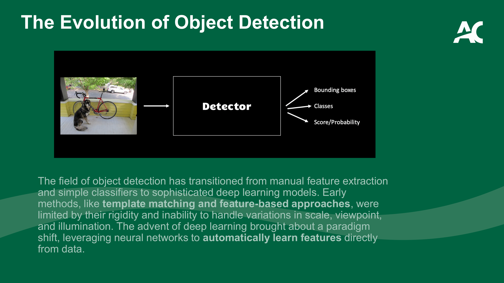

**The Evolution of Object Detection** — 目标检测的演进

- The field of object detection has transitioned from manual feature extraction and simple classifiers to sophisticated deep learning models. — 目标检测领域已从手动特征提取和简单分类器过渡到复杂的深度学习模型。
- Early methods, like template matching and feature-based approaches, were limited by their rigidity and inability to handle variations in scale, viewpoint, and illumination. — 早期方法如模板匹配和基于特征的方法，受限于其刚性以及无法处理尺度、视角和光照变化。
- The advent of deep learning brought about a paradigm shift, leveraging neural networks to automatically learn features directly from data. — 深度学习的出现带来了范式转变，利用神经网络直接从数据中自动学习特征。

> **📝 Notes:**
>
> **承接**: 上一节定义了目标检测的核心任务；本节从宏观视角勾勒技术演进脉络——从手工特征到深度学习的范式转变；为下一节「传统目标检测」的详细分析提供历史背景。

---

## 4. 传统目标检测 (Traditional Object Detection)

### 4.1 概述 (Overview)

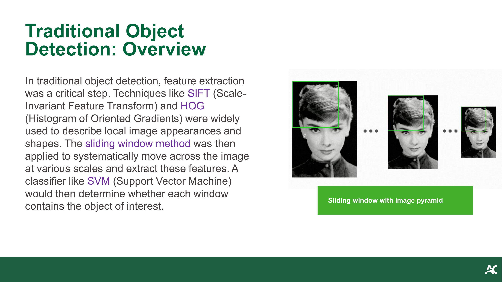

**Traditional Object Detection: Overview** — 传统目标检测概述

- In traditional object detection, feature extraction was a critical step. — 在传统目标检测中，特征提取是关键步骤。
- Techniques like SIFT (Scale-Invariant Feature Transform) and HOG (Histogram of Oriented Gradients) were widely used to describe local image appearances and shapes. — SIFT（尺度不变特征变换）和 HOG（方向梯度直方图）等技术被广泛用于描述局部图像外观和形状。
- The sliding window method was then applied to systematically move across the image at various scales and extract these features. — 然后使用滑动窗口方法在不同尺度上系统地在图像上移动并提取这些特征。
- A classifier like SVM (Support Vector Machine) would then determine whether each window contains the object of interest. — 然后使用 SVM（支持向量机）等分类器判断每个窗口是否包含感兴趣的物体。

### 4.2 关键概念 (Key Concepts)

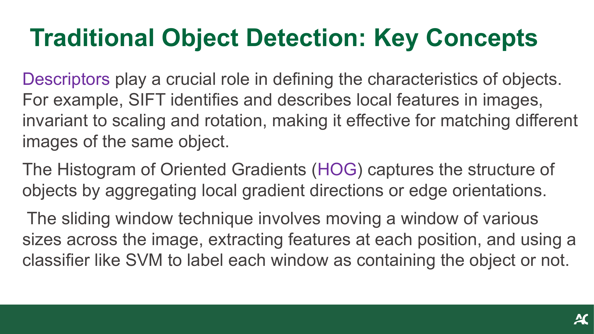

**Traditional Object Detection: Key Concepts** — 传统目标检测：关键概念

- Descriptors play a crucial role in defining the characteristics of objects. — 描述符在定义物体特征方面起着关键作用。
- For example, SIFT identifies and describes local features in images, invariant to scaling and rotation, making it effective for matching different images of the same object. — 例如，SIFT 识别和描述图像中的局部特征，对缩放和旋转不变，使其能有效匹配同一物体的不同图像。
- The Histogram of Oriented Gradients (HOG) captures the structure of objects by aggregating local gradient directions or edge orientations. — 方向梯度直方图 (HOG) 通过聚合局部梯度方向或边缘朝向来捕捉物体结构。
- The sliding window technique involves moving a window of various sizes across the image, extracting features at each position, and using a classifier like SVM to label each window as containing the object or not. — 滑动窗口技术涉及在图像上移动不同大小的窗口，在每个位置提取特征，并使用 SVM 等分类器标记每个窗口是否包含物体。

### 4.3 局限性 (Limitations)

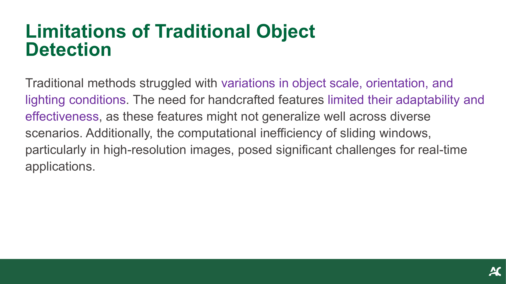

**Limitations of Traditional Object Detection** — 传统目标检测的局限性

- Traditional methods struggled with variations in object scale, orientation, and lighting conditions. — 传统方法在物体尺度、方向和光照条件变化方面表现不佳。
- The need for handcrafted features limited their adaptability and effectiveness, as these features might not generalize well across diverse scenarios. — 手工制作特征的需求限制了其适应性和有效性，这些特征可能无法在多样化场景中很好地泛化。
- Additionally, the computational inefficiency of sliding windows, particularly in high-resolution images, posed significant challenges for real-time applications. — 此外，滑动窗口的计算低效性，特别是在高分辨率图像中，对实时应用构成重大挑战。

> **📝 Notes:**
>
> **承接**: 上一节从宏观介绍了技术演进；本节详解传统管线的三大支柱——SIFT/HOG 特征提取 + 滑动窗口 + SVM 分类器，并暴露其三大致命局限（泛化差、手工特征、计算慢）；这些局限直接驱动了下一节「向深度学习过渡」的动机。

---

## 5. 向深度学习过渡 (Transition to Deep Learning)

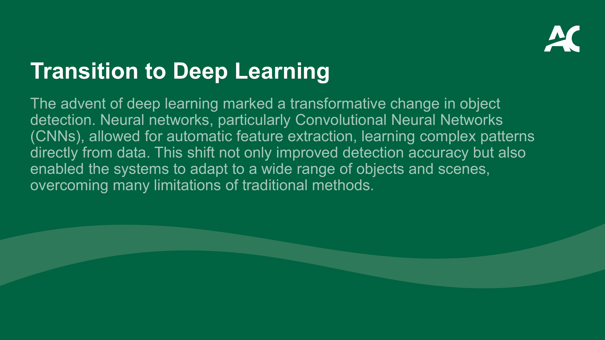

**Transition to Deep Learning** — 向深度学习过渡

- The advent of deep learning marked a transformative change in object detection. — 深度学习的出现标志着目标检测的变革性变化。
- Neural networks, particularly Convolutional Neural Networks (CNNs), allowed for automatic feature extraction, learning complex patterns directly from data. — 神经网络，特别是卷积神经网络 (CNN)，允许自动提取特征，直接从数据中学习复杂模式。
- This shift not only improved detection accuracy but also enabled the systems to adapt to a wide range of objects and scenes, overcoming many limitations of traditional methods. — 这一转变不仅提高了检测精度，还使系统能够适应广泛的物体和场景，克服了传统方法的许多局限。

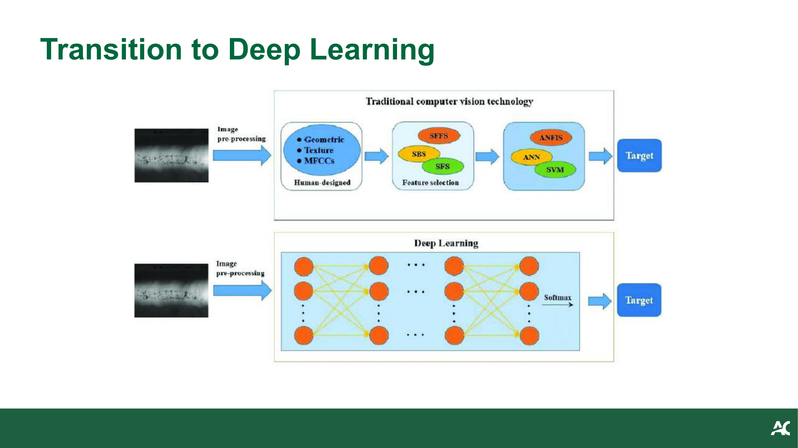

**Transition to Deep Learning** — 向深度学习过渡（图示）

> **📝 Notes:**
>
> **承接**: 上一节暴露了传统方法的三大局限（手工特征/滑动窗口/泛化差）；本节说明 CNN 如何通过自动特征学习一举解决这些问题，为下一节「深度学习目标检测的具体机制」提供技术转折点。

---

## 6. 深度学习目标检测 (Deep Learning in Object Detection)

### 6.1 特征提取 (Feature Extraction)

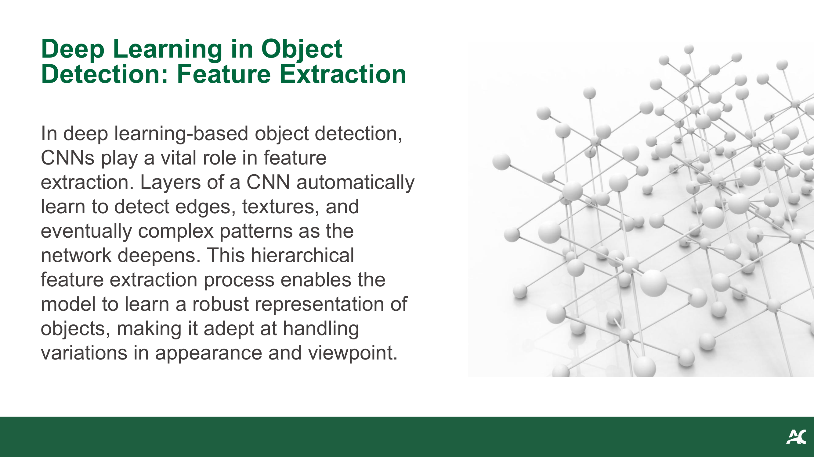

**Deep Learning in Object Detection: Feature Extraction** — 深度学习目标检测：特征提取

- In deep learning-based object detection, CNNs play a vital role in feature extraction. — 在基于深度学习的目标检测中，CNN 在特征提取中起着至关重要的作用。
- Layers of a CNN automatically learn to detect edges, textures, and eventually complex patterns as the network deepens. — CNN 的各层自动学习检测边缘、纹理，随着网络加深最终学习复杂模式。
- This hierarchical feature extraction process enables the model to learn a robust representation of objects, making it adept at handling variations in appearance and viewpoint. — 这种分层特征提取过程使模型能够学习物体的鲁棒表示，善于处理外观和视角的变化。

### 6.2 检测头 (Detection Head)

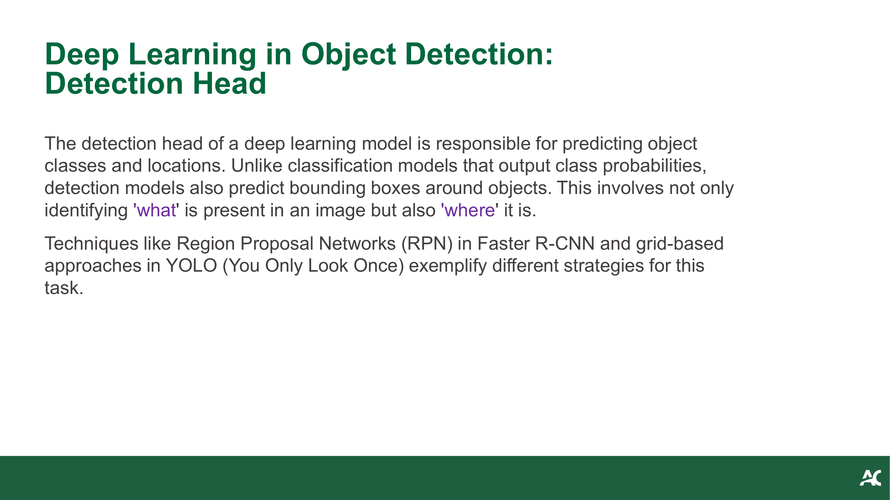

**Deep Learning in Object Detection: Detection Head** — 深度学习目标检测：检测头

- The detection head of a deep learning model is responsible for predicting object classes and locations. — 深度学习模型的检测头负责预测物体类别和位置。
- Unlike classification models that output class probabilities, detection models also predict bounding boxes around objects. — 与输出类别概率的分类模型不同，检测模型还预测物体周围的边界框。
- This involves not only identifying 'what' is present in an image but also 'where' it is. — 这不仅涉及识别图像中"有什么"，还包括"在哪里"。
- Techniques like Region Proposal Networks (RPN) in Faster R-CNN and grid-based approaches in YOLO (You Only Look Once) exemplify different strategies for this task. — Faster R-CNN 中的区域提议网络 (RPN) 和 YOLO 中的基于网格方法是这一任务的不同策略范例。

> **📝 Notes:**
>
> **承接**: 上一节说明了 CNN 解决了自动特征提取问题；本节进一步拆解深度学习检测模型的两大核心模块——CNN 骨干网络（分层特征提取）和检测头（类别+位置预测），引出下一节「检测模型 vs 分类模型」的关键区别。

---

## 7. 检测模型与分类模型的区别 (Detection Models vs. Classification Models)

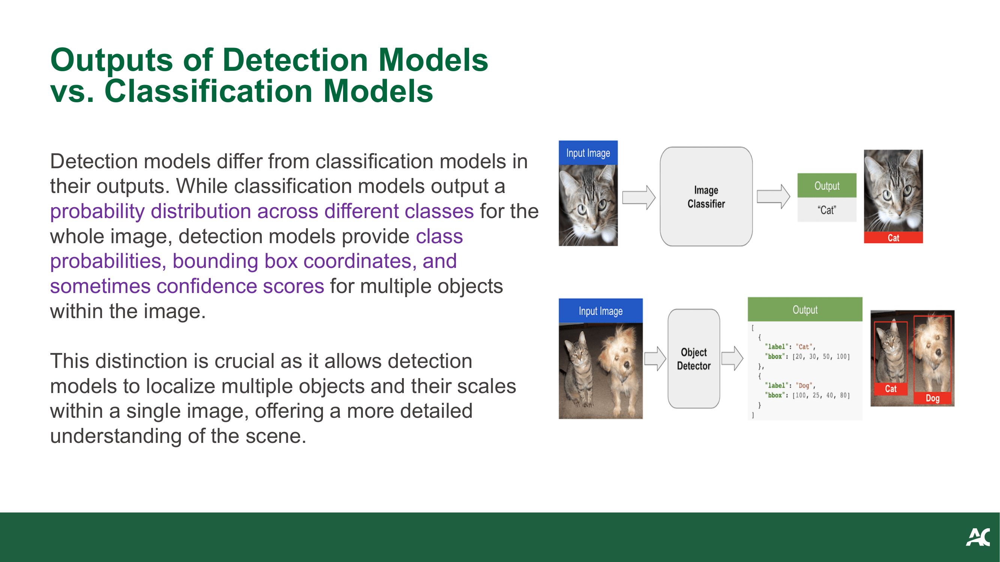

**Outputs of Detection Models vs. Classification Models** — 检测模型与分类模型的输出对比

- Detection models differ from classification models in their outputs. — 检测模型与分类模型在输出上有所不同。
- While classification models output a probability distribution across different classes for the whole image, detection models provide class probabilities, bounding box coordinates, and sometimes confidence scores for multiple objects within the image. — 分类模型为整幅图像输出跨不同类别的概率分布，而检测模型提供图像中多个物体的类别概率、边界框坐标和有时还有置信度分数。
- This distinction is crucial as it allows detection models to localize multiple objects and their scales within a single image, offering a more detailed understanding of the scene. — 这一区别至关重要，因为它允许检测模型在单幅图像中定位多个物体及其尺度，提供对场景更详细的理解。

> **📝 Notes:**
>
> **承接**: 上一节介绍了检测模型的骨干+检测头结构；本节明确检测与分类的输出差异——分类输出整图类别概率，检测输出多个（类别+位置+置信度）；这一区别引出下一节「检测头的两种范式（锚框 vs 无锚框）」。

---

## 8. 检测头类型 (Types of Detection Heads)

### 8.1 基于锚框 (Anchor-Based)

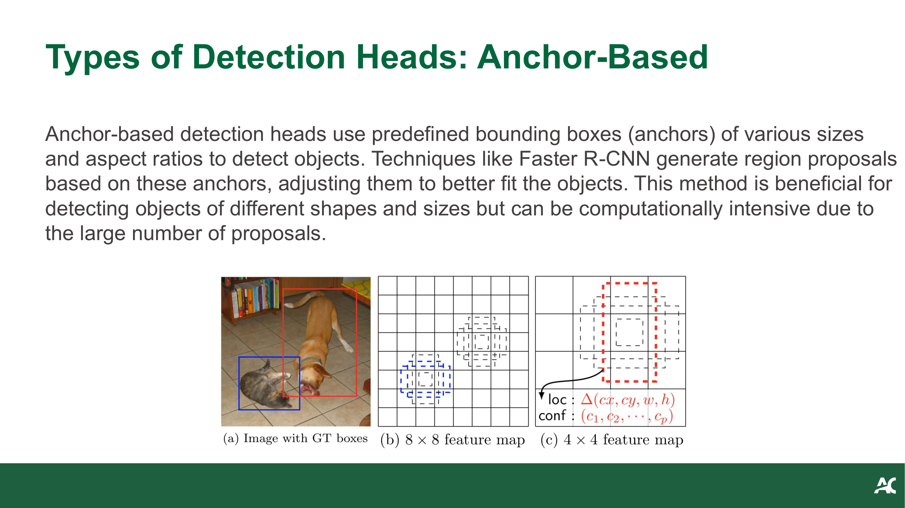

**Types of Detection Heads: Anchor-Based** — 检测头类型：基于锚框

- Anchor-based detection heads use predefined bounding boxes (anchors) of various sizes and aspect ratios to detect objects. — 基于锚框的检测头使用各种大小和宽高比的预定义边界框（锚框）来检测物体。
- Techniques like Faster R-CNN generate region proposals based on these anchors, adjusting them to better fit the objects. — Faster R-CNN 等技术基于这些锚框生成区域提议，并调整它们以更好地拟合物体。
- This method is beneficial for detecting objects of different shapes and sizes but can be computationally intensive due to the large number of proposals. — 这种方法有利于检测不同形状和大小的物体，但由于大量提议可能计算密集。

### 8.2 无锚框 (Anchorless / Anchor-Free)

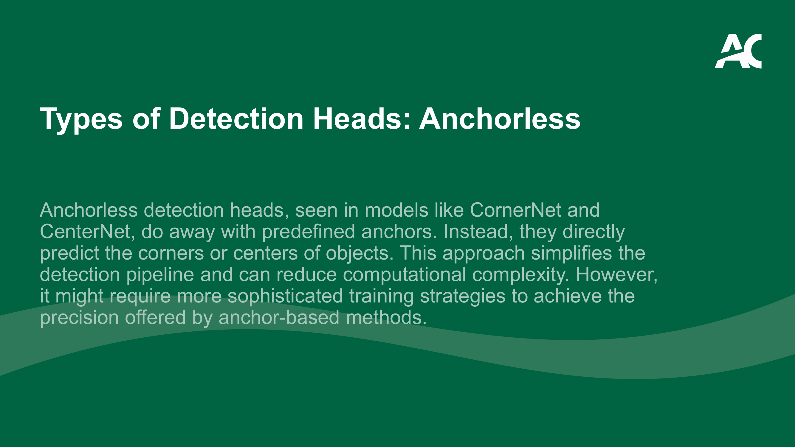

**Types of Detection Heads: Anchorless** — 检测头类型：无锚框

- Anchorless detection heads, seen in models like CornerNet and CenterNet, do away with predefined anchors. — 无锚框检测头（如 CornerNet 和 CenterNet 中）摒弃了预定义锚框。
- Instead, they directly predict the corners or centers of objects. — 它们直接预测物体的角点或中心点。
- This approach simplifies the detection pipeline and can reduce computational complexity. — 这种方法简化了检测流程，可以降低计算复杂度。
- However, it might require more sophisticated training strategies to achieve the precision offered by anchor-based methods. — 但它可能需要更复杂的训练策略来达到基于锚框方法所提供的精度。

> **📝 Notes:**
>
> **承接**: 上一节区分了检测与分类的输出差异；本节深入检测头的两大范式——锚框法（Faster R-CNN 代表，精度高但计算密集）和无锚框法（CornerNet/CenterNet 代表，简洁但训练难），为下一节「实际应用案例」提供技术选型背景。

---

## 9. 实际案例与应用 (Case Studies and Applications)

### 9.1 现实世界示例 (Real-World Examples)

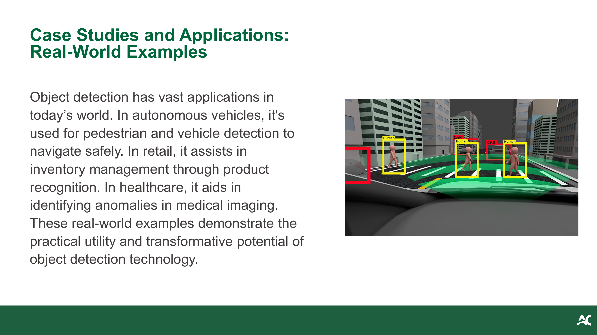

**Real-World Examples** — 现实世界示例

- Object detection has vast applications in today's world. — 目标检测在当今世界有广泛应用。
- In autonomous vehicles, it's used for pedestrian and vehicle detection to navigate safely. — 在自动驾驶中，用于行人和车辆检测以安全导航。
- In retail, it assists in inventory management through product recognition. — 在零售中，通过产品识别辅助库存管理。
- In healthcare, it aids in identifying anomalies in medical imaging. — 在医疗保健中，辅助识别医学影像中的异常。
- These real-world examples demonstrate the practical utility and transformative potential of object detection technology. — 这些现实世界示例展示了目标检测技术的实际效用和变革潜力。

### 9.2 行业用例 (Industry Use-Cases)

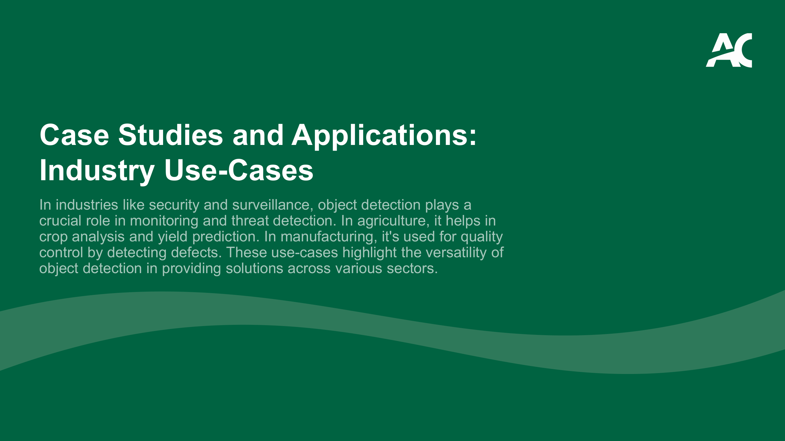

**Industry Use-Cases** — 行业用例

- In industries like security and surveillance, object detection plays a crucial role in monitoring and threat detection. — 在安防监控等行业，目标检测在监控和威胁检测中起着关键作用。
- In agriculture, it helps in crop analysis and yield prediction. — 在农业中，帮助进行作物分析和产量预测。
- In manufacturing, it's used for quality control by detecting defects. — 在制造业中，用于通过检测缺陷进行质量控制。
- These use-cases highlight the versatility of object detection in providing solutions across various sectors. — 这些用例凸显了目标检测在各个行业提供解决方案方面的多功能性。

> **📝 Notes:**
>
> **承接**: 上一节介绍了检测头的技术范式；本节展示目标检测在自动驾驶、零售、医疗、安防、农业、制造等行业的实际落地场景，为下一节「R-CNN 系列」的具体模型演进提供应用驱动的动机。

---

## 10. R-CNN 系列 (R-CNNs and Beyond)

### 10.1 概述 (Overview)

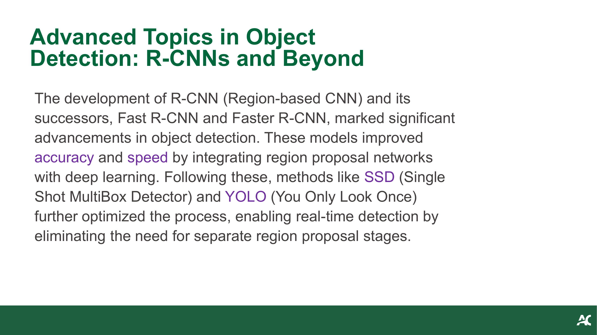

**Advanced Topics in Object Detection: R-CNNs and Beyond** — 目标检测高级话题：R-CNN 系列及更多

- The development of R-CNN (Region-based CNN) and its successors, Fast R-CNN and Faster R-CNN, marked significant advancements in object detection. — R-CNN（基于区域的 CNN）及其后续版本 Fast R-CNN 和 Faster R-CNN 的发展标志着目标检测的重大进步。
- These models improved accuracy and speed by integrating region proposal networks with deep learning. — 这些模型通过将区域提议网络与深度学习集成来提高精度和速度。
- Following these, methods like SSD (Single Shot MultiBox Detector) and YOLO (You Only Look Once) further optimized the process, enabling real-time detection by eliminating the need for separate region proposal stages. — 随后，SSD（单次多框检测器）和 YOLO（你只看一次）等方法进一步优化了流程，通过消除单独的区域提议阶段实现了实时检测。

### 10.2 R-CNN 原理 (R-CNN Mechanism)

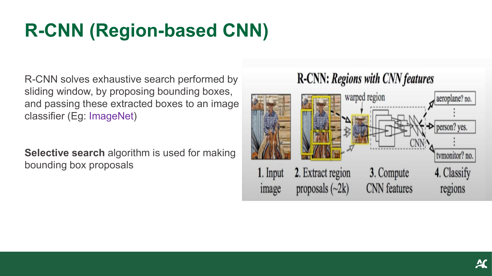

**R-CNN (Region-based CNN)** — R-CNN（基于区域的 CNN）

- R-CNN solves exhaustive search performed by sliding window, by proposing bounding boxes, and passing these extracted boxes to an image classifier (e.g. ImageNet). — R-CNN 通过提出边界框并将这些提取的框传递给图像分类器（如 ImageNet），解决了滑动窗口执行的穷举搜索问题。
- Selective search algorithm is used for making bounding box proposals. — 使用选择性搜索算法来生成边界框提议。

### 10.3 计算边界框 (Calculating Bounding Box)

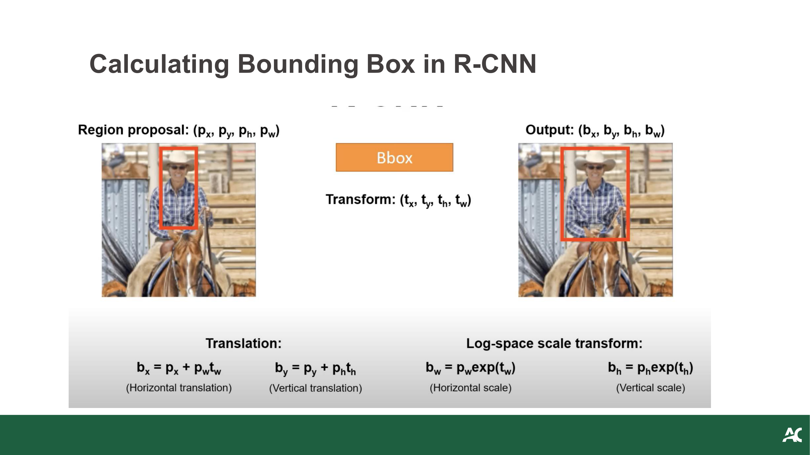

**Calculating Bounding Box in R-CNN** — R-CNN 中的边界框计算

> **📝 Notes:**
>
> **承接**: 上一节展示了目标检测的广泛应用场景；本节进入核心模型演进——R-CNN 系列从选择性搜索→区域提议网络的迭代（R-CNN→Fast→Faster），说明如何用区域提议替代滑动窗口的穷举搜索；为下一节「IoU 评估指标」提供边界框精度衡量的需求。

---

## 11. IoU 指标 (Intersection Over Union Metric)

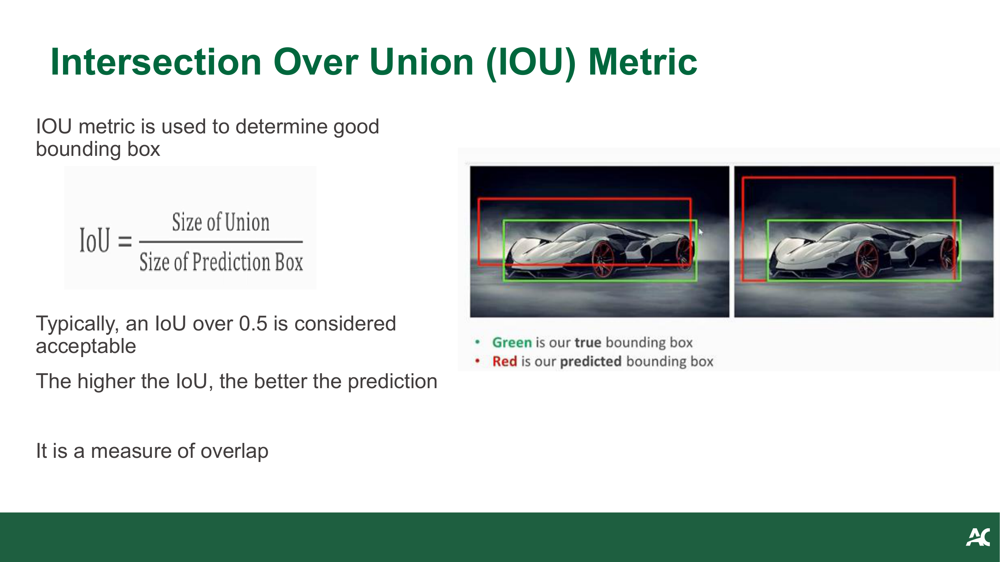

**Intersection Over Union (IoU) Metric** — 交并比 (IoU) 指标

- IoU metric is used to determine good bounding box — IoU 指标用于判断边界框的好坏
- Typically, an IoU over 0.5 is considered acceptable — 通常 IoU 超过 0.5 被认为是可接受的
- The higher the IoU, the better the prediction — IoU 越高，预测越好
- It is a measure of overlap — 它是一种重叠度量

> **📝 Notes:**
>
> **承接**: 上一节介绍了 R-CNN 如何生成和分类区域提议；本节引入 IoU——衡量预测边界框与真实边界框重叠度的核心指标（阈值 0.5），为下一节「SSD 与 YOLO」的单阶段检测方法评估提供量化标准。

---

## 12. SSD 与 YOLO (Single Shot Detectors and YOLO)

### 12.1 概述 (Overview)

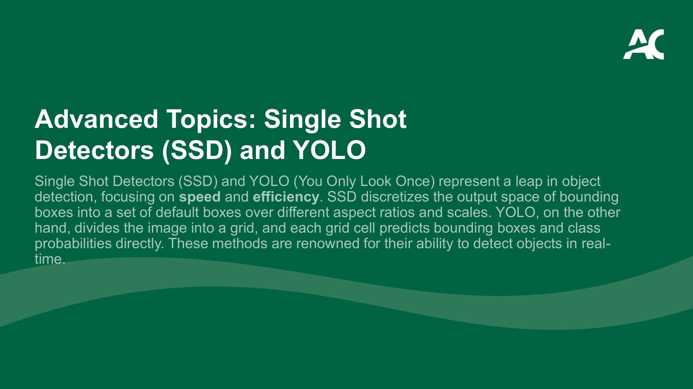

**Advanced Topics: Single Shot Detectors (SSD) and YOLO** — 高级话题：SSD 与 YOLO

- Single Shot Detectors (SSD) and YOLO (You Only Look Once) represent a leap in object detection, focusing on speed and efficiency. — SSD 和 YOLO 代表了目标检测的飞跃，专注于速度和效率。
- SSD discretizes the output space of bounding boxes into a set of default boxes over different aspect ratios and scales. — SSD 将边界框的输出空间离散化为一组不同宽高比和尺度的默认框。
- YOLO, on the other hand, divides the image into a grid, and each grid cell predicts bounding boxes and class probabilities directly. — YOLO 则将图像划分为网格，每个网格单元直接预测边界框和类别概率。
- These methods are renowned for their ability to detect objects in real-time. — 这些方法以实时目标检测能力而闻名。

### 12.2 SSD 与 YOLO 对比 (SSD vs YOLO)

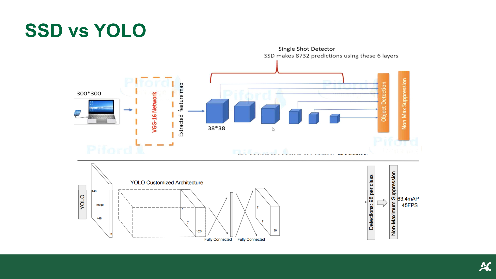

**SSD vs YOLO** — SSD 与 YOLO 对比

### 12.3 SSD 详解 (SSD in Detail)

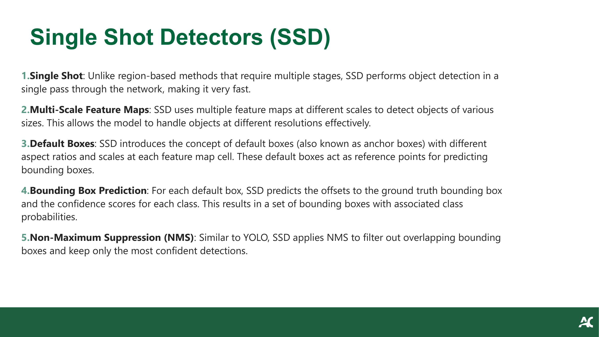

**Single Shot Detectors (SSD)** — 单次多框检测器 (SSD)

1. **Single Shot** — **单次检测**: Unlike region-based methods that require multiple stages, SSD performs object detection in a single pass through the network, making it very fast. — 与需要多个阶段的基于区域方法不同，SSD 在网络中单次传递即完成目标检测，速度非常快。
2. **Multi-Scale Feature Maps** — **多尺度特征图**: SSD uses multiple feature maps at different scales to detect objects of various sizes. This allows the model to handle objects at different resolutions effectively. — SSD 使用不同尺度的多个特征图来检测各种大小的物体，使模型能有效处理不同分辨率的物体。
3. **Default Boxes** — **默认框**: SSD introduces the concept of default boxes (also known as anchor boxes) with different aspect ratios and scales at each feature map cell. These default boxes act as reference points for predicting bounding boxes. — SSD 引入了在每个特征图单元上具有不同宽高比和尺度的默认框（也称锚框）概念，这些默认框作为预测边界框的参考点。
4. **Bounding Box Prediction** — **边界框预测**: For each default box, SSD predicts the offsets to the ground truth bounding box and the confidence scores for each class. This results in a set of bounding boxes with associated class probabilities. — 对于每个默认框，SSD 预测到真实边界框的偏移量和每个类别的置信度分数，生成一组带有相关类别概率的边界框。
5. **Non-Maximum Suppression (NMS)** — **非极大值抑制**: Similar to YOLO, SSD applies NMS to filter out overlapping bounding boxes and keep only the most confident detections. — 与 YOLO 类似，SSD 应用 NMS 过滤重叠的边界框，只保留最有信心的检测结果。

### 12.4 YOLO 详解 (YOLO in Detail)

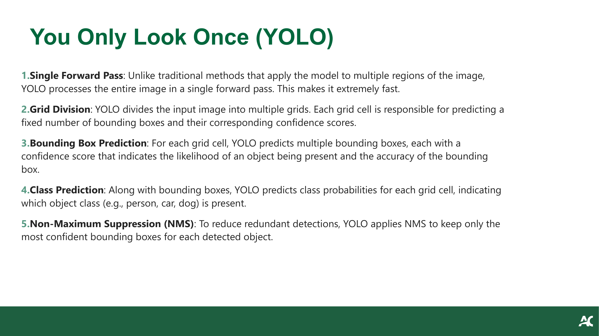

**You Only Look Once (YOLO)** — YOLO（你只看一次）

1. **Single Forward Pass** — **单次前向传递**: Unlike traditional methods that apply the model to multiple regions of the image, YOLO processes the entire image in a single forward pass. This makes it extremely fast. — 与传统方法将模型应用于图像多个区域不同，YOLO 在单次前向传递中处理整幅图像，使其极其快速。
2. **Grid Division** — **网格划分**: YOLO divides the input image into multiple grids. Each grid cell is responsible for predicting a fixed number of bounding boxes and their corresponding confidence scores. — YOLO 将输入图像划分为多个网格，每个网格单元负责预测固定数量的边界框及其对应的置信度分数。
3. **Bounding Box Prediction** — **边界框预测**: For each grid cell, YOLO predicts multiple bounding boxes, each with a confidence score that indicates the likelihood of an object being present and the accuracy of the bounding box. — 对于每个网格单元，YOLO 预测多个边界框，每个边界框都有一个置信度分数，指示物体存在的可能性和边界框的准确性。
4. **Class Prediction** — **类别预测**: Along with bounding boxes, YOLO predicts class probabilities for each grid cell, indicating which object class (e.g., person, car, dog) is present. — 除了边界框，YOLO 还预测每个网格单元的类别概率，指示存在哪个物体类别（如人、车、狗）。
5. **Non-Maximum Suppression (NMS)** — **非极大值抑制**: To reduce redundant detections, YOLO applies NMS to keep only the most confident bounding boxes for each detected object. — 为减少冗余检测，YOLO 应用 NMS 只保留每个检测物体最有信心的边界框。

> **📝 Notes:**
>
> **承接**: 上一节介绍了 IoU 评估指标；本节详解两大单阶段检测器——SSD（多尺度默认框+单次前向）和 YOLO（网格划分+全图单次推理），两者都使用 NMS 后处理，以速度换取实时性；为下一节「目标检测的挑战」提供技术方案的完整图景。

---

## 13. 目标检测的挑战 (Challenges in Object Detection)

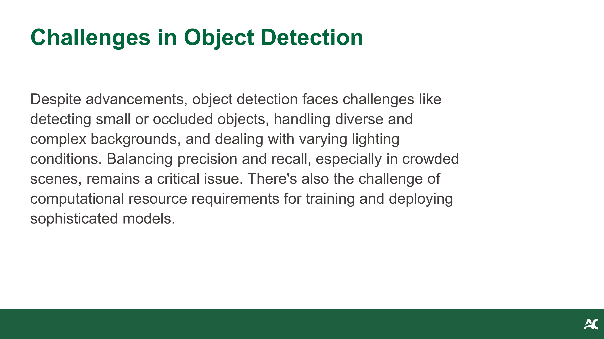

**Challenges in Object Detection** — 目标检测的挑战

- Despite advancements, object detection faces challenges like detecting small or occluded objects, handling diverse and complex backgrounds, and dealing with varying lighting conditions. — 尽管有所进步，目标检测仍面临如检测小物体或被遮挡物体、处理多样化复杂背景以及应对不同光照条件等挑战。
- Balancing precision and recall, especially in crowded scenes, remains a critical issue. — 平衡精确率和召回率，特别是在拥挤场景中，仍然是关键问题。
- There's also the challenge of computational resource requirements for training and deploying sophisticated models. — 还有训练和部署复杂模型对计算资源的需求挑战。

> **📝 Notes:**
>
> **承接**: 上一节详解了 SSD 和 YOLO 两大实时检测方案；本节指出即便有深度学习加持，目标检测仍面临小物体/遮挡、精确率-召回率平衡、计算资源等三大挑战；为下一节「未来展望」的技术方向提供问题驱动的需求。

---

## 14. 未来展望与新兴技术 (Future Perspectives and Emerging Technologies)

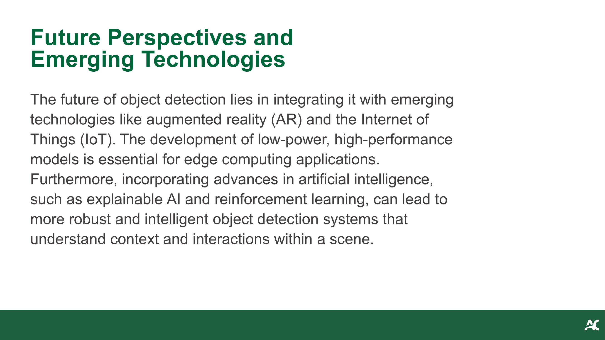

**Future Perspectives and Emerging Technologies** — 未来展望与新兴技术

- The future of object detection lies in integrating it with emerging technologies like augmented reality (AR) and the Internet of Things (IoT). — 目标检测的未来在于将其与增强现实 (AR) 和物联网 (IoT) 等新兴技术集成。
- The development of low-power, high-performance models is essential for edge computing applications. — 开发低功耗、高性能模型对边缘计算应用至关重要。
- Furthermore, incorporating advances in artificial intelligence, such as explainable AI and reinforcement learning, can lead to more robust and intelligent object detection systems that understand context and interactions within a scene. — 此外，融合可解释 AI 和强化学习等人工智能进展，可以产生更鲁棒和智能的目标检测系统，理解场景中的上下文和交互。

> **📝 Notes:**
>
> **承接**: 上一节列出了目标检测的三大未解挑战；本节展望未来方向——AR/IoT 集成、边缘计算、可解释 AI 和强化学习，为下一节「总结」的全局回顾做铺垫。

---

## 15. 总结与要点 (Conclusion and Key Takeaways)

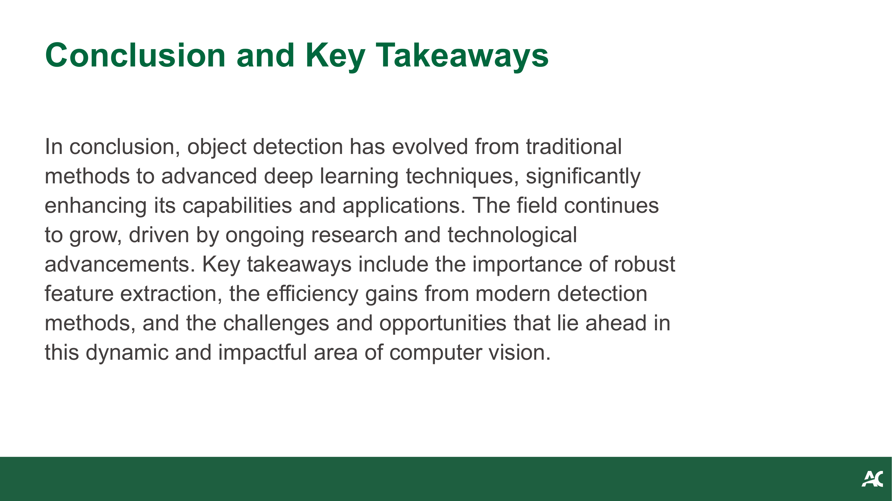

**Conclusion and Key Takeaways** — 总结与关键要点

- In conclusion, object detection has evolved from traditional methods to advanced deep learning techniques, significantly enhancing its capabilities and applications. — 总而言之，目标检测已从传统方法演进到先进的深度学习技术，显著增强了其能力和应用。
- The field continues to grow, driven by ongoing research and technological advancements. — 该领域在持续的研究和技术进步推动下不断发展。
- Key takeaways include the importance of robust feature extraction, the efficiency gains from modern detection methods, and the challenges and opportunities that lie ahead in this dynamic and impactful area of computer vision. — 关键要点包括鲁棒特征提取的重要性、现代检测方法的效率提升，以及这一充满活力且影响深远的计算机视觉领域所面临的挑战和机遇。

> **📝 Notes:**
>
> **承接**: 前面各节完成了从传统目标检测→深度学习革命→R-CNN 系列→SSD/YOLO→挑战与未来的全流程；本节回顾要点，强调特征提取、效率和挑战三大主线。
