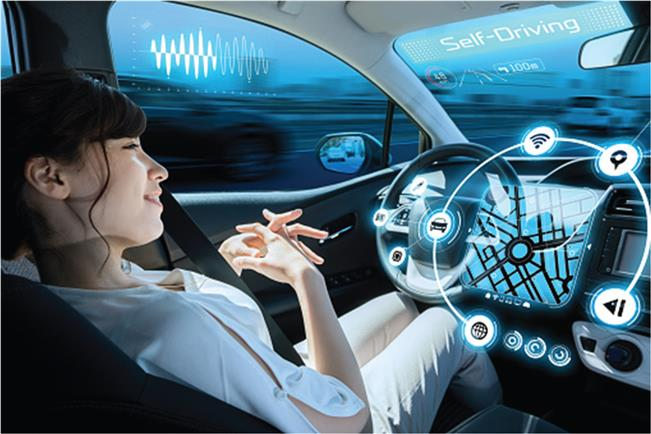
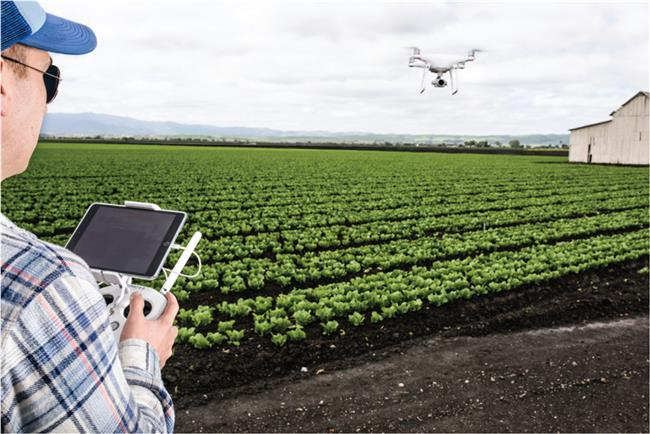
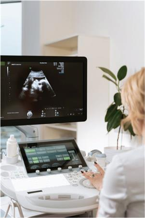
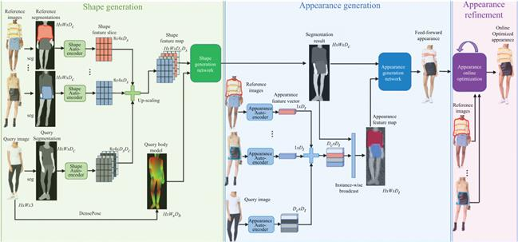

# Chiranjilalchow-Computervisionandreco-2021-13Applicationofcomput1

**Source:** `ChiranjiLalChow-ComputerVisionAndReco-2021-13ApplicationOfComput1.pdf`
**Total Pages:** 7

---

## Page 1

vision is quickly becoming the most important artificial sensor in the fields of industrial quality assurance and mobile robot
trajectory management. Cheng et al. [20] used computer vision in industrial GUI automation. We build smart machines and robots
to replace manual labor in the pursuit of Industry 4.0. Various fundamental technologies can be used to simplify the user interface.
Modern machine vision methods are now opening new doors in automated optical image object recognition. Deep learning (DL)
and sparse representation are two computer vision methods that are commonly used in the computer vision community for object
and texture detection, with promising results in optical images. In the case of X-ray testing, a thorough evaluation is needed [21–31]
.
1.3 Application of computer vision technology in automation
Nowadays, the application field of AI-based computer vision technology is in the automotive sector. The main points [32] are as
follows:
1. Vision-guided machine automation: This is a robot's computer vision that makes the machines more flexible to perform
the repeating tasks with increased efficiency.
2. Inspection automation: Component inspections are conducted by computer vision systems 24 h a day, 7 days a week, in a
quick and reliable manner that increases performance and product quality.
3. 3D vision automation: Moving, tracking, and precisely localizing moving objects in 3D space are made possible by
AI-based computer vision cameras.
4. Automation in a car: Vehicles, pedestrians, and other objects can all be identified with the right algorithms, a strong
processor, and a handful of image sensors mounted on a vehicle. However, you can read traffic lights, lane markers, road
signs, and road surface conditions.
5. Automation for safer human–robots interaction: Computer vision application powered by AI determines the exact
location and direction of the human. Interactions are more fluid, versatile, and safe because of this capacity to respond to
human trajectories.
Technology has come a long way in terms of advanced robotics and automation. Machines can now ‘see' pictures, process
information, and behave in the same way that humans can. Computer vision is a complex technique that allows machines to see and
process information. It is a field that combines solid mechanics, neurobiology, and other factors to teach a computer to recognize
pictures, videos, or patterns and respond appropriately [32]. New technological developments in computer vision and recognition
lead to a safe automated system. Following are the latest such advances.
1.3.1 Using face ID in mobile devices
Face ID is Apple's facial recognition technology, which debuted with the iPhone X in 2017. The technology replaces the Touch ID
fingerprint scanning system. This is a face unlock feature [33] which is being used in every Android and iPhone device after once
launched. This approach is providing more security to these devices. This is based on computer vision and recognition system
which permits the phone device to recognize the facial features (Figure 1.2), matching it with database and finally allow unlock the
phone if the new captured face is matching with stored images.
.ygolonhceT
dna
gnireenignE
fo
noitutitsnI
ehT
.1202
thgirypoC
.wal
thgirypoc
elbacilppa
ro

### .S.U

rednu
dettimrep
sesu
riaf
tpecxe
,rehsilbup
eht
morf
noissimrep
tuohtiw
mrof
yna
ni
decudorper
eb
ton
yaM
.devreser
sthgir
llA
EBSCO Publishing : eBook Collection (EBSCOhost) - printed on 1/4/2025 10:37 PM via ALGONQUIN COLLEGE
AN: 3036887 ; Chiranji Lal Chowdhary, Mamoun Alazab, Ankit Chaudhary, Saqib Hakak, Thippa Reddy Gadekallu.; Computer Vision and Recognition Systems Using Machine
and Deep Learning Approaches : Fundamentals, Technologies and Applications
Account: algon.main.ehost

**📝 Notes:**

> [Add your notes here]

---

## Page 2: Figure 1.2 Face ID unlock feature on cell phones


**📷 Images:**


1.3.2 Automated automobiles
In India, automobile accidents are one of the leading causes of death [34]. Every year, an estimated 1.3 million people die in traffic
accidents around the world [35]. These staggering statistics illustrate the need for increased caution among drivers and pedestrians.
To address such issues, companies such as Tesla have decided to develop self-driving vehicles [36]. Individuals will feel more
secure and healthy when driving due to this automation technology.
Sensing pedestrian gestures, understanding traffic signals, controlling speed in congested areas, and maneuvering in an
emergency are all possible with computer vision (Figure 1.3). Waymo [37] is an example of a business that uses robotics and
automation to reduce the number of people involved in car accidents.
EBSCOhost - printed on 1/4/2025 10:37 PM via ALGONQUIN COLLEGE. All use subject to https://www.ebsco.com/terms-of-use

**📝 Notes:**

> [Add your notes here]

---

## Page 3: Figure 1.3 Automated car


**📷 Images:**



1.3.3 Computer vision in agriculture
Agriculture is the reason we can eat nutritious food, but it has always gone unnoticed in the region. Farmers work tirelessly to
successfully water crops, spray insecticides, and maintain a high level of turnover. Growing crops on a wide scale is a very hectic
operation that cannot be done by a small team.
As a result, computer vision was used to relieve farmers of some of their responsibilities. Drones (Figure 1.4) have been
invented by companies like Slantrange using industrial automation to inspect acres of agricultural land, detect crop water levels, and
control damage [38]. The sensors can distinguish between crop qualities and distinguish between good and bad yields.
EBSCOhost - printed on 1/4/2025 10:37 PM via ALGONQUIN COLLEGE. All use subject to https://www.ebsco.com/terms-of-use

**📝 Notes:**

> [Add your notes here]

---

## Page 4: Figure 1.4 Computer vision in agriculture


**📷 Images:**



Farmers no longer have to worry about their crops being destroyed due to human error due to intelligent automation. In
addition, this computer vision system monitors weather conditions in order to alert farmers to hailstorms or other severe weather.
Drones that are regulated by computers are often used in the United States, but they need to be popularized in India as well.
Farming provides a living for 70% of the Indian population, and it is past time for the government to take steps to improve their
working conditions.
1.3.4 Computer vision in the health sector
A patient's life can be lost in a matter of minutes if a diagnosis is made incorrectly. In medicine, computer vision has the highest
degree of accuracy and efficacy. It makes early diagnoses, decreases the chances of false-positive tests, and keeps track of the
health of the patient. For example, if a patient's blood pressure drops suddenly, the automation technology will automatically sound
an alarm and prescribe the necessary medications (Figure 1.5).
EBSCOhost - printed on 1/4/2025 10:37 PM via ALGONQUIN COLLEGE. All use subject to https://www.ebsco.com/terms-of-use

**📝 Notes:**

> [Add your notes here]

---

## Page 5: Figure 1.5 Computer vision in the health sector


**📷 Images:**



Computer vision is also used in specialized fields such as nuclear medicine, which treats medical problems with protons. It also
aids in the provision of high-quality body scans and photographs for a clearer understanding of a patient's issues.
1.3.5 Computer vision in the e-commerce industry
Online shopping has been on the rise since the release of COVID-19. Customers prefer to shop online rather than go to stores. This
resulted in a significant increase in traffic, which was efficiently managed by most web pages using computer vision software.
Every item is organized by category using intelligent automation, making it easier for customers to search the items.
Furthermore, it displays objects based on your preferences, preventing you from browsing through random goods. Computer vision
allows for smooth payment transfers in addition to keeping consumers hooked (Figure 1.6).
EBSCOhost - printed on 1/4/2025 10:37 PM via ALGONQUIN COLLEGE. All use subject to https://www.ebsco.com/terms-of-use

**📝 Notes:**

> [Add your notes here]

---

## Page 6: Figure 1.6 “Virtual try-on network” used by Amazon researchers


**📷 Images:**



Customers became irritated as a result of the COVID-19 restrictions, which included long payment lines in shopping malls and
shopkeepers who were constantly bickering. On the other hand, they do not have to deal with any of these problems while shopping
online. Robotics and automation played the main role in building the best customer experience.
Computer vision is a rapidly developing field that has yet to fully replace conventional technology. However, as time passes,
respectable businesses are gradually moving to automation technology. This is due to the fact that in the tech world, change is the
only constant, and brands must keep up with the new tools and apps. India, too, will begin researching and investing in computer
vision, whether today or tomorrow, in order to build a safer and more prosperous future.
1.3.6 Generating 3D maps
It would make it possible for self-driving cars to gather visual data in real-time. The cameras mounted on such vehicles can capture
live video and use computer vision to generate 3D maps. With these maps, autonomous vehicles can better understand their
surroundings, spot obstacles in their way, and choose alternate routes.
Self-driving cars can use 3D maps to anticipate collisions and can deploy airbags to shield passengers instantly. This approach
increases the safety and reliability of self-driving vehicles. As a result, technology will assist in the development of safe
autonomous vehicles that prevent collisions and protect passengers. As a result, computer vision will assist in the development of
self-driving vehicles that can prevent collisions and protect passengers in the event of one.
1.3.7 Classifying and detecting objects
Self-driving cars may use technology to identify and track various objects. The vehicle will use light detection and ranging
(LiDAR) sensors and cameras to measure distance, with the former using pulsed laser beams. The information collected can be
used in combination with 3D maps to detect objects such as traffic lights, cars, and pedestrians. These high-tech vehicles process
data in real-time and make decisions based on it. As a result of computer vision, self-driving cars would be able to detect obstacles
and prevent collisions and accidents.
1.3.8 Congregation data for training algorithms
Using cameras and sensors, computer vision technology can collect vast quantities of data, such as location information, traffic
conditions, road maintenance, and crowded areas, among other items. These specific details will help self-driving cars use
situational knowledge to make critical decisions as quickly as possible. This information can be used to train DL models in the
future. For example, a thousand computer vision images of traffic signals can be used to train DL models to detect traffic signals

```python
while driving. It can also assist self-driving vehicles in classifying various types of items.
```

1.3.9 Low-light mode with computer vision
Self-driving cars use different algorithms to process low-light images and videos than they do for daylight images and videos.
EBSCOhost - printed on 1/4/2025 10:37 PM via ALGONQUIN COLLEGE. All use subject to https://www.ebsco.com/terms-of-use

**📝 Notes:**

> [Add your notes here]

---

## Page 7: Low-light images can be fuzzy, and such data may not be precise enough for these vehicles.

When the computer vision senses a low-light situation, it will automatically turn to low-light mode. LiDAR sensors, thermal
cameras, and high-dynamic-range imaging (HDR) sensors can all be used to gather this information. These devices can be used to
produce high-resolution images and videos. Using computer vision technology, self-driving vehicles can be rendered intelligent,
self-reliant, and dependable. However, the vehicles could face additional difficulties during construction.
1.4 Ensuring safety during COVID-19 using computer vision
1.4.1 AI started from bringing humans closer to forcing them in keeping apart
As technology crept into our lives, it was almost unanimously done under the slogan “technology will bring us all closer together.”
Now, in the COVID-19 era, technology has been charged with a much more important task: holding us all apart. This has resulted
in a search for innovations that can help us stop the spread of the virus while still helping us to return to growth and prosperity. AI
is leading the way, allowing us to work smarter and safer in these uncertain times.
Many of the technologies at the forefront of the war to stop the spread of COVID-19 make use of key elements of computer
vision technology, which enables computers to create an artificial interpretation of sequences of images using AI [39].
1.4.2 Access control through computer vision
In the midst of a pandemic, touch-screen and other types of biometric access are still seen as unnecessarily dangerous, as
maintaining adequate cleaning and hygiene of these high-touch surfaces is virtually impossible. However, many companies and
industries continue to place a high value on safe and stable access control.
Fortunately, central processing units (CPUs) and graphics processing units (GPUs) have progressed to the point that they can
now perform rapid, touchless image recognition. The device uses artificial intelligence to quickly scan facial expressions from a
safe distance in order to establish identity and access authorization. This removes the need for high-touch surfaces such as keypads
and thumbprint scanners, as well as face-to-face human security checkpoints, making security personnel safer and more effective [
39].
1.4.3 Thermal fever detection cameras
When offices and workplaces reopen, everyone is struggling to come up with instructions for identifying people who might be
infected and stopping them from spreading the virus further. Temperature increase is a universal indicator; however, manually
monitoring the temperatures of hundreds or even thousands of people in places such as airports, office buildings, and other
high-volume areas is virtually impossible and extremely hazardous.
There is a modern solution to this issue. With AI software and thermal imaging sensors, thousands of people's temperatures can
be processed in seconds with no physical touch. This eliminates the need for long queues to enter the office, which wastes both time
and money. It also provides more reliable and quicker performance [39].
1.4.4 Social distancing detection
When it comes to stopping the virus's tide, proper social distancing has been a major failure point. Although we hope that people
will respect the 6 foot rule, it can be difficult to do so, particularly when people return to their old “natural” environments like the
office.
To overcome this, several businesses are currently using AI to detect when people are getting too close together using cell
phone cameras and other mobile technologies. The algorithms will send a warning to remind people to step back based on the
distance between people in the camera frame or the proximity of mobile devices to each other, giving companies an additional
degree of peace of mind [39].
1.4.5 Sanitization prioritization
Sanitizing high-traffic, high-use areas is critical to halting the virus's spread. The algorithms can monitor which areas have had the
most interaction and therefore require the most urgent or regular cleaning by incorporating AI technology into existing systems
such as surveillance cameras and other devices. This eliminates the guesswork involved in keeping a clean and secure atmosphere

```python
for both consumers and employees [39].
```

1.4.6 Face mask compliance
EBSCOhost - printed on 1/4/2025 10:37 PM via ALGONQUIN COLLEGE. All use subject to https://www.ebsco.com/terms-of-use

**📝 Notes:**

> [Add your notes here]

---
