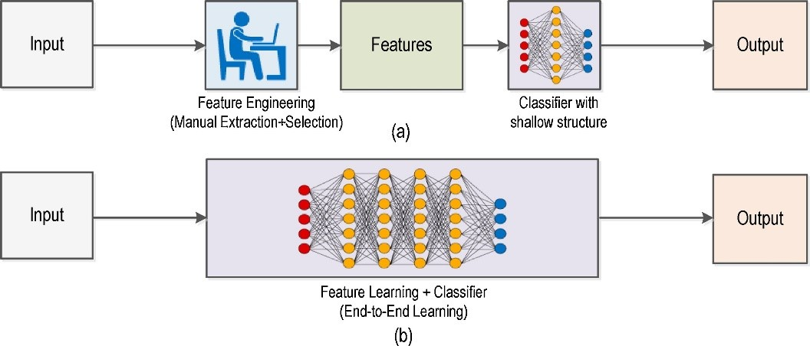
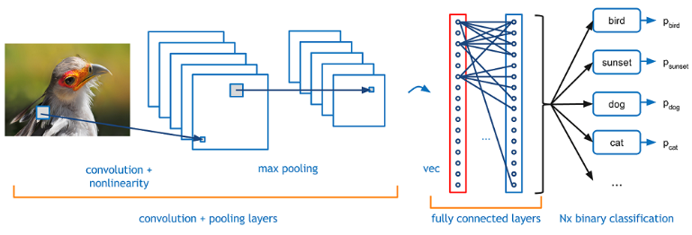
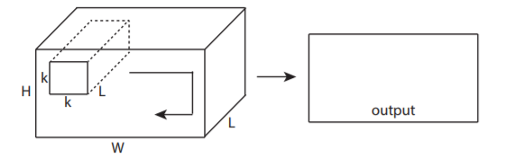
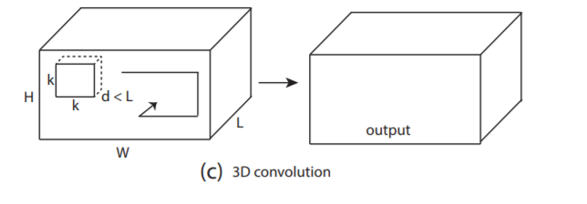
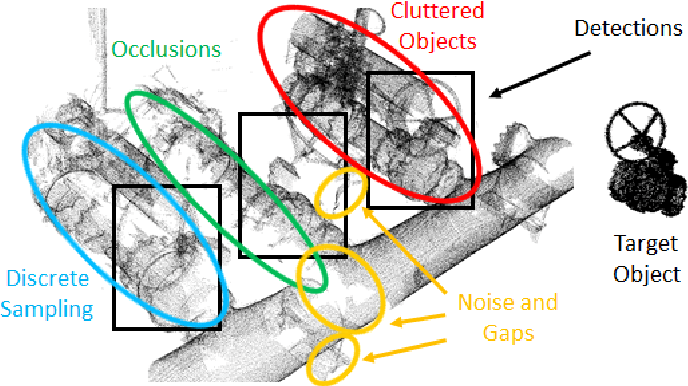

# 1910.13796V1

**Source:** `1910.13796v1.pdf`
**Total Pages:** 17

---

## Page 1: Deep Learning vs. Traditional Computer Vision

Niall O’ Mahony, Sean Campbell, Anderson Carvalho, Suman Harapanahalli,
Gustavo Velasco Hernandez, Lenka Krpalkova, Daniel Riordan, Joseph Walsh
IMaR Technology Gateway, Institute of Technology Tralee, Tralee, Ireland
niall.omahony@research.ittralee.ie
Abstract. Deep Learning has pushed the limits of what was possible in the
domain of Digital Image Processing. However, that is not to say that the
traditional computer vision techniques which had been undergoing progressive
development in years prior to the rise of DL have become obsolete. This paper
will analyse the benefits and drawbacks of each approach. The aim of this paper
is to promote a discussion on whether knowledge of classical computer vision
techniques should be maintained. The paper will also explore how the two sides
of computer vision can be combined. Several recent hybrid methodologies are
reviewed which have demonstrated the ability to improve computer vision
performance and to tackle problems not suited to Deep Learning. For example,
combining traditional computer vision techniques with Deep Learning has been
popular in emerging domains such as Panoramic Vision and 3D vision for which
Deep Learning models have not yet been fully optimised.
Keywords: Computer Vision, Deep Learning, Hybrid techniques.

### 1 Introduction

Deep Learning (DL) is used in the domain of digital image processing to solve difficult

```python
problems (e.g. image colourization, classification, segmentation and detection). DL
```

methods such as Convolutional Neural Networks (CNNs) mostly improve prediction
performance using big data and plentiful computing resources and have pushed the
boundaries of what was possible. Problems which were assumed to be unsolvable are
now being solved with super-human accuracy. Image classification is a prime example
of this. Since being reignited by Krizhevsky, Sutskever and Hinton in 2012 [1], DL
has dominated the domain ever since due to a substantially better performance
compared to traditional methods .
Is DL making traditional Computer Vision (CV) techniques obsolete? Has DL
superseded traditional computer vision? Is there still a need to study traditional CV
techniques when DL seems to be so effective? These are all questions which have been
brought up in the community in recent years [2], which this paper intends to address.
Additionally, DL is not going to solve all CV problems. There are some problems
where traditional techniques with global features are a better solution. The advent of
DL may open many doors to do something with traditional techniques to overcome the

**📝 Notes:**

> [Add your notes here]

---

## Page 2: many challenges DL brings (e.g. computing power, time, accuracy, characteristics and

quantity of inputs, and among others).
This paper will provide a comparison of deep learning to the more traditional hand-
crafted feature definition approaches which dominated CV prior to it. There has been
so much progress in Deep Learning in recent years that it is impossible for this paper
to capture the many facets and sub-domains of Deep Learning which are tackling the
most pertinent problems in CV today. This paper will review traditional algorithmic
approaches in CV, and more particularly, the applications in which they have been used
as an adequate substitute for DL, to complement DL and to tackle problems DL cannot.
The paper will then move on to review some of the recent activities in combining
DL with CV, with a focus on the state-of-the-art techniques for emerging technology
such as 3D perception, namely object registration, object detection and semantic
segmentation of 3D point clouds. Finally, developments and possible directions of
getting the performance of 3D DL to the same heights as 2D DL are discussed along

```python
with an outlook on the impact the increased use of 3D will have on CV in general.
```

2 A Comparison of Deep Learning and Traditional Computer
Vision
2.1 What is Deep Learning
To gain a fundamental understanding of DL we need to consider the difference between
descriptive analysis and predictive analysis.
Descriptive analysis involves defining a comprehensible mathematical model which
describes the phenomenon that we wish to observe. This entails collecting data about a
process, forming hypotheses on patterns in the data and validating these hypotheses
through comparing the outcome of descriptive models we form with the real outcome
[3]. Producing such models is precarious however because there is always a risk of un-
modelled variables that scientists and engineers neglect to include due to ignorance or
failure to understand some complex, hidden or non-intuitive phenomena [4].
Predictive analysis involves the discovery of rules that underlie a phenomenon and
form a predictive model which minimise the error between the actual and the predicted
outcome considering all possible interfering factors [3]. Machine learning rejects the
traditional programming paradigm where problem analysis is replaced by a training
framework where the system is fed a large number of training patterns (sets of inputs

```python
for which the desired outputs are known) which it learns and uses to compute new
```

patterns [5].
DL is a subset of machine learning. DL is based largely on Artificial Neural

```python
Networks (ANNs), a computing paradigm inspired by the functioning of the human
```

brain. Like the human brain, it is composed of many computing cells or ‘neurons’ that
each perform a simple operation and interact with each other to make a decision [6].
Deep Learning is all about learning or ‘credit assignment’ across many layers of a
neural network accurately, efficiently and without supervision and is of recent interest

**📝 Notes:**

> [Add your notes here]

---

## Page 3: due to enabling advancements in processing hardware [7]. Self-organisation and the

exploitation of interactions between small units have proven to perform better than
central control, particularly for complex non-linear process models in that better fault
tolerance and adaptability to new data is achievable [7].
2.2 Advantages of Deep Learning
Rapid progressions in DL and improvements in device capabilities including
computing power, memory capacity, power consumption, image sensor resolution, and
optics have improved the performance and cost-effectiveness of further quickened the
spread of vision-based applications. Compared to traditional CV techniques, DL
enables CV engineers to achieve greater accuracy in tasks such as image classification,
semantic segmentation, object detection and Simultaneous Localization and Mapping
(SLAM). Since neural networks used in DL are trained rather than programmed,
applications using this approach often require less expert analysis and fine-tuning and
exploit the tremendous amount of video data available in today’s systems. DL also
provides superior flexibility because CNN models and frameworks can be re-trained
using a custom dataset for any use case, contrary to CV algorithms, which tend to be
more domain-specific.
Taking the problem of object detection on a mobile robot as an example, we can
compare the two types of algorithms for computer vision:
The traditional approach is to use well-established CV techniques such as feature

```python
descriptors (SIFT, SURF, BRIEF, etc.) for object detection. Before the emergence of
```

DL, a step called feature extraction was carried out for tasks such as image
classification. Features are small “interesting”, descriptive or informative patches in
images. Several CV algorithms, such as edge detection, corner detection or threshold
segmentation may be involved in this step. As many features as practicable are
extracted from images and these features form a definition (known as a bag-of-words)
of each object class. At the deployment stage, these definitions are searched for in other
images. If a significant number of features from one bag-of-words are in another image,
the image is classified as containing that specific object (i.e. chair, horse, etc.).
The difficulty with this traditional approach is that it is necessary to choose which
features are important in each given image. As the number of classes to classify
increases, feature extraction becomes more and more cumbersome. It is up to the CV
engineer’s judgment and a long trial and error process to decide which features best
describe different classes of objects. Moreover, each feature definition requires dealing

```python
with a plethora of parameters, all of which must be fine-tuned by the CV engineer.
```

DL introduced the concept of end-to-end learning where the machine is just given a
dataset of images which have been annotated with what classes of object are present in
each image [7]. Thereby a DL model is ‘trained’ on the given data, where neural
networks discover the underlying patterns in classes of images and automatically works
out the most descriptive and salient features with respect to each specific class of object

```python
for each object. It has been well-established that DNNs perform far better than
```

traditional algorithms, albeit with trade-offs with respect to computing requirements

**📝 Notes:**

> [Add your notes here]

---

## Page 4: and training time. With all the state-of-the-art approaches in CV employing this


**📷 Images:**



methodology, the workflow of the CV engineer has changed dramatically where the
knowledge and expertise in extracting hand-crafted features has been replaced by
knowledge and expertise in iterating through deep learning architectures as depicted in
Fig. 1.
Fig. 1. (a) Traditional Computer Vision workflow vs. (b) Deep Learning workflow. Figure from [8].
The development of CNNs has had a tremendous influence in the field of CV in recent
years and is responsible for a big jump in the ability to recognize objects [9]. This burst
in progress has been enabled by an increase in computing power, as well as an increase
in the amount of data available for training neural networks. The recent explosion in
and wide-spread adoption of various deep-neural network architectures for CV is
apparent in the fact that the seminal paper ImageNet Classification with Deep
Convolutional Neural Networks has been cited over 3000 times [2].
CNNs make use of kernels (also known as filters), to detect features (e.g. edges)
throughout an image. A kernel is just a matrix of values, called weights, which are
trained to detect specific features. As their name indicates, the main idea behind the
CNNs is to spatially convolve the kernel on a given input image check if the feature it
is meant to detect is present. To provide a value representing how confident it is that a
specific feature is present, a convolution operation is carried out by computing the dot
product of the kernel and the input area where kernel is overlapped (the area of the
original image the kernel is looking at is known as the receptive field [10]).
To facilitate the learning of kernel weights, the convolution layer’s output is
summed with a bias term and then fed to a non-linear activation function. Activation
Functions are usually non-linear functions like Sigmoid, TanH and ReLU (Rectified
Linear Unit). Depending on the nature of data and classification tasks, these activation
functions are selected accordingly [11]. For example, ReLUs are known to have more
biological representation (neurons in the brain either fire or they don’t). As a result, it
yields favourable results for image recognition tasks as it is less susceptible to the
vanishing gradient problem and it produces sparser, more efficient representations [7].

**📝 Notes:**

> [Add your notes here]

---

## Page 5: To speed up the training process and reduce the amount of memory consumed by


**📷 Images:**



the network, the convolutional layer is often followed by a pooling layer to remove
redundancy present in the input feature. For example, max pooling moves a window
over the input and simply outputs the maximum value in that window effectively
reducing to the important pixels in an image [7]. As shown in Fig. 2, deep CNNs may
have several pairs of convolutional and pooling layers. Finally, a Fully Connected
layer flattens the previous layer volume into a feature vector and then an output layer
which computes the scores (confidence or probabilities) for the output classes/features
through a dense network. This output is then passed to a regression function such as
Softmax [12], for example, which maps everything to a vector whose elements sum
up to one [7].
Fig. 2. Building blocks of a CNN. Figure from [13]
But DL is still only a tool of CV For example, the most common neural network used
in CV is the CNN. But what is a convolution? It’s in fact a widely used image
processing technique (e.g. see Sobel edge detection). The advantages of DL are clear,
and it would be beyond the scope of this paper to review the state-of-the-art. DL is
certainly not the panacea for all problems either, as we will see in following sections of
this paper, there are problems and applications where the more conventional CV
algorithms are more suitable.
2.3 Advantages of Traditional Computer Vision Techniques
This section will detail how the traditional feature-based approaches such as those listed
below have been shown to be useful in improving performance in CV tasks:
- Scale Invariant Feature Transform (SIFT) [14]
- Speeded Up Robust Features (SURF) [15]
- Features from Accelerated Segment Test (FAST) [16]
- Hough transforms [17]
- Geometric hashing [18]
Feature descriptors such as SIFT and SURF are generally combined with traditional
machine learning classification algorithms such as Support Vector Machines and K-
Nearest Neighbours to solve the aforementioned CV problems.

**📝 Notes:**

> [Add your notes here]

---

## Page 6: DL is sometimes overkill as often traditional CV techniques can solve a problem

much more efficiently and in fewer lines of code than DL. Algorithms like SIFT and
even simple colour thresholding and pixel counting algorithms are not class-specific,
that is, they are very general and perform the same for any image. In contrast, features
learned from a deep neural net are specific to your training dataset which, if not well
constructed, probably won’t perform well for images different from the training set.
Therefore, SIFT and other algorithms are often used for applications such as image
stitching/3D mesh reconstruction which don’t require specific class knowledge. These
tasks have been shown to be achievable by training large datasets, however this requires
a huge research effort and it is not practical to go through this effort for a closed
application. One needs to practice common sense when it comes to choosing which
route to take for a given CV application. For example, to classify two classes of product
on an assembly line conveyor belt, one with red paint and one with blue paint. A deep
neural net will work given that enough data can be collected to train from. However,
the same can be achieved by using simple colour thresholding. Some problems can be
tackled with simpler and faster techniques.
What if a DNN performs poorly outside of the training data? If the training dataset
is limited, then the machine may overfit to the training data and not be able to generalize

```python
for the task at hand. It would be too difficult to manually tweak the parameters of the
```

model because a DNN has millions of parameters inside of it each with complex inter-
relationships. In this way, DL models have been criticised to be a black box in this way
[5]. Traditional CV has full transparency and the one can judge whether your solution
will work outside of a training environment. The CV engineer can have insights into a
problem that they can transfer to their algorithm and if anything fails, the parameters
can be tweaked to perform well for a wider range of images.
Today, the traditional techniques are used when the problem can be simplified so
that they can be deployed on low cost microcontrollers or to limit the problem for deep
learning techniques by highlighting certain features in data, augmenting data [19] or
aiding in dataset annotation [20]. We will discuss later in this paper how many image
transformation techniques can be used to improve your neural net training. Finally,
there are many more challenging problems in CV such as: Robotics [21], augmented
reality [22], automatic panorama stitching [23], virtual reality [24], 3D modelling [24],
motion estimation [24], video stabilization [21], motion capture [24], video processing
[21] and scene understanding [25] which cannot simply be easily implemented in a
differentiable manner with deep learning but benefit from solutions using "traditional"
techniques.
3 Challenges for Traditional Computer Vision
3.1 Mixing Hand-Crafted Approaches with DL for Better Performance
There are clear trade-offs between traditional CV and deep learning-based
approaches. Classic CV algorithms are well-established, transparent, and optimized for

**📝 Notes:**

> [Add your notes here]

---

## Page 7: performance and power efficiency, while DL offers greater accuracy and versatility at

the cost of large amounts of computing resources.
Hybrid approaches combine traditional CV and deep learning and offer the
advantages traits of both methodologies. They are especially practical in high
performance systems which need to be implemented quickly. For example, in a security
camera, a CV algorithm can efficiently detect faces or other features [26] or moving
objects [27] in the scene. These detections can then be passed to a DNN for identity
verification or object classification. The DNN need only be applied on a small patch of
the image saving significant computing resources and training effort compared to what
would be required to process the entire frame.
The fusion of Machine Learning metrics and Deep Network have become very
popular, due to the simple fact that it can generate better models. Hybrid vision
processing implementations can introduce performance advantage and ‘can deliver a
130X-1,000X reduction in multiply-accumulate operations and about 10X
improvement in frame rates compared to a pure DL solution. Furthermore, the hybrid
implementation uses about half of the memory bandwidth and requires significantly
lower CPU resources’ [28].
3.2 Overcoming the Challenges of Deep Learning
There are also challenges introduced by DL. The latest DL approaches may achieve
substantially better accuracy; however this jump comes at the cost of billions of
additional math operations and an increased requirement for processing power. DL
requires a these computing resources for training and to a lesser extent for inference. It
is essential to have dedicated hardware (e.g. high-powered GPUs[29] and TPUs [30]

```python
for training and AI accelerated platforms such as VPUs for inference [31]) for
```

developers of AI.
Vision processing results using DL are also dependent on image resolution.
Achieving adequate performance in object classification, for example, requires high-
resolution images or video – with the consequent increase in the amount of data that
needs to be processed, stored, and transferred. Image resolution is especially important

```python
for applications in which it is necessary to detect and classify objects in the distance,
```

e.g. in security camera footage. The frame reduction techniques discussed previously
such as using SIFT features [26, 32] or optical flow for moving objects [27] to first
identify a region of interest are useful with respect to image resolution and also with
respect to reducing the time and data required for training.
DL needs big data. Often millions of data records are required. For example,
PASCAL VOC Dataset consists of 500K images with 20 object categories [26][33],
ImageNet consists of 1.5 million images with 1000 object categories [34] and Microsoft
Common Objects in Context (COCO) consists of 2.5 million images with 91 object
categories [35]. When big datasets or high computing facility are unavailable,
traditional methods will come into play.
Training a DNN takes a very long time. Depending on computing hardware
availability, training can take a matter of hours or days. Moreover, training for any

**📝 Notes:**

> [Add your notes here]

---

## Page 8

given application often requires many iterations as it entails trial and error with different
training parameters. The most common technique to reduce training time is transfer
learning [36]. With respect to traditional CV, the discrete Fourier transform is another
CV technique which once experienced major popularity but now seems obscure. The
algorithm can be used to speed up convolutions as demonstrated by [37, 38] and hence
may again become of major importance.
However, it must be said that easier, more domain-specific tasks than general image
classification will not require as much data (in the order of hundreds or thousands rather
than millions). This is still a considerable amount of data and CV techniques are often
used to boost training data through data augmentation or reduce the data down to a
particular type of feature through other pre-processing steps.
Pre-processing entails transforming the data (usually with traditional CV techniques)
to allow relationships/patterns to be more easily interpreted before training your model.
Data augmentation is a common pre-processing task which is used when there is limited
training data. It can involve performing random rotations, shifts, shears, etc. on the
images in your training set to effectively increase the number of training images [19].
Another approach is to highlight features of interest before passing the data to a CNN

```python
with CV-based methods such as background subtraction and segmentation [39].
```

3.3 Making Best Use of Edge Computing
If algorithms and neural network inferences can be run at the edge, latency, costs, cloud
storage and processing requirements, and bandwidth requirements are reduced
compared to cloud-based implementations. Edge computing can also privacy and
security requirements by avoiding transmission of sensitive or identifiable data over the
network.
Hybrid or composite approaches involving conventional CV and DL take great
advantage of the heterogeneous computing capabilities available at the edge. A
heterogeneous compute architecture consists of a combination of CPUs,
microcontroller coprocessors, Digital Signal Processors (DSPs), Field Programmable
Gate Arrays (FPGAs) and AI accelerating devices [31] and can be power efficient by
assigning different workloads to the most efficient compute engine. Test
implementations show 10x latency reductions in object detection when DL inferences
are executed on a DSP versus a CPU [28].
Several hybrids of deep learning and hand-crafted features based approaches have
demonstrated their benefits in edge applications. For example, for facial-expression
recognition, [41] propose a new feature loss to embed the information of hand-crafted
features into the training process of network, which tries to reduce the difference
between hand-crafted features and features learned by the deep neural network. The use
of hybrid approaches has also been shown to be advantageous in incorporating data

```python
from other sensors on edge nodes. Such a hybrid model where the deep learning is
```

assisted by additional sensor sources like synthetic aperture radar (SAR) imagery and
elevation like synthetic aperture radar (SAR) imagery and elevation is presented by
[40]. In the context of 3D robot vision, [42] have shown that combining both linear

**📝 Notes:**

> [Add your notes here]

---

## Page 9

subspace methods and deep convolutional prediction achieves improved performance
along with several orders of magnitude faster runtime performance compared to the
state of the art.
3.4 Problems Not Suited to Deep Learning
There are many more changing problems in CV such as: Robotic, augmented reality,
automatic panorama stitching, virtual reality, 3D modelling, motion stamation, video
stabilization, motion capture, video processing and scene understanding which cannot
simply be easily implemented in a differentiable manner with deep learning but need
to be solved using the other "traditional" techniques.
DL excels at solving closed-end classification problems, in which a wide range of
potential signals must be mapped onto a limited number of categories, given that there
is enough data available and the test set closely resembles the training set. However,
deviations from these assumptions can cause problems and it is critical to acknowledge
the problems which DL is not good at. Marcus et al. present ten concerns for deep
learning, and suggest that deep learning must be supplemented by other techniques if
we are to reach artificial general intelligence [43]. As well as discussing the limitations
of the training procedure and intense computing and data requirements as we do in our
paper, key to their discussion is identifying problems where DL performs poorly and
where it can be supplemented by other techniques.
One such problem is the limited ability of DL algorithms to learn visual relations,
i.e. identifying whether multiple objects in an image are the same or different. This
limitation has been demonstrated by [43] who argue that feedback mechanisms
including attention and perceptual grouping may be the key computational components
to realising abstract visual reasoning.
It is also worth noting that ML models find it difficult to deal with priors, that is, not
everything can be learnt from data, so some priors must be injected into the models
[44], [45]. Solutions that have to do with 3D CV need strong priors in order to work
well, e.g. image-based 3D modelling requires smoothness, silhouette and illumination
information [46].
Below are some emerging fields in CV where DL faces new challenges and where
classic CV will have a more prominent role.

### 3.5 3D Vision

3D vision systems are becoming increasingly accessible and as such there has been a
lot of progress in the design of 3D Convolutional Neural Networks (3D CNNs). This
emerging field is known as Geometric Deep Learning and has multiple applications
such as video classification, computer graphics, vision and robotics. This paper will
focus on 3DCNNs for processing data from 3D Vision Systems. Wherein 2D
convolutional layers the kernel has the same depth so as to output a 2D matrix, the
depth of a 3D convolutional kernel must be less than that of the 3D input volume so
that the output of the convolution is also 3D and so preserve the spatial information.

**📝 Notes:**

> [Add your notes here]

---

## Page 10: Fig. 3. 2DCNN vs. 3D CNN [47]


**📷 Images:**





The size of the input is much larger in terms of memory than conventional RGB images
and the kernel must also be convolved through the input space in 3 dimensions (see Fig.
3). As a result, the computational complexity of 3D CNNs grows cubically with
resolution. Compared to 2D image processing, 3D CV is made even more difficult as
the extra dimension introduces more uncertainties, such as occlusions and different
cameras angles as shown in Fig. 4.
Fig. 4. 3D object detection in point clouds is a challenging problem due to discrete sampling, noisy scans,
occlusions and cluttered scenes. Figure from [48].
FFT based methods can optimise 3D CNNs reduce the amount of computation, at the
cost of increased memory requirements however. Recent research has seen the

**📝 Notes:**

> [Add your notes here]

---

## Page 11: implementation of the Winograd Minimal Filtering Algorithm (WMFA) achieve a two-

fold speedup compared to cuDNN (NVIDIA’s language/API for programming on
their graphics cards) without increasing the required memory [49]. The next section
will include some solutions with novel architectures and pre-processing steps to various
3D data representations which have been proposed to overcome these challenges.
Geometric Deep Learning (GDL) deals with the extension of DL techniques to 3D
data. 3D data can be represented in a variety of different ways which can be classified
as Euclidean or non-Euclidean [50].3D Euclidean-structured data has an underlying
grid structure that allows for a global parametrization and having a common system of
coordinates as in 2D images. This allows existing 2D DL paradigms and 2DCNNs can
be applied to 3D data. 3D Euclidean data is more suitable for analysing simple rigid
objects such as, chairs, planes, etc e.g. with voxel-based approaches [51]. On the other
hand, 3D non-Euclidean data do not have the gridded array structure where there is no
global parametrization. Therefore, extending classical DL techniques to such
representations is a challenging task and has only recently been realized with
architectures such as Pointnet [52].
Continuous shape information that is useful for recognition is often lost in their
conversion to a voxel representation. With respect to traditional CV algorithms, [53]
propose a single dimensional feature that can be applied to voxel CNNs. A novel
rotation-invariant feature based on mean curvature that improves shape recognition for
voxel CNNs was proposed. The method was very successful in that when it was applied
to the state-of-the-art recent voxel CNN Octnet architecture a 1% overall accuracy
increase on the ModelNet10 dataset was achieved.

### 3.6 SLAM

Visual SLAM is a subset of SLAM where a vision system is used instead of LiDAR for
the registration of landmarks in a scene. Visual SLAM has the advantages of

```python
photogrammetry (rich visual data, low-cost, lightweight and low power consumption)
```

without the associated heavy computational workload involved in post-processing. The
visual SLAM problem consists of steps such as environment sensing, data matching,
motion estimation, as well as location update and registration of new landmarks [54].
Building a model of how visual objects appear in different conditions such as 3D
rotation, scaling, lighting and extending from that representation using a strong form of
transfer learning to achieve zero/one shot learning is a challenging problem in this
domain. Feature extraction and data representation methods can be useful to reduce the
amount of training examples needed for an ML model [55].
A two-step approach is commonly used in image based localization; place
recognition followed by pose estimation. The former computes a global descriptor for
each of the images by aggregating local image descriptors, e.g. SIFT, using the bag-of-
words approach. Each global descriptor is stored in the database together with the
camera pose of its associated image with respect to the 3D point cloud reference map.
Similar global descriptors are extracted from the query image and the closest global

**📝 Notes:**

> [Add your notes here]

---

## Page 12: descriptor in the database can be retrieved via an efficient search. The camera pose of

the closest global descriptor would give us a coarse localization of the query image with
respect to the reference map. In pose estimation, the exact pose of the query image
calculated more precisely with algorithms such as the Perspective-n-Point (PnP) [13]
and geometric verification [18] algorithms. [56]
The success of image based place recognition is largely attributed to the ability to
extract image feature descriptors. Unfortunately, there is no algorithm to extract local
features similar to SIFT for LiDAR scans. A 3D scene is composed of 3D points and
database images. One approach has associated each 3D point to a set of SIFT
descriptors corresponding to the image features from which the point was triangulated.
These descriptors can then be averaged into a single SIFT descriptor that describes the
appearance of that point [57].
Another approach constructs multi-modal features from RGB-D data rather than the
depth processing. For the depth processing part, they adopt the well-known
colourization method based on surface normals, since it has been proved to be effective
and robust across tasks [58]. Another alternative approach utilizing traditional CV
techniques presents the Force Histogram Decomposition (FHD), a graph-based
hierarchical descriptor that allows the spatial relations and shape information between
the pairwise structural subparts of objects to be characterized. An advantage of this
learning procedure is its compatibility with traditional bags-of-features frameworks,
allowing for hybrid representations gathering structural and local features [59].
3.7 360 cameras
A 360 camera, also known as an omnidirectional or spherical or panoramic camera is
a camera with a 360-degree field of view in the horizontal plane, or with a visual field
that covers (approximately) the entire sphere. Omnidirectional cameras are important
in applications such as robotics where large visual field coverage is needed. A 360
camera can replace multiple monocular cameras and eliminate blind spots which
obviously advantageous in omnidirectional Unmanned Ground Vehicles (UGVs) and
Unmanned Aerial Vehicles (UAVs). Thanks to the imaging characteristic of spherical
cameras, each image captures the 360◦ panorama of the scene, eliminating the
limitation on available steering choices. One of the major challenges with spherical
images is the heavy barrel distortion due to the ultra-wide-angle fisheye lens, which
complicates the implementation of conventional human vision inspired methods such
as lane detection and trajectory tracking. Additional pre-processing steps such as prior
calibration and deworming are often required. An alternative approach which has been
presented by [60], who circumvent these pre-processing steps by formulating
navigation as a classification problem on finding the optimal potential path orientation
directly based on the raw, uncalibrated spherical images.
Panorama stitching is another open research problem in this area. A real-time
stitching methodology [61] uses a group of deformable meshes and the final image and
combine the inputs using a robust pixel-shader. Another approach [62], combine the

**📝 Notes:**

> [Add your notes here]

---

## Page 13

accuracy provided by geometric reasoning (lines and vanishing points) with the higher
level of data abstraction and pattern recognition achieved by DL techniques (edge and
normal maps) to extract structural and generate layout hypotheses for indoor scenes. In
sparsely structured scenes, feature-based image alignment methods often fail due to
shortage of distinct image features. Instead, direct image alignment methods, such as
those based on phase correlation, can be applied. Correlation-based image alignment
techniques based on discriminative correlation filters (DCF) have been investigated
by [23] who show that the proposed DCF-based methods outperform phase
correlation-based approaches on these datasets.
3.8 Dataset Annotation and Augmentation
There are arguments against the combination of CV and DL and they summarize to the
conclusion that we need to re-evaluate our methods from rule-based to data-driven.
Traditionally, from the perspective of signal processing, we know the operational
connotations of CV algorithms such as SIFT and SURF methods, but DL leads such
meaning nowhere, all you need is more data. This can be seen as a huge step forward,
but may be also a backward move. Some of the pros and cons of each side of this debate
have been discussed already in this paper, however, if future-methods are to be purely
data-driven then focus should be placed on more intelligent methods for dataset
creation.
The fundamental problem of current research is that there is no longer enough data

```python
for advanced algorithms or models for special applications. Coupling custom datasets
```

and DL models will be the future theme to many research papers. So many researchers’
outputs consist of not only algorithms or architectures, but also datasets or methods to
amass data. Dataset annotation is a major bottleneck in the DL workflow which requires
many hours of manual labelling. Nowhere is this more problematic than in semantic
segmentation applications where every pixel needs to be annotated accurately. There
are many useful tools available to semi-automate the process as reviewed by [20], many
of which take advantage of algorithmic approaches such as ORB features [55], polygon
morphing [63], semi-automatic Area of Interest (AOI) fitting [55] and all of the above
[63].
The easiest and most common method to overcome limited datasets and reduce
overfitting of deep learning models for image classification is to artificially enlarge the
dataset using label-preserving transformations. This process is known as dataset
augmentation and it involves the artificial generation of extra training data from the
available ones, for example, by cropping, scaling, or rotating images [64]. It is desirable

```python
for data augmentation procedures to require very little computation and to be
```

implementable within the DL training pipeline so that the transformed images do not
need to be stored on disk. Traditional algorithmic approaches that have been employed

```python
for dataset augmentation include Principle Component Analysis (PCA) [1], adding
```

noise, interpolating or extrapolating between samples in a feature space [65] and
modelling the visual context surrounding objects from segmentation annotations [66].

**📝 Notes:**

> [Add your notes here]

---

## Page 14: Conclusion

A lot of the CV techniques invented in the past 20 years have become irrelevant in
recent years because of DL. However, knowledge is never obsolete and there is always
something worth learning from each generation of innovation. That knowledge can give
you more intuitions and tools to use especially when you wish to deal with 3D CV
problems for example. Knowing only DL for CV will dramatically limit the kind of
solutions in a CV engineer’s arsenal.
In this paper we have laid down many arguments for why traditional CV techniques
are still very much useful even in the age of DL. We have compared and contrasted
traditional CV and DL for typical applications and discussed how sometimes traditional
CV can be considered as an alternative in situations where DL is overkill for a specific
task.
The paper also highlighted some areas where traditional CV techniques remain
relevant such as being utilized in hybrid approaches to improve performance. DL
innovations are driving exciting breakthroughs for the IoT (Internet of Things), as well
as hybrid techniques that combine the technologies with traditional algorithms.
Additionally, we reviewed how traditional CV techniques can actually improve DL
performance in a wide range of applications from reducing training time, processing
and data requirements to being applied in emerging fields such as SLAM, Panoramic-
stitching, Geometric Deep Learning and 3D vision where DL is not yet well
established.
The digital image processing domain has undergone some very dramatic changes
recently and in a very short period. So much so it has led us to question whether the CV
techniques that were in vogue prior to the AI explosion are still relevant. This paper
hopefully highlight some cases where traditional CV techniques are useful and that
there is something still to gain from the years of effort put in to their development even
in the age of data-driven intelligence.
References
1. Krizhevsky A, Sutskever I, Hinton GE (2012) ImageNet Classification with Deep
Convolutional Neural Networks. NIPS’12 Proc 25th Int Conf Neural Inf Process Syst
1:1097–1105
2. Nash W, Drummond T, Birbilis N (2018) A Review of Deep Learning in the Study of
Materials Degradation. npj Mater Degrad 2:37. https://doi.org/10.1038/s41529-018-
0058-x
3. Bonaccorso G (2018) Machine Learning Algorithms Popular Algorithms for Data
Science and Machine Learning, 2nd Edition. Packt Publishing Ltd
4. Mahony NO, Murphy T, Panduru K, et al (2017) Improving controller performance in
a powder blending process using predictive control. In: 2017 28th Irish Signals and
Systems Conference (ISSC). IEEE, pp 1–6
5. O’Mahony N, Murphy T, Panduru K, et al (2017) Real-time monitoring of powder blend
composition using near infrared spectroscopy. In: 2017 Eleventh International
Conference on Sensing Technology (ICST). IEEE, pp 1–6

**📝 Notes:**

> [Add your notes here]

---

## Page 15: 6. O’ Mahony N, Murphy T, Panduru K, et al (2016) Adaptive process control and sensor

fusion for process analytical technology. In: 2016 27th Irish Signals and Systems

```python
Conference (ISSC). IEEE, pp 1–6
```

7. Koehn P, Koehn P (1994) Combining Genetic Algorithms and Neural Networks: The

### Encoding Problem

8. Wang J, Ma Y, Zhang L, Gao RX (2018) Deep learning for smart manufacturing:
Methods and applications. J Manuf Syst 48:144–156.
https://doi.org/10.1016/J.JMSY.2018.01.003
9. Voulodimos A, Doulamis N, Doulamis A, Protopapadakis E (2018) Deep Learning for
Computer Vision: A Brief Review. Comput Intell Neurosci 2018:1–13.
https://doi.org/10.1155/2018/7068349
10. Dumoulin V, Visin F, Box GEP (2018) A guide to convolution arithmetic for deep
learning. arXiv Prepr arXiv arXiv160307285v2
11. Hayou S, Doucet A, Rousseau J (2018) On The Selection of Initialization and Activation
Function for Deep Neural Networks. arXiv Prepr arXiv 180508266v2
12. Horiguchi S, Ikami D, Aizawa K (2017) Significance of Softmax-based Features in
Comparison to Distance Metric Learning-based Features
13. Adit Deshpande A Beginner’s Guide To Understanding Convolutional Neural Networks
– Adit Deshpande – CS Undergrad at UCLA ('19). https://adeshpande3.github.io/A-
Beginner%27s-Guide-To-Understanding-Convolutional-Neural-Networks/. Accessed

### 19 Jul 2018

14. Karami E, Shehata M, Smith A (2017) Image Identification Using SIFT Algorithm:
Performance Analysis against Different Image Deformations
15. Bay H, Tuytelaars T, Van Gool L (2006) SURF: Speeded Up Robust Features. Springer,
Berlin, Heidelberg, pp 404–417
16. Rosten E, Drummond T (2006) Machine Learning for High-Speed Corner Detection.
Springer, Berlin, Heidelberg, pp 430–443
17. Goldenshluger A, Zeevi A (2004) The Hough Transform Estimator. 32:.
https://doi.org/10.1214/009053604000000760
18. Tsai FCD (1994) Geometric hashing with line features. Pattern Recognit 27:377–389.
https://doi.org/10.1016/0031-3203(94)90115-5
19. Wang J, Perez L The Effectiveness of Data Augmentation in Image Classification using

### Deep Learning

20. Schöning J, Faion P, Heidemann G (2016) Pixel-wise Ground Truth Annotation in
Videos - An Semi-automatic Approach for Pixel-wise and Semantic Object Annotation.
In: Proceedings of the 5th International Conference on Pattern Recognition Applications
and Methods. SCITEPRESS - Science and and Technology Publications, pp 690–697
21. Zhang X, Lee J-Y, Sunkavalli K, Wang Z (2017) Photometric Stabilization for Fast-
forward Videos
22. Alhaija HA, Mustikovela SK, Mescheder L, et al (2017) Augmented Reality Meets
Computer Vision : Efficient Data Generation for Urban Driving Scenes
23. Meneghetti G, Danelljan M, Felsberg M, Nordberg K (2015) Image Alignment for
Panorama Stitching in Sparsely Structured Environments. Springer, Cham, pp 428–439
24. Alldieck T, Kassubeck M, Magnor M (2017) Optical Flow-based 3D Human Motion
Estimation from Monocular Video
25. Zheng B, Zhao Y, Yu J, et al (2015) Scene Understanding by Reasoning Stability and
Safety. Int J Comput Vis 112:221–238. https://doi.org/10.1007/s11263-014-0795-4
26. Zheng L, Yang Y, Tian Q SIFT Meets CNN: A Decade Survey of Instance Retrieval
27. AlDahoul N, Md Sabri AQ, Mansoor AM (2018) Real-Time Human Detection for
Aerial Captured Video Sequences via Deep Models. Comput Intell Neurosci 2018:1–
14. https://doi.org/10.1155/2018/1639561
28. Conventional computer vision coupled with deep learning makes AI better | Network

**📝 Notes:**

> [Add your notes here]

---

## Page 16: World. https://www.networkworld.com/article/3239146/internet-of-

things/conventional-computer-vision-coupled-with-deep-learning-makes-ai-
better.html. Accessed 12 Sep 2018
29. Bahrampour S, Ramakrishnan N, Schott L, Shah M (2015) Comparative Study of Deep

### Learning Software Frameworks

30. (2017) An in-depth look at Google’s first Tensor Processing Unit (TPU) | Google Cloud
Big Data and Machine Learning Blog | Google Cloud Platform.
https://cloud.google.com/blog/big-data/2017/05/an-in-depth-look-at-googles-first-
tensor-processing-unit-tpu. Accessed 11 Jan 2018
31. Vision Processing Unit | Machine Vision Technology | Movidius.
https://www.movidius.com/solutions/vision-processing-unit. Accessed 11 Jan 2018
32. Ng H-W, Nguyen D, Vonikakis V, Winkler S Deep Learning for Emotion Recognition
on Small Datasets Using Transfer Learning. https://doi.org/10.1145/2818346.2830593
33. Pepik B, Stark M, Gehler P, Schiele B (2012) Teaching 3D geometry to deformable part
models. In: Proceedings of the IEEE Computer Society Conference on Computer Vision
and Pattern Recognition
34. Russakovsky O, Deng J, Su H, et al (2015) ImageNet Large Scale Visual Recognition
Challenge. Int J Comput Vis 115:211–252. https://doi.org/10.1007/s11263-015-0816-y
35. Lin T-Y, Maire M, Belongie S, et al (2014) Microsoft COCO: Common Objects in
Context
36. CS231n Convolutional Neural Networks for Visual Recognition.
http://cs231n.github.io/transfer-learning/. Accessed 9 Mar 2018
37. Highlander TC Efficient Training of Small Kernel Convolutional Neural Networks
using Fast Fourier Transform
38. Highlander T, Rodriguez A (2016) Very Efficient Training of Convolutional Neural
Networks using Fast Fourier Transform and Overlap-and-Add
39. Li F, Wang C, Liu X, et al (2018) A Composite Model of Wound Segmentation Based
on Traditional Methods and Deep Neural Networks. Comput Intell Neurosci 2018:1–
12. https://doi.org/10.1155/2018/4149103
40. Nijhawan R, Das J, Raman B (2018) A hybrid of deep learning and hand-crafted features
based approach for snow cover mapping. Int J Remote Sens 1–15.
https://doi.org/10.1080/01431161.2018.1519277
41. Zeng G, Zhou J, Jia X, et al (2018) Hand-Crafted Feature Guided Deep Learning for
Facial Expression Recognition. In: 2018 13th IEEE International Conference on
Automatic Face & Gesture Recognition (FG 2018). IEEE, pp 423–430
42. Burchfiel B, Konidaris G Hybrid Bayesian Eigenobjects: Combining Linear Subspace
and Deep Network Methods for 3D Robot Vision
43. Marcus G, thank Christina I, Chollet F, et al Deep Learning: A Critical Appraisal
44. Nalisnick E, Smyth P (2018) Learning Priors for Invariance. 366–375
45. Diligenti M, Roychowdhury S, Gori M (2017) Integrating Prior Knowledge into Deep
Learning. In: 2017 16th IEEE International Conference on Machine Learning and

```python
Applications (ICMLA). IEEE, pp 920–923
```

46. Zhu H, Nie Y, Yue T, Cao X (2017) The role of prior in image based 3D modeling: a
survey. Front Comput Sci 11:175–191. https://doi.org/10.1007/s11704-016-5520-8
47. Tran D, Bourdev L, Fergus R, et al (2015) Learning Spatiotemporal Features with 3D
Convolutional Networks. arXiv Prepr arXiv 14120767
48. Pang G, Neumann U (2016) 3D point cloud object detection with multi-view
convolutional neural network. In: 2016 23rd International Conference on Pattern

```python
Recognition (ICPR). IEEE, pp 585–590
```

49. Lan Q, Wang Z, Wen M, et al (2017) High Performance Implementation of 3D
Convolutional Neural Networks on a GPU. Comput Intell Neurosci 2017:1–8.
https://doi.org/10.1155/2017/8348671

**📝 Notes:**

> [Add your notes here]

---

## Page 17: 50. Ahmed E, Saint A, Shabayek AER, et al (2018) Deep Learning Advances on Different

3D Data Representations: A Survey. arXiv Prepr arXiv 180801462
51. Zhou Y, Tuzel O (2017) VoxelNet: End-to-End Learning for Point Cloud Based 3D
Object Detection. arXiv Prepr arXiv 171106396
52. Qi CR, Yi L, Su H, Guibas LJ (2017) PointNet++: Deep Hierarchical Feature Learning
on Point Sets in a Metric Space. arXiv Prepr arXiv170602413v1
53. Braeger S, Foroosh H (2018) Curvature Augmented Deep Learning for 3D Object
Recognition. In: 2018 25th IEEE International Conference on Image Processing (ICIP).
IEEE, pp 3648–3652
54. Niall O’ Mahony (Institute of Technology Tralee), Sean Campbell (Institute of
Technology Tralee), Lenka Krpalkova (Institute of Technology Tralee), et al (2018)
Deep Learning for Visual Navigation of Unmanned Ground Vehicles; A review
55. Karami E, Prasad S, Shehata M Image Matching Using SIFT, SURF, BRIEF and ORB:
Performance Comparison for Distorted Images
56. Angelina M, Gim U, Lee H PointNetVLAD: Deep Point Cloud Based Retrieval for

### Large-Scale Place Recognition

57. Camposeco F, Cohen A, Pollefeys M, Sattler T Hybrid scene Compression for Visual
Localization
58. Loghmani MR, Planamente M, Caputo B, Vincze M Recurrent Convolutional Fusion

```python
for RGB-D Object Recognition
```

59. Clément M, Kurtz C, Wendling L (2018) Learning spatial relations and shapes for
structural object description and scene recognition. Pattern Recognit 84:197–210.
https://doi.org/10.1016/J.PATCOG.2018.06.017
60. Ran L, Zhang Y, Zhang Q, et al (2017) Convolutional Neural Network-Based Robot
Navigation Using Uncalibrated Spherical Images. Sensors 17:1341.
https://doi.org/10.3390/s17061341
61. Silva RMA, Feijó B, Gomes PB, et al (2016) Real time 360° video stitching and
streaming. In: ACM SIGGRAPH 2016 Posters on - SIGGRAPH ’16. ACM Press, New
York, New York, USA, pp 1–2
62. Fernandez-Labrador C, Perez-Yus A, Lopez-Nicolas G, Guerrero JJ Layouts from
Panoramic Images with Geometry and Deep Learning
63. Schöning J, Faion P, Heidemann G (2016) Pixel-wise Ground Truth Annotation in
Videos - An Semi-automatic Approach for Pixel-wise and Semantic Object Annotation.
In: Proceedings of the 5th International Conference on Pattern Recognition Applications
and Methods. SCITEPRESS - Science and and Technology Publications, pp 690–697
64. Ioannidou A, Chatzilari E, Nikolopoulos S, Kompatsiaris I (2017) Deep Learning
Advances in Computer Vision with 3D Data. ACM Comput Surv 50:1–38.
https://doi.org/10.1145/3042064
65. Devries T, Taylor GW (2017) Dataset Augmentation in Feature Space. arXiv Prepr
arXiv 170205538v1
66. Dvornik N, Mairal J, Schmid C Modeling Visual Context is Key to Augmenting Object

### Detection Datasets


**📝 Notes:**

> [Add your notes here]

---
