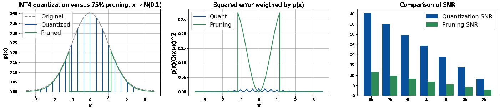
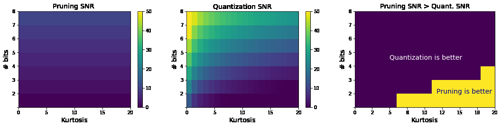
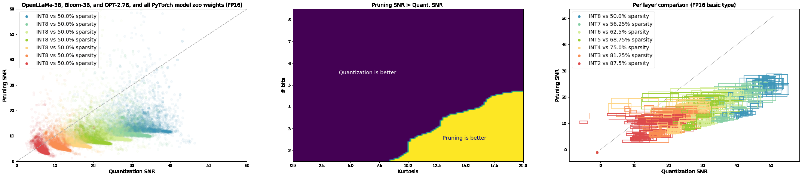
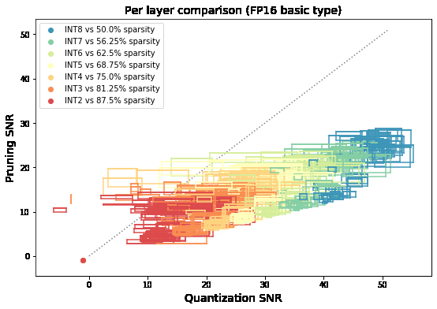
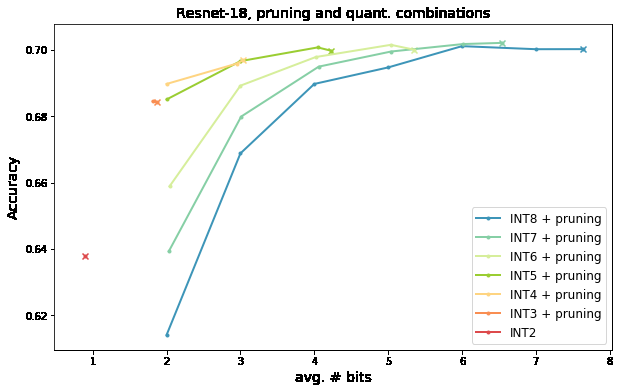
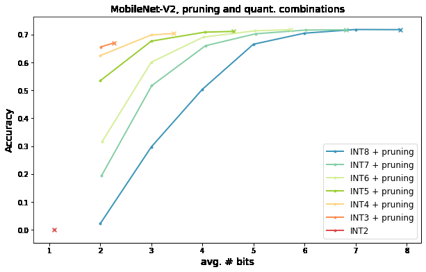
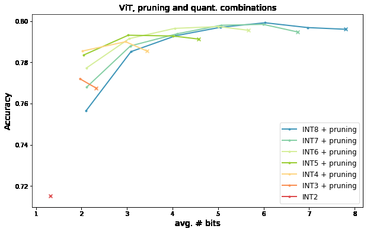

# 13436 Pruning Vs Quantization

**Source:** `13436_Pruning_vs_Quantization_.pdf`
**Total Pages:** 14

---

## Page 1: Pruning vs Quantization: Which is Better?

AndreyKuzmin,MarkusNagel,MartvanBaalen,ArashBehboodi,TijmenBlankevoort
QualcommAIResearch∗
Amsterdam,TheNetherlands
{akuzmin, markusn, mart, behboodi, tijmen}@qti.qualcomm.com
Abstract
Neuralnetworkpruningandquantizationtechniquesarealmostasoldasneural
networksthemselves. However,todateonlyad-hoccomparisonsbetweenthetwo
havebeenpublished. Inthispaper,wesetouttoanswerthequestiononwhich
is better: neural network quantization or pruning? By answering this question,
we hope to inform design decisions made on neural network hardware going
forward. We provide an extensive comparison between the two techniques for
compressing deep neural networks. First, we give an analytical comparison of
expectedquantizationandpruningerrorforgeneraldatadistributions. Then,we
providelowerboundsfortheper-layerpruningandquantizationerrorintrained
networks, and compare these to empirical error after optimization. Finally, we
provideanextensiveexperimentalcomparisonfortraining9large-scalemodelson
4tasks.Ourresultsshowthatinmostcasesquantizationoutperformspruning.Only
insomescenarioswithveryhighcompressionratio,pruningmightbebeneficial
fromanaccuracystandpoint. 1

### 1 Introduction

Recentadvancesindeeplearningledtoexceedinghuman-levelperformanceinmanytasks,including
computervision,machinetranslation,voicerecognition,andlanguageunderstanding. Real-world
applicationsofDNNsrelyheavilyontheirefficiency.Bothmobileandcloudplatformsgreatlybenefit
fromreducedlatencyandenergyefficiencyachievedbysomeformofmodelcompression. Inthis
work,weconsidertwomainstreamtechniquesusedinpractice;pruningandquantization.
Pruningmethodsremoveindividualweights[70,25],orsometimesgroupsofweights[28,47]. This
procedurecanreducethememoryfootprint. Furthermore,nothavingtoperformthecomputations

```python
with weights that are zeroed out can make network inference more efficient. On the other hand,
```

quantizationreducesthebit-widthusedforboththeweightsandthecomputationusedinnetworks,
leading to both predictable memory savings and reductions in the necessary compute. In both
scenarios,thehardwareusedformakinguseoftheseoptimizationschemesneedstotaketheminto
account.
Dependingontheavailabilityoftrainingdataandcomputingbudget,mostmethodsforpruningand
quantizationfallintooneoftwofamilies. Thefirstfamilyincludesfine-tuningapproaches,namely
quantization-aware training (QAT) and fine-tuning with pruning in the loop. The second family
includes post-training approaches such as post-training quantization (PTQ). Previously, pruning
techniquesprimarilyreliedonfine-tuning;however,somepost-trainingpruningmethodsappeared
recentlyasfine-tuningisnotdesirableforlargelanguagemodels[18].
Despitetheimportanceofmodelefficiencyandtheplethoraofapproachesforpruningandquanti-
zation,thetwofieldsaremostlydisjoint. Theliteraturepresentslittleinsightintowhichofthetwo
∗
QualcommAIResearchisaninitiativeofQualcommTechnologies,Inc.
1Codeisavailableathttps://github.com/Qualcomm-AI-research/pruning-vs-quantization
37thConferenceonNeuralInformationProcessingSystems(NeurIPS2023).

**📝 Notes:**

> [Add your notes here]

---

## Page 2: Figure 1: Comparison for a standard normal distribution. (left) Distributions after pruning and


**📷 Images:**



quantizationforINT4and75%pruning. (middle)Thesquarederrorweightedbyprobability. (right)
SNRfordifferentcompressionratios.
techniquesismoreaccurate. Inpractice,thereisonlylimitedtimetocompressanetworkandlimited
energytospendonmakingdeeplearninginferencehardware. Forthisreason,weaskthequestion:
Shouldonefocusonquantizationorpruningforcompression?
Wepresentanextensivestudycomparingpruningandquantizationinequalsettings.First,weconsider
differentdatadistributionsandanalyzetheconditionsunderwhicheachmethodispreferable. We
matchourfindingswithrealweighttensorsfrompre-trainedmodels. Second,weconsiderapost-
trainingscenarioandevaluatesingle-layeroutputerrorsforbothmethods. Becausethecomparison
mightdependonthespecificchoiceofoptimizationmethod,wecomparethetwowiththeoretical
boundsthatapplyregardlessoftheoptimizationmethod.Finally,weprovideafull-modelcomparison
forthemostcommonscenariooffine-tuningnetworksaftereitherpruningorquantization.
Inourcomparison,weintentionallyavoidconsideringthehardwareaspectsofpruningandquantiza-
tion. Instead,wefocussolelyontheaccuracyofbothmethods,givensimilartheoreticalcompression
ratios. Acoarsediscussiononthehardwarenecessaryforbothmethodscanbefoundinsection6.

### 2 Assumptions

Inourwork, weassumeFP16asthebasicdatatypeandmeasureanygainsincompressionwith
respecttoit. UsingFP16forinferencegenerallydoesnotleadtoalossinaccuracy. Neuralnetworks
arealsoverycommonlytrainedwithFP16,makingitacommonbaseline. Thus,wecompare50%
pruning sparsity to INT8 quantization, 75% sparsity to INT4 quantization and so forth. We also
assumenooverheadonstoringthesparsitymaskforpruningandrelegatesuchhardware-specific
implementationstosection6.
Forthepruningexperiments,weconsidermagnitudepruning. Itiscommontodofine-tuningafteror
duringpruning[70]. Severalworkshaveindependentlyshownthatdespiteitssimplicity,itistough
toimproveuponmagnitudepruningandfine-tuning[19,4]. Toourknowledge,nopruningalgorithm
existsthatconsistentlyoutperformsthismethod.
Forthequantizationexperiments,weusesymmetricuniformquantization,whichisdefinedbyjust
thequantizationscalefactorandthebit-width. Thescaleisrepresentedasafloating-pointnumber
andisusedtomapfloating-pointvaluestotheintegergrid. Furtherdetailsonsymmetricuniform
quantizationcanbefoundin[49]. Uniformquantizationisthestandardinthequantizationliterature,
andsymmetricquantizationismostlyemployedfortheweights. Inallourexperiments,weusea
quantizationrangeestimatorminimizingthemean-squarederroronweightsbygridsearch[49].

### 3 Comparisononstatisticaldistributions

Beforedivingintocomparisonresults, wefirstdescribetheoreticallywhatthequantizationerror
and pruning error are. Looking at this with a theoretical lens helps with understanding the later
experimentaldifferencebetweenthetwomethods. Westartoffbydescribingandanalyzingboth
methodsonsimpledatadistributions.
Inordertocomparetheerrorofpruningandquantization,wewillfrequentlyusethesignal-to-noise
ratiomeasuredefinedinthelogscale: SNR = 10log
(cid:0)E(cid:2) W2(cid:3) /E(cid:2)
(W
−F(W))2(cid:3)(cid:1)
,where
dB 10

```python
F(W)isthequantizationorpruningfunction. Thismeasureisthesameasascaledlogarithmof
```


**📝 Notes:**

> [Add your notes here]

---

## Page 3: Figure2: Comparingtheerrorofpruningandquantizationforastudent-tdistribution,simulating


**📷 Images:**



thepresenceofsignificantoutliers. Weplottheresultsfordifferentmagnitudesoftheoutliers,as
perthekurtosisonthex-axis. (left)thepruningerror,whichdoesnotchangeunderthepresenceof
moresevereoutliers. (middle)thequantizationSNR,whichisreducedgreatlywhenoutliersincrease
(right)thetrade-offregionswherequantizationandpruningarebetter.
anMSEmeasure. Bothareoftenemployedtoanalyzethesensitivityofneuralnetworklayersto
quantization,andtheyaretheoreticallywell-foundedtocorrelatewithnetworkperformance[41,48].

### 3.1 Quantizationerror

Forquantization,weconsidersymmetricuniformquantization,whichisalsocalledintegerquan-
tization. Given a bit-width b and the scale δ, the grid nodes are defined as q = δi,i ∈
i
{−2b,...,0,2b−1}. Thequantizationoperationrounding-to-nearestQ(w)andthecorresponding

```python
quantizationerrorR(w)aredefinedas:
Q(w)=q , i=argmin|w−q |, R(w)=Q(w)−w. (1)
```

i i
i
Following[36]wemodelneuralnetworkweightsasarandomvariableW ∼p(w). Theexpected
valueofthequantizationMSEcanbeexpressedasfollows:

```python
q (cid:90)max q (cid:90)min (cid:90) ∞
E(cid:2)(cid:0) Q(W)−W)2(cid:1)(cid:3) = R2(w)p(w)dw+ (w−q )2p(w)dw+ (q −w)2p(w)dw,
```

min max
qmin −∞ qmax
(2)
where q = min q and q = max q are the quantization range limits. The left term
min i i max i i
correspondstotheroundingerror,andtherighttwotermscorrespondtotheclippingerror. Weuse
thisanalyticformulationforourdistributionresultsbelow,thedetailsaregiveninappendixA.

### 3.2 Pruningerror


```python
WeconsidermagnitudepruningT(x)=x·1 . Thissimplysetsthevaluesclosesttozeroto
```

−t≤x≤t
actualzero. Giventhis,theexpectederrorofpruningisexpressedasfollows:
t
(cid:90)

```python
E(cid:2) T(W)2(cid:3) = w2p(w)dw, (3)
```

−t
where t is the threshold value that controls how much is pruned. Given the compression ratio
c ∈ (0,1), we find the threshold value which satisfies P(−t ≤ W ≤ t) = c. In case of a
symmetric zero-mean distribution, the threshold can be expressed as t =
F−1(cid:0)1
+

```python
c(cid:1)
```

, where

### W 2 2


```python
F(w) = P(W ≤ w)istheCDFfunctionandF−1(p)isitsinverse. Theexpectedpruningerror
inequation3issimilartotheclippingerrorforquantization(seethesecondandthethirdtermin
```

equation 2), and can also be computed analytically. We also use this formulation for our results
below.

### 3.3 Analyticalcomparison

Standardnormaldistribution. Letusfirstlookatastandardnormaldistribution. Asmanyweights
inneuralnetworksareroughlyGaussian-shaped,thisdistributionisusefulforourunderstandingof

**📝 Notes:**

> [Add your notes here]

---

## Page 4: Figure3: (left)ComparisononalltheweightsfromPyTorchmodelzoo(46models)combinedwith


**📷 Images:**



3largelanguagemodels(Bloom-3b,Llama-3b,OPT-2.7b). (left)PruningSNRversusquantization
SNRforeverytensor. (right)Pruningispreferableathighcompressionratiosfortensorswithhigh
samplekurtosisvalues.
thecomparison. Aswecanseefromfigure1(middle),theerrorsforbothmethodshaveverydifferent
behavior. Thequantizationerroroscillatesbetweenthequantizationnodesandhasamoderaterange.
Thepruningerroreffectivelycorrespondstoroundingmanyweightstozeroandthushasahigher
error. As we can see in figure 1 (right), this results in a higher SNR for quantization, e.g. 19.1
dBforINT4quantizationversusonly5.6dBfor75%pruning. Weseesimilarresultsfordifferent
compressionratios. Forthisdistribution,quantizationachievesamuchhighersignal-to-noiseratio.
Distributionswithheavytails. Thetrade-offisexpectedtochangewhenmoresignificantoutliers
areintroduced. Thequantizationgridisexpectedtobeeffectedstronglybyoutliersasitincreasesthe
quantizationgridinsize,whereasthepruningmethodisexpectedtobehardlyeffectedwithoutliers
asitonlyaffectsweightsaroundzero. Wethusanalyzebothquantizationandpruningerrorsinthe
presenceofmanyoutliers. Tosimulateadistributionwithoutliers,weuseatruncatedStudent’s-t
distributionwithν = 2,andasymmetricrange(−r,r)(thePDFisdefinedinappendixB).This
distributionisniceasitgivesanon-trivialweighttothetailendsofthedistributionclosetor. The
widertherangeris,theheavierarethetailsofthedistribution.
Inordertointroduceaquantitativemeasureofthenumberofoutliers,wewillusethedistribution’s
(cid:104) (cid:105) (cid:16) (cid:104) (cid:105)(cid:17)2
kurtosisgivenbyKurt[X]=E (X−µ)4 / E (X−µ)2 ,whereµisthemean. Wewillsee
laterthatthiskurtosismeasureispredictiveofquantiationandpruningperformanceforreallayers.
Toincreasethenumberofoutliers,wewillincreasetheranger. Theresultsaregiveninfigure2.
Thekurtosisrangeischosensothatitincludesmostoftheweightsfromthemodelzoo. Weseethat
despitethesignificantoutliersandhighkurtosis,quantizationstillhashigherSNRinmostofthe
casesformoderatecompression. Pruningisbetterhoweverintheregionofhighclippingrangeand
veryhighcompressionrate,e.g. 2-3bitspervalue(seefigure2ontheright).

### 3.4 Experimentsonrealweighttensors

Thepreviousdiscussionwasmostlytheoretical. Wesetouttoseehappenswhenwedoasimilar
analysisonrealneuralnetworkweights. Inordertoinvestigatethis,wecomparethepruningand
quantization SNR on the weight tensors for all the pre-trained models from the PyTorch model

```python
zoo2 (46 models in total, the details are give in appendix E) combined with weight tensors from
```

3 large language models, namely Bloom-3b [3], Llama-3b [20], OPT-2.7b [67]. Each tensor is
quantizedusinganintegergridofbitwidthsfrom2to8. Theresultsareshowninthefigure3(left).
Weseeasimilartrendtoourpreviousdiscussionthatpruningbecomesmorebeneficialforlower
bitwidth/highersparsityratios.
Inordertomatchtheanalyticalresultsfromfigure2,weconsiderthesamplekurtosisofeveryweight
tensor given by k = 1 (cid:80)n (x −x)4/ (cid:2)1 (cid:80)n (x −x)2(cid:3)2 . See figure 3 (right). We consider
n i=1 i n i=1 i
arangeofkurtosisvaluesforeveryquantizationbit-width. Usingakerneldensityestimator, we
computetheprobabilitydensityofencounteringatensorforwhichpruninghashigherSNRthan
2https://pytorch.org/serve/model_zoo.html.

**📝 Notes:**

> [Add your notes here]

---

## Page 5: quantizationSNR.WecomparethePDFtothatforquantizationandthusdeterminetheregionwhere

each method is preferable. The results are given in figure 3 on the right. We see that the results

```python
fromtheprevioustheoreticalsection(figure2ontheright)holdverynicely. Wecanalsoseethat
```

aspredicted,thekurtosisisindeedagoodmetricforpredictingifatensorshouldbequantizedor
prunedforoptimalaccuracy.
4 Per-layercomparison
MostPTQmethodscompressthemodellayerbylayer. Givenonelayer,weusethemean-squared
error of the output activations as an objective for optimization. As [48] shows, minimizing per
layer MSE on the output activations of each layer is a computationally affordable second-order
approximationofthelossfunction. ThelocalMSEobjectivecorrelateswellwiththetasklossandis
oftenusedinpracticeinDNNcompressionandquantizationliterature[32,40,68]. Ourexperiments
inappendixDconfirmthis. Fortheexperimentsinthissection,wewilluseSNRasitrepresentsa
normalizedversionofMSE.Asopposedtosection3whereweusedSNRonweights,inthissection,
wewilluseSNRontheoutputactivationsinstead.
The goal of a PTQ method is to minimize the error in the output activations of the compressed
layerbyoptimizingoverthequantizedweightssubjecttointegerrangeconstraints. Similarly,for
pruning,theweightsareoptimizedsubjecttoasparsityconstraint. Astheunderlyingcombinatorial
optimizationproblemforbothmethodsisNP-hard[56,14],inpractice,eachmethodreliesonsome
formofheuristicprovidingareasonablygoodsolutiongivenarealisticcomputebudget. Thismeans
thatanypracticalcomparisonbetweenpruningandquantizationwoulddependonthechoiceofthe
methodforbothandwouldbeopentodebateoftheoptimalityofthealgorithm. Inordertoeliminate
thisdependence,weprovideatightlowerboundontheoutputerrorsforquantization. Forpruning
weprovideawaytosolvetheproblemexactlyformoderatedimensionalities. Thisway, wecan
provideacomparisonthatholdsregardlessofthealgorithmusedforeachmethod.
4.1 Post-trainingquantization
Wesetouttoformulateawaybywhichwecangetrelativelytightboundsforcomparisonwhen
quantizingasinglelayerwiththeMSEastheobjective.Thehigherboundissimpletoobtainbyusing
asolutionwithaheuristicquantizationalgorithm,butforthelowerbound,wehavetoreformulatethe
problem. Themean-squarederroroftheoutputactivationsofaquantizedlayercanbeexpressedas:

```python
minE(w)=∥Xδw−Xw ∥2 (4)
```

w orig 2
s.t. w ∈Zn,
w ≤w ≤w ,
min i max
whereXistheinputdatainanunfoldedform,andw arethefloatingpointweights.Thequantized
orig
weightsarecomputedastheproductofthequantizationscaleδ,andtheintegerweightsw. w
min
andw aretheintegerlimits. Weignoretheaveragingoperationtosimplifythenotation,asitis
max
notimportantforoptimization. Wealsonotethatthisproblemcanbesolvedindependentlyforeach
outputchannelofaconvolutionoreveryrowofafully-connectedlayerweight.
Thisproblemisaninstanceofamixed-integerquadraticprogram:
E˜(w)= wTPw−qTw, (5)
s.t. w ∈Zn,
w ≤w ≤w ,
min i max

```python
whereP = 2δ2XTX,q = 2(wT XT)Xδ. Inordertosimplifytheobjective,wecanomitthe
```

orig

```python
constanttermthatisirrelevantfortheoptimizationc=∥Xw ∥2,i.e. E˜(W)=E(W)−c.
```

orig 2
Inordertofindthelowerboundoftheobjective,wefollow[55]andrelaxtheintegerconstraintto

```python
w (w −1)≥0,whichallowstheweighttotakevalueswithintheintervalfrom0to1. Inorderto
```

i i

**📝 Notes:**

> [Add your notes here]

---

## Page 6

obtainthelowerbound,wewillconsiderthedualversionoftherelaxedproblem:

```python
L(λ)=max−γ, (6)
```

(cid:20)P −diag(λ) q+ 1λ(cid:21)
s.t. (cid:0) q+ 1λ (cid:1)T γ 2 ⪰0,
λ≥0,
whereλ∈Rn,γ ∈R. Thedualproblemisconvex,anditssolutioncanbeusedasalowerbound
onthesolutionoftheoriginalproblem,i.e.,E˜(w)≥L(λ). Thedualhasasemi-definiteconstraint
whichcanbesolvedwithasemi-definiteprogramming(SDP)solverwithO(n3)complexity. Inour
work, weusedCVXsolver [21]. Asdiscussedin[55], thisboundisacomputationallyefficient
alternativetobranch-and-boundapproaches,whiletightnessisbetterthanthatforthealternative
methodsintroducedin[5]. WeusethisapproachforestimatingthelowerboundforMSEonthe
outputactivationsforPTQbelow.
4.2 Post-trainingpruning
Wealsoneedasimilarlowerboundforpruningforcomparison. Tothebestofourknowledgeweare
notawareofthewaystoprovideatightlowerboundforthisproblem,thereforeweformulateawayto
solveaproblemformoderatedimensionalitiesexactly. Similartoquantization,post-trainingpruning
ofonelayerofthenetworkcanmathematicallybeexpressedassolvingthefollowingoptimization
problem:

```python
E =min∥Xwˆ −Xw ∥2 (7)
```

orig 2
wˆ
s.t.∥wˆ∥ ≤s,
wherethenumberofnon-zeroelementssinthesolutionistheoreticallyconstrainedbyusingtheL
norm,whichisnon-convexandnotsmooth. Inordertosolvetheproblem,weintroducethesparsity
maskm∈Rn:

```python
E(w)=min∥X(m⊙w)−Xw ∥2, (8)
```

w,m orig 2
s.t.∥m∥ =s,
−m⊙l≤wˆ ≤m⊙u
l,u>0,m ∈{0,1},
i
where ⊙ is an element-wise product operation, and l,u ∈ R are constants chosen such that any
solutionsatisfiestheconstraint−m⊙l≤wˆ ≤m⊙u. Wesolvethisproblemusingthebranch-and-
boundmethodimplementedintheGurobisolver[23]thatgivestheglobalsolution.

### 4.3 Experiments

Withouralgorithmsinthebag,wecannowcomparequantizationversuspruninginthepost-training
settings with theoretical bounds. In each case, we analyze individual layers of several networks.
Given a batch of input data, we optimize the pruned or quantized weights to minimize the error
betweentheoutputactivationsandtheoutputoftheuncompressedlayer. Weprovidearangebetween
twoSNRvaluesforeachmethodineachcase. Theperformanceoftheheuristicmethodgivesthefirst
value,andthesecondvalueisgivenbytheerrorlowerboundortheglobalsolution,whichtranslates
intoSNRupperbound.
Asaheuristicmethodforpruning,weusemagnitudepruningwithafixedsparsitymaskmanddata-

```python
optimizedweightswgivenbyw = argmin∥X(m⊙w)−Xw ∥2. Thisisaconvexproblem
```

orig 2
w
andhasauniquesolution. Asaheuristicmethodforquantization,weusethemixed-integersolver
introducedin[55]. Weclipeverysampleinordertosatisfytheintegerquantizationrangeconstraint.
Wechosearepresentativesetof10layers,including9convolutionallayers(one3x3convolutional
layer and 8 point-wise convolutions) from MobileNet-V2, EfficientNet-lite, and Resnet-18, and
onefully-connectedlayerfromViT.Thefulldetailsforreproducingtheexperimentsaregivenin
appendixF.Duetothehighcomputationalcomplexityoftheglobalsolutionforpruning,thelayers

**📝 Notes:**

> [Add your notes here]

---

## Page 7: Figure4: Comparisoninthepost-trainingscenario. Eachboxcorrespondstoasubsetofoneof10


**📷 Images:**



layersfromthe4differentmodelsthatwereused,with7differentbit-widthcomparisonpoints. The
rangesoftheboxindicatethelowerandhigher-boundsfoundbythealgorithms.
hadtobesplitintochunks. Thesliceof4inputchannelsoveralloutputchannelswasusedfor3x3
convolutions. Inthecaseoflinearlayersandpoint-wiseconvolutions,slices36inputfeaturesover
alltheoutputfeatureswereused.
Theresultsareshowninfigure4groupedbybit-width. Therectanglesindicatethefullrangeofthe
pruningandquantizationmethodsbetweentheheuristicsolutionandtheerrorlowerboundorthe
globalsolution. Wheneverarectangleforeachchunkintersectsthediagonalline,therankingofthe
twomethodscoulddependontheoptimizationmethod,whileincasesbeloworabovethediagonal,
therankingisguaranteedregardlessoftheoptimizer. Weseethatquantizationmostlyoutperforms
pruningformoderatecompression,whilemethodsbecomemorecomparableforhighercompression
ratios.
5 Full-modelcomparison
NowthatwehaveseenthecomparisonbetweenthemethodsinthePTQsetting,weturntofine-tuning
quantizedandprunedmodels. Thisisthesettingwherepruningisappliedinmost,anditispossible
thatfine-tuningcanchangethemodelssignificantlyenoughthattheperformancebetweenthetwo
methodschanges.
Inordertoprovideafaircomparisonofpruningandquantization,wechosethetwomostcommonly
usedmethodswithperformancecompetitivetostate-of-the-art. Forquantization-awaretraining,we
usedthewidelyadaptedLSQmethodsuggestedin[12,2]. Followingthisapproach,wejointlylearn
theweightsandquantizationscales,keepthebatchnormlayersunfolded,andre-estimatedthebatch
normstatisticsaftertrainingtoavoidwrongrunningestimatesduetooscillations[51]. Weusethe
methodsuggestedin[70]forpruning,whichgraduallyincreasesthesparsityduringfine-tuningand
re-estimatesbatchnormstatisticsaftertraining.
Inourexperimentsweusedasetof4modelstrainedfor4tasksincludingResnet18,Resnet50[27],
MobileNet-V2[58],MobileNet-V3-small[30],EfficientNet-lite[60],andViT[11]trainedonIm-
ageNet classification [57]; DeepLab-V3 [7] with MobileNet-V2 backbone trained for semantic
segmentationonPascalVOC[13];EfficientDet[61]trainedforobjectdetectiononMSCOCO[43];
OPT-350fine-tunedonWikiText-103.
Forafaircomparison,weusedthesameamountofepochsoffine-tuningforeachmethod(fulldetails
onhyperparametersaregiveninappendixG).Theresultsgivenintable1suggestthatpruningalmost
neverleadstohigheraccuracythanquantizationifanequalcompressionrateisconsidered. The
differencesaresufficientlylargeenoughthatthesmallpurportedimprovementsbysomemethods
[59]willlikelynotclosethegap.
Tostudytheeffectoftrainingtime,wealsoperformedanablationwith2timeslongerfine-tuning
on a subset of 3 models (Resnet50, EfficientNet, and ViT). The results are given in appendix H.
Weobservethatprunedmodelsgenerallybenefitfromfine-tuningmore,andinparticularpruning

**📝 Notes:**

> [Add your notes here]

---

## Page 8: Model Orig. Metric Method 8b 7b 6b 5b 4b 3b 2b


**📷 Images:**





quant. 70.5 70.5 70.6 70.3 70.0 68.9 67.3
Resnet-18 69.7 acc.
pruning 70.3 70.1 69.9 69.5 69.3 68.3 66.8
quant. 76.4 76.4 76.4 76.3 76.2 75.5 72.3
Resnet-50 76.1 acc.
pruning 76.6 76.4 76.2 76.1 75.9 75.4 74.3
quant. 71.9 72.0 71.7 71.6 70.9 68.6 59.1
MobileNet-V2 71.7 acc.
pruning 68.1 65.6 61.9 56.3 48.0 34.0 21.2
quant. 75.2 75.3 75.0 74.6 74.0 71.5 60.9
EfficientNet 75.4 acc.
pruning 72.5 70.9 68.1 63.6 56.4 44.5 27.1
quant. 67.7 67.6 67.1 66.3 64.7 60.8 50.5
MobileNet-V3 67.4 acc.
pruning 65.6 64.4 62.4 60.2 56.1 31.7 0.0
quant. 81.5 81.4 81.4 81.0 80.4 78.4 72.2
ViT 81.3 acc.
pruning 76.6 76.6 76.2 73.1 72.4 71.5 69.4
quant. 72.3 72.3 72.4 71.9 70.8 63.2 17.6
DeepLab-V3 72.9 mIoU
pruning 65.2 62.8 56.8 47.7 32.9 18.6 10.0
quant. 39.6 39.6 39.6 39.2 37.8 33.5 15.5
EfficientDet 40.2 mAP
pruning 34.5 33.0 30.9 27.9 24.2 17.9 8.0
quant. 14.8 14.8 14.9 15.0 15.3 15.9 19.9
OPT-350m 14.8 perpl.
pruning 18.0 19.7 22.6 27.2 35.4 53.5 101.4
Table1: ComparisonofQATandmagnitudepruningwithfine-tuninggivenequalmodelsizeand
equalnumberofepochsforfine-tuning.
becomesmorebeneficialformostcompressionratiosonResnet50. However,fortheothermodels,
quantizationisstillmorebeneficialduetoalargergapinperformance.
Combiningpruningandquantization Anotherinterestingquestionsiswhetherpruningisben-
eficial in combination with quantization. To answer it, we perfromed an experiment on pruning
quantizedResnet-18,MobileNet-V2andViTwithdifferentpruningratios. Theresultsaregiven
on figure 5. On x-axis we plot the expected bit-widths which is a product of the base bit-width
andthesparsityintheprunedmodelincludingthenaturalsparsity. Thepointsmarkedbycrosses
arequantizedmodelswithonlynaturalsparsityandnoextrapruningapplied. Aswecansee,mild
degreesofpruningarebeneficialinthecombinations. However,wenotethatnoextraoverheadwas
assumedforstoringthepruningmask.
Figure5: CombiningpruningandquantizationonImageNetmodels. Theaveragebit-widthsshown
onxaxisiscomputedasaproductofthebasebit-widthandthedensityofnon-zeroweightelements.
Differentpruningratiosareappliedtoeachbasebitwidthmodel. Quantizedmodelswithonlynatural
sparsityandnoextrapruningaremarkedwithcrosses.

### 6 Discussion

Other types of pruning While we solely focused in our comparison on unstructured pruning
in which individual weights are removed, our results translate to semi-structured and structured
pruning. Unstructuredpruninghasmoredegreesoffreedomandisastrictsupersetofwhatcanbe

**📝 Notes:**

> [Add your notes here]

---

## Page 9: representedby(semi-)structuredpruning. Therefore,unstructuredpruninggivesanupperboundof

theaccuracyforallpruningmethods. Thismeansthatforthecasesinwhichquantizationisbetter
thanunstructuredpruning,quantizationwillalsobebetterthan(semi-)structuredpruning. However,

```python
wecannotmakeanyclaimsfor(semi-)structuredpruningforthefewscenariosinwhichpruningis
```

betterthanquantization.
Naturalsparsityinquantizedtensors Inourcomparison,weusedatheoreticalcompressionratio
forquantization,whichdependsonthebitwidth. However,wealsoobservethatquantizedtensors
naturallycontainmanyzeros;forexample,8-bittensorsfromPyTorchmodelzoohaveanaverage
sparsityof13%while4-bittensorsare35%sparse. WegivemoredetailsonthisinappendixC.
Representations learned in the compressed models To provide insights into representations
learnedduringpruningorQAT,westudiedtheevolutionofmodelsduringfine-tuning. Wefound
thatfine-tuningafterpruningtendstorecovertheoriginalrepresentation,whilequantization-aware
training leads to learning completely new representations. We provide further details on these
experimentsinappendixI.
Hardwareimplications Sofar,wehavedeliberatelyavoideddiscussingthehardwareimplementa-
tionsofpruningandquantizationandfocusedsolelyontheaccuracyofbothmethodsatthesame
idealcompressionrates. However,inpractice,thehardwareconsiderationsdomatterfortheusability
ofthemethods.
Theanalysisaboveassumedanidealisticcaseforpruningintermsofmemorysizeanddatatransfer.
Sincethepruningisunstructured,inordertoachievememorysavingsinpractice,onewouldneedat
least1bitofinformationforeachweightindicatingwhetheraweightisprunedornot. Ontopof
16-bitweights,thisgivesa6.25%storageoverheadataminimum. Quantizationdoesnothavethis
overhead,asINT8isjust8bitssmallerthan16bits,andtheonlystorageoverheadisasinglescaling

```python
factorpertensor(orchannel).
```

Also,intermsofthecostofcomputationsdonebythehardware,thereisadifferencebetweenthe
twomethods. Forpruning,anyhardwarewouldhavetotakethedenselystoredweightsandmaskand
eitherdecompressthemtothedenseformatwithallweightsandmany0sortakethepruninginto
accountinthecomputeitself. Nocomputebenefitsaregainedintheformer,asthedensecalculations
aredoneintheuncompressednumberformat. Inthelatter,dedicatedhardwaretotakeintoaccount
the0sisnecessary. Theoverheadforthisisgenerallynon-trivial,leadingvendorstoimplementmore
semi-structuredpruningschemes[47]. Similarly,itisraretoseeunstructuredactivationcompression
forthesamereasonthatthisneedstohappenalgorithmicallyon-the-fly. Incontrast,quantization
givesquadraticimprovementsinthecompute. GoingfromINT8toINT4theoreticallyimprovesthe
computeperformancebyafactor4,althoughpracticalgainsdependonthememoryoverhead(which
improvesbyonlyafactor2x)andtheexistenceofotherformatsinthesamehardwarecomputeunit.
ImpactUsingpruningorquantizationleadstopowerreductiononmanyarchitecturesandenables
newapplicationsonmobileplatforms. Weseeonlyapositiveimpactfromthisonthewhole. Insome
casesbothpruningandquantizationmightleadtobiasedpredictions,afurtherdiscussioncanbe
foundin[29].
LimitationsFirst,ourworkhasnotextensivelyconsideredthehardwareimplicationsofpruningor
quantization.Second,wedonotstudycombinationsofpruningandquantizationapartfromanalyzing
theinherentsparsityduetopruning. Weleavethisforfuturework. Finally,weconsideronlyuniform
quantizationandignoretheotherformats,suchaslow-precisionfloatingorlogarithmicquantization,
althoughthesearenotlikelytochangetheresultspresentedinthispaper.

### 7 Relatedwork

Quantization Integer quantization, or fixed-point quantization, is one of the most widely used
techniquesforinference,allowingtoreducethelatencyandimprovedenergyefficiency.Therearetwo
mainfamiliesofmethodsformodelquantization. Thefirstfamilyincludespost-trainingquantization
(PTQ)methods[42,52,10,1,9,6,48,40],whichimprovethemodelaccuracybasedonper-layer
optimization of the quantized weights in a data-optimized fashion. The second family includes
quantization-awaretrainingmethods[22,34,69,8,44,12,35,2,63,51]whichusuallyfine-tune

**📝 Notes:**

> [Add your notes here]

---

## Page 10: themodelwithquantizationintheloopusingstraight-throughestimator(STE)forcomputingthe

gradientofroundingoperations. Amorecomprehensiveoverviewofquantizationmethodscanbe
foundin[50].
Pruning Neuralnetworkpruningisoneoftheoldestmethodstocompressneuralnetworks[37,26].
Acentralprobleminpruningishowtochoosewhichweightstoprune. Approachespublishedin
theliteratureinclude: binarygating, inwhichabinarygateislearnedoneachindividualweight
[45,46,64];sensitivity-basedmethods[39,38,66,17,18]inwhichsensitivity,basedonaweights’
gradient or hessian diagonal value, is used, and magnitude pruning [24, 54, 70, 47, 59]. While
conceptuallysimple,magnitude-basedmethodshavebeenshowntoconsistentlyoutperformmore
intricatemethodsatscale[19,4]. Weightre-initializationschemes[15,16]ormask-reinitialization
[59]yieldadditionalminorimprovements. Whilemostpruningapproachesrequirefine-tuningand
yieldunsatisfactoryresultsinpost-trainingscenarios,recentadaptationsofHessian-basedsensitivity
approaches[37,26],inwhichtheHessianofalayerwisereconstructionlossisusedinsteadofthetask
lossHessian,showgoodpruningresultsinpost-trainingpruningoflargelanguagemodels[17,18].
Combiningpruningandquantization Anumberofworksstudycombinationsofpruningand
quantizationwithdifferentlevelsofgranularity[24,64,31,65,62,65].
Comparingpruningandquantization Despitethelargeamountofworkonpruning,quantization,
andcombiningthem,thereislittleliteraturecomparingthetwomethods.Tothebestofourknowledge,
theclosestworkthatperformsacomparisonofpruningversusnon-uniformquantization [33]. The
workconsidersonlysmall-scalemodelsandprovidesonlyanempiricalcomparisonwithnofurther
analysis. Anotherrelatedstudyis[53].

### 8 Conclusion

Wehaveseeninthispaperthatinseveralsettings,unstructuredpruningonlyperformsbetterthan
quantization in rare cases. In our theoretical analysis of distributions and on the real-layer-data,
pruningisonlybetterthanquantization, compressingthenetworktoanequivalentof2or3bits.
Thisamountofcompressioncomeswithsuchadegreeofadropinperformanceitisrarelyusedin
practice. Thepost-trainingquantizationresultsarealsoinformative. Inthesettingwithoutfine-tuning,
wehaveshownwiththeoreticalboundsonmanylayersinneuralnetworksthatquantizationisalmost
alwaysprovablybetterthanpruning. Ourhypothesisisthatquantizedlayersaremoreaccuratethan
prunedones,asshowninthetheoreticalandPTQsetting,andfine-tuninganetworkisstillhighly
dependentonthat. Thisisinlinewithfine-tuningresults,inwhichformanynetworkstrainedunder
thesameconditions,quantizationalwayshashigherperformancethanpruning.
Theconclusionisclear: Quantizationgenerallyoutperformspruningforneuralnetworks. Taking
intoaccounttheunfavorablehardwareimplicationsforpruningdescribed,itcouldbearguedthatthe
conclusionholdsevenstronger. Basedonthisresearch,werecommendquantizingneuralnetworks
whenefficiencyisrequiredbeforepruningisexplored.

### 9 Acknowledgement

WewouldliketothankMariosFournarakisandYeliseiBondarenkofortheirhelpwithperforming
QATexperiments.
References
[1] RonBanner,YuryNahshan,andDanielSoudry.Posttraining4-bitquantizationofconvolutional
networksforrapid-deployment. InAdvancesinNeuralInformationProcessingSystems,2019.
[2] Yash Bhalgat, Jinwon Lee, Markus Nagel, Tijmen Blankevoort, and Nojun Kwak. Lsq+:
Improvinglow-bitquantizationthroughlearnableoffsetsandbetterinitialization.InProceedings
oftheIEEE/CVFConferenceonComputerVisionandPatternRecognition(CVPR)Workshops,
2020.
[3] BigScienceWorkshop. BLOOM(revision4ab0472),2022.

**📝 Notes:**

> [Add your notes here]

---

## Page 11: [4] DavisBlalock,JoseJavierGonzalezOrtiz,JonathanFrankle,andJohnGuttag. Whatisthestate

ofneuralnetworkpruning? Proceedingsofmachinelearningandsystems,2:129–146,2020.
[5] ChristophBuchheim,RuthHuebner,andAnitaSchoebel. Ellipsoidboundsforconvexquadratic
integerprogramming. SIAMJournalonOptimization,25(2):741–769,2015.
[6] YaohuiCai,ZheweiYao,ZhenDong,AmirGholami,MichaelW.Mahoney,andKurtKeutzer.
Zeroq: Anovelzeroshotquantizationframework. arXivpreprintarXiv:2001.00281,2020.
[7] Liang-ChiehChen,GeorgePapandreou,FlorianSchroff,andHartwigAdam. Rethinkingatrous
convolutionforsemanticimagesegmentation,2017.
[8] JungwookChoi,ZhuoWang,SwagathVenkataramani,PierceI-JenChuang,Vijayalakshmi
Srinivasan,andKailashGopalakrishnan. PACT:parameterizedclippingactivationforquantized
neuralnetworks. arXivpreprintarxiv:805.06085,2018.
[9] YoniChoukroun,EliKravchik,andPavelKisilev. Low-bitquantizationofneuralnetworksfor
efficientinference. InternationalConferenceonComputerVision(ICCV),2019.
[10] Zhen Dong, Zhewei Yao, Amir Gholami, Michael W Mahoney, and Kurt Keutzer. Hawq:
Hessianawarequantizationofneuralnetworkswithmixed-precision. InProceedingsofthe
IEEE/CVFInternationalConferenceonComputerVision,pages293–302,2019.
[11] AlexeyDosovitskiy,LucasBeyer,AlexanderKolesnikov,DirkWeissenborn,XiaohuaZhai,
Thomas Unterthiner, Mostafa Dehghani, Matthias Minderer, Georg Heigold, Sylvain Gelly,
JakobUszkoreit,andNeilHoulsby. Animageisworth16x16words: Transformersforimage
recognitionatscale,2020.
[12] Steven K. Esser, Jeffrey L. McKinstry, Deepika Bablani, Rathinakumar Appuswamy, and
Dharmendra S. Modha. Learned step size quantization. In International Conference on

```python
LearningRepresentations(ICLR),2020.
```

[13] M.Everingham,L.VanGool,C.K.I.Williams,J.Winn,andA.Zisserman. Thepascalvisual

```python
objectclasses(voc)challenge. InternationalJournalofComputerVision,88(2):303–338,June
```

2010.
[14] Simon Foucart and Holger Rauhut. A Mathematical Introduction to Compressive Sensing.
AppliedandNumericalHarmonicAnalysis.SpringerNewYork,NewYork,NY,2013.
[15] JonathanFrankleandMichaelCarbin. Thelotterytickethypothesis: Findingsparse,trainable
neuralnetworks. arXivpreprintarXiv:1803.03635,2018.
[16] JonathanFrankle,GintareKarolinaDziugaite,DanielMRoy,andMichaelCarbin. Stabilizing
thelotterytickethypothesis. arXivpreprintarXiv:1903.01611,2019.
[17] EliasFrantarandDanAlistarh. Optimalbraincompression: Aframeworkforaccuratepost-
trainingquantizationandpruning. arXivpreprintarXiv:2208.11580,2022.
[18] EliasFrantarandDanAlistarh. Sparsegpt: Massivelanguagemodelscanbeaccuratelypruned
inone-shot,2023.
[19] TrevorGale,ErichElsen,andSaraHooker. Thestateofsparsityindeepneuralnetworks. arXiv
preprintarXiv:1902.09574,2019.
[20] XinyangGengandHaoLiu. Openllama: Anopenreproductionofllama,May2023.
[21] MichaelGrantandStephenBoyd. CVX:Matlabsoftwarefordisciplinedconvexprogramming,
version2.1. http://cvxr.com/cvx,March2014.
[22] SuyogGupta,AnkurAgrawal,KailashGopalakrishnan,andPritishNarayanan. Deeplearning
withlimitednumericalprecision. InInternationalConferenceonMachineLearning,(ICML),
2015.
[23] GurobiOptimization,LLC. GurobiOptimizerReferenceManual,2023.
[24] SongHan,HuiziMao,andWilliamJDally. Deepcompression: Compressingdeepneuralnet-
workswithpruning,trainedquantizationandhuffmancoding. arXivpreprintarXiv:1510.00149,
2015.
[25] SongHan,JeffPool,JohnTran,andWilliamDally. Learningbothweightsandconnectionsfor
efficientneuralnetwork. Advancesinneuralinformationprocessingsystems,28,2015.
[26] BabakHassibi,DavidGStork,andGregoryJWolff.Optimalbrainsurgeonandgeneralnetwork
pruning. InIEEEinternationalconferenceonneuralnetworks,pages293–299.IEEE,1993.

**📝 Notes:**

> [Add your notes here]

---

## Page 12: [27] KaimingHe,XiangyuZhang,ShaoqingRen,andJianSun. Deepresiduallearningforimage

recognition. InConferenceonComputerVisionandPatternRecognition,2016.
[28] YihuiHe,XiangyuZhang,andJianSun. Channelpruningforacceleratingverydeepneural
networks. In Proceedings of the IEEE international conference on computer vision, pages
1389–1397,2017.
[29] SaraHooker,NyallengMoorosi,GregoryClark,SamyBengio,andEmilyDenton. Characteris-
ingbiasincompressedmodels. arXivpreprintarXiv:2010.03058,2020.
[30] Andrew Howard, Ruoming Pang, Hartwig Adam, Quoc Le, Mark Sandler, Bo Chen, Wei-
junWang,Liang-ChiehChen,MingxingTan,GraceChu,VijayVasudevan,andYukunZhu.
Searchingformobilenetv3. InInternationalConferenceonComputerVision(ICCV),2019.
[31] PengHu,XiPeng,HongyuanZhu,MohamedMSabryAly,andJieLin.Opq:Compressingdeep
neuralnetworkswithone-shotpruning-quantization. InProceedingsoftheAAAIConferenceon
ArtificialIntelligence,volume35,pages7780–7788,2021.
[32] Itay Hubara, Yury Nahshan, Yair Hanani, Ron Banner, and Daniel Soudry. Accurate post
training quantization with small calibration sets. In International Conference on Machine
Learning,pages4466–4475.PMLR,2021.
[33] YerlanIdelbayevandMiguelÁCarreira-Perpiñán. Anempiricalcomparisonofquantization,
pruningandlow-rankneuralnetworkcompressionusingthelctoolkit. In2021International

```python
JointConferenceonNeuralNetworks(IJCNN),pages1–8.IEEE,2021.
```

[34] BenoitJacob,SkirmantasKligys,BoChen,MenglongZhu,MatthewTang,AndrewHoward,
Hartwig Adam, and Dmitry Kalenichenko. Quantization and training of neural networks
forefficientinteger-arithmetic-onlyinference. ConferenceonComputerVisionandPattern

```python
Recognition(CVPR),2018.
```

[35] SambhavR.Jain,AlbertGural,MichaelWu,andChrisDick. Traineduniformquantization

```python
for accurate and efficient neural network inference on fixed-point hardware. arxiv preprint
```

arxiv:1903.08066,2019.
[36] Andrey Kuzmin, Mart Van Baalen, Yuwei Ren, Markus Nagel, Jorn Peters, and Tijmen
Blankevoort. Fp8quantization: Thepoweroftheexponent. arXivpreprintarXiv:2208.09225,
2022.
[37] Yann LeCun, John Denker, and Sara Solla. Optimal brain damage. Advances in neural
informationprocessingsystems,2,1989.
[38] NamhoonLee,ThalaiyasingamAjanthan,StephenGould,andPhilipHSTorr. Asignalpropaga-
tionperspectiveforpruningneuralnetworksatinitialization. arXivpreprintarXiv:1906.06307,
2019.
[39] Namhoon Lee, Thalaiyasingam Ajanthan, and Philip HS Torr. Snip: Single-shot network
pruningbasedonconnectionsensitivity. arXivpreprintarXiv:1810.02340,2018.
[40] YuhangLi,RuihaoGong,XuTan,YangYang,PengHu,QiZhang,FengweiYu,WeiWang,
andShiGu. Brecq: Pushingthelimitofpost-trainingquantizationbyblockreconstruction. In

```python
InternationalConferenceonLearningRepresentations(ICLR),2021.
```

[41] Darryl Lin, Sachin Talathi, and Sreekanth Annapureddy. Fixed point quantization of deep
convolutionalnetworks. InInternationalconferenceonmachinelearning,pages2849–2858.
PMLR,2016.
[42] DarrylD.Lin,SachinS.Talathi,andV.SreekanthAnnapureddy. Fixedpointquantizationof
deepconvolutionalnetworks. InInternationalConferenceonMachineLearning,2016.
[43] Tsung-YiLin, MichaelMaire, SergeBelongie, JamesHays, PietroPerona, DevaRamanan,
PiotrDollár,andC.LawrenceZitnick. Microsoftcoco: Commonobjectsincontext. InDavid
Fleet,TomasPajdla,BerntSchiele,andTinneTuytelaars,editors,ComputerVision–ECCV
2014,pages740–755,Cham,2014.SpringerInternationalPublishing.
[44] ChristosLouizos,MatthiasReisser,TijmenBlankevoort,EfstratiosGavves,andMaxWelling.
Relaxedquantizationfordiscretizedneuralnetworks. InInternationalConferenceonLearning

```python
Representations(ICLR),2019.
```

[45] Christos Louizos, Max Welling, and Diederik P Kingma. Learning sparse neural networks
throughl_0regularization. arXivpreprintarXiv:1712.01312,2017.

**📝 Notes:**

> [Add your notes here]

---

## Page 13: [46] Christos Louizos, Max Welling, and Diederik P Kingma. Learning sparse neural networks

throughl regularization. InternationalConferenceonLearningRepresentations(ICLR),2018.
[47] AsitMishra,JorgeAlbericioLatorre,JeffPool,DarkoStosic,DusanStosic,GaneshVenkatesh,
ChongYu,andPauliusMicikevicius. Acceleratingsparsedeepneuralnetworks. arXivpreprint
arXiv:2104.08378,2022.
[48] MarkusNagel,RanaAliAmjad,MartVanBaalen,ChristosLouizos,andTijmenBlankevoort.
Upordown? Adaptiveroundingforpost-trainingquantization. InInternationalConferenceon

```python
MachineLearning(ICML),2020.
```

[49] MarkusNagel,MariosFournarakis,RanaAliAmjad,YelyseiBondarenko,MartvanBaalen,
andTijmenBlankevoort. Awhitepaperonneuralnetworkquantization. ArXiv,abs/2106.08295,
2021.
[50] MarkusNagel,MariosFournarakis,RanaAliAmjad,YelyseiBondarenko,MartvanBaalen,
andTijmenBlankevoort. Awhitepaperonneuralnetworkquantization. ArXiv,abs/2106.08295,
2021.
[51] MarkusNagel,MariosFournarakis,YelyseiBondarenko,andTijmenBlankevoort. Overcoming
oscillationsinquantization-awaretraining. InInternationalConferenceonMachineLearning,
pages16318–16330.PMLR,2022.
[52] MarkusNagel,MartvanBaalen,TijmenBlankevoort,andMaxWelling. Data-freequantization
throughweightequalizationandbiascorrection. InInternationalConferenceonComputer

```python
Vision(ICCV),2019.
```

[53] SatyaSaiSrinathNamburi,MakeshSreedhar,SrinathSrinivasan,andFredericSala. Thecost
ofcompression: Investigatingtheimpactofcompressiononparametricknowledgeinlanguage
models. InFindingsoftheAssociationforComputationalLinguistics: EMNLP2023,pages
5255–5273,2023.
[54] SharanNarang,ErichElsen,GregoryDiamos,andShubhoSengupta. Exploringsparsityin
recurrentneuralnetworks. arXivpreprintarXiv:1704.05119,2017.
[55] Jaehyun Park and Stephen Boyd. A semidefinite programming method for integer convex
quadraticminimization. OptimizationLetters,12:499–518,2018.
[56] AlbertoDelPia,SantanuSDey,andMarcoMolinaro. Mixed-integerquadraticprogrammingis
innp. MathematicalProgramming,162:225–240,2017.
[57] OlgaRussakovsky,JiaDeng,HaoSu,JonathanKrause,SanjeevSatheesh,SeanMa,Zhiheng
Huang,AndrejKarpathy,AdityaKhosla,MichaelBernstein,AlexanderC.Berg,andLiFei-Fei.
ImageNetLargeScaleVisualRecognitionChallenge. InternationalJournalofComputerVision
(IJCV),2015.
[58] MarkSandler,AndrewHoward,MenglongZhu,AndreyZhmoginov,andLiang-ChiehChen.
Mobilenetv2: Invertedresidualsandlinearbottlenecks. InConferenceonComputerVisionand

```python
PatternRecognition(CVPR),2018.
```

[59] SurajSrinivas,AndreyKuzmin,MarkusNagel,MartvanBaalen,AndriiSkliar,andTijmen
Blankevoort. Cyclicalpruningforsparseneuralnetworks. InProceedingsoftheIEEE/CVF
ConferenceonComputerVisionandPatternRecognition,pages2762–2771,2022.
[60] MingxingTanandQuocLe. EfficientNet: Rethinkingmodelscalingforconvolutionalneural
networks. InInternationalConferenceonMachineLearning(ICML),2019.
[61] Mingxing Tan, Ruoming Pang, and Quoc V. Le. Efficientdet: Scalable and efficient object
detection,2020.
[62] Frederick Tung and Greg Mori. Deep neural network compression by in-parallel pruning-
quantization. IEEEtransactionsonpatternanalysisandmachineintelligence,42(3):568–579,
2018.
[63] Stefan Uhlich, Lukas Mauch, Fabien Cardinaux, Kazuki Yoshiyama, Javier Alonso Garcia,
StephenTiedemann,ThomasKemp,andAkiraNakamura. Mixedprecisiondnns: Allyouneed
isagoodparametrization. InInternationalConferenceonLearningRepresentations(ICLR),
2020.
[64] Mart van Baalen, Christos Louizos, Markus Nagel, Rana Ali Amjad, Ying Wang, Tijmen
Blankevoort, and Max Welling. Bayesian bits: Unifying quantization and pruning. arXiv
preprintarXiv:2005.07093,2020.

**📝 Notes:**

> [Add your notes here]

---

## Page 14: [65] HaichuanYang,ShupengGui,YuhaoZhu,andJiLiu.Automaticneuralnetworkcompressionby

sparsity-quantizationjointlearning:Aconstrainedoptimization-basedapproach.InProceedings
oftheIEEE/CVFConferenceonComputerVisionandPatternRecognition,pages2178–2188,
2020.
[66] RuichiYu,AngLi,Chun-FuChen,Jui-HsinLai,VladIMorariu,XintongHan,MingfeiGao,
Ching-YungLin,andLarrySDavis. Nisp: Pruningnetworksusingneuronimportancescore
propagation.InProceedingsoftheIEEEconferenceoncomputervisionandpatternrecognition,
pages9194–9203,2018.
[67] Susan Zhang, Stephen Roller, Naman Goyal, Mikel Artetxe, Moya Chen, Shuohui Chen,
Christopher Dewan, Mona Diab, Xian Li, Xi Victoria Lin, et al. Opt: Open pre-trained
transformerlanguagemodels. arXivpreprintarXiv:2205.01068,2022.
[68] XiangyuZhang,JianhuaZou,KaimingHe,andJianSun. Acceleratingverydeepconvolutional
networksforclassificationanddetection. IEEEtransactionsonpatternanalysisandmachine
intelligence,38(10):1943–1955,2015.
[69] ShuchangZhou,ZekunNi,XinyuZhou,HeWen,YuxinWu,andYuhengZou. Dorefa-net:
Traininglowbitwidthconvolutionalneuralnetworkswithlowbitwidthgradients. arXivpreprint
arXiv:1606.06160,2016.
[70] MichaelZhuandSuyogGupta. Toprune,ornottoprune: exploringtheefficacyofpruningfor
modelcompression. arXivpreprintarXiv:1710.01878,2017.

**📝 Notes:**

> [Add your notes here]

---
