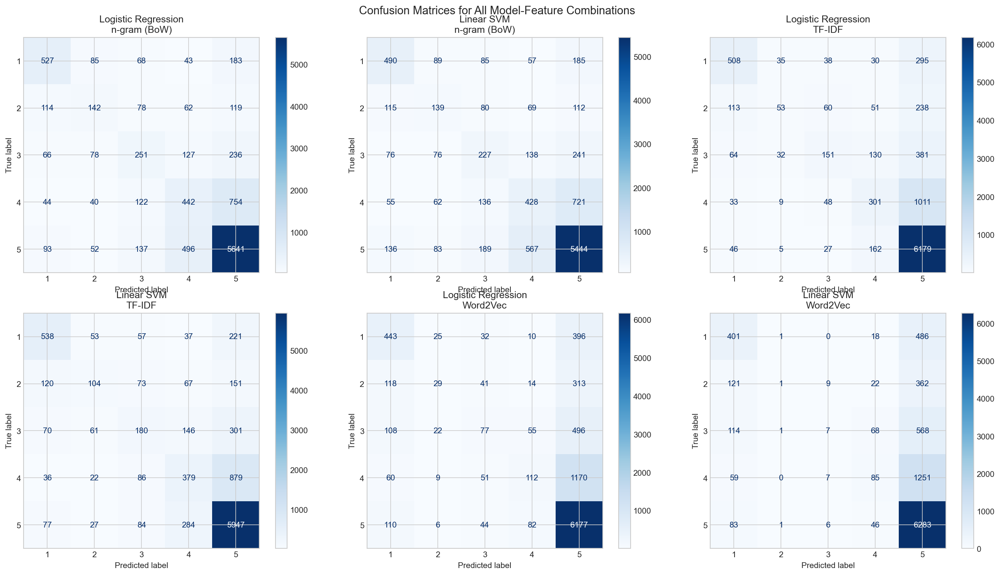

# CST8507 Assignment 1: Comparative Analysis of Text Representation

**Student:** Peng Wang
**Student Number:** 041107730
**Course:** CST8507 – Natural Language Processing
**Date:** February 2026

## 1. Introduction

This report presents a comparative analysis of text representation techniques for classifying Amazon product reviews into five rating categories (1–5 stars). The goal is to identify the best combination of feature representation and machine learning classifier for this multi-class text classification task.

Three feature extraction methods are compared:

- **n-gram (Bag of Words):** Counts word and bigram frequencies
- **TF-IDF:** Weights term frequency by inverse document frequency
- **Word2Vec:** Learns dense semantic word embeddings

Each feature representation is evaluated with two classifiers:

- **Logistic Regression:** Probabilistic linear classifier using softmax
- **Linear SVM:** Maximum-margin classifier using hinge loss

## 2. Dataset

The dataset is the **Amazon Reviews** dataset from Kaggle (`Reviews.csv`), containing product reviews with associated star ratings (Score: 1–5).

- **Original size:** 568,454 records
- **Sampled subset:** 50,000 records (random sampling with `random_state=42`)
- **Columns used:** `Score` (label, 1–5) and `Text` (review text)
- **Missing values:** None after cleaning

The class distribution is imbalanced:

| Score | Count  | Percentage |
| :---- | :----- | :--------- |
| 1     | 4,528  | 9.1%       |
| 2     | 2,576  | 5.2%       |
| 3     | 3,791  | 7.6%       |
| 4     | 7,008  | 14.0%      |
| 5     | 32,097 | 64.2%      |

Score 5 is the most frequent class (64.2%) and Score 2 the least (5.2%). Stratified splitting was used to preserve this distribution in both training (40,000) and test (10,000) sets.

## 3. Data Preprocessing

The dataset is first split into training (80%) and test (20%) sets **before** any preprocessing, to prevent data leakage. Preprocessing is then applied to each review text through a multi-step pipeline.

### Preprocessing Steps

1. **Lowercasing:** Convert all text to lowercase to ensure case-insensitive matching (e.g., "Good" → "good").

2. **HTML Tag Removal:** Remove HTML tags such as ` ` using regex pattern `<[^>]+>`.

3. **Punctuation and Special Character Removal:** Remove all non-alphabetic characters, retaining only letters and spaces.

4. **Extra Whitespace Removal:** Collapse multiple spaces into a single space and strip leading/trailing whitespace.

5. **Tokenization:** Split text into individual word tokens using NLTK's `word_tokenize()`.

6. **Stop Word Removal:** Remove common English stop words (e.g., "the", "is", "a") using NLTK's built-in stop word list.

7. **Lemmatization:** Reduce words to their dictionary base form using NLTK's `WordNetLemmatizer` (e.g., "running" → "run").

8. **Short Token Removal:** Remove tokens shorter than 2 characters.

### Preprocessing Example

| Stage    | Text                                                                                  |
| :------- | :------------------------------------------------------------------------------------ |
| Original | "Having tried a couple of other brands of gluten-free sandwich cookies, these are..." |
| Cleaned  | "tried couple brand gluten free sandwich cooky best bunch crunchy true texture re..." |

After preprocessing, the average number of tokens per review is **39.2**.

### Rationale

- **Lowercasing and normalization** reduce vocabulary size without losing meaning
- **HTML and punctuation removal** eliminate noise irrelevant to sentiment
- **Stop word removal** reduces dimensionality and focuses on content-bearing words
- **Lemmatization** groups word variants together (e.g., "running/ran/runs" → "run")
- **Splitting before preprocessing** prevents test data from influencing the vocabulary

## 4. Feature Extraction

### 4.1 n-gram (Bag of Words)

- **Method:** `CountVectorizer` with `ngram_range=(1, 2)` and `max_features=10,000`
- **Output:** Sparse matrix of shape [samples × 10,000]

The BoW model represents each document as a vector of word/bigram frequencies. Bigrams (e.g., "not good") capture some local context that unigrams miss.

### 4.2 TF-IDF

- **Method:** `TfidfVectorizer` with `ngram_range=(1, 2)` and `max_features=10,000`
- **Output:** Sparse matrix of shape [samples × 10,000], L2-normalized

TF-IDF extends BoW by weighting each term: TF-IDF = TF × IDF. This downweights common terms and upweights rare but informative terms.

### 4.3 Word2Vec

- **Method:** `gensim.models.Word2Vec` trained on the training set
- **Parameters:** `vector_size=100`, `window=5`, `min_count=2`
- **Vocabulary size:** 18,939 words
- **Document vector:** Mean pooling of all word vectors
- **Output:** Dense matrix of shape [samples × 100]

Word2Vec learns dense word representations that capture semantic relationships. The document vector is the average of all word vectors in the review.

## 5. Modeling

Two classifiers are trained on each of the three feature representations, resulting in **6 model-feature combinations**.

### 5.1 Logistic Regression

- `LogisticRegression(max_iter=1000, random_state=42)`
- Maps features to class probabilities via softmax, predicts the highest-probability class

### 5.2 Linear SVM

- `LinearSVC(max_iter=1000, dual="auto", random_state=42)`
- Finds the maximum-margin hyperplane separating classes, effective for high-dimensional sparse data

## 6. Model Evaluation

All 6 models are evaluated on the same test set (10,000 samples).

### 6.1 Results Summary

| Feature Type | Model               | Accuracy   | F-score    |
| :----------- | :------------------ | :--------- | :--------- |
| n-gram (BoW) | Logistic Regression | 0.7003     | 0.6881     |
| n-gram (BoW) | Linear SVM          | 0.6728     | 0.6658     |
| TF-IDF       | Logistic Regression | **0.7192** | 0.6716     |
| TF-IDF       | Linear SVM          | 0.7148     | **0.6860** |
| Word2Vec     | Logistic Regression | 0.6838     | 0.6110     |
| Word2Vec     | Linear SVM          | 0.6777     | 0.5840     |

**Best model:** Logistic Regression + TF-IDF (Accuracy: 0.7192, F1: 0.6716)

### 6.2 Confusion Matrices

The confusion matrices for all 6 model-feature combinations are shown below:

Key observations:

- **Diagonal dominance:** All models show strong diagonal values for classes 1 and 5 (extreme ratings), indicating extreme sentiments are easier to classify.
- **Mid-range confusion:** Classes 2, 3, and 4 are frequently confused with each other, as the sentiment differences between adjacent scores are subtle.
- **Class 5 bias:** Due to the class imbalance (64.2% Score 5), models tend to over-predict class 5, especially for Word2Vec features.
- **Class 3 difficulty:** Class 3 (neutral) is the most commonly misclassified, often predicted as class 4 or class 5.

### 6.3 Results Interpretation

**Feature representation comparison:**

1. **TF-IDF** achieves the best accuracy (0.7192) among the three representations. The IDF weighting effectively highlights discriminative terms while downweighting common words, providing a more informative signal than raw BoW counts.

2. **n-gram (BoW)** performs slightly below TF-IDF (0.7003 vs 0.7192). While it captures term frequency, it does not account for the relative importance of terms across the corpus.

3. **Word2Vec** underperforms sparse representations (0.6838 best). This is likely because: (a) average pooling dilutes strong sentiment signals from individual words, (b) the 100-dimensional dense vectors may not capture enough discriminative detail compared to 10,000-dimensional sparse representations, and (c) the model was trained on the limited training corpus.

**Classifier comparison:**

- **Logistic Regression** outperforms Linear SVM on BoW and TF-IDF features, while both are comparable on Word2Vec.
- Both classifiers are effective linear classifiers for high-dimensional text data.

## 7. Hyperparameter Tuning

Hyperparameter tuning was performed on the best-performing feature type (**TF-IDF**) using `GridSearchCV` with 5-fold cross-validation.

### 7.1 Logistic Regression Tuning

**Parameters searched:**

- `C`: [0.01, 0.1, 1.0, 10.0] — inverse regularization strength
- `solver`: ['lbfgs', 'saga'] — optimization algorithm

**Best parameters:** `C=1.0, solver='saga'`
**Best CV accuracy:** 0.7159
**Test accuracy (tuned):** 0.7184
**Test F1-score (tuned):** 0.6709

### 7.2 Linear SVM Tuning

**Parameters searched:**

- `C`: [0.01, 0.1, 1.0, 10.0] — regularization parameter

**Best parameters:** `C=1.0`
**Best CV accuracy:** 0.7108
**Test accuracy (tuned):** 0.7148
**Test F1-score (tuned):** 0.6860

### 7.3 Tuning Summary

| Model               | Best Params          | Accuracy | F1-score |
| :------------------ | :------------------- | :------- | :------- |
| Logistic Regression | C=1.0, solver='saga' | 0.7184   | 0.6709   |
| Linear SVM          | C=1.0                | 0.7148   | 0.6860   |

The default parameter `C=1.0` turned out to be optimal for both models, which suggests that the default regularization strength is well-suited for this dataset. The tuning confirmed that the initial model was already near-optimal.

## 8. Error Analysis (Part 2)

### 8.1 Error Statistics

| Model-Feature Combination          | Misclassified Samples |
| :--------------------------------- | :-------------------- |
| n-gram (BoW) + Logistic Regression | 2,997                 |
| n-gram (BoW) + Linear SVM          | 3,272                 |
| TF-IDF + Logistic Regression       | 2,808                 |
| TF-IDF + Linear SVM                | 2,852                 |
| Word2Vec + Logistic Regression     | 3,162                 |
| Word2Vec + Linear SVM              | 3,223                 |

### 8.2 Error Categories

| Category                                        | Count |
| :---------------------------------------------- | :---- |
| Misclassified by ALL representations            | 2,310 |
| Misclassified by BoW/TF-IDF ONLY (not Word2Vec) | 1,108 |
| Misclassified by Word2Vec ONLY (not BoW/TF-IDF) | 563   |

### 8.3 Analysis of Misclassification Patterns

**Samples misclassified by ALL representations (2,310 samples):**

These are inherently difficult examples that no feature representation can handle correctly.

_Example 1:_ A review with true label 3 was predicted as 5 by all models:

> "I signed up to get this as a 'subscribe & save' item. It was briefly under ten dollars..."

This review contains a mix of factual statements and mild complaints, making the sentiment ambiguous.

_Example 2:_ A review with true label 5 was predicted as 1 by all models:

> "Not only kept her clear, she put much needed weight on after diagnosed with a chronic illness..."

The presence of negative-sounding words ("chronic illness", "not") misleads all models despite the overall positive sentiment.

**Samples misclassified by BoW/TF-IDF ONLY (1,108 samples):**

These cases succeed with Word2Vec but fail with sparse representations, indicating a need for semantic understanding.

_Example:_ A true label 5 review was predicted as 4 by BoW but correctly as 5 by Word2Vec:

> "This is a great new flavor of Kool-Aid, a non-carbonated drink..."

Word2Vec captures the overall positive semantic tone, while BoW gets distracted by neutral descriptive terms.

**Samples misclassified by Word2Vec ONLY (563 samples):**

These cases succeed with sparse representations but fail with embeddings.

_Example:_ A true label 1 review was correctly predicted as 1 by BoW/TF-IDF but predicted as 5 by Word2Vec:

> "This tastes pretty much like your plain old Liptons tea. I LOVE cassis flavor and was so looking forward..."

Strong sentiment keywords ("LOVE", "looking forward") are directly captured by BoW/TF-IDF, but averaging these with neutral words dilutes the signal in Word2Vec.

### 8.4 Linguistic and Semantic Error Causes

| Error Cause     | Description                               | Affected Representations |
| :-------------- | :---------------------------------------- | :----------------------- |
| Ambiguity       | Words with different meanings in contexts | All                      |
| Sarcasm/Irony   | Positive words, negative intent           | All                      |
| Mixed sentiment | Both positive and negative in one review  | All                      |
| Short text      | Insufficient features for prediction      | Especially Word2Vec      |
| Class boundary  | Subtle differences between scores 2–4     | All                      |
| Synonym usage   | Uncommon words for common sentiments      | BoW/TF-IDF               |
| Signal dilution | Key sentiment words averaged out          | Word2Vec                 |

## 9. Conclusion

1. **TF-IDF** is the most effective feature representation for this task, achieving the highest accuracy of **0.7192**.

2. **n-gram (BoW)** performs comparably but without IDF weighting to downweight common terms.

3. **Word2Vec** with mean pooling underperforms sparse representations due to signal dilution in averaging.

4. **Logistic Regression** and **Linear SVM** achieve similar performance, with LR slightly better on TF-IDF.

5. **Hyperparameter tuning** confirmed that default parameters (C=1.0) are near-optimal for both classifiers.

6. **Error analysis** reveals most errors occur at class boundaries (scores 2–4). Sarcasm, mixed sentiment, and labeling noise are common error causes across all representations.

## References

1. Amazon Reviews Dataset: https://www.kaggle.com/datasets/jagdishchavan/amazon-reviews
2. scikit-learn documentation: https://scikit-learn.org/stable/
3. NLTK documentation: https://www.nltk.org/
4. Gensim Word2Vec: https://radimrehurek.com/gensim/models/word2vec.html
