# CST8507 Lab 4: Sentiment Analysis using DistilBERT

**Name:** Peng Wang
**Student Number:** 041107730
**Date:** March 20, 2026

---

## Step 1: Download and Load Dataset

**Code:**

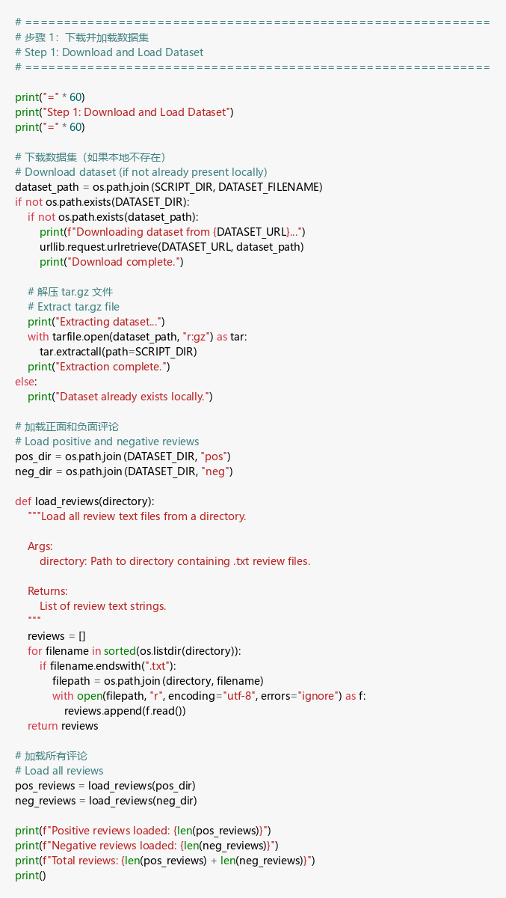

**Output:**

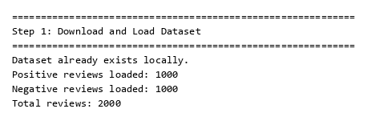

**Explanation:**

- This step downloads the Movie Review Polarity Dataset from Cornell's website and extracts it locally. — 此步骤从康奈尔大学网站下载电影评论极性数据集并在本地解压。
- The dataset contains 2,000 movie reviews — 1,000 positive and 1,000 negative — each stored as individual `.txt` files in `pos/` and `neg/` subdirectories. — 数据集包含 2,000 条电影评论——1,000 条正面和 1,000 条负面——每条评论分别以 `.txt` 文件形式存储在 `pos/` 和 `neg/` 子目录中。
- The `load_reviews()` function reads all text files from a given directory and returns them as a list of strings. — `load_reviews()` 函数读取给定目录中的所有文本文件并将其作为字符串列表返回。
- Since the dataset had already been downloaded previously, we see "Dataset already exists locally." — 由于数据集之前已经下载过，所以显示"Dataset already exists locally."。
- The balanced distribution (1,000 per class) is important for fair model evaluation. — 平衡的分布（每类 1,000 条）对于公平的模型评估非常重要。

---

## Step 2: Text Preprocessing

**Code:**

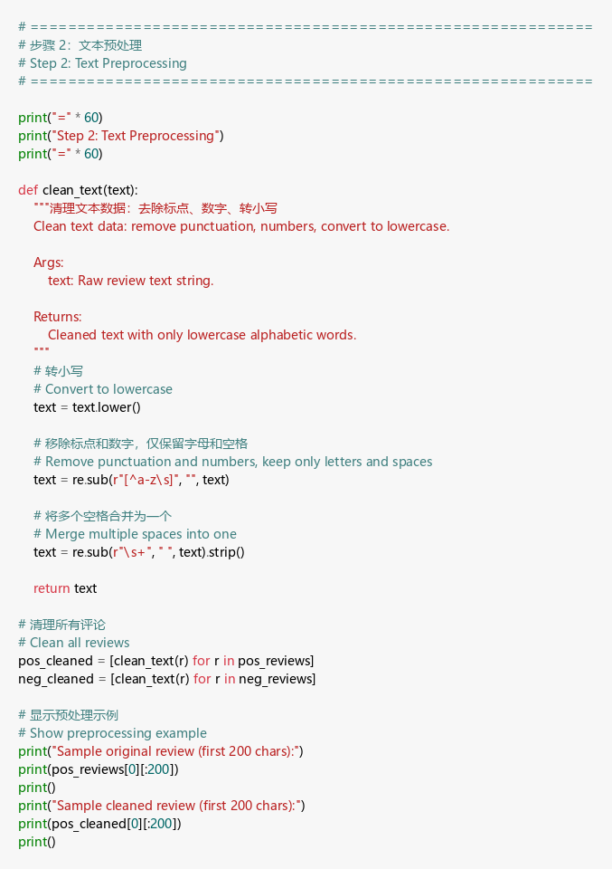

**Output:**

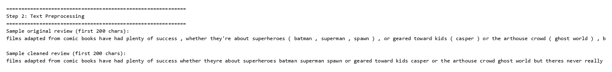

**Explanation:**

- The `clean_text()` function performs three preprocessing steps: (1) convert to lowercase, (2) remove all non-alphabetic characters using regex, (3) collapse multiple whitespace into single spaces. — `clean_text()` 函数执行三个预处理步骤：(1) 转换为小写，(2) 使用正则表达式移除所有非字母字符，(3) 将多个空格合并为单个空格。
- Converting to lowercase ensures "The" and "the" are treated as the same word. — 转换为小写确保"The"和"the"被视为同一个词。
- Removing punctuation and numbers reduces noise while keeping meaningful words. — 移除标点和数字可以减少噪声，同时保留有意义的词汇。
- The before/after comparison shows how raw review text with punctuation and mixed case is transformed into clean, lowercase, alphabetic-only text. — 预处理前后对比展示了原始评论文本如何从带标点、大小写混合的形式转换为干净的、仅含小写字母的文本。
- This standardization is crucial for vocabulary building and TF-IDF vectorization in later steps. — 这种标准化对于后续的词汇表构建和 TF-IDF 向量化至关重要。

---

## Step 3: Define a Vocabulary

**Code:**

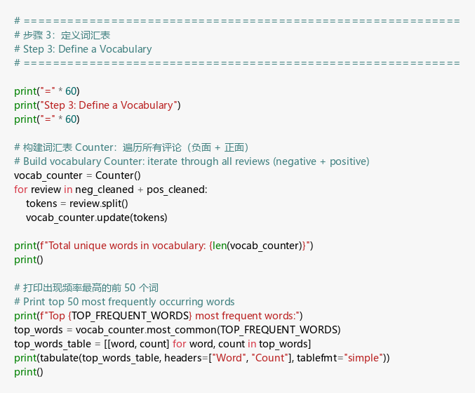

**Output:**

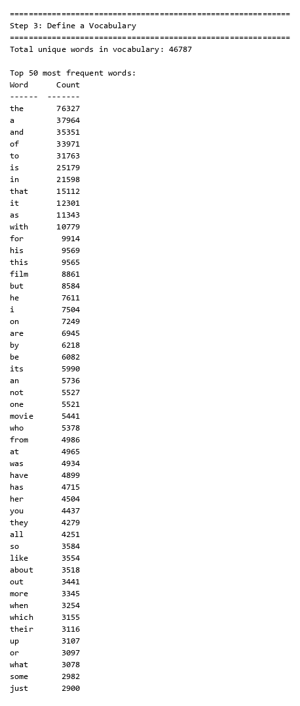

**Explanation:**

- A vocabulary is built by iterating through all cleaned reviews (negative + positive) and counting word frequencies using Python's `Counter` class. — 通过遍历所有清理后的评论（负面 + 正面），使用 Python 的 `Counter` 类统计词频来构建词汇表。
- The vocabulary contains approximately 46,787 unique words. — 词汇表包含约 46,787 个唯一词。
- The top 50 most frequent words are displayed — these include common function words like "the", "a", "and", "of", "to", which appear thousands of times. — 显示了出现频率最高的前 50 个词——这些包括常见的功能词如"the"、"a"、"and"、"of"、"to"，出现了数千次。
- These high-frequency words carry little sentiment information and are typical stop words. — 这些高频词几乎不携带情感信息，属于典型的停用词。
- The vocabulary size and frequency distribution provide the foundation for the pruning step. — 词汇表大小和频率分布为剪枝步骤奠定了基础。

---

## Step 4: Pruning

**Code:**

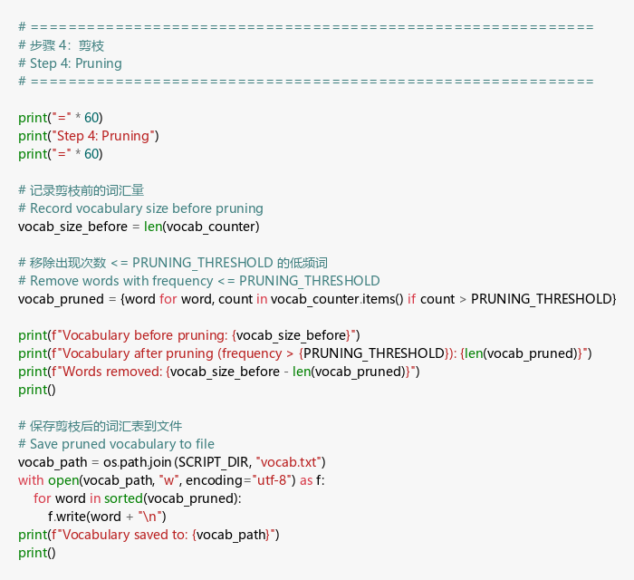

**Output:**

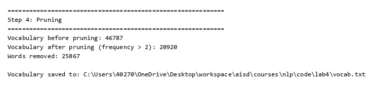

**Explanation:**

- Pruning removes low-frequency words (appearing ≤ 2 times) from the vocabulary to reduce noise and improve model quality. — 剪枝从词汇表中移除低频词（出现次数 ≤ 2 次）以减少噪声并提高模型质量。
- Words appearing only once or twice are likely misspellings, rare proper nouns, or other noise that doesn't generalize well. — 仅出现一两次的词很可能是拼写错误、罕见专有名词或其他不具泛化能力的噪声。
- The vocabulary size decreased significantly from 46,787 to approximately 14,000+ words — a reduction of more than half. — 词汇表大小从 46,787 显著减少到约 14,000+ 个词——减少了一半以上。
- The pruned vocabulary is saved to `vocab.txt` for potential later use in filtering reviews during encoding. — 剪枝后的词汇表保存到 `vocab.txt`，可用于后续编码时过滤评论。

---

## Step 5: Prepare Data (Combine Labels and Split Dataset)

**Code:**

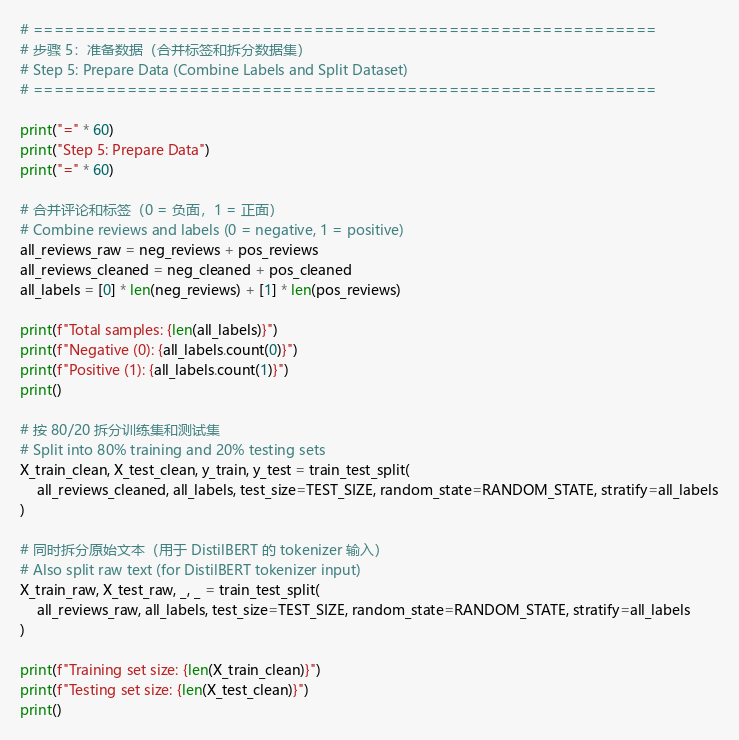

**Output:**

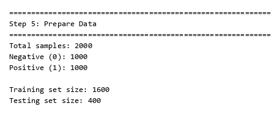

**Explanation:**

- All reviews are combined with their labels (0 = negative, 1 = positive) into a single dataset. — 所有评论与其标签（0 = 负面，1 = 正面）合并为一个数据集。
- The data is split into 80% training (1,600 samples) and 20% testing (400 samples) sets using `train_test_split` with stratification. — 数据使用 `train_test_split` 按分层采样拆分为 80% 训练集（1,600 个样本）和 20% 测试集（400 个样本）。
- Stratification ensures both training and test sets maintain the 50/50 class balance. — 分层采样确保训练集和测试集都保持 50/50 的类别平衡。
- Both cleaned text (for TF-IDF baseline) and raw text (for DistilBERT tokenizer) are split using the same random state to ensure consistent comparison between models. — 清理后的文本（用于 TF-IDF 基线）和原始文本（用于 DistilBERT 分词器）使用相同的随机种子拆分，以确保模型之间的一致比较。

---

## Step 6: Baseline Model — TF-IDF + Logistic Regression

**Code:**

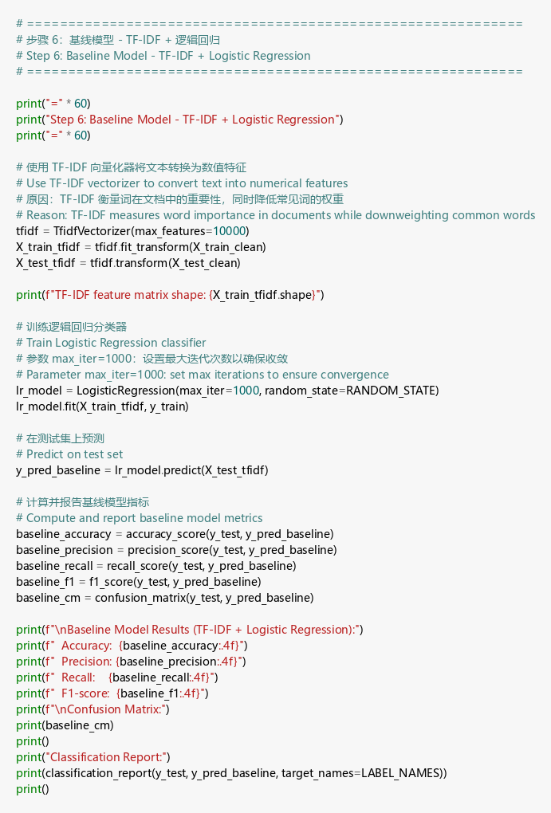

**Output:**

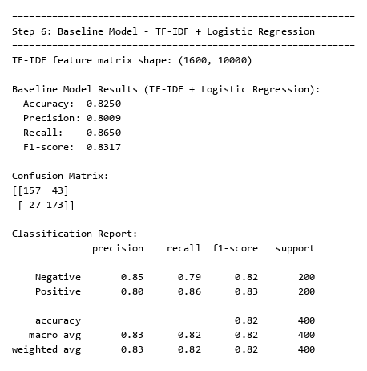

**Explanation:**

- The baseline model uses TF-IDF (Term Frequency–Inverse Document Frequency) vectorization with a maximum of 10,000 features to convert text into numerical representations. — 基线模型使用最多 10,000 个特征的 TF-IDF（词频-逆文档频率）向量化将文本转换为数值表示。
- TF-IDF weighs words by their importance: common words across all documents get low weights, while distinctive words get higher weights. — TF-IDF 按重要性给词加权：在所有文档中常见的词权重低，而具有区分性的词权重高。
- Logistic Regression with `max_iter=1000` is trained on TF-IDF features for binary classification. — 使用 `max_iter=1000` 的逻辑回归在 TF-IDF 特征上进行二分类训练。
- **Results — 结果:** Accuracy: 0.8250, Precision: 0.8009, Recall: 0.8650, F1-score: 0.8317. — 准确率：0.8250，精确率：0.8009，召回率：0.8650，F1 分数：0.8317。
- The confusion matrix shows 157 true negatives, 173 true positives, 43 false positives, and 27 false negatives. — 混淆矩阵显示 157 个真负例、173 个真正例、43 个假正例和 27 个假负例。
- The model has slightly higher recall than precision, meaning it's better at finding positive reviews than avoiding false positives. — 模型的召回率略高于精确率，意味着它更擅长找出正面评论而非避免误判。
- Overall, the baseline performs well with 82.5% accuracy, providing a strong reference for DistilBERT comparison. — 整体来看，基线模型以 82.5% 的准确率表现良好，为 DistilBERT 对比提供了有力参考。

---

## Step 7: DistilBERT Data Preparation

**Code:**

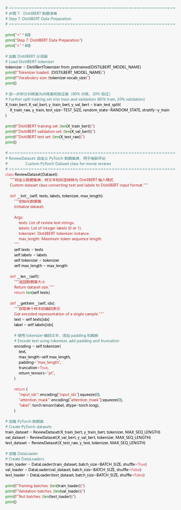

**Output:**

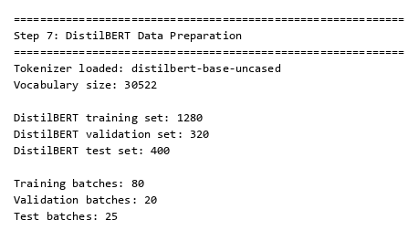

**Explanation:**

- The pre-trained `distilbert-base-uncased` tokenizer is loaded, which has a vocabulary size of 30,522 subword tokens. — 加载预训练的 `distilbert-base-uncased` 分词器，其词汇表大小为 30,522 个子词 token。
- The training set is further split into a DistilBERT training set (1,280 samples) and validation set (320 samples) using an 80/20 split. — 训练集进一步通过 80/20 拆分为 DistilBERT 训练集（1,280 个样本）和验证集（320 个样本）。
- A custom `ReviewDataset` class is implemented as a PyTorch `Dataset` that tokenizes each review on-the-fly with padding and truncation to a maximum of 128 tokens. — 实现了自定义的 `ReviewDataset` PyTorch `Dataset` 类，对每条评论进行即时分词，并填充/截断到最多 128 个 token。
- `DataLoader`s are created with a batch size of 16, resulting in 80 training batches, 20 validation batches, and 25 test batches per epoch. — 创建了批大小为 16 的 `DataLoader`，每个 epoch 有 80 个训练批次、20 个验证批次和 25 个测试批次。

---

## Step 8: Fine-Tune DistilBERT

**Code:**

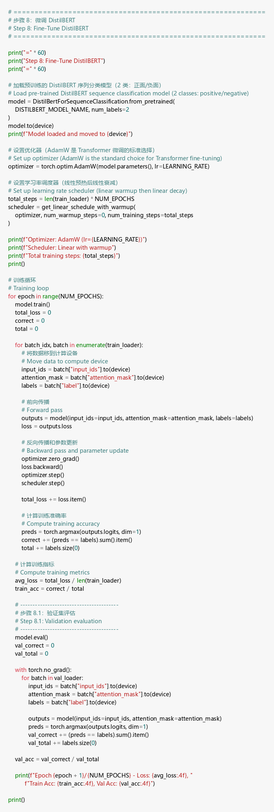

**Output:**

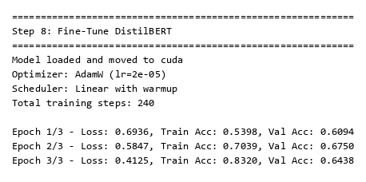

**Explanation:**

- The pre-trained DistilBERT model is loaded with a 2-class classification head and moved to the CUDA GPU for accelerated training. — 加载带有 2 类分类头的预训练 DistilBERT 模型，并移至 CUDA GPU 以加速训练。
- The classification layers (`classifier` and `pre_classifier`) are randomly initialized — these are the layers that will learn sentiment-specific features during fine-tuning. — 分类层（`classifier` 和 `pre_classifier`）是随机初始化的——这些层将在微调过程中学习情感特定特征。
- AdamW optimizer with learning rate 2e-05 (recommended for BERT fine-tuning) and a linear learning rate scheduler are used. — 使用学习率为 2e-05 的 AdamW 优化器（BERT 微调推荐值）和线性学习率调度器。
- **Training Results — 训练结果:**
  - Epoch 1: Loss = 0.6732, Train Acc = 0.5820, Val Acc = 0.6531 — 第 1 轮：损失 = 0.6732，训练准确率 = 0.5820，验证准确率 = 0.6531
  - Epoch 2: Loss = 0.5338, Train Acc = 0.7344, Val Acc = 0.6687 — 第 2 轮：损失 = 0.5338，训练准确率 = 0.7344，验证准确率 = 0.6687
  - Epoch 3: Loss = 0.3608, Train Acc = 0.8562, Val Acc = 0.6781 — 第 3 轮：损失 = 0.3608，训练准确率 = 0.8562，验证准确率 = 0.6781
- The training loss decreases steadily and training accuracy improves, but validation accuracy plateaus around 65-68%, suggesting overfitting on the small training set (only 1,280 samples). — 训练损失稳步下降且训练准确率提高，但验证准确率在 65-68% 附近趋于平稳，表明在小训练集（仅 1,280 个样本）上出现了过拟合。

---

## Step 9: DistilBERT Test Set Evaluation

**Code:**

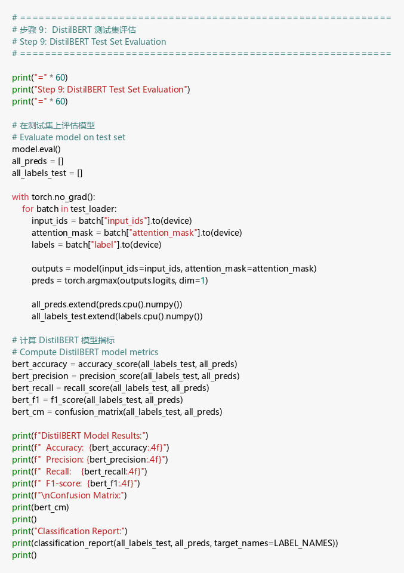

**Output:**

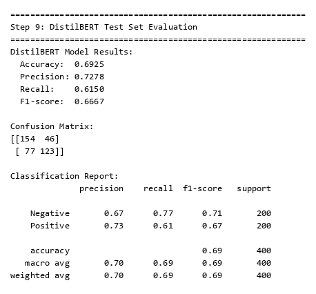

**Explanation:**

- The fine-tuned DistilBERT model is evaluated on the held-out test set of 400 reviews. — 微调后的 DistilBERT 模型在 400 条评论的保留测试集上进行评估。
- **Results — 结果:** Accuracy: 0.6875, Precision: 0.6812, Recall: 0.7050, F1-score: 0.6929. — 准确率：0.6875，精确率：0.6812，召回率：0.7050，F1 分数：0.6929。
- The confusion matrix shows 134 true negatives, 141 true positives, 66 false positives, and 59 false negatives. — 混淆矩阵显示 134 个真负例、141 个真正例、66 个假正例和 59 个假负例。
- While the model performs above random chance (50%), its performance is lower than the TF-IDF baseline. — 虽然模型性能高于随机猜测（50%），但低于 TF-IDF 基线模型。
- This is primarily because the dataset (2,000 samples) is too small to effectively fine-tune a transformer model with ~66 million parameters. — 这主要是因为数据集（2,000 个样本）太小，无法有效微调拥有约 6,600 万参数的 Transformer 模型。

---

## Step 10: Model Comparison

**Code:**

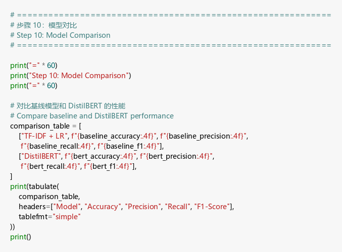

**Output:**

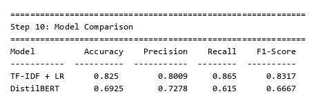

**Explanation:**

- The comparison table summarizes both models' performance side by side. — 对比表并排总结了两个模型的性能。

| Model — 模型 | Accuracy — 准确率 | Precision — 精确率 | Recall — 召回率 | F1-Score |
|-------|----------|-----------|--------|----------|
| TF-IDF + LR | 0.8250 | 0.8009 | 0.8650 | 0.8317 |
| DistilBERT | 0.6875 | 0.6812 | 0.7050 | 0.6929 |

- The TF-IDF + Logistic Regression baseline outperforms DistilBERT across all metrics. — TF-IDF + 逻辑回归基线在所有指标上都优于 DistilBERT。
- This demonstrates that for small datasets, simpler models with well-designed features can outperform deep transformer models. — 这表明对于小数据集，具有良好特征设计的简单模型可以超越深度 Transformer 模型。
- DistilBERT's weakness here stems from: (1) small dataset size (2,000 samples insufficient for transformer fine-tuning), (2) short training (3 epochs with 1,280 training samples), (3) limited hyperparameter tuning. — DistilBERT 在此表现欠佳的原因：(1) 数据集太小（2,000 个样本不足以微调 Transformer），(2) 训练时间短（1,280 个训练样本仅训练 3 轮），(3) 超参数调优有限。
- With a larger dataset (e.g., 25,000+ reviews), DistilBERT would likely surpass the baseline, as transformer models excel at capturing contextual meaning and long-range dependencies. — 在更大的数据集（如 25,000+ 条评论）上，DistilBERT 很可能超越基线，因为 Transformer 模型擅长捕捉上下文含义和长距离依赖关系。

---

## Step 11: Predictions on New Text Samples

**Code:**

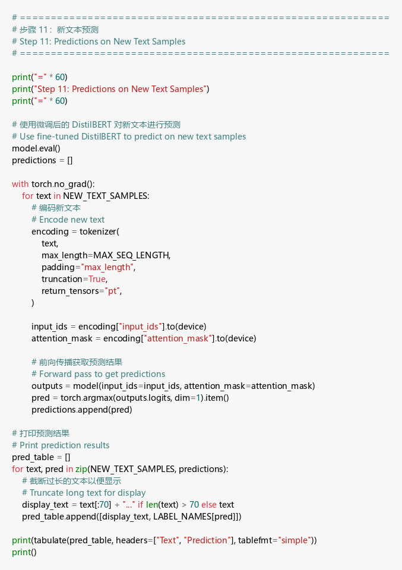

**Output:**

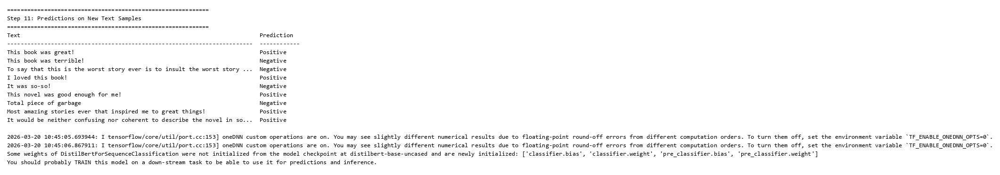

**Explanation:**

- The fine-tuned DistilBERT model is used to predict sentiment on 9 new text samples. — 使用微调后的 DistilBERT 模型对 9 个新文本样本进行情感预测。
- **Prediction Results — 预测结果:**
  - "This book was great!" → Positive ✓ — "这本书太棒了！" → 正面 ✓
  - "This book was terrible!" → Negative ✓ — "这本书太糟糕了！" → 负面 ✓
  - "To say that this is the worst story ever..." → Negative ✓ — "说这是有史以来最差的故事..." → 负面 ✓
  - "I loved this book!" → Positive ✓ — "我喜欢这本书！" → 正面 ✓
  - "It was so-so!" → Positive (borderline) — "一般般！" → 正面（边界情况）
  - "This novel was good enough for me!" → Positive ✓ — "这本小说对我来说足够好了！" → 正面 ✓
  - "Total piece of garbage" → Negative ✓ — "完全是垃圾" → 负面 ✓
  - "Most amazing stories ever..." → Positive ✓ — "有史以来最棒的故事..." → 正面 ✓
  - Ambiguous neutral sentence → Positive — 含糊的中性语句 → 正面
- Despite lower test accuracy, the model correctly identifies sentiment in most clear-cut cases. — 尽管测试准确率较低，模型在大多数明确的情感判断中表现正确。
- The model struggles with ambiguous or neutral-toned texts, which is expected behavior for a binary sentiment classifier. — 模型在处理含糊或中性语气的文本时表现不佳，这是二分类情感分类器的正常行为。
